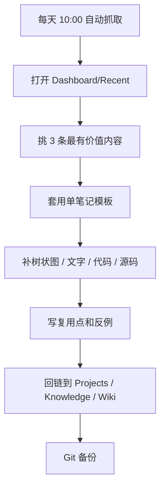

# 高级玩法总控

> 这里不讲概念，只放能直接用的骚操作。

## 一眼看穿

- 今天抓了什么：[[Dashboard/Recent]]
- 最近学了什么：[[Dashboard/Learning]]
- 正在做什么：[[Dashboard/Projects]]
- 去哪里写深度分析：[[Wiki/_templates/meaningful-analysis]]
- 直接看完整样稿：[[Wiki/grok-build-meaningful-analysis]]

## 骚操作菜单

### 1. 单笔记项目模式

- 一个项目只保留一篇主笔记。
- 所有结论、流程、代码、源码、复盘都写进这一篇。
- 相关碎片只做链接，不做拆页。
- 适合：项目研究、开源项目拆解、方案评估、竞品分析。

### 2. 源码展开模式

- 不要只贴摘要。
- 关键文件原样贴出来。
- 关键函数保留上下文。
- 每段源码后面补“为什么重要”“删掉会怎样”“能不能复用”。

### 3. 今日抓取自动复盘

- 每天 10 点先抓最新。
- 抓完后先看 `Dashboard/Recent`。
- 挑当天最有价值的 3 条，转成一页深度分析。
- 这样日更不是堆积，而是沉淀。

### 4. 交叉链接放大器

- 同一个概念至少挂到 3 个位置：总入口、专题页、样稿页。
- 新内容写完后，立刻补回指向。
- 让笔记之间互相“长腿”。

### 5. 复盘回路

- 周末看一次 `Dashboard/Learning`。
- 每月看一次 `Dashboard/Projects`。
- 每次只问三件事：什么最有价值、什么该删、什么该重写。

### 6. Git 备份模式

- 用 Obsidian Git 保留版本历史。
- 让模板、样稿、控制台都能回滚。
- 适合你这种会持续改骨架的人。

### 7. 难题记录模式

- 把失败原因单独记在 `Knowledge` 或 `Sessions`。
- 同一个问题下次再来时，先查失败记录。
- 这能避免反复踩坑。

### 8. 回忆卡模式

- 把最关键的判断拆成可背诵句。
- 比如“它是什么 / 为什么重要 / 怎么复用 / 风险在哪”。
- 配合 Spaced Repetition 很强。

## 可执行工作流

## 今日清单

- [ ] 看 `Dashboard/Recent`
- [ ] 挑一篇内容写成单笔记
- [ ] 把源码展开，不折叠
- [ ] 把结论回链到总入口
- [ ] 用 Git 备份一下
