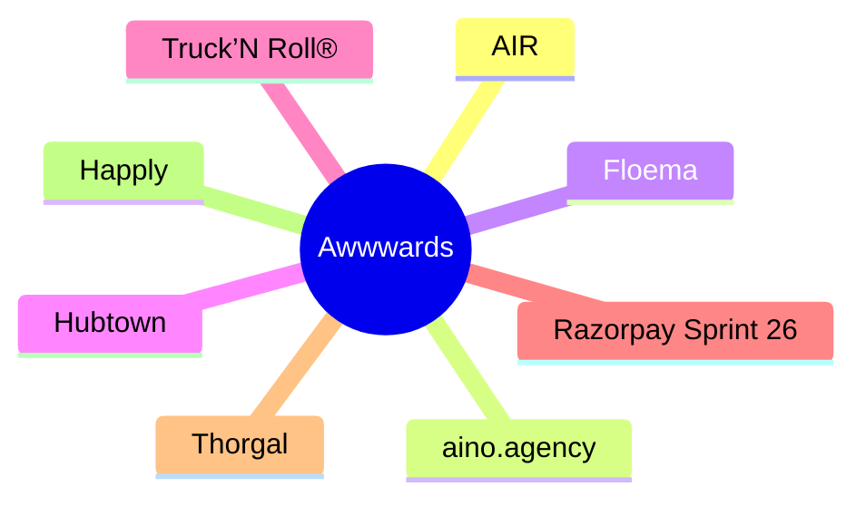

# 🏆 Awwwards Top 8 (2026-06-11)

## 思维导图

## 列表（8 条）

### 1. AIR
- **链接**: [https://www.awwwards.com/sites/air-1](https://www.awwwards.com/sites/air-1)
- **发布**: Wed, 27 May 2026 00:00:00 +0000
- **简介**: The striking Grade A business center website

### 2. aino.agency
- **链接**: [https://www.awwwards.com/sites/aino-agency](https://www.awwwards.com/sites/aino-agency)
- **发布**: Wed, 20 May 2026 00:00:00 +0000
- **简介**: Aino rebuilt their site from scratch to explore what's possible with text as a medium. ASCII, 2D physics, real-time morphing - all at 30kb JS.

### 3. Floema
- **链接**: [https://www.awwwards.com/sites/floema](https://www.awwwards.com/sites/floema)
- **发布**: Wed, 13 May 2026 00:00:00 +0000
- **简介**: Floema designs and produces sustainable urban furniture and signage for natural spaces. Spaces for people, made for life.

### 4. Hubtown
- **链接**: [https://www.awwwards.com/sites/hubtown](https://www.awwwards.com/sites/hubtown)
- **发布**: Wed, 10 Jun 2026 00:00:00 +0000
- **简介**: Hubtown is one of India's leading real estate developers. Shaping the city of Mumbai for over 40 years.

### 5. Truck’N Roll®
- **链接**: [https://www.awwwards.com/sites/truckn-roll-r](https://www.awwwards.com/sites/truckn-roll-r)
- **发布**: Wed, 03 Jun 2026 00:00:00 +0000
- **简介**: Truck’N Roll® is a logistics company built for the fast world of live entertainment. For over three decades, we’ve been trusted to move the gear behind the biggest tours.

### 6. Razorpay Sprint 26
- **链接**: [https://www.awwwards.com/sites/razorpay-sprint-26](https://www.awwwards.com/sites/razorpay-sprint-26)
- **发布**: Tue, 26 May 2026 00:00:00 +0000
- **简介**: An immersive journey into the future of AI-led payments. Razorpay Sprint26 is about 100+ product updates brought to life through 100+ scroll and click triggered interactions.

### 7. Thorgal
- **链接**: [https://www.awwwards.com/sites/thorgal](https://www.awwwards.com/sites/thorgal)
- **发布**: Tue, 19 May 2026 00:00:00 +0000
- **简介**: A son of the stars, raised by Vikings, bound to neither. Thorgal, the Franco-Belgian saga by Van Hamme and Rosiński since 1977, now the official interactive edition, from Le Lombard.

### 8. Happly
- **链接**: [https://www.awwwards.com/sites/happly](https://www.awwwards.com/sites/happly)
- **发布**: Tue, 12 May 2026 00:00:00 +0000
- **简介**: Happly is a mood-based cannabis wellness brand offering precisely dosed, hemp-derived THC gummies designed to support specific everyday experiences.
