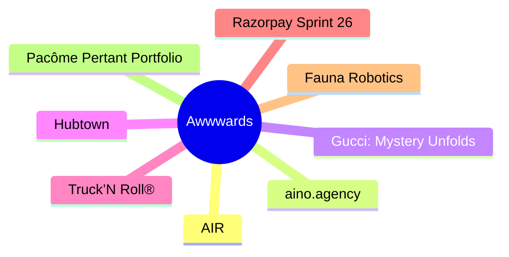

# 🏆 Awwwards Top 8 (2026-06-19)

## 思维导图

## 列表（8 条，0 条含全文）

### 1. AIR
- **链接**: [https://www.awwwards.com/sites/air-1](https://www.awwwards.com/sites/air-1)
- **发布**: Wed, 27 May 2026 00:00:00 +0000
- **简介**: The striking Grade A business center website

### 2. aino.agency
- **链接**: [https://www.awwwards.com/sites/aino-agency](https://www.awwwards.com/sites/aino-agency)
- **发布**: Wed, 20 May 2026 00:00:00 +0000
- **简介**: Aino rebuilt their site from scratch to explore what's possible with text as a medium. ASCII, 2D physics, real-time morphing - all at 30kb JS.

### 3. Gucci: Mystery Unfolds
- **链接**: [https://www.awwwards.com/sites/gucci-mystery-unfolds](https://www.awwwards.com/sites/gucci-mystery-unfolds)
- **发布**: Wed, 17 Jun 2026 00:00:00 +0000
- **简介**: Gucci transforms La Famiglia into an AI-powered mystery experience powered by Google Gemini, where users investigate through real-time conversations and clues.

### 4. Hubtown
- **链接**: [https://www.awwwards.com/sites/hubtown](https://www.awwwards.com/sites/hubtown)
- **发布**: Wed, 10 Jun 2026 00:00:00 +0000
- **简介**: Hubtown is one of India's leading real estate developers. Shaping the city of Mumbai for over 40 years.

### 5. Truck’N Roll®
- **链接**: [https://www.awwwards.com/sites/truckn-roll-r](https://www.awwwards.com/sites/truckn-roll-r)
- **发布**: Wed, 03 Jun 2026 00:00:00 +0000
- **简介**: Truck’N Roll® is a logistics company built for the fast world of live entertainment. For over three decades, we’ve been trusted to move the gear behind the biggest tours.

### 6. Razorpay Sprint 26
- **链接**: [https://www.awwwards.com/sites/razorpay-sprint-26](https://www.awwwards.com/sites/razorpay-sprint-26)
- **发布**: Tue, 26 May 2026 00:00:00 +0000
- **简介**: An immersive journey into the future of AI-led payments. Razorpay Sprint26 is about 100+ product updates brought to life through 100+ scroll and click triggered interactions.

### 7. Fauna Robotics
- **链接**: [https://www.awwwards.com/sites/fauna-robotics](https://www.awwwards.com/sites/fauna-robotics)
- **发布**: Tue, 16 Jun 2026 00:00:00 +0000
- **简介**: Fauna built Sprout to redefine humanoid robotics around coexistence, not replacement. O0 scaled the core brand into a storytelling system, shaping him as a capable yet playful companion

### 8. Pacôme Pertant Portfolio
- **链接**: [https://www.awwwards.com/sites/pacome-pertant-portfolio](https://www.awwwards.com/sites/pacome-pertant-portfolio)
- **发布**: Tue, 09 Jun 2026 00:00:00 +0000
- **简介**: Pacôme Pertant is a motion and sound designer based in Paris. He plays with rhythm and visual storytelling across 2D and 3D canvases to create emotional content.
