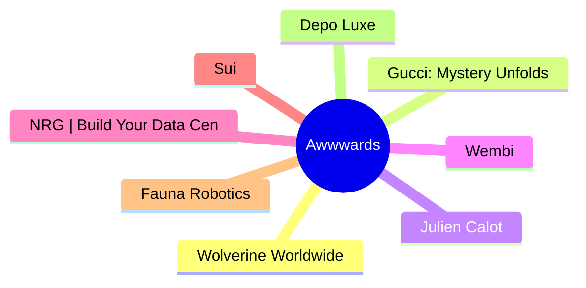

# 🏆 Awwwards Top 8 (2026-07-14)

## 思维导图

## 列表（8 条，0 条含全文）

### 1. Wolverine Worldwide
- **链接**: [https://www.awwwards.com/sites/wolverine-worldwide](https://www.awwwards.com/sites/wolverine-worldwide)
- **发布**: Wed, 24 Jun 2026 00:00:00 +0000
- **简介**: Wolverine Worldwide is the company behind Merrell, Saucony, Sperry, and Hush Puppies, with one mission: Make. Every Day. Better.

### 2. Gucci: Mystery Unfolds
- **链接**: [https://www.awwwards.com/sites/gucci-mystery-unfolds](https://www.awwwards.com/sites/gucci-mystery-unfolds)
- **发布**: Wed, 17 Jun 2026 00:00:00 +0000
- **简介**: Gucci transforms La Famiglia into an AI-powered mystery experience powered by Google Gemini, where users investigate through real-time conversations and clues.

### 3. Julien Calot
- **链接**: [https://www.awwwards.com/sites/julien-calot](https://www.awwwards.com/sites/julien-calot)
- **发布**: Wed, 08 Jul 2026 00:00:00 +0000
- **简介**: Visual artist & multidisciplinary creativeWorks between Paris and New York

### 4. Wembi
- **链接**: [https://www.awwwards.com/sites/wembi](https://www.awwwards.com/sites/wembi)
- **发布**: Wed, 01 Jul 2026 00:00:00 +0000
- **简介**: Wembi instantly improves the performance of any device, machine, or digital system by creating its virtual twin.

### 5. NRG | Build Your Data Center
- **链接**: [https://www.awwwards.com/sites/nrg-build-your-data-center](https://www.awwwards.com/sites/nrg-build-your-data-center)
- **发布**: Tue, 30 Jun 2026 00:00:00 +0000
- **简介**: Powering the data centers that support what's next. With every AI breakthrough and leap forward, NRG is building a brighter tomorrow.

### 6. Sui
- **链接**: [https://www.awwwards.com/sites/sui](https://www.awwwards.com/sites/sui)
- **发布**: Tue, 23 Jun 2026 00:00:00 +0000
- **简介**: Sui is a Layer 1 blockchain platform for scalable Web3 applications and decentralized infrastructure. The new brand and website were created to reflect the Sui’s evolving ecosystem.

### 7. Fauna Robotics
- **链接**: [https://www.awwwards.com/sites/fauna-robotics](https://www.awwwards.com/sites/fauna-robotics)
- **发布**: Tue, 16 Jun 2026 00:00:00 +0000
- **简介**: Fauna built Sprout to redefine humanoid robotics around coexistence, not replacement. O0 scaled the core brand into a storytelling system, shaping him as a capable yet playful companion

### 8. Depo Luxe
- **链接**: [https://www.awwwards.com/sites/depo-luxe](https://www.awwwards.com/sites/depo-luxe)
- **发布**: Tue, 07 Jul 2026 00:00:00 +0000
- **简介**: A strategic and cinematic approach to contemporary luxury
