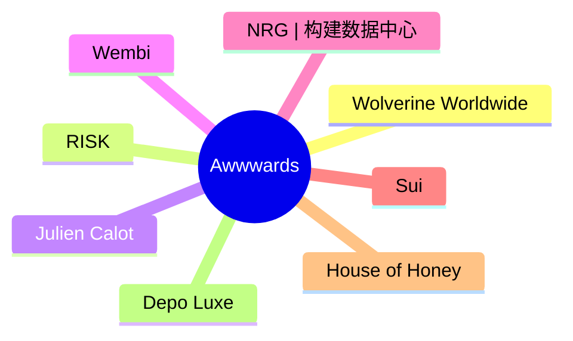
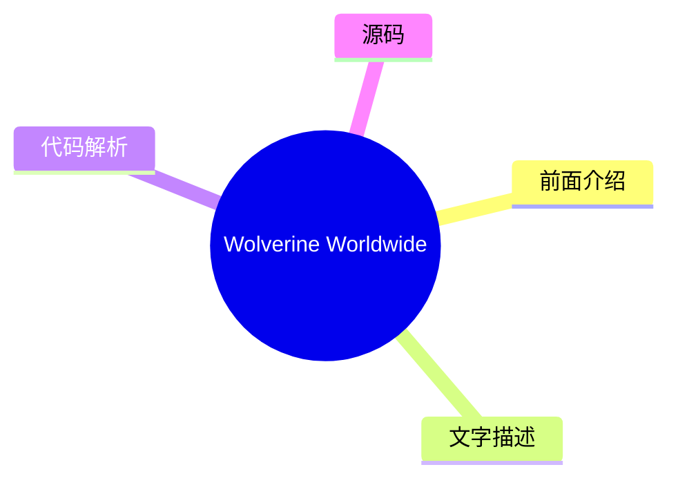
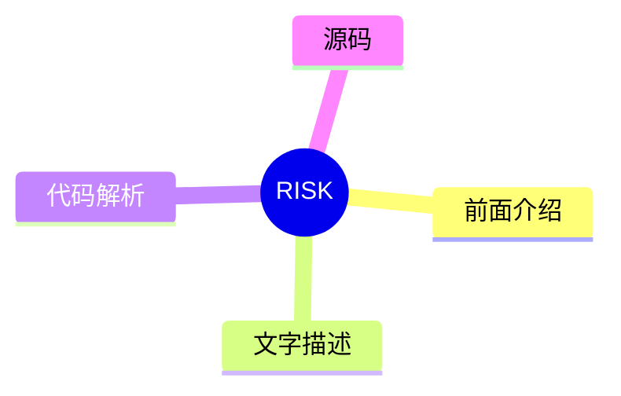
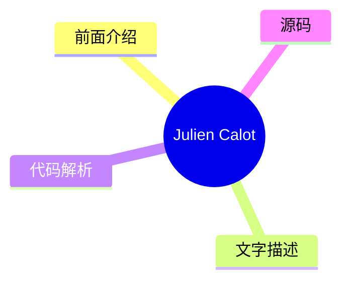
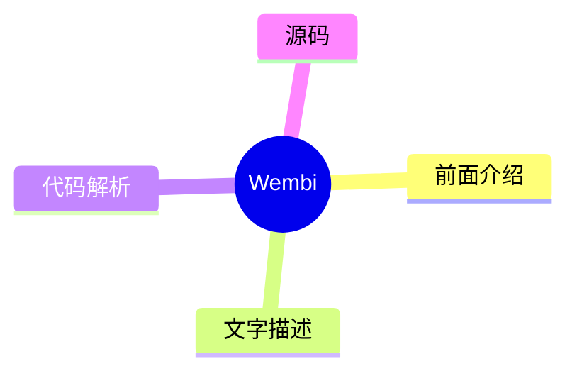
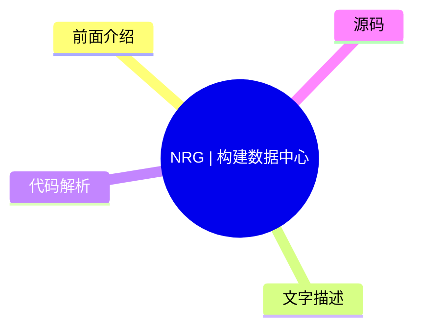
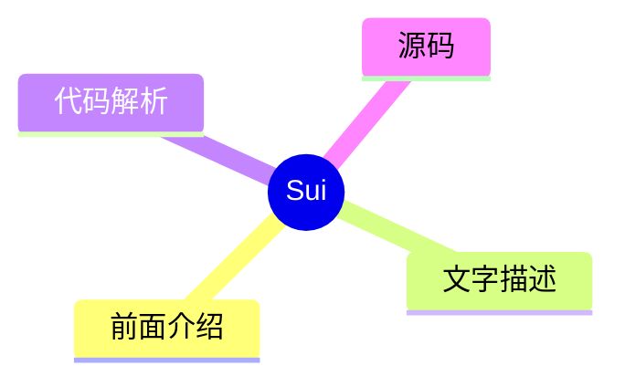
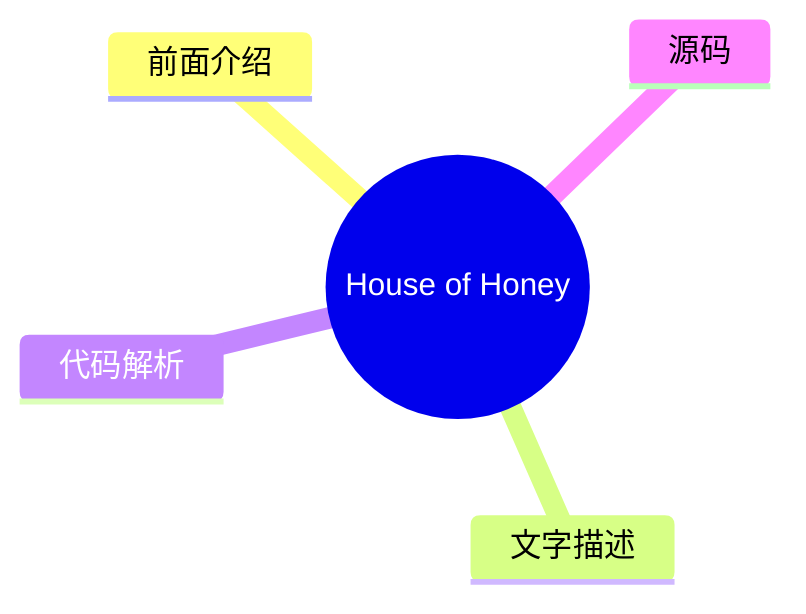
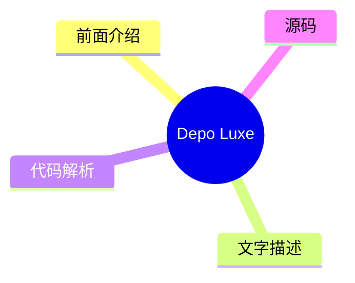

# 🏆 Awwwards Top 8 (2026-07-18)

## 前面介绍

- 数据源：Awwwards
- 抓取日期：2026-07-18
- 条目数：8
- 含完整正文：0
- 含代码片段：0
- 组织方式：前面介绍 / 树状图 / 文字描述 / 代码解析 / 源码

## 思维导图

## 详细整理（8 条，0 条含全文，0 条含代码）

### 1. Wolverine Worldwide
- **链接**: [https://www.awwwards.com/sites/wolverine-worldwide](https://www.awwwards.com/sites/wolverine-worldwide)
- **发布**: Wed, 24 Jun 2026 00:00:00 +0000

#### 前面介绍

- 拥有多个知名鞋类品牌
- 致力于让每一天变得更好

#### 树状图

#### 文字描述

- Wolverine Worldwide 是一家拥有多个知名鞋类品牌的公司。
- 旗下品牌包括 Merrell、Saucony、Sperry 和 Hush Puppies。
- 公司的核心使命是 Make. Every Day. Better。

#### 代码解析

- 本文未提供源码，以下为实现思路或结构解析

#### 源码

未抓到可展示源码或原文节选。

### 2. RISK
- **链接**: [https://www.awwwards.com/sites/risk](https://www.awwwards.com/sites/risk)
- **发布**: Wed, 15 Jul 2026 00:00:00 +0000

#### 前面介绍

- 专注于后期制作
- 创意视觉工作室

#### 树状图

#### 文字描述

- RISK 是一家专注于后期制作的工作室。
- 该条目主要展示了工作室的品牌形象和业务范围。

#### 代码解析

- 本文未提供源码，以下为实现思路或结构解析

#### 源码

未抓到可展示源码或原文节选。

### 3. Julien Calot
- **链接**: [https://www.awwwards.com/sites/julien-calot](https://www.awwwards.com/sites/julien-calot)
- **发布**: Wed, 08 Jul 2026 00:00:00 +0000

#### 前面介绍

- 视觉艺术家
- 跨学科创意工作者
- 在巴黎和纽约之间工作

#### 树状图

#### 文字描述

- Julien Calot 是一位视觉艺术家和跨学科创意工作者。
- 他的工作跨越了视觉艺术和多媒体领域。
- Julien 在巴黎和纽约之间进行创作和合作。

#### 代码解析

- 本文未提供源码，以下为实现思路或结构解析

#### 源码

未抓到可展示源码或原文节选。

### 4. Wembi
- **链接**: [https://www.awwwards.com/sites/wembi](https://www.awwwards.com/sites/wembi)
- **发布**: Wed, 01 Jul 2026 00:00:00 +0000

#### 前面介绍

- 创建数字孪生
- 提升设备性能
- 适用于机器和系统

#### 树状图

#### 文字描述

- Wembi 通过创建数字孪生来提升任何设备、机器或数字系统的性能。
- 该技术旨在优化现有系统的运行效率。
- 应用场景广泛，涵盖了从硬件设备到软件系统的各个层面。

#### 代码解析

- 本文未提供源码，以下为实现思路或结构解析

#### 源码

未抓到可展示源码或原文节选。

### 5. NRG | 构建数据中心
- **链接**: [https://www.awwwards.com/sites/nrg-build-your-data-center](https://www.awwwards.com/sites/nrg-build-your-data-center)
- **发布**: Tue, 30 Jun 2026 00:00:00 +0000

#### 前面介绍

- 支持未来的基础设施
- 推动AI突破
- 构建更美好的明天

#### 树状图

#### 文字描述

- NRG 致力于为支持未来的数据中心提供动力。
- 随着每一次人工智能的突破和飞跃，NRG 正在构建更美好的明天。
- 该条目强调了 NRG 在数据中心领域的领导地位和技术愿景。

#### 代码解析

- 本文未提供源码，以下为实现思路或结构解析

#### 源码

未抓到可展示源码或原文节选。

### 6. Sui
- **链接**: [https://www.awwwards.com/sites/sui](https://www.awwwards.com/sites/sui)
- **发布**: Tue, 23 Jun 2026 00:00:00 +0000

#### 前面介绍

- Layer 1 区块链平台
- 支持 Web3 应用
- 反映不断发展的生态系统

#### 树状图

#### 文字描述

- Sui 是一个用于可扩展 Web3 应用程序和去中心化基础设施的 Layer 1 区块链平台。
- 新的品牌和网站设计反映了 Sui 不断发展的生态系统。
- 该平台旨在提供高性能的区块链解决方案。

#### 代码解析

- 本文未提供源码，以下为实现思路或结构解析

#### 源码

未抓到可展示源码或原文节选。

### 7. House of Honey
- **链接**: [https://www.awwwards.com/sites/house-of-honey-1](https://www.awwwards.com/sites/house-of-honey-1)
- **发布**: Tue, 14 Jul 2026 00:00:00 +0000

#### 前面介绍

- 设计有故事的空间
- 精致的数字形象
- 编辑优雅与流畅交互

#### 树状图

#### 文字描述

- House of Honey 致力于设计具有故事性的空间。
- 他们构建了一个精致的数字形象，通过编辑优雅和流畅的交互来反映其感官哲学。
- 该网站设计体现了品牌在空间美学与数字体验上的融合。

#### 代码解析

- 本文未提供源码，以下为实现思路或结构解析

#### 源码

未抓到可展示源码或原文节选。

### 8. Depo Luxe
- **链接**: [https://www.awwwards.com/sites/depo-luxe](https://www.awwwards.com/sites/depo-luxe)
- **发布**: Tue, 07 Jul 2026 00:00:00 +0000

#### 前面介绍

- 当代奢华的影视化策略
- 高端品牌定位

#### 树状图

#### 文字描述

- Depo Luxe 采用战略性和电影化的方式来诠释当代奢华。
- 该条目展示了品牌在高端市场中的独特视角和美学追求。
- 设计风格强调奢华感与叙事性的结合。

#### 代码解析

- 本文未提供源码，以下为实现思路或结构解析

#### 源码

未抓到可展示源码或原文节选。

