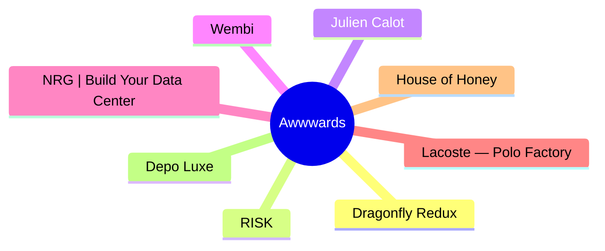
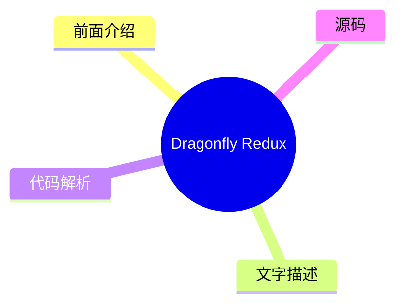
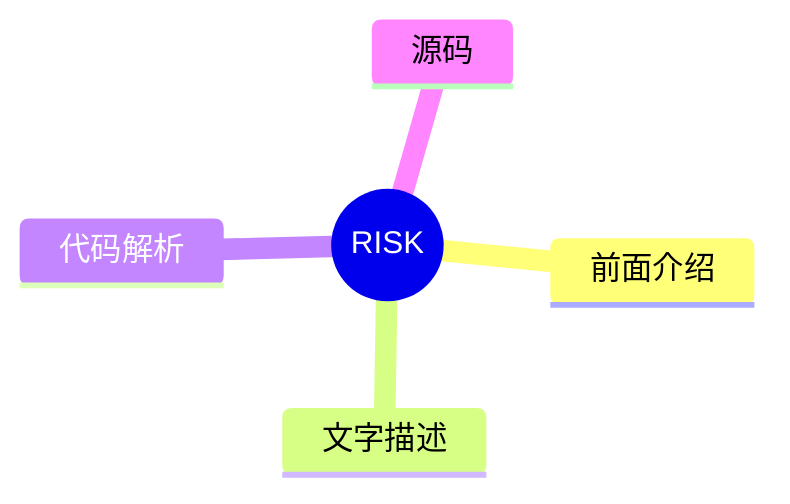
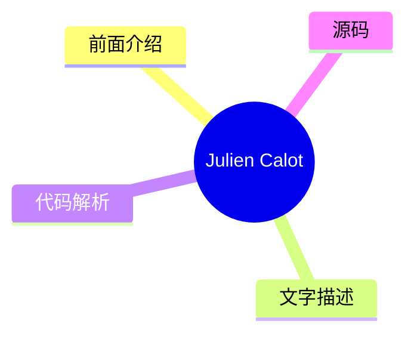
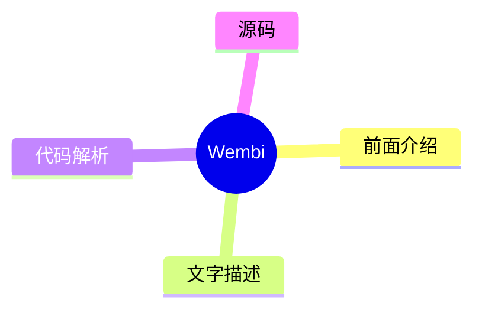
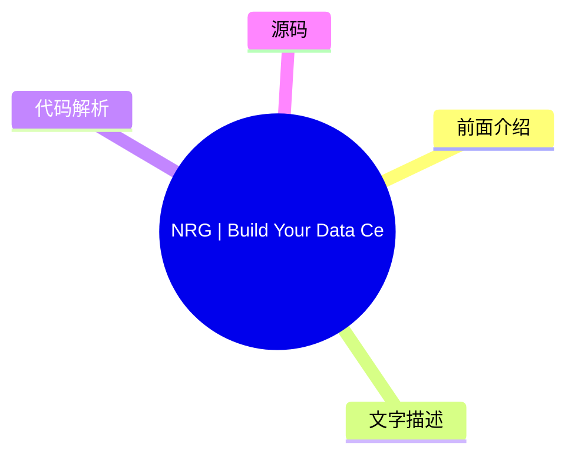
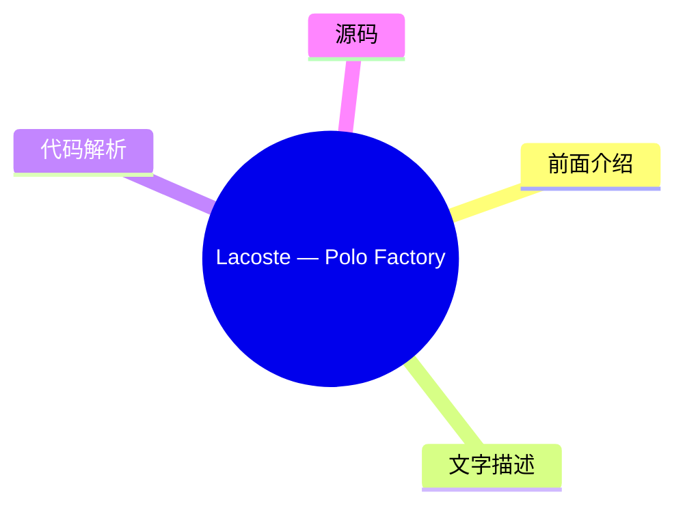
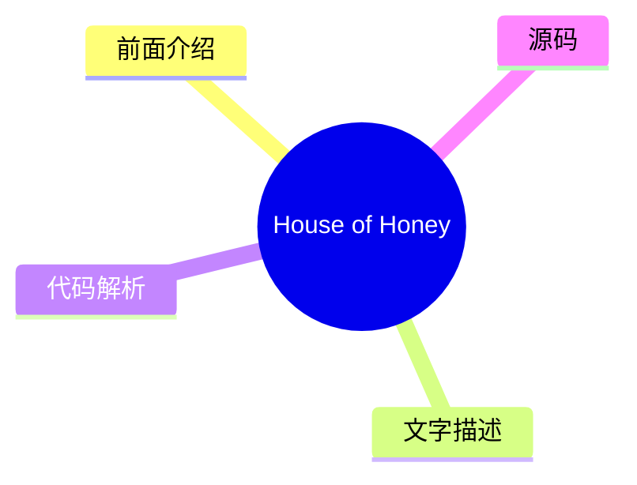
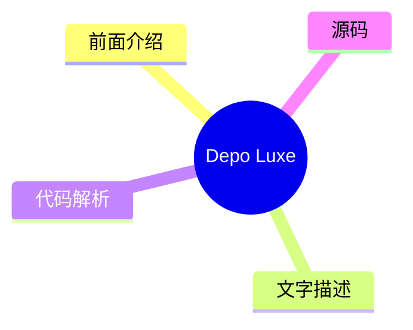

# 🏆 Awwwards Top 8 (2026-07-28)

## 前面介绍

- 数据源：Awwwards
- 抓取日期：2026-07-28
- 条目数：8
- 含完整正文：0
- 含代码片段：0
- 组织方式：前面介绍 / 树状图 / 文字描述 / 代码解析 / 源码

## 思维导图

## 详细整理（8 条，0 条含全文，0 条含代码）

### 1. Dragonfly Redux
- **链接**: [https://www.awwwards.com/sites/dragonfly-redux](https://www.awwwards.com/sites/dragonfly-redux)
- **发布**: Wed, 22 Jul 2026 00:00:00 +0000

#### 前面介绍

- Eight years in crypto, Dragonfly brings access and influence to crypto teams with global aspirations to find adoption anywhere.
- 发布时间：Wed, 22 Jul 2026 00:00:00 +0000

#### 树状图

#### 文字描述

- Eight years in crypto, Dragonfly brings access and influence to crypto teams with global aspirations to find adoption anywhere.

#### 代码解析

- 本文未检测到明确代码块，内容更偏新闻、观点或方法论。

#### 源码

未抓到可展示源码或原文节选。

### 2. RISK
- **链接**: [https://www.awwwards.com/sites/risk](https://www.awwwards.com/sites/risk)
- **发布**: Wed, 15 Jul 2026 00:00:00 +0000

#### 前面介绍

- Post Production Studio
- 发布时间：Wed, 15 Jul 2026 00:00:00 +0000

#### 树状图

#### 文字描述

- Post Production Studio

#### 代码解析

- 本文未检测到明确代码块，内容更偏新闻、观点或方法论。

#### 源码

未抓到可展示源码或原文节选。

### 3. Julien Calot
- **链接**: [https://www.awwwards.com/sites/julien-calot](https://www.awwwards.com/sites/julien-calot)
- **发布**: Wed, 08 Jul 2026 00:00:00 +0000

#### 前面介绍

- Visual artist & multidisciplinary creativeWorks between Paris and New York
- 发布时间：Wed, 08 Jul 2026 00:00:00 +0000

#### 树状图

#### 文字描述

- Visual artist & multidisciplinary creativeWorks between Paris and New York

#### 代码解析

- 本文未检测到明确代码块，内容更偏新闻、观点或方法论。

#### 源码

未抓到可展示源码或原文节选。

### 4. Wembi
- **链接**: [https://www.awwwards.com/sites/wembi](https://www.awwwards.com/sites/wembi)
- **发布**: Wed, 01 Jul 2026 00:00:00 +0000

#### 前面介绍

- Wembi instantly improves the performance of any device, machine, or digital system by creating its virtual twin.
- 发布时间：Wed, 01 Jul 2026 00:00:00 +0000

#### 树状图

#### 文字描述

- Wembi instantly improves the performance of any device, machine, or digital system by creating its virtual twin.

#### 代码解析

- 本文未检测到明确代码块，内容更偏新闻、观点或方法论。

#### 源码

未抓到可展示源码或原文节选。

### 5. NRG | Build Your Data Center
- **链接**: [https://www.awwwards.com/sites/nrg-build-your-data-center](https://www.awwwards.com/sites/nrg-build-your-data-center)
- **发布**: Tue, 30 Jun 2026 00:00:00 +0000

#### 前面介绍

- Powering the data centers that support what's next. With every AI breakthrough and leap forward, NRG is building a brighter tomorrow.
- 发布时间：Tue, 30 Jun 2026 00:00:00 +0000

#### 树状图

#### 文字描述

- Powering the data centers that support what's next. With every AI breakthrough and leap forward, NRG is building a brighter tomorrow.

#### 代码解析

- 本文未检测到明确代码块，内容更偏新闻、观点或方法论。

#### 源码

未抓到可展示源码或原文节选。

### 6. Lacoste — Polo Factory
- **链接**: [https://www.awwwards.com/sites/lacoste-polo-factory](https://www.awwwards.com/sites/lacoste-polo-factory)
- **发布**: Tue, 21 Jul 2026 00:00:00 +0000

#### 前面介绍

- Welcome to the Lacoste Polo Factory. Where polos are born.
- 发布时间：Tue, 21 Jul 2026 00:00:00 +0000

#### 树状图

#### 文字描述

- Welcome to the Lacoste Polo Factory. Where polos are born.

#### 代码解析

- 本文未检测到明确代码块，内容更偏新闻、观点或方法论。

#### 源码

未抓到可展示源码或原文节选。

### 7. House of Honey
- **链接**: [https://www.awwwards.com/sites/house-of-honey-1](https://www.awwwards.com/sites/house-of-honey-1)
- **发布**: Tue, 14 Jul 2026 00:00:00 +0000

#### 前面介绍

- House of Honey designs spaces with story. We built a sophisticated digital presence that mirrors this sensory philosophy through editorial elegance and fluid interaction.
- 发布时间：Tue, 14 Jul 2026 00:00:00 +0000

#### 树状图

#### 文字描述

- House of Honey designs spaces with story. We built a sophisticated digital presence that mirrors this sensory philosophy through editorial elegance and fluid interaction.

#### 代码解析

- 本文未检测到明确代码块，内容更偏新闻、观点或方法论。

#### 源码

未抓到可展示源码或原文节选。

### 8. Depo Luxe
- **链接**: [https://www.awwwards.com/sites/depo-luxe](https://www.awwwards.com/sites/depo-luxe)
- **发布**: Tue, 07 Jul 2026 00:00:00 +0000

#### 前面介绍

- A strategic and cinematic approach to contemporary luxury
- 发布时间：Tue, 07 Jul 2026 00:00:00 +0000

#### 树状图

#### 文字描述

- A strategic and cinematic approach to contemporary luxury

#### 代码解析

- 本文未检测到明确代码块，内容更偏新闻、观点或方法论。

#### 源码

未抓到可展示源码或原文节选。

