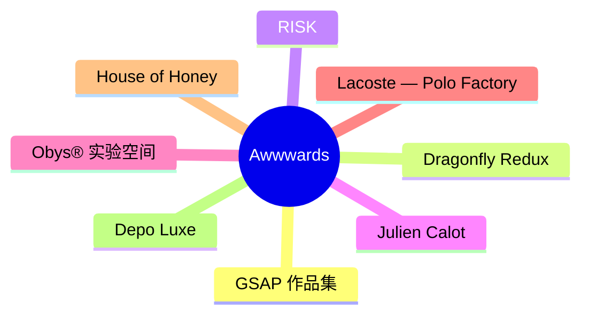
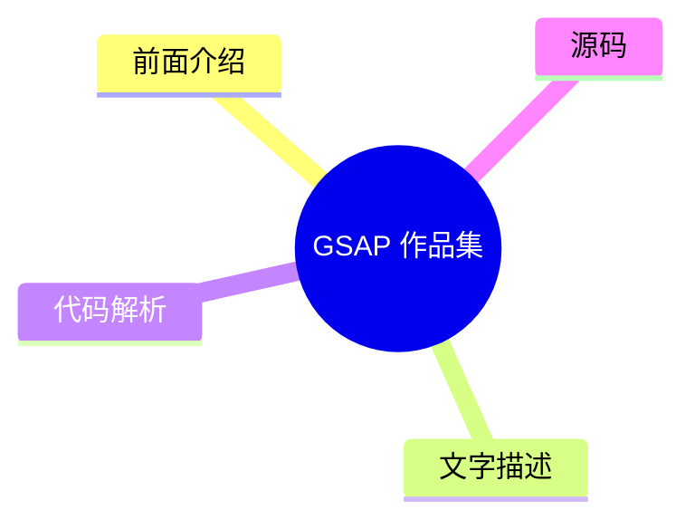
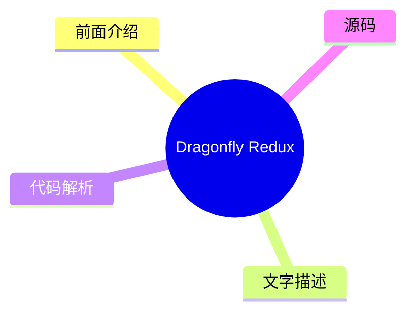
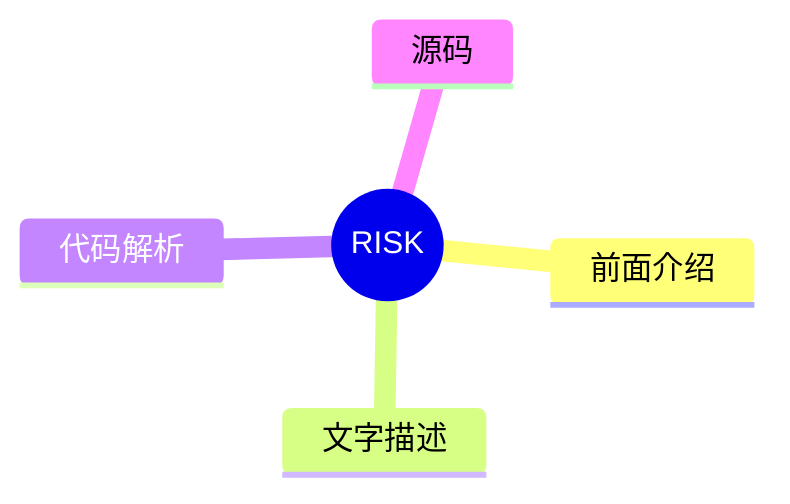
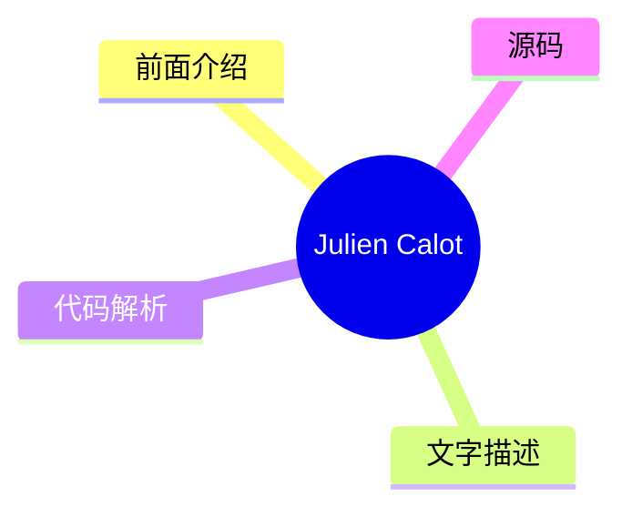
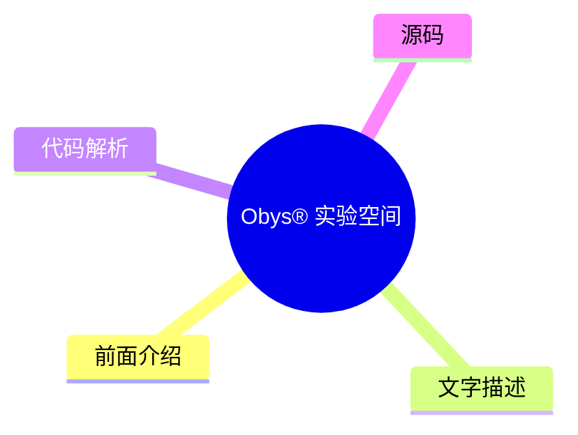
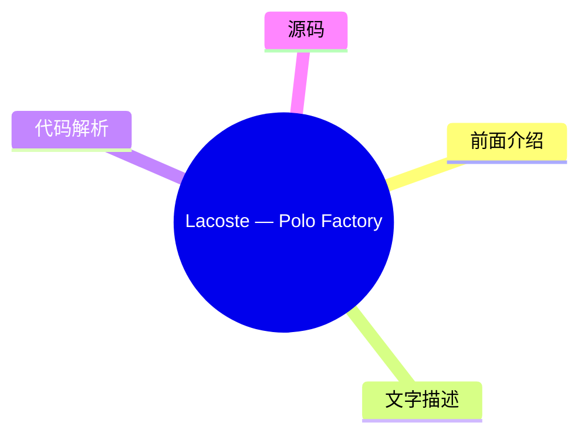
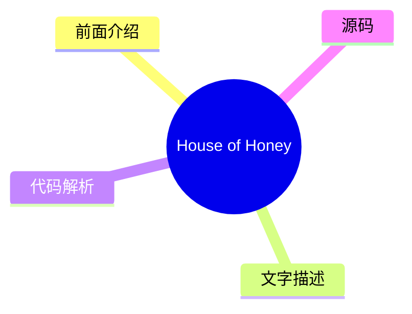
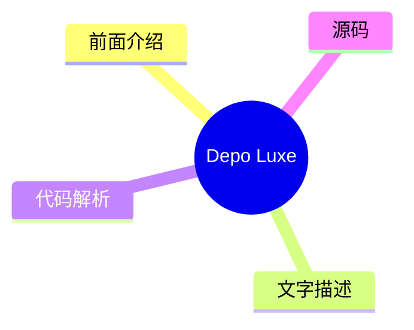

# 🏆 Awwwards Top 8 (2026-08-01)

## 前面介绍

- 数据源：Awwwards
- 抓取日期：2026-08-01
- 条目数：8
- 含完整正文：0
- 含代码片段：0
- 组织方式：前面介绍 / 树状图 / 文字描述 / 代码解析 / 源码

## 思维导图

## 详细整理（8 条，0 条含全文，0 条含代码）

### 1. GSAP 作品集
- **链接**: [https://www.awwwards.com/sites/made-with-gsap-1](https://www.awwwards.com/sites/made-with-gsap-1)
- **发布**: Wed, 29 Jul 2026 00:00:00 +0000

#### 前面介绍

- 收录了大量独特的 JS 交互效果
- 持续增长的创意作品库

#### 树状图

#### 文字描述

- 这是一个专注于 GSAP (GreenSock Animation Platform) 的作品展示集合
- 展示了开发者如何利用 GSAP 库创建流畅且复杂的动画效果
- 适合作为学习高级 Web 动画实现的参考案例

#### 代码解析

- 本文未提供源码，以下为实现思路或结构解析

#### 源码

未抓到可展示源码或原文节选。

### 2. Dragonfly Redux
- **链接**: [https://www.awwwards.com/sites/dragonfly-redux](https://www.awwwards.com/sites/dragonfly-redux)
- **发布**: Wed, 22 Jul 2026 00:00:00 +0000

#### 前面介绍

- 专注于加密货币领域的投资机构
- 致力于推动全球加密团队的采用与发展

#### 树状图

#### 文字描述

- Dragonfly Redux 是一家深耕加密货币领域八年的投资机构
- 旨在为具有全球抱负的加密货币团队提供访问渠道和影响力
- 致力于寻找并推动加密技术在不同地区的实际应用

#### 代码解析

- 本文未提供源码，以下为实现思路或结构解析

#### 源码

未抓到可展示源码或原文节选。

### 3. RISK
- **链接**: [https://www.awwwards.com/sites/risk](https://www.awwwards.com/sites/risk)
- **发布**: Wed, 15 Jul 2026 00:00:00 +0000

#### 前面介绍

- 专业的后期制作工作室
- 专注于视觉后期与创意制作

#### 树状图

#### 文字描述

- RISK 是一家专业的后期制作工作室
- 致力于为各类视觉项目提供高质量的后期制作服务
- 在视觉特效和创意剪辑领域拥有丰富的经验

#### 代码解析

- 本文未提供源码，以下为实现思路或结构解析

#### 源码

未抓到可展示源码或原文节选。

### 4. Julien Calot
- **链接**: [https://www.awwwards.com/sites/julien-calot](https://www.awwwards.com/sites/julien-calot)
- **发布**: Wed, 08 Jul 2026 00:00:00 +0000

#### 前面介绍

- 视觉艺术家与多学科创意人
- 活跃于巴黎与纽约两地

#### 树状图

#### 文字描述

- Julien Calot 是一位视觉艺术家和多学科创意工作者
- 其创作跨越视觉艺术与设计领域
- 作品在巴黎和纽约之间流动，展现出跨文化的艺术视角

#### 代码解析

- 本文未提供源码，以下为实现思路或结构解析

#### 源码

未抓到可展示源码或原文节选。

### 5. Obys® 实验空间
- **链接**: [https://www.awwwards.com/sites/obys-r-experiment-space](https://www.awwwards.com/sites/obys-r-experiment-space)
- **发布**: Tue, 28 Jul 2026 00:00:00 +0000

#### 前面介绍

- 未发布作品的互动档案馆
- 展示概念、实验与替代方向

#### 树状图

#### 文字描述

- Obys® Experiment Space 是一个互动档案库
- 汇集了未发布的作品、概念、实验和替代性创意方向
- 展示了通常不会出现在最终案例研究中的创意想法

#### 代码解析

- 本文未提供源码，以下为实现思路或结构解析

#### 源码

未抓到可展示源码或原文节选。

### 6. Lacoste — Polo Factory
- **链接**: [https://www.awwwards.com/sites/lacoste-polo-factory](https://www.awwwards.com/sites/lacoste-polo-factory)
- **发布**: Tue, 21 Jul 2026 00:00:00 +0000

#### 前面介绍

- Lacoste Polo 工厂官网
- 展示 Polo 衫的诞生过程

#### 树状图

#### 文字描述

- 欢迎来到 Lacoste Polo Factory 官网
- 这是一个展示 Polo 衫生产流程的沉浸式体验页面
- 通过数字化手段呈现品牌传统与工艺细节

#### 代码解析

- 本文未提供源码，以下为实现思路或结构解析

#### 源码

未抓到可展示源码或原文节选。

### 7. House of Honey
- **链接**: [https://www.awwwards.com/sites/house-of-honey-1](https://www.awwwards.com/sites/house-of-honey-1)
- **发布**: Tue, 14 Jul 2026 00:00:00 +0000

#### 前面介绍

- 注重叙事的空间设计
- 通过编辑优雅与流畅交互呈现感官哲学

#### 树状图

#### 文字描述

- House of Honey 致力于通过故事来设计空间
- 构建了一个复杂的数字形象，以反映其感官哲学
- 通过编辑风格的优雅设计和流畅的交互体验来呈现

#### 代码解析

- 本文未提供源码，以下为实现思路或结构解析

#### 源码

未抓到可展示源码或原文节选。

### 8. Depo Luxe
- **链接**: [https://www.awwwards.com/sites/depo-luxe](https://www.awwwards.com/sites/depo-luxe)
- **发布**: Tue, 07 Jul 2026 00:00:00 +0000

#### 前面介绍

- 当代奢华的影视化战略
- 结合电影感与高端设计

#### 树状图

#### 文字描述

- Depo Luxe 采用战略性和电影化的方法来呈现当代奢华
- 旨在通过视觉语言传达高端品牌的质感与格调
- 将电影叙事手法融入品牌展示中

#### 代码解析

- 本文未提供源码，以下为实现思路或结构解析

#### 源码

未抓到可展示源码或原文节选。

