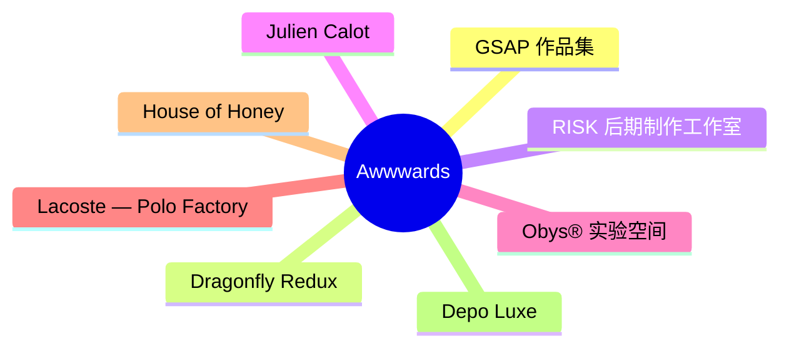
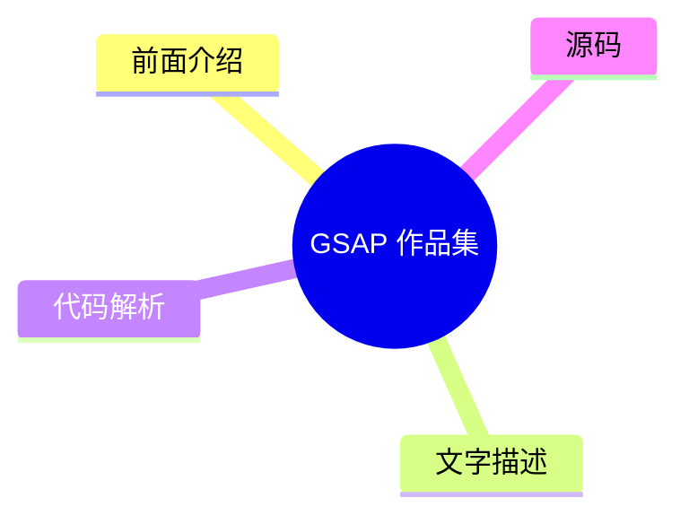
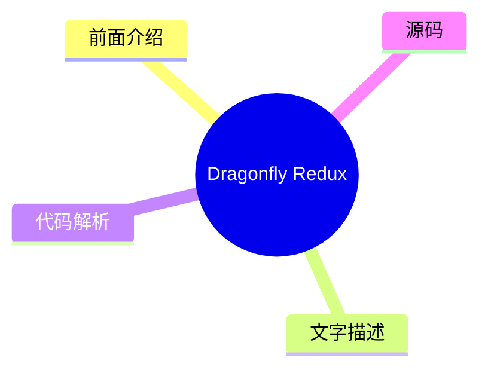
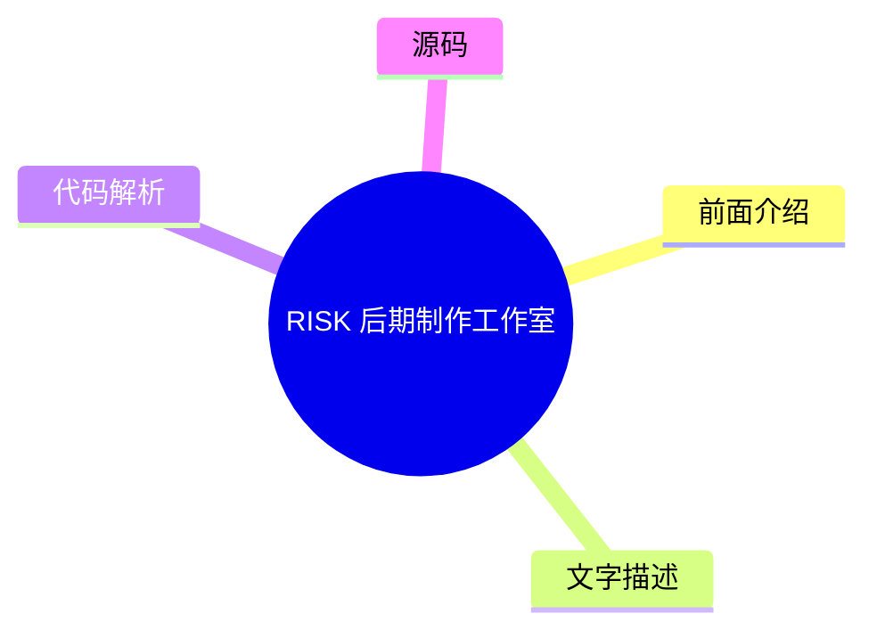
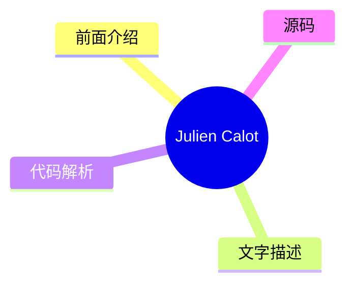
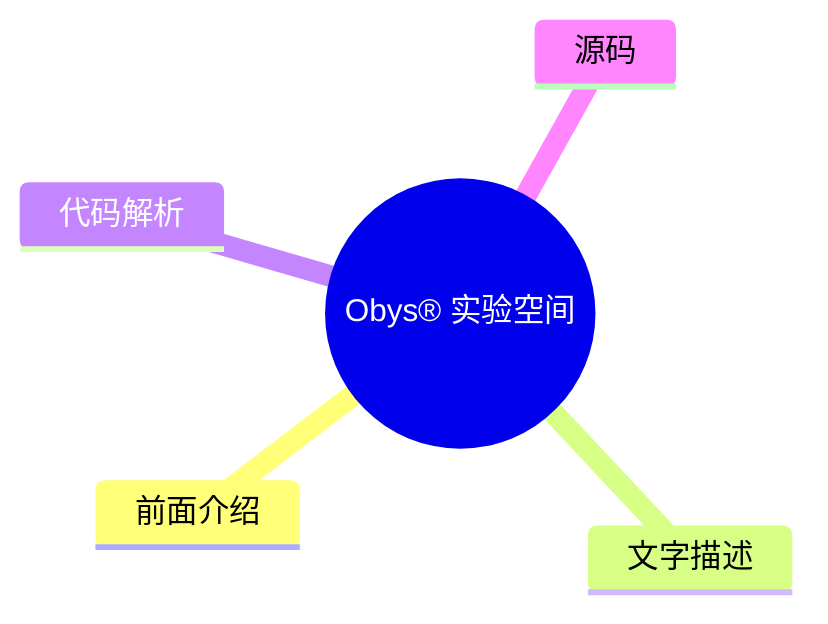
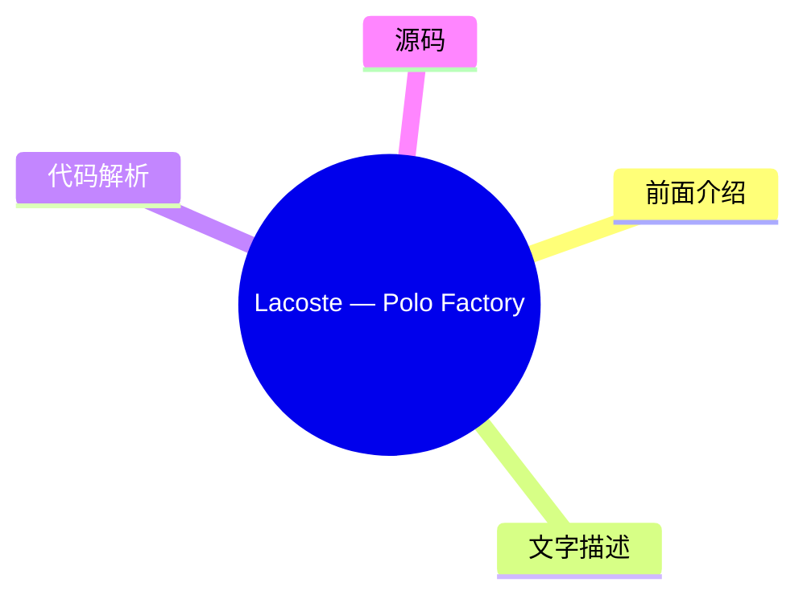
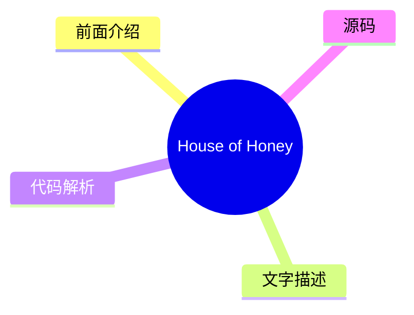
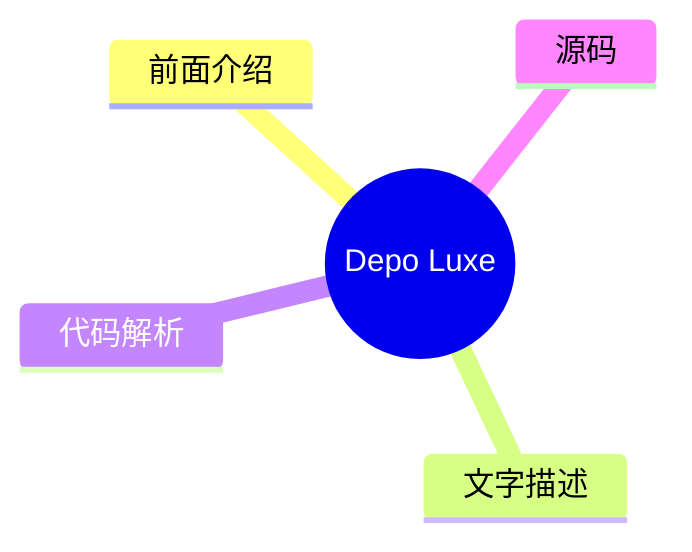

# 🏆 Awwwards Top 8 (2026-08-02)

## 前面介绍

- 数据源：Awwwards
- 抓取日期：2026-08-02
- 条目数：8
- 含完整正文：0
- 含代码片段：0
- 组织方式：前面介绍 / 树状图 / 文字描述 / 代码解析 / 源码

## 思维导图

## 详细整理（8 条，0 条含全文，0 条含代码）

### 1. GSAP 作品集
- **链接**: [https://www.awwwards.com/sites/made-with-gsap-1](https://www.awwwards.com/sites/made-with-gsap-1)
- **发布**: Wed, 29 Jul 2026 00:00:00 +0000

#### 前面介绍

- 收录大量独特且精心制作的 JS 交互效果
- 持续增长的创意资源库

#### 树状图

#### 文字描述

- 这是一个展示 GSAP (GreenSock Animation Platform) 创意应用的网站合集
- 收录的作品通常具有高质量的动画和交互设计
- 适合前端开发者和设计师寻找灵感和参考

#### 代码解析

- 本文未提供源码，以下为实现思路或结构解析

#### 源码

未抓到可展示源码或原文节选。

### 2. Dragonfly Redux
- **链接**: [https://www.awwwards.com/sites/dragonfly-redux](https://www.awwwards.com/sites/dragonfly-redux)
- **发布**: Wed, 22 Jul 2026 00:00:00 +0000

#### 前面介绍

- 专注于加密货币领域的投资机构
- 致力于为全球扩张的加密团队提供接入与影响力

#### 树状图

#### 文字描述

- Dragonfly Redux 是一家专注于加密货币领域的投资公司
- 它帮助加密货币团队获得全球范围内的采用机会
- 该机构在加密行业深耕八年，拥有丰富的行业资源和经验

#### 代码解析

- 本文未提供源码，以下为实现思路或结构解析

#### 源码

未抓到可展示源码或原文节选。

### 3. RISK 后期制作工作室
- **链接**: [https://www.awwwards.com/sites/risk](https://www.awwwards.com/sites/risk)
- **发布**: Wed, 15 Jul 2026 00:00:00 +0000

#### 前面介绍

- 专注于后期制作的专业工作室
- 提供视觉特效和后期处理服务

#### 树状图

#### 文字描述

- RISK 是一家专业的后期制作工作室
- 主要业务涉及视频剪辑、视觉特效（VFX）以及调色等后期环节
- 该工作室的作品通常具有强烈的视觉冲击力和电影质感

#### 代码解析

- 本文未提供源码，以下为实现思路或结构解析

#### 源码

未抓到可展示源码或原文节选。

### 4. Julien Calot
- **链接**: [https://www.awwwards.com/sites/julien-calot](https://www.awwwards.com/sites/julien-calot)
- **发布**: Wed, 08 Jul 2026 00:00:00 +0000

#### 前面介绍

- 视觉艺术家与跨学科创意人
- 活跃于巴黎与纽约两地

#### 树状图

#### 文字描述

- Julien Calot 是一位视觉艺术家，同时也从事跨学科的创意工作
- 他的创作活动跨越巴黎和纽约两个城市
- 作品风格融合了艺术与设计，注重视觉表达和创意概念

#### 代码解析

- 本文未提供源码，以下为实现思路或结构解析

#### 源码

未抓到可展示源码或原文节选。

### 5. Obys® 实验空间
- **链接**: [https://www.awwwards.com/sites/obys-r-experiment-space](https://www.awwwards.com/sites/obys-r-experiment-space)
- **发布**: Tue, 28 Jul 2026 00:00:00 +0000

#### 前面介绍

- 未发布作品的交互式档案库
- 展示概念、实验和替代性方向

#### 树状图

#### 文字描述

- Obys® Experiment Space 是一个展示未发布作品的交互式档案
- 这里汇集了概念验证、实验性项目以及非传统的设计方向
- 这些内容通常不会出现在最终案例研究之外，展示了更原始的创意探索

#### 代码解析

- 本文未提供源码，以下为实现思路或结构解析

#### 源码

未抓到可展示源码或原文节选。

### 6. Lacoste — Polo Factory
- **链接**: [https://www.awwwards.com/sites/lacoste-polo-factory](https://www.awwwards.com/sites/lacoste-polo-factory)
- **发布**: Tue, 21 Jul 2026 00:00:00 +0000

#### 前面介绍

- Lacoste Polo 工厂官网
- 展示 Polo 衬衫的诞生过程

#### 树状图

#### 文字描述

- 这是 Lacoste 品牌的 Polo Factory 官方网站
- 网站旨在向用户展示 Polo 衬衫是如何被制造出来的
- 通过数字化手段还原了从原材料到成衣的生产流程

#### 代码解析

- 本文未提供源码，以下为实现思路或结构解析

#### 源码

未抓到可展示源码或原文节选。

### 7. House of Honey
- **链接**: [https://www.awwwards.com/sites/house-of-honey-1](https://www.awwwards.com/sites/house-of-honey-1)
- **发布**: Tue, 14 Jul 2026 00:00:00 +0000

#### 前面介绍

- 以故事为驱动的空间设计工作室
- 通过编辑优雅和流畅交互打造数字体验

#### 树状图

#### 文字描述

- House of Honey 是一家以故事为核心的空间设计工作室
- 他们为品牌构建了精致的数字形象，以反映其感官哲学
- 网站设计融合了编辑风格的优雅与流畅的交互体验

#### 代码解析

- 本文未提供源码，以下为实现思路或结构解析

#### 源码

未抓到可展示源码或原文节选。

### 8. Depo Luxe
- **链接**: [https://www.awwwards.com/sites/depo-luxe](https://www.awwwards.com/sites/depo-luxe)
- **发布**: Tue, 07 Jul 2026 00:00:00 +0000

#### 前面介绍

- 当代奢华的策展与电影化手法
- 融合战略与视觉叙事

#### 树状图

#### 文字描述

- Depo Luxe 采用战略性与电影化的方式诠释当代奢华概念
- 该品牌致力于通过视觉语言传达高端、精致的生活方式
- 其设计风格通常具有强烈的叙事性和艺术感，强调奢华的质感与氛围

#### 代码解析

- 本文未提供源码，以下为实现思路或结构解析

#### 源码

未抓到可展示源码或原文节选。

