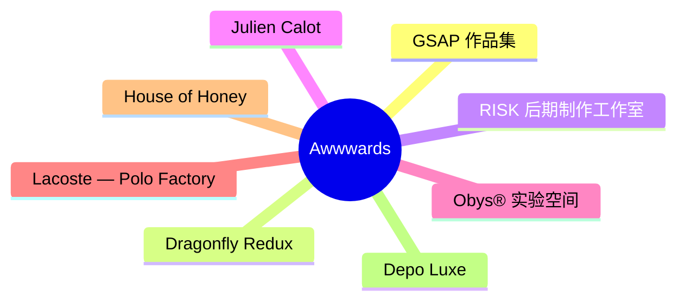
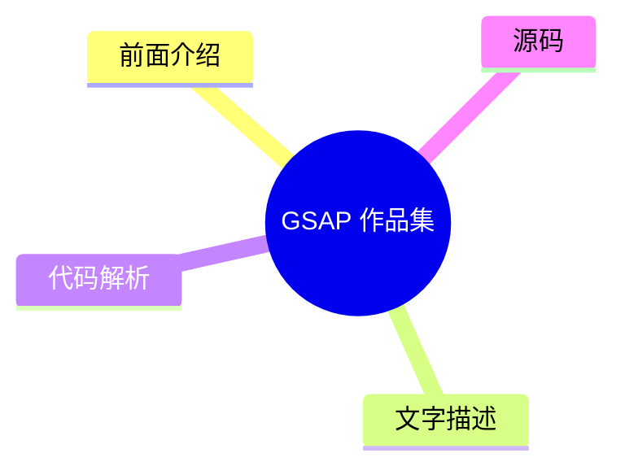
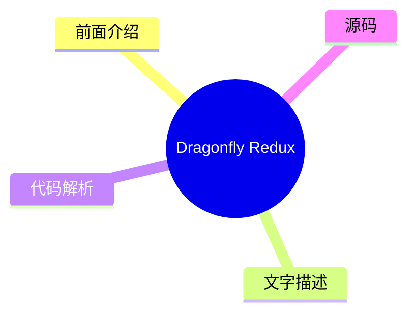
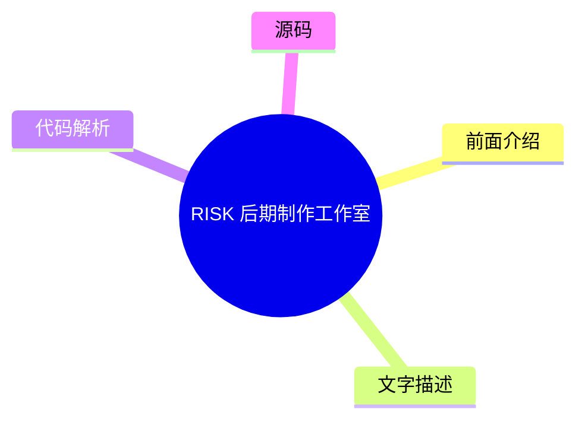
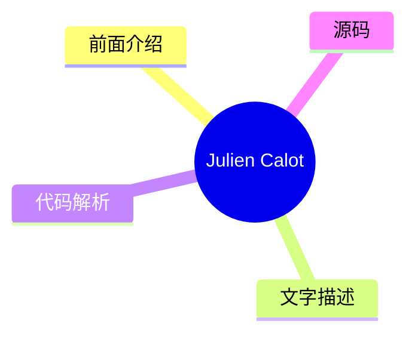
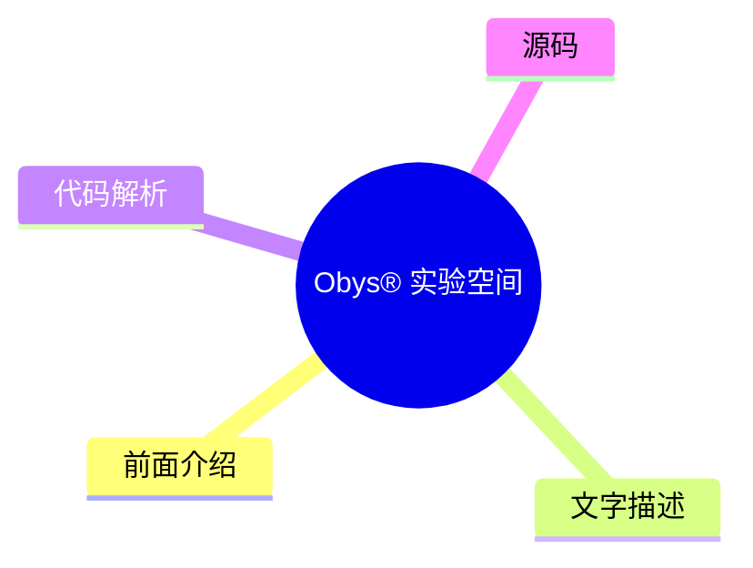
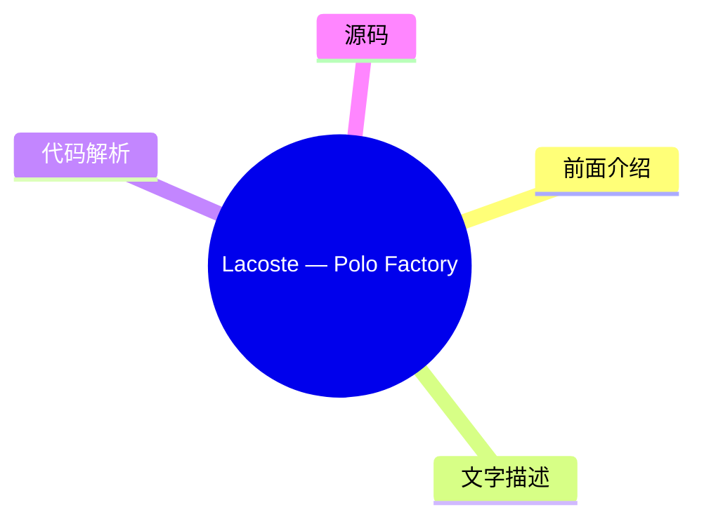
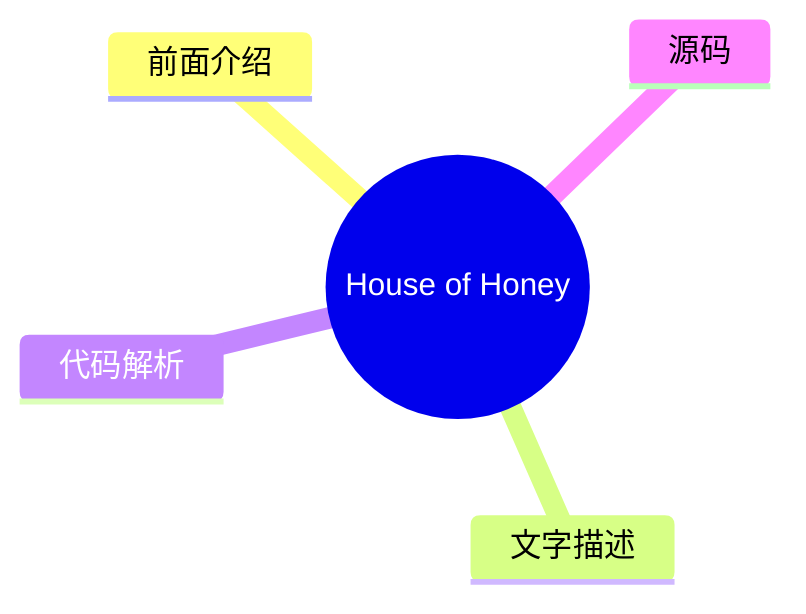
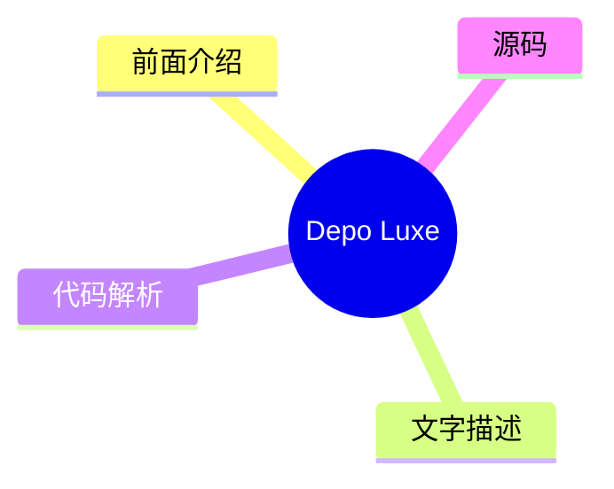

# 🏆 Awwwards Top 8 (2026-08-03)

## 前面介绍

- 数据源：Awwwards
- 抓取日期：2026-08-03
- 条目数：8
- 含完整正文：0
- 含代码片段：0
- 组织方式：前面介绍 / 树状图 / 文字描述 / 代码解析 / 源码

## 思维导图

## 详细整理（8 条，0 条含全文，0 条含代码）

### 1. GSAP 作品集
- **链接**: [https://www.awwwards.com/sites/made-with-gsap-1](https://www.awwwards.com/sites/made-with-gsap-1)
- **发布**: Wed, 29 Jul 2026 00:00:00 +0000

#### 前面介绍

- 收录了独特且精心制作的 JS 交互效果。
- 持续增长的创意资源库。

#### 树状图

#### 文字描述

- 这是一个展示 GSAP（GreenSock Animation Platform）动画效果的网站。
- 该网站汇集了各种独特的、精心设计的 JavaScript 交互效果。
- 旨在为设计师和开发者提供灵感，展示 GSAP 在前端动画中的强大能力。

#### 代码解析

- 本文未提供源码，以下为实现思路或结构解析
- 通常此类作品集会使用 GSAP 的 Timeline、ScrollTrigger 等插件来控制复杂的滚动动画和视差效果。

#### 源码

未抓到可展示源码或原文节选。

### 2. Dragonfly Redux
- **链接**: [https://www.awwwards.com/sites/dragonfly-redux](https://www.awwwards.com/sites/dragonfly-redux)
- **发布**: Wed, 22 Jul 2026 00:00:00 +0000

#### 前面介绍

- 专注于加密货币领域的投资机构。
- 致力于为具有全球抱负的加密团队提供资源与影响力。

#### 树状图

#### 文字描述

- Dragonfly Redux 是一家专注于加密货币领域的投资机构。
- 该机构旨在为加密货币团队提供接入全球市场的机会和影响力。
- 其目标是帮助这些团队在更广泛的范围内寻找采用和增长的机会。

#### 代码解析

- 本文未提供源码，以下为实现思路或结构解析
- 作为一家投资机构，其网站设计通常侧重于品牌叙事、信任感构建以及清晰的排版，而非复杂的代码实现。

#### 源码

未抓到可展示源码或原文节选。

### 3. RISK 后期制作工作室
- **链接**: [https://www.awwwards.com/sites/risk](https://www.awwwards.com/sites/risk)
- **发布**: Wed, 15 Jul 2026 00:00:00 +0000

#### 前面介绍

- 专注于后期制作的专业工作室。
- 致力于视觉特效与创意制作。

#### 树状图

#### 文字描述

- RISK 是一家后期制作工作室。
- 该工作室专注于视觉特效（VFX）、剪辑和创意制作领域。
- 通过专业的后期处理技术，为各种媒体项目提供高质量的视觉解决方案。

#### 代码解析

- 本文未提供源码，以下为实现思路或结构解析
- 此类作品集网站通常强调视觉冲击力和沉浸感，可能会使用 WebGL 或高性能 Canvas 技术来展示工作室的过往作品。

#### 源码

未抓到可展示源码或原文节选。

### 4. Julien Calot
- **链接**: [https://www.awwwards.com/sites/julien-calot](https://www.awwwards.com/sites/julien-calot)
- **发布**: Wed, 08 Jul 2026 00:00:00 +0000

#### 前面介绍

- 视觉艺术家与多学科创意人。
- 活跃于巴黎与纽约两地。

#### 树状图

#### 文字描述

- Julien Calot 是一位视觉艺术家和多学科创意人。
- 其工作跨越了视觉艺术、平面设计和创意编程等多个领域。
- 他经常在巴黎和纽约之间工作，将东西方文化元素融入其创意实践中。

#### 代码解析

- 本文未提供源码，以下为实现思路或结构解析
- 个人作品集网站通常采用极简主义设计，重点展示高分辨率的视觉作品，排版上注重留白和艺术感。

#### 源码

未抓到可展示源码或原文节选。

### 5. Obys® 实验空间
- **链接**: [https://www.awwwards.com/sites/obys-r-experiment-space](https://www.awwwards.com/sites/obys-r-experiment-space)
- **发布**: Tue, 28 Jul 2026 00:00:00 +0000

#### 前面介绍

- 未发布作品的互动档案库。
- 探索概念、实验与替代方向。

#### 树状图

#### 文字描述

- Obys® Experiment Space 是一个未发布作品的互动档案库。
- 它收集了各种概念、实验和替代性的设计方向。
- 这些作品通常很少在最终案例研究中展示，旨在展示创意的探索过程。

#### 代码解析

- 本文未提供源码，以下为实现思路或结构解析
- 该页面可能包含大量未公开的实验性设计，交互逻辑可能更加自由和探索性，用于展示设计师的实验性思维。

#### 源码

未抓到可展示源码或原文节选。

### 6. Lacoste — Polo Factory
- **链接**: [https://www.awwwards.com/sites/lacoste-polo-factory](https://www.awwwards.com/sites/lacoste-polo-factory)
- **发布**: Tue, 21 Jul 2026 00:00:00 +0000

#### 前面介绍

- Lacoste Polo 工厂官网。
- 展示 Polo 衫的诞生过程。

#### 树状图

#### 文字描述

- 欢迎来到 Lacoste Polo Factory。
- 这是一个展示 Polo 衫诞生过程的官方网站。
- 网站旨在通过数字化手段呈现品牌的历史、工艺和产品细节。

#### 代码解析

- 本文未提供源码，以下为实现思路或结构解析
- 品牌官网通常注重品牌调性的传达，可能会结合 3D 渲染技术来展示产品的材质和制作工艺。

#### 源码

未抓到可展示源码或原文节选。

### 7. House of Honey
- **链接**: [https://www.awwwards.com/sites/house-of-honey-1](https://www.awwwards.com/sites/house-of-honey-1)
- **发布**: Tue, 14 Jul 2026 00:00:00 +0000

#### 前面介绍

- 以故事为驱动的空间设计工作室。
- 通过编辑优雅与流畅交互构建数字体验。

#### 树状图

#### 文字描述

- House of Honey 是一家以故事为驱动的空间设计工作室。
- 他们构建了一个复杂的数字形象，以反映其感官哲学。
- 网站通过编辑优雅的风格和流畅的交互，传达了工作室的设计理念。

#### 代码解析

- 本文未提供源码，以下为实现思路或结构解析
- 该网站可能使用了复杂的滚动动画和视差效果，以模拟感官体验，强调内容与交互的融合。

#### 源码

未抓到可展示源码或原文节选。

### 8. Depo Luxe
- **链接**: [https://www.awwwards.com/sites/depo-luxe](https://www.awwwards.com/sites/depo-luxe)
- **发布**: Tue, 07 Jul 2026 00:00:00 +0000

#### 前面介绍

- 当代奢华的战略与电影化方法。
- 专注于高端品牌形象塑造。

#### 树状图

#### 文字描述

- Depo Luxe 采用战略性和电影化的方法来处理当代奢华。
- 该工作室致力于为高端品牌提供视觉解决方案。
- 其设计风格通常具有电影质感，强调奢华、精致和叙事性。

#### 代码解析

- 本文未提供源码，以下为实现思路或结构解析
- 奢华品牌网站通常使用高对比度的色彩、精致的字体排版和缓慢的动画节奏，以营造高端氛围。

#### 源码

未抓到可展示源码或原文节选。

