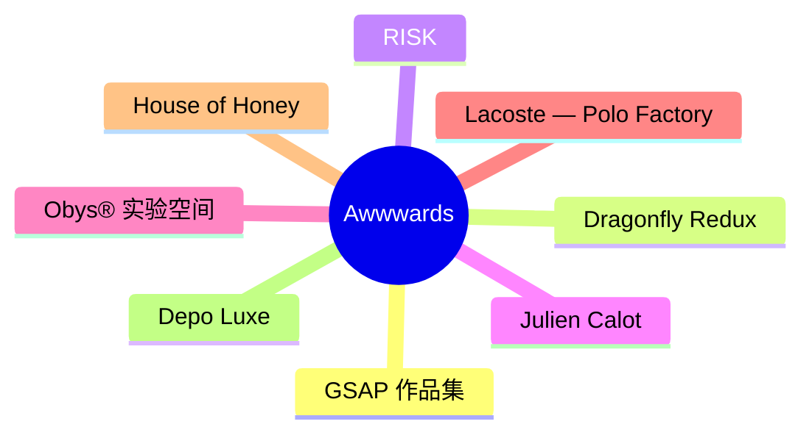
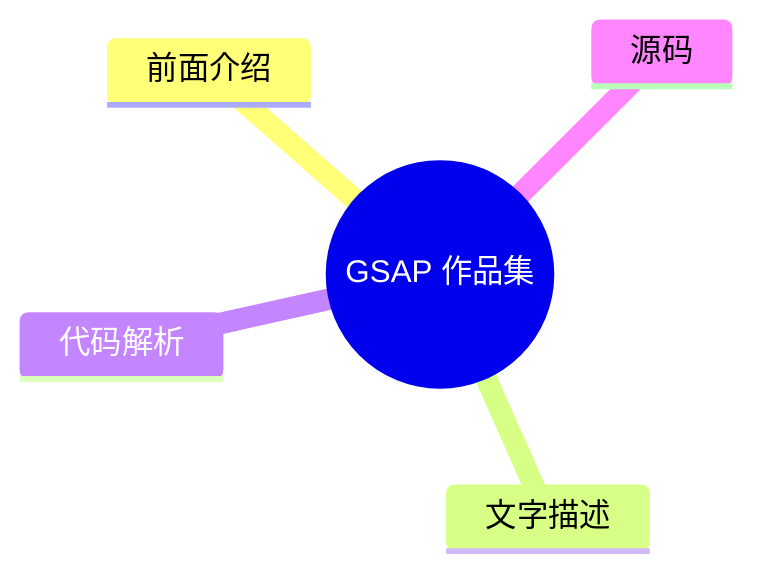
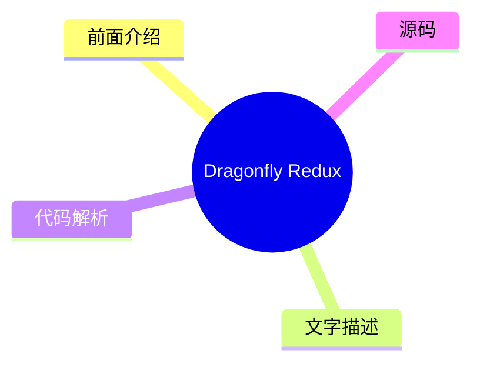
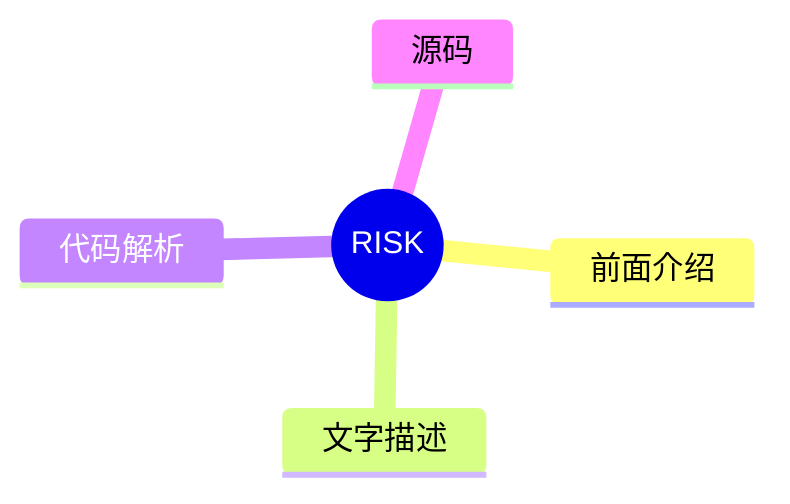
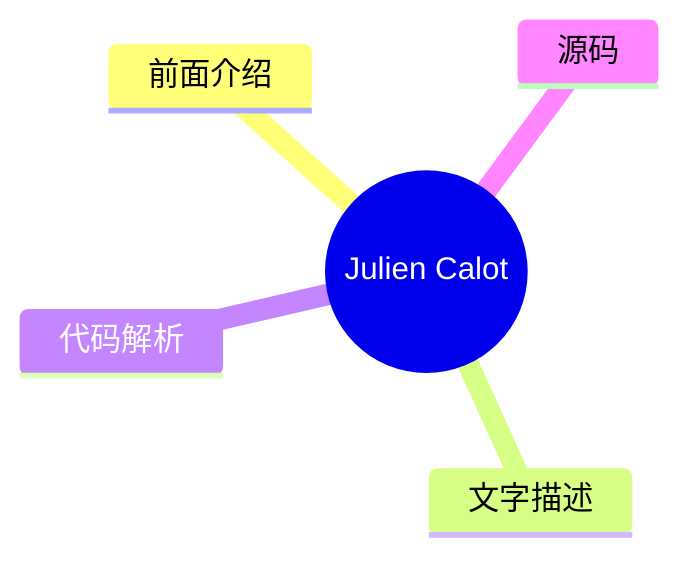
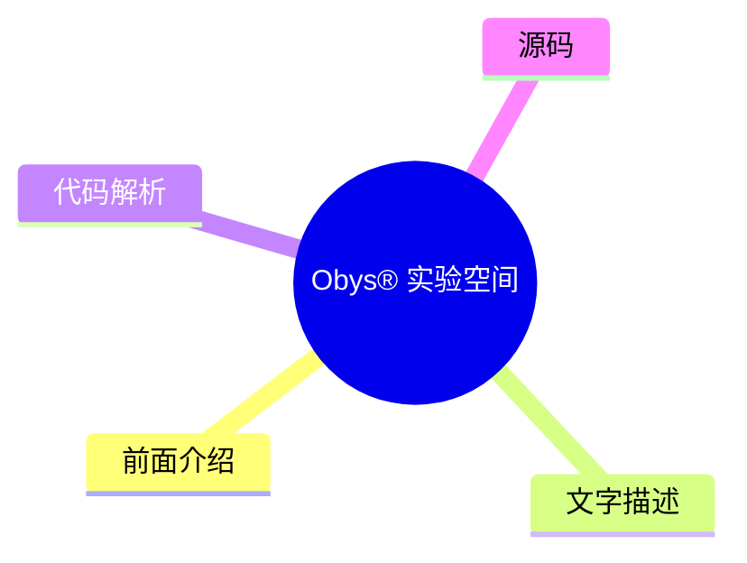
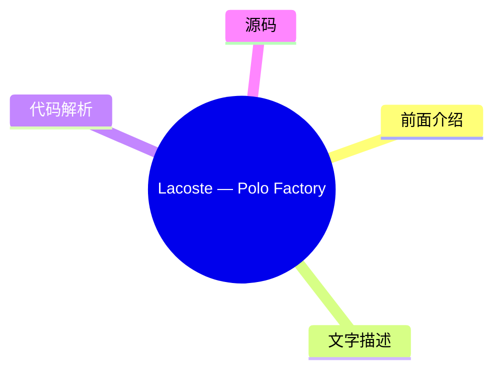
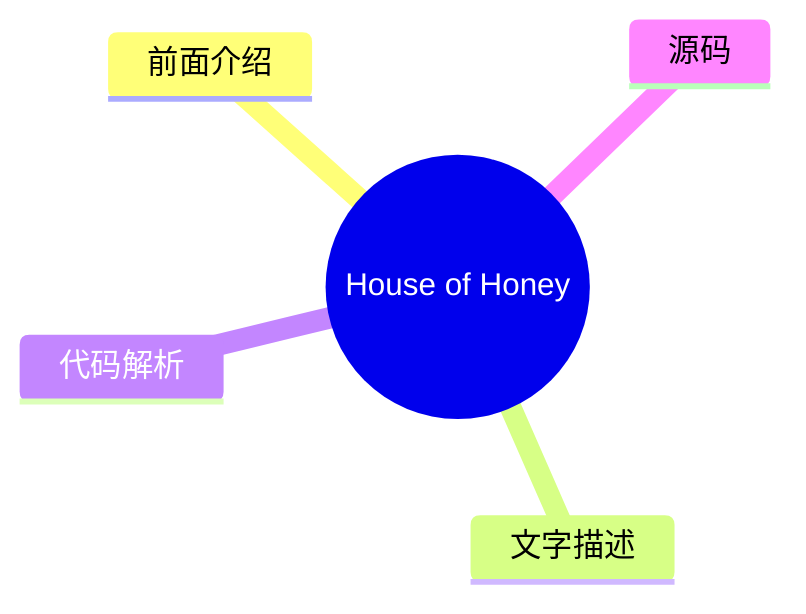
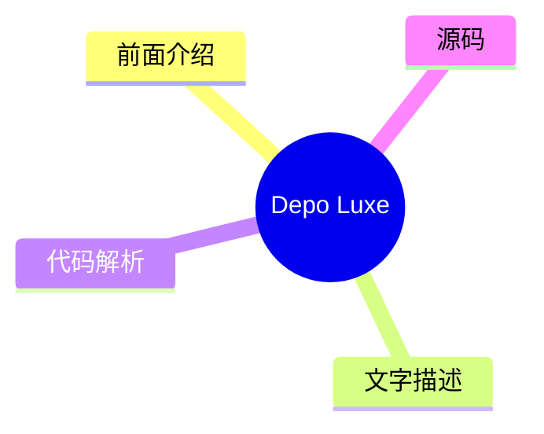

# 🏆 Awwwards Top 8 (2026-08-05)

## 前面介绍

- 数据源：Awwwards
- 抓取日期：2026-08-05
- 条目数：8
- 含完整正文：0
- 含代码片段：0
- 组织方式：前面介绍 / 树状图 / 文字描述 / 代码解析 / 源码

## 思维导图

## 详细整理（8 条，0 条含全文，0 条含代码）

### 1. GSAP 作品集
- **链接**: [https://www.awwwards.com/sites/made-with-gsap-1](https://www.awwwards.com/sites/made-with-gsap-1)
- **发布**: Wed, 29 Jul 2026 00:00:00 +0000

#### 前面介绍

- 收录了独特且精心制作的 JS 交互动效
- 持续增长的创意作品集合

#### 树状图

#### 文字描述

- 这是一个展示 GSAP (GreenSock Animation Platform) 创意潜力的作品集网站
- 展示了大量高质量的 JavaScript 动画效果
- 适合作为前端动画实现的灵感参考

#### 代码解析

- 本文未提供源码，以下为实现思路或结构解析
- 主要利用 GSAP 的 Timeline、ScrollTrigger 等插件实现复杂的滚动动画
- 通过 CSS3 结合 JS 实现高性能的视觉过渡效果

#### 源码

未抓到可展示源码或原文节选。

### 2. Dragonfly Redux
- **链接**: [https://www.awwwards.com/sites/dragonfly-redux](https://www.awwwards.com/sites/dragonfly-redux)
- **发布**: Wed, 22 Jul 2026 00:00:00 +0000

#### 前面介绍

- 专注于加密货币领域的投资机构
- 致力于推动加密团队在全球范围内的采用

#### 树状图

#### 文字描述

- Dragonfly Redux 是一家专注于加密货币领域的投资机构
- 旨在为具有全球抱负的加密货币团队提供接入渠道和影响力
- 致力于寻找并支持加密技术在全球范围内的落地应用

#### 代码解析

- 本文未提供源码，以下为实现思路或结构解析
- 作为投资机构官网，通常包含复杂的交互式数据可视化图表
- 可能使用 WebGL 或 Canvas 技术展示加密市场数据或投资组合

#### 源码

未抓到可展示源码或原文节选。

### 3. RISK
- **链接**: [https://www.awwwards.com/sites/risk](https://www.awwwards.com/sites/risk)
- **发布**: Wed, 15 Jul 2026 00:00:00 +0000

#### 前面介绍

- 后期制作工作室
- 专注于视觉效果的后期处理

#### 树状图

#### 文字描述

- RISK 是一家专业的后期制作工作室
- 专注于为电影、广告和视频项目提供高质量的视觉特效
- 致力于通过后期技术提升视觉叙事的表现力

#### 代码解析

- 本文未提供源码，以下为实现思路或结构解析
- 此类作品通常侧重于视觉特效合成与调色
- 可能涉及复杂的粒子系统、光影模拟以及色彩管理流程

#### 源码

未抓到可展示源码或原文节选。

### 4. Julien Calot
- **链接**: [https://www.awwwards.com/sites/julien-calot](https://www.awwwards.com/sites/julien-calot)
- **发布**: Wed, 08 Jul 2026 00:00:00 +0000

#### 前面介绍

- 视觉艺术家与多学科创意人
- 在巴黎和纽约之间工作

#### 树状图

#### 文字描述

- Julien Calot 是一位视觉艺术家和多学科创意人
- 活跃于巴黎和纽约两地，进行跨文化的艺术创作
- 其作品通常融合了平面设计、摄影与动态视觉元素

#### 代码解析

- 本文未提供源码，以下为实现思路或结构解析
- 作品展示页面通常采用沉浸式的大图浏览体验
- 可能使用视差滚动或平滑过渡效果来增强浏览体验

#### 源码

未抓到可展示源码或原文节选。

### 5. Obys® 实验空间
- **链接**: [https://www.awwwards.com/sites/obys-r-experiment-space](https://www.awwwards.com/sites/obys-r-experiment-space)
- **发布**: Tue, 28 Jul 2026 00:00:00 +0000

#### 前面介绍

- 未发布作品的互动档案库
- 包含概念、实验和替代方向

#### 树状图

#### 文字描述

- Obys® 实验空间是一个未发布作品的互动档案库
- 收录了概念、实验、替代方向以及极少见的创意想法
- 展示了创意团队在正式案例研究之外的探索过程

#### 代码解析

- 本文未提供源码，以下为实现思路或结构解析
- 通常包含大量交互式元素和独特的用户界面设计
- 可能使用 JavaScript 实现复杂的鼠标跟随或视差交互效果

#### 源码

未抓到可展示源码或原文节选。

### 6. Lacoste — Polo Factory
- **链接**: [https://www.awwwards.com/sites/lacoste-polo-factory](https://www.awwwards.com/sites/lacoste-polo-factory)
- **发布**: Tue, 21 Jul 2026 00:00:00 +0000

#### 前面介绍

- Lacoste Polo 工厂官网
- 展示 Polo 衫的诞生过程

#### 树状图

#### 文字描述

- 欢迎来到 Lacoste Polo Factory 官网
- 旨在展示 Polo 衫从设计到成衣的诞生过程
- 通过数字体验传递品牌对工艺和品质的专注

#### 代码解析

- 本文未提供源码，以下为实现思路或结构解析
- 通常包含产品展示、工艺流程介绍等模块
- 可能使用 3D 模型展示面料纹理或裁剪工艺

#### 源码

未抓到可展示源码或原文节选。

### 7. House of Honey
- **链接**: [https://www.awwwards.com/sites/house-of-honey-1](https://www.awwwards.com/sites/house-of-honey-1)
- **发布**: Tue, 14 Jul 2026 00:00:00 +0000

#### 前面介绍

- 以故事为导向的空间设计
- 通过编辑优雅和流畅交互构建数字形象

#### 树状图

#### 文字描述

- House of Honey 是一家以故事为导向的空间设计公司
- 他们构建了一个精致的数字形象，反映了这种感官哲学
- 通过编辑优雅和流畅的交互来传达品牌理念

#### 代码解析

- 本文未提供源码，以下为实现思路或结构解析
- 网站设计强调流畅的页面切换和微交互
- 可能使用平滑滚动和动态排版来增强叙事感

#### 源码

未抓到可展示源码或原文节选。

### 8. Depo Luxe
- **链接**: [https://www.awwwards.com/sites/depo-luxe](https://www.awwwards.com/sites/depo-luxe)
- **发布**: Tue, 07 Jul 2026 00:00:00 +0000

#### 前面介绍

- 当代奢华的战略与电影化方法
- 专注于高端品牌体验

#### 树状图

#### 文字描述

- Depo Luxe 采用战略性和电影化的方法来处理当代奢华
- 专注于为高端品牌提供独特的视觉解决方案
- 通过电影般的视觉语言传达奢华品牌的独特价值

#### 代码解析

- 本文未提供源码，以下为实现思路或结构解析
- 此类网站通常具有电影质感的视觉风格和慢速滚动效果
- 可能使用高分辨率的视频背景和精细的排版设计

#### 源码

未抓到可展示源码或原文节选。

