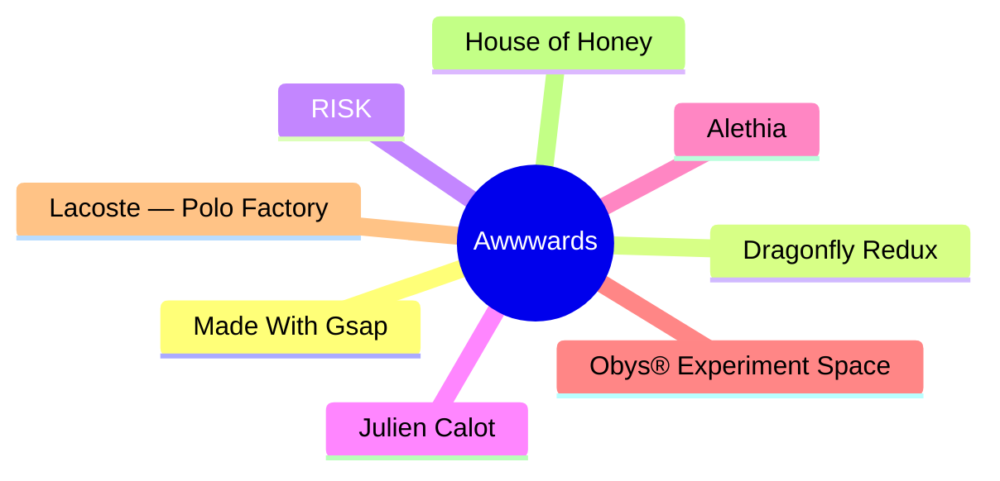
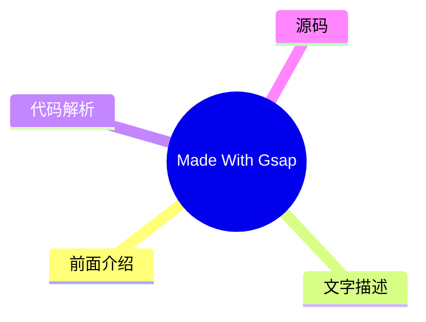
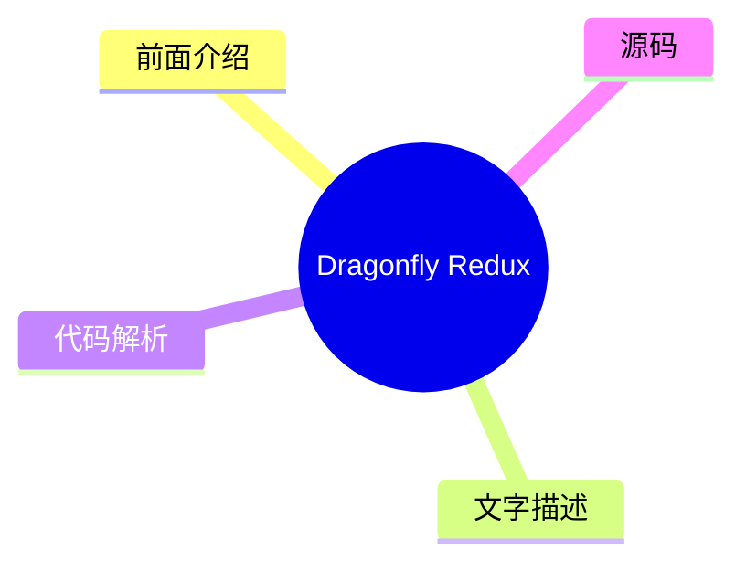
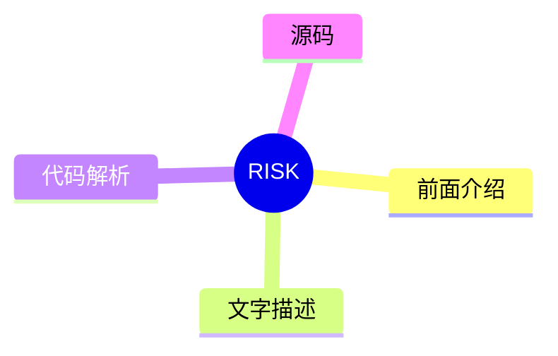
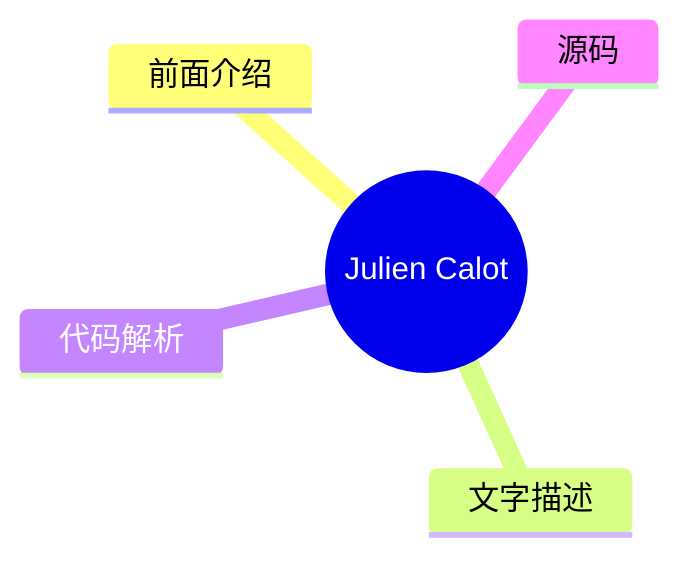
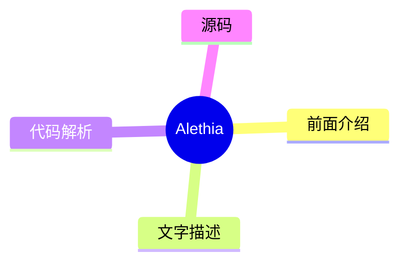
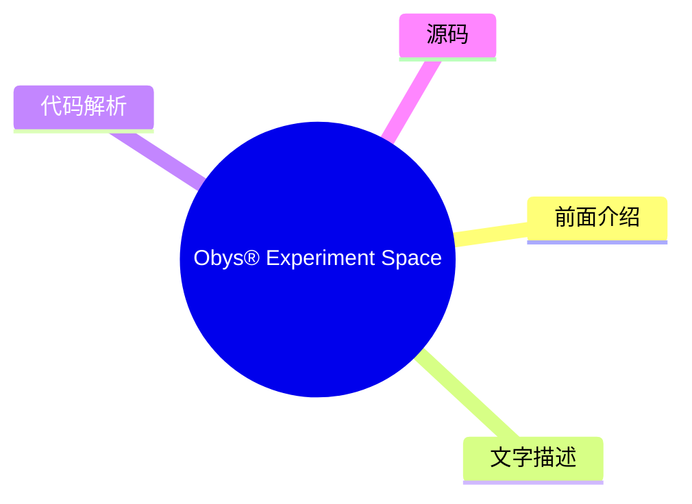
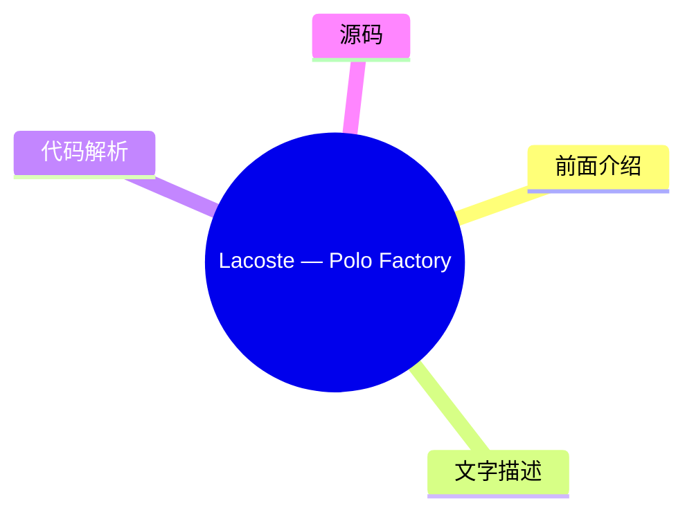
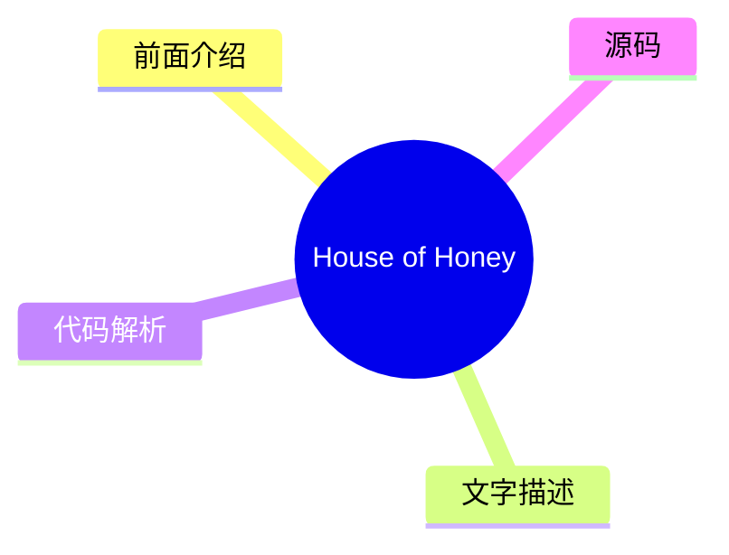

# 🏆 Awwwards Top 8 (2026-08-07)

## 前面介绍

- 数据源：Awwwards
- 抓取日期：2026-08-07
- 条目数：8
- 含完整正文：0
- 含代码片段：0
- 组织方式：前面介绍 / 树状图 / 文字描述 / 代码解析 / 源码

## 思维导图

## 详细整理（8 条，0 条含全文，0 条含代码）

### 1. Made With Gsap
- **链接**: [https://www.awwwards.com/sites/made-with-gsap-1](https://www.awwwards.com/sites/made-with-gsap-1)
- **发布**: Wed, 29 Jul 2026 00:00:00 +0000

#### 前面介绍

- Made With Gsap is an ever-growing collection of unique, well-crafted JS effects.
- 发布时间：Wed, 29 Jul 2026 00:00:00 +0000

#### 树状图

#### 文字描述

- Made With Gsap is an ever-growing collection of unique, well-crafted JS effects.

#### 代码解析

- 本文未检测到明确代码块，内容更偏新闻、观点或方法论。

#### 源码

未抓到可展示源码或原文节选。

### 2. Dragonfly Redux
- **链接**: [https://www.awwwards.com/sites/dragonfly-redux](https://www.awwwards.com/sites/dragonfly-redux)
- **发布**: Wed, 22 Jul 2026 00:00:00 +0000

#### 前面介绍

- Eight years in crypto, Dragonfly brings access and influence to crypto teams with global aspirations to find adoption anywhere.
- 发布时间：Wed, 22 Jul 2026 00:00:00 +0000

#### 树状图

#### 文字描述

- Eight years in crypto, Dragonfly brings access and influence to crypto teams with global aspirations to find adoption anywhere.

#### 代码解析

- 本文未检测到明确代码块，内容更偏新闻、观点或方法论。

#### 源码

未抓到可展示源码或原文节选。

### 3. RISK
- **链接**: [https://www.awwwards.com/sites/risk](https://www.awwwards.com/sites/risk)
- **发布**: Wed, 15 Jul 2026 00:00:00 +0000

#### 前面介绍

- Post Production Studio
- 发布时间：Wed, 15 Jul 2026 00:00:00 +0000

#### 树状图

#### 文字描述

- Post Production Studio

#### 代码解析

- 本文未检测到明确代码块，内容更偏新闻、观点或方法论。

#### 源码

未抓到可展示源码或原文节选。

### 4. Julien Calot
- **链接**: [https://www.awwwards.com/sites/julien-calot](https://www.awwwards.com/sites/julien-calot)
- **发布**: Wed, 08 Jul 2026 00:00:00 +0000

#### 前面介绍

- Visual artist & multidisciplinary creativeWorks between Paris and New York
- 发布时间：Wed, 08 Jul 2026 00:00:00 +0000

#### 树状图

#### 文字描述

- Visual artist & multidisciplinary creativeWorks between Paris and New York

#### 代码解析

- 本文未检测到明确代码块，内容更偏新闻、观点或方法论。

#### 源码

未抓到可展示源码或原文节选。

### 5. Alethia
- **链接**: [https://www.awwwards.com/sites/alethia](https://www.awwwards.com/sites/alethia)
- **发布**: Wed, 05 Aug 2026 00:00:00 +0000

#### 前面介绍

- A website where content, visuals, and interaction work as one system to make complex environmental data feel clear and trustworthy.
- 发布时间：Wed, 05 Aug 2026 00:00:00 +0000

#### 树状图

#### 文字描述

- A website where content, visuals, and interaction work as one system to make complex environmental data feel clear and trustworthy.

#### 代码解析

- 本文未检测到明确代码块，内容更偏新闻、观点或方法论。

#### 源码

未抓到可展示源码或原文节选。

### 6. Obys® Experiment Space
- **链接**: [https://www.awwwards.com/sites/obys-r-experiment-space](https://www.awwwards.com/sites/obys-r-experiment-space)
- **发布**: Tue, 28 Jul 2026 00:00:00 +0000

#### 前面介绍

- Obys® Experiment Space is an interactive archive of unpublished works, concepts, experiments, and alternative directions. A collection of ideas rarely seen beyond final case studies.
- 发布时间：Tue, 28 Jul 2026 00:00:00 +0000

#### 树状图

#### 文字描述

- Obys® Experiment Space is an interactive archive of unpublished works, concepts, experiments, and alternative directions. A collection of ideas rarely seen beyond final case studies.

#### 代码解析

- 本文未检测到明确代码块，内容更偏新闻、观点或方法论。

#### 源码

未抓到可展示源码或原文节选。

### 7. Lacoste — Polo Factory
- **链接**: [https://www.awwwards.com/sites/lacoste-polo-factory](https://www.awwwards.com/sites/lacoste-polo-factory)
- **发布**: Tue, 21 Jul 2026 00:00:00 +0000

#### 前面介绍

- Welcome to the Lacoste Polo Factory. Where polos are born.
- 发布时间：Tue, 21 Jul 2026 00:00:00 +0000

#### 树状图

#### 文字描述

- Welcome to the Lacoste Polo Factory. Where polos are born.

#### 代码解析

- 本文未检测到明确代码块，内容更偏新闻、观点或方法论。

#### 源码

未抓到可展示源码或原文节选。

### 8. House of Honey
- **链接**: [https://www.awwwards.com/sites/house-of-honey-1](https://www.awwwards.com/sites/house-of-honey-1)
- **发布**: Tue, 14 Jul 2026 00:00:00 +0000

#### 前面介绍

- House of Honey designs spaces with story. We built a sophisticated digital presence that mirrors this sensory philosophy through editorial elegance and fluid interaction.
- 发布时间：Tue, 14 Jul 2026 00:00:00 +0000

#### 树状图

#### 文字描述

- House of Honey designs spaces with story. We built a sophisticated digital presence that mirrors this sensory philosophy through editorial elegance and fluid interaction.

#### 代码解析

- 本文未检测到明确代码块，内容更偏新闻、观点或方法论。

#### 源码

未抓到可展示源码或原文节选。

