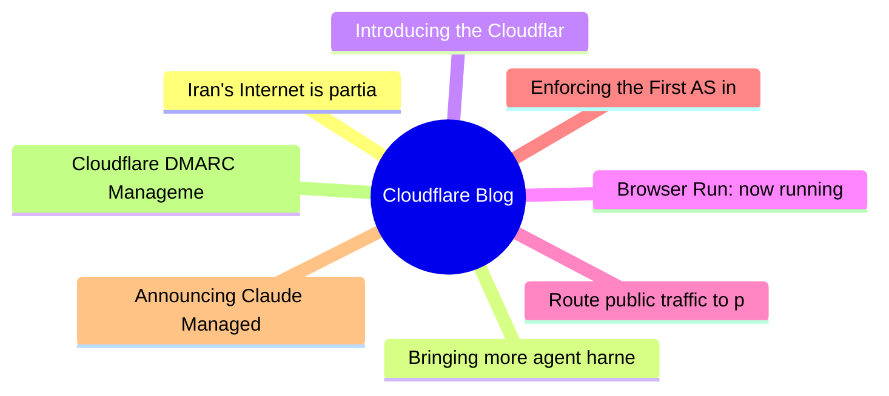

# ☁️ Cloudflare Blog Top 8 (2026-06-18)

## 思维导图

## 列表（8 条）

### 1. Iran's Internet is partially restored, Cloudflare Radar data shows
- **链接**: [https://blog.cloudflare.com/iran-internet-partially-restored-may-2026/](https://blog.cloudflare.com/iran-internet-partially-restored-may-2026/)
- **作者**: Lai Yi Ohlsen
- **发布**: Wed, 27 May 2026 17:25:00 GMT
- **简介**: Cloudflare Radar data confirms early indications of a partial Internet restoration in Iran, nearly three months after the shutdown began. Traffic spikes and DNS queries have risen, but network activity is currently just 

### 2. Bringing more agent harnesses and frameworks to Cloudflare, starting with Flue
- **链接**: [https://blog.cloudflare.com/agents-platform-flue-sdk/](https://blog.cloudflare.com/agents-platform-flue-sdk/)
- **作者**: Thomas Gauvin
- **发布**: Wed, 17 Jun 2026 19:35:00 GMT
- **简介**: The Agents SDK is now a runtime any agent framework can build on. Today we're opening up the Agents SDK primitives, with Flue as a first framework targeting Agents SDK, and rolling out agents in the dashboard.

### 3. Introducing the Cloudflare One stack: agent-powered deployment
- **链接**: [https://blog.cloudflare.com/cloudflare-one-stack/](https://blog.cloudflare.com/cloudflare-one-stack/)
- **作者**: AJ Gerstenhaber
- **发布**: Wed, 17 Jun 2026 13:00:00 GMT
- **简介**: The Cloudflare One stack is a library of agent skills that gives any AI agent the knowledge it needs to plan, deploy, and manage a Zero Trust environment — no migration calls required.

### 4. Browser Run: now running on Cloudflare Containers, it’s faster and more scalable
- **链接**: [https://blog.cloudflare.com/browser-run-containers/](https://blog.cloudflare.com/browser-run-containers/)
- **作者**: Ruskin Constant
- **发布**: Wed, 13 May 2026 13:00:00 GMT
- **简介**: We’ve enabled higher usage limits, faster performance, better reliability, and increased shipping velocity for our Browser Run product by rebuilding on top of Cloudflare’s Containers. Here’s how.

### 5. Route public traffic to private applications with Cloudflare
- **链接**: [https://blog.cloudflare.com/private-origins-dns-routing/](https://blog.cloudflare.com/private-origins-dns-routing/)
- **作者**: Enrique Somoza
- **发布**: Wed, 10 Jun 2026 13:00:00 GMT
- **简介**: Application Services for Private Origins is available now in closed beta. Route public hostnames to private IP origins over your existing IPsec, GRE, CNI, or Cloudflare Mesh paths. No public IPs or extra connector softwa

### 6. Enforcing the First AS in BGP AS_PATHs
- **链接**: [https://blog.cloudflare.com/enforce-first-as-bgp/](https://blog.cloudflare.com/enforce-first-as-bgp/)
- **作者**: Bryton Herdes
- **发布**: Wed, 03 Jun 2026 17:00:00 GMT
- **简介**: BGP is vulnerable to routing hijacks and path leaks that negatively impact traffic on the Internet. RPKI helps solve some of these problems, but for some forged paths, we need to rely on a simpler mechanism: First AS enf

### 7. Announcing Claude Managed Agents on Cloudflare
- **链接**: [https://blog.cloudflare.com/claude-managed-agents/](https://blog.cloudflare.com/claude-managed-agents/)
- **作者**: Mike Nomitch
- **发布**: Tue, 19 May 2026 13:00:00 GMT
- **简介**: Cloudflare has integrated with Anthropic's Claude Managed Agents to provide a fast, isolated execution environment for autonomous code delivery. This means builders can scale agent workflows globally while strictly contr

### 8. Cloudflare DMARC Management is now generally available
- **链接**: [https://blog.cloudflare.com/dmarc-management-ga/](https://blog.cloudflare.com/dmarc-management-ga/)
- **作者**: Ayush Kumar
- **发布**: Tue, 16 Jun 2026 13:00:00 GMT
- **简介**: Get unified visibility into your email authentication posture and reach full DMARC enforcement with deeper reporting, record analysis, and SPF audits free for every Cloudflare customer.
