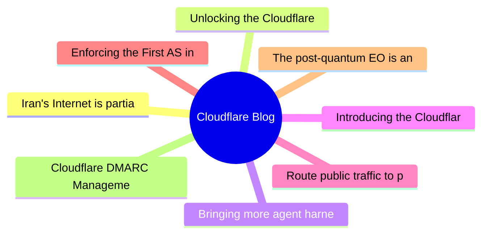

# ☁️ Cloudflare Blog Top 8 (2026-06-25)

## 思维导图

## 列表（8 条，3 条含全文）

### 1. Iran's Internet is partially restored, Cloudflare Radar data shows
- **链接**: [https://blog.cloudflare.com/iran-internet-partially-restored-may-2026/](https://blog.cloudflare.com/iran-internet-partially-restored-may-2026/)
- **作者**: Lai Yi Ohlsen
- **发布**: Wed, 27 May 2026 17:25:00 GMT
- **简介**: Cloudflare Radar data confirms early indications of a partial Internet restoration in Iran, nearly three months after the shutdown began. Traffic spikes and DNS queries have risen, but network activity is currently just 

📄 全文（4021 字符，点击展开）

On Tuesday, May 26, Iranâs vice president __announced__

__Cloudflare Radar____Iranâs connectivity__

    
      

### The first shutdown

      
    
    Iranian citizens have experienced two national Internet shutdowns this year. The first began on January 8 around 16:30 UTC (20:00 local time), and we explored the impact seen over the first few days __in a blog post__

    
      

### The second shutdown

      
    
    In late February, as military strikes on Iran escalated, a second nationwide Internet shutdown began. That sweeping shutdown has persisted for nearly three months.

The shutdown began on February 28. On that date, __Cloudflare Radar observed____Iran____small amounts of Web and DNS traffic__

    
      

### Activity on May 26

      
    
    Our observations indicate that more traffic is now finally able to get through. Starting at around 11:00 UTC on May 26, 87 days after the second shutdown started, Cloudflare Radar observed a marked increase in both traffic and DNS queries.

    
      

#### Traffic increase

      
    
    Data for bytes transferred across Cloudflareâs network shows a brief spike at 11:45 UTC, followed by a steady increase starting at 12:00 UTC. This surge in activity is roughly 15x than the levels observed during the prior week. Following expected diurnal patterns, the traffic starts declining around 21:00 UTC, followed by an increase starting at May 27 3:00 UTC (6:30 local time). 

An increase in bytes transferred shows that a higher volume of data is successfully moving across Cloudflareâs network, which is a hopeful signal that a partial restoration is underway. 

    
      

#### Traffic volume by region

      
    
    Cloudflare Radarâs regional breakdowns, shown below, indicate that the vast majority of this new traffic is localized to Tehran, with 91.6% of HTTP requests originating from the capital city. While other regions show minor increases, they are not nearly as significant.

    
      

#### Traffic volume by network 

      
    
    Following an initial burst at 11:45 UTC, Internet providers TCI, IranCell, RighTel and MCCI each saw increases in traffic. Cloudflare Radar measures this traffic by ASN, the unique identifier assigned to an individual network or group of networks.  

    
      

#### DNS query increase 

      
    
    As shown in the graph below, queries to Cloudflareâs public DNS resolver (1.1.1.1) have also spiked. Because an increase in DNS traffic indicates that more users are requesting websites and services, this upward trend serves as a strong indicator that online access is returning. 

 
    
      

### Traffic has returned to 40% of previous levels

      
    
    These increases in traffic validates that a partial restoration of Iranâs Internet has taken place. However, though these increases in DNS queries and traffic are significant, they remain well below what we observed prior to either disruption. As shown in the graph below, at its peak on May 26, traffic had only returned to 40% of the maximum amount of activity observed so far in 2026.

          
          Network activity over the coming days will reveal whether traffic levels will successfully return to their pre-shutdown baselines. It should also be noted, however, that these changes could be temporary; as demonstrated in January, brief periods of recovery can quickly reverse.

    
      

### IPv6 remains impacted

      
    
    In January, __we reported____thus IPv6 traffic from Iran__

This is noteworthy because in contrast with IPv6, address space announcements for IPv4 have remained fairly consistent and stable throughout both major 2026 shutdowns in Iran. The fact that IPv4 addresses were not removed from global routing tables, combined with the complete loss of actual traffic, suggests that Iranâs shutdown was achieved through other technical means such as application filtering or whitelisting.   

*IPV6 address space dropped precipitously in January and has n

...（截断，原文 4564+ 字符）

### 2. Unlocking the Cloudflare app ecosystem with OAuth for all
- **链接**: [https://blog.cloudflare.com/oauth-for-all/](https://blog.cloudflare.com/oauth-for-all/)
- **作者**: Sam Cabell
- **发布**: Wed, 24 Jun 2026 06:00:00 GMT
- **简介**: Self-Managed OAuth is now available to all developers on Cloudflare. Here's how we executed a zero-downtime migration of our core OAuth engine to make it happen.

📄 全文（4022 字符，点击展开）

Cloudflare provides services that help run 20% of the web, but we donât do it alone. Developers on our platform use a myriad of tools and services from other companies too. Cloudflare provides a rich API for our platform that enables developers to create automations, CI/CD, and integrations that glue together the various parts of their infrastructure. Earlier this month, we announced __self-managed OAuth__

Cloudflare isnât new to OAuth. If youâve used Wrangler, or used integrations from partners like PlanetScale, then youâve already used it. However, until now, third-party OAuth was only available through a small number of manually onboarded integrations, and was not available to developers more broadly. That meant developers building their own integrations had to rely on API tokens, which are harder to manage and a poor fit for many delegated application flows. 

Over the last year, we onboarded a growing number of early partners while improving the consent, revocation, and security model behind Cloudflare OAuth. But as our Developer Platform grew and agentic tools drove demand for delegated access, it became clear that opening up OAuth to all customers was critical to the success of our platform. 

With self-managed OAuth, developers can now offer a standard OAuth flow where customers grant scoped access directly, making it easier to build SaaS integrations, internal developer platforms, and agentic tools while giving users clearer consent, easier revocation, and more control over what an application can do.

    
      

## Scaling the ecosystem securely

      
    
    While our earlier OAuth solution was sufficient for a small number of carefully managed partners, we realized that our permissions model, our consent experience, and our ways of mitigating potential abuse vectors were not mature enough. 

Earlier this year we __updated our consent experience__

Opening self-managed OAuth to all customers also required major upgrades to our underlying OAuth engine. This process required a large amount of planning to do with minimal user interruption, while also ensuring data stability and security.

    
      

## Planning the upgrade to our OAuth engine

      
    
    Years ago, we deployed __Hydra__

As we planned the upgrade, we decided to do two smaller sequential upgrades rather than doing one large upgrade.  First, we would move to the latest 1.X release, evaluate any behavior or performance changes, and then proceed with the 2.X upgrade.

During our upgrade planning, it became clear that even the 1.X upgrade would* *still impact customers because the Hydra database required extensive schema migrations that:

- Created indexes in a manner that would claim an exclusive lock on critical tables, preventing active users from performing important OAuth operations  
- Added columns to critical tables, and moved other columns to new tables 

There was also a quirk in the version of Hydra we were using in which the SDK would perform SELECT * operations, causing deserialization issues with the schema changes.

To prevent user impact, we rewrote the SQL migrations to use features such as CREATE INDEX CONCURRENTLY, and built a custom version of Hydra which selected explicit columns rather than SELECT *.

With the latest 1.X upgrade planned out, we now needed to create a plan for the even larger 2.X upgrade. We identified three potential options, and weighed the benefits and drawbacks of each one. Doing an in-place upgrade was not going to work for us, due to the sheer amount of schema changes the major version bump brought with it. We decided that a blue-green strategy would work, but there was more that needed to be done than simply flipping a switch to start using the new version. The upgrade and migration process would take multiple hours, and we needed the system to continue functioning correctly in that time window.

The first blue-green option would involve disabling writes to the database, preventing any new autho

...（截断，原文 10118+ 字符）

### 3. Bringing more agent harnesses and frameworks to Cloudflare, starting with Flue
- **链接**: [https://blog.cloudflare.com/agents-platform-flue-sdk/](https://blog.cloudflare.com/agents-platform-flue-sdk/)
- **作者**: Thomas Gauvin
- **发布**: Wed, 17 Jun 2026 19:35:00 GMT
- **简介**: The Agents SDK is now a runtime any agent framework can build on. Today we're opening up the Agents SDK primitives, with Flue as a first framework targeting Agents SDK, and rolling out agents in the dashboard.

📄 全文（4022 字符，点击展开）

2026 is the year agent harnesses go to production. The software that controls the modelâs access to the outside world â harnesses like Codex, Claude Code, OpenCode, Pi, and Project Think â has matured to the point where teams are deploying agents as real, load-bearing infrastructure, not just prototypes. 

But building agents that survive production is hard.

We learned this firsthand building __Project Think__

A harness canât solve these problems on its own. Theyâre tied to state, storage and compute â which means theyâre dependent on the platform the agent runs on. Thatâs why weâre taking our learnings from hardening __Project Think____Cloudflare Agents SDK__

At the same time, a new layer has emerged above the harness. Frameworks like [Flue](https://flueframework.com/) wrap a harness with the project structures, conventions, integrations and developer experience that make agents productive to build. 

To solve these scaling challenges, thereâs a new, three-layer stack that is emerging for building production-grade AI. Here is how the pieces fit together, moving from the user-facing developer experience down to the underlying platform primitives: 

- **The framework (Flue)**â the project structure, the conventions, the integrations, the CLI and the developer experience for building agents.
 
- **The harness**- **(Pi, Project Think)**â  the agentic loop that calls tools, reads results, manages context and keeps going until the task is done.
 
- **The runtime/platform**- **(the Cloudflare Agents SDK)**â the compute, state, and storage primitives everything above depends on
 

The Agents SDK is that bottom layer: it makes primitives like durable execution available to any harness and any framework. Flue, our new open-source framework from the team behind __Astro__

    
      

## Flue

      
    
    __Flue____Pi____OpenClaw__

This declarative model is what makes writing agents easy: hereâs a triage agent that intercepts a bug report, reproduces it in a sandbox, and diagnoses the issue in under 25 lines.

          
    
      

### The Flue developer experience

      
    
    Flueâs power comes from the fact that agents donât live in isolation. They are built to exist where your users already work, and integrate with your preferred tooling:

- **Anywhere agents**: Drop your agents into Slack, GitHub, Linear, or Discord with pre-configured Channels that handle event verification and dispatch boilerplate automatically.
 
- **Headless, but UI-ready**: Agents shouldnât live in a black box. Flue agents can run completely headlessly for background tasks, but- __@flue/react__
 
- **Ecosystem-ready**: Flue makes it easy to add and upgrade integrations with commands like- `flue add channel slack`, generating a Markdown blueprint that your own coding agent can read, modify, and cleanly integrate straight into your codebase.
 

      

### Designed for production, not just prototypes

      
    
    Moving an agent out of a local terminal and into a production ecosystem introduces traditional distributed systems failures. Host crashes, API timeouts from LLM providers, and unexpected restarts threaten to erase the short-term memory of a running agent turn. 

Flue solves this via Durable Streams. Each event in the execution history is added to an append-only log. By processing every prompt, tool response and model choice as an unchangeable ledger, an agentâs state is never volatile. If a process dies, another simply picks up the log and continues from the exact step it left off. 

    
      

### Deploy anywhere, including Cloudflare

      
    
    Flue is a multi-cloud framework. On __Node.js__

By running each Flue agent inside its own Durable Object, Cloudflare can automatically scale to as many agents as you need, each with their own isolated storage and compute. You donât have to provision servers, manage sticky sessions, or worry about noisy neighbors. And when Flue agents are deployed to Cloudflare, they get durabl

...（截断，原文 11112+ 字符）

### 4. Introducing the Cloudflare One stack: agent-powered deployment
- **链接**: [https://blog.cloudflare.com/cloudflare-one-stack/](https://blog.cloudflare.com/cloudflare-one-stack/)
- **作者**: AJ Gerstenhaber
- **发布**: Wed, 17 Jun 2026 13:00:00 GMT
- **简介**: The Cloudflare One stack is a library of agent skills that gives any AI agent the knowledge it needs to plan, deploy, and manage a Zero Trust environment — no migration calls required.

### 5. Route public traffic to private applications with Cloudflare
- **链接**: [https://blog.cloudflare.com/private-origins-dns-routing/](https://blog.cloudflare.com/private-origins-dns-routing/)
- **作者**: Enrique Somoza
- **发布**: Wed, 10 Jun 2026 13:00:00 GMT
- **简介**: Application Services for Private Origins is available now in closed beta. Route public hostnames to private IP origins over your existing IPsec, GRE, CNI, or Cloudflare Mesh paths. No public IPs or extra connector softwa

### 6. Enforcing the First AS in BGP AS_PATHs
- **链接**: [https://blog.cloudflare.com/enforce-first-as-bgp/](https://blog.cloudflare.com/enforce-first-as-bgp/)
- **作者**: Bryton Herdes
- **发布**: Wed, 03 Jun 2026 17:00:00 GMT
- **简介**: BGP is vulnerable to routing hijacks and path leaks that negatively impact traffic on the Internet. RPKI helps solve some of these problems, but for some forged paths, we need to rely on a simpler mechanism: First AS enf

### 7. The post-quantum EO is an important milestone. Now it’s time to get to work
- **链接**: [https://blog.cloudflare.com/post-quantum-eo-2026/](https://blog.cloudflare.com/post-quantum-eo-2026/)
- **作者**: Sharon Goldberg
- **发布**: Tue, 23 Jun 2026 18:25:18 GMT
- **简介**: The new post-quantum executive order sets a 2030 migration deadline and establishes a powerful foundation for post-quantum resilience. We look at what it gets right, where it can go further, and our migration playbook fo

### 8. Cloudflare DMARC Management is now generally available
- **链接**: [https://blog.cloudflare.com/dmarc-management-ga/](https://blog.cloudflare.com/dmarc-management-ga/)
- **作者**: Ayush Kumar
- **发布**: Tue, 16 Jun 2026 13:00:00 GMT
- **简介**: Get unified visibility into your email authentication posture and reach full DMARC enforcement with deeper reporting, record analysis, and SPF audits free for every Cloudflare customer.
