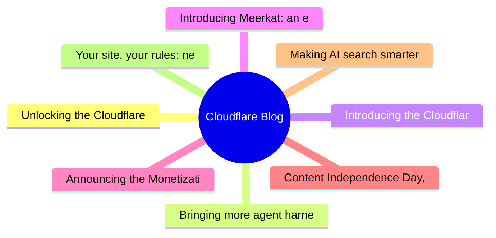

# ☁️ Cloudflare Blog Top 8 (2026-07-09)

## 思维导图

## 列表（8 条，3 条含全文）

### 1. Unlocking the Cloudflare app ecosystem with OAuth for all
- **链接**: [https://blog.cloudflare.com/oauth-for-all/](https://blog.cloudflare.com/oauth-for-all/)
- **作者**: Sam Cabell
- **发布**: Wed, 24 Jun 2026 06:00:00 GMT
- **简介**: Self-Managed OAuth is now available to all developers on Cloudflare. Here's how we executed a zero-downtime migration of our core OAuth engine to make it happen.

📄 全文（4022 字符，点击展开）

Cloudflare provides services that help run 20% of the web, but we donât do it alone. Developers on our platform use a myriad of tools and services from other companies too. Cloudflare provides a rich API for our platform that enables developers to create automations, CI/CD, and integrations that glue together the various parts of their infrastructure. Earlier this month, we announced __self-managed OAuth__

Cloudflare isnât new to OAuth. If youâve used Wrangler, or used integrations from partners like PlanetScale, then youâve already used it. However, until now, third-party OAuth was only available through a small number of manually onboarded integrations, and was not available to developers more broadly. That meant developers building their own integrations had to rely on API tokens, which are harder to manage and a poor fit for many delegated application flows. 

Over the last year, we onboarded a growing number of early partners while improving the consent, revocation, and security model behind Cloudflare OAuth. But as our Developer Platform grew and agentic tools drove demand for delegated access, it became clear that opening up OAuth to all customers was critical to the success of our platform. 

With self-managed OAuth, developers can now offer a standard OAuth flow where customers grant scoped access directly, making it easier to build SaaS integrations, internal developer platforms, and agentic tools while giving users clearer consent, easier revocation, and more control over what an application can do.

    
      

## Scaling the ecosystem securely

      
    
    While our earlier OAuth solution was sufficient for a small number of carefully managed partners, we realized that our permissions model, our consent experience, and our ways of mitigating potential abuse vectors were not mature enough. 

Earlier this year we __updated our consent experience__

Opening self-managed OAuth to all customers also required major upgrades to our underlying OAuth engine. This process required a large amount of planning to do with minimal user interruption, while also ensuring data stability and security.

    
      

## Planning the upgrade to our OAuth engine

      
    
    Years ago, we deployed __Hydra__

As we planned the upgrade, we decided to do two smaller sequential upgrades rather than doing one large upgrade.  First, we would move to the latest 1.X release, evaluate any behavior or performance changes, and then proceed with the 2.X upgrade.

During our upgrade planning, it became clear that even the 1.X upgrade would* *still impact customers because the Hydra database required extensive schema migrations that:

- Created indexes in a manner that would claim an exclusive lock on critical tables, preventing active users from performing important OAuth operations  
- Added columns to critical tables, and moved other columns to new tables 

There was also a quirk in the version of Hydra we were using in which the SDK would perform SELECT * operations, causing deserialization issues with the schema changes.

To prevent user impact, we rewrote the SQL migrations to use features such as CREATE INDEX CONCURRENTLY, and built a custom version of Hydra which selected explicit columns rather than SELECT *.

With the latest 1.X upgrade planned out, we now needed to create a plan for the even larger 2.X upgrade. We identified three potential options, and weighed the benefits and drawbacks of each one. Doing an in-place upgrade was not going to work for us, due to the sheer amount of schema changes the major version bump brought with it. We decided that a blue-green strategy would work, but there was more that needed to be done than simply flipping a switch to start using the new version. The upgrade and migration process would take multiple hours, and we needed the system to continue functioning correctly in that time window.

The first blue-green option would involve disabling writes to the database, preventing any new autho

...（截断，原文 10118+ 字符）

### 2. Bringing more agent harnesses and frameworks to Cloudflare, starting with Flue
- **链接**: [https://blog.cloudflare.com/agents-platform-flue-sdk/](https://blog.cloudflare.com/agents-platform-flue-sdk/)
- **作者**: Thomas Gauvin
- **发布**: Wed, 17 Jun 2026 19:35:00 GMT
- **简介**: The Agents SDK is now a runtime any agent framework can build on. Today we're opening up the Agents SDK primitives, with Flue as a first framework targeting Agents SDK, and rolling out agents in the dashboard.

📄 全文（4022 字符，点击展开）

2026 is the year agent harnesses go to production. The software that controls the modelâs access to the outside world â harnesses like Codex, Claude Code, OpenCode, Pi, and Project Think â has matured to the point where teams are deploying agents as real, load-bearing infrastructure, not just prototypes. 

But building agents that survive production is hard.

We learned this firsthand building __Project Think__

A harness canât solve these problems on its own. Theyâre tied to state, storage and compute â which means theyâre dependent on the platform the agent runs on. Thatâs why weâre taking our learnings from hardening __Project Think____Cloudflare Agents SDK__

At the same time, a new layer has emerged above the harness. Frameworks like [Flue](https://flueframework.com/) wrap a harness with the project structures, conventions, integrations and developer experience that make agents productive to build. 

To solve these scaling challenges, thereâs a new, three-layer stack that is emerging for building production-grade AI. Here is how the pieces fit together, moving from the user-facing developer experience down to the underlying platform primitives: 

- **The framework (Flue)**â the project structure, the conventions, the integrations, the CLI and the developer experience for building agents.
 
- **The harness**- **(Pi, Project Think)**â  the agentic loop that calls tools, reads results, manages context and keeps going until the task is done.
 
- **The runtime/platform**- **(the Cloudflare Agents SDK)**â the compute, state, and storage primitives everything above depends on
 

The Agents SDK is that bottom layer: it makes primitives like durable execution available to any harness and any framework. Flue, our new open-source framework from the team behind __Astro__

    
      

## Flue

      
    
    __Flue____Pi____OpenClaw__

This declarative model is what makes writing agents easy: hereâs a triage agent that intercepts a bug report, reproduces it in a sandbox, and diagnoses the issue in under 25 lines.

          
    
      

### The Flue developer experience

      
    
    Flueâs power comes from the fact that agents donât live in isolation. They are built to exist where your users already work, and integrate with your preferred tooling:

- **Anywhere agents**: Drop your agents into Slack, GitHub, Linear, or Discord with pre-configured Channels that handle event verification and dispatch boilerplate automatically.
 
- **Headless, but UI-ready**: Agents shouldnât live in a black box. Flue agents can run completely headlessly for background tasks, but- __@flue/react__
 
- **Ecosystem-ready**: Flue makes it easy to add and upgrade integrations with commands like- `flue add channel slack`, generating a Markdown blueprint that your own coding agent can read, modify, and cleanly integrate straight into your codebase.
 

      

### Designed for production, not just prototypes

      
    
    Moving an agent out of a local terminal and into a production ecosystem introduces traditional distributed systems failures. Host crashes, API timeouts from LLM providers, and unexpected restarts threaten to erase the short-term memory of a running agent turn. 

Flue solves this via Durable Streams. Each event in the execution history is added to an append-only log. By processing every prompt, tool response and model choice as an unchangeable ledger, an agentâs state is never volatile. If a process dies, another simply picks up the log and continues from the exact step it left off. 

    
      

### Deploy anywhere, including Cloudflare

      
    
    Flue is a multi-cloud framework. On __Node.js__

By running each Flue agent inside its own Durable Object, Cloudflare can automatically scale to as many agents as you need, each with their own isolated storage and compute. You donât have to provision servers, manage sticky sessions, or worry about noisy neighbors. And when Flue agents are deployed to Cloudflare, they get durabl

...（截断，原文 11112+ 字符）

### 3. Introducing the Cloudflare One stack: agent-powered deployment
- **链接**: [https://blog.cloudflare.com/cloudflare-one-stack/](https://blog.cloudflare.com/cloudflare-one-stack/)
- **作者**: AJ Gerstenhaber
- **发布**: Wed, 17 Jun 2026 13:00:00 GMT
- **简介**: The Cloudflare One stack is a library of agent skills that gives any AI agent the knowledge it needs to plan, deploy, and manage a Zero Trust environment — no migration calls required.

📄 全文（4021 字符，点击展开）

Adopting or migrating to a Zero Trust network architecture can be a daunting task. Before a single policy changes, teams have to recall how their network is actually built: which applications exist, their authentication and authorization constructs, how traffic flows between them, and any assumptions the current architecture makes. This hands-on process requires practitioners to decode the intent behind every security and routing policy in place.

Today, weâre releasing the Cloudflare One stack, a __set of skills__

Cloudflare has worked with thousands of customers through exactly this process. That repetition built expertise on where migrations stall, what questions come up every time, and what it takes to move forward. The Cloudflare One stack packages that expertise and makes it more accessible than ever. 

    
      

### The agent gap in network security

      
    
    Teams are already using agents to write code, triage alerts, and automate workflows. Organizations are increasingly asking for Cloudflare-provided tooling to help agents execute on security workflows. On their own, agents are not trained on the nuances of an organization's specific network topology or vendor configurations.

By providing prescriptive and authoritative guidance, organizations can layer this context into their existing toolkit to make better use of the security products they are already deploying.

Cloudflare has long been the easiest-to-deploy SASE vendor in the market. The stack extends that philosophy to agents: it gives them the context, tools, and structured reasoning they need to operate on your security infrastructure.

    
      

## What is the Cloudflare One stack?

      
    
    The Cloudflare One stack is __a collection of skills____any skill____Cloudflare One__

The stack was built by synthesizing hand-curated knowledge from employees with tens of thousands of hours of experience working with customers on Cloudflare One products. It contains tools for planning, managing, and implementing your user and agent security infrastructure on Cloudflare. It also contains handpicked logic for migrating from legacy vendors like __Zscaler__

When used in conjunction with the __Cloudflare code mode MCP server__

    
      

## Whatâs in the stack?

      
    
    The Cloudflare One stack ships as two lightweight skill files: cloudflare-one and cloudflare-one-migration. Together they cover migrating to, building an implementation for, managing, and troubleshooting your Cloudflare One deployment:

- **Remote access and VPN replacement**with Cloudflare Access
 
- **User, network, device, and data security**with Cloudflare Gateway
 
- **Connectivity**with Cloudflare Tunnel, Cloudflare Mesh, and Cloudflare WAN
 
- **Migration guidance**with explicit detail for moving from other SASE vendors
 
- **Network diagram interpretation and generation**, so you can visualize proposed changes to your network in a way that is easy for you and your team to understand
 
- **Vendor concept translation**, which maps concepts between SASE vendors to reduce the barrier to evaluating and switching providers
 
- **Troubleshooting and operations**, with the Digital Experience Monitoring (DEX) toolkit and automated rule recommendations
 

      

## How it works

      
    
    The stack is available in the __Cloudflare Skills__

The cloudflare-one skill covers general product guidance. For example, if you ask an agent for the best way to replace your VPN infrastructure with Cloudflare Tunnel or Cloudflare Mesh, the skill knows how to:

- Inventory your existing VPN applications and identify which connectivity model each requires 
- Map each application to the appropriate Cloudflare primitive â self-hosted Access application, Tunnel-connected service, or Mesh-connected network segment 
- Generate a recommended deployment sequence that minimizes disruption during cutover 
- Produce a configuration summary your team can review before making any changes 

The cl

...（截断，原文 6337+ 字符）

### 4. Introducing Meerkat: an experiment in global consensus
- **链接**: [https://blog.cloudflare.com/meerkat-introduction/](https://blog.cloudflare.com/meerkat-introduction/)
- **作者**: James Larisch
- **发布**: Wed, 08 Jul 2026 13:00:00 GMT
- **简介**: Cloudflare Research is building a global consensus service called Meerkat that uses a new consensus algorithm called QuePaxa. We plan to use Meerkat to build a strongly consistent, fault-tolerant key-value store, and oth

### 5. Announcing the Monetization Gateway: charge for any resource behind Cloudflare via x402
- **链接**: [https://blog.cloudflare.com/monetization-gateway/](https://blog.cloudflare.com/monetization-gateway/)
- **作者**: Rohin Lohe
- **发布**: Wed, 01 Jul 2026 13:00:00 GMT
- **简介**: We're opening the waitlist for our Monetization Gateway, which will allow you to charge for any web page, dataset, API, or MCP tool behind Cloudflare. The charges will settle in stablecoins over the x402 open protocol, w

### 6. Content Independence Day, one year on: building the business model for the agentic Internet
- **链接**: [https://blog.cloudflare.com/agentic-internet-bot-report/](https://blog.cloudflare.com/agentic-internet-bot-report/)
- **作者**: Arielle Weiss
- **发布**: Wed, 01 Jul 2026 13:00:00 GMT
- **简介**: One year after declaring Content Independence Day, a dynamic market for monetized content has officially emerged. In this report, we examine how the rise of autonomous AI agents is upending traditional search referrals a

### 7. Making AI search smarter
- **链接**: [https://blog.cloudflare.com/making-ai-search-smarter/](https://blog.cloudflare.com/making-ai-search-smarter/)
- **作者**: Matthew Conroy
- **发布**: Wed, 01 Jul 2026 13:00:00 GMT
- **简介**: Search is how we find nearly everything on the web — creators, merchants, answers. AI is rewriting the rules, leaving creators caught between staying discoverable in an agentic era and getting paid for their work. Today 

### 8. Your site, your rules: new AI traffic options for all customers
- **链接**: [https://blog.cloudflare.com/content-independence-day-ai-options/](https://blog.cloudflare.com/content-independence-day-ai-options/)
- **作者**: Jin-Hee Lee
- **发布**: Wed, 01 Jul 2026 13:00:00 GMT
- **简介**: For our second Content Independence Day, we’re giving website owners finer options to manage AI traffic. Instead of a one-size-fits-all block, all customers can now easily distinguish and manage Search, Agent, and Traini
