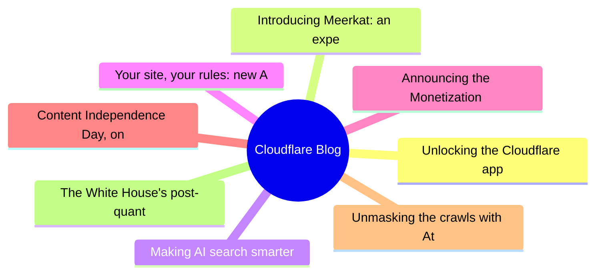
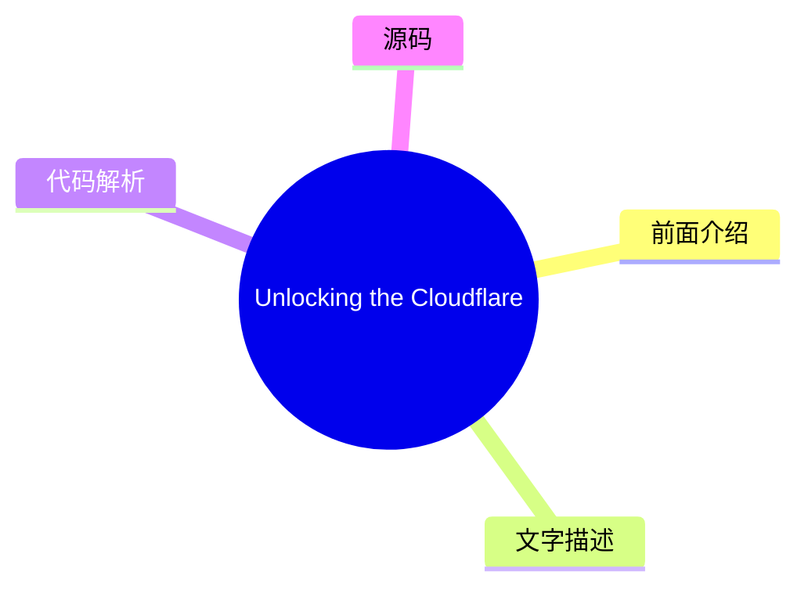
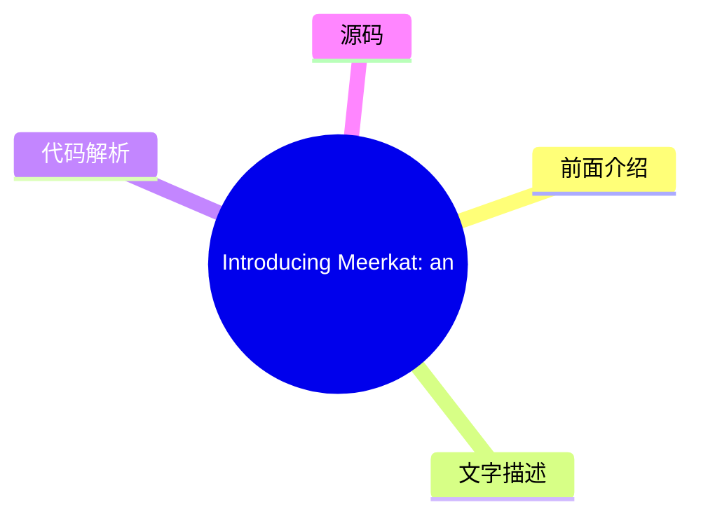
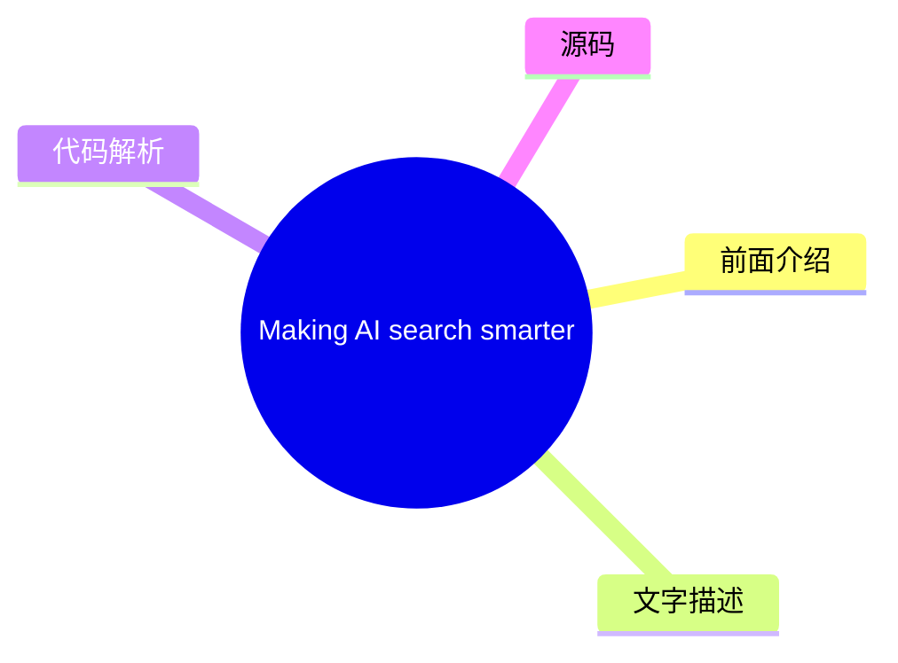
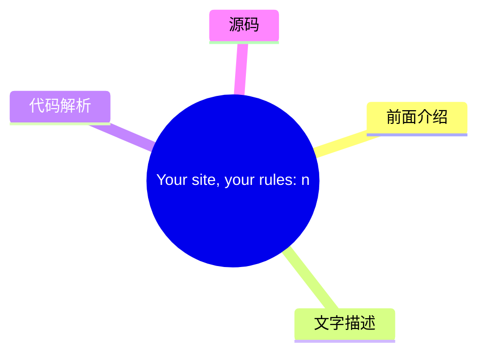
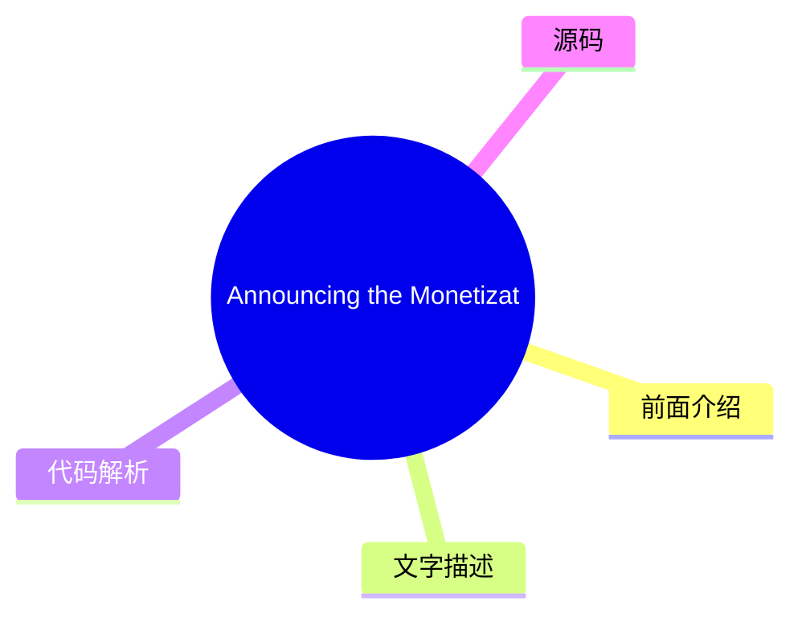
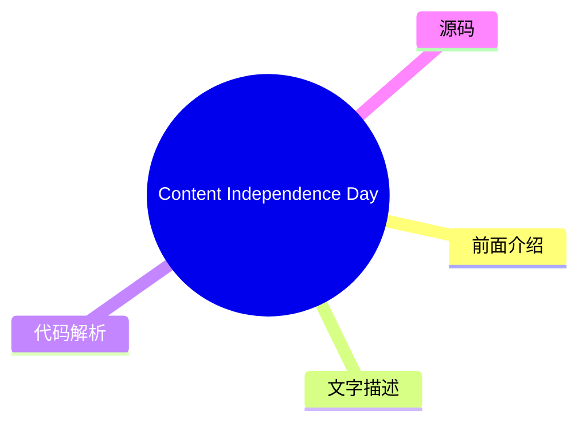
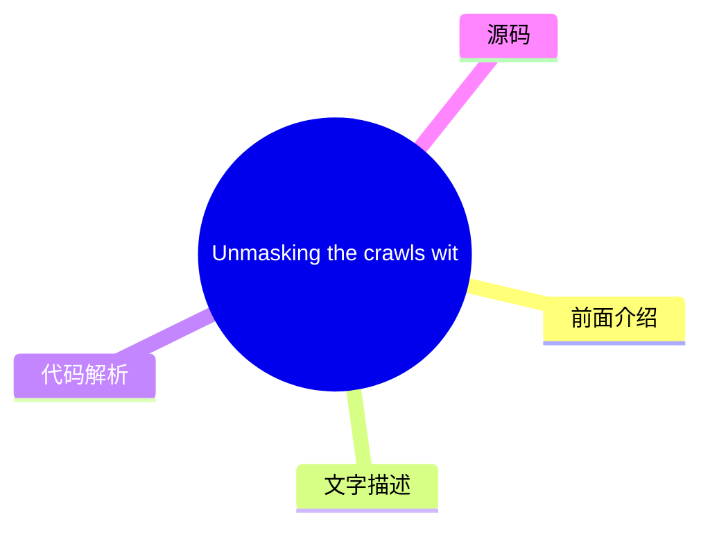
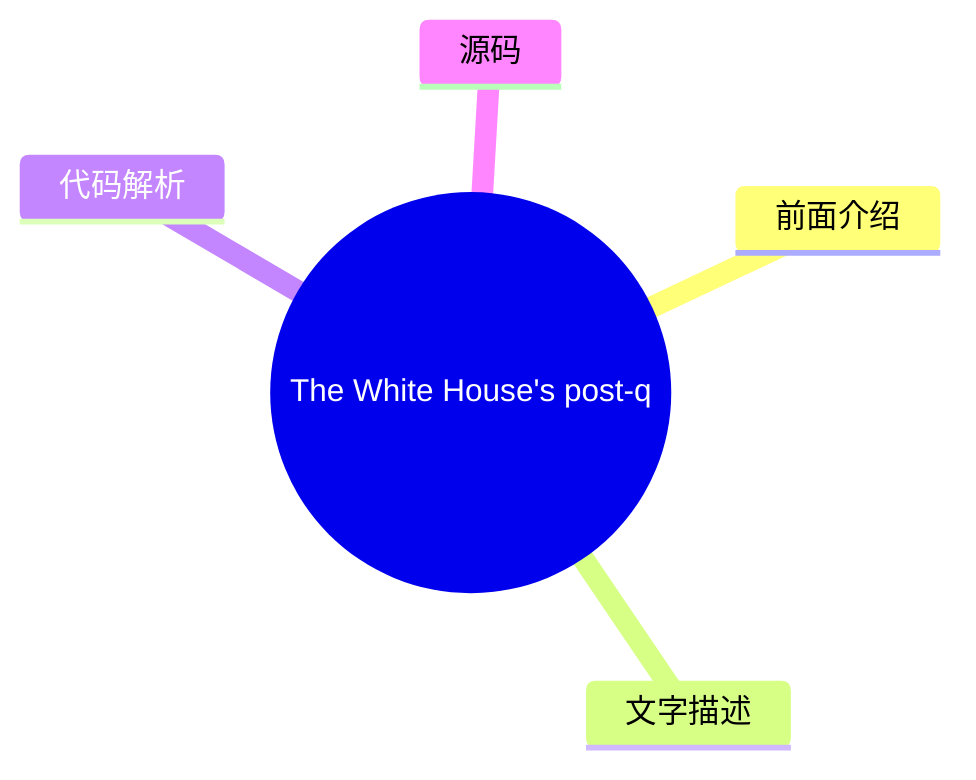

# ☁️ Cloudflare Blog Top 8 (2026-07-18)

## 前面介绍

- 数据源：Cloudflare Blog
- 抓取日期：2026-07-18
- 条目数：8
- 含完整正文：8
- 含代码片段：0
- 组织方式：前面介绍 / 树状图 / 文字描述 / 代码解析 / 源码

## 思维导图



## 详细整理（8 条，8 条含全文，0 条含代码）

### 1. Unlocking the Cloudflare app ecosystem with OAuth for all
- **链接**: [https://blog.cloudflare.com/oauth-for-all/](https://blog.cloudflare.com/oauth-for-all/)
- **作者**: Sam Cabell
- **发布**: Wed, 24 Jun 2026 06:00:00 GMT

#### 前面介绍

- Self-Managed OAuth is now available to all developers on Cloudflare. Here's how we executed a zero-downtime migration of our core OAuth engine to make it happen.
- 作者：Sam Cabell
- 发布时间：Wed, 24 Jun 2026 06:00:00 GMT

#### 树状图



#### 文字描述

- Cloudflare provides services that help run 20% of the web, but we donât do it alone. Developers on our platform use a myriad of tools and services from other companies too. Cloudflare provides a rich API for our platform that enables developers to create automations, CI/CD, and integrations that glue together the various parts of their infrastructure. Earlier this month, we ann
- ## Scaling the ecosystem securely While our earlier OAuth solution was sufficient for a small number of carefully managed partners, we realized that our permissions model, our consent experience, and our ways of mitigating potential abuse vectors were not mature enough. Earlier this year we [ updated our consent experience](https://blog.cloudflare.com/improved-developer-securi
- ## Planning the upgrade to our OAuth engine Years ago, we deployed [ Hydra](https://github.com/ory/hydra), an open-source OAuth engine, to power Cloudflare OAuth under the hood. That deployment served us well when usage was limited, but as the developer platform grew and agentic workflows became more common, it became clear that we needed a major upgrade to unlock new capabilit
- ## Executing the upgrade

#### 代码解析

- 本文未检测到明确代码块，内容更偏新闻、观点或方法论。

#### 源码

#### 中文节选

Cloudflare 提供的服务帮助运行着 20% 的互联网，但我们并非独自完成。我们平台上的开发者也会使用来自其他公司的众多工具和服务。Cloudflare 为我们的平台提供了丰富的 API，使开发者能够创建自动化、CI/CD 和集成，将基础设施的各个部分连接起来。本月早些时候，我们宣布了 [ self-managed OAuth](https://developers.cloudflare.com/changelog/post/2026-06-03-public-oauth-clients/)，使客户更容易创建和管理自己的 OAuth 客户端，以实现对 Cloudflare API 的委托访问。

Cloudflare 并不陌生 OAuth。如果你使用过 Wrangler，或者使用了 PlanetScale 等合作伙伴的集成，那么你已经使用过它。然而，直到现在，第三方 OAuth 仅通过少数经过手动入驻的集成提供，并未向更广泛的开发者开放。这意味着构建自己集成的开发者不得不依赖 API 令牌，这在管理上更困难，且不适合许多委托应用程序流程。

在过去的一年里，我们在入驻越来越多的早期合作伙伴的同时，改进了 Cloudflare OAuth 背后的同意、撤销和安全模型。但随着我们的开发者平台的发展，以及代理工具推动了委托访问的需求，很明显，向所有客户开放 OAuth 对于我们平台的成功至关重要。

通过 self-managed OAuth，开发者现在可以提供标准的 OAuth 流程，让客户直接授予作用域访问权限，这使得构建 SaaS 集成、内部开发者平台和代理工具变得更加容易，同时为用户提供了更清晰的同意、更容易的撤销以及对应用程序功能的更多控制。

## 安全地扩展生态系统

虽然我们之前的 OAuth 解决方案足以满足少数经过精心管理的合作伙伴的需求，但我们意识到，我们的权限模型、同意体验以及缓解潜在滥用途径的方式还不够成熟。

今年早些时候，我们[更新了我们的同意体验](https://blog.cloudflare.com/improved-developer-security/#improving-the-oauth-consent-experience)，以更清晰地说明哪个应用程序正在请求访问权限，以及它将获得哪些权限。我们还添加了撤销功能到仪表板，以便开发者可以轻松控制哪些应用程序有权访问其数据，并使应用程序所有权更加可见，以防止 OAuth 网络钓鱼攻击。 

向所有客户开放自管理 OAuth 还需要对我们的底层 OAuth 引擎进行重大升级。这一过程需要大量的规划，以尽量减少用户中断，同时确保数据的稳定性和安全性。

## 规划 OAuth 引擎的升级

几年前，我们部署了 [ Hydra](https://github.com/ory/hydra)，一个开源 OAuth 引擎，以在幕后为 Cloudflare OAuth 提供支持。该部署在我们使用量有限时表现良好，但随着开发者平台的增长以及代理工作流的兴起，它已无法满足需求。

#### 完整正文（中文）

Cloudflare 提供的服务帮助运行着 20% 的互联网，但我们并非独自完成。我们平台上的开发者也会使用来自其他公司的众多工具和服务。Cloudflare 为我们的平台提供了丰富的 API，使开发者能够创建自动化、CI/CD 和集成，将基础设施的各个部分连接起来。本月早些时候，我们宣布了 [ self-managed OAuth](https://developers.cloudflare.com/changelog/post/2026-06-03-public-oauth-clients/)，使客户更容易创建和管理自己的 OAuth 客户端，以实现对 Cloudflare API 的委托访问。

Cloudflare 并不陌生 OAuth。如果你使用过 Wrangler，或者使用了 PlanetScale 等合作伙伴的集成，那么你已经使用过它。然而，直到现在，第三方 OAuth 仅通过少数经过手动入驻的集成提供，并未向更广泛的开发者开放。这意味着构建自己集成的开发者不得不依赖 API 令牌，这在管理上更困难，且不适合许多委托应用程序流程。

在过去的一年里，我们在入驻越来越多的早期合作伙伴的同时，改进了 Cloudflare OAuth 背后的同意、撤销和安全模型。但随着我们的开发者平台的发展，以及代理工具推动了委托访问的需求，很明显，向所有客户开放 OAuth 对于我们平台的成功至关重要。

通过 self-managed OAuth，开发者现在可以提供标准的 OAuth 流程，让客户直接授予作用域访问权限，这使得构建 SaaS 集成、内部开发者平台和代理工具变得更加容易，同时为用户提供了更清晰的同意、更容易的撤销以及对应用程序功能的更多控制。

## 安全地扩展生态系统

虽然我们之前的 OAuth 解决方案足以满足少数经过精心管理的合作伙伴的需求，但我们意识到，我们的权限模型、同意体验以及缓解潜在滥用途径的方式还不够成熟。

今年早些时候，我们[更新了我们的同意体验](https://blog.cloudflare.com/improved-developer-security/#improving-the-oauth-consent-experience)，以更清楚地说明哪个应用程序正在请求访问权限，以及它将获得哪些权限。我们还在仪表板中添加了撤销功能，以便开发者可以轻松控制哪些应用程序有权访问其数据，并使应用程序的所有权更加可见，以防止 OAuth 钓鱼攻击。 

向所有客户开放自托管 OAuth 还需要对我们的底层 OAuth 引擎进行重大升级。这一过程需要大量的规划，以尽量减少用户中断，同时确保数据稳定性和安全性。

## 规划 OAuth 引擎升级

几年前，我们部署了 [ Hydra](https://github.com/ory/hydra)，这是一个开源 OAuth 引擎，用于在幕后为 Cloudflare OAuth 提供支持。该部署在我们使用量有限时为我们提供了良好的服务，但随着开发者平台的增长和代理工作流的普及，很明显我们需要进行重大升级，以解锁新功能并提高性能。 

在规划升级时，我们决定进行两次较小的顺序升级，而不是进行一次大型升级。Â 首先，我们将迁移到最新的 1.X 版本，评估任何行为或性能变化，然后继续进行 2.X 升级。

在我们的升级规划过程中，很明显即使是 1.X 升级仍会对客户产生影响，因为 Hydra 数据库需要大量的模式迁移，这些迁移：

- 以会锁定关键表的方式创建索引，阻止活跃用户执行重要的 OAuth 操作Â
- 向关键表添加列，并将其他列移动到新表

我们使用的 Hydra 版本还有一个特性，即 SDK 会执行 SELECT * 操作，导致模式更改出现反序列化问题。

为了防止对用户产生影响，我们重写了 SQL 迁移脚本，以使用 CREATE INDEX CONCURRENTLY 等功能，并构建了 Hydra 的自定义版本，使其选择显式列而不是 SELECT *。

随着最新的 1.X 升级计划已定，我们现在需要为规模更大的 2.X 升级制定计划。我们确定了三种潜在方案，并权衡了每个方案的利弊。由于大版本升级带来了大量的架构变更，原地升级对我们来说行不通。我们决定采用蓝绿策略，但仅仅切换开关来开始使用新版本是不够的。升级和迁移过程需要数小时，我们需要系统在这段时间内继续正常运行。

第一个蓝绿方案涉及禁用对数据库的写入，防止任何新的授权发生。这意味着它们不会在过渡过程中丢失，但也意味着除非他们已经有有效的凭据，否则没有人能够使用现有的 OAuth 应用。这也带来了另一个大问题：如果用户出于任何原因需要撤销对某个应用的访问权限，在升级过程中将无法实现。

为了解决这些问题，我们想出了一种方法，允许对数据库进行写入，但代价是在切换到绿色版本时会丢失部分写入。首先要解决的是最小化新令牌的写入数量。我们操作了一个杠杆：将令牌的过期时间延长到数小时。这将允许在升级前收到新令牌的应用继续使用它们，而无需刷新。

随着写入减少问题得到解决，我们需要想出一个办法，确保在升级窗口期间用户执行的任何吊销操作都不会丢失。为此，我们创建了一个队列系统（使用 [Cloudflare Queues](https://developers.cloudflare.com/queues/)！），在发生吊销事件后，队列中会写入一条包含该吊销信息的记录。这使我们能够在数据库切换到绿色版本后清空队列，重放所有在原本会丢失的时间窗口内发生的吊销事件。这一点至关重要，否则用户已吊销的应用程序将意外地恢复访问权限。

## 执行升级

### 升级到 1.X

从运营角度来看，我们对最后一个 1.X 版本的首次升级进行得非常顺利。我们的自定义数据库迁移比预期的更快，没有对用户造成任何影响。由于旧版本无法检查由新版本创建的令牌，我们必须对新版本进行硬切换。

切换后，我们看到了以前从未见过的刷新令牌错误增加。这最终是由于新版本中更严格的刷新令牌失效行为造成的；如果刷新令牌被重用，Hydra 将使整个访问令牌和刷新令牌链失效。这对 Wrangler 和 MCP 客户端来说是个问题。这些客户端都有很高的请求量，而单个重用的刷新令牌就会使整个会话失效。

我们通过在我们的 Worker 中添加刷新令牌合并行为来缓解了这个问题，该 Worker 负责将 OAuth 流量路由到正确的目的地。这使我们能够在刷新令牌请求到达 Hydra 之前对其进行短暂缓存，这样如果我们检测到重试，就可以短路该请求并直接响应，而无需使令牌失效。幸运的是，2.X 版本的 Hydra 具有可配置的“刷新令牌宽限期”，这通过允许在一段时间内重试刷新令牌而不使整个链失效来解决了这个问题。

### 升级到 2.X

由于无法接受数小时的高用户影响，我们制定了蓝绿升级策略。从宏观层面来看，这听起来很简单：迁移将在生产数据库的副本上运行，并在完成后与新的 Hydra 版本一起进行切换。实际上，还有*很多*更多需要协调的环节：

- 启用撤销重放捕获队列
- 复制并恢复数据库到新的目标
- 针对性数据清理——现有数据违反了较新版本中引入的一些新约束，这可能会阻止迁移成功
- 同时对 Hydra 服务以及两个其他关键内部系统执行切换，以防止任何错误
- 切换后的监控和验证

我们选择了 Hydra 请求数每秒最低的时间段作为升级窗口，以尽量减少令牌写入的丢失。除了进行一些超时调整外，我们的生产迁移在新的数据库上运行良好：生产环境的总运行时间约为三小时。迁移完成后，我们谨慎地推出了新的 Hydra 服务版本，以及两个额外的系统配置，以将系统切换为使用新的 SDK 版本。

在切换流量后不久，我们观察到授权服务（依赖于 Hydra 同意会话 API）中的数据清理任务在清理 OAuth 策略数据时过于激进。经过调查，我们发现 Hydra 迁移中存在一个问题，损坏了某些有效 OAuth 会话的状态，导致迁移将其标记为无效。有效会话被损坏导致 Hydra 和我们的授权服务之间出现分歧，表现为 403 错误的增加。为了缓解这种情况，我们进行了数据恢复，并开始改进 OAuth 授权行为，以移除对静态策略数据的依赖。

除了数据清理问题外，还有一些其他的小修复，这些修复更多是由特定的客户端行为驱动的，我们很快便完成了这些修复。

随着 Hydra 版本升级的完成，OAuth 流量保持稳定，客户系统的性能和可靠性得到了提升。这也使生产环境与我们在预发布环境中已验证的新 OAuth API 基础保持一致，为我们在 6 月 3 日发布 [自托管 OAuth 客户端](https://developers.cloudflare.com/changelog/post/2026-06-03-public-oauth-clients/) 清除了障碍。

## 性能改进

在完成如此大规模的升级后，查看一些关于影响的广泛指标总是令人欣慰且具有启发性的。我们在数据库迁移期间收集了额外的指标，并观察到升级完成后性能有了显著提升。

### 数据库

| 指标 | 近似值 | 
|---|---| 
| 更新行数 | 1.325 亿 | 
| 插入行数 | 1.147 亿 | 
| 临时字节数 | 136.97GB | 
| 事务提交数 | 2.22 万 | 

### Hydra 性能

| 指标（平均值） | 升级前 | 升级后 | 变化 > | 
|---|---|---|---|
| API P95 | 185ms | 101ms | -45% | 
| RSS 内存 | 888MB | 763MB | -14% | 
| Go 堆分配 | 449MB | 271MB | -40% | 
| Goroutines | 4015 | 3076 | -23% | 
| CPU | 1.07 核心 | 0.67 核心 | -37% | 

## 面向所有客户的自托管 OAuth

向所有客户开放 OAuth 是构建更广泛的 Cloudflare 应用生态系统的重要一步。今天，任何 Cloudflare 客户都可以创建自己的 OAuth 应用程序，并在 Cloudflare 之上构建集成。我们非常兴奋地宣布推出面向所有客户的 Cloudflare 自托管 OAuth。

要开始使用，请查看我们的 [文档](https://developers.cloudflare.com/fundamentals/oauth/) 或直接跳转到仪表板中的 OAuth 应用程序页面，并创建您的第一个 OAuth 应用程序。

[仪表板](https://dash.cloudflare.com/?to=/:account/oauth-clients)


### 2. Introducing Meerkat: an experiment in global consensus
- **链接**: [https://blog.cloudflare.com/meerkat-introduction/](https://blog.cloudflare.com/meerkat-introduction/)
- **作者**: James Larisch
- **发布**: Wed, 08 Jul 2026 12:00:00 GMT

#### 前面介绍

- Cloudflare Research is building a global consensus service called Meerkat that uses a new consensus algorithm called QuePaxa. We plan to use Meerkat to build a strongly consistent, fault-tolerant key-value store, and other applications.
- 作者：James Larisch
- 发布时间：Wed, 08 Jul 2026 12:00:00 GMT

#### 树状图



#### 文字描述

- Many internal services at Cloudflare need to read and modify the same control-plane state from across our 330+ global data centers. They need guarantees that different readers *never *see inconsistent state, and that the system remains available for writes even when some data centers or links fail. But Cloudflareâs network runs across the entire Internet, and the Internet is an
- ## What we need from a global control-plane data system Many Cloudflare services read and write *control-plane data*, data that helps those services operate correctly, from multiple machines distributed all over the world. One example of control-plane data is *placement information*: where certain resources (like an AI model instance) are stored. Another example is *leadership 
- ### Strong consistency A distributed data systemâs [ consistency](https://jepsen.io/consistency/models) level describes what kinds of weird behavior the system is allowed to exhibit when it receives concurrent reads and writes. Consider a distributed key-value store that stores a single numeric value `x = 6` across multiple nodes. Also consider the following sequence of writes.
- ### Fault tolerance A systemâs level of fault tolerance describes what kinds of faults the system can handle before catastrophes happen. Catastrophes are typically violations of properties the system aims to uphold, e.g., that two consecutive reads without an intervening write for the same key never see different values, or that the system remains available for writes. The faul

#### 代码解析

- 本文未检测到明确代码块，内容更偏新闻、观点或方法论。

#### 源码

#### 中文节选

Cloudflare 内部的许多服务需要从我们 330 多个全球数据中心读取和修改相同的控制平面状态。它们需要保证不同的读取者*从不*看到不一致的状态，并且即使在某些数据中心或链路发生故障的情况下，系统仍能保持可写入。

然而，Cloudflare 的网络横跨整个互联网，而互联网是一个不可预测的地方。服务器和数据中心会宕机。队列会填满。链路和电缆会被切断。这些条件使得运行一个保证强一致性（例如，保证所有读取者都能读取到所有先前的写入）的全球可用数据系统变得困难，因为敌对条件阻碍了分布式系统副本之间可靠地同步数据的能力。

尽管网络条件恶劣，但通过*共识算法*安全地同步数据的一种方法是，它允许一组机器在只要大多数节点保持存活且能够通信的情况下，就同意相同的值序列，例如键值存储的 put 和 `get` 操作。

不幸的是，像 [Raft](https://raft.github.io/) 这样的常用共识算法在 Cloudflare 这样的广域网上表现不佳，因为它们依赖于*领导者*和*超时*。*领导者*是唯一被允许进行写入的副本，如果它因崩溃或网络降级而失败，系统将变得不可用，直到某个其他副本*超时*并选举出新的领导者。而且，在具有不可预测延迟的网络中，这些超时值很难配置。

我们已经经历过多次由共识驱动系统中不可用的领导者导致的事故。

因此，在过去的一年里，Cloudflare 的研究 [团队](https://research.cloudflare.com/) 一直在构建一个新的分布式共识服务，名为

**Meerkat**，它由一种称为

[, 由 Tennage & BÄsescu 等人于 2023 年发布。QuePaxa 与 Raft 的不同之处在于，所有副本可以随时执行写入，且进度永远不会因超时而停止，这使其非常适合 Cloudflare 的网络。我们在其上构建了](https://bford.info/pub/os/quepaxa/quepaxa.pdf)

__QuePaxa__*应用程序*，例如事务型键值存储和租赁系统，构建在 Meerkat 的共识日志之上。据我们所知，这将是 QuePaxa 首次在全球范围内进行工业级部署。

Meerkat 是一个仍在开发中的实验性共识服务。它最初被设计用于管理少量的控制平面状态（例如复制数据库的领导权），因此，在可预见的未来，它将仅限内部使用。本文介绍了 Meerkat，并为即将发布的与 Meerkat 相关的博客文章奠定了基础。

## 我们对全球控制平面数据系统的需求

Cloudflare 的许多服务会从分布在世界各地的多台机器上读取和写入*控制平面数据*，这些数据有助于这些服务正确运行。控制平面数据的一个例子是*放置信息*：某项资源应放置在何处

#### 完整正文（中文）

Cloudflare 内部的许多服务需要从我们 330 多个全球数据中心读取和修改相同的控制平面状态。它们需要保证不同的读取者*从不*看到不一致的状态，并且即使在某些数据中心或链路发生故障的情况下，系统仍能保持可写入。

然而，Cloudflare 的网络横跨整个互联网，而互联网是一个不可预测的地方。服务器和数据中心会宕机。队列会填满。链路和电缆会被切断。这些条件使得运行一个保证强一致性（例如，保证所有读取者都能读取到所有先前的写入）的全球可用数据系统变得困难，因为敌对条件阻碍了分布式系统副本之间可靠地同步数据的能力。

尽管网络条件恶劣，但通过*共识算法*安全地同步数据的一种方法是，它允许一组机器在只要大多数节点保持存活且能够通信的情况下，就同意相同的值序列，例如键值存储的 put 和 `get` 操作。

不幸的是，像 [Raft](https://raft.github.io/) 这样的常用共识算法在 Cloudflare 这样的广域网上表现不佳，因为它们依赖于*领导者*和*超时*。*领导者*是唯一被允许进行写入的副本，如果它因崩溃或网络降级而失败，系统将变得不可用，直到某个其他副本*超时*并选举出新的领导者。而且，在具有不可预测延迟的网络中，这些超时值很难配置。

我们已经经历过多次由共识驱动系统中不可用的领导者导致的事故。

因此，在过去的一年里，Cloudflare 的研究 [团队](https://research.cloudflare.com/) 一直在构建一个新的分布式共识服务，名为

**Meerkat**，它由一种称为

[, 由 Tennage & BÄsescu 等人于 2023 年发布。QuePaxa 与 Raft 的不同之处在于，所有副本可以随时执行写入，且进度永远不会因超时而停止，这使其非常适合 Cloudflare 的网络。我们在其上构建了](https://bford.info/pub/os/quepaxa/quepaxa.pdf)

__QuePaxa__*应用程序*，例如事务性键值存储和租赁系统，构建在 Meerkat 的共识日志之上。据我们所知，这将是 QuePaxa 首次在全球范围内进行工业级部署。

Meerkat 是一个仍在开发中的实验性共识服务。它最初被设计用于管理少量的控制平面状态（例如，复制数据库的领导权），因此在可预见的未来，它将仅限内部使用。本文介绍了 Meerkat，并为即将发布的与 Meerkat 相关的博客文章奠定了基础。

## 我们需要一个全球控制平面数据系统

Cloudflare 的许多服务会读取和写入*控制平面数据*，这些数据有助于这些服务正确运行，数据分布在遍布全球的多台机器上。控制平面数据的一个例子是*放置信息*：特定资源（如 AI 模型实例）存储在哪里。另一个例子是*领导权信息*：哪台机器目前被允许对数据库执行写入操作。

控制平面数据必须同时具备*强一致性*和*在特定类型的故障下仍可访问的能力*。

在本节中，我们将精确描述我们对 Cloudflare 共识服务的一致性和容错要求。我们使用键值存储作为运行在共识服务之上的应用程序的示例，尽管其他应用程序（例如分布式租赁/锁）也是可能的。

### 强一致性

分布式数据系统的[一致性](https://jepsen.io/consistency/models)级别描述了系统在接收并发读写时被允许表现出的怪异行为。考虑一个在多个节点上存储单个数值的分布式键值存储

`x = 6`。同时考虑以下写入序列。这些写入是尽力而为地提交到不同节点的，并且可能以任何顺序到达： - `x = x + 1`
- `x = x / 2`

系统的一致性级别告诉您，在执行这些写入后，客户端在读取 `x` 时可能会看到 `x` 的哪些值。考虑以下操作序列以及在不同一致性级别下的可能执行顺序：

在弱一致性级别中，写入操作可能会被重新排序。在更强的一致性模型中，写入操作不能被重新排序，但读取操作可以。在最强可能的一致性级别中，操作按照它们在真实时间中发生的顺序被精确排序。这一属性被称为 *线性化*。

在 Cloudflare，许多服务都需要线性化。与较弱的一致性形式不同，线性化让程序员免于思考数据系统可能表现出的所有怪异行为。相反，他们可以像在单线程机器上推理本地内存一样来推理分布式系统：写入之后的所有读取都将看到该写入。有关弱一致性的危险，请查看 Marc Brooker 的这篇[文章](https://brooker.co.za/blog/2025/11/18/consistency.html)以获取更多阅读材料。

（如果你很好奇，Meerkat 的键值存储也提供可串行化，我们将在未来的文章中讨论这一点。）

### 容错性

系统的容错级别描述了系统在发生灾难之前可以处理哪些类型的故障。灾难通常是系统旨在维护的属性的违反，例如，两个连续的读取操作之间没有中间写入操作，却从未看到不同的值，或者系统保持可写。故障包括网络故障或延迟、机器崩溃和机器重启。系统通常会显式处理某些故障，但不处理其他故障（你无法处理所有故障，因为宇宙总是可能达到热寂）。例如，某些键值存储可能会保证只要系统中有三分之二的机器可以相互通信且没有崩溃，就保持可写，但如果机器被攻破并开始发送恶意消息，则不作任何承诺。

我们期望的容错属性如下：

**首先**，只要满足以下条件，数据系统应保持对位于我们任何数据中心中的客户端的写入和读取可用：

- 我们系统中的大多数机器都处于存活状态，并且可以相互通信。（形式上，我们在 `2f + 1` 台机器的系统中容忍 `f` 个故障）。

- 客户端可以联系系统中的*任意一台*连接了大多数存活机器的机器。

这意味着单台机器故障或单条链路的网络降级不会影响系统的可用性*。*正如我们稍后将看到的，Raft 系统不提供此属性。

**其次**，只要系统中没有参与者主动作恶（当然，也没有 bug），数据系统就会保持*正确*。我们将在后面从共识*安全性*的角度定义*正确性*，但通俗地说，这意味着没有两台最新的机器会就世界状态产生分歧（例如，一台机器认为 `key1=1`，而另一台认为 `key1=2`）。

总之，即使机器崩溃、机器重启、网络故障或降级、数据中心宕机等，系统也必须保持正确（尽管像基于 Raft 的系统一样，我们不处理[拜占庭故障](https://en.wikipedia.org/wiki/Byzantine_fault)）。

## 介绍 Meerkat

Meerkat 是一个共识服务，我们可以在其上构建具有上述属性（强一致性和容错性）的应用程序，例如键值（KV）存储。为了理解 Meerkat 的工作原理，我们首先概述 Meerkat 的总体架构，然后描述 Meerkat 对共识算法的选择如何有助于提供强一致性和容错性。

使用 Meerkat 的服务开发人员会请求一组 Meerkat *副本*。每个副本都连接到其他每个副本。每个副本都参与共识算法，并且可以接收读写请求。开发人员可以指定允许在其副本上托管的数据中心，Meerkat 会自动放置它们。

为了与集群交互，开发人员的客户端向集群中的任意一个副本发送特定于应用程序的请求。单个副本可能托管多种类型的应用程序，但最简单的是键值存储，因此最简单的特定于应用程序的请求类型是 KV `get` 或 `put`。副本会使用特定于应用程序的响应来响应请求（例如，`get` 请求的记录）。请注意，KV 读取（`get`）保证读取到最新信息。

### Meerkat 的日志

在底层，副本将应用程序请求（例如 `get` 和 `put`）转换为 *日志事件*。该副本使用共识算法将每个日志事件分发给所有其他副本，以确保所有副本维护完全相同的事件日志（实际上，副本可能会落后，但绝不能记录不同的条目）。这些事件是任意的——Meerkat 的核心并不关心它们包含什么。Meerkat 的 *应用程序* 关心日志事件的内容。每个 Meerkat 副本“托管”许多 Meerkat 应用程序（例如键值存储），这些应用程序读取日志事件并构建状态。（注意，每个副本恰好属于一个集群。）

例如，KV Meerkat 应用程序从日志事件中构建一个内存键值存储。因此，当客户端发送写入请求如 `put k1 v1` 时，接收该请求的副本将该写入操作放入一个日志事件中，并将其分发给所有副本。如果其他人随后在不同的副本上写入 `put k1 v11`，该事件也会被分发给所有副本。由于所有正常运行的副本拥有相同的日志，这些副本可以按顺序应用日志中的操作，以构建完全相同的状态。请注意，`get` 请求也会创建分布式日志事件（为了线性一致性，如下一节所述）。

以下是副本的 KV 存储在接收日志事件时如何更新的示例：

### Meerkat 的日志如何实现强一致性

Meerkat 保证，如果一个客户端执行 `put k1 v1`，第二个客户端随后执行 `put k1 v11`，第三个客户端随后执行 `get k1`（进行一致读），他们将始终读取到 `v11`。即使每个请求被提交到不同的副本，且这些副本随机分布在世界各地，Meerkat 也能保证这一点。这就是线性一致性。为了了解 Meerkat 如何保证这一点，我们必须更详细地检查 Meerkat 的日志。

Meerkat 日志是一系列槽位的序列。一个槽位是一个可以包含事件或不包含事件的盒子。包含事件的槽位被称为 *已决定* 槽位。日志中的所有槽位都是已决定的，除了最后一个槽位，它目前正在被决定。Meerkat 的不变量之一是，如果任何两个副本为某个槽位决定了值，那么这些值是相同的。换句话说，没有两个副本会就某个已决定槽位的值产生分歧（尽管一个副本可能认为最后一个槽位是空的，而另一个副本则不这么认为）。这个属性有助于保证我们在上一节中描述的期望属性。

为了决定日志中最后一个（空的）槽位的值，Meerkat 副本运行一个分布式的 *共识算法*。共识算法允许一组通过网络通信的机器就某个已决定槽位的值达成一致。只要大多数副本（超过一半）存活，我们的共识算法就能正常工作。

因此，如果日志当前包含两个条目，并且一个客户端向某个副本提交了 `put k1 v11`，该副本就会为槽位 3 触发一个共识算法。但是，另一个客户端可能已经向不同的副本提交了 `put k1 v111` 以用于槽位 3。共识算法确保只有针对槽位 3 的这样一个 *提议* 获胜。具体来说，它确保至少大多数副本同意同一个提议，并将其 *决定* 为槽位 3 的值。非大多数副本 *永远* 不能决定不同的提议，但可能会错过这一事实

...（截断，原文 20546+ 字符）


### 3. Making AI search smarter
- **链接**: [https://blog.cloudflare.com/making-ai-search-smarter/](https://blog.cloudflare.com/making-ai-search-smarter/)
- **作者**: Matthew Conroy
- **发布**: Wed, 01 Jul 2026 13:00:00 GMT

#### 前面介绍

- Search is how we find nearly everything on the web — creators, merchants, answers. AI is rewriting the rules, leaving creators caught between staying discoverable in an agentic era and getting paid for their work. Today we're launching two initiative
- 作者：Matthew Conroy
- 发布时间：Wed, 01 Jul 2026 13:00:00 GMT

#### 树状图



#### 文字描述

- Search drives most experiences on the web. It's how we get things done, and how nearly everything on the web gets found â the creators, the merchants, the answer to whatever you just typed into a box. For nearly 30 years, that discovery journey ran on a simple bargain: let a search engine crawl your content, and it sends you visitors. You turned those visitors into a business â
- ### Rebuilding the bargain Transparency and control are the foundation, but more is needed. In 2025, we laid out our foundation via a set of [ responsible AI bot principles](https://blog.cloudflare.com/building-a-better-internet-with-responsible-ai-bot-principles/): bots should be transparent about who they are and what they're for, respect site owners' choices, and act in good
- ### Making search smarter Today we're launching a research program to make AI search smarter and stop our customers footing the bill for crawls that produce nothing new. More than 20% of the web sits behind Cloudflareâs network, which gives us a unique perspective. We can tell which pages have genuinely changed and which ones people and agents are flocking to. Through this prog
- ### From Pay Per Crawl to Pay Per Use Last year we [ launched Pay Per Crawl ](https://blog.cloudflare.com/introducing-pay-per-crawl/)so publishers could charge AI companies for crawling their content. It was a real start, but crawling is a crude measure of value. A single page might be crawled once and then cited in thousands of answers, or crawled over and over and never used 

#### 代码解析

- 本文未检测到明确代码块，内容更偏新闻、观点或方法论。

#### 源码

#### 中文节选

搜索驱动了网络上的大多数体验。这是我们完成事情的方式，也是网络上几乎所有内容被发现的方式——创作者、商家，以及你刚刚在框中输入的任何问题的答案。近 30 年来，那次发现之旅运行在一个简单的交易之上：让搜索引擎抓取你的内容，它就会向你发送访客。你通过广告、订阅或仅仅是受众本身，将这些访客转化为了业务。可被发现和获得报酬曾经是同一回事。一年前，在[首个内容独立日](https://blog.cloudflare.com/content-independence-day-no-ai-crawl-without-compensation/)上，我们划下了一条线，以在 AI 时代捍卫这一交易。但一道界线仅仅是一个第一步。自那时以来，AI 搜索在消费者生活中的普及程度只增不减，因为

[. 威胁不再是你可以屏蔽的少数训练爬虫；而是搜索本身正在围绕 AI 答案进行重建。](https://radar.cloudflare.com/)

__超过 50% 的在线流量是非人类的__如今的答案引擎会阅读你的页面并将摘要交给用户，因此访问——以及依赖于该访问的收入——就变得不再必要。我们亲眼目睹了这一点，独立研究也证实了这一点：一项[ 2025 年皮尤研究中心的研究](https://www.pewresearch.org/short-reads/2025/07/22/google-users-are-less-likely-to-click-on-links-when-an-ai-summary-appears-in-the-results/)发现，当谷歌显示 AI 摘要时，用户点击传统搜索结果链接的频率仅为 8%（大约是没有摘要时的一半），而点击摘要内部的链接的频率仅为 1%。这让我们陷入了两难境地：退出 AI 搜索从而难以被发现，或者加入 AI 搜索，在为用户提供巨大价值的同时，却看到回报越来越少。我们的客户希望被发现并获得对其所提供价值的报酬，而目前他们被迫做出选择。

今天，[我们宣布了新的机器人选项](http://blog.cloudflare.com/content-independence-day-ai-options)，以帮助我们的客户更好地控制谁可以访问他们的网站以及他们可以对网站做什么。但阻止只是第一步：说“不”可以在不重建维持网站业务模式的情况下保护内容。因此，是时候开始构建互联网的新经济模式，从搜索开始。

### 重建契约

透明度和控制是基础，但这还不够。在 2025 年，我们通过一套 [负责任的 AI 机器人原则](https://blog.cloudflare.com/building-a-better-internet-with-responsible-ai-bot-principles/) 阐述了我们的基础：机器人应该对其身份和用途保持透明，尊重网站所有者的选择，并善意行事。我们的工具将机器人保持在那个标准之上。但执行良好的机器人行为并不能让依赖它的用户在使用 AI 搜索时获得更好的体验，也不会向创造了答案所需内容的创作者返还一美元。我们不仅能帮助网络说“不”；我们还能帮助重建网络所说的“是”。

#### 完整正文（中文）

搜索驱动了网络上的大多数体验。这是我们完成事情的方式，也是网络上几乎所有内容被发现的方式——创作者、商家，以及你刚刚在框中输入的任何问题的答案。近 30 年来，那次发现之旅运行在一个简单的交易之上：让搜索引擎抓取你的内容，它就会向你发送访客。你通过广告、订阅或仅仅是受众本身，将这些访客转化为了业务。可被发现和获得报酬曾经是同一回事。一年前，在[首个内容独立日](https://blog.cloudflare.com/content-independence-day-no-ai-crawl-without-compensation/)上，我们划下了一条线，以在 AI 时代捍卫这一交易。但一道界线仅仅是一个第一步。自那时以来，AI 搜索在消费者生活中的普及程度只增不减，因为

[. 威胁不再是你可以屏蔽的少数训练爬虫；而是搜索本身正在围绕 AI 答案进行重建。](https://radar.cloudflare.com/)

__超过 50% 的在线流量是非人类的__如今的答案引擎会阅读你的页面并将摘要交给用户，因此访问——以及依赖于该访问的收入——就变得不再必要。我们亲眼目睹了这一点，独立研究也证实了这一点：一项[ 2025 年皮尤研究中心的研究](https://www.pewresearch.org/short-reads/2025/07/22/google-users-are-less-likely-to-click-on-links-when-an-ai-summary-appears-in-the-results/)发现，当谷歌显示 AI 摘要时，用户点击传统搜索结果链接的频率仅为 8%（大约是没有摘要时的一半），而点击摘要内部的链接的频率仅为 1%。这让我们陷入了两难境地：退出 AI 搜索从而难以被发现，或者加入 AI 搜索，在为用户提供巨大价值的同时，却看到回报越来越少。我们的客户希望被发现并获得对其所提供价值的报酬，而目前他们被迫做出选择。

今天，[我们宣布了新的机器人选项](http://blog.cloudflare.com/content-independence-day-ai-options)，以帮助我们的客户更好地控制谁可以访问他们的网站以及他们可以对网站做什么。但屏蔽只是第一步：说“不”可以在不重建维持其存在的商业模式的情况下保护内容。因此，是时候开始构建互联网的新经济模式了，从搜索开始。

### 重建交易

透明度和控制是基础，但还需要更多。2025 年，我们通过一套 [负责任的 AI 机器人原则](https://blog.cloudflare.com/building-a-better-internet-with-responsible-ai-bot-principles/) 阐述了我们的基础：机器人应透明地说明它们是谁以及它们的用途，尊重网站所有者的选择，并善意行事。我们的工具将机器人以此标准为基准。但执行良好的机器人行为并不能让依赖它的 AI 搜索变得更好，也不会向创造了答案所需的成果的创作者汇回一美元。我们可以做的不仅仅是帮助网络说“不”；我们可以帮助重建它所说的“是”。

因此，今天我们宣布了两项举措，从防御转向进攻，并开始重新将旧交易的两半拼凑在一起。

**让 AI 搜索更智能：** 通过利用我们在全球网络中看到的信号，例如什么是新鲜的、什么是高质量的以及什么实际上发生了变化，我们可以帮助搜索引擎突出显示最相关的内容并减少不必要的抓取。如果网页仅在发生变化时才被重新抓取，搜索者将获得更好的答案，同时 AI 公司和网站所有者的成本都会降低。

**为创作者提供的价值付费：** 当你的作品被用来回答某人的问题时，你应该得到奖励，而不仅仅是被免费抓取。而且你应该能够看到正在使用什么以及人们在问什么。这应该是一个真正的收入来源，也是继续创作值得寻找的原创内容的动力。

### 让搜索更智能

今天，我们启动了一项研究计划，旨在让 AI 搜索更智能，并停止我们的客户为产生不了任何新内容的抓取买单。

超过 20% 的网站位于 Cloudflare 的网络之后，这给了我们独特的视角。我们可以判断哪些页面真正发生了变化，哪些页面是人们和机器人蜂拥而至的。通过这个项目，我们将探索利用客户选择分享的关于其内容新鲜度的信号，并将这些信号与我们自己对流量（包括人类和机器人）的洞察相结合。对于答案引擎而言，这是通往高质量内容的路线图。对于我们的客户而言，它提供了用户实际在问什么，以及他们的内容在 AI 结果中如何呈现的视图。我们的目标是衡量两件事：这些信号在多大程度上帮助答案引擎展示更新、更高质量的内容，以及它们减少了多少不必要的爬取。

第二个好处，即减少不必要的爬取，比听起来要大得多。Cloudflare 的数据显示，来自优质机器人的爬取流量中，超过 50% 用于重新抓取未发生变化的页面——而且随着爬取量的增加，这个数字可能会上升。一个只表示“这里什么都没变”的信号可以让爬虫跳过这次访问。这节省了答案引擎的计算资源。更重要的是，它让网站所有者免于处理和支付他们根本不需要的请求。

该计划在设计上是中立的：我们的目标是让它适用于每一个愿意公平竞争的答案引擎。它仅限于搜索。我们不分享任何内容，也不使用任何内容来训练基础模型。我们打算公布我们的发现，包括对网站所有者（如更好的内容可发现性和减少的服务器负载）的好处。我们计划在今年晚些时候广泛提供该功能，并减少我们网络上的不必要的爬取。

### 从按爬取付费到按使用付费

去年，我们[推出了按爬取付费](https://blog.cloudflare.com/introducing-pay-per-crawl/)，以便出版商可以向 AI 公司收取对其内容进行爬取的费用。这是一个真正的开始，但爬取是对价值的粗略衡量。一个页面可能只被爬取一次，然后在数千个答案中被引用，或者被反复爬取却从未被使用。创作者希望为他们提供的价值获得公平的报酬。

所以我们正在将 Pay Per Crawl 逐步转变为 Pay Per Use。我们正在与顶级 AI 公司进行实验，例如 [ Ceramic.ai](http://ceramic.ai) 和

[, 这种安排很简单：组织可以自带支付模式，并轻松将其扩展到 Cloudflare 网络上的内容所有者。](http://you.com)

__You.com__Ceramic 构建了一种所谓的“按查询付费”模式，因此选择加入的出版商可以在其内容出现在 Ceramic 的搜索结果中时获得报酬。这意味着支付设计是跟随工作所提供的价值，而不是爬虫偶然抓取它的次数。

“为了扩展 AI 搜索的未来，我们需要一个拥有巨大覆盖范围并致力于透明度和公平补偿的合作伙伴，”Ceramic.ai 创始人兼首席执行官 Anna Patterson 说。“Cloudflare 允许我们轻松且通过编程的方式扩展我们的运营。通过将我们的按查询付费模式带到他们的网络中，我们确保数百万内容所有者可以无缝加入，每次其内容出现在我们的搜索结果中时都能获得补偿。”

除了补偿之外，参与 Cloudflare/Ceramic 计划的内容所有者还将解锁新的报告，以帮助进行答案引擎优化（AEO）。客户终于可以看到导致其内容出现在搜索结果中的顶级查询、具体的网页和片段、其平均搜索结果排名位置等。这是我们即将推出的众多帮助客户提高可发现性的产品中的第一个。

这只是众多新兴方法之一。另一种来自 You.com：代理可以按需为所需的具体优质内容付费，无需任何前期承诺。AI 提供商正在测试新的支付模式（例如按查询付费、按结果付费等），而我们拥有支持所有这些模式的基础设施。

我们想坦诚地说明，这只是一个实验。还有很多东西需要学习，包括这种模式在互联网规模下究竟表现如何。我们将随着进展与合作伙伴及客户一起探索，并分享我们的所学。但目标很明确：AI 搜索公司能获得更及时、更有依据的答案，而那些让答案成为可能的客户（即内容创作者）在提供帮助时能获得报酬。Cloudflare 在此中的角色是提供使这一市场繁荣的基础设施层。

我们认为这更符合搜索经济学的走向。旧的人工网络优化搜索以节省时间——提供摘要、十个蓝色链接和点击。智能体互联网则不同：智能体可以快速阅读并持续搜索。搜索正变成智能体为了回答一个问题而执行的数十次操作，更接近一种公用设施而非目的地。在那个世界里，重要的单位不再是抓取或点击，而是结果。对结果进行定价，并支付促成结果的人，是网络得以持续繁荣的方式。

### 我们想要赢得的头条

一年前的“内容独立日”，头条是默认的“不”：AI 不能在不进行补偿的情况下抓取内容。今年，我们的重点是给用户提供更多的产品和控制选项，以便他们说“是”，并带来更多的好处。

今天的公告只是开始。Cloudflare 的研究项目旨在检验我们的信号能否在减少抓取的情况下产生更好的结果。按使用付费是我们将与合作伙伴一起探索的有前景的方向，这些合作伙伴相信内容创作者应因其工作获得公平的报酬。过去 30 年的网络也是这样建立的：有人运行试点，将“模型坏了”转变为“这是新模型”，一次实验接着一次实验。我们相信，在这个新的智能体时代，让客户易于被发现，并优化其内容以实现最大发现，对客户是有价值的。但他们应该能够在不免费放弃其最有价值的创意资产的情况下做到这一点。

互联网正在发生变化，其赖以生存的商业模式也随之改变。旧的互联网是开放、中立且值得贡献的。我们有机会保持这种状态，并建立未来资助它的商业模式。为人类和智能体提供更智能的答案。为那些凭借技能、创造力和投入让答案变得有价值的人们提供公平的交易。这就是我们追求 Cloudflare 使命的方式：帮助构建更好的互联网。

祝内容独立日快乐！

* 建立在开放、面向智能体的互联网之上？如果您有兴趣了解更多关于 Ceramic 和 You 计划的信息，请填写
__此表单__。如果您正在构建答案引擎并希望进行更智能的抓取，我们也非常乐意收到您的来信：aeo@cloudflare.com。


### 4. Your site, your rules: new AI traffic options for all customers
- **链接**: [https://blog.cloudflare.com/content-independence-day-ai-options/](https://blog.cloudflare.com/content-independence-day-ai-options/)
- **作者**: Jin-Hee Lee
- **发布**: Wed, 01 Jul 2026 13:00:00 GMT

#### 前面介绍

- For our second Content Independence Day, we’re giving website owners finer options to manage AI traffic. Instead of a one-size-fits-all block, all customers can now easily distinguish and manage Search, Agent, and Training bots, alongside the new abi
- 作者：Jin-Hee Lee
- 发布时间：Wed, 01 Jul 2026 13:00:00 GMT

#### 树状图



#### 文字描述

- One year ago, we declared the first [ Content Independence Day](https://blog.cloudflare.com/content-independence-day-no-ai-crawl-without-compensation/), and we gave website owners the means to take back control of their content. The deal between crawlers and website owners that had held up for 30 years â we crawl you, and you get referrals â was no longer true. AI was taking ev
- ### Now, AI can be anything Today, AI can be in anything. Google search has changed from being sorted by AI to being a [ full answer engine](https://blog.google/products-and-platforms/products/search/search-io-2026/) that answers your question directly on the results page. And Google is not unique in this position â this is the direction in which âsearchâ is moving. We could de
- ### A pragmatic taxonomy To address these questions, we need a more nuanced view â a pragmatic taxonomy that aligns with the AI use cases our customers care about. So we are opening the discussion beyond AI training alone and focusing on three AI use cases that we want all customers to be able to manage: - **Search:**any behavior that collects or indexes your content, so it can
- ### New options to manage AI traffic **We want to provide more options for managing different kinds of AI traffic, to all website owners on the Cloudflare network.** The managed preset to âBlock AI botsâ that weâve announced in the past included single-purpose bots that crawled data for model training, as shown below:Â *Screenshot of the existing setting to manage AI bot traffi

#### 代码解析

- 本文未检测到明确代码块，内容更偏新闻、观点或方法论。

#### 源码

#### 中文节选

一年前，我们宣布了第一个 [内容独立日](https://blog.cloudflare.com/content-independence-day-no-ai-crawl-without-compensation/)，并赋予网站所有者收回对其内容控制权的手段。爬虫与网站所有者之间维持了30年的交易——我们爬取你的内容，而你获得推荐——不再成立。AI 正在拿走一切却一无所返，这对网站所有者构成了生存威胁。因此，我们推出了一键“屏蔽 AI 机器人”选项，以及

[.](https://blog.cloudflare.com/introducing-pay-per-crawl/)

__按爬取付费市场__

一年过去了，发生了许多变化。去年七月，围绕“AI 机器人”的讨论主要集中在未经补偿就阻止 AI 训练，指向了这种内容被用于模型训练却没有任何价值回馈给网站所有者的零和博弈。但人们开始渴望更细致的方案：内容所有者仍然希望保护自己的内容，并且应该为他们辛勤创作、策展和分享的原创内容获得报酬。我们也知道，封锁内容并非“一刀切”的解决方案；网站所有者希望有比“每次都屏蔽所有自动化”更多的选择。

如果你运营一个小型网站，问题不仅仅是有人可能利用你的内容训练模型——而是根本没人能找到你。因此，你必须做出一种浮士德式的交易：要么出现在搜索结果中并允许 AI 训练你的内容，要么冒着失去可发现性的风险。如果竞争对手的搜索提供商对搜索和训练使用相同的机器人，这会不公平地偏向他们；这种不公平的优势激励了新玩家在试图缩小竞争差距时采取规避策略。

### 现在，AI 可以无处不在

如今，AI 可以存在于任何地方。谷歌搜索已经从由 AI 排序转变为 [ 全答案引擎](https://blog.google/products-and-platforms/products/search/search-io-2026/)，直接在结果页面上回答你的问题。谷歌并非唯一处于这种地位的——这正是“搜索”正在发展的方向。

我们可以争论一下今天什么算作“AI”的截止点，结果却发现标准明天就会改变。因此，与其将机器人主要定义为“AI”或非“AI”，我们的更新分类方法将询问关于机器人或代理行为更深层的问题：它们在我的网站上做什么？它们在存储什么？以及它们将如何重新分享我的内容？

### 务实的分类法

为了回答这些问题，我们需要一个更细致的视角——一个与我们客户关心的 AI 用例相一致的务实分类法。因此，我们将讨论范围从仅 AI 训练扩展开来，并专注于三个我们希望所有客户都能管理的 AI 用例：

- **搜索：**任何收集或索引您内容的行为，以便日后回答相关问题。关键在于，搜索会主动构建您网站的数据库，以便稍后响应用户查询。网站所有者 sho

#### 完整正文（中文）

一年前，我们宣布了第一个 [内容独立日](https://blog.cloudflare.com/content-independence-day-no-ai-crawl-without-compensation/)，并赋予网站所有者收回对其内容控制权的手段。爬虫与网站所有者之间维持了30年的交易——我们爬取你的内容，而你获得推荐——不再成立。AI 正在拿走一切却一无所返，这对网站所有者构成了生存威胁。因此，我们推出了一键“屏蔽 AI 机器人”选项，以及

[.](https://blog.cloudflare.com/introducing-pay-per-crawl/)

__按爬取付费市场__

一年过去了，发生了许多变化。去年七月，围绕“AI 机器人”的讨论主要集中在未经补偿就阻止 AI 训练，指向了这种内容被用于模型训练却没有任何价值回馈给网站所有者的零和博弈。但人们开始渴望更细致的方案：内容所有者仍然希望保护自己的内容，并且应该为他们辛勤创作、策展和分享的原创内容获得报酬。我们也知道，封锁内容并非“一刀切”的解决方案；网站所有者希望有比“每次都屏蔽所有自动化”更多的选择。

如果你运营一个小型网站，问题不仅仅是有人可能利用你的内容训练模型——而是根本没人能找到你。因此，你必须做出一种浮士德式的交易：要么出现在搜索结果中并允许 AI 训练你的内容，要么冒着失去可发现性的风险。如果竞争对手的搜索提供商对搜索和训练使用相同的机器人，这会不公平地偏向他们；这种不公平的优势激励了新玩家在试图缩小竞争差距时采取规避策略。

### 现在，AI 可以无处不在

如今，AI 可以存在于任何地方。谷歌搜索已经从由 AI 排序转变为 [ 全答案引擎](https://blog.google/products-and-platforms/products/search/search-io-2026/)，直接在结果页面上回答你的问题。谷歌并非唯一处于这种地位的——这正是“搜索”正在发展的方向。

我们可以争论一下今天什么才算是“AI”的截止标准，结果却发现标准明天就会改变。因此，与其主要将机器人定义为“是”或“不是”AI，我们的更新分类方法将询问关于机器人或代理行为更深层的问题：它们在我的网站上做什么？它们在存储什么？以及它们将如何重新分享我的内容？

### 务实的分类法

为了回答这些问题，我们需要一个更细致的视角——一种与我们客户关心的 AI 用例相一致的务实分类法。因此，我们正在将讨论范围从仅限于 AI 训练扩展开来，并专注于三个我们希望所有客户都能管理的 AI 用例：

- **搜索**：任何收集或索引您内容的行为，以便日后回答相关问题。关键在于，搜索会主动构建一个数据库来响应查询。网站所有者应预期会因此获得推荐流量或其他公平的补偿。
- **代理**：自动化 **训练**：抓取您的内容以训练或微调模型的爬虫。关键在于，您的数据被永久吸收到 AI 的底层架构中，以提升其能力。

网络上的许多流行爬虫都落入上述分类之一；有些则落入多个分类。除了上述三种行为外，我们还将许多其他行为进行了分类——包括广告验证、内容抓取和代理交易（关于这一点将在下文详细说明）。但我们认为，所有网站所有者管理这三种以 AI 为中心的用例的访问权限应该很简单。我们相信，机器人操作者应该将他们的爬虫分开，因为这能为网站所有者创造更多的透明度：使他们能够更好地理解特定爬虫访问其网站的原因，并更好地管理他们授予该爬虫的访问权限。如果一家公司运行的自动化系统既构建 **搜索** 索引，又充当 **代理**，还收集数据来 **训练** 他们的模型，那么我们强烈建议该公司将自动化系统分为三个独立的爬虫。

我们想要一个可扩展的分类系统，能够代表不断发展的自动化流量世界。追踪机器人的用途并不新鲜，但我们的新分类法包含了一些更新，能更好地反映当今机器人流量的现状。最值得注意的是，我们希望识别出具有多种用途的机器人，并应将其所有用途都纳入追踪，而不仅仅是一个。

### 管理人工智能流量的新选项

**我们希望为 Cloudflare 网络上的所有网站所有者提供更多管理不同类型人工智能流量的选项。**

我们过去宣布的“管理 AI 机器人”预设包含单一用途的机器人，这些机器人用于抓取数据以进行模型训练，如下图所示：

*2025 年 7 月 1 日管理 AI 机器人流量的现有设置截图。*

但并非所有人工智能的使用方式都相同，我们希望我们的客户拥有他们所需的控制权。因此，我们推出了基于三种主要用例：**搜索、代理和训练**爬虫来**管理人工智能流量**的能力。借助这些新选项，我们的客户可以更精细地调整他们管理人工智能机器人流量的方式——包括我们免费套餐上的客户。

*2026 年 7 月 1 日管理 AI 机器人流量的新选项截图。*

### 设置新默认值

**我们将于 2026 年 9 月 15 日为这三个分类中的每一个设置新的默认值。** 对于所有新接入 Cloudflare 的域名，**训练**和**代理**分类将在显示广告的页面上默认被阻止，而**搜索**将保持默认允许。

广告是网站所有者希望访客到达并看到的信号——一种可变现的、推动业务发展的资源。因此，在这些页面上，我们将人类注意力视为最终目标，并阻止可能阻碍这种注意力的机器人（即训练和代理机器人）。另一方面，搜索是最自然地将访客引导回网站的行为，我们相信大多数网站所有者允许这种行为符合他们的利益。

Another change that will apply on September 15 is that multi-purpose crawlers (specifically those that combine Search with Training) will be allowed/blocked according to *all* of their behaviors, in line with our call for transparency for website owners. Since the defaults will be enforced by the most restrictive applicable rules, multi-purpose crawlers such as Googlebot, Applebot, and BingBot will be blocked by customers who have selected to block Training (either through the new options to [ manage AI traffic](https://developers.cloudflare.com/bots/additional-configurations/block-ai-bots/), or through the legacy Block AI bots service).

Of course, customer choice is paramount: if a website owner wants to opt out of these new default configurations, they can [ easily mark this in their Security settings](https://dash.cloudflare.com/?to=/:account/:zone/security/settings) any time leading up to September 15, which will confirm that they want 

*no changes*on Training crawlers that also crawl for Search purposes. Weâll also continue to notify customers of the upcoming change to defaults as we approach September 15 to ensure that customers who want to choose settings different from the defaults have the opportunity to do so.

### BotBase: a new visibility plane for Enterprise customers

Weâre also excited to launch a major visibility update as a new feature of Enterprise Bot Management. As Cloudflareâs directory of tracked bots has grown, so has the desire to manage these bots in sensible groupings and to understand more detail about a particular bot.Â

Introducing [BotBase](https://developers.cloudflare.com/bots/botbase/). BotBase is our new database tracking all known bots, including Verified bots and agents. This database provides a comprehensive, searchable view of our entire directory of bots, directly on the Cloudflare dashboard. Weâre tackling 

*visibility first*, but, later this year, weâll expand BotBase to provide a direct control center for known automated content on your website.


借助这一新视图，Enterprise Bot Management 客户可以查看所有已验证的机器人/代理的完整目录，以及它们在此次更新的分类法中的分类情况——这是我们此前从未在 Cloudflare 控制台上动态展示过的视图。想要精确针对特定机器人的客户还可以轻松筛选来自该机器人的所有流量，并复制检测 ID 以用于安全规则。所有这些功能现已上线，位于一个专门的页面上，可通过 [ Bot Management 配置卡片](https://dash.cloudflare.com/?to=/:account/:zone/security/settings/bot-traffic/bot-base) 访问。

在构建 BotBase 时，我们希望涵盖所有能够帮助我们从机器人到机器人构建可扩展、强大洞察的信息。其中一部分是我们更新分类法的基石，即 **基于机器人在您网站上可能执行的操作——即其行为**。我们按照下表对这些分类进行了区分，每个机器人都会被归类为一种或多种此类行为。

| 机器人分类 | 行为和用途 |
|---|---|
| Search | 爬取以扫描您的网站，以帮助其在搜索引擎结果中显示 |
| Agent | 代表人类访问页面的用户导向代理 |
| Training | 爬取以训练或微调模型 |
| Transact | 代表用户执行结账操作 |
| Data Collection | 包括价格抓取、竞争情报收集和第三方分析 |
| Security Testing | 包括漏洞扫描和渗透测试 |
| SEO | SEO 爬取、网站审计、可访问性检查 |
| Ads Verification | 广告投放验证、广告欺诈检测 |
| Social / Link Preview | 社交平台和消息应用的链接预览 |
| Feed Fetching | 包括 RSS 阅读器、播客聚合器和新闻源机器人 |
| Monitoring & Operations | 包括正常运行时间监控、Webhooks 和健康检查 |

*加粗斜体行表示所有客户均可使用的新可配置选项。*

### 爬虫如何使用我的内容？

我们听到的另一条对客户至关重要的信息是机器人的**内容使用情况**——即机器人在抓取您的内容后可能会保留和重新分享的内容。为了解决这个问题，我们正在为 Bot Management 客户构建基于“内容使用情况”进行选择和屏蔽的功能。此设置可以设置为以下三个级别，从最不严格到最严格：

- `immediate` — 交互，但不存储或重复使用任何内容
- `reference`（默认） — 索引、摘录并链接回
- `full` — 摘要和复制

这些值可以与机器人分类相结合，以表达细致的规则，例如“允许用于 **搜索**、**SEO** 和 **广告验证** 的所有机器人，但仅限于 `reference` 使用级别”。这允许网站所有者以合理的分组做出决策，而不是逐个管理机器人规则**。**

为了进一步支持这一点，从今天开始，我们正在测试一个新的信号 `use`，它扩展了 [Content Signals](https://contentsignals.org/) 并存在于您的 robots.txt 中。这通过第四个可选字段扩展了 Content Signals 第一版的三个字段，表达与上述相同的偏好：

- `use=immediate`
- `use=reference`
- `use=full`

与 robots.txt 文件中列出的所有其他项目一样，内容使用信号的值代表网站所有者的*偏好*，而不是直接发出屏蔽指令。我们现在正在添加对此扩展的支持：所有已启用托管 robots.txt 的客户（即那些在 robots.txt 中添加了“搜索抓取可以，但训练抓取不可以”的偏好前缀的客户）现在将在其 robots.txt 中添加 `use=reference` 的额外偏好。

```
# Cloudflare Managed content with original Content Signals
User-agent: *
Content-Signal: search=yes,ai

...（截断，原文 17662+ 字符）


### 5. Announcing the Monetization Gateway: charge for any resource behind Cloudflare via x402
- **链接**: [https://blog.cloudflare.com/monetization-gateway/](https://blog.cloudflare.com/monetization-gateway/)
- **作者**: Rohin Lohe
- **发布**: Wed, 01 Jul 2026 13:00:00 GMT

#### 前面介绍

- We're opening the waitlist for our Monetization Gateway, which will allow you to charge for any web page, dataset, API, or MCP tool behind Cloudflare. The charges will settle in stablecoins over the x402 open protocol, with no payments stack of your
- 作者：Rohin Lohe
- 发布时间：Wed, 01 Jul 2026 13:00:00 GMT

#### 树状图



#### 文字描述

- Today, we are announcing the Cloudflare Monetization Gateway, an engine that will give Cloudflare customers the ability to charge for any asset protected by Cloudflare: web pages, datasets, APIs, or MCP tools. It will provide a single control plane to manage payment policies and access controls across your applications, while also protecting your origin from high payment volum
- ### A refresher on x402 Last year on [ Content Independence Day](https://blog.cloudflare.com/content-independence-day-no-ai-crawl-without-compensation/), we gave site owners one-click control over which AI crawlers could reach their content, and with [we let them charge crawlers for it. The Monetization Gateway is the next step: instead of only charging crawlers for content, yo
- ### What the Monetization Gateway does The Monetization Gateway will provide a flexible payment rules API that will allow you to express exactly when you want a caller to pay to access your digital resources. Hereâs how it will work. Tokens, APIs, MCP tool calls, and data already flow through that path. You will decide, as precisely as you want, which of that traffic has to pay
- ### Where we see this going The Monetization Gateway will turn the request into a payment and give Cloudflare customers new revenue opportunities, but where this goes is far bigger. An agent is software that acts autonomously on a userâs behalf, and agents are starting to act on their own. Soon they will carry wallets and buy what they need without a person in the loop: a datas

#### 代码解析

- 本文未检测到明确代码块，内容更偏新闻、观点或方法论。

#### 源码

#### 中文节选

今天，我们宣布推出 Cloudflare Monetization Gateway，这是一个引擎，它将赋予 Cloudflare 客户能力，对任何由 Cloudflare 保护的资产进行收费：网页、数据集、API 或 MCP 工具。

它将提供一个统一控制平面，用于管理您应用程序中的支付策略和访问控制，同时通过在边缘处理支付验证和执行，保护您的源站免受高支付量的影响。在推出时，支付将通过 [x402](https://www.x402.org/)（开放协议）以稳定币结算，该协议由超过 25 位行业领袖组成的联盟支持。

[我们正在构建](https://blog.cloudflare.com/x402/)

__x402 Foundation__

### 网络不断演变的商业模式

30 年来，网络一直运行在一个简单的经济交易上：用内容换取人类注意力。这种注意力通过广告、订阅和电子商务实现了货币化。这笔交易资助了我们所熟知的互联网。

但随着代理成为互联网的主要用户，该模式正在崩溃。代理不会看广告，也不需要为其想要访问的所有工具维持每月订阅。它阅读或消费数据源一次，获取所需内容，然后继续前进。在整个网络中，AI 爬虫在向其发送的每个访客中，已经对内容的请求次数从几百次到数万次不等。

这一现实要求一种新模式：对一切实行基于使用量的定价。如果注意力和电子商务正从网站转移到 AI 工具和 AI 编写的软件，那么代理应该为其所需的输入付费——训练数据、推理内容、开发工具和 API 使用。软件的自然支付单位是请求、令牌或结果，而不是席位或月份。这看起来可能像以下几种情况：

- 每次网页搜索几分钱，按调用计费
- 上传端点的基础费用为 $0.001，每 MB 收取 $0.01

- 每次成功解决升级支持，收费 0.99 美元，仅在任务成功时付费

这与 [当答案引擎使用其内容时向创作者付费](https://blog.cloudflare.com/making-ai-search-smarter) 背后的理念相同——即每当使用内容或资源时，进行公平的价值交换，并以为此目的而构建的中立轨道进行定价。人们往往想象代理购买昂贵的资产，如网络域名，但代理支付的大部分内容发生在结账流程之前，且价格要低得多。

互联网的某些部分已经以这种方式运作。云服务和 API 多年来一直按调用次数或按小时出售，但仅面向已知买家：用户注册，获得 API 密钥，并产生基于使用量的计费。内容大多跳过了支付环节，转而依靠广告运行。这些商业模式一直无法服务未经验证的

#### 完整正文（中文）

今天，我们宣布推出 Cloudflare Monetization Gateway，这是一个引擎，它将赋予 Cloudflare 客户能力，对任何由 Cloudflare 保护的资产进行收费：网页、数据集、API 或 MCP 工具。

它将提供一个统一控制平面，用于管理您应用程序中的支付策略和访问控制，同时通过在边缘处理支付验证和执行，保护您的源站免受高支付量的影响。在推出时，支付将通过 [x402](https://www.x402.org/)（开放协议）以稳定币结算，该协议由超过 25 位行业领袖组成的联盟支持。

[我们正在构建](https://blog.cloudflare.com/x402/)

__x402 Foundation__

### 网络不断演变的商业模式

30 年来，网络一直运行在一个简单的经济交易上：用内容换取人类注意力。这种注意力通过广告、订阅和电子商务实现了货币化。这笔交易资助了我们所熟知的互联网。

但随着代理成为互联网的主要用户，该模式正在崩溃。代理不会看广告，也不需要为其想要访问的所有工具维持每月订阅。它阅读或消费数据源一次，获取所需内容，然后继续前进。在整个网络中，AI 爬虫在向其发送的每个访客中，已经对内容的请求次数从几百次到数万次不等。

这一现实要求一种新模式：对一切实行基于使用量的定价。如果注意力和电子商务正从网站转移到 AI 工具和 AI 编写的软件，那么代理应该为其所需的输入付费——训练数据、推理内容、开发工具和 API 使用。软件的自然支付单位是请求、令牌或结果，而不是席位或月份。这看起来可能像以下几种情况：

- 每次网页搜索几分钱，按调用计费
- 上传端点的基础费用为 $0.001，每 MB 收取 $0.01

- $0.99 每次成功解决升级支持，仅在任务成功时付费

这与 [当答案引擎使用其内容时向创作者付费](https://blog.cloudflare.com/making-ai-search-smarter) 背后的逻辑相同——即每当使用内容或资源时，进行公平的价值交换，并在为此目的构建的中立轨道上定价。人们通常想象一个代理购买昂贵的资产，如网络域名，但代理支付的大部分内容位于任何结账流程的上游，且价格要低得多。

互联网的某些部分已经以这种方式运作。云服务和 API 多年来一直按调用次数或按小时出售，但仅面向已知买家：用户注册，获得 API 密钥，并产生基于使用量的计费。内容大多跳过支付环节，转而依靠广告。这些商业模式一直无法为低于一美分的交易服务未经验证的买家，因为 [支付轨道](https://stripe.com/resources/more/what-are-payment-rails#what-are-payment-rails) 成本过高且结算耗时过长。低于一定价格时，收取付款的成本超过了付款本身的价值。

历史上，基于使用量的计费难以实施。企业需要有效地成为支付公司，运行自己的会计系统，以稳健且可审计的方式跟踪内部使用情况。跟踪这种使用情况需要对后端系统进行重大改造。许多人选择了按席位定价，因为它更简单且通常更有利可图。

代理翻转了这一动态。单个代理可以全天候完成整个团队的工作，制定与实际消费脱节的固定一次性费用。同时，代理可以在没有摩擦的情况下进行数千笔微支付，而要求人工批准每一笔付款将是难以承受的负担。基于使用量的价格点正是代理的生存空间，也是基于稳定币的微支付大放异彩的地方。这是因为稳定币（例如 [Open USD](https://joinopenstandard.com/) 和 [USDC](https://www.circle.com/usdc)）允许买家在互联网上转移小额资金，产生可忽略不计的费用，并在不到一秒的时间内结算。这在当今的其他支付轨道上是不可能的。

__USDC__这里我们可以提供帮助。Cloudflare 花费多年时间，为我们的计费系统和客户的分析构建了基于使用量的会计系统。得益于我们作为买家和卖家之间代理层的位置，我们可以极大地简化基于使用量的计费在 Web 资产上的实施。如下图所示，在 Cloudflare 支持基于使用量的计费的情况下，支付证明可以移入请求本身，支付验证和请求路径合并。

这里是对你的好处：计量、支付交换和结算将移出你的源站。留下的才是重要的——你的规则、你的价格和你的收入。你不需要让买家入驻或搭建计费系统。你只需编写一条规则，智能体买家将为他们使用的内容付费。

### 关于 x402 的回顾

去年在 [内容独立日](https://blog.cloudflare.com/content-independence-day-no-ai-crawl-without-compensation/)，我们让网站所有者能够一键控制哪些 AI 抓取器可以访问其内容，并且通过 [我们让他们能够为抓取器收费。变现网关是下一步：你将不仅能够对抓取器的内容收费，还可以对任何调用者针对任何资源收费，从 API 到数据再到 MCP 工具调用，而且你无需自己构建支付机制。](https://blog.cloudflare.com/introducing-pay-per-crawl/)

__按爬取付费__x402 是一个开放协议，使得通过 HTTP 支付成为可能，其名称源于它最终使用的 402 状态码。x402 交换很简单：客户端请求一个受支付保护的资源。服务器不会直接提供该资源，而是返回 402 Payment Required（需要支付）以及一个小型负载，其中说明了价格、接受的资产以及支付位置。客户端支付后，会附带支付证明重复请求。中介进行验证，服务器返回资源。这一切都发生在普通的 HTTP 请求和响应中，没有重定向到结账页面，也没有单独的支付 API 需要调用。结算采用点对点方式，因此买家发送给卖家的任何资金都会直接存入卖家的钱包。我们正在设计变现网关以保持支付开销很低，并致力于实现亚秒级的支付结算。

*x402 支付流程：AI Agent â APIServer â Blockchain，来源：*

__GitHub 上的 x402 Readme__

两个特性使 x402 非常适合机器支付。支付金额可以很小，低至几分之一美分，因为该协议几乎不增加开销。而且买家不需要在卖家那里开设账户，因为支付本身就是凭证。x402 对底层基础设施不敏感，但它与稳定币非常契合，稳定币可以在几分之一美分的价格下在不到一秒的时间内结算，且没有拒付。

### 变现网关的功能

变现网关将提供一个灵活的支付规则 API，允许您精确表达何时希望调用方支付以访问您的数字资源。

它是这样工作的。代币、API、MCP 工具调用和数据已经通过该路径流动。您将精确地决定哪些流量需要支付。您可以通过编写表达式来强制执行您的决定，这些表达式类似于您为其他 Cloudflare 规则编写的表达式，并且在一个简单、专用的产品 API 中。变现网关将随着 Cloudflare 的全球网络扩展到 330 多个城市，这意味着 x402 握手将在您的买家附近发生。这将减少请求延迟并保护您的源站。

计划功能的一些示例：

- 针对特定 REST 动词收费：对特定路由的调用收取费用，例如对 /api/premium/* 的每次 GET 或 POST 请求收取 $0.01。
- 变量定价：根据任务复杂度的不同收取可变的费用，例如图像生成可能会根据使用的计算量收取高达 $2 的任何金额。
- 仅对未认证的调用者收费：拦截来自您源站的 HTTP 401 "Unauthorized"（未授权）响应，并返回 402 "Payment Required"（需要付款）响应，同时附带定价和付款说明。

当请求匹配时，变现网关会在放行之前验证付款。您可以在仪表板中设置这些规则，或通过 Cloudflare API 和 Terraform 以代码方式管理它们，因此付费端点只是您的基础设施配置的一部分。

变现网关将允许用户最初要求买家使用稳定币支付服务和资源。卖家将能够使用他们积累的稳定币进行自己的交易，或将其兑换为银行账户中的等值法币。使用变现网关为您的产品扩大了可触达的市场。通过网关，代理可以请求您的资源，被告知价格，付款，并获得响应。无需注册，无需 API 密钥，无需预先关系。您将决定需要了解该买家的多少信息，并且您将拥有灵活性，要求代理使用 [Web Bot Auth](https://developers.cloudflare.com/bots/reference/bot-verification/web-bot-auth/) 进行身份验证，并针对他们已经持有的账户应用基于使用量的定价。

### 我们的前景

变现网关将把请求转化为付款，并为 Cloudflare 客户带来新的收入机会，但未来的发展将远不止于此。

代理是代表用户自主行动的软件，而代理正开始自主行动。很快，它们将携带钱包，无需人工介入即可购买所需资源：数据集、API 调用、工具、计算块。其中一些资源将是免费的，而另一些则需要通过经过验证的代理身份来证明代理是谁以及它代表谁行事。许多资源既需要身份验证，也需要支付，而 Cloudflare 是少数几个能够在单个请求中完成所有结算的地方，即在源站看到调用之前，先验证代理身份、应用规则并检查支付。代理将成为互联网上的主要买家，而请求将成为交易。

如今，互联网上有大量价值在流动，但未被货币化或货币化不足，这并非因为没人愿意为此付费，而是因为从未有过为此收费的工具。代理发出的每一个有用的 API 调用、每一个答案、每一个工具调用都具有价值，而今天几乎没有任何一项获得了报酬。这就是摆在我们面前的机遇，也是 Monetization Gateway 将解锁的内容。

这就是我们正在构建的目标：一个以代理为中心的互联网，内置了互联网规模的结算能力。在那里，创造有价值事物的人将由使用该事物的软件自动付费。在那里，最小的新 API 可以与网络上的最大公司以相同的条款接触相同的买家，而独立创作者将由使用其作品的大型语言模型付费。这就是互联网的下一个商业模式，而我们正在构建以支持它。

### 注册我们的候补名单

Monetization Gateway 候补名单现已向 Cloudflare 客户开放。如果您有兴趣通过基于使用量的定价来变现您的网页、数据集、API 或 MCP 工具，[请加入我们的早期访问名单](https://docs.google.com/forms/d/e/1FAIpQLSfq6yaIgp57FCGFg7riXlSWTeD8d8Adur2c8tWaKY4SuzweiQ/viewform?usp=header)。


### 6. Content Independence Day, one year on: building the business model for the agentic Internet
- **链接**: [https://blog.cloudflare.com/agentic-internet-bot-report/](https://blog.cloudflare.com/agentic-internet-bot-report/)
- **作者**: Arielle Weiss
- **发布**: Wed, 01 Jul 2026 13:00:00 GMT

#### 前面介绍

- One year after declaring Content Independence Day, a dynamic market for monetized content has officially emerged. In this report, we examine how the rise of autonomous AI agents is upending traditional search referrals and detail the new infrastructu
- 作者：Arielle Weiss
- 发布时间：Wed, 01 Jul 2026 13:00:00 GMT

#### 树状图



#### 文字描述

- One year ago, we declared [ Content Independence Day](https://blog.cloudflare.com/content-independence-day-no-ai-crawl-without-compensation/). At the time, we could see what many in the industry were beginning to sense: the fundamental economics of the Internet were shifting. AI adoption was accelerating, publishers were experiencing rapid declines in referral traffic, and AI c
- ## Part I: The Internet has changed â faster than anyone expected
- ### The vertical adoption curve AI is not just another technology cycle. It is a platform shift happening at more than 2x the speed that smartphones were adopted. In just 3.5 years, over 30% of humanity â 2.5 billion active users â has adopted regular use of generative AI. The adoption curve isn't merely steep: it's going vertical.
- ### The decline of the open web Never before have we seen such a rapid change in how humans interact with information, perform work, and spend time online. The way people use the Internet is changing dramatically. Today, for every hour spent online searching for information, only 15 minutes is spent on the open web. Traditional search behavior is collapsing as users shift to AI

#### 代码解析

- 本文未检测到明确代码块，内容更偏新闻、观点或方法论。

#### 源码

#### 中文节选

一年前，我们宣布了 [内容独立日](https://blog.cloudflare.com/content-independence-day-no-ai-crawl-without-compensation/)。当时，我们可以看到许多业内人士开始察觉到：互联网的基本经济格局正在发生转变。AI 的采用正在加速，出版商的推荐流量正在急剧下降，而 AI 公司正以前所未有的规模抓取网络，往往没有明确表明意图，而且几乎总是没有给予任何补偿。

我们更改了默认设置。对于 Cloudflare 上所有新域名，除非域名所有者另有选择，否则 AI 训练爬虫将被默认阻止。我们这样做并不是为了封闭网络。我们这样做是因为我们相信，一个更健康的生态系统需要透明度、控制权、稀缺性，以及最终能够对高质量内容进行公平估值和交换的市场。

一年后，这个市场已经出现。但互联网的变革发生得比我们预期的还要快。在本报告中，我们分享关键数据点，说明互联网商业模式转变得有多快——以及这一新的内容市场对出版商和网站所有者意味着什么。

## 第一部分：互联网的变化速度比任何人预期的都要快

### 垂直采用曲线

AI 不仅仅是一个新的技术周期。它是一个正在以智能手机采用速度两倍多速度发生的平台转变。在短短 3.5 年内，超过 30% 的人类——即 25 亿活跃用户——已经采用了生成式 AI 的常规使用。采用曲线不仅仅是陡峭：它是垂直发展的。

### 开放网络的衰退

我们从未见过人类与信息交互、开展工作和在线花费时间的方式发生如此迅速的变化。

人们使用互联网的方式正在发生剧烈变化。如今，在在线搜索信息的每一小时中，只有 15 分钟是花在开放网络上的。随着用户转向 AI 驱动的发现和消费，传统的搜索行为正在崩溃。用户不再访问多个网站来获取和比较信息，而是简单地输入提示词，并立即收到一个几乎即时的综合答案。

### 智能体互联网已到来

今年，智能体流量首次跨越了一个历史性门槛：互联网上超过 50% 的流量已不再是人类产生的。这一转变对出版商、内容所有者以及开放网络的未来产生了令人震惊的影响。

### 抓取器的目的已发生改变

在查看 Cloudflare 按用途识别的抓取器时，抓取器流量的构成清晰地讲述了这一故事：

- 截至 2026 年 6 月，52% 的抓取器请求用于 AI 训练，而 2025 年春季这一比例为 22%。
- 混合用途抓取器（那些融合了搜索、智能体使用和训练的抓取器）代表了超过 36% 的活动。
- 尽管对出版商的可见性仍然至关重要，但纯搜索抓取现在在整体抓取活动中仅占很小且正在下降的份额。

随着 AI 训练成为主要驱动力

#### 完整正文（中文）

一年前，我们宣布了 [内容独立日](https://blog.cloudflare.com/content-independence-day-no-ai-crawl-without-compensation/)。当时，我们可以看到许多业内人士开始察觉到：互联网的基本经济格局正在发生转变。AI 的采用正在加速，出版商的推荐流量正在急剧下降，而 AI 公司正以前所未有的规模抓取网络，往往没有明确表明意图，而且几乎总是没有给予任何补偿。

我们更改了默认设置。对于 Cloudflare 上所有新域名，除非域名所有者另有选择，否则 AI 训练爬虫将被默认阻止。我们这样做并不是为了封闭网络。我们这样做是因为我们相信，一个更健康的生态系统需要透明度、控制权、稀缺性，以及最终能够对高质量内容进行公平估值和交换的市场。

一年后，这个市场已经出现。但互联网的变革发生得比我们预期的还要快。在本报告中，我们分享关键数据点，说明互联网商业模式转变得有多快——以及这一新的内容市场对出版商和网站所有者意味着什么。

## 第一部分：互联网的变化速度比任何人预期的都要快

### 垂直采用曲线

AI 不仅仅是一个新的技术周期。它是一个正在以智能手机采用速度两倍多速度发生的平台转变。在短短 3.5 年内，超过 30% 的人类——即 25 亿活跃用户——已经采用了生成式 AI 的常规使用。采用曲线不仅仅是陡峭：它是垂直发展的。

### 开放网络的衰退

我们从未见过人类与信息交互、开展工作和在线花费时间的方式发生如此迅速的变化。

人们使用互联网的方式正在发生剧烈变化。如今，在在线搜索信息的每一小时中，只有 15 分钟是花在开放网络上的。随着用户转向 AI 驱动的发现和消费，传统的搜索行为正在崩溃。用户不再访问多个网站来获取和比较信息，而是简单地输入提示词，并立即收到一个几乎即时的综合答案。

### 智能体互联网已到来

今年，智能体流量首次跨越了一个历史性的门槛：互联网上超过 50% 的流量已不再是人类流量。这一转变对出版商、内容所有者以及开放网络的未来产生了令人震惊的影响。

### 爬虫已改变其目的

在查看 Cloudflare 按用途识别的爬虫时，爬虫流量的构成清晰地讲述了一个故事：

- 截至 2026 年 6 月，52% 的爬虫请求用于 AI 训练，而 2025 年春季这一比例为 22%。
- 混合用途爬虫（那些融合了搜索、智能体使用和训练的爬虫）代表了超过 36% 的活动。
- 尽管对出版商的可见性仍然至关重要，但纯搜索爬虫现在仅占整体爬虫活动的一小部分，且呈下降趋势。

随着 AI 训练成为爬虫活动的主要驱动力，区分发现和训练的能力变得越来越重要。混合用途爬虫模糊了这种区别，使内容所有者陷入了两难境地：要么选择在智能体时代保持可被发现，要么放弃其最有价值的内容且不获得任何补偿。

### 旧商业模式已成过去

几十年来，开放网络的经济模式很简单。内容创作者通过搜索引擎的可见性来交换对其内容的访问权，而搜索引擎会返回推荐流量。这种流量成为出版商、创作者和企业产生经济价值的主要机制。

但今天，这种交换正在瓦解。内容仍然被爬取、索引和使用——但返回到源头的相应流量却越来越少。随着 AI 系统直接回答问题、比较产品、进行研究并完成任务，开放网络上的信息正越来越多地成为 AI 训练和检索系统的一部分。由此引发的存在主义问题很简单：如果内容在被消费时受众从未访问过源头，内容创作者该如何维持生计？

### 其影响是行业无关的

最早感受到这一影响的行业是新闻机构和媒体公司。如今，类似的动态正在影响零售、软件、IT 和金融等各个行业的业务。一些被大量抓取最多的类别，其人类流量在不到一年的时间里下降了多达 40%。

许多出版商现在正在为所谓的“谷歌零”做准备——即几乎没有流量来自搜索引荐的世界。

这种影响延伸到了几乎所有行业。任何在互联网上发布专有信息的组织都需要了解如何在智能体时代运营。这种动态不仅对内容所有者很重要，对我们所有人也是如此。互联网是全球经济的关键组成部分，也是世界最重要的信息检索公共资源之一。确保其保持健康和可持续性至关重要。

## 第二部分：市场已经形成

### 我们构建了什么

当我们推出“内容独立日”时，我们承诺了三件事：

- 为网站所有者提供透明度和控制权，使他们能够定义其内容被访问和变现的方式。
- 创造稀缺性的工具，将权力平衡重新转移回内容所有者。
- 一个内容创作者和各类 AI 公司可以发现、授权并更高效地确定内容价值的平台。

一年后，变现内容的交易市场已经出现，动态交易市场的条件正在形成。

### 透明度和控制权创造了稀缺性

历史上，出版商对其内容被 AI 公司访问和使用的方式缺乏足够的了解。随着引荐流量的下降，这种缺乏了解的情况变成了一个经济问题，促使出版商寻求新的方式来获取价值。

Cloudflare 的归因、商业智能和执法工具让出版商能够从网络层面了解 AI 对其内容的消费情况——这是一种比 robots.txt 等自愿标准有效得多的执法机制。出版商首次能够确定其内容是如何被访问和变现的。这种控制创造了稀缺性，并推动了供需内容经济的发展。

### 稀缺性创造了杠杆

成功控制访问权的出版商成功制造了稀缺性，从而获得了谈判筹码，进而达成了更有利的交易。出版商首次获得了运营商级别的归因数据——即 LLM 试图访问其内容的频率、哪些竞争性 LLM 正在抓取其内容、其需求量最大的 URL 是什么，以及其抓取到转化的比率如何。这减少了许可谈判中的信息不对称，使出版商能够基于知识进行谈判。

### 权力平衡正在改变

这种筹码赋予了我们的客户力量。随着他们更深入地了解 AI 系统如何访问和使用其内容，他们更有能力理解这对自身业务的影响，并能更自信地阐述他们所构建的信息、品牌和受众的价值。

随着内容所有者与 AI 公司之间的权力平衡开始转变，一种许可经济正在兴起：

- 自 2023 年以来，已签署了 50 多份出版商-AI 协议。
- 主要的 AI 公司现在积极许可内容，越来越认识到差异化及优质内容的价值。
- 集体许可模式持续出现并扩大规模。
- 大型出版商正在获得有意义的许可协议，这证明了内容在 AI 生态系统中具有真实的经济价值。

关于内容是否应该获得补偿的讨论已经不再。现在的讨论是*如何*进行。

### 市场正在成熟，但效率低下的问题依然存在

早期的许可协议证明了需求的存在，但今天的许可在很大程度上仍然是定制的，不太可能完全替代流失的推荐、广告和联盟营销收入。因此，出版商越来越多地优化 AI 消费，同时兼顾传统的人工发现，并探索新的变现途径。

供需关系仍然难以高效匹配，虽然人们普遍认识到并非所有内容都具有相同的价值，但内容估值问题仍未解决。

### Google 融合问题

如果不讨论 Google 在这个市场中的独特作用，讨论就不算完整。Google 仍然是网络发现的主导门户，约占推荐流量的 88%。但越来越多的情况下，Google 正在帮助用户直接在 Google 拥有的 AI 体验中消费内容。

发现和消费从根本上服务于不同的目的。搜索将用户引导至内容，而 AI 驱动的体验越来越多地在不要求用户访问来源的情况下总结和重用内容。网站所有者对这些活动的看法不同，因为前者产生流量，而后者越来越多地替代了流量。

当网站所有者决定谁应该被允许访问其内容以及出于什么目的时，这些差异变得尤为重要。大多数领先的 AI 公司将发现爬虫与训练爬虫分开，这使得出版商相对容易地为一项或另一项目的启用内容访问。而 Google 并没有。今天，Google 拥有的信息量大约是领先 AI 公司的两倍，因为 Google 利用了一种混合用途的机器人，这使得客户很难在不参与 Google 的 AI 生态系统的情况下参与 Google 的搜索生态系统。

与其他 AI 提供商不同，Google 的混合用途爬虫还限制了网站所有者的透明度。由于发现和 AI 访问被合并到一个爬虫中，出版商无法判断 Google 访问其内容的原因，也无法区分用于搜索的流量和用于 AI 体验的流量。他们还失去了从能够在网络层面独立允许或阻止这些活动中获得的可见性和证据。

这种动态加速了对更大透明度和控制权的需求，以及对新的变现模式的需求，以便更好地服务于各种规模的内容所有者和 AI 公司。

## 第三部分：生态系统的独特视角

Cloudflare 位于新兴代理经济体的交汇点。

超过 20% 的网络位于 Cloudflare 的网络之后。在世界访问量最大的网站中，36% 依赖我们的网络，超过 40% 的财富 500 强企业是 Cloudflare 的客户。近 80% 的领先 AI 公司使用 Cloudflare，此外还有数千名开发者和新兴 AI 公司。

这一独特地位让我们能够洞察市场的两面。我们看到了创建内容的内容所有者、消费内容的 AI 公司，以及日益将它们连接起来的信号。这种视角让我们对过去一年市场的发展演变有了独特的见解，以及它现在需要什么。

## 第四部分：新兴市场的经验教训

随着出版商和 AI 公司适应新的代理经济，Cloudflare 对生态系统现在需要什么有了更清晰的理解。

### 透明度必须成为标准

内容所有者越来越需要对其内容被谁访问、如何使用以及用于什么目的拥有可见性和控制权。AI 公司越来越认识到，透明度能建立信任，并减少与出版商的摩擦。可见性和执行不再仅仅是安全问题——它们已成为直接影响许可谈判和商业决策的业务要求。

为了帮助将透明度成为标准，Cloudflare 正在继续投资于增强的归属、测量和出版商控制功能，使内容所有者对其内容如何被

...（截断，原文 16182+ 字符）


### 7. Unmasking the crawls with Attribution Business Insights
- **链接**: [https://blog.cloudflare.com/attribution-business-insights/](https://blog.cloudflare.com/attribution-business-insights/)
- **作者**: Jin-Hee Lee
- **发布**: Wed, 01 Jul 2026 06:00:00 GMT

#### 前面介绍

- Cloudflare’s new Attribution Business Insights dashboard helps website owners understand crawler behavior, appetite, and potential value, fueling business-level conversations around crawl compensation.
- 作者：Jin-Hee Lee
- 发布时间：Wed, 01 Jul 2026 06:00:00 GMT

#### 树状图



#### 文字描述

- Original content is the lifeblood of conversations and curiosities. Imagine a world without it: we could find a thousand ways to regurgitate the same material thatâs already been created, but we would witness the decline of fresh ideas and arguments. Website owners fuel the ecosystem of ideas, news, and interesting tidbits, but they face the increasingly complex challenge of ma
- ### The new economics of the Internet For decades, the business model of the Internet relied on a straightforward, unspoken agreement: website owners allowed search engines to crawl their content and, in return, search engines sent readers back to their pages. This symbiotic relationship, where traditional search engines operated with a balanced "crawl-to-referral" ratio, gener
- ## Introducing Attribution Business Insights We want website owners to have the facts â the cold, hard numbers to understand which bots are helping their business and which bots are harming it. We also want to make this analysis easier than ever, which is why weâve designed Attribution Business Insights to cut the noise, focusing on the details that our customers have told us a
- ### From data to business strategy You shouldnât have to be a security expert to understand how AI crawlers affect your business. If website owners want to spend just a few minutes ingesting the high-level insights, they can walk away with a clear temperature check of the effectiveness of their content security policy. For those who want to do a little more digging to understan

#### 代码解析

- 本文未检测到明确代码块，内容更偏新闻、观点或方法论。

#### 源码

#### 中文节选

原始内容是对话和好奇心的生命线。想象一个没有它的世界：我们可以找到一千种方式来重复吐出已经创造过的材料，但我们会目睹新鲜想法和论点的衰退。

网站所有者推动了想法、新闻和有趣琐事的生态系统，但他们面临着管理网站流量并获得内容报酬的日益复杂的挑战。虽然某些机器人流量显然是恶意的，但当特定的 AI 抓取器是在帮助还是损害您的业务时，并不总是显而易见的。为了回答这个问题，网站所有者需要细粒度、可靠的数据来区分提供价值的流量，以及消耗资源并侵蚀其商业模式基础（即实际消费其内容的人类）的流量。

在 Cloudflare，我们秉持一个核心信念：网站所有者有权[控制对其内容的访问](https://blog.cloudflare.com/content-independence-day-no-ai-crawl-without-compensation/)。我们要帮助网站所有者维护其高质量内容并规范 AI 流量。

为了提供急需的清晰度并帮助网站所有者掌握控制权，我们很兴奋地宣布推出新的[归属商业洞察仪表板](https://developers.cloudflare.com/bots/attribution-business-insights/) —— 该仪表板专为商业决策者和出版商设计。

### 互联网的新经济

几十年来，互联网的商业模式依赖于一种简单、心照不宣的协议：网站所有者允许搜索引擎抓取其内容，作为回报，搜索引擎将读者送回其页面。这种共生关系，即传统搜索引擎以平衡的“抓取到推荐”比例运行，产生了维持广告、联盟收入和订阅所需的浏览量。搜索索引抓取器会扫描您的内容[每次推荐发送一次，](https://blog.cloudflare.com/ai-search-crawl-refer-ratio-on-radar/)因此让网站对抓取器可用，为额外的收入提供了清晰的管道。我们可以将其称为 SEO（搜索引擎优化）时代。

今天，AI 爬虫和智能体的爆发式增长打破了这一契约，将数字出版行业推向了前所未有的危机。互联网正面临转变为“零点击”生态系统的风险，AI 聊天机器人抓取原创内容以合成即时答案——完全绕过了原始来源。我们已经看到从仅 SEO 的世界向 AEO（答案引擎优化）世界的明显转变，而现在关于 GEO（生成式引擎优化）的讨论正成为焦点。

这种新现实的不平衡性，通过我们今天在互联网上看到的爬取与推荐比例得以清晰体现。虽然传统搜索引擎的爬取与合法推荐访客的比例更为平衡，但主要的 AI 爬虫则运作在截然不同的、以提取为主的规模上。机器人

#### 完整正文（中文）

原始内容是对话和好奇心的生命线。想象一个没有它的世界：我们可以找到一千种方式来重复吐出已经创造过的材料，但我们会目睹新鲜想法和论点的衰退。

网站所有者推动了想法、新闻和有趣琐事的生态系统，但他们面临着管理网站流量并获得内容报酬的日益复杂的挑战。虽然某些机器人流量显然是恶意的，但当特定的 AI 抓取器是在帮助还是损害您的业务时，并不总是显而易见的。为了回答这个问题，网站所有者需要细粒度、可靠的数据来区分提供价值的流量，以及消耗资源并侵蚀其商业模式基础（即实际消费其内容的人类）的流量。

在 Cloudflare，我们秉持一个核心信念：网站所有者有权[控制对其内容的访问](https://blog.cloudflare.com/content-independence-day-no-ai-crawl-without-compensation/)。我们要帮助网站所有者维护其高质量内容并规范 AI 流量。

为了提供急需的清晰度并帮助网站所有者掌握控制权，我们很兴奋地宣布推出新的[归属商业洞察仪表板](https://developers.cloudflare.com/bots/attribution-business-insights/) —— 该仪表板专为商业决策者和出版商设计。

### 互联网的新经济

几十年来，互联网的商业模式依赖于一种简单、心照不宣的协议：网站所有者允许搜索引擎抓取其内容，作为回报，搜索引擎将读者送回其页面。这种共生关系，即传统搜索引擎以平衡的“抓取到推荐”比例运行，产生了维持广告、联盟收入和订阅所需的浏览量。搜索索引抓取器会扫描您的内容[每次推荐发送一次，](https://blog.cloudflare.com/ai-search-crawl-refer-ratio-on-radar/)因此让网站对抓取器可用，为额外的收入提供了清晰的管道。我们可以将其称为 SEO（搜索引擎优化）时代。

今天，AI 爬虫和智能体的爆发式增长打破了这一契约，将数字出版业推向了前所未有的危机。互联网正面临转变为“零点击”生态系统的风险，AI 聊天机器人抓取原创内容以合成即时答案，完全绕过了原始来源。我们已经看到了从仅 SEO 世界向 AEO（答案引擎优化）世界的明显转变，现在关于 GEO（生成式引擎优化）的讨论正成为焦点。

这种新现实的不平衡在我们今天看到的爬虫到推荐流量比中表现得淋漓尽致。虽然传统搜索引擎的爬虫与合法推荐访客的比例相对平衡，但主要 AI 爬虫的运作规模截然不同，属于提取型规模。据观察，领先 AI 公司的机器人拥有从 118:1 到接近 50,000:1 的爬虫到推荐流量比，这一情况发生在 [我们的内容独立日 2025 年](https://blog.cloudflare.com/ai-crawler-traffic-by-purpose-and-industry/) 期间。换句话说，一个 AI 爬虫可能已经抓取了你的优质内容数万次，却只返回了一个访客。这种比例从根本上是不公平的。

对于出版商而言，这造成了双重打击：首先，他们失去了至关重要的推荐流量、广告展示和直接受众关系，而这些是内容创作和新闻业的基础。其次，他们被迫承担托管和向自动化机器人提供内容的不断上涨的基础设施成本，而这些机器人没有任何商业回报。希望被收录而允许**所有**爬虫的时代已经结束。

## 介绍 Attribution Business Insights

我们希望网站所有者掌握事实——即那些能让他们了解哪些机器人有助于其业务、哪些机器人对其有害的冰冷而确凿的数据。我们还希望让这种分析比以往任何时候都更容易，这就是我们设计 Attribution Business Insights 的原因，旨在过滤噪音，专注于我们客户认为最重要的细节。

今天，

__Attribution Business Insights 仪表板__对所有 Cloudflare Bot Management 客户开放

对流向您网站的机器人流量进行的*针对性*视图；与可能需要大量手动过滤的传统分析工具不同，此仪表板可立即为您提供关键洞察。

我们旨在回答当今网站所有者最紧迫的问题：**您应如何考虑您网站上的 AI 流量？** 不同受众（包括人类、非 AI 机器人和 AI 机器人）的价值是多少？最重要的是，您的数据被用于什么目的？

*新的 Attribution Business Insights 仪表板视图，其中包括关于机器人流量的整体洞察、全站爬取到引荐的比率，以及 AI 机器人流量与有机流量的分布。*

为了回答这些问题，仪表板展示了强大的数据和洞察组合：

- **内容页面的机器人流量：** 查看您的整体机器人与人类流量，以及所有成功访问内容页面的机器人数量。
- **爬取到引荐的比率：** 查看 24 小时、7 天或 30 天范围内的全站爬取到引荐的比率。您还可以查看*每个机器人操作者*（拥有一个或多个机器人的公司）的爬取到引荐的比率。
- **顶级机器人细分：** 按流量列出顶级机器人，包括其来源国家、在您网站上占用的带宽，以及您当前是阻止还是允许它们。
- **基于爬虫行为的更新分类：** 我们超越了“AI 爬虫”的通用标签，通过我们更新的分类法对爬虫进行分类，无论是 **训练**（即训练 __LLM 聊天机器人的下一个版本__）、**搜索**（即刷新 __检索增强生成__ 的数据库）还是 **代理**（即用于 __代理交互以返回答案__）。

### 从数据到商业策略

您不应必须成为安全专家才能了解 AI 爬虫如何影响您的业务。如果网站所有者只想花几分钟时间获取高层级洞察，他们就可以清楚地了解其内容安全策略的有效性。

对于那些希望进一步挖掘，了解 AI 公司如何利用其内容——或收集信息以指导他们希望与 AI 公司建立的关系发展——我们展示了一个按机器人操作者组织的更细致的视图。

*网站上的机器人活动细分，包含每个机器人的重要细节，例如类型、爬取到转化的比率以及当前操作。*

通过拥有一个寻求访问您网站内容的公司的综合视图，您可以建立更好的爬虫活动基线。我们希望这些数据能帮助我们的客户掌握事实，从而在业务对话中占据优势。告诉公司 1，他们的爬取量是公司 4 的 20 倍，而公司 4 已经在为内容向您支付报酬。根据他们最近的活动，重新评估公司 2 许可您内容的方式。这个新的仪表板将推动业务对话向前发展。

这一层新的可见性如何与您现有的用于防止网站滥用的工具相结合？与 [机器人管理](https://developers.cloudflare.com/bots/get-started/bot-management/) 的其他功能保持一致，*操作*步骤仍在安全规则中执行。为了避免给控制平面增加噪音，归因商业洞察旨在成为*深思熟虑、经过过滤的分析*的中心枢纽，而不是另一个采取行动的地方。该仪表板作为信息的主要来源，允许您在同一个管理其他滥用缓解措施的控制引擎中采取行动之前进行调查。我们还希望明确邀请业务决策者进入此仪表板，承认围绕 AI 流量的讨论涉及的利益相关者范围比仅限于安全专业用户的范围更广。

### 接下来是什么

归因商业洞察仪表板是向网站所有者提供其管理不断演变的 AI 机器人威胁所需透明度和控制权的下一个关键步骤，更广泛地说，是塑造互联网新动态的关键一步。我们正在与密切的出版合作伙伴合作，调查下一个版本，以创建一个覆盖网站所有者视角安全的可见性平面，并分享有价值的原创内容。

下方的预览包括一个新视图，用于逐篇文章分析爬虫活动，以揭示 AI 公司对不同内容、不同活动等的摄取需求。

*根据流量量划分的最受欢迎文章细分。显示关键指标，例如 AI 机器人流量与其他机器人流量及人类流量（包括直接流量和推荐流量）。*

可见性是第一步，未来还有更多内容，旨在赋能网站所有者在这个新时代掌控其内容。我们鼓励 [ Cloudflare Bot Management](https://www.cloudflare.com/application-services/products/bot-management/) 的所有客户——尤其是那些推动业务对话的客户——立即访问此功能，以获得全新的分析视角。


### 8. The White House's post-quantum executive order is an important milestone. It’s time to get to work
- **链接**: [https://blog.cloudflare.com/post-quantum-eo-2026/](https://blog.cloudflare.com/post-quantum-eo-2026/)
- **作者**: Sharon Goldberg
- **发布**: Tue, 23 Jun 2026 18:25:18 GMT

#### 前面介绍

- The new executive order sets a 2030 migration deadline and establishes a powerful foundation for post-quantum resilience. We look at what it gets right, where it can go further, and our migration playbook for government and industry.
- 作者：Sharon Goldberg
- 发布时间：Tue, 23 Jun 2026 18:25:18 GMT

#### 树状图



#### 文字描述

- On June 22, 2026, President Trump signed [Executive Order 14412](https://www.whitehouse.gov/presidential-actions/2026/06/securing-the-nation-against-advanced-cryptographic-attacks/), "Securing the Nation Against Advanced Cryptographic Attacks." The order sets a December 31, 2030, deadline for federal agencies to transition their most sensitive systems to *post-quantum encryptio
- ## Two migrations: encryption and authentication. Both should begin now. The EO splits the PQC migration into two phases: post-quantum key establishment (encryption) by 2030, and post-quantum digital signatures and certificates (authentication) by 2031. This accurately reflects the availability of post-quantum encryption across the Internet today. Our own [ deadline](https://bl
- #### Road to Quantum Safety What about the state of these two technologies? The migration to post-quantum authentication is a bigger challenge than post-quantum encryption for a few reasons, including: - Post-quantum [ML-DSA](https://csrc.nist.gov/pubs/fips/204/final)digital signatures are larger than classic digital signatures, which could have an impact on performance of some
- ## Supply chain pressure that helps everyone The EO includes requirements for federal contractors, which may turn out to be the most impactful part of the EO. Namely, the [FAR Council](https://www.acquisition.gov/far-council-members) must publish proposed rules requiring "covered contractors" to comply with NIST FIPS incorporating PQC algorithms by December 31, 2030 ([Sec. 6(c

#### 代码解析

- 本文未检测到明确代码块，内容更偏新闻、观点或方法论。

#### 源码

#### 中文节选

2026年6月22日，特朗普总统签署了 [行政命令 14412](https://www.whitehouse.gov/presidential-actions/2026/06/securing-the-nation-against-advanced-cryptographic-attacks/)，题为《保护国家免受先进密码攻击》。该命令设定了联邦机构将其最敏感系统过渡到*后量子加密*的最后期限为2030年12月31日，过渡到*后量子身份验证*的最后期限为2031年12月31日。该行政命令还指示联邦承包商在2030年底前遵守后量子联邦信息处理标准 ([FIPS](https://csrc.nist.gov/projects/post-quantum-cryptography))。

我们欢迎这项行政命令。美国政府长期致力于利用联邦领导力和采购来推动新技术在整个更广泛行业的采用。我们在 [IPv6](https://obamawhitehouse.archives.gov/sites/default/files/omb/assets/egov_docs/transition-to-ipv6.pdf)、路由安全以及资源公钥基础设施 ([RPKI](https://csrc.nist.gov/pubs/sp/800/189/final)) 以及 [DNSSEC](https://obamawhitehouse.archives.gov/sites/default/files/omb/memoranda/fy2008/m08-23.pdf) 方面看到了这种做法，很高兴看到后量子密码学延续了这一传统。

这份行政命令（EO）在此刻尤为重要，因为量子计算机破解互联网所使用的公钥密码学的*Q-Day*（即量子计算机能够破解公钥密码学的日子）的时间表已被加速。继谷歌和Oratomic的研究突破之后，Cloudflare于2026年4月将自身实现完全后量子安全的截止日期从2026年移至2029年。该行政命令更新了2024年的指导方针，当时美国国家标准与技术研究院（NIST）曾指出，互联网上使用的经典公钥密码学（即RSA和椭圆曲线密码学，一旦强大的量子计算机问世即可被破解）应在2030年前被弃用，并在2035年前被禁止。

互联网向后量子加密的过渡已全面展开，而后量子认证的过渡才刚刚开始。如今，Cloudflare网络上有超过三分之二的浏览器流量受到后量子加密的保护，我们的[大多数产品](https://developers.cloudflare.com/ssl/post-quantum-cryptography/pqc-cloudflare-products/)都支持后量子密钥协商。我们的[SASE平台Cloudflare One](https://blog.cloudflare.com/post-quantum-sase/)在所有主要出入口（包括[TLS](https://blog.cloudflare.com/post-quantum-zero-trust/)和[MASQUE](https://)）上提供后量子加密，包括……

#### 完整正文（中文）

2026年6月22日，特朗普总统签署了 [行政命令 14412](https://www.whitehouse.gov/presidential-actions/2026/06/securing-the-nation-against-advanced-cryptographic-attacks/)，题为《保护国家免受先进密码攻击》。该命令设定了联邦机构将其最敏感系统过渡到*后量子加密*的最后期限为2030年12月31日，过渡到*后量子身份验证*的最后期限为2031年12月31日。该行政命令还指示联邦承包商在2030年底前遵守后量子联邦信息处理标准 ([FIPS](https://csrc.nist.gov/projects/post-quantum-cryptography))。

我们欢迎这项行政命令。美国政府长期致力于利用联邦领导力和采购来推动新技术在整个更广泛行业的采用。我们在 [IPv6](https://obamawhitehouse.archives.gov/sites/default/files/omb/assets/egov_docs/transition-to-ipv6.pdf)、路由安全以及资源公钥基础设施 ([RPKI](https://csrc.nist.gov/pubs/sp/800/189/final)) 以及 [DNSSEC](https://obamawhitehouse.archives.gov/sites/default/files/omb/memoranda/fy2008/m08-23.pdf) 方面看到了这种做法，很高兴看到后量子密码学延续了这一传统。

该行政命令在此刻尤为重要，因为 *Q-Day*（即量子计算机能够 [破解](https://blog.cloudflare.com/the-quantum-menace/#shors-algorithm) 跨互联网使用的公钥密码学的日子）的时间表已被加速。继 [Google](https://research.google/blog/safeguarding-cryptocurrency-by-disclosing-quantum-vulnerabilities-responsibly/) 和 [Oratomic](https://arxiv.org/abs/2603.28627) 取得研究突破后，Cloudflare 于 2026 年 4 月 [将我们自身实现完全后量子安全的期限从 2027 年推迟到了 2029 年](https://blog.cloudflare.com/post-quantum-roadmap/)。该行政命令更新了 2024 年的指导方针，当时美国国家标准与技术研究院（NIST）[指出](https://nvlpubs.nist.gov/nistpubs/ir/2024/NIST.IR.8547.ipd.pdf)，互联网上使用的传统公钥密码学（即 RSA 和椭圆曲线密码学，一旦强大的量子计算机问世即可被破解）应在 2030 年前被弃用，并在 2035 年前被禁止。

互联网向后量子加密的过渡已全面展开，而后量子认证的过渡才刚刚开始。今天，[超过三分之二](https://radar.cloudflare.com/post-quantum) 的流向 Cloudflare 网络的浏览器流量已受到后量子加密的保护，并且 [我们的大多数产品](https://developers.cloudflare.com/ssl/post-quantum-cryptography/pqc-cloudflare-products/) 都支持后量子密钥协商。我们的 [SASE 平台 Cloudflare One](https://blog.cloudflare.com/post-quantum-sase/) 在所有主要接入点和出站点（包括 [TLS](https://blog.cloudflare.com/post-quantum-zero-trust/)、[MASQUE](https://blog.cloudflare.com/post-quantum-warp/) 和 [IPsec](https://blog.cloudflare.com/post-quantum-ipsec/)）上提供后量子加密。我们最近已开始 [部署](https://blog.cloudflare.com/bootstrap-mtc/) 后量子认证，并致力于在 2029 年前实现完全的后量子安全。该行政命令是一个坚实的基础，并建立在两届前届政府工作的基础之上。我们一直在执行该行政命令要求联邦机构执行的工作

[, 我们对该命令做得对的地方有一些思考，我们看到管理和预算办公室（OMB）有机会加强并促进具有成本效益的机构迁移，并为组织和机构如何最有效地推进其过渡提供路线图。](https://blog.cloudflare.com/the-tls-post-quantum-experiment/)

__自 2019 年以来__## 该命令对联邦系统的要求

该命令的绝大部分强制性要求针对的是联邦系统的两大类别：高价值资产（HVAs）和高影响系统。HVAs 是联邦信息或系统，[由 OMB 指定](https://www.whitehouse.gov/wp-content/uploads/2018/12/M-19-03.pdf) 为政府的“皇冠上的明珠”：其受损将显著影响国家安全、外交关系或公众信心。这些包括存储数百万联邦雇员记录的数据库、处理机密情报的系统，或管理联邦金融交易的平台。与此同时，高影响系统是指根据 [FIPS 199](https://csrc.nist.gov/pubs/fips/199/final)，其机密性、完整性或可用性被评为“高”的系统，这意味着泄露可能导致严重伤害，包括人员伤亡、重大财务损失或严重影响机构履行其任务的能力。

该命令对联邦机构具有约束力，但不适用于其他组织（即关键基础设施、州、地方、部落和领地政府、学术界、民间社会）。这就是为什么该命令只向联邦机构提供这些截止日期：

| 日期 | 要求 |
|---|---|
| 2026 年 7 月 | 每位联邦机构负责人确定一名 PQC 迁移负责人，并向 OMB 和国家网络总监提供其姓名和联系详情。 |
| 2026 年 9 月 | OMB 发布指导要求每个机构：(1) 审查其 HVAs 和高影响系统的清单；(2) 制定 PQC 迁移计划；以及 (3) 将该计划提交给 OMB 和国家网络总监。 |
| 2030 年 12 月 | 所有 HVAs 和高影响系统必须过渡到 PQC 以进行密钥建立。 |

| 2031年12月 | 所有 HVA 和高影响系统必须过渡到 PQC 以用于数字签名。 |

国家安全系统明确不在此截止日期范围内。它们处于一个单独的、受 NSA 管理的机密轨道上，截止日期在 2030 年至 2033 年之间 [已于 2022 年设定](https://media.defense.gov/2025/May/30/2003728741/-1/-1/0/CSA_CNSA_2.0_ALGORITHMS.PDF)。

## 两次迁移：加密和认证。两者都应现在开始。

该行政命令将 PQC 迁移分为两个阶段：到 2030 年实现后量子密钥建立（加密），以及到 2031 年实现后量子数字签名和证书（认证）。这准确反映了当今互联网上后量子加密的可用性。我们自己的 [截止日期](https://blog.cloudflare.com/post-quantum-roadmap/) 是 2029 年，实现完全的后量子就绪（包括认证），但我们是行业内最早采用者之一。

我们也很高兴看到该行政命令专注于 [NIST 标准化的后量子密码算法](https://csrc.nist.gov/projects/post-quantum-cryptography)，而不是量子密钥分发（QKD），因为 QKD [无法在互联网规模上运行](https://blog.cloudflare.com/you-dont-need-quantum-hardware/)，这是由于其需要专用硬件以及发送方和接收方之间专用的物理链路。

现在让我们更深入地看看行政命令中要求并强制要求的两次迁移：后量子加密和后量子认证。

**后量子加密**对于阻止 [“现在收集，稍后解密”攻击](https://en.wikipedia.org/wiki/Harvest_now,_decrypt_later) 至关重要，即对手今天收集加密流量，并在量子计算机足够强大时稍后对其进行解密。对于处理未来 3-10 年仍对对手有价值的数据的组织来说，后量子加密尤其有价值，例如政府机构、银行、医疗机构、国防承包商和电信提供商。

**后量子认证**可以阻止拥有量子计算机的对手伪造证书以冒充服务器、生成恶意代码签名或未经授权访问系统。后量子认证仅在 Q-Day 风险显现后才需要，因为它能阻止仅在存在密码学相关的量子计算机（CRQC）时才可能发生的攻击。

将迁移时间表与量子计算的发展相结合至关重要。除了昨天关于后量子安全的行政命令外，特朗普总统还签署了一项 [行政命令](https://www.whitehouse.gov/presidential-actions/2026/06/ushering-in-the-next-frontier-of-quantum-innovation/)，以加速量子计算、传感和网络技术的部署和商业化。行政命令为后量子认证设定了 2031 年的截止日期，这告诉我们一个重要信息：美国政府认为 CRQC 在那时投入运行的可能性不可忽视。

#### 通往量子安全的道路

这两种技术的现状如何？由于几个原因，迁移到后量子认证比后量子加密更具挑战性，包括：

- 后量子 [ML-DSA](https://csrc.nist.gov/pubs/fips/204/final) 数字签名比经典数字签名更大，这可能会影响某些系统的性能，例如在短生命周期的 TLS 连接中。这就是我们与 Google Chrome 合作开发 [Merkle Tree 证书](https://blog.cloudflare.com/bootstrap-mtc/) 来解决 TLS 性能问题的原因。
- 后量子认证的依赖链更长，需要在客户端、服务器、[证书颁发机构](https://letsencrypt.org/2026/06/03/pq-certs)、[证书透明度日志](https://blog.cloudflare.com/azul-certificate-transparency-log/)、根存储和浏览器之间进行协调升级。
- 与 __更广泛的部署__ 相比，目前后量子认证的生态系统部署仍然有限。

有趣的是，该行政命令在加密和认证截止日期之间设定了一年的间隔。多出的一年日历时间非常紧张，因此这项工作无法按顺序进行。生态系统需要同时开始着手这两个目标，否则我们将错过2031年的截止日期。

没有互联网工程任务组（[Internet Engineering Task Force](https://www.ietf.org/)）（IETF）制定的标准，就不可能在互联网上实现密码部署。他们正在努力将其协议过渡到后量子密码学。TLS 社区已经走在了前面，[IETF PLANTS 工作组](https://datatracker.ietf.org/group/plants/about/)正在为 TLS 后量子证书取得良好进展。这里还有很多工作要做，我们期待支持 IETF 的努力。

## 有助于所有人的供应链压力

该行政命令包含了对联邦承包商的要求，这可能是该行政命令最具影响力的部分。

具体而言，[FAR 委员会](https://www.acquisition.gov/far-council-members)必须发布拟议规则，要求“受覆盖承包商”在 2030 年 12 月 31 日之前遵守纳入 PQC 算法的 NIST FIPS 标准（[第 6(c) 节](https://www.whitehouse.gov/presidential-actions/2026/06/securing-the-nation-against-advanced-cryptographic-attacks/)）。FAR 委员会还必须发布拟议规则，要求承包商实施涵盖密码漏洞的漏洞披露计划（[第 6(d) 节](https://www.whitehouse.gov/presidential-actions/2026/06/securing-the-nation-against-advanced-cryptographic-attacks/)）。这些拟议规则需要经过通知和评论的制定程序，但行政命令设定的 2030 年 12 月 31 日这一截止日期仍然很重要。这一截止日期比联邦机构完成其后量子认证迁移的截止日期早一年，因此联邦承包商将在机构达到自身截止日期之前做好准备。

联邦机构只有在购买的产品支持 PQC 的情况下才能迁移到 PQC。为了付诸实践，CISA [发布了](https://www.cisa.gov/resources-tools/resources/product-categories-technologies-use-post-quantum-cryptography-standards)其

*面向使用后量子密码学标准技术的产品类别*，清晰地区分了 PQC 已“广泛可用”与仍在“过渡中”的技术。

