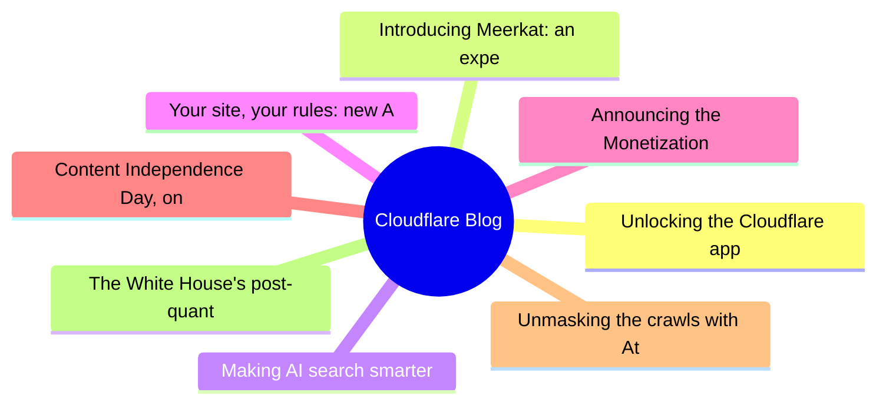
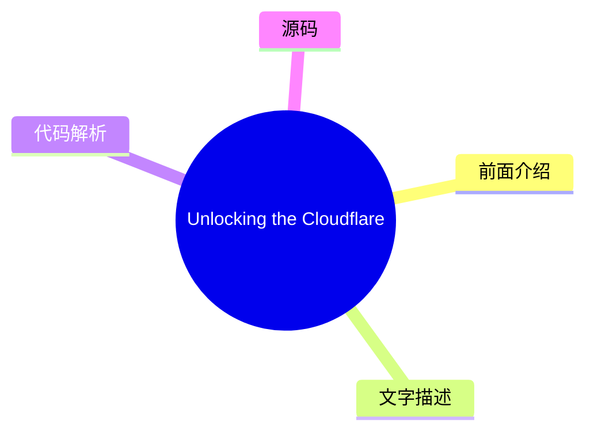
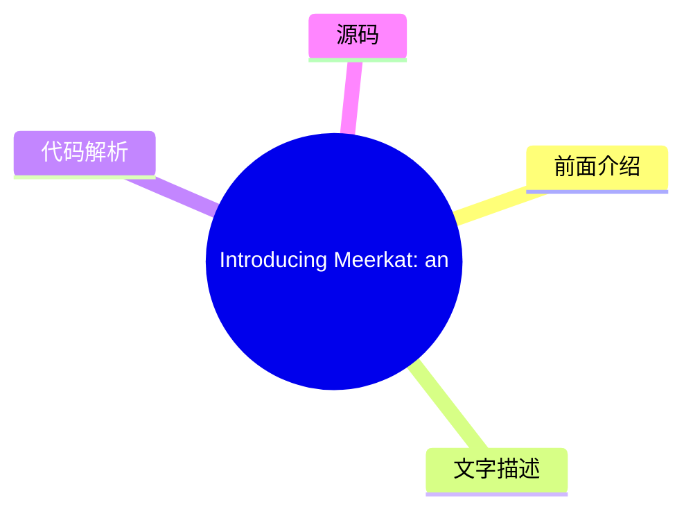
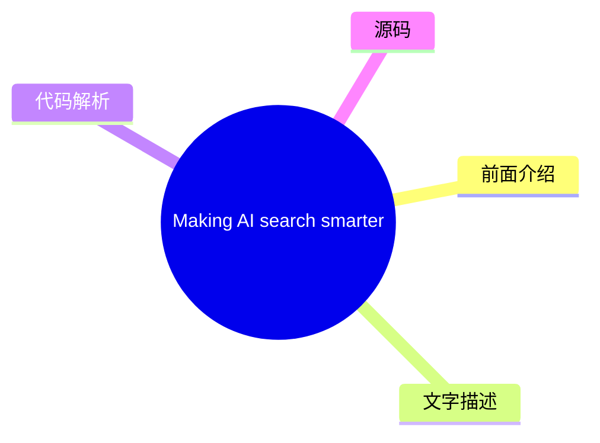
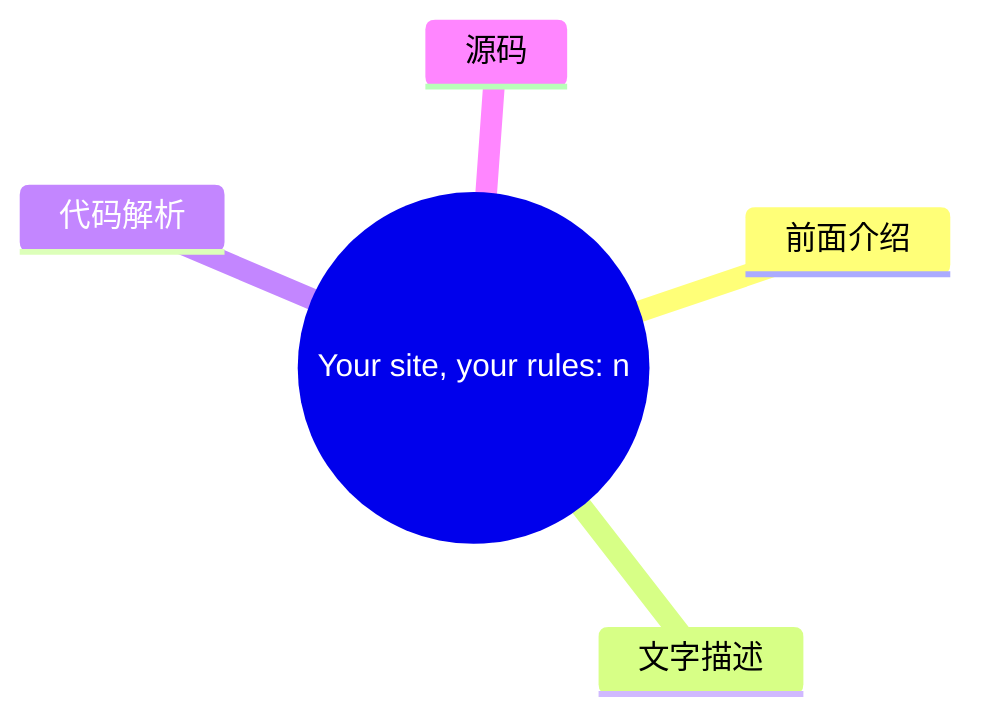
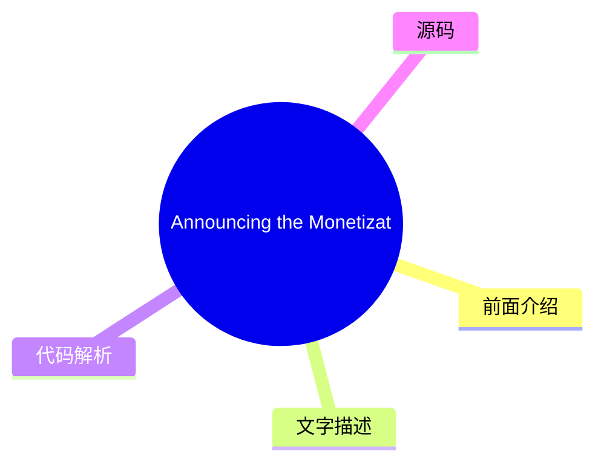
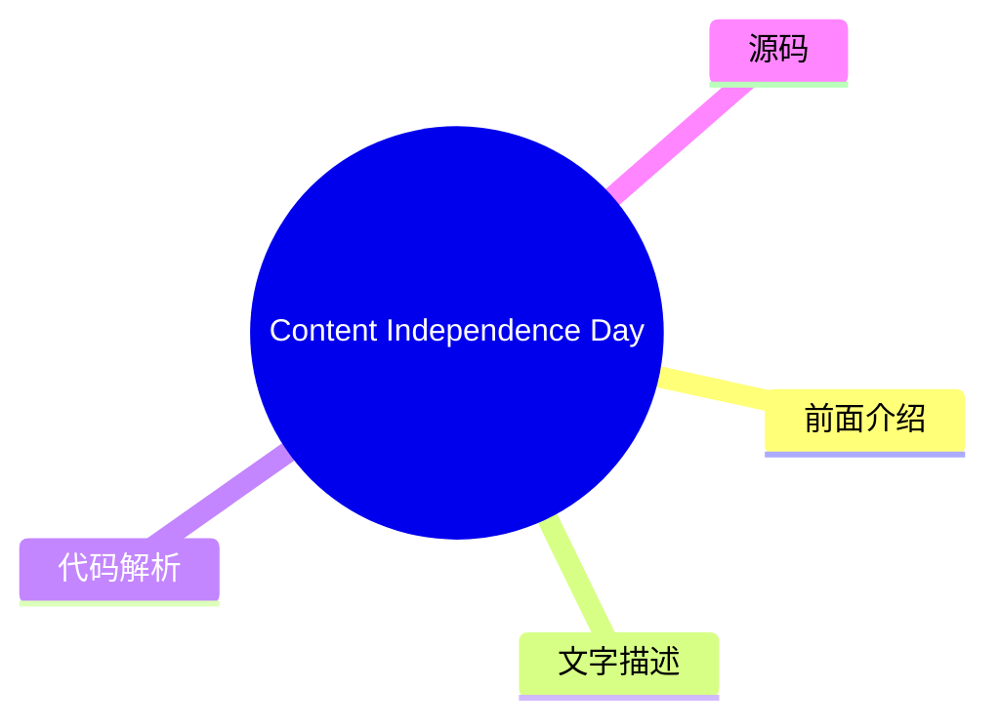
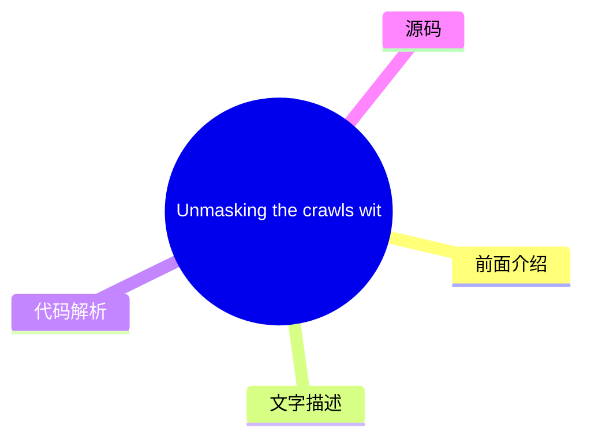
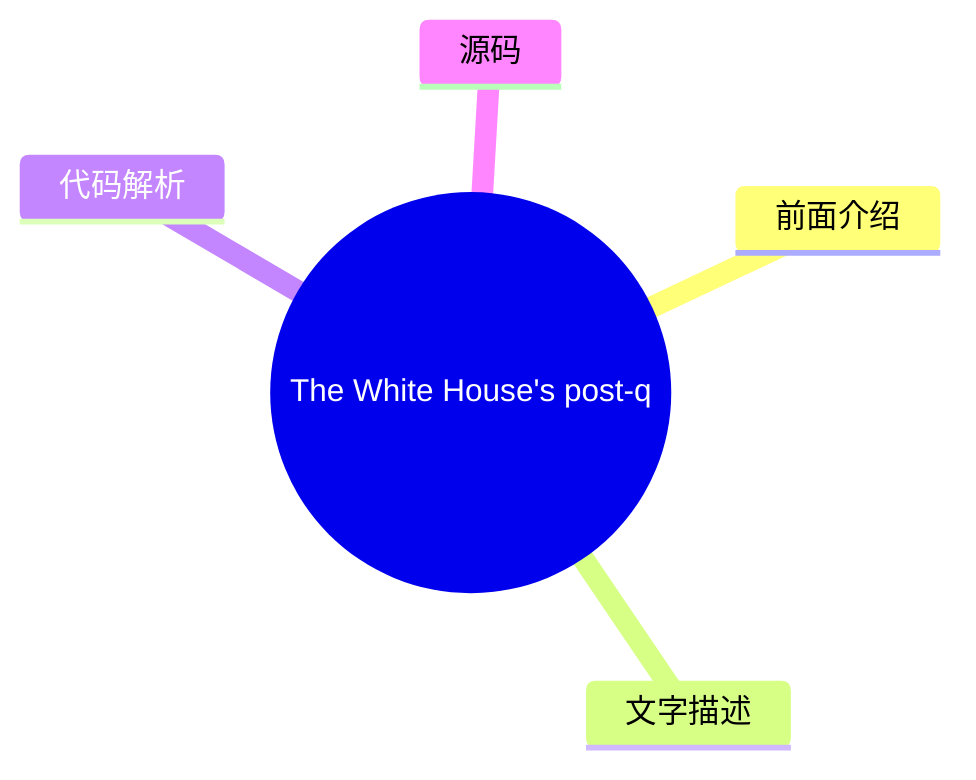

# ☁️ Cloudflare Blog Top 8 (2026-07-27)

## 前面介绍

- 数据源：Cloudflare Blog
- 抓取日期：2026-07-27
- 条目数：8
- 含完整正文：8
- 含代码片段：0
- 组织方式：前面介绍 / 树状图 / 文字描述 / 代码解析 / 源码

## 思维导图



## 详细整理（8 条，8 条含全文，0 条含代码）

### 1. Unlocking the Cloudflare app ecosystem with OAuth for all
- **链接**: [https://blog.cloudflare.com/oauth-for-all/](https://blog.cloudflare.com/oauth-for-all/)
- **作者**: Sam Cabell
- **发布**: Wed, 24 Jun 2026 06:00:00 GMT

#### 前面介绍

- Self-Managed OAuth is now available to all developers on Cloudflare. Here's how we executed a zero-downtime migration of our core OAuth engine to make it happen.
- 作者：Sam Cabell
- 发布时间：Wed, 24 Jun 2026 06:00:00 GMT

#### 树状图



#### 文字描述

- Cloudflare provides services that help run 20% of the web, but we donât do it alone. Developers on our platform use a myriad of tools and services from other companies too. Cloudflare provides a rich API for our platform that enables developers to create automations, CI/CD, and integrations that glue together the various parts of their infrastructure. Earlier this month, we ann
- ## Scaling the ecosystem securely While our earlier OAuth solution was sufficient for a small number of carefully managed partners, we realized that our permissions model, our consent experience, and our ways of mitigating potential abuse vectors were not mature enough. Earlier this year we [ updated our consent experience](https://blog.cloudflare.com/improved-developer-securi
- ## Planning the upgrade to our OAuth engine Years ago, we deployed [ Hydra](https://github.com/ory/hydra), an open-source OAuth engine, to power Cloudflare OAuth under the hood. That deployment served us well when usage was limited, but as the developer platform grew and agentic workflows became more common, it became clear that we needed a major upgrade to unlock new capabilit
- ## Executing the upgrade

#### 代码解析

- 本文未检测到明确代码块，内容更偏新闻、观点或方法论。

#### 源码

#### 中文节选

Cloudflare provides services that help run 20% of the web, but we donât do it alone. Developers on our platform use a myriad of tools and services from other companies too. Cloudflare provides a rich API for our platform that enables developers to create automations, CI/CD, and integrations that glue together the various parts of their infrastructure. Earlier this month, we announced [ self-managed OAuth](https://developers.cloudflare.com/changelog/post/2026-06-03-public-oauth-clients/), making it easier for customers to create and manage their own OAuth clients for delegated access to the Cloudflare API.

Cloudflare isnât new to OAuth. If youâve used Wrangler, or used integrations from partners like PlanetScale, then youâve already used it. However, until now, third-party OAuth was only available through a small number of manually onboarded integrations, and was not available to developers more broadly. That meant developers building their own integrations had to rely on API tokens, which are harder to manage and a poor fit for many delegated application flows.Â

Over the last year, we onboarded a growing number of early partners while improving the consent, revocation, and security model behind Cloudflare OAuth. But as our Developer Platform grew and agentic tools drove demand for delegated access, it became clear that opening up OAuth to all customers was critical to the success of our platform.Â

With self-managed OAuth, developers can now offer a standard OAuth flow where customers grant scoped access directly, making it easier to build SaaS integrations, internal developer platforms, and agentic tools while giving users clearer consent, easier revocation, and more control over what an application can do.

## Scaling the ecosystem securely

While our earlier OAuth solution was sufficient for a small number of carefully managed partners, we realized that our permissions model, our consent experience, and our ways of mitigating potential abuse vectors were not mature enough.Â


今年早些时候，我们[更新了我们的同意体验](https://blog.cloudflare.com/improved-developer-security/#improving-the-oauth-consent-experience)，以更清晰地显示哪个应用程序正在请求访问权限，以及它将获得哪些权限。我们还在仪表板中添加了撤销功能，以便开发者可以轻松控制哪些应用程序有权访问其数据，并使应用程序的所有权更加可见，以防止 OAuth 钓鱼攻击。 

向所有客户开放自托管 OAuth 还需要对我们的底层 OAuth 引擎进行重大升级。这一过程需要大量的规划，以尽量减少用户中断，同时确保数据的稳定性和安全性。

## 规划 OAuth 引擎的升级

几年前，我们部署了 [ Hydra](https://github.com/ory/hydra)，一个开源 OAuth 引擎，以在幕后为 Cloudflare OAuth 提供支持。该部署在我们使用量有限时表现良好，但随着开发者平台的增长以及代理工作流的出现，该部署已无法满足需求。

#### 完整正文（中文）

Cloudflare provides services that help run 20% of the web, but we donât do it alone. Developers on our platform use a myriad of tools and services from other companies too. Cloudflare provides a rich API for our platform that enables developers to create automations, CI/CD, and integrations that glue together the various parts of their infrastructure. Earlier this month, we announced [ self-managed OAuth](https://developers.cloudflare.com/changelog/post/2026-06-03-public-oauth-clients/), making it easier for customers to create and manage their own OAuth clients for delegated access to the Cloudflare API.

Cloudflare isnât new to OAuth. If youâve used Wrangler, or used integrations from partners like PlanetScale, then youâve already used it. However, until now, third-party OAuth was only available through a small number of manually onboarded integrations, and was not available to developers more broadly. That meant developers building their own integrations had to rely on API tokens, which are harder to manage and a poor fit for many delegated application flows.Â

Over the last year, we onboarded a growing number of early partners while improving the consent, revocation, and security model behind Cloudflare OAuth. But as our Developer Platform grew and agentic tools drove demand for delegated access, it became clear that opening up OAuth to all customers was critical to the success of our platform.Â

With self-managed OAuth, developers can now offer a standard OAuth flow where customers grant scoped access directly, making it easier to build SaaS integrations, internal developer platforms, and agentic tools while giving users clearer consent, easier revocation, and more control over what an application can do.

## Scaling the ecosystem securely

While our earlier OAuth solution was sufficient for a small number of carefully managed partners, we realized that our permissions model, our consent experience, and our ways of mitigating potential abuse vectors were not mature enough.Â


今年早些时候，我们[更新了我们的同意体验](https://blog.cloudflare.com/improved-developer-security/#improving-the-oauth-consent-experience)，使其更清晰地显示哪个应用程序正在请求访问权限，以及它将获得哪些权限。我们还在仪表板中添加了撤销功能，以便开发者可以轻松控制哪些应用程序有权访问他们的数据，并使应用程序所有权更加可见，以防止 OAuth 钓鱼攻击。 

向所有客户开放自管理 OAuth 还需要对我们的底层 OAuth 引擎进行重大升级。这个过程需要大量的规划，以尽量减少用户中断，同时确保数据稳定性和安全性。

## 规划 OAuth 引擎升级

几年前，我们部署了 [ Hydra](https://github.com/ory/hydra)，一个开源 OAuth 引擎，在幕后为 Cloudflare OAuth 提供支持。该部署在我们使用量有限时表现良好，但随着开发者平台的增长和代理工作流的普及，很明显我们需要进行重大升级，以解锁新功能并提高性能。 

在规划升级时，我们决定进行两次较小的顺序升级，而不是进行一次大型升级。Â 首先，我们将迁移到最新的 1.X 版本，评估任何行为或性能变化，然后继续进行 2.X 升级。

在我们的升级规划过程中，很明显即使 1.X 升级* *仍然会影响客户，因为 Hydra 数据库需要大量的模式迁移，这些迁移：

- 以会锁定关键表的方式创建索引，阻止活跃用户执行重要的 OAuth 操作Â
- 向关键表添加列，并将其他列移动到新表

我们使用的 Hydra 版本还有一个怪癖，即 SDK 会执行 SELECT * 操作，导致与模式更改出现反序列化问题。

为了防止用户影响，我们重写了 SQL 迁移以使用 CREATE INDEX CONCURRENTLY 等功能，并构建了 Hydra 的自定义版本，该版本选择显式列而不是 SELECT *。

With the latest 1.X upgrade planned out, we now needed to create a plan for the even larger 2.X upgrade. We identified three potential options, and weighed the benefits and drawbacks of each one. Doing an in-place upgrade was not going to work for us, due to the sheer amount of schema changes the major version bump brought with it. We decided that a blue-green strategy would work, but there was more that needed to be done than simply flipping a switch to start using the new version. The upgrade and migration process would take multiple hours, and we needed the system to continue functioning correctly in that time window.

The first blue-green option would involve disabling writes to the database, preventing any new authorizations from occurring. This means they would not be lost in the transition, but it also meant that nobody would be able to use existing OAuth apps unless they already had a valid credential. It also presented another large problem: if users needed to revoke access from an application for any reason, it would not be possible while the upgrade was being performed.

To combat these issues, we came up with a way to leave writes to the database enabled, at the cost of losing some of them in the switch to the green version. The first thing to solve was minimizing the number of writes for new tokens. There was an operational lever we pulled: increasing the expiry time of tokens to multiple hours. This would allow apps that received new tokens before the upgrade to continue using them without needing to refresh.


随着写入减少问题得到解决，我们需要想出一个办法，确保在升级窗口期间用户执行的任何吊销操作都不会丢失。为此，我们创建了一个队列系统（使用 [Cloudflare Queues](https://developers.cloudflare.com/queues/)！）在吊销事件发生后，会将包含该吊销信息的记录写入队列。这使我们能够在数据库切换到绿色版本后清空队列，重放所有在原本会丢失的时间窗口内发生的吊销事件。这一点至关重要，必须处理正确，否则用户已吊销的应用程序将意外恢复其访问权限。

## 执行升级

### 升级到 1.X

从运维角度来看，我们对最后一个 1.X 版本的首次升级进行得非常顺利。我们的自定义数据库迁移比预期的更快，没有对用户造成任何影响。由于旧版本无法检查由新版本创建的令牌，我们不得不强制切换到新版本。

切换后，我们看到了以前从未见过的刷新令牌错误增加。这最终是由于新版本中更严格的刷新令牌失效行为造成的；如果刷新令牌被重用，Hydra 将使整个访问和刷新令牌链失效。这对 Wrangler 和 MCP 客户端来说是个问题。这些客户端的请求量都很高，单个重用的刷新令牌就会使整个会话失效。

我们通过在路由 OAuth 流量的 Worker 中添加刷新令牌合并行为来缓解了这个问题。这使我们能够在请求到达 Hydra 之前短暂缓存刷新令牌请求，这样如果我们检测到重试，就可以短路请求并响应，而无需使令牌失效。幸运的是，2.X 版本的 Hydra 有一个可配置的“刷新令牌宽限期”，它通过允许刷新令牌在一段时间内重试而不使整个链失效来解决这个问题。

### 升级到 2.X

Since multiple hours of high user-facing impact would not be acceptable, we had our blue-green upgrade strategy set. At a high level, this sounds simple; the migrations would run on a copy of our production database, and then cut over along with the new Hydra version after they complete. In reality, there were a *lot *more moving parts:

- Enable revocation replay capture queue
- Copy and restore our database to the new target
- Targeted data cleanup â existing data violated some new constraints introduced in the newer versions, which could prevent migrations from succeeding
- Perform cutovers on the Hydra service along with two additional critical internal systems simultaneously to prevent any errors
- Post-cutover monitoring and validation

We chose an upgrade window when Hydra had the lowest request volume per second to minimize lost token writes. Other than some timeout tuning, our production migrations ran well against the new database: the net runtime in production was approximately three hours. After the migrations completed, we carefully rolled out the new version of the Hydra service, along with two additional system configs to flip our systems to use the new SDK version.

Shortly after cutting traffic over, we observed that a data cleanup job in our authorization service (which relies on the Hydra consent session API) was being overeager in its purging of OAuth policy data. After investigation, we discovered that there was an issue in one of the Hydra migrations that corrupted the state of certain valid OAuth sessions, which resulted in the migration marking them as invalid. The valid sessions being corrupted caused a disagreement between Hydra and our authorization service, manifesting as an increase in 403s. To mitigate this, we did data restorations and began work on improvements for OAuth authorization behaviors to remove reliance on static policy data.

Beyond the data cleanup issue, there were some additional small fixes more driven by specific client behaviors which we landed quickly.Â


随着 Hydra 版本升级的完成，OAuth 流量保持稳定，系统性能和可靠性得到了提升，这为我们的客户带来了更好的体验。此次升级还将生产环境建立在与我们已在预发布环境中验证过的新 OAuth API 相同的基础上，为我们在 6 月 3 日推出 [ 自托管 OAuth 发布](https://developers.cloudflare.com/changelog/post/2026-06-03-public-oauth-clients/) 清除了障碍。

## 性能改进

在完成如此大规模的升级后，查看一些关于影响范围的整体指标总是令人欣慰且具有启发性的。我们在数据库迁移期间收集了额外的指标，并观察到升级完成后性能有了显著提升。

### 数据库

| 指标 | 近似值 | 
|---|---| 
| 更新行数 | 132.5M | 
| 插入行数 | 114.7M | 
| 临时字节 | 136.97GB | 
| 事务提交数 | 22.2k | 

### Hydra 性能

| 指标 (平均) | 升级前 | 升级后 | 变化 | 
|---|---|---|---|
| API P95 | 185ms | 101ms | -45% | 
| RSS 内存 | 888MB | 763MB | -14% | 
| Go 堆分配 | 449MB | 271MB | -40% | 
| Goroutine 数量 | 4015 | 3076 | -23% | 
| CPU | 1.07 核心 | 0.67 核心 | -37% | 

## 面向所有客户的自托管 OAuth

向所有客户开放 OAuth 是构建更广泛的 Cloudflare 应用生态系统的重要一步。今天，任何 Cloudflare 客户都可以创建自己的 OAuth 应用程序，并在 Cloudflare 之上构建集成。我们非常兴奋地推出面向所有客户的 Cloudflare 自托管 OAuth。

要开始使用，请查看我们的 [ 文档](https://developers.cloudflare.com/fundamentals/oauth/) 或直接跳转到仪表板中的 OAuth 应用程序页面，并 [创建您的第一个 OAuth 应用程序。](https://dash.cloudflare.com/?to=/:account/oauth-clients)

__仪表板__


### 2. Introducing Meerkat: an experiment in global consensus
- **链接**: [https://blog.cloudflare.com/meerkat-introduction/](https://blog.cloudflare.com/meerkat-introduction/)
- **作者**: James Larisch
- **发布**: Wed, 08 Jul 2026 12:00:00 GMT

#### 前面介绍

- Cloudflare Research is building a global consensus service called Meerkat that uses a new consensus algorithm called QuePaxa. We plan to use Meerkat to build a strongly consistent, fault-tolerant key-value store, and other applications.
- 作者：James Larisch
- 发布时间：Wed, 08 Jul 2026 12:00:00 GMT

#### 树状图



#### 文字描述

- Many internal services at Cloudflare need to read and modify the same control-plane state from across our 330+ global data centers. They need guarantees that different readers *never *see inconsistent state, and that the system remains available for writes even when some data centers or links fail. But Cloudflareâs network runs across the entire Internet, and the Internet is an
- ## What we need from a global control-plane data system Many Cloudflare services read and write *control-plane data*, data that helps those services operate correctly, from multiple machines distributed all over the world. One example of control-plane data is *placement information*: where certain resources (like an AI model instance) are stored. Another example is *leadership 
- ### Strong consistency A distributed data systemâs [ consistency](https://jepsen.io/consistency/models) level describes what kinds of weird behavior the system is allowed to exhibit when it receives concurrent reads and writes. Consider a distributed key-value store that stores a single numeric value `x = 6` across multiple nodes. Also consider the following sequence of writes.
- ### Fault tolerance A systemâs level of fault tolerance describes what kinds of faults the system can handle before catastrophes happen. Catastrophes are typically violations of properties the system aims to uphold, e.g., that two consecutive reads without an intervening write for the same key never see different values, or that the system remains available for writes. The faul

#### 代码解析

- 本文未检测到明确代码块，内容更偏新闻、观点或方法论。

#### 源码

#### 中文节选

Many internal services at Cloudflare need to read and modify the same control-plane state from across our 330+ global data centers. They need guarantees that different readers *never *see inconsistent state, and that the system remains available for writes even when some data centers or links fail.

But Cloudflareâs network runs across the entire Internet, and the Internet is an unpredictable place. Servers and data centers go down. Queues fill up. Links and cables get cut. These conditions make it difficult to run a globally available data system that guarantees strong consistency (e.g., that all readers are guaranteed to read all prior writes) because hostile conditions hinder distributed system replicasâ ability to reliably synchronize data with one another.

One way to synchronize data safely despite adverse network conditions is via a *consensus algorithm, *which* *allows a set of machines to agree on the same sequence of values, such as key-value store put and `get` operations, as long as a majority remains alive and able to communicate. 

Unfortunately, commonly deployed consensus algorithms like [ Raft](https://raft.github.io/) suffer in wide-area networks like Cloudflareâs because they rely on 

*leaders*and

*timeouts*. The

*leader*is the only replica allowed to make writes, and if it fails due to a crash or network degradation, the system becomes unavailable until some other replica

*times out*and a new leader is elected. And these timeout values are hard to configure in networks with unpredictable latencies.

We have experienced multiple incidents caused by unavailable leaders in consensus-driven systems.

And so, for the past year, Cloudflareâs Research [ team](https://research.cloudflare.com/) has been building a new distributed consensus service called 

**Meerkat**powered by a consensus algorithm called

[, published in 2023 by Tennage & BÄsescu et al. QuePaxa differs from Raft in that all replicas can perform writes at all times, and progress is never halted due to a timeout, which makes it well suited for Cloudflareâs network. We layer](https://bford.info/pub/os/quepaxa/quepaxa.pdf)


__QuePaxa__*应用程序*，例如事务型键值存储和租赁系统，构建在 Meerkat 的共识日志之上。据我们所知，这将是 QuePaxa 首次在全球范围内进行工业级部署。

Meerkat 是一个仍在开发中的实验性共识服务。它最初被设计用于管理少量的控制平面状态（例如，复制数据库的领导权），因此在可预见的未来，它将保持仅限内部使用。本文介绍了 Meerkat，并为后续与 Meerkat 相关的博客文章奠定了基础。

## 我们对全球控制平面数据系统的需求

Cloudflare 的许多服务会从分布在世界各地的多台机器上读取和写入*控制平面数据*，这些数据有助于这些服务正确运行。控制平面数据的一个例子是*放置信息*：cer

#### 完整正文（中文）

Cloudflare 内部的许多服务需要从我们 330 多个全球数据中心读取和修改相同的控制平面状态。它们需要保证不同的读取者*从不*看到不一致的状态，并且即使在某些数据中心或链路发生故障的情况下，系统对于写入操作仍然可用。

但是 Cloudflare 的网络覆盖整个互联网，而互联网是一个不可预测的地方。服务器和数据中心会宕机。队列会填满。链路和电缆会被切断。这些条件使得很难运行一个保证强一致性的全球可用数据系统（例如，保证所有读取者都能读取到所有先前的写入），因为敌对条件阻碍了分布式系统副本之间可靠地同步数据。

尽管网络条件不利，但通过*共识算法*安全地同步数据的一种方法是，它允许一组机器在只要大多数节点保持存活且能够通信的情况下，就同意相同的值序列，例如键值存储的 put 和 `get` 操作。

不幸的是，像 [Raft](https://raft.github.io/) 这样的常见共识算法在 Cloudflare 这样的广域网上表现不佳，因为它们依赖于*领导者*和*超时*。*领导者*是唯一被允许进行写入的副本，如果它因崩溃或网络降级而失败，系统将变得不可用，直到某个其他副本*超时*并选举出新的领导者。而且，这些超时值在具有不可预测延迟的网络中很难配置。

我们已经经历过多次由共识驱动系统中不可用领导者引发的事故。

因此，在过去的一年里，Cloudflare 的研究 [团队](https://research.cloudflare.com/) 正在构建一个新的分布式共识服务，名为

**Meerkat**，它由一种称为

[, 于 2023 年由 Tennage & BÄsescu 等人发表。QuePaxa 与 Raft 的不同之处在于，所有副本可以随时执行写入，且进度永远不会因超时而停止，这使其非常适合 Cloudflare 的网络。我们层](https://bford.info/pub/os/quepaxa/quepaxa.pdf)

__QuePaxa__*applications*, like a transactional key-value store and leasing system, atop Meerkatâs consensus log. To our knowledge, this will be the first industrial deployment of QuePaxa at global scale.

Meerkat is an experimental consensus service that is still in development. Itâs being designed initially to manage small pieces of control plane state (e.g., leadership for replicated databases) and so it will be kept internal-only for the immediate future. This post introduces Meerkat and lays the groundwork for the Meerkat-related blog posts to come.Â

## What we need from a global control-plane data system

Many Cloudflare services read and write *control-plane data*, data that helps those services operate correctly, from multiple machines distributed all over the world. One example of control-plane data is *placement information*: where certain resources (like an AI model instance) are stored. Another example is *leadership information*: which machine is currently allowed to perform writes to a database. 

Control-plane data must be both *strongly* *consistent* and* accessible despite particular kinds of faults.*

In this section we precisely describe our consistency and fault tolerance requirements for a Cloudflare consensus service. We use a key-value store for a running example of an application running atop our consensus service, though other applications (e.g., distributed leases/locks) are possible.

### Strong consistency

A distributed data systemâs [ consistency](https://jepsen.io/consistency/models) level describes what kinds of weird behavior the system is allowed to exhibit when it receives concurrent reads and writes. Consider a distributed key-value store that stores a single numeric value 

`x = 6` across multiple nodes. Also consider the following sequence of writes. These writes are submitted to different nodes on a best-effort basis, and could arrive in any order: - `x = x + 1`
- `x = x / 2`

A systemâs consistency level tells you what values of `x` a client might see when reading `x` after these writes. Consider the following sequence of operations and the possible execution orders under different consistency levels:


在弱一致性级别中，写入操作可能会被重新排序。在更强的一致性模型中，写入操作不能被重新排序，但读取操作可以。在可能的最强一致性级别中，操作的顺序与它们在真实时间中发生的顺序完全一致。这种属性被称为 *线性化*。

在 Cloudflare，许多服务都需要线性化。与较弱的一致性形式不同，线性化免除了程序员去思考数据系统可能表现出的所有怪异行为。相反，他们可以像在单线程机器上推理本地内存一样来推理分布式系统：写入之后的所有读取都将看到该写入。有关弱一致性的危险，请查看 Marc Brooker 的这篇[文章](https://brooker.co.za/blog/2025/11/18/consistency.html)以获取更多阅读材料。

（如果你很好奇，Meerkat 的键值存储也提供了可串行化，我们将在未来的文章中讨论这一点。）

### 容错性

系统的容错级别描述了在灾难发生之前，系统能够处理哪些类型的故障。灾难通常是系统旨在维护的属性被违反，例如，两次连续读取且中间没有对同一键的写入，永远不会看到不同的值，或者系统保持可写入。故障包括网络故障或延迟、机器崩溃和机器重启。系统通常会显式处理某些故障，但不处理其他故障（你无法处理所有故障，因为宇宙总是可能达到热寂）。例如，某些键值存储可能会保证只要系统中有三分之二的机器可以相互通信且没有崩溃，就保持可写入，但如果某台机器被攻破并开始发送恶意消息，则不做任何承诺。

我们期望的容错属性如下：

**首先**，只要满足以下条件，数据系统应保持对位于我们任何数据中心之一的客户端的写入和读取可用：

- 我们系统中的大多数机器是存活状态并且可以相互通信。（形式上，我们在 `2f + 1` 台机器的系统中容忍 `f` 个故障）。

- 客户端可以联系系统中的*任何*一台连接到大多数存活机器的机器。

这意味着，单台机器故障或单条链路的网络降级都不会影响系统的可用性*。*正如我们稍后将看到的，Raft 系统不提供此属性。

**第二**，只要系统中没有参与者主动作恶（当然，也没有 bug），数据系统就会保持*正确*。我们将在后面从共识*安全性*的角度定义*正确性*，但通俗地说，这意味着没有两台最新的机器会就世界状态产生分歧（例如，一台认为 `key1=1`，而另一台认为 `key1=2`）。

总之，即使机器崩溃、机器重启、网络故障或降级、数据中心宕机等，系统也必须保持正确（尽管我们像基于 Raft 的系统一样，不处理[拜占庭故障](https://en.wikipedia.org/wiki/Byzantine_fault)）。

## 介绍 Meerkat

Meerkat 是一个共识服务，我们可以在其上构建具有上述属性（强一致性和容错性）的应用程序，例如键值（KV）存储。为了理解 Meerkat 的工作原理，我们首先概述 Meerkat 的总体架构，然后描述 Meerkat 对共识算法的选择如何提供强一致性和容错性。

使用 Meerkat 的服务开发人员会请求一组 Meerkat *副本*。每个副本都连接到其他每个副本。每个副本都参与共识算法，并且可以接收读写请求。开发人员可以指定允许在其副本上托管的数据中心，Meerkat 会自动放置它们。

为了与其集群交互，开发人员的客户端会向集群中的任意一个副本发送特定于应用程序的请求。单个副本可能托管多种类型的应用程序，但最简单的是键值存储，因此最简单的特定于应用程序的请求类型是 KV `get` 或 `put`。副本会使用特定于应用程序的响应来响应请求（例如，使用 `get` 请求的记录）。请注意，KV 读取（`get`）保证读取到最新信息。

### Meerkat 的日志

在底层，副本将应用程序请求（例如 `get` 和 `put`）转换为 *日志事件*。该副本使用共识算法将每个日志事件分发给所有其他副本，以确保所有副本维护完全相同的事件日志（实际上，副本可能会落后，但绝不能记录不同的条目）。这些事件是任意的——Meerkat 的核心并不关心它们里面有什么。Meerkat 的 *应用程序* 关心的是日志事件的内容。每个 Meerkat 副本“托管”许多 Meerkat 应用程序（例如键值存储），这些应用程序读取日志事件并构建状态。（注意，每个副本恰好属于一个集群。）

例如，KV Meerkat 应用程序从日志事件中构建一个内存键值存储。因此，当客户端发送像 `put k1 v1` 这样的写入时，接收到的副本将该写入放入一个日志事件中并分发给所有副本。如果其他人随后向不同的副本写入 `put k1 v11`，该事件也会分发给所有副本。由于所有正常工作的副本拥有相同的日志，这些副本可以按顺序应用日志中的操作来构建完全相同的状态。注意，`get` 请求也会创建分布式日志事件（为了线性一致性，如下一节所述）。

以下是副本的 KV 存储在接收日志事件时如何更新的示例：

### Meerkat 的日志如何实现强一致性

Meerkat 保证，如果一个客户端执行 `put k1 v1`，第二个客户端随后执行 `put k1 v11`，第三个客户端随后执行 `get k1`（使用一致的读取），他们将始终读取到 `v11`。即使每个请求被提交到不同的副本，且这些副本随机分布在世界各地，Meerkat 也能保证这一点。这就是线性一致性。为了了解 Meerkat 如何保证这一点，我们必须更详细地检查 Meerkat 的日志。

The Meerkat log is a sequence of slots. A slot is a box that can contain an event or not. A slot that contains an event is called a *decided *slot. All slots in the log are decided except the last slot, which is currently being decided. One of Meerkatâs invariants is that if any two replicas decide on the value for a slot, those values are the same. In other words, no two replicas will ever disagree on the value of a decided slot (though one replica may think the last slot is empty while another does not). This property helps guarantee the desired properties we described in the previous section.

To decide on the value of the last (empty) slot in the log, Meerkat replicas run a distributed *consensus algorithm*. A consensus algorithm allows a set of machines communicating over a network to agree on a decided slot value. Our consensus algorithm works as long as a majority of replicas (more than half) are alive.

So if the log currently contains two entries, and a client submits `put k1 v11` to a replica, that replica triggers a consensus algorithm for slot 3. But another client might have submitted `put k1 v111` to a different replica for slot 3. The consensus algorithm ensures that only one such *proposal* for slot 3 wins out. Specifically, it ensures that at least a majority of replicas agree on the same proposal, *deciding *it for slot 3. The non-majority can *never* decide a different proposal, but might miss the fact 

...（截断，原文 20546+ 字符）


### 3. Making AI search smarter
- **链接**: [https://blog.cloudflare.com/making-ai-search-smarter/](https://blog.cloudflare.com/making-ai-search-smarter/)
- **作者**: Matthew Conroy
- **发布**: Wed, 01 Jul 2026 13:00:00 GMT

#### 前面介绍

- Search is how we find nearly everything on the web — creators, merchants, answers. AI is rewriting the rules, leaving creators caught between staying discoverable in an agentic era and getting paid for their work. Today we're launching two initiative
- 作者：Matthew Conroy
- 发布时间：Wed, 01 Jul 2026 13:00:00 GMT

#### 树状图



#### 文字描述

- Search drives most experiences on the web. It's how we get things done, and how nearly everything on the web gets found â the creators, the merchants, the answer to whatever you just typed into a box. For nearly 30 years, that discovery journey ran on a simple bargain: let a search engine crawl your content, and it sends you visitors. You turned those visitors into a business â
- ### Rebuilding the bargain Transparency and control are the foundation, but more is needed. In 2025, we laid out our foundation via a set of [ responsible AI bot principles](https://blog.cloudflare.com/building-a-better-internet-with-responsible-ai-bot-principles/): bots should be transparent about who they are and what they're for, respect site owners' choices, and act in good
- ### Making search smarter Today we're launching a research program to make AI search smarter and stop our customers footing the bill for crawls that produce nothing new. More than 20% of the web sits behind Cloudflareâs network, which gives us a unique perspective. We can tell which pages have genuinely changed and which ones people and agents are flocking to. Through this prog
- ### From Pay Per Crawl to Pay Per Use Last year we [ launched Pay Per Crawl ](https://blog.cloudflare.com/introducing-pay-per-crawl/)so publishers could charge AI companies for crawling their content. It was a real start, but crawling is a crude measure of value. A single page might be crawled once and then cited in thousands of answers, or crawled over and over and never used 

#### 代码解析

- 本文未检测到明确代码块，内容更偏新闻、观点或方法论。

#### 源码

#### 中文节选

搜索驱动了网络上的绝大多数体验。这是我们完成事情的方式，也是网络上的几乎所有内容被找到的方式——创作者、商家，以及你刚刚在框中输入的任何问题的答案。近 30 年来，那次发现之旅运行在一个简单的交易之上：让搜索引擎抓取你的内容，它就会向你发送访客。你通过广告、订阅，或者仅仅是受众本身，将这些访客转化为了生意。可被发现和获得报酬曾经是同一回事。一年前，在[首个内容独立日](https://blog.cloudflare.com/content-independence-day-no-ai-crawl-without-compensation/)，我们划下了一条线，以在 AI 时代捍卫这一交易。但一道界线仅仅是个开始。自那时以来，AI 搜索在消费者生活中的普及程度只增不减，因为

[. 威胁不再是你可以屏蔽的少数训练爬虫；而是搜索本身正在围绕 AI 答案进行重建。](https://radar.cloudflare.com/)

__超过 50% 的在线流量是非人类的__如今的答案引擎会读取你的页面并将摘要交给用户，因此访问——以及依赖于它的收入——就变得不再必要。我们亲眼目睹了这一点，独立研究也证实了这一点：[2025 年皮尤研究中心的一项研究](https://www.pewresearch.org/short-reads/2025/07/22/google-users-are-less-likely-to-click-on-links-when-an-ai-summary-appears-in-the-results/)发现，当谷歌显示 AI 摘要时，用户点击传统搜索结果链接的频率仅为 8%（大约是没有摘要时的一半），而点击摘要内部链接的频率仅为 1%。这让我们陷入了两难境地：退出 AI 搜索从而难以被找到，或者加入 AI 搜索，在为用户提供巨大价值的同时，却看到回报越来越少。我们的客户希望被找到并获得其提供价值的报酬，而目前他们被迫做出选择。

今天，[我们宣布了新的机器人选项](http://blog.cloudflare.com/content-independence-day-ai-options)，以帮助我们的客户更好地控制谁可以访问他们的网站以及他们可以对网站做什么。但屏蔽只是第一步：说“不”可以在不重建维持网站业务模式的情况下保护内容。因此，是时候开始构建互联网的新经济模式，从搜索开始。

### 重建契约

透明度和控制是基础，但这还不够。2025 年，我们通过一套 [负责任的 AI 机器人原则](https://blog.cloudflare.com/building-a-better-internet-with-responsible-ai-bot-principles/) 阐明了我们的基础：机器人应透明地说明其身份和用途，尊重网站所有者的选择，并善意行事。我们的工具将机器人以此标准为基准。但强制执行良好的机器人行为并不能让依赖它的 AI 搜索变得更好，也不会向创造了答案所必需内容的创作者返还一美元。我们不仅能帮助网络说“不”；我们还可以帮助重建它所说的“是”

#### 完整正文（中文）

搜索驱动了网络上的绝大多数体验。这是我们完成事情的方式，也是网络上的几乎所有内容被找到的方式——创作者、商家，以及你刚刚在框中输入的任何问题的答案。近 30 年来，那次发现之旅运行在一个简单的交易之上：让搜索引擎抓取你的内容，它就会向你发送访客。你通过广告、订阅，或者仅仅是受众本身，将这些访客转化为了生意。可被发现和获得报酬曾经是同一回事。一年前，在[首个内容独立日](https://blog.cloudflare.com/content-independence-day-no-ai-crawl-without-compensation/)，我们划下了一条线，以在 AI 时代捍卫这一交易。但一道界线仅仅是个开始。自那时以来，AI 搜索在消费者生活中的普及程度只增不减，因为

[. 威胁不再是你可以屏蔽的少数训练爬虫；而是搜索本身正在围绕 AI 答案进行重建。](https://radar.cloudflare.com/)

__超过 50% 的在线流量是非人类的__如今的答案引擎会读取你的页面并将摘要交给用户，因此访问——以及依赖于它的收入——就变得不再必要。我们亲眼目睹了这一点，独立研究也证实了这一点：[2025 年皮尤研究中心的一项研究](https://www.pewresearch.org/short-reads/2025/07/22/google-users-are-less-likely-to-click-on-links-when-an-ai-summary-appears-in-the-results/)发现，当谷歌显示 AI 摘要时，用户点击传统搜索结果链接的频率仅为 8%（大约是没有摘要时的一半），而点击摘要内部链接的频率仅为 1%。这让我们陷入了两难境地：退出 AI 搜索从而难以被找到，或者加入 AI 搜索，在为用户提供巨大价值的同时，却看到回报越来越少。我们的客户希望被找到并获得其提供价值的报酬，而目前他们被迫做出选择。

Today, [ weâve announced new bot options](http://blog.cloudflare.com/content-independence-day-ai-options) to help our customers better control who can access their site and what they can do with it. But blocking was only step one: saying "no" protects content without rebuilding the business models that sustain it. So, itâs time to start building the new economic model of the Internet, starting with search.

### Rebuilding the bargain

Transparency and control are the foundation, but more is needed. In 2025, we laid out our foundation via a set of [ responsible AI bot principles](https://blog.cloudflare.com/building-a-better-internet-with-responsible-ai-bot-principles/): bots should be transparent about who they are and what they're for, respect site owners' choices, and act in good faith. Our tools hold bots to that bar. But enforcing good bot behavior doesn't make AI search any better for the people relying on it, and it doesn't send a dollar back to the creator whose work made the answer possible. We can do more than help the web say "no"; we can help rebuild what it says "yes" to.

So today, we're announcing two initiatives that move from defense to offense and start putting both halves of that old bargain back together.

**Make AI search smarter: **By** **using the signals we see across our global network, like what's fresh, what's high quality, and what's actually changed, we can help answer engines surface the most relevant content and reduce unwanted crawling. People searching get better answers, while costs are reduced for both AI companies and site owners if webpages are only recrawled when theyâve changed.

**Pay creators for the value they provide:** When your work is used to answer someone's question, you should be rewarded instead of just being scraped for free. And you should be able to see what's being used and what people are asking. This should be a real revenue stream, and an incentive to keep producing original content worth finding.

### Making search smarter

Today we're launching a research program to make AI search smarter and stop our customers footing the bill for crawls that produce nothing new.


More than 20% of the web sits behind Cloudflareâs network, which gives us a unique perspective. We can tell which pages have genuinely changed and which ones people and agents are flocking to. Through this program, we will explore using signals our customers have chosen to share about the freshness of their content, and we will combine those with our own insight into traffic flows, both human and bot. For answer engines, that's a roadmap to high-quality content. For our customers, it provides a view of what users are actually asking, and how their content shows up in AI results. The aim is to measure two things: how much these signals help answer engines to surface fresher, higher-quality content, and how much unnecessary crawling they cut out.

That second benefit, cutting unnecessary crawling, is bigger than it sounds. Cloudflare data suggests that more than 50% of crawl traffic from good bots goes to re-fetching pages that haven't changed â and that number is likely to climb as crawl volumes do. A signal that just says "nothing's changed here" lets a crawler skip the trip. That saves the answer engine compute. More importantly, it saves site owners from serving and paying for requests they never needed to.Â

The program is neutral by design: our goal is to make it work for every answer engine willing to play fair. It's limited to search. We aren't sharing any content, and nothing is used to train foundation models. We intend to publish what we learn, including the benefits to site owners such as better content discoverability and reduced server strain. We plan to make the capability broadly available later this year and reduce unnecessary crawling across our network.

### From Pay Per Crawl to Pay Per Use

Last year we [ launched Pay Per Crawl ](https://blog.cloudflare.com/introducing-pay-per-crawl/)so publishers could charge AI companies for crawling their content. It was a real start, but crawling is a crude measure of value. A single page might be crawled once and then cited in thousands of answers, or crawled over and over and never used at all. Creators want to be paid fairly for the value they provide.


所以我们开始将 Pay Per Crawl 转型为 Pay Per Use。我们正在与顶级 AI 公司（如 [ Ceramic.ai](http://ceramic.ai) 和 [You.com](http://you.com)）进行实验，这种安排很简单：组织可以引入自己的支付模式，并轻松将其扩展到 Cloudflare 网络上的内容所有者身上。

__You.com__ Ceramic 构建了一种所谓的“按查询付费”模式，因此选择加入的出版商可以在其内容出现在 Ceramic 的搜索结果中获得报酬。这意味着支付设计是跟随工作所提供的价值，而不是爬虫偶然抓取它的次数。

“为了扩展 AI 搜索的未来，我们需要一个拥有巨大覆盖范围并致力于透明度和公平补偿的合作伙伴，”Ceramic.ai 的创始人兼首席执行官 Anna Patterson 说，“Cloudflare 允许我们轻松且以编程的方式扩展我们的运营。通过将我们的按查询付费模式引入他们的网络，我们确保数百万内容所有者可以无缝选择加入，每次其内容出现在我们的搜索结果中时都能获得补偿。”

除了补偿之外，参与 Cloudflare/Ceramic 计划的内容所有者还将解锁新的报告，以帮助进行答案引擎优化（AEO）。客户终于可以看到导致其内容出现在搜索结果中的热门查询、特定的网页和摘要、其平均搜索结果排名位置等。这是我们即将推出的众多帮助客户提高可发现性的产品中的第一款。

这只是众多新兴方法中的一种。另一种来自 You.com：代理可以按需为所需的具体优质内容付费，无需任何前期承诺。AI 提供商正在测试新的支付模式（例如按查询付费、按结果付费等），而我们拥有支持所有这些模式的基础设施。

我们想坦诚地说明，这只是一个实验。还有很多东西需要学习，包括这种模式在互联网规模下究竟如何运作。我们将与合作伙伴和客户一起逐步摸索，并分享我们的发现。但目标很明确：AI 搜索公司能获得更及时、更有依据的答案，而那些为这些答案提供支持的客户（即创作者）在提供帮助时也能获得报酬。Cloudflare 在这一切中的职责是提供能够使这一市场繁荣发展的基础设施层。

我们认为，这更符合搜索经济学的走向。旧式的人工网络优化搜索是为了节省时间——提供摘要、十个蓝色链接以及点击跳转。智能体驱动的互联网则不同：智能体可以快速阅读并持续搜索。搜索正变成智能体为了回答一个问题而执行的数十次操作，它更像是一种公用事业，而非一个目的地。在那个世界里，重要的单位不再是抓取或点击，而是结果。为结果定价，并支付促成结果的人，这就是互联网得以持续繁荣的方式。

### 我们想要赢得的头条

一年前的“内容独立日”，头条是默认的“不”：AI 不能在不支付报酬的情况下进行抓取。今年，我们的重点是给用户提供更多的产品和控制选项，以便他们说“是”，并带来更多的好处。

今天的公告只是开始。Cloudflare 的研究项目旨在探索我们的信号能否在减少抓取的情况下产生更好的结果。按使用付费是我们将与合作伙伴一起尝试的有前景的方向，这些合作伙伴相信内容创作者理应获得对其工作的公平报酬。过去 30 年的互联网也是这样建立的：有人先进行试点，将“模型失效”转变为“这是新模型”，一次实验接着一次实验。我们相信，在这个新的智能体时代，让客户易于被发现，并优化其内容以实现最大发现，对客户是有价值的。但他们应该能够在不免费赠送其最有价值的创意资产的情况下做到这一点。

互联网正在发生变化，它所依赖的商业模式也随之改变。旧的互联网是开放、中立且值得贡献的。我们有机会保持这种状态，并为未来的互联网构建资助它的商业模式。为人类和智能体提供更智能的答案。为那些凭借技能、创造力和奉献精神让答案变得有价值的人们提供公平的交易。这就是我们追求 Cloudflare 使命的方式：帮助构建一个更好的互联网。

祝内容独立日快乐！

* 基于开放、面向智能体的网络构建？如果您有兴趣了解更多关于 Ceramic 和 You 计划的信息，请填写
__此表单__。如果您正在构建答案引擎并希望进行更智能的抓取，我们也非常乐意收到您的来信：aeo@cloudflare.com。


### 4. Your site, your rules: new AI traffic options for all customers
- **链接**: [https://blog.cloudflare.com/content-independence-day-ai-options/](https://blog.cloudflare.com/content-independence-day-ai-options/)
- **作者**: Jin-Hee Lee
- **发布**: Wed, 01 Jul 2026 13:00:00 GMT

#### 前面介绍

- For our second Content Independence Day, we’re giving website owners finer options to manage AI traffic. Instead of a one-size-fits-all block, all customers can now easily distinguish and manage Search, Agent, and Training bots, alongside the new abi
- 作者：Jin-Hee Lee
- 发布时间：Wed, 01 Jul 2026 13:00:00 GMT

#### 树状图



#### 文字描述

- One year ago, we declared the first [ Content Independence Day](https://blog.cloudflare.com/content-independence-day-no-ai-crawl-without-compensation/), and we gave website owners the means to take back control of their content. The deal between crawlers and website owners that had held up for 30 years â we crawl you, and you get referrals â was no longer true. AI was taking ev
- ### Now, AI can be anything Today, AI can be in anything. Google search has changed from being sorted by AI to being a [ full answer engine](https://blog.google/products-and-platforms/products/search/search-io-2026/) that answers your question directly on the results page. And Google is not unique in this position â this is the direction in which âsearchâ is moving. We could de
- ### A pragmatic taxonomy To address these questions, we need a more nuanced view â a pragmatic taxonomy that aligns with the AI use cases our customers care about. So we are opening the discussion beyond AI training alone and focusing on three AI use cases that we want all customers to be able to manage: - **Search:**any behavior that collects or indexes your content, so it can
- ### New options to manage AI traffic **We want to provide more options for managing different kinds of AI traffic, to all website owners on the Cloudflare network.** The managed preset to âBlock AI botsâ that weâve announced in the past included single-purpose bots that crawled data for model training, as shown below:Â *Screenshot of the existing setting to manage AI bot traffi

#### 代码解析

- 本文未检测到明确代码块，内容更偏新闻、观点或方法论。

#### 源码

#### 中文节选

One year ago, we declared the first [ Content Independence Day](https://blog.cloudflare.com/content-independence-day-no-ai-crawl-without-compensation/), and we gave website owners the means to take back control of their content. The deal between crawlers and website owners that had held up for 30 years â we crawl you, and you get referrals â was no longer true. AI was taking everything and sending back nothing, presenting an existential threat to website owners. And so we launched a one-click "Block AI Bots" option, along with a 

[.](https://blog.cloudflare.com/introducing-pay-per-crawl/)

__Pay-Per-Crawl marketplace__A lot has changed in a year. Last July, conversations around âAI botsâ centered around blocking AI training without compensation, pointing to the winâlose deal where content was used for model training with no value driven back to the website owner. But a desire for more nuance has emerged: Content owners still want to be able to protect their content, and they should be compensated for the original content that they work hard to create, curate, and share. We also know that locking down content isnât a one-size-fits-all solution; website owners want more options than resorting to âblock all automation, every time.â

If you run a small site, the problem isnât *just* that someone could train models on your content â it's that nobody can find you in the first place. So you have to make a Faustian bargain: either show up in search and let AI train on you, or risk losing discoverability. This unfairly advantages incumbent search providers if they use the same bots for both search and training; and this unfair advantage incentivizes new players to be evasive as they try to close the competitive gap.

### Now, AI can be anything

Today, AI can be in anything. Google search has changed from being sorted by AI to being a [ full answer engine](https://blog.google/products-and-platforms/products/search/search-io-2026/) that answers your question directly on the results page. And Google is not unique in this position â this is the direction in which âsearchâ is moving.


We could debate the cutoff for what qualifies as âAIâ today, just to find that the standard changes tomorrow. So, instead of defining a bot primarily as âAIâ or not, our updated approach to classification will ask deeper questions about bot or agent behavior: What are they doing on my site? What are they storing? And how will they reshare my content?

### A pragmatic taxonomy

To address these questions, we need a more nuanced view â a pragmatic taxonomy that aligns with the AI use cases our customers care about. So we are opening the discussion beyond AI training alone and focusing on three AI use cases that we want all customers to be able to manage:

- **Search:**any behavior that collects or indexes your content, so it can answer questions about it later. The key is that Search is proactively building a database of your site to later respond to queries with. Site owners sho

#### 完整正文（中文）

One year ago, we declared the first [ Content Independence Day](https://blog.cloudflare.com/content-independence-day-no-ai-crawl-without-compensation/), and we gave website owners the means to take back control of their content. The deal between crawlers and website owners that had held up for 30 years â we crawl you, and you get referrals â was no longer true. AI was taking everything and sending back nothing, presenting an existential threat to website owners. And so we launched a one-click "Block AI Bots" option, along with a 

[.](https://blog.cloudflare.com/introducing-pay-per-crawl/)

__Pay-Per-Crawl marketplace__A lot has changed in a year. Last July, conversations around âAI botsâ centered around blocking AI training without compensation, pointing to the winâlose deal where content was used for model training with no value driven back to the website owner. But a desire for more nuance has emerged: Content owners still want to be able to protect their content, and they should be compensated for the original content that they work hard to create, curate, and share. We also know that locking down content isnât a one-size-fits-all solution; website owners want more options than resorting to âblock all automation, every time.â

If you run a small site, the problem isnât *just* that someone could train models on your content â it's that nobody can find you in the first place. So you have to make a Faustian bargain: either show up in search and let AI train on you, or risk losing discoverability. This unfairly advantages incumbent search providers if they use the same bots for both search and training; and this unfair advantage incentivizes new players to be evasive as they try to close the competitive gap.

### Now, AI can be anything

Today, AI can be in anything. Google search has changed from being sorted by AI to being a [ full answer engine](https://blog.google/products-and-platforms/products/search/search-io-2026/) that answers your question directly on the results page. And Google is not unique in this position â this is the direction in which âsearchâ is moving.


We could debate the cutoff for what qualifies as âAIâ today, just to find that the standard changes tomorrow. So, instead of defining a bot primarily as âAIâ or not, our updated approach to classification will ask deeper questions about bot or agent behavior: What are they doing on my site? What are they storing? And how will they reshare my content?

### A pragmatic taxonomy

To address these questions, we need a more nuanced view â a pragmatic taxonomy that aligns with the AI use cases our customers care about. So we are opening the discussion beyond AI training alone and focusing on three AI use cases that we want all customers to be able to manage:

- **Search:**any behavior that collects or indexes your content, so it can answer questions about it later. The key is that Search is proactively building a database of your site to later respond to queries with. Site owners should expect to get referral traffic or other equitable compensation as a result.
- **Agent:**automated- **Training**: a crawler taking your content to train or fine-tune a model. The key is that your data is permanently absorbed into the underlying architecture of the AI to improve its capabilities.

Many popular crawlers on the web fall into one of the classifications above; some fall into multiple. We classify plenty of other behaviors beyond the three above â including ads verification, feed fetching, and agentic transactions (more on this below). But we believe it should be simple for all website owners to manage access for these three AI-centered use cases. We believe that bot operators should separate their crawlers because that creates more transparency for website owners: allowing them to better understand why a given crawler is visiting them, as well as to better manage the access they extend to that crawler. If a company runs automation that builds **Search** indexes, acts as an **Agent**, and collects data to **Train** their models, then we strongly encourage that company to separate the automation into three separate crawlers.


We want a classification system that is scalable and representative of the world of automated traffic as it evolves. Tracking a botâs purposes is nothing new, but our new taxonomy involves a few updates that better represent the state of bot traffic today. Most notably, we want to recognize that bots that have multiple purposes should be tracked with all purposes, not just one of them.

### New options to manage AI traffic

**We want to provide more options for managing different kinds of AI traffic, to  all website owners on the Cloudflare network.**

The managed preset to âBlock AI botsâ that weâve announced in the past included single-purpose bots that crawled data for model training, as shown below:Â

*Screenshot of the existing setting to manage AI bot traffic on July 1, 2025.*

But not all AI use is the same, and we want our customers to have the controls they need. So, weâre launching the ability to **manage AI traffic based on  three major use cases: Search, Agent, and Training** crawlers. With these new options, our customers can more finely tune how they manage AI bot traffic â including customers on our Free tier.

*Screenshot of the new options to manage AI bot traffic on July 1, 2026.*

### Setting new defaults

**On September 15, 2026, weâll be setting new defaults** **for each of these three classifications.** For all new domains onboarding to Cloudflare, the categories of **Training** and **Agent** will be blocked by default **on the pages that display ads, **while **Search** will remain allowed by default. 

An ad is a signal that a website owner meant for a person to land there and see it â something monetizable that fuels the business. So, on those pages, we treat human attention as the end goal, and keep away the bots that may prevent this attention (i.e., Training and Agent bots). On the other hand, Search is the behavior that most naturally funnels back visitors, and we believe itâs in the interest of most site owners to allow this.


9月15日将适用的另一项变更是多用途爬虫（特别是那些结合了搜索与训练的爬虫）将根据其*所有*行为被允许或屏蔽，这与我们呼吁网站所有者保持透明一致。由于默认设置将由最严格的适用规则强制执行，因此如果客户选择了屏蔽训练（无论是通过[管理 AI 流量](https://developers.cloudflare.com/bots/additional-configurations/block-ai-bots/)的新选项，还是通过传统的屏蔽 AI 爬虫服务），Googlebot、Applebot 和 BingBot 等多用途爬虫将被屏蔽。

当然，客户的选择至高无上：如果网站所有者希望退出这些新的默认配置，他们可以在9月15日之前的任何时间在他们的安全设置中[轻松标记此选项](https://dash.cloudflare.com/?to=/:account/:zone/security/settings)，这将确认他们希望对既用于搜索又用于训练的爬虫*不做任何更改*。随着9月15日的临近，我们还将继续通知客户关于默认设置变更的消息，以确保希望选择与默认设置不同的配置的客户有机会进行操作。

### BotBase：企业客户的新可见性平面

作为企业级机器人管理的一项新功能，我们也很兴奋地推出了一项重大的可见性更新。随着 Cloudflare 跟踪的机器人目录不断增长，人们也希望能对这些机器人进行合理的分组管理，并了解有关特定机器人的更多细节。

隆重推出 [BotBase](https://developers.cloudflare.com/bots/botbase/)。BotBase 是我们跟踪所有已知机器人的新数据库，包括已验证的机器人和代理。该数据库直接在 Cloudflare 仪表板上提供了我们整个机器人目录的全面、可搜索视图。我们正在优先解决*可见性*问题，但今年晚些时候，我们将扩展 BotBase，为网站上的已知自动化内容提供直接的控制中心。

借助这一新视图，Enterprise Bot Management 客户可以查看所有已验证机器人/代理的完整目录，以及它们在此更新后的分类法中的分类——这是我们此前从未在 Cloudflare 仪表板上动态展示过的视图。想要精确针对特定机器人的客户还可以轻松筛选来自该机器人的所有流量，并将检测 ID 复制到 Security 规则中使用。所有这些功能现已上线，位于一个专用页面中，可通过 [ Bot Management 配置卡片](https://dash.cloudflare.com/?to=/:account/:zone/security/settings/bot-traffic/bot-base) 访问。

在构建 BotBase 时，我们希望涵盖所有信息，以便能够从机器人到机器人构建可扩展、强大的洞察。其中一部分是我们更新后的分类法的基石，该分类法**基于机器人在您的网站上可能执行的操作——即其行为**。我们将这些分类分开列出，每个机器人都会根据这些行为中的一个或多个进行分类。

| 机器人分类 | 行为与用途 |
|---|---|
| Search | 爬取以扫描您的网站，以帮助其在搜索引擎结果中显示 |
| Agent | 代表人类访问页面的用户导向代理 |
| Training | 爬取以训练或微调模型 |
| Transact | 代表用户执行结账操作 |
| Data Collection | 包括价格抓取、竞争情报收集和第三方分析 |
| Security Testing | 包括漏洞扫描和渗透测试 |
| SEO | SEO 爬取、网站审计、无障碍检查 |
| Ads Verification | 广告投放验证、广告欺诈检测 |
| Social / Link Preview | 社交平台和消息应用的链接预览 |
| Feed Fetching | 包括 RSS 阅读器、播客聚合器和新闻源机器人 |
| Monitoring & Operations | 包括正常运行时间监控、Webhooks 和健康检查 |

*加粗斜体行表示所有客户现在都可以使用的新的可配置选项。*

### 爬虫如何使用我的内容？

我们听到的另一条对客户至关重要的信息是机器人的**内容使用情况**——即机器人抓取您的内容后可能会保留和重新分享的内容。为了解决这个问题，我们正在为 Bot Management 客户构建基于“内容使用情况”进行选择和屏蔽的功能。此设置可以设置为以下三个级别，从最不严格到最严格：

- `immediate` — 交互，但不存储或重复使用任何内容
- `reference`（默认） — 索引、摘录并链接回
- `full` — 摘要和复制

这些值可以与机器人分类相结合，以表达更细致的规则，例如“允许用于**搜索**、**SEO**和**广告验证**的机器人，但仅限于 `reference` 使用级别”。这允许网站所有者以合理的分组做出决策，而不是逐个管理机器人规则**。**

为了进一步支持这一点，从今天开始，我们正在测试一个新的信号 `use`，它扩展了 [Content Signals](https://contentsignals.org/) 并存在于您的 robots.txt 中。这通过第四个可选字段扩展了 Content Signals 第一版的三个字段，表达与上述相同的偏好：

- `use=immediate`
- `use=reference`
- `use=full`

与 robots.txt 文件中列出的所有其他项目一样，内容使用信号的值是网站所有者的*偏好*，而不是直接发出屏蔽指令。我们现在正在添加对此扩展的支持：所有已启用托管 robots.txt 的客户（该功能会在 robots.txt 中添加关于允许搜索抓取但禁止训练抓取的偏好）现在将在其 robots.txt 中添加 `use=reference` 的额外偏好。

```
# Cloudflare Managed content with original Content Signals
User-agent: *
Content-Signal: search=yes,ai

...（截断，原文 17662+ 字符）


### 5. Announcing the Monetization Gateway: charge for any resource behind Cloudflare via x402
- **链接**: [https://blog.cloudflare.com/monetization-gateway/](https://blog.cloudflare.com/monetization-gateway/)
- **作者**: Rohin Lohe
- **发布**: Wed, 01 Jul 2026 13:00:00 GMT

#### 前面介绍

- We're opening the waitlist for our Monetization Gateway, which will allow you to charge for any web page, dataset, API, or MCP tool behind Cloudflare. The charges will settle in stablecoins over the x402 open protocol, with no payments stack of your
- 作者：Rohin Lohe
- 发布时间：Wed, 01 Jul 2026 13:00:00 GMT

#### 树状图



#### 文字描述

- Today, we are announcing the Cloudflare Monetization Gateway, an engine that will give Cloudflare customers the ability to charge for any asset protected by Cloudflare: web pages, datasets, APIs, or MCP tools. It will provide a single control plane to manage payment policies and access controls across your applications, while also protecting your origin from high payment volum
- ### A refresher on x402 Last year on [ Content Independence Day](https://blog.cloudflare.com/content-independence-day-no-ai-crawl-without-compensation/), we gave site owners one-click control over which AI crawlers could reach their content, and with [we let them charge crawlers for it. The Monetization Gateway is the next step: instead of only charging crawlers for content, yo
- ### What the Monetization Gateway does The Monetization Gateway will provide a flexible payment rules API that will allow you to express exactly when you want a caller to pay to access your digital resources. Hereâs how it will work. Tokens, APIs, MCP tool calls, and data already flow through that path. You will decide, as precisely as you want, which of that traffic has to pay
- ### Where we see this going The Monetization Gateway will turn the request into a payment and give Cloudflare customers new revenue opportunities, but where this goes is far bigger. An agent is software that acts autonomously on a userâs behalf, and agents are starting to act on their own. Soon they will carry wallets and buy what they need without a person in the loop: a datas

#### 代码解析

- 本文未检测到明确代码块，内容更偏新闻、观点或方法论。

#### 源码

#### 中文节选

今天，我们宣布推出 Cloudflare Monetization Gateway，这是一个引擎，将赋予 Cloudflare 客户向任何由 Cloudflare 保护的内容收费的能力：网页、数据集、API 或 MCP 工具。

它将提供一个统一控制平面，用于管理您应用程序中的支付策略和访问控制，同时通过在边缘处理支付验证和执行，保护您的源站免受高支付量的影响。在启动时，支付将通过 [x402](https://www.x402.org/)（开放协议）以稳定币结算，该协议由超过 25 位行业领袖组成的联盟支持。

[我们正在构建](https://blog.cloudflare.com/x402/) __x402 Foundation__### 网络不断演变的商业模式

30 年来，网络一直运行在一个简单的经济交易上：用内容换取人类注意力。这种注意力通过广告、订阅和电子商务进行变现。这种交易资助了我们所熟知的互联网。

但随着代理成为互联网的主要用户，该模式正在崩溃。代理不会看广告，也不需要维持访问其所需工具的每月订阅。它们阅读或消费数据源一次，获取所需内容，然后继续前进。在整个网络中，AI 抓取器已经向其发送的内容请求次数从每次访客的几百次到数万次不等。

这一现实要求一种新模式：对一切实行基于使用量的定价。如果注意力和电子商务正从网站转向 AI 工具和 AI 编写的软件，那么代理应该为其所需的输入付费——训练数据、推理内容、开发工具和 API 使用。软件的自然支付单位是请求、令牌或结果，而不是席位或月份。这看起来可能像这样的一些例子：

- 每次网页搜索几分钱，按调用计费
- 上传端点的 0.001 美元基础费用加上每 MB 0.01 美元的费用

- 每次解决支持升级收费 0.99 美元，仅在任务成功时付费

这与 [当搜索引擎使用其内容时向创作者付费](https://blog.cloudflare.com/making-ai-search-smarter) 背后的理念相同——即每当使用内容或资源时，进行公平的价值交换，并以为此目的而构建的中立轨道进行定价。人们通常想象的是代理购买昂贵的资产，如网站域名，但代理支付的大部分内容位于结账流程之前，且价格要低得多。

互联网的某些部分已经以这种方式运作。云服务和 API 多年来一直按调用次数或按小时出售，但仅面向已知买家：用户注册，获得 API 密钥，并产生基于使用量的计费。内容大多跳过了支付环节，转而依赖广告。这些商业模式一直无法服务未经验证的

#### 完整正文（中文）

今天，我们宣布推出 Cloudflare Monetization Gateway，这是一个引擎，将赋予 Cloudflare 客户向任何由 Cloudflare 保护的内容收费的能力：网页、数据集、API 或 MCP 工具。

它将提供一个统一控制平面，用于管理您应用程序中的支付策略和访问控制，同时通过在边缘处理支付验证和执行，保护您的源站免受高支付量的影响。在启动时，支付将通过 [x402](https://www.x402.org/)（开放协议）以稳定币结算，该协议由超过 25 位行业领袖组成的联盟支持。

[我们正在构建](https://blog.cloudflare.com/x402/) __x402 Foundation__### 网络不断演变的商业模式

30 年来，网络一直运行在一个简单的经济交易上：用内容换取人类注意力。这种注意力通过广告、订阅和电子商务进行变现。这种交易资助了我们所熟知的互联网。

但随着代理成为互联网的主要用户，该模式正在崩溃。代理不会看广告，也不需要维持访问其所需工具的每月订阅。它们阅读或消费数据源一次，获取所需内容，然后继续前进。在整个网络中，AI 抓取器已经向其发送的内容请求次数从每次访客的几百次到数万次不等。

这一现实要求一种新模式：对一切实行基于使用量的定价。如果注意力和电子商务正从网站转向 AI 工具和 AI 编写的软件，那么代理应该为其所需的输入付费——训练数据、推理内容、开发工具和 API 使用。软件的自然支付单位是请求、令牌或结果，而不是席位或月份。这看起来可能像这样的一些例子：

- 每次网页搜索几分钱，按调用计费
- 上传端点的 0.001 美元基础费用加上每 MB 0.01 美元的费用

- 每解决一次升级支持，收费 0.99 美元，仅在任务成功时付费

这与 [当搜索引擎使用其内容时向创作者付费](https://blog.cloudflare.com/making-ai-search-smarter) 背后的逻辑相同——即每当使用内容或资源时，进行公平的价值交换，并在为此目的而构建的中立轨道上定价。人们通常想象一个代理购买昂贵的资产，如网络域名，但代理支付的大部分内容位于任何结账流程的上游，且价格要低得多。

互联网的某些部分已经以这种方式运作。云服务和 API 多年来一直按调用次数或按小时出售，但仅面向已知买家：用户注册，获得 API 密钥，并产生基于使用量的计费。内容大多跳过支付环节，依靠广告运行。这些商业模式一直无法为低于一美分的交易服务未经验证的买家，因为 [支付渠道](https://stripe.com/resources/more/what-are-payment-rails#what-are-payment-rails) 成本过高且结算耗时过长。低于一定价格时，收取付款的成本高于付款本身的价值。

历史上，基于使用量的计费难以实施。企业需要有效地成为支付公司，运行自己的会计系统，以稳健且可审计的方式跟踪内部使用情况。跟踪这种使用情况需要对后端系统进行重大改造。许多人选择了按席位定价，因为它更简单，且通常更有利可图。

代理翻转了这一动态。单个代理可以全天候完成整个团队的工作，并收取与实际消费无关的固定一次性费用。同时，代理可以在没有摩擦的情况下进行数千笔微支付，而要求个人批准每一笔付款将是不可承受的负担。基于使用量的价格点正是代理的生存空间，也是基于稳定币的微支付大放异彩的地方。这是因为稳定币（例如 [Open USD](https://joinopenstandard.com/) 和 [USDC](https://www.circle.com/usdc)）允许买家在互联网上转移小额资金，产生可忽略不计的费用，并在不到一秒的时间内结算。这在当今的其他支付渠道中是不可行的。

__USDC__Hereâs where we can help. Cloudflare has spent years building usage-based accounting for our own billing systems and for our customersâ analytics. We can dramatically simplify the implementation of usage-based billing for web-based assets thanks to our position as a proxy layer between buyers and sellers. As shown below, with Cloudflare supporting usage-based billing, the evidence of payment can move into the request itself, and the payment validation and the request paths merge.

And hereâs the benefit to you: the metering, the payment exchange, and the settlement move off your origin. What stays with you is what matters â your rules, your prices, and your revenue. You will not need to onboard the buyer or stand up a billing system. You will write a rule and agentic buyers will pay for what they use.

### A refresher on x402

Last year on [ Content Independence Day](https://blog.cloudflare.com/content-independence-day-no-ai-crawl-without-compensation/), we gave site owners one-click control over which AI crawlers could reach their content, and with 

[we let them charge crawlers for it. The Monetization Gateway is the next step: instead of only charging crawlers for content, you will be able to charge any caller for any resource, from an API to data to an MCP tool call, and you will not have to build the payment machinery yourself.](https://blog.cloudflare.com/introducing-pay-per-crawl/)


__按爬取付费__x402 是一个开放协议，使得通过 HTTP 支付成为可能，其名称源于它终于被使用的 402 状态码。x402 交换很简单：客户端请求一个受支付保护的资源。服务器不直接提供该资源，而是返回 402 Payment Required（需要付款）并附带一个小型负载，其中说明了价格、接受的资产以及支付地点。客户端支付，然后重复请求并附带付款证明。中介进行验证，服务器返回资源。这一切都发生在普通的 HTTP 请求和响应中，没有重定向到结账页面，也没有单独的支付 API 可调用。结算采用点对点方式，因此买家发送给卖家的任何资金都会直接存入卖家的钱包。我们正在设计 Monetization Gateway 以保持支付开销很低，并力争实现亚秒级的支付结算。

*x402 支付流程：AI Agent â APIServer â Blockchain，来源：*

__GitHub 上的 x402 Readme__

两个属性使 x402 非常适合机器支付。支付金额可以很小，低至几分之一美分，因为该协议几乎不增加开销。而且买家不需要在卖家那里开户，因为支付本身就是凭证。x402 与底层基础设施无关，但它与稳定币非常契合，稳定币可以在几分之一美分内以零拒付在不到一秒的时间内完成结算。

### Monetization Gateway 的功能

Monetization Gateway 将提供一个灵活的支付规则 API，允许您精确表达何时希望调用者为访问您的数字资源进行支付。

它是这样工作的。令牌、API、MCP 工具调用和数据已经通过该路径流动。您将精确地决定哪些流量必须支付。您可以通过编写表达式来强制执行您的决定，这些表达式类似于您为其他 Cloudflare 规则编写的表达式，并且位于一个简单、专用的产品 API 中。Monetization Gateway 将随着 Cloudflare 的全球网络扩展至 330 多个城市，这意味着 x402 握手将在您的买家附近发生。这将减少请求延迟并保护您的源站。

一些计划中的功能示例：

- 针对特定 REST 动词收费：对特定路由的调用收取费用，例如，对 /api/premium/* 的每个 GET 或 POST 请求收取 $0.01。
- 变动定价：根据任务复杂度的不同收取变动金额，例如，图像生成可能会根据使用的计算量收取高达 $2 的任何金额。
- 仅对未认证的调用者收费：拦截来自您源站的 HTTP 401 "Unauthorized"（未授权）响应，并返回 402 "Payment Required"（需要付款）响应，同时附带定价和付款说明。

当请求匹配时，变现网关会在放行请求之前验证付款。您可以在仪表板中设置这些规则，或通过 Cloudflare API 和 Terraform 以代码方式管理它们，因此付费端点只是您的基础设施配置的一部分。

变现网关将首先允许用户要求买家使用稳定币支付服务和资源。卖家将能够使用他们积累的稳定币进行自己的交易，或将其兑换为银行账户中的等值法币。使用变现网关为您的产品扩大了可触达的市场。有了网关，代理可以请求您的资源，被告知价格，进行支付并获取响应。无需注册，无需 API 密钥，无需预先建立关系。您将决定需要了解该买家的多少信息，并且您拥有灵活性，可以要求代理使用 [Web Bot Auth](https://developers.cloudflare.com/bots/reference/bot-verification/web-bot-auth/) 进行身份验证，并针对他们已经持有的账户应用基于使用量的定价。

### 我们的发展方向

变现网关将把请求转化为支付，并为 Cloudflare 客户带来新的收入机会，但未来的发展将远不止于此。

An agent is software that acts autonomously on a userâs behalf, and agents are starting to act on their own. Soon they will carry wallets and buy what they need without a person in the loop: a dataset, an API call, a tool, a block of compute. Some of those resources will be free, and some will require proof of who the agent is and who it acts for, through verified agent identity. Many will require both an identity and a payment, and Cloudflare is one of the few places that will be able to settle all of it inside a single request, by verifying the agent, applying the rule, and checking the payment before the origin ever sees the call. The agent becomes the primary buyer on the Internet, and the request becomes the transaction.

There is an enormous amount of value moving across the Internet today that goes unmonetized or undermonetized, not because no one would pay for it, but because the tools to charge for it have never existed. Every useful API call, every answer, every tool invocation an agent makes has value, and almost none of it is paid for today. That is the opportunity in front of us, and it is what the Monetization Gateway will unlock.

This is what we are building toward: an agent-first Internet with Internet-scale settlement built in. Where the people who make something worth paying for get paid by the software that uses it, automatically. And where the smallest new API can reach the same buyers, on the same terms, as the largest company on the web, and the independent creator is paid by the large language models that use their work. That is the next business model of the Internet, and we are building to power it.

### Sign up for our waitlist

The Monetization Gateway waitlist is open now for Cloudflare customers. If youâre interested in monetizing your web page, dataset, API, or MCP tool with usage-based pricing, [ please join our early access list](https://docs.google.com/forms/d/e/1FAIpQLSfq6yaIgp57FCGFg7riXlSWTeD8d8Adur2c8tWaKY4SuzweiQ/viewform?usp=header).


### 6. Content Independence Day, one year on: building the business model for the agentic Internet
- **链接**: [https://blog.cloudflare.com/agentic-internet-bot-report/](https://blog.cloudflare.com/agentic-internet-bot-report/)
- **作者**: Arielle Weiss
- **发布**: Wed, 01 Jul 2026 13:00:00 GMT

#### 前面介绍

- One year after declaring Content Independence Day, a dynamic market for monetized content has officially emerged. In this report, we examine how the rise of autonomous AI agents is upending traditional search referrals and detail the new infrastructu
- 作者：Arielle Weiss
- 发布时间：Wed, 01 Jul 2026 13:00:00 GMT

#### 树状图



#### 文字描述

- One year ago, we declared [ Content Independence Day](https://blog.cloudflare.com/content-independence-day-no-ai-crawl-without-compensation/). At the time, we could see what many in the industry were beginning to sense: the fundamental economics of the Internet were shifting. AI adoption was accelerating, publishers were experiencing rapid declines in referral traffic, and AI c
- ## Part I: The Internet has changed â faster than anyone expected
- ### The vertical adoption curve AI is not just another technology cycle. It is a platform shift happening at more than 2x the speed that smartphones were adopted. In just 3.5 years, over 30% of humanity â 2.5 billion active users â has adopted regular use of generative AI. The adoption curve isn't merely steep: it's going vertical.
- ### The decline of the open web Never before have we seen such a rapid change in how humans interact with information, perform work, and spend time online. The way people use the Internet is changing dramatically. Today, for every hour spent online searching for information, only 15 minutes is spent on the open web. Traditional search behavior is collapsing as users shift to AI

#### 代码解析

- 本文未检测到明确代码块，内容更偏新闻、观点或方法论。

#### 源码

#### 中文节选

One year ago, we declared [ Content Independence Day](https://blog.cloudflare.com/content-independence-day-no-ai-crawl-without-compensation/). At the time, we could see what many in the industry were beginning to sense: the fundamental economics of the Internet were shifting. AI adoption was accelerating, publishers were experiencing rapid declines in referral traffic, and AI companies were crawling the web at unprecedented scale, often without clearly declaring intent, and almost always without compensation.

We changed the defaults. For all new domains on Cloudflare, AI training crawlers would be blocked by default unless domain owners chose otherwise. We didn't do this to wall off the web. We did it because we believed a healthier ecosystem required transparency, control, scarcity, and ultimately, a market where high-quality content could be valued and exchanged fairly.

A year later, that market has emerged. But the transformation of the Internet has happened even faster than we anticipated. In this report, we share key data points that illustrate how quickly the business model of the Internet has shifted â and what this new content market means for publishers and site owners.

## Part I: The Internet has changed â faster than anyone expected

### The vertical adoption curve

AI is not just another technology cycle. It is a platform shift happening at more than 2x the speed that smartphones were adopted. In just 3.5 years, over 30% of humanity â 2.5 billion active users â has adopted regular use of generative AI. The adoption curve isn't merely steep: it's going vertical.

### The decline of the open web

Never before have we seen such a rapid change in how humans interact with information, perform work, and spend time online.


The way people use the Internet is changing dramatically. Today, for every hour spent online searching for information, only 15 minutes is spent on the open web. Traditional search behavior is collapsing as users shift to AI-driven discovery and consumption. Instead of visiting multiple sites to source and compare information, users simply type a prompt and receive a nearly instantaneous, consolidated answer.


### The agentic Internet is here

This year, agent traffic crossed a historic threshold for the first time: more than 50% of traffic on the Internet is now non-human. This shift has staggering implications for publishers, content owners, and the future of the open web.

### Crawlers have changed their purpose

When looking at the crawlers Cloudflare identifies by purpose, the composition of crawler traffic tells the story clearly:

- 52% of crawler requests are now for AI training as of June 2026, up from 22% in Spring 2025.
- Mixed-use crawlers (those blending search, agent use, and training) represent over 36% of activity.
- Pure search crawling now represents a small and declining share of overall crawler activity, despite remaining critical for publisher visibility.

As AI training becomes a primary driver o

#### 完整正文（中文）

一年前，我们宣布了[内容独立日](https://blog.cloudflare.com/content-independence-day-no-ai-crawl-without-compensation/)。当时，我们可以看到许多业内人士开始察觉到：互联网的基本经济格局正在发生转变。AI 的采用正在加速，出版商的推荐流量正在急剧下降，而 AI 公司正以前所未有的规模抓取网络，往往没有明确声明意图，且几乎从未给予补偿。

我们更改了默认设置。对于 Cloudflare 上所有新域名，除非域名所有者另有选择，否则 AI 训练爬虫将被默认拦截。我们这样做并不是为了将网络封闭起来。我们这样做是因为我们相信，一个更健康的生态系统需要透明度、控制权、稀缺性，以及最终能够对高质量内容进行公平估值和交换的市场。

一年后，那个市场已经出现。但互联网的转型发生得比我们预期的还要快。在本报告中，我们分享关键数据点，以说明互联网商业模式转变得有多快——以及这个新的内容市场对出版商和网站所有者意味着什么。

## 第一部分：互联网的变化速度比任何人预期的都要快

### 垂直采用曲线

AI 不仅仅是一个技术周期。它是一个平台级转变，其速度是智能手机采用速度的 2 倍多。仅仅在 3.5 年内，超过 30% 的人类——即 25 亿活跃用户——已经采用了生成式 AI 的常规使用。采用曲线不仅仅是陡峭：它是垂直发展的。

### 开放网络的衰落

我们从未见过人类与信息交互、在线工作和在线花费时间的方式发生如此迅速的变化。

人们使用互联网的方式正在发生剧烈变化。如今，在在线搜索信息的每一小时中，只有 15 分钟是花在开放网络上的。随着用户转向 AI 驱动的发现和消费，传统的搜索行为正在崩溃。用户不再访问多个网站来获取和比较信息，而是直接输入提示词，并几乎立即收到一个综合性的答案。

### 代理互联网已经到来

今年，代理流量首次跨越了一个历史性的门槛：互联网上超过 50% 的流量现在是非人类的。这一转变对出版商、内容所有者以及开放网络的未来产生了令人震惊的影响。

### 抓取器的目的已经改变

在查看 Cloudflare 按用途识别的抓取器时，抓取流量的构成清晰地讲述了这个故事：

- 截至 2026 年 6 月，52% 的抓取请求现在用于 AI 训练，而 2025 年春季这一比例为 22%。
- 混合用途抓取器（那些融合了搜索、代理用途和训练的抓取器）代表了超过 36% 的活动。
- 尽管对出版商的可见性仍然至关重要，但纯搜索抓取现在在整体抓取活动中所占份额很小且呈下降趋势。

随着 AI 训练成为抓取活动的主要驱动力，区分发现和训练的能力变得越来越重要。混合用途抓取器模糊了这种区别，使内容所有者处于一个困难的境地：要么选择在代理时代保持可被发现，要么放弃其最有价值的内容而没有任何补偿。

### 旧商业模式已成过去

几十年来，开放网络的经济模式很简单。内容创作者用访问其内容的权限换取搜索引擎中的可见性，搜索引擎会返回推荐流量。这种流量成为出版商、创作者和企业产生经济价值的主要机制。

但今天，这种交换正在瓦解。内容仍然被抓取、索引和使用——但返回到来源地的相应流量却越来越少。随着 AI 系统直接回答问题、比较产品、进行研究并完成任务，开放网络上的信息越来越多地成为 AI 训练和检索系统的一部分。这引发了一个简单的存在主义问题：如果内容被消费而受众从未访问来源，内容创作者如何维持生计？

### 其影响是行业中立的

The earliest industries to feel the impact were news organizations and media companies. Today, similar dynamics are impacting businesses across retail, software, IT, and finance. Some of the most heavily crawled categories have seen human traffic decline as much as 40% in less than one year.

Many publishers are now preparing for what they call "Google Zero" â a world where little to no traffic comes from search referrals.

The implications extend to essentially every industry. Any organization that publishes proprietary information on the Internet will need to understand how to operate in an agentic era. This dynamic matters not just to content owners, but to all of us. The Internet is a critical part of the global economy and one of the world's most important public resources for surfacing information. Ensuring it remains healthy and sustainable is essential for all.

## Part II: The market has emerged

### What we built

When we launched Content Independence Day, we committed to three things:

- Transparency and control for site owners, enabling them to define how their content is accessed and monetized.
- Tools that create scarcity, shifting the balance of power back to content owners.
- A marketplace where content creators and AI companies of all sizes can discover, license, and determine the value of content more efficiently.

One year later, a market for monetized content is here, and the conditions for a dynamic marketplace are forming.

### Transparency and control created scarcity

Historically, publishers have had limited visibility into how AI companies accessed and used their content. As referral traffic declined, that lack of visibility became an economic problem prompting publishers to seek new ways to capture value.

Cloudflare's attribution, business intelligence, and enforcement tools gave publishers visibility into AI consumption at the network level â an enforcement mechanism far more effective than voluntary standards like robots.txt. For the first time, publishers could determine how their content was accessed and monetized. That control created scarcity, and drove a supply-and-demand content economy.

### Scarcity created leverage


Publishers that exercised control over access successfully created scarcity, giving them negotiating leverage that led to better deals. For the first time, publishers gained operator-level attribution data â evidence of how often LLMs attempted to access their content, which competitive LLMs were crawling, what their most in-demand URLs were, and what their crawl-to-referral ratios looked like. This reduced information asymmetry in licensing discussions and enabled publishers to negotiate from a position of knowledge.

### Leverage is changing the balance of power

This leverage has empowered our customers. As they have gained greater visibility into how AI systems access and use their content, theyâve become better equipped to understand the implications for their businesses and more confidently articulate the value of the information, brand, and audiences they have built.

As the balance of power between content owners and AI companies begins to change, a licensing economy is emerging:Â

- More than 50 publisher-AI agreements have been signed since 2023.
- Major AI companies now actively license content, increasingly recognizing the value of differentiated and premium content.
- Collective licensing models continue to emerge and scale.
- Large publishers are securing meaningful licensing agreements, demonstrating that content has real economic value within the AI ecosystem.

The conversation is no longer *whether* content should be compensated. The conversation now is *how*.

### The market is maturing, but inefficiencies remain

Early licensing agreements proved demand exists, but licensing today remains largely bespoke and unlikely to fully replace lost referral, advertising, and affiliate revenue. As a result, publishers are increasingly optimizing for AI consumption alongside traditional human discovery while exploring new monetization pathways.

Supply and demand remain difficult to match efficiently, and while thereâs an understanding that not all content carries the same value, content valuation is still unresolved.

### The Google convergence problem


如果不讨论 Google 在这个市场中的独特作用，讨论就不算完整。Google 仍然是网络发现的主导入口，约占推荐流量的 88%。但越来越多的用户正直接在 Google 拥有的 AI 体验中消费内容。

发现和消费从根本上服务于不同的目的。搜索将用户引导至内容，而 AI 驱动的体验越来越多地在不要求用户访问来源的情况下对内容进行总结和复用。网站所有者对这两项活动的看法不同，因为一项产生流量，而另一项越来越多地替代了流量。

当网站所有者决定谁可以访问其内容以及出于何种目的时，这些差异变得尤为重要。大多数领先的 AI 公司将发现爬虫与训练爬虫分开，使得出版商相对容易地为一项或另一项目的启用内容访问。而 Google 并没有。今天，Google 拥有的信息量大约是领先 AI 公司的两倍，因为 Google 利用了一种混合用途的机器人，这使得客户很难在不参与 Google 的 AI 生态系统的情况下参与 Google 的搜索生态系统。

与其他 AI 提供商不同，Google 的混合用途爬虫还限制了网站所有者的透明度。由于发现和 AI 访问被合并到一个爬虫中，出版商无法说明 Google 访问其内容的原因，也无法区分用于搜索的流量和用于 AI 体验的流量。他们还失去了在通过网络级别独立允许或阻止这些活动时所获得的可见性和证据。

这种动态加速了对更高透明度和控制权的需求，以及对新的变现模式的需求，以便更好地服务于各种规模的网站所有者和 AI 公司。

## 第三部分：生态系统独特视角

Cloudflare 处于新兴代理经济的交汇点。

超过 20% 的网站位于 Cloudflare 网络之后。在世界上访问量最大的网站中，有 36% 依赖我们的网络，超过 40% 的财富 500 强企业是 Cloudflare 的客户。近 80% 的领先 AI 公司使用 Cloudflare，此外还有数千名开发者和新兴 AI 公司。

这种独特的地位让我们能够洞察市场的两面。我们看到了创建内容的内容所有者、消费内容的 AI 公司，以及日益将它们连接起来的信号。这种视角让我们对过去一年市场的发展演变有了独特的见解，以及它现在需要什么。

## 第四部分：新兴市场的经验教训

随着出版商和 AI 公司适应新的代理经济，Cloudflare 对生态系统现在需要什么有了更清晰的理解。

### 透明度必须成为标准

内容所有者越来越需要对其内容被谁访问、如何使用以及用于什么目的拥有可见性和控制权。AI 公司也越来越认识到，透明度能建立信任并减少与出版商的摩擦。可见性和执行不再仅仅是安全顾虑——它们已成为直接影响许可谈判和商业决策的业务要求。

为了帮助使透明度成为标准，Cloudflare 正继续投资于增强的归属、测量和出版商控制功能，让内容所有者对其内容的使用方式拥有更大的可见性和控制权

...（截断，原文 16182+ 字符）


### 7. Unmasking the crawls with Attribution Business Insights
- **链接**: [https://blog.cloudflare.com/attribution-business-insights/](https://blog.cloudflare.com/attribution-business-insights/)
- **作者**: Jin-Hee Lee
- **发布**: Wed, 01 Jul 2026 06:00:00 GMT

#### 前面介绍

- Cloudflare’s new Attribution Business Insights dashboard helps website owners understand crawler behavior, appetite, and potential value, fueling business-level conversations around crawl compensation.
- 作者：Jin-Hee Lee
- 发布时间：Wed, 01 Jul 2026 06:00:00 GMT

#### 树状图



#### 文字描述

- Original content is the lifeblood of conversations and curiosities. Imagine a world without it: we could find a thousand ways to regurgitate the same material thatâs already been created, but we would witness the decline of fresh ideas and arguments. Website owners fuel the ecosystem of ideas, news, and interesting tidbits, but they face the increasingly complex challenge of ma
- ### The new economics of the Internet For decades, the business model of the Internet relied on a straightforward, unspoken agreement: website owners allowed search engines to crawl their content and, in return, search engines sent readers back to their pages. This symbiotic relationship, where traditional search engines operated with a balanced "crawl-to-referral" ratio, gener
- ## Introducing Attribution Business Insights We want website owners to have the facts â the cold, hard numbers to understand which bots are helping their business and which bots are harming it. We also want to make this analysis easier than ever, which is why weâve designed Attribution Business Insights to cut the noise, focusing on the details that our customers have told us a
- ### From data to business strategy You shouldnât have to be a security expert to understand how AI crawlers affect your business. If website owners want to spend just a few minutes ingesting the high-level insights, they can walk away with a clear temperature check of the effectiveness of their content security policy. For those who want to do a little more digging to understan

#### 代码解析

- 本文未检测到明确代码块，内容更偏新闻、观点或方法论。

#### 源码

#### 中文节选

Original content is the lifeblood of conversations and curiosities. Imagine a world without it: we could find a thousand ways to regurgitate the same material thatâs already been created, but we would witness the decline of fresh ideas and arguments.

Website owners fuel the ecosystem of ideas, news, and interesting tidbits, but they face the increasingly complex challenge of managing traffic to their websites and being paid for their content. While some bot traffic is clearly malicious, it isnât always obvious when a particular AI crawler is helping or harming your business. To answer this, site owners need granular, reliable data to differentiate between traffic that provides value, and traffic that strains resources while eroding the foundation of their business model: actual humans consuming their content.Â

At Cloudflare, we hold a core belief: website owners have the right to [ control access to their content](https://blog.cloudflare.com/content-independence-day-no-ai-crawl-without-compensation/). We want to help website owners maintain their high-quality content and regulate AI traffic.

To provide much-needed clarity and help website owners take control, weâre excited to announce the new [Attribution Business Insights dashboard](https://developers.cloudflare.com/bots/attribution-business-insights/) â designed with business decision-makers and publishers in mind.

### The new economics of the Internet

For decades, the business model of the Internet relied on a straightforward, unspoken agreement: website owners allowed search engines to crawl their content and, in return, search engines sent readers back to their pages. This symbiotic relationship, where traditional search engines operated with a balanced "crawl-to-referral" ratio, generated the pageviews needed to sustain advertising, affiliate revenue, and subscriptions. Search index crawlers would scan your content [ a couple of times for each referral sent,](https://blog.cloudflare.com/ai-search-crawl-refer-ratio-on-radar/) so making your website available to crawlers had a clear pipeline to additional revenue. We can think of this as the SEO (Search Engine Optimization) era.


今天，AI 爬虫和智能体的爆发式增长打破了这一契约，使数字出版业陷入了前所未有的危机。互联网正面临向“零点击”生态系统的转变，AI 聊天机器人抓取原创内容以合成即时答案，完全绕过了原始来源。我们已经看到了从仅 SEO 世界向 AEO（答案引擎优化）世界的明显转变，而现在，关于 GEO（生成式引擎优化）的讨论正成为焦点。

这种新现实的不平衡在我们今天看到的网络爬取到转化的比例中表现得淋漓尽致。虽然传统搜索引擎的爬取与合法访问者转化的比例更为平衡，但主要的 AI 爬虫则运行在截然不同的、以提取为导向的规模上。机器人

#### 完整正文（中文）

Original content is the lifeblood of conversations and curiosities. Imagine a world without it: we could find a thousand ways to regurgitate the same material thatâs already been created, but we would witness the decline of fresh ideas and arguments.

Website owners fuel the ecosystem of ideas, news, and interesting tidbits, but they face the increasingly complex challenge of managing traffic to their websites and being paid for their content. While some bot traffic is clearly malicious, it isnât always obvious when a particular AI crawler is helping or harming your business. To answer this, site owners need granular, reliable data to differentiate between traffic that provides value, and traffic that strains resources while eroding the foundation of their business model: actual humans consuming their content.Â

At Cloudflare, we hold a core belief: website owners have the right to [ control access to their content](https://blog.cloudflare.com/content-independence-day-no-ai-crawl-without-compensation/). We want to help website owners maintain their high-quality content and regulate AI traffic.

To provide much-needed clarity and help website owners take control, weâre excited to announce the new [Attribution Business Insights dashboard](https://developers.cloudflare.com/bots/attribution-business-insights/) â designed with business decision-makers and publishers in mind.

### The new economics of the Internet

For decades, the business model of the Internet relied on a straightforward, unspoken agreement: website owners allowed search engines to crawl their content and, in return, search engines sent readers back to their pages. This symbiotic relationship, where traditional search engines operated with a balanced "crawl-to-referral" ratio, generated the pageviews needed to sustain advertising, affiliate revenue, and subscriptions. Search index crawlers would scan your content [ a couple of times for each referral sent,](https://blog.cloudflare.com/ai-search-crawl-refer-ratio-on-radar/) so making your website available to crawlers had a clear pipeline to additional revenue. We can think of this as the SEO (Search Engine Optimization) era.


Today, the explosive rise of AI crawlers and agents has broken this contract, plunging the digital publishing industry into an unprecedented crisis. The Internet is risking a transition into a "zero-click" ecosystem where AI chatbots scrape original content to synthesize instant answers â completely bypassing the original sources. Weâve already seen a marked shift from the SEO-only world into an AEO (Answer Engine Optimization) world, and now conversations around GEO (Generative Engine Optimization) are taking center stage.

The imbalance of this new reality is made clear by the crawl-to-referral ratios we see across the Internet today. While traditional search engines had a more balanced ratio of crawls to legitimate visitors referred, major AI crawlers operate on a drastically different, extractive scale. Bots from leading AI companies have been observed with a range of crawl-to-referral ratios: we noted ratios of 118:1 up to nearly 50,000:1 around the time of [ our Content Independence Day in 2025](https://blog.cloudflare.com/ai-crawler-traffic-by-purpose-and-industry/). In other words, an AI crawler might have crawled your premium content tens of thousands of times just to send back a single visitor. This ratio is fundamentally unfair.

For publishers, this creates a double hit: first, theyâre losing out on the crucial referral traffic, ad impressions, and direct audience relationships that fund content creation and journalism. Second, theyâre forced to bear the rising infrastructure costs of hosting and serving content to automated bots that offer no commercial value in return. The era in which it makes sense to allow **all** crawlers in the hopes of being discovered is over.

## Introducing Attribution Business Insights

We want website owners to have the facts â the cold, hard numbers to understand which bots are helping their business and which bots are harming it. We also want to make this analysis easier than ever, which is why weâve designed Attribution Business Insights to cut the noise, focusing on the details that our customers have told us are most important.Â

Today, the 


__Attribution Business Insights 仪表板__对所有 Cloudflare Bot Management 客户开放

*targeted*（有针对性）的网站流量视图；与可能需要大量手动过滤的传统分析工具不同，此仪表板会立即为您提供关键洞察。

我们旨在回答当今网站所有者最紧迫的问题：**您应该如何考虑网站上的 AI 流量？** 不同受众（包括人类、非 AI 机器人以及 AI 机器人）的价值是多少？最重要的是，您的数据被用于什么目的？

*新的 Attribution Business Insights 仪表板视图，其中包括关于机器人流量的总体洞察、全站爬取到转化的比率，以及 AI 机器人流量与自然流量的分布。*

为了回答这些问题，仪表板展示了强大的数据和分析组合：

- **内容页面的机器人流量：** 查看您的总体机器人与人类流量，以及所有成功访问内容页面的机器人数量。
- **爬取到转化的比率：** 查看您全站的爬取到转化比率，时间范围可设置为 24 小时、7 天或 30 天。您还可以查看*每个机器人操作者*（每个拥有一个或多个机器人的公司）的爬取到转化比率。
- **顶级机器人细分：** 按流量列出的顶级机器人列表，包括其来源国家、在您网站上占用的带宽，以及您当前是阻止还是允许它们。
- **基于爬虫行为的更新分类：** 我们超越了“AI 爬虫”的通用标签，使用更新的分类法对爬虫进行分类，无论是用于 **训练**（即训练 __LLM 聊天机器人的下一个版本__）、**搜索**（即刷新 __检索增强生成__ 数据库）还是 **代理**（即用于 __代理交互以返回答案__）。

### 从数据到商业策略

您不应必须成为安全专家才能了解 AI 爬虫如何影响您的业务。如果网站所有者只想花几分钟时间获取高层级洞察，他们就可以清楚地了解其内容安全策略的有效性。

对于那些希望进一步挖掘，以了解 AI 公司如何利用其内容——或收集信息以指导他们希望与 AI 公司建立的关系发展——的人，我们展示了一个按机器人操作者组织的更细致的视图。

*网站上的机器人活动细分，包含每个机器人的重要详细信息，例如类型、爬取到转化的比率以及当前操作。*

通过对公司寻求访问您网站内容的情况有一个综合视图，您可以更好地建立爬虫活动的基础。我们希望这些数据能帮助我们的客户在参与任何业务对话时手握事实。告诉公司 1，其爬取量是公司 4 的二十倍，而公司 4 已经在为内容向您支付报酬。根据其最近的活动，重新评估公司 2 许可您内容的方式。这个新仪表板将推动业务对话向前发展。

这一新层的可见性如何与您现有的用于防止网站滥用的工具相结合？与 [机器人管理](https://developers.cloudflare.com/bots/get-started/bot-management/) 的其他功能保持一致，*操作*步骤仍在安全规则中执行。为了避免给控制平面增加噪音，归因商业洞察旨在成为*深思熟虑、经过过滤的分析*的中心枢纽，而不是另一个采取行动的地方。该仪表板作为信息的主要来源，允许您在同一个管理其他滥用缓解措施的控制引擎中采取行动之前进行调查。我们还希望明确邀请业务决策者进入此仪表板，因为围绕 AI 流量的讨论涉及的利益相关者范围比仅限于安全专业用户的范围更广。

### 接下来是什么

归因业务洞察仪表板是向网站所有者提供管理不断演变的 AI 机器人威胁所需透明度和控制的下一个关键步骤，更广泛地说，是塑造互联网新动态的关键一步。我们正在与密切的出版合作伙伴合作调查下一个迭代版本，以创建一个覆盖网站所有者视角安全的可见性平面，并分享有价值的原创内容。

下方的预览包括一个新视图，用于逐篇文章分析爬虫活动，以揭示 AI 公司对不同内容、不同活动等的摄取需求。

*根据流量量级列出的最受欢迎的文章。显示关键指标，例如 AI 机器人流量与其他机器人流量及人类流量的对比，包括直接流量和来自推荐网站的流量。*

可见性是第一步，接下来还有更多内容，旨在赋能网站所有者在这个新时代掌控其内容。我们鼓励 [Cloudflare Bot Management](https://www.cloudflare.com/application-services/products/bot-management/) 的所有客户——尤其是那些推动业务对话的客户——立即访问此功能，以获得全新的数据分析视角。


### 8. The White House's post-quantum executive order is an important milestone. It’s time to get to work
- **链接**: [https://blog.cloudflare.com/post-quantum-eo-2026/](https://blog.cloudflare.com/post-quantum-eo-2026/)
- **作者**: Sharon Goldberg
- **发布**: Tue, 23 Jun 2026 18:25:18 GMT

#### 前面介绍

- The new executive order sets a 2030 migration deadline and establishes a powerful foundation for post-quantum resilience. We look at what it gets right, where it can go further, and our migration playbook for government and industry.
- 作者：Sharon Goldberg
- 发布时间：Tue, 23 Jun 2026 18:25:18 GMT

#### 树状图



#### 文字描述

- On June 22, 2026, President Trump signed [Executive Order 14412](https://www.whitehouse.gov/presidential-actions/2026/06/securing-the-nation-against-advanced-cryptographic-attacks/), "Securing the Nation Against Advanced Cryptographic Attacks." The order sets a December 31, 2030, deadline for federal agencies to transition their most sensitive systems to *post-quantum encryptio
- ## Two migrations: encryption and authentication. Both should begin now. The EO splits the PQC migration into two phases: post-quantum key establishment (encryption) by 2030, and post-quantum digital signatures and certificates (authentication) by 2031. This accurately reflects the availability of post-quantum encryption across the Internet today. Our own [ deadline](https://bl
- #### Road to Quantum Safety What about the state of these two technologies? The migration to post-quantum authentication is a bigger challenge than post-quantum encryption for a few reasons, including: - Post-quantum [ML-DSA](https://csrc.nist.gov/pubs/fips/204/final)digital signatures are larger than classic digital signatures, which could have an impact on performance of some
- ## Supply chain pressure that helps everyone The EO includes requirements for federal contractors, which may turn out to be the most impactful part of the EO. Namely, the [FAR Council](https://www.acquisition.gov/far-council-members) must publish proposed rules requiring "covered contractors" to comply with NIST FIPS incorporating PQC algorithms by December 31, 2030 ([Sec. 6(c

#### 代码解析

- 本文未检测到明确代码块，内容更偏新闻、观点或方法论。

#### 源码

#### 中文节选

2026年6月22日，特朗普总统签署了 [行政命令 14412](https://www.whitehouse.gov/presidential-actions/2026/06/securing-the-nation-against-advanced-cryptographic-attacks/)，题为《保护国家免受先进密码攻击》。该命令为联邦机构将其最敏感系统过渡到*后量子加密*设定了2030年12月31日的截止日期，并为*后量子身份验证*设定了2031年12月31日的截止日期。该行政命令还指示联邦承包商在2030年底前遵守后量子联邦信息处理标准 ([FIPS](https://csrc.nist.gov/projects/post-quantum-cryptography))。

我们欢迎这项行政命令。美国政府长期利用联邦领导力和采购来推动新技术在整个更广泛行业的采用。我们曾看到这一做法在 [IPv6](https://obamawhitehouse.archives.gov/sites/default/files/omb/assets/egov_docs/transition-to-ipv6.pdf)、路由安全以及资源公钥基础设施 ([RPKI](https://csrc.nist.gov/pubs/sp/800/189/final)) 以及 [DNSSEC](https://obamawhitehouse.archives.gov/sites/default/files/omb/memoranda/fy2008/m08-23.pdf) 方面取得成效，很高兴看到这一传统随着后量子密码学的出现得以延续。

EO 在此时尤为重要，因为 *Q-Day*（即量子计算机能够 [破解](https://blog.cloudflare.com/the-quantum-menace/#shors-algorithm) 跨互联网使用的公钥密码学的日子）的时间表已被加速。继 [Google](https://research.google/blog/safeguarding-cryptocurrency-by-disclosing-quantum-vulnerabilities-responsibly/) 和 [Oratomic](https://arxiv.org/abs/2603.28627) 取得研究突破后，Cloudflare 于 2026 年 4 月 [将我们自身实现完全后量子安全的目标从 2027 年推迟到了 2029 年](https://blog.cloudflare.com/post-quantum-roadmap/)。该 EO 更新了 2024 年的指导方针，当时美国国家标准与技术研究院（NIST）[指出](https://nvlpubs.nist.gov/nistpubs/ir/2024/NIST.IR.8547.ipd.pdf)，目前跨互联网使用的经典公钥密码学（即 RSA 和椭圆曲线密码学，一旦强大的量子计算机问世即可被破解）应在 2030 年前被弃用，并在 2035 年前被禁止。

互联网向后量子加密的过渡已全面展开，而后量子认证的过渡才刚刚开始。如今，[超过三分之二](https://radar.cloudflare.com/post-quantum) 的流向 Cloudflare 网络的浏览器流量已受到后量子加密的保护，并且 [我们的大多数产品](https://developers.cloudflare.com/ssl/post-quantum-cryptography/pqc-cloudflare-products/) 都支持后量子密钥协商。我们的 [SASE 平台 Cloudflare One](https://blog.cloudflare.com/post-quantum-sase/) 在所有主要的入网和出网环节（包括 [TLS](https://blog.cloudflare.com/post-quantum-zero-trust/)、[MASQUE](https:

#### 完整正文（中文）

2026年6月22日，特朗普总统签署了 [行政命令 14412](https://www.whitehouse.gov/presidential-actions/2026/06/securing-the-nation-against-advanced-cryptographic-attacks/)，题为《保护国家免受先进密码攻击》。该命令为联邦机构将其最敏感系统过渡到*后量子加密*设定了2030年12月31日的截止日期，并为*后量子身份验证*设定了2031年12月31日的截止日期。该行政命令还指示联邦承包商在2030年底前遵守后量子联邦信息处理标准 ([FIPS](https://csrc.nist.gov/projects/post-quantum-cryptography))。

我们欢迎这项行政命令。美国政府长期利用联邦领导力和采购来推动新技术在整个更广泛行业的采用。我们曾看到这一做法在 [IPv6](https://obamawhitehouse.archives.gov/sites/default/files/omb/assets/egov_docs/transition-to-ipv6.pdf)、路由安全以及资源公钥基础设施 ([RPKI](https://csrc.nist.gov/pubs/sp/800/189/final)) 以及 [DNSSEC](https://obamawhitehouse.archives.gov/sites/default/files/omb/memoranda/fy2008/m08-23.pdf) 方面取得成效，很高兴看到这一传统随着后量子密码学的出现得以延续。

EO 在此时尤为重要，因为 *Q-Day*（即量子计算机能够 [破解](https://blog.cloudflare.com/the-quantum-menace/#shors-algorithm) 互联网上使用的公钥密码学的日子）的时间表已被加速。继 [Google](https://research.google/blog/safeguarding-cryptocurrency-by-disclosing-quantum-vulnerabilities-responsibly/) 和 [Oratomic](https://arxiv.org/abs/2603.28627) 取得研究突破后，Cloudflare 于 2026 年 4 月 [将我们自身实现完全后量子安全的截止日期更新为 2029 年](https://blog.cloudflare.com/post-quantum-roadmap/)。该 EO 更新了 2024 年的指导方针，当时美国国家标准与技术研究院 (NIST) [指出](https://nvlpubs.nist.gov/nistpubs/ir/2024/NIST.IR.8547.ipd.pdf)，互联网上使用的传统公钥密码学（即 RSA 和椭圆曲线密码学，一旦强大的量子计算机问世即可被破解）应在 2030 年前被弃用，并在 2035 年前被禁止。

互联网向后量子加密的过渡正在顺利进行，而后量子认证的过渡才刚刚开始。今天，[超过三分之二](https://radar.cloudflare.com/post-quantum) 的流向 Cloudflare 网络的浏览器流量已受到后量子加密的保护，并且 [我们的大多数产品](https://developers.cloudflare.com/ssl/post-quantum-cryptography/pqc-cloudflare-products/) 支持后量子密钥协商。我们的 [SASE 平台 Cloudflare One](https://blog.cloudflare.com/post-quantum-sase/) 在所有主要入口和出口（包括 [TLS](https://blog.cloudflare.com/post-quantum-zero-trust/)、[MASQUE](https://blog.cloudflare.com/post-quantum-warp/) 和 [IPsec](https://blog.cloudflare.com/post-quantum-ipsec/)）上提供后量子加密。我们最近已开始 [部署](https://blog.cloudflare.com/bootstrap-mtc/) 后量子认证，并旨在在 2029 年前实现完全的后量子安全。该 EO 是一个坚实的基础，并建立在两届前届政府工作的基础之上。我们一直在做该 EO 要求联邦机构做的工作

[, 我们对哪些方面做得对有一些想法，我们看到管理和预算办公室 (OMB) 有机会加强并促进具有成本效益的机构迁移，并为组织和机构如何最有效地推进其过渡提供路线图。](https://blog.cloudflare.com/the-tls-post-quantum-experiment/)

__自 2019 年以来__## 总统行政命令对联邦系统的要求

行政命令的绝大部分强制性要求针对的是联邦系统的两大类：高价值资产 (HVA) 和高影响系统。HVA 是联邦信息或系统 [由 OMB 指定](https://www.whitehouse.gov/wp-content/uploads/2018/12/M-19-03.pdf) 为政府的“皇冠上的明珠”：其受损将显著影响国家安全、外交关系或公众信心。这些包括存储数百万联邦雇员记录的数据库、处理机密情报的系统，或管理联邦金融交易的平台。与此同时，高影响系统是指根据 [FIPS 199](https://csrc.nist.gov/pubs/fips/199/final)，其机密性、完整性或可用性被评为“高”的系统，这意味着泄露可能导致严重伤害，包括生命丧失、重大财务损失或严重影响机构履行其任务的能力。

行政命令有权约束联邦机构，但不能约束其他组织（即关键基础设施、州、地方、部落和领地政府、学术界、民间社会）。这就是为什么行政命令只向联邦机构提供这些截止日期：

| 日期 | 要求 |
|---|---|
| 2026 年 7 月 | 每位联邦机构负责人确定一名 PQC 迁移负责人，并向 OMB 和国家网络总监提供其姓名和联系详情。 |
| 2026 年 9 月 | OMB 发布指导要求每个机构：(1) 审查其 HVA 和高影响系统的清单；(2) 制定 PQC 迁移计划；以及 (3) 将该计划提交给 OMB 和国家网络总监。 |
| 2030 年 12 月 | 所有 HVA 和高影响系统必须过渡到 PQC 以进行密钥建立。 |

| 2031年12月 | 所有 HVA 和高影响系统必须过渡到 PQC 以用于数字签名。 |

国家安全系统明确排除在这些截止日期之外。它们处于一个单独的机密轨道上，由 NSA 管理，截止日期在 2030 年至 2033 年之间 [已于 2022 年设定](https://media.defense.gov/2025/May/30/2003728741/-1/-1/0/CSA_CNSA_2.0_ALGORITHMS.PDF)。

## 两次迁移：加密和认证。两者都应立即开始。

该行政命令将 PQC 迁移分为两个阶段：到 2030 年实现后量子密钥建立（加密），以及到 2031 年实现后量子数字签名和证书（认证）。这准确反映了当今互联网上后量子加密的可用性。我们自己的 [截止日期](https://blog.cloudflare.com/post-quantum-roadmap/) 是 2029 年，实现完全的后量子就绪（包括认证），但我们是行业内最早采用者之一。

我们也很高兴看到该行政命令专注于 [NIST 标准化的后量子密码算法](https://csrc.nist.gov/projects/post-quantum-cryptography)，而不是量子密钥分发（QKD），因为 QKD [无法在互联网规模上运行](https://blog.cloudflare.com/you-dont-need-quantum-hardware/)，因为它需要专用硬件以及发送方和接收方之间的专用物理链路。

现在让我们更深入地了解行政命令中要求并强制要求的两次迁移：后量子加密和后量子认证。

**后量子加密**对于阻止 [“现在收集，稍后解密”攻击](https://en.wikipedia.org/wiki/Harvest_now,_decrypt_later) 至关重要，即对手今天收集加密流量，并在量子计算机足够强大时稍后对其进行解密。后量子加密对于处理在未来 3-10 年内对对手仍具有价值的数据的组织特别有价值，例如政府机构、银行、医疗保健组织、国防承包商和电信提供商。

**后量子认证**可以阻止拥有量子计算机的攻击者伪造证书以冒充服务器、生成恶意代码签名或未经授权访问系统。后量子认证仅在 Q-Day 风险显现后才有必要，因为它能阻止仅在存在密码学相关的量子计算机（CRQC）时才可能发生的攻击。

重要的是要将迁移时间表与量子计算的发展结合起来考虑。除了昨天关于后量子安全的行政命令外，特朗普总统还签署了一项[行政命令](https://www.whitehouse.gov/presidential-actions/2026/06/ushering-in-the-next-frontier-of-quantum-innovation/)，以加速量子计算、传感和网络技术的部署和商业化。行政命令为后量子认证设定了 2031 年的截止日期，这告诉我们一个重要信息：美国政府认为 CRQC 在那时左右投入运行的可能性并非微乎其微。

#### 通往量子安全的道路

这两种技术的现状如何？迁移到后量子认证比后量子加密更具挑战性，原因包括：

- 后量子 [ML-DSA](https://csrc.nist.gov/pubs/fips/204/final) 数字签名比经典数字签名更大，这可能会影响某些系统的性能，例如在短命 TLS 连接中。这就是我们与 Google Chrome 合作开发[Merkle Tree 证书](https://blog.cloudflare.com/bootstrap-mtc/)来解决 TLS 性能问题的原因。
- 后量子认证的依赖链更长，需要客户端、服务器、[证书颁发机构](https://letsencrypt.org/2026/06/03/pq-certs)、[证书透明度日志](https://blog.cloudflare.com/azul-certificate-transparency-log/)、根存储和浏览器之间进行协调升级。
- 与__更广泛的部署__相比，后量子认证的生态系统部署目前仍然有限。

有趣的是，行政命令在加密和认证截止日期之间设定了一年的间隔。多出的这一年日历时间非常紧迫，因此这项工作无法按顺序进行。生态系统需要同时着手这两个目标，否则我们将错过2031年的截止日期。

如果没有互联网工程任务组（[Internet Engineering Task Force](https://www.ietf.org/)）（IETF）制定的标准，互联网上的密码部署就无法实现。他们正在努力将其协议过渡到后量子密码学。TLS 社区已经领先一步，[IETF PLANTS 工作组](https://datatracker.ietf.org/group/plants/about/)正在为 TLS 后量子证书取得良好进展。这里还有大量工作要做，我们期待支持 IETF 的努力。

## 促使所有人受益的供应链压力

该行政命令包含了针对联邦承包商的要求，这可能是该行政命令最具影响力的部分。

具体而言，[FAR 委员会](https://www.acquisition.gov/far-council-members)必须发布拟议规则，要求“受监管承包商”在 2030 年 12 月 31 日之前遵守纳入 PQC 算法的 NIST FIPS 标准（[第 6(c) 条](https://www.whitehouse.gov/presidential-actions/2026/06/securing-the-nation-against-advanced-cryptographic-attacks/)）。FAR 委员会还必须发布拟议规则，要求承包商实施涵盖密码漏洞的漏洞披露计划（[第 6(d) 条](https://www.whitehouse.gov/presidential-actions/2026/06/securing-the-nation-against-advanced-cryptographic-attacks/)）。这些拟议规则需要经过通知和评论的制定程序，但行政命令设定的 2030 年 12 月 31 日的截止日期仍然很重要。这个截止日期比联邦机构完成其后量子认证迁移的截止日期早一年，这意味着联邦承包商将在机构达到自身截止日期之前做好准备。

联邦机构只有在购买的产品支持 PQC 的情况下才能迁移到 PQC。为了付诸实践，CISA [发布了](https://www.cisa.gov/resources-tools/resources/product-categories-technologies-use-post-quantum-cryptography-standards)其

*Product Categories for Technologies That Use Post-Quantum Cryptography Standards*, drawing a clear line between technologies where PQC is already "widely available" versus those still "transitioning." T

