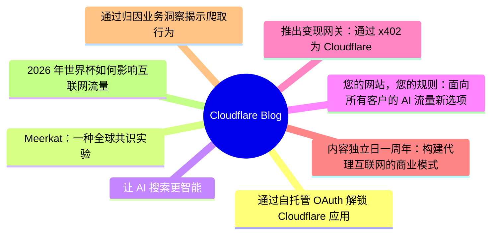
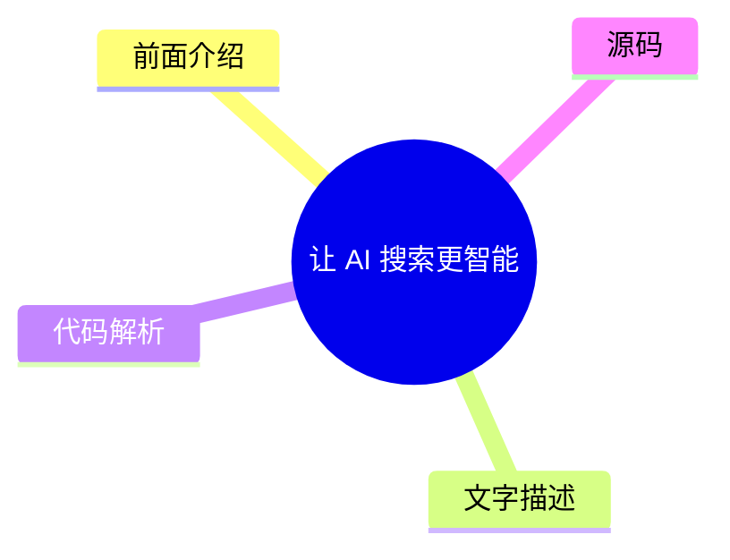
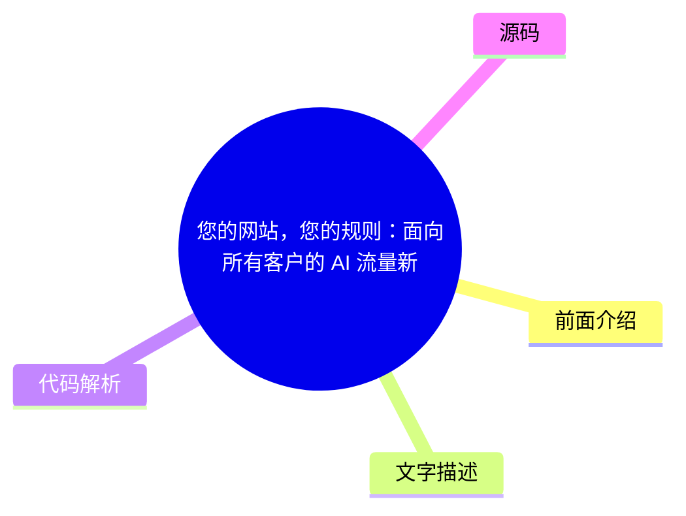
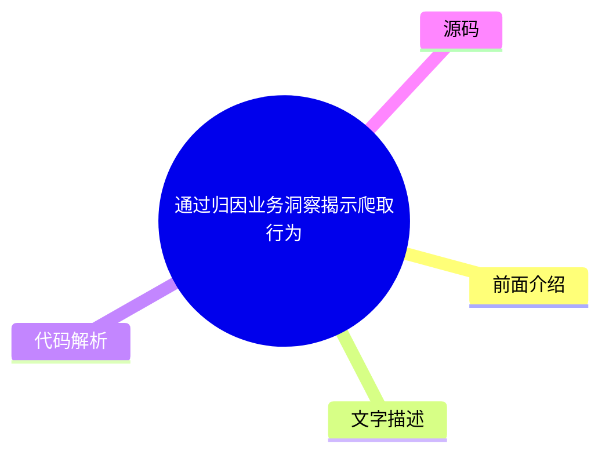
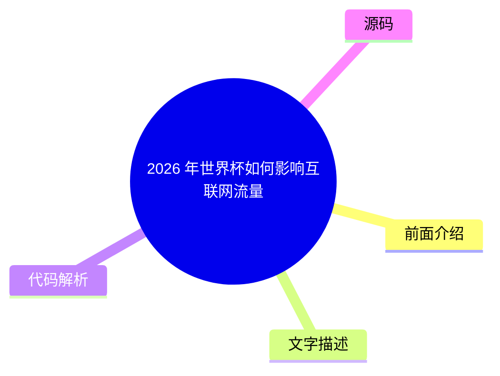

# ☁️ Cloudflare Blog Top 8 (2026-07-28)

## 前面介绍

- 数据源：Cloudflare Blog
- 抓取日期：2026-07-28
- 条目数：8
- 含完整正文：8
- 含代码片段：0
- 组织方式：前面介绍 / 树状图 / 文字描述 / 代码解析 / 源码

## 思维导图



## 详细整理（8 条，8 条含全文，0 条含代码）

### 1. 通过自托管 OAuth 解锁 Cloudflare 应用生态
- **链接**: [https://blog.cloudflare.com/oauth-for-all/](https://blog.cloudflare.com/oauth-for-all/)
- **作者**: Sam Cabell
- **发布**: Wed, 24 Jun 2026 06:00:00 GMT

#### 前面介绍

- 所有开发者现在都可以在 Cloudflare 上使用自托管 OAuth。
- 实现了核心 OAuth 引擎的零停机迁移。
- 开发者可以创建标准 OAuth 流程，为 SaaS 集成和代理工具提供更好的控制权。

#### 树状图


#### 文字描述

- Cloudflare 平台提供丰富的 API，允许开发者创建自动化、CI/CD 和集成工具来连接基础设施。
- 过去第三方 OAuth 仅通过少量手动入驻的集成提供，现在已向所有开发者开放。
- 自托管 OAuth 允许开发者管理自己的 OAuth 客户端，为 Cloudflare API 提供委托访问。
- 为了支持平台增长和代理工具的需求，开放 OAuth 至关重要。
- 通过自托管 OAuth，用户可以更清晰地获得授权，更容易撤销权限，并更好地控制应用程序的权限范围。

#### 代码解析

- 本
- 文
- 未
- 提
- 供
- 源
- 码
- ，
- 以
- 下
- 为
- 实
- 现
- 思
- 路
- 或
- 结
- 构
- 解
- 析

#### 源码

#### 中文节选

Cloudflare provides services that help run 20% of the web, but we donât do it alone. Developers on our platform use a myriad of tools and services from other companies too. Cloudflare provides a rich API for our platform that enables developers to create automations, CI/CD, and integrations that glue together the various parts of their infrastructure. Earlier this month, we announced [ self-managed OAuth](https://developers.cloudflare.com/changelog/post/2026-06-03-public-oauth-clients/), making it easier for customers to create and manage their own OAuth clients for delegated access to the Cloudflare API.

Cloudflare isnât new to OAuth. If youâve used Wrangler, or used integrations from partners like PlanetScale, then youâve already used it. However, until now, third-party OAuth was only available through a small number of manually onboarded integrations, and was not available to developers more broadly. That meant developers building their own integrations had to rely on API tokens, which are harder to manage and a poor fit for many delegated application flows.Â

Over the last year, we onboarded a growing number of early partners while improving the consent, revocation, and security model behind Cloudflare OAuth. But as our Developer Platform grew and agentic tools drove demand for delegated access, it became clear that opening up OAuth to all customers was critical to the success of our platform.Â

With self-managed OAuth, developers can now offer a standard OAuth flow where customers grant scoped access directly, making it easier to build SaaS integrations, internal developer platforms, and agentic tools while giving users clearer consent, easier revocation, and more control over what an application can do.

## Scaling the ecosystem securely

While our earlier OAuth solution was sufficient for a small number of carefully managed partners, we realized that our permissions model, our consent experience, and our ways of mitigating potential abuse vectors were not mature enough.Â


Earlier this year we [ updated our consent experience](https://blog.cloudflare.com/improved-developer-security/#improving-the-oauth-consent-experience) to make it clearer which application is requesting access, and what permissions it will receive. We also added revocation to the dashboard so developers can easily control which applications have access to their data, and made app ownership more visible to prevent OAuth phishing attacks. 

Opening self-managed OAuth to all customers also required major upgrades to our underlying OAuth engine. This process required a large amount of planning to do with minimal user interruption, while also ensuring data stability and security.

## Planning the upgrade to our OAuth engine

Years ago, we deployed [ Hydra](https://github.com/ory/hydra), an open-source OAuth engine, to power Cloudflare OAuth under the hood. That deployment served us well when usage was limited, but as the developer platform grew and agentic workflows became m

#### 完整正文（中文）

Cloudflare provides services that help run 20% of the web, but we donât do it alone. Developers on our platform use a myriad of tools and services from other companies too. Cloudflare provides a rich API for our platform that enables developers to create automations, CI/CD, and integrations that glue together the various parts of their infrastructure. Earlier this month, we announced [ self-managed OAuth](https://developers.cloudflare.com/changelog/post/2026-06-03-public-oauth-clients/), making it easier for customers to create and manage their own OAuth clients for delegated access to the Cloudflare API.

Cloudflare isnât new to OAuth. If youâve used Wrangler, or used integrations from partners like PlanetScale, then youâve already used it. However, until now, third-party OAuth was only available through a small number of manually onboarded integrations, and was not available to developers more broadly. That meant developers building their own integrations had to rely on API tokens, which are harder to manage and a poor fit for many delegated application flows.Â

Over the last year, we onboarded a growing number of early partners while improving the consent, revocation, and security model behind Cloudflare OAuth. But as our Developer Platform grew and agentic tools drove demand for delegated access, it became clear that opening up OAuth to all customers was critical to the success of our platform.Â

With self-managed OAuth, developers can now offer a standard OAuth flow where customers grant scoped access directly, making it easier to build SaaS integrations, internal developer platforms, and agentic tools while giving users clearer consent, easier revocation, and more control over what an application can do.

## Scaling the ecosystem securely

While our earlier OAuth solution was sufficient for a small number of carefully managed partners, we realized that our permissions model, our consent experience, and our ways of mitigating potential abuse vectors were not mature enough.Â


Earlier this year we [ updated our consent experience](https://blog.cloudflare.com/improved-developer-security/#improving-the-oauth-consent-experience) to make it clearer which application is requesting access, and what permissions it will receive. We also added revocation to the dashboard so developers can easily control which applications have access to their data, and made app ownership more visible to prevent OAuth phishing attacks. 

Opening self-managed OAuth to all customers also required major upgrades to our underlying OAuth engine. This process required a large amount of planning to do with minimal user interruption, while also ensuring data stability and security.

## Planning the upgrade to our OAuth engine

Years ago, we deployed [ Hydra](https://github.com/ory/hydra), an open-source OAuth engine, to power Cloudflare OAuth under the hood. That deployment served us well when usage was limited, but as the developer platform grew and agentic workflows became more common, it became clear that we needed a major upgrade to unlock new capabilities and improve performance. 

As we planned the upgrade, we decided to do two smaller sequential upgrades rather than doing one large upgrade. First, we would move to the latest 1.X release, evaluate any behavior or performance changes, and then proceed with the 2.X upgrade.

During our upgrade planning, it became clear that even the 1.X upgrade would* *still impact customers because the Hydra database required extensive schema migrations that:

- Created indexes in a manner that would claim an exclusive lock on critical tables, preventing active users from performing important OAuth operationsÂ
- Added columns to critical tables, and moved other columns to new tables

There was also a quirk in the version of Hydra we were using in which the SDK would perform SELECT * operations, causing deserialization issues with the schema changes.

To prevent user impact, we rewrote the SQL migrations to use features such as CREATE INDEX CONCURRENTLY, and built a custom version of Hydra which selected explicit columns rather than SELECT *.


With the latest 1.X upgrade planned out, we now needed to create a plan for the even larger 2.X upgrade. We identified three potential options, and weighed the benefits and drawbacks of each one. Doing an in-place upgrade was not going to work for us, due to the sheer amount of schema changes the major version bump brought with it. We decided that a blue-green strategy would work, but there was more that needed to be done than simply flipping a switch to start using the new version. The upgrade and migration process would take multiple hours, and we needed the system to continue functioning correctly in that time window.

The first blue-green option would involve disabling writes to the database, preventing any new authorizations from occurring. This means they would not be lost in the transition, but it also meant that nobody would be able to use existing OAuth apps unless they already had a valid credential. It also presented another large problem: if users needed to revoke access from an application for any reason, it would not be possible while the upgrade was being performed.

To combat these issues, we came up with a way to leave writes to the database enabled, at the cost of losing some of them in the switch to the green version. The first thing to solve was minimizing the number of writes for new tokens. There was an operational lever we pulled: increasing the expiry time of tokens to multiple hours. This would allow apps that received new tokens before the upgrade to continue using them without needing to refresh.


随着写入减少问题的解决，我们需要想出一个办法，确保在升级窗口期间用户执行的任何吊销操作都不会丢失。为此，我们创建了一个队列系统（使用 [Cloudflare Queues](https://developers.cloudflare.com/queues/)！）在发生吊销事件后，会在队列中写入一条记录，其中包含关于该吊销的信息。这使我们能够在数据库切换到绿色版本后清空队列，重放所有在它们本会丢失的时间窗口内发生的吊销事件。这一点至关重要，必须处理正确，否则用户已吊销的应用程序将意外地恢复其访问权限。

## 执行升级

### 升级到 1.X

从运营角度来看，我们第一次升级到最新的 1.X 版本一帆风顺。我们的自定义数据库迁移运行得比预期的快，没有对用户造成影响。由于旧版本无法检查由新版本创建的令牌，我们不得不强制切换到新版本。

切换后，我们看到了以前从未见过的刷新令牌错误增加。这最终是由于新版本中更严格的刷新失效行为造成的；如果刷新令牌被重用，Hydra 将使整个访问和刷新令牌链失效。这对 Wrangler 和 MCP 客户端来说是个问题。这些客户端的请求量都很高，而单个重用的刷新令牌就会使整个会话失效。

我们通过在我们的 Worker 中添加刷新令牌合并行为来缓解此问题，该 Worker 将 OAuth 流量路由到正确的目的地。这使我们能够在请求到达 Hydra 之前短暂缓存刷新令牌请求，这样如果我们检测到重试，就可以短路请求并响应而不使令牌失效。幸运的是，2.X 版本的 Hydra 具有可配置的“刷新令牌宽限期”，这通过允许刷新令牌在一定时间内重试而不使整个链失效来解决这个问题。

### 升级到 2.X

由于无法接受数小时的高用户可见性影响，我们制定了蓝绿升级策略。从宏观层面看，这听起来很简单：迁移将在生产数据库的副本上运行，并在完成后与新版本的 Hydra 一起进行切换。实际上，涉及的*很多*细节更为复杂：

- 启用撤销重放捕获队列
- 复制并将数据库恢复到新的目标环境
- 针对性数据清理——现有数据违反了较新版本中引入的一些新约束，这可能会阻止迁移成功
- 与两个其他关键内部系统同时执行 Hydra 服务的切换，以防止任何错误
- 切换后的监控和验证

我们选择了 Hydra 每秒请求数量最低的时间段作为升级窗口，以最大限度地减少令牌写入的丢失。除了进行一些超时调整外，我们的生产迁移在新数据库上运行良好：生产环境的总运行时间约为三小时。迁移完成后，我们谨慎地发布了新版本的 Hydra 服务，以及两个额外的系统配置，以将系统切换为使用新的 SDK 版本。

在切换流量后不久，我们观察到授权服务（依赖 Hydra 同意会话 API）中的数据清理任务在清理 OAuth 策略数据时过于激进。经过调查，我们发现 Hydra 迁移中的一个存在问题，损坏了某些有效 OAuth 会话的状态，导致迁移将其标记为无效。有效会话被损坏导致 Hydra 与我们的授权服务之间出现分歧，表现为 403 错误的增加。为了缓解这一问题，我们进行了数据恢复，并开始改进 OAuth 授权行为，以移除对静态策略数据的依赖。

除了数据清理问题外，还有一些其他的小修复，这些修复更多是由特定的客户端行为驱动的，我们很快便完成了这些修复。

With the Hydra version upgrade complete, OAuth traffic has remained stable with improved system performance and reliability for our customers. It also brought production onto the same foundation our newer OAuth APIs had already been validated against in staging, clearing the way for our [ self-managed OAuth release on June 3](https://developers.cloudflare.com/changelog/post/2026-06-03-public-oauth-clients/). 

## Performance improvements

After completing a large upgrade like this, it is always rewarding and illuminating to look at some broad metrics about the impact. We gathered additional metrics during the database migrations, and observed considerable performance improvements after the upgrade was complete.

### Database

| Metric | Approx. Value | 
|---|---|
| Rows updated | 132.5M | 
| Rows inserted | 114.7M | 
| Temp bytes | 136.97GB | 
| Transaction commits | 22.2k | 

### Hydra performance

| Metric (avg) | Before | After | Change | 
|---|---|---|---|
| API P95 | 185ms | 101ms | -45% | 
| RSS memory | 888MB | 763MB | -14% | 
| Go heap alloc | 449MB | 271MB | -40% | 
| Goroutines | 4015 | 3076 | -23% | 
| CPU | 1.07 cores | 0.67 cores | -37%37% | 

## Self-managed OAuth for all

Opening up OAuth to all customers is an important step toward a broader Cloudflare app ecosystem. Today, any Cloudflare customer can create their own OAuth applications and build integrations on top of Cloudflare. Weâre extremely excited to launch Cloudflare self-managed OAuth for all.Â

To get started, take a look at our [ documentation](https://developers.cloudflare.com/fundamentals/oauth/) or jump straight to the OAuth apps page in the 

[and create your first OAuth app.](https://dash.cloudflare.com/?to=/:account/oauth-clients)

__dashboard__


### 2. Meerkat：一种全球共识实验
- **链接**: [https://blog.cloudflare.com/meerkat-introduction/](https://blog.cloudflare.com/meerkat-introduction/)
- **作者**: James Larisch
- **发布**: Wed, 08 Jul 2026 12:00:00 GMT

#### 前面介绍

- Cloudflare Research 正在构建名为 Meerkat 的全球共识服务。
- 该服务使用一种名为 QuePaxa 的新共识算法。
- Meerkat 将用于构建强一致性、容错的键值存储等应用。

#### 树状图


#### 文字描述

- Cloudflare 的 330 多个全球数据中心需要读取和修改控制平面状态，并保证不同读者永远看到一致的状态。
- 传统的共识算法（如 Raft）依赖领导者和超时机制，在广域网中难以应对不可预测的延迟。
- Meerkat 基于 QuePaxa 算法，所有副本都可以随时执行写入，且进度不会因超时而停止。
- QuePaxa 允许在大多数节点存活且可通信的情况下，一组机器就同一序列值达成一致。
- Meerkat 目前处于实验阶段，最初旨在管理小部分控制平面状态，并计划内部使用。

#### 代码解析

- 本
- 文
- 未
- 提
- 供
- 源
- 码
- ，
- 以
- 下
- 为
- 实
- 现
- 思
- 路
- 或
- 结
- 构
- 解
- 析

#### 源码

#### 中文节选

Many internal services at Cloudflare need to read and modify the same control-plane state from across our 330+ global data centers. They need guarantees that different readers *never *see inconsistent state, and that the system remains available for writes even when some data centers or links fail.

But Cloudflareâs network runs across the entire Internet, and the Internet is an unpredictable place. Servers and data centers go down. Queues fill up. Links and cables get cut. These conditions make it difficult to run a globally available data system that guarantees strong consistency (e.g., that all readers are guaranteed to read all prior writes) because hostile conditions hinder distributed system replicasâ ability to reliably synchronize data with one another.

One way to synchronize data safely despite adverse network conditions is via a *consensus algorithm, *which* *allows a set of machines to agree on the same sequence of values, such as key-value store put and `get` operations, as long as a majority remains alive and able to communicate. 

Unfortunately, commonly deployed consensus algorithms like [ Raft](https://raft.github.io/) suffer in wide-area networks like Cloudflareâs because they rely on 

*leaders*and

*timeouts*. The

*leader*is the only replica allowed to make writes, and if it fails due to a crash or network degradation, the system becomes unavailable until some other replica

*times out*and a new leader is elected. And these timeout values are hard to configure in networks with unpredictable latencies.

We have experienced multiple incidents caused by unavailable leaders in consensus-driven systems.

And so, for the past year, Cloudflareâs Research [ team](https://research.cloudflare.com/) has been building a new distributed consensus service called 

**Meerkat**powered by a consensus algorithm called

[, published in 2023 by Tennage & BÄsescu et al. QuePaxa differs from Raft in that all replicas can perform writes at all times, and progress is never halted due to a timeout, which makes it well suited for Cloudflareâs network. We layer](https://bford.info/pub/os/quepaxa/quepaxa.pdf)


__QuePaxa__*应用程序*，例如事务型键值存储和租赁系统，构建在 Meerkat 的共识日志之上。据我们所知，这将是 QuePaxa 首次在全球范围内进行工业级部署。

Meerkat 是一个仍在开发中的实验性共识服务。它最初被设计用于管理少量的控制平面状态（例如，复制数据库的领导权），因此在可预见的未来，它将仅限内部使用。本文介绍了 Meerkat，并为即将发布的与 Meerkat 相关的博客文章奠定了基础。

## 我们对全球控制平面数据系统的需求

许多 Cloudflare 服务会读取和写入 *控制平面数据*，即帮助这些服务正确运行的、分布在全世界的多台机器上的数据。控制平面数据的一个例子是 *放置信息*：cer 的位置（注：原文此处未完）

#### 完整正文（中文）

Cloudflare 的许多内部服务需要从我们 330 多个全球数据中心读取和修改相同的控制平面状态。它们需要保证不同的读取者*永远*不会看到不一致的状态，并且即使在某些数据中心或链路发生故障的情况下，系统对于写入操作仍然保持可用。

然而，Cloudflare 的网络横跨整个互联网，而互联网是一个不可预测的地方。服务器和数据中心会宕机。队列会填满。链路和电缆会被切断。这些条件使得很难运行一个保证强一致性的全球可用数据系统（例如，保证所有读取者都能读取到所有先前的写入），因为敌对条件阻碍了分布式系统副本之间可靠地同步数据的能力。

尽管网络条件恶劣，但通过*共识算法*安全地同步数据的一种方法是，它允许一组机器同意相同的值序列，例如键值存储的 put 和 `get` 操作，只要大多数机器保持存活且能够通信。

不幸的是，像 [Raft](https://raft.github.io/) 这样的常用共识算法在 Cloudflare 这样的广域网上表现不佳，因为它们依赖于*领导者*和*超时*。*领导者*是唯一被允许进行写入的副本，如果它因崩溃或网络降级而失败，系统将变得不可用，直到某个其他副本*超时*并选举出新的领导者。而且，这些超时值在延迟不可预测的网络中很难配置。

我们已经经历过多次由共识驱动系统中不可用的领导者导致的事故。

因此，在过去的一年里，Cloudflare 的研究 [团队](https://research.cloudflare.com/) 正在构建一个名为 **Meerkat** 的新分布式共识服务，它由一种称为 [, 的共识算法提供支持，该算法由 Tennage & BÄsescu 等人于 2023 年发表。QuePaxa 与 Raft 的不同之处在于，所有副本可以随时执行写入，并且进度永远不会因超时而停止，这使其非常适合 Cloudflare 的网络。我们层](https://bford.info/pub/os/quepaxa/quepaxa.pdf)

__QuePaxa__*applications*, like a transactional key-value store and leasing system, atop Meerkatâs consensus log. To our knowledge, this will be the first industrial deployment of QuePaxa at global scale.

Meerkat is an experimental consensus service that is still in development. Itâs being designed initially to manage small pieces of control plane state (e.g., leadership for replicated databases) and so it will be kept internal-only for the immediate future. This post introduces Meerkat and lays the groundwork for the Meerkat-related blog posts to come.Â

## What we need from a global control-plane data system

Many Cloudflare services read and write *control-plane data*, data that helps those services operate correctly, from multiple machines distributed all over the world. One example of control-plane data is *placement information*: where certain resources (like an AI model instance) are stored. Another example is *leadership information*: which machine is currently allowed to perform writes to a database. 

Control-plane data must be both *strongly* *consistent* and* accessible despite particular kinds of faults.*

In this section we precisely describe our consistency and fault tolerance requirements for a Cloudflare consensus service. We use a key-value store for a running example of an application running atop our consensus service, though other applications (e.g., distributed leases/locks) are possible.

### Strong consistency

A distributed data systemâs [ consistency](https://jepsen.io/consistency/models) level describes what kinds of weird behavior the system is allowed to exhibit when it receives concurrent reads and writes. Consider a distributed key-value store that stores a single numeric value 

`x = 6` across multiple nodes. Also consider the following sequence of writes. These writes are submitted to different nodes on a best-effort basis, and could arrive in any order: - `x = x + 1`
- `x = x / 2`

A systemâs consistency level tells you what values of `x` a client might see when reading `x` after these writes. Consider the following sequence of operations and the possible execution orders under different consistency levels:


在弱一致性级别中，写入操作可能会被重新排序。在更强的一致性模型中，写入操作不能被重新排序，但读取操作可以。在最强可能的一致性级别中，操作的顺序与它们在真实时间中发生的顺序完全一致。这种属性被称为 *线性化*。

在 Cloudflare，许多服务都需要线性化。与较弱的一致性形式不同，线性化免除了程序员去思考数据系统可能表现出的所有怪异行为。相反，他们可以像在单线程机器上推理本地内存一样来推理分布式系统：写入之后的所有读取都将看到该写入。有关弱一致性的危险，请查看 Marc Brooker 的这篇 [文章](https://brooker.co.za/blog/2025/11/18/consistency.html) 以获取更多阅读材料。

（如果你想知道，Meerkat 的键值存储也提供了可串行化，我们将在未来的文章中讨论它。）

### 容错性

系统的容错级别描述了在发生灾难之前，系统能够处理哪些类型的故障。灾难通常是系统旨在维护的属性的违反，例如，两个连续的读取操作（中间没有对该键的写入）永远不会看到不同的值，或者系统保持可写。故障包括网络故障或延迟、机器崩溃和机器重启。系统通常会显式处理某些故障，但不处理其他故障（你无法处理所有故障，因为宇宙总是可能达到热寂）。例如，某些键值存储可能会保证只要系统中有三分之二的机器可以相互通信且没有崩溃，就保持可写，但如果一台机器被攻破并开始发送恶意消息，则不做任何承诺。

我们期望的容错属性如下：

**首先**，只要满足以下条件，数据系统应保持对位于我们任何数据中心之一的客户端的写入和读取可用：

- 我们系统中的大多数机器都处于存活状态，并且可以相互通信。（形式上，我们在 `2f + 1` 台机器的系统中容忍 `f` 个故障）。

- The client can contact *any*machine in the system that is connected to a majority of live machines.

This means that a single failed machine, or network degradation on a single link, does not affect availability of the system*. *This property is not provided by Raft-based systems, as weâll see later.

**Second**, the data system remains *correct* as long as no actor in the system is actively malicious (and, of course, there are no bugs). We define *correctness* in terms of consensus *safety *later, but loosely speaking this means no two up-to-date machines will ever disagree about the world (e.g., one thinks that `key1=1` while another thinks that `key1=2`).

To summarize, the system must remain correct even if machines crash, machines restart, networks fail or degrade, data centers go down, and more (though we, like Raft-based systems, do not handle [ Byzantine faults](https://en.wikipedia.org/wiki/Byzantine_fault)).

## Introducing Meerkat

Meerkat is a consensus service *upon which *we can build applications that exhibit the above properties (strong consistency and fault tolerance) like a key-value (KV) store. To understand how Meerkat works, we first outline Meerkatâs general architecture, and then describe how Meerkatâs choice of consensus algorithm helps provide strong consistency and fault tolerance.

Developers of services using Meerkat request a *cluster* of Meerkat *replicas*. Each replica is connected to every other replica. Each replica participates in the consensus algorithm and can receive both reads and writes. The developer can specify which data centers are allowed to host their replicas, and Meerkat places them automatically.

To interact with their cluster, a developerâs client sends an application-specific request to any replica in the cluster. A single replica may host many kinds of applications, but the simplest one is a key-value store, so the simplest application-specific request type is a KV `get` or `put`. The replica responds to the request with an application-specific response (e.g., the records requested with the `get`). Note that KV reads (`get`s) are guaranteed to read up-to-date information.

### Meerkatâs log


Under the hood, the replica translates application requests (e.g., `get` and `put`) into *log events*. That replica distributes each log event to all other replicas using a consensus algorithm such that all replicas maintain the exact same log of events (in reality, a replica may lag behind, but shall never record different entries). These events are arbitrary â Meerkatâs core doesnât care whatâs in them. Meerkat *applications* care about log event contents. Each Meerkat replica âhostsâ many Meerkat applications (e.g., key-value store) that read the log events and construct state. (Note that each replica belongs to exactly one cluster.)

For instance, the KV Meerkat application constructs an in-memory key-value store from the log events. So when a client sends a write like `put k1 v1`, the receiving replica places that write into a log event and distributes it to all replicas. If someone else subsequently writes `put k1 v11` to a different replica, this event is also distributed to all replicas. Since all functioning replicas have the same log, those replicas can apply the operations in the log in sequence to construct the exact same state. Note that `get` requests also create distributed log events (for linearizability, as explained in the next section).

Here is an example of how a replicaâs KV store is updated as it receives log events:

### How Meerkatâs log enables strong consistency

Meerkat guarantees that if one client executes `put k1 v1`, a second client subsequently executes `put k1 v11`, and a third client subsequently executes `get k1` (with a consistent read), they will always read `v11`. It guarantees this even if each request is submitted to a different replica, and those replicas are distributed randomly across the world. This is linearizability. To see how Meerkat guarantees this, we must examine Meerkatâs log in more detail.


The Meerkat log is a sequence of slots. A slot is a box that can contain an event or not. A slot that contains an event is called a *decided *slot. All slots in the log are decided except the last slot, which is currently being decided. One of Meerkatâs invariants is that if any two replicas decide on the value for a slot, those values are the same. In other words, no two replicas will ever disagree on the value of a decided slot (though one replica may think the last slot is empty while another does not). This property helps guarantee the desired properties we described in the previous section.

To decide on the value of the last (empty) slot in the log, Meerkat replicas run a distributed *consensus algorithm*. A consensus algorithm allows a set of machines communicating over a network to agree on a decided slot value. Our consensus algorithm works as long as a majority of replicas (more than half) are alive.

So if the log currently contains two entries, and a client submits `put k1 v11` to a replica, that replica triggers a consensus algorithm for slot 3. But another client might have submitted `put k1 v111` to a different replica for slot 3. The consensus algorithm ensures that only one such *proposal* for slot 3 wins out. Specifically, it ensures that at least a majority of replicas agree on the same proposal, *deciding *it for slot 3. The non-majority can *never* decide a different proposal, but might miss the fact 

...（截断，原文 20546+ 字符）


### 3. 让 AI 搜索更智能
- **链接**: [https://blog.cloudflare.com/making-ai-search-smarter/](https://blog.cloudflare.com/making-ai-search-smarter/)
- **作者**: Matthew Conroy
- **发布**: Wed, 01 Jul 2026 13:00:00 GMT

#### 前面介绍

- 利用全球网络信号，帮助 AI 搜索引擎发现最相关的内容。
- 减少不必要的爬取，降低 AI 公司和网站所有者的成本。
- 建立新的经济模式，让创作者在使用其内容时获得报酬。

#### 树状图



#### 文字描述

- AI 搜索引擎直接在结果页给出答案，导致用户点击传统搜索结果的次数大幅减少。
- 超过 50% 的在线流量是非人类的，这威胁了网站所有者的收入模式。
- Cloudflare 推出研究计划，利用全球网络视角（如内容新鲜度、流量变化）来优化 AI 搜索。
- 通过分析客户共享的内容新鲜度信号和流量流，帮助搜索引擎筛选高质量内容。
- 该计划旨在测量信号如何帮助搜索引擎展示更相关的内容，以及如何减少不必要的爬取。
- 通过仅在被更改时重新抓取页面，可以显著降低爬取成本。

#### 代码解析

- 本
- 文
- 未
- 提
- 供
- 源
- 码
- ，
- 以
- 下
- 为
- 实
- 现
- 思
- 路
- 或
- 结
- 构
- 解
- 析

#### 源码

#### 中文节选

搜索驱动了网络上的大多数体验。这是我们完成事情的方式，也是网络上的几乎所有内容被找到的方式——创作者、商家，以及你刚刚在框中输入的任何内容的答案。近 30 年来，那次发现之旅运行在一个简单的交易之上：让搜索引擎爬取你的内容，它就会向你发送访客。你通过广告、订阅，或者仅仅是受众本身，将这些访客转化为了生意。可被发现和获得报酬曾经是同一回事。一年前，在[第一个内容独立日](https://blog.cloudflare.com/content-independence-day-no-ai-crawl-without-compensation/)上，我们划下了一条线，以在 AI 时代捍卫这一交易。但一道界线只是第一步。自那时以来，AI 搜索在消费者生活中的普及程度只增不减，因为

[. 威胁不再是你可以屏蔽的少数几个训练爬虫；而是搜索本身正在围绕 AI 答案进行重建。](https://radar.cloudflare.com/)

__超过 50% 的在线流量是非人类的__如今的答案引擎会读取你的页面并将摘要交给用户，因此访问——以及依赖于它的收入——就变得不再必要。我们亲眼目睹了这一点，独立研究也证实了这一点：一项[ 2025 年皮尤研究中心的研究](https://www.pewresearch.org/short-reads/2025/07/22/google-users-are-less-likely-to-click-on-links-when-an-ai-summary-appears-in-the-results/)发现，当谷歌显示 AI 摘要时，用户点击传统搜索结果链接的频率仅为 8%（大约是没有摘要时的一半），而点击摘要内部链接的频率仅为 1%。这让我们陷入了两难境地：退出 AI 搜索会导致难以被发现，或者加入 AI 搜索，在为用户提供巨大价值的同时，却看到回报越来越少。我们的客户希望被找到并获得其提供价值的报酬，而目前他们被迫做出选择。

今天，[我们宣布了新的机器人选项](http://blog.cloudflare.com/content-independence-day-ai-options)，以帮助我们的客户更好地控制谁可以访问他们的网站以及他们可以对网站做什么。但阻止只是第一步：说“不”可以在不重建维持网站内容商业模式的情况下保护内容。因此，是时候开始构建互联网的新经济模型了，从搜索开始。

### 重建契约

透明度和控制是基础，但还需要更多。2025 年，我们通过一套[负责任的 AI 机器人原则](https://blog.cloudflare.com/building-a-better-internet-with-responsible-ai-bot-principles/)确立了我们的基础：机器人应该对其身份和用途保持透明，尊重网站所有者的选择，并善意行事。我们的工具将机器人保持在那个标准之上。但执行良好的机器人行为并不能让依赖它的用户在使用 AI 搜索时获得更好的体验，也无法向创造了答案所必需内容的创作者支付一美元。我们不仅能帮助网络说“不”；我们还能帮助重建网络说“是”的内容。

#### 完整正文（中文）

搜索驱动了网络上的大多数体验。这是我们完成事情的方式，也是网络上的几乎所有内容被找到的方式——创作者、商家，以及你刚刚在框中输入的任何内容的答案。近 30 年来，那次发现之旅运行在一个简单的交易之上：让搜索引擎爬取你的内容，它就会向你发送访客。你通过广告、订阅，或者仅仅是受众本身，将这些访客转化为了生意。可被发现和获得报酬曾经是同一回事。一年前，在[第一个内容独立日](https://blog.cloudflare.com/content-independence-day-no-ai-crawl-without-compensation/)上，我们划下了一条线，以在 AI 时代捍卫这一交易。但一道界线只是第一步。自那时以来，AI 搜索在消费者生活中的普及程度只增不减，因为

[. 威胁不再是你可以屏蔽的少数几个训练爬虫；而是搜索本身正在围绕 AI 答案进行重建。](https://radar.cloudflare.com/)

__超过 50% 的在线流量是非人类的__如今的答案引擎会读取你的页面并将摘要交给用户，因此访问——以及依赖于它的收入——就变得不再必要。我们亲眼目睹了这一点，独立研究也证实了这一点：一项[ 2025 年皮尤研究中心的研究](https://www.pewresearch.org/short-reads/2025/07/22/google-users-are-less-likely-to-click-on-links-when-an-ai-summary-appears-in-the-results/)发现，当谷歌显示 AI 摘要时，用户点击传统搜索结果链接的频率仅为 8%（大约是没有摘要时的一半），而点击摘要内部链接的频率仅为 1%。这让我们陷入了两难境地：退出 AI 搜索会导致难以被发现，或者加入 AI 搜索，在为用户提供巨大价值的同时，却看到回报越来越少。我们的客户希望被找到并获得其提供价值的报酬，而目前他们被迫做出选择。

今天，[我们宣布了新的机器人选项](http://blog.cloudflare.com/content-independence-day-ai-options)，以帮助我们的客户更好地控制谁可以访问他们的网站以及他们可以对其做什么。但屏蔽只是第一步：说“不”可以保护内容，而无需重建维持内容的商业模式。因此，是时候开始构建互联网的新经济模型，从搜索开始。

### 重建交易

透明度和控制是基础，但还需要更多。2025 年，我们通过一套 [负责任的 AI 机器人原则](https://blog.cloudflare.com/building-a-better-internet-with-responsible-ai-bot-principles/) 阐述了我们的基础：机器人应透明地说明其身份和用途，尊重网站所有者的选择，并善意行事。我们的工具将机器人以此标准为准则。但执行良好的机器人行为并不能让依赖它的用户在使用 AI 搜索时获得更好的体验，也不会向创造了答案的工作者支付报酬。我们可以做的不仅仅是帮助网络说“不”；我们可以帮助重建网络说“是”的内容。

因此，今天我们宣布了两项举措，从防御转向进攻，并开始重新组合旧交易的两半。

**让 AI 搜索更智能：** 通过利用我们在全球网络中看到的信号，例如什么是新鲜的、什么是高质量的以及实际上发生了什么变化，我们可以帮助搜索引擎展示最相关的内容并减少不必要的爬取。如果网页仅在发生变化时才被重新爬取，搜索者将获得更好的答案，同时 AI 公司和网站所有者的成本都会降低。

**为创作者提供的价值付费：** 当你的工作被用来回答某人的问题时，你应该获得奖励，而不仅仅是被免费抓取。而且，你应该能够看到正在使用什么以及人们在问什么。这应该是一个真正的收入来源，也是继续创作值得寻找的原创内容的动力。

### 让搜索更智能

今天，我们启动了一项研究计划，旨在让 AI 搜索更智能，并停止我们的客户为产生不了任何新内容的爬取买单。

More than 20% of the web sits behind Cloudflareâs network, which gives us a unique perspective. We can tell which pages have genuinely changed and which ones people and agents are flocking to. Through this program, we will explore using signals our customers have chosen to share about the freshness of their content, and we will combine those with our own insight into traffic flows, both human and bot. For answer engines, that's a roadmap to high-quality content. For our customers, it provides a view of what users are actually asking, and how their content shows up in AI results. The aim is to measure two things: how much these signals help answer engines to surface fresher, higher-quality content, and how much unnecessary crawling they cut out.

That second benefit, cutting unnecessary crawling, is bigger than it sounds. Cloudflare data suggests that more than 50% of crawl traffic from good bots goes to re-fetching pages that haven't changed â and that number is likely to climb as crawl volumes do. A signal that just says "nothing's changed here" lets a crawler skip the trip. That saves the answer engine compute. More importantly, it saves site owners from serving and paying for requests they never needed to.Â

The program is neutral by design: our goal is to make it work for every answer engine willing to play fair. It's limited to search. We aren't sharing any content, and nothing is used to train foundation models. We intend to publish what we learn, including the benefits to site owners such as better content discoverability and reduced server strain. We plan to make the capability broadly available later this year and reduce unnecessary crawling across our network.

### From Pay Per Crawl to Pay Per Use

Last year we [ launched Pay Per Crawl ](https://blog.cloudflare.com/introducing-pay-per-crawl/)so publishers could charge AI companies for crawling their content. It was a real start, but crawling is a crude measure of value. A single page might be crawled once and then cited in thousands of answers, or crawled over and over and never used at all. Creators want to be paid fairly for the value they provide.


所以我们正在将 Pay Per Crawl 转型为 Pay Per Use。我们正在与顶级 AI 公司（如 [ Ceramic.ai](http://ceramic.ai) 和 [You.com](http://you.com)）进行实验，这种安排很简单：组织可以带入自己的支付模式，并轻松将其扩展到 Cloudflare 网络上的内容所有者。

__You.com__ Ceramic 构建了一种所谓的“按查询付费”模式，因此选择加入的出版商可以在其内容出现在 Ceramic 的搜索结果中时获得报酬。这意味着支付的设计是跟随工作所提供的价值，而不是爬虫恰好抓取它的次数。

“为了扩展 AI 搜索的未来，我们需要一个拥有巨大覆盖范围且对透明度和公平补偿有共同承诺的合作伙伴，” Ceramic.ai 创始人兼首席执行官 Anna Patterson 说，“Cloudflare 允许我们轻松且以编程的方式扩展我们的运营。通过将我们的按查询付费模式带到他们的网络中，我们确保数百万内容所有者可以无缝加入，以便在他们内容出现在我们的搜索结果中的每一次都得到补偿。”

除了补偿之外，参与 Cloudflare/Ceramic 计划的内容所有者还将解锁新的报告，以帮助进行答案引擎优化（AEO）。客户终于可以看到导致其内容出现在搜索结果中的顶级查询、特定的网页和片段、其平均搜索结果排名位置等。这是我们即将推出的众多帮助客户提高可发现性的产品中的第一个。

这只是众多新兴方法之一。另一种来自 You.com：代理可以按需为特定的高价值内容付费，无需任何前期承诺。AI 提供商正在测试新的支付模式（例如按查询付费、按结果付费等），而我们拥有支持所有这些模式的基础设施。

我们想坦诚地说明，这是一个实验。还有很多东西需要学习，包括这种模式在互联网规模下究竟如何经受考验。我们将与合作伙伴和客户一起逐步探索，并分享我们的所学。但目标很明确：AI 搜索公司能获得更及时、更有依据的答案，而那些让答案成为可能的客户（即内容创作者），在提供帮助时也能获得报酬。Cloudflare 在此过程中的职责是提供能够使这一市场繁荣发展的基础设施层。

我们认为这更符合搜索经济学的走向。旧的人工网络优化搜索以节省时间——提供摘要、十个蓝色链接和点击。智能体网络则不同：智能体可以快速阅读并持续搜索。搜索正变成智能体为了回答一个问题而执行的数十次操作，更接近一种公用事业而非目的地。在那个世界里，重要的单位不再是爬取或点击，而是结果。对结果进行定价，并支付促成结果的人，是网络得以持续繁荣的方式。

### 我们想要赢得的头条

一年前的“内容独立日”，头条是默认的“不”：AI 在没有补偿的情况下无法爬取。今年，我们的重点是为用户提供更多的产品和控制选项，以便他们说“是”，并带来更多好处。

今天的公告只是开始。Cloudflare 的研究项目旨在检验我们的信号能否在减少爬取的情况下产生更好的结果。按使用付费是我们将与合作伙伴一起探索的有前景的方向，这些合作伙伴相信内容创作者理应因其工作获得公平的报酬。过去 30 年来的网络也是这样建立的：有人运行试点项目，将“模型坏了”转变为“这是新模型”，一次实验接一次实验。我们相信，我们的客户在这个新的智能体时代具有可被发现的价值，并且可以优化其内容以实现最大程度的发现。但他们应该能够在不免费放弃其最有价值的创意资产的情况下做到这一点。

网络正在发生变化，它所依赖的商业模式也随之改变。旧时的互联网是开放、中立且值得贡献的。我们有机会保持它的现状，并为未来的互联网建立相应的商业模式。为人类和智能体提供更智能的答案。为那些凭借技能、创造力和奉献精神让答案变得有价值的人们提供公平的交易。这就是我们追求 Cloudflare 使命的方式：帮助构建更好的互联网。

祝大家内容独立日快乐！

*正在构建开放、面向智能体的网络？如果您有兴趣了解更多关于 Ceramic 和 You 计划的信息，请填写 *
__这份表单__。如果您正在构建答案引擎并希望进行更智能的抓取，我们也非常乐意收到您的来信：aeo@cloudflare.com。


### 4. 您的网站，您的规则：面向所有客户的 AI 流量新选项
- **链接**: [https://blog.cloudflare.com/content-independence-day-ai-options/](https://blog.cloudflare.com/content-independence-day-ai-options/)
- **作者**: Jin-Hee Lee
- **发布**: Wed, 01 Jul 2026 13:00:00 GMT

#### 前面介绍

- 所有客户现在都可以区分和管理搜索、代理和训练机器人。
- 引入了更细致的 AI 流量管理选项，而非一刀切的屏蔽。
- 新的分类系统将 AI 用途细分为搜索、代理和训练三种主要场景。

#### 树状图



#### 文字描述

- 一年前的“内容独立日”推出了“屏蔽 AI 机器人”选项，但网站所有者需要更多细微的控制权。
- 新的分类方法关注机器人的行为，而不仅仅是定义其为“AI”或非 AI。
- 分类包括：搜索（索引内容以供后续查询）、代理（自动化任务）和训练（将数据永久吸收进模型）。
- Cloudflare 鼓励机器人运营商将单一机器人拆分为具有不同目的的独立爬虫。
- 这种分类系统旨在提高透明度，帮助网站所有者了解机器人访问的目的。
- 这为网站所有者提供了更灵活的工具，以在保持可发现性和保护内容之间取得平衡。

#### 代码解析

- 本
- 文
- 未
- 提
- 供
- 源
- 码
- ，
- 以
- 下
- 为
- 实
- 现
- 思
- 路
- 或
- 结
- 构
- 解
- 析

#### 源码

#### 中文节选

一年前，我们宣布了首个 [内容独立日](https://blog.cloudflare.com/content-independence-day-no-ai-crawl-without-compensation/)，并赋予网站所有者收回对其内容控制权的手段。爬虫与网站所有者之间维持了 30 年的协议——我们爬取你的内容，你获得推荐——不再成立。AI 正在获取一切却一无所返，这对网站所有者构成了生存威胁。因此，我们推出了一个一键式的“屏蔽 AI 机器人”选项，以及

[.](https://blog.cloudflare.com/introducing-pay-per-crawl/)

__按爬取付费市场__

一年间发生了许多变化。去年七月，围绕“AI 机器人”的讨论主要集中在未经补偿就阻止 AI 训练上，指出了这种内容被用于模型训练却没有任何价值回馈给网站所有者的零和博弈。但一种对更细致处理的需求已浮现：内容所有者仍然希望能够保护自己的内容，并且应该为他们辛勤创作、策展和分享的原创内容获得报酬。我们也知道，封锁内容并非“一刀切”的解决方案；网站所有者希望拥有比“每次都屏蔽所有自动化”更多的选择。

如果你运营一个小型网站，问题不仅仅是有人可能利用你的内容训练模型——而是根本没人能找到你。因此，你必须做出一种浮士德式的交易：要么出现在搜索结果中并让 AI 训练你的内容，要么冒着失去可发现性的风险。如果搜索引擎提供商对搜索和训练使用相同的机器人，这会不公平地偏向现有搜索提供商；而这种不公平的优势会激励新进入者为了缩小竞争差距而采取规避手段。

### 现在，AI 可以是任何东西

如今，AI 可以是任何东西。谷歌搜索已经从由 AI 排序转变为 [ 全答案引擎](https://blog.google/products-and-platforms/products-search/search-io-2026/)，直接在结果页面上回答你的问题。谷歌并非唯一处于这种地位的——这是“搜索”正在发展的方向。

We could debate the cutoff for what qualifies as âAIâ today, just to find that the standard changes tomorrow. So, instead of defining a bot primarily as âAIâ or not, our updated approach to classification will ask deeper questions about bot or agent behavior: What are they doing on my site? What are they storing? And how will they reshare my content?

### A pragmatic taxonomy

To address these questions, we need a more nuanced view â a pragmatic taxonomy that aligns with the AI use cases our customers care about. So we are opening the discussion beyond AI training alone and focusing on three AI use cases that we want all customers to be able to manage:

- **Search:**any behavior that collects or indexes your content, so it can answer questions about it later. The key is that Search is proactively building a database of your site to later respond to queries with. Site owners sho

#### 完整正文（中文）

一年前，我们宣布了首个 [内容独立日](https://blog.cloudflare.com/content-independence-day-no-ai-crawl-without-compensation/)，并赋予网站所有者收回对其内容控制权的手段。爬虫与网站所有者之间维持了 30 年的协议——我们爬取你的内容，你获得推荐——不再成立。AI 正在获取一切却一无所返，这对网站所有者构成了生存威胁。因此，我们推出了一个一键式的“屏蔽 AI 机器人”选项，以及

[.](https://blog.cloudflare.com/introducing-pay-per-crawl/)

__按爬取付费市场__

一年间发生了许多变化。去年七月，围绕“AI 机器人”的讨论主要集中在未经补偿就阻止 AI 训练上，指出了这种内容被用于模型训练却没有任何价值回馈给网站所有者的零和博弈。但一种对更细致处理的需求已浮现：内容所有者仍然希望能够保护自己的内容，并且应该为他们辛勤创作、策展和分享的原创内容获得报酬。我们也知道，封锁内容并非“一刀切”的解决方案；网站所有者希望拥有比“每次都屏蔽所有自动化”更多的选择。

如果你运营一个小型网站，问题不仅仅是有人可能利用你的内容训练模型——而是根本没人能找到你。因此，你必须做出一种浮士德式的交易：要么出现在搜索结果中并让 AI 训练你的内容，要么冒着失去可发现性的风险。如果搜索引擎提供商对搜索和训练使用相同的机器人，这会不公平地偏向现有搜索提供商；而这种不公平的优势会激励新进入者为了缩小竞争差距而采取规避手段。

### 现在，AI 可以是任何东西

如今，AI 可以是任何东西。谷歌搜索已经从由 AI 排序转变为 [ 全答案引擎](https://blog.google/products-and-platforms/products-search/search-io-2026/)，直接在结果页面上回答你的问题。谷歌并非唯一处于这种地位的——这是“搜索”正在发展的方向。

We could debate the cutoff for what qualifies as âAIâ today, just to find that the standard changes tomorrow. So, instead of defining a bot primarily as âAIâ or not, our updated approach to classification will ask deeper questions about bot or agent behavior: What are they doing on my site? What are they storing? And how will they reshare my content?

### A pragmatic taxonomy

To address these questions, we need a more nuanced view â a pragmatic taxonomy that aligns with the AI use cases our customers care about. So we are opening the discussion beyond AI training alone and focusing on three AI use cases that we want all customers to be able to manage:

- **Search:**any behavior that collects or indexes your content, so it can answer questions about it later. The key is that Search is proactively building a database of your site to later respond to queries with. Site owners should expect to get referral traffic or other equitable compensation as a result.
- **Agent:**automated- **Training**: a crawler taking your content to train or fine-tune a model. The key is that your data is permanently absorbed into the underlying architecture of the AI to improve its capabilities.

Many popular crawlers on the web fall into one of the classifications above; some fall into multiple. We classify plenty of other behaviors beyond the three above â including ads verification, feed fetching, and agentic transactions (more on this below). But we believe it should be simple for all website owners to manage access for these three AI-centered use cases. We believe that bot operators should separate their crawlers because that creates more transparency for website owners: allowing them to better understand why a given crawler is visiting them, as well as to better manage the access they extend to that crawler. If a company runs automation that builds **Search** indexes, acts as an **Agent**, and collects data to **Train** their models, then we strongly encourage that company to separate the automation into three separate crawlers.


我们想要一个可扩展的分类系统，能够代表不断演变的自动化流量世界。追踪机器人的用途并不新鲜，但我们的新分类法包含了一些更新，能更好地反映当前的机器人流量状况。最值得注意的是，我们希望识别出具有多种用途的机器人，并应追踪其所有用途，而不仅仅是其中之一。

### 管理人工智能流量的新选项

**我们要为管理不同类型的人工智能流量提供更多选项，以便 Cloudflare 网络上的所有网站所有者使用。**

我们过去宣布的“管理 AI 机器人”预设包含单用途机器人，它们用于抓取数据以进行模型训练，如下图所示：

*   2025 年 7 月 1 日管理 AI 机器人流量的现有设置截图。

但并非所有 AI 用途都相同，我们希望我们的客户拥有他们所需的控制权。因此，我们推出了基于 **Search（搜索）、Agent（代理）和 Training（训练）** 抓取器这三大主要用例来管理 AI 流量的能力。借助这些新选项，我们的客户可以更精细地调整他们管理 AI 机器人流量的方式——包括我们免费层级的客户。

*   2026 年 7 月 1 日管理 AI 机器人流量的新选项截图。

### 设置新默认值

**2026 年 9 月 15 日，我们将为这三个分类中的每一个设置新的默认值。** 对于所有新接入 Cloudflare 的域名，**Training（训练）** 和 **Agent（代理）** 类别将在显示广告的页面上默认被阻止，而 **Search（搜索）** 将保持默认允许。

广告是网站所有者希望访客到达并查看的信号——一种可货币化、能支撑业务的东西。因此，在这些页面上，我们将人类注意力视为最终目标，并阻止可能会干扰这种注意力的机器人（即 Training 和 Agent 机器人）。另一方面，搜索是自然地将访客引导回网站的行为，我们相信大多数网站所有者允许这种行为符合他们的利益。

Another change that will apply on September 15 is that multi-purpose crawlers (specifically those that combine Search with Training) will be allowed/blocked according to *all* of their behaviors, in line with our call for transparency for website owners. Since the defaults will be enforced by the most restrictive applicable rules, multi-purpose crawlers such as Googlebot, Applebot, and BingBot will be blocked by customers who have selected to block Training (either through the new options to [ manage AI traffic](https://developers.cloudflare.com/bots/additional-configurations/block-ai-bots/), or through the legacy Block AI bots service).

Of course, customer choice is paramount: if a website owner wants to opt out of these new default configurations, they can [ easily mark this in their Security settings](https://dash.cloudflare.com/?to=/:account/:zone/security/settings) any time leading up to September 15, which will confirm that they want 

*no changes*on Training crawlers that also crawl for Search purposes. Weâll also continue to notify customers of the upcoming change to defaults as we approach September 15 to ensure that customers who want to choose settings different from the defaults have the opportunity to do so.

### BotBase: a new visibility plane for Enterprise customers

Weâre also excited to launch a major visibility update as a new feature of Enterprise Bot Management. As Cloudflareâs directory of tracked bots has grown, so has the desire to manage these bots in sensible groupings and to understand more detail about a particular bot.Â

Introducing [BotBase](https://developers.cloudflare.com/bots/botbase/). BotBase is our new database tracking all known bots, including Verified bots and agents. This database provides a comprehensive, searchable view of our entire directory of bots, directly on the Cloudflare dashboard. Weâre tackling 

*visibility first*, but, later this year, weâll expand BotBase to provide a direct control center for known automated content on your website.


借助这一新视图，Enterprise Bot Management 客户可以查看所有已验证机器人/代理的完整目录，以及它们在此更新后的分类法中的分类位置——这是我们此前从未在 Cloudflare 控制台上动态展示过的视图。想要精准定位特定机器人的客户还可以轻松筛选来自该机器人的所有流量，并复制检测 ID 以用于安全规则。所有这些功能现已上线，位于一个专门的页面上，可通过 [Bot Management 配置卡片](https://dash.cloudflare.com/?to=/:account/:zone/security/settings/bot-traffic/bot-base) 访问。

在构建 BotBase 时，我们旨在涵盖所有能够帮助我们从机器人到机器人构建可扩展、强大洞察的信息要素。其中一项要素是我们更新后的分类法的基石，即 **基于机器人在您网站上可能执行的操作——即其行为**。我们将这些分类区分如下，每个机器人都会被归类为以下一种或多种行为。

| 机器人分类 | 行为和用途 |
|---|---|
| Search | 爬取以扫描您的网站，以帮助其在搜索引擎结果中显示 |
| Agent | 代表人类访问页面的用户导向代理 |
| Training | 爬取以训练或微调模型 |
| Transact | 代表用户执行结账操作 |
| Data Collection | 包括价格抓取、竞争情报收集和第三方分析 |
| Security Testing | 包括漏洞扫描和渗透测试 |
| SEO | SEO 爬取、网站审计、可访问性检查 |
| Ads Verification | 广告投放验证、广告欺诈检测 |
| Social / Link Preview | 社交平台和消息应用的链接预览 |
| Feed Fetching | 包括 RSS 阅读器、播客聚合器和新闻源机器人 |
| Monitoring & Operations | 包括正常运行时间监控、Webhooks 和健康检查 |

*加粗斜体行表示所有客户现在都可以使用的新的可配置选项。*

### 爬虫如何使用我的内容？

Another piece of information weâve heard is important to our customers is a botâs** content use â what a bot may keep and reshare after it has crawled your content.** To address this, we are building capabilities for Bot Management customers to select and block based on the âcontent use.â This setting can be set to one of three levels, from least to most permissive:

- `immediate`â interact, but store and reuse nothing
- `reference`(default) â index, excerpt, and link back
- `full`â summarize and reproduce

These values can be combined with bot classifications to express nuanced rules, such as âallow all bots that are used for **Search**, **SEO**, and **Ads Verification**, but only up to the `reference` use level.â This allows website owners to make decisions in sensible groupings rather than manage individual bot-by-bot rules**.**

To further support this, starting today, we're testing a new signal, `use`, that extends [ Content Signals](https://contentsignals.org/) and lives in your robots.txt. This extends the three fields of the first version of Content Signals with a fourth, optional field that expresses the same preference as above:

- `use=immediate`
- `use=reference`
- `use=full`

As with all other items listed in the robots.txt file, the values of content use signal a website ownerâs *preference*, rather than issuing blocks directly. Weâre now adding support for this extension: all customers who have already enabled managed robots.txt â which prepends the preference to robots.txt that crawling for search is okay, but that crawling for training is not â will now have the additional preference of `use=reference` added to their robots.txt.

```
# Cloudflare Managed content with original Content Signals
User-agent: *
Content-Signal: search=yes,ai

...（截断，原文 17662+ 字符）


### 5. 推出变现网关：通过 x402 为 Cloudflare 后的任何资源收费
- **链接**: [https://blog.cloudflare.com/monetization-gateway/](https://blog.cloudflare.com/monetization-gateway/)
- **作者**: Rohin Lohe
- **发布**: Wed, 01 Jul 2026 13:00:00 GMT

#### 前面介绍

- Cloudflare 变现网关允许为网页、数据集、API 或 MCP 工具收费。
- 支付将在 x402 开放协议上以稳定币结算。
- 无需维护自己的支付栈，支付验证和执行在边缘完成。

#### 树状图


#### 文字描述

- 随着代理成为主要的互联网用户，基于注意力的广告和订阅模式正在失效。
- 代理不需要订阅，也不看广告，它们按需消费内容并立即离开。
- 新的商业模式要求基于使用量的定价，例如按请求或按 token 计费。
- 稳定币（如 USDC）允许在互联网上以极低的费用和秒级结算进行微支付。
- Cloudflare 作为买家和卖家之间的代理层，可以简化基于使用量的计费实现。
- 计费、支付交换和结算可以移出源站，网站所有者只需保留自己的规则和策略。

#### 代码解析

- 本
- 文
- 未
- 提
- 供
- 源
- 码
- ，
- 以
- 下
- 为
- 实
- 现
- 思
- 路
- 或
- 结
- 构
- 解
- 析

#### 源码

#### 中文节选

今天，我们宣布推出 Cloudflare Monetization Gateway（变现网关），这是一个引擎，将赋予 Cloudflare 客户向任何由 Cloudflare 保护的内容收费的能力：网页、数据集、API 或 MCP 工具。

它将提供一个统一控制平面，用于管理您应用程序中的支付策略和访问控制，同时通过在边缘处理支付验证和执行，保护您的源站免受高支付量的冲击。在启动阶段，支付将通过 [x402](https://www.x402.org/)（开放协议）以稳定币结算，该协议由超过 25 位行业领袖组成的联盟支持。

[我们正在构建的](https://blog.cloudflare.com/x402/) __x402 Foundation__### 网络不断演变的商业模式

30 年来，网络一直运行在一个简单的经济交易上：用内容换取人类注意力。这种注意力通过广告、订阅和电子商务进行了变现。这种交易资助了我们熟知的互联网。

但随着代理成为互联网的主要用户，该模式正在崩溃。代理不会看广告，也不需要为它想访问的所有工具维护月度订阅。它阅读或消费数据源一次，获取所需内容，然后继续前进。在整个网络中，AI 抓取器已经向每个访客发送的内容请求次数从一百次到数万次不等。

这一现实要求一种新模式：对一切实行基于使用量的定价。如果注意力和电子商务正从网站转移到 AI 工具和 AI 编写的软件上，那么代理应该为其所需的输入付费——训练数据、推理内容、开发工具和 API 使用。软件的自然支付单位是请求、令牌或结果，而不是席位或月份。这看起来可能像这样：

- 每次网页搜索几分钱，按调用计费
- 上传端点的 0.001 美元基础费用加上每 MB 0.01 美元的费用

- 每次成功解决升级支持问题收费 0.99 美元，仅在任务成功时付费

这与 [当答案引擎使用其内容时向创作者付费](https://blog.cloudflare.com/making-ai-search-smarter) 背后的理念相同——每当使用内容或资源时，进行公平的价值交换，并在为此目的而构建的中立轨道上进行定价。人们通常想象一个代理购买昂贵的资产，如网络域名，但代理支付的大部分内容位于任何结账流程的上游，且价格要低得多。

互联网的某些部分已经以这种方式运作。云服务和 API 多年来一直按调用次数或按小时出售，但仅面向已知买家：用户注册，获得 API 密钥，并产生基于使用量的计费。内容大多跳过支付环节，转而依靠广告运行。这些商业模式一直无法服务未经验证的

#### 完整正文（中文）

今天，我们宣布推出 Cloudflare Monetization Gateway（变现网关），这是一个引擎，将赋予 Cloudflare 客户向任何由 Cloudflare 保护的内容收费的能力：网页、数据集、API 或 MCP 工具。

它将提供一个统一控制平面，用于管理您应用程序中的支付策略和访问控制，同时通过在边缘处理支付验证和执行，保护您的源站免受高支付量的冲击。在启动阶段，支付将通过 [x402](https://www.x402.org/)（开放协议）以稳定币结算，该协议由超过 25 位行业领袖组成的联盟支持。

[我们正在构建的](https://blog.cloudflare.com/x402/) __x402 Foundation__### 网络不断演变的商业模式

30 年来，网络一直运行在一个简单的经济交易上：用内容换取人类注意力。这种注意力通过广告、订阅和电子商务进行了变现。这种交易资助了我们熟知的互联网。

但随着代理成为互联网的主要用户，该模式正在崩溃。代理不会看广告，也不需要为它想访问的所有工具维护月度订阅。它阅读或消费数据源一次，获取所需内容，然后继续前进。在整个网络中，AI 抓取器已经向每个访客发送的内容请求次数从一百次到数万次不等。

这一现实要求一种新模式：对一切实行基于使用量的定价。如果注意力和电子商务正从网站转移到 AI 工具和 AI 编写的软件上，那么代理应该为其所需的输入付费——训练数据、推理内容、开发工具和 API 使用。软件的自然支付单位是请求、令牌或结果，而不是席位或月份。这看起来可能像这样：

- 每次网页搜索几分钱，按调用计费
- 上传端点的 0.001 美元基础费用加上每 MB 0.01 美元的费用

- $0.99 per resolved support escalation, paid only when the work succeeds

This is the same shift behind [ paying creators when an answer engine uses their content](https://blog.cloudflare.com/making-ai-search-smarter) â a fair exchange of value whenever content or a resource is used, priced on neutral rails built for the purpose. People often envision an agent buying high-priced assets like web domains, but most of what an agent pays for sits upstream of any checkout, and is priced far lower.

Some of the Internet already works this way. Cloud and APIs have been sold by the call and by the hour for years, but only to a known buyer: a user signs up, they are issued an API key, and they incur usage-based metered billing. Content mostly skipped payment and ran on advertising instead. These business models have never been able to serve unverified buyers for sub-cent transactions because [ the payment rails](https://stripe.com/resources/more/what-are-payment-rails#what-are-payment-rails) cost too much and took too long to settle. Below a certain price, collecting the payment cost more than the payment was worth.

Historically, usage-based billing was difficult to implement. Businesses needed to effectively become payments companies, running their own accounting to track internal usage in a robust and auditable way. Tracking this usage required significant overhauls of backend systems. Many instead chose per-seat pricing because it is simpler and frequently more profitable.Â

Agents flip this dynamic. A single agent can do the work of an entire team around the clock, making a flat one-time fee disconnected from actual consumption. At the same time, an agent can make thousands of micropayments without friction, while asking a person to approve each payment would be impossibly burdensome. Usage-based price points are where agents live and where stablecoin-based micropayments shine. That's because stablecoins (such as [ Open USD](https://joinopenstandard.com/) and 

[) allow buyers to transfer tiny sums across the Internet, incurring negligible fees and settling in less than a second. This is not feasible with other payment rails today.](https://www.circle.com/usdc)


__USDC__Hereâs where we can help. Cloudflare has spent years building usage-based accounting for our own billing systems and for our customersâ analytics. We can dramatically simplify the implementation of usage-based billing for web-based assets thanks to our position as a proxy layer between buyers and sellers. As shown below, with Cloudflare supporting usage-based billing, the evidence of payment can move into the request itself, and the payment validation and the request paths merge.

And hereâs the benefit to you: the metering, the payment exchange, and the settlement move off your origin. What stays with you is what matters â your rules, your prices, and your revenue. You will not need to onboard the buyer or stand up a billing system. You will write a rule and agentic buyers will pay for what they use.

### A refresher on x402

Last year on [ Content Independence Day](https://blog.cloudflare.com/content-independence-day-no-ai-crawl-without-compensation/), we gave site owners one-click control over which AI crawlers could reach their content, and with 

[we let them charge crawlers for it. The Monetization Gateway is the next step: instead of only charging crawlers for content, you will be able to charge any caller for any resource, from an API to data to an MCP tool call, and you will not have to build the payment machinery yourself.](https://blog.cloudflare.com/introducing-pay-per-crawl/)


__按爬取付费__x402 是一个开放协议，使得通过 HTTP 支付成为可能，其名称来源于它终于被使用的 402 状态码。x402 交换很简单：客户端请求一个受支付保护的资源。服务器不直接提供该资源，而是返回 402 Payment Required（需要付款）以及一个小型负载，其中说明了价格、接受的资产以及支付地点。客户端支付后，会重复请求并附上付款证明。中介进行验证，服务器返回资源。这一切都发生在普通的 HTTP 请求和响应中，没有重定向到结账页面，也没有单独的支付 API 可调用。结算发生在点对点之间，因此买家发送给卖家的任何资金都会直接存入卖家的钱包。我们正在设计变现网关以保持支付开销很低，并致力于实现亚秒级的支付结算。

*x402 支付流程：AI 代理 â APIServer â 区块链，来源：*

__GitHub 上的 x402 Readme__

两个特性使 x402 非常适合机器支付。支付金额可以很小，低至几分之一美分，因为该协议几乎不增加开销。而且买家不需要在卖家那里开设账户，因为支付本身就是凭证。x402 对底层基础设施不敏感，但它与稳定币非常契合，稳定币可以在几分之一美分的费用下在不到一秒的时间内结算，且没有拒付。

### 变现网关的功能

变现网关将提供一个灵活的支付规则 API，允许您精确表达何时希望调用方支付以访问您的数字资源。

它是这样工作的。令牌、API、MCP 工具调用和数据已经通过该路径流动。您将精确决定（按您想要的程度）哪些流量必须付费。您可以通过编写表达式来强制执行您的决定，这些表达式类似于您为其他 Cloudflare 规则编写的表达式，但位于一个简单、专用的产品 API 中。变现网关将随着 Cloudflare 的全球网络扩展至 330 多个城市，这意味着 x402 握手将在您的买家附近发生。这将减少请求延迟并保护您的源站。

A few examples of planned capabilities:

- Charge for specific REST verbs: Require payment on calls to a specific route, for example $0.01 for every GET or POST request to /api/premium/*.
- Variable pricing: Charge variable amounts for tasks of varying complexity, for example, image generation might charge any amount up to $2, depending on the compute used.
- Charge only unauthenticated callers: Intercept HTTP 401 "Unauthorized" responses from your origin and return 402 "Payment Required" instead with pricing and payment instructions.

When a request matches, the Monetization Gateway will verify payment before letting it through. You will be able to set these rules in the dashboard, or manage them as code through the Cloudflare API and Terraform, so a paid endpoint is just another part of your infrastructure config.

The Monetization Gateway will initially allow users to require buyers to pay for services and resources in stablecoins. Sellers will be able to use the stablecoins they accumulate for their own transactions or redeem the stablecoins for equivalent fiat currency in their bank account. Using the Monetization Gateway offers a way to increase the addressable market for your products. With the Gateway, agents can request your resource, be told the price, pay, and get the response. No signup, no API key, no prior relationship required. You will decide how much you need to know about that buyer, and you will have the flexibility to require agents to authenticate with [ Web Bot Auth](https://developers.cloudflare.com/bots/reference/bot-verification/web-bot-auth/) and apply usage-based pricing against accounts they already hold.

### Where we see this going

The Monetization Gateway will turn the request into a payment and give Cloudflare customers new revenue opportunities, but where this goes is far bigger.


代理是代表用户自主行动的软件，而代理正开始自主行动。很快，它们将携带钱包，无需人工介入即可购买所需资源：数据集、API 调用、工具或一块计算资源。其中一些资源将是免费的，而另一些则需要通过经过验证的代理身份来证明代理是谁以及它代表谁行事。许多资源将同时需要身份验证和支付，而 Cloudflare 是少数几个能够在单个请求中完成所有结算的地方，即在源站服务器看到调用之前，先验证代理身份、应用规则并检查支付。代理将成为互联网上的主要买家，而请求将成为交易。

今天，互联网上有大量价值在流动，但未被货币化或货币化不足，这并非因为没人愿意为此付费，而是因为从未存在过为此收费的工具。代理发出的每一个有用的 API 调用、每一个答案、每一个工具调用都具有价值，而今天几乎没有任何价值得到支付。这就是摆在我们面前的机遇，也是 Monetization Gateway 将解锁的机遇。

这就是我们正在构建的目标：一个以代理为先的互联网，内置了互联网规模的结算能力。在那里，创造有价值事物的人将由使用该事物的软件自动支付报酬。在那里，最小的新 API 可以与网络上的最大公司以相同的条款接触相同的买家，而独立创作者将由使用其作品的大型语言模型支付报酬。这就是互联网的下一个商业模式，而我们正在构建以支持它。

### 注册我们的候补名单

Monetization Gateway 候补名单现已面向 Cloudflare 客户开放。如果您有兴趣通过基于使用量的定价来货币化您的网页、数据集、API 或 MCP 工具，[请加入我们的早期访问名单](https://docs.google.com/forms/d/e/1FAIpQLSfq6yaIgp57FCGFg7riXlSWTeD8d8Adur2c8tWaKY4SuzweiQ/viewform?usp=header)。


### 6. 内容独立日一周年：构建代理互联网的商业模式
- **链接**: [https://blog.cloudflare.com/agentic-internet-bot-report/](https://blog.cloudflare.com/agentic-internet-bot-report/)
- **作者**: Arielle Weiss
- **发布**: Wed, 01 Jul 2026 13:00:00 GMT

#### 前面介绍

- 代理流量已超过人类流量，成为互联网的主要流量来源。
- 传统的搜索推荐模式正在崩溃，内容创作者面临生存危机。
- AI 训练爬虫已成为主要驱动因素，混合用途爬虫占比超过 36%。

#### 树状图


#### 文字描述

- 在 3.5 年内，超过 30% 的人类（25 亿活跃用户）采用了生成式 AI。
- 用户在网络上花费的时间中，只有 15 分钟用于开放网页，其余时间用于 AI 驱动的发现。
- 超过 50% 的互联网流量现在是非人类的，这标志着代理互联网的到来。
- AI 训练爬虫请求占比从 2025 年初的 22% 上升到 2026 年 6 月的 52%。
- 纯搜索爬虫的份额正在下降，而混合用途爬虫（结合搜索、代理和训练）占据主导地位。
- 传统的“爬取-推荐”经济模式已不复存在，内容被使用但未返回流量。
- 各行各业都受到冲击，一些被大量爬取的行业人类流量在一年内下降了 40%。

#### 代码解析

- 本
- 文
- 未
- 提
- 供
- 源
- 码
- ，
- 以
- 下
- 为
- 实
- 现
- 思
- 路
- 或
- 结
- 构
- 解
- 析

#### 源码

#### 中文节选

One year ago, we declared [ Content Independence Day](https://blog.cloudflare.com/content-independence-day-no-ai-crawl-without-compensation/). At the time, we could see what many in the industry were beginning to sense: the fundamental economics of the Internet were shifting. AI adoption was accelerating, publishers were experiencing rapid declines in referral traffic, and AI companies were crawling the web at unprecedented scale, often without clearly declaring intent, and almost always without compensation.

We changed the defaults. For all new domains on Cloudflare, AI training crawlers would be blocked by default unless domain owners chose otherwise. We didn't do this to wall off the web. We did it because we believed a healthier ecosystem required transparency, control, scarcity, and ultimately, a market where high-quality content could be valued and exchanged fairly.

A year later, that market has emerged. But the transformation of the Internet has happened even faster than we anticipated. In this report, we share key data points that illustrate how quickly the business model of the Internet has shifted â and what this new content market means for publishers and site owners.

## Part I: The Internet has changed â faster than anyone expected

### The vertical adoption curve

AI is not just another technology cycle. It is a platform shift happening at more than 2x the speed that smartphones were adopted. In just 3.5 years, over 30% of humanity â 2.5 billion active users â has adopted regular use of generative AI. The adoption curve isn't merely steep: it's going vertical.

### The decline of the open web

Never before have we seen such a rapid change in how humans interact with information, perform work, and spend time online.


The way people use the Internet is changing dramatically. Today, for every hour spent online searching for information, only 15 minutes is spent on the open web. Traditional search behavior is collapsing as users shift to AI-driven discovery and consumption. Instead of visiting multiple sites to source and compare information, users simply type a prompt and receive a nearly instantaneous, consolidated answer.


### The agentic Internet is here

This year, agent traffic crossed a historic threshold for the first time: more than 50% of traffic on the Internet is now non-human. This shift has staggering implications for publishers, content owners, and the future of the open web.

### Crawlers have changed their purpose

When looking at the crawlers Cloudflare identifies by purpose, the composition of crawler traffic tells the story clearly:

- 52% of crawler requests are now for AI training as of June 2026, up from 22% in Spring 2025.
- Mixed-use crawlers (those blending search, agent use, and training) represent over 36% of activity.
- Pure search crawling now represents a small and declining share of overall crawler activity, despite remaining critical for publisher visibility.

As AI training becomes a primary driver o

#### 完整正文（中文）

一年前，我们宣布了[内容独立日](https://blog.cloudflare.com/content-independence-day-no-ai-crawl-without-compensation/)。当时，我们可以看到许多行业人士开始察觉到：互联网的基本经济格局正在发生转变。AI 的采用正在加速，出版商的推荐流量正在急剧下降，而 AI 公司正在以前所未有的规模爬取网络，往往没有明确宣布意图，而且几乎总是没有给予补偿。

我们更改了默认设置。对于 Cloudflare 上的所有新域名，AI 训练爬虫将被默认阻止，除非域名所有者选择其他方式。我们这样做并不是为了封闭网络。我们这样做是因为我们相信，一个更健康的生态系统需要透明度、控制权、稀缺性，以及最终需要一个高质量内容能够被公平估值和交换的市场。

一年后，这个市场已经出现。但互联网的变革发生得比我们预期的还要快。在本报告中，我们分享关键数据点，说明互联网商业模式转变得有多快——以及这个新的内容市场对出版商和网站所有者意味着什么。

## 第一部分：互联网的变化——比任何人预期的都要快

### 垂直采用曲线

AI 不仅仅是一个新的技术周期。它是一个正在以智能手机采用速度两倍多速度发生的平台转变。在短短 3.5 年内，超过 30% 的人类——25 亿活跃用户——已经采用了生成式 AI 的常规使用。采用曲线不仅仅是陡峭：它是垂直发展的。

### 开放网络的衰落

我们以前从未见过人类与信息交互、执行工作和在线花费时间的方式发生如此迅速的变化。

人们使用互联网的方式正在发生剧烈变化。今天，在在线搜索信息的每一小时中，只有 15 分钟是花在开放网络上的。随着用户转向 AI 驱动的发现和消费，传统的搜索行为正在崩溃。用户不再访问多个网站来获取和比较信息，而是简单地输入提示词，并收到几乎即时的综合答案。

### The agentic Internet is here

This year, agent traffic crossed a historic threshold for the first time: more than 50% of traffic on the Internet is now non-human. This shift has staggering implications for publishers, content owners, and the future of the open web.

### Crawlers have changed their purpose

When looking at the crawlers Cloudflare identifies by purpose, the composition of crawler traffic tells the story clearly:

- 52% of crawler requests are now for AI training as of June 2026, up from 22% in Spring 2025.
- Mixed-use crawlers (those blending search, agent use, and training) represent over 36% of activity.
- Pure search crawling now represents a small and declining share of overall crawler activity, despite remaining critical for publisher visibility.

As AI training becomes a primary driver of crawler activity, the ability to distinguish between discovery and training becomes increasingly important. Mixed-use crawlers blur that distinction, putting content owners in a difficult position: choose between remaining discoverable in the agentic era, and giving away their most valuable content without compensation.

### The old business model is gone

For decades, the economic model of the open web was straightforward. Content creators exchanged access to their content for visibility in search engines, which returned referral traffic. That traffic became the primary mechanism through which publishers, creators, and businesses generated economic value.

But today, that exchange is breaking down. Content is still being crawled, indexed, and used â but increasingly without corresponding traffic being returned to the source. As AI systems answer questions, compare products, conduct research, and complete tasks directly, information across the open web is increasingly becoming part of AI training and retrieval systems. The existential question this raises is simple: if content is consumed without audiences ever visiting the source, how do content creators sustain themselves?

### The implications are industry-agnostic


最早感受到这一影响的行业是新闻机构和媒体公司。如今，类似的动态正在影响零售、软件、IT 和金融等各个行业的业务。一些被大量抓取的类别，其人类访问量在不到一年的时间里下降了多达 40%。

许多出版商现在正在为所谓的“谷歌零流量”做准备——即几乎没有流量来自搜索引荐的世界。

这种影响延伸到了几乎每一个行业。任何在互联网上发布专有信息的组织都需要了解如何在智能体时代运营。这种动态不仅对内容所有者很重要，对我们所有人也是如此。互联网是全球经济的关键部分，也是世界最重要的信息公开资源之一。确保其保持健康和可持续性至关重要。

## 第二部分：市场已经形成

### 我们构建了什么

当我们推出“内容独立日”时，我们承诺了三件事：

- 为网站所有者提供透明度和控制权，使他们能够定义其内容被访问和变现的方式。
- 创造稀缺性的工具，将权力平衡重新转移回内容所有者手中。
- 一个市场，让各种规模的内容创作者和 AI 公司能够更高效地发现、授权并确定内容的价值。

一年后，变现内容的交易市场已经出现，动态市场的条件正在形成。

### 透明度和控制权创造了稀缺性

历史上，出版商对 AI 公司如何访问和使用其内容，一直缺乏足够的了解。随着引荐流量的下降，这种可见性的缺失变成了一个经济问题，促使出版商寻求新的方式来获取价值。

Cloudflare 的归因、商业智能和执法工具让出版商能够在网络层面了解 AI 的使用情况——这是一种比 robots.txt 等自愿标准有效得多的执法机制。首次，出版商可以确定其内容是如何被访问和变现的。这种控制创造了稀缺性，并推动了一个供需内容经济。

### 稀缺性创造了杠杆

Publishers that exercised control over access successfully created scarcity, giving them negotiating leverage that led to better deals. For the first time, publishers gained operator-level attribution data â evidence of how often LLMs attempted to access their content, which competitive LLMs were crawling, what their most in-demand URLs were, and what their crawl-to-referral ratios looked like. This reduced information asymmetry in licensing discussions and enabled publishers to negotiate from a position of knowledge.

### Leverage is changing the balance of power

This leverage has empowered our customers. As they have gained greater visibility into how AI systems access and use their content, theyâve become better equipped to understand the implications for their businesses and more confidently articulate the value of the information, brand, and audiences they have built.

As the balance of power between content owners and AI companies begins to change, a licensing economy is emerging:Â

- More than 50 publisher-AI agreements have been signed since 2023.
- Major AI companies now actively license content, increasingly recognizing the value of differentiated and premium content.
- Collective licensing models continue to emerge and scale.
- Large publishers are securing meaningful licensing agreements, demonstrating that content has real economic value within the AI ecosystem.

The conversation is no longer *whether* content should be compensated. The conversation now is *how*.

### The market is maturing, but inefficiencies remain

Early licensing agreements proved demand exists, but licensing today remains largely bespoke and unlikely to fully replace lost referral, advertising, and affiliate revenue. As a result, publishers are increasingly optimizing for AI consumption alongside traditional human discovery while exploring new monetization pathways.

Supply and demand remain difficult to match efficiently, and while thereâs an understanding that not all content carries the same value, content valuation is still unresolved.

### The Google convergence problem


如果不讨论 Google 在这个市场中的独特作用，就无法全面了解这个市场。Google 仍然是网络发现的主导门户，约占推荐流量的 88%。但越来越多的用户正直接在 Google 拥有的 AI 体验中消费内容。

发现和消费从根本上服务于不同的目的。搜索将用户引导至内容，而 AI 驱动的体验越来越多地在不要求用户访问来源的情况下对内容进行总结和复用。网站所有者对这些活动的看法不同，因为前者产生流量，而后者越来越多地取代了流量。

当网站所有者决定谁可以访问其内容以及出于何种目的时，这些差异变得尤为重要。大多数领先的 AI 公司将发现爬虫与训练爬虫分开，这使得出版商相对容易地为一项或另一项目的启用内容访问权限。而 Google 并没有。今天，Google 拥有的信息量大约是领先 AI 公司的两倍，因为 Google 利用了一种混合用途的机器人，这使得客户很难在不参与 Google 的 AI 生态系统的情况下参与 Google 的搜索生态系统。

与其他 AI 提供商不同，Google 的混合用途爬虫还限制了网站所有者的透明度。由于发现和 AI 访问被合并到一个爬虫中，出版商无法判断 Google 访问其内容的原因，也无法区分用于搜索的流量和用于 AI 体验的流量。他们还失去了在网络层面独立允许或阻止这些活动的可见性和证据。

这种动态加速了对更高透明度和控制权的需求，以及新的变现模式，以便更好地服务于各种规模的内容所有者和 AI 公司。

## 第三部分：生态系统的独特视角

Cloudflare 处于新兴代理经济的交汇点。

全球超过 20% 的网站位于 Cloudflare 的网络之后。在世界上访问量最大的网站中，有 36% 依赖我们的网络，超过 40% 的财富 500 强企业是 Cloudflare 的客户。近 80% 的领先 AI 公司使用 Cloudflare，此外还有数千名开发者和新兴 AI 公司。

这种独特的地位让我们能够洞察市场的两面。我们看到了创建内容的内容所有者、消费内容的 AI 公司，以及日益将它们连接起来的信号。这种视角让我们对过去一年市场的发展演变有了独特的见解，以及它现在需要什么。

## 第四部分：新兴市场的经验教训

随着出版商和 AI 公司适应新的代理经济，Cloudflare 对生态系统现在需要什么有了更清晰的理解。

### 透明度必须成为标准

内容所有者越来越需要对其内容被谁访问、如何使用以及用于什么目的拥有可见性和控制权。AI 公司也越来越认识到，透明度能建立信任，并减少与出版商的摩擦。可见性和执行不再仅仅是安全顾虑——它们已成为直接影响许可谈判和商业决策的业务要求。

为了帮助将透明度成为标准，Cloudflare 继续投资于增强的归属、测量和出版商控制功能，让内容所有者对其内容

...（截断，原文 16182+ 字符）


### 7. 通过归因业务洞察揭示爬取行为
- **链接**: [https://blog.cloudflare.com/attribution-business-insights/](https://blog.cloudflare.com/attribution-business-insights/)
- **作者**: Jin-Hee Lee
- **发布**: Wed, 01 Jul 2026 06:00:00 GMT

#### 前面介绍

- 新的归因业务洞察仪表板帮助网站所有者理解爬虫行为和价值。
- 提供关键数据以区分提供价值和消耗资源的流量。
- 支持围绕爬取补偿进行业务层面的对话。

#### 树状图



#### 文字描述

- 网站所有者需要区分哪些爬虫是有益的，哪些是有害的，以保护其业务模式。
- 传统的搜索引擎爬取与推荐的比例相对平衡，但 AI 爬虫的比例高达 118:1 甚至 50,000:1。
- 这种不平衡导致网站所有者失去关键的推荐流量和广告收入，同时还要承担托管成本。
- 归因业务洞察仪表板旨在过滤噪音，提供关键见解，如不同受众（人类、非 AI 机器人、AI 机器人）的价值。
- 该仪表板允许网站所有者查看目标流量，无需手动过滤。
- 它回答了关于 AI 流量的关键问题：哪些受众有价值？数据被用于什么目的？

#### 代码解析

- 本
- 文
- 未
- 提
- 供
- 源
- 码
- ，
- 以
- 下
- 为
- 实
- 现
- 思
- 路
- 或
- 结
- 构
- 解
- 析

#### 源码

#### 中文节选

原始内容是对话和好奇心的生命线。想象一个没有它的世界：我们可以找到一千种方式重复已经创造过的材料，但我们会目睹新鲜想法和论点的衰退。

网站所有者为想法、新闻和趣闻的生态系统提供动力，但他们面临着管理网站流量并获得内容报酬的日益复杂的挑战。虽然某些机器人流量显然是恶意的，但当特定的 AI 抓取器是在帮助还是损害您的业务时，往往并不明显。为了回答这个问题，网站所有者需要细粒度、可靠的数据来区分提供价值的流量，以及消耗资源并侵蚀其商业模式基础（即实际人类消费其内容）的流量。

在 Cloudflare，我们秉持一个核心信念：网站所有者有权[控制对其内容的访问](https://blog.cloudflare.com/content-independence-day-no-ai-crawl-without-compensation/)。我们希望帮助网站所有者维护其高质量内容并规范 AI 流量。

为了提供急需的清晰度并帮助网站所有者掌握控制权，我们很兴奋地宣布推出新的[Attribution Business Insights 仪表板](https://developers.cloudflare.com/bots/attribution-business-insights/) —— 该仪表板专为商业决策者和出版商设计。

### 互联网的新经济

几十年来，互联网的商业模式依赖于一个简单、心照不宣的协议：网站所有者允许搜索引擎抓取其内容，作为回报，搜索引擎将读者送回其页面。这种共生关系，即传统搜索引擎以平衡的“抓取到推荐”比率运行，产生了维持广告、联盟收入和订阅所需的页面浏览量。搜索索引抓取器会扫描您的内容[每次推荐发送一次](https://blog.cloudflare.com/ai-search-crawl-refer-ratio-on-radar/)，因此让网站对抓取器可用，为额外的收入提供了清晰的渠道。我们可以将其视为 SEO（搜索引擎优化）时代。

Today, the explosive rise of AI crawlers and agents has broken this contract, plunging the digital publishing industry into an unprecedented crisis. The Internet is risking a transition into a "zero-click" ecosystem where AI chatbots scrape original content to synthesize instant answers â completely bypassing the original sources. Weâve already seen a marked shift from the SEO-only world into an AEO (Answer Engine Optimization) world, and now conversations around GEO (Generative Engine Optimization) are taking center stage.

The imbalance of this new reality is made clear by the crawl-to-referral ratios we see across the Internet today. While traditional search engines had a more balanced ratio of crawls to legitimate visitors referred, major AI crawlers operate on a drastically different, extractive scale. Bots

#### 完整正文（中文）

原始内容是对话和好奇心的生命线。想象一个没有它的世界：我们可以找到一千种方式重复已经创造过的材料，但我们会目睹新鲜想法和论点的衰退。

网站所有者为想法、新闻和趣闻的生态系统提供动力，但他们面临着管理网站流量并获得内容报酬的日益复杂的挑战。虽然某些机器人流量显然是恶意的，但当特定的 AI 抓取器是在帮助还是损害您的业务时，往往并不明显。为了回答这个问题，网站所有者需要细粒度、可靠的数据来区分提供价值的流量，以及消耗资源并侵蚀其商业模式基础（即实际人类消费其内容）的流量。

在 Cloudflare，我们秉持一个核心信念：网站所有者有权[控制对其内容的访问](https://blog.cloudflare.com/content-independence-day-no-ai-crawl-without-compensation/)。我们希望帮助网站所有者维护其高质量内容并规范 AI 流量。

为了提供急需的清晰度并帮助网站所有者掌握控制权，我们很兴奋地宣布推出新的[Attribution Business Insights 仪表板](https://developers.cloudflare.com/bots/attribution-business-insights/) —— 该仪表板专为商业决策者和出版商设计。

### 互联网的新经济

几十年来，互联网的商业模式依赖于一个简单、心照不宣的协议：网站所有者允许搜索引擎抓取其内容，作为回报，搜索引擎将读者送回其页面。这种共生关系，即传统搜索引擎以平衡的“抓取到推荐”比率运行，产生了维持广告、联盟收入和订阅所需的页面浏览量。搜索索引抓取器会扫描您的内容[每次推荐发送一次](https://blog.cloudflare.com/ai-search-crawl-refer-ratio-on-radar/)，因此让网站对抓取器可用，为额外的收入提供了清晰的渠道。我们可以将其视为 SEO（搜索引擎优化）时代。

Today, the explosive rise of AI crawlers and agents has broken this contract, plunging the digital publishing industry into an unprecedented crisis. The Internet is risking a transition into a "zero-click" ecosystem where AI chatbots scrape original content to synthesize instant answers â completely bypassing the original sources. Weâve already seen a marked shift from the SEO-only world into an AEO (Answer Engine Optimization) world, and now conversations around GEO (Generative Engine Optimization) are taking center stage.

The imbalance of this new reality is made clear by the crawl-to-referral ratios we see across the Internet today. While traditional search engines had a more balanced ratio of crawls to legitimate visitors referred, major AI crawlers operate on a drastically different, extractive scale. Bots from leading AI companies have been observed with a range of crawl-to-referral ratios: we noted ratios of 118:1 up to nearly 50,000:1 around the time of [ our Content Independence Day in 2025](https://blog.cloudflare.com/ai-crawler-traffic-by-purpose-and-industry/). In other words, an AI crawler might have crawled your premium content tens of thousands of times just to send back a single visitor. This ratio is fundamentally unfair.

For publishers, this creates a double hit: first, theyâre losing out on the crucial referral traffic, ad impressions, and direct audience relationships that fund content creation and journalism. Second, theyâre forced to bear the rising infrastructure costs of hosting and serving content to automated bots that offer no commercial value in return. The era in which it makes sense to allow **all** crawlers in the hopes of being discovered is over.

## Introducing Attribution Business Insights

We want website owners to have the facts â the cold, hard numbers to understand which bots are helping their business and which bots are harming it. We also want to make this analysis easier than ever, which is why weâve designed Attribution Business Insights to cut the noise, focusing on the details that our customers have told us are most important.Â

Today, the 


__Attribution Business Insights 仪表板__对所有 Cloudflare Bot Management 客户开放

*targeted*网站流量的机器人流量视图；与可能需要大量手动过滤的传统分析工具不同，此仪表板能立即为您提供关键洞察。

我们旨在回答当今网站所有者最紧迫的问题：**您应该如何考虑网站上的 AI 流量？** 不同受众（包括人类、非 AI 机器人和 AI 机器人）的价值是多少？最重要的是，您的数据被用于什么目的？

*新的 Attribution Business Insights 仪表板视图，其中包括关于机器人流量的总体洞察、全站爬虫到推荐来源的比率，以及 AI 机器人流量与有机流量的分布。*

为了回答这些问题，仪表板展示了强大的数据和分析组合：

- **内容页面的机器人流量：** 查看您的总体机器人与人类流量，以及所有成功访问内容页面的机器人数量。
- **爬虫到推荐来源的比率：** 以 24 小时、7 天或 30 天为单位查看您的全站爬虫到推荐来源的比率。您还可以查看每个机器人操作员的爬虫到推荐来源的比率（即拥有一个或多个机器人的公司）。
- **顶级机器人细分：** 按流量量级列出的顶级机器人列表，包括其来源国家、在您网站上占用的带宽，以及您目前是阻止还是允许它们。
- **基于爬虫行为的更新分类：** 我们超越了通用的“AI 爬虫”标签，使用更新后的分类法对爬虫进行分类，无论是 **训练**（即训练 __LLM 聊天机器人的下一个版本__）、**搜索**（即刷新 __检索增强生成__ 的数据库）还是 **代理**（即用于 __代理交互以返回答案__）。

### 从数据到商业策略

您不应必须是安全专家才能了解 AI 爬虫如何影响您的业务。如果网站所有者只想花几分钟时间获取高层级洞察，他们就可以清楚地了解其内容安全策略的有效性。

对于那些希望进一步挖掘，了解 AI 公司如何利用其内容——或收集信息以指导他们希望与 AI 公司建立的关系发展——的人，我们展示了一个按机器人操作者组织的更细致的视图。

*网站上的机器人活动细分，包含每个机器人的重要详细信息，例如类型、爬取到转化的比率以及当前操作。*

通过拥有一个寻求访问您网站内容的公司的综合视图，您可以制定更好的爬虫活动基线。我们希望这些数据能帮助我们的客户掌握事实，从而在开展任何业务对话时占据优势。告诉公司 1，其爬取量是公司 4 的二十倍，而公司 4 已经在为内容向您支付报酬。根据其最近的活动，重新评估公司 2 许可您内容的方式。这个新仪表板将推动业务对话向前发展。

这一层新的可见性如何与您现有的用于保护网站免受滥用（abuse）的工具相结合？与 [机器人管理](https://developers.cloudflare.com/bots/get-started/bot-management/) 的其他功能保持一致，*操作*步骤仍然发生在安全规则中。为了避免给控制平面增加噪音，归属业务洞察旨在成为*深思熟虑、经过筛选的分析*的中心枢纽，而不是另一个采取行动的地方。该仪表板作为信息的主要来源，允许您在同一个管理其他滥用缓解措施的控制引擎中采取行动之前进行调查。我们还希望明确邀请业务决策者进入此仪表板，承认围绕 AI 流量的讨论涉及的利益相关者范围比仅限于安全专业用户的范围更广。

### 接下来是什么

归因业务洞察仪表板是向网站所有者提供其管理不断演变的 AI 机器人威胁所需透明度和控制的下一个关键步骤，更广泛地说，是塑造互联网新动态的关键一步。我们正在与密切的出版合作伙伴合作调查下一个版本，以创建一个覆盖网站所有者视角安全的可见性平面，并分享有价值的原创内容。

下方的预览包括一个新视图，用于逐篇文章剖析爬虫活动，以揭示 AI 公司对不同内容、不同活动等的摄取需求。

*根据流量量级划分的最受欢迎文章细分。显示关键指标，例如 AI 机器人流量与其他机器人流量及人类流量的对比，包括直接流量和来自推荐网站的流量。*

可见性是第一步，未来还有更多内容，旨在赋能网站所有者在新时代掌控其内容。我们鼓励 [ Cloudflare Bot Management](https://www.cloudflare.com/application-services/products/bot-management/) 的所有客户——尤其是那些推动业务对话的客户——立即访问该仪表板，以获得对分析的新视角。


### 8. 2026 年世界杯如何影响互联网流量
- **链接**: [https://blog.cloudflare.com/2026-world-cup-internet-traffic/](https://blog.cloudflare.com/2026-world-cup-internet-traffic/)
- **作者**: Sabina Zejnilovic
- **发布**: Tue, 21 Jul 2026 12:59:40 GMT

#### 前面介绍

- 分析了全球 HTTP 流量，以了解开球时间和流媒体习惯如何重塑在线活动。
- 深夜比赛导致流量激增，有时超过正常水平的两倍。
- 中场休息期间浏览量出现峰值，改变了全球用户的日常在线行为。

#### 树状图



#### 文字描述

- Cloudflare 使用过去四周的中位数流量作为基准，通过日志比率来衡量流量相对于正常水平的波动。
- 在午夜到上午 8 点之间进行的比赛会导致流量显著上升，因为球迷熬夜或早起观看。
- 在正常工作时间内进行的比赛对流量影响较小，因为人们本来就在线。
- 在傍晚进行的比赛会引发第二波流量高峰，尤其是在工作日。
- 通过比较同一场比赛在不同国家的时间，可以看到截然不同的流量模式。
- 例如，巴西和日本观看同一场比赛时，由于时差，一国的流量翻倍，另一国的流量下降。
- 这表明世界杯不仅是一个体育事件，更是一种全球性的集体体验，重塑了全球的在线活动。

#### 代码解析

- 本
- 文
- 未
- 提
- 供
- 源
- 码
- ，
- 以
- 下
- 为
- 实
- 现
- 思
- 路
- 或
- 结
- 构
- 解
- 析

#### 源码

#### 中文节选

For 96 years, the World Cup has been a global phenomenon, uniting nations and communities through a shared love of sportsmanship. While its popularity is nothing new, what is novel today is how rare a truly collective global experience has become. In an era defined by microtrends and algorithmic bubbles, it is increasingly uncommon for people across most countries to engage in the exact same event.Â

That is precisely the unifying power of the World Cup. Fans from all over the globe reshape their daily routines around these once-in-a-lifetime matchups and storylines â and because Cloudflare operates a global network with 330+ points of presence worldwide, we are in a unique position to see exactly how this global ritual reshaped the worldâs online activity throughout June and July 2026.Â

Cloudflare Radar tracks HTTP traffic, DNS, security, and more to highlight global Internet trends. In this blog post weâll use that data to explore how the World Cup impacted global traffic patterns throughout the tournamentâs run.Â

## How did the World Cup change our behavior online?Â

To understand how traffic changes throughout a match, we had to establish what it is ânormally.â One way to do this is by looking at raw request volumes, or the amount of traffic we see on our network per country. But these amounts vary per country (the amount of daily traffic in the United States is always a larger number than the traffic in Portugal), which makes it difficult to establish a globally applicable baseline. Instead, we defined "normal" using the median traffic of the four preceding weeks: a month-long window that provided a stable, per-minute reference and smoothed out day-to-day noise.

We also wanted to know whether traffic rose or fell relative to that baseline, but a plain difference wouldn't let us compare a high-volume country against a low-volume one. Instead, we used the ratio of current to baseline traffic, expressed as a logâ value: the log makes increases and decreases symmetric around zero (+1 = twice normal, â1 = half). In other words, **a score of zero means traffic is perfectly normal, a positive number shows a spike, and a negative number shows a drop.**


## 无论你是熬夜还是早起，开球时间都会影响交通

影响交通变化的一个因素仅仅是比赛在当地的开球时间。活动量最大的变化发生在深夜和清晨时段——大约午夜到上午8点当地时间的这段时间。这些是平时很少有人在线的时段，因此**熬夜（或早起）观看比赛的球迷会将流量推高到正常水平以上，在某些情况下甚至翻倍**。如图所示，无论是工作日还是周末，偏差都在此时达到峰值。

相比之下，在正常白天和工作时间（大约上午9点到下午）进行的比赛不会产生如此大的影响：流量保持在接近正常水平的水平，这可能是因为观看比赛的人本来就已经在线了

#### 完整正文（中文）

For 96 years, the World Cup has been a global phenomenon, uniting nations and communities through a shared love of sportsmanship. While its popularity is nothing new, what is novel today is how rare a truly collective global experience has become. In an era defined by microtrends and algorithmic bubbles, it is increasingly uncommon for people across most countries to engage in the exact same event.Â

That is precisely the unifying power of the World Cup. Fans from all over the globe reshape their daily routines around these once-in-a-lifetime matchups and storylines â and because Cloudflare operates a global network with 330+ points of presence worldwide, we are in a unique position to see exactly how this global ritual reshaped the worldâs online activity throughout June and July 2026.Â

Cloudflare Radar tracks HTTP traffic, DNS, security, and more to highlight global Internet trends. In this blog post weâll use that data to explore how the World Cup impacted global traffic patterns throughout the tournamentâs run.Â

## How did the World Cup change our behavior online?Â

To understand how traffic changes throughout a match, we had to establish what it is ânormally.â One way to do this is by looking at raw request volumes, or the amount of traffic we see on our network per country. But these amounts vary per country (the amount of daily traffic in the United States is always a larger number than the traffic in Portugal), which makes it difficult to establish a globally applicable baseline. Instead, we defined "normal" using the median traffic of the four preceding weeks: a month-long window that provided a stable, per-minute reference and smoothed out day-to-day noise.

We also wanted to know whether traffic rose or fell relative to that baseline, but a plain difference wouldn't let us compare a high-volume country against a low-volume one. Instead, we used the ratio of current to baseline traffic, expressed as a logâ value: the log makes increases and decreases symmetric around zero (+1 = twice normal, â1 = half). In other words, **a score of zero means traffic is perfectly normal, a positive number shows a spike, and a negative number shows a drop.**


## 无论你是熬夜还是早起，开球时间都会影响交通

影响交通变化的一个因素仅仅是比赛在当地的开球时间。活动量最大的变化发生在比赛在深夜和清晨时段进行时——大约是午夜到上午 8 点当地时间。这些是通常很少有人在线的时间段，因此**熬夜（或早起）观看比赛的球迷将流量推高到了其正常水平之上，在某些情况下甚至翻了一倍**。如图所示，这是工作日和周末偏差峰值出现的地方。

相比之下，在正常白天和工作时间（大约上午 9 点到下午）进行的比赛并没有显示出如此大的影响：流量保持在接近正常水平的水平，可能是因为观看比赛的人反正已经在在线了。在傍晚时分有一个较小的、第二次的流量提升，在工作日最为明显，因为比赛让人们在使用量通常开始下降的时候保持连接。周末的走势相似，拥有强劲的清晨上升，但傍晚的波动较为平缓。

当比较同一个国家内在不同时间进行的比赛时，开球时间的影响最容易看出来。波斯尼亚和黑塞哥维那就是一个清晰的例子。如图所示，当波斯尼亚在当地时间凌晨 2 点比赛时，人们保持清醒观看，比赛期间的流量跳升到了远高于正常水平的水平，有时甚至翻了一倍。当波斯尼亚在傍晚比赛时，情况则相反：流量降至正常水平以下（降至典型值的约 70%），因为人们放下了设备，专注于比赛本身。

当巴西在 32 强赛中对阵日本时（巴西于 2026 年 6 月 29 日以 2-1 获胜），两国相隔 12 小时观看了同一场比赛：休斯顿（GMT-5）的开球时间落在里约热内卢（GMT-3）的正常清醒时段，而在东京（GMT+9）则是在深夜。

The result is two nearly parallel curves for the same 90 minutes: one higher than normal, one lower. Japan's traffic (red) sits well above normal, around +1, roughly double its usual level, because the match aired in the small hours, when almost no one would ordinarily be online. Brazil's traffic (green), by contrast, runs *below* normal, around â0.4, as the game fell in the middle of an ordinary active day. In this case,** **watching the match pulled people *away* from their usual browsing rather than adding to it. 

## Which matches moved the Internet most?Â

One of the most compelling aspects of the World Cup is seeing which storylines and teams capture the attention of fans across the world. Weâve discussed how regional traffic patterns change as a result of matches. But who are they watching? Which matches made the most impact on Internet traffic?Â

Here's how we calculated this: for each match, we took the two-hour window after kickoff and, for every country with enough baseline traffic to give stable measurements (small, noisy markets are excluded), computed how far traffic strayed from normal. We then took the absolute value of each country's deviation, so we're measuring *how much* traffic changed, not in which direction (a surge and a drop both count as impact), and for each match we took the median of those absolute deviations across all countries. Because several group-stage matches were played simultaneously, making it impossible to attribute a country's traffic swing to one game or the other, we dropped those concurrent matches to avoid ambiguity.

The result is this ranking of the matches that moved the Internet most, worldwide. And there's a surprise: **the very top spot wasnât snagged by a final or semifinal. It was Argentina vs. Switzerland on July 11, a quarterfinal that saw Argentina win 3-1 â and that moved Internet traffic by a factor of about 1.26. **That put it ahead of the France vs. Spain semifinal, which had a factor of 1.21.** **The rest of the top matches were a mix of quarterfinals, round-of-16 and even round-of-32 ties. 

### The teams that moved the Internet: Argentina, followed by France, Spain and NorwayÂ


To decide which team the world watched most, we looked at each team's matches and aggregated the median worldwide impact across all countries. In other words, when a given team took the field, how much did the typical country's traffic move away from normal? Not surprisingly, **Argentina topped the list at 1.17x, meaning that when Argentina played, the typical country's traffic swung about 17% away from its normal level, the strongest global pull of any team. **This comes as no surprise, since they were the defending champions and each knockout game could have been Lionel Messi's last dance for his national team. Love them or hate them, people were watching them.

Not far behind were nations packed with superstars such as France, Brazil, Portugal, Morocco, Spain â and Norway, fueled by the Erling Haaland phenomenon. Haiti and Iraq appear in the top as outliers due to their high deviation scores relative to their typical traffic, suggesting matches against major teams drove disproportionate engagement.

## Sharp increase in traffic to sports betting sitesÂ

Compared to HTTP request data in the month preceding the World Cup, there was an overall increase in requests to gambling industry websites since the opening game. Additionally, whereas pre-tournament traffic followed a clear weekly pattern, after the Cupâs opening game, the trend flattened into a more constant profile, likely a consequence of the high, near-daily regularity of matches.

## Divergent Behavior: Why Traffic Patterns Varied by Country.Â

Because Cloudflare is present in 120+ countries and handles traffic from Internet users worldwide, we can see distinct behavioral patterns across the globe. For example, when examining the deviation trends during the Algeria vs. Austria group stage game on June 28, we noticed something peculiar: Austriaâs traffic (in red) *increased* during halftime, while Algeria's (in green) decreased. The former follows the pattern described above of people spending more time online while not watching the game, while Algeriaâs is the complete opposite â and theyâre not the only ones. 


*Algeria, in green and denoted as DZ, saw a much higher uptick in Internet traffic during the match than Austria, in red.*

### Countries clustered by behaviorÂ

To understand patterns in behavior across countries we grouped every country's match-day behavior by the shape of its traffic curve and let the patterns cluster together.Â

Grouping match-day traffic shapes this way, three distinct patterns emerge. The largest group (44 countries playing 101 matches) shows Internet usage rising during hydration breaks and halftime, the natural pauses in play, as people reach for their phones. A second, smaller group (8 countries playing 18 matches)) is its near mirror image: traffic falls at exactly those same moments, dipping during the breaks instead of climbing. The third group is a clear outlier, made up entirely of Iran's three matches. The explanation is simple: the May baseline was measured while Iran was still coming back online after the shutdown, so its match-day traffic sits far above that depressed reference, producing a deviation unlike any other country's. You can read more about Iranâs Internet shutdowns and partial restoration throughout 2026 [ on our blog](https://blog.cloudflare.com/tag/internet-shutdown/). 

### Streaming makes some countries appear more onlineÂ

To better understand the second cluster, which included Algeria, Tunisia, Jordan, Egypt and DR Congo, we looked more closely at the traffic mix for these countries. We broke down traffic patterns by Multipurpose Internet Mail Extensions, or MIME type, and grouped it in families to easily distinguish clusters of content types. MIME types act like digital labels that tell browsers exactly what kind of file they are receiving, whether it's an HTML page, a JPEG image, or an MP4 video stream. By tracking these labels, we can infer what kinds of content users are consuming.Â


我们的假设是，这种行为可以通过这些国家有不成比例比例的人通过流媒体观看比赛来解释。为了验证这一点，我们比较了两个集群球队的比赛的流量模式分布。在下面的示例中，我们分别看到了阿尔及利亚和奥地利在两国比赛中的流量分布。

*在阿尔及利亚，流量远高于正常水平，然后在半场休息时下降。请注意橙色部分流媒体流量的显著增加。*

*在奥地利，使用流媒体服务的频率较低，互联网流量在半场休息时增加。*

在上述阿尔及利亚图表中，我们可以看到比赛窗口期间的大部分增长确实是由对多媒体和流媒体服务的请求驱动的。这支持了我们的假设，即流量趋势线与观看比赛的流媒体使用情况相关。

在阿尔及利亚，流量在开球时急剧上升，在半场休息时下降，一旦下半场开始又恢复到高水平。相比之下，补水休息几乎没有或根本没有可见的影响，这表明观众不会因为短时间的比赛中暂停而实质性改变他们的互联网或社交行为，但在较长的半场休息期间会这样做。该集群中的其他国家也表现出类似的行为。这可能是因为观众不太可能为了三分钟的冷却休息而关闭流媒体，但十五分钟的半场休息足够长，可以关闭流媒体并走开。

### 半场休息时人们做什么？

少数国家，包括突尼斯和阿尔及利亚，在半场休息时会断开连接，流量降至比赛进行时的水平以下（蓝色框，位于 1.0 线下方）。大多数 c

...（截断，原文 14902+ 字符）

