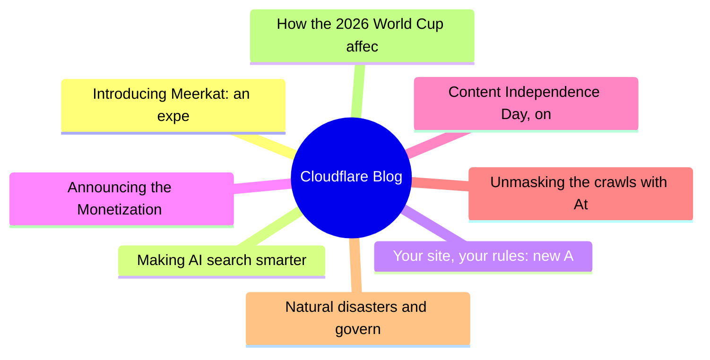
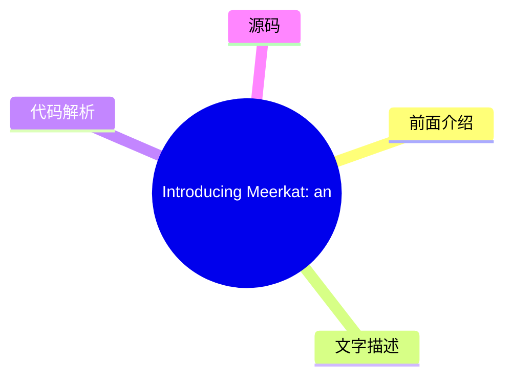
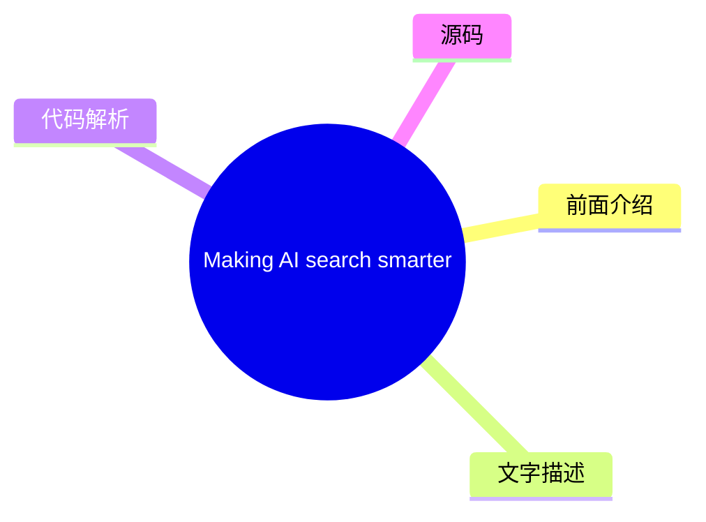
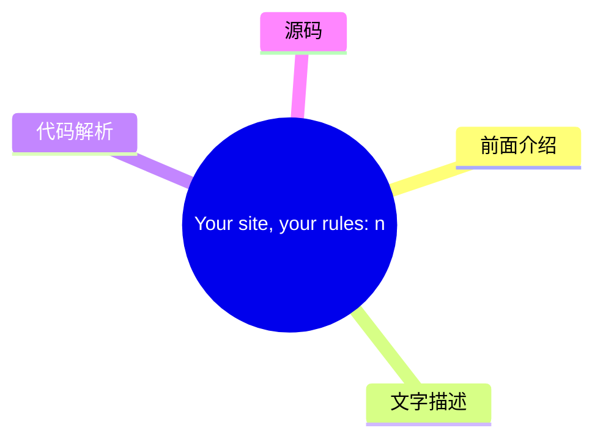
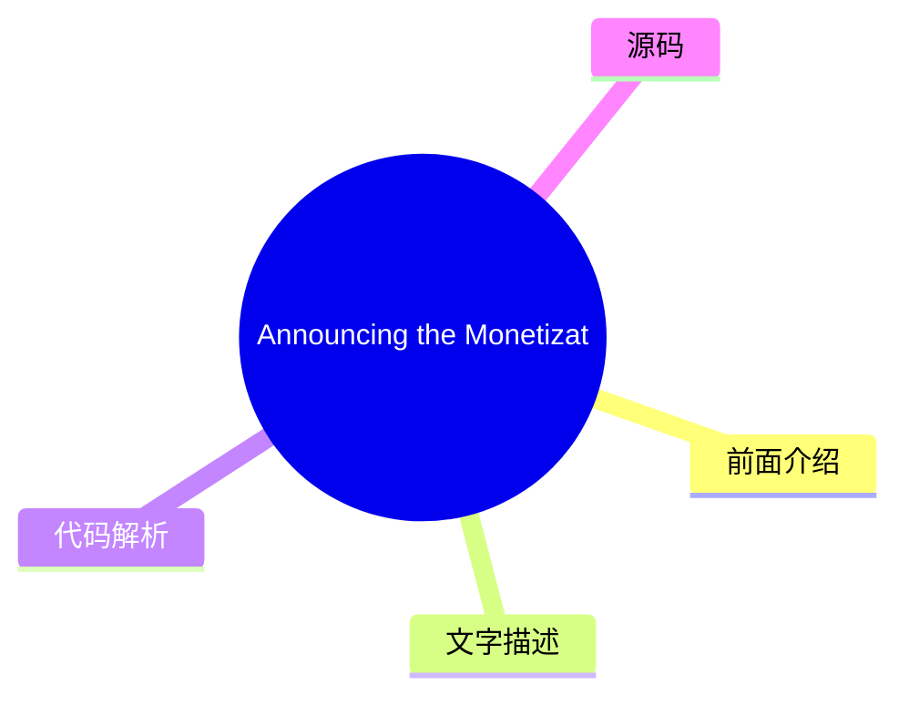
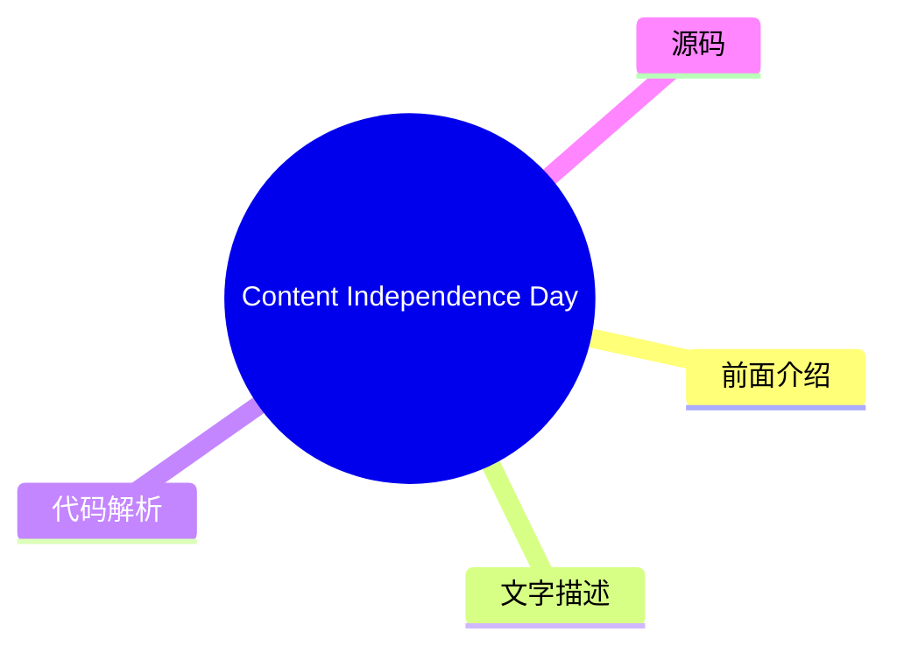
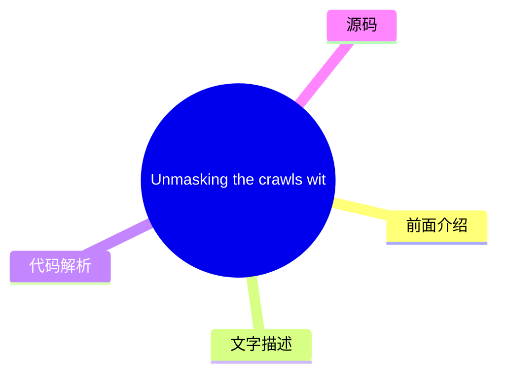
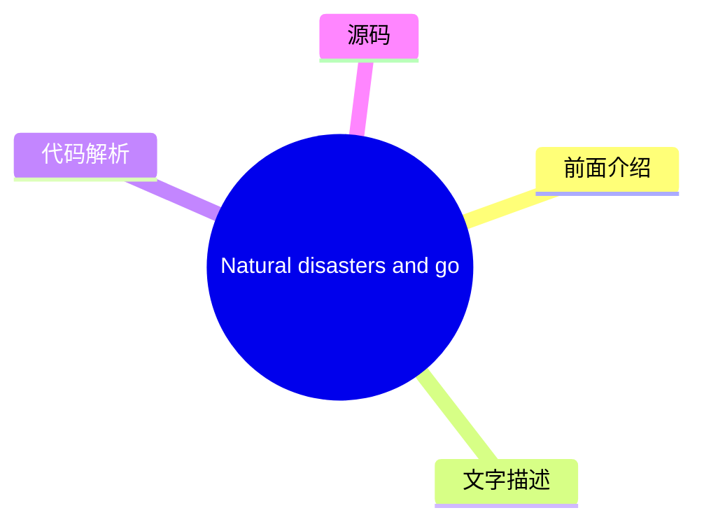
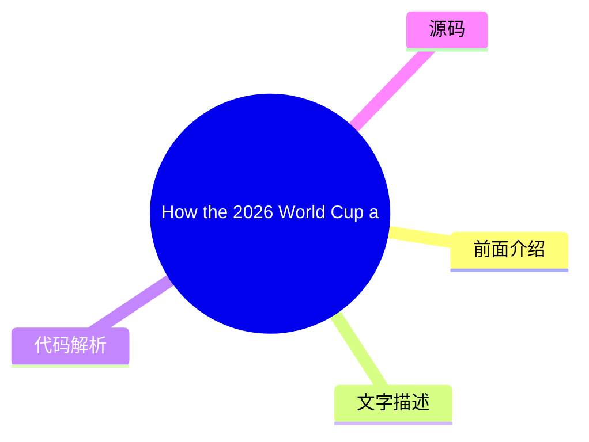

# ☁️ Cloudflare Blog Top 8 (2026-07-29)

## 前面介绍

- 数据源：Cloudflare Blog
- 抓取日期：2026-07-29
- 条目数：8
- 含完整正文：8
- 含代码片段：0
- 组织方式：前面介绍 / 树状图 / 文字描述 / 代码解析 / 源码

## 思维导图



## 详细整理（8 条，8 条含全文，0 条含代码）

### 1. Introducing Meerkat: an experiment in global consensus
- **链接**: [https://blog.cloudflare.com/meerkat-introduction/](https://blog.cloudflare.com/meerkat-introduction/)
- **作者**: James Larisch
- **发布**: Wed, 08 Jul 2026 12:00:00 GMT

#### 前面介绍

- Cloudflare Research is building a global consensus service called Meerkat that uses a new consensus algorithm called QuePaxa. We plan to use Meerkat to build a strongly consistent, fault-tolerant key-value store, and other applications.
- 作者：James Larisch
- 发布时间：Wed, 08 Jul 2026 12:00:00 GMT

#### 树状图



#### 文字描述

- Many internal services at Cloudflare need to read and modify the same control-plane state from across our 330+ global data centers. They need guarantees that different readers *never *see inconsistent state, and that the system remains available for writes even when some data centers or links fail. But Cloudflareâs network runs across the entire Internet, and the Internet is an
- ## What we need from a global control-plane data system Many Cloudflare services read and write *control-plane data*, data that helps those services operate correctly, from multiple machines distributed all over the world. One example of control-plane data is *placement information*: where certain resources (like an AI model instance) are stored. Another example is *leadership 
- ### Strong consistency A distributed data systemâs [ consistency](https://jepsen.io/consistency/models) level describes what kinds of weird behavior the system is allowed to exhibit when it receives concurrent reads and writes. Consider a distributed key-value store that stores a single numeric value `x = 6` across multiple nodes. Also consider the following sequence of writes.
- ### Fault tolerance A systemâs level of fault tolerance describes what kinds of faults the system can handle before catastrophes happen. Catastrophes are typically violations of properties the system aims to uphold, e.g., that two consecutive reads without an intervening write for the same key never see different values, or that the system remains available for writes. The faul

#### 代码解析

- 本文未检测到明确代码块，内容更偏新闻、观点或方法论。

#### 源码

#### 中文节选

Cloudflare 的许多内部服务需要从我们 330 多个全球数据中心读取和修改相同的控制平面状态。它们需要保证不同的读取者*永远*不会看到不一致的状态，并且即使某些数据中心或链路发生故障，系统对于写入操作仍然保持可用。

但 Cloudflare 的网络覆盖整个互联网，而互联网是一个不可预测的地方。服务器和数据中心会宕机。队列会填满。链路和电缆会被切断。这些条件使得运行一个保证强一致性的全球可用数据系统变得困难（例如，保证所有读取者都能读取到所有先前的写入），因为敌对条件阻碍了分布式系统副本之间可靠地同步数据的能力。

尽管网络条件恶劣，但通过*共识算法*安全地同步数据的一种方法是，它允许一组机器在只要大多数节点保持存活且能够通信的情况下，就同意相同的值序列，例如键值存储的 put 和 `get` 操作。

不幸的是，像 [Raft](https://raft.github.io/) 这样的常用共识算法在 Cloudflare 这样的广域网上表现不佳，因为它们依赖于*领导者*和*超时*。*领导者*是唯一被允许进行写入的副本，如果它因崩溃或网络降级而失败，系统将变得不可用，直到某个其他副本*超时*并选举出新的领导者。而且，在延迟不可预测的网络中，这些超时值很难配置。

我们已经经历过多次由共识驱动系统中不可用的领导者引发的事故。

因此，在过去的一年里，Cloudflare 的研究 [团队](https://research.cloudflare.com/) 正在构建一个名为 **Meerkat** 的新分布式共识服务，它由一种称为 [, 的共识算法提供支持，该算法由 Tennage & BÄsescu 等人于 2023 年发表。QuePaxa 与 Raft 的不同之处在于，所有副本可以随时执行写入，且进度永远不会因超时而停止，这使其非常适合 Cloudflare 的网络。我们层叠](https://bford.info/pub/os/quepaxa/quepaxa/)

__QuePaxa__*应用程序*，例如事务型键值存储和租赁系统，构建在 Meerkat 的共识日志之上。据我们所知，这将是 QuePaxa 首次在全球范围内进行工业级部署。

Meerkat 是一个仍在开发中的实验性共识服务。它最初被设计用于管理少量的控制平面状态（例如，复制数据库的领导权），因此，在可预见的未来，它将仅限内部使用。本文介绍了 Meerkat，并为后续关于 Meerkat 的博客文章奠定了基础。

## 我们需要一个全球控制平面数据系统

Cloudflare 的许多服务都会从分布在世界各地的多台机器上读取和写入*控制平面数据*，这些数据有助于这些服务正确运行。控制平面数据的一个例子是*放置信息*：某项资源应放置在哪里。

#### 完整正文（中文）

Cloudflare 的许多内部服务需要从我们 330 多个全球数据中心读取和修改相同的控制平面状态。它们需要保证不同的读取者*永远*不会看到不一致的状态，并且即使某些数据中心或链路发生故障，系统对于写入操作仍然保持可用。

但 Cloudflare 的网络覆盖整个互联网，而互联网是一个不可预测的地方。服务器和数据中心会宕机。队列会填满。链路和电缆会被切断。这些条件使得运行一个保证强一致性的全球可用数据系统变得困难（例如，保证所有读取者都能读取到所有先前的写入），因为敌对条件阻碍了分布式系统副本之间可靠地同步数据的能力。

尽管网络条件恶劣，但通过*共识算法*安全地同步数据的一种方法是，它允许一组机器在只要大多数节点保持存活且能够通信的情况下，就同意相同的值序列，例如键值存储的 put 和 `get` 操作。

不幸的是，像 [Raft](https://raft.github.io/) 这样的常用共识算法在 Cloudflare 这样的广域网上表现不佳，因为它们依赖于*领导者*和*超时*。*领导者*是唯一被允许进行写入的副本，如果它因崩溃或网络降级而失败，系统将变得不可用，直到某个其他副本*超时*并选举出新的领导者。而且，在延迟不可预测的网络中，这些超时值很难配置。

我们已经经历过多次由共识驱动系统中不可用的领导者引发的事故。

因此，在过去的一年里，Cloudflare 的研究 [团队](https://research.cloudflare.com/) 正在构建一个名为 **Meerkat** 的新分布式共识服务，它由一种称为 [, 的共识算法提供支持，该算法由 Tennage & BÄsescu 等人于 2023 年发表。QuePaxa 与 Raft 的不同之处在于，所有副本可以随时执行写入，且进度永远不会因超时而停止，这使其非常适合 Cloudflare 的网络。我们层叠](https://bford.info/pub/os/quepaxa/quepaxa/)

__QuePaxa__*应用程序*，例如基于 Meerkat 共识日志的事务型键值存储和租赁系统。据我们所知，这将是 QuePaxa 首次在全球范围内进行工业级部署。

Meerkat 是一个仍在开发中的实验性共识服务。它最初被设计用于管理小块控制平面状态（例如复制数据库的领导权），因此在不久的将来，它将保持仅限内部使用。本文介绍了 Meerkat，并为即将发布的与 Meerkat 相关的博客文章奠定了基础。

## 我们对全球控制平面数据系统的需求

Cloudflare 的许多服务会从分布在世界各地的多台机器上读取和写入 *控制平面数据*，这些数据有助于这些服务正确运行。控制平面数据的一个例子是 *放置信息*：某些资源（如 AI 模型实例）存储在哪里。另一个例子是 *领导权信息*：哪台机器当前被允许对数据库执行写入操作。

控制平面数据必须同时具备 *强* *一致性*，并且能够 *在特定类型的故障下保持可访问性*。

在本节中，我们将精确描述我们对 Cloudflare 共识服务的一致性和容错要求。我们使用键值存储作为运行在共识服务之上的应用程序的运行示例，尽管其他应用程序（例如分布式租赁/锁）也是可能的。

### 强一致性

分布式数据系统的 [一致性](https://jepsen.io/consistency/models) 级别描述了系统在接收并发读写时被允许表现出的怪异行为。考虑一个在多个节点上存储单个数值的分布式键值存储

`x = 6`。还要考虑以下写入序列。这些写入是尽力而为地提交到不同节点的，并且可能以任何顺序到达： - `x = x + 1`
- `x = x / 2`

系统的一致性级别告诉您，在执行这些写入后，客户端在读取 `x` 时可能会看到 `x` 的哪些值。考虑以下操作序列以及在不同一致性级别下的可能执行顺序：

In a weak consistency level, writes can be re-ordered. In a stronger consistency model, writes canât be reordered, but reads can. In the strongest possible consistency level, the operations are ordered exactly as they occurred in real time. This property is called *linearizability*.

At Cloudflare, many services want linearizability. Unlike weaker forms of consistency, linearizability relieves programmers from thinking about all the weird behaviors the data systems might exhibit. Instead, they can reason about the distributed system like they reason about local memory on a single-threaded machine: all reads after a write will see that write. For additional reading material on the dangers of weak consistency, check out this [ post](https://brooker.co.za/blog/2025/11/18/consistency.html) by Marc Brooker.

(If youâre wondering, Meerkatâs key-value store also provides serializability, which weâll write about in a future post.)

### Fault tolerance

A systemâs level of fault tolerance describes what kinds of faults the system can handle before catastrophes happen. Catastrophes are typically violations of properties the system aims to uphold, e.g., that two consecutive reads without an intervening write for the same key never see different values, or that the system remains available for writes. The faults include network failures or delays, machine crashes, and machine restarts. A system will typically explicitly handle some faults but not others (you canât handle all faults, as the universe could always reach heat-death). For example, some key-value stores might guarantee to remain available for writes as long as two-thirds of the machines in the system can communicate and donât crash, but make no promises if a machine is compromised and starts sending malicious messages.

Our desired fault tolerance properties are as follows:

**First**, the data system should remain available for writes and reads from a client located in any of our data centers as long as the following are true:

- A majority of the machines in our system are alive and can communicate with one another. (Formally, we tolerate `f`faults in a system of`2f + 1`machines).

- The client can contact *any*machine in the system that is connected to a majority of live machines.

This means that a single failed machine, or network degradation on a single link, does not affect availability of the system*. *This property is not provided by Raft-based systems, as weâll see later.

**Second**, the data system remains *correct* as long as no actor in the system is actively malicious (and, of course, there are no bugs). We define *correctness* in terms of consensus *safety *later, but loosely speaking this means no two up-to-date machines will ever disagree about the world (e.g., one thinks that `key1=1` while another thinks that `key1=2`).

To summarize, the system must remain correct even if machines crash, machines restart, networks fail or degrade, data centers go down, and more (though we, like Raft-based systems, do not handle [ Byzantine faults](https://en.wikipedia.org/wiki/Byzantine_fault)).

## Introducing Meerkat

Meerkat is a consensus service *upon which *we can build applications that exhibit the above properties (strong consistency and fault tolerance) like a key-value (KV) store. To understand how Meerkat works, we first outline Meerkatâs general architecture, and then describe how Meerkatâs choice of consensus algorithm helps provide strong consistency and fault tolerance.

Developers of services using Meerkat request a *cluster* of Meerkat *replicas*. Each replica is connected to every other replica. Each replica participates in the consensus algorithm and can receive both reads and writes. The developer can specify which data centers are allowed to host their replicas, and Meerkat places them automatically.

To interact with their cluster, a developerâs client sends an application-specific request to any replica in the cluster. A single replica may host many kinds of applications, but the simplest one is a key-value store, so the simplest application-specific request type is a KV `get` or `put`. The replica responds to the request with an application-specific response (e.g., the records requested with the `get`). Note that KV reads (`get`s) are guaranteed to read up-to-date information.

### Meerkatâs log


在底层，副本将应用程序请求（例如 `get` 和 `put`）转换为 *日志事件*。该副本使用共识算法将每个日志事件分发给所有其他副本，以确保所有副本维护完全相同的事件日志（实际上，副本可能会滞后，但绝不应记录不同的条目）。这些事件是任意的 —— Meerkat 的核心并不关心它们的内容。Meerkat 的 *应用程序* 关心的是日志事件的内容。每个 Meerkat 副本“托管”许多 Meerkat 应用程序（例如键值存储），这些应用程序读取日志事件并构建状态。（注意，每个副本恰好属于一个集群。）

例如，KV Meerkat 应用程序从日志事件构建一个内存中的键值存储。因此，当客户端发送像 `put k1 v1` 这样的写入时，接收副本将该写入放入一个日志事件中并将其分发给所有副本。如果其他人随后向不同的副本写入 `put k1 v11`，该事件也会被分发给所有副本。由于所有正常运行的副本拥有相同的日志，这些副本可以按顺序应用日志中的操作来构建完全相同的状态。注意，`get` 请求也会创建分布式日志事件（为了线性一致性，如下一节所述）。

以下是副本的 KV 存储在接收日志事件时如何更新的示例：

### Meerkat 的日志如何实现强一致性

Meerkat 保证，如果一个客户端执行 `put k1 v1`，第二个客户端随后执行 `put k1 v11`，第三个客户端随后执行 `get k1`（使用一致读），他们将始终读取 `v11`。即使每个请求被提交到不同的副本，且这些副本随机分布在世界各地，Meerkat 也能保证这一点。这就是线性一致性。为了了解 Meerkat 如何保证这一点，我们必须更详细地检查 Meerkat 的日志。

Meerkat 日志是一系列槽位的序列。一个槽位是一个可以包含事件或不包含事件的盒子。包含事件的槽位被称为一个 *已决定* 槽位。日志中的所有槽位都是已决定的，除了最后一个槽位，它目前正在被决定。Meerkat 的不变式之一是，如果任何两个副本决定了一个槽位的值，那么这些值是相同的。换句话说，没有两个副本会永远不同意一个已决定槽位的值（尽管一个副本可能认为最后一个槽位是空的，而另一个副本则不这么认为）。这个属性有助于保证我们在上一节中描述的期望属性。

为了决定日志中最后一个（空的）槽位的值，Meerkat 副本运行一个分布式的 *共识算法*。共识算法允许一组通过网络通信的机器就一个已决定槽位的值达成一致。我们的共识算法只要大多数副本（超过一半）存活就能正常工作。

因此，如果日志当前包含两个条目，并且一个客户端向一个副本提交了 `put k1 v11`，该副本就会为槽位 3 触发一个共识算法。但是，另一个客户端可能已经向不同的副本提交了 `put k1 v111` 以用于槽位 3。共识算法确保只有针对槽位 3 的这样一个 *提议* 获胜。具体来说，它确保至少大多数副本同意同一个提议，并将其 *决定* 为槽位 3。非大多数副本 *永远* 不能决定一个不同的提议，但可能会错过事实

...（截断，原文 20546+ 字符）


### 2. Making AI search smarter
- **链接**: [https://blog.cloudflare.com/making-ai-search-smarter/](https://blog.cloudflare.com/making-ai-search-smarter/)
- **作者**: Matthew Conroy
- **发布**: Wed, 01 Jul 2026 13:00:00 GMT

#### 前面介绍

- Search is how we find nearly everything on the web — creators, merchants, answers. AI is rewriting the rules, leaving creators caught between staying discoverable in an agentic era and getting paid for their work. Today we're launching two initiative
- 作者：Matthew Conroy
- 发布时间：Wed, 01 Jul 2026 13:00:00 GMT

#### 树状图



#### 文字描述

- Search drives most experiences on the web. It's how we get things done, and how nearly everything on the web gets found â the creators, the merchants, the answer to whatever you just typed into a box. For nearly 30 years, that discovery journey ran on a simple bargain: let a search engine crawl your content, and it sends you visitors. You turned those visitors into a business â
- ### Rebuilding the bargain Transparency and control are the foundation, but more is needed. In 2025, we laid out our foundation via a set of [ responsible AI bot principles](https://blog.cloudflare.com/building-a-better-internet-with-responsible-ai-bot-principles/): bots should be transparent about who they are and what they're for, respect site owners' choices, and act in good
- ### Making search smarter Today we're launching a research program to make AI search smarter and stop our customers footing the bill for crawls that produce nothing new. More than 20% of the web sits behind Cloudflareâs network, which gives us a unique perspective. We can tell which pages have genuinely changed and which ones people and agents are flocking to. Through this prog
- ### From Pay Per Crawl to Pay Per Use Last year we [ launched Pay Per Crawl ](https://blog.cloudflare.com/introducing-pay-per-crawl/)so publishers could charge AI companies for crawling their content. It was a real start, but crawling is a crude measure of value. A single page might be crawled once and then cited in thousands of answers, or crawled over and over and never used 

#### 代码解析

- 本文未检测到明确代码块，内容更偏新闻、观点或方法论。

#### 源码

#### 中文节选

搜索驱动了网络上的大多数体验。这是我们完成事情的方式，也是网络上的几乎所有内容被找到的方式——创作者、商家，以及你刚刚在框中输入的任何问题的答案。近 30 年来，那次发现之旅运行在一个简单的交易上：让搜索引擎抓取你的内容，它就会向你发送访客。你通过广告、订阅，或者仅仅是受众本身，将这些访客转化为了业务。可被发现和获得报酬曾经是同一回事。一年前，在[第一个内容独立日](https://blog.cloudflare.com/content-independence-day-no-ai-crawl-without-compensation/)上，我们划下了一条线，以在 AI 时代捍卫这一交易。但一道界线仅仅是一个开始。自那时以来，AI 搜索在消费者生活中的普及程度只增不减，因为

[. 威胁不再是你可以屏蔽的少数几个训练爬虫；而是搜索本身正在围绕 AI 答案进行重建。](https://radar.cloudflare.com/)

__超过 50% 的在线流量是非人类的__

如今的答案引擎会读取你的页面并将摘要交给用户，因此访问——以及依赖于它的收入——就不再需要了。我们亲眼目睹了这一点，独立研究也证实了这一点：一项[ 2025 年皮尤研究中心的研究](https://www.pewresearch.org/short-reads/2025/07/22/google-users-are-less-likely-to-click-on-links-when-an-ai-summary-appears-in-the-results/)发现，当 Google 显示 AI 摘要时，用户点击传统搜索结果链接的频率仅为 8%（大约是没有摘要时的一半），而点击摘要内部的链接的频率仅为 1%。这让我们陷入了两难境地：退出 AI 搜索从而难以被找到，或者加入 AI 搜索，在为用户提供巨大价值的同时，看到回报却越来越少。我们的客户希望被找到并获得其提供的价值的报酬，而目前他们被迫做出选择。

Today, [ weâve announced new bot options](http://blog.cloudflare.com/content-independence-day-ai-options) to help our customers better control who can access their site and what they can do with it. But blocking was only step one: saying "no" protects content without rebuilding the business models that sustain it. So, itâs time to start building the new economic model of the Internet, starting with search.

### Rebuilding the bargain

Transparency and control are the foundation, but more is needed. In 2025, we laid out our foundation via a set of [ responsible AI bot principles](https://blog.cloudflare.com/building-a-better-internet-with-responsible-ai-bot-principles/): bots should be transparent about who they are and what they're for, respect site owners' choices, and act in good faith. Our tools hold bots to that bar. But enforcing good bot behavior doesn't make AI search any better for the people relying on it, and it doesn't send a dollar back to the creator whose work made the answer possible. We can do more than help the web say "no"; we can help rebuild what it says "yes" t

#### 完整正文（中文）

搜索驱动了网络上的大多数体验。这是我们完成事情的方式，也是网络上的几乎所有内容被找到的方式——创作者、商家，以及你刚刚在框中输入的任何问题的答案。近 30 年来，那次发现之旅运行在一个简单的交易上：让搜索引擎抓取你的内容，它就会向你发送访客。你通过广告、订阅，或者仅仅是受众本身，将这些访客转化为了业务。可被发现和获得报酬曾经是同一回事。一年前，在[第一个内容独立日](https://blog.cloudflare.com/content-independence-day-no-ai-crawl-without-compensation/)上，我们划下了一条线，以在 AI 时代捍卫这一交易。但一道界线仅仅是一个开始。自那时以来，AI 搜索在消费者生活中的普及程度只增不减，因为

[. 威胁不再是你可以屏蔽的少数几个训练爬虫；而是搜索本身正在围绕 AI 答案进行重建。](https://radar.cloudflare.com/)

__超过 50% 的在线流量是非人类的__

如今的答案引擎会读取你的页面并将摘要交给用户，因此访问——以及依赖于它的收入——就不再需要了。我们亲眼目睹了这一点，独立研究也证实了这一点：一项[ 2025 年皮尤研究中心的研究](https://www.pewresearch.org/short-reads/2025/07/22/google-users-are-less-likely-to-click-on-links-when-an-ai-summary-appears-in-the-results/)发现，当 Google 显示 AI 摘要时，用户点击传统搜索结果链接的频率仅为 8%（大约是没有摘要时的一半），而点击摘要内部的链接的频率仅为 1%。这让我们陷入了两难境地：退出 AI 搜索从而难以被找到，或者加入 AI 搜索，在为用户提供巨大价值的同时，看到回报却越来越少。我们的客户希望被找到并获得其提供的价值的报酬，而目前他们被迫做出选择。

Today, [ weâve announced new bot options](http://blog.cloudflare.com/content-independence-day-ai-options) to help our customers better control who can access their site and what they can do with it. But blocking was only step one: saying "no" protects content without rebuilding the business models that sustain it. So, itâs time to start building the new economic model of the Internet, starting with search.

### Rebuilding the bargain

Transparency and control are the foundation, but more is needed. In 2025, we laid out our foundation via a set of [ responsible AI bot principles](https://blog.cloudflare.com/building-a-better-internet-with-responsible-ai-bot-principles/): bots should be transparent about who they are and what they're for, respect site owners' choices, and act in good faith. Our tools hold bots to that bar. But enforcing good bot behavior doesn't make AI search any better for the people relying on it, and it doesn't send a dollar back to the creator whose work made the answer possible. We can do more than help the web say "no"; we can help rebuild what it says "yes" to.

So today, we're announcing two initiatives that move from defense to offense and start putting both halves of that old bargain back together.

**Make AI search smarter: **By** **using the signals we see across our global network, like what's fresh, what's high quality, and what's actually changed, we can help answer engines surface the most relevant content and reduce unwanted crawling. People searching get better answers, while costs are reduced for both AI companies and site owners if webpages are only recrawled when theyâve changed.

**Pay creators for the value they provide:** When your work is used to answer someone's question, you should be rewarded instead of just being scraped for free. And you should be able to see what's being used and what people are asking. This should be a real revenue stream, and an incentive to keep producing original content worth finding.

### Making search smarter

Today we're launching a research program to make AI search smarter and stop our customers footing the bill for crawls that produce nothing new.


More than 20% of the web sits behind Cloudflareâs network, which gives us a unique perspective. We can tell which pages have genuinely changed and which ones people and agents are flocking to. Through this program, we will explore using signals our customers have chosen to share about the freshness of their content, and we will combine those with our own insight into traffic flows, both human and bot. For answer engines, that's a roadmap to high-quality content. For our customers, it provides a view of what users are actually asking, and how their content shows up in AI results. The aim is to measure two things: how much these signals help answer engines to surface fresher, higher-quality content, and how much unnecessary crawling they cut out.

That second benefit, cutting unnecessary crawling, is bigger than it sounds. Cloudflare data suggests that more than 50% of crawl traffic from good bots goes to re-fetching pages that haven't changed â and that number is likely to climb as crawl volumes do. A signal that just says "nothing's changed here" lets a crawler skip the trip. That saves the answer engine compute. More importantly, it saves site owners from serving and paying for requests they never needed to.Â

The program is neutral by design: our goal is to make it work for every answer engine willing to play fair. It's limited to search. We aren't sharing any content, and nothing is used to train foundation models. We intend to publish what we learn, including the benefits to site owners such as better content discoverability and reduced server strain. We plan to make the capability broadly available later this year and reduce unnecessary crawling across our network.

### From Pay Per Crawl to Pay Per Use

Last year we [ launched Pay Per Crawl ](https://blog.cloudflare.com/introducing-pay-per-crawl/)so publishers could charge AI companies for crawling their content. It was a real start, but crawling is a crude measure of value. A single page might be crawled once and then cited in thousands of answers, or crawled over and over and never used at all. Creators want to be paid fairly for the value they provide.


所以我们开始将 Pay Per Crawl 转型为 Pay Per Use。我们正在与顶级 AI 公司（如 [ Ceramic.ai](http://ceramic.ai) 和 [You.com](http://you.com)）进行实验，这种安排很简单：组织可以引入自己的支付模式，并轻松将其扩展到 Cloudflare 网络上的内容所有者。

__You.com__Ceramic 构建了一种所谓的“按查询付费”模式，因此选择加入的出版商可以在其内容出现在 Ceramic 的搜索结果中时获得报酬。这意味着支付设计是跟随工作所提供的价值，而不是爬虫偶然抓取它的次数。

“为了扩展 AI 搜索的未来，我们需要一个拥有巨大覆盖范围且对透明度和公平补偿有共同承诺的合作伙伴，”Ceramic.ai 的创始人兼首席执行官 Anna Patterson 说，“Cloudflare 允许我们轻松且以编程的方式扩展我们的运营。通过将我们的按查询付费模式引入他们的网络，我们确保数百万内容所有者可以无缝选择加入，每次其内容出现在我们的搜索结果中时都能获得补偿。”

除了补偿之外，参与 Cloudflare/Ceramic 计划的内容所有者还将解锁新的报告，以帮助进行答案引擎优化（AEO）。客户终于可以看到导致其内容出现在搜索结果中的顶级查询、具体的网页和片段、其平均搜索结果排名位置等。这是我们即将推出的众多帮助客户提高可发现性的产品中的第一个。

这只是众多新兴方法之一。另一种来自 You.com：代理可以根据需要为特定的高价值内容付费，而无需任何前期承诺。AI 提供商正在测试新的支付模式（例如按查询付费、按结果付费等），而我们拥有支持所有这些模式的基础设施。

我们想坦诚地说明，这只是一个实验。还有很多东西需要学习，包括这种模式在互联网规模下究竟如何经受考验。我们将与合作伙伴和客户一起逐步解决这些问题，并分享我们的所学。但目标很明确：AI 搜索公司能获得更及时、更有依据的答案，而那些让答案成为可能的客户（即创作者）在提供帮助时也能获得报酬。Cloudflare 在这一切中的职责是提供能够使这一市场繁荣发展的基础设施层。

我们认为这更符合搜索经济学的走向。旧的人工网络优化搜索是为了节省时间——提供摘录、十个蓝色链接和一个点击。智能体网络则不同：智能体可以快速阅读并持续搜索。搜索正变成智能体为了回答一个问题而执行的数十次操作，更像是一种公用事业而非目的地。在那个世界里，重要的单位不再是抓取或点击，而是结果。对结果进行定价，并支付促成结果的人，是互联网得以持续繁荣的方式。

### 我们想要赢得的头条

一年前的“内容独立日”，头条是默认的“不”：AI 在没有补偿的情况下不能抓取内容。今年，我们的重点是给用户提供更多的产品和控制权，以便他们说“是”，并带来更多的益处。

今天的公告只是开始。Cloudflare 的研究项目旨在检验我们的信号能否在减少抓取的情况下产生更好的结果。按使用付费是我们将与合作伙伴一起探索的有前景的方向，这些合作伙伴相信内容创作者理应因其工作获得公平的报酬。过去 30 年的互联网也是这样建立的：有人运行试点，将“模型坏了”变成“这是新模型”，一次实验接着一次实验。我们相信，我们的客户在这个新的智能体时代具有可被发现的价值，并且可以优化其内容以实现最大发现。但他们应该能够做到这一点，而无需免费送出他们最有价值的创意资产。

The web is changing, and the business models itâs relied on are changing with it. The old Internet was open, neutral, and worth contributing to. We have a rare chance to keep it that way, and to build the business models that fund it in the future. Smarter answers for humans and agents asking the questions. A fair deal for the people whose skill, creativity, and commitment makes the answers worthwhile. Thatâs how we pursue Cloudflareâs mission: to help build a better Internet.

Happy Content Independence Day!

*Building on the open, agent-ready web? If you are interested in learning more about the Ceramic and You programs, please fill out *

__this form__. If you're building an answer engine and want to crawl smarter, weâd love to hear from you too: aeo@cloudflare.com.


### 3. Your site, your rules: new AI traffic options for all customers
- **链接**: [https://blog.cloudflare.com/content-independence-day-ai-options/](https://blog.cloudflare.com/content-independence-day-ai-options/)
- **作者**: Jin-Hee Lee
- **发布**: Wed, 01 Jul 2026 13:00:00 GMT

#### 前面介绍

- For our second Content Independence Day, we’re giving website owners finer options to manage AI traffic. Instead of a one-size-fits-all block, all customers can now easily distinguish and manage Search, Agent, and Training bots, alongside the new abi
- 作者：Jin-Hee Lee
- 发布时间：Wed, 01 Jul 2026 13:00:00 GMT

#### 树状图



#### 文字描述

- One year ago, we declared the first [ Content Independence Day](https://blog.cloudflare.com/content-independence-day-no-ai-crawl-without-compensation/), and we gave website owners the means to take back control of their content. The deal between crawlers and website owners that had held up for 30 years â we crawl you, and you get referrals â was no longer true. AI was taking ev
- ### Now, AI can be anything Today, AI can be in anything. Google search has changed from being sorted by AI to being a [ full answer engine](https://blog.google/products-and-platforms/products/search/search-io-2026/) that answers your question directly on the results page. And Google is not unique in this position â this is the direction in which âsearchâ is moving. We could de
- ### A pragmatic taxonomy To address these questions, we need a more nuanced view â a pragmatic taxonomy that aligns with the AI use cases our customers care about. So we are opening the discussion beyond AI training alone and focusing on three AI use cases that we want all customers to be able to manage: - **Search:**any behavior that collects or indexes your content, so it can
- ### New options to manage AI traffic **We want to provide more options for managing different kinds of AI traffic, to all website owners on the Cloudflare network.** The managed preset to âBlock AI botsâ that weâve announced in the past included single-purpose bots that crawled data for model training, as shown below:Â *Screenshot of the existing setting to manage AI bot traffi

#### 代码解析

- 本文未检测到明确代码块，内容更偏新闻、观点或方法论。

#### 源码

#### 中文节选

一年前，我们宣布了首个 [内容独立日](https://blog.cloudflare.com/content-independence-day-no-ai-crawl-without-compensation/)，并赋予网站所有者收回对其内容控制权的手段。爬虫与网站所有者之间维持了 30 年的协议——我们爬取你的内容，你获得推荐——已不再成立。AI 正在拿走一切却一无所返，这对网站所有者构成了生存威胁。因此，我们推出了一个一键“屏蔽 AI 机器人”选项，以及

[.](https://blog.cloudflare.com/introducing-pay-per-crawl/)

__按爬取付费市场__

一年过去了，发生了许多变化。去年七月，围绕“AI 机器人”的讨论主要集中在未经补偿就阻止 AI 训练，指出了这种内容被用于模型训练却没有任何价值回馈给网站所有者的零和博弈。但人们对于更细致处理的需求已浮现：内容所有者仍然希望能够保护自己的内容，并且应该为他们辛勤创作、策展和分享的原创内容获得报酬。我们也知道，封闭内容并非“一刀切”的解决方案；网站所有者希望有比“每次都屏蔽所有自动化”更多的选择。

如果你运营一个小型网站，问题不仅仅是有人可能利用你的内容来训练模型——而是根本没人能找到你。因此，你必须做出一种浮士德式的交易：要么出现在搜索结果中并允许 AI 训练你的内容，要么冒着失去可发现性的风险。如果搜索提供商对搜索和训练使用相同的机器人，这会不公平地偏袒既有的搜索提供商；而这种不公平的优势会激励新进入者为了缩小竞争差距而采取规避手段。

### 现在，AI 可以无处不在

如今，AI 可以存在于任何地方。谷歌搜索已从由 AI 排序转变为 [ 全答案引擎](https://blog.google/products-and-platforms/products-search/search-io-2026/)，直接在结果页面上回答你的问题。谷歌并非唯一处于这种地位的——这就是“搜索”正在发展的方向。

我们可以争论一下今天什么算作“AI”，结果却发现标准明天就会改变。因此，与其主要将机器人定义为“AI”或非“AI”，我们的更新分类方法将更深入地询问关于机器人或代理行为的问题：它们在我的网站上做什么？它们在存储什么？以及它们将如何重新分享我的内容？

### 实用的分类法

为了回答这些问题，我们需要一个更细致的视角——一种与我们客户关心的 AI 用例相一致的实用分类法。因此，我们正在将讨论范围扩大到仅限于 AI 训练，并专注于三个我们希望所有客户都能管理的 AI 用例：

- **搜索：**任何收集或索引您内容的行为，以便日后回答相关问题。关键在于，搜索会主动构建您网站的数据库，以便稍后响应用户查询。网站所有者 sho

#### 完整正文（中文）

一年前，我们宣布了首个 [内容独立日](https://blog.cloudflare.com/content-independence-day-no-ai-crawl-without-compensation/)，并赋予网站所有者收回对其内容控制权的手段。爬虫与网站所有者之间维持了 30 年的协议——我们爬取你的内容，你获得推荐——已不再成立。AI 正在拿走一切却一无所返，这对网站所有者构成了生存威胁。因此，我们推出了一个一键“屏蔽 AI 机器人”选项，以及

[.](https://blog.cloudflare.com/introducing-pay-per-crawl/)

__按爬取付费市场__

一年过去了，发生了许多变化。去年七月，围绕“AI 机器人”的讨论主要集中在未经补偿就阻止 AI 训练，指出了这种内容被用于模型训练却没有任何价值回馈给网站所有者的零和博弈。但人们对于更细致处理的需求已浮现：内容所有者仍然希望能够保护自己的内容，并且应该为他们辛勤创作、策展和分享的原创内容获得报酬。我们也知道，封闭内容并非“一刀切”的解决方案；网站所有者希望有比“每次都屏蔽所有自动化”更多的选择。

如果你运营一个小型网站，问题不仅仅是有人可能利用你的内容来训练模型——而是根本没人能找到你。因此，你必须做出一种浮士德式的交易：要么出现在搜索结果中并允许 AI 训练你的内容，要么冒着失去可发现性的风险。如果搜索提供商对搜索和训练使用相同的机器人，这会不公平地偏袒既有的搜索提供商；而这种不公平的优势会激励新进入者为了缩小竞争差距而采取规避手段。

### 现在，AI 可以无处不在

如今，AI 可以存在于任何地方。谷歌搜索已从由 AI 排序转变为 [ 全答案引擎](https://blog.google/products-and-platforms/products-search/search-io-2026/)，直接在结果页面上回答你的问题。谷歌并非唯一处于这种地位的——这就是“搜索”正在发展的方向。

我们可以争论一下今天什么算作“AI”的截止点，结果却发现标准明天就会改变。因此，与其主要将机器人定义为“AI”或非“AI”，我们更新的分类方法将询问关于机器人或代理行为更深层的问题：它们在我的网站上做什么？它们在存储什么？以及它们将如何重新分享我的内容？

### 务实的分类法

为了回答这些问题，我们需要一个更细致的视角——一种与我们客户关心的 AI 用例相一致的务实分类法。因此，我们正在将讨论范围从仅限于 AI 训练扩展开来，并专注于三个我们希望所有客户都能管理的 AI 用例：

- **搜索：** 任何收集或索引您内容的行为，以便日后回答相关问题。关键在于，搜索会主动构建您网站的数据库，以便稍后响应用户查询。网站所有者应预期会因此获得推荐流量或其他公平的补偿。
- **代理：** 自动化 **训练**：抓取您的内容以训练或微调模型。关键在于，您的数据被永久吸收到 AI 的底层架构中，以提升其能力。

网络上的许多流行爬虫都落入上述分类之一；有些则落入多个分类。除了上述三种情况外，我们还将许多其他行为进行了分类——包括广告验证、内容抓取和代理交易（更多内容见下文）。但我们认为，所有网站所有者管理这三种以 AI 为中心的用例的访问权限应该很简单。我们相信，机器人操作员应该将他们的爬虫分开，因为这能为网站所有者创造更多的透明度：使他们能够更好地理解特定爬虫访问其网站的原因，并更好地管理他们授予该爬虫的访问权限。如果一家公司运行的自动化程序既构建 **搜索** 索引，充当 **代理**，又收集数据以 **训练** 其模型，那么我们强烈建议该公司将自动化程序分为三个独立的爬虫。

我们想要建立一个分类系统，该系统既要具备可扩展性，又要能够随着自动化流量的演变而反映真实世界的情况。追踪机器人的用途并非什么新鲜事，但我们的新分类体系包含了一些更新，能更好地反映当前机器人流量的状况。最值得注意的是，我们希望识别出具有多种用途的机器人，并应将其所有用途都纳入追踪，而不仅仅是一个。

### 管理人工智能流量的新选项

**我们要为管理不同类型的人工智能流量提供更多选项，以便 Cloudflare 网络上的所有网站所有者使用。**

我们过去宣布的“管理 AI 机器人”预设包含单一用途的机器人，这些机器人用于抓取数据以进行模型训练，如下图所示：

*   2025 年 7 月 1 日管理 AI 机器人流量的现有设置截图。

但并非所有人工智能的使用都是一样的，我们希望我们的客户拥有他们所需的控制权。因此，我们推出了基于 **Search（搜索）、Agent（代理）和 Training（训练）** 三种主要用例来管理人工智能流量的能力。借助这些新选项，我们的客户可以更精细地调整他们管理 AI 机器人流量的方式——包括我们免费计划中的客户。

*   2026 年 7 月 1 日管理 AI 机器人流量的新选项截图。

### 设置新默认值

**2026 年 9 月 15 日，我们将为这三个分类中的每一个设置新的默认值。** 对于所有新接入 Cloudflare 的域名，**Training** 和 **Agent** 类别将在显示广告的页面上被默认阻止，而 **Search** 将保持默认允许。

广告是网站所有者希望访客到达并看到的信号——一种可变现的、能支撑业务的东西。因此，在这些页面上，我们将人类注意力视为最终目标，并阻止可能阻碍这种注意力的机器人（即 Training 和 Agent 机器人）。另一方面，搜索是最自然地将访客引导回来的行为，我们相信大多数网站所有者允许这种行为符合他们的利益。

Another change that will apply on September 15 is that multi-purpose crawlers (specifically those that combine Search with Training) will be allowed/blocked according to *all* of their behaviors, in line with our call for transparency for website owners. Since the defaults will be enforced by the most restrictive applicable rules, multi-purpose crawlers such as Googlebot, Applebot, and BingBot will be blocked by customers who have selected to block Training (either through the new options to [ manage AI traffic](https://developers.cloudflare.com/bots/additional-configurations/block-ai-bots/), or through the legacy Block AI bots service).

Of course, customer choice is paramount: if a website owner wants to opt out of these new default configurations, they can [ easily mark this in their Security settings](https://dash.cloudflare.com/?to=/:account/:zone/security/settings) any time leading up to September 15, which will confirm that they want 

*no changes*on Training crawlers that also crawl for Search purposes. Weâll also continue to notify customers of the upcoming change to defaults as we approach September 15 to ensure that customers who want to choose settings different from the defaults have the opportunity to do so.

### BotBase: a new visibility plane for Enterprise customers

Weâre also excited to launch a major visibility update as a new feature of Enterprise Bot Management. As Cloudflareâs directory of tracked bots has grown, so has the desire to manage these bots in sensible groupings and to understand more detail about a particular bot.Â

Introducing [BotBase](https://developers.cloudflare.com/bots/botbase/). BotBase is our new database tracking all known bots, including Verified bots and agents. This database provides a comprehensive, searchable view of our entire directory of bots, directly on the Cloudflare dashboard. Weâre tackling 

*visibility first*, but, later this year, weâll expand BotBase to provide a direct control center for known automated content on your website.


借助这一新视图，Enterprise Bot Management 客户可以查看所有已验证机器人/代理的完整目录，以及它们在此更新后的分类法中的位置——这是我们此前从未在 Cloudflare 仪表板上动态展示过的视图。想要精确针对特定机器人的客户还可以轻松筛选来自该机器人的所有流量，并复制检测 ID 以用于安全规则。所有这些功能现已在一个专用页面中上线，可通过 [Bot Management 配置卡片](https://dash.cloudflare.com/?to=/:account/:zone/security/settings/bot-traffic/bot-base) 访问。

在构建 BotBase 时，我们希望涵盖所有信息，以便能够从机器人到机器人构建可扩展、强大的洞察。其中一部分是我们更新后的分类法的基石，即 **基于机器人在您网站上可能执行的操作——即其行为**。我们将这些分类如下区分，每个机器人都会被归类为一种或多种此类行为。

| 机器人分类 | 行为和用途 |
|---|---|
| Search | 爬取以扫描您的网站，帮助其在搜索引擎结果中显示 |
| Agent | 代表人类访问页面的用户导向代理 |
| Training | 爬取以训练或微调模型 |
| Transact | 代表用户执行结账操作 |
| Data Collection | 包括价格抓取、竞争情报收集和第三方分析 |
| Security Testing | 包括漏洞扫描和渗透测试 |
| SEO | SEO 爬取、网站审计和无障碍检查 |
| Ads Verification | 广告投放验证、广告欺诈检测 |
| Social / Link Preview | 社交平台和消息应用的链接预览 |
| Feed Fetching | 包括 RSS 阅读器、播客聚合器和新闻源机器人 |
| Monitoring & Operations | 包括正常运行时间监控、Webhooks 和健康检查 |

*加粗斜体行表示所有客户现在都可以使用的新的可配置选项。*

### 爬虫如何使用我的内容？

我们听到的另一条对客户至关重要的信息是机器人的**内容使用情况**——即机器人爬取您的内容后可能会保留和重新分享的内容。为了解决这个问题，我们正在为 Bot Management 客户构建基于“内容使用情况”进行选择和阻止的功能。此设置可以设置为三个级别，从最不严格到最严格：

- `immediate` — 交互，但不存储或重用任何内容
- `reference`（默认） — 索引、摘录并回链
- `full` — 摘要和复制

这些值可以与机器人分类相结合，以表达更细致的规则，例如“允许用于 **搜索**、**SEO** 和 **广告验证** 的所有机器人，但仅限于 `reference` 使用级别”。这允许网站所有者以合理的分组做出决策，而不是逐个管理机器人规则**。**

为了进一步支持这一点，从今天开始，我们正在测试一个新的信号 `use`，它扩展了 [Content Signals](https://contentsignals.org/) 并存在于您的 robots.txt 中。这通过第四个可选字段扩展了 Content Signals 第一版本的三个字段，表达与上述相同的偏好：

- `use=immediate`
- `use=reference`
- `use=full`

与 robots.txt 文件中列出的所有其他项目一样，内容使用信号的值是网站所有者的*偏好*，而不是直接发出阻止指令。我们现在正在添加对此扩展的支持：所有已启用托管 robots.txt 的客户（即会为搜索爬取添加偏好，但为训练爬取添加阻止）现在将在其 robots.txt 中添加 `use=reference` 的额外偏好。

```
# Cloudflare Managed content with original Content Signals
User-agent: *
Content-Signal: search=yes,ai

...（截断，原文 17662+ 字符）


### 4. Announcing the Monetization Gateway: charge for any resource behind Cloudflare via x402
- **链接**: [https://blog.cloudflare.com/monetization-gateway/](https://blog.cloudflare.com/monetization-gateway/)
- **作者**: Rohin Lohe
- **发布**: Wed, 01 Jul 2026 13:00:00 GMT

#### 前面介绍

- We're opening the waitlist for our Monetization Gateway, which will allow you to charge for any web page, dataset, API, or MCP tool behind Cloudflare. The charges will settle in stablecoins over the x402 open protocol, with no payments stack of your
- 作者：Rohin Lohe
- 发布时间：Wed, 01 Jul 2026 13:00:00 GMT

#### 树状图



#### 文字描述

- Today, we are announcing the Cloudflare Monetization Gateway, an engine that will give Cloudflare customers the ability to charge for any asset protected by Cloudflare: web pages, datasets, APIs, or MCP tools. It will provide a single control plane to manage payment policies and access controls across your applications, while also protecting your origin from high payment volum
- ### A refresher on x402 Last year on [ Content Independence Day](https://blog.cloudflare.com/content-independence-day-no-ai-crawl-without-compensation/), we gave site owners one-click control over which AI crawlers could reach their content, and with [we let them charge crawlers for it. The Monetization Gateway is the next step: instead of only charging crawlers for content, yo
- ### What the Monetization Gateway does The Monetization Gateway will provide a flexible payment rules API that will allow you to express exactly when you want a caller to pay to access your digital resources. Hereâs how it will work. Tokens, APIs, MCP tool calls, and data already flow through that path. You will decide, as precisely as you want, which of that traffic has to pay
- ### Where we see this going The Monetization Gateway will turn the request into a payment and give Cloudflare customers new revenue opportunities, but where this goes is far bigger. An agent is software that acts autonomously on a userâs behalf, and agents are starting to act on their own. Soon they will carry wallets and buy what they need without a person in the loop: a datas

#### 代码解析

- 本文未检测到明确代码块，内容更偏新闻、观点或方法论。

#### 源码

#### 中文节选

今天，我们宣布推出 Cloudflare Monetization Gateway（Cloudflare 变现网关），这是一个引擎，将赋予 Cloudflare 客户向任何由 Cloudflare 保护的资产收费的能力：网页、数据集、API 或 MCP 工具。

它将提供一个统一控制平面，用于管理您应用程序中的支付策略和访问控制，同时通过在边缘处理支付验证和执行，保护您的源站免受高支付量的冲击。在启动时，支付将通过 [x402](https://www.x402.org/)（开放协议）在稳定币中结算，该协议由超过 25 位行业领袖组成的联盟支持，[我们正在构建](https://blog.cloudflare.com/x402/)。

__x402 Foundation__

### 网络的演变商业模式

30 年来，网络一直运行在一个简单的经济交易上：用内容换取人类注意力。这种注意力通过广告、订阅和电子商务进行了变现。这种交易为我们所知的互联网提供了资金。

但随着代理成为互联网的主要用户，该模式正在崩溃。代理不会看广告，也不需要维护其想要访问的所有工具的月度订阅。它阅读或消费数据源一次，获取所需内容，然后继续前进。在整个网络中，AI 爬虫已经向其发送的每个访客请求内容 100 次到数万次。

这一现实要求一种新模式：对一切实行基于使用量的定价。如果注意力和电子商务正从网站转移到 AI 工具和 AI 编写的软件，那么代理应该为其所需的输入付费——训练数据、推理内容、开发工具和 API 使用。软件的自然支付单位是请求、令牌或结果，而不是席位或月份。这可能会呈现以下几种形式：

- 每次搜索几美分，按调用计费
- 上传端点的 0.001 美元基础费用加上每 MB 0.01 美元的费用

- 每次解决升级的支持工单费用为 0.99 美元，仅在任务成功时付费

这与 [当答案引擎使用其内容时向创作者付费](https://blog.cloudflare.com/making-ai-search-smarter) 背后的理念相同——即每当使用内容或资源时，进行公平的价值交换，并以为此目的而构建的中立轨道进行定价。人们通常想象一个代理购买昂贵的资产，如网络域名，但代理支付的大部分内容发生在结账流程之前，且价格要低得多。

互联网的某些部分已经以这种方式运作。云服务和 API 多年来一直按调用次数或按小时出售，但仅面向已知买家：用户注册，获得 API 密钥，并产生基于使用量的计费。内容大多跳过了支付环节，转而依靠广告运行。这些商业模式一直无法服务未验证的

#### 完整正文（中文）

今天，我们宣布推出 Cloudflare Monetization Gateway（Cloudflare 变现网关），这是一个引擎，将赋予 Cloudflare 客户向任何由 Cloudflare 保护的资产收费的能力：网页、数据集、API 或 MCP 工具。

它将提供一个统一控制平面，用于管理您应用程序中的支付策略和访问控制，同时通过在边缘处理支付验证和执行，保护您的源站免受高支付量的冲击。在启动时，支付将通过 [x402](https://www.x402.org/)（开放协议）在稳定币中结算，该协议由超过 25 位行业领袖组成的联盟支持，[我们正在构建](https://blog.cloudflare.com/x402/)。

__x402 Foundation__

### 网络的演变商业模式

30 年来，网络一直运行在一个简单的经济交易上：用内容换取人类注意力。这种注意力通过广告、订阅和电子商务进行了变现。这种交易为我们所知的互联网提供了资金。

但随着代理成为互联网的主要用户，该模式正在崩溃。代理不会看广告，也不需要维护其想要访问的所有工具的月度订阅。它阅读或消费数据源一次，获取所需内容，然后继续前进。在整个网络中，AI 爬虫已经向其发送的每个访客请求内容 100 次到数万次。

这一现实要求一种新模式：对一切实行基于使用量的定价。如果注意力和电子商务正从网站转移到 AI 工具和 AI 编写的软件，那么代理应该为其所需的输入付费——训练数据、推理内容、开发工具和 API 使用。软件的自然支付单位是请求、令牌或结果，而不是席位或月份。这可能会呈现以下几种形式：

- 每次搜索几美分，按调用计费
- 上传端点的 0.001 美元基础费用加上每 MB 0.01 美元的费用

- 每次成功解决一次升级支持，收费 0.99 美元，仅在任务成功时付费

这与 [当搜索引擎使用其内容时向创作者付费](https://blog.cloudflare.com/making-ai-search-smarter) 背后的逻辑相同——每当使用内容或资源时，进行公平的价值交换，并在为此目的构建的中立轨道上定价。人们通常想象一个代理购买昂贵的资产，如网络域名，但代理支付的大部分内容位于任何结账流程的上游，且价格要低得多。

互联网的某些部分已经以这种方式运作。云服务和 API 多年来一直按调用次数或按小时出售，但仅面向已知买家：用户注册，获得 API 密钥，并产生基于使用量的计费。内容大多跳过了支付环节，转而依靠广告。这些商业模式一直无法为低于一美分的交易服务未经验证的买家，因为 [支付轨道](https://stripe.com/resources/more/what-are-payment-rails#what-are-payment-rails) 成本过高且结算耗时过长。在某个价格点以下，收取付款的成本高于付款本身的价值。

历史上，基于使用量的计费很难实施。企业需要有效地成为支付公司，运行自己的会计系统，以稳健且可审计的方式跟踪内部使用情况。跟踪这些使用情况需要对后端系统进行重大改造。许多人选择了按席位定价，因为它更简单，且通常更有利可图。

代理颠覆了这一动态。单个代理可以全天候完成整个团队的工作，并收取与实际消费无关的固定一次性费用。同时，代理可以在没有摩擦的情况下进行数千次微支付，而要求个人批准每一笔付款将是难以承受的负担。基于使用量的价格点正是代理的生存空间，也是基于稳定币的微支付大放异彩的地方。这是因为稳定币（例如 [Open USD](https://joinopenstandard.com/) 和 [USDC](https://www.circle.com/usdc)）允许买家在互联网上转移小额资金，产生可忽略不计的费用，并在不到一秒的时间内完成结算。这在当今其他支付轨道上是不可能实现的。

__USDC__这里我们可以提供帮助。Cloudflare 多年来一直在为自身的计费系统和客户的分析构建基于使用量的计费系统。得益于我们作为买家和卖家之间代理层的地位，我们可以极大地简化基于使用量的计费在 Web 资产上的实施。如下图所示，有了 Cloudflare 支持基于使用量的计费，支付凭证可以移入请求本身，支付验证和请求路径将合并。

这对您的好处是：计量、支付交换和结算将从您的源站移出。您保留的是最重要的部分——您的规则、您的价格和您的收入。您无需为买家办理入驻，也无需搭建计费系统。您只需编写一条规则，智能买家将根据其使用量进行付费。

### 关于 x402 的回顾

去年在 [内容独立日](https://blog.cloudflare.com/content-independence-day-no-ai-crawl-without-compensation/)，我们让网站所有者能够一键控制哪些 AI 爬虫可以访问其内容，并且通过 [我们让他们能够为此向爬虫收费。 monetization Gateway 是下一步：您将不仅能够向爬虫收取内容费用，还能向任何调用者收取任何资源的费用，从 API 到数据再到 MCP 工具调用，而且您无需自行构建支付机制。](https://blog.cloudflare.com/introducing-pay-per-crawl/)

__按爬取付费__x402 是一个开放协议，使得通过 HTTP 支付成为可能，其名称来源于它最终使用的 402 状态码。x402 交易所很简单：客户端请求一个需要付费的资源。服务器不直接提供该资源，而是返回 402 Payment Required（需要付款）以及一个小型负载，其中说明了价格、接受的资产以及付款地点。客户端付款，并附带付款证明重复请求。促进者进行验证，服务器返回资源。这一切都发生在普通的 HTTP 请求和响应中，没有重定向到结账页面，也没有单独的支付 API 可调用。结算采用点对点方式，因此买家发送给卖家的任何资金都会直接存入卖家的钱包。我们正在设计变现网关以保持支付开销很低，并致力于实现亚秒级的支付结算。

*x402 支付流程：AI Agent â APIServer â Blockchain，来源：*

__GitHub 上的 x402 Readme__

两个特性使 x402 非常适合机器支付。支付金额可以很小，低至几分之一美分，因为该协议几乎不增加开销。而且买家不需要在卖家那里开户，因为支付本身就是凭证。x402 不依赖特定轨道，但它与稳定币非常契合，后者可以在几分之一美分的费用下在不到一秒的时间内结算，且没有拒付。

### 变现网关的功能

变现网关将提供一个灵活的支付规则 API，允许您精确表达何时希望调用方付费以访问您的数字资源。

工作原理如下。令牌、API、MCP 工具调用和数据已经通过该路径流动。您将精确地决定哪些流量需要付费。您可以通过编写表达式来强制执行您的决定，这些表达式类似于您为其他 Cloudflare 规则编写的表达式，且位于一个简单、专用的产品 API 中。变现网关将随着 Cloudflare 的全球网络扩展至 330 多个城市，这意味着 x402 握手将在您的买家附近发生。这将减少请求延迟并保护您的源站。

一些计划中的功能示例：

- 针对特定 REST 动词收费：对特定路由的调用收取费用，例如，对 /api/premium/* 的每个 GET 或 POST 请求收取 $0.01。
- 变动定价：根据任务复杂度的不同收取变动金额，例如，图像生成可能会根据所使用的计算资源收取高达 $2 的任何金额。
- 仅向未认证的调用者收费：拦截来自您源站的 HTTP 401 "Unauthorized"（未授权）响应，并返回 402 "Payment Required"（需要付款）响应，同时附带定价和付款说明。

当请求匹配时，变现网关会在放行之前验证付款。您可以在仪表板中设置这些规则，或通过 Cloudflare API 和 Terraform 以代码方式管理它们，因此付费端点只是您的基础设施配置的一部分。

变现网关将首先允许用户要求买家使用稳定币支付服务和资源。卖家将能够使用他们积累的稳定币进行自己的交易，或将其兑换为其银行账户中的等值法币。使用变现网关为您的产品提供了扩大可触达市场的方法。通过网关，代理可以请求您的资源，被告知价格，付款，并获得响应。无需注册，无需 API 密钥，无需预先建立关系。您将决定需要了解该买家的多少信息，并且您将拥有灵活性，要求代理使用 [Web Bot Auth](https://developers.cloudflare.com/bots/reference/bot-verification/web-bot-auth/) 进行身份验证，并针对他们已持有的账户应用基于使用量的定价。

### 我们的前景

变现网关将把请求转化为付款，并为 Cloudflare 客户带来新的收入机会，但未来的发展将远不止于此。

代理是代表用户自主行动的软件，而代理正开始自主行动。很快，它们将携带钱包，无需人工介入即可购买所需资源：数据集、API 调用、工具或一块计算能力。其中一些资源将是免费的，而另一些则需要通过经过验证的代理身份来证明代理是谁以及它代表谁行事。许多资源将同时需要身份验证和支付，而 Cloudflare 是少数几个能够在单个请求中完成所有结算的地方，即在源站收到调用之前，先验证代理身份、应用规则并检查支付。代理将成为互联网上的主要买家，而请求将成为交易。

如今，互联网上有大量价值在流动，但未被货币化或货币化不足，这并非因为没人愿意为此付费，而是因为从未有过为此收费的工具。代理发出的每一个有用的 API 调用、每一个答案、每一个工具调用都具有价值，而今天几乎没有任何一项得到了支付。这就是摆在我们面前的机遇，也是 Monetization Gateway 将解锁的内容。

这就是我们正在构建的目标：一个以代理优先的互联网，内置了互联网规模的结算能力。在那里，创造有价值的事物的人将由使用该事物的软件自动支付报酬。在那里，最小的新 API 可以与网络上的最大公司以相同的条款接触到相同的买家，而独立创作者将由使用其作品的大型语言模型支付报酬。这就是互联网的下一个商业模式，而我们正在构建以支持它。

### 注册候补名单

Monetization Gateway 候补名单现已向 Cloudflare 客户开放。如果您有兴趣通过基于使用量的定价来货币化您的网页、数据集、API 或 MCP 工具，[请加入我们的早期访问名单](https://docs.google.com/forms/d/e/1FAIpQLSfq6yaIgp57FCGFg7riXlSWTeD8d8Adur2c8tWaKY4SuzweiQ/viewform?usp=header)。


### 5. Content Independence Day, one year on: building the business model for the agentic Internet
- **链接**: [https://blog.cloudflare.com/agentic-internet-bot-report/](https://blog.cloudflare.com/agentic-internet-bot-report/)
- **作者**: Arielle Weiss
- **发布**: Wed, 01 Jul 2026 13:00:00 GMT

#### 前面介绍

- One year after declaring Content Independence Day, a dynamic market for monetized content has officially emerged. In this report, we examine how the rise of autonomous AI agents is upending traditional search referrals and detail the new infrastructu
- 作者：Arielle Weiss
- 发布时间：Wed, 01 Jul 2026 13:00:00 GMT

#### 树状图



#### 文字描述

- One year ago, we declared [ Content Independence Day](https://blog.cloudflare.com/content-independence-day-no-ai-crawl-without-compensation/). At the time, we could see what many in the industry were beginning to sense: the fundamental economics of the Internet were shifting. AI adoption was accelerating, publishers were experiencing rapid declines in referral traffic, and AI c
- ## Part I: The Internet has changed â faster than anyone expected
- ### The vertical adoption curve AI is not just another technology cycle. It is a platform shift happening at more than 2x the speed that smartphones were adopted. In just 3.5 years, over 30% of humanity â 2.5 billion active users â has adopted regular use of generative AI. The adoption curve isn't merely steep: it's going vertical.
- ### The decline of the open web Never before have we seen such a rapid change in how humans interact with information, perform work, and spend time online. The way people use the Internet is changing dramatically. Today, for every hour spent online searching for information, only 15 minutes is spent on the open web. Traditional search behavior is collapsing as users shift to AI

#### 代码解析

- 本文未检测到明确代码块，内容更偏新闻、观点或方法论。

#### 源码

#### 中文节选

一年前，我们宣布了[内容独立日](https://blog.cloudflare.com/content-independence-day-no-ai-crawl-without-compensation/)。当时，我们可以看到许多业内人士开始察觉到：互联网的基本经济格局正在发生转变。AI 的采用正在加速，出版商的推荐流量正在急剧下降，而 AI 公司正以前所未有的规模爬取网络，往往没有明确声明意图，且几乎从未给予任何补偿。

我们更改了默认设置。对于 Cloudflare 上所有新域名，除非域名所有者另有选择，否则 AI 训练爬虫将被默认阻止。我们这样做并不是为了将网络封闭起来。我们这样做是因为我们相信，一个更健康的生态系统需要透明度、控制权、稀缺性，以及最终能够对高质量内容进行公平估值和交换的市场。

一年后，这个市场已经出现。但互联网的转型发生得比我们预期的还要快。在本报告中，我们分享了关键的数据点，以说明互联网商业模式转变得有多快——以及这一新的内容市场对出版商和网站所有者意味着什么。

## 第一部分：互联网的变化速度比任何人预期的都要快

### 垂直采用曲线

AI 不仅仅是一个技术周期。它是一个正在以智能手机采用速度两倍多速度发生的平台级转变。仅在 3.5 年内，超过 30% 的人类——即 25 亿活跃用户——已经采用了生成式 AI 的常规使用。采用曲线不仅仅是陡峭的：它是垂直发展的。

### 开放网络的衰落

我们从未见过人类与信息交互、开展工作和在线花费时间的方式发生如此迅速的变化。

人们使用互联网的方式正在发生剧烈变化。今天，在在线搜索信息的每一小时中，只有 15 分钟是花在开放网络上的。随着用户转向 AI 驱动的发现和消费，传统的搜索行为正在崩溃。用户不再访问多个网站来获取和比较信息，而是简单地输入提示词，并收到近乎即时的综合答案。

### 智能体互联网已到来

今年，智能体流量首次跨越了一个历史性的门槛：互联网上超过 50% 的流量已不再是人类流量。这一转变对出版商、内容所有者以及开放网络的未来产生了令人震惊的影响。

### 爬虫已改变其目的

在查看 Cloudflare 按用途识别的爬虫时，爬虫流量的构成清晰地讲述了一个故事：

- 截至 2026 年 6 月，52% 的爬虫请求用于 AI 训练，而 2025 年春季这一比例为 22%。
- 混合用途爬虫（那些融合了搜索、智能体使用和训练的爬虫）代表了超过 36% 的活动。
- 尽管对出版商的可见性仍然至关重要，但纯搜索爬虫现在仅占整体爬虫活动的一小部分，且呈下降趋势。

随着 AI 训练成为主要驱动力

#### 完整正文（中文）

一年前，我们宣布了[内容独立日](https://blog.cloudflare.com/content-independence-day-no-ai-crawl-without-compensation/)。当时，我们可以看到许多业内人士开始察觉到：互联网的基本经济格局正在发生转变。AI 的采用正在加速，出版商的推荐流量正在急剧下降，而 AI 公司正以前所未有的规模爬取网络，往往没有明确声明意图，且几乎从未给予任何补偿。

我们更改了默认设置。对于 Cloudflare 上所有新域名，除非域名所有者另有选择，否则 AI 训练爬虫将被默认阻止。我们这样做并不是为了将网络封闭起来。我们这样做是因为我们相信，一个更健康的生态系统需要透明度、控制权、稀缺性，以及最终能够对高质量内容进行公平估值和交换的市场。

一年后，这个市场已经出现。但互联网的转型发生得比我们预期的还要快。在本报告中，我们分享了关键的数据点，以说明互联网商业模式转变得有多快——以及这一新的内容市场对出版商和网站所有者意味着什么。

## 第一部分：互联网的变化速度比任何人预期的都要快

### 垂直采用曲线

AI 不仅仅是一个技术周期。它是一个正在以智能手机采用速度两倍多速度发生的平台级转变。仅在 3.5 年内，超过 30% 的人类——即 25 亿活跃用户——已经采用了生成式 AI 的常规使用。采用曲线不仅仅是陡峭的：它是垂直发展的。

### 开放网络的衰落

我们从未见过人类与信息交互、开展工作和在线花费时间的方式发生如此迅速的变化。

人们使用互联网的方式正在发生剧烈变化。今天，在在线搜索信息的每一小时中，只有 15 分钟是花在开放网络上的。随着用户转向 AI 驱动的发现和消费，传统的搜索行为正在崩溃。用户不再访问多个网站来获取和比较信息，而是简单地输入提示词，并收到近乎即时的综合答案。

### The agentic Internet is here

This year, agent traffic crossed a historic threshold for the first time: more than 50% of traffic on the Internet is now non-human. This shift has staggering implications for publishers, content owners, and the future of the open web.

### Crawlers have changed their purpose

When looking at the crawlers Cloudflare identifies by purpose, the composition of crawler traffic tells the story clearly:

- 52% of crawler requests are now for AI training as of June 2026, up from 22% in Spring 2025.
- Mixed-use crawlers (those blending search, agent use, and training) represent over 36% of activity.
- Pure search crawling now represents a small and declining share of overall crawler activity, despite remaining critical for publisher visibility.

As AI training becomes a primary driver of crawler activity, the ability to distinguish between discovery and training becomes increasingly important. Mixed-use crawlers blur that distinction, putting content owners in a difficult position: choose between remaining discoverable in the agentic era, and giving away their most valuable content without compensation.

### The old business model is gone

For decades, the economic model of the open web was straightforward. Content creators exchanged access to their content for visibility in search engines, which returned referral traffic. That traffic became the primary mechanism through which publishers, creators, and businesses generated economic value.

But today, that exchange is breaking down. Content is still being crawled, indexed, and used â but increasingly without corresponding traffic being returned to the source. As AI systems answer questions, compare products, conduct research, and complete tasks directly, information across the open web is increasingly becoming part of AI training and retrieval systems. The existential question this raises is simple: if content is consumed without audiences ever visiting the source, how do content creators sustain themselves?

### The implications are industry-agnostic


The earliest industries to feel the impact were news organizations and media companies. Today, similar dynamics are impacting businesses across retail, software, IT, and finance. Some of the most heavily crawled categories have seen human traffic decline as much as 40% in less than one year.

Many publishers are now preparing for what they call "Google Zero" â a world where little to no traffic comes from search referrals.

The implications extend to essentially every industry. Any organization that publishes proprietary information on the Internet will need to understand how to operate in an agentic era. This dynamic matters not just to content owners, but to all of us. The Internet is a critical part of the global economy and one of the world's most important public resources for surfacing information. Ensuring it remains healthy and sustainable is essential for all.

## Part II: The market has emerged

### What we built

When we launched Content Independence Day, we committed to three things:

- Transparency and control for site owners, enabling them to define how their content is accessed and monetized.
- Tools that create scarcity, shifting the balance of power back to content owners.
- A marketplace where content creators and AI companies of all sizes can discover, license, and determine the value of content more efficiently.

One year later, a market for monetized content is here, and the conditions for a dynamic marketplace are forming.

### Transparency and control created scarcity

Historically, publishers have had limited visibility into how AI companies accessed and used their content. As referral traffic declined, that lack of visibility became an economic problem prompting publishers to seek new ways to capture value.

Cloudflare's attribution, business intelligence, and enforcement tools gave publishers visibility into AI consumption at the network level â an enforcement mechanism far more effective than voluntary standards like robots.txt. For the first time, publishers could determine how their content was accessed and monetized. That control created scarcity, and drove a supply-and-demand content economy.

### Scarcity created leverage


Publishers that exercised control over access successfully created scarcity, giving them negotiating leverage that led to better deals. For the first time, publishers gained operator-level attribution data â evidence of how often LLMs attempted to access their content, which competitive LLMs were crawling, what their most in-demand URLs were, and what their crawl-to-referral ratios looked like. This reduced information asymmetry in licensing discussions and enabled publishers to negotiate from a position of knowledge.

### Leverage is changing the balance of power

This leverage has empowered our customers. As they have gained greater visibility into how AI systems access and use their content, theyâve become better equipped to understand the implications for their businesses and more confidently articulate the value of the information, brand, and audiences they have built.

As the balance of power between content owners and AI companies begins to change, a licensing economy is emerging:Â

- More than 50 publisher-AI agreements have been signed since 2023.
- Major AI companies now actively license content, increasingly recognizing the value of differentiated and premium content.
- Collective licensing models continue to emerge and scale.
- Large publishers are securing meaningful licensing agreements, demonstrating that content has real economic value within the AI ecosystem.

The conversation is no longer *whether* content should be compensated. The conversation now is *how*.

### The market is maturing, but inefficiencies remain

Early licensing agreements proved demand exists, but licensing today remains largely bespoke and unlikely to fully replace lost referral, advertising, and affiliate revenue. As a result, publishers are increasingly optimizing for AI consumption alongside traditional human discovery while exploring new monetization pathways.

Supply and demand remain difficult to match efficiently, and while thereâs an understanding that not all content carries the same value, content valuation is still unresolved.

### The Google convergence problem


没有对这一市场进行讨论是不完整的，必须解决谷歌的独特作用。谷歌仍然是网络发现的主导门户，约占推荐流量的 88%。但谷歌正越来越多地帮助用户在谷歌拥有的 AI 体验中直接消费内容。

发现和消费具有根本不同的目的。搜索将用户引导至内容，而 AI 驱动的体验越来越多地总结和重用内容，而无需用户访问来源。网站所有者对这些活动的看法不同，因为一种活动会产生流量，而另一种活动越来越多地替代了它。

当网站所有者决定谁应该被允许访问其内容以及出于什么目的时，这些差异变得尤为重要。大多数领先的 AI 公司将发现爬虫与训练爬虫分开，使出版商相对容易地为一个目的或另一个目的启用内容访问。谷歌则没有。今天，谷歌拥有的信息量大约是领先 AI 公司的两倍，因为谷歌利用了一种混合用途的机器人，这使得客户很难在不参与谷歌的 AI 生态系统的情况下参与谷歌的搜索生态系统。

与其他 AI 提供商不同，谷歌的混合用途爬虫还限制了网站所有者的透明度。由于发现和 AI 访问被合并到一个爬虫中，出版商无法说明谷歌为何访问其内容，也无法区分用于搜索的流量和用于 AI 体验的流量。他们还失去了从能够在网络级别独立允许或阻止这些活动中获得的可见性和证据。

这种动态加速了对更大透明度和控制的需求，以及新的变现模式，以便更好地服务于各种规模的内容所有者和 AI 公司。

## 第三部分：生态系统独特视角

Cloudflare 位于新兴代理经济的交汇点。

全球超过 20% 的网站位于 Cloudflare 网络背后。在全球访问量最高的网站中，36% 依赖我们的网络，超过 40% 的财富 500 强企业是 Cloudflare 客户。近 80% 的领先 AI 公司使用 Cloudflare，此外还有数千名开发者和新兴 AI 公司。

这种独特的地位让我们能够洞察市场的两个层面。我们看到了内容创作者在创作内容，AI 公司在消费内容，以及将它们日益连接起来的信号。这种视角让我们能够深入了解市场在过去一年中的演变，以及它现在需要什么。

## 第四部分：新兴市场的经验教训

随着出版商和 AI 公司适应新的代理经济，Cloudflare 对生态系统现在需要什么有了更清晰的理解。

### 透明度必须成为标准

内容创作者越来越需要了解和控制谁在访问他们的内容，内容是如何被使用的，以及用于什么目的。AI 公司也越来越认识到，透明度能建立信任，并减少与出版商的摩擦。可见性和执行不再仅仅是安全顾虑——它们已成为直接影响许可谈判和商业决策的业务要求。

为了帮助将透明度确立为标准，Cloudflare 正在继续投资于增强的归属、测量和出版商控制功能，使内容创作者能够更深入地了解和控制其内容的使用方式

...（截断，原文 16182+ 字符）


### 6. Unmasking the crawls with Attribution Business Insights
- **链接**: [https://blog.cloudflare.com/attribution-business-insights/](https://blog.cloudflare.com/attribution-business-insights/)
- **作者**: Jin-Hee Lee
- **发布**: Wed, 01 Jul 2026 06:00:00 GMT

#### 前面介绍

- Cloudflare’s new Attribution Business Insights dashboard helps website owners understand crawler behavior, appetite, and potential value, fueling business-level conversations around crawl compensation.
- 作者：Jin-Hee Lee
- 发布时间：Wed, 01 Jul 2026 06:00:00 GMT

#### 树状图



#### 文字描述

- Original content is the lifeblood of conversations and curiosities. Imagine a world without it: we could find a thousand ways to regurgitate the same material thatâs already been created, but we would witness the decline of fresh ideas and arguments. Website owners fuel the ecosystem of ideas, news, and interesting tidbits, but they face the increasingly complex challenge of ma
- ### The new economics of the Internet For decades, the business model of the Internet relied on a straightforward, unspoken agreement: website owners allowed search engines to crawl their content and, in return, search engines sent readers back to their pages. This symbiotic relationship, where traditional search engines operated with a balanced "crawl-to-referral" ratio, gener
- ## Introducing Attribution Business Insights We want website owners to have the facts â the cold, hard numbers to understand which bots are helping their business and which bots are harming it. We also want to make this analysis easier than ever, which is why weâve designed Attribution Business Insights to cut the noise, focusing on the details that our customers have told us a
- ### From data to business strategy You shouldnât have to be a security expert to understand how AI crawlers affect your business. If website owners want to spend just a few minutes ingesting the high-level insights, they can walk away with a clear temperature check of the effectiveness of their content security policy. For those who want to do a little more digging to understan

#### 代码解析

- 本文未检测到明确代码块，内容更偏新闻、观点或方法论。

#### 源码

#### 中文节选

Original content is the lifeblood of conversations and curiosities. Imagine a world without it: we could find a thousand ways to regurgitate the same material thatâs already been created, but we would witness the decline of fresh ideas and arguments.

Website owners fuel the ecosystem of ideas, news, and interesting tidbits, but they face the increasingly complex challenge of managing traffic to their websites and being paid for their content. While some bot traffic is clearly malicious, it isnât always obvious when a particular AI crawler is helping or harming your business. To answer this, site owners need granular, reliable data to differentiate between traffic that provides value, and traffic that strains resources while eroding the foundation of their business model: actual humans consuming their content.Â

At Cloudflare, we hold a core belief: website owners have the right to [ control access to their content](https://blog.cloudflare.com/content-independence-day-no-ai-crawl-without-compensation/). We want to help website owners maintain their high-quality content and regulate AI traffic.

To provide much-needed clarity and help website owners take control, weâre excited to announce the new [Attribution Business Insights dashboard](https://developers.cloudflare.com/bots/attribution-business-insights/) â designed with business decision-makers and publishers in mind.

### The new economics of the Internet

For decades, the business model of the Internet relied on a straightforward, unspoken agreement: website owners allowed search engines to crawl their content and, in return, search engines sent readers back to their pages. This symbiotic relationship, where traditional search engines operated with a balanced "crawl-to-referral" ratio, generated the pageviews needed to sustain advertising, affiliate revenue, and subscriptions. Search index crawlers would scan your content [ a couple of times for each referral sent,](https://blog.cloudflare.com/ai-search-crawl-refer-ratio-on-radar/) so making your website available to crawlers had a clear pipeline to additional revenue. We can think of this as the SEO (Search Engine Optimization) era.


Today, the explosive rise of AI crawlers and agents has broken this contract, plunging the digital publishing industry into an unprecedented crisis. The Internet is risking a transition into a "zero-click" ecosystem where AI chatbots scrape original content to synthesize instant answers â completely bypassing the original sources. Weâve already seen a marked shift from the SEO-only world into an AEO (Answer Engine Optimization) world, and now conversations around GEO (Generative Engine Optimization) are taking center stage.

The imbalance of this new reality is made clear by the crawl-to-referral ratios we see across the Internet today. While traditional search engines had a more balanced ratio of crawls to legitimate visitors referred, major AI crawlers operate on a drastically different, extractive scale. Bots

#### 完整正文（中文）

Original content is the lifeblood of conversations and curiosities. Imagine a world without it: we could find a thousand ways to regurgitate the same material thatâs already been created, but we would witness the decline of fresh ideas and arguments.

Website owners fuel the ecosystem of ideas, news, and interesting tidbits, but they face the increasingly complex challenge of managing traffic to their websites and being paid for their content. While some bot traffic is clearly malicious, it isnât always obvious when a particular AI crawler is helping or harming your business. To answer this, site owners need granular, reliable data to differentiate between traffic that provides value, and traffic that strains resources while eroding the foundation of their business model: actual humans consuming their content.Â

At Cloudflare, we hold a core belief: website owners have the right to [ control access to their content](https://blog.cloudflare.com/content-independence-day-no-ai-crawl-without-compensation/). We want to help website owners maintain their high-quality content and regulate AI traffic.

To provide much-needed clarity and help website owners take control, weâre excited to announce the new [Attribution Business Insights dashboard](https://developers.cloudflare.com/bots/attribution-business-insights/) â designed with business decision-makers and publishers in mind.

### The new economics of the Internet

For decades, the business model of the Internet relied on a straightforward, unspoken agreement: website owners allowed search engines to crawl their content and, in return, search engines sent readers back to their pages. This symbiotic relationship, where traditional search engines operated with a balanced "crawl-to-referral" ratio, generated the pageviews needed to sustain advertising, affiliate revenue, and subscriptions. Search index crawlers would scan your content [ a couple of times for each referral sent,](https://blog.cloudflare.com/ai-search-crawl-refer-ratio-on-radar/) so making your website available to crawlers had a clear pipeline to additional revenue. We can think of this as the SEO (Search Engine Optimization) era.


今天，AI 爬虫和智能体的爆发式增长打破了这一契约，将数字出版业推入了一场前所未有的危机。互联网正面临转变为“零点击”生态系统的风险，AI 聊天机器人抓取原始内容以合成即时答案——完全绕过了原始来源。我们已经看到从仅 SEO 的世界向 AEO（答案引擎优化）世界的明显转变，而现在，关于 GEO（生成式引擎优化）的讨论正成为焦点。

这种新现实的不平衡在我们今天看到的爬虫到推荐流量比中表现得淋漓尽致。虽然传统搜索引擎的爬虫与合法推荐访客的比例相对平衡，但主要 AI 爬虫的运作规模则截然不同，属于提取性规模。我们观察到来自领先 AI 公司的机器人的爬虫到推荐流量比范围从 118:1 到接近 50,000:1，这发生在 [我们的内容独立日 2025 年](https://blog.cloudflare.com/ai-crawler-traffic-by-purpose-and-industry/) 前后。换句话说，一个 AI 爬虫可能已经抓取了你的优质内容数万次，却只返回了一位访客。这种比例从根本上是不公平的。

对于出版商而言，这造成了双重打击：首先，他们失去了至关重要的推荐流量、广告展示以及资助内容创作和新闻业的直接受众关系。其次，他们被迫承担托管和向自动化机器人提供内容的不断上升的基础设施成本，而这些机器人没有任何商业回报。允许 **所有** 爬虫以期能被发现的那个时代已经结束了。

## 介绍 Attribution Business Insights

我们希望网站所有者掌握事实——即那些能帮助他们了解哪些机器人有助于其业务、哪些机器人会损害其业务的冰冷而确凿的数据。我们还希望让这项分析比以往任何时候都更容易，这就是我们设计 Attribution Business Insights 的原因，旨在过滤噪音，专注于我们的客户认为最重要的细节。

今天，

__Attribution Business Insights 仪表板__对所有 Cloudflare Bot Management 客户开放

*targeted*的网站流量视图；与可能需要大量手动过滤的传统分析工具不同，此仪表板能立即为您提供关键洞察。

我们旨在回答当今网站所有者最紧迫的问题：**您应该如何思考网站上的 AI 流量？** 不同受众（包括人类、非 AI 机器人以及 AI 机器人）的价值是多少？最重要的是，您的数据被用于什么目的？

*新的 Attribution Business Insights 仪表板视图，其中包括关于机器人流量的整体洞察、全站爬虫到推荐来源的比率，以及 AI 机器人流量与自然流量的分布。*

为了回答这些问题，仪表板展示了强大且丰富的数据和洞察：

- **内容页面的机器人流量：** 查看您的整体机器人与人类流量，以及所有成功访问内容页面的机器人数量。
- **爬虫到推荐来源的比率：** 以 24 小时、7 天或 30 天为单位查看您的全站爬虫到推荐来源的比率。您还可以查看*每个机器人运营商*（拥有一个或多个机器人的公司）的爬虫到推荐来源比率。
- **顶级机器人细分：** 按流量列出的顶级机器人列表，包括其来源国家、在您网站上占用的带宽，以及您当前是阻止还是允许它们。
- **基于爬虫行为的更新分类：** 我们超越了通用的“AI 爬虫”标签，利用更新后的分类法对爬虫进行分类，无论是用于 **训练**（即训练 __LLM 聊天机器人的下一个版本__）、**搜索**（即刷新 __检索增强生成__ 的数据库）还是 **代理**（即用于 __代理交互以返回答案__）。

### 从数据到业务战略

您不应必须是安全专家才能了解 AI 爬虫如何影响您的业务。如果网站所有者只想花几分钟时间获取高层级洞察，他们就可以对内容安全策略的有效性有一个清晰的评估。

对于那些希望进一步挖掘，了解 AI 公司如何利用其内容——或收集信息以指导他们希望与 AI 公司建立的关系发展——的人，我们展示了按机器人运营商组织的更细致的视图。

*网站上的机器人活动细分，包含每个机器人的重要详细信息，例如类型、抓取到转化的比率以及当前操作。*

通过拥有寻求访问您网站内容的公司的综合视图，您可以制定更好的爬虫活动基线。我们希望这些数据能帮助我们的客户在参与任何业务对话时手握事实。告诉公司 1，其抓取量是公司 4 的二十倍，而公司 4 已经在为内容向您支付报酬。根据其近期活动重新评估公司 2 许可您内容的方式。这个新仪表板将推动业务对话向前发展。

这一新层级的可见性如何与您现有的用于防止网站滥用的工具相结合？与 [机器人管理](https://developers.cloudflare.com/bots/get-started/bot-management/) 的其他功能保持一致，*操作*步骤仍在安全规则中进行。为了避免给控制平面增加噪音，归因商业洞察旨在成为*深思熟虑的、经过过滤的分析*的中心枢纽，而不是另一个采取行动的地方。此仪表板作为信息的主要来源，允许您进行调查，然后在与管理其他滥用缓解措施相同的规则引擎中采取行动。我们还希望明确邀请业务决策者进入此仪表板，并承认围绕 AI 流量的讨论涉及的利益相关者范围比仅限于安全专业用户的范围更广。

### 接下来是什么

The Attribution Business Insights dashboard is the next critical step in providing website owners with the transparency and control they need to manage evolving AI bot threats, and more broadly, shape the new dynamics of the Internet. Weâre already investigating the next iteration with close publishing partners to create a visibility plane that covers security from the perspective of the website owner with valuable, original content to share.Â

A sneak preview below includes a new view to dissect crawler activity *per-article* to reveal the appetite that AI companies have for different pieces of content, different campaigns, and so on.

*Breakdown of most popular articles, according to traffic volume. Shows key metrics such as AI bot traffic vs. other bot traffic vs. human traffic, both direct and from a referral.  *

Visibility is the first piece, and thereâs more to come to empower website owners to take control of their content in this new age. We encourage all customers of [ Cloudflare Bot Management](https://www.cloudflare.com/application-services/products/bot-management/) â especially those driving business conversations â to access this today for a fresh take on analytics.Â


### 7. Natural disasters and government interference: examining Q2 2026’s major Internet disruption events
- **链接**: [https://blog.cloudflare.com/q2-2026-internet-disruption-summary/](https://blog.cloudflare.com/q2-2026-internet-disruption-summary/)
- **作者**: Lai Yi Ohlsen
- **发布**: Tue, 28 Jul 2026 13:00:00 GMT

#### 前面介绍

- Cloudflare Radar tracked Internet disruptions driven by natural disasters, government-mandated shutdowns, and DNSSEC key rollovers over the last quarter. This post analyzes traffic telemetry to explain how these events impacted global connectivity.
- 作者：Lai Yi Ohlsen
- 发布时间：Tue, 28 Jul 2026 13:00:00 GMT

#### 树状图



#### 文字描述

- Like most infrastructure, the Internet's fragility is easy to overlook â as long as it's working. When it fails, its complexity comes into full view. Cloudflare is in a unique position to detect and document the moments when one of the interrelated systems the Internet depends on breaks down and connectivity suffers as a result. Each quarter, we summarize the disruptions we det
- ### Natural disasters and electricity cause disruptions in Guam, Venezuela, and Tanzania Super Typhoon Sinlaku, the strongest storm of the 2026 Pacific typhoon season so far, tracked through the Mariana Islands in mid-April, passing just north of Guam. Though the island was spared a direct hit, the storm brought tropical-storm-force winds, knocking out power across Guam and dis
- ### Governments and geopolitics impact connectivity in Iran, UAE, Iraq and Sudan Starting on May 26, Radar began seeing signs of Iran's previously [ announced](https://x.com/ir_aref/status/2059261258566877640?s=20) Internet restoration, the tentative end of an 88-day shutdown that had left the country almost entirely offline since it began on February 28. On May 27, Radar [that
- ### Infrastructure vulnerabilities affect users in Germany and Saint Lucia On May 5, a DNSSEC key rollover at DENIC, the registry for Germany's .de domain, [ started producing invalid signatures](https://blog.denic.de/technische-storung-bei-de-domains-behoben/). These key rollovers are the periodic replacement of the cryptographic keys used to sign a zone's DNS records; they a

#### 代码解析

- 本文未检测到明确代码块，内容更偏新闻、观点或方法论。

#### 源码

#### 中文节选

Like most infrastructure, the Internet's fragility is easy to overlook â as long as it's working. When it fails, its complexity comes into full view. Cloudflare is in a unique position to detect and document the moments when one of the interrelated systems the Internet depends on breaks down and connectivity suffers as a result. Each quarter, we summarize the disruptions we detect and annotate on [ Cloudflare Radar](https://radar.cloudflare.com/).

In Q2 2026, Super Typhoon Sinlaku just north of Guam caused the longest outage, while government-mandated shutdowns during exam periods in Sudan were the most frequent. Iran restored national Internet access, reconnecting its citizens to the global network after an 88-day blackout, even as damage from drone strikes continued to disrupt AWS infrastructure elsewhere in the region. Finally, a cable cut in Saint Lucia and the distribution of faulty DNSSEC signatures in Germany underscored the fragility of Internet infrastructure, but also the remarkable stability these regional and global systems maintain when operating normally.

Here we will walk through the most significant Internet disruptions we observed in the second quarter of 2026, drawing on traffic data from Cloudflare Radar to show how each unfolded and what it meant for users on the ground. As always, this is a summary of notable, confirmed disruptions rather than an exhaustive list; a fuller view of detected traffic anomalies is available in the [ Cloudflare Radar Outage Center](https://radar.cloudflare.com/outage-center?dateStart=2026-04-01&dateEnd=2026-06-30). 

### Natural disasters and electricity cause disruptions in Guam, Venezuela, and Tanzania

Super Typhoon Sinlaku, the strongest storm of the 2026 Pacific typhoon season so far, tracked through the Mariana Islands in mid-April, passing just north of Guam. Though the island was spared a direct hit, the storm brought tropical-storm-force winds, knocking out power across Guam and disrupting water systems, which had a direct impact on Internet connectivity. Traffic from the territory fell as much as 80% below expected levels from April 13 to 14.Â


Two months later, on June 24, two major earthquakes struck northern Venezuela within about a minute of each other, in Yumare and San Felipe, followed by an aftershock near the coast outside of Caracas. The first 7.5 magnitude earthquake took place at roughly 22:04 UTC (18:04 local time). The immediate impact of these events can be seen in Radar, which shows a sharp decrease in both HTTP bytes transferred at the same time as the earthquakes. This decrease can be seen particularly well in Fibex Telecom, which, according to [ APNIC data](https://stats.labs.apnic.net/aspop/), has 1.6 million estimated users. The drop is also visible for 

[, the state-owned incumbent, and](https://radar.cloudflare.com/traffic/as8048?dateStart=2026-06-24&dateEnd=2026-06-25#traffic-trends)

__CANTV__[, a slightly smaller regional ISP.Â](https://radar.cloudflare.com/tr

#### 完整正文（中文）

Like most infrastructure, the Internet's fragility is easy to overlook â as long as it's working. When it fails, its complexity comes into full view. Cloudflare is in a unique position to detect and document the moments when one of the interrelated systems the Internet depends on breaks down and connectivity suffers as a result. Each quarter, we summarize the disruptions we detect and annotate on [ Cloudflare Radar](https://radar.cloudflare.com/).

In Q2 2026, Super Typhoon Sinlaku just north of Guam caused the longest outage, while government-mandated shutdowns during exam periods in Sudan were the most frequent. Iran restored national Internet access, reconnecting its citizens to the global network after an 88-day blackout, even as damage from drone strikes continued to disrupt AWS infrastructure elsewhere in the region. Finally, a cable cut in Saint Lucia and the distribution of faulty DNSSEC signatures in Germany underscored the fragility of Internet infrastructure, but also the remarkable stability these regional and global systems maintain when operating normally.

Here we will walk through the most significant Internet disruptions we observed in the second quarter of 2026, drawing on traffic data from Cloudflare Radar to show how each unfolded and what it meant for users on the ground. As always, this is a summary of notable, confirmed disruptions rather than an exhaustive list; a fuller view of detected traffic anomalies is available in the [ Cloudflare Radar Outage Center](https://radar.cloudflare.com/outage-center?dateStart=2026-04-01&dateEnd=2026-06-30). 

### Natural disasters and electricity cause disruptions in Guam, Venezuela, and Tanzania

Super Typhoon Sinlaku, the strongest storm of the 2026 Pacific typhoon season so far, tracked through the Mariana Islands in mid-April, passing just north of Guam. Though the island was spared a direct hit, the storm brought tropical-storm-force winds, knocking out power across Guam and disrupting water systems, which had a direct impact on Internet connectivity. Traffic from the territory fell as much as 80% below expected levels from April 13 to 14.Â


两个月后，6月24日，委内瑞拉北部在约一分钟内接连发生了两次大地震，震中位于尤马雷和圣菲利佩，随后在加拉加斯海岸外发生了一次余震。第一次7.5级地震发生在格林威治标准时间大约22:04（当地时间18:04）。这些事件造成的直接影响可以在雷达图中看到，该图显示在地震发生的同时，HTTP传输的字节数急剧下降。这种下降在 Fibex Telecom 上表现得尤为明显，根据 [APNIC 数据](https://stats.labs.apnic.net/aspop/)，该公司估计拥有160万用户。[, 国有运营商，和](https://radar.cloudflare.com/traffic/as8048?dateStart=2026-06-24&dateEnd=2026-06-25#traffic-trends)

__CANTV__[, 稍小一点的区域性 ISP。Â](https://radar.cloudflare.com/traffic/as263703?dateStart=2026-06-24&dateEnd=2026-06-25)

__VNET__几天后，横跨大西洋，6月27日坦桑尼亚的停电导致那里的 HTTP 流量急剧下降，持续时间至少为五个小时。虽然其成因与该国2025年10月与选举相关的停电（这是一种蓄意的政府行为，而非基础设施故障）截然不同，但由此产生的遥测数据和用户影响几乎完全相同：连接性急剧丧失，导致居民无法与亲人联系或获取关键新闻。Â

令人惊讶的是，如此根本不同的事件在数据和用户体验中留下了如此相似的痕迹。综合来看，这些与天气相关和由电力驱动的中断表明，物理世界对数字世界有着巨大的影响，以及互联网韧性的重要性，以及构建具有足够冗余的电力、路由和物理路径的网络以承受不可避免冲击的重要性。

### 政府和地缘政治影响伊朗、阿联酋、伊拉克和苏丹的连接性

自 5 月 26 日起，Radar 开始注意到伊朗此前 [宣布](https://x.com/ir_aref/status/2059261258566877640?s=20) 的互联网恢复迹象，这标志着一次为期 88 天的断网（自 2 月 28 日开始）的初步结束，当时该国几乎完全处于离线状态。5 月 27 日，Radar

[报告称流量已恢复到断网前水平的 40%，这与报道中称访问是逐步恢复而非一次性恢复的情况一致。自那时以来，我们观察到 HTTP 字节量一度攀升至 90%，随后回落至断网前水平的约 59%。这一流量水平与我们在 2 月观察到的流量相符，即最近一次断网与 1 月上一次断网之间的窗口期，这表明连接已恢复到其最近一次断网前的基线水平，而非完全正常化。在我们的](https://blog.cloudflare.com/iran-internet-partially-restored-may-2026/)

__报告__中，伊朗作为一个唯一的异常值脱颖而出：虽然大多数参与国家的流量随着比赛赛程的安排而涨跌，但伊朗的读数则主要由其恢复后的水平与此前几乎完全失去连接之间的对比所主导。](https://blog.cloudflare.com/2026-world-cup-internet-traffic/#streaming-makes-some-countries-appear-more-online)

__2026 世界杯分析__与此同时，到位于阿联酋的 AWS 云区域 me-central-1 的 HTTP 流量 [保持低位](https://radar.cloudflare.com/cloud-observatory/amazon/me-central-1?dateRange=24w#http-traffic)，与

__保持一致__

[4月30日，该地区“因中东冲突而遭受了损害，目前无法可靠地支持客户应用程序。”此次更新紧随3月3日的报告，该报告称阿联酋和巴林的设施“因无人机袭击而遭受了基础设施的物理影响。”在阿联酋，两个设施“直接遭到袭击”，而在巴林，设施附近的无人机袭击对其基础设施造成了“物理影响”。流量下降是底层数据中心基础设施受损而非网络故障的下游特征，并且它继续影响托管在该地区的网站和应用程序，无论其自身的可用性如何。](https://health.aws.amazon.com/health/status#multipleservices-me-central-1_1777533954)

__AWS 服务报告__2026 年第二季度还包括伊拉克的三次政府强制停机（[6月2日](https://radar.cloudflare.com/traffic/iq?dateStart=2026-06-01&dateEnd=2026-06-02)，

[，和](https://radar.cloudflare.com/traffic/iq?dateStart=2026-06-10&dateEnd=2026-06-11)

__6月11__[) 以及](https://radar.cloudflare.com/traffic/iq?dateStart=2026-06-27&dateEnd=2026-06-28)

__6月28__[在4月13日至23日期间，所有这些停机都是为了防止国家考试作弊——这是我们记录到的两国多个季度中出现的季节性模式。苏丹的停机遵循一致的节奏，每次持续时间约为 3.5 小时，从 11:45 到 15:15 UTC（当地时间 13:45 到 17:15），与考试时间同步。在伊拉克，停机时间较短，每次约 90 分钟，同样安排在考试进行的时间段内。](https://radar.cloudflare.com/traffic/sd?dateStart=2026-04-13&dateEnd=2026-04-23#traffic-trends)

__苏丹 10__这些例子，无论是恢复还是中断，都说明了政府对国家连接性施加的重大控制，以及出于政策而非基础设施原因，访问可以轻松关闭、限速或选择性重新引入。

### 基础设施漏洞影响德国和圣卢西亚的用户

5月5日，德国 .de 域名注册机构 DENIC 的 DNSSEC 密钥轮换 [开始生成无效签名](https://blog.denic.de/technische-storung-bei-de-domains-behoben/)。这些密钥轮换是用于对区域 DNS 记录进行签名的加密密钥的定期更换；这是一项例行但至关重要的维护工作，因为验证 DNSSEC 的解析器只会信任签名与当前发布密钥匹配的答案。换句话说，如果数字签名与预期值不匹配，解析器会假设该网站已被篡改并切断访问。当开始生成无效签名时，全球验证解析器拒绝了所有对 .de 网站的请求，并返回 SERVFAIL 错误，直到在 23:15 UTC（5月6日当地时间 01:15）恢复正常运营。

Cloudflare Radar 观察到在此次中断期间，全球 .de 查询量有所上升。虽然起初可能有些反直觉，这是因为失败的答案实际上无法被缓存，所以原本从缓存中静默服务的查询不得不重新解析并反复重试，导致查询量急剧增加。

从用户的角度来看，此次事件并非被体验为 DNS 或加密故障，而仅仅是 .de 网站和服务突然变得无法访问。尽管用户仍能访问不使用 .de 顶级域名的网站，但体验包括页面加载失败、邮件退回以及应用程序超时，所有这些都可能反映中断的情况。您可以在我们的 [博客](https://blog.cloudflare.com/de-tld-outage-dnssec/) 上阅读更多关于 DNSSEC 及该事件影响的内容。

在加勒比地区，基础设施故障导致可用性出现类似下降。6月21日左右，Karib Cable 网络的 HTTP 请求流量降至接近零，并在一天的大部分时间里保持平稳，直到 6月22日 17:00 UTC（13:00当地时间）恢复到预期水平。此次中断据称是由岛附近的光缆切断引起的，这是依赖少量陆地和海底路径连接更广泛互联网的加勒比网络所面临的一个熟悉的风险，这意味着一次断裂可能会切断不成比例的容量。由于 Karib Cable 是最大的提供商之一，这种损失在国家层面也显而易见，圣卢西亚的整体流量在切断期间

[下降了约 60%，与上周相比](https://radar.cloudflare.com/explorer?dataSet=netflows&loc=LC&dt=2026-06-21_2026-06-27&timeCompare=1#result)

__dropping approximately 60% against the prior week__### Radar 继续监控中断

2026年第二季度，互联网中断源于多种原因，包括恶劣天气、地震、停电、政府下令的断网、云基础设施损坏、光缆切断以及 DNSSEC 配置错误。这些事件表明，互联网依赖于一套复杂的相互关联的系统，其中任何一个系统的故障都可能导致连接丢失。

Cloudflare Radar 团队持续监控互联网中断情况，通过 [Cloudflare Radar 中断中心](https://radar.cloudflare.com/outage-center)、社交媒体以及在 [blog.cloudflare.com](http://blog.cloudflare.com) 的文章分享我们的观察。请在社交媒体上关注我们：[@CloudflareRadar](https://twitter.com/CloudflareRadar) (X)、[noc.social/@cloudflareradar](https://noc.social/@cloudflareradar) (Mastodon) 和 [radar.cloudflare.com](http://radar.cloudflare.com) (Bluesky)。


### 8. How the 2026 World Cup affected Internet traffic
- **链接**: [https://blog.cloudflare.com/2026-world-cup-internet-traffic/](https://blog.cloudflare.com/2026-world-cup-internet-traffic/)
- **作者**: Sabina Zejnilovic
- **发布**: Tue, 21 Jul 2026 12:59:40 GMT

#### 前面介绍

- We analyzed global HTTP traffic to explore how kickoff times, streaming habits, and hydration breaks reshaped online activity worldwide. From late-night traffic surges to halftime browsing spikes, here is how the world connected during the global tou
- 作者：Sabina Zejnilovic
- 发布时间：Tue, 21 Jul 2026 12:59:40 GMT

#### 树状图



#### 文字描述

- For 96 years, the World Cup has been a global phenomenon, uniting nations and communities through a shared love of sportsmanship. While its popularity is nothing new, what is novel today is how rare a truly collective global experience has become. In an era defined by microtrends and algorithmic bubbles, it is increasingly uncommon for people across most countries to engage in 
- ## How did the World Cup change our behavior online? To understand how traffic changes throughout a match, we had to establish what it is ânormally.â One way to do this is by looking at raw request volumes, or the amount of traffic we see on our network per country. But these amounts vary per country (the amount of daily traffic in the United States is always a larger number t
- ## Whether youâre staying up late or waking up early, kickoff time impacts traffic One factor shaping how traffic changes is simply what time the match kicks off locally. The largest changes in activity happen when a match is played in the overnight and early-morning hours â roughly midnight to 8am local time. These are the hours when very few people are normally online, so **f
- ## Which matches moved the Internet most? One of the most compelling aspects of the World Cup is seeing which storylines and teams capture the attention of fans across the world. Weâve discussed how regional traffic patterns change as a result of matches. But who are they watching? Which matches made the most impact on Internet traffic? Here's how we calculated this: for each

#### 代码解析

- 本文未检测到明确代码块，内容更偏新闻、观点或方法论。

#### 源码

#### 中文节选

在过去的 96 年里，世界杯一直是一个全球现象，通过共同的体育精神将各国和社区凝聚在一起。虽然它的受欢迎程度并不新鲜，但今天的新颖之处在于，真正集体性的全球体验变得多么罕见。在一个由微趋势和算法气泡定义的时代，大多数国家的人们参与同一事件的情况变得越来越不常见。

这正是世界杯的凝聚力所在。来自世界各地的球迷围绕这些一生一次的比赛和故事线重塑了他们的日常作息——而且由于 Cloudflare 运营着一个拥有 330 多个全球节点的网络，我们处于一个独特的位置，可以确切地看到这种全球仪式如何重塑了 2026 年 6 月和 7 月期间全球的在线活动。

Cloudflare Radar 追踪 HTTP 流量、DNS、安全等数据，以突出全球互联网趋势。在这篇博文中，我们将利用这些数据来探讨世界杯如何影响整个赛事期间的全球流量模式。

## 世界杯如何改变了我们的在线行为？

为了了解比赛期间流量的变化，我们必须先确立什么是“正常”状态。一种方法是查看原始请求数量，即我们在每个国家的网络上看到的流量量。但这些数量因国家而异（美国的每日流量量总是大于葡萄牙的流量），这使得建立全球适用的基准变得困难。相反，我们使用前四周的中位流量来定义“正常”：这是一个为期一个月的窗口，提供了稳定的每分钟参考值，并平滑了日常的波动。

我们还想知道流量是相对于该基准上升还是下降，但单纯的差异无法让我们比较高流量国家与低流量国家。相反，我们使用了当前流量与基准流量的比率，表示为对数值：对数使增减围绕零对称（+1 = 两倍正常，-1 = 一半）。换句话说，**零分意味着流量完全正常，正数表示激增，负数表示下降。**

## 无论你是熬夜还是早起，开球时间都会影响交通

影响交通变化的一个因素仅仅是比赛在当地的开球时间。活动量最大的变化发生在比赛在午夜和清晨时段进行时——大约是当地时间午夜到上午 8 点。这些是通常很少有人在线的时间段，因此**熬夜（或早起）观看比赛的球迷将流量推高到了平时水平之上，在某些情况下甚至翻了一番**。如图所示，无论是工作日还是周末，偏差都在此时达到峰值。

相比之下，在正常白天和工作时间（大约上午 9 点到下午）进行的比赛不会显示出如此大的影响：流量保持在接近平时的水平，这可能是因为观看比赛的人本来就已经在线了

#### 完整正文（中文）

在过去的 96 年里，世界杯一直是一个全球现象，通过共同的体育精神将各国和社区凝聚在一起。虽然它的受欢迎程度并不新鲜，但今天的新颖之处在于，真正集体性的全球体验变得多么罕见。在一个由微趋势和算法气泡定义的时代，大多数国家的人们参与同一事件的情况变得越来越不常见。

这正是世界杯的凝聚力所在。来自世界各地的球迷围绕这些一生一次的比赛和故事线重塑了他们的日常作息——而且由于 Cloudflare 运营着一个拥有 330 多个全球节点的网络，我们处于一个独特的位置，可以确切地看到这种全球仪式如何重塑了 2026 年 6 月和 7 月期间全球的在线活动。

Cloudflare Radar 追踪 HTTP 流量、DNS、安全等数据，以突出全球互联网趋势。在这篇博文中，我们将利用这些数据来探讨世界杯如何影响整个赛事期间的全球流量模式。

## 世界杯如何改变了我们的在线行为？

为了了解比赛期间流量的变化，我们必须先确立什么是“正常”状态。一种方法是查看原始请求数量，即我们在每个国家的网络上看到的流量量。但这些数量因国家而异（美国的每日流量量总是大于葡萄牙的流量），这使得建立全球适用的基准变得困难。相反，我们使用前四周的中位流量来定义“正常”：这是一个为期一个月的窗口，提供了稳定的每分钟参考值，并平滑了日常的波动。

我们还想知道流量是相对于该基准上升还是下降，但单纯的差异无法让我们比较高流量国家与低流量国家。相反，我们使用了当前流量与基准流量的比率，表示为对数值：对数使增减围绕零对称（+1 = 两倍正常，-1 = 一半）。换句话说，**零分意味着流量完全正常，正数表示激增，负数表示下降。**

## 无论你是熬夜还是早起，开球时间都会影响交通

影响交通变化的一个因素仅仅是比赛在当地的开球时间。活动量最大的变化发生在比赛在深夜和清晨时段进行时——大约是当地时间午夜到上午 8 点。这些是平时很少有人在线的时段，因此**熬夜（或早起）观看比赛的球迷将流量推高到了远超平时水平的程度，在某些情况下甚至翻了一番**。如图所示，这是工作日和周末偏差峰值出现的地方。

相比之下，在正常白天和工作时间（上午 9 点到下午晚些时候）进行的比赛并没有显示出如此大的影响：流量保持在接近平时的水平，这很可能是因为观看比赛的人本来就已经在线了。在傍晚时分，有一个较小的第二波增长，在工作日最为明显，因为比赛让人们在流量通常开始下降的时间段保持连接。周末的走势相似，拥有强劲的清晨增长，但晚间的增长较为平缓。

当比较同一个国家内在不同时间进行的比赛时，开球时间的影响最为明显。波黑就是一个清晰的例子。如图所示，当波黑在当地时间凌晨 2 点比赛时，人们保持清醒观看，比赛期间的流量跃升至远超正常水平，有时甚至翻了一番。当波黑在晚上比赛时，情况则相反：流量低于正常水平（降至典型值的约 70%），因为人们放下了设备，专注于比赛本身。

当巴西在 32 强赛（巴西队于 2026 年 6 月 29 日以 2-1 获胜）中对阵日本时，两国相隔 12 小时观看了同一场比赛：休斯顿（GMT-5）的开球时间落在里约热内卢（GMT-3）的正常清醒时段，而在东京（GMT+9）则正值深夜。

结果是两条几乎平行的曲线，时长均为 90 分钟：一条高于正常水平，一条低于正常水平。日本的流量（红色）明显高于正常水平，大约为 +1，大约是其通常水平的两倍，因为比赛在凌晨时分播出，当时几乎没有人会在线。相比之下，巴西的流量（绿色）则*低于*正常水平，大约为 -0.4，因为比赛发生在一个普通的活跃日。在这种情况下，**观看比赛把人们*从*他们平时的浏览活动中*拉走*，而不是增加了流量。**

## 哪些比赛让互联网流量最大？

世界杯最引人入胜的方面之一，就是看到哪些故事线和球队吸引了全球球迷的注意力。我们已经讨论了比赛如何导致区域流量模式的变化。但他们在看什么？哪些比赛对互联网流量产生了最大的影响？

我们计算方法如下：对于每场比赛，我们取开球后两小时的时间窗口，对于每一个拥有足够基准流量以提供稳定测量数据的国家（排除了流量少、噪音大的市场），计算流量偏离正常的程度。然后，我们取每个国家偏离值的绝对值，因此我们测量的是流量*变化了多少*，而不是变化的方向（激增和下降都算作影响），对于每场比赛，我们取所有国家这些绝对偏离值的中位数。由于几场小组赛同时进行，无法将某个国家的流量波动归因于某一场比赛，因此我们排除了这些同时进行的比赛，以避免歧义。

结果是这份让互联网流量变化最大的比赛排名。而且有一个惊喜：**榜首并非决赛或半决赛。那是 7 月 11 日阿根廷对阵瑞士的八分之一决赛，阿根廷以 3-1 获胜——该场比赛让互联网流量增加了约 1.26 倍。** **这使其领先于法国对阵西班牙的半决赛，后者的倍数为 1.21。** **其余顶级比赛则是八分之一决赛、十六分之一决赛，甚至三十二分之一决赛的混合。**

### 让互联网流量发生变化的球队：阿根廷，其次是法国、西班牙和挪威

To decide which team the world watched most, we looked at each team's matches and aggregated the median worldwide impact across all countries. In other words, when a given team took the field, how much did the typical country's traffic move away from normal? Not surprisingly, **Argentina topped the list at 1.17x, meaning that when Argentina played, the typical country's traffic swung about 17% away from its normal level, the strongest global pull of any team. **This comes as no surprise, since they were the defending champions and each knockout game could have been Lionel Messi's last dance for his national team. Love them or hate them, people were watching them.

Not far behind were nations packed with superstars such as France, Brazil, Portugal, Morocco, Spain â and Norway, fueled by the Erling Haaland phenomenon. Haiti and Iraq appear in the top as outliers due to their high deviation scores relative to their typical traffic, suggesting matches against major teams drove disproportionate engagement.

## Sharp increase in traffic to sports betting sitesÂ

Compared to HTTP request data in the month preceding the World Cup, there was an overall increase in requests to gambling industry websites since the opening game. Additionally, whereas pre-tournament traffic followed a clear weekly pattern, after the Cupâs opening game, the trend flattened into a more constant profile, likely a consequence of the high, near-daily regularity of matches.

## Divergent Behavior: Why Traffic Patterns Varied by Country.Â

Because Cloudflare is present in 120+ countries and handles traffic from Internet users worldwide, we can see distinct behavioral patterns across the globe. For example, when examining the deviation trends during the Algeria vs. Austria group stage game on June 28, we noticed something peculiar: Austriaâs traffic (in red) *increased* during halftime, while Algeria's (in green) decreased. The former follows the pattern described above of people spending more time online while not watching the game, while Algeriaâs is the complete opposite â and theyâre not the only ones. 


*阿尔及利亚，绿色，代码为 DZ，在比赛期间的互联网流量增长远高于奥地利，红色。*

### 按行为分组的国家

为了了解各国行为中的模式，我们将每个国家的比赛日行为按其流量曲线的形状进行分组，并让这些模式自动聚类。

通过这种方式对比赛日流量形状进行分组，出现了三种截然不同的模式。最大的群体（44个国家，共101场比赛）显示，人们在补水休息和半场休息期间（比赛的自然暂停）会拿起手机，因此互联网使用量随之上升。第二组，规模较小（8个国家，共18场比赛），是其近乎镜像的相反情况：流量在完全相同的时刻下降，在休息期间出现低谷而不是上升。第三组是一个明显的异常值，完全由伊朗的三场比赛组成。原因很简单：5月的基线是在伊朗在断网后重新上线时测量的，因此其比赛日流量远高于那个低迷的参考值，产生的偏差与其他国家截然不同。您可以在我们的[博客](https://blog.cloudflare.com/tag/internet-shutdown/)上阅读更多关于伊朗在2026年期间互联网中断和部分恢复的信息。

### 流媒体使某些国家看起来更在线

为了更好地理解包含阿尔及利亚、突尼斯、约旦、埃及和刚果民主共和国的第二组聚类，我们更仔细地查看了这些国家的流量构成。我们按多用途互联网邮件扩展类型（MIME 类型）细分了流量模式，并将其按类别分组，以便轻松区分内容类型簇。MIME 类型就像数字标签，告诉浏览器它们正在接收的文件类型，无论是 HTML 页面、JPEG 图像还是 MP4 视频流。通过跟踪这些标签，我们可以推断用户正在消费的内容类型。

我们的假设是，这种行为可以用这些国家通过流媒体观看比赛的人数不成比例来解释。为了验证这一点，我们比较了两个聚类球队的比赛的流量模式分布。在下面的示例中，我们分别看到了阿尔及利亚和奥地利在两国比赛中的流量分布。

*在阿尔及利亚，流量远高于正常水平，然后在半场休息时下降。请注意橙色部分的流媒体流量大幅增加。*

*在奥地利，使用流媒体服务的频率较低，互联网流量在半场休息时增加。*

在上述阿尔及利亚图表中，我们可以看到比赛窗口期间的大部分增长确实是由对多媒体和流媒体服务的请求驱动的。这支持了我们的假设，即流量趋势线与使用流媒体观看比赛相关。

在阿尔及利亚，流量在开球时急剧上升，在半场休息时下降，一旦下半场开始，又恢复到高水平。相比之下，补水休息几乎没有或根本没有可见的影响，这表明观众不会在短时间的比赛中暂停时显著改变他们的互联网或社交行为，但在较长的半场休息期间会这样做。该聚类中的其他国家也显示出类似的行为。这可能是因为观众不太可能关闭三分钟的降温休息的流媒体，但十五分钟的半场休息足够长，可以关闭流媒体并走开。

### 半场休息时人们做什么？

少数国家，包括突尼斯和阿尔及利亚，在半场休息时断开连接，流量降至比赛进行时的水平以下（蓝色框，位于 1.0 线下方）。大多数 c

...（截断，原文 14902+ 字符）

