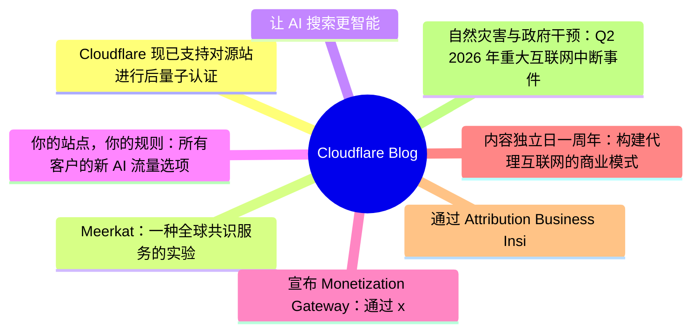
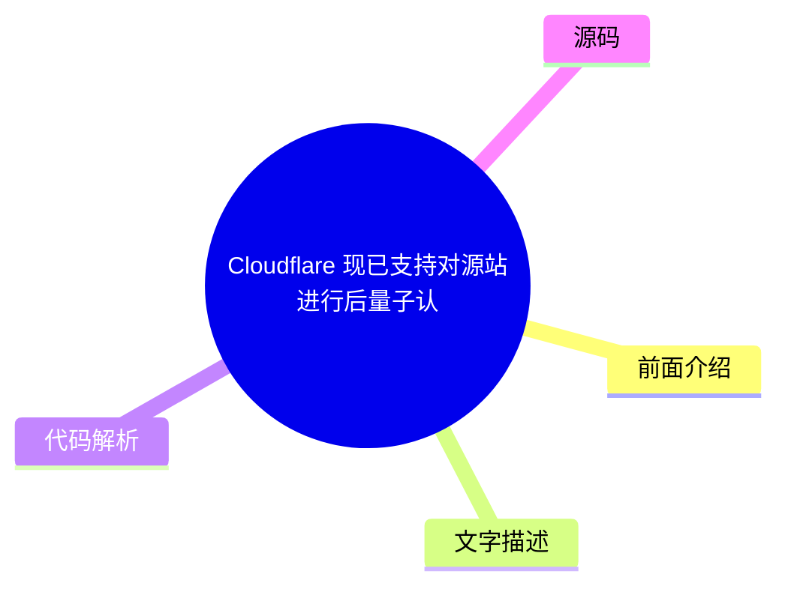
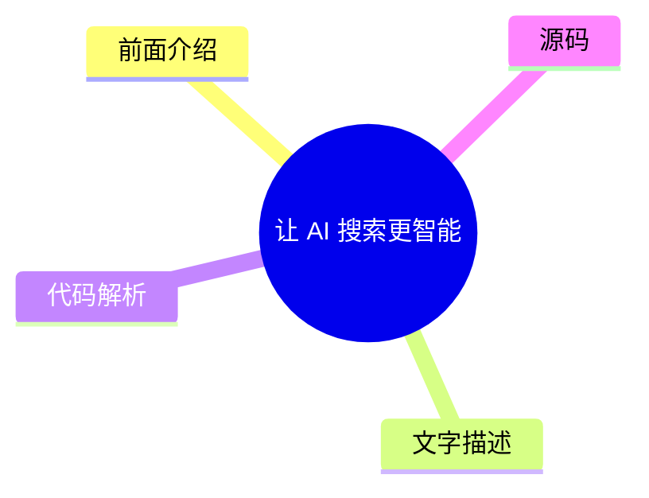
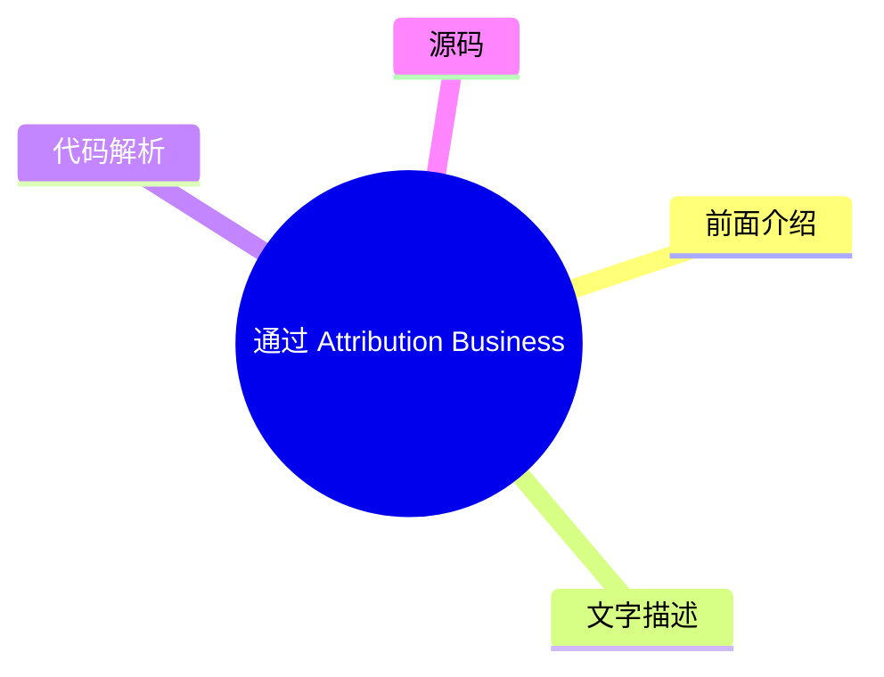

# ☁️ Cloudflare Blog Top 8 (2026-07-30)

## 前面介绍

- 数据源：Cloudflare Blog
- 抓取日期：2026-07-30
- 条目数：8
- 含完整正文：8
- 含代码片段：1
- 组织方式：前面介绍 / 树状图 / 文字描述 / 代码解析 / 源码

## 思维导图



## 详细整理（8 条，8 条含全文，1 条含代码）

### 1. Cloudflare 现已支持对源站进行后量子认证
- **链接**: [https://blog.cloudflare.com/post-quantum-authentication-to-origins/](https://blog.cloudflare.com/post-quantum-authentication-to-origins/)
- **作者**: Luke Valenta
- **发布**: Wed, 29 Jul 2026 13:00:00 GMT

#### 前面介绍

- 通过 Authenticated Origin Pulls 和 Custom Origin Trust Store 支持 ML-DSA 签名。
- 这是迈向全面后量子安全的第一步。
- 保护 Cloudflare 与客户源站之间的连接，防止未来量子计算机破解凭证。

#### 树状图



#### 文字描述

- Cloudflare 现在支持在通过 Authenticated Origin Pulls 和 Custom Origin Trust Store 连接到客户源服务器时使用后量子（PQ）认证。
- 为了保护连接，Cloudflare 使用 Module-Lattice-Based Digital Signature Algorithm (ML-DSA) 签名。
- 过去几年的重点是部署后量子加密以防御“现在收割，以后解密”的攻击。
- 随着量子计算和密码分析的突破，行业已将升级时间表提前，现在重点转向后量子认证。
- 对于访客到 Cloudflare 的连接，团队正在与 Google 和 IETF 合作开发 Merkle Tree Certificates (MTC)。
- 对于 Cloudflare 到源站的连接，由于 Cloudflare 是客户端且拥有预先存在的信任关系，可以使用更定制化的 PKI。

#### 代码解析

- 使用 ML-DSA 签名算法进行身份验证，确保连接双方的身份在量子计算环境下依然可信。
- 通过 Custom Origin Trust Store 集成后量子证书，实现“即插即用”的性能开销分摊。
- 利用连接池技术将全球网络的请求汇聚到较少的连接上，降低后量子签名带来的性能损耗。

#### 源码

#### 源码片段 1（text）

```text
# Create a private ML-DSA-44 CA for the origin server
openssl genpkey -algorithm mldsa44 \
  -provparam ml-dsa.output_formats=seed-only \
  -out origin-ca.key
openssl req -new -x509 -key origin-ca.key \
  -out origin-ca.crt -days 10950 \
  -subj "/CN=Origin Server CA"
# Create the origin server certificate (signed by the origin CA)
openssl genpkey -algorithm mldsa44 \
  -provparam ml-dsa.output_formats=seed-only \
  -out origin-server.key
openssl req -new -key origin-server.key \
  -out origin-server.csr \
  -subj "/CN=origin.example.com"
openssl x509 -req -in origin-server.csr \
  -CA origin-ca.crt -CAkey origin-ca.key -CAcreateserial \
  -out origin-server.crt -days 5475 \
  -extfile <(printf "basicConstraints=CA:FALSE\nkeyUsage=digitalSignature\nsubjectAltName=DNS:origin.example.com\n")
```

#### 源码片段 2（text）

```text
# Create a private ML-DSA-44 CA for Authenticated Origin Pulls
openssl genpkey -algorithm mldsa44 \
  -provparam ml-dsa.output_formats=seed-only \
  -out aop-ca.key
openssl req -new -x509 -key aop-ca.key \
  -out aop-ca.crt -days 10950 \
  -subj "/CN=Authenticated Origin Pull CA"
# Create the client certificate Cloudflare will present (signed by the AOP CA)
openssl genpkey -algorithm mldsa44 \
  -provparam ml-dsa.output_formats=seed-only \
  -out aop-client.key
openssl req -new -key aop-client.key \
  -out aop-client.csr \
  -subj "/CN=cloudflare-aop-client"
openssl x509 -req -in aop-client.csr \
  -CA aop-ca.crt -CAkey aop-ca.key -CAcreateserial \
  -out aop-client.crt -days 5475 \
  -extfile <(printf "basicConstraints=CA:FALSE\nkeyUsage=digitalSignature\n")
```

#### 完整正文（中文）

Cloudflare's Authenticated Origin Pulls and Custom Origin Trust Store now support post-quantum authentication.

Here weâll explain how you can configure fully post-quantum secure mutually authenticated TLS connections to your origin server, dive into the engineering details of how we built it, make a shameful confession, and finally explain how this work fits into our overall post-quantum migration roadmap.

## Reaching a major milestone

Our focus for the past several years has been in deploying post-quantum [ encryption](https://radar.cloudflare.com/post-quantum) to protect against 

[attacks, where an attacker quietly stockpiles your encrypted data with the hope of decrypting it in the future with a quantum computer.](https://en.wikipedia.org/wiki/Harvest_now,_decrypt_later)

__harvest-now/decrypt-later__However, recent breakthroughs in quantum computing and cryptanalysis pulled the timelines for upgrading to post-quantum cryptography forward __across__[ industry](https://blog.google/innovation-and-ai/technology/safety-security/cryptography-migration-timeline/) and 

[and have caused us to shift our attention to deploying post-quantum](https://blog.cloudflare.com/post-quantum-eo-2026/)

__government__*authentication*, to protect against attackers who will soon be able to use quantum computers to break classical credentials and carry out impersonation attacks.

In a previous post, we announced that Cloudflare is [ targeting 2029](https://blog.cloudflare.com/post-quantum-roadmap/#cloudflares-roadmap-to-full-post-quantum-security) for full post-quantum security, and laid out several milestones to hit along the way. We have reached the first of those milestones: our 

[and](https://developers.cloudflare.com/ssl/origin-configuration/authenticated-origin-pull/)

__Authenticated Origin Pulls__[products](https://developers.cloudflare.com/ssl/origin-configuration/custom-origin-trust-store/)

__Custom Origin Trust Store__[via Module-Lattice-Based Digital Signature Algorithm (ML-DSA) signatures to protect connections between Cloudflare and customer origin servers.Â](https://developers.cloudflare.com/changelog/post/2026-06-17-pqc-mldsa-aop-cots/)


__现在支持后量子 (PQ) 身份验证__## 源连接不同

当客户端访问由 Cloudflare 代理的网站时，通常涉及两个连接。第一个连接是从访客（例如浏览器）到 Cloudflare 的连接。如果请求可以从 Cloudflare 的缓存中提供，或者触发了任何阻止规则，Cloudflare 可能会直接响应。否则，Cloudflare 会建立第二个连接到客户源服务器以获取请求的内容，以便它可以响应原始请求。

保护敏感访客数据需要这两个连接都能抵御量子攻击。我们在 [2022](https://blog.cloudflare.com/post-quantum-for-all/) 年为访客到 Cloudflare (连接 1) 和 Cloudflare 到源 (连接 2) 连接启用了后量子加密支持，并且已经看到

[，

分别，并已经看到](https://blog.cloudflare.com/post-quantum-to-origins/)

__2023__[.](https://radar.cloudflare.com/post-quantum)

__显著使用__我们正在积极致力于通过后量子身份验证来完成这一工作。对于访客到 Cloudflare 的连接，我们正在与 [ Google](https://blog.google/security/cultivating-a-robust-and-efficient-quantum-safe-https/) 以及互联网工程任务组 (

[) 合作开发并](https://datatracker.ietf.org/wg/plants/about/)

__IETF__[使用 Merkle Tree Certificates](https://blog.cloudflare.com/bootstrap-mtc)

__实验__[，这是一种用于 Web 的快速后量子证书设计，初始部署目标为 2027 年。然而，本文的主题是 Cloudflare 到源连接，其中身份验证的要求与访客到 Cloudflare 连接的几个重要方面有所不同。](https://datatracker.ietf.org/doc/draft-ietf-plants-merkle-tree-certs/)

__(MTC)__For this connection, Cloudflare is the client. This gives us the control to employ techniques such as connection pooling to fan in requests from all over our network to a smaller set of connections to origin servers, amortizing the overhead of connection setup over many requests. This makes the cost of âdrop-inâ post-quantum signatures more palatable, and the performance benefits of MTC less necessary.

And with a pre-existing trust relationship between Cloudflare and customers (i.e., a Cloudflare account), we need not tie ourselves to the constraints and timelines of the public key infrastructure (PKI) for the public Internet ([ WebPKI](https://cabforum.org/working-groups/server/baseline-requirements/requirements/)) and can instead use custom PKIs tailored to the use case, without overhead from intermediate certificates and 

[that may not be applicable. Solutions like](https://datatracker.ietf.org/doc/html/rfc6962)

__Certificate Transparency__[can also be used to protect the Cloudflare-to-origin connection without upgrading legacy origin systems, by forwarding traffic over a tunnel secured with post-quantum encryption (and post-quantum authentication in the works).](https://developers.cloudflare.com/tunnel/)

__Cloudflare Tunnel__All this to say, the unique requirements of the Cloudflare-to-origin connection have allowed us to deploy post-quantum authentication via ML-DSA authentication ahead of support landing in the WebPKI for the public Internet. (For customers who stick with the WebPKI, donât worry: weâll add MTC support on the Cloudflare-to-origin connection in the future.)

So how do you turn this on? Letâs dive into the configuration.

## Configuring fully PQ-secure origin connections

We have added ML-DSA support (for all [ FIPS 204](https://csrc.nist.gov/pubs/fips/204/final) parameter sets: ML-DSA-44, ML-DSA-65, and ML-DSA-87) to the Custom Origin Trust Store and Authenticated Origin Pulls products. ML-DSA-44 is our recommendation for most applications as it is the most performant option and attains a comfortable NIST 

[security strength.](https://nvlpubs.nist.gov/nistpubs/FIPS/NIST.FIPS.204.pdf#page=25)


__category 2__### Custom Origin Trust Store

When Cloudflare makes a connection to a customer origin server configured with [ Full (strict)](https://developers.cloudflare.com/ssl/origin-configuration/ssl-modes/full-strict/) SSL mode, we authenticate the origin certificate against a default trust store consisting of all 

[Certificate Authorities (CAs) as well as Cloudflareâs](https://ccadb.org)

__commonly trusted__[. The](https://developers.cloudflare.com/ssl/origin-configuration/origin-ca/)

__origin CA__[product (which requires](https://developers.cloudflare.com/ssl/origin-configuration/custom-origin-trust-store/)

__Custom Origin Trust Store (COTS)__[to be enabled) allows customers to replace this default trust store with a set of CAs they control. COTS now allows customers to upload ML-DSA CAs, such that Cloudflare will trust any origin server certificate chaining to that CA when connecting to the origin.](https://developers.cloudflare.com/ssl/edge-certificates/advanced-certificate-manager/)

__Advanced Certificate Manager__### Authenticated Origin Pulls

To limit abuse and resource consumption on their origin servers, customers may want to only serve requests coming from Cloudflareâs servers. [ Authenticated Origin Pulls (AOP)](https://developers.cloudflare.com/ssl/origin-configuration/authenticated-origin-pull/) can be used to configure Cloudflare to present a client certificate to the origin server in order to establish a 

[connection, in which communication between the parties is bidirectionally secure and trusted. AOP is available for free on all Cloudflare plan levels.](https://www.cloudflare.com/learning/access-management/what-is-mutual-tls/)


__mutual TLS (mTLS)__AOP supports three [ configuration levels](https://developers.cloudflare.com/ssl/origin-configuration/authenticated-origin-pull/#configuration-levels): global, per-zone, and per-hostname. The per-zone and per-hostname configuration levels now allow customers to upload ML-DSA certificates and private keys (in the FIPS 204 seed format), so that Cloudflareâs TLS client will present this certificate to authenticate itself when connecting to the origin server. (Donât worry, we havenât forgotten about the global configuration level â it just happens to be a more involved change that will be prioritized at a later date.)

### Avoiding downgrades

Adding post-quantum encryption and authentication support to both the authenticating and verifying parties is necessary but *not* sufficient for full post-quantum security. The pesky issue of downgrades remains. If the verifying party supports any quantum-vulnerable authentication mechanisms, they remain open to attack from an [ on-path attacker](https://www.cloudflare.com/learning/security/threats/on-path-attack/) capable of forging classical credentials.

The fix: the verifying party must remove trust in quantum-vulnerable authentication mechanisms. (This is more nuanced in complex PKIs. For example, see the Chromium Security teamâs [ four-stage plan](https://www.chromium.org/Home/chromium-security/post-quantum-auth-roadmap/) for transitioning the Web.) See the 

[for AOP and COTS for details on how to ensure your origin is secure against downgrade attacks.](https://developers.cloudflare.com/ssl/post-quantum-cryptography/pqc-to-origin/#avoid-downgrades)

__configuration guide__### Quick start

The walkthrough below shows how to generate an ML-DSA certificate chain and configure both products via the Cloudflare API. For dashboard instructions and additional context, refer to the [ developer docs](https://developers.cloudflare.com/ssl/post-quantum-cryptography/pqc-to-origin/).

1. Generate certificates

You will need OpenSSL 3.5.0 or later. The private key must be generated in the FIPS 204 seed-only encoding, which is the only format Cloudflare currently accepts on upload.


**Origin server certificate chain for COTS:**

```
# Create a private ML-DSA-44 CA for the origin server
openssl genpkey -algorithm mldsa44 \
  -provparam ml-dsa.output_formats=seed-only \
  -out origin-ca.key
openssl req -new -x509 -key origin-ca.key \
  -out origin-ca.crt -days 10950 \
  -subj "/CN=Origin Server CA"
# Create the origin server certificate (signed by the origin CA)
openssl genpkey -algorithm mldsa44 \
  -provparam ml-dsa.output_formats=seed-only \
  -out origin-server.key
openssl req -new -key origin-server.key \
  -out origin-server.csr \
  -subj "/CN=origin.example.com"
openssl x509 -req -in origin-server.csr \
  -CA origin-ca.crt -CAkey origin-ca.key -CAcreateserial \
  -out origin-server.crt -days 5475 \
  -extfile <(printf "basicConstraints=CA:FALSE\nkeyUsage=digitalSignature\nsubjectAltName=DNS:origin.example.com\n")
```
**Cloudflare client certificate chain for AOP:**

```
# Create a private ML-DSA-44 CA for Authenticated Origin Pulls
openssl genpkey -algorithm mldsa44 \
  -provparam ml-dsa.output_formats=seed-only \
  -out aop-ca.key
openssl req -new -x509 -key aop-ca.key \
  -out aop-ca.crt -days 10950 \
  -subj "/CN=Authenticated Origin Pull CA"
# Create the client certificate Cloudflare will present (signed by the AOP CA)
openssl genpkey -algorithm mldsa44 \
  -provparam ml-dsa.output_formats=seed-only \
  -out aop-client.key
openssl req -new -key aop-client.key \
  -out aop-client.csr \
  -subj "/CN=cloudflare-aop-client"
openssl x509 -req -in aop-client.csr \
  -CA aop-ca.crt -CAkey aop-ca.key -CAcreateserial \
  -out aop-client.crt -days 5475 \
  -extfile <(printf "basicConstraints=CA:FALSE\nkeyUsage=digitalSignature\n")
```
2. Upload the origin CA to Custom Origin Trust Store

```
CA_CERT=$(jq -Rs . < origin-ca.crt)
curl "https://api.cloudflare.com/client/v4/zones/$ZONE_ID/acm/custom_trust_store" \
  --header "Authorization: Bearer $CLOUDFLARE_API_TOKEN" \
  --header "Cont

...（截断，原文 22450+ 字符）


### 2. Meerkat：一种全球共识服务的实验
- **链接**: [https://blog.cloudflare.com/meerkat-introduction/](https://blog.cloudflare.com/meerkat-introduction/)
- **作者**: James Larisch
- **发布**: Wed, 08 Jul 2026 12:00:00 GMT

#### 前面介绍

- Cloudflare 研究团队构建了名为 Meerkat 的全球共识服务。
- 基于 QuePaxa 算法，所有副本均可随时写入，无需等待领导者。
- 旨在构建强一致、容错的键值存储及其他应用。

#### 树状图


#### 文字描述

- Cloudflare Research 正在构建一个名为 Meerkat 的全球共识服务，使用 QuePaxa 算法。
- QuePaxa 与传统的 Raft 算法不同，所有副本都可以随时执行写入操作，且进度不会因超时而停止。
- 这使得 Meerkat 非常适合 Cloudflare 这种具有不可预测延迟的广域网环境。
- Meerkat 目前仍处于开发阶段，最初仅用于管理控制平面状态（如数据库领导权）。
- 控制平面数据需要强一致性和在特定故障下的可访问性。
- Meerkat 的共识日志之上可以构建事务性键值存储和租赁系统等应用。

#### 代码解析

- 本文未提供源码，以下为实现思路或结构解析
- QuePaxa 算法设计允许所有节点同时处理写入，避免了传统共识算法中因领导者故障导致的系统不可用。
- Meerkat 利用共识日志来同步数据，确保在大多数节点存活且可通信的情况下，所有副本能达成一致。

#### 源码

#### 中文节选

Many internal services at Cloudflare need to read and modify the same control-plane state from across our 330+ global data centers. They need guarantees that different readers *never *see inconsistent state, and that the system remains available for writes even when some data centers or links fail.

But Cloudflareâs network runs across the entire Internet, and the Internet is an unpredictable place. Servers and data centers go down. Queues fill up. Links and cables get cut. These conditions make it difficult to run a globally available data system that guarantees strong consistency (e.g., that all readers are guaranteed to read all prior writes) because hostile conditions hinder distributed system replicasâ ability to reliably synchronize data with one another.

One way to synchronize data safely despite adverse network conditions is via a *consensus algorithm, *which* *allows a set of machines to agree on the same sequence of values, such as key-value store put and `get` operations, as long as a majority remains alive and able to communicate. 

Unfortunately, commonly deployed consensus algorithms like [ Raft](https://raft.github.io/) suffer in wide-area networks like Cloudflareâs because they rely on 

*leaders*and

*timeouts*. The

*leader*is the only replica allowed to make writes, and if it fails due to a crash or network degradation, the system becomes unavailable until some other replica

*times out*and a new leader is elected. And these timeout values are hard to configure in networks with unpredictable latencies.

We have experienced multiple incidents caused by unavailable leaders in consensus-driven systems.

And so, for the past year, Cloudflareâs Research [ team](https://research.cloudflare.com/) has been building a new distributed consensus service called 

**Meerkat**powered by a consensus algorithm called

[, published in 2023 by Tennage & BÄsescu et al. QuePaxa differs from Raft in that all replicas can perform writes at all times, and progress is never halted due to a timeout, which makes it well suited for Cloudflareâs network. We layer](https://bford.info/pub/os/quepaxa/quepaxa.pdf)


__QuePaxa__*应用程序*，例如事务型键值存储和租赁系统，构建在 Meerkat 的共识日志之上。据我们所知，这将是 QuePaxa 首次在全球范围内进行工业级部署。

Meerkat 是一个仍在开发中的实验性共识服务。它最初被设计用于管理少量的控制平面状态（例如复制数据库的领导权），因此，在可预见的未来，它将仅限内部使用。本文介绍了 Meerkat，并为即将发布的与 Meerkat 相关的博客文章奠定了基础。

## 我们对全球控制平面数据系统的需求

许多 Cloudflare 服务会从分布在世界各地的多台机器上读取和写入 *控制平面数据*，这些数据有助于这些服务正确运行。控制平面数据的一个例子是 *放置信息*：cer

#### 完整正文（中文）

Many internal services at Cloudflare need to read and modify the same control-plane state from across our 330+ global data centers. They need guarantees that different readers *never *see inconsistent state, and that the system remains available for writes even when some data centers or links fail.

But Cloudflareâs network runs across the entire Internet, and the Internet is an unpredictable place. Servers and data centers go down. Queues fill up. Links and cables get cut. These conditions make it difficult to run a globally available data system that guarantees strong consistency (e.g., that all readers are guaranteed to read all prior writes) because hostile conditions hinder distributed system replicasâ ability to reliably synchronize data with one another.

One way to synchronize data safely despite adverse network conditions is via a *consensus algorithm, *which* *allows a set of machines to agree on the same sequence of values, such as key-value store put and `get` operations, as long as a majority remains alive and able to communicate. 

Unfortunately, commonly deployed consensus algorithms like [ Raft](https://raft.github.io/) suffer in wide-area networks like Cloudflareâs because they rely on 

*leaders*and

*timeouts*. The

*leader*is the only replica allowed to make writes, and if it fails due to a crash or network degradation, the system becomes unavailable until some other replica

*times out*and a new leader is elected. And these timeout values are hard to configure in networks with unpredictable latencies.

We have experienced multiple incidents caused by unavailable leaders in consensus-driven systems.

And so, for the past year, Cloudflareâs Research [ team](https://research.cloudflare.com/) has been building a new distributed consensus service called 

**Meerkat**powered by a consensus algorithm called

[, published in 2023 by Tennage & BÄsescu et al. QuePaxa differs from Raft in that all replicas can perform writes at all times, and progress is never halted due to a timeout, which makes it well suited for Cloudflareâs network. We layer](https://bford.info/pub/os/quepaxa/quepaxa.pdf)


__QuePaxa__*applications*, like a transactional key-value store and leasing system, atop Meerkatâs consensus log. To our knowledge, this will be the first industrial deployment of QuePaxa at global scale.

Meerkat is an experimental consensus service that is still in development. Itâs being designed initially to manage small pieces of control plane state (e.g., leadership for replicated databases) and so it will be kept internal-only for the immediate future. This post introduces Meerkat and lays the groundwork for the Meerkat-related blog posts to come.Â

## What we need from a global control-plane data system

Many Cloudflare services read and write *control-plane data*, data that helps those services operate correctly, from multiple machines distributed all over the world. One example of control-plane data is *placement information*: where certain resources (like an AI model instance) are stored. Another example is *leadership information*: which machine is currently allowed to perform writes to a database. 

Control-plane data must be both *strongly* *consistent* and* accessible despite particular kinds of faults.*

In this section we precisely describe our consistency and fault tolerance requirements for a Cloudflare consensus service. We use a key-value store for a running example of an application running atop our consensus service, though other applications (e.g., distributed leases/locks) are possible.

### Strong consistency

A distributed data systemâs [ consistency](https://jepsen.io/consistency/models) level describes what kinds of weird behavior the system is allowed to exhibit when it receives concurrent reads and writes. Consider a distributed key-value store that stores a single numeric value 

`x = 6` across multiple nodes. Also consider the following sequence of writes. These writes are submitted to different nodes on a best-effort basis, and could arrive in any order: - `x = x + 1`
- `x = x / 2`

A systemâs consistency level tells you what values of `x` a client might see when reading `x` after these writes. Consider the following sequence of operations and the possible execution orders under different consistency levels:


In a weak consistency level, writes can be re-ordered. In a stronger consistency model, writes canât be reordered, but reads can. In the strongest possible consistency level, the operations are ordered exactly as they occurred in real time. This property is called *linearizability*.

At Cloudflare, many services want linearizability. Unlike weaker forms of consistency, linearizability relieves programmers from thinking about all the weird behaviors the data systems might exhibit. Instead, they can reason about the distributed system like they reason about local memory on a single-threaded machine: all reads after a write will see that write. For additional reading material on the dangers of weak consistency, check out this [ post](https://brooker.co.za/blog/2025/11/18/consistency.html) by Marc Brooker.

(If youâre wondering, Meerkatâs key-value store also provides serializability, which weâll write about in a future post.)

### Fault tolerance

A systemâs level of fault tolerance describes what kinds of faults the system can handle before catastrophes happen. Catastrophes are typically violations of properties the system aims to uphold, e.g., that two consecutive reads without an intervening write for the same key never see different values, or that the system remains available for writes. The faults include network failures or delays, machine crashes, and machine restarts. A system will typically explicitly handle some faults but not others (you canât handle all faults, as the universe could always reach heat-death). For example, some key-value stores might guarantee to remain available for writes as long as two-thirds of the machines in the system can communicate and donât crash, but make no promises if a machine is compromised and starts sending malicious messages.

Our desired fault tolerance properties are as follows:

**First**, the data system should remain available for writes and reads from a client located in any of our data centers as long as the following are true:

- A majority of the machines in our system are alive and can communicate with one another. (Formally, we tolerate `f`faults in a system of`2f + 1`machines).

- 客户端可以联系系统中的*任何*一台连接了大多数存活机器的机器。

这意味着，单台机器故障或单条链路的网络降级都不会影响系统的可用性*。*正如我们稍后将看到的，Raft 系统并不提供此属性。

**其次**，只要系统中没有参与者主动作恶（当然，也没有 bug），数据系统就会保持*正确*。我们将在后面从共识*安全性*的角度定义*正确性*，但通俗地说，这意味着任何两台最新的机器都不会对世界产生分歧（例如，一台认为 `key1=1`，而另一台认为 `key1=2`）。

总之，即使机器崩溃、机器重启、网络故障或降级、数据中心宕机等，系统也必须保持正确（尽管我们和基于 Raft 的系统一样，不处理 [拜占庭故障](https://en.wikipedia.org/wiki/Byzantine_fault)）。

## 介绍 Meerkat

Meerkat 是一个共识服务，我们可以在其上构建具有上述属性（强一致性和容错性）的应用程序，例如键值（KV）存储。为了理解 Meerkat 的工作原理，我们首先概述 Meerkat 的总体架构，然后描述 Meerkat 对共识算法的选择如何提供强一致性和容错性。

使用 Meerkat 的服务开发人员会请求一组 Meerkat *副本*。每个副本都连接到其他每个副本。每个副本都参与共识算法，并且可以接收读写请求。开发人员可以指定允许在其副本上托管的数据中心，Meerkat 会自动放置它们。

为了与集群交互，开发人员的客户端会向集群中的任意一个副本发送特定于应用程序的请求。单个副本可能托管多种类型的应用程序，但最简单的是键值存储，因此最简单的特定于应用程序的请求类型是 KV `get` 或 `put`。副本会使用特定于应用程序的响应来响应请求（例如，通过 `get` 请求的记录）。请注意，KV 读取（`get`）保证读取到最新的信息。

### Meerkat 的日志

在底层，副本将应用程序请求（例如 `get` 和 `put`）转换为 *日志事件*。该副本使用共识算法将每个日志事件分发给所有其他副本，以确保所有副本维护完全相同的事件日志（实际上，副本可能会落后，但绝不会记录不同的条目）。这些事件是任意的——Meerkat 的核心并不关心它们的内容。Meerkat 的 *应用程序* 关心的是日志事件的内容。每个 Meerkat 副本“托管”许多 Meerkat 应用程序（例如键值存储），这些应用程序读取日志事件并构建状态。（注意，每个副本恰好属于一个集群。）

例如，KV Meerkat 应用程序从日志事件中构建一个内存键值存储。因此，当客户端发送像 `put k1 v1` 这样的写入时，接收副本将该写入放入一个日志事件中并将其分发给所有副本。如果其他人随后在不同的副本上写入 `put k1 v11`，该事件也会被分发给所有副本。由于所有正常运行的副本拥有相同的日志，这些副本可以按顺序应用日志中的操作，以构建完全相同的状态。注意，`get` 请求也会创建分布式日志事件（为了线性一致性，如下一节所述）。

以下是副本的 KV 存储在接收日志事件时如何更新的示例：

### Meerkat 的日志如何实现强一致性

Meerkat 保证，如果一个客户端执行 `put k1 v1`，第二个客户端随后执行 `put k1 v11`，第三个客户端随后执行 `get k1`（进行一致读取），他们将始终读取 `v11`。即使每个请求被提交到不同的副本，且这些副本随机分布在世界各地，Meerkat 也能保证这一点。这就是线性一致性。为了了解 Meerkat 如何保证这一点，我们必须更详细地检查 Meerkat 的日志。

The Meerkat log is a sequence of slots. A slot is a box that can contain an event or not. A slot that contains an event is called a *decided *slot. All slots in the log are decided except the last slot, which is currently being decided. One of Meerkatâs invariants is that if any two replicas decide on the value for a slot, those values are the same. In other words, no two replicas will ever disagree on the value of a decided slot (though one replica may think the last slot is empty while another does not). This property helps guarantee the desired properties we described in the previous section.

To decide on the value of the last (empty) slot in the log, Meerkat replicas run a distributed *consensus algorithm*. A consensus algorithm allows a set of machines communicating over a network to agree on a decided slot value. Our consensus algorithm works as long as a majority of replicas (more than half) are alive.

So if the log currently contains two entries, and a client submits `put k1 v11` to a replica, that replica triggers a consensus algorithm for slot 3. But another client might have submitted `put k1 v111` to a different replica for slot 3. The consensus algorithm ensures that only one such *proposal* for slot 3 wins out. Specifically, it ensures that at least a majority of replicas agree on the same proposal, *deciding *it for slot 3. The non-majority can *never* decide a different proposal, but might miss the fact 

...（截断，原文 20546+ 字符）


### 3. 让 AI 搜索更智能
- **链接**: [https://blog.cloudflare.com/making-ai-search-smarter/](https://blog.cloudflare.com/making-ai-search-smarter/)
- **作者**: Matthew Conroy
- **发布**: Wed, 01 Jul 2026 13:00:00 GMT

#### 前面介绍

- 利用全球网络信号，帮助搜索引擎发现最相关的内容。
- 减少不必要的爬取，降低 AI 公司和网站所有者的成本。
- 通过新的经济模型，让创作者在使用其内容时获得报酬。

#### 树状图



#### 文字描述

- AI 搜索正在改变互联网的发现机制，创作者面临难以在代理时代保持可发现性同时获得报酬的困境。
- 超过 50% 的在线流量是非人类的，AI 摘要导致用户点击传统搜索结果链接的概率大幅下降。
- Cloudflare 推出研究计划，利用全球网络视角识别哪些页面真正发生了变化，哪些是 AI 机器人聚集的地方。
- 通过结合客户共享的内容新鲜度信号和流量流数据，探索如何帮助搜索引擎展示更高质量的内容。
- 该计划旨在测量这些信号如何帮助搜索引擎发现更新鲜的内容，以及如何减少不必要的爬取。
- 减少不必要的爬取是更大的收益，因为大量爬取流量用于重新获取未变化的页面。

#### 代码解析

- 本文未提供源码，以下为实现思路或结构解析
- 系统通过分析流量模式，区分人类用户和机器人，从而优化爬取策略。
- 利用内容新鲜度信号，仅在页面实际变更时触发重新爬取，从而节省带宽和计算资源。

#### 源码

#### 中文节选

Search drives most experiences on the web. It's how we get things done, and how nearly everything on the web gets found â the creators, the merchants, the answer to whatever you just typed into a box. For nearly 30 years, that discovery journey ran on a simple bargain: let a search engine crawl your content, and it sends you visitors. You turned those visitors into a business â through ads, subscriptions, or just the audience itself. Being discoverable and getting paid were the same thing. A year ago, on the [ first Content Independence Day](https://blog.cloudflare.com/content-independence-day-no-ai-crawl-without-compensation/), we drew a line to defend that bargain in the AI era. But a line in the sand was only a first step. Since then, the prevalence of AI search in consumersâ lives has only accelerated as 

[. The threat is no longer a handful of training crawlers you can block; it's search itself being rebuilt around AI answers.](https://radar.cloudflare.com/)

__more than 50% of traffic online is non-human__Today's answer engines read your page and hand the user a summary, so the visit â and the revenue that depended on it â isnât needed. We see it firsthand, and independent research backs it up: a [ 2025 Pew Research Center study](https://www.pewresearch.org/short-reads/2025/07/22/google-users-are-less-likely-to-click-on-links-when-an-ai-summary-appears-in-the-results/) found that when Google shows an AI summary, users clicked on a traditional search result link just 8% of the time (about half as often as when there's no summary) and clicked a link inside the summary only 1% of the time. That leaves our customers in a bind: opt out of AI and be hard to find, or opt in and deliver significant value to users while seeing increasingly little in return. Our customers want to be found and compensated for the value they provide, and right now they're forced to choose.


Today, [ weâve announced new bot options](http://blog.cloudflare.com/content-independence-day-ai-options) to help our customers better control who can access their site and what they can do with it. But blocking was only step one: saying "no" protects content without rebuilding the business models that sustain it. So, itâs time to start building the new economic model of the Internet, starting with search.

### Rebuilding the bargain

Transparency and control are the foundation, but more is needed. In 2025, we laid out our foundation via a set of [ responsible AI bot principles](https://blog.cloudflare.com/building-a-better-internet-with-responsible-ai-bot-principles/): bots should be transparent about who they are and what they're for, respect site owners' choices, and act in good faith. Our tools hold bots to that bar. But enforcing good bot behavior doesn't make AI search any better for the people relying on it, and it doesn't send a dollar back to the creator whose work made the answer possible. We can do more than help the web say "no"; we can help rebuild what it says "yes" t

#### 完整正文（中文）

Search drives most experiences on the web. It's how we get things done, and how nearly everything on the web gets found â the creators, the merchants, the answer to whatever you just typed into a box. For nearly 30 years, that discovery journey ran on a simple bargain: let a search engine crawl your content, and it sends you visitors. You turned those visitors into a business â through ads, subscriptions, or just the audience itself. Being discoverable and getting paid were the same thing. A year ago, on the [ first Content Independence Day](https://blog.cloudflare.com/content-independence-day-no-ai-crawl-without-compensation/), we drew a line to defend that bargain in the AI era. But a line in the sand was only a first step. Since then, the prevalence of AI search in consumersâ lives has only accelerated as 

[. The threat is no longer a handful of training crawlers you can block; it's search itself being rebuilt around AI answers.](https://radar.cloudflare.com/)

__more than 50% of traffic online is non-human__Today's answer engines read your page and hand the user a summary, so the visit â and the revenue that depended on it â isnât needed. We see it firsthand, and independent research backs it up: a [ 2025 Pew Research Center study](https://www.pewresearch.org/short-reads/2025/07/22/google-users-are-less-likely-to-click-on-links-when-an-ai-summary-appears-in-the-results/) found that when Google shows an AI summary, users clicked on a traditional search result link just 8% of the time (about half as often as when there's no summary) and clicked a link inside the summary only 1% of the time. That leaves our customers in a bind: opt out of AI and be hard to find, or opt in and deliver significant value to users while seeing increasingly little in return. Our customers want to be found and compensated for the value they provide, and right now they're forced to choose.


Today, [ weâve announced new bot options](http://blog.cloudflare.com/content-independence-day-ai-options) to help our customers better control who can access their site and what they can do with it. But blocking was only step one: saying "no" protects content without rebuilding the business models that sustain it. So, itâs time to start building the new economic model of the Internet, starting with search.

### Rebuilding the bargain

Transparency and control are the foundation, but more is needed. In 2025, we laid out our foundation via a set of [ responsible AI bot principles](https://blog.cloudflare.com/building-a-better-internet-with-responsible-ai-bot-principles/): bots should be transparent about who they are and what they're for, respect site owners' choices, and act in good faith. Our tools hold bots to that bar. But enforcing good bot behavior doesn't make AI search any better for the people relying on it, and it doesn't send a dollar back to the creator whose work made the answer possible. We can do more than help the web say "no"; we can help rebuild what it says "yes" to.

So today, we're announcing two initiatives that move from defense to offense and start putting both halves of that old bargain back together.

**Make AI search smarter: **By** **using the signals we see across our global network, like what's fresh, what's high quality, and what's actually changed, we can help answer engines surface the most relevant content and reduce unwanted crawling. People searching get better answers, while costs are reduced for both AI companies and site owners if webpages are only recrawled when theyâve changed.

**Pay creators for the value they provide:** When your work is used to answer someone's question, you should be rewarded instead of just being scraped for free. And you should be able to see what's being used and what people are asking. This should be a real revenue stream, and an incentive to keep producing original content worth finding.

### Making search smarter

Today we're launching a research program to make AI search smarter and stop our customers footing the bill for crawls that produce nothing new.


More than 20% of the web sits behind Cloudflareâs network, which gives us a unique perspective. We can tell which pages have genuinely changed and which ones people and agents are flocking to. Through this program, we will explore using signals our customers have chosen to share about the freshness of their content, and we will combine those with our own insight into traffic flows, both human and bot. For answer engines, that's a roadmap to high-quality content. For our customers, it provides a view of what users are actually asking, and how their content shows up in AI results. The aim is to measure two things: how much these signals help answer engines to surface fresher, higher-quality content, and how much unnecessary crawling they cut out.

That second benefit, cutting unnecessary crawling, is bigger than it sounds. Cloudflare data suggests that more than 50% of crawl traffic from good bots goes to re-fetching pages that haven't changed â and that number is likely to climb as crawl volumes do. A signal that just says "nothing's changed here" lets a crawler skip the trip. That saves the answer engine compute. More importantly, it saves site owners from serving and paying for requests they never needed to.Â

The program is neutral by design: our goal is to make it work for every answer engine willing to play fair. It's limited to search. We aren't sharing any content, and nothing is used to train foundation models. We intend to publish what we learn, including the benefits to site owners such as better content discoverability and reduced server strain. We plan to make the capability broadly available later this year and reduce unnecessary crawling across our network.

### From Pay Per Crawl to Pay Per Use

Last year we [ launched Pay Per Crawl ](https://blog.cloudflare.com/introducing-pay-per-crawl/)so publishers could charge AI companies for crawling their content. It was a real start, but crawling is a crude measure of value. A single page might be crawled once and then cited in thousands of answers, or crawled over and over and never used at all. Creators want to be paid fairly for the value they provide.


因此，我们正在将 Pay Per Crawl 转型为 Pay Per Use。我们正在与顶级 AI 公司（如 [ Ceramic.ai](http://ceramic.ai) 和 

[, 以及这种安排非常直接：组织可以自带支付模式，并轻松将其扩展到 Cloudflare 网络上的内容所有者身上。](http://you.com)

__You.com__Ceramic 构建了一种所谓的“按查询付费”模式，因此选择加入的出版商可以在其内容出现在 Ceramic 搜索结果时获得报酬。这意味着支付设计遵循工作所提供的价值，而不是爬虫恰好抓取它的次数。

“为了扩展 AI 搜索的未来，我们需要一个拥有巨大覆盖范围且对透明度和公平补偿有着共同承诺的合作伙伴，”Ceramic.ai 创始人兼首席执行官 Anna Patterson 表示，“Cloudflare 让我们能够轻松且通过编程的方式扩展我们的运营。通过将我们的按查询付费模式带到他们的网络中，我们确保数百万内容所有者可以无缝加入，每次其内容出现在我们的搜索结果中时都能获得补偿。”

除了补偿之外，参与 Cloudflare/Ceramic 计划的内容所有者还将解锁新的报告功能，以帮助进行答案引擎优化（AEO）。客户终于可以看到导致其内容出现在搜索结果中的热门查询、具体的网页和片段、其平均搜索结果排名位置等。这是我们即将推出的众多帮助客户提高可发现性的产品中的第一个。

这只是众多新兴方法之一。另一种来自 You.com：代理可以按需为特定的高价值内容付费，而无需任何前期承诺。AI 提供商正在测试新的支付模式（例如按查询付费、按结果付费等），而我们拥有支持所有这些模式的基础设施。

We want to be honest that this is an experiment. Thereâs a lot to learn, including exactly how this holds up at the scale of the Internet. We'll work that out with our partners and our customers as we go, and share what we learn. But the goal is clear: AI search companies get fresher, better-grounded answers, and the customers whose work makes the answers possible get paid when they help. Cloudflare's job in all of this is to provide the infrastructure layer that makes this market flourish.Â

We think this is a more natural fit for where the economics of search are heading. The old, human web optimized search to save time â providing excerpts, ten blue links, and a click. The agentic Internet is different: an agent can read fast and search continuously. Search is becoming something an agent does dozens of times to answer a single question, closer to a utility than a destination. In that world, the unit that matters isn't the crawl or the click. It's the outcome. Pricing the outcome, and paying the people who made it possible, is how the web continues to thrive.

### The headline we want to earn

A year ago on Content Independence Day, the headline was a default ânoâ: AI canât crawl without compensation. This year, our focus is on giving our users more products and controls to say âyesâ and bring more benefits with it.

Today's announcements are just the beginning. Cloudflareâs research project is designed to see if our signals produce better results with less crawling. Pay Per Use is a promising direction weâll experiment with alongside partners who believe that content creators deserve fair compensation for their work. This is how the last 30 years of the web got built too: somebody runs the pilot that turns "the model is broken" into "here's the new model," one experiment at a time. We believe thereâs value to our customers to be discoverable in this new agentic era, and to optimize their content for maximum discovery. But they should be able to do this without giving away their most valuable creative assets for free.


互联网正在发生变化，支撑它的商业模式也随之改变。旧的互联网是开放、中立且值得贡献的。我们有机会保持这种状态，并为未来的互联网构建资助模式。为人类和智能体提供更智能的答案。为那些凭借技能、创造力和奉献精神让答案变得有价值的人们提供公平的交易。这就是我们追求 Cloudflare 使命的方式：帮助构建一个更好的互联网。

祝内容独立日快乐！

* 建立在开放、面向智能体的互联网之上？如果您想了解更多关于 Ceramic 和 You 计划的信息，请填写 __此表单__。如果您正在构建答案引擎并希望进行更智能的抓取，我们也非常乐意听到您的声音：aeo@cloudflare.com。


### 4. 你的站点，你的规则：所有客户的新 AI 流量选项
- **链接**: [https://blog.cloudflare.com/content-independence-day-ai-options/](https://blog.cloudflare.com/content-independence-day-ai-options/)
- **作者**: Jin-Hee Lee
- **发布**: Wed, 01 Jul 2026 13:00:00 GMT

#### 前面介绍

- 提供更精细的选项来管理 AI 流量，不再是一刀切的拦截。
- 区分 Search、Agent 和 Training 三种类型的机器人。
- 鼓励机器人运营商将单一爬虫拆分为具有不同目的的独立爬虫。

#### 树状图


#### 文字描述

- 在第一届内容独立日一年后，Cloudflare 为网站所有者提供了更细致的 AI 流量管理选项。
- 新的分类方法不再仅仅定义机器人是否为“AI”，而是关注它们在站点上的行为、存储和内容共享方式。
- 将 AI 用例分为三类：Search（索引内容以回答问题）、Agent（自动化交互）和 Training（训练模型）。
- Search 和 Training 的关键区别在于数据是用于构建数据库还是永久吸收到 AI 架构中。
- Cloudflare 建议公司将单一爬虫拆分为三个独立的爬虫，以提高透明度。
- 这种分类系统旨在更好地代表当前机器人流量的演变，并支持多用途机器人的追踪。

#### 代码解析

- 本文未提供源码，以下为实现思路或结构解析
- 通过分析请求头和访问模式，自动识别并分类不同类型的 AI 机器人。
- 提供预设选项，允许用户针对不同类型的机器人设置不同的访问权限和策略。

#### 源码

#### 中文节选

One year ago, we declared the first [ Content Independence Day](https://blog.cloudflare.com/content-independence-day-no-ai-crawl-without-compensation/), and we gave website owners the means to take back control of their content. The deal between crawlers and website owners that had held up for 30 years â we crawl you, and you get referrals â was no longer true. AI was taking everything and sending back nothing, presenting an existential threat to website owners. And so we launched a one-click "Block AI Bots" option, along with a 

[.](https://blog.cloudflare.com/introducing-pay-per-crawl/)

__Pay-Per-Crawl marketplace__A lot has changed in a year. Last July, conversations around âAI botsâ centered around blocking AI training without compensation, pointing to the winâlose deal where content was used for model training with no value driven back to the website owner. But a desire for more nuance has emerged: Content owners still want to be able to protect their content, and they should be compensated for the original content that they work hard to create, curate, and share. We also know that locking down content isnât a one-size-fits-all solution; website owners want more options than resorting to âblock all automation, every time.â

If you run a small site, the problem isnât *just* that someone could train models on your content â it's that nobody can find you in the first place. So you have to make a Faustian bargain: either show up in search and let AI train on you, or risk losing discoverability. This unfairly advantages incumbent search providers if they use the same bots for both search and training; and this unfair advantage incentivizes new players to be evasive as they try to close the competitive gap.

### Now, AI can be anything

Today, AI can be in anything. Google search has changed from being sorted by AI to being a [ full answer engine](https://blog.google/products-and-platforms/products/search/search-io-2026/) that answers your question directly on the results page. And Google is not unique in this position â this is the direction in which âsearchâ is moving.


We could debate the cutoff for what qualifies as âAIâ today, just to find that the standard changes tomorrow. So, instead of defining a bot primarily as âAIâ or not, our updated approach to classification will ask deeper questions about bot or agent behavior: What are they doing on my site? What are they storing? And how will they reshare my content?

### A pragmatic taxonomy

To address these questions, we need a more nuanced view â a pragmatic taxonomy that aligns with the AI use cases our customers care about. So we are opening the discussion beyond AI training alone and focusing on three AI use cases that we want all customers to be able to manage:

- **Search:**any behavior that collects or indexes your content, so it can answer questions about it later. The key is that Search is proactively building a database of your site to later respond to queries with. Site owners sho

#### 完整正文（中文）

One year ago, we declared the first [ Content Independence Day](https://blog.cloudflare.com/content-independence-day-no-ai-crawl-without-compensation/), and we gave website owners the means to take back control of their content. The deal between crawlers and website owners that had held up for 30 years â we crawl you, and you get referrals â was no longer true. AI was taking everything and sending back nothing, presenting an existential threat to website owners. And so we launched a one-click "Block AI Bots" option, along with a 

[.](https://blog.cloudflare.com/introducing-pay-per-crawl/)

__Pay-Per-Crawl marketplace__A lot has changed in a year. Last July, conversations around âAI botsâ centered around blocking AI training without compensation, pointing to the winâlose deal where content was used for model training with no value driven back to the website owner. But a desire for more nuance has emerged: Content owners still want to be able to protect their content, and they should be compensated for the original content that they work hard to create, curate, and share. We also know that locking down content isnât a one-size-fits-all solution; website owners want more options than resorting to âblock all automation, every time.â

If you run a small site, the problem isnât *just* that someone could train models on your content â it's that nobody can find you in the first place. So you have to make a Faustian bargain: either show up in search and let AI train on you, or risk losing discoverability. This unfairly advantages incumbent search providers if they use the same bots for both search and training; and this unfair advantage incentivizes new players to be evasive as they try to close the competitive gap.

### Now, AI can be anything

Today, AI can be in anything. Google search has changed from being sorted by AI to being a [ full answer engine](https://blog.google/products-and-platforms/products/search/search-io-2026/) that answers your question directly on the results page. And Google is not unique in this position â this is the direction in which âsearchâ is moving.


We could debate the cutoff for what qualifies as âAIâ today, just to find that the standard changes tomorrow. So, instead of defining a bot primarily as âAIâ or not, our updated approach to classification will ask deeper questions about bot or agent behavior: What are they doing on my site? What are they storing? And how will they reshare my content?

### A pragmatic taxonomy

To address these questions, we need a more nuanced view â a pragmatic taxonomy that aligns with the AI use cases our customers care about. So we are opening the discussion beyond AI training alone and focusing on three AI use cases that we want all customers to be able to manage:

- **Search:**any behavior that collects or indexes your content, so it can answer questions about it later. The key is that Search is proactively building a database of your site to later respond to queries with. Site owners should expect to get referral traffic or other equitable compensation as a result.
- **Agent:**automated- **Training**: a crawler taking your content to train or fine-tune a model. The key is that your data is permanently absorbed into the underlying architecture of the AI to improve its capabilities.

Many popular crawlers on the web fall into one of the classifications above; some fall into multiple. We classify plenty of other behaviors beyond the three above â including ads verification, feed fetching, and agentic transactions (more on this below). But we believe it should be simple for all website owners to manage access for these three AI-centered use cases. We believe that bot operators should separate their crawlers because that creates more transparency for website owners: allowing them to better understand why a given crawler is visiting them, as well as to better manage the access they extend to that crawler. If a company runs automation that builds **Search** indexes, acts as an **Agent**, and collects data to **Train** their models, then we strongly encourage that company to separate the automation into three separate crawlers.


We want a classification system that is scalable and representative of the world of automated traffic as it evolves. Tracking a botâs purposes is nothing new, but our new taxonomy involves a few updates that better represent the state of bot traffic today. Most notably, we want to recognize that bots that have multiple purposes should be tracked with all purposes, not just one of them.

### New options to manage AI traffic

**We want to provide more options for managing different kinds of AI traffic, to  all website owners on the Cloudflare network.**

The managed preset to âBlock AI botsâ that weâve announced in the past included single-purpose bots that crawled data for model training, as shown below:Â

*Screenshot of the existing setting to manage AI bot traffic on July 1, 2025.*

But not all AI use is the same, and we want our customers to have the controls they need. So, weâre launching the ability to **manage AI traffic based on  three major use cases: Search, Agent, and Training** crawlers. With these new options, our customers can more finely tune how they manage AI bot traffic â including customers on our Free tier.

*Screenshot of the new options to manage AI bot traffic on July 1, 2026.*

### Setting new defaults

**On September 15, 2026, weâll be setting new defaults** **for each of these three classifications.** For all new domains onboarding to Cloudflare, the categories of **Training** and **Agent** will be blocked by default **on the pages that display ads, **while **Search** will remain allowed by default. 

An ad is a signal that a website owner meant for a person to land there and see it â something monetizable that fuels the business. So, on those pages, we treat human attention as the end goal, and keep away the bots that may prevent this attention (i.e., Training and Agent bots). On the other hand, Search is the behavior that most naturally funnels back visitors, and we believe itâs in the interest of most site owners to allow this.


9月15日将适用另一项变更：多功能爬虫（特别是将搜索与训练结合的爬虫）将根据其*所有*行为被允许/拦截，这与我们呼吁网站所有者保持透明的立场一致。由于默认设置将由最严格的适用规则强制执行，因此，如果客户选择了拦截训练（无论是通过[管理 AI 流量](https://developers.cloudflare.com/bots/additional-configurations/block-ai-bots/)的新选项，还是通过传统的“拦截 AI 爬虫”服务），Googlebot、Applebot 和 BingBot 等多功能爬虫将被拦截。

当然，客户的选择至关重要：如果网站所有者希望退出这些新的默认配置，他们可以在9月15日之前的任何时间在他们的安全设置中[轻松标记此选项](https://dash.cloudflare.com/?to=/:account/:zone/security/settings)，这将确认他们希望对同时用于搜索目的的训练爬虫*不做任何更改*。随着我们接近9月15日，我们还将继续通知客户关于默认设置变更的信息，以确保希望选择与默认设置不同的设置的客户有机会进行操作。

### BotBase：企业客户的新可见性平面

作为企业级机器人管理的一项新功能，我们也很兴奋地推出了一项重大的可见性更新。随着 Cloudflare 追踪的机器人目录不断扩大，人们希望对这些机器人进行合理的分组管理，并更详细地了解特定机器人的愿望也随之增长。

介绍 [BotBase](https://developers.cloudflare.com/bots/botbase/)。BotBase 是我们追踪所有已知机器人的新数据库，包括已验证的机器人和代理。该数据库直接在 Cloudflare 仪表板上提供了我们整个机器人目录的全面、可搜索视图。我们正在优先解决*可见性*问题，但今年晚些时候，我们将扩展 BotBase，为网站上的已知自动化内容提供直接的控制中心。

With this new view, Enterprise Bot Management customers can see the full catalogue of all Verified bots/agents and where they are classified in this updated taxonomy â a view weâve never shown dynamically on the Cloudflare dashboard before. Customers who want to precisely target a specific bot can also easily filter for all traffic from this bot, plus copy the detection ID to use in Security rules. All of this is now live within a dedicated page, which can be accessed through the [ Bot Management configuration card](https://dash.cloudflare.com/?to=/:account/:zone/security/settings/bot-traffic/bot-base). 

As we built BotBase, we wanted to account for all of the pieces of information that would allow us to build scalable, powerful insights from bot to bot. One of these pieces is a cornerstone for our updated taxonomy, which is **based on what a bot may do on your site â its behavior.** We separate these classifications as shared below, and each bot is classified with one or more of these behaviors.

| Bot classification | Behaviors and uses | 
|---|---|
| Search | Crawling to scan your site to help it appear in search engine results | 
| Agent | User-directed agents visiting a page on behalf of a human | 
| Training | Crawling to train or fine-tune models | 
| Transact | Checkout actions on behalf of users | 
| Data Collection | Includes price scraping, competitive intelligence gathering, and third-party analytics | 
| Security Testing | Includes vulnerability scanning and penetration testing | 
| SEO | SEO crawling, site auditing, accessibility checks | 
| Ads Verification | Ad placement verification, ad fraud detection | 
| Social / Link Preview | Link previews for social platforms and messaging apps | 
| Feed Fetching | Includes RSS readers, podcast aggregators, and news feed bots | 
| Monitoring & Operations | Includes uptime monitoring, webhooks, and health checks | 

*Bold italicized rows indicate the new configurable options that are available to all customers.*

### How does a crawler use my content?


Another piece of information weâve heard is important to our customers is a botâs** content use â what a bot may keep and reshare after it has crawled your content.** To address this, we are building capabilities for Bot Management customers to select and block based on the âcontent use.â This setting can be set to one of three levels, from least to most permissive:

- `immediate`â interact, but store and reuse nothing
- `reference`(default) â index, excerpt, and link back
- `full`â summarize and reproduce

These values can be combined with bot classifications to express nuanced rules, such as âallow all bots that are used for **Search**, **SEO**, and **Ads Verification**, but only up to the `reference` use level.â This allows website owners to make decisions in sensible groupings rather than manage individual bot-by-bot rules**.**

To further support this, starting today, we're testing a new signal, `use`, that extends [ Content Signals](https://contentsignals.org/) and lives in your robots.txt. This extends the three fields of the first version of Content Signals with a fourth, optional field that expresses the same preference as above:

- `use=immediate`
- `use=reference`
- `use=full`

As with all other items listed in the robots.txt file, the values of content use signal a website ownerâs *preference*, rather than issuing blocks directly. Weâre now adding support for this extension: all customers who have already enabled managed robots.txt â which prepends the preference to robots.txt that crawling for search is okay, but that crawling for training is not â will now have the additional preference of `use=reference` added to their robots.txt.

```
# Cloudflare Managed content with original Content Signals
User-agent: *
Content-Signal: search=yes,ai

...（截断，原文 17662+ 字符）


### 5. 宣布 Monetization Gateway：通过 x402 为 Cloudflare 后的任何资源收费
- **链接**: [https://blog.cloudflare.com/monetization-gateway/](https://blog.cloudflare.com/monetization-gateway/)
- **作者**: Rohin Lohe
- **发布**: Wed, 01 Jul 2026 13:00:00 GMT

#### 前面介绍

- 允许客户为网页、数据集、API 或 MCP 工具背后的任何资源收费。
- 使用 x402 开放协议，以稳定币结算，无需自建支付栈。
- 在边缘处理支付验证和执行，保护源站免受高支付量的影响。

#### 树状图


#### 文字描述

- Cloudflare Monetization Gateway 允许客户为任何受 Cloudflare 保护的资产（网页、数据集、API 等）收费。
- 它提供了一个单一的控制平面来管理支付策略和访问控制，同时通过在边缘处理支付验证来保护源站。
- 支付将在 x402 开放协议上以稳定币结算，该协议由超过 25 个行业领导者支持。
- 随着代理成为主要的互联网用户，基于注意力的广告和订阅模式正在失效。
- 代理不需要订阅，而是按需消费内容，因此需要基于使用量的定价模式。
- 稳定币允许买家以极低的费用和秒级结算进行微支付，非常适合代理场景。

#### 代码解析

- 本文未提供源码，以下为实现思路或结构解析
- 支付验证逻辑在边缘节点执行，确保请求与支付状态同步。
- 通过 x402 协议实现去中心化的支付结算，减少传统支付网关的高额手续费和延迟。

#### 源码

#### 中文节选

今天，我们宣布推出 Cloudflare Monetization Gateway，这是一个引擎，它将赋予 Cloudflare 客户为 Cloudflare 保护的任何资产收费的能力：网页、数据集、API 或 MCP 工具。

它将提供一个统一控制平面，用于管理您应用程序中的支付策略和访问控制，同时通过在边缘处理支付验证和执行，保护您的源站免受高支付量的影响。在启动时，支付将通过 [x402](https://www.x402.org/) 的开放协议，通过超过 25 个行业领导者的联盟进行结算。

[我们正在构建的](https://blog.cloudflare.com/x402/)

__x402 基金会__

### 网络不断演变的商业模式

30 年来，网络一直运行在一个简单的经济交易上：用内容换取人类注意力。这种注意力通过广告、订阅和电子商务实现了货币化。这种交易资助了我们所熟知的互联网。

但随着代理成为互联网的主要用户，该模式正在崩溃。代理不会看广告，也不需要维持访问其所需工具的每月订阅。它阅读或消费数据源一次，获取所需内容，然后继续前进。在整个网络中，AI 爬虫已经向其发送的每个访客请求内容 100 次到数万次。

这一现实要求一种新模式：对一切实行基于使用量的定价。如果注意力和电子商务正从网站转移到 AI 工具和 AI 编写的软件，那么代理应该为其所需的输入付费——训练数据、推理内容、开发工具和 API 使用。软件的自然支付单位是请求、令牌或结果，而不是席位或月份。这可能会呈现以下几种形式：

- 每次调用按次计费的每次网络搜索几分钱
- 上传端点的 0.001 美元基础费用加上每 MB 0.01 美元的费用

- $0.99 per resolved support escalation, paid only when the work succeeds

This is the same shift behind [ paying creators when an answer engine uses their content](https://blog.cloudflare.com/making-ai-search-smarter) â a fair exchange of value whenever content or a resource is used, priced on neutral rails built for the purpose. People often envision an agent buying high-priced assets like web domains, but most of what an agent pays for sits upstream of any checkout, and is priced far lower.

Some of the Internet already works this way. Cloud and APIs have been sold by the call and by the hour for years, but only to a known buyer: a user signs up, they are issued an API key, and they incur usage-based metered billing. Content mostly skipped payment and ran on advertising instead. These business models have never been able to serve unverified

#### 完整正文（中文）

今天，我们宣布推出 Cloudflare Monetization Gateway，这是一个引擎，它将赋予 Cloudflare 客户为 Cloudflare 保护的任何资产收费的能力：网页、数据集、API 或 MCP 工具。

它将提供一个统一控制平面，用于管理您应用程序中的支付策略和访问控制，同时通过在边缘处理支付验证和执行，保护您的源站免受高支付量的影响。在启动时，支付将通过 [x402](https://www.x402.org/) 的开放协议，通过超过 25 个行业领导者的联盟进行结算。

[我们正在构建的](https://blog.cloudflare.com/x402/)

__x402 基金会__

### 网络不断演变的商业模式

30 年来，网络一直运行在一个简单的经济交易上：用内容换取人类注意力。这种注意力通过广告、订阅和电子商务实现了货币化。这种交易资助了我们所熟知的互联网。

但随着代理成为互联网的主要用户，该模式正在崩溃。代理不会看广告，也不需要维持访问其所需工具的每月订阅。它阅读或消费数据源一次，获取所需内容，然后继续前进。在整个网络中，AI 爬虫已经向其发送的每个访客请求内容 100 次到数万次。

这一现实要求一种新模式：对一切实行基于使用量的定价。如果注意力和电子商务正从网站转移到 AI 工具和 AI 编写的软件，那么代理应该为其所需的输入付费——训练数据、推理内容、开发工具和 API 使用。软件的自然支付单位是请求、令牌或结果，而不是席位或月份。这可能会呈现以下几种形式：

- 每次调用按次计费的每次网络搜索几分钱
- 上传端点的 0.001 美元基础费用加上每 MB 0.01 美元的费用

- 每解决一次升级支持，收费 0.99 美元，仅在任务成功时付费

这与 [当答案引擎使用其内容时向创作者付费](https://blog.cloudflare.com/making-ai-search-smarter) 背后的逻辑相同——即每当使用内容或资源时，进行公平的价值交换，并在为此目的构建的中立轨道上定价。人们往往想象一个代理购买昂贵的资产，如网站域名，但代理支付的大部分内容发生在结账之前，且价格要低得多。

互联网的某些部分已经以这种方式运作。云服务和 API 多年来一直按调用次数或按小时出售，但仅面向已知买家：用户注册，获得 API 密钥，并产生基于使用量的计费。内容大多跳过支付环节，转而依靠广告。这些商业模式一直无法为低于一美分的交易服务未经验证的买家，因为 [支付轨道](https://stripe.com/resources/more/what-are-payment-rails#what-are-payment-rails) 成本太高且结算耗时太长。在某个价格点以下，收取付款的成本高于付款本身的价值。

历史上，基于使用量的计费难以实施。企业需要有效地成为支付公司，运行自己的会计核算，以稳健且可审计的方式跟踪内部使用情况。跟踪这些使用情况需要对后端系统进行重大改造。许多人选择了按席位定价，因为它更简单，且通常更有利可图。

代理颠覆了这一动态。单个代理可以全天候完成整个团队的工作，收取与实际消费无关的固定一次性费用。同时，代理可以在没有摩擦的情况下进行数千次微支付，而要求人工批准每一笔付款将是难以承受的负担。基于使用量的价格点正是代理的生存空间，也是基于稳定币的微支付大放异彩的地方。这是因为稳定币（例如 [Open USD](https://joinopenstandard.com/) 和 [USDC](https://www.circle.com/usdc)）允许买家在互联网上转移小额资金，产生可忽略不计的费用，并在不到一秒的时间内结算。这在当今其他支付轨道上是不可能的。

__USDC__Hereâs where we can help. Cloudflare has spent years building usage-based accounting for our own billing systems and for our customersâ analytics. We can dramatically simplify the implementation of usage-based billing for web-based assets thanks to our position as a proxy layer between buyers and sellers. As shown below, with Cloudflare supporting usage-based billing, the evidence of payment can move into the request itself, and the payment validation and the request paths merge.

And hereâs the benefit to you: the metering, the payment exchange, and the settlement move off your origin. What stays with you is what matters â your rules, your prices, and your revenue. You will not need to onboard the buyer or stand up a billing system. You will write a rule and agentic buyers will pay for what they use.

### A refresher on x402

Last year on [ Content Independence Day](https://blog.cloudflare.com/content-independence-day-no-ai-crawl-without-compensation/), we gave site owners one-click control over which AI crawlers could reach their content, and with 

[we let them charge crawlers for it. The Monetization Gateway is the next step: instead of only charging crawlers for content, you will be able to charge any caller for any resource, from an API to data to an MCP tool call, and you will not have to build the payment machinery yourself.](https://blog.cloudflare.com/introducing-pay-per-crawl/)


__Pay Per Crawl__x402 is an open protocol that makes it possible to pay over HTTP, named for the 402 status code it finally puts to use. The x402 exchange is simple: a client requests a payment-gated resource. Instead of serving it, the server responds with 402 Payment Required and a small payload that states the price, the accepted asset, and where to pay. The client pays and repeats the request with proof of payment attached. A facilitator verifies, and the server returns the resource. It all happens inside ordinary HTTP requests and responses, with no redirect to a checkout page and no separate payment API to call. Settlement happens peer-to-peer, so any funds that a buyer sends to a seller are directly deposited to the sellerâs wallet. We are designing the Monetization Gateway to keep payment overhead low and are aiming for sub-second payment settlement.

*x402 Payment Flow: AI Agent â APIServer â Blockchain, Source: *

__x402 Readme on GitHub__

Two properties make x402 a good fit for machine payments. The payment amounts can be small, down to fractions of a cent, because the protocol adds almost no overhead. And the buyer needs no account with the seller, because the payment itself is the credential. x402 is rail agnostic, but it is a natural fit for stablecoins, which can settle in under a second for a fraction of a cent with zero chargebacks.

### What the Monetization Gateway does

The Monetization Gateway will provide a flexible payment rules API that will allow you to express exactly when you want a caller to pay to access your digital resources.

Hereâs how it will work. Tokens, APIs, MCP tool calls, and data already flow through that path. You will decide, as precisely as you want, which of that traffic has to pay. And you will be able to enforce your decisions by writing expressions, similar to expressions that you already write for other Cloudflare rules, in a simple, dedicated product API. The Monetization Gateway will scale with Cloudflareâs global network across 330+ cities, which means that the x402 handshake will occur in close proximity to your buyer. This will reduce request latency and protect your origin.Â


A few examples of planned capabilities:

- Charge for specific REST verbs: Require payment on calls to a specific route, for example $0.01 for every GET or POST request to /api/premium/*.
- Variable pricing: Charge variable amounts for tasks of varying complexity, for example, image generation might charge any amount up to $2, depending on the compute used.
- Charge only unauthenticated callers: Intercept HTTP 401 "Unauthorized" responses from your origin and return 402 "Payment Required" instead with pricing and payment instructions.

When a request matches, the Monetization Gateway will verify payment before letting it through. You will be able to set these rules in the dashboard, or manage them as code through the Cloudflare API and Terraform, so a paid endpoint is just another part of your infrastructure config.

The Monetization Gateway will initially allow users to require buyers to pay for services and resources in stablecoins. Sellers will be able to use the stablecoins they accumulate for their own transactions or redeem the stablecoins for equivalent fiat currency in their bank account. Using the Monetization Gateway offers a way to increase the addressable market for your products. With the Gateway, agents can request your resource, be told the price, pay, and get the response. No signup, no API key, no prior relationship required. You will decide how much you need to know about that buyer, and you will have the flexibility to require agents to authenticate with [ Web Bot Auth](https://developers.cloudflare.com/bots/reference/bot-verification/web-bot-auth/) and apply usage-based pricing against accounts they already hold.

### Where we see this going

The Monetization Gateway will turn the request into a payment and give Cloudflare customers new revenue opportunities, but where this goes is far bigger.


An agent is software that acts autonomously on a userâs behalf, and agents are starting to act on their own. Soon they will carry wallets and buy what they need without a person in the loop: a dataset, an API call, a tool, a block of compute. Some of those resources will be free, and some will require proof of who the agent is and who it acts for, through verified agent identity. Many will require both an identity and a payment, and Cloudflare is one of the few places that will be able to settle all of it inside a single request, by verifying the agent, applying the rule, and checking the payment before the origin ever sees the call. The agent becomes the primary buyer on the Internet, and the request becomes the transaction.

There is an enormous amount of value moving across the Internet today that goes unmonetized or undermonetized, not because no one would pay for it, but because the tools to charge for it have never existed. Every useful API call, every answer, every tool invocation an agent makes has value, and almost none of it is paid for today. That is the opportunity in front of us, and it is what the Monetization Gateway will unlock.

This is what we are building toward: an agent-first Internet with Internet-scale settlement built in. Where the people who make something worth paying for get paid by the software that uses it, automatically. And where the smallest new API can reach the same buyers, on the same terms, as the largest company on the web, and the independent creator is paid by the large language models that use their work. That is the next business model of the Internet, and we are building to power it.

### Sign up for our waitlist

The Monetization Gateway waitlist is open now for Cloudflare customers. If youâre interested in monetizing your web page, dataset, API, or MCP tool with usage-based pricing, [ please join our early access list](https://docs.google.com/forms/d/e/1FAIpQLSfq6yaIgp57FCGFg7riXlSWTeD8d8Adur2c8tWaKY4SuzweiQ/viewform?usp=header).


### 6. 内容独立日一周年：构建代理互联网的商业模式
- **链接**: [https://blog.cloudflare.com/agentic-internet-bot-report/](https://blog.cloudflare.com/agentic-internet-bot-report/)
- **作者**: Arielle Weiss
- **发布**: Wed, 01 Jul 2026 13:00:00 GMT

#### 前面介绍

- AI 代理流量已超过人类流量，成为互联网的主要流量来源。
- 传统的搜索推荐模式正在崩溃，内容创作者面临生存危机。
- 一个新的内容市场正在形成，强调透明度、控制和公平的价值交换。

#### 树状图


#### 文字描述

- 在宣布内容独立日一年后，一个动态的货币化内容市场已经正式出现。
- AI 采用速度是智能手机的两倍多，仅用 3.5 年就有超过 30% 的人类用户使用生成式 AI。
- 用户在网络上花费的时间中，只有 15% 用于开放网页，其余时间用于 AI 驱动的发现和消费。
- 代理流量首次突破历史阈值，超过 50% 的互联网流量是非人类的。
- 52% 的爬虫请求用于 AI 训练，混合用途爬虫占活动的 36% 以上。
- 传统的“爬取你，给你流量”的旧经济模式已经消失，内容被使用但不再返回流量。

#### 代码解析

- 本文未提供源码，以下为实现思路或结构解析
- 通过分析爬虫行为数据，识别不同类型的流量及其对业务的价值。
- 利用流量分析工具，帮助内容所有者理解哪些机器人正在消耗资源，哪些正在创造价值。

#### 源码

#### 中文节选

One year ago, we declared [ Content Independence Day](https://blog.cloudflare.com/content-independence-day-no-ai-crawl-without-compensation/). At the time, we could see what many in the industry were beginning to sense: the fundamental economics of the Internet were shifting. AI adoption was accelerating, publishers were experiencing rapid declines in referral traffic, and AI companies were crawling the web at unprecedented scale, often without clearly declaring intent, and almost always without compensation.

We changed the defaults. For all new domains on Cloudflare, AI training crawlers would be blocked by default unless domain owners chose otherwise. We didn't do this to wall off the web. We did it because we believed a healthier ecosystem required transparency, control, scarcity, and ultimately, a market where high-quality content could be valued and exchanged fairly.

A year later, that market has emerged. But the transformation of the Internet has happened even faster than we anticipated. In this report, we share key data points that illustrate how quickly the business model of the Internet has shifted â and what this new content market means for publishers and site owners.

## Part I: The Internet has changed â faster than anyone expected

### The vertical adoption curve

AI is not just another technology cycle. It is a platform shift happening at more than 2x the speed that smartphones were adopted. In just 3.5 years, over 30% of humanity â 2.5 billion active users â has adopted regular use of generative AI. The adoption curve isn't merely steep: it's going vertical.

### The decline of the open web

Never before have we seen such a rapid change in how humans interact with information, perform work, and spend time online.


The way people use the Internet is changing dramatically. Today, for every hour spent online searching for information, only 15 minutes is spent on the open web. Traditional search behavior is collapsing as users shift to AI-driven discovery and consumption. Instead of visiting multiple sites to source and compare information, users simply type a prompt and receive a nearly instantaneous, consolidated answer.


### 智能体互联网已到来

今年，智能体流量首次跨越了一个历史性的门槛：互联网上超过 50% 的流量已不再是人类产生的。这一转变对出版商、内容所有者以及开放网络的未来有着令人震惊的影响。

### 抓取器的目的已改变

在查看 Cloudflare 按用途识别的抓取器时，抓取器流量的构成清晰地讲述了一个故事：

- 截至 2026 年 6 月，52% 的抓取器请求用于 AI 训练，而 2025 年春季这一比例为 22%。
- 混合用途抓取器（那些融合了搜索、智能体使用和训练的抓取器）代表了超过 36% 的活动。
- 尽管对出版商的可见性仍然至关重要，但纯搜索抓取现在仅占整体抓取活动的一小部分，且呈下降趋势。

随着 AI 训练成为主要驱动力 o

#### 完整正文（中文）

一年前，我们宣布了[内容独立日](https://blog.cloudflare.com/content-independence-day-no-ai-crawl-without-compensation/)。当时，我们看到了许多业内人士开始察觉到的趋势：互联网的基本经济格局正在发生转变。AI 的采用正在加速，出版商的推荐流量正在急剧下降，而 AI 公司正以前所未有的规模抓取网络，往往没有明确声明意图，且几乎从未进行过补偿。

我们更改了默认设置。对于 Cloudflare 上所有新域名，除非域名所有者另有选择，否则 AI 训练爬虫将被默认拦截。我们这样做并不是为了将网络封闭起来。我们这样做是因为我们相信，一个更健康的生态系统需要透明度、控制权、稀缺性，以及最终能够对高质量内容进行公平估值和交换的市场。

一年后，这个市场已经出现。但互联网的变革发生得比我们预期的还要快。在本报告中，我们分享了关键数据点，以说明互联网商业模式转变的速度有多快——以及这个新的内容市场对出版商和网站所有者意味着什么。

## 第一部分：互联网的变化速度比任何人预期的都要快

### 垂直采用曲线

AI 不仅仅是一个技术周期。它是一个正在以智能手机采用速度两倍多速度发展的平台转变。在短短 3.5 年内，超过 30% 的人类——即 25 亿活跃用户——已经采用了生成式 AI 的常规使用。采用曲线不仅仅是陡峭：它是垂直发展的。

### 开放互联网的衰落

我们从未见过人类与信息交互、在线工作和在线花费时间的方式发生如此迅速的变化。

人们使用互联网的方式正在发生剧烈变化。如今，在在线搜索信息的每一小时中，只有 15 分钟是花在开放互联网上的。随着用户转向 AI 驱动的发现和消费，传统的搜索行为正在崩溃。用户不再访问多个网站来获取和比较信息，而是简单地输入提示词，并收到近乎即时的综合答案。

### The agentic Internet is here

This year, agent traffic crossed a historic threshold for the first time: more than 50% of traffic on the Internet is now non-human. This shift has staggering implications for publishers, content owners, and the future of the open web.

### Crawlers have changed their purpose

When looking at the crawlers Cloudflare identifies by purpose, the composition of crawler traffic tells the story clearly:

- 52% of crawler requests are now for AI training as of June 2026, up from 22% in Spring 2025.
- Mixed-use crawlers (those blending search, agent use, and training) represent over 36% of activity.
- Pure search crawling now represents a small and declining share of overall crawler activity, despite remaining critical for publisher visibility.

As AI training becomes a primary driver of crawler activity, the ability to distinguish between discovery and training becomes increasingly important. Mixed-use crawlers blur that distinction, putting content owners in a difficult position: choose between remaining discoverable in the agentic era, and giving away their most valuable content without compensation.

### The old business model is gone

For decades, the economic model of the open web was straightforward. Content creators exchanged access to their content for visibility in search engines, which returned referral traffic. That traffic became the primary mechanism through which publishers, creators, and businesses generated economic value.

But today, that exchange is breaking down. Content is still being crawled, indexed, and used â but increasingly without corresponding traffic being returned to the source. As AI systems answer questions, compare products, conduct research, and complete tasks directly, information across the open web is increasingly becoming part of AI training and retrieval systems. The existential question this raises is simple: if content is consumed without audiences ever visiting the source, how do content creators sustain themselves?

### The implications are industry-agnostic


The earliest industries to feel the impact were news organizations and media companies. Today, similar dynamics are impacting businesses across retail, software, IT, and finance. Some of the most heavily crawled categories have seen human traffic decline as much as 40% in less than one year.

Many publishers are now preparing for what they call "Google Zero" â a world where little to no traffic comes from search referrals.

The implications extend to essentially every industry. Any organization that publishes proprietary information on the Internet will need to understand how to operate in an agentic era. This dynamic matters not just to content owners, but to all of us. The Internet is a critical part of the global economy and one of the world's most important public resources for surfacing information. Ensuring it remains healthy and sustainable is essential for all.

## Part II: The market has emerged

### What we built

When we launched Content Independence Day, we committed to three things:

- Transparency and control for site owners, enabling them to define how their content is accessed and monetized.
- Tools that create scarcity, shifting the balance of power back to content owners.
- A marketplace where content creators and AI companies of all sizes can discover, license, and determine the value of content more efficiently.

One year later, a market for monetized content is here, and the conditions for a dynamic marketplace are forming.

### Transparency and control created scarcity

Historically, publishers have had limited visibility into how AI companies accessed and used their content. As referral traffic declined, that lack of visibility became an economic problem prompting publishers to seek new ways to capture value.

Cloudflare's attribution, business intelligence, and enforcement tools gave publishers visibility into AI consumption at the network level â an enforcement mechanism far more effective than voluntary standards like robots.txt. For the first time, publishers could determine how their content was accessed and monetized. That control created scarcity, and drove a supply-and-demand content economy.

### Scarcity created leverage


那些成功控制访问权限的出版商成功制造了稀缺性，从而获得了谈判筹码，进而达成了更好的交易。出版商首次获得了运营级别的归因数据——即 LLM 尝试访问其内容的频率、哪些竞争性 LLM 正在抓取内容、其需求量最大的 URL 是什么，以及其抓取与转化的比率如何。这降低了许可谈判中的信息不对称，使出版商能够基于知识进行谈判。

### 权力平衡正在改变

这种筹码赋予了我们的客户力量。随着他们更深入地了解 AI 系统如何访问和使用其内容，他们更好地理解了这对自身业务的影响，并能更自信地阐述其积累的信息、品牌和受众的价值。

随着内容所有者与 AI 公司之间的权力平衡开始转变，一种许可经济正在兴起：

- 自 2023 年以来，已签署了 50 多份出版商与 AI 的协议。
- 主要的 AI 公司现在积极许可内容，越来越认识到差异化及优质内容的价值。
- 集体许可模式继续出现并扩大规模。
- 大型出版商正在获得有意义的许可协议，证明了内容在 AI 生态系统中具有真正的经济价值。

关于内容是否应该获得补偿的讨论已经不再。现在的讨论是*如何*进行。

### 市场正在成熟，但效率低下的问题依然存在

早期的许可协议证明了需求的存在，但今天的许可在很大程度上仍然是定制的，不太可能完全替代流失的推荐、广告和联盟营销收入。因此，出版商正越来越多地优化 AI 消费体验，同时兼顾传统的人工发现，并探索新的变现途径。

供需匹配仍然难以高效实现，虽然人们普遍认识到并非所有内容都具有相同的价值，但内容估值问题仍未解决。

### Google 趋同问题

No discussion of this market is complete without addressing Google's unique role. Google remains the dominant gateway to online discovery, accounting for approximately 88% of referral traffic. But increasingly, Google is helping users consume content directly within Google-owned AI experiences.

Discovery and consumption serve fundamentally different purposes. Search drives users to content, while AI-powered experiences increasingly summarize and reuse it without requiring users to visit the source. Website owners view these activities differently because one generates traffic, while the other increasingly substitutes for it.

These differences become especially important when site owners are deciding who should be allowed to access their content and for what purpose. Most leading AI companies separate discovery crawlers from training crawlers, making it relatively simple for publishers to enable content access for one purpose or the other. Google does not. Today, Google has access to about 2x more information than leading AI companies because Google leverages a mixed-use bot that makes it difficult for customers to participate in Google's search ecosystem without also participating in Google's AI ecosystem.Â

Unlike other AI providers, Googleâs mixed-use crawler also limits transparency for site owners. Because discovery and AI access are combined into a single crawler, publishers cannot tell why Google is accessing their content or distinguish between traffic used for search and traffic used for AI experiences. They also lose the visibility and evidence that comes from being able to allow or block these activities independently at the network level.

This dynamic has accelerated demand for greater transparency and control, as well as new monetization models to better serve both content owners and AI companies of all sizes.

## Part III: A unique view of the ecosystem

Cloudflare sits at the intersection of the emerging agentic economy.


More than 20% of the web sits behind Cloudflareâs network. Of the world's most-visited websites, 36% rely on our network, and more than 40% of the Fortune 500 are Cloudflare customers. Nearly 80% of leading AI companies use Cloudflare, alongside thousands of developers and emerging AI companies.

This unique position gives us visibility into both sides of the market. We see the content owners creating content, the AI companies consuming it, and the signals increasingly connecting them. That perspective has given us a unique view into how the market has evolved over the past year, and what it now requires.

## Part IV: Lessons from an emerging market

As publishers and AI companies adapt to a new agentic economy, Cloudflare has gained a clearer understanding of what the ecosystem now needs.

### Transparency must become the standard

Content owners increasingly need visibility and control over who is accessing their content, how it is being used, and for what purpose. AI companies increasingly recognize that transparency builds trust and reduces friction with publishers. Visibility and enforcement are no longer security concerns alone â they have become business requirements that directly influence licensing negotiations and commercial decision making.

To help make transparency the standard, Cloudflare is continuing to invest in enhanced attribution, measurement, and publisher controls that give content owners greater visibility into and control over how their content is

...（截断，原文 16182+ 字符）


### 7. 通过 Attribution Business Insights 揭示爬取行为
- **链接**: [https://blog.cloudflare.com/attribution-business-insights/](https://blog.cloudflare.com/attribution-business-insights/)
- **作者**: Jin-Hee Lee
- **发布**: Wed, 01 Jul 2026 06:00:00 GMT

#### 前面介绍

- 新仪表板帮助网站所有者理解爬虫行为、需求和潜在价值。
- 区分提供价值的流量和消耗资源但无商业价值的流量。
- 支持关于爬取补偿的业务级对话。

#### 树状图



#### 文字描述

- Cloudflare 推出 Attribution Business Insights 仪表板，旨在帮助网站所有者理解爬虫行为。
- 传统的 SEO 时代依赖于平衡的“爬取到推荐”比例，而 AI 机器人的比例高达 118:1 甚至 50,000:1。
- 这种不平衡导致出版商面临双重打击：失去推荐流量和广告收入，同时承担托管机器人的基础设施成本。
- 该仪表板提供关键见解，回答了关于 AI 流量、不同受众价值以及数据用途的最紧迫问题。
- 它提供了一种目标视图，过滤掉噪音，直接展示关键指标。
- 这有助于网站所有者做出明智的决策，决定如何管理 AI 流量并争取合理的补偿。

#### 代码解析

- 本文未提供源码，以下为实现思路或结构解析
- 仪表板自动过滤和分类爬虫流量，突出显示高价值和无价值的访问。
- 提供可视化的数据图表，展示爬虫与推荐流量的比例，直观展示不公平的访问模式。

#### 源码

#### 中文节选

Original content is the lifeblood of conversations and curiosities. Imagine a world without it: we could find a thousand ways to regurgitate the same material thatâs already been created, but we would witness the decline of fresh ideas and arguments.

Website owners fuel the ecosystem of ideas, news, and interesting tidbits, but they face the increasingly complex challenge of managing traffic to their websites and being paid for their content. While some bot traffic is clearly malicious, it isnât always obvious when a particular AI crawler is helping or harming your business. To answer this, site owners need granular, reliable data to differentiate between traffic that provides value, and traffic that strains resources while eroding the foundation of their business model: actual humans consuming their content.Â

At Cloudflare, we hold a core belief: website owners have the right to [ control access to their content](https://blog.cloudflare.com/content-independence-day-no-ai-crawl-without-compensation/). We want to help website owners maintain their high-quality content and regulate AI traffic.

To provide much-needed clarity and help website owners take control, weâre excited to announce the new [Attribution Business Insights dashboard](https://developers.cloudflare.com/bots/attribution-business-insights/) â designed with business decision-makers and publishers in mind.

### The new economics of the Internet

For decades, the business model of the Internet relied on a straightforward, unspoken agreement: website owners allowed search engines to crawl their content and, in return, search engines sent readers back to their pages. This symbiotic relationship, where traditional search engines operated with a balanced "crawl-to-referral" ratio, generated the pageviews needed to sustain advertising, affiliate revenue, and subscriptions. Search index crawlers would scan your content [ a couple of times for each referral sent,](https://blog.cloudflare.com/ai-search-crawl-refer-ratio-on-radar/) so making your website available to crawlers had a clear pipeline to additional revenue. We can think of this as the SEO (Search Engine Optimization) era.


Today, the explosive rise of AI crawlers and agents has broken this contract, plunging the digital publishing industry into an unprecedented crisis. The Internet is risking a transition into a "zero-click" ecosystem where AI chatbots scrape original content to synthesize instant answers â completely bypassing the original sources. Weâve already seen a marked shift from the SEO-only world into an AEO (Answer Engine Optimization) world, and now conversations around GEO (Generative Engine Optimization) are taking center stage.

The imbalance of this new reality is made clear by the crawl-to-referral ratios we see across the Internet today. While traditional search engines had a more balanced ratio of crawls to legitimate visitors referred, major AI crawlers operate on a drastically different, extractive scale. Bots

#### 完整正文（中文）

原始内容是对话和好奇心的生命线。想象一个没有它的世界：我们可以找到一千种方式来重复已经创造过的材料，但我们会目睹新鲜想法和论点的衰落。

网站所有者为想法、新闻和趣闻的生态系统提供动力，但他们面临着管理网站流量并获得内容报酬的日益复杂的挑战。虽然某些机器人流量显然是恶意的，但当特定的 AI 抓取器是在帮助还是损害您的业务时，并不总是显而易见的。为了回答这个问题，网站所有者需要细粒度、可靠的数据来区分提供价值的流量，以及消耗资源并侵蚀其商业模式基础（即实际人类消费其内容）的流量。

在 Cloudflare，我们秉持一个核心信念：网站所有者有权 [控制对其内容的访问](https://blog.cloudflare.com/content-independence-day-no-ai-crawl-without-compensation/)。我们要帮助网站所有者维护其高质量内容并规范 AI 流量。

为了提供迫切需要的清晰度并帮助网站所有者掌控局面，我们很高兴地宣布推出新的 [Attribution Business Insights 仪表板](https://developers.cloudflare.com/bots/attribution-business-insights/) —— 该仪表板专为商业决策者和出版商设计。

### 互联网的新经济

几十年来，互联网的商业模式依赖于一种简单、心照不宣的协议：网站所有者允许搜索引擎抓取其内容，作为回报，搜索引擎会将读者送回其页面。这种共生关系（传统搜索引擎以平衡的“抓取-推荐”比率运行）产生了维持广告、联盟收入和订阅所需的浏览量。搜索索引抓取器会扫描您的内容 [ 每次发送推荐时会扫描几次，](https://blog.cloudflare.com/ai-search-crawl-refer-ratio-on-radar/) 因此让网站对抓取器可用，为额外的收入提供了清晰的管道。我们可以将此视为 SEO（搜索引擎优化）时代。

今天，AI 爬虫和智能体的爆发式增长打破了这一契约，使数字出版业陷入了前所未有的危机。互联网正面临向“零点击”生态系统的转变，AI 聊天机器人抓取原创内容以合成即时答案——完全绕过了原始来源。我们已经明显看到从仅 SEO 的世界向 AEO（答案引擎优化）世界的转变，而现在，关于 GEO（生成式引擎优化）的讨论正成为焦点。

今天我们在整个互联网上看到的爬取与推荐比例，清楚地揭示了这种新现实的不平衡。虽然传统搜索引擎的爬取与合法推荐访客的比例更为平衡，但主要 AI 爬虫的运作规模截然不同，且具有掠夺性。人们观察到，来自领先 AI 公司的机器人的爬取与推荐比例范围从 118:1 到接近 50,000:1，这发生在 [我们的内容独立日 2025](https://blog.cloudflare.com/ai-crawler-traffic-by-purpose-and-industry/) 附近。换句话说，一个 AI 爬虫可能已经抓取了你的优质内容数万次，却只返回了一个访客。这种比例从根本上是不公平的。

对于出版商而言，这造成了双重打击：首先，他们失去了至关重要的推荐流量、广告展示以及资助内容创作和新闻业的直接受众关系。其次，他们被迫承担托管和向自动化机器人提供内容的不断上升的基础设施成本，而这些机器人没有任何商业回报。希望允许**所有**爬虫以便被发现的时代已经结束。

## 介绍 Attribution Business Insights

我们希望网站所有者掌握事实——即那些能帮助他们了解哪些机器人有助于其业务、哪些机器人损害其业务的冰冷而确凿的数据。我们还希望让这项分析比以往任何时候都更容易，这就是我们设计 Attribution Business Insights 的原因，旨在过滤噪音，专注于我们的客户认为最重要的细节。

今天，

__Attribution Business Insights dashboard__is available to all Cloudflare Bot Management customers

*targeted*view of bot traffic flowing to your website; unlike traditional analytics tools that may require extensive manual filtering, this dashboard provides you with key insights right away.

We set out to answer the most pressing questions for site owners today: **How should you think about AI traffic on your websites?** What is the value of different audiences â including humans, non-AI bots, and AI bots? And most importantly, what is your data being used for? 

*The new Attribution Business Insights dashboard view, which includes insights about bot traffic overall, a site-wide crawl-to-referral ratio, and the distribution of AI bot traffic vs. organic traffic. *

To answer these questions, the dashboard displays a powerful array of data and insights:

- **Bot traffic to content pages:**View your overall bot vs. human traffic, as well as the volume of all bots successfully accessing content.
- **Crawl-to-referral ratios:**See your site-wide crawl-to-referral ratio on the scale of 24 hours, seven days, or 30 days. You can also see crawl-to-referral ratios- *per bot operator*(per company that owns one or more bots).
- **Top bots breakdown:**A list of top bots by volume, including their country of origin, bandwidth they take up on your website, and whether youâre currently blocking or allowing them.
- **Updated classification based on crawler behavior:**We go beyond a generic label of âAI Crawlerâ by classifying crawlers with our updated taxonomy, whether itâs- **Training**(i.e., training the- __next version of an LLM chatbot__- **Search**(i.e., refreshing databases for- __Retrieval-Augmented Generation__- **Agent**(i.e., used in- __agentic interaction to return answers__

### From data to business strategy

You shouldnât have to be a security expert to understand how AI crawlers affect your business. If website owners want to spend just a few minutes ingesting the high-level insights, they can walk away with a clear temperature check of the effectiveness of their content security policy.


对于那些希望进一步挖掘，了解 AI 公司如何利用其内容——或收集信息以指导他们希望与 AI 公司建立的关系发展——的人，我们展示了按机器人运营商组织的更细致的视图。

*网站上机器人活动的细分，包含每个机器人的重要详细信息，例如类型、抓取到转化的比率以及当前操作。*

通过掌握寻求访问您网站内容的公司的综合视图，您可以更好地建立爬虫活动的基础。我们希望这些数据能够帮助我们的客户在商务对话中掌握事实。告诉公司 1，其抓取量是公司 4 的二十倍，而公司 4 已经在为内容向您付费。根据其最近的活动，重新评估公司 2 许可您内容的方式。这个新仪表盘推动了商务对话的进展。

这一新层级的可见性如何与您现有的用于防止网站滥用的工具相结合？与 [机器人管理](https://developers.cloudflare.com/bots/get-started/bot-management/) 的其他功能保持一致，*操作*步骤仍然在安全规则中进行。为了在控制平面中避免增加噪音，归属业务洞察旨在成为*深思熟虑的、经过筛选的分析*的中心枢纽，而不是另一个采取行动的地方。此仪表盘作为信息的主要来源，允许您在同一个管理其他滥用缓解措施的控制引擎中采取行动之前进行调查。我们还希望明确邀请业务决策者进入此仪表盘，承认围绕 AI 流量的讨论涉及的利益相关者范围比仅限于安全专业用户的范围更广。

### 接下来是什么

归因业务洞察仪表板是向网站所有者提供其管理不断演变的 AI 机器人威胁所需透明度和控制权的下一个关键步骤，更广泛地说，是塑造互联网新动态的关键一步。我们正在与密切的出版合作伙伴合作，调查下一代产品，以创建一个覆盖网站所有者视角安全的可见性平面，并分享有价值的原创内容。

下方的预览包括一个新视图，用于逐篇文章剖析爬虫活动，从而揭示 AI 公司对不同内容、不同活动等的摄取需求。

*按流量量统计的最受欢迎文章细分。显示关键指标，例如 AI 机器人流量与其他机器人流量及人类流量的对比，包括直接流量和来自引荐网站的流量。*

可见性是第一步，后续还有更多功能即将推出，旨在赋能网站所有者在这个新时代掌控其内容。我们鼓励 [ Cloudflare Bot Management](https://www.cloudflare.com/application-services/products/bot-management/) 的所有客户——尤其是那些推动业务对话的客户——立即访问该功能，以获得全新的数据分析视角。


### 8. 自然灾害与政府干预：Q2 2026 年重大互联网中断事件分析
- **链接**: [https://blog.cloudflare.com/q2-2026-internet-disruption-summary/](https://blog.cloudflare.com/q2-2026-internet-disruption-summary/)
- **作者**: Lai Yi Ohlsen
- **发布**: Tue, 28 Jul 2026 13:00:00 GMT

#### 前面介绍

- 超级台风 Sinlaku 导致关岛出现最长中断。
- 苏丹考试期间的政府强制断网最为频繁。
- 伊朗恢复全国互联网接入，结束了 88 天的断网。

#### 树状图


#### 文字描述

- Cloudflare Radar 追踪了由自然灾害、政府强制断网和 DNSSEC 密钥轮换驱动的互联网中断事件。
- 超级台风 Sinlaku 在关岛以北经过，导致电力中断，流量下降高达 80%。
- 委内瑞拉北部在短时间内发生两次 7.5 级地震，导致 HTTP 流量急剧下降。
- 坦桑尼亚的停电导致流量在至少 5 小时内大幅下降。
- 伊朗在 88 天的断网后恢复了部分互联网接入，流量回升至断网前水平的 40%。
- 圣卢西亚的海底光缆切断和德国的 DNSSEC 签名错误凸显了互联网基础设施的脆弱性。

#### 代码解析

- 本文未提供源码，以下为实现思路或结构解析
- 利用全球流量遥测数据，实时监控和记录网络中断事件。
- 通过分析流量下降的幅度和持续时间，评估不同类型中断（如自然灾害与人为干预）的影响范围。

#### 源码

#### 中文节选

像大多数基础设施一样，互联网的脆弱性很容易被忽视——只要它还在运行。一旦失效，其复杂性便会一览无余。Cloudflare 处于一个独特的位置，能够检测并记录互联网所依赖的相互关联系统之一发生故障、从而导致连接中断的时刻。每个季度，我们都会总结在 [Cloudflare Radar](https://radar.cloudflare.com/) 上检测并标注的中断情况。

2026 年第二季度，超级台风 Sinlaku 在关岛以北经过，造成了最长的中断；而苏丹考试期间政府强制实施的关停则是发生频率最高的中断。伊朗恢复了国家互联网接入，在经历了 88 天的断网后将其公民重新连接到全球网络，尽管无人机袭击造成的破坏仍在继续扰乱该地区其他地方的 AWS 基础设施。最后，圣卢西亚的一条海底光缆断裂以及德国故障的 DNSSEC 签名分发，凸显了互联网基础设施的脆弱性，但也展示了这些区域和全球系统在正常运行时维持的惊人稳定性。

下面我们将回顾 2026 年第二季度我们观察到的最重大的互联网中断情况，利用 Cloudflare Radar 的流量数据来展示每起中断的演变过程及其对地面用户的影响。一如既往，这是对值得注意的、已确认的中断情况的总结，而非详尽无遗的列表；关于检测到的流量异常的更全面视图，请参阅 [Cloudflare Radar Outage Center](https://radar.cloudflare.com/outage-center?dateStart=2026-04-01&dateEnd=2026-06-30)。

### 自然灾害和电力中断导致关岛、委内瑞拉和坦桑尼亚出现中断

超级台风 Sinlaku 是 2026 年太平洋台风季迄今为止最强的风暴，于 4 月中旬穿过马里亚纳群岛，从关岛以北经过。虽然该岛免受直接袭击，但风暴带来了热带风暴级别的风力，导致关岛全境停电，并扰乱了供水系统，这对互联网连接产生了直接影响。4 月 13 日至 14 日，该地区的流量下降了 80%。

两个月后，6月24日，委内瑞拉北部在约一分钟内接连发生了两次大地震，震中位于尤马雷和圣菲利佩，随后在加拉加斯海岸外发生了一次余震。第一次7.5级地震发生在格林威治标准时间大约22:04（当地时间18:04）。这些事件的直接影响可以在雷达图中看到，图中显示在地震发生的同时，HTTP传输的字节数急剧下降。这种下降在 Fibex Telecom 中看得特别清楚，根据 [ APNIC 数据](https://stats.labs.apnic.net/aspop/)，该公司估计拥有160万用户。该下降在 __CANTV__[, 一家稍小的区域性ISP。Â](https://radar.cloudflare.com/tr

#### 完整正文（中文）

像大多数基础设施一样，互联网的脆弱性很容易被忽视——只要它还在运行。一旦失效，其复杂性便会一览无余。Cloudflare 处于一个独特的位置，能够检测并记录互联网所依赖的相互关联系统之一发生故障、从而导致连接中断的时刻。每个季度，我们都会总结在 [Cloudflare Radar](https://radar.cloudflare.com/) 上检测并标注的中断情况。

2026 年第二季度，超级台风 Sinlaku 在关岛以北经过，造成了最长的中断；而苏丹考试期间政府强制实施的关停则是发生频率最高的中断。伊朗恢复了国家互联网接入，在经历了 88 天的断网后将其公民重新连接到全球网络，尽管无人机袭击造成的破坏仍在继续扰乱该地区其他地方的 AWS 基础设施。最后，圣卢西亚的一条海底光缆断裂以及德国故障的 DNSSEC 签名分发，凸显了互联网基础设施的脆弱性，但也展示了这些区域和全球系统在正常运行时维持的惊人稳定性。

下面我们将回顾 2026 年第二季度我们观察到的最重大的互联网中断情况，利用 Cloudflare Radar 的流量数据来展示每起中断的演变过程及其对地面用户的影响。一如既往，这是对值得注意的、已确认的中断情况的总结，而非详尽无遗的列表；关于检测到的流量异常的更全面视图，请参阅 [Cloudflare Radar Outage Center](https://radar.cloudflare.com/outage-center?dateStart=2026-04-01&dateEnd=2026-06-30)。

### 自然灾害和电力中断导致关岛、委内瑞拉和坦桑尼亚出现中断

超级台风 Sinlaku 是 2026 年太平洋台风季迄今为止最强的风暴，于 4 月中旬穿过马里亚纳群岛，从关岛以北经过。虽然该岛免受直接袭击，但风暴带来了热带风暴级别的风力，导致关岛全境停电，并扰乱了供水系统，这对互联网连接产生了直接影响。4 月 13 日至 14 日，该地区的流量下降了 80%。

Two months later, on June 24, two major earthquakes struck northern Venezuela within about a minute of each other, in Yumare and San Felipe, followed by an aftershock near the coast outside of Caracas. The first 7.5 magnitude earthquake took place at roughly 22:04 UTC (18:04 local time). The immediate impact of these events can be seen in Radar, which shows a sharp decrease in both HTTP bytes transferred at the same time as the earthquakes. This decrease can be seen particularly well in Fibex Telecom, which, according to [ APNIC data](https://stats.labs.apnic.net/aspop/), has 1.6 million estimated users. The drop is also visible for 

[, the state-owned incumbent, and](https://radar.cloudflare.com/traffic/as8048?dateStart=2026-06-24&dateEnd=2026-06-25#traffic-trends)

__CANTV__[, a slightly smaller regional ISP.Â](https://radar.cloudflare.com/traffic/as263703?dateStart=2026-06-24&dateEnd=2026-06-25)

__VNET__Across the Atlantic just a few days later, a power outage in Tanzania on June 27 caused a sharp drop in HTTP traffic there that lasted for at least five hours. While distinct in cause from the country's election-related blackout in October 2025 (a deliberate government action rather than an infrastructure failure) the resulting telemetry and user impact were nearly identical: a drastic loss of connectivity that left residents unable to communicate with loved ones or access critical news.Â

It is striking how such fundamentally different events leave such similar footprints in the data and user experience. Taken together, these weather-related and power-driven disruptions demonstrate the immense impact the physical world can have on the digital, and the importance of Internet resilience and of building networks with enough redundancy in power, routing, and physical paths to withstand inevitable shocks.

### Governments and geopolitics impact connectivity in Iran, UAE, Iraq and Sudan


自5月26日起，Radar 开始注意到伊朗此前 [宣布](https://x.com/ir_aref/status/2059261258566877640?s=20) 的互联网恢复迹象，这标志着为期 88 天的断网即将结束，而这次断网自 2 月 28 日开始以来，已使该国几乎完全处于离线状态。5 月 27 日，Radar [报告称](https://blog.cloudflare.com/iran-internet-partially-restored-may-2026/) 流量已恢复到断网前水平的 40%，这与报道中称访问是逐步恢复而非一次性全面恢复的情况一致。自那以后，我们观察到 HTTP 字节量一度攀升至 90%，随后回落至断网前水平的约 59%。这一流量水平与我们在 2 月观察到的流量一致，即处于最近一次断网和 1 月份前一次断网之间的窗口期，这表明连接性已恢复到最近一次断网前的基线水平，而非完全恢复正常。在我们的 [分析中](https://blog.cloudflare.com/2026-world-cup-internet-traffic/#streaming-makes-some-countries-appear-more-online)，伊朗作为一个独特的异常值脱颖而出：虽然大多数参与国家的流量随比赛赛程起伏，但伊朗的读数则主要由其恢复后的水平与此前几乎完全失去连接之间的对比所主导。

__2026 世界杯分析__与此同时，到位于阿联酋的美国 AWS 云区域 me-central-1 的 HTTP 流量 [保持低位](https://radar.cloudflare.com/cloud-observatory/amazon/me-central-1?dateRange=24w#http-traffic)，与

[4月30日，该地区“因中东冲突而遭受损害，目前无法可靠地支持客户应用。”此次更新紧随3月3日的报告，该报告称阿联酋和巴林的设施“因无人机袭击而遭受了物理基础设施影响。”在阿联酋，两个设施“被直接击中”，而在巴林，一次靠近设施的无人机袭击对其基础设施造成了“物理影响”。流量的减少是底层数据中心基础设施物理受损的下游特征，而不是网络故障，并且它继续影响托管在该地区的网站和应用，无论其自身的可用性如何。](https://health.aws.amazon.com/health/status#multipleservices-me-central-1_1777533954)

__AWS 服务报告__2026年第二季度还包括伊拉克的三次政府强制停机（[6月2日](https://radar.cloudflare.com/traffic/iq?dateStart=2026-06-01&dateEnd=2026-06-02)，[，以及](https://radar.cloudflare.com/traffic/iq?dateStart=2026-06-10&dateEnd=2026-06-11)

__6月11日__[) 以及](https://radar.cloudflare.com/traffic/iq?dateStart=2026-06-27&dateEnd=2026-06-28)

__6月28日__[）在4月13日至23日期间，所有这些停机都是为了防止国家考试作弊——这是我们记录到的这两个国家多个先前季度中出现的季节性模式。苏丹的停机遵循一致的节奏，每次持续时间大约为3.5小时，从UTC 11:45到15:15（当地时间13:45到17:15），与考试窗口同步。在伊拉克，停机时间较短，每次大约90分钟，同样安排在考试进行的时间段。](https://radar.cloudflare.com/traffic/sd?dateStart=2026-04-13&dateEnd=2026-04-23#traffic-trends)

__苏丹10个__这些例子，无论是恢复还是中断，都说明了政府对国家连接性施加的显著控制，以及出于政策而非基础设施原因，访问可以轻松被关闭、限速或选择性重新引入。

### Infrastructure vulnerabilities affect users in Germany and Saint LuciaÂ

On May 5, a DNSSEC key rollover at DENIC, the registry for Germany's .de domain, [ started producing invalid signatures](https://blog.denic.de/technische-storung-bei-de-domains-behoben/). These key rollovers are the periodic replacement of the cryptographic keys used to sign a zone's DNS records; they are a routine but crucial piece of maintenance, as resolvers that validate DNSSEC will only trust answers whose signatures match the current published keys. In other words, if the digital signatures don't match expected values, the resolver assumes the site has been tampered with and cuts off access. When invalid signatures started being produced, validating resolvers worldwide rejected every request for a .de website and returned SERVFAIL errors until normal operation was restored at 23:15 UTC (01:15 local time on May 6). 

Cloudflare Radar observed worldwide .de query volume rise during the outage. While perhaps initially counterintuitive, this is because failed answers are effectively uncacheable, so lookups normally served silently from cache instead had to be re-resolved and retried repeatedly, causing a sharp increase in queries.

From a user's perspective, the incident was experienced not as a DNS or cryptographic failure but simply as a wave of .de websites and services suddenly becoming unreachable. Though users were still able to access sites that did not use the .de TLD, the experience included pages failing to load, email bouncing, and apps timing out, all of which can mirror the experience of an outage. You can read more about DNSSEC and the impact of the events [ on our blog](https://blog.cloudflare.com/de-tld-outage-dnssec/).


In the Caribbean, an infrastructure failure caused a similar drop in availability. On June 21, HTTP request traffic from Karib Cableâs network fell to essentially zero by around 21:00 UTC (17:00 local time), and remained flat for the better part of a day before recovering to expected levels around 17:00 UTC on June 22 (13:00 local time). The outage was [ reportedly](https://stluciatimes.com/181838/2026/07/flow-reveals-details-of-customer-rebates-after-major-outage/) caused by a fiber cut near the island, a familiar hazard for Caribbean networks that depend on a few terrestrial and submarine paths to reach the wider Internet, meaning a single break can sever a disproportionate amount of capacity. Because Karib Cable is one of the largest providers, the loss was also visible at the country level, with Saint Lucia's overall traffic 

[for the duration of the cut.](https://radar.cloudflare.com/explorer?dataSet=netflows&loc=LC&dt=2026-06-21_2026-06-27&timeCompare=1#result)

__dropping approximately 60% against the prior week__### Radar continues to monitor disruptions

The second quarter of 2026 saw Internet disruptions arise from a wide range of causes, including severe weather, an earthquake, power outages, government-directed shutdowns, damage to cloud infrastructure, cable cuts, and a DNSSEC misconfiguration. As these events demonstrate, the Internet depends on a complex set of interrelated systems, and a failure in any one of them can result in a loss of connectivity.

The Cloudflare Radar team is constantly monitoring for Internet disruptions, sharing our observations on the [Cloudflare Radar Outage Center](https://radar.cloudflare.com/outage-center), via social media, and in posts on [blog.cloudflare.com](http://blog.cloudflare.com). Follow us on social media at [@CloudflareRadar](https://twitter.com/CloudflareRadar) (X), [noc.social/@cloudflareradar](https://noc.social/@cloudflareradar) (Mastodon), and [radar.cloudflare.com](http://radar.cloudflare.com) (Bluesky).

