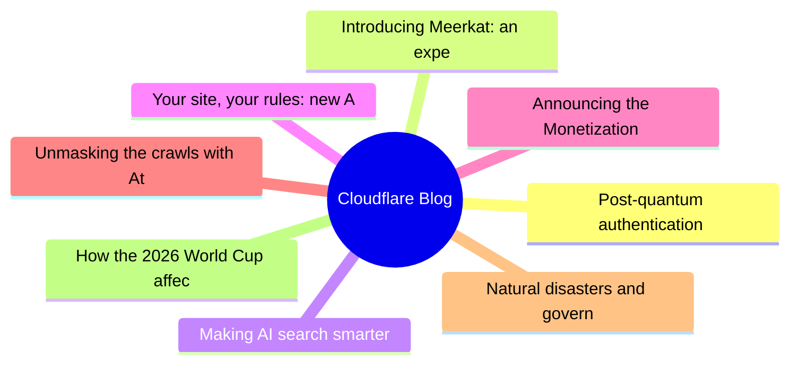
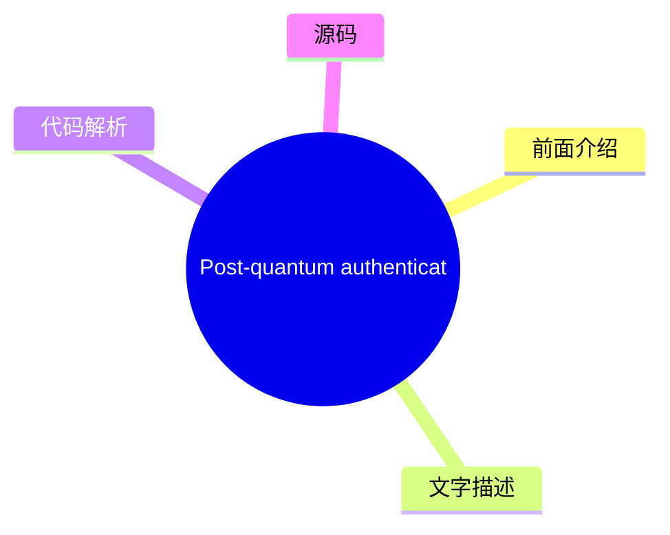
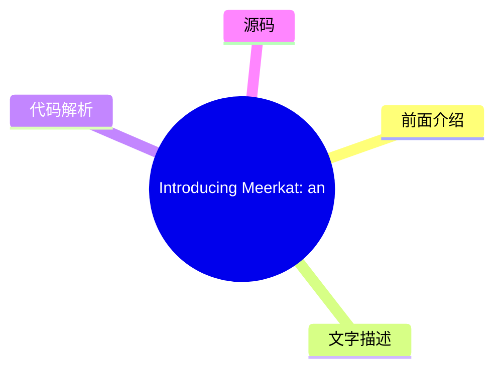
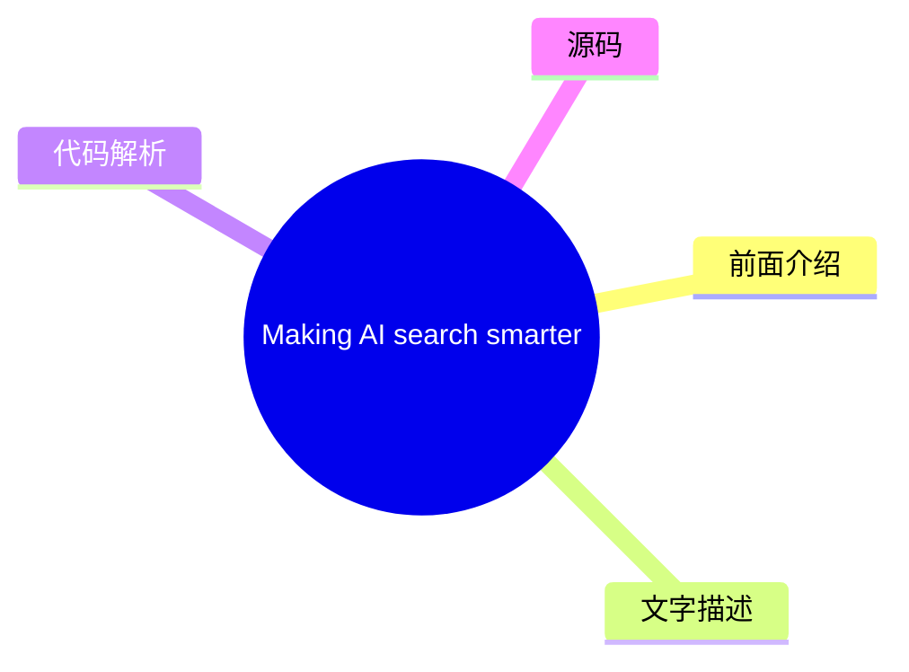
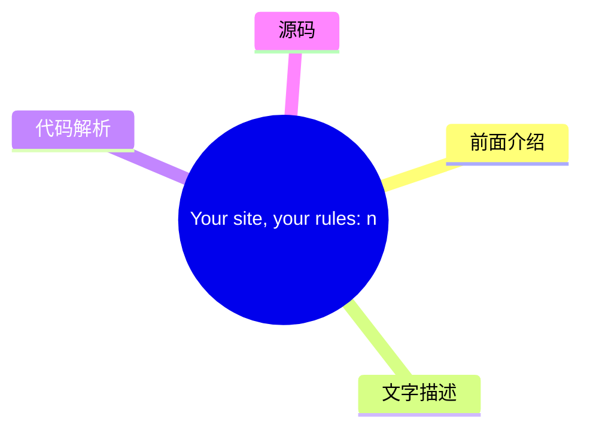
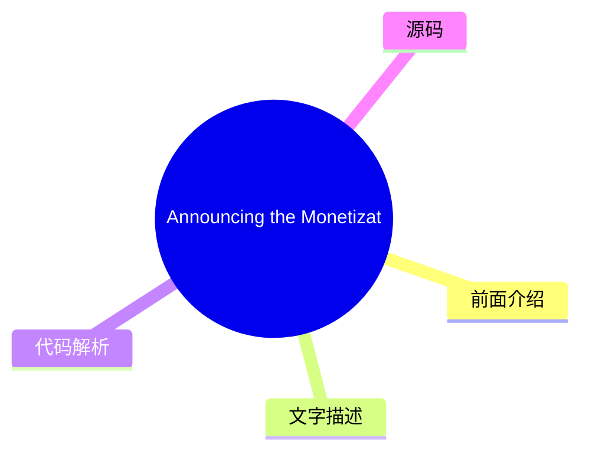
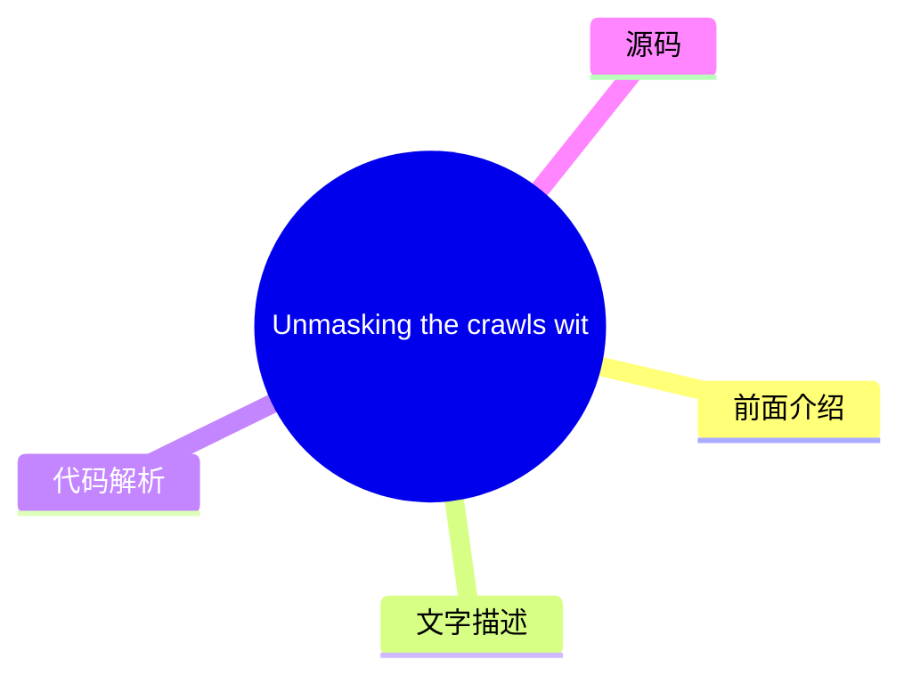
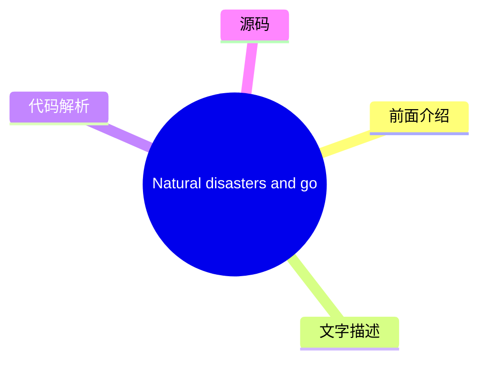
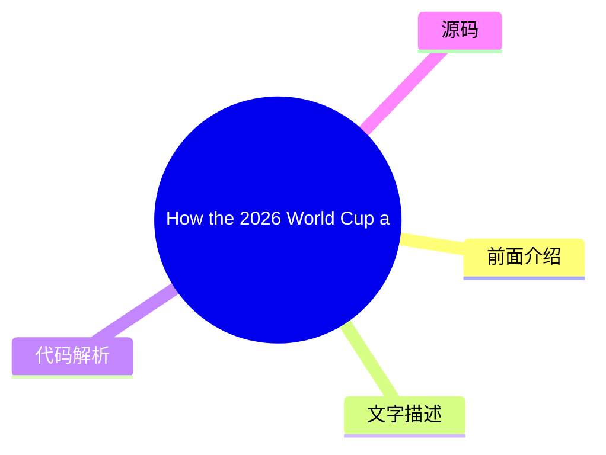

# ☁️ Cloudflare Blog Top 8 (2026-07-31)

## 前面介绍

- 数据源：Cloudflare Blog
- 抓取日期：2026-07-31
- 条目数：8
- 含完整正文：8
- 含代码片段：1
- 组织方式：前面介绍 / 树状图 / 文字描述 / 代码解析 / 源码

## 思维导图



## 详细整理（8 条，8 条含全文，1 条含代码）

### 1. Post-quantum authentication to origins is now supported
- **链接**: [https://blog.cloudflare.com/post-quantum-authentication-to-origins/](https://blog.cloudflare.com/post-quantum-authentication-to-origins/)
- **作者**: Luke Valenta
- **发布**: Wed, 29 Jul 2026 13:00:00 GMT

#### 前面介绍

- Cloudflare now supports post-quantum (PQ) authentication when connecting to customer origin servers via Authenticated Origin Pulls and Custom Origin Trust Store. This is the first step towards providing PQ authentication for all Cloudflare products.
- 作者：Luke Valenta
- 发布时间：Wed, 29 Jul 2026 13:00:00 GMT

#### 树状图



#### 文字描述

- Cloudflare's Authenticated Origin Pulls and Custom Origin Trust Store now support post-quantum authentication. Here weâll explain how you can configure fully post-quantum secure mutually authenticated TLS connections to your origin server, dive into the engineering details of how we built it, make a shameful confession, and finally explain how this work fits into our overall po
- ## Reaching a major milestone Our focus for the past several years has been in deploying post-quantum [ encryption](https://radar.cloudflare.com/post-quantum) to protect against [attacks, where an attacker quietly stockpiles your encrypted data with the hope of decrypting it in the future with a quantum computer.](https://en.wikipedia.org/wiki/Harvest_now,_decrypt_later) __harv
- ## Configuring fully PQ-secure origin connections We have added ML-DSA support (for all [ FIPS 204](https://csrc.nist.gov/pubs/fips/204/final) parameter sets: ML-DSA-44, ML-DSA-65, and ML-DSA-87) to the Custom Origin Trust Store and Authenticated Origin Pulls products. ML-DSA-44 is our recommendation for most applications as it is the most performant option and attains a comfor
- ### Avoiding downgrades Adding post-quantum encryption and authentication support to both the authenticating and verifying parties is necessary but *not* sufficient for full post-quantum security. The pesky issue of downgrades remains. If the verifying party supports any quantum-vulnerable authentication mechanisms, they remain open to attack from an [ on-path attacker](https:/

#### 代码解析

- `text`: 代码片段可作为实现参考，建议结合上下文确认输入输出和边界条件。
- `text`: 代码片段可作为实现参考，建议结合上下文确认输入输出和边界条件。

#### 源码

#### 源码片段 1（text）

```text
# Create a private ML-DSA-44 CA for the origin server
openssl genpkey -algorithm mldsa44 \
  -provparam ml-dsa.output_formats=seed-only \
  -out origin-ca.key
openssl req -new -x509 -key origin-ca.key \
  -out origin-ca.crt -days 10950 \
  -subj "/CN=Origin Server CA"
# Create the origin server certificate (signed by the origin CA)
openssl genpkey -algorithm mldsa44 \
  -provparam ml-dsa.output_formats=seed-only \
  -out origin-server.key
openssl req -new -key origin-server.key \
  -out origin-server.csr \
  -subj "/CN=origin.example.com"
openssl x509 -req -in origin-server.csr \
  -CA origin-ca.crt -CAkey origin-ca.key -CAcreateserial \
  -out origin-server.crt -days 5475 \
  -extfile <(printf "basicConstraints=CA:FALSE\nkeyUsage=digitalSignature\nsubjectAltName=DNS:origin.example.com\n")
```

#### 源码片段 2（text）

```text
# Create a private ML-DSA-44 CA for Authenticated Origin Pulls
openssl genpkey -algorithm mldsa44 \
  -provparam ml-dsa.output_formats=seed-only \
  -out aop-ca.key
openssl req -new -x509 -key aop-ca.key \
  -out aop-ca.crt -days 10950 \
  -subj "/CN=Authenticated Origin Pull CA"
# Create the client certificate Cloudflare will present (signed by the AOP CA)
openssl genpkey -algorithm mldsa44 \
  -provparam ml-dsa.output_formats=seed-only \
  -out aop-client.key
openssl req -new -key aop-client.key \
  -out aop-client.csr \
  -subj "/CN=cloudflare-aop-client"
openssl x509 -req -in aop-client.csr \
  -CA aop-ca.crt -CAkey aop-ca.key -CAcreateserial \
  -out aop-client.crt -days 5475 \
  -extfile <(printf "basicConstraints=CA:FALSE\nkeyUsage=digitalSignature\n")
```

#### 完整正文（中文）

Cloudflare 的 Authenticated Origin Pulls 和 Custom Origin Trust Store 现在支持后量子认证。

在这里，我们将解释如何配置完全后量子安全的相互认证 TLS 连接到您的源服务器，深入探讨我们构建它的工程细节，进行一番羞愧的坦白，并最终解释这项工作如何融入我们整体的后量子迁移路线图。

## 达成重要里程碑

过去几年，我们的重点一直是部署后量子 [加密](https://radar.cloudflare.com/post-quantum) 以保护免受

[攻击，即攻击者悄悄囤积您的加密数据，希望在未来使用量子计算机对其进行解密。](https://en.wikipedia.org/wiki/Harvest_now,_decrypt_later)

__harvest-now/decrypt-later__然而，量子计算和密码分析的最新突破将升级到后量子的时间表向前推进 __across__[ 行业](https://blog.google/innovation-and-ai/technology/safety-security/cryptography-migration-timeline/) 和

[并促使我们将注意力转移到部署后量子](https://blog.cloudflare.com/post-quantum-eo-2026/)

__政府__*认证*，以保护免受攻击者使用量子计算机破解经典凭据并实施冒充攻击。

在之前的帖子中，我们宣布 Cloudflare [ 目标是 2029](https://blog.cloudflare.com/post-quantum-roadmap/#cloudflares-roadmap-to-full-post-quantum-security) 年实现完全后量子安全，并概述了途中需要达到的几个里程碑。我们已经达到了其中第一个里程碑：我们的

[和](https://developers.cloudflare.com/ssl/origin-configuration/authenticated-origin-pull/)

__Authenticated Origin Pulls__[产品](https://developers.cloudflare.com/ssl/origin-configuration/custom-origin-trust-store/)

__Custom Origin Trust Store__[通过 Module-Lattice-Based Digital Signature Algorithm (ML-DSA) 签名来保护 Cloudflare 与客户源服务器之间的连接。Â](https://developers.cloudflare.com/changelog/post/2026-06-17-pqc-mldsa-aop-cots/)

__now support post-quantum (PQ) authentication__## The origin connection is different

When a client visits a website proxied by Cloudflare, there are typically two connections involved. The first connection is from the visitor (e.g., a browser) to Cloudflare. If the request can be served from Cloudflareâs cache or triggers any blocking rules, Cloudflare might respond directly. Otherwise, Cloudflare establishes a second connection to the customerâs origin server to fetch the requested content, so it can respond to the original request.

Protecting sensitive visitor data requires both of these connections to be secure against quantum attacks. We enabled post-quantum encryption support for both the visitor-to-Cloudflare (Connection 1) and Cloudflare-to-origin (Connection 2) connections in [ 2022](https://blog.cloudflare.com/post-quantum-for-all/) and 

[, respectively, and already see](https://blog.cloudflare.com/post-quantum-to-origins/)

__2023__[.](https://radar.cloudflare.com/post-quantum)

__significant usage__We are actively working on completing the picture with post-quantum authentication. For the visitor-to-Cloudflare connection, we are collaborating with [ Google](https://blog.google/security/cultivating-a-robust-and-efficient-quantum-safe-https/) and others at the Internet Engineering Task Force (

[) to develop and](https://datatracker.ietf.org/wg/plants/about/)

__IETF__[with Merkle Tree Certificates](https://blog.cloudflare.com/bootstrap-mtc)

__experiment__[, a design for fast, post-quantum certificates for the web, with initial deployments targeting 2027. The topic of this post, however, is the Cloudflare-to-origin connection, where the requirements for authentication differ from that of the visitor-to-Cloudflare connection in several important ways.](https://datatracker.ietf.org/doc/draft-ietf-plants-merkle-tree-certs/)


__(MTC)__For this connection, Cloudflare is the client. This gives us the control to employ techniques such as connection pooling to fan in requests from all over our network to a smaller set of connections to origin servers, amortizing the overhead of connection setup over many requests. This makes the cost of âdrop-inâ post-quantum signatures more palatable, and the performance benefits of MTC less necessary.

And with a pre-existing trust relationship between Cloudflare and customers (i.e., a Cloudflare account), we need not tie ourselves to the constraints and timelines of the public key infrastructure (PKI) for the public Internet ([ WebPKI](https://cabforum.org/working-groups/server/baseline-requirements/requirements/)) and can instead use custom PKIs tailored to the use case, without overhead from intermediate certificates and 

[that may not be applicable. Solutions like](https://datatracker.ietf.org/doc/html/rfc6962)

__Certificate Transparency__[can also be used to protect the Cloudflare-to-origin connection without upgrading legacy origin systems, by forwarding traffic over a tunnel secured with post-quantum encryption (and post-quantum authentication in the works).](https://developers.cloudflare.com/tunnel/)

__Cloudflare Tunnel__All this to say, the unique requirements of the Cloudflare-to-origin connection have allowed us to deploy post-quantum authentication via ML-DSA authentication ahead of support landing in the WebPKI for the public Internet. (For customers who stick with the WebPKI, donât worry: weâll add MTC support on the Cloudflare-to-origin connection in the future.)

So how do you turn this on? Letâs dive into the configuration.

## Configuring fully PQ-secure origin connections

We have added ML-DSA support (for all [ FIPS 204](https://csrc.nist.gov/pubs/fips/204/final) parameter sets: ML-DSA-44, ML-DSA-65, and ML-DSA-87) to the Custom Origin Trust Store and Authenticated Origin Pulls products. ML-DSA-44 is our recommendation for most applications as it is the most performant option and attains a comfortable NIST 

[security strength.](https://nvlpubs.nist.gov/nistpubs/FIPS/NIST.FIPS.204.pdf#page=25)


__category 2__### 自定义源信任存储

当 Cloudflare 连接到配置了 [ Full (strict)](https://developers.cloudflare.com/ssl/origin-configuration/ssl-modes/full-strict/) SSL 模式的客户源服务器时，我们会根据包含所有 

[证书颁发机构 (CAs) 以及 Cloudflareâs](https://ccadb.org)

__commonly trusted__[. The](https://developers.cloudflare.com/ssl/origin-configuration/origin-ca/)

__origin CA__[产品 (需要](https://developers.cloudflare.com/ssl/origin-configuration/custom-origin-trust-store/)

__自定义源信任存储 (COTS)__[启用) 允许客户用其控制的 CA 集合替换此默认信任存储。COTS 现在允许客户上传 ML-DSA CA，以便 Cloudflare 在连接到源服务器时信任任何链式连接到该 CA 的源服务器证书。](https://developers.cloudflare.com/ssl/edge-certificates/advanced-certificate-manager/)

__高级证书管理器__### 认证源拉取

为了限制对其源服务器的滥用和资源消耗，客户可能只想服务来自 Cloudflareâs 服务器的请求。[ 认证源拉取 (AOP)](https://developers.cloudflare.com/ssl/origin-configuration/authenticated-origin-pull/) 可用于配置 Cloudflare 向源服务器出示客户端证书以建立 

[连接，从而实现双方之间的双向安全可信通信。AOP 在所有 Cloudflare 计划级别上均可免费使用。](https://www.cloudflare.com/learning/access-management/what-is-mutual-tls/)

__mutual TLS (mTLS)__AOP 支持 [配置级别](https://developers.cloudflare.com/ssl/origin-configuration/authenticated-origin-pull/#configuration-levels) 的三种：全局、按区域和按主机名。按区域和按主机名的配置级别现在允许客户上传 ML-DSA 证书和私钥（采用 FIPS 204 种子格式），以便 Cloudflare 的 TLS 客户端在连接到源服务器时出示此证书以进行身份验证。（别担心，我们并没有忘记全局配置级别——它只是恰好是一个更复杂的变更，将在稍后优先处理。）

### 避免降级

在验证双方添加后量子加密和身份验证支持是必要的，但*不足以*实现完全的后量子安全。降级这个恼人的问题依然存在。如果验证方支持任何易受量子攻击的身份验证机制，它们仍然容易受到能够伪造经典凭据的 [路径攻击者](https://www.cloudflare.com/learning/security/threats/on-path-attack/) 的攻击。

解决方案：验证方必须移除对易受量子攻击的身份验证机制的信任。（在复杂的 PKI 中，这一点更为微妙。例如，请参阅 Chromium 安全团队的 [四阶段计划](https://www.chromium.org/Home/chromium-security/post-quantum-auth-roadmap/)，用于过渡 Web。）请参阅 

[以了解有关如何确保您的源服务器免受降级攻击的详细信息。](https://developers.cloudflare.com/ssl/post-quantum-cryptography/pqc-to-origin/#avoid-downgrades)

__配置指南__### 快速入门

下面的演练展示了如何生成 ML-DSA 证书链并通过 Cloudflare API 配置这两种产品。有关仪表板说明和附加上下文，请参阅 [开发者文档](https://developers.cloudflare.com/ssl/post-quantum-cryptography/pqc-to-origin/)。

1. 生成证书

您需要 OpenSSL 3.5.0 或更高版本。私钥必须采用 FIPS 204 种子编码生成，这是 Cloudflare 目前接受上传的唯一格式。

**Origin server certificate chain for COTS:**

```
# Create a private ML-DSA-44 CA for the origin server
openssl genpkey -algorithm mldsa44 \
  -provparam ml-dsa.output_formats=seed-only \
  -out origin-ca.key
openssl req -new -x509 -key origin-ca.key \
  -out origin-ca.crt -days 10950 \
  -subj "/CN=Origin Server CA"
# Create the origin server certificate (signed by the origin CA)
openssl genpkey -algorithm mldsa44 \
  -provparam ml-dsa.output_formats=seed-only \
  -out origin-server.key
openssl req -new -key origin-server.key \
  -out origin-server.csr \
  -subj "/CN=origin.example.com"
openssl x509 -req -in origin-server.csr \
  -CA origin-ca.crt -CAkey origin-ca.key -CAcreateserial \
  -out origin-server.crt -days 5475 \
  -extfile <(printf "basicConstraints=CA:FALSE\nkeyUsage=digitalSignature\nsubjectAltName=DNS:origin.example.com\n")
```
**Cloudflare client certificate chain for AOP:**

```
# Create a private ML-DSA-44 CA for Authenticated Origin Pulls
openssl genpkey -algorithm mldsa44 \
  -provparam ml-dsa.output_formats=seed-only \
  -out aop-ca.key
openssl req -new -x509 -key aop-ca.key \
  -out aop-ca.crt -days 10950 \
  -subj "/CN=Authenticated Origin Pull CA"
# Create the client certificate Cloudflare will present (signed by the AOP CA)
openssl genpkey -algorithm mldsa44 \
  -provparam ml-dsa.output_formats=seed-only \
  -out aop-client.key
openssl req -new -key aop-client.key \
  -out aop-client.csr \
  -subj "/CN=cloudflare-aop-client"
openssl x509 -req -in aop-client.csr \
  -CA aop-ca.crt -CAkey aop-ca.key -CAcreateserial \
  -out aop-client.crt -days 5475 \
  -extfile <(printf "basicConstraints=CA:FALSE\nkeyUsage=digitalSignature\n")
```
2. Upload the origin CA to Custom Origin Trust Store

```
CA_CERT=$(jq -Rs . < origin-ca.crt)
curl "https://api.cloudflare.com/client/v4/zones/$ZONE_ID/acm/custom_trust_store" \
  --header "Authorization: Bearer $CLOUDFLARE_API_TOKEN" \
  --header "Cont

...（截断，原文 22450+ 字符）


### 2. Introducing Meerkat: an experiment in global consensus
- **链接**: [https://blog.cloudflare.com/meerkat-introduction/](https://blog.cloudflare.com/meerkat-introduction/)
- **作者**: James Larisch
- **发布**: Wed, 08 Jul 2026 12:00:00 GMT

#### 前面介绍

- Cloudflare Research is building a global consensus service called Meerkat that uses a new consensus algorithm called QuePaxa. We plan to use Meerkat to build a strongly consistent, fault-tolerant key-value store, and other applications.
- 作者：James Larisch
- 发布时间：Wed, 08 Jul 2026 12:00:00 GMT

#### 树状图



#### 文字描述

- Many internal services at Cloudflare need to read and modify the same control-plane state from across our 330+ global data centers. They need guarantees that different readers *never *see inconsistent state, and that the system remains available for writes even when some data centers or links fail. But Cloudflareâs network runs across the entire Internet, and the Internet is an
- ## What we need from a global control-plane data system Many Cloudflare services read and write *control-plane data*, data that helps those services operate correctly, from multiple machines distributed all over the world. One example of control-plane data is *placement information*: where certain resources (like an AI model instance) are stored. Another example is *leadership 
- ### Strong consistency A distributed data systemâs [ consistency](https://jepsen.io/consistency/models) level describes what kinds of weird behavior the system is allowed to exhibit when it receives concurrent reads and writes. Consider a distributed key-value store that stores a single numeric value `x = 6` across multiple nodes. Also consider the following sequence of writes.
- ### Fault tolerance A systemâs level of fault tolerance describes what kinds of faults the system can handle before catastrophes happen. Catastrophes are typically violations of properties the system aims to uphold, e.g., that two consecutive reads without an intervening write for the same key never see different values, or that the system remains available for writes. The faul

#### 代码解析

- 本文未检测到明确代码块，内容更偏新闻、观点或方法论。

#### 源码

#### 中文节选

Many internal services at Cloudflare need to read and modify the same control-plane state from across our 330+ global data centers. They need guarantees that different readers *never *see inconsistent state, and that the system remains available for writes even when some data centers or links fail.

But Cloudflareâs network runs across the entire Internet, and the Internet is an unpredictable place. Servers and data centers go down. Queues fill up. Links and cables get cut. These conditions make it difficult to run a globally available data system that guarantees strong consistency (e.g., that all readers are guaranteed to read all prior writes) because hostile conditions hinder distributed system replicasâ ability to reliably synchronize data with one another.

One way to synchronize data safely despite adverse network conditions is via a *consensus algorithm, *which* *allows a set of machines to agree on the same sequence of values, such as key-value store put and `get` operations, as long as a majority remains alive and able to communicate. 

Unfortunately, commonly deployed consensus algorithms like [ Raft](https://raft.github.io/) suffer in wide-area networks like Cloudflareâs because they rely on 

*leaders*and

*timeouts*. The

*leader*is the only replica allowed to make writes, and if it fails due to a crash or network degradation, the system becomes unavailable until some other replica

*times out*and a new leader is elected. And these timeout values are hard to configure in networks with unpredictable latencies.

We have experienced multiple incidents caused by unavailable leaders in consensus-driven systems.

And so, for the past year, Cloudflareâs Research [ team](https://research.cloudflare.com/) has been building a new distributed consensus service called 

**Meerkat**powered by a consensus algorithm called

[, published in 2023 by Tennage & BÄsescu et al. QuePaxa differs from Raft in that all replicas can perform writes at all times, and progress is never halted due to a timeout, which makes it well suited for Cloudflareâs network. We layer](https://bford.info/pub/os/quepaxa/quepaxa.pdf)


__QuePaxa__*applications*, like a transactional key-value store and leasing system, atop Meerkatâs consensus log. To our knowledge, this will be the first industrial deployment of QuePaxa at global scale.

Meerkat is an experimental consensus service that is still in development. Itâs being designed initially to manage small pieces of control plane state (e.g., leadership for replicated databases) and so it will be kept internal-only for the immediate future. This post introduces Meerkat and lays the groundwork for the Meerkat-related blog posts to come.Â

## What we need from a global control-plane data system

Many Cloudflare services read and write *control-plane data*, data that helps those services operate correctly, from multiple machines distributed all over the world. One example of control-plane data is *placement information*: where cer

#### 完整正文（中文）

Many internal services at Cloudflare need to read and modify the same control-plane state from across our 330+ global data centers. They need guarantees that different readers *never *see inconsistent state, and that the system remains available for writes even when some data centers or links fail.

But Cloudflareâs network runs across the entire Internet, and the Internet is an unpredictable place. Servers and data centers go down. Queues fill up. Links and cables get cut. These conditions make it difficult to run a globally available data system that guarantees strong consistency (e.g., that all readers are guaranteed to read all prior writes) because hostile conditions hinder distributed system replicasâ ability to reliably synchronize data with one another.

One way to synchronize data safely despite adverse network conditions is via a *consensus algorithm, *which* *allows a set of machines to agree on the same sequence of values, such as key-value store put and `get` operations, as long as a majority remains alive and able to communicate. 

Unfortunately, commonly deployed consensus algorithms like [ Raft](https://raft.github.io/) suffer in wide-area networks like Cloudflareâs because they rely on 

*leaders*and

*timeouts*. The

*leader*is the only replica allowed to make writes, and if it fails due to a crash or network degradation, the system becomes unavailable until some other replica

*times out*and a new leader is elected. And these timeout values are hard to configure in networks with unpredictable latencies.

We have experienced multiple incidents caused by unavailable leaders in consensus-driven systems.

And so, for the past year, Cloudflareâs Research [ team](https://research.cloudflare.com/) has been building a new distributed consensus service called 

**Meerkat**powered by a consensus algorithm called

[, published in 2023 by Tennage & BÄsescu et al. QuePaxa differs from Raft in that all replicas can perform writes at all times, and progress is never halted due to a timeout, which makes it well suited for Cloudflareâs network. We layer](https://bford.info/pub/os/quepaxa/quepaxa.pdf)


__QuePaxa__*应用*，例如基于 Meerkat 共识日志的事务型键值存储和租赁系统。据我们所知，这将是 QuePaxa 在全球范围内的首次工业级部署。

Meerkat 是一个仍在开发中的实验性共识服务。它最初被设计用于管理少量的控制平面状态（例如复制数据库的领导权），因此在可预见的未来，它将仅限内部使用。本文介绍了 Meerkat，并为即将发布的与 Meerkat 相关的博客文章奠定了基础。

## 我们对全球控制平面数据系统的需求

许多 Cloudflare 服务会读取和写入*控制平面数据*，这些数据有助于这些服务正确运行，数据分布在遍布全球的多台机器上。控制平面数据的一个例子是*放置信息*：某些资源（如 AI 模型实例）存储在哪里。另一个例子是*领导权信息*：哪台机器当前被允许对数据库执行写入操作。

控制平面数据必须同时具备*强*一致性，并且能够在特定类型的故障下保持可访问性。

在本节中，我们将精确描述我们对 Cloudflare 共识服务的一致性和容错要求。我们使用键值存储作为运行在共识服务之上的应用程序的运行示例，尽管其他应用程序（例如分布式租赁/锁）也是可能的。

### 强一致性

分布式数据系统的[一致性](https://jepsen.io/consistency/models)级别描述了系统在接收并发读写时被允许表现出的怪异行为。考虑一个在多个节点上存储单个数值的分布式键值存储

`x = 6`。同时考虑以下写入序列。这些写入是尽力而为地提交到不同节点的，并且可能以任意顺序到达： - `x = x + 1`
- `x = x / 2`

系统的一致性级别告诉您，在执行这些写入后，客户端在读取 `x` 时可能会看到 `x` 的哪些值。考虑以下操作序列以及在不同一致性级别下的可能执行顺序：

In a weak consistency level, writes can be re-ordered. In a stronger consistency model, writes canât be reordered, but reads can. In the strongest possible consistency level, the operations are ordered exactly as they occurred in real time. This property is called *linearizability*.

At Cloudflare, many services want linearizability. Unlike weaker forms of consistency, linearizability relieves programmers from thinking about all the weird behaviors the data systems might exhibit. Instead, they can reason about the distributed system like they reason about local memory on a single-threaded machine: all reads after a write will see that write. For additional reading material on the dangers of weak consistency, check out this [ post](https://brooker.co.za/blog/2025/11/18/consistency.html) by Marc Brooker.

(If youâre wondering, Meerkatâs key-value store also provides serializability, which weâll write about in a future post.)

### Fault tolerance

A systemâs level of fault tolerance describes what kinds of faults the system can handle before catastrophes happen. Catastrophes are typically violations of properties the system aims to uphold, e.g., that two consecutive reads without an intervening write for the same key never see different values, or that the system remains available for writes. The faults include network failures or delays, machine crashes, and machine restarts. A system will typically explicitly handle some faults but not others (you canât handle all faults, as the universe could always reach heat-death). For example, some key-value stores might guarantee to remain available for writes as long as two-thirds of the machines in the system can communicate and donât crash, but make no promises if a machine is compromised and starts sending malicious messages.

Our desired fault tolerance properties are as follows:

**First**, the data system should remain available for writes and reads from a client located in any of our data centers as long as the following are true:

- A majority of the machines in our system are alive and can communicate with one another. (Formally, we tolerate `f`faults in a system of`2f + 1`machines).

- 客户端可以联系系统中的*任何*一台连接到大多数存活机器的机器。

这意味着单台机器故障，或单条链路的网络降级，不会影响系统的可用性*。*正如我们稍后将看到的，Raft 基于的系统不提供此属性。

**其次**，只要系统中没有参与者是主动恶意的（当然，也没有 bug），数据系统就会保持*正确*。我们稍后将在共识*安全性*的背景下定义*正确性*，但通俗地说，这意味着没有两台最新的机器会就世界状态产生分歧（例如，一台认为 `key1=1`，而另一台认为 `key1=2`）。

总之，即使机器崩溃、机器重启、网络故障或降级、数据中心宕机等，系统也必须保持正确（尽管我们像基于 Raft 的系统一样，不处理[拜占庭故障](https://en.wikipedia.org/wiki/Byzantine_fault)）。

## 介绍 Meerkat

Meerkat 是一个共识服务，我们可以在其上构建具有上述属性（强一致性和容错性）的应用程序，例如键值（KV）存储。为了了解 Meerkat 的工作原理，我们首先概述 Meerkat 的总体架构，然后描述 Meerkat 对共识算法的选择如何有助于提供强一致性和容错性。

使用 Meerkat 的服务开发人员请求一个 Meerkat *副本*集群。每个副本都连接到其他每个副本。每个副本都参与共识算法，并且可以接收读取和写入操作。开发人员可以指定允许在其副本上托管的数据中心，Meerkat 会自动放置它们。

为了与其集群交互，开发人员的客户端向集群中的任何副本发送特定于应用程序的请求。单个副本可能托管多种类型的应用程序，但最简单的是键值存储，因此最简单的特定于应用程序的请求类型是 KV `get` 或 `put`。副本使用特定于应用程序的响应（例如，使用 `get` 请求的记录）来响应请求。请注意，KV 读取（`get`）保证读取到最新的信息。

### Meerkat 的日志

在底层，副本将应用请求（例如 `get` 和 `put`）转换为 *日志事件*。该副本使用共识算法将每个日志事件分发到所有其他副本，以确保所有副本维护完全相同的事件日志（实际上，副本可能会滞后，但绝不应记录不同的条目）。这些事件是任意的——Meerkat 的核心并不关心它们的内容。Meerkat 的 *应用* 关心的是日志事件的内容。每个 Meerkat 副本“托管”许多 Meerkat 应用（例如键值存储），这些应用读取日志事件并构建状态。（注意，每个副本恰好属于一个集群。）

例如，KV Meerkat 应用从日志事件中构建一个内存键值存储。因此，当客户端发送写入请求如 `put k1 v1` 时，接收该请求的副本将该写入操作放入一个日志事件中，并将其分发到所有副本。如果其他人随后在不同的副本上写入 `put k1 v11`，该事件也会被分发到所有副本。由于所有正常运行的副本拥有相同的日志，这些副本可以按顺序应用日志中的操作，从而构建完全相同的状态。注意，`get` 请求也会创建分布式日志事件（为了线性一致性，如下一节所述）。

以下是副本的 KV 存储如何随着接收日志事件而更新的示例：

### Meerkat 的日志如何实现强一致性

Meerkat 保证，如果一个客户端执行 `put k1 v1`，随后第二个客户端执行 `put k1 v11`，随后第三个客户端执行 `get k1`（使用一致的读取），他们将始终读取到 `v11`。即使每个请求被提交到不同的副本，且这些副本随机分布在世界各地，Meerkat 也能保证这一点。这就是线性一致性。为了了解 Meerkat 如何保证这一点，我们必须更详细地检查 Meerkat 的日志。

Meerkat 日志是一系列槽位的序列。一个槽位是一个可以包含事件或不包含事件的盒子。包含事件的槽位被称为一个 *已决定* 槽位。日志中的所有槽位都是已决定的，除了最后一个槽位，它目前正在被决定。Meerkat 的不变式之一是，如果任何两个副本决定了一个槽位的值，那么这些值是相同的。换句话说，没有两个副本会永远不同意一个已决定槽位的值（尽管一个副本可能认为最后一个槽位是空的，而另一个副本则不这么认为）。这个属性有助于保证我们在上一节中描述的期望属性。

为了决定日志中最后一个（空的）槽位的值，Meerkat 副本运行一个分布式的 *共识算法*。共识算法允许一组通过网络通信的机器就一个已决定槽位的值达成一致。只要大多数副本（超过一半）是存活的，我们的共识算法就能正常工作。

因此，如果日志当前包含两个条目，并且一个客户端向一个副本提交了 `put k1 v11`，该副本就会为槽位 3 触发一个共识算法。但是，另一个客户端可能已经向不同的副本提交了 `put k1 v111`，用于槽位 3。共识算法确保对于槽位 3，只有一个这样的 *提议* 会胜出。具体来说，它确保至少大多数副本同意同一个提议，并将其 *决定* 为槽位 3。少数派永远无法决定不同的提议，但可能会错过事实

...（截断，原文 20546+ 字符）


### 3. Making AI search smarter
- **链接**: [https://blog.cloudflare.com/making-ai-search-smarter/](https://blog.cloudflare.com/making-ai-search-smarter/)
- **作者**: Matthew Conroy
- **发布**: Wed, 01 Jul 2026 13:00:00 GMT

#### 前面介绍

- Search is how we find nearly everything on the web — creators, merchants, answers. AI is rewriting the rules, leaving creators caught between staying discoverable in an agentic era and getting paid for their work. Today we're launching two initiative
- 作者：Matthew Conroy
- 发布时间：Wed, 01 Jul 2026 13:00:00 GMT

#### 树状图



#### 文字描述

- Search drives most experiences on the web. It's how we get things done, and how nearly everything on the web gets found â the creators, the merchants, the answer to whatever you just typed into a box. For nearly 30 years, that discovery journey ran on a simple bargain: let a search engine crawl your content, and it sends you visitors. You turned those visitors into a business â
- ### Rebuilding the bargain Transparency and control are the foundation, but more is needed. In 2025, we laid out our foundation via a set of [ responsible AI bot principles](https://blog.cloudflare.com/building-a-better-internet-with-responsible-ai-bot-principles/): bots should be transparent about who they are and what they're for, respect site owners' choices, and act in good
- ### Making search smarter Today we're launching a research program to make AI search smarter and stop our customers footing the bill for crawls that produce nothing new. More than 20% of the web sits behind Cloudflareâs network, which gives us a unique perspective. We can tell which pages have genuinely changed and which ones people and agents are flocking to. Through this prog
- ### From Pay Per Crawl to Pay Per Use Last year we [ launched Pay Per Crawl ](https://blog.cloudflare.com/introducing-pay-per-crawl/)so publishers could charge AI companies for crawling their content. It was a real start, but crawling is a crude measure of value. A single page might be crawled once and then cited in thousands of answers, or crawled over and over and never used 

#### 代码解析

- 本文未检测到明确代码块，内容更偏新闻、观点或方法论。

#### 源码

#### 中文节选

Search drives most experiences on the web. It's how we get things done, and how nearly everything on the web gets found â the creators, the merchants, the answer to whatever you just typed into a box. For nearly 30 years, that discovery journey ran on a simple bargain: let a search engine crawl your content, and it sends you visitors. You turned those visitors into a business â through ads, subscriptions, or just the audience itself. Being discoverable and getting paid were the same thing. A year ago, on the [ first Content Independence Day](https://blog.cloudflare.com/content-independence-day-no-ai-crawl-without-compensation/), we drew a line to defend that bargain in the AI era. But a line in the sand was only a first step. Since then, the prevalence of AI search in consumersâ lives has only accelerated as 

[. The threat is no longer a handful of training crawlers you can block; it's search itself being rebuilt around AI answers.](https://radar.cloudflare.com/)

__more than 50% of traffic online is non-human__Today's answer engines read your page and hand the user a summary, so the visit â and the revenue that depended on it â isnât needed. We see it firsthand, and independent research backs it up: a [ 2025 Pew Research Center study](https://www.pewresearch.org/short-reads/2025/07/22/google-users-are-less-likely-to-click-on-links-when-an-ai-summary-appears-in-the-results/) found that when Google shows an AI summary, users clicked on a traditional search result link just 8% of the time (about half as often as when there's no summary) and clicked a link inside the summary only 1% of the time. That leaves our customers in a bind: opt out of AI and be hard to find, or opt in and deliver significant value to users while seeing increasingly little in return. Our customers want to be found and compensated for the value they provide, and right now they're forced to choose.


今天，[我们宣布了新的机器人选项](http://blog.cloudflare.com/content-independence-day-ai-options)，以帮助我们的客户更好地控制谁可以访问他们的网站以及他们可以对网站做什么。但屏蔽只是第一步：说“不”可以在不重建维持其存在的商业模式的情况下保护内容。因此，是时候开始构建互联网的新经济模式，从搜索开始。

### 重建交易

透明度和控制是基础，但这还不够。2025 年，我们通过一套[负责任的 AI 机器人原则](https://blog.cloudflare.com/building-a-better-internet-with-responsible-ai-bot-principles/)阐述了我们的基础：机器人应该对其身份和用途保持透明，尊重网站所有者的选择，并善意行事。我们的工具将机器人以此标准为基准。但强制执行良好的机器人行为并不能让依赖它的 AI 搜索对用户变得更好，也不能向创造了答案所必需的作品的创作者返还一美元。我们不仅能帮助网络说“不”；我们还能帮助重建它所说的“是”

#### 完整正文（中文）

Search drives most experiences on the web. It's how we get things done, and how nearly everything on the web gets found â the creators, the merchants, the answer to whatever you just typed into a box. For nearly 30 years, that discovery journey ran on a simple bargain: let a search engine crawl your content, and it sends you visitors. You turned those visitors into a business â through ads, subscriptions, or just the audience itself. Being discoverable and getting paid were the same thing. A year ago, on the [ first Content Independence Day](https://blog.cloudflare.com/content-independence-day-no-ai-crawl-without-compensation/), we drew a line to defend that bargain in the AI era. But a line in the sand was only a first step. Since then, the prevalence of AI search in consumersâ lives has only accelerated as 

[. The threat is no longer a handful of training crawlers you can block; it's search itself being rebuilt around AI answers.](https://radar.cloudflare.com/)

__more than 50% of traffic online is non-human__Today's answer engines read your page and hand the user a summary, so the visit â and the revenue that depended on it â isnât needed. We see it firsthand, and independent research backs it up: a [ 2025 Pew Research Center study](https://www.pewresearch.org/short-reads/2025/07/22/google-users-are-less-likely-to-click-on-links-when-an-ai-summary-appears-in-the-results/) found that when Google shows an AI summary, users clicked on a traditional search result link just 8% of the time (about half as often as when there's no summary) and clicked a link inside the summary only 1% of the time. That leaves our customers in a bind: opt out of AI and be hard to find, or opt in and deliver significant value to users while seeing increasingly little in return. Our customers want to be found and compensated for the value they provide, and right now they're forced to choose.


Today, [ weâve announced new bot options](http://blog.cloudflare.com/content-independence-day-ai-options) to help our customers better control who can access their site and what they can do with it. But blocking was only step one: saying "no" protects content without rebuilding the business models that sustain it. So, itâs time to start building the new economic model of the Internet, starting with search.

### Rebuilding the bargain

Transparency and control are the foundation, but more is needed. In 2025, we laid out our foundation via a set of [ responsible AI bot principles](https://blog.cloudflare.com/building-a-better-internet-with-responsible-ai-bot-principles/): bots should be transparent about who they are and what they're for, respect site owners' choices, and act in good faith. Our tools hold bots to that bar. But enforcing good bot behavior doesn't make AI search any better for the people relying on it, and it doesn't send a dollar back to the creator whose work made the answer possible. We can do more than help the web say "no"; we can help rebuild what it says "yes" to.

So today, we're announcing two initiatives that move from defense to offense and start putting both halves of that old bargain back together.

**Make AI search smarter: **By** **using the signals we see across our global network, like what's fresh, what's high quality, and what's actually changed, we can help answer engines surface the most relevant content and reduce unwanted crawling. People searching get better answers, while costs are reduced for both AI companies and site owners if webpages are only recrawled when theyâve changed.

**Pay creators for the value they provide:** When your work is used to answer someone's question, you should be rewarded instead of just being scraped for free. And you should be able to see what's being used and what people are asking. This should be a real revenue stream, and an incentive to keep producing original content worth finding.

### Making search smarter

Today we're launching a research program to make AI search smarter and stop our customers footing the bill for crawls that produce nothing new.


超过 20% 的网站位于 Cloudflare 的网络之后，这给了我们独特的视角。我们可以判断哪些页面真正发生了变化，哪些页面是人们和爬虫蜂拥而至的。通过这个项目，我们将探索利用客户选择分享的关于其内容新鲜度的信号，并将这些信号与我们自己对流量（包括人类和机器人）的洞察相结合。对于搜索引擎而言，这是通往高质量内容的路线图。对于我们的客户而言，它提供了用户实际在问什么，以及他们的内容如何在 AI 结果中呈现的视图。我们的目标是衡量两件事：这些信号在多大程度上帮助搜索引擎展示更新、更高质量的内容，以及它们在多大程度上减少了不必要的爬取。

第二个好处，即减少不必要的爬取，其重要性比听起来要大。Cloudflare 的数据显示，超过 50% 的优质爬虫流量都用于重新抓取未发生变化的页面——随着爬取量的增加，这个数字很可能会上升。一个仅仅表示“这里没有变化”的信号就能让爬虫跳过这次抓取。这节省了搜索引擎的计算资源。更重要的是，它让网站所有者免于处理和支付他们根本不需要的请求。

该计划在设计上是中立的：我们的目标是使其适用于每一个愿意公平竞争的搜索引擎。它仅限于搜索领域。我们不会分享任何内容，也不会使用任何数据来训练基础模型。我们打算公布我们的发现，包括对网站所有者（如更好的内容可发现性和减少服务器负载）的好处。我们计划在今年晚些时候广泛提供该功能，并减少我们网络上的不必要的爬取。

### 从按次爬取到按次使用

去年，我们[推出了按次爬取](https://blog.cloudflare.com/introducing-pay-per-crawl/)，以便出版商可以向 AI 公司收取抓取其内容的费用。这是一个真正的开始，但爬取只是价值的一种粗略衡量标准。一个页面可能被抓取一次，然后在数千个答案中被引用，或者被反复抓取却从未被使用过。创作者希望为其提供的价值获得公平的报酬。

所以我们开始将 Pay Per Crawl 转型为 Pay Per Use。我们正在与顶级 AI 公司（如 [ Ceramic.ai](http://ceramic.ai) 和 [__You.com__](http://you.com)）进行实验，这种安排很简单：组织可以引入自己的支付模式，并轻松将其扩展到 Cloudflare 网络上的内容所有者身上。

Ceramic 构建了一种所谓的“按查询付费”模式，因此选择加入的出版商可以在其内容出现在 Ceramic 的搜索结果中获得报酬。这意味着支付设计是跟随工作所提供的价值，而不是爬虫偶然抓取它的次数。

“为了扩展 AI 搜索的未来，我们需要一个拥有巨大覆盖范围并致力于透明度和公平补偿的合作伙伴，”Ceramic.ai 创始人兼首席执行官 Anna Patterson 说，“Cloudflare 让我们能够轻松且程序化地扩展我们的运营。通过将我们的按查询付费模式引入他们的网络，我们确保数百万内容所有者可以无缝选择加入，并在其内容每次出现在我们的搜索结果中时都能获得补偿。”

除了补偿之外，参与 Cloudflare/Ceramic 计划的内容所有者还将解锁新的报告，以帮助进行答案引擎优化（AEO）。客户终于可以看到导致其内容出现在搜索结果中的顶级查询、具体的网页和片段、其平均搜索结果排名位置等。这是我们即将推出的众多帮助客户提高可发现性的产品中的第一个。

这只是众多新兴方法之一。另一种来自 You.com：代理可以按需为所需的具体优质内容付费，无需任何前期承诺。AI 提供商正在测试新的支付模式（例如按查询付费、按结果付费等），而我们拥有支持所有这些模式的基础设施。

我们想坦诚地说，这是一个实验。还有很多东西需要学习，包括这种模式在互联网规模下究竟如何运作。我们将与合作伙伴和客户一起逐步解决这些问题，并分享我们的所学。但目标很明确：AI 搜索公司能获得更及时、更有依据的答案，而那些让答案成为可能的客户（即内容创作者）在提供帮助时也能获得报酬。Cloudflare 在此过程中的职责是提供使这一市场繁荣发展的基础设施层。

我们认为这更符合搜索经济学的未来走向。旧的人类网络优化搜索以节省时间——提供摘要、十个蓝色链接以及点击跳转。智能体互联网则不同：智能体可以快速阅读并持续搜索。搜索正变成智能体为了回答一个问题而执行的数十次操作，更接近一种公用事业而非目的地。在那个世界里，重要的单位不再是抓取或点击，而是结果。对结果进行定价，并支付促成结果的人的费用，是网络得以持续繁荣的方式。

### 我们想要赢得的头条

一年前的“内容独立日”，头条是默认的“不”：AI 无法在不进行补偿的情况下进行抓取。今年，我们的重点是给用户提供更多的产品和控制选项，以便他们说“是”，并带来更多的好处。

今天的公告只是开始。Cloudflare 的研究项目旨在探索我们的信号能否在减少抓取的情况下产生更好的结果。按使用付费是我们将与合作伙伴一起尝试的有前景的方向，这些合作伙伴相信内容创作者理应获得对其工作的公平补偿。过去 30 年来的网络也是这样建立的：有人运行试点项目，将“模型坏了”转变为“这是新模型”，一次实验接着一次实验。我们相信，我们的客户在这个新的智能体时代具有可被发现的价值，并且可以优化其内容以实现最大程度的发现。但他们应该能够做到这一点，而无需免费放弃其最有价值的创意资产。

互联网正在发生变化，它所依赖的商业模式也随之改变。旧的互联网是开放、中立且值得贡献的。我们有机会保持这种状态，并为未来的互联网构建资助它的商业模式。为人类和智能体提供更智能的答案。为那些凭借技能、创造力和奉献精神使答案变得有价值的人们提供公平的交易。这就是我们追求 Cloudflare 使命的方式：帮助构建更好的互联网。

祝内容独立日快乐！

*正在构建开放、面向智能体的互联网？如果您有兴趣了解更多关于 Ceramic 和 You 计划的信息，请填写 *

__此表单__。如果您正在构建答案引擎并希望进行更智能的抓取，我们也非常乐意收到您的来信：aeo@cloudflare.com。


### 4. Your site, your rules: new AI traffic options for all customers
- **链接**: [https://blog.cloudflare.com/content-independence-day-ai-options/](https://blog.cloudflare.com/content-independence-day-ai-options/)
- **作者**: Jin-Hee Lee
- **发布**: Wed, 01 Jul 2026 13:00:00 GMT

#### 前面介绍

- For our second Content Independence Day, we’re giving website owners finer options to manage AI traffic. Instead of a one-size-fits-all block, all customers can now easily distinguish and manage Search, Agent, and Training bots, alongside the new abi
- 作者：Jin-Hee Lee
- 发布时间：Wed, 01 Jul 2026 13:00:00 GMT

#### 树状图



#### 文字描述

- One year ago, we declared the first [ Content Independence Day](https://blog.cloudflare.com/content-independence-day-no-ai-crawl-without-compensation/), and we gave website owners the means to take back control of their content. The deal between crawlers and website owners that had held up for 30 years â we crawl you, and you get referrals â was no longer true. AI was taking ev
- ### Now, AI can be anything Today, AI can be in anything. Google search has changed from being sorted by AI to being a [ full answer engine](https://blog.google/products-and-platforms/products/search/search-io-2026/) that answers your question directly on the results page. And Google is not unique in this position â this is the direction in which âsearchâ is moving. We could de
- ### A pragmatic taxonomy To address these questions, we need a more nuanced view â a pragmatic taxonomy that aligns with the AI use cases our customers care about. So we are opening the discussion beyond AI training alone and focusing on three AI use cases that we want all customers to be able to manage: - **Search:**any behavior that collects or indexes your content, so it can
- ### New options to manage AI traffic **We want to provide more options for managing different kinds of AI traffic, to all website owners on the Cloudflare network.** The managed preset to âBlock AI botsâ that weâve announced in the past included single-purpose bots that crawled data for model training, as shown below:Â *Screenshot of the existing setting to manage AI bot traffi

#### 代码解析

- 本文未检测到明确代码块，内容更偏新闻、观点或方法论。

#### 源码

#### 中文节选

一年前，我们宣布了首个 [内容独立日](https://blog.cloudflare.com/content-independence-day-no-ai-crawl-without-compensation/)，并赋予网站所有者收回内容控制权的手段。爬虫与网站所有者之间维持了30年的交易——我们爬取你的内容，你获得推荐——不再成立。AI 正在获取一切却一无所返，这对网站所有者构成了生存威胁。因此，我们推出了一个点击即用的“屏蔽 AI 机器人”选项，以及

[.](https://blog.cloudflare.com/introducing-pay-per-crawl/)

__按爬取付费市场__

一年间发生了许多变化。去年七月，围绕“AI 机器人”的讨论主要集中在未经补偿就阻止 AI 训练，指向了这种内容被用于模型训练却没有任何价值回馈给网站所有者的零和博弈。但一种对更细致处理方式的需求已浮现：内容所有者仍然希望能够保护自己的内容，并且应该为他们辛勤创作、策展和分享的原创内容获得报酬。我们也知道，封锁内容并非“一刀切”的解决方案；网站所有者希望拥有比“每次都屏蔽所有自动化”更多的选择。

如果你运营一个小型网站，问题不仅仅是有人可能利用你的内容训练模型——而是根本没人能找到你。因此，你必须做出一种浮士德式的交易：要么出现在搜索结果中并允许 AI 训练你的内容，要么冒着失去可发现性的风险。如果 incumbent 搜索提供商对搜索和训练使用相同的机器人，这会不公平地偏向他们；这种不公平的优势激励了新玩家在试图缩小竞争差距时变得狡猾。

### 现在，AI 可以无处不在

如今，AI 可以存在于任何事物中。Google 搜索已从由 AI 排序转变为 [ 全答案引擎](https://blog.google/products-and-platforms/products-search/search-io-2026/)，直接在结果页面上回答你的问题。Google 在这一地位上并非独一无二——这正是“搜索”正在发展的方向。

We could debate the cutoff for what qualifies as âAIâ today, just to find that the standard changes tomorrow. So, instead of defining a bot primarily as âAIâ or not, our updated approach to classification will ask deeper questions about bot or agent behavior: What are they doing on my site? What are they storing? And how will they reshare my content?

### A pragmatic taxonomy

To address these questions, we need a more nuanced view â a pragmatic taxonomy that aligns with the AI use cases our customers care about. So we are opening the discussion beyond AI training alone and focusing on three AI use cases that we want all customers to be able to manage:

- **Search:**any behavior that collects or indexes your content, so it can answer questions about it later. The key is that Search is proactively building a database of your site to later respond to queries with. Site owners sho

#### 完整正文（中文）

一年前，我们宣布了首个 [内容独立日](https://blog.cloudflare.com/content-independence-day-no-ai-crawl-without-compensation/)，并赋予网站所有者收回内容控制权的手段。爬虫与网站所有者之间维持了30年的交易——我们爬取你的内容，你获得推荐——不再成立。AI 正在获取一切却一无所返，这对网站所有者构成了生存威胁。因此，我们推出了一个点击即用的“屏蔽 AI 机器人”选项，以及

[.](https://blog.cloudflare.com/introducing-pay-per-crawl/)

__按爬取付费市场__

一年间发生了许多变化。去年七月，围绕“AI 机器人”的讨论主要集中在未经补偿就阻止 AI 训练，指向了这种内容被用于模型训练却没有任何价值回馈给网站所有者的零和博弈。但一种对更细致处理方式的需求已浮现：内容所有者仍然希望能够保护自己的内容，并且应该为他们辛勤创作、策展和分享的原创内容获得报酬。我们也知道，封锁内容并非“一刀切”的解决方案；网站所有者希望拥有比“每次都屏蔽所有自动化”更多的选择。

如果你运营一个小型网站，问题不仅仅是有人可能利用你的内容训练模型——而是根本没人能找到你。因此，你必须做出一种浮士德式的交易：要么出现在搜索结果中并允许 AI 训练你的内容，要么冒着失去可发现性的风险。如果 incumbent 搜索提供商对搜索和训练使用相同的机器人，这会不公平地偏向他们；这种不公平的优势激励了新玩家在试图缩小竞争差距时变得狡猾。

### 现在，AI 可以无处不在

如今，AI 可以存在于任何事物中。Google 搜索已从由 AI 排序转变为 [ 全答案引擎](https://blog.google/products-and-platforms/products-search/search-io-2026/)，直接在结果页面上回答你的问题。Google 在这一地位上并非独一无二——这正是“搜索”正在发展的方向。

我们可以争论一下今天什么才算是“AI”的截止标准，结果却发现标准明天就会改变。因此，与其主要将机器人定义为“是”或“不是”AI，我们的更新分类方法将更深入地询问关于机器人或代理行为的问题：它们在我的网站上做什么？它们存储了什么？以及它们将如何重新分享我的内容？

### 务实的分类法

为了回答这些问题，我们需要一个更细致的视角——一种与我们客户关心的 AI 用例相一致的务实分类法。因此，我们将讨论范围从仅限于 AI 训练扩展开来，并专注于三个我们希望所有客户都能管理的 AI 用例：

- **搜索：**任何收集或索引您内容的行为，以便日后能够回答相关问题。关键在于，搜索会主动构建您网站的数据库，以便稍后响应查询。网站所有者应预期会因此获得推荐流量或其他公平的补偿。
- **代理：**自动化 **训练**：抓取您的内容以训练或微调模型。关键在于，您的数据被永久吸收到 AI 的底层架构中，以提高其能力。

网络上许多流行的抓取器都落入上述分类之一；有些则落入多个分类。除了上述三种行为外，我们还对许多其他行为进行了分类——包括广告验证、内容抓取和代理交易（关于这一点将在下面详细介绍）。但我们认为，所有网站所有者管理这三种以 AI 为中心的用例的访问权限应该很简单。我们相信，机器人操作员应该将他们的抓取器分开，因为这能为网站所有者创造更多的透明度：使他们能够更好地理解为什么特定的抓取器正在访问他们，并更好地管理他们授予该抓取器的访问权限。如果一家公司运行的自动化程序既构建 **搜索** 索引，又充当 **代理**，还收集数据来 **训练** 他们的模型，那么我们强烈建议该公司将自动化程序分为三个独立的抓取器。

我们希望建立一个具有可扩展性并能代表不断发展的自动化流量世界的分类系统。跟踪机器人的用途并不新鲜，但我们的新分类法涉及一些更新，能更好地反映当前机器人流量的状况。最值得注意的是，我们要认识到具有多种用途的机器人应该用所有用途来跟踪，而不仅仅是一个。

### 管理人工智能流量的新选项

**我们要为管理不同类型的人工智能流量提供更多选项，以便 Cloudflare 网络上的所有网站所有者。**

我们过去宣布的“阻止人工智能机器人”托管预设包括用于模型训练爬取数据的单用途机器人，如下所示：

*   2025 年 7 月 1 日管理人工智能机器人流量的现有设置截图。

但并非所有人工智能的使用都是一样的，我们希望我们的客户拥有他们需要的控制权。因此，我们推出了基于 **Search（搜索）、Agent（代理）和 Training（训练）** 三种主要用例来管理人工智能流量的能力。有了这些新选项，我们的客户可以更精细地调整他们管理人工智能机器人流量的方式——包括我们免费层级上的客户。

*   2026 年 7 月 1 日管理人工智能机器人流量的新选项截图。

### 设置新默认值

**我们将于 2026 年 9 月 15 日为这三个分类中的每一个设置新的默认值。** 对于所有新接入 Cloudflare 的域名，**Training** 和 **Agent** 类别将在显示广告的页面上默认被阻止，而 **Search** 将保持默认允许。

广告是网站所有者希望用户访问并查看的信号——一种可货币化且能推动业务发展的东西。因此，在这些页面上，我们将人类注意力视为最终目标，并阻止可能阻碍这种注意力的机器人（即 Training 和 Agent 机器人）。另一方面，搜索是最自然地将访客引导回来的行为，我们相信大多数网站所有者允许这种行为符合他们的利益。

9月15日将实施另一项变更：多功能爬虫（特别是那些将搜索与训练相结合的爬虫）将根据其*所有*行为被允许/拦截，这与我们呼吁网站所有者保持透明的立场一致。由于默认设置将由最严格的适用规则强制执行，因此像 Googlebot、Applebot 和 BingBot 这样的多功能爬虫将被那些选择拦截训练（通过[管理 AI 流量](https://developers.cloudflare.com/bots/additional-configurations/block-ai-bots/)的新选项，或通过传统的“拦截 AI 爬虫”服务）的客户拦截。

当然，客户的选择至高无上：如果网站所有者希望退出这些新的默认配置，他们可以在9月15日之前的任何时间在他们的安全设置中[轻松标记此选项](https://dash.cloudflare.com/?to=/:account/:zone/security/settings)，这将确认他们希望对同时用于搜索目的的训练爬虫进行*无更改*。随着我们接近9月15日，我们还将继续通知客户关于默认设置变更的情况，以确保希望选择与默认设置不同的设置的客户有机会这样做。

### BotBase：企业客户的新可见性平面

作为企业级机器人管理的一项新功能，我们也很兴奋地推出了一项重大的可见性更新。随着 Cloudflare 跟踪的机器人目录不断扩大，人们也希望将这些机器人进行合理的分组管理，并了解关于特定机器人的更多细节。

隆重推出 [BotBase](https://developers.cloudflare.com/bots/botbase/)。BotBase 是我们跟踪所有已知机器人的新数据库，包括已验证的机器人和代理。该数据库直接在 Cloudflare 仪表板上提供了我们整个机器人目录的全面、可搜索视图。我们正在优先解决*可见性*问题，但今年晚些时候，我们将扩展 BotBase，为网站上的已知自动化内容提供直接的控制中心。

With this new view, Enterprise Bot Management customers can see the full catalogue of all Verified bots/agents and where they are classified in this updated taxonomy â a view weâve never shown dynamically on the Cloudflare dashboard before. Customers who want to precisely target a specific bot can also easily filter for all traffic from this bot, plus copy the detection ID to use in Security rules. All of this is now live within a dedicated page, which can be accessed through the [ Bot Management configuration card](https://dash.cloudflare.com/?to=/:account/:zone/security/settings/bot-traffic/bot-base). 

As we built BotBase, we wanted to account for all of the pieces of information that would allow us to build scalable, powerful insights from bot to bot. One of these pieces is a cornerstone for our updated taxonomy, which is **based on what a bot may do on your site â its behavior.** We separate these classifications as shared below, and each bot is classified with one or more of these behaviors.

| Bot classification | Behaviors and uses | 
|---|---|
| Search | Crawling to scan your site to help it appear in search engine results | 
| Agent | User-directed agents visiting a page on behalf of a human | 
| Training | Crawling to train or fine-tune models | 
| Transact | Checkout actions on behalf of users | 
| Data Collection | Includes price scraping, competitive intelligence gathering, and third-party analytics | 
| Security Testing | Includes vulnerability scanning and penetration testing | 
| SEO | SEO crawling, site auditing, accessibility checks | 
| Ads Verification | Ad placement verification, ad fraud detection | 
| Social / Link Preview | Link previews for social platforms and messaging apps | 
| Feed Fetching | Includes RSS readers, podcast aggregators, and news feed bots | 
| Monitoring & Operations | Includes uptime monitoring, webhooks, and health checks | 

*Bold italicized rows indicate the new configurable options that are available to all customers.*

### How does a crawler use my content?


Another piece of information weâve heard is important to our customers is a botâs** content use â what a bot may keep and reshare after it has crawled your content.** To address this, we are building capabilities for Bot Management customers to select and block based on the âcontent use.â This setting can be set to one of three levels, from least to most permissive:

- `immediate`â interact, but store and reuse nothing
- `reference`(default) â index, excerpt, and link back
- `full`â summarize and reproduce

These values can be combined with bot classifications to express nuanced rules, such as âallow all bots that are used for **Search**, **SEO**, and **Ads Verification**, but only up to the `reference` use level.â This allows website owners to make decisions in sensible groupings rather than manage individual bot-by-bot rules**.**

To further support this, starting today, we're testing a new signal, `use`, that extends [ Content Signals](https://contentsignals.org/) and lives in your robots.txt. This extends the three fields of the first version of Content Signals with a fourth, optional field that expresses the same preference as above:

- `use=immediate`
- `use=reference`
- `use=full`

As with all other items listed in the robots.txt file, the values of content use signal a website ownerâs *preference*, rather than issuing blocks directly. Weâre now adding support for this extension: all customers who have already enabled managed robots.txt â which prepends the preference to robots.txt that crawling for search is okay, but that crawling for training is not â will now have the additional preference of `use=reference` added to their robots.txt.

```
# Cloudflare Managed content with original Content Signals
User-agent: *
Content-Signal: search=yes,ai

...（截断，原文 17662+ 字符）


### 5. Announcing the Monetization Gateway: charge for any resource behind Cloudflare via x402
- **链接**: [https://blog.cloudflare.com/monetization-gateway/](https://blog.cloudflare.com/monetization-gateway/)
- **作者**: Rohin Lohe
- **发布**: Wed, 01 Jul 2026 13:00:00 GMT

#### 前面介绍

- We're opening the waitlist for our Monetization Gateway, which will allow you to charge for any web page, dataset, API, or MCP tool behind Cloudflare. The charges will settle in stablecoins over the x402 open protocol, with no payments stack of your
- 作者：Rohin Lohe
- 发布时间：Wed, 01 Jul 2026 13:00:00 GMT

#### 树状图



#### 文字描述

- Today, we are announcing the Cloudflare Monetization Gateway, an engine that will give Cloudflare customers the ability to charge for any asset protected by Cloudflare: web pages, datasets, APIs, or MCP tools. It will provide a single control plane to manage payment policies and access controls across your applications, while also protecting your origin from high payment volum
- ### A refresher on x402 Last year on [ Content Independence Day](https://blog.cloudflare.com/content-independence-day-no-ai-crawl-without-compensation/), we gave site owners one-click control over which AI crawlers could reach their content, and with [we let them charge crawlers for it. The Monetization Gateway is the next step: instead of only charging crawlers for content, yo
- ### What the Monetization Gateway does The Monetization Gateway will provide a flexible payment rules API that will allow you to express exactly when you want a caller to pay to access your digital resources. Hereâs how it will work. Tokens, APIs, MCP tool calls, and data already flow through that path. You will decide, as precisely as you want, which of that traffic has to pay
- ### Where we see this going The Monetization Gateway will turn the request into a payment and give Cloudflare customers new revenue opportunities, but where this goes is far bigger. An agent is software that acts autonomously on a userâs behalf, and agents are starting to act on their own. Soon they will carry wallets and buy what they need without a person in the loop: a datas

#### 代码解析

- 本文未检测到明确代码块，内容更偏新闻、观点或方法论。

#### 源码

#### 中文节选

今天，我们宣布推出 Cloudflare Monetization Gateway（变现网关），这是一个引擎，它将赋予 Cloudflare 客户为任何由 Cloudflare 保护的资产收费的能力：网页、数据集、API 或 MCP 工具。

它将提供一个统一控制平面，用于管理您应用程序中的支付策略和访问控制，同时通过在边缘处理支付验证和执行，保护您的源站免受高支付量的影响。在启动时，支付将通过 [x402](https://www.x402.org/)（开放协议）以稳定币结算，该协议由超过 25 位行业领导者组成的联盟支持。

[我们正在构建](https://blog.cloudflare.com/x402/)

__x402 Foundation__

### 网络的演变商业模式

30 年来，网络一直运行在一个简单的经济交易上：用内容换取人类注意力。这种注意力通过广告、订阅和电子商务进行了变现。这种交易为我们所知的互联网提供了资金。

但随着代理成为互联网的主要用户，这种模式正在崩溃。代理不会看广告，也不需要为其想要访问的所有工具维持每月订阅。它阅读或消费数据源一次，获取所需内容，然后继续前进。在整个网络中，AI 抓取器已经为每个 [发送回](https://blog.cloudflare.com/ai-crawler-traffic-by-purpose-and-industry/) 的访客请求内容数百次甚至数万次。

这种现实要求一种新模式：对一切实行基于使用量的定价。如果注意力和电子商务正从网站转移到 AI 工具和 AI 编写的软件，那么代理应该为其所需的输入付费——训练数据、推理内容、开发工具和 API 使用。软件的自然支付单位是请求、令牌或结果，而不是席位或月份。这看起来可能像这样的一些例子：

- 每次调用按次计费的网页搜索，每次几分钱
- 上传端点的 0.001 美元基础费用加上每 MB 0.01 美元的费用

- $0.99 per resolved support escalation, paid only when the work succeeds

This is the same shift behind [ paying creators when an answer engine uses their content](https://blog.cloudflare.com/making-ai-search-smarter) â a fair exchange of value whenever content or a resource is used, priced on neutral rails built for the purpose. People often envision an agent buying high-priced assets like web domains, but most of what an agent pays for sits upstream of any checkout, and is priced far lower.

Some of the Internet already works this way. Cloud and APIs have been sold by the call and by the hour for years, but only to a known buyer: a user signs up, they are issued an API key, and they incur usage-based metered billing. Content mostly skipped payment and ran on advertising instead. These business models have never been able to serve unverified

#### 完整正文（中文）

今天，我们宣布推出 Cloudflare Monetization Gateway（变现网关），这是一个引擎，它将赋予 Cloudflare 客户为任何由 Cloudflare 保护的资产收费的能力：网页、数据集、API 或 MCP 工具。

它将提供一个统一控制平面，用于管理您应用程序中的支付策略和访问控制，同时通过在边缘处理支付验证和执行，保护您的源站免受高支付量的影响。在启动时，支付将通过 [x402](https://www.x402.org/)（开放协议）以稳定币结算，该协议由超过 25 位行业领导者组成的联盟支持。

[我们正在构建](https://blog.cloudflare.com/x402/)

__x402 Foundation__

### 网络的演变商业模式

30 年来，网络一直运行在一个简单的经济交易上：用内容换取人类注意力。这种注意力通过广告、订阅和电子商务进行了变现。这种交易为我们所知的互联网提供了资金。

但随着代理成为互联网的主要用户，这种模式正在崩溃。代理不会看广告，也不需要为其想要访问的所有工具维持每月订阅。它阅读或消费数据源一次，获取所需内容，然后继续前进。在整个网络中，AI 抓取器已经为每个 [发送回](https://blog.cloudflare.com/ai-crawler-traffic-by-purpose-and-industry/) 的访客请求内容数百次甚至数万次。

这种现实要求一种新模式：对一切实行基于使用量的定价。如果注意力和电子商务正从网站转移到 AI 工具和 AI 编写的软件，那么代理应该为其所需的输入付费——训练数据、推理内容、开发工具和 API 使用。软件的自然支付单位是请求、令牌或结果，而不是席位或月份。这看起来可能像这样的一些例子：

- 每次调用按次计费的网页搜索，每次几分钱
- 上传端点的 0.001 美元基础费用加上每 MB 0.01 美元的费用

- 每次成功解决升级支持问题收费 0.99 美元，仅在任务成功时付费

这与 [当搜索引擎使用其内容时向创作者付费](https://blog.cloudflare.com/making-ai-search-smarter) 背后的逻辑相同——即每当使用内容或资源时进行公平的价值交换，并以为此目的而构建的中立支付渠道定价。人们通常想象的是代理购买昂贵的资产，如网络域名，但代理支付的大部分内容都发生在结账流程之前，且价格要低得多。

互联网的某些部分已经以这种方式运作。云服务和 API 多年来一直按调用次数或按小时出售，但仅面向已知买家：用户注册，获得 API 密钥，并产生基于使用量的计费。内容大多跳过了支付环节，转而依靠广告。由于 [支付渠道](https://stripe.com/resources/more/what-are-payment-rails#what-are-payment-rails) 成本过高且结算耗时过长，这些商业模式一直无法为低于一美分的交易服务未经验证的买家。在某个价格点以下，收取款项的成本往往高于款项本身的价值。

历史上，基于使用量的计费很难实施。企业需要有效地成为支付公司，建立自己的会计核算体系，以稳健且可审计的方式跟踪内部使用情况。跟踪这些使用情况需要对后端系统进行重大改造。许多人选择了按席位定价，因为它更简单，而且通常更有利可图。

代理改变了这一动态。单个代理可以全天候完成整个团队的工作，收取与实际消费无关的固定一次性费用。同时，代理可以在没有摩擦的情况下进行数千笔微支付，而要求人工批准每一笔支付将是难以承受的负担。基于使用量的价格点正是代理的生存空间，也是基于稳定币的微支付大放异彩的地方。这是因为稳定币（例如 [Open USD](https://joinopenstandard.com/) 和 [）允许买家在互联网上转移小额资金，产生可忽略不计的费用，并在不到一秒的时间内完成结算。这在当今其他支付渠道中是无法实现的。](https://www.circle.com/usdc)

__USDC__这里是我们能提供帮助的地方。Cloudflare 多年来一直为自身的计费系统和客户的分析构建基于使用量的计费系统。得益于我们在买家和卖家之间作为代理层的地位，我们可以极大地简化基于使用量的计费在 Web 资产上的实现。如下图所示，有了 Cloudflare 支持基于使用量的计费，支付证明可以移入请求本身，支付验证和请求路径将合并。

这对你的好处是：计量、支付交换和结算将从你的源站移出。留在你身边的才是最重要的——你的规则、你的价格和你的收入。你不需要为买家办理入驻，也不需要搭建计费系统。你只需编写一条规则，智能买家将为他们的使用付费。

### 关于 x402 的复习

去年在 [内容独立日](https://blog.cloudflare.com/content-independence-day-no-ai-crawl-without-compensation/)，我们让网站所有者能够一键控制哪些 AI 爬虫可以访问其内容，并且通过 [我们让他们能够为此向爬虫收费。变现网关是下一步：你将不仅能够向爬虫收取内容费用，还能向任何调用者收取任何资源的费用，从 API 到数据再到 MCP 工具调用，而且你无需自己构建支付机制。](https://blog.cloudflare.com/introducing-pay-per-crawl/)

__按爬取付费__x402 是一个开放协议，使得通过 HTTP 支付成为可能，其名称来源于它最终使用的 402 状态码。x402 交换很简单：客户端请求一个受支付保护的资源。服务器不直接提供该资源，而是返回 402 Payment Required（需要付款）以及一个小型负载，其中说明了价格、接受的资产以及支付地点。客户端支付后，会附带付款证明重复请求。促进者进行验证，服务器返回资源。这一切都发生在普通的 HTTP 请求和响应中，没有重定向到结账页面，也没有单独的支付 API 可调用。结算发生在点对点之间，因此买家发送给卖家的任何资金都会直接存入卖家的钱包。我们正在设计变现网关以保持支付开销很低，并致力于实现亚秒级的支付结算。

*x402 支付流程：AI 代理 â APIServer â 区块链，来源：*

__GitHub 上的 x402 Readme__

两个属性使 x402 非常适合机器支付。支付金额可以很小，低至几分之一美分，因为该协议几乎不增加开销。而且买家不需要在卖家处拥有账户，因为支付本身就是凭证。x402 与底层技术无关，但它与稳定币非常契合，后者可以在几分之一美分的费用下在不到一秒的时间内结算，且没有拒付。

### 变现网关的功能

变现网关将提供一个灵活的支付规则 API，允许您精确表达何时希望调用者为访问您的数字资源进行支付。

它是这样工作的。令牌、API、MCP 工具调用和数据已经通过该路径流动。您将精确决定（如您所愿）该流量中的哪些部分必须付费。您可以通过编写表达式来强制执行您的决定，这些表达式类似于您为其他 Cloudflare 规则编写的表达式，使用简单、专用的产品 API。变现网关将随着 Cloudflare 在 330 多个城市的全球网络进行扩展，这意味着 x402 握手将在您的买家附近发生。这将减少请求延迟并保护您的源站。

一些计划中的功能示例：

- 针对特定 REST 动词收费：对特定路由的调用收取费用，例如对 /api/premium/* 的每次 GET 或 POST 请求收取 $0.01。
- 变动定价：根据任务复杂度的不同收取变动金额，例如图像生成可能会根据使用的计算量收取高达 $2 的任何金额。
- 仅向未认证调用者收费：拦截来自您源站的 HTTP 401 "Unauthorized"（未授权）响应，并返回 402 "Payment Required"（需要付款）响应，同时附带定价和付款说明。

当请求匹配时，变现网关将在放行前验证付款。您可以在仪表板中设置这些规则，或通过 Cloudflare API 和 Terraform 以代码方式管理它们，因此付费端点只是您基础设施配置的一部分。

变现网关最初将允许用户要求买家使用稳定币支付服务和资源。卖家将能够使用他们积累的稳定币进行自己的交易，或将其兑换为银行账户中的等值法币。使用变现网关为您的产品扩大了可触达的市场。通过网关，代理可以请求您的资源，被告知价格，付款，并获得响应。无需注册，无需 API 密钥，无需预先建立关系。您将决定需要了解该买家的多少信息，并且您将拥有灵活性，要求代理使用 [ Web Bot Auth](https://developers.cloudflare.com/bots/reference/bot-verification/web-bot-auth/) 进行身份验证，并针对他们已持有的账户应用基于使用量的定价。

### 我们的前景

变现网关将把请求转化为付款，并为 Cloudflare 客户带来新的收入机会，但未来的发展将远不止于此。

代理是代表用户自主行动的软件，而代理正开始自主行动。很快，它们将携带钱包，无需人工介入即可购买所需资源：数据集、API 调用、工具、计算块。其中一些资源将是免费的，而另一些则需要通过经过验证的代理身份来证明代理是谁以及它代表谁行事。许多资源将同时需要身份验证和支付，而 Cloudflare 是极少数能够在单个请求中完成所有结算的地方，即在源服务器看到调用之前，先验证代理身份、应用规则并检查支付。代理将成为互联网上的主要买家，而请求将成为交易。

如今，互联网上有大量价值在流动，但未被货币化或货币化不足，这并非因为没人愿意为此付费，而是因为从未存在过为此收费的工具。代理进行的每一次有用的 API 调用、每一个答案、每一次工具调用都具有价值，而今天几乎没有任何一项得到了支付。这就是摆在我们面前的机遇，也是 Monetization Gateway 将解锁的内容。

这就是我们正在构建的目标：一个以代理为先的互联网，内置了互联网规模的结算能力。在那里，创造有价值事物的人将由使用该事物的软件自动支付报酬。在那里，最小的新 API 可以与网络上的最大公司以相同的条款接触相同的买家，而独立创作者将由使用其作品的大型语言模型支付报酬。这就是互联网的下一个商业模式，而我们正在构建以支持它。

### 注册我们的候补名单

Monetization Gateway 候补名单现已向 Cloudflare 客户开放。如果您有兴趣通过基于使用量的定价来货币化您的网页、数据集、API 或 MCP 工具，[请加入我们的早期访问名单](https://docs.google.com/forms/d/e/1FAIpQLSfq6yaIgp57FCGFg7riXlSWTeD8d8Adur2c8tWaKY4SuzweiQ/viewform?usp=header)。


### 6. Unmasking the crawls with Attribution Business Insights
- **链接**: [https://blog.cloudflare.com/attribution-business-insights/](https://blog.cloudflare.com/attribution-business-insights/)
- **作者**: Jin-Hee Lee
- **发布**: Wed, 01 Jul 2026 06:00:00 GMT

#### 前面介绍

- Cloudflare’s new Attribution Business Insights dashboard helps website owners understand crawler behavior, appetite, and potential value, fueling business-level conversations around crawl compensation.
- 作者：Jin-Hee Lee
- 发布时间：Wed, 01 Jul 2026 06:00:00 GMT

#### 树状图



#### 文字描述

- Original content is the lifeblood of conversations and curiosities. Imagine a world without it: we could find a thousand ways to regurgitate the same material thatâs already been created, but we would witness the decline of fresh ideas and arguments. Website owners fuel the ecosystem of ideas, news, and interesting tidbits, but they face the increasingly complex challenge of ma
- ### The new economics of the Internet For decades, the business model of the Internet relied on a straightforward, unspoken agreement: website owners allowed search engines to crawl their content and, in return, search engines sent readers back to their pages. This symbiotic relationship, where traditional search engines operated with a balanced "crawl-to-referral" ratio, gener
- ## Introducing Attribution Business Insights We want website owners to have the facts â the cold, hard numbers to understand which bots are helping their business and which bots are harming it. We also want to make this analysis easier than ever, which is why weâve designed Attribution Business Insights to cut the noise, focusing on the details that our customers have told us a
- ### From data to business strategy You shouldnât have to be a security expert to understand how AI crawlers affect your business. If website owners want to spend just a few minutes ingesting the high-level insights, they can walk away with a clear temperature check of the effectiveness of their content security policy. For those who want to do a little more digging to understan

#### 代码解析

- 本文未检测到明确代码块，内容更偏新闻、观点或方法论。

#### 源码

#### 中文节选

原始内容是对话和好奇心的生命线。想象一个没有它的世界：我们可以找到一千种方式重复已经创造过的材料，但我们会目睹新鲜想法和论点的衰落。

网站所有者推动了想法、新闻和趣闻的生态系统，但他们面临着管理网站流量并获得内容报酬的日益复杂的挑战。虽然某些机器人流量显然是恶意的，但特定的 AI 抓取器是在帮助还是损害您的业务，这并不总是显而易见的。为了回答这个问题，网站所有者需要细粒度、可靠的数据来区分提供价值的流量，以及消耗资源并侵蚀其商业模式基础（即实际人类消费其内容）的流量。

在 Cloudflare，我们有一个核心信念：网站所有者有权[控制对其内容的访问](https://blog.cloudflare.com/content-independence-day-no-ai-crawl-without-compensation/)。我们希望帮助网站所有者维护其高质量内容并规范 AI 流量。

为了提供急需的清晰度并帮助网站所有者掌握控制权，我们很兴奋地宣布新的[Attribution Business Insights 仪表板](https://developers.cloudflare.com/bots/attribution-business-insights/) —— 专为商业决策者和出版商设计。

### 互联网的新经济

几十年来，互联网的商业模式依赖于一种简单、心照不宣的协议：网站所有者允许搜索引擎抓取其内容，作为回报，搜索引擎将读者送回其页面。这种共生关系，即传统搜索引擎以平衡的“抓取到推荐”比例运行，产生了维持广告、联盟收入和订阅所需的页面浏览量。搜索索引抓取器会扫描您的内容[每次推荐发送一次](https://blog.cloudflare.com/ai-search-crawl-refer-ratio-on-radar/)，因此让网站对抓取器可用，有一条通往额外收入的明确管道。我们可以将其视为 SEO（搜索引擎优化）时代。

Today, the explosive rise of AI crawlers and agents has broken this contract, plunging the digital publishing industry into an unprecedented crisis. The Internet is risking a transition into a "zero-click" ecosystem where AI chatbots scrape original content to synthesize instant answers â completely bypassing the original sources. Weâve already seen a marked shift from the SEO-only world into an AEO (Answer Engine Optimization) world, and now conversations around GEO (Generative Engine Optimization) are taking center stage.

The imbalance of this new reality is made clear by the crawl-to-referral ratios we see across the Internet today. While traditional search engines had a more balanced ratio of crawls to legitimate visitors referred, major AI crawlers operate on a drastically different, extractive scale. Bots

#### 完整正文（中文）

原始内容是对话和好奇心的生命线。想象一个没有它的世界：我们可以找到一千种方式重复已经创造过的材料，但我们会目睹新鲜想法和论点的衰落。

网站所有者推动了想法、新闻和趣闻的生态系统，但他们面临着管理网站流量并获得内容报酬的日益复杂的挑战。虽然某些机器人流量显然是恶意的，但特定的 AI 抓取器是在帮助还是损害您的业务，这并不总是显而易见的。为了回答这个问题，网站所有者需要细粒度、可靠的数据来区分提供价值的流量，以及消耗资源并侵蚀其商业模式基础（即实际人类消费其内容）的流量。

在 Cloudflare，我们有一个核心信念：网站所有者有权[控制对其内容的访问](https://blog.cloudflare.com/content-independence-day-no-ai-crawl-without-compensation/)。我们希望帮助网站所有者维护其高质量内容并规范 AI 流量。

为了提供急需的清晰度并帮助网站所有者掌握控制权，我们很兴奋地宣布新的[Attribution Business Insights 仪表板](https://developers.cloudflare.com/bots/attribution-business-insights/) —— 专为商业决策者和出版商设计。

### 互联网的新经济

几十年来，互联网的商业模式依赖于一种简单、心照不宣的协议：网站所有者允许搜索引擎抓取其内容，作为回报，搜索引擎将读者送回其页面。这种共生关系，即传统搜索引擎以平衡的“抓取到推荐”比例运行，产生了维持广告、联盟收入和订阅所需的页面浏览量。搜索索引抓取器会扫描您的内容[每次推荐发送一次](https://blog.cloudflare.com/ai-search-crawl-refer-ratio-on-radar/)，因此让网站对抓取器可用，有一条通往额外收入的明确管道。我们可以将其视为 SEO（搜索引擎优化）时代。

今天，AI 爬虫和智能体的爆发式增长打破了这一契约，将数字出版业推向了前所未有的危机。互联网正面临向“零点击”生态系统的转变，AI 聊天机器人抓取原创内容以合成即时答案——完全绕过了原始来源。我们已经看到了从仅 SEO 世界向 AEO（答案引擎优化）世界的明显转变，现在关于 GEO（生成式引擎优化）的讨论正成为焦点。

这种新现实的失衡在我们今天看到的爬取到推荐的比例中表现得淋漓尽致。虽然传统搜索引擎的爬取与合法推荐访客的比例更为平衡，但主要的 AI 爬虫则运行在截然不同的、以提取为主的规模上。我们观察到来自领先 AI 公司的机器人的爬取到推荐比例范围从 118:1 到接近 50,000:1，这发生在 [我们的内容独立日 2025](https://blog.cloudflare.com/ai-crawler-traffic-by-purpose-and-industry/) 期间。换句话说，AI 爬虫可能已经抓取了你的优质内容数万次，却只返回一个访客。这种比例从根本上是不公平的。

对于出版商来说，这造成了双重打击：首先，他们失去了至关重要的推荐流量、广告展示以及支持内容创作和新闻业的直接受众关系。其次，他们被迫承担托管和向自动化机器人提供内容的不断上升的基础设施成本，而这些机器人没有任何商业价值作为回报。允许**所有**爬虫以希望被发现的逻辑已经过时。

## 介绍 Attribution Business Insights

我们希望网站所有者掌握事实——即那些能让他们了解哪些机器人有助于其业务、哪些机器人会损害其业务的冰冷、确凿的数据。我们还希望让这种分析比以往任何时候都更容易，这就是我们设计 Attribution Business Insights 的原因，旨在过滤掉噪音，专注于我们的客户认为最重要的细节。

今天，

__Attribution Business Insights 仪表板__对所有 Cloudflare Bot Management 客户开放

*targeted*（有针对性的）网站流量视图；与可能需要大量手动过滤的传统分析工具不同，此仪表板能立即为您提供关键洞察。

我们旨在回答当今网站所有者最紧迫的问题：**您应如何考虑网站上的 AI 流量？** 不同受众（包括人类、非 AI 机器人以及 AI 机器人）的价值是多少？最重要的是，您的数据被用于什么目的？

*新的 Attribution Business Insights 仪表板视图，其中包括关于机器人流量整体、全网爬虫到推荐来源的比率，以及 AI 机器人流量与有机流量的分布情况。*

为了回答这些问题，该仪表板展示了强大的数据和分析集合：

- **内容页面的机器人流量：** 查看您的机器人与人类流量概况，以及所有成功访问内容页面的机器人数量。
- **爬虫到推荐来源的比率：** 查看 24 小时、7 天或 30 天范围内的全网爬虫到推荐来源的比率。您还可以查看*每个机器人运营商*（拥有一个或多个机器人的公司）的爬虫到推荐来源的比率。
- **顶级机器人细分：** 按流量列出顶级机器人，包括其来源国家、在您网站上占用的带宽，以及您是正在阻止还是允许它们。
- **基于爬虫行为的更新分类：** 我们超越了通用的“AI 爬虫”标签，利用更新的分类法对爬虫进行分类，无论是用于 **训练**（即训练 __LLM 聊天机器人的下一个版本__）、**搜索**（即刷新 __检索增强生成__ 的数据库）还是 **代理**（即用于 __代理交互以返回答案__）。

### 从数据到商业策略

您不应必须是安全专家才能了解 AI 爬虫如何影响您的业务。如果网站所有者只想花几分钟时间了解高层级洞察，他们就可以清楚地了解其内容安全策略的有效性。

对于那些想要进一步挖掘，了解 AI 公司如何利用其内容——或收集信息以指导他们希望与 AI 公司建立的关系发展——的人，我们提供了一个按机器人操作者组织的更细致的视图。

*网站上的机器人活动细分，包含每个机器人的重要详细信息，例如类型、抓取到转化的比率以及当前操作。*

通过对公司寻求访问您网站内容的情况有一个综合视图，您可以更好地建立爬虫活动的基础数据。我们希望这些数据能让我们的客户能够掌握事实，从而在任何业务对话中占据优势。告诉公司1，其抓取量是公司4的二十倍，而公司4已经为内容向您支付报酬。根据其最近的活动，重新评估公司2对您内容的许可方式。这个新的仪表板将推动业务对话向前发展。

这一层新的可见性如何与您现有的用于防止网站滥用的工具相结合？与 [机器人管理](https://developers.cloudflare.com/bots/get-started/bot-management/) 的其他功能保持一致，*操作*步骤仍然在安全规则中进行。为了避免给控制平面增加噪音，归因商业洞察旨在成为*深思熟虑、经过过滤的分析*的中心枢纽，而不是另一个采取行动的地方。该仪表板作为信息的主要来源，允许您进行调查，然后在与管理其他滥用缓解措施相同的规则引擎中采取行动。我们还希望明确邀请业务决策者进入此仪表板，并承认围绕 AI 流量的讨论涉及的利益相关者范围比仅限于安全专业用户的范围更广。

### 接下来是什么

归因业务洞察仪表板是向网站所有者提供其管理不断演变的 AI 机器人威胁所需透明度和控制权的下一个关键步骤，更广泛地说，是塑造互联网新动态的关键一步。我们正在与密切的出版合作伙伴合作，调查下一个迭代版本，以创建一个覆盖网站所有者视角安全性的可见性平面，并分享有价值的原创内容。

下方的预览包括一个新视图，用于逐篇文章剖析爬虫活动，以揭示 AI 公司对不同内容、不同活动等的摄取需求。

*根据流量量级对最受欢迎的文章进行细分。显示关键指标，例如 AI 机器人流量与其他机器人流量及人类流量（包括直接流量和推荐流量）的对比。*

可见性是第一步，未来还有更多内容，旨在赋能网站所有者在这个新时代掌控其内容。我们鼓励 [Cloudflare Bot Management](https://www.cloudflare.com/application-services/products/bot-management/) 的所有客户——尤其是那些推动业务对话的客户——立即访问该功能，以获得对分析的新视角。


### 7. Natural disasters and government interference: examining Q2 2026’s major Internet disruption events
- **链接**: [https://blog.cloudflare.com/q2-2026-internet-disruption-summary/](https://blog.cloudflare.com/q2-2026-internet-disruption-summary/)
- **作者**: Lai Yi Ohlsen
- **发布**: Tue, 28 Jul 2026 13:00:00 GMT

#### 前面介绍

- Cloudflare Radar tracked Internet disruptions driven by natural disasters, government-mandated shutdowns, and DNSSEC key rollovers over the last quarter. This post analyzes traffic telemetry to explain how these events impacted global connectivity.
- 作者：Lai Yi Ohlsen
- 发布时间：Tue, 28 Jul 2026 13:00:00 GMT

#### 树状图



#### 文字描述

- Like most infrastructure, the Internet's fragility is easy to overlook â as long as it's working. When it fails, its complexity comes into full view. Cloudflare is in a unique position to detect and document the moments when one of the interrelated systems the Internet depends on breaks down and connectivity suffers as a result. Each quarter, we summarize the disruptions we det
- ### Natural disasters and electricity cause disruptions in Guam, Venezuela, and Tanzania Super Typhoon Sinlaku, the strongest storm of the 2026 Pacific typhoon season so far, tracked through the Mariana Islands in mid-April, passing just north of Guam. Though the island was spared a direct hit, the storm brought tropical-storm-force winds, knocking out power across Guam and dis
- ### Governments and geopolitics impact connectivity in Iran, UAE, Iraq and Sudan Starting on May 26, Radar began seeing signs of Iran's previously [ announced](https://x.com/ir_aref/status/2059261258566877640?s=20) Internet restoration, the tentative end of an 88-day shutdown that had left the country almost entirely offline since it began on February 28. On May 27, Radar [that
- ### Infrastructure vulnerabilities affect users in Germany and Saint Lucia On May 5, a DNSSEC key rollover at DENIC, the registry for Germany's .de domain, [ started producing invalid signatures](https://blog.denic.de/technische-storung-bei-de-domains-behoben/). These key rollovers are the periodic replacement of the cryptographic keys used to sign a zone's DNS records; they a

#### 代码解析

- 本文未检测到明确代码块，内容更偏新闻、观点或方法论。

#### 源码

#### 中文节选

像大多数基础设施一样，互联网的脆弱性很容易被忽视——只要它还在运行。一旦失效，其复杂性便会一览无余。Cloudflare 处于一个独特的位置，能够检测并记录互联网所依赖的相互关联系统之一发生故障、从而导致连接中断的时刻。每个季度，我们都会总结在 [Cloudflare Radar](https://radar.cloudflare.com/) 上检测到并标注的中断情况。

2026 年第二季度，超级台风 Sinlaku 在关岛以北经过，导致了最长的中断；苏丹在考试期间政府强制实施的关停则是发生频率最高的中断。伊朗恢复了国家互联网接入，在经历 88 天的断网后将其公民重新连接到全球网络，尽管无人机袭击造成的破坏仍在持续扰乱该地区其他地方的 AWS 基础设施。最后，圣卢西亚的一条海底光缆被切断以及德国错误 DNSSEC 签名的分发，凸显了互联网基础设施的脆弱性，但也展示了这些区域和全球系统在正常运行时表现出的惊人稳定性。

在这里，我们将回顾 2026 年第二季度观察到的最重大的互联网中断情况，利用 Cloudflare Radar 的流量数据来展示每起中断的演变过程及其对地面用户的影响。一如既往，这是一份值得注意的、已确认的中断情况的总结，而非详尽无遗的清单；关于检测到的流量异常的更完整视图，请参阅 [Cloudflare Radar Outage Center](https://radar.cloudflare.com/outage-center?dateStart=2026-04-01&dateEnd=2026-06-30)。

### 自然灾害和电力故障导致关岛、委内瑞拉和坦桑尼亚出现中断

超级台风 Sinlaku 是 2026 年太平洋台风季迄今为止最强的风暴，于 4 月中旬穿过马里亚纳群岛，从关岛以北经过。虽然该岛免受直接袭击，但风暴带来了热带风暴级别的风力，导致关岛全境停电，并破坏了供水系统，这直接影响了互联网连接。4 月 13 日至 14 日，该地区的流量比预期水平下降了多达 80%。

两个月后，6月24日，委内瑞拉北部在尤马雷和圣菲利佩两地发生了两次主要地震，相隔不到一分钟，随后在加拉加斯海岸外发生了一次余震。第一次7.5级地震发生在大约UTC 22:04（当地时间18:04）。这些事件的直接影响可以在雷达中看到，显示在地震发生的同时，HTTP传输的字节数急剧下降。这种下降在Fibex Telecom中看得特别清楚，根据[APNIC数据](https://stats.labs.apnic.net/aspop/)，该公司估计有160万用户。该下降在以下公司也可见：

[, the state-owned incumbent, and](https://radar.cloudflare.com/traffic/as8048?dateStart=2026-06-24&dateEnd=2026-06-25#traffic-trends)

__CANTV__[, a slightly smaller regional ISP.Â](https://radar.cloudflare.com/tr

#### 完整正文（中文）

像大多数基础设施一样，互联网的脆弱性很容易被忽视——只要它还在运行。一旦失效，其复杂性便会一览无余。Cloudflare 处于一个独特的位置，能够检测并记录互联网所依赖的相互关联系统之一发生故障、从而导致连接中断的时刻。每个季度，我们都会总结在 [Cloudflare Radar](https://radar.cloudflare.com/) 上检测到并标注的中断情况。

2026 年第二季度，超级台风 Sinlaku 在关岛以北经过，导致了最长的中断；苏丹在考试期间政府强制实施的关停则是发生频率最高的中断。伊朗恢复了国家互联网接入，在经历 88 天的断网后将其公民重新连接到全球网络，尽管无人机袭击造成的破坏仍在持续扰乱该地区其他地方的 AWS 基础设施。最后，圣卢西亚的一条海底光缆被切断以及德国错误 DNSSEC 签名的分发，凸显了互联网基础设施的脆弱性，但也展示了这些区域和全球系统在正常运行时表现出的惊人稳定性。

在这里，我们将回顾 2026 年第二季度观察到的最重大的互联网中断情况，利用 Cloudflare Radar 的流量数据来展示每起中断的演变过程及其对地面用户的影响。一如既往，这是一份值得注意的、已确认的中断情况的总结，而非详尽无遗的清单；关于检测到的流量异常的更完整视图，请参阅 [Cloudflare Radar Outage Center](https://radar.cloudflare.com/outage-center?dateStart=2026-04-01&dateEnd=2026-06-30)。

### 自然灾害和电力故障导致关岛、委内瑞拉和坦桑尼亚出现中断

超级台风 Sinlaku 是 2026 年太平洋台风季迄今为止最强的风暴，于 4 月中旬穿过马里亚纳群岛，从关岛以北经过。虽然该岛免受直接袭击，但风暴带来了热带风暴级别的风力，导致关岛全境停电，并破坏了供水系统，这直接影响了互联网连接。4 月 13 日至 14 日，该地区的流量比预期水平下降了多达 80%。

两个月后，6月24日，委内瑞拉北部在约一分钟内接连发生了两次大地震，震中位于尤马雷和圣菲利佩，随后在加拉加斯海岸外发生了一次余震。第一次7.5级地震发生在格林威治标准时间大约22:04（当地时间18:04）。这些事件造成的直接影响可以在雷达图中看到，图中显示在地震发生的同时，HTTP传输的字节数急剧下降。这种下降在 Fibex Telecom 中尤为明显，根据 [APNIC 数据](https://stats.labs.apnic.net/aspop/)，该公司估计拥有160万用户。[, 国有运营商，和](https://radar.cloudflare.com/traffic/as8048?dateStart=2026-06-24&dateEnd=2026-06-25#traffic-trends)

__CANTV__[, 稍小一点的区域性ISP。Â](https://radar.cloudflare.com/traffic/as263703?dateStart=2026-06-24&dateEnd=2026-06-25)

__VNET__几天后，在大西洋彼岸，6月27日坦桑尼亚发生的大停电导致那里的 HTTP 流量急剧下降，持续了至少五个小时。虽然其成因与该国2025年10月因选举相关的停电（这是政府的有意行动，而非基础设施故障）截然不同，但由此产生的遥测数据和用户影响几乎完全相同：连接性急剧丧失，导致居民无法与亲人联系或获取关键新闻。Â

令人惊讶的是，如此根本不同的事件在数据和用户体验上留下了如此相似的痕迹。综合来看，这些与天气相关和由电力驱动的中断表明，物理世界对数字世界有着巨大的影响，以及互联网韧性的重要性，以及构建具有足够冗余的电力、路由和物理路径的网络以抵御不可避免冲击的重要性。

### 政府和地缘政治影响伊朗、阿联酋、伊拉克和苏丹的连通性

自5月26日起，Radar 开始注意到伊朗此前 [宣布](https://x.com/ir_aref/status/2059261258566877640?s=20) 的互联网恢复迹象，这标志着为期88天的断网（自2月28日开始）的初步结束，当时该国几乎完全处于离线状态。5月27日，Radar

[报告称流量已恢复到断网前水平的40%，这与报道中提到的访问是逐步恢复而非一次性恢复的情况一致。自那以后，我们观察到 HTTP 字节量一度攀升至90%，随后回落到断网前水平的约59%。这一流量水平与我们在2月观察到的流量一致，即最近一次断网与1月前一次断网之间的窗口期，这表明连接性已恢复到最近一次断网前的基线水平，而非完全正常化。在我们的](https://blog.cloudflare.com/iran-internet-partially-restored-may-2026/)

__报告__中，伊朗作为一个独特的异常值脱颖而出：虽然大多数参与国家的流量随着比赛赛程起伏，但伊朗的读数则由其恢复后的水平与此前几乎完全失去连接之间的对比所主导。](https://blog.cloudflare.com/2026-world-cup-internet-traffic/#streaming-makes-some-countries-appear-more-online)

__2026世界杯分析__与此同时，到位于阿联酋的美国 AWS 云区域 me-central-1 的 HTTP 流量 [保持低位](https://radar.cloudflare.com/cloud-observatory/amazon/me-central-1?dateRange=24w#http-traffic)，与

[on April 30 that the region "has suffered damage as a result of the conflict in the Middle East and is currently unable to reliably support customer applications." This update follows the reports on March 3 that facilities in both UAE and Bahrain âhave experienced physical impacts to infrastructure as a result of drone strikes.â In the UAE, two facilities were âdirectly struckâ and in Bahrain a drone strike near the facility caused âphysical impactâ to their infrastructure. The decreased traffic is the downstream signature of physical damage to the underlying data center infrastructure rather than a network fault, and it continues to affect the websites and applications hosted in that region, regardless of their own availability.](https://health.aws.amazon.com/health/status#multipleservices-me-central-1_1777533954)

__AWS service reports__The second quarter of 2026 also included three government-mandated shutdowns in Iraq (on [ June 2](https://radar.cloudflare.com/traffic/iq?dateStart=2026-06-01&dateEnd=2026-06-02), 

[, and](https://radar.cloudflare.com/traffic/iq?dateStart=2026-06-10&dateEnd=2026-06-11)

__June 11__[) as well as](https://radar.cloudflare.com/traffic/iq?dateStart=2026-06-27&dateEnd=2026-06-28)

__June 28__[between April 13 and 23, all of which were imposed to prevent cheating on national exams â a seasonal pattern we have documented across multiple prior quarters in both countries. The outages in Sudan followed a consistent rhythm, each lasting approximately 3.5 hours from 11:45 to 15:15 UTC (13:45 to 17:15 local time), timed to the exam window. In Iraq the outages were shorter, lasting about 90 minutes each, and likewise scheduled around the hours in which exams were administered.](https://radar.cloudflare.com/traffic/sd?dateStart=2026-04-13&dateEnd=2026-04-23#traffic-trends)

__10 in Sudan__Each of these examples, whether a restoration or a disruption, illustrates the significant control governments exert over their national connectivity, and the ease with which access can be switched off, throttled, or selectively reintroduced as a matter of policy rather than infrastructure.


### Infrastructure vulnerabilities affect users in Germany and Saint LuciaÂ

On May 5, a DNSSEC key rollover at DENIC, the registry for Germany's .de domain, [ started producing invalid signatures](https://blog.denic.de/technische-storung-bei-de-domains-behoben/). These key rollovers are the periodic replacement of the cryptographic keys used to sign a zone's DNS records; they are a routine but crucial piece of maintenance, as resolvers that validate DNSSEC will only trust answers whose signatures match the current published keys. In other words, if the digital signatures don't match expected values, the resolver assumes the site has been tampered with and cuts off access. When invalid signatures started being produced, validating resolvers worldwide rejected every request for a .de website and returned SERVFAIL errors until normal operation was restored at 23:15 UTC (01:15 local time on May 6). 

Cloudflare Radar observed worldwide .de query volume rise during the outage. While perhaps initially counterintuitive, this is because failed answers are effectively uncacheable, so lookups normally served silently from cache instead had to be re-resolved and retried repeatedly, causing a sharp increase in queries.

From a user's perspective, the incident was experienced not as a DNS or cryptographic failure but simply as a wave of .de websites and services suddenly becoming unreachable. Though users were still able to access sites that did not use the .de TLD, the experience included pages failing to load, email bouncing, and apps timing out, all of which can mirror the experience of an outage. You can read more about DNSSEC and the impact of the events [ on our blog](https://blog.cloudflare.com/de-tld-outage-dnssec/).


在加勒比地区，一次基础设施故障导致了类似的可用性下降。6月21日左右，Karib Cable 网络的 HTTP 请求流量降至几乎为零（当地时间 17:00 UTC），并在随后的大部分时间里保持平稳，直到 6月22日 17:00 UTC（当地时间 13:00）恢复到预期水平。此次中断据称是由岛附近的光纤切断引起的，这是依赖少数陆地和海底路径连接更广泛互联网的加勒比网络所面临的一个熟悉的风险，这意味着一次断裂可能会切断不成比例的容量。由于 Karib Cable 是最大的提供商之一，这种损失在国家层面也显而易见，圣卢西亚的整体流量在切断期间

[下降了约 60%，与上周相比](https://radar.cloudflare.com/explorer?dataSet=netflows&loc=LC&dt=2026-06-21_2026-06-27&timeCompare=1#result)

__dropping approximately 60% against the prior week__### Radar 继续监控中断情况

2026 年第二季度，互联网中断源于多种原因，包括恶劣天气、地震、停电、政府指令下的关停、云基础设施受损、光缆切断以及 DNSSEC 配置错误。正如这些事件所证明的那样，互联网依赖于一套复杂的相互关联的系统，其中任何一个系统的故障都可能导致连接丢失。

Cloudflare Radar 团队持续监控互联网中断情况，通过 [Cloudflare Radar 中断中心](https://radar.cloudflare.com/outage-center)、社交媒体以及在 [blog.cloudflare.com](http://blog.cloudflare.com) 上的文章分享我们的观察。请在社交媒体上关注我们：[@CloudflareRadar](https://twitter.com/CloudflareRadar) (X)、[noc.social/@cloudflareradar](https://noc.social/@cloudflareradar) (Mastodon) 和 [radar.cloudflare.com](http://radar.cloudflare.com) (Bluesky)。


### 8. How the 2026 World Cup affected Internet traffic
- **链接**: [https://blog.cloudflare.com/2026-world-cup-internet-traffic/](https://blog.cloudflare.com/2026-world-cup-internet-traffic/)
- **作者**: Sabina Zejnilovic
- **发布**: Tue, 21 Jul 2026 12:59:40 GMT

#### 前面介绍

- We analyzed global HTTP traffic to explore how kickoff times, streaming habits, and hydration breaks reshaped online activity worldwide. From late-night traffic surges to halftime browsing spikes, here is how the world connected during the global tou
- 作者：Sabina Zejnilovic
- 发布时间：Tue, 21 Jul 2026 12:59:40 GMT

#### 树状图



#### 文字描述

- For 96 years, the World Cup has been a global phenomenon, uniting nations and communities through a shared love of sportsmanship. While its popularity is nothing new, what is novel today is how rare a truly collective global experience has become. In an era defined by microtrends and algorithmic bubbles, it is increasingly uncommon for people across most countries to engage in 
- ## How did the World Cup change our behavior online? To understand how traffic changes throughout a match, we had to establish what it is ânormally.â One way to do this is by looking at raw request volumes, or the amount of traffic we see on our network per country. But these amounts vary per country (the amount of daily traffic in the United States is always a larger number t
- ## Whether youâre staying up late or waking up early, kickoff time impacts traffic One factor shaping how traffic changes is simply what time the match kicks off locally. The largest changes in activity happen when a match is played in the overnight and early-morning hours â roughly midnight to 8am local time. These are the hours when very few people are normally online, so **f
- ## Which matches moved the Internet most? One of the most compelling aspects of the World Cup is seeing which storylines and teams capture the attention of fans across the world. Weâve discussed how regional traffic patterns change as a result of matches. But who are they watching? Which matches made the most impact on Internet traffic? Here's how we calculated this: for each

#### 代码解析

- 本文未检测到明确代码块，内容更偏新闻、观点或方法论。

#### 源码

#### 中文节选

在过去的 96 年里，世界杯一直是一个全球现象，通过共同的体育精神将各国和社区凝聚在一起。虽然它的流行并非新鲜事，但今天的新颖之处在于，真正集体性的全球体验变得多么罕见。在一个由微趋势和算法泡沫定义的时代，大多数国家的人们参与同一事件的情况变得越来越不常见。

这正是世界杯的凝聚力所在。来自世界各地的球迷围绕这些一生一次的比赛和故事线重塑了他们的日常作息——而且由于 Cloudflare 运营着一个拥有 330 多个全球节点的网络，我们处于一个独特的位置，可以确切地看到这场全球仪式如何在 2026 年 6 月和 7 月重塑了全球的在线活动。

Cloudflare Radar 追踪 HTTP 流量、DNS、安全等数据，以突出全球互联网趋势。在这篇博文中，我们将利用这些数据来探讨世界杯如何影响整个赛事期间的全球流量模式。

## 世界杯如何改变了我们的在线行为？

为了了解比赛期间流量如何变化，我们必须先确定什么是“正常”。一种方法是查看原始请求数量，即我们在每个国家的网络上看到的流量量。但这些数量因国家而异（美国的每日流量量总是大于葡萄牙的流量），这使得建立全球适用的基准变得困难。相反，我们使用前四周的中位流量来定义“正常”：这是一个为期一个月的窗口，提供了稳定的每分钟参考值，并平滑了日常的波动。

我们还想知道流量是相对于该基准上升还是下降，但单纯的差异无法让我们将高流量国家与低流量国家进行比较。相反，我们使用了当前流量与基准流量的比率，表示为对数值：对数使增加和减少围绕零点对称（+1 = 两倍正常，-1 = 一半）。换句话说，**零分表示流量完全正常，正数表示激增，负数表示下降。**

## 无论你是熬夜还是早起，开球时间都会影响交通

影响交通变化的一个因素仅仅是比赛在当地的开球时间。活动量最大的变化发生在深夜和清晨时段——大约午夜到上午8点当地时间。这些是通常很少有人在线的时段，因此**熬夜（或早起）观看比赛的球迷将流量推高到了远超平时水平的程度，在某些情况下甚至翻了一倍**。如图所示，无论是工作日还是周末，偏差都在这里达到峰值。

相比之下，在正常白天和工作时间（上午9点左右到下午）进行的比赛并没有显示出如此大的影响：流量保持在接近平时水平的水平，这可能是因为观看比赛的人本来就已经在线了

#### 完整正文（中文）

在过去的 96 年里，世界杯一直是一个全球现象，通过共同的体育精神将各国和社区凝聚在一起。虽然它的流行并非新鲜事，但今天的新颖之处在于，真正集体性的全球体验变得多么罕见。在一个由微趋势和算法泡沫定义的时代，大多数国家的人们参与同一事件的情况变得越来越不常见。

这正是世界杯的凝聚力所在。来自世界各地的球迷围绕这些一生一次的比赛和故事线重塑了他们的日常作息——而且由于 Cloudflare 运营着一个拥有 330 多个全球节点的网络，我们处于一个独特的位置，可以确切地看到这场全球仪式如何在 2026 年 6 月和 7 月重塑了全球的在线活动。

Cloudflare Radar 追踪 HTTP 流量、DNS、安全等数据，以突出全球互联网趋势。在这篇博文中，我们将利用这些数据来探讨世界杯如何影响整个赛事期间的全球流量模式。

## 世界杯如何改变了我们的在线行为？

为了了解比赛期间流量如何变化，我们必须先确定什么是“正常”。一种方法是查看原始请求数量，即我们在每个国家的网络上看到的流量量。但这些数量因国家而异（美国的每日流量量总是大于葡萄牙的流量），这使得建立全球适用的基准变得困难。相反，我们使用前四周的中位流量来定义“正常”：这是一个为期一个月的窗口，提供了稳定的每分钟参考值，并平滑了日常的波动。

我们还想知道流量是相对于该基准上升还是下降，但单纯的差异无法让我们将高流量国家与低流量国家进行比较。相反，我们使用了当前流量与基准流量的比率，表示为对数值：对数使增加和减少围绕零点对称（+1 = 两倍正常，-1 = 一半）。换句话说，**零分表示流量完全正常，正数表示激增，负数表示下降。**

## 无论你是熬夜还是早起，开球时间都会影响交通

影响交通变化的一个因素仅仅是比赛在当地的开球时间。活动量最大的变化发生在深夜和清晨时段的比赛——大约午夜到上午 8 点当地时间。这些是通常很少有人在线的时段，因此**熬夜（或早起）观看比赛的球迷将流量推高到了远超平常的水平，在某些情况下甚至翻了一倍**。如图所示，这是工作日和周末偏差峰值出现的地方。

相比之下，在正常白天和工作时间（上午 9 点到下午）进行的比赛并没有显示出如此大的影响：流量保持在接近平常的水平，可能是因为观看比赛的人反正已经在线了。在傍晚时分有一个较小的第二波高峰，在工作日最为明显，因为比赛让人们在这个使用量通常开始下降的时间段保持连接。周末的走势相似，都有强劲的清晨上升，但傍晚的峰值较为平缓。

当比较同一国家内在不同时段进行的比赛时，开球时间的影响最容易观察到。波黑就是一个清晰的例子。如图所示，当波黑在当地时间凌晨 2 点比赛时，人们保持清醒观看，比赛期间的流量跃升至远超正常水平，有时甚至翻了一倍。当波黑在傍晚比赛时，情况则相反：流量低于正常水平（降至典型值的约 70%），因为人们放下了设备，专注于比赛本身。

当巴西在 32 强赛中对阵日本（巴西于 2026 年 6 月 29 日以 2-1 获胜）时，两国相隔 12 小时观看了同一场比赛：休斯顿（GMT-5）的开球时间落在里约热内卢（GMT-3）的正常清醒时段，而在东京（GMT+9）则正值深夜。

结果是两条几乎平行的曲线，持续了90分钟：一条高于正常水平，一条低于正常水平。日本的流量（红色）明显高于正常水平，约为 +1，大约是其通常水平的两倍，因为比赛在凌晨播出，此时几乎没人会在线。相比之下，巴西的流量（绿色）*低于*正常水平，约为 -0.4，因为比赛发生在普通活跃日的中间。在这种情况下，**观看比赛把人们从平时的浏览中*拉走*，而不是增加了浏览量。**

## 哪场比赛让互联网流量变化最大？

世界杯最引人入胜的方面之一，就是看哪些故事线和球队吸引了全球球迷的注意力。我们已经讨论过比赛如何导致区域流量模式的变化。但他们在看什么？哪些比赛对互联网流量产生了最大的影响？

我们计算方法如下：对于每场比赛，我们取开球后两小时的时间窗口，对于每一个拥有足够基线流量以提供稳定测量数据（排除流量过小、数据嘈杂的市场）的国家，计算流量偏离正常的程度。然后，我们取每个国家偏离值的绝对值，因此我们测量的是流量*变化了多少*，而不是变化的方向（激增和下降都算作影响），对于每场比赛，我们取所有国家这些绝对偏离值的中位数。由于几场小组赛同时进行，无法将某个国家的流量波动归因于某一场比赛，因此我们剔除了这些同时进行的比赛，以避免歧义。

结果是这份让互联网流量变化最大的比赛排名。而且有一个惊喜：**榜首并非决赛或半决赛。那是7月11日的阿根廷对阵瑞士的八分之一决赛，阿根廷以3比1获胜——该场比赛让互联网流量增加了约1.26倍。** **这使其领先于法国对阵西班牙的半决赛，后者的倍数为1.21。** **其余顶级比赛则是八分之一决赛、十六分之一决赛甚至三十二分之一决赛的混合。**

### 让互联网流量发生变化的球队：阿根廷，其次是法国、西班牙和挪威

To decide which team the world watched most, we looked at each team's matches and aggregated the median worldwide impact across all countries. In other words, when a given team took the field, how much did the typical country's traffic move away from normal? Not surprisingly, **Argentina topped the list at 1.17x, meaning that when Argentina played, the typical country's traffic swung about 17% away from its normal level, the strongest global pull of any team. **This comes as no surprise, since they were the defending champions and each knockout game could have been Lionel Messi's last dance for his national team. Love them or hate them, people were watching them.

Not far behind were nations packed with superstars such as France, Brazil, Portugal, Morocco, Spain â and Norway, fueled by the Erling Haaland phenomenon. Haiti and Iraq appear in the top as outliers due to their high deviation scores relative to their typical traffic, suggesting matches against major teams drove disproportionate engagement.

## Sharp increase in traffic to sports betting sitesÂ

Compared to HTTP request data in the month preceding the World Cup, there was an overall increase in requests to gambling industry websites since the opening game. Additionally, whereas pre-tournament traffic followed a clear weekly pattern, after the Cupâs opening game, the trend flattened into a more constant profile, likely a consequence of the high, near-daily regularity of matches.

## Divergent Behavior: Why Traffic Patterns Varied by Country.Â

Because Cloudflare is present in 120+ countries and handles traffic from Internet users worldwide, we can see distinct behavioral patterns across the globe. For example, when examining the deviation trends during the Algeria vs. Austria group stage game on June 28, we noticed something peculiar: Austriaâs traffic (in red) *increased* during halftime, while Algeria's (in green) decreased. The former follows the pattern described above of people spending more time online while not watching the game, while Algeriaâs is the complete opposite â and theyâre not the only ones. 


*Algeria, in green and denoted as DZ, saw a much higher uptick in Internet traffic during the match than Austria, in red.*

### Countries clustered by behaviorÂ

To understand patterns in behavior across countries we grouped every country's match-day behavior by the shape of its traffic curve and let the patterns cluster together.Â

Grouping match-day traffic shapes this way, three distinct patterns emerge. The largest group (44 countries playing 101 matches) shows Internet usage rising during hydration breaks and halftime, the natural pauses in play, as people reach for their phones. A second, smaller group (8 countries playing 18 matches)) is its near mirror image: traffic falls at exactly those same moments, dipping during the breaks instead of climbing. The third group is a clear outlier, made up entirely of Iran's three matches. The explanation is simple: the May baseline was measured while Iran was still coming back online after the shutdown, so its match-day traffic sits far above that depressed reference, producing a deviation unlike any other country's. You can read more about Iranâs Internet shutdowns and partial restoration throughout 2026 [ on our blog](https://blog.cloudflare.com/tag/internet-shutdown/). 

### Streaming makes some countries appear more onlineÂ

To better understand the second cluster, which included Algeria, Tunisia, Jordan, Egypt and DR Congo, we looked more closely at the traffic mix for these countries. We broke down traffic patterns by Multipurpose Internet Mail Extensions, or MIME type, and grouped it in families to easily distinguish clusters of content types. MIME types act like digital labels that tell browsers exactly what kind of file they are receiving, whether it's an HTML page, a JPEG image, or an MP4 video stream. By tracking these labels, we can infer what kinds of content users are consuming.Â


我们的假设是，这种行为可以通过这些国家有不成比例比例的人通过流媒体观看比赛来解释。为了验证这一点，我们比较了两个集群球队的比赛中的流量模式分布。在下面的例子中，我们分别看到了阿尔及利亚和奥地利在两国比赛中的流量分布。

*在阿尔及利亚，流量远高于正常水平，然后在半场休息时下降。请注意橙色部分流媒体流量的显著增加。*

*在奥地利，使用流媒体服务的频率较低，互联网流量在半场休息时增加。*

在上述阿尔及利亚图表中，我们可以看到比赛窗口期间的大部分增长确实是由对多媒体和流媒体服务的请求驱动的。这支持了我们的假设，即流量趋势线与观看比赛时使用流媒体的情况相关。

在阿尔及利亚，流量在开球时急剧上升，在半场休息时下降，一旦下半场开始，又回升到较高水平。相比之下，补水休息几乎没有或根本没有可见的影响，这表明观众不会在短时间的比赛中暂停期间有意义地改变他们的互联网或社交行为，但在较长的半场休息期间则会这样做。该集群中的其他国家也表现出类似的行为。这可能是因为观众不太可能为了三分钟的冷却休息而关闭流媒体，但十五分钟的半场休息时间足够长，可以关闭流媒体并走开。

### 半场休息时人们做什么？

少数国家，包括突尼斯和阿尔及利亚，在半场休息时断开连接，流量降至比赛进行时的水平以下（位于 1.0 线下方的蓝色框）。大多数 c

...（截断，原文 14902+ 字符）

