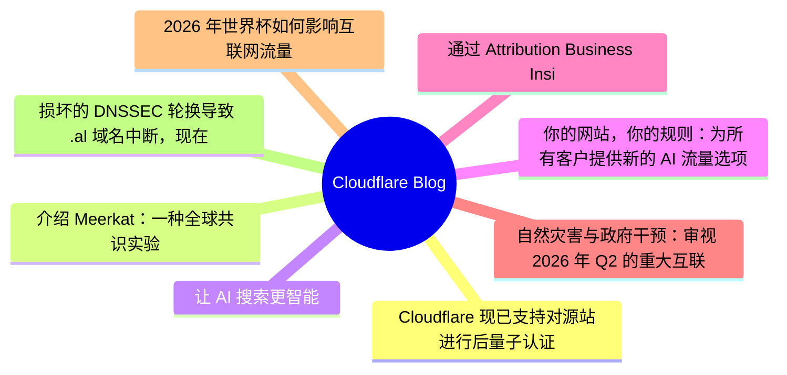
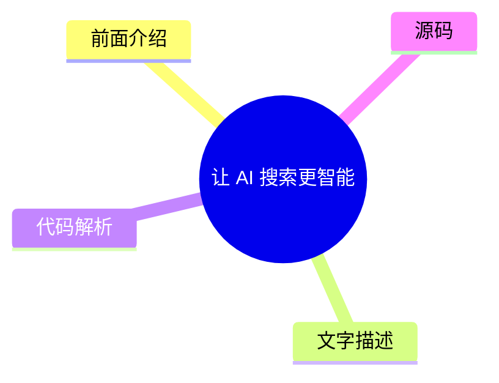
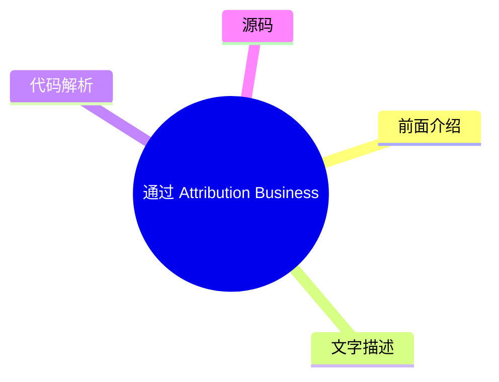
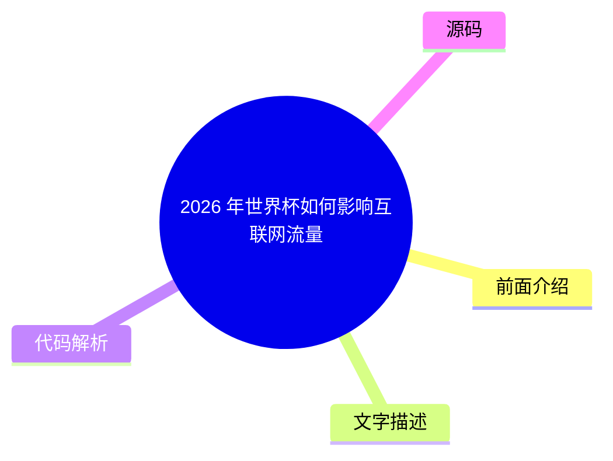
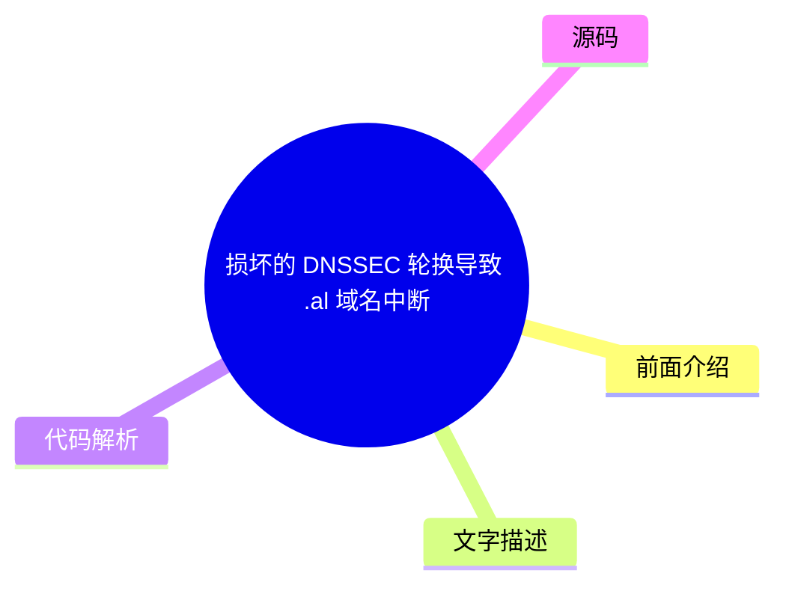

# ☁️ Cloudflare Blog Top 8 (2026-08-01)

## 前面介绍

- 数据源：Cloudflare Blog
- 抓取日期：2026-08-01
- 条目数：8
- 含完整正文：8
- 含代码片段：2
- 组织方式：前面介绍 / 树状图 / 文字描述 / 代码解析 / 源码

## 思维导图



## 详细整理（8 条，8 条含全文，2 条含代码）

### 1. Cloudflare 现已支持对源站进行后量子认证
- **链接**: [https://blog.cloudflare.com/post-quantum-authentication-to-origins/](https://blog.cloudflare.com/post-quantum-authentication-to-origins/)
- **作者**: Luke Valenta
- **发布**: Wed, 29 Jul 2026 13:00:00 GMT

#### 前面介绍

- Cloudflare 现在支持通过 Authenticated Origin Pulls 和自定义源站信任存储库与客户源服务器建立后量子（PQ）认证连接。
- 这是 Cloudflare 所有产品全面实现后量子安全的第一步里程碑。
- 该功能基于 Module-Lattice-Based Digital Signature Algorithm (ML-DSA) 签名，保护 Cloudflare 与客户源服务器之间的连接。

#### 树状图


#### 文字描述

- Cloudflare 的 Authenticated Origin Pulls 和 Custom Origin Trust Store 现在支持后量子认证。
- 文章解释了如何配置完全后量子安全的相互认证 TLS 连接到源服务器，深入探讨了工程细节。
- Cloudflare 过去几年的重点是部署后量子加密以应对“现在收割，以后解密”的攻击。
- 由于量子计算和密码分析的突破，行业普遍加快了向后量子密码学迁移的步伐。
- 文章详细介绍了 Cloudflare 到源站的连接与访客到 Cloudflare 的连接在认证需求上的不同。
- 对于源站连接，Cloudflare 作为客户端，可以利用连接池等技术分摊开销，并使用定制化的公钥基础设施（PKI）。

#### 代码解析

- 本文未提供源码，以下为实现思路或结构解析
- 使用 ML-DSA 签名算法替代传统的非后量子签名算法，以抵御量子计算机的破解能力。
- 利用连接池技术，将全球网络的大量请求汇聚到较少的连接上，分摊后量子签名带来的性能开销。
- 绕过公共互联网 PKI 的约束，使用自定义 PKI，避免中间证书带来的开销和延迟。

#### 源码

#### 源码片段 1（text）

```text
# Create a private ML-DSA-44 CA for the origin server
openssl genpkey -algorithm mldsa44 \
  -provparam ml-dsa.output_formats=seed-only \
  -out origin-ca.key
openssl req -new -x509 -key origin-ca.key \
  -out origin-ca.crt -days 10950 \
  -subj "/CN=Origin Server CA"
# Create the origin server certificate (signed by the origin CA)
openssl genpkey -algorithm mldsa44 \
  -provparam ml-dsa.output_formats=seed-only \
  -out origin-server.key
openssl req -new -key origin-server.key \
  -out origin-server.csr \
  -subj "/CN=origin.example.com"
openssl x509 -req -in origin-server.csr \
  -CA origin-ca.crt -CAkey origin-ca.key -CAcreateserial \
  -out origin-server.crt -days 5475 \
  -extfile <(printf "basicConstraints=CA:FALSE\nkeyUsage=digitalSignature\nsubjectAltName=DNS:origin.example.com\n")
```

#### 源码片段 2（text）

```text
# Create a private ML-DSA-44 CA for Authenticated Origin Pulls
openssl genpkey -algorithm mldsa44 \
  -provparam ml-dsa.output_formats=seed-only \
  -out aop-ca.key
openssl req -new -x509 -key aop-ca.key \
  -out aop-ca.crt -days 10950 \
  -subj "/CN=Authenticated Origin Pull CA"
# Create the client certificate Cloudflare will present (signed by the AOP CA)
openssl genpkey -algorithm mldsa44 \
  -provparam ml-dsa.output_formats=seed-only \
  -out aop-client.key
openssl req -new -key aop-client.key \
  -out aop-client.csr \
  -subj "/CN=cloudflare-aop-client"
openssl x509 -req -in aop-client.csr \
  -CA aop-ca.crt -CAkey aop-ca.key -CAcreateserial \
  -out aop-client.crt -days 5475 \
  -extfile <(printf "basicConstraints=CA:FALSE\nkeyUsage=digitalSignature\n")
```

#### 完整正文（中文）

Cloudflare's Authenticated Origin Pulls and Custom Origin Trust Store now support post-quantum authentication.

Here weâll explain how you can configure fully post-quantum secure mutually authenticated TLS connections to your origin server, dive into the engineering details of how we built it, make a shameful confession, and finally explain how this work fits into our overall post-quantum migration roadmap.

## Reaching a major milestone

Our focus for the past several years has been in deploying post-quantum [ encryption](https://radar.cloudflare.com/post-quantum) to protect against 

[attacks, where an attacker quietly stockpiles your encrypted data with the hope of decrypting it in the future with a quantum computer.](https://en.wikipedia.org/wiki/Harvest_now,_decrypt_later)

__harvest-now/decrypt-later__However, recent breakthroughs in quantum computing and cryptanalysis pulled the timelines for upgrading to post-quantum cryptography forward __across__[ industry](https://blog.google/innovation-and-ai/technology/safety-security/cryptography-migration-timeline/) and 

[and have caused us to shift our attention to deploying post-quantum](https://blog.cloudflare.com/post-quantum-eo-2026/)

__government__*authentication*, to protect against attackers who will soon be able to use quantum computers to break classical credentials and carry out impersonation attacks.

In a previous post, we announced that Cloudflare is [ targeting 2029](https://blog.cloudflare.com/post-quantum-roadmap/#cloudflares-roadmap-to-full-post-quantum-security) for full post-quantum security, and laid out several milestones to hit along the way. We have reached the first of those milestones: our 

[and](https://developers.cloudflare.com/ssl/origin-configuration/authenticated-origin-pull/)

__Authenticated Origin Pulls__[products](https://developers.cloudflare.com/ssl/origin-configuration/custom-origin-trust-store/)

__Custom Origin Trust Store__[via Module-Lattice-Based Digital Signature Algorithm (ML-DSA) signatures to protect connections between Cloudflare and customer origin servers.Â](https://developers.cloudflare.com/changelog/post/2026-06-17-pqc-mldsa-aop-cots/)


__now support post-quantum (PQ) authentication__## The origin connection is different

When a client visits a website proxied by Cloudflare, there are typically two connections involved. The first connection is from the visitor (e.g., a browser) to Cloudflare. If the request can be served from Cloudflareâs cache or triggers any blocking rules, Cloudflare might respond directly. Otherwise, Cloudflare establishes a second connection to the customerâs origin server to fetch the requested content, so it can respond to the original request.

Protecting sensitive visitor data requires both of these connections to be secure against quantum attacks. We enabled post-quantum encryption support for both the visitor-to-Cloudflare (Connection 1) and Cloudflare-to-origin (Connection 2) connections in [ 2022](https://blog.cloudflare.com/post-quantum-for-all/) and 

[, respectively, and already see](https://blog.cloudflare.com/post-quantum-to-origins/)

__2023__[.](https://radar.cloudflare.com/post-quantum)

__significant usage__We are actively working on completing the picture with post-quantum authentication. For the visitor-to-Cloudflare connection, we are collaborating with [ Google](https://blog.google/security/cultivating-a-robust-and-efficient-quantum-safe-https/) and others at the Internet Engineering Task Force (

[) to develop and](https://datatracker.ietf.org/wg/plants/about/)

__IETF__[with Merkle Tree Certificates](https://blog.cloudflare.com/bootstrap-mtc)

__experiment__[, a design for fast, post-quantum certificates for the web, with initial deployments targeting 2027. The topic of this post, however, is the Cloudflare-to-origin connection, where the requirements for authentication differ from that of the visitor-to-Cloudflare connection in several important ways.](https://datatracker.ietf.org/doc/draft-ietf-plants-merkle-tree-certs/)


__(MTC)__For this connection, Cloudflare is the client. This gives us the control to employ techniques such as connection pooling to fan in requests from all over our network to a smaller set of connections to origin servers, amortizing the overhead of connection setup over many requests. This makes the cost of âdrop-inâ post-quantum signatures more palatable, and the performance benefits of MTC less necessary.

And with a pre-existing trust relationship between Cloudflare and customers (i.e., a Cloudflare account), we need not tie ourselves to the constraints and timelines of the public key infrastructure (PKI) for the public Internet ([ WebPKI](https://cabforum.org/working-groups/server/baseline-requirements/requirements/)) and can instead use custom PKIs tailored to the use case, without overhead from intermediate certificates and 

[that may not be applicable. Solutions like](https://datatracker.ietf.org/doc/html/rfc6962)

__Certificate Transparency__[can also be used to protect the Cloudflare-to-origin connection without upgrading legacy origin systems, by forwarding traffic over a tunnel secured with post-quantum encryption (and post-quantum authentication in the works).](https://developers.cloudflare.com/tunnel/)

__Cloudflare Tunnel__All this to say, the unique requirements of the Cloudflare-to-origin connection have allowed us to deploy post-quantum authentication via ML-DSA authentication ahead of support landing in the WebPKI for the public Internet. (For customers who stick with the WebPKI, donât worry: weâll add MTC support on the Cloudflare-to-origin connection in the future.)

So how do you turn this on? Letâs dive into the configuration.

## Configuring fully PQ-secure origin connections

We have added ML-DSA support (for all [ FIPS 204](https://csrc.nist.gov/pubs/fips/204/final) parameter sets: ML-DSA-44, ML-DSA-65, and ML-DSA-87) to the Custom Origin Trust Store and Authenticated Origin Pulls products. ML-DSA-44 is our recommendation for most applications as it is the most performant option and attains a comfortable NIST 

[security strength.](https://nvlpubs.nist.gov/nistpubs/FIPS/NIST.FIPS.204.pdf#page=25)


__category 2__### 自定义源信任存储

当 Cloudflare 连接到配置了 [ Full (strict)](https://developers.cloudflare.com/ssl/origin-configuration/ssl-modes/full-strict/) SSL 模式的客户源服务器时，我们会根据由所有 

[证书颁发机构 (CAs) 以及 Cloudflareâs](https://ccadb.org)

__commonly trusted__[. The](https://developers.cloudflare.com/ssl/origin-configuration/origin-ca/)

__origin CA__[产品（需要](https://developers.cloudflare.com/ssl/origin-configuration/custom-origin-trust-store/)

__自定义源信任存储 (COTS)__[启用）允许客户用其控制的 CA 集合替换此默认信任存储。COTS 现在允许客户上传 ML-DSA CA，以便 Cloudflare 在连接到源服务器时信任任何链接到该 CA 的源服务器证书。](https://developers.cloudflare.com/ssl/edge-certificates/advanced-certificate-manager/)

__高级证书管理器__### 认证源拉取

为了限制对其源服务器的滥用和资源消耗，客户可能只想服务来自 Cloudflareâs 服务器的请求。[ 认证源拉取 (AOP)](https://developers.cloudflare.com/ssl/origin-configuration/authenticated-origin-pull/) 可用于配置 Cloudflare 向源服务器出示客户端证书以建立 

[连接，从而确保双方之间的通信是双向安全且受信任的。AOP 在所有 Cloudflare 计划级别上均可免费使用。](https://www.cloudflare.com/learning/access-management/what-is-mutual-tls/)

__mutual TLS (mTLS)__AOP supports three [ configuration levels](https://developers.cloudflare.com/ssl/origin-configuration/authenticated-origin-pull/#configuration-levels): global, per-zone, and per-hostname. The per-zone and per-hostname configuration levels now allow customers to upload ML-DSA certificates and private keys (in the FIPS 204 seed format), so that Cloudflareâs TLS client will present this certificate to authenticate itself when connecting to the origin server. (Donât worry, we havenât forgotten about the global configuration level â it just happens to be a more involved change that will be prioritized at a later date.)

### Avoiding downgrades

Adding post-quantum encryption and authentication support to both the authenticating and verifying parties is necessary but *not* sufficient for full post-quantum security. The pesky issue of downgrades remains. If the verifying party supports any quantum-vulnerable authentication mechanisms, they remain open to attack from an [ on-path attacker](https://www.cloudflare.com/learning/security/threats/on-path-attack/) capable of forging classical credentials.

The fix: the verifying party must remove trust in quantum-vulnerable authentication mechanisms. (This is more nuanced in complex PKIs. For example, see the Chromium Security teamâs [ four-stage plan](https://www.chromium.org/Home/chromium-security/post-quantum-auth-roadmap/) for transitioning the Web.) See the 

[for AOP and COTS for details on how to ensure your origin is secure against downgrade attacks.](https://developers.cloudflare.com/ssl/post-quantum-cryptography/pqc-to-origin/#avoid-downgrades)

__configuration guide__### Quick start

The walkthrough below shows how to generate an ML-DSA certificate chain and configure both products via the Cloudflare API. For dashboard instructions and additional context, refer to the [ developer docs](https://developers.cloudflare.com/ssl/post-quantum-cryptography/pqc-to-origin/).

1. Generate certificates

You will need OpenSSL 3.5.0 or later. The private key must be generated in the FIPS 204 seed-only encoding, which is the only format Cloudflare currently accepts on upload.


**Origin server certificate chain for COTS:**

```
# Create a private ML-DSA-44 CA for the origin server
openssl genpkey -algorithm mldsa44 \
  -provparam ml-dsa.output_formats=seed-only \
  -out origin-ca.key
openssl req -new -x509 -key origin-ca.key \
  -out origin-ca.crt -days 10950 \
  -subj "/CN=Origin Server CA"
# Create the origin server certificate (signed by the origin CA)
openssl genpkey -algorithm mldsa44 \
  -provparam ml-dsa.output_formats=seed-only \
  -out origin-server.key
openssl req -new -key origin-server.key \
  -out origin-server.csr \
  -subj "/CN=origin.example.com"
openssl x509 -req -in origin-server.csr \
  -CA origin-ca.crt -CAkey origin-ca.key -CAcreateserial \
  -out origin-server.crt -days 5475 \
  -extfile <(printf "basicConstraints=CA:FALSE\nkeyUsage=digitalSignature\nsubjectAltName=DNS:origin.example.com\n")
```
**Cloudflare client certificate chain for AOP:**

```
# Create a private ML-DSA-44 CA for Authenticated Origin Pulls
openssl genpkey -algorithm mldsa44 \
  -provparam ml-dsa.output_formats=seed-only \
  -out aop-ca.key
openssl req -new -x509 -key aop-ca.key \
  -out aop-ca.crt -days 10950 \
  -subj "/CN=Authenticated Origin Pull CA"
# Create the client certificate Cloudflare will present (signed by the AOP CA)
openssl genpkey -algorithm mldsa44 \
  -provparam ml-dsa.output_formats=seed-only \
  -out aop-client.key
openssl req -new -key aop-client.key \
  -out aop-client.csr \
  -subj "/CN=cloudflare-aop-client"
openssl x509 -req -in aop-client.csr \
  -CA aop-ca.crt -CAkey aop-ca.key -CAcreateserial \
  -out aop-client.crt -days 5475 \
  -extfile <(printf "basicConstraints=CA:FALSE\nkeyUsage=digitalSignature\n")
```
2. Upload the origin CA to Custom Origin Trust Store

```
CA_CERT=$(jq -Rs . < origin-ca.crt)
curl "https://api.cloudflare.com/client/v4/zones/$ZONE_ID/acm/custom_trust_store" \
  --header "Authorization: Bearer $CLOUDFLARE_API_TOKEN" \
  --header "Cont

...（截断，原文 22450+ 字符）


### 2. 介绍 Meerkat：一种全球共识实验
- **链接**: [https://blog.cloudflare.com/meerkat-introduction/](https://blog.cloudflare.com/meerkat-introduction/)
- **作者**: James Larisch
- **发布**: Wed, 08 Jul 2026 12:00:00 GMT

#### 前面介绍

- Cloudflare Research 正在构建一个名为 Meerkat 的全球共识服务，使用一种名为 QuePaxa 的新共识算法。
- Meerkat 将用于构建强一致性、容错的键值存储和其他应用。
- QuePaxa 算法允许所有副本随时进行写入，且进度不会因超时停止，非常适合 Cloudflare 的广域网环境。

#### 树状图


#### 文字描述

- Cloudflare 内部服务需要从全球 330 多个数据中心读取和修改控制平面状态。
- 系统必须保证不同读者永远看不到不一致的状态，并且在某些数据中心或链路故障时保持可用。
- 传统的共识算法（如 Raft）依赖领导者，一旦领导者故障或网络延迟导致超时，系统将变得不可用。
- Meerkat 基于 QuePaxa 算法，所有副本都可以执行写入，且不会因超时阻塞进度。
- Meerkat 目前处于实验阶段，主要设计用于管理小部分控制平面状态，并将在短期内保持内部使用。
- 文章详细描述了强一致性（线性化）的定义及其对分布式系统编程的重要性。

#### 代码解析

- 本文未提供源码，以下为实现思路或结构解析
- Meerkat 是一个实验性的共识服务，目前仍处于开发中。
- 它构建在共识日志之上，用于支持事务性键值存储和租赁系统等应用。
- 系统旨在解决广域网环境下的同步问题，确保在不可预测的网络条件下仍能达成一致。

#### 源码

#### 中文节选

Many internal services at Cloudflare need to read and modify the same control-plane state from across our 330+ global data centers. They need guarantees that different readers *never *see inconsistent state, and that the system remains available for writes even when some data centers or links fail.

But Cloudflareâs network runs across the entire Internet, and the Internet is an unpredictable place. Servers and data centers go down. Queues fill up. Links and cables get cut. These conditions make it difficult to run a globally available data system that guarantees strong consistency (e.g., that all readers are guaranteed to read all prior writes) because hostile conditions hinder distributed system replicasâ ability to reliably synchronize data with one another.

One way to synchronize data safely despite adverse network conditions is via a *consensus algorithm, *which* *allows a set of machines to agree on the same sequence of values, such as key-value store put and `get` operations, as long as a majority remains alive and able to communicate. 

Unfortunately, commonly deployed consensus algorithms like [ Raft](https://raft.github.io/) suffer in wide-area networks like Cloudflareâs because they rely on 

*leaders*and

*timeouts*. The

*leader*is the only replica allowed to make writes, and if it fails due to a crash or network degradation, the system becomes unavailable until some other replica

*times out*and a new leader is elected. And these timeout values are hard to configure in networks with unpredictable latencies.

We have experienced multiple incidents caused by unavailable leaders in consensus-driven systems.

And so, for the past year, Cloudflareâs Research [ team](https://research.cloudflare.com/) has been building a new distributed consensus service called 

**Meerkat**powered by a consensus algorithm called

[, published in 2023 by Tennage & BÄsescu et al. QuePaxa differs from Raft in that all replicas can perform writes at all times, and progress is never halted due to a timeout, which makes it well suited for Cloudflareâs network. We layer](https://bford.info/pub/os/quepaxa/quepaxa.pdf)


__QuePaxa__*应用程序*，例如事务型键值存储和租赁系统，构建在 Meerkat 的共识日志之上。据我们所知，这将是 QuePaxa 首次在全球范围内进行工业级部署。

Meerkat 是一个仍在开发中的实验性共识服务。它最初被设计用于管理小块控制平面状态（例如，复制数据库的领导权），因此在可预见的未来，它将仅限内部使用。本文介绍了 Meerkat，并为即将发布的与 Meerkat 相关的博客文章奠定了基础。

## 我们对全球控制平面数据系统的需求

许多 Cloudflare 服务从分布在世界各地的多台机器上读取和写入*控制平面数据*，这些数据有助于这些服务正确运行。控制平面数据的一个例子是*放置信息*：cer 的位置

#### 完整正文（中文）

Many internal services at Cloudflare need to read and modify the same control-plane state from across our 330+ global data centers. They need guarantees that different readers *never *see inconsistent state, and that the system remains available for writes even when some data centers or links fail.

But Cloudflareâs network runs across the entire Internet, and the Internet is an unpredictable place. Servers and data centers go down. Queues fill up. Links and cables get cut. These conditions make it difficult to run a globally available data system that guarantees strong consistency (e.g., that all readers are guaranteed to read all prior writes) because hostile conditions hinder distributed system replicasâ ability to reliably synchronize data with one another.

One way to synchronize data safely despite adverse network conditions is via a *consensus algorithm, *which* *allows a set of machines to agree on the same sequence of values, such as key-value store put and `get` operations, as long as a majority remains alive and able to communicate. 

Unfortunately, commonly deployed consensus algorithms like [ Raft](https://raft.github.io/) suffer in wide-area networks like Cloudflareâs because they rely on 

*leaders*and

*timeouts*. The

*leader*is the only replica allowed to make writes, and if it fails due to a crash or network degradation, the system becomes unavailable until some other replica

*times out*and a new leader is elected. And these timeout values are hard to configure in networks with unpredictable latencies.

We have experienced multiple incidents caused by unavailable leaders in consensus-driven systems.

And so, for the past year, Cloudflareâs Research [ team](https://research.cloudflare.com/) has been building a new distributed consensus service called 

**Meerkat**powered by a consensus algorithm called

[, published in 2023 by Tennage & BÄsescu et al. QuePaxa differs from Raft in that all replicas can perform writes at all times, and progress is never halted due to a timeout, which makes it well suited for Cloudflareâs network. We layer](https://bford.info/pub/os/quepaxa/quepaxa.pdf)


__QuePaxa__*applications*, like a transactional key-value store and leasing system, atop Meerkatâs consensus log. To our knowledge, this will be the first industrial deployment of QuePaxa at global scale.

Meerkat is an experimental consensus service that is still in development. Itâs being designed initially to manage small pieces of control plane state (e.g., leadership for replicated databases) and so it will be kept internal-only for the immediate future. This post introduces Meerkat and lays the groundwork for the Meerkat-related blog posts to come.Â

## What we need from a global control-plane data system

Many Cloudflare services read and write *control-plane data*, data that helps those services operate correctly, from multiple machines distributed all over the world. One example of control-plane data is *placement information*: where certain resources (like an AI model instance) are stored. Another example is *leadership information*: which machine is currently allowed to perform writes to a database. 

Control-plane data must be both *strongly* *consistent* and* accessible despite particular kinds of faults.*

In this section we precisely describe our consistency and fault tolerance requirements for a Cloudflare consensus service. We use a key-value store for a running example of an application running atop our consensus service, though other applications (e.g., distributed leases/locks) are possible.

### Strong consistency

A distributed data systemâs [ consistency](https://jepsen.io/consistency/models) level describes what kinds of weird behavior the system is allowed to exhibit when it receives concurrent reads and writes. Consider a distributed key-value store that stores a single numeric value 

`x = 6` across multiple nodes. Also consider the following sequence of writes. These writes are submitted to different nodes on a best-effort basis, and could arrive in any order: - `x = x + 1`
- `x = x / 2`

A systemâs consistency level tells you what values of `x` a client might see when reading `x` after these writes. Consider the following sequence of operations and the possible execution orders under different consistency levels:


In a weak consistency level, writes can be re-ordered. In a stronger consistency model, writes canât be reordered, but reads can. In the strongest possible consistency level, the operations are ordered exactly as they occurred in real time. This property is called *linearizability*.

At Cloudflare, many services want linearizability. Unlike weaker forms of consistency, linearizability relieves programmers from thinking about all the weird behaviors the data systems might exhibit. Instead, they can reason about the distributed system like they reason about local memory on a single-threaded machine: all reads after a write will see that write. For additional reading material on the dangers of weak consistency, check out this [ post](https://brooker.co.za/blog/2025/11/18/consistency.html) by Marc Brooker.

(If youâre wondering, Meerkatâs key-value store also provides serializability, which weâll write about in a future post.)

### Fault tolerance

A systemâs level of fault tolerance describes what kinds of faults the system can handle before catastrophes happen. Catastrophes are typically violations of properties the system aims to uphold, e.g., that two consecutive reads without an intervening write for the same key never see different values, or that the system remains available for writes. The faults include network failures or delays, machine crashes, and machine restarts. A system will typically explicitly handle some faults but not others (you canât handle all faults, as the universe could always reach heat-death). For example, some key-value stores might guarantee to remain available for writes as long as two-thirds of the machines in the system can communicate and donât crash, but make no promises if a machine is compromised and starts sending malicious messages.

Our desired fault tolerance properties are as follows:

**First**, the data system should remain available for writes and reads from a client located in any of our data centers as long as the following are true:

- A majority of the machines in our system are alive and can communicate with one another. (Formally, we tolerate `f`faults in a system of`2f + 1`machines).

- 客户端可以联系系统中的*任何*一台连接到大多数存活机器的机器。

这意味着单台机器故障，或单条链路的网络降级，都不会影响系统的可用性*。*正如我们稍后将看到的，Raft 系统不提供此属性。

**第二**，只要系统中的任何参与者不是主动恶意的（当然，也没有 bug），数据系统就会保持*正确*。我们将在后面从共识*安全性*的角度定义*正确性*，但通俗地说，这意味着没有两台最新的机器会就世界状态产生分歧（例如，一台认为 `key1=1`，而另一台认为 `key1=2`）。

总结来说，即使机器崩溃、机器重启、网络故障或降级、数据中心宕机等，系统也必须保持正确（尽管我们像基于 Raft 的系统一样，不处理[拜占庭故障](https://en.wikipedia.org/wiki/Byzantine_fault)）。

## 介绍 Meerkat

Meerkat 是一个共识服务，我们可以在其上构建具有上述属性（强一致性和容错性）的应用程序，例如键值（KV）存储。为了了解 Meerkat 的工作原理，我们首先概述 Meerkat 的总体架构，然后描述 Meerkat 对共识算法的选择如何提供强一致性和容错性。

使用 Meerkat 的服务开发人员会请求一个 Meerkat *副本集群*。每个副本都连接到其他所有副本。每个副本都参与共识算法，并且可以接收读写请求。开发人员可以指定允许在其副本上托管的数据中心，Meerkat 会自动放置它们。

为了与其集群交互，开发人员的客户端会向集群中的任意一个副本发送特定于应用程序的请求。单个副本可能托管多种类型的应用程序，但最简单的是键值存储，因此最简单的特定于应用程序的请求类型是 KV `get` 或 `put`。副本会使用特定于应用程序的响应来响应请求（例如，使用 `get` 请求的记录）。请注意，KV 读取（`get`）保证读取到最新信息。

### Meerkat 的日志

在底层，副本将应用程序请求（例如 `get` 和 `put`）转换为 *日志事件*。该副本使用共识算法将每个日志事件分发给所有其他副本，以确保所有副本维护完全相同的事件日志（实际上，副本可能会滞后，但绝不应记录不同的条目）。这些事件是任意的——Meerkat 的核心并不关心其中包含什么。Meerkat 的 *应用程序* 关心的是日志事件的内容。每个 Meerkat 副本“托管”许多 Meerkat 应用程序（例如键值存储），这些应用程序读取日志事件并构建状态。（请注意，每个副本恰好属于一个集群。）

例如，KV Meerkat 应用程序从日志事件中构建一个内存键值存储。因此，当客户端发送像 `put k1 v1` 这样的写入时，接收副本将该写入放入一个日志事件中并分发给所有副本。如果其他人随后在不同的副本上写入 `put k1 v11`，该事件也会被分发给所有副本。由于所有正常工作的副本拥有相同的日志，这些副本可以按顺序应用日志中的操作，以构建完全相同的状态。请注意，`get` 请求也会创建分布式日志事件（为了线性一致性，如下一节所述）。

以下是副本的 KV 存储在接收日志事件时如何更新的示例：

### Meerkat 的日志如何实现强一致性

Meerkat 保证，如果一个客户端执行 `put k1 v1`，第二个客户端随后执行 `put k1 v11`，第三个客户端随后执行 `get k1`（使用一致的读取），他们将始终读取 `v11`。即使每个请求提交到不同的副本，且这些副本随机分布在世界各地，Meerkat 也能保证这一点。这就是线性一致性。为了了解 Meerkat 如何保证这一点，我们必须更详细地检查 Meerkat 的日志。

Meerkat 日志是一系列槽位的序列。一个槽位是一个可以包含事件或不包含事件的盒子。包含事件的槽位被称为一个 *decided *槽位。日志中的所有槽位都是已决定的，除了最后一个槽位，它目前正在被决定。Meerkat 的不变量之一是，如果任何两个副本决定了一个槽位的值，那么这些值是相同的。换句话说，没有两个副本会就已决定槽位的值永远存在分歧（尽管一个副本可能认为最后一个槽位是空的，而另一个副本则不这么认为）。这个属性有助于保证我们在上一节中描述的期望属性。

为了决定日志中最后一个（空的）槽位的值，Meerkat 副本运行一个分布式的 *共识算法*。共识算法允许一组通过网络通信的机器就一个已决定的槽位值达成一致。我们的共识算法只要大多数副本（超过一半）存活就能正常工作。

因此，如果日志当前包含两个条目，并且一个客户端向一个副本提交了 `put k1 v11`，该副本就会为槽位 3 触发一个共识算法。但是，另一个客户端可能已经向不同的副本提交了 `put k1 v111` 用于槽位 3。共识算法确保只有针对槽位 3 的这样一个 *提议* 获胜。具体来说，它确保至少大多数副本同意同一个提议，并将其 *决定* 为槽位 3 的值。非大多数副本 *永远* 不能决定一个不同的提议，但可能会错过这一事实

...（截断，原文 20546+ 字符）


### 3. 让 AI 搜索更智能
- **链接**: [https://blog.cloudflare.com/making-ai-search-smarter/](https://blog.cloudflare.com/making-ai-search-smarter/)
- **作者**: Matthew Conroy
- **发布**: Wed, 01 Jul 2026 13:00:00 GMT

#### 前面介绍

- Cloudflare 推出研究计划，利用全球网络信号帮助 AI 搜索引擎发现更相关的内容，减少不必要的爬取。
- 通过识别内容变化和流量流向，AI 搜索引擎可以提供更高质量的答案，同时降低爬取成本。
- 该计划旨在解决 AI 搜索时代内容创作者面临的“可发现性”与“获得报酬”之间的矛盾。

#### 树状图



#### 文字描述

- 搜索是我们在网上发现几乎所有事物的方式，包括创作者、商家和答案。
- AI 正在重写规则，导致创作者在代理时代面临可发现性和获得报酬之间的两难境地。
- AI 搜索引擎直接读取页面并给用户提供摘要，导致访问量（以及依赖它的收入）减少。
- 研究表明，当 Google 显示 AI 摘要时，用户点击传统搜索结果链接的几率大幅下降。
- Cloudflare 拥有超过 20% 的全球网络，能够区分哪些页面真正发生了变化，哪些是 AI 代理正在聚集的地方。
- 该研究计划将探索结合客户提供的“新鲜度”信号和 Cloudflare 对流量流向的洞察。

#### 代码解析

- 本文未提供源码，以下为实现思路或结构解析
- 利用全球网络信号（如新鲜度、高质量、变化情况）来优化 AI 搜索结果。
- 通过减少不必要的爬取，降低 AI 公司和网站所有者的成本。
- 旨在建立一个新的互联网经济模型，让内容创作者在使用其作品时能够获得报酬。

#### 源码

#### 中文节选

搜索驱动了网络上的大多数体验。这是我们完成事情的方式，也是网络上几乎所有的东西被找到的方式——创作者、商家，以及你刚刚在框中输入的任何内容的答案。近 30 年来，那次发现之旅运行在一个简单的交易之上：让搜索引擎抓取你的内容，它就会向你发送访客。你通过广告、订阅，或者仅仅是受众本身，将这些访客转化为了生意。可被发现和获得报酬曾经是同一回事。一年前，在[首个内容独立日](https://blog.cloudflare.com/content-independence-day-no-ai-crawl-without-compensation/)，我们划下了一条线，以在 AI 时代捍卫这一交易。但一道界线仅仅是一个第一步。自那时以来，AI 搜索在消费者生活中的普及程度只增不减，因为

[. 威胁不再是你可以屏蔽的少数几个训练爬虫；而是搜索本身正在围绕 AI 答案进行重建。](https://radar.cloudflare.com/)

__超过 50% 的在线流量是非人类的__如今的答案引擎会读取你的页面并将摘要交给用户，因此访问——以及依赖于它的收入——就不再被需要了。我们亲眼目睹了这一点，独立研究也证实了这一点：一项[ 2025 年皮尤研究中心的研究](https://www.pewresearch.org/short-reads/2025/07/22/google-users-are-less-likely-to-click-on-links-when-an-ai-summary-appears-in-the-results/)发现，当谷歌显示 AI 摘要时，用户点击传统搜索结果链接的频率仅为 8%（大约是没有摘要时的一半），而点击摘要内部链接的频率仅为 1%。这让我们陷入了两难境地：退出 AI 搜索从而难以被发现，或者加入 AI 搜索，在为用户提供巨大价值的同时，却看到回报越来越少。我们的客户希望被找到并获得其提供价值的报酬，而目前他们被迫做出选择。

Today, [ weâve announced new bot options](http://blog.cloudflare.com/content-independence-day-ai-options) to help our customers better control who can access their site and what they can do with it. But blocking was only step one: saying "no" protects content without rebuilding the business models that sustain it. So, itâs time to start building the new economic model of the Internet, starting with search.

### Rebuilding the bargain

Transparency and control are the foundation, but more is needed. In 2025, we laid out our foundation via a set of [ responsible AI bot principles](https://blog.cloudflare.com/building-a-better-internet-with-responsible-ai-bot-principles/): bots should be transparent about who they are and what they're for, respect site owners' choices, and act in good faith. Our tools hold bots to that bar. But enforcing good bot behavior doesn't make AI search any better for the people relying on it, and it doesn't send a dollar back to the creator whose work made the answer possible. We can do more than help the web say "no"; we can help rebuild what it says "yes" t

#### 完整正文（中文）

搜索驱动了网络上的大多数体验。这是我们完成事情的方式，也是网络上几乎所有的东西被找到的方式——创作者、商家，以及你刚刚在框中输入的任何内容的答案。近 30 年来，那次发现之旅运行在一个简单的交易之上：让搜索引擎抓取你的内容，它就会向你发送访客。你通过广告、订阅，或者仅仅是受众本身，将这些访客转化为了生意。可被发现和获得报酬曾经是同一回事。一年前，在[首个内容独立日](https://blog.cloudflare.com/content-independence-day-no-ai-crawl-without-compensation/)，我们划下了一条线，以在 AI 时代捍卫这一交易。但一道界线仅仅是一个第一步。自那时以来，AI 搜索在消费者生活中的普及程度只增不减，因为

[. 威胁不再是你可以屏蔽的少数几个训练爬虫；而是搜索本身正在围绕 AI 答案进行重建。](https://radar.cloudflare.com/)

__超过 50% 的在线流量是非人类的__如今的答案引擎会读取你的页面并将摘要交给用户，因此访问——以及依赖于它的收入——就不再被需要了。我们亲眼目睹了这一点，独立研究也证实了这一点：一项[ 2025 年皮尤研究中心的研究](https://www.pewresearch.org/short-reads/2025/07/22/google-users-are-less-likely-to-click-on-links-when-an-ai-summary-appears-in-the-results/)发现，当谷歌显示 AI 摘要时，用户点击传统搜索结果链接的频率仅为 8%（大约是没有摘要时的一半），而点击摘要内部链接的频率仅为 1%。这让我们陷入了两难境地：退出 AI 搜索从而难以被发现，或者加入 AI 搜索，在为用户提供巨大价值的同时，却看到回报越来越少。我们的客户希望被找到并获得其提供价值的报酬，而目前他们被迫做出选择。

Today, [ weâve announced new bot options](http://blog.cloudflare.com/content-independence-day-ai-options) to help our customers better control who can access their site and what they can do with it. But blocking was only step one: saying "no" protects content without rebuilding the business models that sustain it. So, itâs time to start building the new economic model of the Internet, starting with search.

### Rebuilding the bargain

Transparency and control are the foundation, but more is needed. In 2025, we laid out our foundation via a set of [ responsible AI bot principles](https://blog.cloudflare.com/building-a-better-internet-with-responsible-ai-bot-principles/): bots should be transparent about who they are and what they're for, respect site owners' choices, and act in good faith. Our tools hold bots to that bar. But enforcing good bot behavior doesn't make AI search any better for the people relying on it, and it doesn't send a dollar back to the creator whose work made the answer possible. We can do more than help the web say "no"; we can help rebuild what it says "yes" to.

So today, we're announcing two initiatives that move from defense to offense and start putting both halves of that old bargain back together.

**Make AI search smarter: **By** **using the signals we see across our global network, like what's fresh, what's high quality, and what's actually changed, we can help answer engines surface the most relevant content and reduce unwanted crawling. People searching get better answers, while costs are reduced for both AI companies and site owners if webpages are only recrawled when theyâve changed.

**Pay creators for the value they provide:** When your work is used to answer someone's question, you should be rewarded instead of just being scraped for free. And you should be able to see what's being used and what people are asking. This should be a real revenue stream, and an incentive to keep producing original content worth finding.

### Making search smarter

Today we're launching a research program to make AI search smarter and stop our customers footing the bill for crawls that produce nothing new.


超过 20% 的网站位于 Cloudflare 的网络之后，这给了我们独特的视角。我们可以判断哪些页面真正发生了变化，哪些页面是人们和机器人蜂拥而至的。通过该计划，我们将探索利用客户选择分享的关于其内容新鲜度的信号，并将这些信号与我们自己对流量流向（包括人类和机器人）的洞察相结合。对于答案引擎而言，这是通往高质量内容的路线图。对于我们的客户而言，它提供了用户实际在问什么，以及他们的内容如何在 AI 结果中呈现的视图。我们的目标是衡量两件事：这些信号在多大程度上帮助答案引擎展示更新、更高质量的内容，以及它们在多大程度上减少了不必要的抓取。

第二个好处，即减少不必要的抓取，比听起来要大。Cloudflare 的数据显示，超过 50% 的优质机器人抓取流量都用于重新抓取未发生变化的页面——而且随着抓取量的增加，这个数字可能会上升。一个仅仅表示“这里什么都没变”的信号可以让抓取器跳过这次访问。这节省了答案引擎的计算资源。更重要的是，它让网站所有者免于处理和支付他们从未需要的请求。

该计划在设计上是中立的：我们的目标是让它适用于每一个愿意公平竞争的答案引擎。它仅限于搜索。我们不会分享任何内容，也不会使用任何内容来训练基础模型。我们打算公布我们的发现，包括对网站所有者的好处，例如更好的内容可发现性和减轻服务器压力。我们计划在今年晚些时候让这项功能广泛可用，并减少我们网络上的不必要的抓取。

### 从按抓取付费到按使用付费

去年，我们[推出了按抓取付费](https://blog.cloudflare.com/introducing-pay-per-crawl/)，以便出版商可以向 AI 公司收取抓取其内容的费用。这是一个真正的开始，但抓取只是价值的一种粗略衡量标准。一个页面可能只被抓取一次，然后在数千个答案中被引用，或者被反复抓取却从未被使用过。创作者希望为其提供的价值获得公平的报酬。

因此，我们正在将 Pay Per Crawl 转型为 Pay Per Use。我们正在与顶级 AI 公司（如 [ Ceramic.ai](http://ceramic.ai) 和 

[, 以及这种安排非常直接：组织可以自带支付模式，并轻松将其扩展到 Cloudflare 网络上的内容所有者身上。](http://you.com)

__You.com__Ceramic 构建了一种所谓的“按查询付费”模式，因此选择加入的出版商可以在其内容出现在 Ceramic 的搜索结果中获得报酬。这意味着支付设计遵循工作所创造的价值，而不是爬虫恰好抓取它的次数。

“为了扩展 AI 搜索的未来，我们需要一个拥有巨大覆盖面且致力于透明度和公平补偿的合作伙伴，”Ceramic.ai 创始人兼 CEO Anna Patterson 说，“Cloudflare 允许我们轻松且通过编程的方式扩展我们的运营。通过将我们的按查询付费模式带到他们的网络中，我们确保数百万内容所有者可以无缝加入，每次其内容出现在我们的搜索结果中都能获得补偿。”

除了补偿之外，参与 Cloudflare/Ceramic 计划的内容所有者还将解锁新的报告功能，以帮助进行答案引擎优化（AEO）。客户终于可以看到导致其内容出现在搜索结果中的热门查询、具体的网页和摘要、其平均搜索结果排名位置等。这是我们即将推出的众多帮助客户提高可发现性的产品中的第一个。

这只是众多新兴方法之一。另一种来自 You.com：代理可以根据需要为特定的高价值内容付费，而无需任何前期承诺。AI 提供商正在测试新的支付模式（例如按查询付费、按结果付费等），而我们拥有支持所有这些模式的基础设施。

我们想坦诚地说明，这只是一个实验。还有很多东西需要学习，包括这种模式在互联网规模下究竟表现如何。我们将与合作伙伴和客户一起，在实践中摸索并分享我们的发现。但目标很明确：AI 搜索公司能获得更及时、更有依据的答案，而那些让答案成为可能的客户（内容创作者）在提供帮助时也能获得报酬。Cloudflare 在这一切中的职责，就是提供让这一市场蓬勃发展的基础设施层。

我们认为，这更符合搜索经济未来的走向。旧式的人工网络优化搜索是为了节省时间——提供摘要、十个蓝色链接和一个点击。智能体驱动的互联网则不同：智能体可以快速阅读并持续搜索。搜索正变成智能体为了回答一个问题而执行的数十次操作，更接近一种公用事业而非目的地。在那个世界里，重要的单位不再是抓取或点击，而是结果。为结果定价，并支付促成结果的人的费用，是网络得以持续繁荣的方式。

### 我们想要赢得的头条

一年前的“内容独立日”，头条是默认的“不”：AI 不能在未获补偿的情况下抓取内容。今年，我们的重点是给用户提供更多的产品和控制选项，让他们能够说“是”，并从中获得更多好处。

今天的公告只是开始。Cloudflare 的研究项目旨在探索我们的信号能否在减少抓取的情况下产生更好的结果。按使用付费是我们将与合作伙伴一起尝试的有前景的方向，这些合作伙伴相信内容创作者理应获得对其工作的公平补偿。过去 30 年来的网络也是这样建立起来的：有人先进行试点，将“模型坏了”转变为“这是新模型”，一次实验接着一次实验。我们相信，我们的客户在这个新的智能体时代能够被发现，并优化其内容以实现最大程度的发现，这一点对他们是有价值的。但他们应该能够做到这一点，而无需免费赠送他们最有价值的创意资产。

互联网正在发生变化，它所依赖的商业模式也随之改变。旧的互联网是开放、中立且值得贡献的。我们有机会保持互联网的这种状态，并构建出资助未来的商业模式。为人类和智能体提供更智能的答案。为那些凭借技能、创造力和投入让答案变得有价值的人们提供公平的交易。这就是我们追求 Cloudflare 使命的方式：帮助构建更好的互联网。

祝内容独立日快乐！

* 建立在开放、面向智能体的互联网之上？如果您有兴趣了解更多关于 Ceramic 和 You 计划的信息，请填写
__此表单__。如果您正在构建答案引擎并希望进行更智能的抓取，我们也非常乐意收到您的来信：aeo@cloudflare.com。


### 4. 你的网站，你的规则：为所有客户提供新的 AI 流量选项
- **链接**: [https://blog.cloudflare.com/content-independence-day-ai-options/](https://blog.cloudflare.com/content-independence-day-ai-options/)
- **作者**: Jin-Hee Lee
- **发布**: Wed, 01 Jul 2026 13:00:00 GMT

#### 前面介绍

- Cloudflare 为网站所有者提供了更精细的选项来管理 AI 流量，不再是一刀切的拦截。
- 新的分类系统区分了搜索、代理和训练机器人，并允许用户针对不同用途进行管理。
- 网站所有者现在可以更灵活地控制谁可以访问其网站以及他们可以对内容做什么。

#### 树状图


#### 文字描述

- 一年前，Cloudflare 宣布了“内容独立日”，旨在捍卫 30 年来的爬取与引流交易。
- AI 正在改变搜索的规则，导致内容创作者面临生存危机。
- 新的分类法不再仅仅将机器人定义为“AI”或“非 AI”，而是关注它们在网站上的行为、存储和内容重用方式。
- 分类包括：搜索（索引内容以备后用）、代理（自动化交互）和训练（将数据永久吸收到 AI 架构中）。
- Cloudflare 鼓励机器人运营者将具有多种用途的爬虫分离为三个独立的爬虫，以提高透明度。
- 网站所有者可以根据这些分类设置不同的管理选项，而不仅仅是“拦截所有自动化”。

#### 代码解析

- 本文未提供源码，以下为实现思路或结构解析
- 基于行为而非标签的实用分类法，以适应不断演变的 AI 用例。
- 提供针对搜索、代理和训练三种场景的精细化管理工具。
- 旨在帮助网站所有者在保护内容和保持可发现性之间取得平衡。

#### 源码

#### 中文节选

一年前，我们宣布了第一个 [内容独立日](https://blog.cloudflare.com/content-independence-day-no-ai-crawl-without-compensation/)，并赋予网站所有者收回对其内容控制权的手段。爬虫与网站所有者之间维持了30年的交易——我们爬取你的内容，而你获得推荐——不再成立。AI 正在拿走一切却一无所返，这对网站所有者构成了生存威胁。因此，我们推出了一个一键式的“屏蔽 AI 机器人”选项，以及

[.](https://blog.cloudflare.com/introducing-pay-per-crawl/)

__按爬取付费市场__

一年间发生了许多变化。去年七月，围绕“AI 机器人”的讨论主要集中在未经补偿就阻止 AI 训练，指出了这种内容被用于模型训练却没有任何价值回馈给网站所有者的零和博弈。但一种对更细致处理方式的需求已经浮现：内容所有者仍然希望能够保护自己的内容，并且应该为他们辛勤创作、策展和分享的原创内容获得报酬。我们也知道，封闭内容并非“一刀切”的解决方案；网站所有者希望拥有比“每次都屏蔽所有自动化”更多的选择。

如果你运营一个小型网站，问题不仅仅是有人可能会在你的内容上训练模型——而是根本没人能找到你。因此，你必须做出一种浮士德式的交易：要么出现在搜索结果中并允许 AI 训练你的内容，要么冒着失去可发现性的风险。如果搜索提供商对搜索和训练使用相同的机器人，这会不公平地偏向现有搜索提供商；而这种不公平的优势会激励新玩家在试图缩小竞争差距时采取规避策略。

### 现在，AI 可以无处不在

如今，AI 可以存在于任何地方。谷歌搜索已经从由 AI 排序转变为 [ 全答案引擎](https://blog.google/products-and-platforms/products/search/search-io-2026/)，直接在结果页面上回答你的问题。谷歌并非唯一处于这种地位的——这正是“搜索”发展的方向。

We could debate the cutoff for what qualifies as âAIâ today, just to find that the standard changes tomorrow. So, instead of defining a bot primarily as âAIâ or not, our updated approach to classification will ask deeper questions about bot or agent behavior: What are they doing on my site? What are they storing? And how will they reshare my content?

### A pragmatic taxonomy

To address these questions, we need a more nuanced view â a pragmatic taxonomy that aligns with the AI use cases our customers care about. So we are opening the discussion beyond AI training alone and focusing on three AI use cases that we want all customers to be able to manage:

- **Search:**any behavior that collects or indexes your content, so it can answer questions about it later. The key is that Search is proactively building a database of your site to later respond to queries with. Site owners sho

#### 完整正文（中文）

一年前，我们宣布了第一个 [内容独立日](https://blog.cloudflare.com/content-independence-day-no-ai-crawl-without-compensation/)，并赋予网站所有者收回对其内容控制权的手段。爬虫与网站所有者之间维持了30年的交易——我们爬取你的内容，而你获得推荐——不再成立。AI 正在拿走一切却一无所返，这对网站所有者构成了生存威胁。因此，我们推出了一个一键式的“屏蔽 AI 机器人”选项，以及

[.](https://blog.cloudflare.com/introducing-pay-per-crawl/)

__按爬取付费市场__

一年间发生了许多变化。去年七月，围绕“AI 机器人”的讨论主要集中在未经补偿就阻止 AI 训练，指出了这种内容被用于模型训练却没有任何价值回馈给网站所有者的零和博弈。但一种对更细致处理方式的需求已经浮现：内容所有者仍然希望能够保护自己的内容，并且应该为他们辛勤创作、策展和分享的原创内容获得报酬。我们也知道，封闭内容并非“一刀切”的解决方案；网站所有者希望拥有比“每次都屏蔽所有自动化”更多的选择。

如果你运营一个小型网站，问题不仅仅是有人可能会在你的内容上训练模型——而是根本没人能找到你。因此，你必须做出一种浮士德式的交易：要么出现在搜索结果中并允许 AI 训练你的内容，要么冒着失去可发现性的风险。如果搜索提供商对搜索和训练使用相同的机器人，这会不公平地偏向现有搜索提供商；而这种不公平的优势会激励新玩家在试图缩小竞争差距时采取规避策略。

### 现在，AI 可以无处不在

如今，AI 可以存在于任何地方。谷歌搜索已经从由 AI 排序转变为 [ 全答案引擎](https://blog.google/products-and-platforms/products/search/search-io-2026/)，直接在结果页面上回答你的问题。谷歌并非唯一处于这种地位的——这正是“搜索”发展的方向。

我们可以争论一下今天什么才算是“AI”的截止点，结果却发现标准明天就会改变。因此，与其将机器人主要定义为“是”或“不是”“AI”，我们的更新分类方法将询问关于机器人或代理行为更深层的问题：它们在我的网站上做什么？它们存储了什么？以及它们将如何重新分享我的内容？

### 实用的分类法

为了回答这些问题，我们需要一个更细致的视角——一种与我们客户关心的 AI 用例相一致的实用分类法。因此，我们将讨论范围从单纯的 AI 训练扩展开来，并专注于三个我们希望所有客户都能管理的 AI 用例：

- **搜索：**任何收集或索引您内容的行为，以便日后回答相关问题。关键在于，搜索是主动构建您的网站数据库，以便稍后响应用户查询。网站所有者应预期会因此获得推荐流量或其他公平的补偿。
- **代理：**自动化 **训练**：抓取您的内容以训练或微调模型的爬虫。关键在于，您的数据被永久吸收到 AI 的底层架构中，以提升其能力。

网络上的许多流行爬虫都属于上述分类之一；有些则属于多个分类。除了上述三种行为外，我们还将许多其他行为进行了分类——包括广告验证、内容抓取以及代理交易（关于这一点将在下文详述）。但我们认为，所有网站所有者都应该能够轻松管理这三种以 AI 为中心的用例的访问权限。我们相信，机器人操作者应该将他们的爬虫分开，因为这能为网站所有者创造更多的透明度：使他们能够更好地理解为什么特定的爬虫正在访问他们，并更好地管理他们授予该爬虫的访问权限。如果一家公司运行的自动化程序既构建 **搜索** 索引，充当 **代理**，又收集数据来 **训练** 他们的模型，那么我们强烈建议该公司将自动化程序拆分为三个独立的爬虫。

We want a classification system that is scalable and representative of the world of automated traffic as it evolves. Tracking a botâs purposes is nothing new, but our new taxonomy involves a few updates that better represent the state of bot traffic today. Most notably, we want to recognize that bots that have multiple purposes should be tracked with all purposes, not just one of them.

### New options to manage AI traffic

**We want to provide more options for managing different kinds of AI traffic, to  all website owners on the Cloudflare network.**

The managed preset to âBlock AI botsâ that weâve announced in the past included single-purpose bots that crawled data for model training, as shown below:Â

*Screenshot of the existing setting to manage AI bot traffic on July 1, 2025.*

But not all AI use is the same, and we want our customers to have the controls they need. So, weâre launching the ability to **manage AI traffic based on  three major use cases: Search, Agent, and Training** crawlers. With these new options, our customers can more finely tune how they manage AI bot traffic â including customers on our Free tier.

*Screenshot of the new options to manage AI bot traffic on July 1, 2026.*

### Setting new defaults

**On September 15, 2026, weâll be setting new defaults** **for each of these three classifications.** For all new domains onboarding to Cloudflare, the categories of **Training** and **Agent** will be blocked by default **on the pages that display ads, **while **Search** will remain allowed by default. 

An ad is a signal that a website owner meant for a person to land there and see it â something monetizable that fuels the business. So, on those pages, we treat human attention as the end goal, and keep away the bots that may prevent this attention (i.e., Training and Agent bots). On the other hand, Search is the behavior that most naturally funnels back visitors, and we believe itâs in the interest of most site owners to allow this.


另一项将于9月15日生效的变更涉及多功能爬虫（特别是结合了搜索与训练功能的爬虫），将根据其*所有*行为来决定允许或阻止，这与我们呼吁网站所有者保持透明度的要求一致。由于默认设置将执行最严格的适用规则，因此，如果客户选择了阻止训练（无论是通过[管理 AI 流量](https://developers.cloudflare.com/bots/additional-configurations/block-ai-bots/)的新选项，还是通过传统的“阻止 AI 爬虫”服务），Googlebot、Applebot 和 BingBot 等多功能爬虫将被阻止。

当然，客户的选择至关重要：如果网站所有者希望退出这些新的默认配置，他们可以在9月15日之前的任何时间在[安全设置中轻松标记此项](https://dash.cloudflare.com/?to=/:account/:zone/security/settings)，这将确认他们希望对兼具搜索目的的训练爬虫*不做任何更改*。随着我们接近9月15日，我们还将继续通知客户关于默认设置变更的信息，以确保希望选择与默认设置不同的配置的客户有机会进行设置。

### BotBase：企业客户的新可见性平面

我们也很高兴推出一项重大的可见性更新，作为企业级机器人管理的一项新功能。随着 Cloudflare 跟踪的机器人目录不断扩大，人们也越来越希望将这些机器人进行合理的分组管理，并了解关于特定机器人的更多细节。

隆重介绍 [BotBase](https://developers.cloudflare.com/bots/botbase/)。BotBase 是我们追踪所有已知机器人的新数据库，包括已验证的机器人和代理。该数据库提供了我们整个机器人目录的全面、可搜索视图，直接在 Cloudflare 仪表板上呈现。我们优先解决*可见性*问题，但今年晚些时候，我们将扩展 BotBase，为网站上的已知自动化内容提供直接的控制中心。

With this new view, Enterprise Bot Management customers can see the full catalogue of all Verified bots/agents and where they are classified in this updated taxonomy â a view weâve never shown dynamically on the Cloudflare dashboard before. Customers who want to precisely target a specific bot can also easily filter for all traffic from this bot, plus copy the detection ID to use in Security rules. All of this is now live within a dedicated page, which can be accessed through the [ Bot Management configuration card](https://dash.cloudflare.com/?to=/:account/:zone/security/settings/bot-traffic/bot-base). 

As we built BotBase, we wanted to account for all of the pieces of information that would allow us to build scalable, powerful insights from bot to bot. One of these pieces is a cornerstone for our updated taxonomy, which is **based on what a bot may do on your site â its behavior.** We separate these classifications as shared below, and each bot is classified with one or more of these behaviors.

| Bot classification | Behaviors and uses | 
|---|---|
| Search | Crawling to scan your site to help it appear in search engine results | 
| Agent | User-directed agents visiting a page on behalf of a human | 
| Training | Crawling to train or fine-tune models | 
| Transact | Checkout actions on behalf of users | 
| Data Collection | Includes price scraping, competitive intelligence gathering, and third-party analytics | 
| Security Testing | Includes vulnerability scanning and penetration testing | 
| SEO | SEO crawling, site auditing, accessibility checks | 
| Ads Verification | Ad placement verification, ad fraud detection | 
| Social / Link Preview | Link previews for social platforms and messaging apps | 
| Feed Fetching | Includes RSS readers, podcast aggregators, and news feed bots | 
| Monitoring & Operations | Includes uptime monitoring, webhooks, and health checks | 

*Bold italicized rows indicate the new configurable options that are available to all customers.*

### How does a crawler use my content?


Another piece of information weâve heard is important to our customers is a botâs** content use â what a bot may keep and reshare after it has crawled your content.** To address this, we are building capabilities for Bot Management customers to select and block based on the âcontent use.â This setting can be set to one of three levels, from least to most permissive:

- `immediate`â interact, but store and reuse nothing
- `reference`(default) â index, excerpt, and link back
- `full`â summarize and reproduce

These values can be combined with bot classifications to express nuanced rules, such as âallow all bots that are used for **Search**, **SEO**, and **Ads Verification**, but only up to the `reference` use level.â This allows website owners to make decisions in sensible groupings rather than manage individual bot-by-bot rules**.**

To further support this, starting today, we're testing a new signal, `use`, that extends [ Content Signals](https://contentsignals.org/) and lives in your robots.txt. This extends the three fields of the first version of Content Signals with a fourth, optional field that expresses the same preference as above:

- `use=immediate`
- `use=reference`
- `use=full`

As with all other items listed in the robots.txt file, the values of content use signal a website ownerâs *preference*, rather than issuing blocks directly. Weâre now adding support for this extension: all customers who have already enabled managed robots.txt â which prepends the preference to robots.txt that crawling for search is okay, but that crawling for training is not â will now have the additional preference of `use=reference` added to their robots.txt.

```
# Cloudflare Managed content with original Content Signals
User-agent: *
Content-Signal: search=yes,ai

...（截断，原文 17662+ 字符）


### 5. 通过 Attribution Business Insights 揭示爬取行为
- **链接**: [https://blog.cloudflare.com/attribution-business-insights/](https://blog.cloudflare.com/attribution-business-insights/)
- **作者**: Jin-Hee Lee
- **发布**: Wed, 01 Jul 2026 06:00:00 GMT

#### 前面介绍

- Cloudflare 推出了新的 Attribution Business Insights 仪表板，帮助网站所有者了解爬虫行为、意图和潜在价值。
- 该仪表板提供了关键见解，支持围绕爬取补偿的业务级对话。
- 它旨在区分提供价值的流量和消耗资源但不产生商业价值的流量。

#### 树状图



#### 文字描述

- 网站所有者面临管理流量和获得内容报酬的复杂挑战。
- AI 爬虫和代理的兴起打破了传统的 SEO 时代“爬取-引流”的平衡关系。
- AI 爬虫的爬取与引流比例极高（可达 50,000:1），这对网站所有者极不公平。
- 这导致网站所有者失去推荐流量、广告展示和直接受众关系，同时还要承担托管 AI 爬虫的基础设施成本。
- Attribution Business Insights 仪表板旨在提供关键数据，帮助网站所有者了解哪些机器人有帮助，哪些有害。
- 它提供了一个目标视图，专注于客户最关心的细节，比传统分析工具更易于分析。

#### 代码解析

- 本文未提供源码，以下为实现思路或结构解析
- 通过分析爬取与引流的比例，量化 AI 流量对网站的影响。
- 提供关于人类、非 AI 机器人和 AI 机器人流量的价值洞察。
- 帮助网站所有者了解其数据被用于什么目的，从而支持关于补偿的谈判。

#### 源码

#### 中文节选

原始内容是对话和好奇心的生命线。想象一个没有它的世界：我们可以找到一千种方式来重复已经创造过的材料，但我们会目睹新鲜想法和论点的衰退。

网站所有者推动了想法、新闻和有趣琐事生态系统的运转，但他们面临着管理网站流量并获得内容报酬的日益复杂的挑战。虽然某些机器人流量显然是恶意的，但当某个特定的 AI 爬虫是在帮助还是损害您的业务时，这并不总是显而易见的。为了回答这个问题，网站所有者需要细粒度、可靠的数据来区分提供价值的流量，以及消耗资源并侵蚀其商业模式基础（即实际人类消费其内容）的流量。

在 Cloudflare，我们秉持一个核心信念：网站所有者有权 [控制对其内容的访问](https://blog.cloudflare.com/content-independence-day-no-ai-crawl-without-compensation/)。我们要帮助网站所有者维护其高质量内容并规范 AI 流量。

为了提供迫切需要的清晰度并帮助网站所有者掌握主动权，我们很兴奋地宣布推出新的 [Attribution Business Insights 仪表板](https://developers.cloudflare.com/bots/attribution-business-insights/) —— 该仪表板专为商业决策者和出版商设计。

### 互联网的新经济模式

几十年来，互联网的商业模式依赖于一种简单、心照不宣的协议：网站所有者允许搜索引擎爬取其内容，作为回报，搜索引擎会将读者送回其页面。这种共生关系（传统搜索引擎以平衡的“爬取-推荐”比率运行）产生了维持广告、联盟收入和订阅所需的页面浏览量。搜索索引爬虫会扫描您的内容 [每次推荐发送一次](https://blog.cloudflare.com/ai-search-crawl-refer-ratio-on-radar/)，因此让网站对爬虫可用意味着有一条通往额外收入的清晰管道。我们可以将其视为 SEO（搜索引擎优化）时代。

Today, the explosive rise of AI crawlers and agents has broken this contract, plunging the digital publishing industry into an unprecedented crisis. The Internet is risking a transition into a "zero-click" ecosystem where AI chatbots scrape original content to synthesize instant answers â completely bypassing the original sources. Weâve already seen a marked shift from the SEO-only world into an AEO (Answer Engine Optimization) world, and now conversations around GEO (Generative Engine Optimization) are taking center stage.

The imbalance of this new reality is made clear by the crawl-to-referral ratios we see across the Internet today. While traditional search engines had a more balanced ratio of crawls to legitimate visitors referred, major AI crawlers operate on a drastically different, extractive scale. Bots

#### 完整正文（中文）

原始内容是对话和好奇心的生命线。想象一个没有它的世界：我们可以找到一千种方式来重复已经创造过的材料，但我们会目睹新鲜想法和论点的衰退。

网站所有者推动了想法、新闻和有趣琐事生态系统的运转，但他们面临着管理网站流量并获得内容报酬的日益复杂的挑战。虽然某些机器人流量显然是恶意的，但当某个特定的 AI 爬虫是在帮助还是损害您的业务时，这并不总是显而易见的。为了回答这个问题，网站所有者需要细粒度、可靠的数据来区分提供价值的流量，以及消耗资源并侵蚀其商业模式基础（即实际人类消费其内容）的流量。

在 Cloudflare，我们秉持一个核心信念：网站所有者有权 [控制对其内容的访问](https://blog.cloudflare.com/content-independence-day-no-ai-crawl-without-compensation/)。我们要帮助网站所有者维护其高质量内容并规范 AI 流量。

为了提供迫切需要的清晰度并帮助网站所有者掌握主动权，我们很兴奋地宣布推出新的 [Attribution Business Insights 仪表板](https://developers.cloudflare.com/bots/attribution-business-insights/) —— 该仪表板专为商业决策者和出版商设计。

### 互联网的新经济模式

几十年来，互联网的商业模式依赖于一种简单、心照不宣的协议：网站所有者允许搜索引擎爬取其内容，作为回报，搜索引擎会将读者送回其页面。这种共生关系（传统搜索引擎以平衡的“爬取-推荐”比率运行）产生了维持广告、联盟收入和订阅所需的页面浏览量。搜索索引爬虫会扫描您的内容 [每次推荐发送一次](https://blog.cloudflare.com/ai-search-crawl-refer-ratio-on-radar/)，因此让网站对爬虫可用意味着有一条通往额外收入的清晰管道。我们可以将其视为 SEO（搜索引擎优化）时代。

今天，AI 爬虫和智能体的爆发式增长打破了这一契约，将数字出版业推向了前所未有的危机。互联网正面临转变为“零点击”生态系统的风险，AI 聊天机器人抓取原创内容以合成即时答案——完全绕过了原始来源。我们已经看到了从仅 SEO 世界向 AEO（答案引擎优化）世界的明显转变，而现在，关于 GEO（生成式引擎优化）的讨论正占据中心舞台。

这种新现实的不平衡在我们今天看到的爬虫到转化的比例中显而易见。虽然传统搜索引擎的爬虫与合法访问者转化的比例更为平衡，但主要 AI 爬虫的运作规模截然不同，且具有提取性。人们观察到，领先 AI 公司的机器人拥有从 118:1 到接近 50,000:1 不等的爬虫到转化的比例，这一情况出现在 [我们的内容独立日 2025 年](https://blog.cloudflare.com/ai-crawler-traffic-by-purpose-and-industry/) 前后。换句话说，一个 AI 爬虫可能已经抓取了你的优质内容数万次，却只带回了一个访问者。这种比例从根本上是不公平的。

对于出版商来说，这造成了双重打击：首先，他们失去了至关重要的转化流量、广告展示以及支持内容创作和新闻业的直接受众关系。其次，他们被迫承担托管和向自动化机器人提供内容的不断上升的基础设施成本，而这些机器人没有任何商业回报。允许 **所有** 爬虫以希望被发现的那个时代已经结束了。

## 介绍 Attribution Business Insights

我们希望网站所有者掌握事实——即那些能帮助他们了解哪些机器人有助于其业务、哪些机器人会损害其业务的冰冷、确凿的数据。我们还希望让这种分析比以往任何时候都更容易，这就是我们设计 Attribution Business Insights 的原因，旨在过滤掉噪音，专注于客户告诉我们最重要的细节。

今天，

__Attribution Business Insights 仪表板__对所有 Cloudflare Bot Management 客户开放

*targeted*的网站流量视图；与可能需要大量手动过滤的传统分析工具不同，此仪表板可立即为您提供关键洞察。

我们旨在回答当今网站所有者最紧迫的问题：**您应该如何考虑网站上的 AI 流量？** 不同受众（包括人类、非 AI 机器人以及 AI 机器人）的价值是多少？最重要的是，您的数据被用于什么目的？

*新的 Attribution Business Insights 仪表板视图，其中包括关于机器人流量的整体洞察、全站爬取到引荐的比率，以及 AI 机器人流量与有机流量的分布。*

为了回答这些问题，仪表板展示了强大的数据和洞察组合：

- **内容页面的机器人流量：** 查看您的总体机器人与人类流量，以及所有成功访问内容页面的机器人数量。
- **爬取到引荐的比率：** 以 24 小时、7 天或 30 天为单位查看您的全站爬取到引荐的比率。您还可以查看*每个机器人操作者*（拥有一个或多个机器人的公司）的爬取到引荐的比率。
- **顶级机器人细分：** 按流量列出的顶级机器人列表，包括其来源国家、在您网站上占用的带宽，以及您当前是阻止还是允许它们。
- **基于爬虫行为的更新分类：** 我们超越了通用的“AI 爬虫”标签，使用更新的分类法对爬虫进行分类，无论是用于**训练**（即训练 __LLM 聊天机器人的下一个版本__）、**搜索**（即刷新 __检索增强生成__ 的数据库）还是**代理**（即用于 __代理交互以返回答案__）。

### 从数据到商业策略

您不应成为安全专家才能了解 AI 爬虫如何影响您的业务。如果网站所有者只想花几分钟时间了解高层级洞察，他们就能对内容安全策略的有效性有一个清晰的评估。

对于那些希望进一步挖掘，了解 AI 公司如何利用其内容——或收集信息以指导他们希望与 AI 公司建立的关系发展——我们提供了一个按机器人运营商组织的更细致的视图。

*按网站分类的机器人活动细分，包含每个机器人的重要详细信息，例如类型、爬取到转化的比率以及当前操作。*

通过对公司寻求访问您网站内容的情况有一个综合视图，您可以更好地建立爬虫活动的基础数据。我们希望这些数据能帮助我们的客户在参与任何业务对话时手握事实。告诉公司 1，其爬取量是公司 4 的二十倍，而公司 4 已经在为内容向您付费。根据其近期活动重新评估公司 2 许可您内容的方式。这个新仪表板将推动业务对话向前发展。

这一新层级的可见性如何与您现有的用于保护网站免受滥用的工具相结合？与 [Bot Management](https://developers.cloudflare.com/bots/get-started/bot-management/) 的其他功能保持一致，*action*（操作）步骤仍然在安全规则中执行。为了避免给控制平面增加噪音，Attribution Business Insights 旨在成为*深思熟虑、经过筛选的分析*的中心枢纽，而不是另一个采取行动的地方。该仪表板作为信息的主要来源，允许您在同一个管理其他滥用缓解措施的控制引擎中采取行动之前进行调查。我们还希望明确邀请业务决策者进入此仪表板，承认围绕 AI 流量的讨论涉及的利益相关者范围比仅限于安全专业用户的范围更广。

### 接下来是什么

The Attribution Business Insights dashboard is the next critical step in providing website owners with the transparency and control they need to manage evolving AI bot threats, and more broadly, shape the new dynamics of the Internet. Weâre already investigating the next iteration with close publishing partners to create a visibility plane that covers security from the perspective of the website owner with valuable, original content to share.Â

A sneak preview below includes a new view to dissect crawler activity *per-article* to reveal the appetite that AI companies have for different pieces of content, different campaigns, and so on.

*Breakdown of most popular articles, according to traffic volume. Shows key metrics such as AI bot traffic vs. other bot traffic vs. human traffic, both direct and from a referral.  *

Visibility is the first piece, and thereâs more to come to empower website owners to take control of their content in this new age. We encourage all customers of [ Cloudflare Bot Management](https://www.cloudflare.com/application-services/products/bot-management/) â especially those driving business conversations â to access this today for a fresh take on analytics.Â


### 6. 自然灾害与政府干预：审视 2026 年 Q2 的重大互联网中断事件
- **链接**: [https://blog.cloudflare.com/q2-2026-internet-disruption-summary/](https://blog.cloudflare.com/q2-2026-internet-disruption-summary/)
- **作者**: Lai Yi Ohlsen
- **发布**: Tue, 28 Jul 2026 13:00:00 GMT

#### 前面介绍

- Cloudflare Radar 追踪了由自然灾害、政府强制关停和 DNSSEC 密钥轮换引发的互联网中断。
- 文章分析了流量遥测数据，解释了这些事件如何影响全球连通性。
- 超级台风 Sinlaku 导致关岛出现最长中断，苏丹考试期间的政府强制关停最为频繁。

#### 树状图


#### 文字描述

- Cloudflare 在检测和记录互联网依赖的相互关联系统崩溃方面处于独特地位。
- 超级台风 Sinlaku 虽然未直接袭击关岛，但其带来的风暴级风力导致关岛停电，互联网流量在 4 月 13 日至 14 日间下降了 80%。
- 6 月 24 日，委内瑞拉北部发生两次大地震，导致 HTTP 字节传输量急剧下降。
- 6 月 27 日，坦桑尼亚的停电导致 HTTP 流量大幅下降，持续至少 5 小时。
- 伊朗在 2 月 28 日开始的 88 天断网后于 5 月 26 日开始恢复，流量逐步回升。
- 文章强调了物理世界对数字世界的影响，以及构建具有冗余性的网络的重要性。

#### 代码解析

- 本文未提供源码，以下为实现思路或结构解析
- 利用 Cloudflare Radar 的流量遥测数据来识别和分析中断事件。
- 通过对比中断前后的流量模式，量化自然灾害和人为干预对网络的影响。
- 展示了不同类型中断事件（如台风、地震、停电、断网）在数据上的相似足迹。

#### 源码

#### 中文节选

Like most infrastructure, the Internet's fragility is easy to overlook â as long as it's working. When it fails, its complexity comes into full view. Cloudflare is in a unique position to detect and document the moments when one of the interrelated systems the Internet depends on breaks down and connectivity suffers as a result. Each quarter, we summarize the disruptions we detect and annotate on [ Cloudflare Radar](https://radar.cloudflare.com/).

In Q2 2026, Super Typhoon Sinlaku just north of Guam caused the longest outage, while government-mandated shutdowns during exam periods in Sudan were the most frequent. Iran restored national Internet access, reconnecting its citizens to the global network after an 88-day blackout, even as damage from drone strikes continued to disrupt AWS infrastructure elsewhere in the region. Finally, a cable cut in Saint Lucia and the distribution of faulty DNSSEC signatures in Germany underscored the fragility of Internet infrastructure, but also the remarkable stability these regional and global systems maintain when operating normally.

Here we will walk through the most significant Internet disruptions we observed in the second quarter of 2026, drawing on traffic data from Cloudflare Radar to show how each unfolded and what it meant for users on the ground. As always, this is a summary of notable, confirmed disruptions rather than an exhaustive list; a fuller view of detected traffic anomalies is available in the [ Cloudflare Radar Outage Center](https://radar.cloudflare.com/outage-center?dateStart=2026-04-01&dateEnd=2026-06-30). 

### Natural disasters and electricity cause disruptions in Guam, Venezuela, and Tanzania

Super Typhoon Sinlaku, the strongest storm of the 2026 Pacific typhoon season so far, tracked through the Mariana Islands in mid-April, passing just north of Guam. Though the island was spared a direct hit, the storm brought tropical-storm-force winds, knocking out power across Guam and disrupting water systems, which had a direct impact on Internet connectivity. Traffic from the territory fell as much as 80% below expected levels from April 13 to 14.Â


两个月后，6月24日，委内瑞拉北部在约一分钟内接连发生了两次大地震，震中位于尤马雷和圣菲利佩，随后在加拉加斯海岸外发生了一次余震。第一次7.5级地震发生在格林威治标准时间大约22:04（当地时间18:04）。这些事件的直接影响可以在雷达中看到，雷达显示在地震发生的同时，HTTP传输的字节数急剧下降。这种下降在 Fibex Telecom 中看得特别清楚，根据 [APNIC 数据](https://stats.labs.apnic.net/aspop/)，该公司估计拥有160万用户。该下降趋势在 __CANTV__[, 一家规模稍小的区域性ISP]中也是可见的。Â

#### 完整正文（中文）

与大多数基础设施一样，互联网的脆弱性很容易被忽视——只要它还在运行。一旦失效，其复杂性便会一览无余。Cloudflare 处于一个独特的位置，能够检测并记录互联网所依赖的相互关联系统之一发生故障、从而导致连接中断的时刻。每个季度，我们都会总结我们在 [ Cloudflare Radar](https://radar.cloudflare.com/) 上检测并标注的中断情况。

2026 年第二季度，超级台风 Sinlaku 在关岛以北经过，造成了最长的中断，而苏丹考试期间政府强制实施的关停则是最频繁的。尽管无人机袭击造成的破坏仍在继续扰乱该地区其他地方的 AWS 基础设施，伊朗还是恢复了国家互联网接入，在 88 天的断网后将其公民重新连接到全球网络。最后，圣卢西亚的一条海底光缆被切断以及德国错误 DNSSEC 签名的分发，凸显了互联网基础设施的脆弱性，但也展示了这些区域和全球系统在正常运行时维持的惊人稳定性。

在这里，我们将回顾我们在 2026 年第二季度观察到的最重大的互联网中断情况，利用来自 Cloudflare Radar 的流量数据，展示每个中断的演变过程及其对地面用户的影响。一如既往，这是对值得注意的、已确认的中断情况的总结，而非详尽无遗的列表；关于检测到的流量异常的更完整视图，请参阅 [ Cloudflare Radar Outage Center](https://radar.cloudflare.com/outage-center?dateStart=2026-04-01&dateEnd=2026-06-30)。

### 自然灾害和电力故障导致关岛、委内瑞拉和坦桑尼亚出现中断

超级台风 Sinlaku 是 2026 年太平洋台风季迄今为止最强的风暴，于 4 月中旬穿过马里亚纳群岛，从关岛以北经过。虽然该岛躲过了直接袭击，但风暴带来了热带风暴级别的风力，导致关岛全境停电，并破坏了供水系统，这直接影响了互联网连接。4 月 13 日至 14 日，该地区的流量下降了 80% 以上。

两个月后，6月24日，委内瑞拉北部在约一分钟内接连发生了两次大地震，震中位于尤马雷和圣菲利佩，随后在加拉加斯海岸外发生了一次余震。第一次7.5级地震发生在大约UTC 22:04（当地时间18:04）。这些事件的直接影响可以在 Radar 中看到，它显示在地震发生的同时，HTTP 传输字节数急剧下降。这种下降在 Fibex Telecom 中看得特别清楚，根据 [APNIC 数据](https://stats.labs.apnic.net/aspop/)，该公司估计有160万用户。该下降在以下运营商中也可见：

[, 国有主导运营商，以及](https://radar.cloudflare.com/traffic/as8048?dateStart=2026-06-24&dateEnd=2026-06-25#traffic-trends)

__CANTV__[, 稍小一点的区域性 ISP。Â](https://radar.cloudflare.com/traffic/as263703?dateStart=2026-06-24&dateEnd=2026-06-25)

__VNET__

几天后，在大西洋彼岸，6月27日坦桑尼亚的停电导致那里的 HTTP 流量急剧下降，持续了至少五个小时。虽然其成因与该国2025年10月选举相关的停电（这是一种蓄意的政府行为，而非基础设施故障）截然不同，但由此产生的遥测数据和用户影响几乎完全相同：连接性严重丧失，导致居民无法与亲人联系或获取关键新闻。

令人震惊的是，如此根本不同的事件在数据和用户体验中留下了如此相似的痕迹。综合来看，这些天气相关和由电力驱动的中断表明，物理世界对数字世界有着巨大的影响，以及互联网韧性的重要性，以及构建具有足够冗余（在电力、路由和物理路径方面）的网络以承受不可避免冲击的重要性。

### 政府和地缘政治影响伊朗、阿联酋、伊拉克和苏丹的连接性

Starting on May 26, Radar began seeing signs of Iran's previously [ announced](https://x.com/ir_aref/status/2059261258566877640?s=20) Internet restoration, the tentative end of an 88-day shutdown that had left the country almost entirely offline since it began on February 28. On May 27, Radar 

[that traffic had been restored to 40% of its pre-outage levels, a partial reopening consistent with reports that access was being reintroduced selectively rather than all at once. Since then, we have seen HTTP bytes climb to as high as 90% before settling back to roughly 59% of pre-shutdown levels. This volume is consistent with the traffic we observed in February, a window between this recent shutdown and a previous one in January, suggesting that connectivity has returned to something like its most recent pre-shutdown baseline rather than fully normalizing. In our](https://blog.cloudflare.com/iran-internet-partially-restored-may-2026/)

__reported__[, Iran stood out as a solo outlier: While traffic in most participating countries rose and fell with match schedules, Iran's readings were dominated instead by the contrast between its post-restoration levels and the near-complete loss of connectivity that had preceded them.](https://blog.cloudflare.com/2026-world-cup-internet-traffic/#streaming-makes-some-countries-appear-more-online)

__2026 World Cup analysis__Meanwhile, HTTP traffic to me-central-1, an AWS cloud region located in the United Arab Emirates, has [ remained low](https://radar.cloudflare.com/cloud-observatory/amazon/me-central-1?dateRange=24w#http-traffic), aligning with 


[4月30日，该地区“因中东冲突而遭受损害，目前无法可靠地支持客户应用。”此次更新紧随3月3日的报告，该报告称阿联酋和巴林的设施“因无人机袭击而遭受了物理基础设施影响。”在阿联酋，两个设施“直接遭到袭击”，在巴林，一次靠近设施的无人机袭击对其基础设施造成了“物理影响”。流量下降是底层数据中心基础设施物理受损的下游特征，而不是网络故障，并且它继续影响托管在该地区的网站和应用，无论其自身的可用性如何。](https://health.aws.amazon.com/health/status#multipleservices-me-central-1_1777533954)

__AWS 服务报告__2026 年第二季度还包括伊拉克的三次政府强制停机（[6月2日](https://radar.cloudflare.com/traffic/iq?dateStart=2026-06-01&dateEnd=2026-06-02)，

[，以及](https://radar.cloudflare.com/traffic/iq?dateStart=2026-06-10&dateEnd=2026-06-11)

__6月11日__[) 以及](https://radar.cloudflare.com/traffic/iq?dateStart=2026-06-27&dateEnd=2026-06-28)

__6月28日__[）在4月13日至23日期间，所有这些停机都是为了防止国家考试作弊——这是我们记录到的这两个国家多个季度的季节性模式。苏丹的停机遵循一致的节奏，每次持续时间约为 3.5 小时，从 11:45 到 15:15 UTC（当地时间 13:45 到 17:15），与考试时间同步。在伊拉克，停机时间较短，每次约 90 分钟，同样安排在考试进行的时间段内。](https://radar.cloudflare.com/traffic/sd?dateStart=2026-04-13&dateEnd=2026-04-23#traffic-trends)

__苏丹 10 个__这些示例，无论是恢复还是中断，都说明了政府对其国家连接性施加的显著控制，以及出于政策而非基础设施原因，访问可以轻松关闭、限速或选择性重新引入。

### 基础设施漏洞影响德国和圣卢西亚的用户

5月5日，德国 .de 域名的注册机构 DENIC 的 DNSSEC 密钥轮换 [开始产生无效签名](https://blog.denic.de/technische-storung-bei-de-domains-behoben/)。这些密钥轮换是用于对区域的 DNS 记录进行签名的加密密钥的定期替换；这是一项例行但至关重要的维护工作，因为验证 DNSSEC 的解析器只会信任签名与当前发布密钥匹配的答案。换句话说，如果数字签名与预期值不匹配，解析器会假设该网站已被篡改并切断访问。当开始产生无效签名时，全球的验证解析器拒绝了所有对 .de 网站的请求，并返回 SERVFAIL 错误，直到在 23:15 UTC（5月6日当地时间 01:15）恢复正常运营。

Cloudflare Radar 观察到在此次中断期间，全球 .de 查询量有所上升。虽然这起初可能有些反直觉，这是因为失败的答案实际上无法被缓存，所以原本从缓存中静默服务的查询现在必须重新解析并反复重试，导致查询量激增。

从用户的角度来看，此次事件并非被体验为 DNS 或加密故障，而仅仅是 .de 网站和服务突然变得无法访问。尽管用户仍能访问不使用 .de 顶级域名的网站，但体验包括页面加载失败、邮件被退回以及应用程序超时，所有这些都可能反映出中断的情况。您可以在我们的 [博客](https://blog.cloudflare.com/de-tld-outage-dnssec/) 上阅读更多关于 DNSSEC 及该事件影响的内容。

In the Caribbean, an infrastructure failure caused a similar drop in availability. On June 21, HTTP request traffic from Karib Cableâs network fell to essentially zero by around 21:00 UTC (17:00 local time), and remained flat for the better part of a day before recovering to expected levels around 17:00 UTC on June 22 (13:00 local time). The outage was [ reportedly](https://stluciatimes.com/181838/2026/07/flow-reveals-details-of-customer-rebates-after-major-outage/) caused by a fiber cut near the island, a familiar hazard for Caribbean networks that depend on a few terrestrial and submarine paths to reach the wider Internet, meaning a single break can sever a disproportionate amount of capacity. Because Karib Cable is one of the largest providers, the loss was also visible at the country level, with Saint Lucia's overall traffic 

[for the duration of the cut.](https://radar.cloudflare.com/explorer?dataSet=netflows&loc=LC&dt=2026-06-21_2026-06-27&timeCompare=1#result)

__dropping approximately 60% against the prior week__### Radar continues to monitor disruptions

The second quarter of 2026 saw Internet disruptions arise from a wide range of causes, including severe weather, an earthquake, power outages, government-directed shutdowns, damage to cloud infrastructure, cable cuts, and a DNSSEC misconfiguration. As these events demonstrate, the Internet depends on a complex set of interrelated systems, and a failure in any one of them can result in a loss of connectivity.

The Cloudflare Radar team is constantly monitoring for Internet disruptions, sharing our observations on the [Cloudflare Radar Outage Center](https://radar.cloudflare.com/outage-center), via social media, and in posts on [blog.cloudflare.com](http://blog.cloudflare.com). Follow us on social media at [@CloudflareRadar](https://twitter.com/CloudflareRadar) (X), [noc.social/@cloudflareradar](https://noc.social/@cloudflareradar) (Mastodon), and [radar.cloudflare.com](http://radar.cloudflare.com) (Bluesky).


### 7. 2026 年世界杯如何影响互联网流量
- **链接**: [https://blog.cloudflare.com/2026-world-cup-internet-traffic/](https://blog.cloudflare.com/2026-world-cup-internet-traffic/)
- **作者**: Sabina Zejnilovic
- **发布**: Tue, 21 Jul 2026 12:59:40 GMT

#### 前面介绍

- Cloudflare 分析了全球 HTTP 流量，探讨了开球时间、流媒体习惯和休息时间如何重塑全球在线活动。
- 文章展示了世界杯期间，不同时区的比赛如何导致深夜流量激增或白天流量下降。
- 通过巴西和日本观看同一场比赛的例子，说明了时差对全球流量的影响。

#### 树状图



#### 文字描述

- 世界杯提供了一个罕见的全球集体体验，重塑了人们围绕赛事的日常作息。
- Cloudflare 利用其全球网络，观察了 2026 年世界杯期间流量模式的转变。
- 通过使用“正常”基线的对数比率，量化了流量相对于基线的波动。
- 深夜或清晨开球的比赛会导致流量激增，有时超过正常水平的两倍。
- 白天开球的比赛对流量影响较小，因为观众本来就在线。
- 同一场比赛在不同时区观看时，流量曲线呈现相反趋势（一高一低）。

#### 代码解析

- 本文未提供源码，以下为实现思路或结构解析
- 利用全球流量数据可视化世界杯对网络行为的影响。
- 通过对比不同时区的流量变化，分析体育赛事对互联网使用的拉动作用。
- 展示了流量如何根据比赛时间（深夜 vs 白天）发生显著波动。

#### 源码

#### 中文节选

在过去的 96 年里，世界杯一直是一个全球现象，通过共同的体育精神将各国和社区凝聚在一起。虽然它的流行程度并不新鲜，但今天的新颖之处在于，真正集体性的全球体验是多么罕见。在一个由微趋势和算法气泡定义的时代，大多数国家的人们参与同一事件的情况变得越来越不常见。

这正是世界杯的凝聚力所在。来自世界各地的球迷围绕这些一生一次的比赛和故事线重塑了他们的日常作息——而且由于 Cloudflare 拥有遍布全球的 330 多个节点网络，我们处于一个独特的位置，可以确切地看到这一全球仪式如何重塑了 2026 年 6 月和 7 月期间全球的在线活动。

Cloudflare Radar 追踪 HTTP 流量、DNS、安全等数据，以突出全球互联网趋势。在这篇博文中，我们将利用这些数据来探讨世界杯如何影响整个锦标赛期间全球的流量模式。

## 世界杯如何改变了我们的在线行为？

为了了解比赛期间流量如何变化，我们必须先确立什么是“正常”。一种方法是查看原始请求数量，即我们在每个国家的网络上看到的流量量。但这些数量因国家而异（美国的每日流量量总是比葡萄牙的流量大），这使得建立全球适用的基准变得困难。相反，我们使用前四周的中位流量来定义“正常”：这是一个为期一个月的窗口，提供了稳定的每分钟参考值，并平滑了日常的波动。

我们还想知道流量是相对于该基准上升还是下降，但单纯的差异无法让我们将高流量国家与低流量国家进行比较。相反，我们使用了当前流量与基准流量的比率，表示为对数值：对数使增加和减少在零点周围对称（+1 = 两倍正常，-1 = 一半）。换句话说，**分数为零意味着流量完全正常，正数表示激增，负数表示下降。**

## 无论你是熬夜还是早起，开球时间都会影响交通

影响交通变化的一个因素仅仅是比赛在当地的开球时间。活动量最大的变化发生在午夜至清晨的时段——大约当地时间午夜到上午8点。这些是人们通常在线时间很少的时段，因此**熬夜（或早起）观看比赛的球迷会将流量推高到正常水平以上，在某些情况下甚至翻倍**。如图所示，无论是工作日还是周末，偏差都在这里达到峰值。

相比之下，在正常白天和工作时间进行的比赛——大约上午9点至下午晚些时候——并没有显示出如此大的影响：流量保持在接近正常水平的水平，这可能是因为观看比赛的人本来就已经在线了

#### 完整正文（中文）

在过去的 96 年里，世界杯一直是一个全球现象，通过共同的体育精神将各国和社区凝聚在一起。虽然它的流行程度并不新鲜，但今天的新颖之处在于，真正集体性的全球体验是多么罕见。在一个由微趋势和算法气泡定义的时代，大多数国家的人们参与同一事件的情况变得越来越不常见。

这正是世界杯的凝聚力所在。来自世界各地的球迷围绕这些一生一次的比赛和故事线重塑了他们的日常作息——而且由于 Cloudflare 拥有遍布全球的 330 多个节点网络，我们处于一个独特的位置，可以确切地看到这一全球仪式如何重塑了 2026 年 6 月和 7 月期间全球的在线活动。

Cloudflare Radar 追踪 HTTP 流量、DNS、安全等数据，以突出全球互联网趋势。在这篇博文中，我们将利用这些数据来探讨世界杯如何影响整个锦标赛期间全球的流量模式。

## 世界杯如何改变了我们的在线行为？

为了了解比赛期间流量如何变化，我们必须先确立什么是“正常”。一种方法是查看原始请求数量，即我们在每个国家的网络上看到的流量量。但这些数量因国家而异（美国的每日流量量总是比葡萄牙的流量大），这使得建立全球适用的基准变得困难。相反，我们使用前四周的中位流量来定义“正常”：这是一个为期一个月的窗口，提供了稳定的每分钟参考值，并平滑了日常的波动。

我们还想知道流量是相对于该基准上升还是下降，但单纯的差异无法让我们将高流量国家与低流量国家进行比较。相反，我们使用了当前流量与基准流量的比率，表示为对数值：对数使增加和减少在零点周围对称（+1 = 两倍正常，-1 = 一半）。换句话说，**分数为零意味着流量完全正常，正数表示激增，负数表示下降。**

## 无论你是熬夜还是早起，开球时间都会影响交通流量

影响交通流量变化的一个因素仅仅是比赛在当地的开球时间。活动量最大的变化发生在深夜和清晨时段——大约午夜至上午 8 点当地时间的这段时间。这是人们通常很少在线的时间段，因此**熬夜（或早起）观看比赛的球迷将流量推高到了远超平时水平的程度，在某些情况下甚至翻了一番**。如图所示，无论是工作日还是周末，偏差都在这里达到峰值。

相比之下，在正常白天和工作时间（上午 9 点左右至下午）进行的比赛并没有显示出如此大的影响：流量保持在接近平时的水平，这可能是因为观看比赛的人反正已经在在线了。在傍晚时分有一个较小的、第二次的流量提升，在工作日最为明显，因为比赛让人们在这个使用量通常开始下降的时间段保持连接。周末的走势相似，拥有强劲的清晨上升期，但晚间的起伏较为平缓。

当比较同一国家内在不同时段进行的比赛时，开球时间的影响最容易观察到。波斯尼亚和黑塞哥维那就是一个清晰的例子。如图所示，当波斯尼亚在当地时间凌晨 2 点比赛时，人们保持清醒观看，比赛期间的流量跃升至远超正常水平，有时甚至翻了一番。当波斯尼亚在傍晚比赛时，情况则相反：流量降至正常水平以下（降至典型值的约 70%），因为人们放下了设备，专注于比赛本身。

当巴西在 32 强赛（巴西于 2026 年 6 月 29 日以 2-1 获胜）中对阵日本时，两国相隔 12 小时观看了同一场比赛：休斯顿（GMT-5）的开球时间落在里约热内卢（GMT-3）的正常清醒时段，而在东京（GMT+9）则正值深夜。

结果是两条几乎平行的曲线，时长均为 90 分钟：一条高于正常水平，一条低于正常水平。日本的流量（红色）明显高于正常水平，大约为 +1，大约是其平时水平的两倍，因为比赛在凌晨播出，那时几乎没人会在线。相比之下，巴西的流量（绿色）则*低于*正常水平，大约为 -0.4，因为比赛发生在一个普通的活跃日。在这种情况下，**观看比赛把人们*从*他们平时的浏览中*拉走*，而不是增加了流量。**

## 哪些比赛对互联网的影响最大？

世界杯最引人入胜的方面之一，就是看哪些故事线和球队吸引了全球球迷的注意力。我们已经讨论过比赛如何导致地区流量模式发生变化。但他们在看什么？哪些比赛对互联网流量的影响最大？

我们计算的方法如下：对于每场比赛，我们取开球后两小时的时间窗口，对于每一个拥有足够基线流量以提供稳定测量数据（排除了流量过小、数据嘈杂的市场）的国家，计算流量偏离正常值的程度。然后，我们取每个国家偏差的绝对值，因此我们测量的是流量*变化了多少*，而不是变化的方向（激增和下降都算作影响），对于每场比赛，我们取所有国家这些绝对偏差的中位数。由于几场小组赛同时进行，无法将某个国家的流量波动归因于某一场比赛，因此我们剔除了这些同时进行的比赛，以避免歧义。

这就是全球范围内对互联网影响最大的比赛排名。而且有一个惊喜：**榜首并非决赛或半决赛。那是 7 月 11 日阿根廷对阵瑞士的四分之一决赛，阿根廷以 3-1 获胜——该场比赛使互联网流量增加了约 1.26 倍。** **这使其领先于法国对阵西班牙的半决赛，该场比赛的系数为 1.21。** **其余顶级比赛则混合了四分之一决赛、十六强赛，甚至三十二强赛。**

### 对互联网影响最大的球队：阿根廷，其次是法国、西班牙和挪威

To decide which team the world watched most, we looked at each team's matches and aggregated the median worldwide impact across all countries. In other words, when a given team took the field, how much did the typical country's traffic move away from normal? Not surprisingly, **Argentina topped the list at 1.17x, meaning that when Argentina played, the typical country's traffic swung about 17% away from its normal level, the strongest global pull of any team. **This comes as no surprise, since they were the defending champions and each knockout game could have been Lionel Messi's last dance for his national team. Love them or hate them, people were watching them.

Not far behind were nations packed with superstars such as France, Brazil, Portugal, Morocco, Spain â and Norway, fueled by the Erling Haaland phenomenon. Haiti and Iraq appear in the top as outliers due to their high deviation scores relative to their typical traffic, suggesting matches against major teams drove disproportionate engagement.

## Sharp increase in traffic to sports betting sitesÂ

Compared to HTTP request data in the month preceding the World Cup, there was an overall increase in requests to gambling industry websites since the opening game. Additionally, whereas pre-tournament traffic followed a clear weekly pattern, after the Cupâs opening game, the trend flattened into a more constant profile, likely a consequence of the high, near-daily regularity of matches.

## Divergent Behavior: Why Traffic Patterns Varied by Country.Â

Because Cloudflare is present in 120+ countries and handles traffic from Internet users worldwide, we can see distinct behavioral patterns across the globe. For example, when examining the deviation trends during the Algeria vs. Austria group stage game on June 28, we noticed something peculiar: Austriaâs traffic (in red) *increased* during halftime, while Algeria's (in green) decreased. The former follows the pattern described above of people spending more time online while not watching the game, while Algeriaâs is the complete opposite â and theyâre not the only ones. 


*阿尔及利亚（绿色，代码为 DZ）在比赛期间的互联网流量增长远高于奥地利（红色）。*

### 按行为分组的国家

为了了解各国行为中的模式，我们将每个国家的比赛日行为按其流量曲线的形状进行分组，并让这些模式自动聚类。

通过这种方式对比赛日流量形状进行分组，出现了三种截然不同的模式。最大的群体（44个国家，共101场比赛）显示，互联网使用量在补水休息和半场休息期间上升，这是比赛的自然停顿，人们会在此期间拿起手机。第二组，规模较小（8个国家，共18场比赛），是其近乎镜像的相反情况：流量在完全相同的时刻下降，在休息期间出现低谷而不是上升。第三组是一个明显的离群值，完全由伊朗的三场比赛组成。原因很简单：5月的基线是在伊朗在断网后重新上线时测量的，因此其比赛日流量远高于那个低迷的参考值，产生了与其他国家截然不同的偏差。您可以在我们的[博客](https://blog.cloudflare.com/tag/internet-shutdown/)上阅读更多关于伊朗在 2026 年期间互联网断网和部分恢复的信息。

### 流媒体使某些国家看起来更“在线”

为了更好地理解包含阿尔及利亚、突尼斯、约旦、埃及和刚果民主共和国的第二组聚类，我们更仔细地查看了这些国家的流量构成。我们按多用途互联网邮件扩展类型（MIME 类型）分解了流量模式，并将其按类别分组，以便轻松区分内容类型簇。MIME 类型就像数字标签，告诉浏览器它们正在接收的文件类型，无论是 HTML 页面、JPEG 图像还是 MP4 视频流。通过跟踪这些标签，我们可以推断用户正在消费的内容类型。

我们的假设是，这种行为可以通过这些国家通过流媒体观看比赛的人数不成比例来解释。为了验证这一点，我们比较了两个聚类球队的比赛的流量模式分布。在下面的示例中，我们分别看到了阿尔及利亚和奥地利在两国比赛中的流量分布。

*在阿尔及利亚，流量远高于正常水平，然后在半场休息时下降。请注意橙色部分流媒体流量的显著增加。*

*在奥地利，由于使用流媒体服务的较少，互联网流量在半场休息时增加。*

在上述阿尔及利亚图表中，我们可以看到比赛窗口期间的大部分增长确实是由对多媒体和流媒体服务的请求驱动的。这支持了我们的假设，即流量趋势线与观看比赛的流媒体使用情况相关。

在阿尔及利亚，流量在开球时急剧上升，在半场休息时下降，一旦下半场开始又回升到高水平。相比之下，补水休息几乎没有或根本没有可见的影响，这表明观众不会因为短时间的比赛中暂停而实质性改变他们的互联网或社交行为，但在较长的半场休息期间会这样做。该聚类中的其他国家也显示出类似的行为。这可能是因为观众不太可能为了三分钟的冷却休息而关闭流媒体，但十五分钟的半场休息足够长，可以关闭流媒体并走开。

### 半场休息时人们做什么？

少数国家，包括突尼斯和阿尔及利亚，在半场休息期间断开连接，流量降至比赛进行时的水平以下（位于1.0线以下的蓝色框）。大多数 c

...（截断，原文 14902+ 字符）


### 8. 损坏的 DNSSEC 轮换导致 .al 域名中断，现在 1.1.1.1 会提示验证被绕过
- **链接**: [https://blog.cloudflare.com/dnssec-nta-ede-33/](https://blog.cloudflare.com/dnssec-nta-ede-33/)
- **作者**: Sebastiaan Neuteboom
- **发布**: Tue, 14 Jul 2026 13:00:00 GMT

#### 前面介绍

- 当 .al 域名运营商的 DNSSEC 密钥轮换失败时，Cloudflare 部署了负信任锚（NTA）以恢复解析。
- 此次事件中，1.1.1.1 返回了新的扩展 DNS 错误代码（EDE 33），直接告知客户端验证已被绕过。
- 这解决了负信任锚静默绕过验证的问题，提高了透明度。

#### 树状图



#### 文字描述

- 2026 年 7 月 3 日，阿尔巴尼亚 .al 域名运营商尝试进行 DNSSEC 密钥轮换，导致验证失败。
- 任何验证 DNS 解析器都会拒绝这些签名，导致 .al 域名无法访问。
- Cloudflare 在 7 月 3 日 17:15 UTC 左右为 .al 部署了负信任锚（NTA），暂时暂停了 1.1.1.1 上的 DNSSEC 验证。
- NTA 恢复了解析，但之前是静默的，客户端无法区分合法答案和伪造答案。
- 此次事件中，1.1.1.1 在返回受影响响应时，附带 EDE 33 代码，明确告知客户端 DNSSEC 验证已被绕过。
- 文章详细回顾了 .al 域名在轮换过程中 DNSKEY 和 DS 记录的变更历史。

#### 代码解析

- 本文未提供源码，以下为实现思路或结构解析
- 使用负信任锚（NTA）临时绕过 DNSSEC 验证，以在 TLD 运营商修复问题前恢复解析。
- 引入 EDE 33 错误代码，在响应中显式标记验证状态，提高透明度。
- 展示了 DNSSEC 链式信任模型中，任何环节（如 DS 记录）的断裂都会导致整个 TLD 的验证失败。

#### 源码

#### 源码片段 1（text）

```text
$ kdig @1.1.1.1 google.al
;; ->>HEADER<<- opcode: QUERY; status: NOERROR; id: 32848
;; Flags: qr rd ra; QUERY: 1; ANSWER: 1; AUTHORITY: 0; ADDITIONAL: 1
;; EDNS PSEUDOSECTION:
;; Version: 0; flags: ; UDP size: 1232 B; ext-rcode: NOERROR
;; EDE: 9 (DNSKEY Missing): 'no SEP matching the DS found for al.'
;; EDE: 33 (Negative Trust Anchor): 'a Negative Trust Anchor has been applied for this query (see RFC 7646)'
;; ANSWER SECTION:
google.al.              300    IN    A    142.251.142.196
```

#### 完整正文（中文）

On July 3, 2026, the Albanian communications authority (AKEP), the operator of the `.al` country-code top-level domain (TLD) of Albania, attempted a DNSSEC key rollover. Something went wrong, resulting in DNSSEC validation failures. Any validating DNS resolver receiving these signatures was required by the DNSSEC specification to reject them and return errors to clients. That includes [ 1.1.1.1](https://www.cloudflare.com/learning/dns/what-is-1.1.1.1/), the public DNS resolver operated by Cloudflare.

The `.al` TLD is the online home of Albanian government services, banks, and media; it ranks [ #191 on Cloudflare Radar's TLD ranking](https://radar.cloudflare.com/tlds/al?dateRange=7d). Anyone trying to visit those sites, using a validating resolver, found them unreachable during the incident. The failure had the potential to affect every 

`.al` domain, regardless of where it was hosted or which authoritative nameservers served it.Just two months earlier, a similar incident struck `.de`, the TLD of Germany. As we described in [ our blog post on the incident](https://blog.cloudflare.com/de-tld-outage-dnssec/), our response was to install a Negative Trust Anchor (NTA) for 

`.de`, temporarily suspending DNSSEC validation in 1.1.1.1 to keep domains reachable while the registry resolved the issue. We did the same for .`al`.NTAs restore resolution, but silently. A client receiving a response served under an NTA has no way to tell, from the response alone, that DNSSEC validation was bypassed, leaving it unable to distinguish a legitimate answer from a spoofed one. For the `.al` incident, 1.1.1.1 addressed that gap for the first time, returning a new Extended DNS Error (EDE) code alongside every affected response to signal that the answer was not DNSSEC-validated due to the presence of an NTA.

The graph below shows the SERVFAIL and NOERROR rates for `.al` queries on 1.1.1.1 throughout July 3. The SERVFAIL rate climbs as cached records expire and resolvers are forced to revalidate. It drops sharply when the NTA is applied at 17:15 UTC, restoring resolution.

### What happened to `.al`


我们在[之前的博客文章](https://blog.cloudflare.com/de-tld-outage-dnssec/#how-dnssec-works)中更详细地讨论了 DNSSEC 的工作原理。简要回顾一下：

DNSSEC 从根区域一直向下构建信任链，直到各个域名。根区域为每个已签名的顶级域名（TLD）保存一个委托签名者（DS）记录，即该 TLD 的 DNSKEY 指纹。验证 `.al` 的解析器会检查 `.al` 的名称服务器提供的 DNSKEY 是否与根区域中的 DS 记录匹配。如果匹配，解析器就会信任来自 `.al` 名称服务器的 DNS 响应是真实的。同样的模式在下一级重复：`.al` 为其已签名的子区域保存 DS 记录，每个 DS 记录都对应一个匹配的 DNSKEY。该链中的任何一处断裂，例如 DS 记录指向了一个不再存在的密钥，都会导致其下方的所有验证失败。

在事件发生前，根区域中保存着一个与 `.al` 名称服务器提供的 DNSKEY 匹配的 DS 记录，如下图所示。

大约在 UTC 14:15，`.al` 运营方发布了一个新的 DNSKEY 并停止提供旧的密钥。根区域中的 DS 记录仍然指向旧的 DNSKEY（id=26319），因此任何尝试验证 `.al` 响应的解析器都会找不到匹配的密钥并验证失败。

大约在 UTC 17:00，`.al` 运营方删除了新的 DNSKEY，但没有恢复旧的密钥。此时区域中完全没有 DNSKEY 记录，而根区域中的 DS 记录仍然指向 id=26319，解析继续失败。

大约在 UTC 19:15，`.al` 运营方从根区域中删除了 DS 记录。没有 DS 记录后，解析器不再期望对 `.al` 进行 DNSSEC 验证，解析得以恢复，尽管整个 TLD 现在都是未签名的。

截至发稿时，`.al` 仍然未签名。`.al` 运营方尚未将 DS 记录恢复到根区域。没有 DS 记录，每个 `.al` 域名都无法使用 DNSSEC 保护。

### 为什么使用负信任锚点

拥有损坏的 DNSSEC 配置可能会很痛苦，尤其是当它同时影响整个 TLD 时。正如我们在我们的 `.de` [事件博客](https://blog.cloudflare.com/de-tld-outage-dnssec/#negative-trust-anchors)中所涵盖的，递归 DNS 运营商可以安装一个在 [RFC 7646](https://datatracker.ietf.org/doc/html/rfc7646) 中定义的负信任锚点（NTA），该锚点告诉解析器将某个区域视为未签名并绕过验证。在安装 NTA 之前，我们尝试直接联系 `.al` 运营商，并在 [DNS-OARC Mattermost](https://www.dns-oarc.net/oarc/services/chat) 上发帖以向社区发出警报。我们没有收到回复，部分原因是运营商的联系方式本身就在 `.al` 域名下，导致在 outage 期间无法联系到他们。我们为 `.al` 应用了 NTA，并于 17:15 UTC（大约在链路中断三小时后）将其推广到所有 1.1.1.1 用户。

权衡与 `.de` 的情况相同：负信任锚点会暂停 DNSSEC 验证，这意味着在此期间 `.al` 域名不再受到 DNS 劫持的保护。我们判断这是可以接受的，原因相同：故障是公开的、已确认的，并且对所有验证解析器的影响是均等的。

负信任锚点在第二天被移除，当时 `.al` 运营商已经从根区域移除了 DS 记录。由于没有 DS 记录，解析器不再期望 `.al` 的 DNSSEC，因此不再需要 NTA。

### 负信任锚点的问题

安装负信任锚点是一种激进的措施。我们暂停 DNSSEC 验证以保持域名可访问，并接受在此期间响应不再经过加密验证。用户得到了答案而不是 SERVFAIL，但这些答案不再具有 DNSSEC 保证。

这使得情况变得更加困难，因为直到现在，DNS 响应中没有任何内容向客户端发出此信号；在 NTA 下提供的响应看起来与完全验证过的响应完全相同。RFC 7646 承认了这一差距，并建议运营商公开披露他们设置了哪些 NTA，但这种披露是带外的。对于 `.de` 和 `.al` 事件，我们发布了状态页面，但状态页面需要用户去查找。应用程序、监控工具或查询 1.1.1.1 的用户无法仅凭响应来判断 DNSSEC 验证已被绕过。

### 为 Negative Trust Anchors 带来透明度

扩展 DNS 错误 (EDE) 代码在 [RFC 8914](https://datatracker.ietf.org/doc/html/rfc8914) 中定义，允许解析器在发送任何 DNS 响应（无论是错误还是成功答案）时附带额外的上下文。Quad9 的 Babak Farrokhi 提出了一份 Internet-Draft，提议使用新的 EDE 代码直接在 DNS 响应中发出 Negative Trust Anchor 的存在信号：

[. 我们作为合著者加入，1.1.1.1 现在已实现该功能。](https://datatracker.ietf.org/doc/draft-farrokhi-dnsop-ede-nta/)

__在 DNS 响应中披露 Negative Trust Anchors__在 `.al` 事件期间，任何对 `.al` 名称的查询都会在安装 Negative Trust Anchor 时返回答案和新 EDE 代码。情况如下所示：

```
$ kdig @1.1.1.1 google.al
;; ->>HEADER<<- opcode: QUERY; status: NOERROR; id: 32848
;; Flags: qr rd ra; QUERY: 1; ANSWER: 1; AUTHORITY: 0; ADDITIONAL: 1
;; EDNS PSEUDOSECTION:
;; Version: 0; flags: ; UDP size: 1232 B; ext-rcode: NOERROR
;; EDE: 9 (DNSKEY Missing): 'no SEP matching the DS found for al.'
;; EDE: 33 (Negative Trust Anchor): 'a Negative Trust Anchor has been applied for this query (see RFC 7646)'
;; ANSWER SECTION:
google.al.              300    IN    A    142.251.142.196
```

响应是一个带有有效答案的 NOERROR：`google.al` 解析成功，但伴随了两个 EDE 代码。`EDE 9 (DNSKEY Missing)` 揭示了底层的 DNSSEC 失败：信任链已断裂，验证失败。`EDE 33 (Negative Trust Anchor)` 表明 1.1.1.1 应用了负信任锚点并仍然提供了响应。两者结合，让客户端和运营商能够全面了解发生了什么：答案是真实的，但它未通过 DNSSEC 验证。

1.1.1.1 在 NTA 激活期间生成的任何响应都会返回 EDE 33，无论查询本身是否本应通过 DNSSEC 验证。对于完全不使用 DNSSEC 的域名的查询，如果它处于活跃的 NTA 范围内，仍会携带 EDE 33。这是有意为之：NTA 覆盖整个区域，透明度适用于其下提供的每个响应。这也解决了我们在 `.de` 博客中标记的一个问题，当时 1.1.1.1 错误地返回了 `EDE 22 (No Reachable Authority)`，而不是揭示底层的 DNSSEC 错误。在 `.al` 事件期间，1.1.1.1 正确地返回了 `EDE 9 (DNSKEY Missing)` 以及 EDE 33。

Internet-Draft 是个人提交，EDE 33 已由互联网号码分配机构 (IANA) [分配](https://www.iana.org/assignments/dns-parameters/dns-parameters.xhtml#extended-dns-error-codes)。感谢我们在 Quad9 的合著者 Babak Farrokhi，[Knot 项目的工具](https://www.knot-dns.cz/docs/latest/html/man_kdig.html)

__kdig__[, 以及](https://github.com/CZ-NIC/knot/commit/1b053bcfe17eaa4f008d589d6ec0ea53145e22e4)

__现在可以按名称识别 EDE 33__[正在审查中。我们希望其他解析器实现也能跟进。Internet-Draft 已提交到](https://github.com/NLnetLabs/unbound/pull/1470)

__Unbound 的拉取请求__[, 并将在 7 月 18 日至 7 月 24 日于维也纳举行的 IETF 会议的 DNSOP 工作组中讨论。](https://datatracker.ietf.org/wg/dnsop/about/)

__互联网工程任务组 (IETF) DNSOP 工作组__### 填补差距

TLD 级别的 DNSSEC 失败很少见，但一旦发生，它们会同时影响受影响 TLD 下所有域名，并且对所有验证解析器产生同等影响。紧随 `.de` 之后的 `.al` 事件表明，负信任锚点是一种必要的操作工具，但直到现在，受其影响的用户还无法看到它。

EDE 33 填补了 RFC 7646 留下的空白。在负信任锚点下提供的响应现在会直接说明这一点，为操作员、监控工具和用户提供了他们所需的信息，以便了解解析器做了什么以及原因。

该 Internet-Draft 可在 [IETF datatracker](https://datatracker.ietf.org/doc/draft-farrokhi-dnsop-ede-nta/) 上获取。如果您对此有想法，[是分享它们的正确场所](https://mailarchive.ietf.org/arch/browse/dnsop/)。

__IETF DNSOP 邮件列表__

如果您想了解更多关于 DNSSEC 如何工作的信息，请访问我们的页面 [DNSSEC 是如何工作的？](https://www.cloudflare.com/en-gb/learning/dns/dnssec/how-dnssec-works/) 您也可以在 [.](https://radar.cloudflare.com/tlds/al?dateStart=2026-07-03&dateEnd=2026-07-03) 上随时关注实时 DNS 趋势和 TLD 数据。

__Cloudflare Radar__

