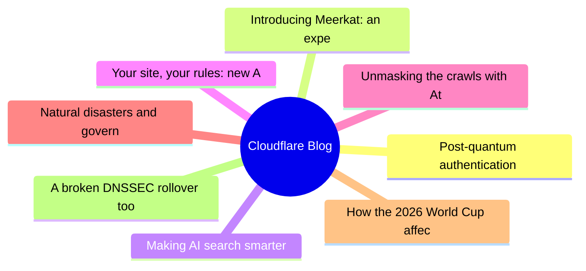
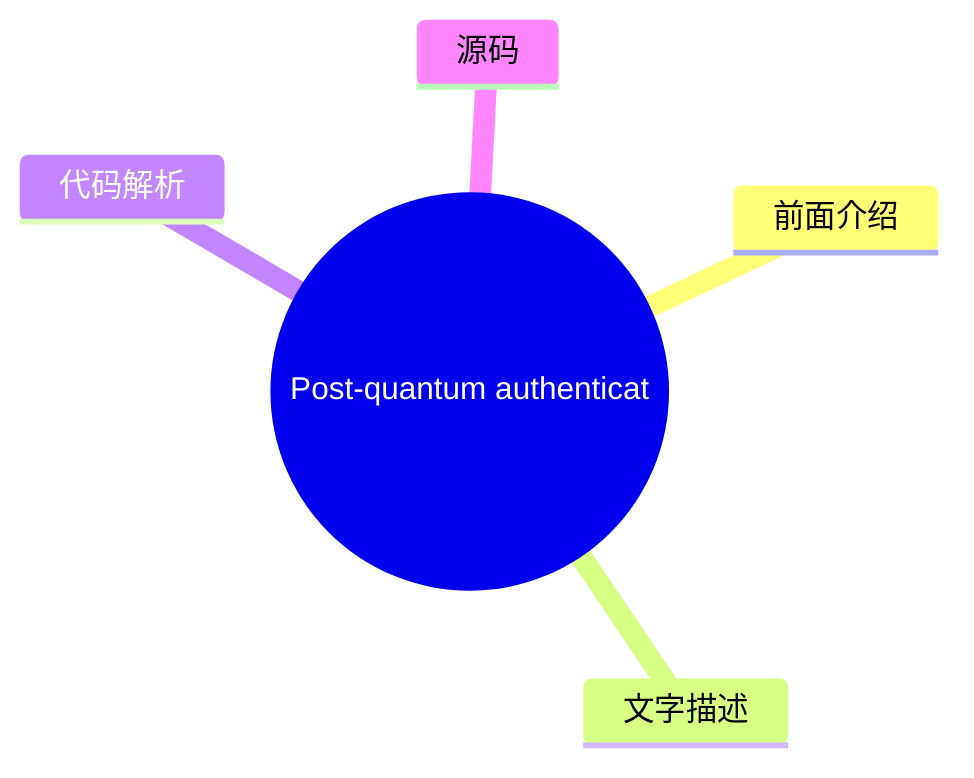
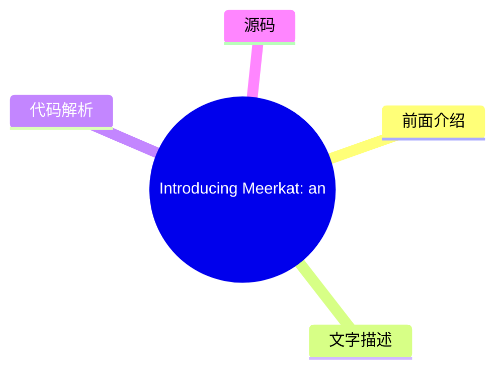
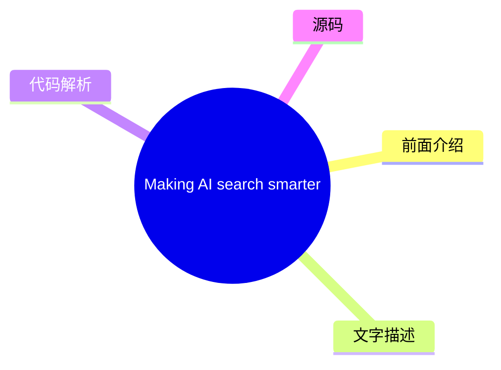
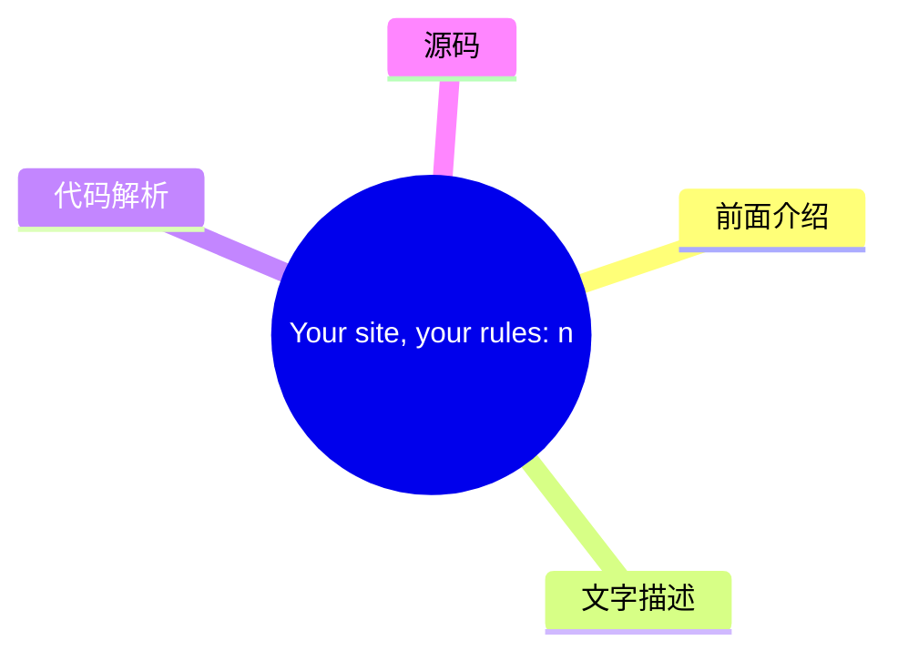
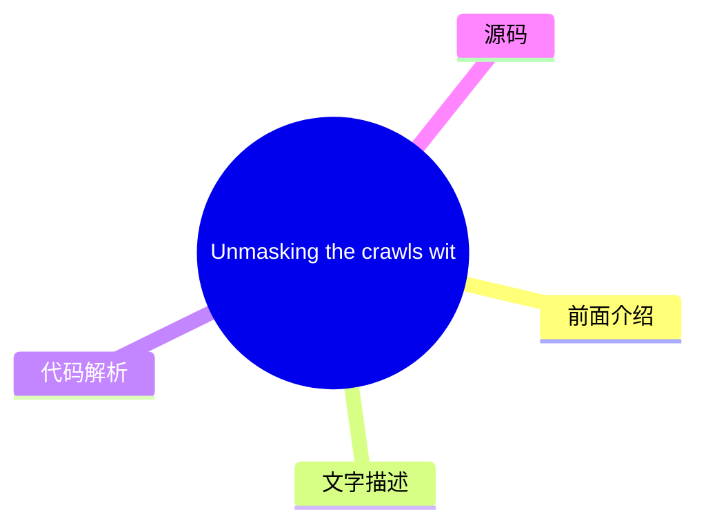
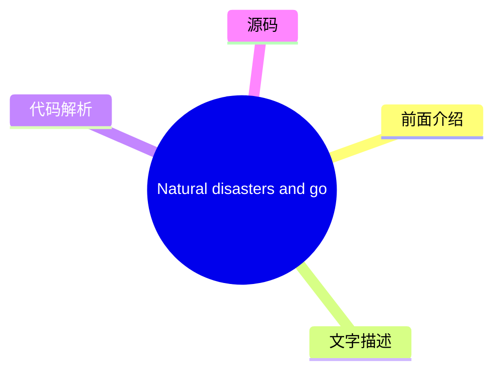
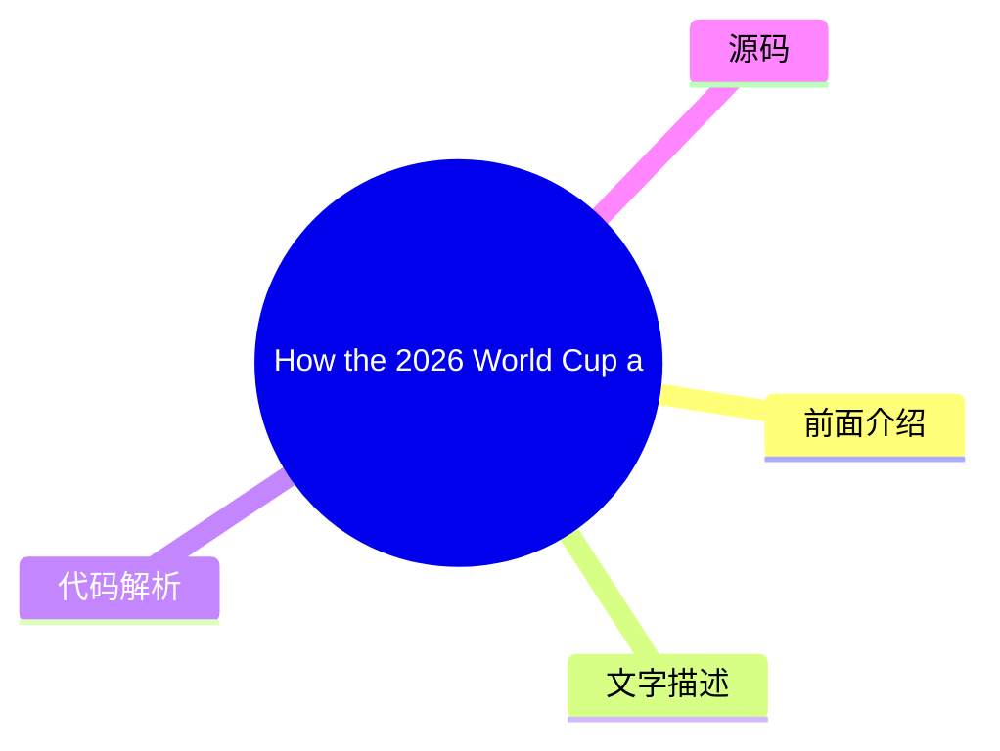
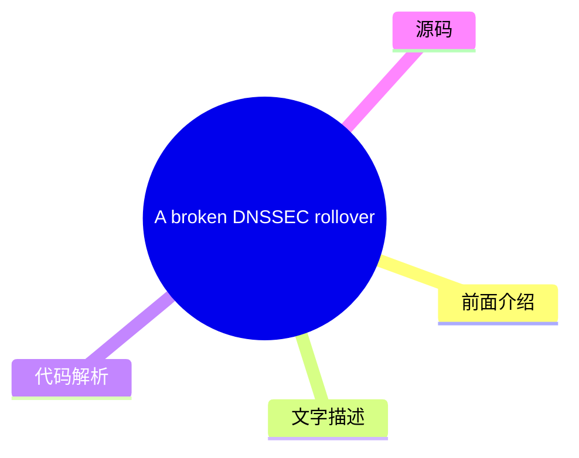

# ☁️ Cloudflare Blog Top 8 (2026-08-02)

## 前面介绍

- 数据源：Cloudflare Blog
- 抓取日期：2026-08-02
- 条目数：8
- 含完整正文：8
- 含代码片段：2
- 组织方式：前面介绍 / 树状图 / 文字描述 / 代码解析 / 源码

## 思维导图



## 详细整理（8 条，8 条含全文，2 条含代码）

### 1. Post-quantum authentication to origins is now supported
- **链接**: [https://blog.cloudflare.com/post-quantum-authentication-to-origins/](https://blog.cloudflare.com/post-quantum-authentication-to-origins/)
- **作者**: Luke Valenta
- **发布**: Wed, 29 Jul 2026 13:00:00 GMT

#### 前面介绍

- Cloudflare now supports post-quantum (PQ) authentication when connecting to customer origin servers via Authenticated Origin Pulls and Custom Origin Trust Store. This is the first step towards providing PQ authentication for all Cloudflare products.
- 作者：Luke Valenta
- 发布时间：Wed, 29 Jul 2026 13:00:00 GMT

#### 树状图



#### 文字描述

- Cloudflare's Authenticated Origin Pulls and Custom Origin Trust Store now support post-quantum authentication. Here weâll explain how you can configure fully post-quantum secure mutually authenticated TLS connections to your origin server, dive into the engineering details of how we built it, make a shameful confession, and finally explain how this work fits into our overall po
- ## Reaching a major milestone Our focus for the past several years has been in deploying post-quantum [ encryption](https://radar.cloudflare.com/post-quantum) to protect against [attacks, where an attacker quietly stockpiles your encrypted data with the hope of decrypting it in the future with a quantum computer.](https://en.wikipedia.org/wiki/Harvest_now,_decrypt_later) __harv
- ## Configuring fully PQ-secure origin connections We have added ML-DSA support (for all [ FIPS 204](https://csrc.nist.gov/pubs/fips/204/final) parameter sets: ML-DSA-44, ML-DSA-65, and ML-DSA-87) to the Custom Origin Trust Store and Authenticated Origin Pulls products. ML-DSA-44 is our recommendation for most applications as it is the most performant option and attains a comfor
- ### Avoiding downgrades Adding post-quantum encryption and authentication support to both the authenticating and verifying parties is necessary but *not* sufficient for full post-quantum security. The pesky issue of downgrades remains. If the verifying party supports any quantum-vulnerable authentication mechanisms, they remain open to attack from an [ on-path attacker](https:/

#### 代码解析

- `text`: 代码片段可作为实现参考，建议结合上下文确认输入输出和边界条件。
- `text`: 代码片段可作为实现参考，建议结合上下文确认输入输出和边界条件。

#### 源码

#### 源码片段 1（text）

```text
# Create a private ML-DSA-44 CA for the origin server
openssl genpkey -algorithm mldsa44 \
  -provparam ml-dsa.output_formats=seed-only \
  -out origin-ca.key
openssl req -new -x509 -key origin-ca.key \
  -out origin-ca.crt -days 10950 \
  -subj "/CN=Origin Server CA"
# Create the origin server certificate (signed by the origin CA)
openssl genpkey -algorithm mldsa44 \
  -provparam ml-dsa.output_formats=seed-only \
  -out origin-server.key
openssl req -new -key origin-server.key \
  -out origin-server.csr \
  -subj "/CN=origin.example.com"
openssl x509 -req -in origin-server.csr \
  -CA origin-ca.crt -CAkey origin-ca.key -CAcreateserial \
  -out origin-server.crt -days 5475 \
  -extfile <(printf "basicConstraints=CA:FALSE\nkeyUsage=digitalSignature\nsubjectAltName=DNS:origin.example.com\n")
```

#### 源码片段 2（text）

```text
# Create a private ML-DSA-44 CA for Authenticated Origin Pulls
openssl genpkey -algorithm mldsa44 \
  -provparam ml-dsa.output_formats=seed-only \
  -out aop-ca.key
openssl req -new -x509 -key aop-ca.key \
  -out aop-ca.crt -days 10950 \
  -subj "/CN=Authenticated Origin Pull CA"
# Create the client certificate Cloudflare will present (signed by the AOP CA)
openssl genpkey -algorithm mldsa44 \
  -provparam ml-dsa.output_formats=seed-only \
  -out aop-client.key
openssl req -new -key aop-client.key \
  -out aop-client.csr \
  -subj "/CN=cloudflare-aop-client"
openssl x509 -req -in aop-client.csr \
  -CA aop-ca.crt -CAkey aop-ca.key -CAcreateserial \
  -out aop-client.crt -days 5475 \
  -extfile <(printf "basicConstraints=CA:FALSE\nkeyUsage=digitalSignature\n")
```

#### 完整正文（中文）

Cloudflare's Authenticated Origin Pulls and Custom Origin Trust Store now support post-quantum authentication.

Here weâll explain how you can configure fully post-quantum secure mutually authenticated TLS connections to your origin server, dive into the engineering details of how we built it, make a shameful confession, and finally explain how this work fits into our overall post-quantum migration roadmap.

## Reaching a major milestone

Our focus for the past several years has been in deploying post-quantum [ encryption](https://radar.cloudflare.com/post-quantum) to protect against 

[attacks, where an attacker quietly stockpiles your encrypted data with the hope of decrypting it in the future with a quantum computer.](https://en.wikipedia.org/wiki/Harvest_now,_decrypt_later)

__harvest-now/decrypt-later__However, recent breakthroughs in quantum computing and cryptanalysis pulled the timelines for upgrading to post-quantum cryptography forward __across__[ industry](https://blog.google/innovation-and-ai/technology/safety-security/cryptography-migration-timeline/) and 

[and have caused us to shift our attention to deploying post-quantum](https://blog.cloudflare.com/post-quantum-eo-2026/)

__government__*authentication*, to protect against attackers who will soon be able to use quantum computers to break classical credentials and carry out impersonation attacks.

In a previous post, we announced that Cloudflare is [ targeting 2029](https://blog.cloudflare.com/post-quantum-roadmap/#cloudflares-roadmap-to-full-post-quantum-security) for full post-quantum security, and laid out several milestones to hit along the way. We have reached the first of those milestones: our 

[and](https://developers.cloudflare.com/ssl/origin-configuration/authenticated-origin-pull/)

__Authenticated Origin Pulls__[products](https://developers.cloudflare.com/ssl/origin-configuration/custom-origin-trust-store/)

__Custom Origin Trust Store__[via Module-Lattice-Based Digital Signature Algorithm (ML-DSA) signatures to protect connections between Cloudflare and customer origin servers.Â](https://developers.cloudflare.com/changelog/post/2026-06-17-pqc-mldsa-aop-cots/)


__now support post-quantum (PQ) authentication__## The origin connection is different

When a client visits a website proxied by Cloudflare, there are typically two connections involved. The first connection is from the visitor (e.g., a browser) to Cloudflare. If the request can be served from Cloudflareâs cache or triggers any blocking rules, Cloudflare might respond directly. Otherwise, Cloudflare establishes a second connection to the customerâs origin server to fetch the requested content, so it can respond to the original request.

Protecting sensitive visitor data requires both of these connections to be secure against quantum attacks. We enabled post-quantum encryption support for both the visitor-to-Cloudflare (Connection 1) and Cloudflare-to-origin (Connection 2) connections in [ 2022](https://blog.cloudflare.com/post-quantum-for-all/) and 

[, respectively, and already see](https://blog.cloudflare.com/post-quantum-to-origins/)

__2023__[.](https://radar.cloudflare.com/post-quantum)

__significant usage__We are actively working on completing the picture with post-quantum authentication. For the visitor-to-Cloudflare connection, we are collaborating with [ Google](https://blog.google/security/cultivating-a-robust-and-efficient-quantum-safe-https/) and others at the Internet Engineering Task Force (

[) to develop and](https://datatracker.ietf.org/wg/plants/about/)

__IETF__[with Merkle Tree Certificates](https://blog.cloudflare.com/bootstrap-mtc)

__experiment__[, a design for fast, post-quantum certificates for the web, with initial deployments targeting 2027. The topic of this post, however, is the Cloudflare-to-origin connection, where the requirements for authentication differ from that of the visitor-to-Cloudflare connection in several important ways.](https://datatracker.ietf.org/doc/draft-ietf-plants-merkle-tree-certs/)


__(MTC)__For this connection, Cloudflare is the client. This gives us the control to employ techniques such as connection pooling to fan in requests from all over our network to a smaller set of connections to origin servers, amortizing the overhead of connection setup over many requests. This makes the cost of âdrop-inâ post-quantum signatures more palatable, and the performance benefits of MTC less necessary.

And with a pre-existing trust relationship between Cloudflare and customers (i.e., a Cloudflare account), we need not tie ourselves to the constraints and timelines of the public key infrastructure (PKI) for the public Internet ([ WebPKI](https://cabforum.org/working-groups/server/baseline-requirements/requirements/)) and can instead use custom PKIs tailored to the use case, without overhead from intermediate certificates and 

[that may not be applicable. Solutions like](https://datatracker.ietf.org/doc/html/rfc6962)

__Certificate Transparency__[can also be used to protect the Cloudflare-to-origin connection without upgrading legacy origin systems, by forwarding traffic over a tunnel secured with post-quantum encryption (and post-quantum authentication in the works).](https://developers.cloudflare.com/tunnel/)

__Cloudflare Tunnel__All this to say, the unique requirements of the Cloudflare-to-origin connection have allowed us to deploy post-quantum authentication via ML-DSA authentication ahead of support landing in the WebPKI for the public Internet. (For customers who stick with the WebPKI, donât worry: weâll add MTC support on the Cloudflare-to-origin connection in the future.)

So how do you turn this on? Letâs dive into the configuration.

## Configuring fully PQ-secure origin connections

We have added ML-DSA support (for all [ FIPS 204](https://csrc.nist.gov/pubs/fips/204/final) parameter sets: ML-DSA-44, ML-DSA-65, and ML-DSA-87) to the Custom Origin Trust Store and Authenticated Origin Pulls products. ML-DSA-44 is our recommendation for most applications as it is the most performant option and attains a comfortable NIST 

[security strength.](https://nvlpubs.nist.gov/nistpubs/FIPS/NIST.FIPS.204.pdf#page=25)


__category 2__### Custom Origin Trust Store

When Cloudflare makes a connection to a customer origin server configured with [ Full (strict)](https://developers.cloudflare.com/ssl/origin-configuration/ssl-modes/full-strict/) SSL mode, we authenticate the origin certificate against a default trust store consisting of all 

[Certificate Authorities (CAs) as well as Cloudflareâs](https://ccadb.org)

__commonly trusted__[. The](https://developers.cloudflare.com/ssl/origin-configuration/origin-ca/)

__origin CA__[product (which requires](https://developers.cloudflare.com/ssl/origin-configuration/custom-origin-trust-store/)

__Custom Origin Trust Store (COTS)__[to be enabled) allows customers to replace this default trust store with a set of CAs they control. COTS now allows customers to upload ML-DSA CAs, such that Cloudflare will trust any origin server certificate chaining to that CA when connecting to the origin.](https://developers.cloudflare.com/ssl/edge-certificates/advanced-certificate-manager/)

__Advanced Certificate Manager__### Authenticated Origin Pulls

To limit abuse and resource consumption on their origin servers, customers may want to only serve requests coming from Cloudflareâs servers. [ Authenticated Origin Pulls (AOP)](https://developers.cloudflare.com/ssl/origin-configuration/authenticated-origin-pull/) can be used to configure Cloudflare to present a client certificate to the origin server in order to establish a 

[connection, in which communication between the parties is bidirectionally secure and trusted. AOP is available for free on all Cloudflare plan levels.](https://www.cloudflare.com/learning/access-management/what-is-mutual-tls/)


__mutual TLS (mTLS)__AOP supports three [ configuration levels](https://developers.cloudflare.com/ssl/origin-configuration/authenticated-origin-pull/#configuration-levels): global, per-zone, and per-hostname. The per-zone and per-hostname configuration levels now allow customers to upload ML-DSA certificates and private keys (in the FIPS 204 seed format), so that Cloudflareâs TLS client will present this certificate to authenticate itself when connecting to the origin server. (Donât worry, we havenât forgotten about the global configuration level â it just happens to be a more involved change that will be prioritized at a later date.)

### Avoiding downgrades

Adding post-quantum encryption and authentication support to both the authenticating and verifying parties is necessary but *not* sufficient for full post-quantum security. The pesky issue of downgrades remains. If the verifying party supports any quantum-vulnerable authentication mechanisms, they remain open to attack from an [ on-path attacker](https://www.cloudflare.com/learning/security/threats/on-path-attack/) capable of forging classical credentials.

The fix: the verifying party must remove trust in quantum-vulnerable authentication mechanisms. (This is more nuanced in complex PKIs. For example, see the Chromium Security teamâs [ four-stage plan](https://www.chromium.org/Home/chromium-security/post-quantum-auth-roadmap/) for transitioning the Web.) See the 

[for AOP and COTS for details on how to ensure your origin is secure against downgrade attacks.](https://developers.cloudflare.com/ssl/post-quantum-cryptography/pqc-to-origin/#avoid-downgrades)

__configuration guide__### Quick start

The walkthrough below shows how to generate an ML-DSA certificate chain and configure both products via the Cloudflare API. For dashboard instructions and additional context, refer to the [ developer docs](https://developers.cloudflare.com/ssl/post-quantum-cryptography/pqc-to-origin/).

1. Generate certificates

You will need OpenSSL 3.5.0 or later. The private key must be generated in the FIPS 204 seed-only encoding, which is the only format Cloudflare currently accepts on upload.


**Origin server certificate chain for COTS:**

```
# Create a private ML-DSA-44 CA for the origin server
openssl genpkey -algorithm mldsa44 \
  -provparam ml-dsa.output_formats=seed-only \
  -out origin-ca.key
openssl req -new -x509 -key origin-ca.key \
  -out origin-ca.crt -days 10950 \
  -subj "/CN=Origin Server CA"
# Create the origin server certificate (signed by the origin CA)
openssl genpkey -algorithm mldsa44 \
  -provparam ml-dsa.output_formats=seed-only \
  -out origin-server.key
openssl req -new -key origin-server.key \
  -out origin-server.csr \
  -subj "/CN=origin.example.com"
openssl x509 -req -in origin-server.csr \
  -CA origin-ca.crt -CAkey origin-ca.key -CAcreateserial \
  -out origin-server.crt -days 5475 \
  -extfile <(printf "basicConstraints=CA:FALSE\nkeyUsage=digitalSignature\nsubjectAltName=DNS:origin.example.com\n")
```
**Cloudflare client certificate chain for AOP:**

```
# Create a private ML-DSA-44 CA for Authenticated Origin Pulls
openssl genpkey -algorithm mldsa44 \
  -provparam ml-dsa.output_formats=seed-only \
  -out aop-ca.key
openssl req -new -x509 -key aop-ca.key \
  -out aop-ca.crt -days 10950 \
  -subj "/CN=Authenticated Origin Pull CA"
# Create the client certificate Cloudflare will present (signed by the AOP CA)
openssl genpkey -algorithm mldsa44 \
  -provparam ml-dsa.output_formats=seed-only \
  -out aop-client.key
openssl req -new -key aop-client.key \
  -out aop-client.csr \
  -subj "/CN=cloudflare-aop-client"
openssl x509 -req -in aop-client.csr \
  -CA aop-ca.crt -CAkey aop-ca.key -CAcreateserial \
  -out aop-client.crt -days 5475 \
  -extfile <(printf "basicConstraints=CA:FALSE\nkeyUsage=digitalSignature\n")
```
2. Upload the origin CA to Custom Origin Trust Store

```
CA_CERT=$(jq -Rs . < origin-ca.crt)
curl "https://api.cloudflare.com/client/v4/zones/$ZONE_ID/acm/custom_trust_store" \
  --header "Authorization: Bearer $CLOUDFLARE_API_TOKEN" \
  --header "Cont

...（截断，原文 22450+ 字符）


### 2. Introducing Meerkat: an experiment in global consensus
- **链接**: [https://blog.cloudflare.com/meerkat-introduction/](https://blog.cloudflare.com/meerkat-introduction/)
- **作者**: James Larisch
- **发布**: Wed, 08 Jul 2026 12:00:00 GMT

#### 前面介绍

- Cloudflare Research is building a global consensus service called Meerkat that uses a new consensus algorithm called QuePaxa. We plan to use Meerkat to build a strongly consistent, fault-tolerant key-value store, and other applications.
- 作者：James Larisch
- 发布时间：Wed, 08 Jul 2026 12:00:00 GMT

#### 树状图



#### 文字描述

- Many internal services at Cloudflare need to read and modify the same control-plane state from across our 330+ global data centers. They need guarantees that different readers *never *see inconsistent state, and that the system remains available for writes even when some data centers or links fail. But Cloudflareâs network runs across the entire Internet, and the Internet is an
- ## What we need from a global control-plane data system Many Cloudflare services read and write *control-plane data*, data that helps those services operate correctly, from multiple machines distributed all over the world. One example of control-plane data is *placement information*: where certain resources (like an AI model instance) are stored. Another example is *leadership 
- ### Strong consistency A distributed data systemâs [ consistency](https://jepsen.io/consistency/models) level describes what kinds of weird behavior the system is allowed to exhibit when it receives concurrent reads and writes. Consider a distributed key-value store that stores a single numeric value `x = 6` across multiple nodes. Also consider the following sequence of writes.
- ### Fault tolerance A systemâs level of fault tolerance describes what kinds of faults the system can handle before catastrophes happen. Catastrophes are typically violations of properties the system aims to uphold, e.g., that two consecutive reads without an intervening write for the same key never see different values, or that the system remains available for writes. The faul

#### 代码解析

- 本文未检测到明确代码块，内容更偏新闻、观点或方法论。

#### 源码

#### 中文节选

Many internal services at Cloudflare need to read and modify the same control-plane state from across our 330+ global data centers. They need guarantees that different readers *never *see inconsistent state, and that the system remains available for writes even when some data centers or links fail.

But Cloudflareâs network runs across the entire Internet, and the Internet is an unpredictable place. Servers and data centers go down. Queues fill up. Links and cables get cut. These conditions make it difficult to run a globally available data system that guarantees strong consistency (e.g., that all readers are guaranteed to read all prior writes) because hostile conditions hinder distributed system replicasâ ability to reliably synchronize data with one another.

One way to synchronize data safely despite adverse network conditions is via a *consensus algorithm, *which* *allows a set of machines to agree on the same sequence of values, such as key-value store put and `get` operations, as long as a majority remains alive and able to communicate. 

Unfortunately, commonly deployed consensus algorithms like [ Raft](https://raft.github.io/) suffer in wide-area networks like Cloudflareâs because they rely on 

*leaders*and

*timeouts*. The

*leader*is the only replica allowed to make writes, and if it fails due to a crash or network degradation, the system becomes unavailable until some other replica

*times out*and a new leader is elected. And these timeout values are hard to configure in networks with unpredictable latencies.

We have experienced multiple incidents caused by unavailable leaders in consensus-driven systems.

And so, for the past year, Cloudflareâs Research [ team](https://research.cloudflare.com/) has been building a new distributed consensus service called 

**Meerkat**powered by a consensus algorithm called

[, published in 2023 by Tennage & BÄsescu et al. QuePaxa differs from Raft in that all replicas can perform writes at all times, and progress is never halted due to a timeout, which makes it well suited for Cloudflareâs network. We layer](https://bford.info/pub/os/quepaxa/quepaxa.pdf)


__QuePaxa__*应用程序*，例如事务型键值存储和租赁系统，构建在 Meerkat 的共识日志之上。据我们所知，这将是 QuePaxa 首次在全球范围内进行工业级部署。

Meerkat 是一个仍在开发中的实验性共识服务。它最初被设计用于管理少量的控制平面状态（例如，复制数据库的领导权），因此在可预见的未来，它将仅限内部使用。本文介绍了 Meerkat，并为后续与 Meerkat 相关的博客文章奠定了基础。

## 我们需要一个全球控制平面数据系统

Cloudflare 的许多服务会从分布在世界各地的多台机器上读取和写入 *控制平面数据*，这些数据有助于这些服务正确运行。控制平面数据的一个例子是 *放置信息*：即特定数据应存储的位置。

#### 完整正文（中文）

Many internal services at Cloudflare need to read and modify the same control-plane state from across our 330+ global data centers. They need guarantees that different readers *never *see inconsistent state, and that the system remains available for writes even when some data centers or links fail.

But Cloudflareâs network runs across the entire Internet, and the Internet is an unpredictable place. Servers and data centers go down. Queues fill up. Links and cables get cut. These conditions make it difficult to run a globally available data system that guarantees strong consistency (e.g., that all readers are guaranteed to read all prior writes) because hostile conditions hinder distributed system replicasâ ability to reliably synchronize data with one another.

One way to synchronize data safely despite adverse network conditions is via a *consensus algorithm, *which* *allows a set of machines to agree on the same sequence of values, such as key-value store put and `get` operations, as long as a majority remains alive and able to communicate. 

Unfortunately, commonly deployed consensus algorithms like [ Raft](https://raft.github.io/) suffer in wide-area networks like Cloudflareâs because they rely on 

*leaders*and

*timeouts*. The

*leader*is the only replica allowed to make writes, and if it fails due to a crash or network degradation, the system becomes unavailable until some other replica

*times out*and a new leader is elected. And these timeout values are hard to configure in networks with unpredictable latencies.

We have experienced multiple incidents caused by unavailable leaders in consensus-driven systems.

And so, for the past year, Cloudflareâs Research [ team](https://research.cloudflare.com/) has been building a new distributed consensus service called 

**Meerkat**powered by a consensus algorithm called

[, published in 2023 by Tennage & BÄsescu et al. QuePaxa differs from Raft in that all replicas can perform writes at all times, and progress is never halted due to a timeout, which makes it well suited for Cloudflareâs network. We layer](https://bford.info/pub/os/quepaxa/quepaxa.pdf)


__QuePaxa__*应用*，例如基于 Meerkat 共识日志的事务型键值存储和租赁系统。据我们所知，这将是 QuePaxa 在全球范围内的首次工业级部署。

Meerkat 是一个仍在开发中的实验性共识服务。它最初被设计用于管理少量的控制平面状态（例如复制数据库的领导权），因此在不久的将来，它将仅限内部使用。本文介绍了 Meerkat，并为即将发布的与 Meerkat 相关的博客文章奠定了基础。

## 我们对全球控制平面数据系统的需求

Cloudflare 的许多服务会读取和写入*控制平面数据*，即帮助这些服务正确运行的、分布在世界各地多台机器上的数据。控制平面数据的一个例子是*放置信息*：特定资源（如 AI 模型实例）存储在哪里。另一个例子是*领导权信息*：当前哪台机器被允许对数据库执行写入操作。

控制平面数据必须同时具备*强*一致性，并且能够在特定类型的故障下保持*可访问性*。

在本节中，我们将精确描述我们对 Cloudflare 共识服务的一致性和容错要求。我们使用键值存储作为运行在共识服务之上的应用程序的运行示例，尽管其他应用（例如分布式租赁/锁）也是可能的。

### 强一致性

分布式数据系统的[一致性](https://jepsen.io/consistency/models)级别描述了系统在接收并发读写时被允许表现出的怪异行为。考虑一个在多个节点上存储单个数值的分布式键值存储

`x = 6`。同时考虑以下写入序列。这些写入是尽力而为地提交到不同节点的，并且可能以任意顺序到达： - `x = x + 1`
- `x = x / 2`

系统的一致性级别告诉您，在执行这些写入后，客户端在读取 `x` 时可能会看到 `x` 的哪些值。考虑以下操作序列以及在不同一致性级别下的可能执行顺序：

In a weak consistency level, writes can be re-ordered. In a stronger consistency model, writes canât be reordered, but reads can. In the strongest possible consistency level, the operations are ordered exactly as they occurred in real time. This property is called *linearizability*.

At Cloudflare, many services want linearizability. Unlike weaker forms of consistency, linearizability relieves programmers from thinking about all the weird behaviors the data systems might exhibit. Instead, they can reason about the distributed system like they reason about local memory on a single-threaded machine: all reads after a write will see that write. For additional reading material on the dangers of weak consistency, check out this [ post](https://brooker.co.za/blog/2025/11/18/consistency.html) by Marc Brooker.

(If youâre wondering, Meerkatâs key-value store also provides serializability, which weâll write about in a future post.)

### Fault tolerance

A systemâs level of fault tolerance describes what kinds of faults the system can handle before catastrophes happen. Catastrophes are typically violations of properties the system aims to uphold, e.g., that two consecutive reads without an intervening write for the same key never see different values, or that the system remains available for writes. The faults include network failures or delays, machine crashes, and machine restarts. A system will typically explicitly handle some faults but not others (you canât handle all faults, as the universe could always reach heat-death). For example, some key-value stores might guarantee to remain available for writes as long as two-thirds of the machines in the system can communicate and donât crash, but make no promises if a machine is compromised and starts sending malicious messages.

Our desired fault tolerance properties are as follows:

**First**, the data system should remain available for writes and reads from a client located in any of our data centers as long as the following are true:

- A majority of the machines in our system are alive and can communicate with one another. (Formally, we tolerate `f`faults in a system of`2f + 1`machines).

- 客户端可以联系系统中的*任意一台*连接到多数台存活机器的机器。

这意味着单台机器故障或单条链路的网络降级不会影响系统的可用性*。*正如我们稍后将看到的，Raft 系统不提供此属性。

**其次**，只要系统中没有参与者主动作恶（当然，也没有 bug），数据系统就会保持*正确*。我们稍后将在共识*安全性*的背景下定义*正确性*，但通俗地说，这意味着没有两台最新的机器会就世界状态产生分歧（例如，一台认为 `key1=1`，而另一台认为 `key1=2`）。

总之，即使机器崩溃、机器重启、网络故障或降级、数据中心宕机等，系统仍必须保持正确（尽管我们和基于 Raft 的系统一样，不处理 [拜占庭故障](https://en.wikipedia.org/wiki/Byzantine_fault)）。

## 介绍 Meerkat

Meerkat 是一个共识服务，我们可以在其上构建具有上述属性（强一致性和容错性）的应用程序，例如键值（KV）存储。为了理解 Meerkat 的工作原理，我们首先概述 Meerkat 的一般架构，然后描述 Meerkat 对共识算法的选择如何有助于提供强一致性和容错性。

使用 Meerkat 的服务开发人员会请求一个 Meerkat *副本集群*。每个副本都连接到其他每个副本。每个副本都参与共识算法，并且可以接收读取和写入操作。开发人员可以指定允许在其副本上托管的数据中心，Meerkat 会自动放置它们。

为了与其集群交互，开发人员的客户端向集群中的任意一个副本发送特定于应用程序的请求。单个副本可能托管多种类型的应用程序，但最简单的是键值存储，因此最简单的特定于应用程序的请求类型是 KV `get` 或 `put`。副本会使用特定于应用程序的响应来响应请求（例如，`get` 请求的记录）。请注意，KV 读取（`get`）保证读取到最新信息。

### Meerkat 的日志

Under the hood, the replica translates application requests (e.g., `get` and `put`) into *log events*. That replica distributes each log event to all other replicas using a consensus algorithm such that all replicas maintain the exact same log of events (in reality, a replica may lag behind, but shall never record different entries). These events are arbitrary â Meerkatâs core doesnât care whatâs in them. Meerkat *applications* care about log event contents. Each Meerkat replica âhostsâ many Meerkat applications (e.g., key-value store) that read the log events and construct state. (Note that each replica belongs to exactly one cluster.)

For instance, the KV Meerkat application constructs an in-memory key-value store from the log events. So when a client sends a write like `put k1 v1`, the receiving replica places that write into a log event and distributes it to all replicas. If someone else subsequently writes `put k1 v11` to a different replica, this event is also distributed to all replicas. Since all functioning replicas have the same log, those replicas can apply the operations in the log in sequence to construct the exact same state. Note that `get` requests also create distributed log events (for linearizability, as explained in the next section).

Here is an example of how a replicaâs KV store is updated as it receives log events:

### How Meerkatâs log enables strong consistency

Meerkat guarantees that if one client executes `put k1 v1`, a second client subsequently executes `put k1 v11`, and a third client subsequently executes `get k1` (with a consistent read), they will always read `v11`. It guarantees this even if each request is submitted to a different replica, and those replicas are distributed randomly across the world. This is linearizability. To see how Meerkat guarantees this, we must examine Meerkatâs log in more detail.


The Meerkat log is a sequence of slots. A slot is a box that can contain an event or not. A slot that contains an event is called a *decided *slot. All slots in the log are decided except the last slot, which is currently being decided. One of Meerkatâs invariants is that if any two replicas decide on the value for a slot, those values are the same. In other words, no two replicas will ever disagree on the value of a decided slot (though one replica may think the last slot is empty while another does not). This property helps guarantee the desired properties we described in the previous section.

To decide on the value of the last (empty) slot in the log, Meerkat replicas run a distributed *consensus algorithm*. A consensus algorithm allows a set of machines communicating over a network to agree on a decided slot value. Our consensus algorithm works as long as a majority of replicas (more than half) are alive.

So if the log currently contains two entries, and a client submits `put k1 v11` to a replica, that replica triggers a consensus algorithm for slot 3. But another client might have submitted `put k1 v111` to a different replica for slot 3. The consensus algorithm ensures that only one such *proposal* for slot 3 wins out. Specifically, it ensures that at least a majority of replicas agree on the same proposal, *deciding *it for slot 3. The non-majority can *never* decide a different proposal, but might miss the fact 

...（截断，原文 20546+ 字符）


### 3. Making AI search smarter
- **链接**: [https://blog.cloudflare.com/making-ai-search-smarter/](https://blog.cloudflare.com/making-ai-search-smarter/)
- **作者**: Matthew Conroy
- **发布**: Wed, 01 Jul 2026 13:00:00 GMT

#### 前面介绍

- Search is how we find nearly everything on the web — creators, merchants, answers. AI is rewriting the rules, leaving creators caught between staying discoverable in an agentic era and getting paid for their work. Today we're launching two initiative
- 作者：Matthew Conroy
- 发布时间：Wed, 01 Jul 2026 13:00:00 GMT

#### 树状图



#### 文字描述

- Search drives most experiences on the web. It's how we get things done, and how nearly everything on the web gets found â the creators, the merchants, the answer to whatever you just typed into a box. For nearly 30 years, that discovery journey ran on a simple bargain: let a search engine crawl your content, and it sends you visitors. You turned those visitors into a business â
- ### Rebuilding the bargain Transparency and control are the foundation, but more is needed. In 2025, we laid out our foundation via a set of [ responsible AI bot principles](https://blog.cloudflare.com/building-a-better-internet-with-responsible-ai-bot-principles/): bots should be transparent about who they are and what they're for, respect site owners' choices, and act in good
- ### Making search smarter Today we're launching a research program to make AI search smarter and stop our customers footing the bill for crawls that produce nothing new. More than 20% of the web sits behind Cloudflareâs network, which gives us a unique perspective. We can tell which pages have genuinely changed and which ones people and agents are flocking to. Through this prog
- ### From Pay Per Crawl to Pay Per Use Last year we [ launched Pay Per Crawl ](https://blog.cloudflare.com/introducing-pay-per-crawl/)so publishers could charge AI companies for crawling their content. It was a real start, but crawling is a crude measure of value. A single page might be crawled once and then cited in thousands of answers, or crawled over and over and never used 

#### 代码解析

- 本文未检测到明确代码块，内容更偏新闻、观点或方法论。

#### 源码

#### 中文节选

搜索驱动了网络上的大多数体验。这是我们完成事情的方式，也是网络上几乎所有的东西被找到的方式——创作者、商家，以及你刚刚在框中输入的任何问题的答案。近 30 年来，那次发现之旅运行在一个简单的交易之上：让搜索引擎抓取你的内容，它就会向你发送访客。你通过广告、订阅，或者仅仅是受众本身，将这些访客转化为了生意。可被发现和获得报酬曾经是同一回事。一年前，在[第一个内容独立日](https://blog.cloudflare.com/content-independence-day-no-ai-crawl-without-compensation/)，我们划下了一条线，以在 AI 时代捍卫这一交易。但一道防线仅仅是一个开始。自那时以来，AI 搜索在消费者生活中的普及程度随着[. 威胁不再是你可以屏蔽的少数几个训练爬虫；而是搜索本身正在围绕 AI 答案进行重建。](https://radar.cloudflare.com/)

__超过 50% 的在线流量是非人类的__如今的答案引擎会读取你的页面并将摘要交给用户，因此访问——以及依赖于它的收入——就变得不再必要。我们亲眼目睹了这一点，独立研究也证实了这一点：[2025 年皮尤研究中心的一项研究](https://www.pewresearch.org/short-reads/2025/07/22/google-users-are-less-likely-to-click-on-links-when-an-ai-summary-appears-in-the-results/)发现，当 Google 显示 AI 摘要时，用户点击传统搜索结果链接的频率仅为 8%（大约是没有摘要时的一半），而点击摘要内部链接的频率仅为 1%。这让我们陷入了两难境地：退出 AI 搜索从而难以被发现，或者加入 AI 搜索，在为用户提供巨大价值的同时，看到回报却越来越少。我们的客户希望被找到并获得其提供价值的报酬，而目前他们被迫做出选择。

Today, [ weâve announced new bot options](http://blog.cloudflare.com/content-independence-day-ai-options) to help our customers better control who can access their site and what they can do with it. But blocking was only step one: saying "no" protects content without rebuilding the business models that sustain it. So, itâs time to start building the new economic model of the Internet, starting with search.

### Rebuilding the bargain

Transparency and control are the foundation, but more is needed. In 2025, we laid out our foundation via a set of [ responsible AI bot principles](https://blog.cloudflare.com/building-a-better-internet-with-responsible-ai-bot-principles/): bots should be transparent about who they are and what they're for, respect site owners' choices, and act in good faith. Our tools hold bots to that bar. But enforcing good bot behavior doesn't make AI search any better for the people relying on it, and it doesn't send a dollar back to the creator whose work made the answer possible. We can do more than help the web say "no"; we can help rebuild what it says "yes" t

#### 完整正文（中文）

搜索驱动了网络上的大多数体验。这是我们完成事情的方式，也是网络上几乎所有的东西被找到的方式——创作者、商家，以及你刚刚在框中输入的任何问题的答案。近 30 年来，那次发现之旅运行在一个简单的交易之上：让搜索引擎抓取你的内容，它就会向你发送访客。你通过广告、订阅，或者仅仅是受众本身，将这些访客转化为了生意。可被发现和获得报酬曾经是同一回事。一年前，在[第一个内容独立日](https://blog.cloudflare.com/content-independence-day-no-ai-crawl-without-compensation/)，我们划下了一条线，以在 AI 时代捍卫这一交易。但一道防线仅仅是一个开始。自那时以来，AI 搜索在消费者生活中的普及程度随着[. 威胁不再是你可以屏蔽的少数几个训练爬虫；而是搜索本身正在围绕 AI 答案进行重建。](https://radar.cloudflare.com/)

__超过 50% 的在线流量是非人类的__如今的答案引擎会读取你的页面并将摘要交给用户，因此访问——以及依赖于它的收入——就变得不再必要。我们亲眼目睹了这一点，独立研究也证实了这一点：[2025 年皮尤研究中心的一项研究](https://www.pewresearch.org/short-reads/2025/07/22/google-users-are-less-likely-to-click-on-links-when-an-ai-summary-appears-in-the-results/)发现，当 Google 显示 AI 摘要时，用户点击传统搜索结果链接的频率仅为 8%（大约是没有摘要时的一半），而点击摘要内部链接的频率仅为 1%。这让我们陷入了两难境地：退出 AI 搜索从而难以被发现，或者加入 AI 搜索，在为用户提供巨大价值的同时，看到回报却越来越少。我们的客户希望被找到并获得其提供价值的报酬，而目前他们被迫做出选择。

Today, [ weâve announced new bot options](http://blog.cloudflare.com/content-independence-day-ai-options) to help our customers better control who can access their site and what they can do with it. But blocking was only step one: saying "no" protects content without rebuilding the business models that sustain it. So, itâs time to start building the new economic model of the Internet, starting with search.

### Rebuilding the bargain

Transparency and control are the foundation, but more is needed. In 2025, we laid out our foundation via a set of [ responsible AI bot principles](https://blog.cloudflare.com/building-a-better-internet-with-responsible-ai-bot-principles/): bots should be transparent about who they are and what they're for, respect site owners' choices, and act in good faith. Our tools hold bots to that bar. But enforcing good bot behavior doesn't make AI search any better for the people relying on it, and it doesn't send a dollar back to the creator whose work made the answer possible. We can do more than help the web say "no"; we can help rebuild what it says "yes" to.

So today, we're announcing two initiatives that move from defense to offense and start putting both halves of that old bargain back together.

**Make AI search smarter: **By** **using the signals we see across our global network, like what's fresh, what's high quality, and what's actually changed, we can help answer engines surface the most relevant content and reduce unwanted crawling. People searching get better answers, while costs are reduced for both AI companies and site owners if webpages are only recrawled when theyâve changed.

**Pay creators for the value they provide:** When your work is used to answer someone's question, you should be rewarded instead of just being scraped for free. And you should be able to see what's being used and what people are asking. This should be a real revenue stream, and an incentive to keep producing original content worth finding.

### Making search smarter

Today we're launching a research program to make AI search smarter and stop our customers footing the bill for crawls that produce nothing new.


超过 20% 的网站位于 Cloudflare 的网络背后，这给了我们独特的视角。我们可以判断哪些页面真正发生了变化，哪些页面是人们和机器人蜂拥而至的。通过该项目，我们将探索利用客户选择分享的关于其内容新鲜度的信号，并将这些信号与我们自己对流量（包括人类和机器人）的洞察相结合。对于答案引擎而言，这是通往高质量内容的路线图。对于我们的客户而言，它提供了用户实际在问什么，以及他们的内容如何在 AI 结果中呈现的视图。我们的目标是衡量两件事：这些信号在多大程度上有助于答案引擎展示更新、更高质量的内容，以及它们在多大程度上减少了不必要的抓取。

第二个好处，即减少不必要的抓取，其重要性比听起来要大。Cloudflare 的数据显示，超过 50% 的优质机器人抓取流量都用于重新抓取未发生变化的页面——而且随着抓取量的增加，这个数字可能会上升。一个仅仅表示“这里什么都没变”的信号，可以让抓取器跳过这次访问。这为答案引擎节省了计算资源。更重要的是，它让网站所有者免于处理和为那些他们根本不需要的请求提供服务并支付费用。

该项目在设计上是中立的：我们的目标是让所有愿意公平竞争的答案引擎都能从中受益。它仅限于搜索领域。我们不会分享任何内容，也不会使用任何数据来训练基础模型。我们计划公布我们的发现，包括对网站所有者（如更好的内容可发现性和减轻服务器压力）带来的益处。我们计划在今年晚些时候使该功能广泛可用，并减少我们网络中的不必要的抓取。

### 从按次抓取到按使用付费

去年，我们[推出了按次抓取](https://blog.cloudflare.com/introducing-pay-per-crawl/)，以便出版商可以向 AI 公司收取抓取其内容的费用。这是一个真正的开始，但抓取是衡量价值的一种粗糙方式。一个页面可能只被抓取一次，然后被引用在数千个答案中；也可能被反复抓取，却从未被使用过。创作者希望为其提供的价值获得公平的报酬。

所以我们开始将 Pay Per Crawl 转型为 Pay Per Use。我们正在与顶级 AI 公司（如 [ Ceramic.ai](http://ceramic.ai) 和 [You.com](http://you.com)）进行实验，这种安排很简单：组织可以引入自己的支付模式，并轻松将其扩展到 Cloudflare 网络上的内容所有者。

__You.com__ Ceramic 构建了一种所谓的“按查询付费”模式，因此选择加入的出版商可以在其内容出现在 Ceramic 的搜索结果中获得报酬。这意味着支付设计是跟随工作所提供的价值，而不是爬虫恰好抓取它的次数。

“为了扩展 AI 搜索的未来，我们需要一个拥有巨大覆盖面并致力于透明度和公平补偿的合作伙伴，”Ceramic.ai 创始人兼首席执行官 Anna Patterson 说，“Cloudflare 让我们能够轻松且通过编程的方式扩展我们的运营。通过将我们的按查询付费模式引入他们的网络，我们确保数百万内容所有者可以无缝选择加入，每次其内容出现在我们的搜索结果中时都能获得补偿。”

除了补偿之外，参与 Cloudflare/Ceramic 计划的内容所有者还将解锁新的报告功能，以帮助进行答案引擎优化（AEO）。客户终于可以看到导致其内容出现在搜索结果中的顶级查询、具体的网页和片段、其平均搜索结果排名位置等。这是我们即将推出的众多帮助客户提高可发现性的产品中的第一款。

这只是众多新兴方法之一。另一种来自 You.com：代理可以根据需要为特定的高价值内容付费，而无需任何前期承诺。AI 提供商正在测试新的支付模式（例如按查询付费、按结果付费等），而我们拥有支持所有这些模式的基础设施。

We want to be honest that this is an experiment. Thereâs a lot to learn, including exactly how this holds up at the scale of the Internet. We'll work that out with our partners and our customers as we go, and share what we learn. But the goal is clear: AI search companies get fresher, better-grounded answers, and the customers whose work makes the answers possible get paid when they help. Cloudflare's job in all of this is to provide the infrastructure layer that makes this market flourish.Â

We think this is a more natural fit for where the economics of search are heading. The old, human web optimized search to save time â providing excerpts, ten blue links, and a click. The agentic Internet is different: an agent can read fast and search continuously. Search is becoming something an agent does dozens of times to answer a single question, closer to a utility than a destination. In that world, the unit that matters isn't the crawl or the click. It's the outcome. Pricing the outcome, and paying the people who made it possible, is how the web continues to thrive.

### The headline we want to earn

A year ago on Content Independence Day, the headline was a default ânoâ: AI canât crawl without compensation. This year, our focus is on giving our users more products and controls to say âyesâ and bring more benefits with it.

Today's announcements are just the beginning. Cloudflareâs research project is designed to see if our signals produce better results with less crawling. Pay Per Use is a promising direction weâll experiment with alongside partners who believe that content creators deserve fair compensation for their work. This is how the last 30 years of the web got built too: somebody runs the pilot that turns "the model is broken" into "here's the new model," one experiment at a time. We believe thereâs value to our customers to be discoverable in this new agentic era, and to optimize their content for maximum discovery. But they should be able to do this without giving away their most valuable creative assets for free.


The web is changing, and the business models itâs relied on are changing with it. The old Internet was open, neutral, and worth contributing to. We have a rare chance to keep it that way, and to build the business models that fund it in the future. Smarter answers for humans and agents asking the questions. A fair deal for the people whose skill, creativity, and commitment makes the answers worthwhile. Thatâs how we pursue Cloudflareâs mission: to help build a better Internet.

Happy Content Independence Day!

*Building on the open, agent-ready web? If you are interested in learning more about the Ceramic and You programs, please fill out *

__this form__. If you're building an answer engine and want to crawl smarter, weâd love to hear from you too: aeo@cloudflare.com.


### 4. Your site, your rules: new AI traffic options for all customers
- **链接**: [https://blog.cloudflare.com/content-independence-day-ai-options/](https://blog.cloudflare.com/content-independence-day-ai-options/)
- **作者**: Jin-Hee Lee
- **发布**: Wed, 01 Jul 2026 13:00:00 GMT

#### 前面介绍

- For our second Content Independence Day, we’re giving website owners finer options to manage AI traffic. Instead of a one-size-fits-all block, all customers can now easily distinguish and manage Search, Agent, and Training bots, alongside the new abi
- 作者：Jin-Hee Lee
- 发布时间：Wed, 01 Jul 2026 13:00:00 GMT

#### 树状图



#### 文字描述

- One year ago, we declared the first [ Content Independence Day](https://blog.cloudflare.com/content-independence-day-no-ai-crawl-without-compensation/), and we gave website owners the means to take back control of their content. The deal between crawlers and website owners that had held up for 30 years â we crawl you, and you get referrals â was no longer true. AI was taking ev
- ### Now, AI can be anything Today, AI can be in anything. Google search has changed from being sorted by AI to being a [ full answer engine](https://blog.google/products-and-platforms/products/search/search-io-2026/) that answers your question directly on the results page. And Google is not unique in this position â this is the direction in which âsearchâ is moving. We could de
- ### A pragmatic taxonomy To address these questions, we need a more nuanced view â a pragmatic taxonomy that aligns with the AI use cases our customers care about. So we are opening the discussion beyond AI training alone and focusing on three AI use cases that we want all customers to be able to manage: - **Search:**any behavior that collects or indexes your content, so it can
- ### New options to manage AI traffic **We want to provide more options for managing different kinds of AI traffic, to all website owners on the Cloudflare network.** The managed preset to âBlock AI botsâ that weâve announced in the past included single-purpose bots that crawled data for model training, as shown below:Â *Screenshot of the existing setting to manage AI bot traffi

#### 代码解析

- 本文未检测到明确代码块，内容更偏新闻、观点或方法论。

#### 源码

#### 中文节选

一年前，我们宣布了首个[内容独立日](https://blog.cloudflare.com/content-independence-day-no-ai-crawl-without-compensation/)，并赋予网站所有者收回内容控制权的手段。爬虫与网站所有者之间维持了30年的交易——我们爬取你的内容，你获得推荐——已不再成立。AI 正在拿走一切却一无所返，这对网站所有者构成了生存威胁。因此，我们推出了一个一键式的“屏蔽 AI 机器人”选项，以及

[.](https://blog.cloudflare.com/introducing-pay-per-crawl/)

__按爬取付费市场__

一年间发生了许多变化。去年七月，围绕“AI 机器人”的讨论主要集中在未经补偿就阻止 AI 训练上，指出了这种内容被用于模型训练却没有任何价值回馈给网站所有者的零和博弈。但如今，对更细致入微方案的渴望已浮现：内容所有者仍然希望能够保护自己的内容，并且应该为他们辛勤创作、策展和分享的原创内容获得报酬。我们也知道，封锁内容并非“一刀切”的解决方案；网站所有者希望拥有比“每次都屏蔽所有自动化”更多的选择。

如果你运营一个小型网站，问题不仅仅是有人可能利用你的内容训练模型——而是根本没人能找到你。因此，你必须做出一种浮士德式的交易：要么出现在搜索结果中并允许 AI 训练你的内容，要么冒着失去可发现性的风险。如果搜索引擎提供商对搜索和训练使用相同的机器人，这会不公平地偏向现有搜索提供商；而这种不公平的优势会激励新玩家在试图缩小竞争差距时采取规避策略。

### 现在，AI 可以是任何东西

如今，AI 可以是任何东西。谷歌搜索已从由 AI 排序转变为[全答案引擎](https://blog.google/products-and-platforms/products-search/search-io-2026/)，直接在结果页面上回答你的问题。谷歌并非唯一处于这种地位的——这正是“搜索”正在发展的方向。

我们可以争论一下今天什么才算“AI”的截止点，结果却发现标准明天就会改变。因此，与其主要将机器人定义为“AI”或非“AI”，我们的更新分类方法将询问关于机器人或代理行为的更深层问题：它们在我的网站上做什么？它们存储了什么？以及它们将如何重新分享我的内容？

### 实用的分类法

为了回答这些问题，我们需要一个更细致的视角——一种与我们客户关心的 AI 用例相一致的实用分类法。因此，我们正在将讨论范围从仅限于 AI 训练扩展开来，并专注于三个我们希望所有客户都能管理的 AI 用例：

- **搜索：**任何收集或索引您内容的行为，以便日后回答相关问题。关键在于，搜索是主动构建您网站的数据库，以便稍后响应用户查询。网站所有者 sho

#### 完整正文（中文）

一年前，我们宣布了首个[内容独立日](https://blog.cloudflare.com/content-independence-day-no-ai-crawl-without-compensation/)，并赋予网站所有者收回内容控制权的手段。爬虫与网站所有者之间维持了30年的交易——我们爬取你的内容，你获得推荐——已不再成立。AI 正在拿走一切却一无所返，这对网站所有者构成了生存威胁。因此，我们推出了一个一键式的“屏蔽 AI 机器人”选项，以及

[.](https://blog.cloudflare.com/introducing-pay-per-crawl/)

__按爬取付费市场__

一年间发生了许多变化。去年七月，围绕“AI 机器人”的讨论主要集中在未经补偿就阻止 AI 训练上，指出了这种内容被用于模型训练却没有任何价值回馈给网站所有者的零和博弈。但如今，对更细致入微方案的渴望已浮现：内容所有者仍然希望能够保护自己的内容，并且应该为他们辛勤创作、策展和分享的原创内容获得报酬。我们也知道，封锁内容并非“一刀切”的解决方案；网站所有者希望拥有比“每次都屏蔽所有自动化”更多的选择。

如果你运营一个小型网站，问题不仅仅是有人可能利用你的内容训练模型——而是根本没人能找到你。因此，你必须做出一种浮士德式的交易：要么出现在搜索结果中并允许 AI 训练你的内容，要么冒着失去可发现性的风险。如果搜索引擎提供商对搜索和训练使用相同的机器人，这会不公平地偏向现有搜索提供商；而这种不公平的优势会激励新玩家在试图缩小竞争差距时采取规避策略。

### 现在，AI 可以是任何东西

如今，AI 可以是任何东西。谷歌搜索已从由 AI 排序转变为[全答案引擎](https://blog.google/products-and-platforms/products-search/search-io-2026/)，直接在结果页面上回答你的问题。谷歌并非唯一处于这种地位的——这正是“搜索”正在发展的方向。

我们可以争论一下今天什么算作“AI”的截止点，结果却发现标准明天就会改变。因此，与其主要将机器人定义为“AI”或非“AI”，我们的更新分类方法将询问关于机器人或代理行为更深层次的问题：它们在我的网站上做什么？它们存储了什么？以及它们将如何重新分享我的内容？

### 务实的分类法

为了回答这些问题，我们需要一个更细致的视角——一种与我们客户关心的 AI 用例相一致的务实分类法。因此，我们正在将讨论范围从仅限于 AI 训练扩展开来，并专注于三个我们希望所有客户都能管理的 AI 用例：

- **搜索：** 任何收集或索引您内容的行为，以便日后回答相关问题。关键在于，搜索会主动构建您网站的数据库，以便稍后响应用户查询。网站所有者应预期会因此获得推荐流量或其他公平的补偿。
- **代理：** 自动化 **训练**：抓取您的内容以训练或微调模型的爬虫。关键在于，您的数据被永久吸收到 AI 的底层架构中，以提升其能力。

许多流行的网络爬虫都落入上述分类之一；有些则落入多个分类。除了上述三种情况外，我们还将许多其他行为进行了分类——包括广告验证、内容抓取以及代理交易（关于这一点将在下文详细说明）。但我们认为，所有网站所有者管理这三种以 AI 为中心的用例的访问权限应该很简单。我们相信，机器人操作员应该将他们的爬虫分开，因为这能为网站所有者创造更多的透明度：使他们能够更好地理解为什么特定的爬虫正在访问他们，并更好地管理他们授予该爬虫的访问权限。如果一家公司运行的自动化程序既构建 **搜索** 索引，又充当 **代理**，还收集数据来 **训练** 他们的模型，那么我们强烈建议该公司将自动化程序分为三个独立的爬虫。

We want a classification system that is scalable and representative of the world of automated traffic as it evolves. Tracking a botâs purposes is nothing new, but our new taxonomy involves a few updates that better represent the state of bot traffic today. Most notably, we want to recognize that bots that have multiple purposes should be tracked with all purposes, not just one of them.

### New options to manage AI traffic

**We want to provide more options for managing different kinds of AI traffic, to  all website owners on the Cloudflare network.**

The managed preset to âBlock AI botsâ that weâve announced in the past included single-purpose bots that crawled data for model training, as shown below:Â

*Screenshot of the existing setting to manage AI bot traffic on July 1, 2025.*

But not all AI use is the same, and we want our customers to have the controls they need. So, weâre launching the ability to **manage AI traffic based on  three major use cases: Search, Agent, and Training** crawlers. With these new options, our customers can more finely tune how they manage AI bot traffic â including customers on our Free tier.

*Screenshot of the new options to manage AI bot traffic on July 1, 2026.*

### Setting new defaults

**On September 15, 2026, weâll be setting new defaults** **for each of these three classifications.** For all new domains onboarding to Cloudflare, the categories of **Training** and **Agent** will be blocked by default **on the pages that display ads, **while **Search** will remain allowed by default. 

An ad is a signal that a website owner meant for a person to land there and see it â something monetizable that fuels the business. So, on those pages, we treat human attention as the end goal, and keep away the bots that may prevent this attention (i.e., Training and Agent bots). On the other hand, Search is the behavior that most naturally funnels back visitors, and we believe itâs in the interest of most site owners to allow this.


9月15日将实施另一项变更：多功能爬虫（特别是那些结合了搜索与训练功能的爬虫）将根据其*所有*行为被允许/拦截，这与我们呼吁网站所有者保持透明的立场一致。由于默认设置将执行最严格的适用规则，因此像 Googlebot、Applebot 和 BingBot 这样的多功能爬虫将被那些选择拦截训练（通过[管理 AI 流量](https://developers.cloudflare.com/bots/additional-configurations/block-ai-bots/)的新选项，或通过传统的拦截 AI 爬虫服务）的客户所拦截。

当然，客户的选择至关重要：如果网站所有者希望退出这些新的默认配置，他们可以在9月15日之前的任何时间在他们的安全设置中[轻松标记此项](https://dash.cloudflare.com/?to=/:account/:zone/security/settings)，这将确认他们希望对同时用于搜索目的的训练爬虫*不做任何更改*。随着我们接近9月15日，我们还将继续通知客户关于默认设置变更的消息，以确保希望选择与默认设置不同的配置的客户有机会进行操作。

### BotBase：企业客户的新可见性平面

我们也很兴奋地推出一项重大的可见性更新，作为企业级机器人管理的一项新功能。随着 Cloudflare 追踪的机器人目录不断扩大，人们也希望以合理的分组来管理这些机器人，并更详细地了解特定机器人。

介绍 [BotBase](https://developers.cloudflare.com/bots/botbase/)。BotBase 是我们追踪所有已知机器人的新数据库，包括已验证的机器人和代理。该数据库直接在 Cloudflare 仪表板上提供了我们整个机器人目录的全面、可搜索视图。我们正在优先解决*可见性*问题，但今年晚些时候，我们将扩展 BotBase，为网站上的已知自动化内容提供直接的控制中心。

借助这一新视图，Enterprise Bot Management 客户可以查看所有已验证的机器人/代理的完整目录，以及它们在此更新后的分类法中的分类情况——这是我们此前从未在 Cloudflare 仪表板上动态展示过的视图。想要精确针对特定机器人的客户还可以轻松筛选来自该机器人的所有流量，并复制检测 ID 以用于安全规则。所有这些功能现已上线，位于一个专用页面中，可通过 [Bot Management 配置卡片](https://dash.cloudflare.com/?to=/:account/:zone/security/settings/bot-traffic/bot-base) 访问。

在构建 BotBase 时，我们希望涵盖所有信息，以便能够从机器人到机器人构建可扩展、强大的洞察。其中一部分是我们更新后的分类法的基石，该分类法**基于机器人在您的网站上可能执行的操作——即其行为**。我们将这些分类区分如下，每个机器人都会被归类为一种或多种此类行为。

| 机器人分类 | 行为和用途 |
|---|---|
| Search | 爬取以扫描您的网站，以帮助其在搜索引擎结果中显示 |
| Agent | 用户指令代理，代表人类访问页面 |
| Training | 爬取以训练或微调模型 |
| Transact | 代表用户执行结账操作 |
| Data Collection | 包括价格抓取、竞争情报收集和第三方分析 |
| Security Testing | 包括漏洞扫描和渗透测试 |
| SEO | SEO 爬取、网站审计和无障碍检查 |
| Ads Verification | 广告位验证、广告欺诈检测 |
| Social / Link Preview | 社交平台和消息应用的链接预览 |
| Feed Fetching | 包括 RSS 阅读器、播客聚合器和新闻源机器人 |
| Monitoring & Operations | 包括正常运行时间监控、Webhook 和健康检查 |

*加粗斜体行表示所有客户现在都可以使用的新的可配置选项。*

### 爬虫如何使用我的内容？

我们听到的另一条对客户至关重要的信息是机器人的**内容使用情况**——即机器人爬取您的内容后可能会保留和重新分享的内容。为了解决这个问题，我们正在为 Bot Management 客户构建基于“内容使用情况”进行选择和屏蔽的功能。此设置可以设置为三个级别，从最不严格到最严格：

- `immediate` — 交互，但不存储或重复使用任何内容
- `reference`（默认） — 索引、摘录并回链
- `full` — 摘要和复制

这些值可以与机器人分类相结合，以表达细致的规则，例如“允许用于**搜索**、**SEO**和**广告验证**的机器人，但仅限于 `reference` 使用级别”。这允许网站所有者以合理的分组做出决策，而不是逐个管理机器人规则**。**

为了进一步支持这一点，从今天开始，我们正在测试一个新的信号 `use`，它扩展了 [Content Signals](https://contentsignals.org/) 并存在于您的 robots.txt 中。这通过第四个可选字段扩展了 Content Signals 第一版的三个字段，表达与上述相同的偏好：

- `use=immediate`
- `use=reference`
- `use=full`

与 robots.txt 文件中列出的所有其他项目一样，内容使用信号的值是网站所有者的*偏好*，而不是直接发出屏蔽指令。我们现在正在添加对此扩展的支持：所有已启用托管 robots.txt 的客户（即那些在 robots.txt 中添加了搜索爬取允许但训练爬取不允许的偏好前缀的客户）现在将在其 robots.txt 中获得额外的 `use=reference` 偏好。

```
# Cloudflare Managed content with original Content Signals
User-agent: *
Content-Signal: search=yes,ai

...（截断，原文 17662+ 字符）


### 5. Unmasking the crawls with Attribution Business Insights
- **链接**: [https://blog.cloudflare.com/attribution-business-insights/](https://blog.cloudflare.com/attribution-business-insights/)
- **作者**: Jin-Hee Lee
- **发布**: Wed, 01 Jul 2026 06:00:00 GMT

#### 前面介绍

- Cloudflare’s new Attribution Business Insights dashboard helps website owners understand crawler behavior, appetite, and potential value, fueling business-level conversations around crawl compensation.
- 作者：Jin-Hee Lee
- 发布时间：Wed, 01 Jul 2026 06:00:00 GMT

#### 树状图



#### 文字描述

- Original content is the lifeblood of conversations and curiosities. Imagine a world without it: we could find a thousand ways to regurgitate the same material thatâs already been created, but we would witness the decline of fresh ideas and arguments. Website owners fuel the ecosystem of ideas, news, and interesting tidbits, but they face the increasingly complex challenge of ma
- ### The new economics of the Internet For decades, the business model of the Internet relied on a straightforward, unspoken agreement: website owners allowed search engines to crawl their content and, in return, search engines sent readers back to their pages. This symbiotic relationship, where traditional search engines operated with a balanced "crawl-to-referral" ratio, gener
- ## Introducing Attribution Business Insights We want website owners to have the facts â the cold, hard numbers to understand which bots are helping their business and which bots are harming it. We also want to make this analysis easier than ever, which is why weâve designed Attribution Business Insights to cut the noise, focusing on the details that our customers have told us a
- ### From data to business strategy You shouldnât have to be a security expert to understand how AI crawlers affect your business. If website owners want to spend just a few minutes ingesting the high-level insights, they can walk away with a clear temperature check of the effectiveness of their content security policy. For those who want to do a little more digging to understan

#### 代码解析

- 本文未检测到明确代码块，内容更偏新闻、观点或方法论。

#### 源码

#### 中文节选

Original content is the lifeblood of conversations and curiosities. Imagine a world without it: we could find a thousand ways to regurgitate the same material thatâs already been created, but we would witness the decline of fresh ideas and arguments.

Website owners fuel the ecosystem of ideas, news, and interesting tidbits, but they face the increasingly complex challenge of managing traffic to their websites and being paid for their content. While some bot traffic is clearly malicious, it isnât always obvious when a particular AI crawler is helping or harming your business. To answer this, site owners need granular, reliable data to differentiate between traffic that provides value, and traffic that strains resources while eroding the foundation of their business model: actual humans consuming their content.Â

At Cloudflare, we hold a core belief: website owners have the right to [ control access to their content](https://blog.cloudflare.com/content-independence-day-no-ai-crawl-without-compensation/). We want to help website owners maintain their high-quality content and regulate AI traffic.

To provide much-needed clarity and help website owners take control, weâre excited to announce the new [Attribution Business Insights dashboard](https://developers.cloudflare.com/bots/attribution-business-insights/) â designed with business decision-makers and publishers in mind.

### The new economics of the Internet

For decades, the business model of the Internet relied on a straightforward, unspoken agreement: website owners allowed search engines to crawl their content and, in return, search engines sent readers back to their pages. This symbiotic relationship, where traditional search engines operated with a balanced "crawl-to-referral" ratio, generated the pageviews needed to sustain advertising, affiliate revenue, and subscriptions. Search index crawlers would scan your content [ a couple of times for each referral sent,](https://blog.cloudflare.com/ai-search-crawl-refer-ratio-on-radar/) so making your website available to crawlers had a clear pipeline to additional revenue. We can think of this as the SEO (Search Engine Optimization) era.


今天，AI 爬虫和智能体的爆发式增长打破了这一契约，将数字出版行业推向了前所未有的危机。互联网正面临向“零点击”生态系统的转变，AI 聊天机器人抓取原创内容以合成即时答案——完全绕过了原始来源。我们已经看到了从仅 SEO 世界向 AEO（答案引擎优化）世界的明显转变，现在关于 GEO（生成式引擎优化）的讨论正成为焦点。

这种新现实的失衡在我们今天看到的网络爬取与推荐比例中表现得淋漓尽致。虽然传统搜索引擎的爬取与合法访客推荐的比例更为平衡，但主要的 AI 爬虫则运行在截然不同的、以提取为主的规模上。机器人

#### 完整正文（中文）

原始内容是对话和好奇心的生命线。想象一个没有它的世界：我们可以找到一千种方式来重复已经创造过的材料，但我们会目睹新鲜想法和论点的衰落。

网站所有者推动了想法、新闻和趣闻的生态系统，但他们面临着管理网站流量并获得内容报酬的日益复杂的挑战。虽然某些机器人流量显然是恶意的，但当特定的 AI 抓取器是在帮助还是损害您的业务时，往往并不明显。为了回答这个问题，网站所有者需要细粒度、可靠的数据来区分提供价值的流量，以及消耗资源并侵蚀其商业模式基础（即实际人类消费其内容）的流量。

在 Cloudflare，我们秉持一个核心信念：网站所有者有权[控制对其内容的访问](https://blog.cloudflare.com/content-independence-day-no-ai-crawl-without-compensation/)。我们要帮助网站所有者维护其高质量内容并监管 AI 流量。

为了提供迫切需要的清晰度并帮助网站所有者掌握主动权，我们很高兴地宣布推出新的[Attribution Business Insights 仪表板](https://developers.cloudflare.com/bots/attribution-business-insights/) —— 该仪表板专为商业决策者和出版商设计。

### 互联网的新经济

几十年来，互联网的商业模式依赖于一种简单、心照不宣的协议：网站所有者允许搜索引擎抓取其内容，作为回报，搜索引擎会将读者送回其页面。这种共生关系，即传统搜索引擎以平衡的“抓取到推荐”比率运行，产生了维持广告、联盟收入和订阅所需的页面浏览量。搜索索引抓取器会扫描您的内容[每次推荐发送一次](https://blog.cloudflare.com/ai-search-crawl-refer-ratio-on-radar/)，因此让您的网站对抓取器可用，为额外的收入提供了清晰的管道。我们可以将此视为 SEO（搜索引擎优化）时代。

今天，AI 爬虫和智能体的爆发性增长打破了这一契约，将数字出版业推向了前所未有的危机。互联网正面临转变为“零点击”生态系统的风险，AI 聊天机器人抓取原创内容以合成即时答案，完全绕过了原始来源。我们已经看到了从仅 SEO 世界向 AEO（答案引擎优化）世界的明显转变，而现在关于 GEO（生成式引擎优化）的讨论正成为焦点。

今天我们在整个互联网上看到的爬虫到转化的比例，清楚地揭示了这种新现实的不平衡。虽然传统搜索引擎的爬虫与合法访问者转化的比例更为平衡，但主要的 AI 爬虫则运作在截然不同的、掠夺性的规模上。人们观察到，来自领先 AI 公司的机器人的爬虫到转化的比例范围从 118:1 到接近 50,000:1，这发生在 [我们的内容独立日 2025 年](https://blog.cloudflare.com/ai-crawler-traffic-by-purpose-and-industry/) 附近。换句话说，一个 AI 爬虫可能已经抓取了你的优质内容数万次，却只回传了一个访问者。这种比例从根本上是不公平的。

对于出版商来说，这造成了双重打击：首先，他们失去了至关重要的推荐流量、广告展示和直接受众关系，而这些是资助内容创作和新闻业的基础。其次，他们被迫承担托管和向自动化机器人提供内容的不断上升的基础设施成本，而这些机器人没有任何商业回报。允许**所有**爬虫以期能被发现的时代已经结束。

## 介绍 Attribution Business Insights

我们希望网站所有者掌握事实——即那些能够了解哪些机器人有助于其业务、哪些机器人会损害其业务的冰冷、确凿的数据。我们还希望让这种分析比以往任何时候都更容易，这就是我们设计 Attribution Business Insights 的原因，旨在过滤掉噪音，专注于我们客户认为最重要的细节。

今天，

__Attribution Business Insights dashboard__is available to all Cloudflare Bot Management customers

*targeted*view of bot traffic flowing to your website; unlike traditional analytics tools that may require extensive manual filtering, this dashboard provides you with key insights right away.

We set out to answer the most pressing questions for site owners today: **How should you think about AI traffic on your websites?** What is the value of different audiences â including humans, non-AI bots, and AI bots? And most importantly, what is your data being used for? 

*The new Attribution Business Insights dashboard view, which includes insights about bot traffic overall, a site-wide crawl-to-referral ratio, and the distribution of AI bot traffic vs. organic traffic. *

To answer these questions, the dashboard displays a powerful array of data and insights:

- **Bot traffic to content pages:**View your overall bot vs. human traffic, as well as the volume of all bots successfully accessing content.
- **Crawl-to-referral ratios:**See your site-wide crawl-to-referral ratio on the scale of 24 hours, seven days, or 30 days. You can also see crawl-to-referral ratios- *per bot operator*(per company that owns one or more bots).
- **Top bots breakdown:**A list of top bots by volume, including their country of origin, bandwidth they take up on your website, and whether youâre currently blocking or allowing them.
- **Updated classification based on crawler behavior:**We go beyond a generic label of âAI Crawlerâ by classifying crawlers with our updated taxonomy, whether itâs- **Training**(i.e., training the- __next version of an LLM chatbot__- **Search**(i.e., refreshing databases for- __Retrieval-Augmented Generation__- **Agent**(i.e., used in- __agentic interaction to return answers__

### From data to business strategy

You shouldnât have to be a security expert to understand how AI crawlers affect your business. If website owners want to spend just a few minutes ingesting the high-level insights, they can walk away with a clear temperature check of the effectiveness of their content security policy.


对于那些希望进一步挖掘，以了解 AI 公司如何利用其内容——或收集信息以指导他们希望与 AI 公司建立的关系发展——的人，我们展示了一个按机器人操作者组织的更细致的视图。

*网站上的机器人活动细分，包含每种机器人的重要详细信息，例如类型、爬取到转化的比率以及当前操作。*

通过对公司寻求访问您网站内容的情况有一个综合视图，您可以更好地建立爬虫活动的基础。我们希望这些数据能让我们的客户在参与任何业务对话时都掌握确凿的事实。告诉公司 1，其爬取量是公司 4 的二十倍，并且公司 4 已经在为内容向您付费。根据其最近的活动重新评估公司 2 许可您内容的方式。这个新仪表板将推动业务对话向前发展。

这一层新的可见性如何与您现有的用于防止网站滥用（abuse）的工具相结合？与 [机器人管理](https://developers.cloudflare.com/bots/get-started/bot-management/) 的其他功能保持一致，*操作*步骤仍然在安全规则中进行。为了在控制平面中避免增加噪音，归因业务洞察旨在成为*深思熟虑、经过筛选的分析*的中心枢纽，而不是另一个采取行动的地方。该仪表板作为信息的主要来源，允许您在同一个管理其他滥用缓解措施的控制引擎中采取行动之前进行调查。我们还希望明确邀请业务决策者进入此仪表板，并承认围绕 AI 流量的讨论涉及的利益相关者范围比仅限于安全专业用户的范围更广。

### 接下来是什么

The Attribution Business Insights dashboard is the next critical step in providing website owners with the transparency and control they need to manage evolving AI bot threats, and more broadly, shape the new dynamics of the Internet. Weâre already investigating the next iteration with close publishing partners to create a visibility plane that covers security from the perspective of the website owner with valuable, original content to share.Â

A sneak preview below includes a new view to dissect crawler activity *per-article* to reveal the appetite that AI companies have for different pieces of content, different campaigns, and so on.

*Breakdown of most popular articles, according to traffic volume. Shows key metrics such as AI bot traffic vs. other bot traffic vs. human traffic, both direct and from a referral.  *

Visibility is the first piece, and thereâs more to come to empower website owners to take control of their content in this new age. We encourage all customers of [ Cloudflare Bot Management](https://www.cloudflare.com/application-services/products/bot-management/) â especially those driving business conversations â to access this today for a fresh take on analytics.Â


### 6. Natural disasters and government interference: examining Q2 2026’s major Internet disruption events
- **链接**: [https://blog.cloudflare.com/q2-2026-internet-disruption-summary/](https://blog.cloudflare.com/q2-2026-internet-disruption-summary/)
- **作者**: Lai Yi Ohlsen
- **发布**: Tue, 28 Jul 2026 13:00:00 GMT

#### 前面介绍

- Cloudflare Radar tracked Internet disruptions driven by natural disasters, government-mandated shutdowns, and DNSSEC key rollovers over the last quarter. This post analyzes traffic telemetry to explain how these events impacted global connectivity.
- 作者：Lai Yi Ohlsen
- 发布时间：Tue, 28 Jul 2026 13:00:00 GMT

#### 树状图



#### 文字描述

- Like most infrastructure, the Internet's fragility is easy to overlook â as long as it's working. When it fails, its complexity comes into full view. Cloudflare is in a unique position to detect and document the moments when one of the interrelated systems the Internet depends on breaks down and connectivity suffers as a result. Each quarter, we summarize the disruptions we det
- ### Natural disasters and electricity cause disruptions in Guam, Venezuela, and Tanzania Super Typhoon Sinlaku, the strongest storm of the 2026 Pacific typhoon season so far, tracked through the Mariana Islands in mid-April, passing just north of Guam. Though the island was spared a direct hit, the storm brought tropical-storm-force winds, knocking out power across Guam and dis
- ### Governments and geopolitics impact connectivity in Iran, UAE, Iraq and Sudan Starting on May 26, Radar began seeing signs of Iran's previously [ announced](https://x.com/ir_aref/status/2059261258566877640?s=20) Internet restoration, the tentative end of an 88-day shutdown that had left the country almost entirely offline since it began on February 28. On May 27, Radar [that
- ### Infrastructure vulnerabilities affect users in Germany and Saint Lucia On May 5, a DNSSEC key rollover at DENIC, the registry for Germany's .de domain, [ started producing invalid signatures](https://blog.denic.de/technische-storung-bei-de-domains-behoben/). These key rollovers are the periodic replacement of the cryptographic keys used to sign a zone's DNS records; they a

#### 代码解析

- 本文未检测到明确代码块，内容更偏新闻、观点或方法论。

#### 源码

#### 中文节选

Like most infrastructure, the Internet's fragility is easy to overlook â as long as it's working. When it fails, its complexity comes into full view. Cloudflare is in a unique position to detect and document the moments when one of the interrelated systems the Internet depends on breaks down and connectivity suffers as a result. Each quarter, we summarize the disruptions we detect and annotate on [ Cloudflare Radar](https://radar.cloudflare.com/).

In Q2 2026, Super Typhoon Sinlaku just north of Guam caused the longest outage, while government-mandated shutdowns during exam periods in Sudan were the most frequent. Iran restored national Internet access, reconnecting its citizens to the global network after an 88-day blackout, even as damage from drone strikes continued to disrupt AWS infrastructure elsewhere in the region. Finally, a cable cut in Saint Lucia and the distribution of faulty DNSSEC signatures in Germany underscored the fragility of Internet infrastructure, but also the remarkable stability these regional and global systems maintain when operating normally.

Here we will walk through the most significant Internet disruptions we observed in the second quarter of 2026, drawing on traffic data from Cloudflare Radar to show how each unfolded and what it meant for users on the ground. As always, this is a summary of notable, confirmed disruptions rather than an exhaustive list; a fuller view of detected traffic anomalies is available in the [ Cloudflare Radar Outage Center](https://radar.cloudflare.com/outage-center?dateStart=2026-04-01&dateEnd=2026-06-30). 

### Natural disasters and electricity cause disruptions in Guam, Venezuela, and Tanzania

Super Typhoon Sinlaku, the strongest storm of the 2026 Pacific typhoon season so far, tracked through the Mariana Islands in mid-April, passing just north of Guam. Though the island was spared a direct hit, the storm brought tropical-storm-force winds, knocking out power across Guam and disrupting water systems, which had a direct impact on Internet connectivity. Traffic from the territory fell as much as 80% below expected levels from April 13 to 14.Â


两个月后，6月24日，委内瑞拉北部在约一分钟内接连发生了两次大地震，震中位于尤马雷和圣菲利佩，随后在加拉加斯海岸外发生了一次余震。第一次7.5级地震发生在大约22:04 UTC（当地时间18:04）。这些事件的直接影响可以在雷达中看到，雷达显示在地震发生的同时，HTTP传输的字节数急剧下降。这种下降在 Fibex Telecom 中看得尤为明显，根据 [APNIC 数据](https://stats.labs.apnic.net/aspop/)，该公司估计拥有160万用户。该下降在 __CANTV__[, 稍小的区域性ISP]中也是可见的。Â

#### 完整正文（中文）

Like most infrastructure, the Internet's fragility is easy to overlook â as long as it's working. When it fails, its complexity comes into full view. Cloudflare is in a unique position to detect and document the moments when one of the interrelated systems the Internet depends on breaks down and connectivity suffers as a result. Each quarter, we summarize the disruptions we detect and annotate on [ Cloudflare Radar](https://radar.cloudflare.com/).

In Q2 2026, Super Typhoon Sinlaku just north of Guam caused the longest outage, while government-mandated shutdowns during exam periods in Sudan were the most frequent. Iran restored national Internet access, reconnecting its citizens to the global network after an 88-day blackout, even as damage from drone strikes continued to disrupt AWS infrastructure elsewhere in the region. Finally, a cable cut in Saint Lucia and the distribution of faulty DNSSEC signatures in Germany underscored the fragility of Internet infrastructure, but also the remarkable stability these regional and global systems maintain when operating normally.

Here we will walk through the most significant Internet disruptions we observed in the second quarter of 2026, drawing on traffic data from Cloudflare Radar to show how each unfolded and what it meant for users on the ground. As always, this is a summary of notable, confirmed disruptions rather than an exhaustive list; a fuller view of detected traffic anomalies is available in the [ Cloudflare Radar Outage Center](https://radar.cloudflare.com/outage-center?dateStart=2026-04-01&dateEnd=2026-06-30). 

### Natural disasters and electricity cause disruptions in Guam, Venezuela, and Tanzania

Super Typhoon Sinlaku, the strongest storm of the 2026 Pacific typhoon season so far, tracked through the Mariana Islands in mid-April, passing just north of Guam. Though the island was spared a direct hit, the storm brought tropical-storm-force winds, knocking out power across Guam and disrupting water systems, which had a direct impact on Internet connectivity. Traffic from the territory fell as much as 80% below expected levels from April 13 to 14.Â


Two months later, on June 24, two major earthquakes struck northern Venezuela within about a minute of each other, in Yumare and San Felipe, followed by an aftershock near the coast outside of Caracas. The first 7.5 magnitude earthquake took place at roughly 22:04 UTC (18:04 local time). The immediate impact of these events can be seen in Radar, which shows a sharp decrease in both HTTP bytes transferred at the same time as the earthquakes. This decrease can be seen particularly well in Fibex Telecom, which, according to [ APNIC data](https://stats.labs.apnic.net/aspop/), has 1.6 million estimated users. The drop is also visible for 

[, the state-owned incumbent, and](https://radar.cloudflare.com/traffic/as8048?dateStart=2026-06-24&dateEnd=2026-06-25#traffic-trends)

__CANTV__[, a slightly smaller regional ISP.Â](https://radar.cloudflare.com/traffic/as263703?dateStart=2026-06-24&dateEnd=2026-06-25)

__VNET__Across the Atlantic just a few days later, a power outage in Tanzania on June 27 caused a sharp drop in HTTP traffic there that lasted for at least five hours. While distinct in cause from the country's election-related blackout in October 2025 (a deliberate government action rather than an infrastructure failure) the resulting telemetry and user impact were nearly identical: a drastic loss of connectivity that left residents unable to communicate with loved ones or access critical news.Â

It is striking how such fundamentally different events leave such similar footprints in the data and user experience. Taken together, these weather-related and power-driven disruptions demonstrate the immense impact the physical world can have on the digital, and the importance of Internet resilience and of building networks with enough redundancy in power, routing, and physical paths to withstand inevitable shocks.

### Governments and geopolitics impact connectivity in Iran, UAE, Iraq and Sudan


Starting on May 26, Radar began seeing signs of Iran's previously [ announced](https://x.com/ir_aref/status/2059261258566877640?s=20) Internet restoration, the tentative end of an 88-day shutdown that had left the country almost entirely offline since it began on February 28. On May 27, Radar 

[that traffic had been restored to 40% of its pre-outage levels, a partial reopening consistent with reports that access was being reintroduced selectively rather than all at once. Since then, we have seen HTTP bytes climb to as high as 90% before settling back to roughly 59% of pre-shutdown levels. This volume is consistent with the traffic we observed in February, a window between this recent shutdown and a previous one in January, suggesting that connectivity has returned to something like its most recent pre-shutdown baseline rather than fully normalizing. In our](https://blog.cloudflare.com/iran-internet-partially-restored-may-2026/)

__reported__[, Iran stood out as a solo outlier: While traffic in most participating countries rose and fell with match schedules, Iran's readings were dominated instead by the contrast between its post-restoration levels and the near-complete loss of connectivity that had preceded them.](https://blog.cloudflare.com/2026-world-cup-internet-traffic/#streaming-makes-some-countries-appear-more-online)

__2026 World Cup analysis__Meanwhile, HTTP traffic to me-central-1, an AWS cloud region located in the United Arab Emirates, has [ remained low](https://radar.cloudflare.com/cloud-observatory/amazon/me-central-1?dateRange=24w#http-traffic), aligning with 


[on April 30 that the region "has suffered damage as a result of the conflict in the Middle East and is currently unable to reliably support customer applications." This update follows the reports on March 3 that facilities in both UAE and Bahrain âhave experienced physical impacts to infrastructure as a result of drone strikes.â In the UAE, two facilities were âdirectly struckâ and in Bahrain a drone strike near the facility caused âphysical impactâ to their infrastructure. The decreased traffic is the downstream signature of physical damage to the underlying data center infrastructure rather than a network fault, and it continues to affect the websites and applications hosted in that region, regardless of their own availability.](https://health.aws.amazon.com/health/status#multipleservices-me-central-1_1777533954)

__AWS service reports__The second quarter of 2026 also included three government-mandated shutdowns in Iraq (on [ June 2](https://radar.cloudflare.com/traffic/iq?dateStart=2026-06-01&dateEnd=2026-06-02), 

[, and](https://radar.cloudflare.com/traffic/iq?dateStart=2026-06-10&dateEnd=2026-06-11)

__June 11__[) as well as](https://radar.cloudflare.com/traffic/iq?dateStart=2026-06-27&dateEnd=2026-06-28)

__June 28__[between April 13 and 23, all of which were imposed to prevent cheating on national exams â a seasonal pattern we have documented across multiple prior quarters in both countries. The outages in Sudan followed a consistent rhythm, each lasting approximately 3.5 hours from 11:45 to 15:15 UTC (13:45 to 17:15 local time), timed to the exam window. In Iraq the outages were shorter, lasting about 90 minutes each, and likewise scheduled around the hours in which exams were administered.](https://radar.cloudflare.com/traffic/sd?dateStart=2026-04-13&dateEnd=2026-04-23#traffic-trends)

__10 in Sudan__Each of these examples, whether a restoration or a disruption, illustrates the significant control governments exert over their national connectivity, and the ease with which access can be switched off, throttled, or selectively reintroduced as a matter of policy rather than infrastructure.


### Infrastructure vulnerabilities affect users in Germany and Saint LuciaÂ

On May 5, a DNSSEC key rollover at DENIC, the registry for Germany's .de domain, [ started producing invalid signatures](https://blog.denic.de/technische-storung-bei-de-domains-behoben/). These key rollovers are the periodic replacement of the cryptographic keys used to sign a zone's DNS records; they are a routine but crucial piece of maintenance, as resolvers that validate DNSSEC will only trust answers whose signatures match the current published keys. In other words, if the digital signatures don't match expected values, the resolver assumes the site has been tampered with and cuts off access. When invalid signatures started being produced, validating resolvers worldwide rejected every request for a .de website and returned SERVFAIL errors until normal operation was restored at 23:15 UTC (01:15 local time on May 6). 

Cloudflare Radar observed worldwide .de query volume rise during the outage. While perhaps initially counterintuitive, this is because failed answers are effectively uncacheable, so lookups normally served silently from cache instead had to be re-resolved and retried repeatedly, causing a sharp increase in queries.

From a user's perspective, the incident was experienced not as a DNS or cryptographic failure but simply as a wave of .de websites and services suddenly becoming unreachable. Though users were still able to access sites that did not use the .de TLD, the experience included pages failing to load, email bouncing, and apps timing out, all of which can mirror the experience of an outage. You can read more about DNSSEC and the impact of the events [ on our blog](https://blog.cloudflare.com/de-tld-outage-dnssec/).


In the Caribbean, an infrastructure failure caused a similar drop in availability. On June 21, HTTP request traffic from Karib Cableâs network fell to essentially zero by around 21:00 UTC (17:00 local time), and remained flat for the better part of a day before recovering to expected levels around 17:00 UTC on June 22 (13:00 local time). The outage was [ reportedly](https://stluciatimes.com/181838/2026/07/flow-reveals-details-of-customer-rebates-after-major-outage/) caused by a fiber cut near the island, a familiar hazard for Caribbean networks that depend on a few terrestrial and submarine paths to reach the wider Internet, meaning a single break can sever a disproportionate amount of capacity. Because Karib Cable is one of the largest providers, the loss was also visible at the country level, with Saint Lucia's overall traffic 

[for the duration of the cut.](https://radar.cloudflare.com/explorer?dataSet=netflows&loc=LC&dt=2026-06-21_2026-06-27&timeCompare=1#result)

__dropping approximately 60% against the prior week__### Radar continues to monitor disruptions

The second quarter of 2026 saw Internet disruptions arise from a wide range of causes, including severe weather, an earthquake, power outages, government-directed shutdowns, damage to cloud infrastructure, cable cuts, and a DNSSEC misconfiguration. As these events demonstrate, the Internet depends on a complex set of interrelated systems, and a failure in any one of them can result in a loss of connectivity.

The Cloudflare Radar team is constantly monitoring for Internet disruptions, sharing our observations on the [Cloudflare Radar Outage Center](https://radar.cloudflare.com/outage-center), via social media, and in posts on [blog.cloudflare.com](http://blog.cloudflare.com). Follow us on social media at [@CloudflareRadar](https://twitter.com/CloudflareRadar) (X), [noc.social/@cloudflareradar](https://noc.social/@cloudflareradar) (Mastodon), and [radar.cloudflare.com](http://radar.cloudflare.com) (Bluesky).


### 7. How the 2026 World Cup affected Internet traffic
- **链接**: [https://blog.cloudflare.com/2026-world-cup-internet-traffic/](https://blog.cloudflare.com/2026-world-cup-internet-traffic/)
- **作者**: Sabina Zejnilovic
- **发布**: Tue, 21 Jul 2026 12:59:40 GMT

#### 前面介绍

- We analyzed global HTTP traffic to explore how kickoff times, streaming habits, and hydration breaks reshaped online activity worldwide. From late-night traffic surges to halftime browsing spikes, here is how the world connected during the global tou
- 作者：Sabina Zejnilovic
- 发布时间：Tue, 21 Jul 2026 12:59:40 GMT

#### 树状图



#### 文字描述

- For 96 years, the World Cup has been a global phenomenon, uniting nations and communities through a shared love of sportsmanship. While its popularity is nothing new, what is novel today is how rare a truly collective global experience has become. In an era defined by microtrends and algorithmic bubbles, it is increasingly uncommon for people across most countries to engage in 
- ## How did the World Cup change our behavior online? To understand how traffic changes throughout a match, we had to establish what it is ânormally.â One way to do this is by looking at raw request volumes, or the amount of traffic we see on our network per country. But these amounts vary per country (the amount of daily traffic in the United States is always a larger number t
- ## Whether youâre staying up late or waking up early, kickoff time impacts traffic One factor shaping how traffic changes is simply what time the match kicks off locally. The largest changes in activity happen when a match is played in the overnight and early-morning hours â roughly midnight to 8am local time. These are the hours when very few people are normally online, so **f
- ## Which matches moved the Internet most? One of the most compelling aspects of the World Cup is seeing which storylines and teams capture the attention of fans across the world. Weâve discussed how regional traffic patterns change as a result of matches. But who are they watching? Which matches made the most impact on Internet traffic? Here's how we calculated this: for each

#### 代码解析

- 本文未检测到明确代码块，内容更偏新闻、观点或方法论。

#### 源码

#### 中文节选

For 96 years, the World Cup has been a global phenomenon, uniting nations and communities through a shared love of sportsmanship. While its popularity is nothing new, what is novel today is how rare a truly collective global experience has become. In an era defined by microtrends and algorithmic bubbles, it is increasingly uncommon for people across most countries to engage in the exact same event.Â

That is precisely the unifying power of the World Cup. Fans from all over the globe reshape their daily routines around these once-in-a-lifetime matchups and storylines â and because Cloudflare operates a global network with 330+ points of presence worldwide, we are in a unique position to see exactly how this global ritual reshaped the worldâs online activity throughout June and July 2026.Â

Cloudflare Radar tracks HTTP traffic, DNS, security, and more to highlight global Internet trends. In this blog post weâll use that data to explore how the World Cup impacted global traffic patterns throughout the tournamentâs run.Â

## How did the World Cup change our behavior online?Â

To understand how traffic changes throughout a match, we had to establish what it is ânormally.â One way to do this is by looking at raw request volumes, or the amount of traffic we see on our network per country. But these amounts vary per country (the amount of daily traffic in the United States is always a larger number than the traffic in Portugal), which makes it difficult to establish a globally applicable baseline. Instead, we defined "normal" using the median traffic of the four preceding weeks: a month-long window that provided a stable, per-minute reference and smoothed out day-to-day noise.

We also wanted to know whether traffic rose or fell relative to that baseline, but a plain difference wouldn't let us compare a high-volume country against a low-volume one. Instead, we used the ratio of current to baseline traffic, expressed as a logâ value: the log makes increases and decreases symmetric around zero (+1 = twice normal, â1 = half). In other words, **a score of zero means traffic is perfectly normal, a positive number shows a spike, and a negative number shows a drop.**


## Whether youâre staying up late or waking up early, kickoff time impacts traffic

One factor shaping how traffic changes is simply what time the match kicks off locally. The largest changes in activity happen when a match is played in the overnight and early-morning hours â roughly midnight to 8am local time. These are the hours when very few people are normally online, so **fans staying up (or waking early) to watch push traffic well above its usual level, more than doubling it in some cases**. As the graph shows, this is where the deviation peaks on both workdays and weekends.

By contrast, matches played during normal daytime and working hours â around 9 a.m. to mid-afternoon â donât show such an impact: traffic stays close to its usual level, likely because the people watching would already

#### 完整正文（中文）

For 96 years, the World Cup has been a global phenomenon, uniting nations and communities through a shared love of sportsmanship. While its popularity is nothing new, what is novel today is how rare a truly collective global experience has become. In an era defined by microtrends and algorithmic bubbles, it is increasingly uncommon for people across most countries to engage in the exact same event.Â

That is precisely the unifying power of the World Cup. Fans from all over the globe reshape their daily routines around these once-in-a-lifetime matchups and storylines â and because Cloudflare operates a global network with 330+ points of presence worldwide, we are in a unique position to see exactly how this global ritual reshaped the worldâs online activity throughout June and July 2026.Â

Cloudflare Radar tracks HTTP traffic, DNS, security, and more to highlight global Internet trends. In this blog post weâll use that data to explore how the World Cup impacted global traffic patterns throughout the tournamentâs run.Â

## How did the World Cup change our behavior online?Â

To understand how traffic changes throughout a match, we had to establish what it is ânormally.â One way to do this is by looking at raw request volumes, or the amount of traffic we see on our network per country. But these amounts vary per country (the amount of daily traffic in the United States is always a larger number than the traffic in Portugal), which makes it difficult to establish a globally applicable baseline. Instead, we defined "normal" using the median traffic of the four preceding weeks: a month-long window that provided a stable, per-minute reference and smoothed out day-to-day noise.

We also wanted to know whether traffic rose or fell relative to that baseline, but a plain difference wouldn't let us compare a high-volume country against a low-volume one. Instead, we used the ratio of current to baseline traffic, expressed as a logâ value: the log makes increases and decreases symmetric around zero (+1 = twice normal, â1 = half). In other words, **a score of zero means traffic is perfectly normal, a positive number shows a spike, and a negative number shows a drop.**


## 无论你是熬夜还是早起，开球时间都会影响交通状况

影响交通变化的一个因素仅仅是比赛在当地的开球时间。活动量最大的变化发生在夜间和清晨时段的比赛——大约是当地时间午夜到上午 8 点。这些是平时很少有人在线的时间段，因此**熬夜（或早起）观看比赛的球迷将流量推高到了远超正常水平的程度，在某些情况下甚至翻了一番**。如图所示，无论是工作日还是周末，偏差都在此时达到峰值。

相比之下，在正常白天和工作时间（大约上午 9 点到下午）进行的比赛并没有显示出如此大的影响：流量保持在接近正常水平的水平，这可能是因为观看比赛的人反正已经在在线了。在傍晚时分，有一个较小的第二波高峰，在工作日最为明显，因为比赛在通常使用量开始下降的时间段让人们保持连接。周末的走势相似，都有强劲的清晨上升，但晚上的高峰则较为平缓。

当比较同一国家内在不同时段进行的比赛时，开球时间的影响最为明显。波黑就是一个清晰的例子。如图所示，当波黑在当地时间凌晨 2 点开球时，人们保持清醒观看，比赛期间的流量跃升至远高于正常水平，有时甚至翻了一番。当波黑在晚上比赛时，情况则相反：流量低于正常水平（降至典型值的约 70%），因为人们放下了设备，专注于比赛本身。

当巴西在 32 强赛中对阵日本（巴西于 2026 年 6 月 29 日以 2-1 获胜）时，这两个国家相隔 12 小时观看同一场比赛：休斯顿（GMT-5）的开球时间落在里约热内卢（GMT-3）的正常清醒时段，而在东京（GMT+9）则是在深夜。

The result is two nearly parallel curves for the same 90 minutes: one higher than normal, one lower. Japan's traffic (red) sits well above normal, around +1, roughly double its usual level, because the match aired in the small hours, when almost no one would ordinarily be online. Brazil's traffic (green), by contrast, runs *below* normal, around â0.4, as the game fell in the middle of an ordinary active day. In this case,** **watching the match pulled people *away* from their usual browsing rather than adding to it. 

## Which matches moved the Internet most?Â

One of the most compelling aspects of the World Cup is seeing which storylines and teams capture the attention of fans across the world. Weâve discussed how regional traffic patterns change as a result of matches. But who are they watching? Which matches made the most impact on Internet traffic?Â

Here's how we calculated this: for each match, we took the two-hour window after kickoff and, for every country with enough baseline traffic to give stable measurements (small, noisy markets are excluded), computed how far traffic strayed from normal. We then took the absolute value of each country's deviation, so we're measuring *how much* traffic changed, not in which direction (a surge and a drop both count as impact), and for each match we took the median of those absolute deviations across all countries. Because several group-stage matches were played simultaneously, making it impossible to attribute a country's traffic swing to one game or the other, we dropped those concurrent matches to avoid ambiguity.

The result is this ranking of the matches that moved the Internet most, worldwide. And there's a surprise: **the very top spot wasnât snagged by a final or semifinal. It was Argentina vs. Switzerland on July 11, a quarterfinal that saw Argentina win 3-1 â and that moved Internet traffic by a factor of about 1.26. **That put it ahead of the France vs. Spain semifinal, which had a factor of 1.21.** **The rest of the top matches were a mix of quarterfinals, round-of-16 and even round-of-32 ties. 

### The teams that moved the Internet: Argentina, followed by France, Spain and NorwayÂ


To decide which team the world watched most, we looked at each team's matches and aggregated the median worldwide impact across all countries. In other words, when a given team took the field, how much did the typical country's traffic move away from normal? Not surprisingly, **Argentina topped the list at 1.17x, meaning that when Argentina played, the typical country's traffic swung about 17% away from its normal level, the strongest global pull of any team. **This comes as no surprise, since they were the defending champions and each knockout game could have been Lionel Messi's last dance for his national team. Love them or hate them, people were watching them.

Not far behind were nations packed with superstars such as France, Brazil, Portugal, Morocco, Spain â and Norway, fueled by the Erling Haaland phenomenon. Haiti and Iraq appear in the top as outliers due to their high deviation scores relative to their typical traffic, suggesting matches against major teams drove disproportionate engagement.

## Sharp increase in traffic to sports betting sitesÂ

Compared to HTTP request data in the month preceding the World Cup, there was an overall increase in requests to gambling industry websites since the opening game. Additionally, whereas pre-tournament traffic followed a clear weekly pattern, after the Cupâs opening game, the trend flattened into a more constant profile, likely a consequence of the high, near-daily regularity of matches.

## Divergent Behavior: Why Traffic Patterns Varied by Country.Â

Because Cloudflare is present in 120+ countries and handles traffic from Internet users worldwide, we can see distinct behavioral patterns across the globe. For example, when examining the deviation trends during the Algeria vs. Austria group stage game on June 28, we noticed something peculiar: Austriaâs traffic (in red) *increased* during halftime, while Algeria's (in green) decreased. The former follows the pattern described above of people spending more time online while not watching the game, while Algeriaâs is the complete opposite â and theyâre not the only ones. 


*Algeria, in green and denoted as DZ, saw a much higher uptick in Internet traffic during the match than Austria, in red.*

### Countries clustered by behaviorÂ

To understand patterns in behavior across countries we grouped every country's match-day behavior by the shape of its traffic curve and let the patterns cluster together.Â

Grouping match-day traffic shapes this way, three distinct patterns emerge. The largest group (44 countries playing 101 matches) shows Internet usage rising during hydration breaks and halftime, the natural pauses in play, as people reach for their phones. A second, smaller group (8 countries playing 18 matches)) is its near mirror image: traffic falls at exactly those same moments, dipping during the breaks instead of climbing. The third group is a clear outlier, made up entirely of Iran's three matches. The explanation is simple: the May baseline was measured while Iran was still coming back online after the shutdown, so its match-day traffic sits far above that depressed reference, producing a deviation unlike any other country's. You can read more about Iranâs Internet shutdowns and partial restoration throughout 2026 [ on our blog](https://blog.cloudflare.com/tag/internet-shutdown/). 

### Streaming makes some countries appear more onlineÂ

To better understand the second cluster, which included Algeria, Tunisia, Jordan, Egypt and DR Congo, we looked more closely at the traffic mix for these countries. We broke down traffic patterns by Multipurpose Internet Mail Extensions, or MIME type, and grouped it in families to easily distinguish clusters of content types. MIME types act like digital labels that tell browsers exactly what kind of file they are receiving, whether it's an HTML page, a JPEG image, or an MP4 video stream. By tracking these labels, we can infer what kinds of content users are consuming.Â


我们的假设是，这种行为可以通过这些国家通过流媒体观看比赛的人数不成比例来解释。为了验证这一点，我们比较了两个集群球队的比赛的流量模式分布。在下面的例子中，我们分别看到了阿尔及利亚和奥地利在两国比赛中的流量分布。

*在阿尔及利亚，流量远高于正常水平，然后在半场休息时下降。请注意橙色部分流媒体流量的显著增加。*

*在奥地利，由于使用流媒体服务的较少，互联网流量在半场休息时增加。*

在上述阿尔及利亚图表中，我们可以看到比赛窗口期间的大部分增加确实是由对多媒体和流媒体服务的请求驱动的。这支持了我们的假设，即流量趋势线与观看比赛的流媒体使用情况相关。

在阿尔及利亚，流量在开球时急剧上升，在半场休息时下降，一旦下半场开始又回到高水平。相比之下，补水休息几乎没有或没有任何可见的影响，这表明观众不会在短时间的比赛中暂停期间有意义地改变他们的互联网或社交行为，但在较长的半场休息期间会这样做。该集群中的其他国家也显示出类似的行为。这可能是因为观众不太可能关闭三分钟的冷却休息的流媒体，但十五分钟的半场休息足够长，可以关闭流媒体并走开。

### 半场休息时人们做什么？

少数国家，包括突尼斯和阿尔及利亚，在半场休息期间断开连接，流量降至比赛进行水平以下（蓝色框，位于 1.0 线下方）。大多数 c

...（截断，原文 14902+ 字符）


### 8. A broken DNSSEC rollover took down .al. Now 1.1.1.1 tells you when validation is bypassed
- **链接**: [https://blog.cloudflare.com/dnssec-nta-ede-33/](https://blog.cloudflare.com/dnssec-nta-ede-33/)
- **作者**: Sebastiaan Neuteboom
- **发布**: Tue, 14 Jul 2026 13:00:00 GMT

#### 前面介绍

- When a failed DNSSEC key rollover took down the .al TLD, we deployed a Negative Trust Anchor to restore resolution. This time, though, clients didn't have to take our word for it: 1.1.1.1 returned EDE 33, a new DNS error code that signals directly in
- 作者：Sebastiaan Neuteboom
- 发布时间：Tue, 14 Jul 2026 13:00:00 GMT

#### 树状图



#### 文字描述

- On July 3, 2026, the Albanian communications authority (AKEP), the operator of the `.al` country-code top-level domain (TLD) of Albania, attempted a DNSSEC key rollover. Something went wrong, resulting in DNSSEC validation failures. Any validating DNS resolver receiving these signatures was required by the DNSSEC specification to reject them and return errors to clients. That i
- ### What happened to `.al` We discussed how DNSSEC works in more detail in [ our prior blog post](https://blog.cloudflare.com/de-tld-outage-dnssec/#how-dnssec-works). A brief recap: DNSSEC builds a chain of trust from the root zone down to individual domain names. The root zone holds a Delegation Signer (DS) record for each signed TLD, a fingerprint of that TLD's DNSKEY. A reso
- ### Why Negative Trust Anchors are used Having a broken DNSSEC configuration can be painful, especially when it impacts an entire TLD at once. As we covered in our `.de` [incident blog](https://blog.cloudflare.com/de-tld-outage-dnssec/#negative-trust-anchors), recursive DNS operators can install a Negative Trust Anchor (NTA) as defined in [ RFC 7646](https://datatracker.ietf.or
- ### The problem with Negative Trust Anchors Installing a Negative Trust Anchor is an aggressive measure. We suspend DNSSEC validation to keep domains reachable, accepting that responses are no longer cryptographically verified for the duration. Users get answers instead of SERVFAIL, but those answers carry no DNSSEC guarantee. What makes this harder is that, up until now, nothi

#### 代码解析

- `text`: 代码片段可作为实现参考，建议结合上下文确认输入输出和边界条件。

#### 源码

#### 源码片段 1（text）

```text
$ kdig @1.1.1.1 google.al
;; ->>HEADER<<- opcode: QUERY; status: NOERROR; id: 32848
;; Flags: qr rd ra; QUERY: 1; ANSWER: 1; AUTHORITY: 0; ADDITIONAL: 1
;; EDNS PSEUDOSECTION:
;; Version: 0; flags: ; UDP size: 1232 B; ext-rcode: NOERROR
;; EDE: 9 (DNSKEY Missing): 'no SEP matching the DS found for al.'
;; EDE: 33 (Negative Trust Anchor): 'a Negative Trust Anchor has been applied for this query (see RFC 7646)'
;; ANSWER SECTION:
google.al.              300    IN    A    142.251.142.196
```

#### 完整正文（中文）

On July 3, 2026, the Albanian communications authority (AKEP), the operator of the `.al` country-code top-level domain (TLD) of Albania, attempted a DNSSEC key rollover. Something went wrong, resulting in DNSSEC validation failures. Any validating DNS resolver receiving these signatures was required by the DNSSEC specification to reject them and return errors to clients. That includes [ 1.1.1.1](https://www.cloudflare.com/learning/dns/what-is-1.1.1.1/), the public DNS resolver operated by Cloudflare.

The `.al` TLD is the online home of Albanian government services, banks, and media; it ranks [ #191 on Cloudflare Radar's TLD ranking](https://radar.cloudflare.com/tlds/al?dateRange=7d). Anyone trying to visit those sites, using a validating resolver, found them unreachable during the incident. The failure had the potential to affect every 

`.al` domain, regardless of where it was hosted or which authoritative nameservers served it.Just two months earlier, a similar incident struck `.de`, the TLD of Germany. As we described in [ our blog post on the incident](https://blog.cloudflare.com/de-tld-outage-dnssec/), our response was to install a Negative Trust Anchor (NTA) for 

`.de`, temporarily suspending DNSSEC validation in 1.1.1.1 to keep domains reachable while the registry resolved the issue. We did the same for .`al`.NTAs restore resolution, but silently. A client receiving a response served under an NTA has no way to tell, from the response alone, that DNSSEC validation was bypassed, leaving it unable to distinguish a legitimate answer from a spoofed one. For the `.al` incident, 1.1.1.1 addressed that gap for the first time, returning a new Extended DNS Error (EDE) code alongside every affected response to signal that the answer was not DNSSEC-validated due to the presence of an NTA.

The graph below shows the SERVFAIL and NOERROR rates for `.al` queries on 1.1.1.1 throughout July 3. The SERVFAIL rate climbs as cached records expire and resolvers are forced to revalidate. It drops sharply when the NTA is applied at 17:15 UTC, restoring resolution.

### What happened to `.al`


We discussed how DNSSEC works in more detail in [ our prior blog post](https://blog.cloudflare.com/de-tld-outage-dnssec/#how-dnssec-works). A brief recap:

DNSSEC builds a chain of trust from the root zone down to individual domain names. The root zone holds a Delegation Signer (DS) record for each signed TLD, a fingerprint of that TLD's DNSKEY. A resolver verifying `.al` checks that the DNSKEY served by `.al`'s nameservers matches the DS record in the root. If it does, the resolver trusts that DNS responses from `.al`'s nameservers are authentic. The same pattern repeats one level down: `.al` holds DS records for its signed child zones, each with a matching DNSKEY. A break anywhere in that chain, such as a DS record pointing to a key that no longer exists, causes validation to fail for everything below it.

Before the incident, the root zone held a DS record matching the DNSKEY served by the `.al` nameservers, as illustrated below.

At around 14:15 UTC, the `.al` operator published a new DNSKEY and stopped serving the old one. The DS record in the root zone still pointed to the old DNSKEY (id=26319), so any resolver attempting to validate `.al` responses found no matching key and failed.

At roughly 17:00 UTC, the `.al` operator removed the new DNSKEY without restoring the old one. The zone now had no DNSKEY records at all, while the DS record in the root still pointed to id=26319, and resolution continued to fail.

At roughly 19:15 UTC, the `.al` operator removed the DS record from the root zone. Without a DS record, resolvers no longer expected DNSSEC validation for `.al`, and resolution was restored, though the entire TLD was now unsigned.

As of publishing, `.al` remains unsigned. The DS record has not been restored to the root zone by the `.al` operators. Without a DS record, every `.al` domain is unable to use DNSSEC protections.

### Why Negative Trust Anchors are used


拥有损坏的 DNSSEC 配置会非常痛苦，尤其是当它同时影响整个 TLD 时。正如我们在我们的 `.de` [事件博客](https://blog.cloudflare.com/de-tld-outage-dnssec/#negative-trust-anchors) 中所介绍的，递归 DNS 运营商可以安装一个 [RFC 7646](https://datatracker.ietf.org/doc/html/rfc7646) 中定义的负信任锚点（NTA），这会告诉解析器将某个区域视为未签名并绕过验证。在安装 NTA 之前，我们尝试直接联系 `.al` 运营商，并在 [DNS-OARC Mattermost](https://www.dns-oarc.net/oarc/services/chat) 上发帖以提醒社区。我们没有收到任何回复，部分原因是运营商的联系方式本身也位于 `.al` 域名下，导致在 outage 期间无法访问。我们在第二天移除了负信任锚点，此时 `.al` 运营商已经从根区域移除了 DS 记录。由于没有 DS 记录，解析器不再期望 `.al` 需要 DNSSEC，因此不再需要 NTA。

### 负信任锚点的问题

安装负信任锚点是一种激进的措施。我们暂停 DNSSEC 验证以保持域名可访问，并接受在此期间响应不再经过加密验证。用户得到了答案而不是 SERVFAIL，但这些答案不再具有 DNSSEC 保证。

这使得事情变得更难的是，直到现在，DNS 响应中没有任何内容向客户端发出这一信号；在 NTA 下提供的响应与完全验证过的响应看起来完全一样。RFC 7646 承认了这一差距，并建议运营商公开披露他们设置了哪些 NTA，但这种披露是带外的。对于 `.de` 和 `.al` 事件，我们发布了状态页面，但状态页面需要用户去查找。应用程序、监控工具或查询 1.1.1.1 的用户无法仅凭响应来判断 DNSSEC 验证已被绕过。

### 为 Negative Trust Anchors 带来透明度

扩展 DNS 错误（EDE）代码在 [RFC 8914](https://datatracker.ietf.org/doc/html/rfc8914) 中定义，允许解析器在发送任何 DNS 响应（无论是错误还是成功答案）时附带额外的上下文。Quad9 的 Babak Farrokhi 提议了一份 Internet-Draft，使用新的 EDE 代码直接在 DNS 响应中信号 Negative Trust Anchor 的存在：

[. 我们作为合著者加入，1.1.1.1 现在已实现该功能。](https://datatracker.ietf.org/doc/draft-farrokhi-dnsop-ede-nta/)

__在 DNS 响应中披露 Negative Trust Anchors__

在 `.al` 事件期间，任何对 `.al` 名称的查询在安装 Negative Trust Anchor 时都会同时返回答案和新 EDE 代码。情况如下所示：

```
$ kdig @1.1.1.1 google.al
;; ->>HEADER<<- opcode: QUERY; status: NOERROR; id: 32848
;; Flags: qr rd ra; QUERY: 1; ANSWER: 1; AUTHORITY: 0; ADDITIONAL: 1
;; EDNS PSEUDOSECTION:
;; Version: 0; flags: ; UDP size: 1232 B; ext-rcode: NOERROR
;; EDE: 9 (DNSKEY Missing): 'no SEP matching the DS found for al.'
;; EDE: 33 (Negative Trust Anchor): 'a Negative Trust Anchor has been applied for this query (see RFC 7646)'
;; ANSWER SECTION:
google.al.              300    IN    A    142.251.142.196
```

响应是一个带有有效答案的 NOERROR：`google.al` 解析成功，但伴随有两个 EDE 代码。`EDE 9 (DNSKEY Missing)` 揭示了底层的 DNSSEC 失败：信任链被破坏，验证失败。`EDE 33 (Negative Trust Anchor)` 表明 1.1.1.1 应用了负信任锚（NTA）并仍然提供了响应。它们共同为客户端和操作员提供了对发生情况的完整可见性：答案是真实的，但它未通过 DNSSEC 验证。

1.1.1.1 在 NTA 激活期间生成的任何响应都会返回 EDE 33，无论查询本身是否会因 DNSSEC 验证而失败。对于完全不使用 DNSSEC 的域名的查询，如果它落在活跃的 NTA 范围内，仍会携带 EDE 33。这是有意为之：NTA 覆盖整个区域，透明度适用于其下提供的每个响应。这也解决了我们在 `.de` 博客中标记的一个问题，当时 1.1.1.1 错误地返回了 `EDE 22 (No Reachable Authority)`，而不是揭示底层的 DNSSEC 错误。在 `.al` 事件期间，1.1.1.1 正确地与 EDE 33 一起返回了 `EDE 9 (DNSKEY Missing)`。

Internet-Draft 是个人提交，EDE 33 已由互联网号码分配机构 (IANA) [分配](https://www.iana.org/assignments/dns-parameters/dns-parameters.xhtml#extended-dns-error-codes)。感谢我们在 Quad9 的合著者 Babak Farrokhi，[来自 Knot 项目的工具](https://www.knot-dns.cz/docs/latest/html/man_kdig.html)

__kdig__[, 以及](https://github.com/CZ-NIC/knot/commit/1b053bcfe17eaa4f008d589d6ec0ea53145e22e4)

__现在能够按名称识别 EDE 33__[正在审查中。我们希望其他解析器实现能跟进。Internet-Draft 已提交到](https://github.com/NLnetLabs/unbound/pull/1470)

__Unbound 的拉取请求__[, 并将在 7 月 18 日至 7 月 24 日于维也纳举行的 IETF 会议的 DNSOP 工作组中进行讨论。](https://datatracker.ietf.org/wg/dnsop/about/)

__互联网工程任务组 (IETF) DNSOP 工作组__### Closing the gap
### 填补差距

TLD 级别的 DNSSEC 故障很少见，但一旦发生，它们会同时影响受影响 TLD 下的所有域名，并且对所有验证解析器产生同等影响。紧随 `.de` 之后的 `.al` 事件表明，负信任锚（Negative Trust Anchors）是一种必要的操作工具，但直到现在，受其影响的用户一直无法察觉。

EDE 33 填补了 RFC 7646 留下的空白。现在，在负信任锚下提供的响应会直接说明这一点，为操作人员、监控工具和用户提供了他们所需的信息，以便了解解析器执行了什么操作以及原因。

该 Internet-Draft 可在 [IETF 数据跟踪器](https://datatracker.ietf.org/doc/draft-farrokhi-dnsop-ede-nta/) 上获取。如果您对此有想法，[是分享它们的正确场所。](https://mailarchive.ietf.org/arch/browse/dnsop/)

__IETF DNSOP 邮件列表__

如果您想了解更多关于 DNSSEC 如何工作的信息，请访问我们的页面 [DNSSEC 是如何工作的？](https://www.cloudflare.com/en-gb/learning/dns/dnssec/how-dnssec-works/) 并且您始终可以在 [.](https://radar.cloudflare.com/tlds/al?dateStart=2026-07-03&dateEnd=2026-07-03) 上关注实时 DNS 趋势和 TLD 数据。

__Cloudflare Radar__

