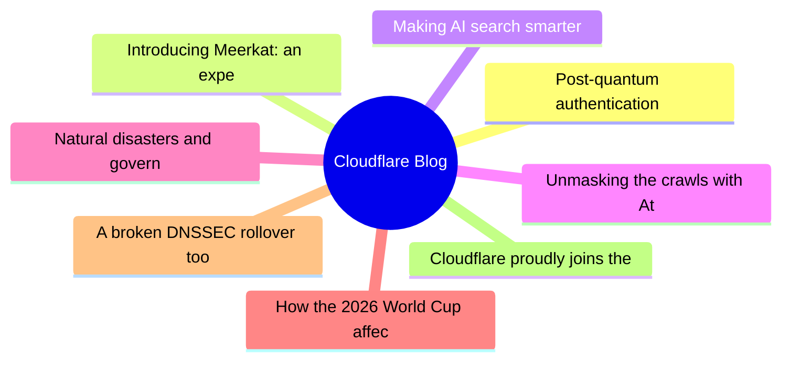
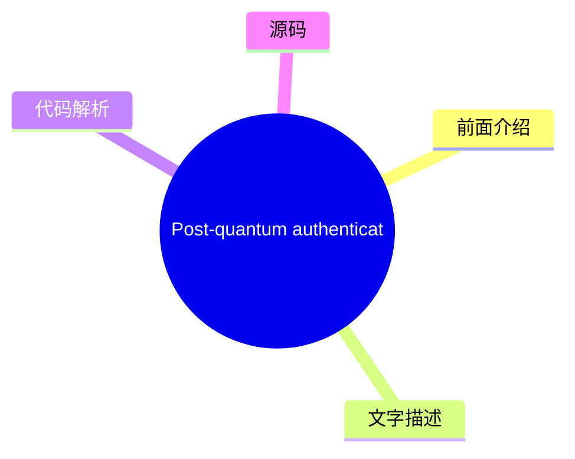
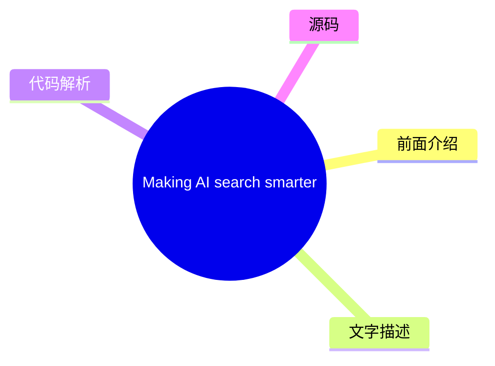
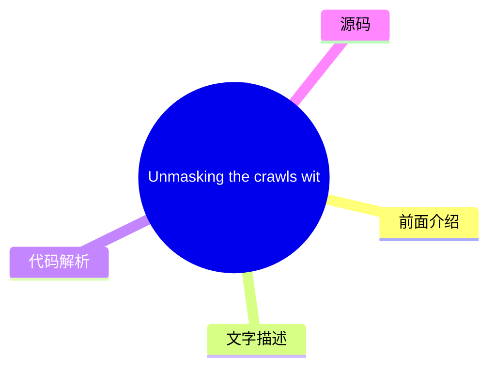
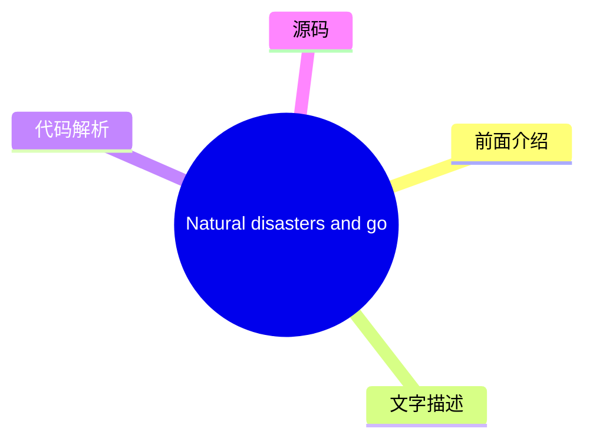
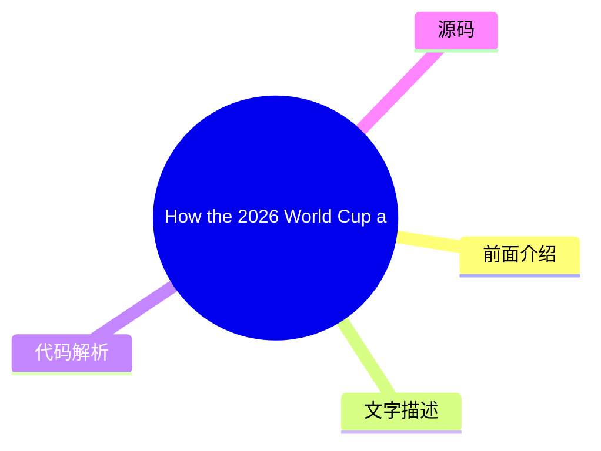
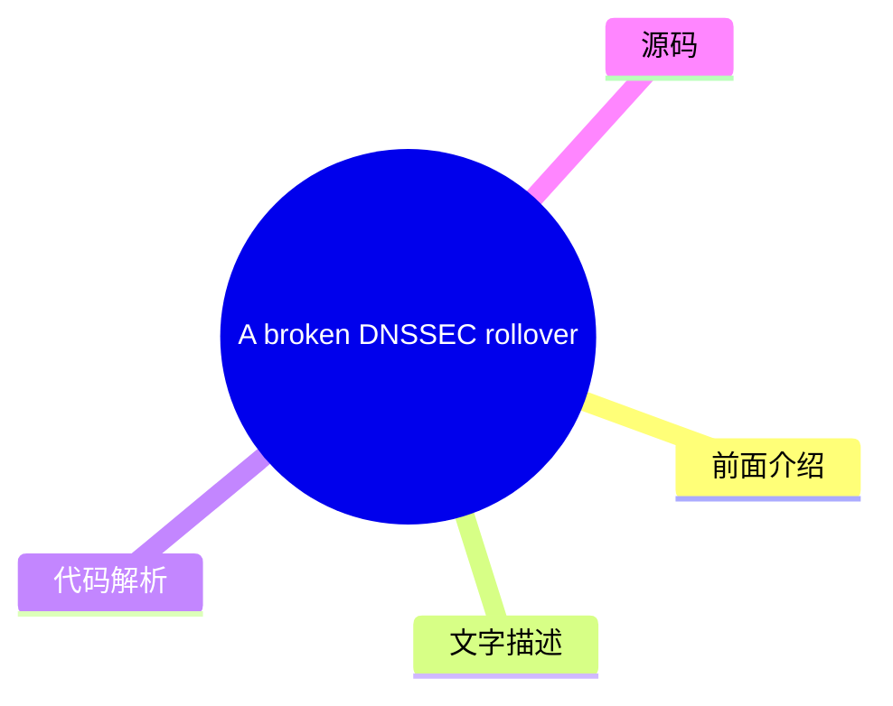
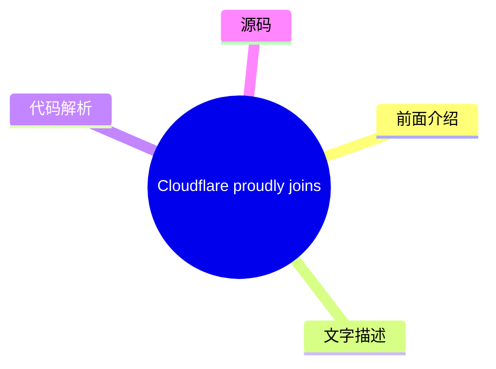

# ☁️ Cloudflare Blog Top 8 (2026-08-03)

## 前面介绍

- 数据源：Cloudflare Blog
- 抓取日期：2026-08-03
- 条目数：8
- 含完整正文：8
- 含代码片段：2
- 组织方式：前面介绍 / 树状图 / 文字描述 / 代码解析 / 源码

## 思维导图



## 详细整理（8 条，8 条含全文，2 条含代码）

### 1. Post-quantum authentication to origins is now supported
- **链接**: [https://blog.cloudflare.com/post-quantum-authentication-to-origins/](https://blog.cloudflare.com/post-quantum-authentication-to-origins/)
- **作者**: Luke Valenta
- **发布**: Wed, 29 Jul 2026 13:00:00 GMT

#### 前面介绍

- Cloudflare now supports post-quantum (PQ) authentication when connecting to customer origin servers via Authenticated Origin Pulls and Custom Origin Trust Store. This is the first step towards providing PQ authentication for all Cloudflare products.
- 作者：Luke Valenta
- 发布时间：Wed, 29 Jul 2026 13:00:00 GMT

#### 树状图



#### 文字描述

- Cloudflare's Authenticated Origin Pulls and Custom Origin Trust Store now support post-quantum authentication. Here weâll explain how you can configure fully post-quantum secure mutually authenticated TLS connections to your origin server, dive into the engineering details of how we built it, make a shameful confession, and finally explain how this work fits into our overall po
- ## Reaching a major milestone Our focus for the past several years has been in deploying post-quantum [ encryption](https://radar.cloudflare.com/post-quantum) to protect against [attacks, where an attacker quietly stockpiles your encrypted data with the hope of decrypting it in the future with a quantum computer.](https://en.wikipedia.org/wiki/Harvest_now,_decrypt_later) __harv
- ## Configuring fully PQ-secure origin connections We have added ML-DSA support (for all [ FIPS 204](https://csrc.nist.gov/pubs/fips/204/final) parameter sets: ML-DSA-44, ML-DSA-65, and ML-DSA-87) to the Custom Origin Trust Store and Authenticated Origin Pulls products. ML-DSA-44 is our recommendation for most applications as it is the most performant option and attains a comfor
- ### Avoiding downgrades Adding post-quantum encryption and authentication support to both the authenticating and verifying parties is necessary but *not* sufficient for full post-quantum security. The pesky issue of downgrades remains. If the verifying party supports any quantum-vulnerable authentication mechanisms, they remain open to attack from an [ on-path attacker](https:/

#### 代码解析

- `text`: 代码片段可作为实现参考，建议结合上下文确认输入输出和边界条件。
- `text`: 代码片段可作为实现参考，建议结合上下文确认输入输出和边界条件。

#### 源码

#### 源码片段 1（text）

```text
# Create a private ML-DSA-44 CA for the origin server
openssl genpkey -algorithm mldsa44 \
  -provparam ml-dsa.output_formats=seed-only \
  -out origin-ca.key
openssl req -new -x509 -key origin-ca.key \
  -out origin-ca.crt -days 10950 \
  -subj "/CN=Origin Server CA"
# Create the origin server certificate (signed by the origin CA)
openssl genpkey -algorithm mldsa44 \
  -provparam ml-dsa.output_formats=seed-only \
  -out origin-server.key
openssl req -new -key origin-server.key \
  -out origin-server.csr \
  -subj "/CN=origin.example.com"
openssl x509 -req -in origin-server.csr \
  -CA origin-ca.crt -CAkey origin-ca.key -CAcreateserial \
  -out origin-server.crt -days 5475 \
  -extfile <(printf "basicConstraints=CA:FALSE\nkeyUsage=digitalSignature\nsubjectAltName=DNS:origin.example.com\n")
```

#### 源码片段 2（text）

```text
# Create a private ML-DSA-44 CA for Authenticated Origin Pulls
openssl genpkey -algorithm mldsa44 \
  -provparam ml-dsa.output_formats=seed-only \
  -out aop-ca.key
openssl req -new -x509 -key aop-ca.key \
  -out aop-ca.crt -days 10950 \
  -subj "/CN=Authenticated Origin Pull CA"
# Create the client certificate Cloudflare will present (signed by the AOP CA)
openssl genpkey -algorithm mldsa44 \
  -provparam ml-dsa.output_formats=seed-only \
  -out aop-client.key
openssl req -new -key aop-client.key \
  -out aop-client.csr \
  -subj "/CN=cloudflare-aop-client"
openssl x509 -req -in aop-client.csr \
  -CA aop-ca.crt -CAkey aop-ca.key -CAcreateserial \
  -out aop-client.crt -days 5475 \
  -extfile <(printf "basicConstraints=CA:FALSE\nkeyUsage=digitalSignature\n")
```

#### 完整正文（中文）

Cloudflare 的 Authenticated Origin Pulls 和 Custom Origin Trust Store 现在支持后量子认证。

在这里，我们将解释如何配置完全后量子安全的相互认证 TLS 连接到您的源服务器，深入探讨我们构建它的工程细节，进行一番羞愧的忏悔，并最终解释这项工作如何融入我们整体的后量子迁移路线图。

## 达成重大里程碑

过去几年，我们的重点一直是部署后量子 [加密](https://radar.cloudflare.com/post-quantum) 以保护免受

[攻击，即攻击者悄悄囤积您的加密数据，希望在未来使用量子计算机对其进行解密。](https://en.wikipedia.org/wiki/Harvest_now,_decrypt_later)

__harvest-now/decrypt-later__然而，量子计算和密码分析方面的最新突破将整个行业升级到后量子密码学的计划时间表向前推进了 __across__[ 行业](https://blog.google/innovation-and-ai/technology/safety-security/cryptography-migration-timeline/) 并

[并促使我们将注意力转移到部署后量子](https://blog.cloudflare.com/post-quantum-eo-2026/)

__政府__*认证*，以保护免受攻击者的侵害，这些攻击者很快将能够使用量子计算机破解经典凭据并执行冒充攻击。

在之前的帖子中，我们宣布 Cloudflare [ 目标是 2029 年](https://blog.cloudflare.com/post-quantum-roadmap/#cloudflares-roadmap-to-full-post-quantum-security) 实现完全后量子安全，并概述了途中需要达到的几个里程碑。我们已经达到了其中第一个里程碑：我们的 

[和](https://developers.cloudflare.com/ssl/origin-configuration/authenticated-origin-pull/)

__Authenticated Origin Pulls__[产品](https://developers.cloudflare.com/ssl/origin-configuration/custom-origin-trust-store/)

__Custom Origin Trust Store__[通过 Module-Lattice-Based Digital Signature Algorithm (ML-DSA) 签名来保护 Cloudflare 与客户源服务器之间的连接。Â](https://developers.cloudflare.com/changelog/post/2026-06-17-pqc-mldsa-aop-cots/)

__现在支持后量子 (PQ) 身份验证__## 源连接不同

当客户端访问由 Cloudflare 代理的网站时，通常涉及两个连接。第一个连接是访客（例如浏览器）到 Cloudflare 的连接。如果请求可以从 Cloudflare 的缓存中提供，或者触发了任何阻止规则，Cloudflare 可能会直接响应。否则，Cloudflare 会建立第二个连接到客户的源服务器以获取请求的内容，以便它可以响应原始请求。

保护敏感访客数据需要这两个连接都免受量子攻击。我们已在 [2022](https://blog.cloudflare.com/post-quantum-for-all/) 年为访客到 Cloudflare (连接 1) 和 Cloudflare 到源 (连接 2) 连接启用了后量子加密支持，并且已经看到

[，

[，

__2023__[.](https://radar.cloudflare.com/post-quantum)

__显著使用量__我们正在积极致力于通过后量子身份验证来完成这一工作。对于访客到 Cloudflare 的连接，我们正在与 [ Google](https://blog.google/security/cultivating-a-robust-and-efficient-quantum-safe-https/) 以及互联网工程任务组 (

[) 合作开发并

[，

[，

[，

[，

[，

[，

[，

[，

[，

[，

[，

[，

[，

[，

[，

[，

[，

[，

[，

[，

[，

[，

[，

[，

[，

[，

[，

[，

[，

[，

[，

[，

[，

[，

[，

[，

[，

[，

[，

[，

[，

[，

[，

[，

[，

[，

[，

[，

[，

[，

[，

[，

[，

[，

[，

[，

[，

[，

[，

[，

[，

[，

[，

[，

[，

[，

[，

[，

[，

[，

[，

[，

[，

[，

[，

[，

[，

[，

[，

[，

[，

[，

[，

[，

[，

[，

[，

[，

[，

[，

[，

[，

[，

[，

[，

[，

[，

[，

[，

[，

[，

[，

[，

[，

[，

[，

[，

[，

[，

[，

[，

[，

[，

[，

[，

[，

[，

[，

[，

[，

[，

[，

[，

[，

[，

[，

[，

[，

[，

[，

[，

[，

[，

[，

[，

[，

[，

[，

[，

[，

[，

[，

[，

[，

[，

[，

[，

[，

[，

[，

[，

[，

[，

[，

[，

[，

[，

[，

[，

[，

[，

[，

[，

[，

[，

[，

[，

[，

[，

[，

[，

[，

[，

[，

[，

[，

[，

[，

[，

[，

[，

[，

[，

[，

[，

[，

[，

[，

[，

[，

[，

[，

[，

[，

[，

[，

[，

[，

[，

[，

[，

[，

[，

[，

[，

[，

[，

[，

[，

[，

[，

[，

[，

[，

[，

[，

[，

[，

[，

[，

[，

[，

[，

[，

[，

[，

[，

[，

[，

[，

[，

[，

[，

[，

[，

[，

[，

[，

[，

[，

[，

[，

[，

[，

[，

[，

[，

[，

[，

[，

[，

[，

[，

[，

[，

[，

[，

[，

[，

[，

[，

[，

[，

[，

[，

[，

[，

[，

[，

[，

[，

[，

[，

[，

[，

[，

[，

[，

[，

[，

[，

[，

[，

[，

[，

[，

[，

[，

[，

[，

[，

[，

[，

[，

[，

[，

[，

[，

[，

[，

[，

[，

[，

[，

[，

[，

[，

[，

[，

[，

[，

[，

[，

[，

[，

[，

[，

[，

[，

[，

[，

[，

[，

[，

[，

[，

[，

[，

[，

[，

[，

[，

[，

[，

[，

[，

[，

[，

[，

[，

[，

[，

[，

[，

[，

[，

[，

[，

[，

[，

[，

[，

[，

[，

[，

[，

[，

[，

[，

[，

[，

[，

[，

[，

[，

[，

[，

[，

[，

[，

[，

[，

[，

[，

[，

[，

[，

[，

[，

[，

[，

[，

[，

[，

[，

[，

[，

[，

[，

[，

[，

[，

[，

[，

[，

[，

[，

[，

[，

[，

[，

[，

[，

[，

[，

[，

[，

[，

[，

[，

[，

[，

[，

[，

[，

[，

[，

[，

[，

[，

[，

[，

[，

[，

[，

[，

[，

[，

[，

[，

[，

[，

[，

[，

[，

[，

[，

[，

[，

[，

[，

[，

[，

[，

[，

[，

[，

[，

[，

[，

[，

[，

[，

[，

[，

[，

[，

[，

[，

[，

[，

[，

[，

[，

[，

[，

[，

[，

[，

[，

[，

[，

[，

[，

[，

[，

[，

[，

[，

[，

[，

[，

[，

[，

[，

[，

[，

[，

[，

[，

[，

[，

[，

[，

[，

[，

[，

[，

[，

[，

[，

[，

[，

[，

[，

[，

[，

[，

[，

[，

[，

[，

[，

[，

[，

[，

[，

[，

[，

[，

[，

[，

[，

[，

[，

[，

[，

[，

[，

[，

[，

[，

[，

[，

[，

[，

[，

[，

[，

[，

[，

[，

[，

[，

[，

[，

[，

[，

[，

[，

[，

[，

[，

[，

[，

[，

[，

[，

[，

[，

[，

[，

[，

[，

[，

[，

[，

[，

[，

[，

[，

[，

[，

[，

[，

[，

[，

[，

[，

[，

[，

[，

[，

[，

[，

[，

[，

[，

[，

[，

[，

[，

[，

[，

[，

[，

[，

[，

[，

[，

[，

[，

[，

[，

[，

[，

[，

[，

[，

[，

[，

[，

[，

[，

[，

[，

[，

[，

[，

[，

[，

[，

[，

[，

[，

[，

[，

[，

[，

[，

[，

[，

[，

[，

[，

[，

[，

[，

[，

[，

[，

[，

[，

[，

[，

[，

[，

[，

[，

[，

[，

[，

[，

[，

[，

[，

[，

[，

[，

[，

[，

[，

[，

[，

[，

[，

[，

[，

[，

[，

[，

[，

[，

[，

[，

[，

[，

[，

[，

[，

[，

[，

[，

[，

[，

[，

[，

[，

[，

[，

[，

[，

[，

[，

[，

[，

[，

[，

[，

[，

[，

[，

[，

[，

[，

[，

[，

[，

[，

[，

[，

[，

[，

[，

[，

[，

[，

[，

[，

[，

[，

[，

[，

[，

[，

[，

[，

[，

[，

[，

[，

[，

[，

[，

[，

[，

[，

[，

[，

[，

[，

[，

[，

[，

[，

[，

[，

[，

[，

[，

[，

[，

[，

[，

[，

[，

[，

[，

[，

[，

[，

[，

[，

[，

[，

[，

[，

[，

[，

[，

[，

[，

[，

[，

[，

[，

[，

[，

[，

[，

[，

[，

[，

[，

[，

[，

[，

[，

[，

[，

[，

[，

[，

[，

[，

[，

[，

[，

[，

[，

[，

[，

[，

[，

[，

[，

[，

[，

[，

[，

[，

[，

[，

[，

[，

[，

[，

[，

[，

[，

[，

[，

[，

[，

[，

[，

[，

[，

[，

[，

[，

[，

[，

[，

[，

[，

[，

[，

[，

[，

[，

[，

[，

[，

[，

[，

[，

[，

[，

[，

[，

[，

[，

[，

[，

[，

[，

[，

[，

[，

[，

[，

[，

[，

[，

[，

[，

[，

[，

[，

[，

[，

[，

[，

[，

[，

[，

[，

[，

[，

[，

[，

[，

[，

[，

[，

[，

[，

[，

[，

[，

[，

[，

[，

[，

[，

[，

[，

[，

[，

[，

[，

[，

[，

[，

[，

[，

[，

[，

[，

[，

[，

[，

[，

[，

[，

[，

[，

[，

[，

[，

[，

[，

[，

[，

[，

[，

[，

[，

[，

[，

[，

[，

[，

[，

[，

[，

[，

[，

[，

[，

[，

[，

[，

[，

[，

[，

[，

[，

[，

[，

[，

[，

[，

[，

[，

[，

[，

[，

[，

[，

[，

[，

[，

[，

[，

[，

[，

[，

[，

[，

[，

[，

[，

[，

[，

[，

[，

[，

[，

[，

[，

[，

[，

[，

[，

[，

[，

[，

[，

[，

[，

[，

[，

[，

[，

[，

[，

[，

[，

[，

[，

[，

[，

[，

[，

[，

[，

[，

[，

[，

[，

[，

[，

[，

[，

[，

[，

[，

[，

[，

[，

[，

[，

[，

[，

[，

[，

[，

[，

[，

[，

[，

[，

[，

[，

[，

[，

[，

[，

[，

[，

[，

[，

[，

[，

[，

[，

[，

[，

[，

[，

[，

[，

[，

[，

[，

[，

[，

[，

[，

[，

[，

[，

[，

[，

[，

[，

[，

[，

[，

[，

[，

[，

[，

[，

[，

[，

[，

[，

[，

[，

[，

[，

[，

[，

[，

[，

[，

[，

[，

[，

[，

[，

[，

[，

[，

[，

[，

[，

[，

[，

[，

[，

[，

[，

[，

[，

[，

[，

[，

[，

[，

[，

[，

[，

[，

[，

[，

[，

[，

[，

[，

[，

[，

[，

[，

[，

[，

[，

[，

[，

[，

[，

[，

[，

[，

[，

[，

[，

[，

[，

[，

[，

[，

[，

[，

[，

[，

[，

[，

[，

[，

[，

[，

[，

[，

[，

[，

[，

[，

[，

[，

[，

[，

[，

[，

[，

[，

[，

[，

[，

[，

[，

[，

[，

[，

[，

[，

[，

[，

[，

[，

[，

[，

[，

[，

[，

[，

[，

[，

[，

[，

[，

[，

[，

[，

[，

[，

[，

[，

[，

[，

[，

[，

[，

[，

[，

[，

[，

[，

[，

[，

[，

[，

[，

[，

[，

[，

[，

[，

[，

[，

[，

[，

[，

[，

[，

[，

[，

[，

[，

[，

[，

[，

[，

[，

[，

[，

[，

[，

[，

[，

[，

[，

[，

[，

[，

[，

[，

[，

[，

[，

[，

[，

[，

[，

[，

[，

[，

[，

[，

[，

[，

[，

[，

[，

[，

[，

[，

[，

[，

[，

[，

[，

[，

[，

[，

[，

[，

[，

[，

[，

[，

[，

[，

[，

[，

[，

[，

[，

[，

[，

[，

[，

[，

[，

[，

[，

[，

[，

[，

[，

[，

[，

[，

[，

[，

[，

[，

[，

[，

[，

[，

[，

[，

[，

[，

[，

[，

[，

[，

[，

[，

[，

[，

[，

[，

[，

[，

[，

[，

[，

[，

[，

[，

[，

[，

[，

[，

[，

[，

[，

[，

[，

[，

[，

[，

[，

[，

[，

[，

[，

[，

[，

[，

[，

[，

[，

[，

[，

[，

[，

[，

[，

[，

[，

[，

[，

[，

[，

[，

[，

[

__(MTC)__对于此连接，Cloudflare 是客户端。这使我们能够控制采用连接池等技术，将来自我们网络各处的请求汇聚到较少的与源服务器建立的连接上，从而将连接建立的开销分摊到许多请求中。这使得“即插即用”型后量子签名的成本更加可接受，也降低了 MTC 的性能优势的必要性。

借助 Cloudflare 与客户之间预先存在的信任关系（即 Cloudflare 账户），我们无需受限于公共互联网公钥基础设施（PKI）（[ WebPKI](https://cabforum.org/working-groups/server/baseline-requirements/requirements/)）的约束和时间表，而是可以使用针对用例定制的自定义 PKI，无需中间证书的开销，以及

[可能不适用。像](https://datatracker.ietf.org/doc/html/rfc6962)

__证书透明度__[这样的解决方案也可以通过使用后量子加密（以及正在开发中的后量子认证）进行安全隧道传输，来保护 Cloudflare 到源服务器的连接，而无需升级遗留的源系统。](https://developers.cloudflare.com/tunnel/)

__Cloudflare 隧道__总而言之，Cloudflare 到源服务器的连接的独特需求，使我们能够通过 ML-DSA 认证提前部署后量子认证，而无需等待公共互联网 WebPKI 支持的落地。（对于坚持使用 WebPKI 的客户，请放心：我们将在未来的 Cloudflare 到源服务器的连接中添加 MTC 支持。）

那么如何开启此功能？让我们深入探讨配置。

## 配置完全 PQ 安全的源服务器连接

我们已将 ML-DSA 支持（针对所有 [ FIPS 204](https://csrc.nist.gov/pubs/fips/204/final) 参数集：ML-DSA-44、ML-DSA-65 和 ML-DSA-87）添加到自定义源信任存储和认证源拉取产品中。ML-DSA-44 是我们针对大多数应用程序的推荐选项，因为它是性能最好的选项，并且达到了舒适的 NIST

[安全强度。](https://nvlpubs.nist.gov/nistpubs/FIPS/NIST.FIPS.204.pdf#page=25)

__category 2__### 自定义源信任存储

当 Cloudflare 连接到配置了 [ Full (strict)](https://developers.cloudflare.com/ssl/origin-configuration/ssl-modes/full-strict/) SSL 模式的客户源服务器时，我们会根据由所有 

[证书颁发机构 (CAs) 以及 Cloudflareâs](https://ccadb.org)

__commonly trusted__[. The](https://developers.cloudflare.com/ssl/origin-configuration/origin-ca/)

__origin CA__[产品 (需要](https://developers.cloudflare.com/ssl/origin-configuration/custom-origin-trust-store/)

__自定义源信任存储 (COTS)__[启用) 允许客户用其控制的 CA 集合替换此默认信任存储。COTS 现在允许客户上传 ML-DSA CA，以便 Cloudflare 在连接到源服务器时信任任何链接到该 CA 的源服务器证书。](https://developers.cloudflare.com/ssl/edge-certificates/advanced-certificate-manager/)

__高级证书管理器__### 认证源拉取

为了限制对其源服务器的滥用和资源消耗，客户可能只想服务来自 Cloudflareâs 服务器的请求。[ 认证源拉取 (AOP)](https://developers.cloudflare.com/ssl/origin-configuration/authenticated-origin-pull/) 可用于配置 Cloudflare 向源服务器出示客户端证书以建立 

[连接，从而实现双方之间的双向安全且受信任的通信。AOP 在所有 Cloudflare 计划级别上均可免费使用。](https://www.cloudflare.com/learning/access-management/what-is-mutual-tls/)

__mutual TLS (mTLS)__AOP 支持三种[配置级别](https://developers.cloudflare.com/ssl/origin-configuration/authenticated-origin-pull/#configuration-levels)：全局、按区域和按主机名。按区域和按主机名的配置级别现在允许客户上传 ML-DSA 证书和私钥（采用 FIPS 204 种子格式），以便 Cloudflare 的 TLS 客户端在连接到源服务器时出示此证书以进行身份验证。（别担心，我们并没有忘记全局配置级别——它只是恰好是一个更复杂的变更，将在稍后优先处理。）

### 避免降级

向认证方和验证方同时添加后量子加密和身份验证支持是必要的，但*并非*实现完全后量子安全的充分条件。降级这个令人头疼的问题依然存在。如果验证方支持任何易受量子攻击的身份验证机制，它们仍然容易受到能够伪造经典凭据的[路径攻击者](https://www.cloudflare.com/learning/security/threats/on-path-attack/)的攻击。

解决方案：验证方必须移除对易受量子攻击的身份验证机制的信任。（在复杂的 PKI 中，这一点更为微妙。例如，请参阅 Chromium 安全团队的[四阶段计划](https://www.chromium.org/Home/chromium-security/post-quantum-auth-roadmap/)，以了解如何过渡 Web。）请参阅

[以了解有关如何确保您的源服务器免受降级攻击的详细信息。](https://developers.cloudflare.com/ssl/post-quantum-cryptography/pqc-to-origin/#avoid-downgrades)

__配置指南__### 快速入门

下面的演练展示了如何生成 ML-DSA 证书链并通过 Cloudflare API 配置这两个产品。有关仪表板说明和更多上下文，请参阅[开发者文档](https://developers.cloudflare.com/ssl/post-quantum-cryptography/pqc-to-origin/)。

1. 生成证书

您需要 OpenSSL 3.5.0 或更高版本。私钥必须采用 FIPS 204 种子编码生成，这是 Cloudflare 目前仅接受的上传格式。

**Origin server certificate chain for COTS:**

```
# Create a private ML-DSA-44 CA for the origin server
openssl genpkey -algorithm mldsa44 \
  -provparam ml-dsa.output_formats=seed-only \
  -out origin-ca.key
openssl req -new -x509 -key origin-ca.key \
  -out origin-ca.crt -days 10950 \
  -subj "/CN=Origin Server CA"
# Create the origin server certificate (signed by the origin CA)
openssl genpkey -algorithm mldsa44 \
  -provparam ml-dsa.output_formats=seed-only \
  -out origin-server.key
openssl req -new -key origin-server.key \
  -out origin-server.csr \
  -subj "/CN=origin.example.com"
openssl x509 -req -in origin-server.csr \
  -CA origin-ca.crt -CAkey origin-ca.key -CAcreateserial \
  -out origin-server.crt -days 5475 \
  -extfile <(printf "basicConstraints=CA:FALSE\nkeyUsage=digitalSignature\nsubjectAltName=DNS:origin.example.com\n")
```
**Cloudflare client certificate chain for AOP:**

```
# Create a private ML-DSA-44 CA for Authenticated Origin Pulls
openssl genpkey -algorithm mldsa44 \
  -provparam ml-dsa.output_formats=seed-only \
  -out aop-ca.key
openssl req -new -x509 -key aop-ca.key \
  -out aop-ca.crt -days 10950 \
  -subj "/CN=Authenticated Origin Pull CA"
# Create the client certificate Cloudflare will present (signed by the AOP CA)
openssl genpkey -algorithm mldsa44 \
  -provparam ml-dsa.output_formats=seed-only \
  -out aop-client.key
openssl req -new -key aop-client.key \
  -out aop-client.csr \
  -subj "/CN=cloudflare-aop-client"
openssl x509 -req -in aop-client.csr \
  -CA aop-ca.crt -CAkey aop-ca.key -CAcreateserial \
  -out aop-client.crt -days 5475 \
  -extfile <(printf "basicConstraints=CA:FALSE\nkeyUsage=digitalSignature\n")
```
2. Upload the origin CA to Custom Origin Trust Store

```
CA_CERT=$(jq -Rs . < origin-ca.crt)
curl "https://api.cloudflare.com/client/v4/zones/$ZONE_ID/acm/custom_trust_store" \
  --header "Authorization: Bearer $CLOUDFLARE_API_TOKEN" \
  --header "Cont

...（截断，原文 22450+ 字符）


### 2. Introducing Meerkat: an experiment in global consensus
- **链接**: [https://blog.cloudflare.com/meerkat-introduction/](https://blog.cloudflare.com/meerkat-introduction/)
- **作者**: James Larisch
- **发布**: Wed, 08 Jul 2026 12:00:00 GMT

#### 前面介绍

- Cloudflare Research is building a global consensus service called Meerkat that uses a new consensus algorithm called QuePaxa. We plan to use Meerkat to build a strongly consistent, fault-tolerant key-value store, and other applications.
- 作者：James Larisch
- 发布时间：Wed, 08 Jul 2026 12:00:00 GMT

#### 树状图


#### 文字描述

- Many internal services at Cloudflare need to read and modify the same control-plane state from across our 330+ global data centers. They need guarantees that different readers *never *see inconsistent state, and that the system remains available for writes even when some data centers or links fail. But Cloudflareâs network runs across the entire Internet, and the Internet is an
- ## What we need from a global control-plane data system Many Cloudflare services read and write *control-plane data*, data that helps those services operate correctly, from multiple machines distributed all over the world. One example of control-plane data is *placement information*: where certain resources (like an AI model instance) are stored. Another example is *leadership 
- ### Strong consistency A distributed data systemâs [ consistency](https://jepsen.io/consistency/models) level describes what kinds of weird behavior the system is allowed to exhibit when it receives concurrent reads and writes. Consider a distributed key-value store that stores a single numeric value `x = 6` across multiple nodes. Also consider the following sequence of writes.
- ### Fault tolerance A systemâs level of fault tolerance describes what kinds of faults the system can handle before catastrophes happen. Catastrophes are typically violations of properties the system aims to uphold, e.g., that two consecutive reads without an intervening write for the same key never see different values, or that the system remains available for writes. The faul

#### 代码解析

- 本文未检测到明确代码块，内容更偏新闻、观点或方法论。

#### 源码

#### 中文节选

Cloudflare 的许多内部服务需要从我们 330 多个全球数据中心读取和修改相同的控制平面状态。它们需要保证不同的读取者*永远*不会看到不一致的状态，并且即使在某些数据中心或链路发生故障的情况下，系统仍能保持写入可用性。

但是 Cloudflare 的网络覆盖整个互联网，而互联网是一个不可预测的地方。服务器和数据中心会宕机。队列会填满。链路和电缆会被切断。这些条件使得很难运行一个保证强一致性的全球可用数据系统（例如，保证所有读取者都能读取到所有先前的写入），因为敌对条件阻碍了分布式系统副本之间可靠地同步数据的能力。

尽管网络条件不利，但通过*共识算法*安全地同步数据的一种方法是，它允许一组机器在只要大多数节点保持存活且能够通信的情况下，就同意相同的值序列，例如键值存储的 put 和 `get` 操作。

不幸的是，像 [Raft](https://raft.github.io/) 这样的常用共识算法在 Cloudflare 这样的广域网上表现不佳，因为它们依赖于*领导者*和*超时*。*领导者*是唯一被允许进行写入的副本，如果它因崩溃或网络降级而失败，系统将变得不可用，直到某个其他副本*超时*并选举出新的领导者。而且，在具有不可预测延迟的网络中，这些超时值很难配置。

我们已经经历过多次由共识驱动系统中不可用的领导者导致的事故。

因此，在过去的一年里，Cloudflare 的研究 [团队](https://research.cloudflare.com/) 一直在构建一个新的分布式共识服务，名为

**Meerkat**，它由一种名为

[, 由 Tennage & BÄsescu 等人于 2023 年发布。QuePaxa 与 Raft 的不同之处在于，所有副本可以随时执行写入，且进度永远不会因超时而停止，这使其非常适合 Cloudflare 的网络。我们层](https://bford.info/pub/os/quepaxa/quepaxa.pdf)

__QuePaxa__*applications*, like a transactional key-value store and leasing system, atop Meerkatâs consensus log. To our knowledge, this will be the first industrial deployment of QuePaxa at global scale.

Meerkat is an experimental consensus service that is still in development. Itâs being designed initially to manage small pieces of control plane state (e.g., leadership for replicated databases) and so it will be kept internal-only for the immediate future. This post introduces Meerkat and lays the groundwork for the Meerkat-related blog posts to come.Â

## What we need from a global control-plane data system

Many Cloudflare services read and write *control-plane data*, data that helps those services operate correctly, from multiple machines distributed all over the world. One example of control-plane data is *placement information*: where cer

#### 完整正文（中文）

Cloudflare 的许多内部服务需要从我们 330 多个全球数据中心读取和修改相同的控制平面状态。它们需要保证不同的读取者*永远*不会看到不一致的状态，并且即使在某些数据中心或链路发生故障的情况下，系统仍能保持写入可用性。

但是 Cloudflare 的网络覆盖整个互联网，而互联网是一个不可预测的地方。服务器和数据中心会宕机。队列会填满。链路和电缆会被切断。这些条件使得很难运行一个保证强一致性的全球可用数据系统（例如，保证所有读取者都能读取到所有先前的写入），因为敌对条件阻碍了分布式系统副本之间可靠地同步数据的能力。

尽管网络条件不利，但通过*共识算法*安全地同步数据的一种方法是，它允许一组机器在只要大多数节点保持存活且能够通信的情况下，就同意相同的值序列，例如键值存储的 put 和 `get` 操作。

不幸的是，像 [Raft](https://raft.github.io/) 这样的常用共识算法在 Cloudflare 这样的广域网上表现不佳，因为它们依赖于*领导者*和*超时*。*领导者*是唯一被允许进行写入的副本，如果它因崩溃或网络降级而失败，系统将变得不可用，直到某个其他副本*超时*并选举出新的领导者。而且，在具有不可预测延迟的网络中，这些超时值很难配置。

我们已经经历过多次由共识驱动系统中不可用的领导者导致的事故。

因此，在过去的一年里，Cloudflare 的研究 [团队](https://research.cloudflare.com/) 一直在构建一个新的分布式共识服务，名为

**Meerkat**，它由一种名为

[, 由 Tennage & BÄsescu 等人于 2023 年发布。QuePaxa 与 Raft 的不同之处在于，所有副本可以随时执行写入，且进度永远不会因超时而停止，这使其非常适合 Cloudflare 的网络。我们层](https://bford.info/pub/os/quepaxa/quepaxa.pdf)

__QuePaxa__*应用程序*，例如基于 Meerkat 共识日志的事务型键值存储和租赁系统。据我们所知，这将是 QuePaxa 首次在全球范围内进行工业级部署。

Meerkat 是一个仍在开发中的实验性共识服务。它最初被设计用于管理小块控制平面状态（例如复制数据库的领导权），因此在可预见的未来，它将仅限内部使用。本文介绍了 Meerkat，并为即将发布的与 Meerkat 相关的博客文章奠定了基础。

## 我们对全球控制平面数据系统的需求

Cloudflare 的许多服务会读取和写入*控制平面数据*，即帮助这些服务正确运行的数据，这些数据分布在世界各地的多台机器上。控制平面数据的一个例子是*放置信息*：特定资源（如 AI 模型实例）存储在哪里。另一个例子是*领导权信息*：哪台机器目前被允许对数据库执行写入操作。

控制平面数据必须同时具备*强*一致性，并且能够在特定类型的故障下保持可访问性。

在本节中，我们将精确描述我们对 Cloudflare 共识服务的一致性和容错要求。我们使用键值存储作为运行在共识服务之上的应用程序的运行示例，尽管其他应用程序（例如分布式租赁/锁）也是可能的。

### 强一致性

分布式数据系统的[一致性](https://jepsen.io/consistency/models)级别描述了系统在接收并发读写时被允许表现出的怪异行为。考虑一个在多个节点上存储单个数值的分布式键值存储

`x = 6`。同时考虑以下写入序列。这些写入是以尽力而为的方式提交到不同节点的，并且可能以任何顺序到达： - `x = x + 1`
- `x = x / 2`

系统的一致性级别告诉您客户端在执行这些写入后读取 `x` 时可能看到的 `x` 的值。考虑以下操作序列以及在不同一致性级别下的可能执行顺序：

在弱一致性级别中，写入操作可能会被重新排序。在更强的一致性模型中，写入操作不能被重新排序，但读取操作可以。在可能的最强一致性级别中，操作的顺序与它们在现实时间中发生的顺序完全一致。这种属性被称为 *线性化*。

在 Cloudflare，许多服务都需要线性化。与较弱的一致性形式不同，线性化让程序员无需考虑数据系统可能表现出的所有怪异行为。相反，他们可以像在单线程机器上推理本地内存一样来推理分布式系统：写入之后的所有读取都将看到该写入。关于弱一致性的危险，请查看 Marc Brooker 的这篇[文章](https://brooker.co.za/blog/2025/11/18/consistency.html)以获取更多阅读材料。

（如果你想知道，Meerkat 的键值存储也提供了可串行化，我们将在未来的文章中讨论这一点。）

### 容错性

系统的容错级别描述了在灾难发生之前，系统能够处理哪些类型的故障。灾难通常是对系统旨在维护的属性的违反，例如，两个连续的读取操作之间没有中间写入操作，却从未看到不同的值，或者系统保持写入可用性。故障包括网络故障或延迟、机器崩溃和机器重启。系统通常会显式处理某些故障，但不处理其他故障（你无法处理所有故障，因为宇宙总是可能达到热寂）。例如，某些键值存储可能会保证只要系统中有三分之二的机器可以相互通信且没有崩溃，就能保持写入可用性，但如果机器被攻破并开始发送恶意消息，则不做任何承诺。

我们期望的容错属性如下：

**首先**，只要满足以下条件，数据系统应保持对位于我们任何数据中心中的客户端的写入和读取可用：

- 我们系统中的大多数机器都处于存活状态，并且能够相互通信。（形式上，我们在 `2f + 1` 台机器的系统中容忍 `f` 个故障）。

- 客户端可以联系系统中的*任何*一台连接了大多数存活机器的机器。

这意味着，单台机器故障或单条链路的网络降级不会影响系统的可用性*。*正如我们稍后将看到的，Raft 基于的系统不提供此属性。

**第二**，只要系统中没有参与者是主动恶意的（当然，也没有 bug），数据系统就会保持*正确*。我们将在后面从共识*安全性*的角度定义*正确性*，但通俗地说，这意味着没有两台最新的机器会就世界状态产生分歧（例如，一台认为 `key1=1`，而另一台认为 `key1=2`）。

总之，即使机器崩溃、机器重启、网络故障或降级、数据中心宕机等，系统也必须保持正确（尽管我们像基于 Raft 的系统一样，不处理[拜占庭故障](https://en.wikipedia.org/wiki/Byzantine_fault)）。

## 介绍 Meerkat

Meerkat 是一个共识服务，我们可以在其上构建具有上述属性（强一致性和容错性）的应用程序，例如键值（KV）存储。为了了解 Meerkat 的工作原理，我们首先概述 Meerkat 的总体架构，然后描述 Meerkat 对共识算法的选择如何有助于提供强一致性和容错性。

使用 Meerkat 的服务开发人员会请求一个 Meerkat *副本*集群。每个副本都连接到其他每个副本。每个副本都参与共识算法，并且可以接收读取和写入请求。开发人员可以指定允许在其副本上托管的数据中心，Meerkat 会自动放置它们。

为了与集群交互，开发人员的客户端向集群中的任意一个副本发送特定于应用程序的请求。单个副本可能托管多种类型的应用程序，但最简单的是键值存储，因此最简单的特定于应用程序的请求类型是 KV `get` 或 `put`。副本使用特定于应用程序的响应来响应请求（例如，使用 `get` 请求的记录）。请注意，KV 读取（`get`）保证读取到最新信息。

### Meerkat 的日志

在底层，副本将应用程序请求（例如 `get` 和 `put`）转换为 *日志事件*。该副本使用共识算法将每个日志事件分发给所有其他副本，以确保所有副本维护完全相同的事件日志（实际上，副本可能会落后，但绝不能记录不同的条目）。这些事件是任意的——Meerkat 的核心并不关心它们里面包含什么。Meerkat 的 *应用程序* 关心的是日志事件的内容。每个 Meerkat 副本“托管”许多 Meerkat 应用程序（例如键值存储），这些应用程序读取日志事件并构建状态。（请注意，每个副本恰好属于一个集群。）

例如，KV Meerkat 应用程序从日志事件构建一个内存键值存储。因此，当客户端发送像 `put k1 v1` 这样的写入时，接收副本将该写入放入一个日志事件中并分发给所有副本。如果其他人随后在不同的副本上写入 `put k1 v11`，该事件也会分发给所有副本。由于所有正常运行的副本拥有相同的日志，这些副本可以按顺序应用日志中的操作来构建完全相同的状态。请注意，`get` 请求也会创建分布式日志事件（为了线性一致性，如下一节所述）。

以下是副本的 KV 存储在接收日志事件时如何更新的示例：

### Meerkat 的日志如何实现强一致性

Meerkat 保证，如果一个客户端执行 `put k1 v1`，第二个客户端随后执行 `put k1 v11`，第三个客户端随后执行 `get k1`（使用一致读），他们将始终读取 `v11`。即使每个请求被提交到不同的副本，且这些副本随机分布在世界各地，Meerkat 也能保证这一点。这就是线性一致性。为了了解 Meerkat 如何保证这一点，我们必须更详细地检查 Meerkat 的日志。

Meerkat 日志是一系列槽位的序列。一个槽位是一个可以包含事件或不包含事件的盒子。包含事件的槽位被称为一个 *已决定* 槽位。日志中的所有槽位都是已决定的，除了最后一个槽位，它目前正在被决定。Meerkat 的不变量之一是，如果任何两个副本决定了一个槽位的值，那么这些值是相同的。换句话说，没有两个副本会就一个已决定槽位的值产生分歧（尽管一个副本可能认为最后一个槽位是空的，而另一个副本则不这么认为）。这个属性有助于保证我们在上一节中描述的期望属性。

为了决定日志中最后一个（空的）槽位的值，Meerkat 副本运行一个分布式的 *共识算法*。共识算法允许一组通过网络通信的机器就一个已决定的槽位值达成一致。我们的共识算法只要大多数副本（超过一半）存活就能正常工作。

所以，如果日志当前包含两个条目，并且一个客户端向一个副本提交了 `put k1 v11`，该副本就会为槽位 3 触发一个共识算法。但是，另一个客户端可能已经向另一个副本提交了 `put k1 v111` 用于槽位 3。共识算法确保只有针对槽位 3 的这样一个 *提议* 获胜。具体来说，它确保至少大多数副本同意同一个提议，并将其 *决定* 为槽位 3 的值。非大多数副本 *永远* 不能决定不同的提议，但可能会错过这一事实

...（截断，原文 20546+ 字符）


### 3. Making AI search smarter
- **链接**: [https://blog.cloudflare.com/making-ai-search-smarter/](https://blog.cloudflare.com/making-ai-search-smarter/)
- **作者**: Matthew Conroy
- **发布**: Wed, 01 Jul 2026 13:00:00 GMT

#### 前面介绍

- Search is how we find nearly everything on the web — creators, merchants, answers. AI is rewriting the rules, leaving creators caught between staying discoverable in an agentic era and getting paid for their work. Today we're launching two initiative
- 作者：Matthew Conroy
- 发布时间：Wed, 01 Jul 2026 13:00:00 GMT

#### 树状图



#### 文字描述

- Search drives most experiences on the web. It's how we get things done, and how nearly everything on the web gets found â the creators, the merchants, the answer to whatever you just typed into a box. For nearly 30 years, that discovery journey ran on a simple bargain: let a search engine crawl your content, and it sends you visitors. You turned those visitors into a business â
- ### Rebuilding the bargain Transparency and control are the foundation, but more is needed. In 2025, we laid out our foundation via a set of [ responsible AI bot principles](https://blog.cloudflare.com/building-a-better-internet-with-responsible-ai-bot-principles/): bots should be transparent about who they are and what they're for, respect site owners' choices, and act in good
- ### Making search smarter Today we're launching a research program to make AI search smarter and stop our customers footing the bill for crawls that produce nothing new. More than 20% of the web sits behind Cloudflareâs network, which gives us a unique perspective. We can tell which pages have genuinely changed and which ones people and agents are flocking to. Through this prog
- ### From Pay Per Crawl to Pay Per Use Last year we [ launched Pay Per Crawl ](https://blog.cloudflare.com/introducing-pay-per-crawl/)so publishers could charge AI companies for crawling their content. It was a real start, but crawling is a crude measure of value. A single page might be crawled once and then cited in thousands of answers, or crawled over and over and never used 

#### 代码解析

- 本文未检测到明确代码块，内容更偏新闻、观点或方法论。

#### 源码

#### 中文节选

搜索驱动了网络上的大多数体验。这是我们完成事情的方式，也是网络上的几乎每一件事被找到的方式——创作者、商家，以及你刚刚在框中输入的任何问题的答案。近 30 年来，那次发现之旅运行在一个简单的交易之上：让搜索引擎抓取你的内容，它就会向你发送访客。你通过广告、订阅，或者仅仅是受众本身，将这些访客转化为了生意。可被发现和获得报酬是同一回事。一年前，在[第一个内容独立日](https://blog.cloudflare.com/content-independence-day-no-ai-crawl-without-compensation/)，我们划下了一条线，以在 AI 时代捍卫这一交易。但一道界线只是第一步。自那时以来，AI 搜索在消费者生活中的普及程度只增不减，因为

[. 威胁不再是你可以屏蔽的少数训练爬虫；而是搜索本身正在围绕 AI 答案进行重建。](https://radar.cloudflare.com/)

__超过 50% 的在线流量是非人类的__如今的答案引擎会读取你的页面并将摘要交给用户，因此访问——以及依赖于它的收入——就变得不再必要。我们亲眼目睹了这一点，独立研究也证实了这一点：[2025 年皮尤研究中心的一项研究](https://www.pewresearch.org/short-reads/2025/07/22/google-users-are-less-likely-to-click-on-links-when-an-ai-summary-appears-in-the-results/)发现，当谷歌显示 AI 摘要时，用户点击传统搜索结果链接的频率仅为 8%（大约是没有摘要时的一半），而点击摘要内部的链接的频率仅为 1%。这让我们陷入了两难境地：退出 AI 搜索从而难以被发现，或者加入 AI 搜索，在向用户提供巨大价值的同时，却看到回报越来越少。我们的客户希望被找到并获得其提供价值的报酬，而目前他们被迫做出选择。

今天，[我们宣布了新的机器人选项](http://blog.cloudflare.com/content-independence-day-ai-options)，以帮助我们的客户更好地控制谁可以访问其网站以及他们可以对网站做什么。但屏蔽只是第一步：说“不”可以在不重建维持网站业务模式的情况下保护内容。因此，是时候开始构建互联网的新经济模式了，从搜索开始。

### 重建契约

透明度和控制是基础，但这还不够。2025 年，我们通过一套 [负责任的 AI 机器人原则](https://blog.cloudflare.com/building-a-better-internet-with-responsible-ai-bot-principles/) 阐明了我们的基础：机器人应该对其身份和用途保持透明，尊重网站所有者的选择，并善意行事。我们的工具将机器人置于这一标准之上。但强制执行良好的机器人行为并不能让依赖它的用户在使用 AI 搜索时获得更好的体验，也无法向创造了答案所必需内容的创作者支付报酬。我们不仅能帮助网络说“不”；我们还可以帮助重建网络说“是”的内容。

#### 完整正文（中文）

搜索驱动了网络上的大多数体验。这是我们完成事情的方式，也是网络上的几乎每一件事被找到的方式——创作者、商家，以及你刚刚在框中输入的任何问题的答案。近 30 年来，那次发现之旅运行在一个简单的交易之上：让搜索引擎抓取你的内容，它就会向你发送访客。你通过广告、订阅，或者仅仅是受众本身，将这些访客转化为了生意。可被发现和获得报酬是同一回事。一年前，在[第一个内容独立日](https://blog.cloudflare.com/content-independence-day-no-ai-crawl-without-compensation/)，我们划下了一条线，以在 AI 时代捍卫这一交易。但一道界线只是第一步。自那时以来，AI 搜索在消费者生活中的普及程度只增不减，因为

[. 威胁不再是你可以屏蔽的少数训练爬虫；而是搜索本身正在围绕 AI 答案进行重建。](https://radar.cloudflare.com/)

__超过 50% 的在线流量是非人类的__如今的答案引擎会读取你的页面并将摘要交给用户，因此访问——以及依赖于它的收入——就变得不再必要。我们亲眼目睹了这一点，独立研究也证实了这一点：[2025 年皮尤研究中心的一项研究](https://www.pewresearch.org/short-reads/2025/07/22/google-users-are-less-likely-to-click-on-links-when-an-ai-summary-appears-in-the-results/)发现，当谷歌显示 AI 摘要时，用户点击传统搜索结果链接的频率仅为 8%（大约是没有摘要时的一半），而点击摘要内部的链接的频率仅为 1%。这让我们陷入了两难境地：退出 AI 搜索从而难以被发现，或者加入 AI 搜索，在向用户提供巨大价值的同时，却看到回报越来越少。我们的客户希望被找到并获得其提供价值的报酬，而目前他们被迫做出选择。

今天，[我们宣布了新的机器人选项](http://blog.cloudflare.com/content-independence-day-ai-options)，以帮助我们的客户更好地控制谁可以访问他们的网站以及他们可以对网站做什么。但屏蔽只是第一步：说“不”可以在不重建维持网站业务模式的情况下保护内容。因此，是时候开始构建互联网的新经济模式了，从搜索开始。

### 重构交易

透明度和控制是基础，但这还不够。2025 年，我们通过一套 [负责任的 AI 机器人原则](https://blog.cloudflare.com/building-a-better-internet-with-responsible-ai-bot-principles/) 确立了我们的基础：机器人应透明地说明它们是谁以及它们的用途，尊重网站所有者的选择，并善意行事。我们的工具将机器人置于这一标准之上。但强制执行良好的机器人行为并不能让依赖它的 AI 搜索变得更好，也不会向创造了答案可能性的创作者回馈一美元。我们可以做的不仅仅是帮助网络说“不”；我们可以帮助重建网络说“是”的内容。

因此，今天我们宣布了两项举措，从防御转向进攻，并开始重新组合旧交易的两半。

**让 AI 搜索更智能：** 通过利用我们在全球网络中看到的信号，例如什么是新鲜的、什么是高质量的以及实际上发生了什么变化，我们可以帮助搜索引擎展示最相关的内容并减少不必要的抓取。搜索者可以获得更好的答案，如果网页仅在发生变化时才被重新抓取，AI 公司和网站所有者的成本都会降低。

**为创作者提供的价值付费：** 当你的作品被用来回答某人的问题时，你应该得到奖励，而不仅仅是被免费抓取。你应该能够看到哪些内容被使用了以及人们在问什么。这应该是一个真正的收入来源，也是继续创作值得寻找的原创内容的动力。

### 让搜索更智能

今天，我们启动了一项研究计划，旨在让 AI 搜索更智能，并停止我们的客户为产生不了任何新内容的抓取买单。

超过 20% 的网站位于 Cloudflare 的网络之后，这给了我们独特的视角。我们可以判断哪些页面真正发生了变化，哪些页面是人们和机器人蜂拥而至的。通过该计划，我们将探索利用客户选择分享的关于其内容新鲜度的信号，并将这些信号与我们自己对流量流向（包括人类和机器人）的洞察相结合。对于答案引擎而言，这是通往高质量内容的路线图。对于我们的客户而言，它提供了用户实际在问什么，以及他们的内容如何在 AI 结果中呈现的视角。我们的目标是衡量两件事：这些信号在多大程度上帮助答案引擎展示更新、更高质量的内容，以及它们在多大程度上消除了不必要的抓取。

第二个好处，即消除不必要的抓取，其影响比听起来要大。Cloudflare 的数据显示，超过 50% 的优质机器人抓取流量都用于重新抓取未发生变化的页面——随着抓取量的增加，这个数字很可能会上升。一个仅仅表示“这里什么都没变”的信号，就能让抓取器跳过这次访问。这节省了答案引擎的计算资源。更重要的是，它让网站所有者免于处理和支付他们根本不需要的请求。

该计划在设计上是中立的：我们的目标是让它对每一个愿意公平竞争的答案引擎都有效。它仅限于搜索。我们不会分享任何内容，也不会使用任何数据来训练基础模型。我们打算公布我们的发现，包括对网站所有者的好处，例如更好的内容可发现性和减轻服务器压力。我们计划在今年晚些时候让该功能广泛可用，并减少我们网络上的不必要的抓取。

### 从按次抓取到按使用付费

去年，我们[推出了按次抓取功能](https://blog.cloudflare.com/introducing-pay-per-crawl/)，以便出版商可以向 AI 公司收取抓取其内容的费用。这是一个真正的开端，但抓取只是衡量价值的一种粗略方式。一个页面可能只被抓取一次，然后在数千个答案中被引用，或者被反复抓取却从未被使用过。创作者希望为他们提供的价值获得公平的报酬。

所以我们正在将 Pay Per Crawl 转型为 Pay Per Use。我们正在与顶级 AI 公司（如 [ Ceramic.ai](http://ceramic.ai) 和 [__You.com__](http://you.com)）进行实验，这种安排很简单：组织可以自带支付模式，并将其轻松扩展到 Cloudflare 网络上的内容所有者身上。

Ceramic 构建了一种所谓的“按查询付费”模式，因此选择加入的出版商可以在其内容出现在 Ceramic 的搜索结果中时获得报酬。这意味着支付设计遵循工作所创造的价值，而不是爬虫恰好抓取它的次数。

“为了扩展 AI 搜索的未来，我们需要一个拥有巨大覆盖面且对透明度和公平补偿有共同承诺的合作伙伴，”Ceramic.ai 创始人兼首席执行官 Anna Patterson 说，“Cloudflare 允许我们轻松且以编程的方式扩展我们的运营。通过将我们的按查询付费模式带到他们的网络中，我们确保数百万内容所有者可以无缝加入，以便每次其内容出现在我们的搜索结果中时都能获得补偿。”

除了补偿之外，参与 Cloudflare/Ceramic 计划的内容所有者还将解锁新的报告，以帮助进行答案引擎优化（AEO）。客户终于可以看到导致其内容出现在搜索结果中的顶级查询、特定的网页和摘要、其平均搜索结果排名位置等。这是我们即将推出的众多帮助客户提高可发现性的产品中的第一个。

这只是众多新兴方法之一。另一种来自 You.com：代理可以按需为所需的具体优质内容付费，无需任何前期承诺。AI 提供商正在测试新的支付模式（例如按查询付费、按结果付费等），而我们拥有支持所有这些模式的基础设施。

我们想坦诚地说明，这只是一个实验。还有很多东西需要学习，包括这种模式在互联网规模下究竟如何运作。我们将随着进展与合作伙伴及客户一起探索，并分享我们的所学。但目标很明确：AI 搜索公司能获得更及时、更有依据的答案，而那些让答案成为可能的客户（即内容创作者）在提供帮助时也能获得报酬。Cloudflare 在此过程中的职责是提供使这一市场繁荣发展的基础设施层。

我们认为，这更符合搜索经济未来的发展方向。旧的人类网络优化搜索以节省时间——提供摘要、十个蓝色链接和一个点击。智能体驱动的互联网则不同：智能体可以快速阅读并持续搜索。搜索正变成智能体为了回答一个问题而执行的数十次操作，它更像是一种公用设施，而非终点。在那个世界里，重要的单位不再是抓取或点击，而是结果。对结果进行定价，并支付促成结果的人的费用，这就是互联网得以持续繁荣的方式。

### 我们希望赢得的头条

一年前的“内容独立日”，头条是一个默认的“不”：AI 在没有补偿的情况下无法抓取。今年，我们的重点是为用户提供更多的产品和控制选项，以便他们说“是”，并带来更多的好处。

今天的公告只是开始。Cloudflare 的研究项目旨在测试我们的信号能否在减少抓取的情况下产生更好的结果。按使用付费是我们将与合作伙伴一起探索的有前景的方向，这些合作伙伴相信内容创作者应为其工作获得公平的报酬。过去 30 年的互联网也是这样建立的：有人运行试点项目，将“模型已损坏”转变为“这是新模型”，一次实验接一次实验。我们相信，我们的客户在这个新的智能体时代具有被发现的商业价值，并且可以优化其内容以实现最大程度的发现。但他们应该能够做到这一点，而无需免费赠送他们最有价值的创意资产。

互联网正在发生变化，其赖以生存的商业模式也随之改变。旧的互联网是开放、中立且值得贡献的。我们有机会保持它的现状，并为未来的互联网构建相应的商业模式。为人类和智能体提供更智能的答案。为那些凭借技能、创造力和奉献精神让答案变得有价值的人们提供公平的交易。这就是我们追求 Cloudflare 使命的方式：帮助构建一个更好的互联网。

祝内容独立日快乐！

*正在构建开放、面向智能体的网络？如果您想了解更多关于 Ceramic 和 You 计划的信息，请填写 __此表单__。如果您正在构建答案引擎并希望进行更智能的抓取，我们也非常乐意收到您的来信：aeo@cloudflare.com。*


### 4. Unmasking the crawls with Attribution Business Insights
- **链接**: [https://blog.cloudflare.com/attribution-business-insights/](https://blog.cloudflare.com/attribution-business-insights/)
- **作者**: Jin-Hee Lee
- **发布**: Wed, 01 Jul 2026 06:00:00 GMT

#### 前面介绍

- Cloudflare’s new Attribution Business Insights dashboard helps website owners understand crawler behavior, appetite, and potential value, fueling business-level conversations around crawl compensation.
- 作者：Jin-Hee Lee
- 发布时间：Wed, 01 Jul 2026 06:00:00 GMT

#### 树状图



#### 文字描述

- Original content is the lifeblood of conversations and curiosities. Imagine a world without it: we could find a thousand ways to regurgitate the same material thatâs already been created, but we would witness the decline of fresh ideas and arguments. Website owners fuel the ecosystem of ideas, news, and interesting tidbits, but they face the increasingly complex challenge of ma
- ### The new economics of the Internet For decades, the business model of the Internet relied on a straightforward, unspoken agreement: website owners allowed search engines to crawl their content and, in return, search engines sent readers back to their pages. This symbiotic relationship, where traditional search engines operated with a balanced "crawl-to-referral" ratio, gener
- ## Introducing Attribution Business Insights We want website owners to have the facts â the cold, hard numbers to understand which bots are helping their business and which bots are harming it. We also want to make this analysis easier than ever, which is why weâve designed Attribution Business Insights to cut the noise, focusing on the details that our customers have told us a
- ### From data to business strategy You shouldnât have to be a security expert to understand how AI crawlers affect your business. If website owners want to spend just a few minutes ingesting the high-level insights, they can walk away with a clear temperature check of the effectiveness of their content security policy. For those who want to do a little more digging to understan

#### 代码解析

- 本文未检测到明确代码块，内容更偏新闻、观点或方法论。

#### 源码

#### 中文节选

原始内容是对话和好奇心的生命线。想象一个没有它的世界：我们可以找到一千种方式去重复已经创造过的材料，但我们会目睹新鲜想法和论点的衰退。

网站所有者推动了想法、新闻和有趣琐事生态系统的燃料，但他们面临着管理网站流量并获得内容报酬的日益复杂的挑战。虽然某些机器人流量显然是恶意的，但当特定的 AI 抓取器是在帮助还是损害您的业务时，这并不总是显而易见的。为了回答这个问题，网站所有者需要细粒度、可靠的数据来区分提供价值的流量，以及消耗资源并侵蚀其商业模式基础（即实际消费其内容的人类）的流量。

在 Cloudflare，我们秉持一个核心信念：网站所有者有权 [控制对其内容的访问](https://blog.cloudflare.com/content-independence-day-no-ai-crawl-without-compensation/)。我们希望帮助网站所有者维护其高质量内容并规范 AI 流量。

为了提供迫切需要的清晰度并帮助网站所有者掌握主动权，我们很兴奋地宣布推出新的 [Attribution Business Insights 仪表板](https://developers.cloudflare.com/bots/attribution-business-insights/) —— 该仪表板专为商业决策者和出版商设计。

### 互联网的新经济模式

几十年来，互联网的商业模式依赖于一种简单、心照不宣的协议：网站所有者允许搜索引擎抓取其内容，作为回报，搜索引擎会将读者送回其页面。这种共生关系（传统搜索引擎以平衡的“抓取到推荐”比率运行）产生了维持广告、联盟收入和订阅所需的页面浏览量。搜索索引抓取器会扫描您的内容 [ 每次发送推荐时扫描几次 ](https://blog.cloudflare.com/ai-search-crawl-refer-ratio-on-radar/)，因此让网站对抓取器可用，为额外的收入提供了清晰的管道。我们可以将其视为 SEO（搜索引擎优化）时代。

今天，AI 爬虫和智能体的爆发式增长打破了这一契约，使数字出版行业陷入了前所未有的危机。互联网正面临向“零点击”生态系统的转变，AI 聊天机器人抓取原始内容以合成即时答案——完全绕过了原始来源。我们已经看到从仅 SEO 世界向 AEO（答案引擎优化）世界的明显转变，现在关于 GEO（生成式引擎优化）的讨论已成为焦点。

这种新现实的不平衡在我们今天看到的爬虫到转化的比率中表现得淋漓尽致。虽然传统搜索引擎的爬虫与合法访客转化的比率更为平衡，但主要的 AI 爬虫则运作在截然不同的、提取性的规模上。机器人

#### 完整正文（中文）

原始内容是对话和好奇心的生命线。想象一个没有它的世界：我们可以找到一千种方式去重复已经创造过的材料，但我们会目睹新鲜想法和论点的衰退。

网站所有者推动了想法、新闻和有趣琐事生态系统的燃料，但他们面临着管理网站流量并获得内容报酬的日益复杂的挑战。虽然某些机器人流量显然是恶意的，但当特定的 AI 抓取器是在帮助还是损害您的业务时，这并不总是显而易见的。为了回答这个问题，网站所有者需要细粒度、可靠的数据来区分提供价值的流量，以及消耗资源并侵蚀其商业模式基础（即实际消费其内容的人类）的流量。

在 Cloudflare，我们秉持一个核心信念：网站所有者有权 [控制对其内容的访问](https://blog.cloudflare.com/content-independence-day-no-ai-crawl-without-compensation/)。我们希望帮助网站所有者维护其高质量内容并规范 AI 流量。

为了提供迫切需要的清晰度并帮助网站所有者掌握主动权，我们很兴奋地宣布推出新的 [Attribution Business Insights 仪表板](https://developers.cloudflare.com/bots/attribution-business-insights/) —— 该仪表板专为商业决策者和出版商设计。

### 互联网的新经济模式

几十年来，互联网的商业模式依赖于一种简单、心照不宣的协议：网站所有者允许搜索引擎抓取其内容，作为回报，搜索引擎会将读者送回其页面。这种共生关系（传统搜索引擎以平衡的“抓取到推荐”比率运行）产生了维持广告、联盟收入和订阅所需的页面浏览量。搜索索引抓取器会扫描您的内容 [ 每次发送推荐时扫描几次 ](https://blog.cloudflare.com/ai-search-crawl-refer-ratio-on-radar/)，因此让网站对抓取器可用，为额外的收入提供了清晰的管道。我们可以将其视为 SEO（搜索引擎优化）时代。

今天，AI 爬虫和智能体的爆发式增长打破了这一契约，使数字出版业陷入了前所未有的危机。互联网正面临转变为“零点击”生态系统的风险，AI 聊天机器人抓取原创内容以合成即时答案，完全绕过了原始来源。我们已经看到了从仅 SEO 世界向 AEO（答案引擎优化）世界的明显转变，现在关于 GEO（生成式引擎优化）的讨论正成为焦点。

这种新现实的不平衡在我们今天看到的爬虫到推荐流量比中表现得淋漓尽致。虽然传统搜索引擎的爬虫与合法推荐访客的比例更为平衡，但主要 AI 爬虫的运作规模截然不同，属于提取性规模。据观察，领先 AI 公司的机器人具有不同的爬虫到推荐流量比：我们在 [我们的内容独立日 2025 年](https://blog.cloudflare.com/ai-crawler-traffic-by-purpose-and-industry/) 期间注意到了 118:1 到接近 50,000:1 的比例。换句话说，AI 爬虫可能已经抓取了你的优质内容数万次，却只返回一个访客。这种比例从根本上是不公平的。

对于出版商来说，这造成了双重打击：首先，他们失去了至关重要的推荐流量、广告展示和直接受众关系，而这些是内容创作和新闻业的基础。其次，他们被迫承担托管和向自动化机器人提供内容的不断上涨的基础设施成本，而这些机器人没有任何商业回报。允许 **所有** 爬虫以期能被发现的那个时代已经结束。

## 介绍 Attribution Business Insights

我们希望网站所有者掌握事实——即那些能帮助他们了解哪些机器人有助于其业务、哪些机器人损害其业务的冰冷而确凿的数据。我们还希望让这种分析比以往任何时候都更容易，这就是我们设计 Attribution Business Insights 的原因，旨在过滤掉噪音，专注于我们客户认为最重要的细节。

今天，

__Attribution Business Insights 仪表板__对所有 Cloudflare Bot Management 客户开放

*targeted*（目标）网站流量视图；与可能需要大量手动过滤的传统分析工具不同，此仪表板可立即为您提供关键见解。

我们旨在回答当今网站所有者最紧迫的问题：**您应如何考虑网站上的 AI 流量？** 不同受众（包括人类、非 AI 机器人以及 AI 机器人）的价值是多少？最重要的是，您的数据被用于什么目的？

*新的 Attribution Business Insights 仪表板视图，其中包括关于机器人流量的整体见解、全站爬取到转化的比率，以及 AI 机器人流量与自然流量的分布。*

为了回答这些问题，该仪表板展示了强大的数据和分析组合：

- **内容页面的机器人流量：** 查看您的机器人与人类流量对比，以及所有成功访问内容页面的机器人流量量。
- **爬取到转化的比率：** 查看您全站的爬取到转化比率，时间跨度为 24 小时、7 天或 30 天。您还可以查看*按机器人操作者*（即拥有一个或多个机器人的公司）划分的爬取到转化比率。
- **顶级机器人细分：** 按流量量列出的顶级机器人列表，包括其来源国家、在您网站上占用的带宽，以及您当前是阻止还是允许它们。
- **基于爬虫行为的更新分类：** 我们超越了通用的“AI 爬虫”标签，通过我们的更新分类法对爬虫进行分类，无论是用于 **训练**（即训练 __LLM 聊天机器人的下一个版本__）、**搜索**（即刷新 __检索增强生成__ 的数据库），还是 **代理**（即用于 __代理交互以返回答案__）。

### 从数据到商业策略

您不应必须是安全专家才能了解 AI 爬虫如何影响您的业务。如果网站所有者只想花几分钟时间获取高层级见解，他们就能清楚地了解其内容安全策略的有效性。

对于那些希望进一步挖掘，以了解 AI 公司如何利用其内容——或收集信息以指导他们希望与 AI 公司建立的关系发展——的人，我们展示了一个按机器人操作者组织的更细致的视图。

*网站上的机器人活动细分，包含每个机器人的重要细节，例如类型、爬取到转化的比率以及当前操作。*

通过拥有一个寻求访问您网站内容的公司的综合视图，您可以更好地建立爬虫活动的基础。我们希望这些数据能让我们的客户能够掌握事实，自信地参与任何商业对话。告诉公司 1，其爬取量是公司 4 的二十倍，而公司 4 已经在为内容向您支付报酬。根据其最近的活动，重新评估公司 2 许可您内容的方式。这个新仪表盘将推动商业对话向前发展。

这一新层的可见性如何与您现有的用于防止网站滥用的工具相结合？与 [Bot Management](https://developers.cloudflare.com/bots/get-started/bot-management/) 的其他功能保持一致，*action*（操作）步骤仍在安全规则中进行。为了在控制平面中避免增加噪音，Attribution Business Insights 旨在成为*深思熟虑、经过筛选的分析*的中心枢纽，而不是另一个采取行动的地方。该仪表盘作为信息的主要来源，允许您在同一个管理其他滥用缓解措施的控制引擎中采取行动之前进行调查。我们还希望明确邀请业务决策者进入此仪表盘，并承认围绕 AI 流量的讨论涉及的利益相关者范围比仅限于安全专业用户的范围更广。

### 接下来是什么

归因业务洞察仪表板是向网站所有者提供其管理不断演变的 AI 机器人威胁所需透明度和控制权的下一个关键步骤，更广泛地说，是塑造互联网新动态的关键一步。我们正在与密切的出版合作伙伴合作调查下一个版本，以创建一个覆盖网站所有者视角安全的可见性平面，并分享有价值的原创内容。

下面的预览包括一个新视图，用于逐篇文章分析爬虫活动，以揭示 AI 公司对不同内容、不同活动等的摄取需求。

*根据流量量统计的最受欢迎文章细分。显示关键指标，例如 AI 机器人流量与其他机器人流量及人类流量（直接流量和来自推荐网站的流量）。*

可见性是第一步，未来还有更多内容将帮助网站所有者在新时代掌控其内容。我们鼓励 [Cloudflare Bot Management](https://www.cloudflare.com/application-services/products/bot-management/) 的所有客户——尤其是那些推动业务对话的客户——立即访问此功能，以获得对分析的新视角。


### 5. Natural disasters and government interference: examining Q2 2026’s major Internet disruption events
- **链接**: [https://blog.cloudflare.com/q2-2026-internet-disruption-summary/](https://blog.cloudflare.com/q2-2026-internet-disruption-summary/)
- **作者**: Lai Yi Ohlsen
- **发布**: Tue, 28 Jul 2026 13:00:00 GMT

#### 前面介绍

- Cloudflare Radar tracked Internet disruptions driven by natural disasters, government-mandated shutdowns, and DNSSEC key rollovers over the last quarter. This post analyzes traffic telemetry to explain how these events impacted global connectivity.
- 作者：Lai Yi Ohlsen
- 发布时间：Tue, 28 Jul 2026 13:00:00 GMT

#### 树状图



#### 文字描述

- Like most infrastructure, the Internet's fragility is easy to overlook â as long as it's working. When it fails, its complexity comes into full view. Cloudflare is in a unique position to detect and document the moments when one of the interrelated systems the Internet depends on breaks down and connectivity suffers as a result. Each quarter, we summarize the disruptions we det
- ### Natural disasters and electricity cause disruptions in Guam, Venezuela, and Tanzania Super Typhoon Sinlaku, the strongest storm of the 2026 Pacific typhoon season so far, tracked through the Mariana Islands in mid-April, passing just north of Guam. Though the island was spared a direct hit, the storm brought tropical-storm-force winds, knocking out power across Guam and dis
- ### Governments and geopolitics impact connectivity in Iran, UAE, Iraq and Sudan Starting on May 26, Radar began seeing signs of Iran's previously [ announced](https://x.com/ir_aref/status/2059261258566877640?s=20) Internet restoration, the tentative end of an 88-day shutdown that had left the country almost entirely offline since it began on February 28. On May 27, Radar [that
- ### Infrastructure vulnerabilities affect users in Germany and Saint Lucia On May 5, a DNSSEC key rollover at DENIC, the registry for Germany's .de domain, [ started producing invalid signatures](https://blog.denic.de/technische-storung-bei-de-domains-behoben/). These key rollovers are the periodic replacement of the cryptographic keys used to sign a zone's DNS records; they a

#### 代码解析

- 本文未检测到明确代码块，内容更偏新闻、观点或方法论。

#### 源码

#### 中文节选

与大多数基础设施一样，互联网的脆弱性很容易被忽视——只要它还在运行。一旦失效，其复杂性便会一览无余。Cloudflare 处于一个独特的位置，能够检测并记录互联网所依赖的相互关联系统之一发生故障并导致连接中断的时刻。每个季度，我们都会总结我们在 [ Cloudflare Radar](https://radar.cloudflare.com/) 上检测并标注的中断情况。

2026 年第二季度，超级台风 Sinlaku 在关岛以北经过，造成了最长的中断；而苏丹在考试期间实施的政府强制断网则是发生频率最高的中断。伊朗恢复了国家互联网接入，在经历了 88 天的断网后将其公民重新连接到全球网络，尽管无人机袭击造成的破坏仍在继续扰乱该地区其他地方的 AWS 基础设施。最后，圣卢西亚的海底光缆切断以及德国错误 DNSSEC 签名的分发，凸显了互联网基础设施的脆弱性，但也展示了这些区域和全球系统在正常运行时维持的惊人稳定性。

在这里，我们将回顾我们在 2026 年第二季度观察到的最重大的互联网中断情况，利用 Cloudflare Radar 的流量数据来展示每个中断的演变过程及其对地面用户的影响。一如既往，这是对值得注意的、已确认的中断的总结，而非详尽无遗的列表；关于检测到的流量异常的更全面视图，可在 [ Cloudflare Radar Outage Center](https://radar.cloudflare.com/outage-center?dateStart=2026-04-01&dateEnd=2026-06-30) 查看。

### 自然灾害和电力故障导致关岛、委内瑞拉和坦桑尼亚出现中断

超级台风 Sinlaku 是 2026 年太平洋台风季迄今为止最强的风暴，于 4 月中旬穿过马里亚纳群岛，从关岛以北经过。虽然该岛免受直接袭击，但风暴带来了热带风暴级别的风力，导致关岛全境停电，并破坏了供水系统，这直接影响了互联网连接。该地区的流量在 4 月 13 日至 14 日间下降了多达 80%。

两个月后，6月24日，委内瑞拉北部在约一分钟内接连发生了两次大地震，震中位于尤马雷和圣菲利佩，随后在加拉加斯海岸外发生了一次余震。第一次7.5级地震发生在格林威治标准时间大约22:04（当地时间18:04）。这些事件的直接影响可以在雷达中看到，雷达显示在地震发生的同时，HTTP传输字节数急剧下降。这种下降在 Fibex Telecom 中尤为明显，根据 [ APNIC 数据](https://stats.labs.apnic.net/aspop/)，该公司估计拥有160万用户。该下降趋势在 __CANTV__[, 一家规模稍小的区域ISP。Â](https://radar.cloudflare.com/tr

#### 完整正文（中文）

与大多数基础设施一样，互联网的脆弱性很容易被忽视——只要它还在运行。一旦失效，其复杂性便会一览无余。Cloudflare 处于一个独特的位置，能够检测并记录互联网所依赖的相互关联系统之一发生故障并导致连接中断的时刻。每个季度，我们都会总结我们在 [ Cloudflare Radar](https://radar.cloudflare.com/) 上检测并标注的中断情况。

2026 年第二季度，超级台风 Sinlaku 在关岛以北经过，造成了最长的中断；而苏丹在考试期间实施的政府强制断网则是发生频率最高的中断。伊朗恢复了国家互联网接入，在经历了 88 天的断网后将其公民重新连接到全球网络，尽管无人机袭击造成的破坏仍在继续扰乱该地区其他地方的 AWS 基础设施。最后，圣卢西亚的海底光缆切断以及德国错误 DNSSEC 签名的分发，凸显了互联网基础设施的脆弱性，但也展示了这些区域和全球系统在正常运行时维持的惊人稳定性。

在这里，我们将回顾我们在 2026 年第二季度观察到的最重大的互联网中断情况，利用 Cloudflare Radar 的流量数据来展示每个中断的演变过程及其对地面用户的影响。一如既往，这是对值得注意的、已确认的中断的总结，而非详尽无遗的列表；关于检测到的流量异常的更全面视图，可在 [ Cloudflare Radar Outage Center](https://radar.cloudflare.com/outage-center?dateStart=2026-04-01&dateEnd=2026-06-30) 查看。

### 自然灾害和电力故障导致关岛、委内瑞拉和坦桑尼亚出现中断

超级台风 Sinlaku 是 2026 年太平洋台风季迄今为止最强的风暴，于 4 月中旬穿过马里亚纳群岛，从关岛以北经过。虽然该岛免受直接袭击，但风暴带来了热带风暴级别的风力，导致关岛全境停电，并破坏了供水系统，这直接影响了互联网连接。该地区的流量在 4 月 13 日至 14 日间下降了多达 80%。

两个月后，6月24日，委内瑞拉北部在约一分钟内接连发生了两次大地震，震中位于尤马雷和圣菲利佩，随后在加拉加斯海岸外发生了一次余震。第一次7.5级地震发生在格林威治标准时间大约22:04（当地时间18:04）。这些事件造成的直接影响可以在雷达图中看到，该图显示在地震发生的同时，HTTP传输的字节数急剧下降。这种下降在 Fibex Telecom 上表现得尤为明显，根据 [APNIC 数据](https://stats.labs.apnic.net/aspop/)，该公司估计拥有160万用户。[, 国有运营商，和](https://radar.cloudflare.com/traffic/as8048?dateStart=2026-06-24&dateEnd=2026-06-25#traffic-trends)

__CANTV__[, 稍小一点的区域性 ISP。Â](https://radar.cloudflare.com/traffic/as263703?dateStart=2026-06-24&dateEnd=2026-06-25)

__VNET__几天后，在跨大西洋的另一边，6月27日坦桑尼亚的停电导致那里的 HTTP 流量急剧下降，持续时间至少为五个小时。虽然其起因与该国2025年10月与选举相关的停电（这是政府的有意行动，而非基础设施故障）截然不同，但由此产生的遥测数据和用户影响几乎完全相同：连接性严重丧失，导致居民无法与亲人联系或获取关键新闻。Â

如此根本不同的事件在数据和用户体验中留下如此相似的痕迹，令人印象深刻。综合来看，这些与天气相关和由电力驱动的中断表明，物理世界对数字世界有着巨大的影响，以及互联网韧性的重要性，以及构建具有足够冗余的电力、路由和物理路径的网络，以抵御不可避免冲击的重要性。

### 政府和地缘政治影响伊朗、阿联酋、伊拉克和苏丹的连接性

自 5 月 26 日起，Radar 开始看到伊朗此前 [宣布](https://x.com/ir_aref/status/2059261258566877640?s=20) 的互联网恢复迹象，这标志着持续 88 天的断网即将结束，自 2 月 28 日开始以来，该国几乎完全处于离线状态。5 月 27 日，Radar

[报告称流量已恢复到断网前水平的 40%，这与报道中称访问是逐步恢复而非一次性恢复的情况一致。此后，我们看到 HTTP 字节一度攀升至 90%，随后回落到断网前水平的约 59%。这一流量水平与我们在 2 月观察到的流量一致，即最近一次断网与 1 月上一次断网之间的窗口期，这表明连接已恢复到最近一次断网前的基线水平，而非完全正常化。在我们的](https://blog.cloudflare.com/iran-internet-partially-restored-may-2026/)

__报告__中，伊朗作为一个唯一的异常值脱颖而出：虽然大多数参与国家的流量随比赛赛程起伏，但伊朗的读数则由其恢复后的水平与此前几乎完全失去连接之间的对比所主导。](https://blog.cloudflare.com/2026-world-cup-internet-traffic/#streaming-makes-some-countries-appear-more-online)

__2026 世界杯分析__与此同时，到位于阿联酋的 AWS 云区域 me-central-1 的 HTTP 流量 [保持低位](https://radar.cloudflare.com/cloud-observatory/amazon/me-central-1?dateRange=24w#http-traffic)，与

__保持一致__

[4月30日，该地区“因中东冲突而遭受损害，目前无法可靠地支持客户应用程序。”此次更新紧随3月3日的报告，该报告称阿联酋和巴林的设施“因无人机袭击而遭受了物理基础设施影响。”在阿联酋，两个设施“直接遭到袭击”，而在巴林，一次靠近设施的无人机袭击对其基础设施造成了“物理影响”。流量的减少是底层数据中心基础设施物理受损的下游特征，而不是网络故障，它继续影响着托管在该地区的网站和应用程序，无论它们自身的可用性如何。](https://health.aws.amazon.com/health/status#multipleservices-me-central-1_1777533954)

__AWS 服务报告__2026年第二季度还包括伊拉克的三次政府强制停机（[6月2日](https://radar.cloudflare.com/traffic/iq?dateStart=2026-06-01&dateEnd=2026-06-02)，[6月10日](https://radar.cloudflare.com/traffic/iq?dateStart=2026-06-10&dateEnd=2026-06-11)和[6月28日](https://radar.cloudflare.com/traffic/iq?dateStart=2026-06-27&dateEnd=2026-06-28)），以及[4月13日至23日](https://radar.cloudflare.com/traffic/sd?dateStart=2026-04-13&dateEnd=2026-04-23#traffic-trends)期间苏丹的10次停机，所有这些停机都是为了防止国家考试作弊——这是我们记录的这两个国家多个季度中出现的季节性模式。苏丹的停机遵循一致的节奏，每次持续时间约为3.5小时，从UTC 11:45到15:15（当地时间13:45到17:15），与考试窗口时间一致。在伊拉克，停机时间较短，每次约90分钟，同样安排在考试进行的时间段内。](https://radar.cloudflare.com/traffic/sd?dateStart=2026-04-13&dateEnd=2026-04-23#traffic-trends)

__苏丹10次__这些例子，无论是恢复还是中断，都说明了政府对其国家连接性施加的重大控制，以及出于政策而非基础设施原因，访问可以轻松关闭、限速或选择性重新引入。

### 基础设施漏洞影响德国和圣卢西亚的用户

5月5日，德国 .de 域名注册商 DENIC 的 DNSSEC 密钥轮换开始生成无效签名。这些密钥轮换是用于对区域 DNS 记录进行签名的加密密钥的定期更换；这是一项例行但至关重要的维护工作，因为验证 DNSSEC 的解析器只会信任签名与当前发布密钥匹配的答案。换句话说，如果数字签名与预期值不匹配，解析器会假设该网站已被篡改并切断访问。当开始生成无效签名时，全球的验证解析器拒绝了所有对 .de 网站的请求，并返回 SERVFAIL 错误，直到当地时间 5 月 6 日 01:15（UTC 23:15）恢复正常运营。

Cloudflare Radar 观察到在此次中断期间，全球 .de 查询量有所上升。虽然起初可能有些反直觉，这是因为失败的答案实际上是无法缓存的，所以原本从缓存中静默服务的查询现在必须重新解析并反复重试，导致查询量急剧增加。

从用户的角度来看，此次事件并非被体验为 DNS 或加密故障，而仅仅是 .de 网站和服务突然变得无法访问。尽管用户仍然能够访问不使用 .de 顶级域名的网站，但体验包括页面加载失败、电子邮件被退回以及应用程序超时，所有这些都可能反映中断期间的情况。您可以在我们的[博客](https://blog.cloudflare.com/de-tld-outage-dnssec/)上阅读更多关于 DNSSEC 及该事件影响的内容。

在加勒比地区，基础设施故障导致可用性出现类似下降。6月21日左右，Karib Cable 网络的 HTTP 请求流量降至接近零，并在随后的大半天时间里保持平稳，直到 6月22日 17:00 UTC（当地时间 13:00）恢复到预期水平。此次中断据称是由岛附近的光纤切断引起的，这是依赖少数陆地和海底路径连接更广泛互联网的加勒比网络所面临的一个熟悉的风险，这意味着一次断裂可能会切断不成比例的容量。由于 Karib Cable 是最大的提供商之一，这种损失在国家层面也显而易见，圣卢西亚的整体流量在切断期间

[下降了约 60%，与上周相比](https://radar.cloudflare.com/explorer?dataSet=netflows&loc=LC&dt=2026-06-21_2026-06-27&timeCompare=1#result)

__### Radar 继续监控中断情况__

2026年第二季度，互联网中断源于多种原因，包括恶劣天气、地震、停电、政府指令下的关闭、云基础设施受损、光缆切断以及 DNSSEC 配置错误。这些事件表明，互联网依赖于一套复杂的相互关联的系统，其中任何一个系统的故障都可能导致连接丢失。

Cloudflare Radar 团队持续监控互联网中断情况，通过 [Cloudflare Radar 中断中心](https://radar.cloudflare.com/outage-center)、社交媒体以及在 [blog.cloudflare.com](http://blog.cloudflare.com) 的文章分享我们的观察。请在社交媒体上关注我们：[@CloudflareRadar](https://twitter.com/CloudflareRadar) (X)、[noc.social/@cloudflareradar](https://noc.social/@cloudflareradar) (Mastodon) 和 [radar.cloudflare.com](http://radar.cloudflare.com) (Bluesky)。


### 6. How the 2026 World Cup affected Internet traffic
- **链接**: [https://blog.cloudflare.com/2026-world-cup-internet-traffic/](https://blog.cloudflare.com/2026-world-cup-internet-traffic/)
- **作者**: Sabina Zejnilovic
- **发布**: Tue, 21 Jul 2026 12:59:40 GMT

#### 前面介绍

- We analyzed global HTTP traffic to explore how kickoff times, streaming habits, and hydration breaks reshaped online activity worldwide. From late-night traffic surges to halftime browsing spikes, here is how the world connected during the global tou
- 作者：Sabina Zejnilovic
- 发布时间：Tue, 21 Jul 2026 12:59:40 GMT

#### 树状图



#### 文字描述

- For 96 years, the World Cup has been a global phenomenon, uniting nations and communities through a shared love of sportsmanship. While its popularity is nothing new, what is novel today is how rare a truly collective global experience has become. In an era defined by microtrends and algorithmic bubbles, it is increasingly uncommon for people across most countries to engage in 
- ## How did the World Cup change our behavior online? To understand how traffic changes throughout a match, we had to establish what it is ânormally.â One way to do this is by looking at raw request volumes, or the amount of traffic we see on our network per country. But these amounts vary per country (the amount of daily traffic in the United States is always a larger number t
- ## Whether youâre staying up late or waking up early, kickoff time impacts traffic One factor shaping how traffic changes is simply what time the match kicks off locally. The largest changes in activity happen when a match is played in the overnight and early-morning hours â roughly midnight to 8am local time. These are the hours when very few people are normally online, so **f
- ## Which matches moved the Internet most? One of the most compelling aspects of the World Cup is seeing which storylines and teams capture the attention of fans across the world. Weâve discussed how regional traffic patterns change as a result of matches. But who are they watching? Which matches made the most impact on Internet traffic? Here's how we calculated this: for each

#### 代码解析

- 本文未检测到明确代码块，内容更偏新闻、观点或方法论。

#### 源码

#### 中文节选

在过去的96年里，世界杯一直是一个全球现象，通过共同的体育精神将各国和社区联系在一起。虽然它的流行并非新鲜事，但今天的新颖之处在于，真正集体性的全球体验是多么罕见。在一个由微趋势和算法气泡定义的时代，大多数国家的人们参与完全相同的事件变得越来越不寻常。

这正是世界杯的凝聚力所在。来自世界各地的球迷围绕这些一生一次的比赛和故事线重塑了他们的日常作息——而且由于 Cloudflare 运营着一个拥有 330 多个全球节点的网络，我们处于一个独特的位置，可以确切地看到这一全球仪式如何在 2026 年 6 月和 7 月重塑了全球的在线活动。

Cloudflare Radar 追踪 HTTP 流量、DNS、安全等，以突出全球互联网趋势。在这篇博客文章中，我们将利用这些数据来探索世界杯如何影响整个锦标赛期间的全球流量模式。

## 世界杯如何改变了我们的在线行为？

为了了解比赛期间流量如何变化，我们必须先确定什么是“正常”。一种方法是查看原始请求数量，即我们在网络中看到的每个国家的流量量。但这些数量因国家而异（美国的每日流量量总是比葡萄牙的流量大），这使得建立全球适用的基准变得困难。相反，我们使用前四周的中位流量来定义“正常”：这是一个为期一个月的窗口，提供了稳定的每分钟参考值，并平滑了日常的波动。

我们还想知道流量是相对于该基准上升还是下降，但单纯的差异无法让我们将高流量国家与低流量国家进行比较。相反，我们使用了当前流量与基准流量的比率，表示为对数值：对数使增加和减少围绕零点对称（+1 = 正常的两倍，-1 = 正常的一半）。换句话说，**零分意味着流量完全正常，正数表示激增，负数表示下降。**

## 无论你是熬夜还是早起，开球时间都会影响交通

影响交通变化的一个因素仅仅是比赛在当地的开球时间。活动量最大的变化发生在深夜和清晨时段——大约午夜到上午8点当地时间的这段时间。这些是通常很少有人在线的时间段，因此**熬夜（或早起）观看比赛的球迷将流量推高到了远超平时水平的程度，在某些情况下甚至翻了一番**。如图所示，这是工作日和周末偏差峰值出现的地方。

相比之下，在正常白天和工作时间（上午9点左右到下午）进行的比赛并没有显示出如此大的影响：流量保持在接近平时水平的水平，这可能是因为观看比赛的人本来就已经在线了

#### 完整正文（中文）

在过去的96年里，世界杯一直是一个全球现象，通过共同的体育精神将各国和社区联系在一起。虽然它的流行并非新鲜事，但今天的新颖之处在于，真正集体性的全球体验是多么罕见。在一个由微趋势和算法气泡定义的时代，大多数国家的人们参与完全相同的事件变得越来越不寻常。

这正是世界杯的凝聚力所在。来自世界各地的球迷围绕这些一生一次的比赛和故事线重塑了他们的日常作息——而且由于 Cloudflare 运营着一个拥有 330 多个全球节点的网络，我们处于一个独特的位置，可以确切地看到这一全球仪式如何在 2026 年 6 月和 7 月重塑了全球的在线活动。

Cloudflare Radar 追踪 HTTP 流量、DNS、安全等，以突出全球互联网趋势。在这篇博客文章中，我们将利用这些数据来探索世界杯如何影响整个锦标赛期间的全球流量模式。

## 世界杯如何改变了我们的在线行为？

为了了解比赛期间流量如何变化，我们必须先确定什么是“正常”。一种方法是查看原始请求数量，即我们在网络中看到的每个国家的流量量。但这些数量因国家而异（美国的每日流量量总是比葡萄牙的流量大），这使得建立全球适用的基准变得困难。相反，我们使用前四周的中位流量来定义“正常”：这是一个为期一个月的窗口，提供了稳定的每分钟参考值，并平滑了日常的波动。

我们还想知道流量是相对于该基准上升还是下降，但单纯的差异无法让我们将高流量国家与低流量国家进行比较。相反，我们使用了当前流量与基准流量的比率，表示为对数值：对数使增加和减少围绕零点对称（+1 = 正常的两倍，-1 = 正常的一半）。换句话说，**零分意味着流量完全正常，正数表示激增，负数表示下降。**

## 无论你是熬夜还是早起，开球时间都会影响交通状况

影响交通变化的一个因素仅仅是比赛在当地的开球时间。活动量最大的变化发生在午夜至上午 8 点左右的深夜和清晨时段。这是人们通常很少在线的时间段，因此**熬夜（或早起）观看比赛的球迷将流量推高到了远超正常水平的程度，在某些情况下甚至翻了一番**。如图所示，无论是工作日还是周末，偏差都在此时达到峰值。

相比之下，在正常白天和工作时间（上午 9 点至下午）进行的比赛并没有显示出如此大的影响：流量保持在接近正常水平的水平，可能是因为观看比赛的人反正已经在线了。在傍晚时分，会有一个较小的第二波增长，在工作日最为明显，因为比赛让人们在流量通常开始下降的时候保持连接。周末的情况类似，拥有强劲的清晨增长，但晚间的增长较为平缓。

当比较同一国家内在不同时间进行的比赛时，开球时间的影响最为明显。波斯尼亚和黑塞哥维那就是一个清晰的例子。如图所示，当波斯尼亚在当地时间凌晨 2 点比赛时，人们保持清醒观看，比赛期间的流量大幅跃升至远超正常水平，有时甚至翻了一番。当波斯尼亚在傍晚比赛时，情况则相反：流量降至正常水平以下（降至典型值的 70% 左右），因为人们放下了设备，专注于比赛本身。

当巴西在 32 强赛中对阵日本（巴西于 2026 年 6 月 29 日以 2-1 获胜）时，两国相隔 12 小时观看了同一场比赛：休斯顿（GMT-5）的开球时间正值里约热内卢（GMT-3）的正常清醒时段，而在东京（GMT+9）则是在深夜。

结果是两条几乎平行的曲线，持续了相同的90分钟：一条高于正常水平，一条低于正常水平。日本的流量（红色）明显高于正常水平，大约为+1，大约是其通常水平的两倍，因为比赛在凌晨时分播出，当时几乎没人会在线。相比之下，巴西的流量（绿色）则*低于*正常水平，大约为-0.4，因为比赛发生在普通活跃日的中间。在这种情况下，**观看比赛将人们从平时的浏览中*拉走*，而不是增加了浏览量。**

## 哪些比赛对互联网的影响最大？

世界杯最引人入胜的方面之一，就是看哪些故事线和球队吸引了全球球迷的注意力。我们已经讨论了比赛如何导致地区流量模式发生变化。但他们在看什么？哪些比赛对互联网流量产生了最大影响？

我们计算方法如下：对于每场比赛，我们取开球后的两小时窗口，对于每一个拥有足够基线流量以提供稳定测量数据（排除了流量过小、数据嘈杂的市场）的国家，计算流量偏离正常值的程度。然后，我们取每个国家偏离值的绝对值，因此我们测量的是流量*变化了多少*，而不是变化的方向（激增和下降都算作影响），对于每场比赛，我们取所有国家这些绝对偏离值的中位数。由于几场小组赛同时进行，无法将某个国家的流量波动归因于某一场比赛，因此我们排除了这些同时进行的比赛，以避免歧义。

这是全球范围内对互联网影响最大的比赛排名。令人惊讶的是：**榜首并非决赛或半决赛。那是7月11日阿根廷对阵瑞士的1/4决赛，阿根廷以3-1获胜——该场比赛使互联网流量增加了约1.26倍。** **这使其领先于法国对阵西班牙的半决赛，该场比赛的倍数为1.21。** **其余顶级比赛则混合了1/4决赛、16强赛甚至32强赛。**

### 对互联网影响最大的球队：阿根廷，其次是法国、西班牙和挪威

To decide which team the world watched most, we looked at each team's matches and aggregated the median worldwide impact across all countries. In other words, when a given team took the field, how much did the typical country's traffic move away from normal? Not surprisingly, **Argentina topped the list at 1.17x, meaning that when Argentina played, the typical country's traffic swung about 17% away from its normal level, the strongest global pull of any team. **This comes as no surprise, since they were the defending champions and each knockout game could have been Lionel Messi's last dance for his national team. Love them or hate them, people were watching them.

Not far behind were nations packed with superstars such as France, Brazil, Portugal, Morocco, Spain â and Norway, fueled by the Erling Haaland phenomenon. Haiti and Iraq appear in the top as outliers due to their high deviation scores relative to their typical traffic, suggesting matches against major teams drove disproportionate engagement.

## Sharp increase in traffic to sports betting sitesÂ

Compared to HTTP request data in the month preceding the World Cup, there was an overall increase in requests to gambling industry websites since the opening game. Additionally, whereas pre-tournament traffic followed a clear weekly pattern, after the Cupâs opening game, the trend flattened into a more constant profile, likely a consequence of the high, near-daily regularity of matches.

## Divergent Behavior: Why Traffic Patterns Varied by Country.Â

Because Cloudflare is present in 120+ countries and handles traffic from Internet users worldwide, we can see distinct behavioral patterns across the globe. For example, when examining the deviation trends during the Algeria vs. Austria group stage game on June 28, we noticed something peculiar: Austriaâs traffic (in red) *increased* during halftime, while Algeria's (in green) decreased. The former follows the pattern described above of people spending more time online while not watching the game, while Algeriaâs is the complete opposite â and theyâre not the only ones. 


*阿尔及利亚（绿色，代码为 DZ）在比赛期间的互联网流量激增幅度远高于奥地利（红色）。*

### 按行为分组的国家

为了了解各国行为中的模式，我们将每个国家的比赛日行为按其流量曲线的形状进行分组，并让这些模式自动聚类。

通过这种方式对比赛日流量形状进行分组，出现了三种截然不同的模式。最大的群体（44个国家，共101场比赛）显示，人们在补水休息和半场休息期间（比赛的自然停顿）会拿起手机，导致互联网使用量上升。第二个较小的群体（8个国家，共18场比赛）是其近乎镜像的对应：流量在完全相同的时刻下降，在休息期间出现低谷而非上升。第三个群体是一个明显的异常值，完全由伊朗的三场比赛组成。原因很简单：5月的基线是在伊朗在断网后重新上线时测量的，因此其比赛日流量远高于该低迷的参考值，产生的偏差与其他任何国家都不同。您可以在我们的[博客](https://blog.cloudflare.com/tag/internet-shutdown/)上阅读更多关于伊朗在2026年期间互联网中断和部分恢复的信息。

### 流媒体使某些国家看起来更“在线”

为了更好地理解包含阿尔及利亚、突尼斯、约旦、埃及和刚果民主共和国的第二个聚类，我们更仔细地查看了这些国家的流量构成。我们按多用途互联网邮件扩展类型（MIME 类型）细分了流量模式，并将其按类别分组，以便轻松区分内容类型簇。MIME 类型就像数字标签，告诉浏览器它们正在接收的文件类型，无论是 HTML 页面、JPEG 图像还是 MP4 视频流。通过跟踪这些标签，我们可以推断用户正在消费的内容类型。

我们的假设是，这种行为可以通过这些国家通过流媒体观看比赛的人数不成比例来解释。为了验证这一点，我们比较了两个集群球队的比赛的流量模式分布。在下面的示例中，我们可以看到阿尔及利亚和奥地利在两国比赛中的流量分布。

*在阿尔及利亚，流量远高于正常水平，然后在半场休息时下降。请注意橙色部分流媒体流量的显著增加。*

*在奥地利，使用流媒体服务的频率较低，互联网流量在半场休息时增加。*

在上述阿尔及利亚图表中，我们可以看到比赛窗口期间的大部分增加确实是由对多媒体和流媒体服务的请求驱动的。这支持了我们的假设，即流量趋势线与观看比赛的流媒体使用情况相关。

在阿尔及利亚，流量在开球时急剧上升，在半场休息时下降，一旦下半场开始，又回升到高水平。相比之下，补水休息几乎没有或完全没有可见的影响，这表明观众不会在短时间的比赛中暂停期间有意义地改变他们的互联网或社交行为，但在较长的半场休息期间会这样做。该集群中的其他国家也表现出类似的行为。这可能是因为观众不太可能关闭三分钟的冷却休息流，但十五分钟的半场休息足够长，可以关闭流并走开。

### 半场休息时人们做什么？

少数国家，包括突尼斯和阿尔及利亚，在半场休息期间断开连接，流量降至比赛进行时的水平以下（蓝色框，位于 1.0 线下方）。大多数 c

...（截断，原文 14902+ 字符）


### 7. A broken DNSSEC rollover took down .al. Now 1.1.1.1 tells you when validation is bypassed
- **链接**: [https://blog.cloudflare.com/dnssec-nta-ede-33/](https://blog.cloudflare.com/dnssec-nta-ede-33/)
- **作者**: Sebastiaan Neuteboom
- **发布**: Tue, 14 Jul 2026 13:00:00 GMT

#### 前面介绍

- When a failed DNSSEC key rollover took down the .al TLD, we deployed a Negative Trust Anchor to restore resolution. This time, though, clients didn't have to take our word for it: 1.1.1.1 returned EDE 33, a new DNS error code that signals directly in
- 作者：Sebastiaan Neuteboom
- 发布时间：Tue, 14 Jul 2026 13:00:00 GMT

#### 树状图



#### 文字描述

- On July 3, 2026, the Albanian communications authority (AKEP), the operator of the `.al` country-code top-level domain (TLD) of Albania, attempted a DNSSEC key rollover. Something went wrong, resulting in DNSSEC validation failures. Any validating DNS resolver receiving these signatures was required by the DNSSEC specification to reject them and return errors to clients. That i
- ### What happened to `.al` We discussed how DNSSEC works in more detail in [ our prior blog post](https://blog.cloudflare.com/de-tld-outage-dnssec/#how-dnssec-works). A brief recap: DNSSEC builds a chain of trust from the root zone down to individual domain names. The root zone holds a Delegation Signer (DS) record for each signed TLD, a fingerprint of that TLD's DNSKEY. A reso
- ### Why Negative Trust Anchors are used Having a broken DNSSEC configuration can be painful, especially when it impacts an entire TLD at once. As we covered in our `.de` [incident blog](https://blog.cloudflare.com/de-tld-outage-dnssec/#negative-trust-anchors), recursive DNS operators can install a Negative Trust Anchor (NTA) as defined in [ RFC 7646](https://datatracker.ietf.or
- ### The problem with Negative Trust Anchors Installing a Negative Trust Anchor is an aggressive measure. We suspend DNSSEC validation to keep domains reachable, accepting that responses are no longer cryptographically verified for the duration. Users get answers instead of SERVFAIL, but those answers carry no DNSSEC guarantee. What makes this harder is that, up until now, nothi

#### 代码解析

- `text`: 代码片段可作为实现参考，建议结合上下文确认输入输出和边界条件。

#### 源码

#### 源码片段 1（text）

```text
$ kdig @1.1.1.1 google.al
;; ->>HEADER<<- opcode: QUERY; status: NOERROR; id: 32848
;; Flags: qr rd ra; QUERY: 1; ANSWER: 1; AUTHORITY: 0; ADDITIONAL: 1
;; EDNS PSEUDOSECTION:
;; Version: 0; flags: ; UDP size: 1232 B; ext-rcode: NOERROR
;; EDE: 9 (DNSKEY Missing): 'no SEP matching the DS found for al.'
;; EDE: 33 (Negative Trust Anchor): 'a Negative Trust Anchor has been applied for this query (see RFC 7646)'
;; ANSWER SECTION:
google.al.              300    IN    A    142.251.142.196
```

#### 完整正文（中文）

2026年7月3日，阿尔巴尼亚通信管理局（AKEP）——阿尔巴尼亚`.al`国家代码顶级域名（TLD）的运营方——尝试进行DNSSEC密钥轮换。操作出现失误，导致DNSSEC验证失败。任何接收这些签名的验证DNS解析器都必须根据DNSSEC规范拒绝它们，并向客户端返回错误。这包括 [ 1.1.1.1](https://www.cloudflare.com/learning/dns/what-is-1.1.1.1/)，即Cloudflare运营的公共DNS解析器。

`.al` TLD是阿尔巴尼亚政府服务、银行和媒体的在线家园；它在Cloudflare Radar的TLD排名中位列 [ #191](https://radar.cloudflare.com/tlds/al?dateRange=7d)。任何试图访问这些网站并使用验证解析器的用户，在此次事件期间都发现它们无法访问。此次故障有可能影响每一个 `.al` 域名，无论其托管在何处或由哪个权威名称服务器提供服务。就在两个月前，类似的故障袭击了德国的TLD `.de`。正如我们在 [ 关于此次事件的博客文章](https://blog.cloudflare.com/de-tld-outage-dnssec/) 中所描述的，我们的应对措施是安装一个负信任锚（NTA）用于 `.de`，暂时暂停1.1.1.1上的DNSSEC验证，以便在注册局解决问题时保持域名的可访问性。我们对 `.al` 采取了同样的措施。

NTA可以恢复解析，但却是静默进行的。收到由NTA提供的响应的客户端无法仅凭响应本身判断DNSSEC验证已被绕过，从而无法区分合法答案和伪造答案。对于 `.al` 事件，1.1.1.1首次填补了这一空白，在所有受影响的响应中返回一个新的扩展DNS错误（EDE）代码，以表明由于NTA的存在，该答案未经过DNSSEC验证。

下图显示了2026年7月3日1.1.1.1上`.al`查询的SERVFAIL和NOERROR率。随着缓存记录过期，解析器被迫重新验证，SERVFAIL率随之上升。当在17:15 UTC应用NTA时，解析恢复，该率急剧下降。

### `.al` 发生了什么

我们在[之前的博客文章](https://blog.cloudflare.com/de-tld-outage-dnssec/#how-dnssec-works)中更详细地讨论了 DNSSEC 的工作原理。简要回顾一下：

DNSSEC 从根区域向下构建信任链，一直到各个域名。根区域为每个已签名的顶级域名（TLD）保存一个委托签名者（DS）记录，即该 TLD 的 DNSKEY 指纹。验证 `.al` 的解析器会检查 `.al` 的名称服务器提供的 DNSKEY 是否与根区域中的 DS 记录匹配。如果匹配，解析器就会信任来自 `.al` 名称服务器的 DNS 响应是真实的。同样的模式重复下一级：`.al` 为其已签名的子区域保存 DS 记录，每个 DS 记录都有匹配的 DNSKEY。该链中的任何一处断裂，例如 DS 记录指向一个不再存在的密钥，都会导致其下方的所有验证失败。

在事件发生前，根区域保存了一个与 `.al` 名称服务器提供的 DNSKEY 匹配的 DS 记录，如下图所示。

大约在 UTC 14:15，`.al` 运营方发布了一个新的 DNSKEY 并停止提供旧的 DNSKEY。根区域中的 DS 记录仍然指向旧的 DNSKEY（id=26319），因此任何尝试验证 `.al` 响应的解析器都找不到匹配的密钥，导致验证失败。

大约在 UTC 17:00，`.al` 运营方移除了新的 DNSKEY，但没有恢复旧的 DNSKEY。该区域现在完全没有 DNSKEY 记录，而根区域中的 DS 记录仍然指向 id=26319，解析继续失败。

大约在 UTC 19:15，`.al` 运营方从根区域移除了 DS 记录。没有 DS 记录，解析器不再期望对 `.al` 进行 DNSSEC 验证，解析得以恢复，尽管整个 TLD 现在已未签名。

截至发布时，`.al` 仍未签名。`.al` 运营方尚未将 DS 记录恢复到根区域。没有 DS 记录，每个 `.al` 域名都无法使用 DNSSEC 保护。

### 为什么使用负信任锚点

DNSSEC 配置损坏可能会带来痛苦，尤其是当它同时影响整个 TLD 时。正如我们在 `.de` [事件博客](https://blog.cloudflare.com/de-tld-outage-dnssec/#negative-trust-anchors) 中所介绍的，递归 DNS 运营商可以安装 RFC 7646 中定义的负信任锚（NTA），这告诉解析器将某个区域视为未签名并绕过验证。在安装 NTA 之前，我们尝试直接联系 `.al` 运营商，并在 [DNS-OARC Mattermost](https://www.dns-oarc.net/oarc/services/chat) 上发帖以向社区发出警报。我们没有收到回复，部分原因是运营商的联系方式本身就在 `.al` 域名下，导致在 outage 期间无法访问。我们在第二天安装了 `.al` 的 NTA，并于协调世界时 17:15 左右将其推广给所有 1.1.1.1 用户，大约在链路中断三小时后。

权衡与 `.de` 的情况相同：负信任锚会暂停 DNSSEC 验证，这意味着在此期间 `.al` 域名不再受到 DNS 劫持的保护。我们判断这是可以接受的，原因相同：故障是公开的、已确认的，并且对所有验证解析器的影响是均等的。

负信任锚在第二天被移除，当时 `.al` 运营商已经从根区域移除了 DS 记录。由于没有 DS 记录，解析器不再期望 `.al` 的 DNSSEC，因此不再需要 NTA。

### 负信任锚的问题

安装负信任锚是一种激进的措施。我们暂停 DNSSEC 验证以保持域名可访问，接受在此期间响应不再经过加密验证。用户得到了答案而不是 SERVFAIL，但这些答案不再具有 DNSSEC 保证。

这增加了难度，因为直到现在，DNS 响应中没有任何内容向客户端发出此信号；在 NTA 下提供的响应与完全验证过的响应看起来一模一样。RFC 7646 承认了这一差距，并建议运营商公开披露他们设置了哪些 NTA，但这种披露是带外的。对于 `.de` 和 `.al` 这两起事件，我们发布了状态页面，但状态页面需要用户去查找。应用程序、监控工具或查询 1.1.1.1 的用户无法仅凭响应来判断 DNSSEC 验证已被绕过。

### 为 Negative Trust Anchors 带来透明度

扩展 DNS 错误 (EDE) 代码在 [RFC 8914](https://datatracker.ietf.org/doc/html/rfc8914) 中定义，允许解析器在发送任何 DNS 响应（无论是错误还是成功答案）时附带额外的上下文。Quad9 的 Babak Farrokhi 提出了一份 Internet-Draft，提议使用新的 EDE 代码直接在 DNS 响应中信号 Negative Trust Anchor 的存在：

[. 我们作为合著者加入，1.1.1.1 现在已实现该功能。](https://datatracker.ietf.org/doc/draft-farrokhi-dnsop-ede-nta/)

__在 DNS 响应中披露 Negative Trust Anchors__

在 `.al` 事件期间，任何对 `.al` 名称的查询都会在安装 Negative Trust Anchor 时同时返回答案和新 EDE 代码。情况如下所示：

```
$ kdig @1.1.1.1 google.al
;; ->>HEADER<<- opcode: QUERY; status: NOERROR; id: 32848
;; Flags: qr rd ra; QUERY: 1; ANSWER: 1; AUTHORITY: 0; ADDITIONAL: 1
;; EDNS PSEUDOSECTION:
;; Version: 0; flags: ; UDP size: 1232 B; ext-rcode: NOERROR
;; EDE: 9 (DNSKEY Missing): 'no SEP matching the DS found for al.'
;; EDE: 33 (Negative Trust Anchor): 'a Negative Trust Anchor has been applied for this query (see RFC 7646)'
;; ANSWER SECTION:
google.al.              300    IN    A    142.251.142.196
```

响应是一个带有有效答案的 NOERROR：`google.al` 解析成功，但伴随有两个 EDE 代码。`EDE 9 (DNSKEY Missing)` 揭示了底层的 DNSSEC 失败：信任链已中断，验证失败。`EDE 33 (Negative Trust Anchor)` 表明 1.1.1.1 应用了负信任锚点并仍然提供了响应。二者结合为客户端和运营商提供了对发生情况的完全可见性：答案是真实的，但未通过 DNSSEC 验证。

1.1.1.1 在激活 NTA 时生成的任何响应都会返回 EDE 33，无论查询本身是否会因 DNSSEC 验证而失败。对于完全不使用 DNSSEC 的域名的查询，如果其位于活跃的 NTA 范围内，仍会携带 EDE 33。这是有意为之：NTA 覆盖整个区域，透明性适用于其下提供的每个响应。这也解决了我们在 `.de` 博文中标记的一个问题，当时 1.1.1.1 错误地返回了 `EDE 22 (No Reachable Authority)`，而不是揭示底层的 DNSSEC 错误。在 `.al` 事件期间，1.1.1.1 正确地返回了 `EDE 9 (DNSKEY Missing)` 以及 EDE 33。

Internet-Draft 是个人提交，EDE 33 已由互联网号码分配局 (IANA) [分配](https://www.iana.org/assignments/dns-parameters/dns-parameters.xhtml#extended-dns-error-codes)。感谢我们在 Quad9 的合著者 Babak Farrokhi，[Knot 项目的工具](https://www.knot-dns.cz/docs/latest/html/man_kdig.html)

__kdig__[, 以及](https://github.com/CZ-NIC/knot/commit/1b053bcfe17eaa4f008d589d6ec0ea53145e22e4)

__现在可以按名称识别 EDE 33__[正在审核中。我们希望其他解析器实现也能跟进。Internet-Draft 已提交至](https://github.com/NLnetLabs/unbound/pull/1470)

__Unbound 的拉取请求__[, 并将在 7 月 18 日至 7 月 24 日于维也纳举行的 IETF 会议的 DNSOP 工作组上进行讨论。](https://datatracker.ietf.org/wg/dnsop/about/)

__互联网工程任务组 (IETF) DNSOP 工作组__### 填补差距

TLD 级 DNSSEC 故障很少见，但一旦发生，它们会同时影响受影响 TLD 下的所有域名，并且对所有验证解析器产生同等影响。紧随 `.de` 之后的 `.al` 事件表明，负信任锚点是一种必要的运维工具，但直到现在，受其影响的用户还无法看到它。

EDE 33 填补了 RFC 7646 留下的空白。现在，在负信任锚点下提供的响应会直接说明这一点，从而为运营商、监控工具和用户提供所需的信息，以便了解解析器执行了什么操作以及原因。

该 Internet-Draft 可在 [IETF datatracker](https://datatracker.ietf.org/doc/draft-farrokhi-dnsop-ede-nta/) 上获取。如果您对此有想法，[是分享它们的正确场所](https://mailarchive.ietf.org/arch/browse/dnsop/)。

__IETF DNSOP 邮件列表__

如果您想了解更多关于 DNSSEC 如何工作的信息，请访问我们的页面 [ DNSSEC 是如何工作的？](https://www.cloudflare.com/en-gb/learning/dns/dnssec/how-dnssec-works/) 您也可以在 [ 上随时关注实时 DNS 趋势和 TLD 数据](https://radar.cloudflare.com/tlds/al?dateStart=2026-07-03&dateEnd=2026-07-03)。

__Cloudflare Radar__


### 8. Cloudflare proudly joins the UK government's Cyber Resilience Pledge
- **链接**: [https://blog.cloudflare.com/cloudflare-joins-uk-cyber-resilience-pledge/](https://blog.cloudflare.com/cloudflare-joins-uk-cyber-resilience-pledge/)
- **作者**: Ling Wu
- **发布**: Tue, 07 Jul 2026 12:00:00 GMT

#### 前面介绍

- The pledge is a voluntary framework inviting organizations to commit to foundational cyber security governance, board-level accountability, and supply chain rigor. For over a decade, Cloudflare has pioneered the core pillars of this framework: democr
- 作者：Ling Wu
- 发布时间：Tue, 07 Jul 2026 12:00:00 GMT

#### 树状图



#### 文字描述

- Today, the UK government launched the [ Cyber Resilience Pledge](https://www.gov.uk/government/news/businesses-across-britain-sign-up-to-cyber-resilience-pledge-as-ministers-urge-firms-to-strengthen-cyber-defences): a voluntary framework inviting organizations to commit to foundational cybersecurity governance, board-level accountability, and comprehensive cybersecurity coverag
- ## Why resilience matters [ Cyber resilience](https://www.cloudflare.com/learning/security/what-is-cyber-resilience/#:~:text=Unlike%20organizations%20that%20focus%20on,can%20cause%20when%20they%20happen.) is increasingly recognized as a core business requirement. Customers expect services to be available at all times, responsive, and trustworthy. And thatâs true even when the e
- ## How Cloudflare helps strengthen resilience through security Thanks to the scale of our network, we can help organizations build resilience by shifting protection closer to the edge, before threats reach core systems. We think about cyber resilience through a few core architectural principles:
- ### Security as a default, not a product tier Cloudflare believes baseline security protections should be available to all and has been living that principle since our founding. We were the [ first](https://blog.cloudflare.com/introducing-universal-ssl/) to offer SSL certificates, required for traffic encryption, to all users. We protect vulnerable voices through our Impact pro

#### 代码解析

- 本文未检测到明确代码块，内容更偏新闻、观点或方法论。

#### 源码

#### 中文节选

Today, the UK government launched the [ Cyber Resilience Pledge](https://www.gov.uk/government/news/businesses-across-britain-sign-up-to-cyber-resilience-pledge-as-ministers-urge-firms-to-strengthen-cyber-defences): a voluntary framework inviting organizations to commit to foundational cybersecurity governance, board-level accountability, and comprehensive cybersecurity coverage across supply chains. 

**Cloudflare is**and continue our long-standing work with the Department of Science, Innovation and Technology (DSIT), National Cyber Security Centre, and others to shape a more secure, future-ready digital economy for the UK

[the pledgeâs founding cohort of signatories](https://assets.ctfassets.net/slt3lc6tev37/1WKiJC2ISsPozmIWk30ao5/99ff2bec7c1d9c927d221bf3f4aea218/DSIT_Cyber_Resilience_Pledge___Cloudflare__Letterhead.pdf)__proud to join__**.**

[ The pledge's](https://www.gov.uk/government/publications/cyber-resilience-pledge/cyber-resilience-pledge-declaration) core pillars â democratizing security, leadership accountability, and radical transparency â have been at the heart of Cloudflare since day one. Instead of approaching this framework as a new set of commitments to meet, we see it as a welcome validation from the UK government of the security philosophy and principles Cloudflare has championed for over a decade. We are glad to see the rest of the industry moving in this direction.

This pledge is an important step, and it comes at a time of significant cyber risk. In the first quarter of 2026, Cloudflare's global network blocked an average of [ 234 billion cyber threats every day](https://www.cloudflare.com/press/press-releases/2026/cloudflare-2026-threat-intelligence-report-nation-state-actors-and/). Recently, we mitigated a hyper-volumetric DDoS attack that peaked at 

[. At the end of 2025, Cloudflare data showed that the UK had risen to be the](https://blog.cloudflare.com/ddos-threat-report-2025-q4/)


__31.4 Tbps__[全球各地的 DDoS 攻击位置，威胁行为体越来越多地针对金融服务、航空和区域政府基础设施中的应用层服务。这一趋势与](https://blog.cloudflare.com/ddos-threat-report-2025-q4/)

__第六大目标__[的数据一致，该数据表明，今年过去一年中，43% 的受访英国企业和 28% 的慈善机构报告遭受了网络事件。](https://www.gov.uk/government/statistics/cyber-security-breaches-survey-20252026/cyber-security-breaches-survey-20252026#:~:text=Just%20over%20four%20in%20ten,UK%20charities%20%5Bfootnote%201%5D.)

__英国网络安全入侵调查__与此同时，前沿 AI 模型正在迅速改变安全格局，降低了攻击者的准入门槛，并使更多自动化漏洞扫描和更具说服力的网络钓鱼活动成为可能。Cloudflare 早已为这一转变做好了准备。我们最近发布的防御架构](https://blog.cloudflare.c

#### 完整正文（中文）

Today, the UK government launched the [ Cyber Resilience Pledge](https://www.gov.uk/government/news/businesses-across-britain-sign-up-to-cyber-resilience-pledge-as-ministers-urge-firms-to-strengthen-cyber-defences): a voluntary framework inviting organizations to commit to foundational cybersecurity governance, board-level accountability, and comprehensive cybersecurity coverage across supply chains. 

**Cloudflare is**and continue our long-standing work with the Department of Science, Innovation and Technology (DSIT), National Cyber Security Centre, and others to shape a more secure, future-ready digital economy for the UK

[the pledgeâs founding cohort of signatories](https://assets.ctfassets.net/slt3lc6tev37/1WKiJC2ISsPozmIWk30ao5/99ff2bec7c1d9c927d221bf3f4aea218/DSIT_Cyber_Resilience_Pledge___Cloudflare__Letterhead.pdf)__proud to join__**.**

[ The pledge's](https://www.gov.uk/government/publications/cyber-resilience-pledge/cyber-resilience-pledge-declaration) core pillars â democratizing security, leadership accountability, and radical transparency â have been at the heart of Cloudflare since day one. Instead of approaching this framework as a new set of commitments to meet, we see it as a welcome validation from the UK government of the security philosophy and principles Cloudflare has championed for over a decade. We are glad to see the rest of the industry moving in this direction.

This pledge is an important step, and it comes at a time of significant cyber risk. In the first quarter of 2026, Cloudflare's global network blocked an average of [ 234 billion cyber threats every day](https://www.cloudflare.com/press/press-releases/2026/cloudflare-2026-threat-intelligence-report-nation-state-actors-and/). Recently, we mitigated a hyper-volumetric DDoS attack that peaked at 

[. At the end of 2025, Cloudflare data showed that the UK had risen to be the](https://blog.cloudflare.com/ddos-threat-report-2025-q4/)


__31.4 Tbps__[location across the globe for DDoS attacks, with threat actors increasingly targeting application-layer services in financial services, aviation, and regional government infrastructure. This trend is consistent with broader data from the](https://blog.cloudflare.com/ddos-threat-report-2025-q4/)

__sixth-most targeted__[, which revealed that 43% of surveyed British businesses and 28% of charities reported suffering from a cyber incident this past year.](https://www.gov.uk/government/statistics/cyber-security-breaches-survey-20252026/cyber-security-breaches-survey-20252026#:~:text=Just%20over%20four%20in%20ten,UK%20charities%20%5Bfootnote%201%5D.)

__UK Cyber Security Breaches Survey__At the same time, frontier AI models are rapidly changing the security landscape, lowering the barrier to entry for attackers, and enabling more automated vulnerability scanning and more convincing phishing campaigns. Cloudflare has long been preparing for this shift. The defensive architecture we recently [ published](https://blog.cloudflare.com/frontier-model-defense/) for frontier cyber models reflects the same principle: security has to evolve as quickly as the threats companies face. Every layer of that harness architecture, from ML-based attack scoring to Zero Trust access controls, is available to Cloudflare customers today.

Against that backdrop, the pledge does something essential: it recognizes that collective defense is critical. It asks organizations to make cyber resilience a leadership-level priority, to implement appropriate controls to boost threat awareness, and to help ensure supply chains meet a meaningful security baseline. Most breaches still exploit well-understood gaps, like unpatched systems, weak access controls, or poor vendor oversight. Encouraging more organizations to close those gaps through enhanced governance, monitoring, and implementation is a necessary starting point.Â


Cloudflare 与英国政府提升各类公司和组织网络安全治理的使命完全一致。每一个提升基线的组织都能让互联网对其他人更安全。Cloudflare 的使命是帮助构建更好的互联网，我们始终认为，网络安全和韧性在普及的情况下效果最佳。一个更具韧性的互联网就是一个更好的互联网。

## 为什么韧性很重要

[网络安全韧性](https://www.cloudflare.com/learning/security/what-is-cyber-resilience/#:~:text=Unlike%20organizations%20that%20focus%20on,can%20cause%20when%20they%20happen.) 越来越被视为一项核心业务要求。客户期望服务始终可用、响应迅速且值得信赖。即使环境变得更加难以运营——无论是由于攻击增加、中断、滥用还是复杂性——这一点依然成立。

韧性最终不仅仅是关于在出现问题后进行恢复。它是关于设计能够主动跟踪威胁信号、无缝吸收干扰并不断改进的安全系统和运营模式。通过这种方式，安全与韧性密不可分。安全控制是使韧性成为现实的关键。

## Cloudflare 如何通过安全加强韧性

得益于我们网络的规模，我们可以通过在威胁到达核心系统之前将其保护推向边缘，来帮助组织建立韧性。我们通过几个核心架构原则来思考网络安全韧性：

### 安全即默认，而非产品层级

Cloudflare 认为基础安全保护应该对所有用户开放，自成立以来我们一直践行这一原则。我们是 [第一个](https://blog.cloudflare.com/introducing-universal-ssl/) 向所有用户提供 SSL 证书（流量加密所必需）的提供商。我们通过我们的影响计划保护弱势群体，例如

[和](https://www.cloudflare.com/galileo/)

__Project Galileo__[。我们不断推动互联网密码学的边界，包括](https://www.cloudflare.com/athenian/)

__Athenian Project__[across our network. Our](https://blog.cloudflare.com/post-quantum-crypto-should-be-free/)

__部署后量子密码学__[包括无限制的 DDoS 保护，无论攻击规模、持续时间或流量大小，还提供全球内容分发网络 (CDN) 和 DNSSEC 的访问权限。这些能力历史上需要昂贵的硬件和专业安全团队。但该承诺的目标是提升组织韧性，并提高英国经济整体的网络安全韧性，这只有在小型企业、地方政府、公共服务机构和初创企业能够负担得起参与的情况下才能实现。我们的模式直接支持这一目标。](https://www.cloudflare.com/en-gb/plans/free/)

__免费计划__### 网络即传感器

由于 Cloudflare 直接与全球 13,000 多个网络对等，我们能在攻击模式出现时立即察觉。网络某一部分收集的威胁情报可以在几秒钟内转化为对其他所有地方的保护。在缓解新加坡客户攻击期间检测到的威胁，可以在片刻之后变成帮助保护谢菲尔德客户的规则。这种可见性也有助于改善我们在 Cloudflare 网络和安全服务中检测、评分和应对攻击的方式。大规模的可见性带来了 Cloudflare 客户和网络的大规模韧性。

### Cloudflare 是客户零

我们的客户受益于与我们自身系统保护相同的行业领先的安全产品和基础设施。Cloudflare 员工使用 Cloudflare Access 和 Gateway 访问内部应用程序，且对内部系统的每个请求都需要基于硬密钥的多因素身份验证、姿态检查和经过加密验证的身份令牌。我们首先在自身身上测试每一层安全，并利用我们自己的内部经验来构建更好的安全解决方案，用于自身和网络。通过将安全集成到业务的每一个层面，Cloudflare 体现了该承诺的核心所在。

### 透明度和响应

最后，韧性要求在事情出错时保持诚实和透明，并致力于为未来加强系统。当[安全事件](https://blog.cloudflare.com/how-cloudflare-mitigated-yet-another-okta-compromise/)或零日漏洞出现时，我们会在 Cloudflare 博客上发布深入的技术事后分析报告。我们分享入侵指标和架构回顾，以便更广泛的安全社区可以从我们的遥测数据中学习。但透明度只是第一步。我们将每一次事件都视为加强网络韧性的使命。去年秋天发生重大中断后，我们的

[工作动员工程团队重建以增强韧性。他们设计了“小范围失败”的系统，并构建了新工具来强制执行更安全的配置更改和自动化最佳实践，以防止同样的失败再次发生。](https://blog.cloudflare.com/code-orange-fail-small-complete/)

__Code Orange__## Cloudflare 如何实施网络韧性承诺

如上所述，今天的自愿承诺要求公司和组织承诺在董事会责任和治理、供应链安全以及英国 [ Cyber Essentials](https://www.cloudflare.com/trust-hub/compliance-resources/cyber-essentials/) 认证计划下的技术要求方面达到特定标准。作为全球网络安全和网络韧性提供商，我们运营着先进的内部网络安全治理模型。

### 董事会责任和治理

随着网络安全和韧性成为 Cloudflare 全球业务的核心，我们很自豪能成为[开发和倡导](https://www.cloudflare.com/the-net/top-of-mind-technology/security-boardroom/)加强董事会层面网络安全实践的领导者。

我们的董事会将网络风险监督视为核心责任。Cloudflare 的董事会至少每季度收到首席安全官的网络安全简报，包括直接威胁简报。此外，董事会的审计委员会每季度收到关于企业风险管理的简报，其中特别关注网络风险以及公司定期审查和缓解网络威胁与风险的流程。

我们感谢 DSIT 的工具包和资源可供整个英国经济范围内的董事会持续治理工作使用，用于基准测试、强化和支持。

### 供应链安全与网络基础（CE）

Cloudflare 遵循严格的国际安全合规认证。我们要求供应链符合综合国际标准，这些标准包含并建立在网络基础的核心要求之上。Cloudflare 在全球范围内管理供应商风险，优先考虑涵盖并超过网络基础项目基本技术控制的综合国际安全框架。

更具体地说，Cloudflare 要求关键供应商遵循严格、国际公认的安全合规认证并报告——主要是 ISO 27001 和 SOC 2 Type II。这些框架明确要求实施防火墙、安全配置、用户访问控制、恶意软件保护和补丁管理（网络基础的五个核心支柱）。

Cloudflare 将继续使用基于风险的方法论来评估供应商。我们赞赏 DSIT 扩大对网络基础供应商检查工具的访问权限，Cloudflare 可以采用该工具在英国范围内进行本地化供应链验证。对于英国网络基础不是原生或实用认证的全球供应商，Cloudflare 将接受同等国际认证（如 ISO 27001）作为对强大安全态势的充分验证。这些做法有助于确保 Cloudflare 的

...（截断，原文 12922+ 字符）

