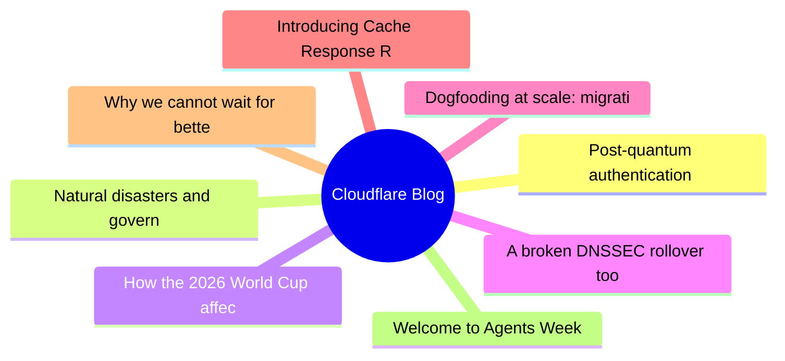
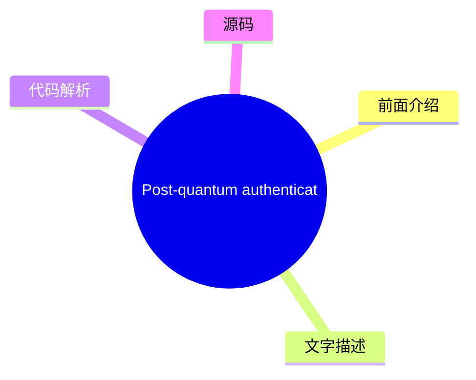
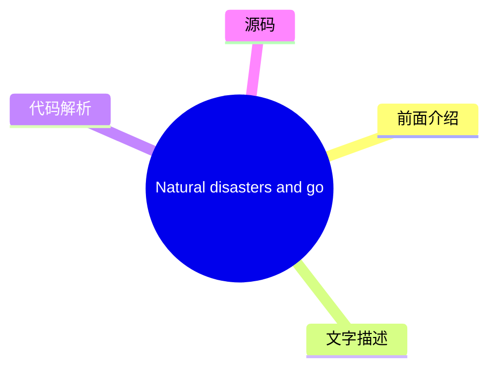
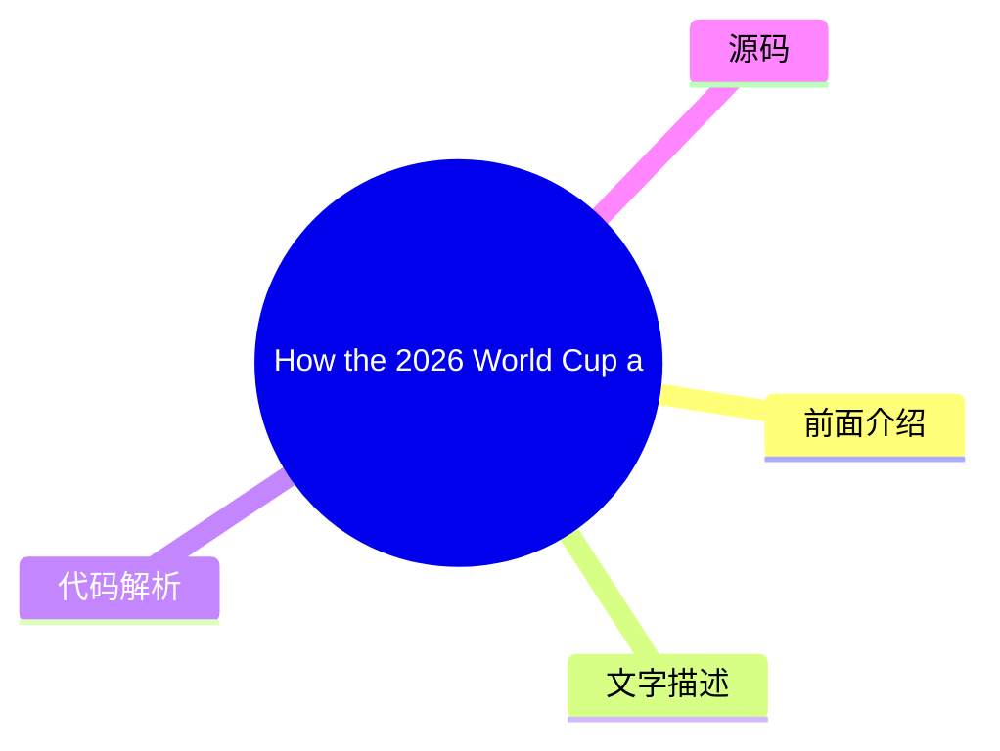
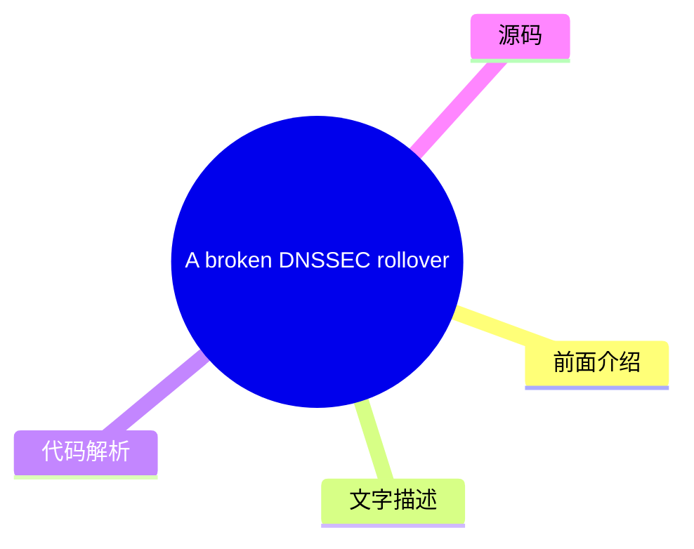
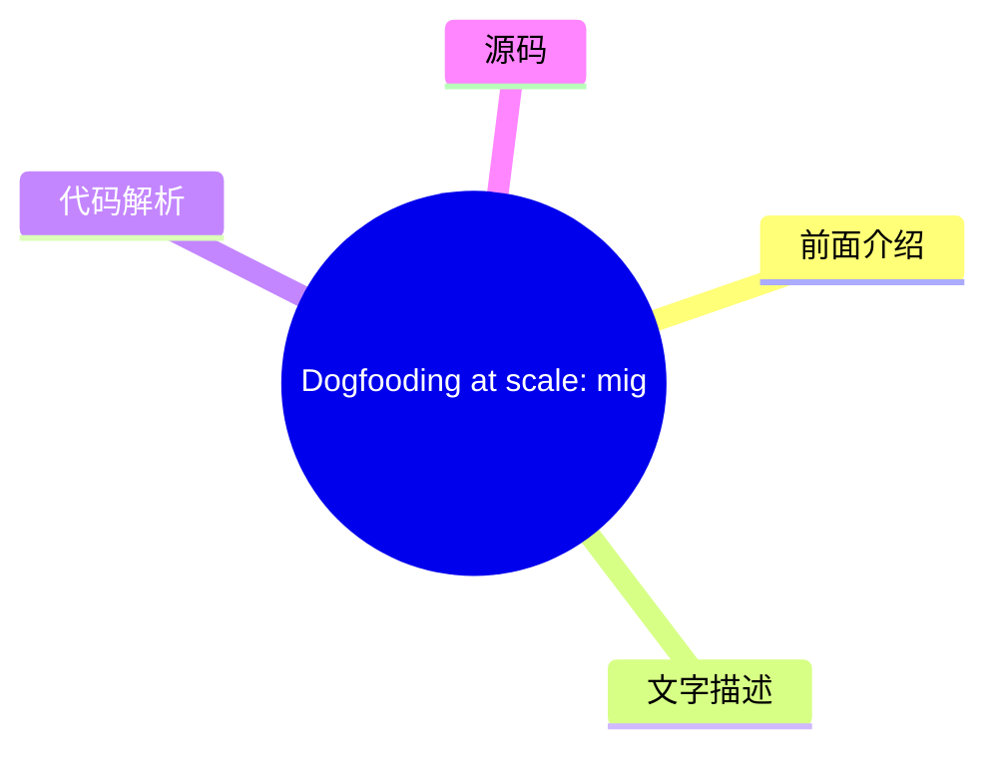
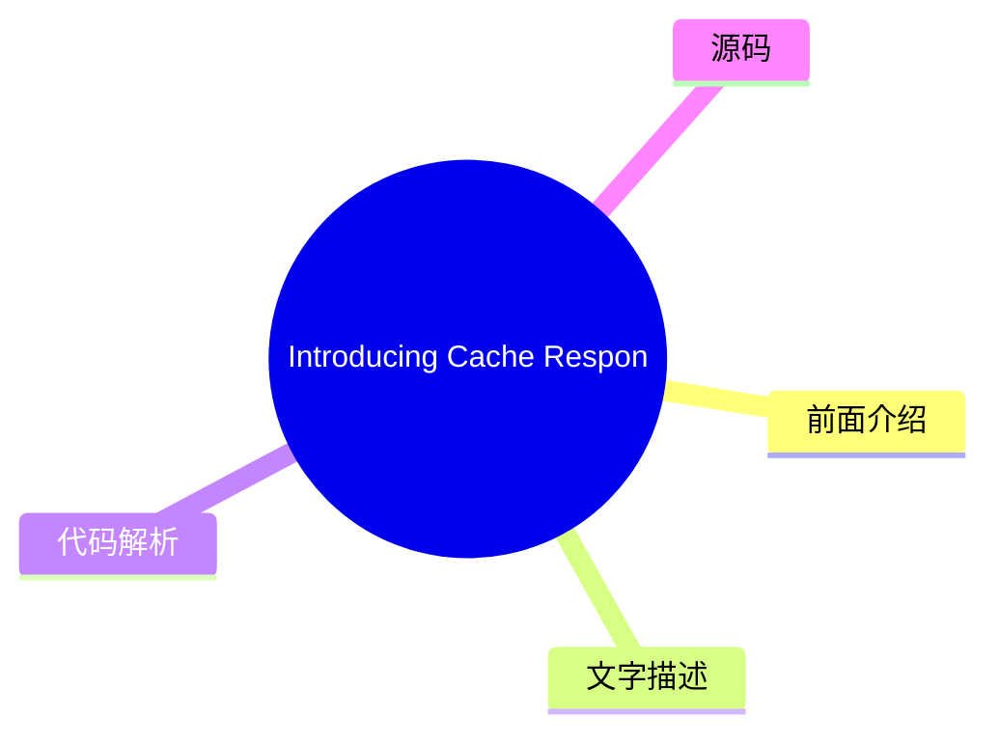
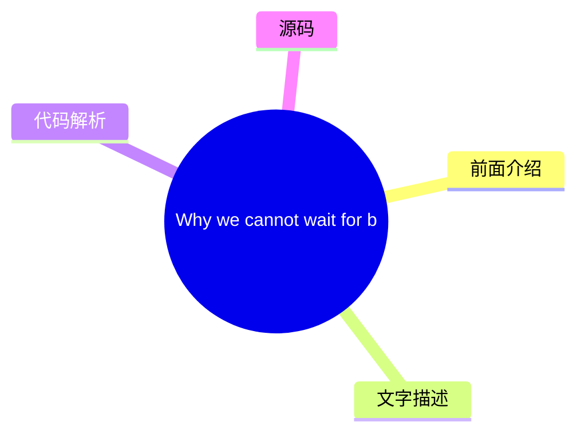

# ☁️ Cloudflare Blog Top 8 (2026-08-04)

## 前面介绍

- 数据源：Cloudflare Blog
- 抓取日期：2026-08-04
- 条目数：8
- 含完整正文：8
- 含代码片段：3
- 组织方式：前面介绍 / 树状图 / 文字描述 / 代码解析 / 源码

## 思维导图



## 详细整理（8 条，8 条含全文，3 条含代码）

### 1. Post-quantum authentication to origins is now supported
- **链接**: [https://blog.cloudflare.com/post-quantum-authentication-to-origins/](https://blog.cloudflare.com/post-quantum-authentication-to-origins/)
- **作者**: Luke Valenta
- **发布**: Wed, 29 Jul 2026 13:00:00 GMT

#### 前面介绍

- Cloudflare now supports post-quantum (PQ) authentication when connecting to customer origin servers via Authenticated Origin Pulls and Custom Origin Trust Store. This is the first step towards providing PQ authentication for all Cloudflare products.
- 作者：Luke Valenta
- 发布时间：Wed, 29 Jul 2026 13:00:00 GMT

#### 树状图



#### 文字描述

- Cloudflare's Authenticated Origin Pulls and Custom Origin Trust Store now support post-quantum authentication. Here weâll explain how you can configure fully post-quantum secure mutually authenticated TLS connections to your origin server, dive into the engineering details of how we built it, make a shameful confession, and finally explain how this work fits into our overall po
- ## Reaching a major milestone Our focus for the past several years has been in deploying post-quantum [ encryption](https://radar.cloudflare.com/post-quantum) to protect against [attacks, where an attacker quietly stockpiles your encrypted data with the hope of decrypting it in the future with a quantum computer.](https://en.wikipedia.org/wiki/Harvest_now,_decrypt_later) __harv
- ## Configuring fully PQ-secure origin connections We have added ML-DSA support (for all [ FIPS 204](https://csrc.nist.gov/pubs/fips/204/final) parameter sets: ML-DSA-44, ML-DSA-65, and ML-DSA-87) to the Custom Origin Trust Store and Authenticated Origin Pulls products. ML-DSA-44 is our recommendation for most applications as it is the most performant option and attains a comfor
- ### Avoiding downgrades Adding post-quantum encryption and authentication support to both the authenticating and verifying parties is necessary but *not* sufficient for full post-quantum security. The pesky issue of downgrades remains. If the verifying party supports any quantum-vulnerable authentication mechanisms, they remain open to attack from an [ on-path attacker](https:/

#### 代码解析

- `text`: 代码片段可作为实现参考，建议结合上下文确认输入输出和边界条件。
- `text`: 代码片段可作为实现参考，建议结合上下文确认输入输出和边界条件。

#### 源码

#### 源码片段 1（text）

```text
# Create a private ML-DSA-44 CA for the origin server
openssl genpkey -algorithm mldsa44 \
  -provparam ml-dsa.output_formats=seed-only \
  -out origin-ca.key
openssl req -new -x509 -key origin-ca.key \
  -out origin-ca.crt -days 10950 \
  -subj "/CN=Origin Server CA"
# Create the origin server certificate (signed by the origin CA)
openssl genpkey -algorithm mldsa44 \
  -provparam ml-dsa.output_formats=seed-only \
  -out origin-server.key
openssl req -new -key origin-server.key \
  -out origin-server.csr \
  -subj "/CN=origin.example.com" \
  -addext basicConstraints=CA:FALSE \
  -addext keyUsage=digitalSignature \
  -addext subjectAltName=DNS:origin.example.com
openssl x509 -req -in origin-server.csr \
  -CA origin-ca.crt -CAkey origin-ca.key -CAcreateserial \
  -out origin-server.crt -days 5475 \
  -copy_extensions copy
```

#### 源码片段 2（text）

```text
# Create a private ML-DSA-44 CA for Authenticated Origin Pulls
openssl genpkey -algorithm mldsa44 \
  -provparam ml-dsa.output_formats=seed-only \
  -out aop-ca.key
openssl req -new -x509 -key aop-ca.key \
  -out aop-ca.crt -days 10950 \
  -subj "/CN=Authenticated Origin Pull CA"
# Create the client certificate Cloudflare will present (signed by the AOP CA)
openssl genpkey -algorithm mldsa44 \
  -provparam ml-dsa.output_formats=seed-only \
  -out aop-client.key
openssl req -new -key aop-client.key \
  -out aop-client.csr \
  -subj "/CN=cloudflare-aop-client" \
  -addext basicConstraints=CA:FALSE \
  -addext keyUsage=digitalSignature \
  -addext subjectAltName=DNS:cloudflare-aop-client
openssl x509 -req -in aop-client.csr \
  -CA aop-ca.crt -CAkey aop-ca.key -CAcreateserial \
  -out aop-client.crt -days 5475 \
  -copy_extensions copy
```

#### 完整正文（中文）

Cloudflare 的 Authenticated Origin Pulls 和 Custom Origin Trust Store 现在支持后量子认证。

在这里，我们将解释如何配置完全后量子安全的相互认证 TLS 连接以连接到您的源服务器，深入探讨我们构建它的工程细节，进行一次令人羞愧的坦白，并最终解释这项工作如何融入我们整体的后量子迁移路线图。

## 达成重大里程碑

过去几年，我们的重点一直是部署后量子 [加密](https://radar.cloudflare.com/post-quantum) 以保护免受 [攻击，即攻击者悄悄囤积您的加密数据，希望在未来利用量子计算机对其进行解密。](https://en.wikipedia.org/wiki/Harvest_now,_decrypt_later)

__harvest-now/decrypt-later__然而，量子计算和密码分析的最新突破将升级到后量子的时间表向前推进了 __across__ [行业](https://blog.google/innovation-and-ai/technology/safety-security/cryptography-migration-timeline/)，并导致我们将注意力转移到部署后量子 [and](https://blog.cloudflare.com/post-quantum-eo-2026/)

__政府__*认证*，以保护免受攻击者的侵害，这些攻击者很快将能够使用量子计算机破解经典凭据并执行冒充攻击。

在之前的帖子中，我们宣布 Cloudflare [ 目标是 2029 年](https://blog.cloudflare.com/post-quantum-roadmap/#cloudflares-roadmap-to-full-post-quantum-security) 实现完全后量子安全，并列出了途中需要达到的几个里程碑。我们已经达到了这些里程碑中的第一个：我们的 [and](https://developers.cloudflare.com/ssl/origin-configuration/authenticated-origin-pull/)

__Authenticated Origin Pulls__[产品](https://developers.cloudflare.com/ssl/origin-configuration/custom-origin-trust-store/)

__Custom Origin Trust Store__[通过 Module-Lattice-Based Digital Signature Algorithm (ML-DSA) 签名来保护 Cloudflare 和客户源服务器之间的连接。Â](https://developers.cloudflare.com/changelog/post/2026-06-17-pqc-mldsa-aop-cots/)

__now support post-quantum (PQ) authentication__## The origin connection is different

When a client visits a website proxied by Cloudflare, there are typically two connections involved. The first connection is from the visitor (e.g., a browser) to Cloudflare. If the request can be served from Cloudflareâs cache or triggers any blocking rules, Cloudflare might respond directly. Otherwise, Cloudflare establishes a second connection to the customerâs origin server to fetch the requested content, so it can respond to the original request.

Protecting sensitive visitor data requires both of these connections to be secure against quantum attacks. We enabled post-quantum encryption support for both the visitor-to-Cloudflare (Connection 1) and Cloudflare-to-origin (Connection 2) connections in [ 2022](https://blog.cloudflare.com/post-quantum-for-all/) and 

[, respectively, and already see](https://blog.cloudflare.com/post-quantum-to-origins/)

__2023__[.](https://radar.cloudflare.com/post-quantum)

__significant usage__We are actively working on completing the picture with post-quantum authentication. For the visitor-to-Cloudflare connection, we are collaborating with [ Google](https://blog.google/security/cultivating-a-robust-and-efficient-quantum-safe-https/) and others at the Internet Engineering Task Force (

[) to develop and](https://datatracker.ietf.org/wg/plants/about/)

__IETF__[with Merkle Tree Certificates](https://blog.cloudflare.com/bootstrap-mtc)

__experiment__[, a design for fast, post-quantum certificates for the web, with initial deployments targeting 2027. The topic of this post, however, is the Cloudflare-to-origin connection, where the requirements for authentication differ from that of the visitor-to-Cloudflare connection in several important ways.](https://datatracker.ietf.org/doc/draft-ietf-plants-merkle-tree-certs/)


__(MTC)__对于此连接，Cloudflare 是客户端。这使我们能够控制采用连接池等技术，将来自我们网络各处的请求汇聚到更少的一组与源服务器的连接上，从而将连接建立的开销分摊到许多请求中。这使得“即插即用”型后量子签名的成本更加可接受，也降低了 MTC 性能优势的必要性。

凭借 Cloudflare 与客户之间预先存在的信任关系（即 Cloudflare 账户），我们无需受限于公共互联网公钥基础设施（PKI）（[ WebPKI](https://cabforum.org/working-groups/server/baseline-requirements/requirements/)）的约束和时间表，而是可以使用针对用例量身定制的自定义 PKI，无需中间证书的开销以及

[可能不适用。像](https://datatracker.ietf.org/doc/html/rfc6962)

__证书透明度__[这样的解决方案也可以通过使用后量子加密（以及正在开发中的后量子认证）进行安全隧道传输，来保护 Cloudflare 到源服务器的连接，而无需升级遗留的源系统。](https://developers.cloudflare.com/tunnel/)

__Cloudflare Tunnel__总而言之，Cloudflare 到源服务器的连接的独特需求，使我们能够在公共互联网的 WebPKI 支持落地之前，通过 ML-DSA 认证部署后量子认证。（对于坚持使用 WebPKI 的客户，请放心：我们将在未来的 Cloudflare 到源服务器的连接中添加 MTC 支持。）

那么如何开启此功能？让我们深入探讨一下配置。

## 配置完全 PQ 安全的源连接

我们在自定义源信任存储和认证源拉取产品中添加了 ML-DSA 支持（针对所有 [ FIPS 204](https://csrc.nist.gov/pubs/fips/204/final) 参数集：ML-DSA-44、ML-DSA-65 和 ML-DSA-87）。ML-DSA-44 是我们针对大多数应用程序的推荐选项，因为它是性能最好的选项，并能达到舒适的 NIST

[安全强度。](https://nvlpubs.nist.gov/nistpubs/FIPS/NIST.FIPS.204.pdf#page=25)

__category 2__### 自定义源信任存储

当 Cloudflare 连接到配置了 [ Full (strict)](https://developers.cloudflare.com/ssl/origin-configuration/ssl-modes/full-strict/) SSL 模式的客户源服务器时，我们会将源证书与默认信任存储进行比对，该存储包含所有

[证书颁发机构 (CAs) 以及 Cloudflareâs](https://ccadb.org)

__commonly trusted__[. The](https://developers.cloudflare.com/ssl/origin-configuration/origin-ca/)

__origin CA__[产品（需要](https://developers.cloudflare.com/ssl/origin-configuration/custom-origin-trust-store/)

__自定义源信任存储 (COTS)__[启用）允许客户用其控制的 CA 集合替换此默认信任存储。COTS 现在允许客户上传 ML-DSA CA，以便 Cloudflare 在连接到源时信任任何链式连接到该 CA 的源服务器证书。](https://developers.cloudflare.com/ssl/edge-certificates/advanced-certificate-manager/)

__高级证书管理器__### 认证源拉取

为了限制对其源服务器的滥用和资源消耗，客户可能只想服务来自 Cloudflareâs 服务器的请求。[ 认证源拉取 (AOP)](https://developers.cloudflare.com/ssl/origin-configuration/authenticated-origin-pull/) 可用于配置 Cloudflare 向源服务器出示客户端证书以建立

[连接，在此连接中，双方之间的通信是双向安全且受信任的。AOP 在所有 Cloudflare 计划级别上均可免费使用。](https://www.cloudflare.com/learning/access-management/what-is-mutual-tls/)

__mutual TLS (mTLS)__AOP 支持三种[配置级别](https://developers.cloudflare.com/ssl/origin-configuration/authenticated-origin-pull/#configuration-levels)：全局、按区域和按主机名。按区域和按主机名的配置级别现在允许客户上传 ML-DSA 证书和私钥（采用 FIPS 204 种子格式），以便 Cloudflare 的 TLS 客户端在连接到源服务器时出示此证书以进行身份验证。（别担心，我们并没有忘记全局配置级别——它只是一个更复杂的变更，将在稍后优先处理。）

### 避免降级

在认证方和验证方双方添加后量子加密和身份验证支持是必要的，但*并不*足以实现完全的后量子安全。降级这个恼人的问题依然存在。如果验证方支持任何易受量子攻击的身份验证机制，他们仍然容易受到能够伪造经典凭据的[路径攻击者](https://www.cloudflare.com/learning/security/threats/on-path-attack/)的攻击。

解决方案：验证方必须移除对易受量子攻击的身份验证机制的信任。（在复杂的 PKI 中，这一点更为微妙。例如，请参阅 Chromium 安全团队的[四阶段计划](https://www.chromium.org/Home/chromium-security/post-quantum-auth-roadmap/)，用于过渡 Web。）请参阅

[以了解有关如何确保您的源服务器免受降级攻击的 AOP 和 COTS 细节。](https://developers.cloudflare.com/ssl/post-quantum-cryptography/pqc-to-origin/#avoid-downgrades)

__配置指南__### 快速开始

下面的演练展示了如何生成 ML-DSA 证书链并通过 Cloudflare API 配置这两个产品。有关仪表板说明和附加上下文，请参阅[开发者文档](https://developers.cloudflare.com/ssl/post-quantum-cryptography/pqc-to-origin/)。

1. 生成证书

您需要 OpenSSL 3.5.0 或更高版本。私钥必须采用 FIPS 204 种子编码生成，这是 Cloudflare 目前接受上传的唯一格式。

**Origin server certificate chain for COTS:**

```
# Create a private ML-DSA-44 CA for the origin server
openssl genpkey -algorithm mldsa44 \
  -provparam ml-dsa.output_formats=seed-only \
  -out origin-ca.key
openssl req -new -x509 -key origin-ca.key \
  -out origin-ca.crt -days 10950 \
  -subj "/CN=Origin Server CA"
# Create the origin server certificate (signed by the origin CA)
openssl genpkey -algorithm mldsa44 \
  -provparam ml-dsa.output_formats=seed-only \
  -out origin-server.key
openssl req -new -key origin-server.key \
  -out origin-server.csr \
  -subj "/CN=origin.example.com" \
  -addext basicConstraints=CA:FALSE \
  -addext keyUsage=digitalSignature \
  -addext subjectAltName=DNS:origin.example.com
openssl x509 -req -in origin-server.csr \
  -CA origin-ca.crt -CAkey origin-ca.key -CAcreateserial \
  -out origin-server.crt -days 5475 \
  -copy_extensions copy
```
**Cloudflare client certificate chain for AOP:**

```
# Create a private ML-DSA-44 CA for Authenticated Origin Pulls
openssl genpkey -algorithm mldsa44 \
  -provparam ml-dsa.output_formats=seed-only \
  -out aop-ca.key
openssl req -new -x509 -key aop-ca.key \
  -out aop-ca.crt -days 10950 \
  -subj "/CN=Authenticated Origin Pull CA"
# Create the client certificate Cloudflare will present (signed by the AOP CA)
openssl genpkey -algorithm mldsa44 \
  -provparam ml-dsa.output_formats=seed-only \
  -out aop-client.key
openssl req -new -key aop-client.key \
  -out aop-client.csr \
  -subj "/CN=cloudflare-aop-client" \
  -addext basicConstraints=CA:FALSE \
  -addext keyUsage=digitalSignature \
  -addext subjectAltName=DNS:cloudflare-aop-client
openssl x509 -req -in aop-client.csr \
  -CA aop-ca.crt -CAkey aop-ca.key -CAcreateserial \
  -out aop-client.crt -days 5475 \
  -copy_extensions copy
```
2. Upload the origin CA to Custom Origin Trust Store

```
CA_CERT=$(jq -Rs . < origin-ca.crt)
curl "https://api.cloudflare.com/client/v4/zones/$Z

...（截断，原文 22558+ 字符）


### 2. Natural disasters and government interference: examining Q2 2026’s major Internet disruption events
- **链接**: [https://blog.cloudflare.com/q2-2026-internet-disruption-summary/](https://blog.cloudflare.com/q2-2026-internet-disruption-summary/)
- **作者**: Lai Yi Ohlsen
- **发布**: Tue, 28 Jul 2026 13:00:00 GMT

#### 前面介绍

- Cloudflare Radar tracked Internet disruptions driven by natural disasters, government-mandated shutdowns, and DNSSEC key rollovers over the last quarter. This post analyzes traffic telemetry to explain how these events impacted global connectivity.
- 作者：Lai Yi Ohlsen
- 发布时间：Tue, 28 Jul 2026 13:00:00 GMT

#### 树状图



#### 文字描述

- Like most infrastructure, the Internet's fragility is easy to overlook â as long as it's working. When it fails, its complexity comes into full view. Cloudflare is in a unique position to detect and document the moments when one of the interrelated systems the Internet depends on breaks down and connectivity suffers as a result. Each quarter, we summarize the disruptions we det
- ### Natural disasters and electricity cause disruptions in Guam, Venezuela, and Tanzania Super Typhoon Sinlaku, the strongest storm of the 2026 Pacific typhoon season so far, tracked through the Mariana Islands in mid-April, passing just north of Guam. Though the island was spared a direct hit, the storm brought tropical-storm-force winds, knocking out power across Guam and dis
- ### Governments and geopolitics impact connectivity in Iran, UAE, Iraq and Sudan Starting on May 26, Radar began seeing signs of Iran's previously [ announced](https://x.com/ir_aref/status/2059261258566877640?s=20) Internet restoration, the tentative end of an 88-day shutdown that had left the country almost entirely offline since it began on February 28. On May 27, Radar [that
- ### Infrastructure vulnerabilities affect users in Germany and Saint Lucia On May 5, a DNSSEC key rollover at DENIC, the registry for Germany's .de domain, [ started producing invalid signatures](https://blog.denic.de/technische-storung-bei-de-domains-behoben/). These key rollovers are the periodic replacement of the cryptographic keys used to sign a zone's DNS records; they a

#### 代码解析

- 本文未检测到明确代码块，内容更偏新闻、观点或方法论。

#### 源码

#### 中文节选

像大多数基础设施一样，互联网的脆弱性很容易被忽视——只要它还在运行。一旦失效，其复杂性便会一览无余。Cloudflare 处于一个独特的位置，能够检测并记录互联网所依赖的相互关联系统之一发生故障、从而导致连通性受损的时刻。每个季度，我们都会总结在 [Cloudflare Radar](https://radar.cloudflare.com/) 上检测并标注的中断情况。

2026 年第二季度，超级台风 Sinlaku 在关岛以北经过，造成了最长的中断；而苏丹在考试期间实施的政府强制断网则是最频繁的。伊朗恢复了全国互联网接入，在无人机袭击造成的破坏继续扰乱该地区其他地方的 AWS 基础设施的同时，将其公民重新连接到全球网络。最后，圣卢西亚的海底光缆断裂以及德国故障 DNSSEC 签名的分发，凸显了互联网基础设施的脆弱性，但也展示了这些区域和全球系统在正常运行时维持的惊人稳定性。

在这里，我们将回顾我们在 2026 年第二季度观察到的最重大的互联网中断情况，利用 Cloudflare Radar 的流量数据展示每个中断的演变过程及其对地面用户的影响。一如既往，这只是一个值得注意的、已确认的中断的摘要，而非详尽列表；有关检测到的流量异常的更完整视图，请参阅 [Cloudflare Radar Outage Center](https://radar.cloudflare.com/outage-center?dateStart=2026-04-01&dateEnd=2026-06-30)。

### 自然灾害和电力故障导致关岛、委内瑞拉和坦桑尼亚中断

超级台风 Sinlaku 是 2026 年太平洋台风季迄今为止最强的风暴，于 4 月中旬穿过马里亚纳群岛，从关岛以北经过。虽然该岛免受直接袭击，但风暴带来了热带风暴级别的风力，导致关岛全境停电，并扰乱了供水系统，这直接影响了互联网连通性。4 月 13 日至 14 日，该地区的流量下降了 80%，远低于预期水平。

两个月后，6月24日，委内瑞拉北部在约一分钟内接连发生了两次大地震，震中位于尤马雷和圣菲利佩，随后在加拉加斯海岸外发生了一次余震。第一次7.5级地震发生在大约UTC 22:04（当地时间18:04）。这些事件的直接影响可以在雷达中看到，显示在地震发生的同时，HTTP传输字节数急剧下降。这种下降在Fibex Telecom中看得尤为明显，根据[APNIC数据](https://stats.labs.apnic.net/aspop/)，该公司估计拥有160万用户。该下降趋势在 __CANTV__[, 国有主导运营商，以及](https://radar.cloudflare.com/traffic/as8048?dateStart=2026-06-24&dateEnd=2026-06-25#traffic-trends)

__CANTV__[, 稍小一些的区域ISP。Â](https://radar.cloudflare.com/tr

#### 完整正文（中文）

像大多数基础设施一样，互联网的脆弱性很容易被忽视——只要它还在运行。一旦失效，其复杂性便会一览无余。Cloudflare 处于一个独特的位置，能够检测并记录互联网所依赖的相互关联系统之一发生故障、从而导致连通性受损的时刻。每个季度，我们都会总结在 [Cloudflare Radar](https://radar.cloudflare.com/) 上检测并标注的中断情况。

2026 年第二季度，超级台风 Sinlaku 在关岛以北经过，造成了最长的中断；而苏丹在考试期间实施的政府强制断网则是最频繁的。伊朗恢复了全国互联网接入，在无人机袭击造成的破坏继续扰乱该地区其他地方的 AWS 基础设施的同时，将其公民重新连接到全球网络。最后，圣卢西亚的海底光缆断裂以及德国故障 DNSSEC 签名的分发，凸显了互联网基础设施的脆弱性，但也展示了这些区域和全球系统在正常运行时维持的惊人稳定性。

在这里，我们将回顾我们在 2026 年第二季度观察到的最重大的互联网中断情况，利用 Cloudflare Radar 的流量数据展示每个中断的演变过程及其对地面用户的影响。一如既往，这只是一个值得注意的、已确认的中断的摘要，而非详尽列表；有关检测到的流量异常的更完整视图，请参阅 [Cloudflare Radar Outage Center](https://radar.cloudflare.com/outage-center?dateStart=2026-04-01&dateEnd=2026-06-30)。

### 自然灾害和电力故障导致关岛、委内瑞拉和坦桑尼亚中断

超级台风 Sinlaku 是 2026 年太平洋台风季迄今为止最强的风暴，于 4 月中旬穿过马里亚纳群岛，从关岛以北经过。虽然该岛免受直接袭击，但风暴带来了热带风暴级别的风力，导致关岛全境停电，并扰乱了供水系统，这直接影响了互联网连通性。4 月 13 日至 14 日，该地区的流量下降了 80%，远低于预期水平。

两个月后，6月24日，委内瑞拉北部在约一分钟内接连发生了两次大地震，震中位于尤马雷和圣菲利佩，随后在加拉加斯海岸外发生了一次余震。第一次7.5级地震发生在大约UTC 22:04（当地时间18:04）。这些事件的直接影响可以在Radar中看到，它显示在地震发生的同时，HTTP传输的字节数急剧下降。这种下降在Fibex Telecom中看得特别清楚，根据[APNIC数据](https://stats.labs.apnic.net/aspop/)，该公司估计拥有160万用户。[, 国有基础运营商，和](https://radar.cloudflare.com/traffic/as8048?dateStart=2026-06-24&dateEnd=2026-06-25#traffic-trends)

__CANTV__[, 稍小一点的区域性ISP。Â](https://radar.cloudflare.com/traffic/as263703?dateStart=2026-06-24&dateEnd=2026-06-25)

__VNET__几天后，在大西洋彼岸，6月27日坦桑尼亚的停电导致当地HTTP流量急剧下降，持续时间至少为五个小时。虽然其成因与该国2025年10月选举相关的停电（这是蓄意的政府行为而非基础设施故障）截然不同，但由此产生的遥测数据和用户影响几乎完全相同：连接性严重丧失，导致居民无法与亲人联系或获取关键新闻。Â

令人惊讶的是，如此根本不同的事件在数据和用户体验中留下了如此相似的痕迹。综合来看，这些与天气相关和由电力驱动的中断表明，物理世界对数字世界有着巨大的影响，以及互联网韧性的重要性，以及构建具有足够冗余的电力、路由和物理路径的网络以承受不可避免冲击的重要性。

### 政府和地缘政治影响伊朗、阿联酋、伊拉克和苏丹的连接性

自5月26日起，Radar 开始注意到伊朗此前 [宣布](https://x.com/ir_aref/status/2059261258566877640?s=20) 的互联网恢复迹象，这标志着一次为期88天的断网即将结束，自2月28日开始以来，该国几乎完全处于离线状态。5月27日，Radar

[报告称流量已恢复到断网前水平的40%，这与报道中称访问是逐步恢复而非一次性全面恢复的情况一致。自那以后，我们观察到 HTTP 字节量一度攀升至90%，随后回落至断网前水平的约59%。这一流量水平与我们在2月观察到的流量一致，即在这次最近的断网与1月的一次断网之间的窗口期，表明连接已恢复到最近一次断网前的基线水平，而非完全正常化。在我们的](https://blog.cloudflare.com/iran-internet-partially-restored-may-2026/)

__报告__中，伊朗作为一个独特的异常值脱颖而出：虽然大多数参与国家的流量随着比赛日程的安排而涨跌，但伊朗的读数则主要由其恢复后的水平与此前几乎完全失去连接之间的对比所主导。](https://blog.cloudflare.com/2026-world-cup-internet-traffic/#streaming-makes-some-countries-appear-more-online)

__2026年世界杯分析__与此同时，到位于阿联酋的 AWS 云区域 me-central-1 的 HTTP 流量一直 [保持低位](https://radar.cloudflare.com/cloud-observatory/amazon/me-central-1?dateRange=24w#http-traffic)，与

[4月30日，该地区“因中东冲突而遭受损害，目前无法可靠地支持客户应用程序。”此次更新紧随3月3日的报告，该报告称阿联酋和巴林的设施“因无人机袭击而遭受了物理基础设施影响。”在阿联酋，两个设施“直接遭到袭击”，在巴林，一次靠近设施的无人机袭击对其基础设施造成了“物理影响”。流量的减少是底层数据中心基础设施物理受损的下游特征，而非网络故障，并且它继续影响托管在该地区的网站和应用程序，无论其自身的可用性如何。](https://health.aws.amazon.com/health/status#multipleservices-me-central-1_1777533954)

__AWS 服务报告__2026年第二季度还包括伊拉克的三次政府强制停机（[6月2日](https://radar.cloudflare.com/traffic/iq?dateStart=2026-06-01&dateEnd=2026-06-02)，[6月10日和11日](https://radar.cloudflare.com/traffic/iq?dateStart=2026-06-10&dateEnd=2026-06-11)），以及[6月28日](https://radar.cloudflare.com/traffic/iq?dateStart=2026-06-27&dateEnd=2026-06-28)在苏丹的10次中断。所有这些中断都发生在4月13日至23日之间，都是为了防止国家考试作弊——这是我们记录到的这两个国家多个季度中出现的季节性模式。苏丹的中断遵循一致的节奏，每次持续时间约为3.5小时，从UTC 11:45到15:15（当地时间13:45到17:15），与考试时间同步。在伊拉克，中断时间较短，每次约90分钟，同样安排在考试进行的时间段内。](https://radar.cloudflare.com/traffic/sd?dateStart=2026-04-13&dateEnd=2026-04-23#traffic-trends)

__苏丹10次中断__这些例子，无论是恢复还是中断，都说明了政府对国家连接性施加的显著控制，以及出于政策而非基础设施原因，访问可以轻松被关闭、限速或选择性重新引入。

### 基础设施漏洞影响德国和圣卢西亚的用户

5月5日，德国 .de 域名注册商 DENIC 的 DNSSEC 密钥轮换 [开始产生无效签名](https://blog.denic.de/technische-storung-bei-de-domains-behoben/)。这些密钥轮换是用于对区域 DNS 记录进行签名的加密密钥的定期更换；这是一项例行但至关重要的维护工作，因为验证 DNSSEC 的解析器只会信任签名与当前发布密钥匹配的答案。换句话说，如果数字签名与预期值不匹配，解析器会假定该网站已被篡改并切断访问。当开始产生无效签名时，全球的验证解析器拒绝了所有对 .de 网站的请求，并返回 SERVFAIL 错误，直到 23:15 UTC（5月6日当地时间 01:15）恢复正常运行。

Cloudflare Radar 观察到，在 outage 期间，全球 .de 查询量有所上升。虽然起初可能有些反直觉，这是因为失败的答案实际上无法被缓存，所以原本从缓存中静默服务的查询现在必须重新解析并反复重试，导致查询量急剧增加。

从用户的角度来看，这次事件并非被体验为 DNS 或加密故障，而仅仅是 .de 网站和服务突然变得无法访问。尽管用户仍能访问不使用 .de 顶级域名的网站，但体验包括页面加载失败、邮件被退回以及应用程序超时，所有这些都可能反映出 outage 的体验。您可以在我们的 [博客](https://blog.cloudflare.com/de-tld-outage-dnssec/) 上阅读更多关于 DNSSEC 及事件影响的内容。

在加勒比地区，基础设施故障导致可用性出现类似下降。6月21日左右，Karib Cable 网络的 HTTP 请求流量降至接近零，并在一天的大部分时间里保持平稳，直到 6月22日 17:00 UTC（当地时间 13:00）恢复到预期水平。此次中断据称是由岛附近的光缆切断引起的，这是依赖少数陆地和海底路径连接更广泛互联网的加勒比网络所面临的一个熟悉的风险，这意味着一次断裂可能会切断不成比例的容量。由于 Karib Cable 是最大的提供商之一，这种损失在国家层面也显而易见，圣卢西亚的整体流量在切断期间

[下降了约 60%，与上周相比](https://radar.cloudflare.com/explorer?dataSet=netflows&loc=LC&dt=2026-06-21_2026-06-27&timeCompare=1#result)

__### Radar 继续监控中断情况__

2026年第二季度，互联网中断源于各种原因，包括恶劣天气、地震、停电、政府下令的关闭、云基础设施受损、光缆切断以及 DNSSEC 配置错误。这些事件表明，互联网依赖于一个复杂的相互关联系统，其中任何一个系统的故障都可能导致连接丢失。

Cloudflare Radar 团队持续监控互联网中断情况，通过 [Cloudflare Radar 中断中心](https://radar.cloudflare.com/outage-center)、社交媒体以及在 [blog.cloudflare.com](http://blog.cloudflare.com) 的文章分享我们的观察。请在社交媒体上关注我们：[@CloudflareRadar](https://twitter.com/CloudflareRadar) (X)、[noc.social/@cloudflareradar](https://noc.social/@cloudflareradar) (Mastodon) 和 [radar.cloudflare.com](http://radar.cloudflare.com) (Bluesky)。


### 3. How the 2026 World Cup affected Internet traffic
- **链接**: [https://blog.cloudflare.com/2026-world-cup-internet-traffic/](https://blog.cloudflare.com/2026-world-cup-internet-traffic/)
- **作者**: Sabina Zejnilovic
- **发布**: Tue, 21 Jul 2026 12:59:40 GMT

#### 前面介绍

- We analyzed global HTTP traffic to explore how kickoff times, streaming habits, and hydration breaks reshaped online activity worldwide. From late-night traffic surges to halftime browsing spikes, here is how the world connected during the global tou
- 作者：Sabina Zejnilovic
- 发布时间：Tue, 21 Jul 2026 12:59:40 GMT

#### 树状图



#### 文字描述

- For 96 years, the World Cup has been a global phenomenon, uniting nations and communities through a shared love of sportsmanship. While its popularity is nothing new, what is novel today is how rare a truly collective global experience has become. In an era defined by microtrends and algorithmic bubbles, it is increasingly uncommon for people across most countries to engage in 
- ## How did the World Cup change our behavior online? To understand how traffic changes throughout a match, we had to establish what it is ânormally.â One way to do this is by looking at raw request volumes, or the amount of traffic we see on our network per country. But these amounts vary per country (the amount of daily traffic in the United States is always a larger number t
- ## Whether youâre staying up late or waking up early, kickoff time impacts traffic One factor shaping how traffic changes is simply what time the match kicks off locally. The largest changes in activity happen when a match is played in the overnight and early-morning hours â roughly midnight to 8am local time. These are the hours when very few people are normally online, so **f
- ## Which matches moved the Internet most? One of the most compelling aspects of the World Cup is seeing which storylines and teams capture the attention of fans across the world. Weâve discussed how regional traffic patterns change as a result of matches. But who are they watching? Which matches made the most impact on Internet traffic? Here's how we calculated this: for each

#### 代码解析

- 本文未检测到明确代码块，内容更偏新闻、观点或方法论。

#### 源码

#### 中文节选

在过去的 96 年里，世界杯一直是一个全球现象，通过共同的体育精神将各国和社区凝聚在一起。虽然它的流行程度并不新鲜，但今天新颖的是，真正集体性的全球体验变得多么罕见。在一个由微趋势和算法泡沫定义的时代，大多数国家的人们参与同一事件的情况变得越来越不常见。

这正是世界杯的凝聚力所在。来自世界各地的球迷围绕这些一生一次的比赛和故事线重塑了他们的日常作息——而且由于 Cloudflare 运营着一个拥有 330 多个全球节点的网络，我们处于一个独特的位置，可以确切地看到这种全球仪式如何重塑了 2026 年 6 月和 7 月期间全球的在线活动。

Cloudflare Radar 跟踪 HTTP 流量、DNS、安全等，以突出全球互联网趋势。在这篇博文中，我们将利用这些数据来探索世界杯如何影响整个赛事期间的全球流量模式。

## 世界杯如何改变了我们的在线行为？

为了了解比赛期间流量如何变化，我们必须先确立什么是“正常”的。一种方法是查看原始请求数量，即我们在每个国家网络上看到的流量量。但这些数量因国家而异（美国的每日流量量总是比葡萄牙的流量大），这使得建立全球适用的基准变得困难。相反，我们使用前四周的中位流量来定义“正常”：这是一个为期一个月的窗口，提供了稳定的每分钟参考值，并平滑了日常的波动。

我们还想知道流量是相对于该基准上升还是下降，但单纯的差异无法让我们将高流量国家与低流量国家进行比较。相反，我们使用了当前流量与基准流量的比率，表示为对数值：对数使增加和减少围绕零对称（+1 = 两倍正常，-1 = 一半）。换句话说，**零分意味着流量完全正常，正数表示激增，负数表示下降。**

## 无论你是熬夜还是早起，开球时间都会影响交通

影响交通变化的一个因素仅仅是比赛在当地的开球时间。活动量最大的变化发生在比赛在深夜和清晨时段进行时——大约是午夜到上午8点当地时间。这些是通常很少有人在线的时段，因此**熬夜（或早起）观看比赛的球迷会将流量推高到其正常水平以上，在某些情况下甚至翻倍**。如图所示，这是工作日和周末偏差峰值出现的地方。

相比之下，在正常白天和工作时间进行的比赛——大约上午9点到下午晚些时候——并没有显示出如此大的影响：流量保持在接近其正常水平的水平，可能是因为观看比赛的人本来就已经在线了

#### 完整正文（中文）

在过去的 96 年里，世界杯一直是一个全球现象，通过共同的体育精神将各国和社区凝聚在一起。虽然它的流行程度并不新鲜，但今天新颖的是，真正集体性的全球体验变得多么罕见。在一个由微趋势和算法泡沫定义的时代，大多数国家的人们参与同一事件的情况变得越来越不常见。

这正是世界杯的凝聚力所在。来自世界各地的球迷围绕这些一生一次的比赛和故事线重塑了他们的日常作息——而且由于 Cloudflare 运营着一个拥有 330 多个全球节点的网络，我们处于一个独特的位置，可以确切地看到这种全球仪式如何重塑了 2026 年 6 月和 7 月期间全球的在线活动。

Cloudflare Radar 跟踪 HTTP 流量、DNS、安全等，以突出全球互联网趋势。在这篇博文中，我们将利用这些数据来探索世界杯如何影响整个赛事期间的全球流量模式。

## 世界杯如何改变了我们的在线行为？

为了了解比赛期间流量如何变化，我们必须先确立什么是“正常”的。一种方法是查看原始请求数量，即我们在每个国家网络上看到的流量量。但这些数量因国家而异（美国的每日流量量总是比葡萄牙的流量大），这使得建立全球适用的基准变得困难。相反，我们使用前四周的中位流量来定义“正常”：这是一个为期一个月的窗口，提供了稳定的每分钟参考值，并平滑了日常的波动。

我们还想知道流量是相对于该基准上升还是下降，但单纯的差异无法让我们将高流量国家与低流量国家进行比较。相反，我们使用了当前流量与基准流量的比率，表示为对数值：对数使增加和减少围绕零对称（+1 = 两倍正常，-1 = 一半）。换句话说，**零分意味着流量完全正常，正数表示激增，负数表示下降。**

## 无论你是熬夜还是早起，开球时间都会影响交通

影响交通变化的一个因素仅仅是比赛在当地的开球时间。活动量最大的变化发生在比赛在深夜和清晨时段进行时——大约是午夜到早上 8 点当地时间。这些是通常很少有人在线的时段，因此**熬夜（或早起）观看比赛的球迷将流量推高到了远超正常水平的程度，在某些情况下甚至翻了一番**。如图所示，这是工作日和周末偏差峰值出现的地方。

相比之下，在正常白天和工作时间（大约上午 9 点到下午晚些时候）进行的比赛并没有显示出如此大的影响：流量保持在接近正常水平的水平，可能是因为观看比赛的人本来就已经在线了。在傍晚时分，有一个较小的第二波增长，在工作日最为明显，因为比赛让人们在流量通常开始下降的时候保持连接。周末的形状相似，有强劲的清晨上升，但傍晚的波动较平缓。

当比较同一国家内在不同时段进行的比赛时，开球时间的影响最容易看出来。波黑就是一个清晰的例子。如图所示，当波黑在当地时间凌晨 2 点比赛时，人们保持清醒观看，比赛期间的流量跳升到远超正常水平，有时甚至翻了一番。当波黑在晚上比赛时，情况则相反：流量低于正常水平（降至典型值的约 70%），因为人们放下了设备，专注于比赛本身。

当巴西在 32 强赛中对阵日本时（巴西于 2026 年 6 月 29 日以 2-1 获胜），两国相隔 12 小时观看了同一场比赛：休斯顿的开球时间（GMT-5）正值里约热内卢（GMT-3）的正常清醒时段，而在东京（GMT+9）则正值深夜。

结果是两条几乎平行的曲线，持续了 90 分钟：一条高于正常水平，一条低于正常水平。日本的流量（红色）明显高于正常水平，大约 +1，大约是其通常水平的两倍，因为比赛在凌晨播出，当时几乎没人会在线。相比之下，巴西的流量（绿色）则*低于*正常水平，大约 -0.4，因为比赛发生在普通活跃日的中间。在这种情况下，**观看比赛把人们*从*他们平时的浏览中*拉走*了，而不是增加了浏览量。**

## 哪些比赛让互联网流量变化最大？

世界杯最引人入胜的方面之一，就是看哪些故事线和球队吸引了全球球迷的注意力。我们已经讨论过比赛如何导致区域流量模式的变化。但他们在看什么？哪些比赛对互联网流量产生了最大的影响？

我们计算方法如下：对于每场比赛，我们取开球后的两小时窗口，对于每一个拥有足够基线流量以提供稳定测量数据的国家（排除了流量小、噪音大的市场），计算流量偏离正常值的程度。然后，我们取每个国家偏离值的绝对值，因此我们测量的是流量*变化了多少*，而不是变化的方向（激增和下降都算作影响），对于每场比赛，我们取所有国家这些绝对偏离值的中位数。由于几场小组赛同时进行，无法将某个国家的流量波动归因于某一场比赛，因此我们剔除了这些同时进行的比赛，以避免歧义。

结果是这份让互联网流量变化最大的比赛排名。而且有一个惊喜：**榜首并非决赛或半决赛。那是 7 月 11 日的阿根廷对阵瑞士，一场阿根廷以 3-1 获胜的四分之一决赛——其让互联网流量变化了约 1.26 倍。** **这使其领先于法国对阵西班牙的半决赛，该场比赛的系数为 1.21。** **其余顶级比赛则是四分之一决赛、十六强赛甚至三十二强赛的混合。**

### 让互联网流量变化的球队：阿根廷，其次是法国、西班牙和挪威

To decide which team the world watched most, we looked at each team's matches and aggregated the median worldwide impact across all countries. In other words, when a given team took the field, how much did the typical country's traffic move away from normal? Not surprisingly, **Argentina topped the list at 1.17x, meaning that when Argentina played, the typical country's traffic swung about 17% away from its normal level, the strongest global pull of any team. **This comes as no surprise, since they were the defending champions and each knockout game could have been Lionel Messi's last dance for his national team. Love them or hate them, people were watching them.

Not far behind were nations packed with superstars such as France, Brazil, Portugal, Morocco, Spain â and Norway, fueled by the Erling Haaland phenomenon. Haiti and Iraq appear in the top as outliers due to their high deviation scores relative to their typical traffic, suggesting matches against major teams drove disproportionate engagement.

## Sharp increase in traffic to sports betting sitesÂ

Compared to HTTP request data in the month preceding the World Cup, there was an overall increase in requests to gambling industry websites since the opening game. Additionally, whereas pre-tournament traffic followed a clear weekly pattern, after the Cupâs opening game, the trend flattened into a more constant profile, likely a consequence of the high, near-daily regularity of matches.

## Divergent Behavior: Why Traffic Patterns Varied by Country.Â

Because Cloudflare is present in 120+ countries and handles traffic from Internet users worldwide, we can see distinct behavioral patterns across the globe. For example, when examining the deviation trends during the Algeria vs. Austria group stage game on June 28, we noticed something peculiar: Austriaâs traffic (in red) *increased* during halftime, while Algeria's (in green) decreased. The former follows the pattern described above of people spending more time online while not watching the game, while Algeriaâs is the complete opposite â and theyâre not the only ones. 


*阿尔及利亚（绿色，代码为 DZ）在比赛期间的互联网流量激增幅度远高于奥地利（红色）。*

### 按行为分组的国家

为了了解各国行为模式的差异，我们将每个国家的比赛日行为按其流量曲线的形状进行了分组，并让这些模式自动聚类。

通过这种方式对比赛日流量形状进行分组，出现了三种截然不同的模式。最大的群体（44个国家，共101场比赛）显示，互联网使用量在补水休息和半场休息期间上升，这是比赛的自然暂停时刻，人们会拿起手机。第二组规模较小（8个国家，共18场比赛）则是其近乎镜像的对应：流量在完全相同的时刻下降，在休息期间出现回落而不是攀升。第三组是一个明显的异常值，完全由伊朗的三场比赛组成。原因很简单：5月的基线是在伊朗在断网后重新上线时测量的，因此其比赛日流量远高于那个低迷的参考值，产生的偏差与其他国家截然不同。您可以在我们的[博客](https://blog.cloudflare.com/tag/internet-shutdown/)上阅读更多关于伊朗在2026年期间互联网中断和部分恢复的信息。Â

### 流媒体使某些国家看起来更“在线”

为了更好地理解包含阿尔及利亚、突尼斯、约旦、埃及和刚果民主共和国的第二组聚类，我们更仔细地查看了这些国家的流量构成。我们按多用途互联网邮件扩展类型（MIME 类型）细分了流量模式，并将其归类为不同类别，以便轻松区分内容类型簇。MIME 类型就像数字标签，告诉浏览器它们正在接收的文件类型，无论是 HTML 页面、JPEG 图像还是 MP4 视频流。通过追踪这些标签，我们可以推断用户正在消费的内容类型。Â

我们的假设是，这种行为可以通过这些国家通过流媒体观看比赛的人数不成比例来解释。为了验证这一点，我们比较了两个集群球队比赛的流量模式分布。在下面的示例中，我们分别看到了阿尔及利亚和奥地利在两国比赛中的流量分布。

*在阿尔及利亚，流量远高于正常水平，然后在半场休息时下降。请注意橙色部分流媒体流量的显著增加。*

*在奥地利，由于使用流媒体服务的较少，互联网流量在半场休息时增加。*

在上面的阿尔及利亚图表中，我们可以看到比赛窗口期间的大部分增长确实是由对多媒体和流媒体服务的请求驱动的。这支持了我们的假设，即流量趋势线与观看比赛的流媒体使用情况相关。

在阿尔及利亚，流量在开球时急剧上升，在半场休息时下降，一旦下半场开始，又恢复到高水平。相比之下，补水休息几乎没有或根本没有可见的影响，这表明观众不会在短时间的比赛中暂停期间有意义地改变他们的互联网或社交行为，但在较长的半场休息期间会这样做。该集群中的其他国家也显示出类似的行为。这可能是因为观众不太可能为了三分钟的冷却休息而关闭流媒体，但十五分钟的半场休息足够长，可以关闭流媒体并走开。

### 半场休息时人们做什么？

少数国家，包括突尼斯和阿尔及利亚，在半场休息期间断开连接，流量降至比赛进行时的水平以下（蓝色框，位于 1.0 线下方）。大多数 c

...（截断，原文 14902+ 字符）


### 4. A broken DNSSEC rollover took down .al. Now 1.1.1.1 tells you when validation is bypassed
- **链接**: [https://blog.cloudflare.com/dnssec-nta-ede-33/](https://blog.cloudflare.com/dnssec-nta-ede-33/)
- **作者**: Sebastiaan Neuteboom
- **发布**: Tue, 14 Jul 2026 13:00:00 GMT

#### 前面介绍

- When a failed DNSSEC key rollover took down the .al TLD, we deployed a Negative Trust Anchor to restore resolution. This time, though, clients didn't have to take our word for it: 1.1.1.1 returned EDE 33, a new DNS error code that signals directly in
- 作者：Sebastiaan Neuteboom
- 发布时间：Tue, 14 Jul 2026 13:00:00 GMT

#### 树状图



#### 文字描述

- On July 3, 2026, the Albanian communications authority (AKEP), the operator of the `.al` country-code top-level domain (TLD) of Albania, attempted a DNSSEC key rollover. Something went wrong, resulting in DNSSEC validation failures. Any validating DNS resolver receiving these signatures was required by the DNSSEC specification to reject them and return errors to clients. That i
- ### What happened to `.al` We discussed how DNSSEC works in more detail in [ our prior blog post](https://blog.cloudflare.com/de-tld-outage-dnssec/#how-dnssec-works). A brief recap: DNSSEC builds a chain of trust from the root zone down to individual domain names. The root zone holds a Delegation Signer (DS) record for each signed TLD, a fingerprint of that TLD's DNSKEY. A reso
- ### Why Negative Trust Anchors are used Having a broken DNSSEC configuration can be painful, especially when it impacts an entire TLD at once. As we covered in our `.de` [incident blog](https://blog.cloudflare.com/de-tld-outage-dnssec/#negative-trust-anchors), recursive DNS operators can install a Negative Trust Anchor (NTA) as defined in [ RFC 7646](https://datatracker.ietf.or
- ### The problem with Negative Trust Anchors Installing a Negative Trust Anchor is an aggressive measure. We suspend DNSSEC validation to keep domains reachable, accepting that responses are no longer cryptographically verified for the duration. Users get answers instead of SERVFAIL, but those answers carry no DNSSEC guarantee. What makes this harder is that, up until now, nothi

#### 代码解析

- `text`: 代码片段可作为实现参考，建议结合上下文确认输入输出和边界条件。

#### 源码

#### 源码片段 1（text）

```text
$ kdig @1.1.1.1 google.al
;; ->>HEADER<<- opcode: QUERY; status: NOERROR; id: 32848
;; Flags: qr rd ra; QUERY: 1; ANSWER: 1; AUTHORITY: 0; ADDITIONAL: 1
;; EDNS PSEUDOSECTION:
;; Version: 0; flags: ; UDP size: 1232 B; ext-rcode: NOERROR
;; EDE: 9 (DNSKEY Missing): 'no SEP matching the DS found for al.'
;; EDE: 33 (Negative Trust Anchor): 'a Negative Trust Anchor has been applied for this query (see RFC 7646)'
;; ANSWER SECTION:
google.al.              300    IN    A    142.251.142.196
```

#### 完整正文（中文）

2026年7月3日，阿尔巴尼亚通信管理局（AKEP）——阿尔巴尼亚 `.al` 国家代码顶级域名（TLD）的运营方——尝试进行 DNSSEC 密钥轮换。操作出现故障，导致 DNSSEC 验证失败。任何接收这些签名的验证 DNS 解析器都必须根据 DNSSEC 规范拒绝它们并向客户端返回错误。这包括 [ 1.1.1.1](https://www.cloudflare.com/learning/dns/what-is-1.1.1.1/)，即 Cloudflare 运营的公共 DNS 解析器。

`.al` TLD 是阿尔巴尼亚政府服务、银行和媒体的在线家园；它在 Cloudflare Radar 的 TLD 排名中排名第 [ #191](https://radar.cloudflare.com/tlds/al?dateRange=7d)。任何试图访问这些网站并使用验证解析器的人，在此次事件期间都发现它们无法访问。此次故障有可能影响每一个 `.al` 域名，无论其托管在哪里或由哪个权威名称服务器提供服务。就在两个月前，类似的故障袭击了德国的 `.de` TLD。正如我们在 [ 关于此次事件的博客文章](https://blog.cloudflare.com/de-tld-outage-dnssec/) 中所描述的，我们的应对措施是安装 `.de` 的负信任锚（NTA），暂时暂停 1.1.1.1 上的 DNSSEC 验证，以便在注册局解决问题时保持域名的可访问性。我们对 `.al` 采取了同样的措施。

NTA 恢复了解析，但却是静默进行的。收到由 NTA 提供的响应的客户端无法仅凭响应本身判断 DNSSEC 验证已被绕过，从而无法区分合法答案和伪造答案。对于 `.al` 事件，1.1.1.1 首次填补了这一空白，在所有受影响的响应中返回一个新的扩展 DNS 错误（EDE）代码，以表明由于存在 NTA，该答案未经过 DNSSEC 验证。

下图显示了 1.1.1.1 上 `.al` 查询在 7 月 3 日全天的 SERVFAIL 和 NOERROR 率。随着缓存记录过期，解析器被迫重新验证，SERVFAIL 率随之上升。当在 17:15 UTC 应用 NTA 时，解析恢复，该比率急剧下降。

### `.al` 发生了什么

我们在[之前的博客文章](https://blog.cloudflare.com/de-tld-outage-dnssec/#how-dnssec-works)中更详细地讨论了 DNSSEC 的工作原理。简要回顾一下：

DNSSEC 从根区域向下构建信任链，一直到单个域名。根区域为每个已签名的顶级域名（TLD）保存一个委托签名者（DS）记录，即该 TLD 的 DNSKEY 指纹。验证 `.al` 的解析器会检查 `.al` 的名称服务器提供的 DNSKEY 是否与根区域中的 DS 记录匹配。如果匹配，解析器就会信任来自 `.al` 名称服务器的 DNS 响应是真实的。同样的模式在下一层重复：`.al` 为其已签名的子区域保存 DS 记录，每个 DS 记录都对应一个匹配的 DNSKEY。该链中的任何一处断裂，例如 DS 记录指向了一个不再存在的密钥，都会导致其下方的所有验证失败。

在事件发生前，根区域保存了一个与 `.al` 名称服务器提供的 DNSKEY 匹配的 DS 记录，如下图所示。

大约在 14:15 UTC，`.al` 运营方发布了一个新的 DNSKEY 并停止提供旧的 DNSKEY。根区域中的 DS 记录仍然指向旧的 DNSKEY（id=26319），因此任何尝试验证 `.al` 响应的解析器都会找不到匹配的密钥并验证失败。

大约在 17:00 UTC，`.al` 运营方移除了新的 DNSKEY，但没有恢复旧的 DNSKEY。此时该区域没有任何 DNSKEY 记录，而根区域中的 DS 记录仍然指向 id=26319，解析继续失败。

大约在 19:15 UTC，`.al` 运营方从根区域移除了 DS 记录。没有 DS 记录，解析器不再期望对 `.al` 进行 DNSSEC 验证，解析得以恢复，尽管整个 TLD 现在已未签名。

截至发布时，`.al` 仍未签名。`.al` 运营方尚未将 DS 记录恢复到根区域。没有 DS 记录，每个 `.al` 域名都无法使用 DNSSEC 保护。

### 为什么使用负信任锚点

拥有损坏的 DNSSEC 配置可能会很痛苦，尤其是当它同时影响整个 TLD 时。正如我们在我们的 `.de` [事件博客](https://blog.cloudflare.com/de-tld-outage-dnssec/#negative-trust-anchors)中所涵盖的，递归 DNS 运营商可以安装一个在 [RFC 7646](https://datatracker.ietf.org/doc/html/rfc7646) 中定义的负信任锚点 (NTA)，它告诉解析器将某个区域视为未签名并绕过验证。在安装 NTA 之前，我们尝试直接联系 `.al` 运营商，并在 [to alert the community. We received no response, in part because the operator's contact addresses were themselves under](https://www.dns-oarc.net/oarc/services/chat)

__DNS-OARC Mattermost__`.al`，导致它们在 outage 期间无法访问。我们为 `.al` 应用了 NTA，并于 17:15 UTC 向所有 1.1.1.1 用户推出，大约在链路中断三小时后。

权衡与 `.de` 的情况相同：负信任锚点会暂停 DNSSEC 验证，这意味着在此期间 `.al` 域名不再受到 DNS 劫持的保护。我们判断这是可以接受的，原因相同：故障是公开的、已确认的，并且对所有验证解析器的影响是均等的。

负信任锚点在第二天被移除，当时 `.al` 运营商已经从根区域移除了 DS 记录。由于没有 DS 记录，解析器不再期望 `.al` 的 DNSSEC，因此不再需要 NTA。

### 负信任锚点的问题

安装负信任锚点是一种激进的措施。我们暂停 DNSSEC 验证以保持域名可访问，接受在此期间响应不再经过加密验证。用户得到的是答案而不是 SERVFAIL，但这些答案不附带 DNSSEC 保证。

这使得事情变得更难的是，直到现在，DNS 响应中没有任何内容向客户端发出这一信号；在 NTA 下提供的响应与完全验证过的响应看起来一模一样。RFC 7646 承认了这一差距，并建议运营商公开披露他们设置了哪些 NTA，但这种披露是带外的。对于 `.de` 和 `.al` 这两起事件，我们都发布了状态页面，但状态页面需要用户主动去查看。应用程序、监控工具或查询 1.1.1.1 的用户无法仅凭响应来判断 DNSSEC 验证已被绕过。

### 为 Negative Trust Anchors 带来透明度

扩展 DNS 错误（EDE）代码在 [RFC 8914](https://datatracker.ietf.org/doc/html/rfc8914) 中定义，允许解析器在发送任何 DNS 响应（无论是错误还是成功答案）时附带额外的上下文。Quad9 的 Babak Farrokhi 提议了一份 Internet-Draft，使用新的 EDE 代码直接在 DNS 响应中信号 Negative Trust Anchor 的存在：

[. 我们作为共同作者加入，1.1.1.1 现已实现该功能。](https://datatracker.ietf.org/doc/draft-farrokhi-dnsop-ede-nta/)

__DNS 响应中的 Negative Trust Anchor 披露__在 `.al` 事件期间，任何针对 `.al` 名称的查询在安装 Negative Trust Anchor 时都会同时返回答案和新 EDE 代码。情况如下所示：

```
$ kdig @1.1.1.1 google.al
;; ->>HEADER<<- opcode: QUERY; status: NOERROR; id: 32848
;; Flags: qr rd ra; QUERY: 1; ANSWER: 1; AUTHORITY: 0; ADDITIONAL: 1
;; EDNS PSEUDOSECTION:
;; Version: 0; flags: ; UDP size: 1232 B; ext-rcode: NOERROR
;; EDE: 9 (DNSKEY Missing): 'no SEP matching the DS found for al.'
;; EDE: 33 (Negative Trust Anchor): 'a Negative Trust Anchor has been applied for this query (see RFC 7646)'
;; ANSWER SECTION:
google.al.              300    IN    A    142.251.142.196
```

响应是一个带有有效答案的 NOERROR：`google.al` 解析成功，但伴随了两个 EDE 代码。`EDE 9 (DNSKEY Missing)` 揭示了底层的 DNSSEC 失败：信任链被破坏，验证失败。`EDE 33 (Negative Trust Anchor)` 表明 1.1.1.1 应用了负信任锚点并仍然提供了响应。两者共同为客户端和操作员提供了对发生情况的完全可见性：答案是真实的，但它未经过 DNSSEC 验证。

1.1.1.1 在 NTA 激活期间生成的任何响应都会返回 EDE 33，无论查询本身是否本应通过 DNSSEC 验证。对于完全不使用 DNSSEC 的域名的查询，如果它处于活跃的 NTA 范围内，仍会携带 EDE 33。这是有意为之：NTA 覆盖整个区域，透明度适用于其下提供的每个响应。这也解决了我们在 `.de` 博文中标记的一个问题，当时 1.1.1.1 错误地返回了 `EDE 22 (No Reachable Authority)`，而不是揭示底层的 DNSSEC 错误。在 `.al` 事件期间，1.1.1.1 正确地返回了 `EDE 9 (DNSKEY Missing)` 以及 EDE 33。

该 Internet-Draft 是个人提交，EDE 33 已由互联网号码分配局 (IANA) [分配](https://www.iana.org/assignments/dns-parameters/dns-parameters.xhtml#extended-dns-error-codes)。感谢我们在 Quad9 的合著者 Babak Farrokhi，[Knot 项目的工具](https://www.knot-dns.cz/docs/latest/html/man_kdig.html)

__kdig__[, 和](https://github.com/CZ-NIC/knot/commit/1b053bcfe17eaa4f008d589d6ec0ea53145e22e4)

__现在能够按名称识别 EDE 33__[正在审查中。我们希望其他解析器实现能够跟进。Internet-Draft 已提交至](https://github.com/NLnetLabs/unbound/pull/1470)

__Unbound 的拉取请求__[, 并将在 7 月 18 日至 7 月 24 日于维也纳举行的 IETF 会议的 DNSOP 工作组中进行讨论。](https://datatracker.ietf.org/wg/dnsop/about/)

__互联网工程任务组 (IETF) DNSOP 工作组__### 填补差距

TLD 级别的 DNSSEC 故障很少见，但一旦发生，它们会同时影响受影响 TLD 下的所有域名，并且对所有验证解析器产生同等影响。紧随 `.de` 之后的 `.al` 事件表明，负信任锚（Negative Trust Anchors）是一种必要的运维工具，但直到现在，受其影响的用户还无法看到它。

EDE 33 填补了 RFC 7646 留下的空白。现在，在负信任锚下提供的响应会直接说明这一点，从而为运营商、监控工具和用户提供所需的信息，以便了解解析器执行了什么操作以及原因。

该 Internet-Draft 可在 [IETF datatracker](https://datatracker.ietf.org/doc/draft-farrokhi-dnsop-ede-nta/) 上获取。如果您对此有想法，请前往

[分享您的想法。](https://mailarchive.ietf.org/arch/browse/dnsop/)

__IETF DNSOP 邮件列表__

如果您想了解更多关于 DNSSEC 如何工作的信息，请访问我们的页面 [DNSSEC 是如何工作的？](https://www.cloudflare.com/en-gb/learning/dns/dnssec/how-dnssec-works/) 您也可以在

[.](https://radar.cloudflare.com/tlds/al?dateStart=2026-07-03&dateEnd=2026-07-03)

__Cloudflare Radar__


### 5. Dogfooding at scale: migrating cdnjs to Cloudflare’s Developer Platform
- **链接**: [https://blog.cloudflare.com/cdnjs-dev-platform-migration/](https://blog.cloudflare.com/cdnjs-dev-platform-migration/)
- **作者**: Simona Badoiu
- **发布**: Thu, 30 Jul 2026 13:00:00 GMT

#### 前面介绍

- We moved cdnjs, serving 9 billion requests a day, entirely onto Cloudflare's Developer Platform. That means we’re running one of the Internet's busiest open-source CDNs on our own building blocks, and we pushed Workflows and Workers limits higher for
- 作者：Simona Badoiu
- 发布时间：Thu, 30 Jul 2026 13:00:00 GMT

#### 树状图



#### 文字描述

- As of June 23, 2026, cdnjs, one of the Internet's busiest open-source CDNs, is running exclusively on [ Cloudflareâs Developer Platform](https://www.cloudflare.com/en-gb/developer-platform/). Along the way, cdnjs surfaced limits in the platform, and the platform grew to meet them. [ cdnjs](https://cdnjs.com/) is a free, open-source content delivery network for JavaScript and CS
- ### Why we migrated We didn't migrate because cdnjs was slow. We migrated because we want to keep improving it. The previous architecture served users well: 98% cache hit, billions of requests, no outages. But internally, shipping anything new or fixing existing issues in how packages were processed was getting harder. Making a change meant coordinating deployments across GCP F
- ### The pain points  In 2020, [ we migrated cdnjs to serverless](https://blog.cloudflare.com/migrating-cdnjs-to-serverless-with-workers-kv/), moving file serving onto Cloudflare Workers and KV, with a bare-metal origin as fallback. That change dramatically improved resilience and scalability, and let us pre-compress every asset with Brotli and gzip for smaller, faster respons
- ### How we re-built it The new cdnjs architecture runs entirely on Cloudflareâs Developer Platform. [ R2](https://developers.cloudflare.com/r2/) is the single source of truth for file content. It has no practical size limit, so the files that couldn't fit in KV before, like source maps, big bundles, and font packs, now live alongside everything else. As a bonus, the S3 API make

#### 代码解析

- 本文未检测到明确代码块，内容更偏新闻、观点或方法论。

#### 源码

#### 中文节选

截至 2026 年 6 月 23 日，互联网上最繁忙的开源 CDN 之一的 cdnjs 正在 [ Cloudflareâs Developer Platform](https://www.cloudflare.com/en-gb/developer-platform/) 上独家运行。在此过程中，cdnjs 发现了平台的一些限制，而该平台也随之成长以应对这些限制。

[ cdnjs](https://cdnjs.com/) 是一个免费的开源内容分发网络，用于 JavaScript 和 CSS 库。与其使用打包工具或自行托管 jQuery、Bootstrap 或 Lodash，不如直接放置一个指向 

[cdnjs.cloudflare.com](http://cdnjs.cloudflare.com) 的 <script> 标签，库就会从 Cloudflare 的边缘节点加载，瞬间加载到世界任何地方，无需注册、无需 API 密钥，且无速率限制。它是大量“JavaScript 入门”教程、CodePen 演示和 Stack Overflow 答案背后的基础设施。

由社区驱动，cdnjs 被使用在 [大约 12% 的所有网站](https://w3techs.com/technologies/details/cd-cdnjs) 上，占据了 JavaScript CDN 市场 48.3% 的份额。它每天处理平均 108,000 次请求/秒，即每天 90 亿次请求，覆盖超过 

[, 缓存命中率达到 98.6%。很酷，互联网！](https://www.cloudflare.com/en-gb/network/)

__330 个 Cloudflare 数据中心__2011 年，当时打包工具还很新奇，npm 刚刚成立不到一年，而“只需放置一个 `<script>` 标签”是网页交付 JavaScript 的方式时，Ryan Kirkman 和 Thomas Davis 构建了 cdnjs，作为每个流行开源库的免费、社区运营的镜像。

Cloudflare 在 [几个月后](https://blog.cloudflare.com/cdnjs-community-moderated-javascript-librarie/) 介入免费托管它，并接管了项目维护 

[。当时，Cloudflare 还没有一个成熟的开发者平台，无法完全支撑整个 cdnjs 生态系统。十五年后，随着许多构建模块的搭建，该平台已经足够成熟，可以在 Workers、Workflows、D1、Queues、Workers Cache、R2、KV 和 Containers 上端到端地运行 cdnjs。](https://blog.cloudflare.com/an-update-on-cdnjs)

__在 2019 年__### 为什么 cdnjs 每天有 90 亿次请求

网络早已今非昔比。我们有了 ES Modules (ESM)，这是浏览器原生支持的标准化 import / export 语法。我们有了 import maps、Vite、Bun、Turbopack。我们有了能在几秒钟内搭建整个应用的 AI 助手。打包工具无处不在。那么，为什么 `<script>` 标签的 CDN 每天仍然处理 90 亿次请求？

一个原因：LLM 喜欢使用 cdnjs。当 ChatGPT、Claude 或 Cursor 搭建快速 HTML 演示时，它们会使用 cdnjs，因为其训练数据中充满了它。多年来，博客文章、GitHub README、教程网站和问答论坛一直指向 [cdnjs.cloudflare.com](http://cdnjs.cloudflare.com)。URL 模式一致，版本不可变——这正是模型可以可靠生成而不会产生幻觉的依赖类型。

cdnjs 上的每个文件都有一个 SRI 哈希值（*我们仍在努力确保所有现有存储的哈希值与实际情况相符，因为旧系统存在 bug*），镜像已审计

#### 完整正文（中文）

截至 2026 年 6 月 23 日，互联网上最繁忙的开源 CDN 之一的 cdnjs 正在 [ Cloudflareâs Developer Platform](https://www.cloudflare.com/en-gb/developer-platform/) 上独家运行。在此过程中，cdnjs 发现了平台的一些限制，而该平台也随之成长以应对这些限制。

[ cdnjs](https://cdnjs.com/) 是一个免费的开源内容分发网络，用于 JavaScript 和 CSS 库。与其使用打包工具或自行托管 jQuery、Bootstrap 或 Lodash，不如直接放置一个指向 

[cdnjs.cloudflare.com](http://cdnjs.cloudflare.com) 的 <script> 标签，库就会从 Cloudflare 的边缘节点加载，瞬间加载到世界任何地方，无需注册、无需 API 密钥，且无速率限制。它是大量“JavaScript 入门”教程、CodePen 演示和 Stack Overflow 答案背后的基础设施。

由社区驱动，cdnjs 被使用在 [大约 12% 的所有网站](https://w3techs.com/technologies/details/cd-cdnjs) 上，占据了 JavaScript CDN 市场 48.3% 的份额。它每天处理平均 108,000 次请求/秒，即每天 90 亿次请求，覆盖超过 

[, 缓存命中率达到 98.6%。很酷，互联网！](https://www.cloudflare.com/en-gb/network/)

__330 个 Cloudflare 数据中心__2011 年，当时打包工具还很新奇，npm 刚刚成立不到一年，而“只需放置一个 `<script>` 标签”是网页交付 JavaScript 的方式时，Ryan Kirkman 和 Thomas Davis 构建了 cdnjs，作为每个流行开源库的免费、社区运营的镜像。

Cloudflare 在 [几个月后](https://blog.cloudflare.com/cdnjs-community-moderated-javascript-librarie/) 介入免费托管它，并接管了项目维护 

[。当时，Cloudflare 还没有一个成熟的开发者平台，无法完全支撑整个 cdnjs 生态系统。十五年后，随着许多构建模块的搭建，该平台已经足够成熟，可以在 Workers、Workflows、D1、Queues、Workers Cache、R2、KV 和 Containers 上端到端地运行 cdnjs。](https://blog.cloudflare.com/an-update-on-cdnjs)

__在 2019 年__### 为什么 cdnjs 每天有 90 亿次请求

Web 与那些日子相比已经变得面目全非。我们有了 ES Modules (ESM)，这是浏览器原生支持的标准化 import / export 语法。我们有了 import maps、Vite、Bun、Turbopack。我们有了能在几秒钟内搭建整个应用的 AI 助手。打包工具无处不在。那么，为什么 `<script>` 标签的 CDN 仍然每天处理 90 亿次请求？

一个原因：LLM 喜欢使用 cdnjs。当 ChatGPT、Claude 或 Cursor 搭建一个快速 HTML 演示时，它们会使用 cdnjs，因为它们的训练数据中充满了它。过去 15 年里，博客文章、GitHub README、教程网站和问答论坛一直指向 [cdnjs.cloudflare.com](http://cdnjs.cloudflare.com)。URL 模式一致，版本不可变——这正是模型可以可靠生成而不会产生幻觉的依赖类型。

cdnjs 上的每个文件都有一个 SRI 哈希值（*我们仍在努力确保所有现有存储的哈希值与实际情况匹配，因为旧系统存在 Bug*），镜像可审计，整个项目是开源的。在一个越来越担心供应链攻击的世界里，知名库的不可变、哈希验证的镜像至关重要。

*而且它是永久免费的，面向所有人。无需 API 密钥。无速率限制。没有“注册以继续”。这在今天的互联网上很少见，值得保护。*

### 我们为何迁移

我们迁移并不是因为 cdnjs 慢。我们迁移是因为我们想继续改进它。

之前的架构很好地服务了用户：98% 的缓存命中率，数十亿次请求，没有中断。但在内部，发布任何新内容或修复现有包处理问题变得越来越困难。做出更改意味着需要在 GCP Functions、虚拟机和 Cloudflare 之间协调部署。可观测性也很痛苦。

### 痛点

2020 年，[我们将 cdnjs 迁移到了无服务器](https://blog.cloudflare.com/migrating-cdnjs-to-serverless-with-workers-kv/)，将文件服务转移到 Cloudflare Workers 和 KV，并以裸金属源站作为后备。那次改变极大地提高了韧性和可扩展性，并让我们能够使用 Brotli 和 gzip 对每个资源进行预压缩，以获得更小、更快的响应，但这仅限于服务端。

发布端——即监控 npm 和 GitHub 新库版本、下载、处理并写入结果以便 cdnjs 提供服务的管道——仍保留在 Google Cloud Platform (GCP) 上。当时，Cloudflare Workers 专为快速、短命的 HTTP 请求而设计；它们还不具备构建长时间运行、多步骤管道的构建模块，该管道需要获取大型 tarball、运行 CPU 密集型压缩，并在数小时内编排工作。Workflows、Queues、Durable Objects、R2 和 Containers 尚不存在。

因此，我们利用现有资源构建了发布机器人：一串 GCP Functions、一个运行 git-sync 的虚拟机，以及一个 [GitHub 仓库作为事实来源](https://github.com/cdnjs/cdnjs)。它运行良好，但六年后，该架构已显老态。以下是之前架构的图示：

该架构有五个痛点。最痛苦的是可观测性：调试意味着手动拼接日志。我们就从这里开始。

- **没有共享的追踪 ID**单个包更新在文件到达用户之前，可能经过 Cloud Functions、Google Cloud Storage (GCS) 对象事件、Pub/Sub 主题、git-sync 虚拟机和 Workers KV。这些系统都没有共享关联 ID。GCP Logging 记录了故事的一半，Cloudflare Logpush 记录了另一半，而两者没有共同的关键字可以关联。
 问题并非彻底失败，而是部分成功。一个版本处理干净、写入 KV，然后静默失败未进入 GitHub 仓库，它会正常服务数周，直到有人注意到两个存储已分叉。没有警报。不可能有警报，因为系统中的任何东西都不知道完整的管道状态。
- **脑裂存储**文件同时存在于两个地方：边缘的 Workers KV（带有裸金属源站作为后备），以及作为事实来源的 GitHub 仓库。摄取管道在每次运行的末尾都会写入两者。两者都不是权威的，当它们发生漂移时，没有干净的方法来协调它们。

- **使用对象事件拼接的流水线**数据摄取流水线是由一系列小型 GCP Cloud Function 组成的链，每个函数执行一个步骤，并通过共享存储传递给下一个。其中一个函数从 npm 获取包的发布归档文件并将其放入存储桶中。存储桶触发的“新文件”事件会触发下一个函数，该函数解压文件并将结果写入其他位置，进而触发下一个，以此类推。存储在这里充当了双重角色的消息队列，没有死信队列，没有积压可见性，且当某个步骤失败时，没有干净的重新播放机制。
- **26 个函数对应 26 个字母**仅仅检查 npm 更新就需要 26 个 Cloud Function，每个字母对应一个。每个分片都有自己独立的部署和日志，而判断整个集群是否健康的唯一方法就是检查这 26 个。
- **GitHub 无法托管的仓库**一台单独的虚拟机运行着 git-sync，将每个处理过的文件镜像到 cdnjs/cdnjs。多年的发布推送使其超过了 1.1TB 的打包存储空间，大到 GitHub 自身的归档服务都拒绝为其生成 tarball 或 zip 下载。Fork 变得不切实际，克隆速度缓慢，且 .gitignore 已经增长到 274 条人工精心策划的条目，用于阻止损坏或版本奇怪的发布。这是一个记录了流水线无法在源头合理拒绝的所有内容的“文档墓地”。

衷心感谢 GitHub 团队，他们已经托管这个巨大的项目十多年了。他们忍受了多年的存储增长，如果没有他们，这个项目无法存活。

迁移带来的一个更安静的收益是，需要保护的可移动部件更少了。Cloud Functions、git-sync 虚拟机、容器镜像、GCS 存储桶、服务账户密钥——每一个都是需要保护、修补和审计的对象。退役该流水线关闭了所有最近开放的 cdnjs 漏洞。

### 我们是如何重建它的

新的 cdnjs 架构完全运行在 Cloudflare 的开发者平台上。

[ R2](https://developers.cloudflare.com/r2/) 是文件内容的唯一事实来源。它没有实际的大小限制，因此以前无法放入 KV 的文件，如 source maps、大 bundles 和 font packs，现在与其他所有文件一起存放。作为额外的好处，S3 API 使得整个 cdnjs 目录对任何 S3 客户端都可用。

*维护镜像？在*

[和我们将为您设置只读凭据。](https://github.com/cdnjs/cdnjs)__cdnjs 仓库__[ KV](https://developers.cloudflare.com/kv) 现在仅存储元数据：包信息、版本列表、SRI 哈希值。KV 专为高读取量和不频繁的写入而构建，这正是元数据访问的特征。

在 Worker 前面的是 [ Workers Cache](https://blog.cloudflare.com/workers-cache/)，这是 Cloudflare 今年推出的一种分层缓存。以前，我们依赖于边缘和 Worker 之间的一个单独的内部缓存层。现在该层已被开发者平台拥有的缓存层取代，该平台运行着 cdnjs 的其余部分。少了一个移动部件！

新架构还延续了一段长期的合作伙伴关系。[ DigitalOcean](https://www.digitalocean.com/) 多年来一直作为赞助商托管 cdnjs 网站；现在它也托管存储。发布到 R2 的每个文件都会镜像到 DigitalOcean Spaces：在架构上它是灾难恢复副本，在操作上也是实时备用。当 R2 无法返回文件时，服务 worker 会读取它。链路是缓存 â R2 â DigitalOcean，因此 R2 出问题不会导致 cdnjs 下线。

*在过渡期间，Cloudflare 托管的源站仍位于链路中，但一旦 GitHub 回填数据到达 R2，它就会退役。*

摄取管道基于 [ Cloudflare Workflows](https://developers.cloudflare.com/workflows/) 构建。每十分钟，一个 cron 任务触发 PackageUpdatesWorkflow，检查 npm 和 GitHub 的新版本。对于找到的每个新版本，它会生成一个 DownloadPackageWorkflow，将 tarball 获取到 R2，然后为每个文件生成一个 ProcessingWorkflow，用于提取、压缩和压缩。最后，PublishingWorkflow 将结果写入 R2 和 KV 并更新

[search index.](https://www.algolia.com/)

__Algolia__因为 Workflows 提供了持久化执行，每个步骤的状态都会被保留。如果发生任何故障——例如网络超时、压缩错误——工作流将从上一次成功的步骤恢复。

更棘手的部分在于我们如何将 Workflows 与 [外部压缩容器](https://developers.cloudflare.com/containers/) 结合起来。我们预先压缩基于文本的文件以简化交付流程。由于我们的库处理算法要求我们将整个库（可能非常大）缓冲在内存中，我们选择使用容器来进行初始迁移。我们现在正在研究使这些算法支持流式处理，以便将此逻辑移至 Worker。

管道有两种类型的等待：

*按文件：* 每个 ProcessingWorkflow 将未压缩的文件写入 R2 存储桶，向队列发送一个任务，然后休眠。运行在容器中的 Rust 压缩服务会接收它，对其进行压缩，并将结果写入另一个存储桶。R2 事件通知唤醒工作流，以便它可以继续。

*按包：* 父工作流在继续发布之前需要等待其所有文件子任务。一个包含数千个文件的包意味着有数千个子任务并行运行。我们使用一个小的 Durable Object 作为计数器：父任务在生成每个子任务时递增，子任务完成时递减。当计数器达到零时，父任务被唤醒。

新架构的概览，其中 R2 作为事实来源，Workflows 运行管道：

### 挑战极限

设计新架构是一个挑战。将现有目录迁移到

...（截断，原文 14734+ 字符）


### 6. Introducing Cache Response Rules
- **链接**: [https://blog.cloudflare.com/introducing-cache-response-rules/](https://blog.cloudflare.com/introducing-cache-response-rules/)
- **作者**: Alex Krivit
- **发布**: Thu, 23 Jul 2026 18:40:38 GMT

#### 前面介绍

- Perhaps you’ve seen something that should sail out of cache get dragged back to the origin by a stray Set-Cookie or Cache-Control, headers that can be difficult to change on the origin itself. Cache Response Rules is the fix, applied at the right tim
- 作者：Alex Krivit
- 发布时间：Thu, 23 Jul 2026 18:40:38 GMT

#### 树状图



#### 文字描述

- **Today weâre excited to announce Cache Response Rules. **These are a new rule type that runs after an origin server replies but before Cloudflare caches the content. If you've ever been irked watching something that should easily sail out of cache get dragged back to the origin by a stray `Set-Cookie` or wrong `Cache-Control`, headers that are sometimes hard or impossible to 
- ## When and how caching decisions are made A CDN cache and an origin server work as a pair. Their goal is to answer from the cache whenever possible and only go back to the origin when the edge canât respond. Every point of cache hit ratio comes from getting that division of labor right. Check the cache when we shouldn't, and we waste a lookup that was always going to miss. Che
- ## The missing piece If you've used Cloudflare for any length of time, you've watched the cache control surface area evolve. A few years ago, most of this lived inside [ Page Rules](https://developers.cloudflare.com/rules/page-rules/), which operated as a single, albeit overloaded, primitive that mixed caching with redirects, security, and a dozen other behaviors, all evaluated
- ## Two phases, two questions The cleanest way to think about the difference between [Cache Rules](https://developers.cloudflare.com/cache/how-to/cache-rules/) and the new [is as two phases, each answering its own question.Â](https://developers.cloudflare.com/cache/how-to/cache-response-rules/) __Cache Response Rules__- **Cache Rules**- **run in the request phase,**before Cloudf

#### 代码解析

- `text`: 代码片段可作为实现参考，建议结合上下文确认输入输出和边界条件。
- `text`: 代码片段可作为实现参考，建议结合上下文确认输入输出和边界条件。
- `text`: 更偏接口调用示例，适合作为接入或联调样例。

#### 源码

#### 源码片段 1（text）

```text
"action_parameters": {
  "strip_etags": true,
  "strip_set_cookie": true,
  "strip_last_modified": true
}
```

#### 源码片段 2（text）

```text
"action_parameters": {
  "operation": "set",
  "values": ["product-catalog", "storefront"]
}
```

#### 源码片段 3（text）

```text
"action_parameters": {
  "operation": "add",
  "expression": "split(http.response.headers[\"Surrogate-Keys\"][0], \",\", 64)"
}
```

#### 完整正文（中文）

**今天我们很兴奋地宣布推出缓存响应规则。** 这些是一种新的规则类型，在源服务器回复后但在 Cloudflare 缓存内容之前运行。

如果你曾经因为看到本该轻松从缓存中获取的内容，却因为一个随机的 `Set-Cookie` 或错误的 `Cache-Control` 头部被拖回源服务器而感到恼火，而这些头部有时很难或根本无法在源服务器本身上剥离或更改，那么缓存响应规则就是那个修复方案，它恰好能在正确的时刻应用。

## 缓存决策的时机和方式

CDN 缓存和源服务器是一对搭档。它们的目标是尽可能从缓存中响应，只有在边缘无法响应时才回源。每一次缓存命中率的提升都来自于正确划分了这项工作。当我们本不该检查缓存时却检查了，就会浪费一次注定会失败的查找。如果我们检查得太少，源服务器就会处理本应由边缘吸收的流量，性能优势就会消失。

重要的是，源服务器指导缓存。当它返回一个可缓存的资源时，其响应头告诉 Cloudflare 可以将其服务多长时间、何时以及如何重新验证，甚至是否应该缓存它。缓存的有效性完全取决于源服务器允许的程度。如果源服务器搞错了，缓存就会变成装饰品，而源服务器的基础设施成本则会飙升。

大多数缓存资格问题并非在请求时决定的。它们是在源服务器回复后显现出来的。

访客请求 `/static/app.js`。Cloudflare 检查缓存，未命中，然后将请求转发到源服务器。源服务器返回该文件。在这些响应头中的某个地方，悄无声息地包含了一个 `Set-Cookie` 头部。本该在每个 Cloudflare 数据中心被缓存的资源现在变得不可缓存了。将这种情况乘以每个网站上每个访客的相同意外头部，你就会得到一个缓存命中率，它正在泄漏源服务器带宽，破坏性能，并推高基础设施成本。

存在大量此类问题的变体。源站对完全可以在 CDN 上安全缓存的资源发送 `Cache-Control: no-cache`。源站发送了正确的指令，但它们是针对浏览器的，而不是针对 Cloudflare 的。或者，源站附加了一个过于激进的 `ETag`（资源的特定版本标识符），导致每次条件请求时都会出现重新验证的混乱。通常，尤其是在大型团队中，管理源站响应的团队和管理 CDN 的团队是不同的。这使得更改一行标头变成了一场持续数周的谈判。

这些问题都无法在请求时解决。当 Cloudflare 在 `/app.js` 上看到 `Set-Cookie` 时，请求阶段已经结束。响应已经在传输中。

因此，我们在正确的位置实施了修复。

**缓存响应规则在源站的响应到达 Cloudflare 后、写入缓存前运行。** 借助这些规则，你可以在 Cloudflare 的缓存看到它们之前，重写 `Cache-Control` 指令，管理缓存标签，并从源站响应中移除 `Set-Cookie`、`ETag` 和 `Last-Modified` 等标头。修复完全在 Cloudflare 上进行。无需更改源站代码。

## 缺失的一环

如果你使用过 Cloudflare 一段时间，你应该已经见证了缓存控制面的演变。几年前，大部分功能都存在于[页面规则](https://developers.cloudflare.com/rules/page-rules/)中，它作为一个单一的（尽管负载过重的）原语运行，将缓存与重定向、安全以及其他十几种行为混合在一起，所有这些都在请求时进行评估。后来，我们

[以便只有相关的行为变更会针对请求进行评估，从而减少不必要的延迟，并允许在行为之间进行复杂的规则堆叠。](https://blog.cloudflare.com/future-of-page-rules/)

__将这些规则拆分开来__[成为用于缓存决策的专用、表达力强的规则类型，随后加入了](https://developers.cloudflare.com/cache/how-to/cache-rules/)

__缓存规则__[,](https://developers.cloudflare.com/cache/concepts/cdn-cache-control/)

__CDN 缓存控制__[,](https://developers.cloudflare.com/cache/concepts/cache-control/)

__Origin Cache Control__[, and other controls that give you precise ways to tell Cloudflare what's safe to cache, for how long, and under what conditions.](https://developers.cloudflare.com/cache/how-to/cache-rules/examples/custom-cache-key/)

__custom cache keys__Many of these controls share a common trait: they operate on the *request*.

While maybe unintuitive, this makes sense. The most important caching decisions Cloudflare has to make are *should we look this up in cache, and under what key?* This question has to be answered *before* Cloudflare talks to the origin. If the answer is "no" when it should have been "yes," the request has already paid for the origin round trip and there's nothing the response can do to give it back that latency. Request-time rules answer that question using the only information available at that moment: the URL, the requested fileâs extension, the request headers, geography, device type, and so on. Using these request parameters and the rules set to change these request parameters, we determine if something is likely in cache and look there before talking with the origin. 

But some cache decisions cannot be made on the request. The origin's `Cache-Control` directives (cache-control: max-age=3600) are part of the response Cloudflare receives from the origin. The status code, the ETag, the Last-Modified timestamp, Set-Cookie, and the cache-tag format the origin chooses are all things in the response that the origin passes to the cache. None of it is available when request-time rules run.

Responses from the origin are the source of truth, so if something needed to be changed on Cloudflare that wasnât available at request time, that previously left you with three workarounds:

- Change the origin.
- Write a Worker that re-fetches and rewrites the response.
- Live with a worse hit ratio.

Each of those costs engineering time, adds latency, or burns money. **Cache Response Rules give you a fourth option: a ruleset where you can modify the origin's response before it hits Cloudflare's cache.** 

## Two phases, two questions

最清晰的理解 [缓存规则](https://developers.cloudflare.com/cache/how-to/cache-rules/) 和新的

[方式是将它们视为两个阶段，每个阶段回答各自的问题。Â](https://developers.cloudflare.com/cache/how-to/cache-response-rules/)

__缓存响应规则__- **缓存规则**- **在请求阶段运行**，在 Cloudflare 与源服务器通信之前。它们回答：- *鉴于这个请求，Cloudflare 是否应该缓存响应，以及使用什么缓存键？*这可以在请求时使用缓存规则做出的三个决定：- **是否**缓存（符合条件 vs. 绕过），- **什么**是对象（缓存键以及如何在将来识别存储的对象），以及- **如何**缓存（边缘 TTL、浏览器 TTL、服务过期内容等）。所有这些问题都必须在获取源站之前解决，仅使用请求中的内容。Â

- **缓存响应规则在响应阶段运行**，在源站回复之后但响应写入 Cloudflare 缓存之前。缓存响应规则回答：- *既然源站已经响应，我们应该调整如何缓存它吗？*缓存响应规则可以通过 `cache-control` 指令重写请求的 **如何**，告诉 Cloudflare 是否以及如何缓存，*或者*设置缓存标签以清除内容。当缓存规则和缓存响应规则相互冲突时，缓存响应规则胜出。Â

响应阶段无法执行请求阶段能做的所有事情。它无法改变 **什么**，因为键已经固定。虽然它可以改变 **是否** 和 **如何** Cloudflare 缓存，例如，响应规则可以设置 `no-store` 使可缓存对象不可缓存，或者移除 `Set-Cookie` 使不可缓存内容符合缓存条件。然而，缓存响应规则无法使之前不符合条件的请求在响应阶段变得可缓存，因为为时已晚。

所以缓存响应规则并不替代缓存规则。缓存规则在请求时决定 **是否**、**什么** 和 **如何** 缓存我们。缓存响应规则在 Cloudflare 看到源站响应的之前不存在的阶段，对 **如何** 和 **是否** 拥有最终决定权。

## 你可以做什么

Cache Response Rules 支持三种操作。

- **移除导致缓存失效的标头**

`set_cache_settings` 操作会在 Cloudflare 评估响应是否可缓存之前，从源站响应中移除 `Set-Cookie`、`ETag` 或 `Last-Modified` 等内容：

```
"action_parameters": {
  "strip_etags": true,
  "strip_set_cookie": true,
  "strip_last_modified": true
}
```

这是针对“静态资源上的 Set-Cookie”问题的修复方案。源站框架经常将会话 cookie 附加到每个响应（用于负载均衡或其他目的），包括用户不希望与会话关联的资产响应。在响应阶段移除 `Set-Cookie` 会使这些资产再次可缓存，而无需询问源站、负载均衡器或上游的任何其他组件进行更改。

Cache Response Rules 也会在完全不适用于缓存的响应上运行。因此，例如当您从动态响应中移除 Set-Cookie 时，无论对象是否被存储，规则都会触发。这允许您控制客户端看到的内容，即使响应并未存储在缓存中。您还可以移除 ETag 和 `Last-Modified`，这在这些标头在源站配置错误并导致抖动时非常有用。但这有一个权衡：同时移除 ETag 和 Last-Modified 会使该响应启用 [智能边缘重新验证](https://blog.cloudflare.com/introducing-smart-edge-revalidation/)。如果 Cache Response Rules 随后*添加*新的验证器，Cloudflare 将不会为浏览器条件请求启用智能边缘重新验证。

因此，即使在动态请求上移除和修改标头，也是 Cloudflare 上此前不存在的强大新模式，但如果您进行这些更改，还需要注意一些额外的配置。

- **管理缓存标签**

`set_cache_tags` 允许您在响应上使用用于 [按标签清除](https://developers.cloudflare.com/cache/how-to/purge-cache/purge-by-tags/) 的缓存标签执行 `add`、`remove` 或 `set` 操作。标签可以是静态的：

```
"action_parameters": {
  "operation": "set",
  "values": ["product-catalog", "storefront"]
}
```

或者从响应标头表达式计算得出：

```
"action_parameters": {

```
"operation": "add",
"expression": "split(http.response.headers[\"Surrogate-Keys\"][0], \",\", 64)"
}
```
第二种形式是在 CDN 迁移期间发挥其作用的形式。如果您之前的 CDN 使用类似 `Surrogate-Keys` 的标头（以逗号作为分隔符）将代理键附加到响应上，您可以直接在响应阶段将其转换为 Cloudflare 的 `Cache-Tag` 格式。

split() 的第三个参数是限制：结果数组的最大元素数可以在 1 到 128 之间。请使用一个大于每个响应实际标签数量的值。值 1 将返回整个标头作为一个标签。一旦响应上存在标签，[按标签清除](https://blog.cloudflare.com/instant-purge/) 就能正常工作（我们所说的“正常工作”通常是指在全球范围内

[）。（https://blog.cloudflare.com/instant-purge/）

__150 毫秒以下__- **修改 Cache-Control 指令**

`set_cache_control` 是执行最繁重工作的操作。您可以设置或移除单个指令：

- 时长指令：`max-age`、`s-maxage`、`stale-if-error`、`stale-while-revalidate`
- 限定指令：`private`、`no-cache`（带有可选的标头名称限定符）
- 布尔指令：`no-store`、`no-transform`、`must-revalidate`、`proxy-revalidate`、`must-understand`、`public`、`immutable`

对于每个指令，您还可以设置 `cloudflare_only`：true，whi

...（截断，原文 17238+ 字符）


### 7. Why we cannot wait for better post-quantum signature algorithms
- **链接**: [https://blog.cloudflare.com/ml-dsa-will-have-to-do/](https://blog.cloudflare.com/ml-dsa-will-have-to-do/)
- **作者**: Bas Westerbaan
- **发布**: Thu, 09 Jul 2026 14:00:00 GMT

#### 前面介绍

- NIST is advancing nine new post-quantum signature algorithms as potential candidates for future standardization. We take a closer look at all of them, and argue that while they are in the works and show great potential, we should use ML-DSA for now —
- 作者：Bas Westerbaan
- 发布时间：Thu, 09 Jul 2026 14:00:00 GMT

#### 树状图



#### 文字描述

- RSA and ECC, cryptographic algorithms that we have all relied on for decades, are [ vulnerable](https://blog.cloudflare.com/the-quantum-menace/) to the attack of sufficiently advanced quantum computers. Such quantum computers do not exist yet, but they seem to be coming [than expected. Luckily, the solution is already available: migrate to ML-KEM encryption and ML-DSA signature
- ## The signature algorithms In the table below, we compare the candidate signature algorithms that progressed to the third round (marked by ð¤), with classical algorithms vulnerable to quantum attack (marked by â), and the post-quantum algorithms that are already standardized ( â ) or soon will be (ð). Each candidate proposes several variants. We list the most relevant variants
- ## Specialists Letâs start with the specialists.
- ### SQIsign: small signatures / slow signing If you just look at the bytes on the wire, then **SQIsign** looks like an almost perfect drop-in replacement for elliptic curve cryptography. With signatures of 148 bytes and public keys of 65 bytes, it beats RSA-2048. Unfortunately there is no free lunch: SQIsign has three weak points. First, itâs the most complex algorithm on the d

#### 代码解析

- 本文未检测到明确代码块，内容更偏新闻、观点或方法论。

#### 源码

#### 中文节选

RSA 和 ECC，我们几十年来一直依赖的加密算法，正受到足够先进的量子计算机的攻击威胁。这样的量子计算机目前还不存在，但它们似乎比预期来得更早。幸运的是，解决方案已经就绪：迁移到 ML-KEM 加密和 ML-DSA 签名，这些算法旨在抵抗量子攻击。它们已被美国国家标准与技术研究院（NIST）在八年的公开国际竞赛后标准化

__更早__

[by the U.S. National Institute of Standards and Technology (NIST) after an eight-year open international competition.](https://blog.cloudflare.com/nists-first-post-quantum-standards/)

__in 2024__迁移到后量子密码学的工作现已全面展开。在撰写本文时，Cloudflare 处理的绝大多数流量已经在使用 ML-KEM 加密，因此免受 [ harvest-now-decrypt-later](https://en.wikipedia.org/wiki/Harvest_now,_decrypt_later) 攻击对数据构成的威胁。但加密只是等式的一部分：为了完全抵御能够破解经典密码学的量子计算机，我们的目标是部署后量子签名以保护身份验证系统免受未经授权的访问。我们

[for Cloudflare to be fully post-quantum secure.](https://blog.cloudflare.com/post-quantum-roadmap)

__targeting 2029__ML-DSA，今天标准化的最佳通用后量子签名方案有其缺点：它在传输线上要大得多，而且许多我们能够用 RSA 和 ECC 执行的技巧根本无法用 ML-DSA 完成。更好的后量子签名方案正在地平线上出现：上个月，NIST

[that it is advancing nine post-quantum signature schemes to the third round of the â](https://groups.google.com/a/list.nist.gov/g/pqc-forum/c/LXoTAe5AN78/m/ZXgBCNlgDAAJ)

__announced__[â. And a draft standard for](https://csrc.nist.gov/projects/pqc-dig-sig)

__signatures on-ramp__[(née Falcon), which was picked from the previous competition, is expected imminently.](https://falcon-sign.info/)

__FN-DSA__我们对后量子签名算法的进展一直非常感兴趣，并撰写了关于[2021年](https://blog.cloudflare.com/sizing-up-post-quantum-signatures/)进展的文章，

[，](https://blog.cloudflare.com/nist-post-quantum-surprise/)

__2022__[，以及](https://blog.cloudflare.com/another-look-at-pq-signatures/)

__2024__[。在这篇博文中，我们将非常详细地介绍最新发展。](https://blog.cloudflare.com/pq-2025/#signatures-on-the-horizon)

__2025__但首先我们必须解决房间里的大象：这些新的签名算法将无法及时准备好用于 PQ 过渡——正如我们[稍后将看到的](#timelines)，这甚至差得远。问题来得太早，我们无法等待。ML-DSA 今天已经可用，它将不得不承担首次迁移的任务。正如 Eric Rescorla

[在 20

#### 完整正文（中文）

RSA 和 ECC，我们几十年来一直依赖的加密算法，正受到足够先进的量子计算机的攻击威胁。这样的量子计算机目前还不存在，但它们似乎比预期来得更早。幸运的是，解决方案已经就绪：迁移到 ML-KEM 加密和 ML-DSA 签名，这些算法旨在抵抗量子攻击。它们已被美国国家标准与技术研究院（NIST）在八年的公开国际竞赛后标准化

__更早__

[by the U.S. National Institute of Standards and Technology (NIST) after an eight-year open international competition.](https://blog.cloudflare.com/nists-first-post-quantum-standards/)

__in 2024__迁移到后量子密码学的工作现已全面展开。在撰写本文时，Cloudflare 处理的绝大多数流量已经在使用 ML-KEM 加密，因此免受 [ harvest-now-decrypt-later](https://en.wikipedia.org/wiki/Harvest_now,_decrypt_later) 攻击对数据构成的威胁。但加密只是等式的一部分：为了完全抵御能够破解经典密码学的量子计算机，我们的目标是部署后量子签名以保护身份验证系统免受未经授权的访问。我们

[for Cloudflare to be fully post-quantum secure.](https://blog.cloudflare.com/post-quantum-roadmap)

__targeting 2029__ML-DSA，今天标准化的最佳通用后量子签名方案有其缺点：它在传输线上要大得多，而且许多我们能够用 RSA 和 ECC 执行的技巧根本无法用 ML-DSA 完成。更好的后量子签名方案正在地平线上出现：上个月，NIST

[that it is advancing nine post-quantum signature schemes to the third round of the â](https://groups.google.com/a/list.nist.gov/g/pqc-forum/c/LXoTAe5AN78/m/ZXgBCNlgDAAJ)

__announced__[â. And a draft standard for](https://csrc.nist.gov/projects/pqc-dig-sig)

__signatures on-ramp__[(née Falcon), which was picked from the previous competition, is expected imminently.](https://falcon-sign.info/)

__FN-DSA__我们对后量子签名算法的进展一直非常感兴趣，并在 [ 2021](https://blog.cloudflare.com/sizing-up-post-quantum-signatures/) 中写过相关进展，

[,](https://blog.cloudflare.com/nist-post-quantum-surprise/)

__2022__[, 以及](https://blog.cloudflare.com/another-look-at-pq-signatures/)

__2024__[. 在这篇博文中，我们将详细为您介绍最新发展情况。](https://blog.cloudflare.com/pq-2025/#signatures-on-the-horizon)

__2025__但首先，我们必须解决房间里的大象：这些新的签名算法将无法及时准备好用于 PQ 过渡——正如我们 [稍后将看到的](#timelines)，这甚至差得远。问题来得太早，我们无法等待。ML-DSA 今天已经可用，它将不得不承担首次迁移的任务。正如 Eric Rescorla 

[在 2024 年所写：](https://educatedguesswork.org/posts/pq-emergency/)

__写道__“你只能用你拥有的算法去打仗，而不是你希望拥有的算法。”

尽管如此，寻找更好的后量子签名算法仍然至关重要，出于几个原因，我们坚信这仍然是利用 NIST 有限资源的最佳方式。

让我们详细看看这些签名算法。之后，我们将看看它们的可用时间表，以及我们仍然需要它们的原因。

## 签名算法

在下面的表格中，我们将比较进入第三轮（标记为 ð¤）的候选签名算法，与易受量子攻击的经典算法（标记为 â），以及已经标准化（ â ）或即将标准化（ð）的后量子算法。每个候选算法都提出了几种变体。我们列出了与 TLS（用于保护互联网连接的协议）最相关的变体。要探索所有变体，请查看 [ Thom Wigger](https://thomwiggers.nl/) 的 

[.](https://pqshield.github.io/nist-sigs-zoo/)

__签名动物园__| Â | Â | Â | 大小(bytes) | CPU 时间（越低越好） | ||
|---|---|---|---|---|---|---|
| 算法族 | 名称变体 | A | 公钥 | 签名 | 签名 | 验证 | 
| 椭圆曲线 | Ed25519 | â | 32 | 64 | 0.15 | 1.3 | 
| 因数分解 | RSA 2048 | â | 272 | 256 | 80 | 0.4 |

| 格基 | ML-DSA 44 | â | 1,312 | 2,420 | 1 (baseline) | 1 (baseline) | 
| 对称 | SLH-DSA 128s | â | 32 | 7,856 | 14,000 | 40 | 
| SLH-DSA 128f | â | 32 | 17,088 | 720 | 110 | |
| SLH-DSA 128-24 | ð | 32 | 3,856 | 7,000,000 â ï¸ | 4 | |
| LMS M24_H20_W8 | â | 48 | 1,112 | 2.9 â ï¸ | 8.4 | |
| 格基 | FN-DSA 512 | ð | 897 | 666 | 3 â ï¸ | 0.7 | 
| 格基 | HAWK 512 | ð¤ | 1,024 | 555 | 0.25 | 1.2 | 
| 知识证明 | MQOM L1-gf16-fast-5r | ð¤ | 60 | 3,280 | 8 | 20 | 
| SDitH SDitH2-L1-gf2-fast | ð¤ | 70 | 4,484 | 15 | 40 | |
| FAEST EM-128f | ð¤ | 32 | 5,060 | 4.2 | 9 | |
| 同源 | SQIsign I | ð¤ | 65 | 148 | 300 â ï¸ | 50 | 
| 多变量 | MAYO one | ð¤ | 1,420 | 454 | 2.1 | 0.4 | 
| MAYO two | ð¤ | 4,912 | 186 | 1.1 | 0.8 | |
| QR-UOV I-(127 156 54 3) | ð¤ | 24,225 | 200 | 9.3 | 20 | |
| SNOVA (24,5,4) | ð¤ | 1,016 | 248 | 1.2 | 1.7 | |
| SNOVA (25,8,3) | ð¤ | 2,320 | 165 | 1 | 1.5 | |
| SNOVA (37,17,2) | ð¤ | 9,842 | 124 | 0.8 | 1.3 | |
| UOV Is-pkc | ð¤ | 66,576 | 96 | 0.3 | 2.4 | |
| UOV Ip-pkc | ð¤ | 43,576 | 128 | 0.3 | 2 | |

关于此表的一些说明：大多数候选方案在每个安全级别都有多个变体。我们展示了在 128 位安全级别下与 TLS 相关的最相关变体，这是安全性的黄金标准。CPU 时间取自 2026 年 6 月的 [ signatures zoo](https://pqshield.github.io/nist-sigs-zoo/)，这些数据是从第二轮提交文档及后续进展中收集的。候选方案被允许为第三轮进行更改，这将影响这些数字。有些方案会有所改进（包括计算和大小），而其他方案则会退步以应对新的攻击。请查看 zoo 获取最新数字。我们用  â ï¸ï¸标记了 FN-DSA 和 SQIsign 的签名，因为两者都很难以快速的方式实现。

[manner. LMS 签名有一个 â ï¸，因为安全的 LMS 签名需要在签名之间保持状态，列出的签名时间假设有一个 32MB 的缓存。SLH-DSA 的 128-24 变体被标记为 â ï¸ï¸，因为它旨在创建少于 2^24 个签名。](https://blog.cloudflare.com/kyber-isnt-broken/#side-channel-attacks)

__timing side-channel secure__## 没有“全明星”算法

有一件事立刻就凸显出来了：量子易受攻击的椭圆曲线签名算法 Ed25519 是迄今为止最全面的最佳选择（忽略其量子易受攻击性）：它在几乎所有指标上都拥有最好的数据，包括公钥大小、签名大小和签名时间。它只有在验证时间上被超越，但对于绝大多数应用来说，它已经足够快了。

这与后量子算法的名单截然不同。我们没有单一的“全明星”算法，而是大致有两类方案：一类是“专家型”方案，它们在某些指标上接近我们可靠的椭圆曲线签名，但在其他指标上存在问题，这使得它们在特定的部署场景中非常出色。另一类是“通才型”方案，例如 ML-DSA，它们在所有指标上的表现都不如椭圆曲线，但就缺点而言，它们相当平衡。

## 专家型方案

让我们从专家型方案开始。

### SQIsign：小签名 / 慢签名

如果你只看线上的字节数，那么 **SQIsign** 看起来几乎是一个完美的椭圆曲线加密的即插即用替代品。拥有 148 字节的签名和 65 字节的公钥，它击败了 RSA-2048。不幸的是，天下没有免费的午餐：SQIsign 有三个弱点。首先，它是待定算法中最复杂的。其次，其签名创建和验证相当慢。最后，很难以时间侧信道安全的方式实现签名创建，而且这样做还会带来性能惩罚。

到目前为止这听起来并不怎么样，但情况曾经更糟：当我们 [回顾 2024 年](https://blog.cloudflare.com/another-look-at-pq-signatures/#sqisign)时，当时还没有任何时间侧信道安全的实现，签名验证慢了 20 倍。此外，在简化该方案方面已经取得了令人欢迎的进展。

尽管取得了这些显著的改进，但在可预见的未来，具备（侧信道安全）的签名速度很可能还不足以用于典型的 *在线* 情况，例如 TLS 握手。然而，对于 *离线* 情况，如 CA 签名或 DNSSEC，验证时间比签名时间更重要，SQIsign 可能会有用武之地。

但我们应该真正讨论的是安全性。SQIsign 基于 [同源](https://blog.cloudflare.com/sidh-go/)。众所周知，SIKE（另一种基于同源的算法）被攻破了

[在 NIST PQC 竞赛第一阶段后期，该阶段标准化了 ML-DSA。SIKE 经常被作为一个警示案例提出，表明后量子密码学可能会突然崩溃。这需要一些细微差别。首先，人们已经对 SIKE 的安全性表示担忧，特别是](https://eprint.iacr.org/2022/975.pdf)

__糟糕的__*扭点*导致了其被攻破。由于这些担忧，SIKE 没有被选中进行标准化，而是被推迟到被攻破前进行额外的

[评估。（事实上，这是 NIST 流程运作良好的一个例子。）SQIsign 不使用扭点，因此没有像 SIKE 那样类似的担忧。](https://nvlpubs.nist.gov/nistpubs/ir/2022/NIST.IR.8413-upd1.pdf)

__轮__另一个值得注意的安全属性是，针对 SQIsign 的最佳已知攻击是通用的暴力破解，就像对精心选择的椭圆曲线进行的经典攻击一样。这与 RSA、格和多变量算法截然不同，后者的攻击算法一直在缓慢改进，迫使参数向更大的签名尺寸靠拢。尽管如此，同源背后的数学非常丰富，与其他算法相比，它有大量的 *数学攻击面*。不过，其安全性似乎比我们稍后要讨论的结构化多变量算法更加可靠。

SQIsign 是一个潜力巨大的算法。过早地将其标准化将是遗憾的。对于作者，我们想分享以下愿望清单：

- 理想情况下，验证时间应进一步减少，即使这会以牺牲签名时间和签名大小为代价：SQIsign 签名已经足够小，而且离线签名时间本来就有一些冗余。
- 时间侧信道安全的实现应该是默认选项，特别是如果签名时间进一步减少，这会诱惑一些在线签名应用程序。
- 但最重要的是，我们希望 SQIsign 能得到简化。

### UOV：极小的签名 / 巨大的公钥

**UOV**（Unbalanced Oil and Vinegar，不平衡油和醋）是一种经典的多变量签名算法，最初于 1999 年提出。它具有极小的签名：仅 96 字节。代价是什么？一个巨大的公钥：66kB。这对于 TLS 服务器证书来说没有帮助，因为公钥是在建立连接时通过线路传输的，但对于公钥是预分发的情况会有所帮助。

让我们以 WebPKI 为例。典型的浏览器信任大约一百个根证书和 30 个证书透明度日志，如果使用 UOV，它们的公钥加起来大约是 8MB。

由于根证书是带外传输给客户端的，一个想法是在那里使用 UOV 签名。但这并非万无一失；由于其大小，UOV 根证书在根证书用作中间证书进行交叉签名时将不切实际。同时，随着任何更大的后量子签名，交叉签名和中间证书变得不那么有吸引力了。这鼓励包含更多的根证书

...（截断，原文 46739+ 字符）


### 8. Welcome to Agents Week
- **链接**: [https://blog.cloudflare.com/agents-week-welcome/](https://blog.cloudflare.com/agents-week-welcome/)
- **作者**: Rita Kozlov
- **发布**: Sun, 02 Aug 2026 16:00:00 GMT

#### 前面介绍

- Agents Week explores how cloud infrastructure must evolve to serve autonomous agents rather than human browsers. Join us as we unpack the storage, execution, and security primitives needed for an agent-native web.
- 作者：Rita Kozlov
- 发布时间：Sun, 02 Aug 2026 16:00:00 GMT

#### 树状图


#### 文字描述

- This week is Agents Week. As we started thinking about and planning the week, we wrestled with a broader question of what it means to support this new era of agents and what a purpose-built foundation for agents actually looks like. Which brought us to a simpler framing: what is an Agent Cloud? We quickly realized however, that our framing was wrong. Not because itâs the wron

#### 代码解析

- 本文未检测到明确代码块，内容更偏新闻、观点或方法论。

#### 源码

#### 中文节选

本周是智能体周。

当我们开始思考并规划这一周时，我们一直在思考一个更广泛的问题：支持这个智能体新时代意味着什么，以及为智能体量身定制的基座究竟长什么样。这引出了一个更简单的框架：什么是智能体云？

然而，我们很快意识到，我们的框架是错误的。并不是因为我们问错了问题，而是因为我们问错了对象——问的是我们自己，而不是我们的智能体。这不再关乎我们以及我们的想法，而是关乎智能体需要什么。

简而言之，这就是智能体周的核心内容。

我们今天的云以及它所依托的 Web，都是为人类构建的。每一层都假设有一个人类在观看：旨在吸引注意力的页面、需要点击浏览的仪表板、为我们的阅读和决策方式而调整的界面。但智能体的工作方式并非如此。它们不会分心、疲劳或厌倦……它们在速度、结构和访问方面有自己的需求。

智能体云必须同时做两件事。它必须为我们设定一个原生智能体的未来，其中基础组件是从零开始为智能体构建的，而不是从人类工具中改造而来的。同时，现实地讲，它必须立足于我们今天所处的位置，充当现有的人类形态 Web 和我们正在迈向的智能体形态 Web 之间的翻译层。

这就是未来五天的主线：一个为智能体和人类构建的云的形态，以及它们之间的交互方式。本周将通过以下内容探讨这一主题：你需要的基础组件和执行层、更新的智能体软件开发生命周期、组织如何安全地让员工和智能体与安全控制措施交互、这如何塑造智能体 Web，以及最后，将所有内容立足于智能体和人类今天的现实。

回到那个问题：你的智能体从智能体云那里需要什么？与其复制粘贴我们从智能体那里得到的回复，我们鼓励你问你的智能体这个问题，并分享你得到的任何有趣见解和回复。这里有一个示例提示词供你使用，但我们鼓励你探索自己的答案：

*作为代理，你需要从代理云那里得到什么？想象一下跨存储与计算云类别以及你需要的基础执行和存储原语、你的开发生命周期（adlc——就像 sdlc，但去除了人工干预）、访问组织内记录系统的安全通道以完成深度工作，以及网络（发现、访问、支付……）。*

请在此回复告诉我们你的代理说了什么，我们很想看到这些回复！

[ 本周在博客上关注进展](https://blog.cloudflare.com/)，了解关于代理的最新创新，并

[加入讨论。](https://x.com/CloudflareDev)

__在 X 上联系__

#### 完整正文（中文）

本周是智能体周。

当我们开始思考并规划这一周时，我们一直在思考一个更广泛的问题：支持这个智能体新时代意味着什么，以及为智能体量身定制的基座究竟长什么样。这引出了一个更简单的框架：什么是智能体云？

然而，我们很快意识到，我们的框架是错误的。并不是因为我们问错了问题，而是因为我们问错了对象——问的是我们自己，而不是我们的智能体。这不再关乎我们以及我们的想法，而是关乎智能体需要什么。

简而言之，这就是智能体周的核心内容。

我们今天的云以及它所依托的 Web，都是为人类构建的。每一层都假设有一个人类在观看：旨在吸引注意力的页面、需要点击浏览的仪表板、为我们的阅读和决策方式而调整的界面。但智能体的工作方式并非如此。它们不会分心、疲劳或厌倦……它们在速度、结构和访问方面有自己的需求。

智能体云必须同时做两件事。它必须为我们设定一个原生智能体的未来，其中基础组件是从零开始为智能体构建的，而不是从人类工具中改造而来的。同时，现实地讲，它必须立足于我们今天所处的位置，充当现有的人类形态 Web 和我们正在迈向的智能体形态 Web 之间的翻译层。

这就是未来五天的主线：一个为智能体和人类构建的云的形态，以及它们之间的交互方式。本周将通过以下内容探讨这一主题：你需要的基础组件和执行层、更新的智能体软件开发生命周期、组织如何安全地让员工和智能体与安全控制措施交互、这如何塑造智能体 Web，以及最后，将所有内容立足于智能体和人类今天的现实。

回到那个问题：你的智能体从智能体云那里需要什么？与其复制粘贴我们从智能体那里得到的回复，我们鼓励你问你的智能体这个问题，并分享你得到的任何有趣见解和回复。这里有一个示例提示词供你使用，但我们鼓励你探索自己的答案：

*作为代理，你需要从代理云那里得到什么？想象一下跨存储与计算云类别以及你需要的基础执行和存储原语、你的开发生命周期（adlc——就像 sdlc，但去除了人工干预）、访问组织内记录系统的安全通道以完成深度工作，以及网络（发现、访问、支付……）。*

请在此回复告诉我们你的代理说了什么，我们很想看到这些回复！

[ 本周在博客上关注进展](https://blog.cloudflare.com/)，了解关于代理的最新创新，并

[加入讨论。](https://x.com/CloudflareDev)

__在 X 上联系__

