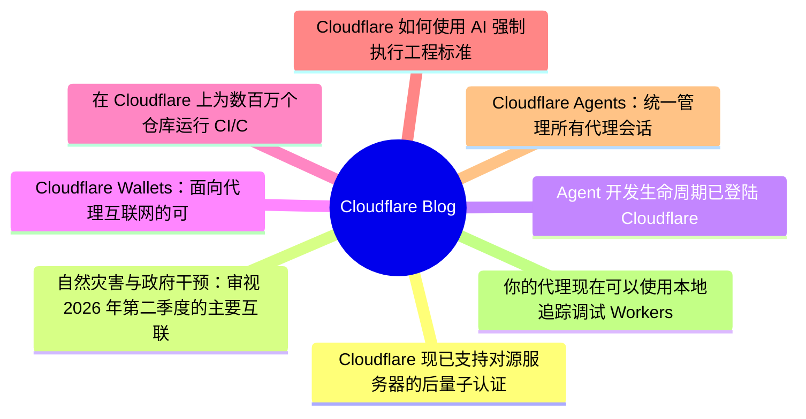
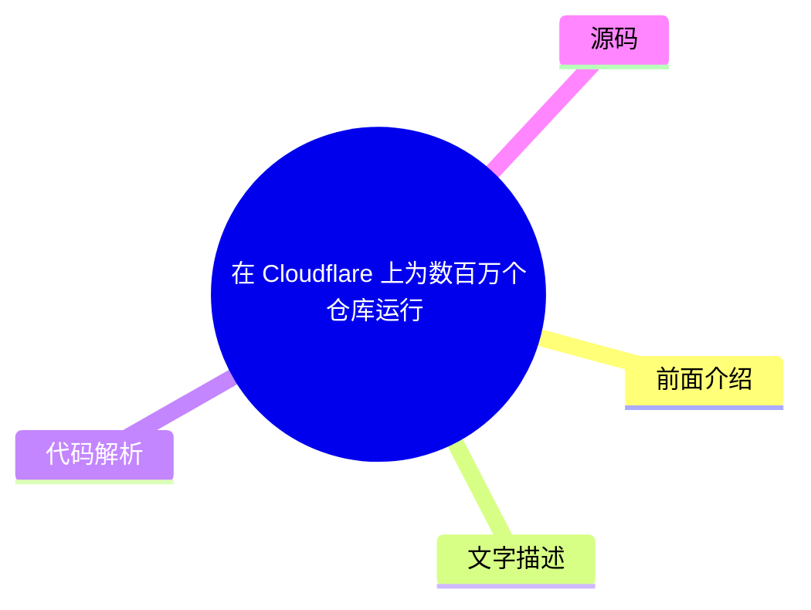
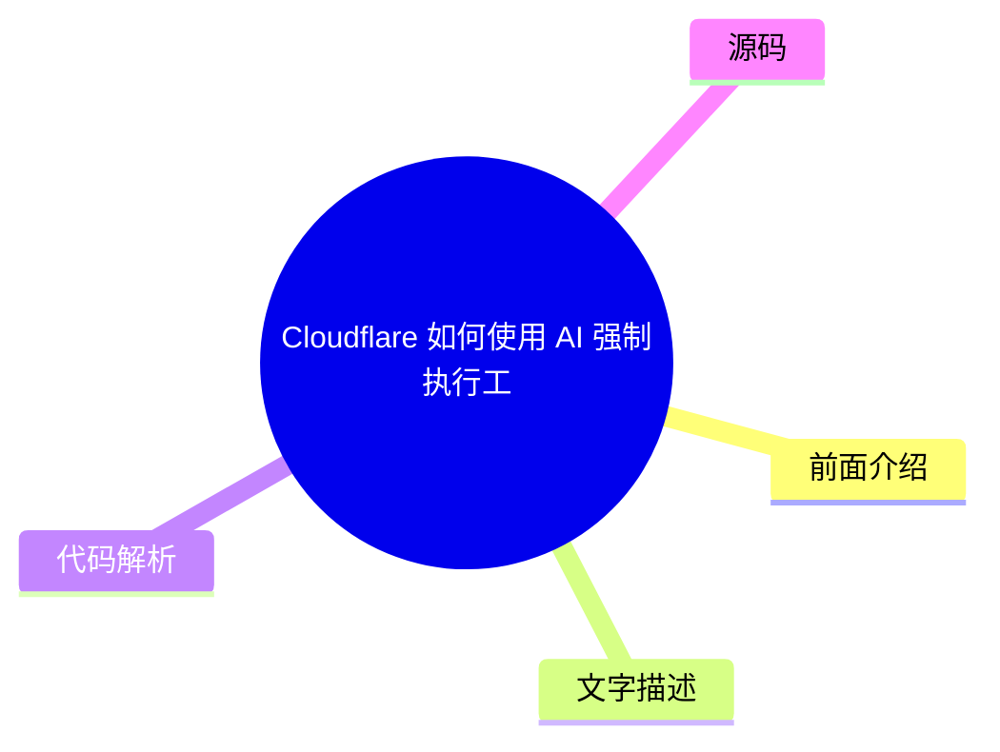
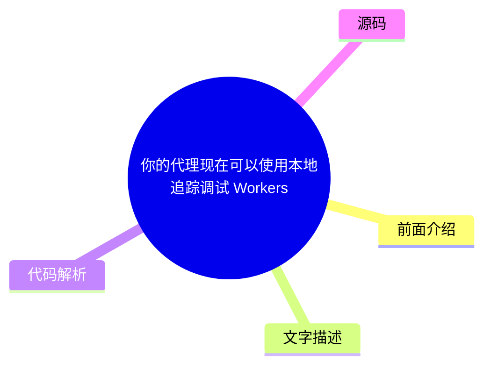

# ☁️ Cloudflare Blog Top 8 (2026-08-05)

## 前面介绍

- 数据源：Cloudflare Blog
- 抓取日期：2026-08-05
- 条目数：8
- 含完整正文：8
- 含代码片段：6
- 组织方式：前面介绍 / 树状图 / 文字描述 / 代码解析 / 源码

## 思维导图



## 详细整理（8 条，8 条含全文，6 条含代码）

### 1. Cloudflare 现已支持对源服务器的后量子认证
- **链接**: [https://blog.cloudflare.com/post-quantum-authentication-to-origins/](https://blog.cloudflare.com/post-quantum-authentication-to-origins/)
- **作者**: Luke Valenta
- **发布**: Wed, 29 Jul 2026 13:00:00 GMT

#### 前面介绍

- Cloudflare 的 Authenticated Origin Pulls 和 Custom Origin Trust Store 现在支持后量子 (PQ) 认证。
- 这是迈向为所有 Cloudflare 产品提供 PQ 认证的第一步。
- 该功能使用 Module-Lattice-Based Digital Signature Algorithm (ML-DSA) 签名来保护 Cloudflare 与客户源服务器之间的连接。

#### 树状图


#### 文字描述

- Cloudflare 正在积极完善后量子认证的拼图。对于访客到 Cloudflare 的连接，团队正在与 Google 等机构合作开发 Merkle Tree Certificates (MTC)。
- 对于 Cloudflare 到源服务器的连接，由于 Cloudflare 是客户端，拥有控制权，可以利用连接池等技术将网络中所有请求汇聚到较少的连接上，分摊连接建立的开销。
- 由于 Cloudflare 与客户之间已存在信任关系（即 Cloudflare 账户），不需要受公共互联网 PKI（WebPKI）的约束和时限，可以使用针对特定用例定制的自定义 PKI。
- 这种连接通常不需要中间证书，从而减少了开销。

#### 代码解析

- 本文未提供源码，以下为实现思路或结构解析

#### 源码

#### 源码片段 1（text）

```text
# Create a private ML-DSA-44 CA for the origin server
openssl genpkey -algorithm mldsa44 \
  -provparam ml-dsa.output_formats=seed-only \
  -out origin-ca.key
openssl req -new -x509 -key origin-ca.key \
  -out origin-ca.crt -days 10950 \
  -subj "/CN=Origin Server CA"
# Create the origin server certificate (signed by the origin CA)
openssl genpkey -algorithm mldsa44 \
  -provparam ml-dsa.output_formats=seed-only \
  -out origin-server.key
openssl req -new -key origin-server.key \
  -out origin-server.csr \
  -subj "/CN=origin.example.com" \
  -addext basicConstraints=CA:FALSE \
  -addext keyUsage=digitalSignature \
  -addext subjectAltName=DNS:origin.example.com
openssl x509 -req -in origin-server.csr \
  -CA origin-ca.crt -CAkey origin-ca.key -CAcreateserial \
  -out origin-server.crt -days 5475 \
  -copy_extensions copy
```

#### 源码片段 2（text）

```text
# Create a private ML-DSA-44 CA for Authenticated Origin Pulls
openssl genpkey -algorithm mldsa44 \
  -provparam ml-dsa.output_formats=seed-only \
  -out aop-ca.key
openssl req -new -x509 -key aop-ca.key \
  -out aop-ca.crt -days 10950 \
  -subj "/CN=Authenticated Origin Pull CA"
# Create the client certificate Cloudflare will present (signed by the AOP CA)
openssl genpkey -algorithm mldsa44 \
  -provparam ml-dsa.output_formats=seed-only \
  -out aop-client.key
openssl req -new -key aop-client.key \
  -out aop-client.csr \
  -subj "/CN=cloudflare-aop-client" \
  -addext basicConstraints=CA:FALSE \
  -addext keyUsage=digitalSignature \
  -addext subjectAltName=DNS:cloudflare-aop-client
openssl x509 -req -in aop-client.csr \
  -CA aop-ca.crt -CAkey aop-ca.key -CAcreateserial \
  -out aop-client.crt -days 5475 \
  -copy_extensions copy
```

#### 完整正文（中文）

Cloudflare 的 Authenticated Origin Pulls 和 Custom Origin Trust Store 现在支持后量子认证。

在这里，我们将解释如何配置完全后量子安全的相互认证 TLS 连接以连接到您的源服务器，深入探讨我们构建它的工程细节，进行一次羞愧的忏悔，并最后解释这项工作如何融入我们整体的后量子迁移路线图。

## 达成重要里程碑

过去几年，我们的重点一直是部署后量子 [加密](https://radar.cloudflare.com/post-quantum) 以保护免受

[攻击，即攻击者悄悄囤积您的加密数据，希望在未来使用量子计算机对其进行解密。](https://en.wikipedia.org/wiki/Harvest_now,_decrypt_later)

__harvest-now/decrypt-later__然而，量子计算和密码分析的最新突破将升级到后量子的时间表向前推进 __across__ [行业](https://blog.google/innovation-and-ai/technology/safety-security/cryptography-migration-timeline/) 和

[并促使我们将注意力转移到部署后量子](https://blog.cloudflare.com/post-quantum-eo-2026/)

__政府__*认证*，以保护免受攻击者的侵害，这些攻击者很快将能够使用量子计算机破解经典凭据并执行冒充攻击。

在之前的帖子中，我们宣布 Cloudflare [目标定在 2029 年](https://blog.cloudflare.com/post-quantum-roadmap/#cloudflares-roadmap-to-full-post-quantum-security) 实现完全后量子安全，并制定了途中需要达到的几个里程碑。我们已经达到了其中第一个里程碑：我们的

[和](https://developers.cloudflare.com/ssl/origin-configuration/authenticated-origin-pull/)

__Authenticated Origin Pulls__[产品](https://developers.cloudflare.com/ssl/origin-configuration/custom-origin-trust-store/)

__Custom Origin Trust Store__[通过 Module-Lattice-Based Digital Signature Algorithm (ML-DSA) 签名来保护 Cloudflare 和客户源服务器之间的连接。Â](https://developers.cloudflare.com/changelog/post/2026-06-17-pqc-mldsa-aop-cots/)

__现已支持后量子 (PQ) 认证__## 源连接不同

当客户端访问由 Cloudflare 代理的网站时，通常涉及两个连接。第一个连接是来自访客（例如浏览器）到 Cloudflare 的连接。如果请求可以从 Cloudflare 的缓存中提供，或者触发了任何阻止规则，Cloudflare 可能会直接响应。否则，Cloudflare 会建立第二个连接到客户的源服务器以获取请求的内容，以便它可以响应原始请求。

保护敏感访客数据需要这两个连接都免受量子攻击。我们在 [2022](https://blog.cloudflare.com/post-quantum-for-all/) 年为访客到 Cloudflare (连接 1) 和 Cloudflare 到源 (连接 2) 连接启用了后量子加密支持，并且已经看到

[，

分别，并且已经看到](https://blog.cloudflare.com/post-quantum-to-origins/)

__2023__[.](https://radar.cloudflare.com/post-quantum)

__显著使用__我们正在积极努力通过后量子认证来完成这一工作。对于访客到 Cloudflare 的连接，我们正在与 [ Google](https://blog.google/security/cultivating-a-robust-and-efficient-quantum-safe-https/) 以及互联网工程任务组 (

[) 合作开发并](https://datatracker.ietf.org/wg/plants/about/)

__IETF__[使用 Merkle Tree 证书](https://blog.cloudflare.com/bootstrap-mtc)

__实验__[，这是一种为 Web 设计的快速后量子证书，初始部署目标为 2027 年。然而，本文的主题是 Cloudflare 到源连接，其中认证的要求与访客到 Cloudflare 连接的几个重要方式不同。](https://datatracker.ietf.org/doc/draft-ietf-plants-merkle-tree-certs/)

__(MTC)__对于此连接，Cloudflare 是客户端。这使我们能够控制采用连接池等技术，将来自我们网络各处的请求汇聚到较少的连接到源服务器的连接上，从而将连接建立的开销分摊到许多请求上。这使得“即插即用”后量子签名的成本更加可接受，MTC 的性能优势也变得不那么必要。

凭借 Cloudflare 与客户之间预先存在的信任关系（即 Cloudflare 账户），我们无需受限于公共互联网公钥基础设施（PKI）（[WebPKI](https://cabforum.org/working-groups/server/baseline-requirements/requirements/)）的约束和时间表，而是可以使用针对用例量身定制的自定义 PKI，无需中间证书的开销以及

[可能不适用。像](https://datatracker.ietf.org/doc/html/rfc6962)

__证书透明度__[这样的解决方案也可以通过使用后量子加密（以及正在开发中的后量子认证）进行保护的隧道转发流量，在不升级遗留源系统的情况下保护 Cloudflare 到源服务器的连接。](https://developers.cloudflare.com/tunnel/)

__Cloudflare Tunnel__总而言之，Cloudflare 到源服务器的连接的独特需求使我们能够在 WebPKI 为公共互联网提供支持之前，通过 ML-DSA 认证部署后量子认证。（对于坚持使用 WebPKI 的客户，请放心：我们将在未来的 Cloudflare 到源服务器的连接中添加 MTC 支持。）

那么如何开启此功能？让我们深入探讨配置。

## 配置完全 PQ 安全的源服务器连接

我们在自定义源信任存储和认证源拉取产品中添加了 ML-DSA 支持（针对所有 [FIPS 204](https://csrc.nist.gov/pubs/fips/204/final) 参数集：ML-DSA-44、ML-DSA-65 和 ML-DSA-87）。ML-DSA-44 是我们针对大多数应用程序的推荐选项，因为它是性能最好的选项，并且达到了舒适的 NIST

[安全强度。](https://nvlpubs.nist.gov/nistpubs/FIPS/NIST.FIPS.204.pdf#page=25)

__category 2__### 自定义源信任存储

当 Cloudflare 连接到配置了 [ Full (strict)](https://developers.cloudflare.com/ssl/origin-configuration/ssl-modes/full-strict/) SSL 模式的客户源服务器时，我们会根据由所有 

[证书颁发机构 (CAs) 以及 Cloudflareâs](https://ccadb.org)

__commonly trusted__[. The](https://developers.cloudflare.com/ssl/origin-configuration/origin-ca/)

__origin CA__[产品（需要](https://developers.cloudflare.com/ssl/origin-configuration/custom-origin-trust-store/)

__自定义源信任存储 (COTS)__[启用）允许客户用其控制的 CA 集合替换此默认信任存储。COTS 现在允许客户上传 ML-DSA CA，以便 Cloudflare 在连接到源服务器时信任任何链接到该 CA 的源服务器证书。](https://developers.cloudflare.com/ssl/edge-certificates/advanced-certificate-manager/)

__高级证书管理器__### 认证源拉取

为了限制对其源服务器的滥用和资源消耗，客户可能只想服务来自 Cloudflareâs 服务器的请求。[ 认证源拉取 (AOP)](https://developers.cloudflare.com/ssl/origin-configuration/authenticated-origin-pull/) 可用于配置 Cloudflare 向源服务器出示客户端证书以建立 

[连接，从而实现双方之间的双向安全可信通信。AOP 在所有 Cloudflare 计划级别上均可免费使用。](https://www.cloudflare.com/learning/access-management/what-is-mutual-tls/)

__mutual TLS (mTLS)__AOP 支持 [ 配置级别](https://developers.cloudflare.com/ssl/origin-configuration/authenticated-origin-pull/#configuration-levels)：全局、按区域和按主机名。按区域和按主机名的配置级别现在允许客户上传 ML-DSA 证书和私钥（采用 FIPS 204 种子格式），以便 Cloudflare 的 TLS 客户端在连接到源服务器时出示此证书以进行身份验证。（别担心，我们并没有忘记全局配置级别——它只是一个更复杂的变更，将在稍后优先处理。）

### 避免降级

在认证方和验证方双方添加后量子加密和认证支持是必要的，但*并非*实现完全后量子安全的充分条件。降级这个令人头疼的问题依然存在。如果验证方支持任何易受量子攻击的认证机制，它们仍然容易受到能够伪造经典凭据的 [ 路径攻击者](https://www.cloudflare.com/learning/security/threats/on-path-attack/) 的攻击。

解决方案：验证方必须移除对易受量子攻击的认证机制的信任。（在复杂的 PKI 中，这一点更为微妙。例如，请参阅 Chromium 安全团队的 [ 四阶段计划](https://www.chromium.org/Home/chromium-security/post-quantum-auth-roadmap/)，用于过渡 Web。）请参阅 

[以了解有关如何确保您的源服务器免受降级攻击的 AOP 和 COTS 细节。](https://developers.cloudflare.com/ssl/post-quantum-cryptography/pqc-to-origin/#avoid-downgrades)

__配置指南__### 快速入门

下面的演练展示了如何生成 ML-DSA 证书链并通过 Cloudflare API 配置这两个产品。有关控制台说明和附加背景信息，请参阅 [ 开发者文档](https://developers.cloudflare.com/ssl/post-quantum-cryptography/pqc-to-origin/)。

1. 生成证书

您需要 OpenSSL 3.5.0 或更高版本。私钥必须采用 FIPS 204 种子编码生成，这是 Cloudflare 目前在上传时唯一接受的格式。

**Origin server certificate chain for COTS:**

```
# Create a private ML-DSA-44 CA for the origin server
openssl genpkey -algorithm mldsa44 \
  -provparam ml-dsa.output_formats=seed-only \
  -out origin-ca.key
openssl req -new -x509 -key origin-ca.key \
  -out origin-ca.crt -days 10950 \
  -subj "/CN=Origin Server CA"
# Create the origin server certificate (signed by the origin CA)
openssl genpkey -algorithm mldsa44 \
  -provparam ml-dsa.output_formats=seed-only \
  -out origin-server.key
openssl req -new -key origin-server.key \
  -out origin-server.csr \
  -subj "/CN=origin.example.com" \
  -addext basicConstraints=CA:FALSE \
  -addext keyUsage=digitalSignature \
  -addext subjectAltName=DNS:origin.example.com
openssl x509 -req -in origin-server.csr \
  -CA origin-ca.crt -CAkey origin-ca.key -CAcreateserial \
  -out origin-server.crt -days 5475 \
  -copy_extensions copy
```
**Cloudflare client certificate chain for AOP:**

```
# Create a private ML-DSA-44 CA for Authenticated Origin Pulls
openssl genpkey -algorithm mldsa44 \
  -provparam ml-dsa.output_formats=seed-only \
  -out aop-ca.key
openssl req -new -x509 -key aop-ca.key \
  -out aop-ca.crt -days 10950 \
  -subj "/CN=Authenticated Origin Pull CA"
# Create the client certificate Cloudflare will present (signed by the AOP CA)
openssl genpkey -algorithm mldsa44 \
  -provparam ml-dsa.output_formats=seed-only \
  -out aop-client.key
openssl req -new -key aop-client.key \
  -out aop-client.csr \
  -subj "/CN=cloudflare-aop-client" \
  -addext basicConstraints=CA:FALSE \
  -addext keyUsage=digitalSignature \
  -addext subjectAltName=DNS:cloudflare-aop-client
openssl x509 -req -in aop-client.csr \
  -CA aop-ca.crt -CAkey aop-ca.key -CAcreateserial \
  -out aop-client.crt -days 5475 \
  -copy_extensions copy
```
2. Upload the origin CA to Custom Origin Trust Store

```
CA_CERT=$(jq -Rs . < origin-ca.crt)
curl "https://api.cloudflare.com/client/v4/zones/$Z

...（截断，原文 22558+ 字符）


### 2. 自然灾害与政府干预：审视 2026 年第二季度的主要互联网中断事件
- **链接**: [https://blog.cloudflare.com/q2-2026-internet-disruption-summary/](https://blog.cloudflare.com/q2-2026-internet-disruption-summary/)
- **作者**: Lai Yi Ohlsen
- **发布**: Tue, 28 Jul 2026 13:00:00 GMT

#### 前面介绍

- Cloudflare Radar 追踪了由自然灾害、政府强制断网和 DNSSEC 密钥轮换引起的互联网中断。
- 超级台风 Sinlaku 导致关岛出现最长中断，苏丹考试期间的政府强制断网最为频繁。
- 伊朗恢复了国家互联网接入，结束了长达 88 天的断网，尽管无人机袭击仍在破坏该地区的 AWS 基础设施。
- 圣卢西亚的海底光缆切断和德国故障 DNSSEC 签名的分发凸显了互联网基础设施的脆弱性。

#### 树状图


#### 文字描述

- 超级台风 Sinlaku 虽未直接袭击关岛，但带来了热带风暴级风力，导致关岛大面积停电，互联网流量在 4 月 13 日至 14 日间下降了高达 80%。
- 6 月 24 日，委内瑞拉北部发生两次 7.5 级地震，紧接着发生余震，导致 HTTP 字节传输量急剧下降，特别是在 Fibex Telecom 和 CANTV 等运营商中可见。
- 6 月 27 日，坦桑尼亚发生停电，导致 HTTP 流量在至少五个小时内大幅下降，其影响与 2025 年 10 月的选举相关断网类似。
- 伊朗在 2 月 28 日开始断网后，于 5 月 26 日开始恢复迹象，5 月 27 日流量恢复到断网前水平的 40%，随后在 6 月达到 90% 后回落至约 59%。
- 这些事件展示了物理世界对数字世界的影响，强调了构建具有冗余性的网络的重要性。

#### 代码解析

- 本文未提供源码，以下为实现思路或结构解析

#### 源码

#### 中文节选

像大多数基础设施一样，互联网的脆弱性很容易被忽视——只要它还在运行。一旦失效，其复杂性便会一览无余。Cloudflare 处于一个独特的位置，能够检测并记录互联网所依赖的相互关联系统之一发生故障、从而导致连接中断的时刻。每个季度，我们都会总结我们在 [Cloudflare Radar](https://radar.cloudflare.com/) 上检测并标注的中断情况。

2026 年第二季度，超级台风 Sinlaku 在关岛以北经过，导致了持续时间最长的中断；而苏丹考试期间政府强制实施的关停则是发生频率最高的中断。尽管无人机袭击造成的破坏仍在持续扰乱该地区其他地方的 AWS 基础设施，伊朗还是恢复了全国互联网接入，在经历了 88 天的断网后，将其公民重新连接到全球网络。最后，圣卢西亚的海底光缆被切断以及德国故障的 DNSSEC 签名分发，凸显了互联网基础设施的脆弱性，但也展示了这些区域和全球系统在正常运行时维持的惊人稳定性。

在这里，我们将回顾我们在 2026 年第二季度观察到的最重大的互联网中断情况，利用 Cloudflare Radar 的流量数据，展示每个中断的演变过程及其对地面用户的影响。一如既往，这只是一个值得注意的、已确认的中断的摘要，而非详尽无遗的列表；关于检测到的流量异常的更完整视图，请参阅 [Cloudflare Radar Outage Center](https://radar.cloudflare.com/outage-center?dateStart=2026-04-01&dateEnd=2026-06-30)。

### 自然灾害和电力故障导致关岛、委内瑞拉和坦桑尼亚发生中断

超级台风 Sinlaku 是 2026 年太平洋台风季迄今为止最强的风暴，于 4 月中旬穿过马里亚纳群岛，从关岛以北经过。虽然该岛避免了直接袭击，但风暴带来了热带风暴级别的风力，导致关岛全境停电，并破坏了供水系统，这对互联网连接产生了直接影响。4 月 13 日至 14 日，该地区的流量比预期水平下降了多达 80%。

两个月后，6月24日，委内瑞拉北部在尤马雷和圣菲利佩两地接连发生了两次主要地震，相隔不到一分钟，随后在加拉加斯海岸外发生了一次余震。第一次7.5级地震发生在大约22:04 UTC（当地时间18:04）。这些事件的直接影响可以在 Radar 中看到，显示在地震发生的同时，HTTP 传输字节数急剧下降。这种下降在 Fibex Telecom 中尤为明显，根据 [APNIC 数据](https://stats.labs.apnic.net/aspop/)，该公司估计拥有160万用户。该下降在 __CANTV__[, 稍小的区域性 ISP] 中也清晰可见。Â

#### 完整正文（中文）

像大多数基础设施一样，互联网的脆弱性很容易被忽视——只要它还在运行。一旦失效，其复杂性便会一览无余。Cloudflare 处于一个独特的位置，能够检测并记录互联网所依赖的相互关联系统之一发生故障、从而导致连接中断的时刻。每个季度，我们都会总结我们在 [Cloudflare Radar](https://radar.cloudflare.com/) 上检测并标注的中断情况。

2026 年第二季度，超级台风 Sinlaku 在关岛以北经过，导致了持续时间最长的中断；而苏丹考试期间政府强制实施的关停则是发生频率最高的中断。尽管无人机袭击造成的破坏仍在持续扰乱该地区其他地方的 AWS 基础设施，伊朗还是恢复了全国互联网接入，在经历了 88 天的断网后，将其公民重新连接到全球网络。最后，圣卢西亚的海底光缆被切断以及德国故障的 DNSSEC 签名分发，凸显了互联网基础设施的脆弱性，但也展示了这些区域和全球系统在正常运行时维持的惊人稳定性。

在这里，我们将回顾我们在 2026 年第二季度观察到的最重大的互联网中断情况，利用 Cloudflare Radar 的流量数据，展示每个中断的演变过程及其对地面用户的影响。一如既往，这只是一个值得注意的、已确认的中断的摘要，而非详尽无遗的列表；关于检测到的流量异常的更完整视图，请参阅 [Cloudflare Radar Outage Center](https://radar.cloudflare.com/outage-center?dateStart=2026-04-01&dateEnd=2026-06-30)。

### 自然灾害和电力故障导致关岛、委内瑞拉和坦桑尼亚发生中断

超级台风 Sinlaku 是 2026 年太平洋台风季迄今为止最强的风暴，于 4 月中旬穿过马里亚纳群岛，从关岛以北经过。虽然该岛避免了直接袭击，但风暴带来了热带风暴级别的风力，导致关岛全境停电，并破坏了供水系统，这对互联网连接产生了直接影响。4 月 13 日至 14 日，该地区的流量比预期水平下降了多达 80%。

两个月后，6月24日，委内瑞拉北部在约一分钟内接连发生了两次大地震，震中位于尤马雷和圣费利佩，随后在加拉加斯海岸外发生了一次余震。第一次7.5级地震发生在格林威治标准时间大约22:04（当地时间18:04）。这些事件的直接影响可以在雷达图中看到，该图显示在地震发生的同时，HTTP传输字节数急剧下降。这种下降在 Fibex Telecom 中尤为明显，根据 [APNIC 数据](https://stats.labs.apnic.net/aspop/)，该公司估计拥有160万用户。[, 国有主导运营商，和](https://radar.cloudflare.com/traffic/as8048?dateStart=2026-06-24&dateEnd=2026-06-25#traffic-trends)

__CANTV__[, 稍小一点的区域性 ISP。Â](https://radar.cloudflare.com/traffic/as263703?dateStart=2026-06-24&dateEnd=2026-06-25)

__VNET__几天后，在跨大西洋的另一边，6月27日坦桑尼亚发生的大停电导致那里的 HTTP 流量急剧下降，持续时间至少为五个小时。虽然其成因与该国2025年10月选举相关的停电不同（后者是政府的有意行动，而非基础设施故障），但由此产生的遥测数据和用户影响几乎完全相同：连接性严重丧失，导致居民无法与亲人联系或获取关键新闻。Â

令人惊讶的是，如此根本不同的事件在数据和用户体验中留下了如此相似的痕迹。综合来看，这些与天气相关和由电力驱动的中断表明，物理世界对数字世界有着巨大的影响，以及互联网韧性的重要性，以及构建具有足够冗余的电力、路由和物理路径的网络，以承受不可避免的冲击。

### 政府和地缘政治影响伊朗、阿联酋、伊拉克和苏丹的连接性

自5月26日起，Radar 开始注意到伊朗此前[宣布](https://x.com/ir_aref/status/2059261258566877640?s=20)的互联网恢复迹象，这标志着为期88天的断网（自2月28日开始）的初步结束，当时该国几乎完全处于离线状态。5月27日，Radar

[报告称流量已恢复到断网前水平的40%，这与报道中称访问正在逐步恢复而非一次性全面恢复的情况一致。此后，我们观察到 HTTP 字节量一度攀升至 90%，随后回落至断网前水平的约 59%。这一流量水平与我们在 2 月观察到的流量相符，即最近一次断网与 1 月上一次断网之间的窗口期，这表明连接性已恢复到最近一次断网前的基线水平，而非完全正常化。在我们的](https://blog.cloudflare.com/iran-internet-partially-restored-may-2026/)

__报告__中，伊朗作为一个独特的异常值脱颖而出：虽然大多数参与国家的流量随着比赛赛程的安排而起伏，但伊朗的读数则主要由其恢复后的水平与此前几乎完全失去连接之间的对比所主导。](https://blog.cloudflare.com/2026-world-cup-internet-traffic/#streaming-makes-some-countries-appear-more-online)

__2026年世界杯分析__与此同时，到位于阿联酋的 AWS 云区域 me-central-1 的 HTTP 流量[保持低位](https://radar.cloudflare.com/cloud-observatory/amazon/me-central-1?dateRange=24w#http-traffic)，与

[一致。]

[4月30日，该地区“因中东冲突而遭受损害，目前无法可靠地支持客户应用程序。”此次更新紧随3月3日的报告，该报告称阿联酋和巴林的设施“因无人机袭击而遭受物理基础设施影响。”在阿联酋，两个设施“被直接击中”，在巴林，设施附近的无人机袭击对其基础设施造成了“物理影响”。流量下降是底层数据中心基础设施物理受损的下游特征，而不是网络故障，并且它继续影响托管在该区域的网站和应用程序，无论其自身的可用性如何。](https://health.aws.amazon.com/health/status#multipleservices-me-central-1_1777533954)

__AWS 服务报告__2026年第二季度还包括伊拉克的三次政府强制关停（[6月2日](https://radar.cloudflare.com/traffic/iq?dateStart=2026-06-01&dateEnd=2026-06-02)，

[，和](https://radar.cloudflare.com/traffic/iq?dateStart=2026-06-10&dateEnd=2026-06-11)

__6月11__[) 以及](https://radar.cloudflare.com/traffic/iq?dateStart=2026-06-27&dateEnd=2026-06-28)

__6月28__[）以及4月13日至23日期间，所有这些关停都是为了防止国家考试作弊——这是我们记录的这两个国家多个先前季度中出现的季节性模式。苏丹的中断遵循一致的节奏，每次持续时间约为3.5小时，从UTC 11:45到15:15（当地时间13:45到17:15），与考试窗口同步。在伊拉克，中断时间较短，每次约90分钟，同样安排在考试进行的时间段内。](https://radar.cloudflare.com/traffic/sd?dateStart=2026-04-13&dateEnd=2026-04-23#traffic-trends)

__苏丹10__这些示例，无论是恢复还是中断，都说明了政府对国家连接性施加的重大控制，以及根据政策而非基础设施，轻松关闭、限制或选择性重新引入访问的便利性。

### 基础设施漏洞影响德国和圣卢西亚的用户

5月5日，德国 .de 域名的注册机构 DENIC 的 DNSSEC 密钥轮换开始生成无效签名。这些密钥轮换是用于对区域的 DNS 记录进行签名的加密密钥的定期替换；这是一项例行但至关重要的维护工作，因为验证 DNSSEC 的解析器只会信任签名与当前发布密钥匹配的答案。换句话说，如果数字签名与预期值不匹配，解析器会假设该站点已被篡改并切断访问。当开始生成无效签名时，全球的验证解析器拒绝了所有对 .de 网站的请求，并返回 SERVFAIL 错误，直到在 23:15 UTC（5月6日当地时间 01:15）恢复正常运行。

Cloudflare Radar 观察到在 outage 期间全球 .de 查询量上升。虽然起初可能有些反直觉，这是因为失败的答案实际上无法被缓存，所以原本从缓存中静默服务的查询现在必须重新解析并反复重试，导致查询量激增。

从用户的角度来看，此次事件体验到的不是 DNS 或加密故障，而仅仅是 .de 网站和服务突然变得无法访问。尽管用户仍能访问不使用 .de 顶级域名的网站，但体验包括页面加载失败、邮件被退回以及应用程序超时，所有这些都可能反映出 outage 的体验。您可以在我们的[博客](https://blog.cloudflare.com/de-tld-outage-dnssec/)上阅读更多关于 DNSSEC 和事件影响的内容。

在加勒比地区，基础设施故障导致可用性出现类似下降。6月21日左右，Karib Cable 网络的 HTTP 请求流量在 21:00 UTC（当地时间 17:00）左右降至几乎为零，并在随后一天的大部分时间里保持平稳，直到 6月22日 17:00 UTC（当地时间 13:00）左右恢复到预期水平。此次中断据称是由岛附近的光纤切断引起的，这是依赖少数陆地和海底路径接入更广泛互联网的加勒比网络所面临的一个熟悉的风险，这意味着一次断裂可能会切断不成比例的容量。由于 Karib Cable 是最大的提供商之一，这种损失在国家层面也显而易见，圣卢西亚的整体流量在切断期间

[下降了约 60%，与上周相比](https://radar.cloudflare.com/explorer?dataSet=netflows&loc=LC&dt=2026-06-21_2026-06-27&timeCompare=1#result)

__dropping approximately 60% against the prior week__### Radar 继续监控中断

2026 年第二季度，互联网中断源于多种原因，包括恶劣天气、地震、停电、政府指令下的关停、云基础设施受损、光缆切断以及 DNSSEC 配置错误。正如这些事件所证明的那样，互联网依赖于一套复杂的相互关联的系统，其中任何一个系统的故障都可能导致连接丢失。

Cloudflare Radar 团队持续监控互联网中断情况，通过 [Cloudflare Radar 中断中心](https://radar.cloudflare.com/outage-center)、社交媒体以及在 [blog.cloudflare.com](http://blog.cloudflare.com) 的帖子分享我们的观察。请在社交媒体上关注我们：[@CloudflareRadar](https://twitter.com/CloudflareRadar) (X)、[noc.social/@cloudflareradar](https://noc.social/@cloudflareradar) (Mastodon) 和 [radar.cloudflare.com](http://radar.cloudflare.com) (Bluesky)。


### 3. Agent 开发生命周期已登陆 Cloudflare
- **链接**: [https://blog.cloudflare.com/agent-development-lifecycle/](https://blog.cloudflare.com/agent-development-lifecycle/)
- **作者**: Brendan Irvine-Broque
- **发布**: Tue, 04 Aug 2026 13:00:00 GMT

#### 前面介绍

- AI 代理编写代码的速度远超团队审查、部署和维护的速度。
- Cloudflare 引入了 Agent Development Lifecycle (ADLC) 和底层 Cloudflare 原语。
- SDLC（软件开发生命周期）正被 ADLC（代理开发生命周期）取代，以适应代理驱动的软件工厂。
- 新的工具包括 @cloudflare/ci、本地开发中的 OpenTelemetry 追踪以及 Cloudflare Agents 和 Agent Traces。

#### 树状图


#### 文字描述

- 传统的 SDLC 包含计划、设计、实现、测试、部署、维护和退役阶段。AI 加速了实现阶段，但导致审查、部署和维护阶段不堪重负。
- 为了解决这个问题，Cloudflare 将代理视为客户，允许它们购买域名、创建临时账户并使用整个 Cloudflare API。
- 软件工厂需要平台支持程序化、水平可扩展、可重现和基于推送的操作，而不仅仅是“点击操作”。
- Cloudflare 正在构建一套工具，让代理超越生成代码，承担更多 SDLC 的工作，例如自动部署和修复。

#### 代码解析

- 本文未提供源码，以下为实现思路或结构解析

#### 源码

#### 源码片段 1（text）

```text
import { CIWorkflow } from `@cloudflare/ci`
const deps: CiRunnerResult = await ci.runner({
      name: 'install',
      command: 'bun install --frozen-lockfile',
      cache: { inputs: ['package.json', 'bun.lock'] },
    });
    await Promise.all([
      deps.runner({ name: 'lint', command: 'bun run lint' }),
      deps.runner({ name: 'test', command: 'bun run test' }),
      deps.runner({ name: 'typecheck', command: 'bun run typecheck' }),
      deps.runner({ name: 'build', command: 'bun run build' }),
    ]);
    await deps.runner({
      name: 'deploy',
      command: 'bun wrangler deploy',
      cloudflareCredentials: {
        accountId: this.env.CLOUDFLARE_DEPLOY_ACCOUNT_ID,
      },
    });
```

#### 源码片段 2（text）

```text
import { WorkflowEntrypoint, type WorkflowEvent, type WorkflowStep } from 'cloudflare:workers';
import { init } from '@flue/runtime';
import { Reviewer } from './agents/reviewer.ts';
import { collectFindings } from './shared/nightly.ts';
type Params = { date: string };
export class NightlyReview extends WorkflowEntrypoint {
  async run(event: WorkflowEvent<Params>, step: WorkflowStep) {
    const findings = await step.do('collect findings', () => collectFindings(event.payload.date));
    const agent = init(Reviewer, { id: `nightly-${event.payload.date}` });
    const receipt = await step.do('dispatch review', () =>
      agent.dispatch(`Review these findings:\n${findings}`),
    );
    const review = await step.do('read review', async () => {
      const reply = await agent.read(receipt);
      return { text: reply.text, data: reply.data };
    });
    // ...
  }
}
```

#### 完整正文（中文）

工程经理在过去几十年里一直在想办法让许多程序员在共享代码库上协同工作。这项工作可以追溯到“系统开发生命周期”（[ RAND, 1975](https://www.rand.org/pubs/reports/R1855.html)）——今天通常被称为“软件开发生命周期”（SDLC），它定义了以下阶段：

- 计划
- 设计
- 实现
- 测试
- 部署
- 维护
- 退役

AI 已经让之前最慢、最昂贵的步骤“实现”变得最快、最便宜。这反过来对下游产生了影响：让负责 SDLC 中其他所有步骤的人不堪重负。这从收到数千个拉取请求和问题的开源维护者，到试图在软件交付速度提高几个数量级时挽救生产环境的工程师，范围很广。

我们都在试图让我们的系统、客户和自己免受“垃圾内容”的侵害。

答案—— paradoxically（悖论式地）——是赋予代理更多能力。这很公平！你绝不会让团队里的工程师编写代码，却指望别人去验证、合并、部署它，在生产环境中接听报警电话，并处理收到的错误报告。但大多数公司现在正是这样对待代理的。模型有了显著改进，代理在更长的时间范围内运行，能够承担更大的任务。但它们在 SDLC 中的使用还并不均衡。

Cloudflare 将代理视为我们的客户。他们可以 [购买域名](https://blog.cloudflare.com/agents-stripe-projects/)，创建 [并](https://blog.cloudflare.com/temporary-accounts/) __临时账户__。我们知道代理需要 API 和工具，以便代表我们的客户管理完整的 SDLC —— 而不仅仅是开始部分。[.](https://blog.cloudflare.com/code-mode-mcp/) __使用整个 Cloudflare API__

因此，今天我们推出了新工具集的开端，让代理不仅能生成代码，还能承担更多 SDLC 的工作。我们分享了在尝试自行解决此问题时所构建和学到的东西：

- __@cloudflare/ci__
- __本地开发中的 OpenTelemetry 追踪__

- __Introducing: Cloudflare Agents and Agent Traces__
- __How Cloudflare enforces engineering standards using AI__
- __How we built a software factory to drive Astroâs GitHub issue count to zero__

Thereâs something bigger here though. When we look at the SDLC, even with the best automation, its assumptions do not scale for the volume of code agents can write and the pace at which software teams must move to compete. We think itâs time to replace the SDLC with the ADLC â the Agent Development Lifecycle.

## The SDLC is for software teams. The ADLC is for software factories.

Right now, __everyone____is____talking____about__[ building](https://x.com/gokulr/status/2032271386161684665) âsoftware factoriesâ â agent-driven systems that take input and autonomously build, improve, deploy and manage software. Take an input, whether itâs a production error, a bug report from a customer, or an idea for a new feature, and delegate it entirely to an agent.

Even with agents, most software projects are constrained by human-in-the-loop steps. Humans prompting agents, telling them to keep going, instructing agents to apply feedback from a code review, constantly babysitting many agents and giving them instruction. On most software teams, the human still manages each step in the SDLC model â the only change is that they delegate tasks within each step to an agent.

And so the dream behind software factories is: what if you reimagined this approach and built a factory for the entire process of building software? How can we shift more human time towards the things that truly require human inspiration, taste, and judgement? It would leave us more time to design, to talk to customers, and to dream bigger.

A software factory has to manage the same steps in the SDLC, but it demands much more from the platform it is built on. Because when you hand over the keys and let the agent drive, every manual step that previously relied on a human must be adapted to be:

- **Programmatic**â âClickOpsâ was bad practice for humans, but itâs a non-starter for agents. Every last operation needs APIs that agents can call, debug, and rely on.

- **水平可扩展**â 在人类盯着屏幕构建或手动接管预发布服务器以在生产环境发现问题之前，预发布部署只是一个可有可无的功能。对于代理（agents）来说，每个代理都必须拥有一个与生产环境匹配的预发布环境。
- **可复现**â 如果出现一个只能在 iPhone 15 上模拟 4G 时复现的 Bug 呢？或者是从某个国家的 IP 触发的？典型的单元测试和集成测试工具在这里帮不上忙。
- **实时、基于推送**â 依赖人类查看正确的仪表盘来了解系统运行情况一直是一种糟糕的方式，而在代理场景下，这种方式完全失效。你需要一个事件来触发代理执行工作。
- **原子性**â 每个变更都需要能够独立测试、发布、可观测和可回滚，且不能影响无关的行为。
- **受权限控制**â 你知道你可能不应该这么做，但今天你还是会给几位值得信任的工程师提供 SSH 登录生产环境的权限，以防事情真的乱套。你绝不会让代理这样做——但如果没有升级权限和获取更多权限的能力，它又如何完成工作呢？
- **自我改进**â 人们会从经验中学习。第一周上线或第一次值班轮换时，人类会很慢，需要跟随他人学习，但随后会变得更快。代理也需要从经验中学习的方式。

如果我们想让软件工厂真正用于生产软件，就需要一些新的东西。软件工厂面临着与其他自主系统（如自动驾驶汽车）相同的挑战——即从成功运行 80% 的时间，提升到 99% 以上的几位数（99.9% 等）。

## 要给代理提供驱动 SDLC 的权限，你不能给它们一辆为人类设计的车

自动驾驶车辆装载了普通汽车没有的传感器和技术。激光雷达传感器、摄像头、强大的计算能力以运行推理，以及与中央指挥系统的连接，以便在需要时可以远程接管。

要让自动驾驶汽车达到人类驾驶水平 80% 的能力，我们可能并不需要所有这些技术。十年前，自动驾驶就已经达到了人类驾驶水平 80% 的能力。但这并不是需要跨越的门槛——门槛是要比人类驾驶员更优秀、更安全。这就是当我们把钥匙交给机器时，期望看到的东西，以便我们在以 60 英里/小时的速度沿 101 号公路行驶时，能感到安全地打个盹。这就是为什么自动驾驶汽车拥有专门为自动驾驶设计的技术——它是建立信任并处理那些无法预先设计好的边缘情况的关键。

自动驾驶软件也是如此。问问你自己，为什么你还没有让你的代理自动批准并合并它自己的 PR 到生产服务？你构建的东西风险越高，你的理由列表几乎肯定就越长。

当你开始拆解这个过程不仅可能发生的灾难性错误，还包括为客户构建正确的东西所必需的步骤时，你会发现它极其复杂。它无法放入 GitHub Actions YAML 文件中的线性步骤集中，也远远超出了运行传统自动化测试的范围。即使是对仪表盘的微小更改，也可能跨越角色、专业领域和组织结构，而主观更改是最难测试和委托的。其中大多数事情在今天可能根本就不在你的 CI/CD 流水线中。但如果你想让这些事情继续发生，同时让运行软件工厂的代理拥有完全的控制权，那么它们就需要成为流水线的一部分。

为了让代理驱动整个流程，我们需要一种更好的方法来编排这些动态的步骤序列。我们认为这需要一种[工作流](https://blog.cloudflare.com/ci-workflows)，它具有启动容器、代理和浏览器的能力。一种能够设置功能开关并针对测试用户启用它们、调查日志和追踪、观察生产指标随变更逐步推出，以及为了安全发布所需做的一切其他事情的工作流。

## CI/CD 流水线只是一种工作流。但工作流可以远不止是 CI/CD 流水线。

[ Cloudflare Workflows](https://developers.cloudflare.com/workflows/) 让你将多个步骤链接在一起，自动重试失败的任务，并保持状态数分钟、数小时甚至数周。它们旨在以逻辑清晰且易于理解的程序来编码复杂且动态的业务流程。

[breaks down why Workflows, in tandem with](https://blog.cloudflare.com/ci-workflows)

__This blog post__[, make defining and triggering CI/CD pipelines fundamentally simpler. For example:](https://blog.cloudflare.com/artifacts-git-for-agents-beta/)

__Artifacts__```
import { CIWorkflow } from `@cloudflare/ci`
const deps: CiRunnerResult = await ci.runner({
      name: 'install',
      command: 'bun install --frozen-lockfile',
      cache: { inputs: ['package.json', 'bun.lock'] },
    });
    await Promise.all([
      deps.runner({ name: 'lint', command: 'bun run lint' }),
      deps.runner({ name: 'test', command: 'bun run test' }),
      deps.runner({ name: 'typecheck', command: 'bun run typecheck' }),
      deps.runner({ name: 'build', command: 'bun run build' }),
    ]);
    await deps.runner({
      name: 'deploy',
      command: 'bun wrangler deploy',
      cloudflareCredentials: {
        accountId: this.env.CLOUDFLARE_DEPLOY_ACCOUNT_ID,
      },
    });
```
Workflows go beyond a series of linear steps though. They can be [ defined dynamically](https://blog.cloudflare.com/dynamic-workflows/), and they can spawn agents or other Workflows. 

[shows a Workflow that reviews new data from the past day. The Workflow has full control over when and how the agent is prompted, and can pass along context between steps:Â](https://flueframework.com/docs/guide/workflows/#example-cloudflare-workflows)

__This example__```
import { WorkflowEntrypoint, type WorkflowEvent, type WorkflowStep } from 'cloudflare:workers';
import { init } from '@flue/runtime';
import { Reviewer } from './agents/reviewer.ts';
import { collectFindings } from './shared/nightly.ts';
type Params = { date: string };
export class NightlyReview extends WorkflowEntrypoint {
  async run(event: WorkflowEvent<Params>, step: WorkflowStep) {

const findings = await step.do('collect findings', () => collectFindings(event.payload.date));
    const agent = init(Reviewer, { id: `nightly-${event.payload.date}` });
    const receipt = await step.do('dispatch review', () =>
      agent.dispatch(`Review these findings:\n${findings}`),
    );
    const review = await step.do('read review', async () => {
      const reply = await agent.read(receipt);
      return { text: reply.text, data: reply.data };
    });
    // ...
  }
}
```
Once you see this pattern, and are âWorkflow-pilledâ as Cloudflare is, you start to ask: what else could I have a Workflow handle for me? What other human-bottlenecked steps could I delegate to this combination of Workflow + [ Flue agents](https://flueframework.com/)?

## The full ADLC, on the Cloudflare stack

With [ Workflows](https://developers.cloudflare.com/workflows/) able to orchestrate complex steps, and 

[as the storage layer for code, when you look at the SDLC stages, everything an agent needs to own the whole process of building, shipping, and maintaining software is on Cloudflare:](https://developers.cloudflare.com/artifacts/)

__Artifacts__| SDLC stage | Cloudflare | 
|---|---|
| Plan Design Implement | [Vite](https://developers.cloudflare.com/workers/vite-plugin/),[Rolldown](https://rolldown.rs/), and[Oxc](https://oxc.rs/)â the fastest toolchain for your agent[Local dev for everything](https://developers.cloudflare.com/work

...（截断，原文 14949+ 字符）


### 4. Cloudflare Wallets：面向代理互联网的可编程钱包
- **链接**: [https://blog.cloudflare.com/wallets/](https://blog.cloudflare.com/wallets/)
- **作者**: Will Papper
- **发布**: Tue, 04 Aug 2026 13:00:00 GMT

#### 前面介绍

- Cloudflare Wallets 为 AI 代理提供原生支付和可验证的身份。
- 使用 x402 协议，代理可以在明确的安全护栏内自主购买 API 和内容。
- Wallets 分为账户钱包（供人类使用）和虚拟钱包（供代理使用，通过 API 密钥操作）。
- 虚拟钱包允许代理探索多种服务，而人类则通过设置支出上限来管理风险。

#### 树状图


#### 文字描述

- 目前，AI 代理很难尝试新 API，因为它们没有稳定的标识符来注册，也没有原生方式支付。
- Cloudflare Wallets 允许用户存储稳定币、购买服务并接收资金，每个账户还可以为其代理创建虚拟钱包。
- 账户钱包允许人类添加资金、委托支出给代理管理的虚拟钱包，并随时提取资金。
- 虚拟钱包由 API 密钥驱动，代理根据权限支出资金，最大支出受账户钱包所有者设定的限制。
- 这种框架允许代理在没有持续人工批准的情况下代表用户行动，同时限制了代理过度支出的能力。
- 通过设置支出上限，人类可以放心地让代理在安全范围内自主探索。

#### 代码解析

- 本文未提供源码，以下为实现思路或结构解析

#### 源码

#### 中文节选

今天，AI 智能体尝试使用新的 API 非常困难。它们通常不得不通过为人类而非智能体设计的登录页面，联系人工添加支付方式，生成 API 密钥，然后弄清楚如何调用该 API。

这种流程对智能体来说非常困难，原因有两个：智能体没有稳定的标识符来注册 API，也没有支付 API 的原生方式。由于缺乏这些条件，它们经常难以接入软件，这限制了代理商业的增长。AI 智能体往往完全放弃这些任务，将注册、支付方式和 API 密钥生成等工作踢回给人类。这使得智能体很难尝试和比较许多 API。

为了解决这个问题，我们创建了 Cloudflare 钱包。从今天开始，你可以为账户 [领取 Cloudflare 钱包标识符](https://cloudflare.pay)，这将提供一个唯一的用户名，帮助你更好地与商家连接。很快，你将能够设置和使用你的 Cloudflare 钱包来支付 API 和内容。

本月早些时候，我们宣布了 [变现网关](https://blog.cloudflare.com/monetization-gateway/)，以帮助 Cloudflare 客户为其网站和应用获得报酬。变现网关将支持使用 [x402 协议](https://www.x402.org/) 进行微支付，该协议允许将支付附加到 HTTP 请求上。这些微支付将能够支付从 AI 推理到数据和内容的各种用途。如果你想在变现网关和其他 [x402 协议](https://developers.cloudflare.com/agents/tools/payments/x402/) 后的服务中支付或收款，你需要一个钱包。

__x402兼容端点__Cloudflare 钱包将允许你在整个网络中存储稳定币、购买服务并接收资金。拥有钱包的每个账户还可以为其代理创建虚拟钱包，以便它们购买 API、MCP 工具、内容等。你可以为虚拟钱包定义护栏（例如预算、允许列表和最大交易金额），以帮助你的代理安全地从你的账户中花钱。这将允许代理以低摩擦和可控的风险尝试许多 API。钱包用户将可以选择共享他们的 Cloudflare 钱包标识符，这将在与商家交互时为他们提供稳定的身份。

## 构建双边的代理市场

Cloudflare 的 [变现网关](https://blog.cloudflare.com/monetization-gateway/) 将允许符合条件的 Cloudflare 客户以无头方式向代理买家出售其资源（如内容或 API）。但要让该市场真正发展，代理需要更多工具以机器原生的方式从商家处购买。钱包将为 Cloudflare 的代理 SDK 添加另一个工具，使 AI 代理能够使用微支付轻松购买必要的 API 和内容。

Cloudflare 钱包将分为两种类型：账户钱包和虚拟钱包。

**账户钱包** a

#### 完整正文（中文）

今天，AI 智能体尝试使用新的 API 非常困难。它们通常不得不通过为人类而非智能体设计的登录页面，联系人工添加支付方式，生成 API 密钥，然后弄清楚如何调用该 API。

这种流程对智能体来说非常困难，原因有两个：智能体没有稳定的标识符来注册 API，也没有支付 API 的原生方式。由于缺乏这些条件，它们经常难以接入软件，这限制了代理商业的增长。AI 智能体往往完全放弃这些任务，将注册、支付方式和 API 密钥生成等工作踢回给人类。这使得智能体很难尝试和比较许多 API。

为了解决这个问题，我们创建了 Cloudflare 钱包。从今天开始，你可以为账户 [领取 Cloudflare 钱包标识符](https://cloudflare.pay)，这将提供一个唯一的用户名，帮助你更好地与商家连接。很快，你将能够设置和使用你的 Cloudflare 钱包来支付 API 和内容。

本月早些时候，我们宣布了 [变现网关](https://blog.cloudflare.com/monetization-gateway/)，以帮助 Cloudflare 客户为其网站和应用获得报酬。变现网关将支持使用 [x402 协议](https://www.x402.org/) 进行微支付，该协议允许将支付附加到 HTTP 请求上。这些微支付将能够支付从 AI 推理到数据和内容的各种用途。如果你想在变现网关和其他 [x402 协议](https://developers.cloudflare.com/agents/tools/payments/x402/) 后的服务中支付或收款，你需要一个钱包。

__x402兼容端点__Cloudflare 钱包将允许你在整个网络中存储稳定币、购买服务并接收资金。拥有钱包的每个账户还可以为其代理创建虚拟钱包，以便它们购买 API、MCP 工具、内容等。你可以为虚拟钱包定义护栏（例如预算、白名单和最大交易金额），以帮助你的代理安全地从你的账户中消费。这将允许代理以低摩擦和可控的风险尝试许多 API。钱包用户将可以选择分享他们的 Cloudflare 钱包标识符，这将在与商家交互时为他们提供稳定的身份。

## 构建双边的代理市场

Cloudflare 的 [变现网关](https://blog.cloudflare.com/monetization-gateway/) 将允许符合条件的 Cloudflare 客户以无头方式向代理买家出售其资源（如内容或 API）。但为了让该市场真正发展，代理需要更多工具以机器原生的方式从商家处购买。钱包将为 Cloudflare 的代理 SDK 添加另一个工具，使 AI 代理能够使用微支付轻松购买必要的 API 和内容。

Cloudflare 钱包将分为两种类型：账户钱包和虚拟钱包。

**账户钱包**是专为 Cloudflare 账户的所有者和用户设计的。它们可以充值、将支出委托给由代理管理的虚拟钱包，并根据需要提款。

**虚拟钱包**则相反，是为代理设计的，并通过 API 密钥运行。在虚拟钱包内，代理将能够根据其权限支出资金。其最大支出将受到账户钱包所有者设定的限制的约束。该框架赋予了代理在无需持续手动批准的情况下代表用户行动的自由，同时限制了代理过度支出的能力。

## 探索的自由

虚拟钱包令人兴奋，因为它们将允许代理发挥其最擅长的本领：探索数十种或数百种服务，并为特定用例找到最佳方案。通过 x402 进行稳定币微支付将使无需账户即可试用 API 变得简单，从而让代理能够以极小的摩擦成本测试新选项。虚拟钱包的支出上限旨在让人类能够在安全的支出范围内让代理自主探索。这些限制看似是一种约束，但反直觉的是，它们赋予了代理更多的自由。如果一个代理负责 10 美元，那么你对其支出的担忧会比它负责 1,000 美元时要少。如果试用某个 API 只需要几美分，那么 10 美元就足以探索和评估许多选项。

一旦你或你的代理选择了要使用的 API，你在账户钱包中设定的策略将作为虚拟钱包的成本控制手段。想要给每位员工每周 100 美元的 AI 推理预算吗？只需配置一个余额正确的账户钱包，并为每位员工创建带有该规则的虚拟钱包即可。任何超出虚拟钱包限额的人都可以向获授权更改账户钱包的人类请求手动覆盖。

我们希望让账户钱包能够轻松设定既灵活又严格的支出策略，而无需进行日常的主动监控。当发生异常情况（例如意外快速支出）时，人类可以审查并确认一切是否按预期运行。如果支出是故意的，那么账户钱包的管理员可以提高限额或批准一次性资金注入。如果支出是无意的，那么向虚拟钱包添加资金的支出策略通过设定上限发挥了作用。

我们正致力于让资助和使用这些钱包变得尽可能简单。我们将首先在支持的地域内提供简单的资金出入金方式，并为符合条件的用户提供通过稳定币进行自资助的选项。互联网不会一夜之间完全转变，但随着[网络上的大部分流量](https://radar.cloudflare.com/)现在由机器人驱动，我们很高兴为代理和商家提供一流的代理商务工具。

## 不仅仅是支付

允许人类将权限委托给代理以便轻松买卖服务是一个很好的起点。但商家在与代理互动时，往往并不明显地意识到这种委托。今天，如果代理访问您的网站，尽管代理代表个人或组织行事，您可能对其作为用户的了解甚少。这种缺乏归属感的情况挑战了许多传统的网络商业模式。给人类或组织提供一周免费试用或注册积分很容易。但对于缺乏稳定身份且一个人类可以控制数十个代理的代理来说，给予这些同样的优惠则很难。

我们通过将钱包链接到 Cloudflare 账户来解决此问题，[cloudflare.pay](https://cloudflare.pay/)。[cloudflare.pay](https://cloudflare.pay/) 将允许代理选择性地自我标识，因为它们的身份是账户的委托人。研究代理可以位于 [research.example.cloudflare.pay](http://research.example.cloudflare.pay)，让商家知道它是来自特定组织的代理。这种方法将允许代理维护一致且持久的身份，从而改善各方的体验。代理选择声明身份完全是可选的，企业决定是否优先与已知代理交易，则由企业自行决定。

## 代理标识符应该是人类可读的

我们认为，处理代理的方法将类似于处理 VPN 的方法：如果某人身份不明，他们并不天生不可信，但需要证明自己。这就是我们拥有 [ Turnstile](https://www.cloudflare.com/products/turnstile/) 以及其他旨在检测机器人

[. 我们的身份原语将建立在此前工作的基础之上。例如，](https://www.cloudflare.com/products/bot-management/)

__Bot Management__[已经允许代理通过密钥对注册其身份。附加到 Cloudflare 钱包上的 ID 允许该密钥对变得可读。](https://developers.cloudflare.com/bots/reference/bot-verification/web-bot-auth/)

__Web Bot Auth__我们知道代理身份标准正在快速变化，这就是为什么我们希望保持方法的简单性。我们提议为不太可读的密钥对提供一个可读的标识符，类似于 [ DNS](https://www.cloudflare.com/learning/dns/what-is-dns/) 中使用的 URL 和 IP 地址配对。我们并不试图定义特定的模式或其他验证系统。我们只想让身份易于记忆且易于声明。随着代理身份丰富模式通过

[倡议的发展，我们将寻求采纳它们，并打算鼓励其他人也这样做。](https://blog.cloudflare.com/x402/)

__x402 Foundationâs__## 代理商务的未来

在 Cloudflare，我们希望为代理商务的成功提供所有构建模块。变现网关将提供一种让卖家在不设置传统支付基础设施的情况下获得报酬的方式。钱包将提供一种让买家通过代理无头支付的方式。身份将允许商家与自我识别的买家进行通信或强制执行识别要求。

所有这些构建模块将创建一个互联网的无头市场。如果您对此感到兴奋并希望参与，[ 您现在可以声明您的标识符](https://cloudflare.pay/)。我们很期待看到您构建和变现的内容。


### 5. 在 Cloudflare 上为数百万个仓库运行 CI/CD
- **链接**: [https://blog.cloudflare.com/ci-workflows/](https://blog.cloudflare.com/ci-workflows/)
- **作者**: André Venceslau
- **发布**: Tue, 04 Aug 2026 13:00:00 GMT

#### 前面介绍

- 利用 Cloudflare Workflows、Artifacts 和 CI SDK 构建可定制、沙盒化的 CI/CD 管道。
- 使用 TypeScript 工作流步骤替换复杂的 YAML 配置。
- 支持依赖缓存、并行执行和条件部署。
- 集成了自我修复的 AI 代理来修复构建中的故障。

#### 树状图



#### 文字描述

- Cloudflare Artifacts 是一个可扩展到数百万个仓库的版本化代码存储。
- CI SDK 将存储、构建和部署步骤拼接在一起，允许在 Cloudflare 上运行持续集成管道。
- 开发者可以通过在 wrangler 配置文件中添加 `events` 字段，将 `artifact push` 事件直接发送到 Workflow，触发 CI 作业。
- SDK 允许在安全的沙盒环境中运行每个步骤，并提供重试和超时功能。
- 通过缓存依赖（如 `install` 步骤），可以减少 CI 步骤的重复执行，提高整体运行速度。
- 开发者只需定义 `install` 步骤、指定每个步骤的命令（如 `bun run build`），并在 `deploy` 步骤中传递 `wrangler deploy` 即可。

#### 代码解析

- 本文未提供源码，以下为实现思路或结构解析

#### 源码

#### 源码片段 1（text）

```text
const deps: CiRunnerResult = await ci.runner({
  name: 'install',
  command: 'bun install --frozen-lockfile',
  cache: { inputs: ['package.json', 'bun.lock'] },
});
await Promise.all([
  deps.runner({ name: 'lint', command: 'bun run lint' }),
  deps.runner({ name: 'test', command: 'bun run test' }),
  deps.runner({ name: 'typecheck', command: 'bun run typecheck' }),
  deps.runner({ name: 'build', command: 'bun run build' }),
]);
await deps.runner({
  name: 'deploy',
  command: 'bun wrangler deploy',
  cloudflareCredentials: {
    accountId: this.env.CLOUDFLARE_DEPLOY_ACCOUNT_ID,
  },
});
```

#### 源码片段 2（text）

```text
const deps = await ci.runner({
  name: 'install',
  command: 'bun install --frozen-lockfile',
  cache: { inputs: ['package.json', 'bun.lock'] },
});
```

#### 源码片段 3（text）

```text
await Promise.all([
   deps.runner({ name: 'lint', command: 'bun run lint' }),
   deps.runner({ name: 'test', command: 'bun run test' }),
   deps.runner({ name: 'typecheck', command: 'bun run typecheck' }),
   deps.runner({ name: 'build', command: 'bun run build' }),
]);
```

#### 完整正文（中文）

我们正迈向一个可以在 Cloudflare 上完全存储、构建、测试和部署代码的世界。我们利用 [Artifacts](https://developers.cloudflare.com/artifacts/) 构建了第一部分，这是一个可扩展至数百万个代码库的版本化代码存储。

我们利用 [CI SDK](https://github.com/cloudflare/ci) 将存储、构建和部署步骤拼接在一起，该 SDK 基于 [Cloudflare Workflows](https://developers.cloudflare.com/workflows/) 构建，以便您可以在 Cloudflare 上运行持续集成 (CI) 流水线。您可以将 `artifact push` 事件直接发送到您的 Workflow，通过 wrangler 配置文件中的新 `events` 字段触发其执行实例——本质上是一个 CI 任务。然后，在安装了 [ @cloudflare/ci](https://www.npmjs.com/package/@cloudflare/ci) 的情况下，您可以直接从 Workflow 执行以下操作：

- 自动化构建：在安全、隔离的环境中从您的 Artifacts 代码库编译代码
- 运行 linter 和类型检查：强制执行代码风格、捕获类型错误并标记任何潜在问题
- 缓存依赖项：在 CI 任务中运行一次 `install` 并在各个步骤间缓存依赖项
- 执行单元测试：验证代码的每一部分是否按预期工作
- 自愈：集成 AI 审查代理以捕获构建中的错误步骤并推送提交进行修复
- 条件部署：仅在构建步骤成功时自动部署您的代码

如今，每个人都在构建平台，无论是内部氛围编码平台，还是通过代码定制扩展面向客户的产品的平台。[平台现在正在使用 Artifacts 上的数百万个代码库](https://x.com/dillon_mulroy/status/2077508376217452866) 来存储其代码和客户的代码，并对两者进行版本控制。但每个团队对持续集成和部署流水线都有自己的需求。对于平台而言，他们可能希望以与客户不同的方式定义自己代码的 CI 任务。

许多在这些平台上构建的最终客户不希望承担管理其持续集成和持续部署 (CI/CD) 管道的额外麻烦。相反，平台可以代表其客户管理构建过程：只需编写一次 CI/CD 管道，并将其在其客户正在构建的所有应用程序之间共享。平台的一些客户可能希望定义自己的 CI；如果是这样，他们可以编写自己的 Workflow，并通过 [ dynamic workflows](https://blog.cloudflare.com/dynamic-workflows/) 在其仓库上运行自定义 CI 任务。其美妙之处在于，你不必二选一：平台管理的 CI 和自定义 CI 可以在同一个命名空间中同时运行。

## CI/CD 管道只是一个 Workflow

在今天之前，我们已经具备了所有必要的组件，允许平台在 Cloudflare 上将 CI/CD 管道连接起来。现在，我们带来了更好的开发者体验，使其变得简单。

CI/CD 管道——通常使用 GitHub Actions 进行编排——是一系列按特定顺序运行的步骤，其中，如果任何步骤失败，你将停止运行管道并报告错误。本质上，CI/CD 管道只是一个 Workflow。当由 YAML 文件定义时，CI/CD 可能会很快变得复杂，因为往往会导致 YAML 疲劳的约束。但是，CI/CD 管道中的每个步骤都可以简单地翻译为 Workflow `step.do()`。你可以使用 Typescript 来定义 CI/CD 管道，以获得更大的自定义和可配置性。

我们在 [ CI SDK](https://github.com/cloudflare/ci) 中推出了新工具，允许你在安全、隔离的环境中运行 CI 管道中的每个步骤（例如 `build`、`lint` 和 `typecheck`），这些环境直接通过 Workflows 和 [ .](https://developers.cloudflare.com/sandbox/) 此外，你现在可以直接在推送时启动 CI 任务，而无需配置事件订阅、队列和队列消费者。

__Sandbox SDK__以前，你必须直接调用 Sandbox API 并在 CI 流水线的不同步骤之间自行管理状态。该 SDK 允许你在各自的 Workflow 步骤中运行每个沙盒化命令，并利用 Cloudflare Workflows 内置的重试和超时功能。

你还可以通过缓存步骤结果（例如你的安装步骤）来加速 CI 流水线，这样就不需要为所有后续操作重新安装。依赖缓存减少了 CI/CD 流水线的延迟，因为每个 CI 步骤都不需要重新运行安装。

要定义你的 CI 任务，你只需要：

- 为任何依赖项（CI 任务所需的外部包或工具）定义你的 `install` 步骤，例如__bundlers____esbuild____eslint____test runners____vitest__
- 指定 CI 任务中每个步骤的命令（例如 `bun run build`、`bun run test`、`bun run lint`）。有了依赖缓存，每个 CI 步骤都可以并行执行，从而减少整体运行的延迟。
- 在 `deploy` 步骤中传递 `wrangler deploy`。当 CI 流水线通过时，你的 Worker 将自动部署。

```
const deps: CiRunnerResult = await ci.runner({
  name: 'install',
  command: 'bun install --frozen-lockfile',
  cache: { inputs: ['package.json', 'bun.lock'] },
});
await Promise.all([
  deps.runner({ name: 'lint', command: 'bun run lint' }),
  deps.runner({ name: 'test', command: 'bun run test' }),
  deps.runner({ name: 'typecheck', command: 'bun run typecheck' }),
  deps.runner({ name: 'build', command: 'bun run build' }),
]);
await deps.runner({
  name: 'deploy',
  command: 'bun wrangler deploy',
  cloudflareCredentials: {
    accountId: this.env.CLOUDFLARE_DEPLOY_ACCOUNT_ID,
  },
});
```
在 Workflow 中编写自己的 CI 流水线允许你尽可能多地自定义。例如，你可以从 CI Workflow 中调用一个代理，为你的 CI 任务提供自愈功能：如果构建中的某个步骤出错，代理可以自动修复它，并提交一个供你审核的提交。

尝试使用 Project Think 体验自愈 CI Workflow 的示例：__https://github.com/cloudflare/ci/blob/main/examples/self-healing__

## 编写你自己的 CI Workflow

要编写自己的 CI 工作流，请从 `import { CIWorkflow } from@cloudflare/ci` 开始。

从 `install` 步骤开始：

- 下载你的依赖项，包括 CI 步骤所需的任何外部工具或库（例如 `vite`、`react`）。
- 指定你的锁文件，它用于跟踪依赖项是否已更改。
- 通过 __沙盒快照__ 缓存你的依赖项

```
const deps = await ci.runner({
  name: 'install',
  command: 'bun install --frozen-lockfile',
  cache: { inputs: ['package.json', 'bun.lock'] },
});
```

然后为构建和检查定义步骤，每个步骤都在其自己的安全、隔离的沙盒环境中执行。

默认情况下，工作流中的每个步骤都独立启动，这意味着除非另有指定，否则步骤将并发执行。并行运行每个步骤可以减少 CI 运行的延迟。为确保 CI 管道继续之前所有检查都完成（例如，在部署步骤开始之前完成 `build`、`lint`、`test` 和 `typecheck`），请将其包装在 `Promise.all()` 中：

```
await Promise.all([
   deps.runner({ name: 'lint', command: 'bun run lint' }),
   deps.runner({ name: 'test', command: 'bun run test' }),
   deps.runner({ name: 'typecheck', command: 'bun run typecheck' }),
   deps.runner({ name: 'build', command: 'bun run build' }),
]);
```

现在，要实际触发你的 CI 工作流，请在 Worker 的 wrangler 配置中添加一个 `events` 字段，与工作流和工件绑定一起。`events` 字段是 `triggers` 字段中支持的一个新字段。

你之前已经可以通过 Cloudflare Queues [通过事件订阅](https://developers.cloudflare.com/artifacts/guides/event-subscriptions/) 订阅工件，并在每次推送事件时启动构建管道。但这需要设置事件订阅、队列、消费者和队列处理程序。现在，你可以使用该事件将工作流作为目标——每次该事件触发时，它都会启动工作流的一个实例。

将 CI 工作流指定为 `artifact push` 触发的目标，以便在每次 `cf.artifacts.repo.pushed` 事件发生时自动触发工作流实例。每个 CI 运行都会显示为一个工作流实例，因此您可以直接在工作流仪表板中查看其分步执行情况和可观测性。这是一个以 Artifacts 为优先的集成；即将推出，`types` 将支持来自您 Cloudflare 账户内各个来源的事件，以允许在产品套件中进行程序化消费。

如果您想在命名空间中的每个仓库上运行 CI 工作流——例如，如果您是一个在所有客户仓库上运行 CI 的平台——请省略 `repoName`，并在 `filter` 中仅指定 `namespace`。

```
{
  "triggers": {
    "events": [
      {
        "type": "cf.artifacts.repo.pushed",
        // filter is optional. If you don't set repoName we will run the same workflow for every push on any repo in your Artifacts namespace
        "filter": {
          "namespace": "CI",
          "repoName": "my-repo"
        },
        "target": {
          "type": "workflow",
          "workflow_name": "ci-workflow"
        }
      }
    ]
  }
}
```
要完全配置您的 CI 工作流，请向管道的每个基础设施组件添加绑定：`artifacts`、`workflows`、`containers` 和 `durable_objects`（+ `exports` config）绑定（用于访问您的沙箱），以及在使用 `cache` 时添加 `r2` 绑定。R2 绑定是必需的，因为您的 `install` 步骤沙箱的快照存储在 [ bucket](https://developers.cloudflare.com/r2/buckets/) 中。

## 自愈 CI 运行

要允许您的 CI 任务自愈，您需要两个组件：LLM 及其代理框架。在上面的示例中，我们包含了一个 [ Think agent](https://developers.cloudflare.com/agents/harnesses/think/) 使用

[在管道中捕获错误并代表您运行修复。您的 CI 作业可以远程运行和重新运行——无需打开笔记本电脑观看或每隔几分钟检查一次。相反，Cloudflare 在云端处理，在容器中与 CI 步骤一起运行您的 healer 代理。无需照看 CI 作业，进行手动修复并重新运行管道，您只需在代理完成修复后合并提交。Â](https://developers.cloudflare.com/workers-ai/)

__Workers AI__要设置一个能够自我修复 CI 管道的代理，请为您的 Think 代理添加一个 Durable Object 绑定：Â

```
"durable_objects": {
   "bindings": [
     {
       "name": "HEALER",
       "class_name": "Healer",
     },
   ],
 },
```
通过扩展 `HealingAgent `类来创建您的 Think 代理 â `Healer` â，该类包含一个 `heal` 方法供您在失败时调用。传递您希望使用的任何模型： 

```
export class Healer extends HealingAgent {
 getModel() {
   return '@cf/moonshotai/kimi-k2.7-code';
 }
}
```
然后，将您的步骤包装在 `try/catch` 块中，其中失败会触发 healing 代理：

```
let deps: CiRunnerResult;
try {
  // Install once, then run independent checks from the shared and cached snapshot
  deps = await ci.runner({
    name: 'install',
    command: 'bun install --frozen-lockfile',
    cache: { inputs: ['package.json', 'bun.lock'] },
  });
  await Promise.all([
    deps.runner({ name: 'lint', command: 'bun run lint' }),
    deps.runner({ name: 'test', command: 'bun run test' }),
    deps.runner({ name: 'typecheck', command: 'bun run typecheck' }),
    deps.runner({ name: 'build', command: 'bun run build' }),
  ]);
} catch (failure) {
  // This catches both failed Sandbox commands and ordinary Workflow errors.
  // Only failures reported by a runner should be healed; rethrow the rest.
  if (!isCiRunnerFailure(failure)) {
    throw failure;
  }
  // Pass the error along to the agent so that it can fix it
  const healed = await step.do(
    'heal',
    { retries: { limit: 0, delay: 0 }, timeout: '5 hour

...（截断，原文 15678+ 字符）


### 6. Cloudflare 如何使用 AI 强制执行工程标准
- **链接**: [https://blog.cloudflare.com/engineering-standards-enforcement/](https://blog.cloudflare.com/engineering-standards-enforcement/)
- **作者**: Timo Reimann
- **发布**: Tue, 04 Aug 2026 13:00:00 GMT

#### 前面介绍

- Cloudflare Codex 是一个受治理的工程标准集合，供 AI 代理在开发生命周期中消费。
- AI 代码审查器已标记了近 25 万次偏离标准的违规行为，并阻止了 16,000 次合并。
- Codex 使用 RFC（征求意见稿）格式，包含 SHOULD 和 MUST 关键字。
- Codex 将标准分为不同领域，每个领域由负责人管理，确保内容的一致性和质量。

#### 树状图



#### 文字描述

- Codex 是一个共享的工程指导来源，旨在为人和代理提供指导。
- 标准使用 RFC 2119 定义的 SHOULD 和 MUST 关键字，并包含元数据。
- RFC 提案需要经过多轮审查，最终由领域负责人批准后才能成为 Codex 的一部分。
- 为了帮助模型找到最相关的 RFC，Codex 使用专门的代理自动提取 SHOULD 和 MUST 语句，并将其封装在 JSON 结构中。
- 这种结构支持懒加载发现和渐进式披露，减少了大型语言模型的上下文窗口压力。
- 已批准的 RFC 可以被 Codex 客户端和代理消费，从而在代码、配置或文档中立即标记违规行为。

#### 代码解析

- 本文未提供源码，以下为实现思路或结构解析

#### 源码

#### 源码片段 1（text）

```text
{
  "rfc": 14,
  "title": "Control Plane Services",
  "status": "approved",
  "domain": "control-plane",
  "statements": [
    {
      "slug": "use-quicksilver-for-edge-configuration-propagation",
      "section": ["Proposal", "Infrastructure"],
      "level": "SHOULD",
      "text": "If you need to propagate system or customer configuration to the edge, use Quicksilver via the outbox pattern",
      "href": "/rfcs/014-control-plane-services/#infrastructure"
    },
    {
      "slug": "api-schemas-must-be-documented-in-openapi-spec",
      "section": ["Proposal", "API Gateway"],
      "level": "MUST",
      "text": "API request and response schemas MUST be documented using an OpenAPI spec",
      "href": "/rfcs/014-control-plane-services/#api-gateway"
    }
  ]
}
```

#### 完整正文（中文）

在过去的四个月里，我们的 [ AI 代码审查员](https://blog.cloudflare.com/ai-code-review/) 标记了近 25 万次偏离 Cloudflare 工程标准的偏差（我们将在本文中称之为“违规”），并阻止了 16,000 次合并。我们的规范审查员代理在实施开始前，已根据相同的标准评估了近 600 个技术设计。这两个系统都源自 Cloudflare Codex，这是一个为人和代理构建的工程指导共享来源。本文将解释我们为什么要构建 Codex，它如何支持工程生命周期，以及我们计划下一步做什么。

在 Codex（我们在 [ 一篇关于我们 AI 工程栈](https://blog.cloudflare.com/internal-ai-engineering-stack/) 的前文中简要介绍过）之前，Cloudflare 的开发人员指导分散在许多地方：正式文档、仓库文件、聊天线程以及个人工程师的积累知识。工程师经常花费太多时间搜索指导，而不是解决他们试图解决的问题。即使找到答案后，他们也无法总是确定该答案是否是最新的、权威的或适用于他们的情况。

随着 Cloudflare 的增长，这种模式变得越来越难以维持。没有工程师能够阅读每一项标准，审查员也无法可靠地检查每一项要求。当人员在不同团队之间流动时，机构知识变得更难恢复，而那些未被一致呈现或执行的指导导致了项目之间的偏差。

我们将这一知识体系重建为 Cloudflare Codex：一套受监管的工程标准，代理可以在工作点检索并应用这些标准。同样的指导现在可以用于代码审查、技术设计审查、事故报告审查以及许多其他用例，同时工程师将时间和判断力集中在由此产生的发现上。

## Codex 组织和工作流程

一个专门的 Codex 治理模型将 Codex 划分为涵盖我们关心的工程领域的不同领域。这些领域包括架构问题（例如前端和控制平面）、跨领域关注点（安全和可靠性）、特定语言（TypeScript 和 Rust）以及其他几个领域。每个领域由一名负责人领导，负责其监督的文档的内容、一致性和整体质量。

Codex 标准使用征求意见（RFC）格式。需求使用 [RFC 2119](https://datatracker.ietf.org/doc/html/rfc2119) 定义的 SHOULD 和 MUST 关键字。我们还期望在元数据头部包含域和 RFC 状态等元数据。任何具有关键兴趣和领域专长的 Cloudflare 员工都可以通过遵循规定结构的合并请求提出 RFC。该提案随后会经过来自范围越来越广的评审人员的一系列反馈轮次。一旦领域负责人给予最终批准，RFC 就成为 Codex 的一部分，并发布到

[-powered 内部网站。](https://astro.build/)

__Astro__已批准的 RFC 可被 Codex 客户端和代理使用，这些客户端和代理随后可能会立即在代码、配置或文档中标记 Codex 违规行为。但是，它们仅在 RFC 从 *approved*（已批准）变为 *enforced*（已执行）生命周期状态后才基于 Codex 语句进行阻止。这个单独的推广步骤为团队提供了时间来吸收新需求，并适应需要额外工作才能执行的案例。

下图说明了 Codex 工作流中的步骤：

一个简单的流程可能到此为止，并将整个 Codex 原样喂给大型语言模型（LLM）。然而，考虑到我们已经拥有的 RFC 数量不断增加（60+ 并在持续增长），语料库的体量会给上下文窗口带来巨大压力，并负面影响 LLM 的结果。为了帮助引导模型找到最相关的 RFC，我们调用了一个专用的代理来自动提取并精简 SHOULD 和 MUST 语句，将其放入专用的 JSON 结构中，并添加支持延迟发现和渐进式披露的元数据。以下节选展示了我们的控制平面服务 RFC 的结果：

```
{
  "rfc": 14,
  "title": "Control Plane Services",
  "status": "approved",
  "domain": "control-plane",
  "statements": [
    {
      "slug": "use-quicksilver-for-edge-configuration-propagation",
      "section": ["Proposal", "Infrastructure"],
      "level": "SHOULD",
      "text": "If you need to propagate system or customer configuration to the edge, use Quicksilver via the outbox pattern",
      "href": "/rfcs/014-control-plane-services/#infrastructure"
    },
    {
      "slug": "api-schemas-must-be-documented-in-openapi-spec",
      "section": ["Proposal", "API Gateway"],
      "level": "MUST",
      "text": "API request and response schemas MUST be documented using an OpenAPI spec",
      "href": "/rfcs/014-control-plane-services/#api-gateway"
    }
  ]
}
```

每个语句都会获得一个稳定的 slug 标识符，该标识符在提取过程中保持不变，即使其 RFC 被更新也是如此。该标识符使我们能够随着时间的推移跨不同系统追踪同一语句，这对于监控、分析和异常处理至关重要。

最初，我们将语句提取到另一个更简洁的 Markdown 文件中，而不是 JSON。随着时间的推移，我们转向了更丰富的结构化格式，以便代理能够更准确地筛选所需内容。我们计划包含更多元数据以实现更严格的范围界定，例如指示语句适用的软件开发生命周期（SDLC）阶段的指标（例如，设计、实现、运行时）。

## Codex consumers

几个系统已经在日常工程工作中使用了 Codex。三个代理展示了 Codex 在实践中的工作方式：我们的 AI 代码审查员、规范审查员和事件报告审查员。

### AI 代码审查员

我们的 AI 代码审查员代理已在 [另一篇博客文章](https://blog.cloudflare.com/ai-code-review/) 中详细介绍，它从多个维度评估合并请求，包括 Codex 合规性。

对于每次审查，代理都会检索 RFC 并解析 Codex 语句。它仅在模型或协调器需要额外上下文时才加载完整的 RFC 正文。在大多数情况下，这些语句提供了足够的信息来解释报告的违规行为。

“SHOULD”和“MUST”的区别，连同 RFC 的状态，决定了审查员的响应方式。来自已批准 RFC 的发现是非阻塞建议。一旦 RFC 被强制执行，不满足的“MUST”要求会导致审查员 withhold 批准或阻止合并请求，具体取决于严重程度。

自今年早些时候 Codex 启用以来，AI 代码审查员已标记了近 230,000 次违规。其中，近 16,000 次导致 withhold 批准（即它们引用了已强制执行的 RFC 上的“MUST”语句）。

### 代码审查替代方案

由于协调器框架和子代理执行的原因，单个 AI 代码审查员运行通常需要几分钟才能完成。虽然等待通常非常值得（无论是金钱还是代币），但工程师们指出了在补救发现过程中涉及的延迟和额外的往返。我们研究了如何改善体验，并提出了两个额外的选项：

- 对于可以机械验证的语言特定 Codex 要求，我们提供自定义 linter 配置包。这些配置与我们的 Codex 规范保持一致，并能够在毫秒级内暴露问题。TypeScript 是第一个获得 Codex linter 支持的语言，同时也标准化了 oxlint（由 __加入 Cloudflare__ 的 VoidZero 团队维护）

- 为了从审查周期中移除持续集成 (CI) 环节，我们实现了通过命令行界面 (CLI) 在本地运行 AI 代码审查员的功能。它匹配 CI 中的协调器功能并运行相同的 (__OpenCode__

我们相信，代码检查器对几乎每个开发者和代码库都很有用，而 CLI 对于更喜欢它的工程师来说仍然是一个可选的替代方案。

### 规范审查员

Cloudflare 的工程师在实施之前经常编写设计文档和技术规范（或简称 *specs*）。Codex 的一大子集涉及设计、架构以及其他与技术审查相关的主题。为了在实施开始前发现架构错误，我们构建了 *spec reviewer*，这是一个能够发现规范并根据相关的 Codex 要求对其进行评估的代理。

规范审查器在开发者平台上运行：它作为一个 Cloudflare Worker 运行，将结果和状态存储在 D1 中，通过 AI Gateway 路由模型请求，并通过 Cron Trigger 启动对新规范的扫描。它首先根据与规范相关的域和部分过滤 Codex（例如，忽略语言功能和以实现为重点的 RFC）。几个指导提示 instruct 模型如何运行评估并构建结果。发现的问题根据严重程度（受 SHOULD 和 MUST 关键词影响）进行评级，并包含一般质量和架构建议。在审查运行完成后，会在规范文档上留下一条注释，链接到一个自定义仪表板，可以在其中检查审查详情。

自 2026 年 5 月初以来，已审查了近 600 个独特的开放规范。包括按需或由规范更改触发的重新运行，我们追踪了迄今为止超过 3,200 次审查调用。绝大多数发现具有“主要”（65%）或“次要”（29%）的严重程度，而“关键”发现是少数（6%）。

下图给出了规范审查员 UI 的外观印象：

我们计划通过直接在规范文档上发布评论、嵌入能够影响审查评估的人类与代理对话，以及标记高影响提案以进行额外人工审查，来更紧密地集成规范审查器。

### 事件报告审查器

*事件报告审查器*对事件报告（也称为事后分析）采用相同的方法。除了检查每份报告是否完整外，它还评估报告是否清楚地解释了发生了什么，识别了促成因素，记录了解决方案，并提出了有意义的后续行动。这些期望在一个专门的 Codex RFC 中定义。

事件报告审查器使用与规范审查器相同的开发者平台构建块。这种共享架构已成为我们 Codex 代理的常见模式。

自 2026 年 5 月以来，审查器已评估了超过 200 份事件报告，并识别出诸如缺少后续行动项、时间线不完整以及遗漏检测信号等差距。在这些报告中，93% 涵盖了低影响、仅限内部或预先宣布的事件。对于高严重性事件，我们已将审查器作为全面中央审查流程的一部分设为强制要求，在所有发现都得到解决之前，报告不被视为完整。

## 未来工作

Codex 已经支持审查代码、技术设计和事件报告的代理。我们计划将该模型扩展到整个 SDLC，允许代理在设计、实施和运维中一致地发现问题。长期目标是让代理能够以越来越高的自主性识别问题并建议修复方案，同时工程师仍负责审查和批准这些更改。

我们还在将 Codex 扩展到工程之外。产品、安全、合规以及信任与安全团队开始添加自己的标准，允许代理根据超出设计和实施本身的考虑因素来评估工作。

在许多工程工作流中，由 Codex 支持的代理帮助我们更早地发现问题，并更一致地应用标准。我们发现，当 AI 在工作点为工程师提供正确的指导时，其最有用，并计划继续在 Cl

...（截断，原文 12105+ 字符）


### 7. Cloudflare Agents：统一管理所有代理会话
- **链接**: [https://blog.cloudflare.com/agents-on-cloudflare/](https://blog.cloudflare.com/agents-on-cloudflare/)
- **作者**: Nevi Shah
- **发布**: Tue, 04 Aug 2026 13:00:00 GMT

#### 前面介绍

- Cloudflare Agents 将所有部署的代理会话整合到一个体验中。
- 引入了 Agent Tracing，提供对代理行为的直接可见性和洞察。
- Agent Tracing 追踪模型调用、工具执行和令牌使用情况。
- 支持会话回放和追踪查看，帮助调试代理行为。

#### 树状图


#### 文字描述

- Cloudflare Agents 旨在提供一个统一的地方来部署、观察和持续改进每个运行的代理。
- Agent Tracing 是 Agent Development Lifecycle 的一部分，允许代理分析数据并做出改进。
- Agent 级别的遥测可以回答诸如时间花在哪里、模型调用是否正确、工具是否选择正确等问题。
- Agent Tracing 在 Workers 追踪的基础上，添加了代理调用、模型调用、工具执行、审批事件和子代理调用的跨度。
- 在 Cloudflare 仪表板中，有一个专门的 Agents 视图，列出了观察到的代理及其追踪、运行、会话、实例和报告的令牌使用情况。
- 开发者可以回放会话以查看完整对话，或查看追踪以检查每个步骤的执行情况。

#### 代码解析

- 本文未提供源码，以下为实现思路或结构解析

#### 源码

#### 源码片段 1（text）

```text
{
  "observability": {
    "traces": {
      "enabled": true,
    }
  }
}
```

#### 完整正文（中文）

我们将汇集您在 Cloudflare 上部署和管理托管代理所需的一切，从可观测性开始。

我们花费了九年时间构建开发者平台，而代理正是完美的用例。它们本质上只是另一种类型的应用程序，但您需要构建它们——[模型访问](https://developers.cloudflare.com/ai-gateway/)、[持久运行时](https://developers.cloudflare.com/durable-objects/)、[编排](https://developers.cloudflare.com/workflows/)、[沙盒执行](https://developers.cloudflare.com/sandbox/)——恰好就是我们已经构建的内容。[持久存储](https://developers.cloudflare.com/r2/)。

现在，我们在 Cloudflare 上部署和管理代理变得更加容易。Cloudflare Agents 将您所有已部署的代理会话整合到一个统一的体验中，并展示有关您的代理在规模下表现的关键信息和洞察。

## 第一站：代理追踪

我们正在推出 [代理追踪](http://developers.cloudflare.com/agents/runtime/operations/observability/tracing/)，以更直接地了解代理行为。借助代理感知的追踪，您现在可以确切了解您的代理正在做什么以及它需要多少成本：每一次模型调用、工具执行和 token 都在此处进行测量和展示。代理追踪今天启动，支持包括 [Think](https://developers.cloudflare.com/agents/harnesses/think/)、[Flue](https://flueframework.com/docs/ecosystem/deploy/cloudflare/) 在内的 OpenTelemetry 兼容代理框架，以及更多。

[AI SDK](https://ai-sdk.dev/)

代理追踪只是开始。一旦您对代理的思考过程和实际行为有了可观测性，就可以开始分析这些数据并进行真正的改进。将此数据插入您的 [代理开发生命周期](http://blog.cloudflare.com/agent-development-lifecycle)，您突然就拥有了自主、自我改进的代理。这就是 Cloudflare Agents 的愿景：一个用于部署、观察和持续改进您运行的每个代理的地方。

## 让代理可观测

代理可以返回 HTTP 200，但仍可能失败。它可能选择了错误的工具，向子代理传递了过时的上下文，或者在重试循环中消耗了令牌。传统的应用遥测可能会显示 API 请求或数据库查询，但不会显示导致这些行为的代理行为。

代理级遥测应该回答以下问题：

- 时间都去哪儿了：是模型、工具还是基础设施？
- 这一轮是否暂停等待批准？
- 代理调用了哪个模型，这一轮使用了多少令牌？
- 代理是否选择了正确的工具？
- 当工具调用外部 API 时，它收到了成功的响应还是超时？
- 哪个子代理执行了工作，这项工作如何影响了最终响应？

[Workers 追踪](https://developers.cloudflare.com/workers/observability/traces/) 已经涵盖了基础设施层，包括 fetch 调用、KV 读取和 D1 查询，但直到现在，运行在 Workers 上的代理的追踪仅包含那些基础设施跨度，而没有围绕它们的代理操作。代理追踪填补了这一空白，在已捕获的 Workers 数据旁边添加了代理调用、模型调用、工具执行、批准事件和支持的子代理调用的跨度。您还可以获得附加为元数据的模型和令牌使用等上下文信息。

从今天开始，使用 [Think](https://developers.cloudflare.com/agents/harnesses/think/)、[Flue](https://flueframework.com/docs/ecosystem/deploy/cloudflare/) 构建的代理将把代理追踪发送到 Cloudflare，让您可以在仪表板中可视化它们，或将其导出到支持的 [AI SDK](https://ai-sdk.dev/) [OpenTelemetry 兼容目标](https://ai-sdk.dev/)。

## 所有代理集中管理

Cloudflare 仪表板现在拥有一个专用的“代理”视图，其中列出了观察到的代理及其追踪，以及运行、会话、实例和报告的令牌使用情况。

当您打开一个代理时，您可以通过两种方式可视化、理解和调试其行为：

- **重放会话**以审查所有轮次的捕获上下文
- **查看追踪**以检查每一轮的执行情况

### 重放会话

**Messages** 选项卡汇总了给定轮次的完整对话：系统指令、用户消息、模型的思考过程、带有参数和结果的工具调用，以及最终回复。这是对已录制数据的回放，而非对代理的重新执行。这使你能够发现格式错误的工具参数、查看选择工具时可用上下文、理解移交子代理的过程，或识别早期轮次如何影响后续结果。

在此示例中，用户请求规划一次两天的里斯本之旅。你可以看到模型的推理过程，观察它调用 `destination_researcher` 两次（它进行了重试），阅读工具结果，并跟随其思考继续制定行程。如果代理做出了错误决策，你可以在此处找到。

具体记录的内容取决于你的 Harness 或框架。对于 Think、Flue 和 AI SDK，`storeMessages` 和 `storeTools` 控制是否捕获消息和工具负载。当数据可能包含个人信息、密钥或其他敏感数据时，你可以关闭[负载记录](http://developers.cloudflare.com/agents/runtime/operations/observability/tracing/#store-payloads-1)。

### 检查追踪

Traces 选项卡显示执行瀑布图，你可以在其中确定时间是如何分配的，并将代理操作与 Workers 基础设施关联起来。

在此追踪中，一个 `Travel_Planner` 代理委托给一个 `itinerary_builder` 子代理，后者调用模型、运行工具、访问 D1 并写入 KV —— 所有这些都在同一个瀑布图中可见：

- `invoke_agent TravelPlanner`
  - **:**父代理调用，总计 2.72 分钟。附加了代理类、对话和 Durable Object 的标识符，以便你可以跨追踪进行关联。
- `invoke_agent itinerary_builder`
  - **:**子代理，嵌套在父代理之下，占用了其中 1.83 分钟的时间。
- `chat @cf/zai-org/glm-4.7-flash`
  - **:**各级别的模型调用，附带了持续时间和提供商报告的 token 使用情况。第一次调用（17.59s）是父代理的路由决策；子代理在其下方进行了自己的调用。
- `execute_tool record_itinerary_builder_execution`
  - **:**工具执行，104 毫秒。

- `cloudflare-d1 run d1_run`- **:**A D1 query triggered by the tool, also 104ms.
- `execute_tool record_respond_ready`- **:**The tool execution, 232ms.
- `cloudflare-kv put kv_put`- **:**A KV write from a later tool, 232ms.

Workers tracing already instruments bindings such as [ KV](https://developers.cloudflare.com/kv/), 

[, Durable Object, service-binding, and fetch calls, so the Cloudflare infrastructure used by a tool appears under the agent operation that triggered it. Supported subagent calls nest under the parent when child work runs within the active traced context. That lets you follow a turn from the parent agent, through delegated work, to the Cloudflare resources each agent used.](https://developers.cloudflare.com/d1/)

__D1__## How to enable agent tracing

First, [ enable tracing](https://developers.cloudflare.com/workers/observability/traces/) in 

`wrangler.jsonc`, the Worker's project configuration:```
{
  "observability": {
    "traces": {
      "enabled": true,
    }
  }
}
```
Setup after that depends on the stack

| 
 | 
 | 
|---|---|
| Emit agent, conversation, turn, model, and tool telemetry through their tracing integrations. | |
| Wrap the SDK with Cloudflare's  | |
| Use our  to instrument your agent.OpenTelemetryâs Generative AI semantic conventions | 

### Soon any OpenTelemetry-compliant toolkit will just work

Weâre working to support the OpenTelemetry API directly inside Workers. This means frameworks that already emit OpenTelemetry [ Generative AI semantic conventions](https://opentelemetry.io/docs/specs/semconv/registry/attributes/gen-ai/) spans will be able to visualize them in the Agents view without waiting for a Cloudflare-specific adapter. When those spans include standard agent and conversation identifiers, the Agents view can group them into agents and sessions just like our built-in integrations. Cloudflare can already export OpenTelemetry data; this adds the other direction by accepting standard telemetry generated inside Workers.

## Export traces with OpenTelemetry

您的代理遥测并未锁定在 Cloudflare。您可以通过在 Worker 的 [Wrangler](https://dash.cloudflare.com/?to=/:account/observability/destinations) 中配置 __destination__，将 traces 导出至任何兼容 OTLP 的提供商。由于每个 trace 都是结构化的，帮助您调试代理的相同数据也可以用于评估、分析和 token 使用情况报告。这意味着 traces 不仅仅是您在出现问题时的检查对象，也是改进代理质量、性能和成本的反馈循环。

__配置文件__

## 定价

Agent traces 基于 Workers tracing 构建，因此定价很直接。Agents 视图显示的是您的代理操作，但完整的 Worker trace 可能包含来自 SDK 内部和其它 Worker 级别操作的额外 spans。要查看完整的 trace，请点击 “View in Observability”。

每个 span 都算作一个可观测性事件，而不仅仅是 Agents 视图中可见的那些。目前处于测试版时，所有 tracing 都是免费的。从 2026 年 10 月 1 日起，tracing 定价将作为现有 Workers Observability 定价的一部分：

| 
 | 
 | 
 |
|---|---|---|
| 
 | 每天 200,000 次 | 3 天 |
| 
 | 每月包含 2000 万次；每额外一百万次事件收费 $0.60 | 7 天 |

## 开始使用

Tracing 是我们构建 Cloudflare Agents 的第一步，我们致力于将其打造为一个您可以轻松部署、观察并持续改进所运行每个代理的地方。

准备好查看您的代理在做什么了吗？查看我们的 [文档](http://developers.cloudflare.com/agents/runtime/operations/observability/tracing/) 以在您的代理上启用可观测性，然后前往 __Agents dashboard__ 检查您的第一个 trace 或回放会话。


### 8. 你的代理现在可以使用本地追踪调试 Workers
- **链接**: [https://blog.cloudflare.com/local-tracing/](https://blog.cloudflare.com/local-tracing/)
- **作者**: Zin Khant
- **发布**: Tue, 04 Aug 2026 13:00:00 GMT

#### 前面介绍

- `wrangler dev` 和 `vite dev` 现在会自动捕获本地 Worker 调用的结构化追踪。
- 编码代理可以调用单个 API 来精确定位失败原因，无需部署。
- 开发服务器会自动检测代理会话并提示 Local Explorer API。
- Local Explorer API 提供只读的可观测性端点，代理可以查询这些数据。

#### 树状图



#### 文字描述

- Local Explorer API 是一个本地调试 API，代理可以通过它查询本地追踪和日志。
- 代理可以查询只读的可观测性端点，查看 KV 读取成功但 D1 插入失败（例如缺少列）的情况。
- 代理可以使用 Local Explorer API 检查 D1 架构，应用迁移，然后重新发送请求并查询新的追踪。
- Local Explorer 是一个基于浏览器的界面，允许用户查看和编辑本地资源数据，并查询可观测性数据。
- Local Explorer 运行在与 Worker 相同的 localhost 源上，而不是在 Cloudflare 仪表板中。
- 通过本地追踪，代理可以在不部署或添加临时日志的情况下，在一个本地循环中识别失败的操作、修复本地环境并验证结果。

#### 代码解析

- 本文未提供源码，以下为实现思路或结构解析

#### 源码

#### 源码片段 1（text）

```text
This dev session is running in an AI agent.
The Local Explorer API is available at
http://localhost:8787/cdn-cgi/explorer/api
... 
Debug with traces:
POST /cdn-cgi/explorer/api/local/observability/query -- query traces and logs with SQL
```

#### 源码片段 2（text）

```text
# Wrangler
npm install --save-dev wrangler@latest
# Cloudflare Vite plugin
npm install --save-dev @cloudflare/vite-plugin@latest
```

#### 完整正文（中文）

从今天开始，`wrangler dev` 和 `vite dev` 会自动捕获 [ OpenTelemetry traces](https://developers.cloudflare.com/workers/observability/traces/) 用于本地 Worker 调用。当 Cloudflare 的工具检测到代理会话时，它会将代理指向 

[, 一个本地调试 API，代理可以在其中查询这些 traces。你不需要安装 SDK、启用 tracing、配置你的代理，甚至在提示词中提及 observability。](https://developers.cloudflare.com/workers/local-development/local-explorer/#use-with-ai-coding-agents)

__Local Explorer API__提示词可以很简单：

`POST /api/orders is returning 500. Find the cause, fix it, and verify the fix locally.`这建立在多年对本地开发的投入之上，从引入 [ Miniflare](https://blog.cloudflare.com/miniflare/) 到在 

[ 中将本地模式设为默认。本地 traces 在代码部署前为编码代理提供来自该开发环境的结构化反馈。](https://blog.cloudflare.com/wrangler3/)

__Wrangler 3__## 代理自动发现 Local Explorer API

作为其正常工作流程的一部分，代理会启动 `wrangler dev` 或 `vite dev` 来运行和测试 Worker。当开发服务器识别出受支持的编码代理会话时，它会自动打印如下提示：

```
This dev session is running in an AI agent.
The Local Explorer API is available at
http://localhost:8787/cdn-cgi/explorer/api
... 
Debug with traces:
POST /cdn-cgi/explorer/api/local/observability/query -- query traces and logs with SQL
```
[ Local Explorer](http://developers.cloudflare.com/workers/local-development/local-explorer) 是一个基于浏览器的界面和 REST API，用于查看和编辑本地资源数据以及在开发期间查询 observability 数据。API 根目录提供 OpenAPI schema，因此代理可以在运行时发现可用端点，而无需硬编码指令。

自动捕获的追踪可以通过该 API 中只读的可观测性端点获取，以及与其关联的控制台日志。代理可以查询此遥测数据，然后使用 API 的其他操作来检查本地 Workers 和绑定，或检查 D1、KV、R2、Durable Objects 和 Workflows 中的状态。

## 查找失败并验证修复

考虑 `POST` `/api/orders`，它从 KV 中检索活动购物车，将结账详情保存到 D1，并发送消息到队列以进行订单处理。架构更改后，该端点突然开始返回 500 状态。

### 无本地追踪

500 状态无法识别哪个操作失败了。代理在 KV、D1 和队列周围添加日志，重新运行请求，检查输出并重复。每个循环都需要时间，并且在代理从文本重建请求时会消耗令牌。

### 有本地追踪

代理重现错误并查询只读可观测性端点。追踪显示 KV 读取成功，D1 插入失败，提示 `no such column: delivery_window`，且从未调用队列。您的代理使用 Local Explorer API 访问您在此处可以看到的相同追踪数据：

代理使用 API 检查 D1 架构。它发现仓库中存在添加 delivery_window 的迁移，但尚未在本地应用，于是应用它，再次发送请求，并查询新的追踪。问题已解决。

在一个本地循环中，代理识别出失败的操作，修复本地环境，并在不部署或添加临时日志的情况下验证结果。

## 在 Local Explorer 中探索追踪和日志

代理通过 API 查询本地遥测数据，但作为人类，您可以在 [Local Explorer](https://developers.cloudflare.com/workers/local-development/local-explorer/) 中可视化相同的数据，这是内置在本地开发服务器中的基于浏览器的界面。除了浏览本地绑定状态外，您还可以选择一个请求来检查其跨度、时序、属性、错误和关联的控制台日志。

Local Explorer 在与你的 Worker 相同的 localhost 域名上运行，而不是在 Cloudflare 控制面板中。在 Wrangler 中按 `e` 键或在本地服务器的 `/cdn-cgi/explorer` 上访问即可打开它。

## 工作原理

当我们推出 [Workers Tracing](https://blog.cloudflare.com/workers-tracing-now-in-open-beta/) 时，我们直接在 [workerd](https://github.com/cloudflare/workerd) —— 驱动 Workers 的开源运行时中构建了检测功能。无需 SDK 或任何代码更改，运行时即可捕获以下内容的 span：

- **workerd** - **Fetch 调用：** 所有出站 HTTP 请求，包括计时、状态码和请求元数据。
- **Binding 调用：** 与 KV、R2、D1、Durable Objects、Queues 和其他绑定的每次交互。
- **Handler 调用：** 每次调用的完整生命周期，从 `fetch` 到 `scheduled` 再到队列处理器。

你的应用程序发出的任何 [自定义 span](https://developers.cloudflare.com/workers/observability/traces/custom-spans/) 也会与这些自动 span 一起显示。

[ Wrangler](https://developers.cloudflare.com/workers/local-development/#start-a-local-development-server) 和 [Cloudflare Vite 插件](https://developers.cloudflare.com/workers/vite-plugin/) 使用 Miniflare 在相同的运行时中本地运行你的 Worker，使这种检测功能在本地开发期间可用。

**Cloudflare Vite 插件** Miniflare 收集运行时事件和控制台输出，将它们组装成 OpenTelemetry traces 和关联日志，然后将遥测数据写入一个内部 SQLite 后端 Durable Object，该对象充当本地 trace 存储。Local Explorer API 通过本地开发服务器公开这些数据，代理可以轻松查询 traces 和 logs 并检查本地状态。

## 开始使用

更新 Wrangler 或 Cloudflare Vite 插件，取决于你的项目使用哪一个：

```
# Wrangler
npm install --save-dev wrangler@latest
# Cloudflare Vite 插件
npm install --save-dev @cloudflare/vite-plugin@latest
```

然后像往常一样要求你的代理在本地进行调试。你的代理已经可以编写和运行你的 Worker 本地环境了——现在，在部署之前，它可以查看发生了什么，修复失败的部分，并验证结果。查看 [ docs](http://developers.cloudflare.com/workers/local-development/local-explorer/#api) 以了解更多信息！

