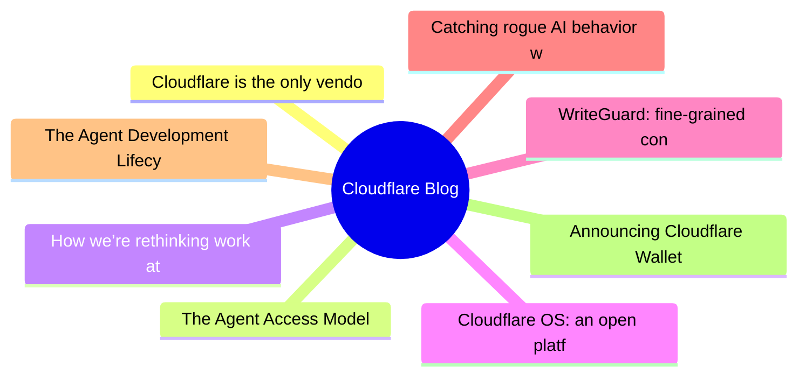
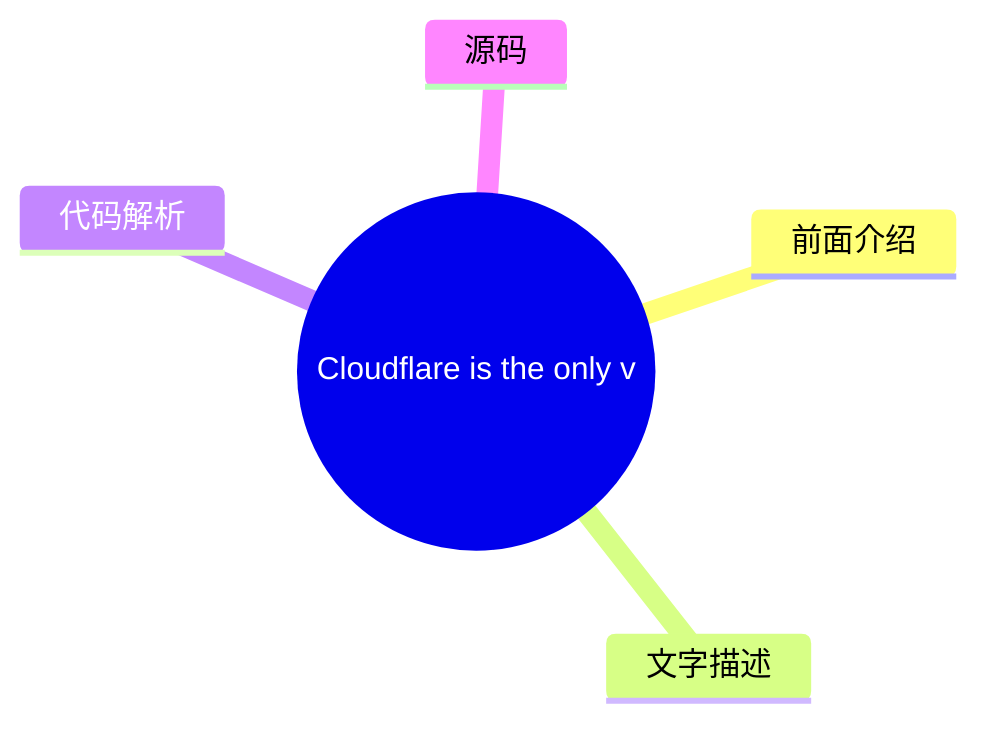
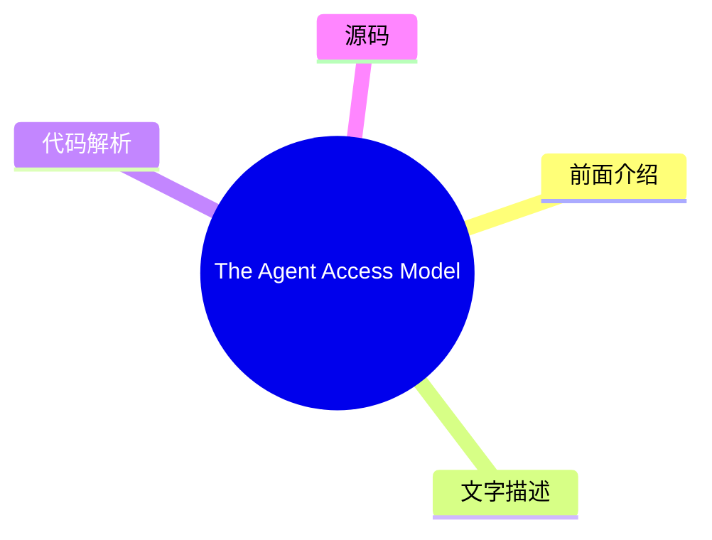
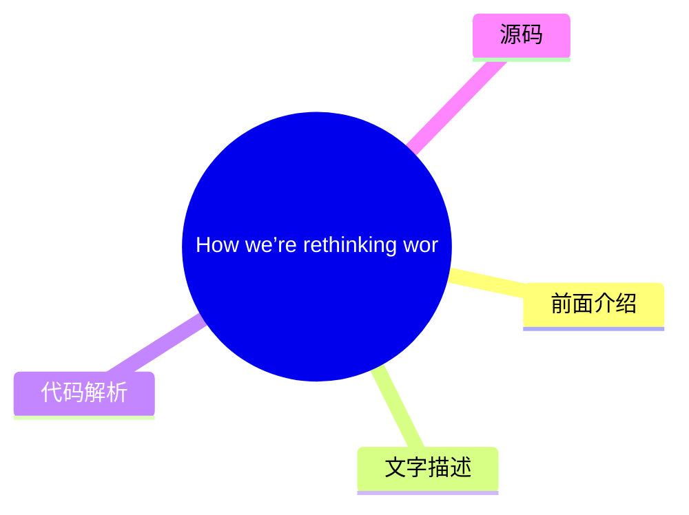
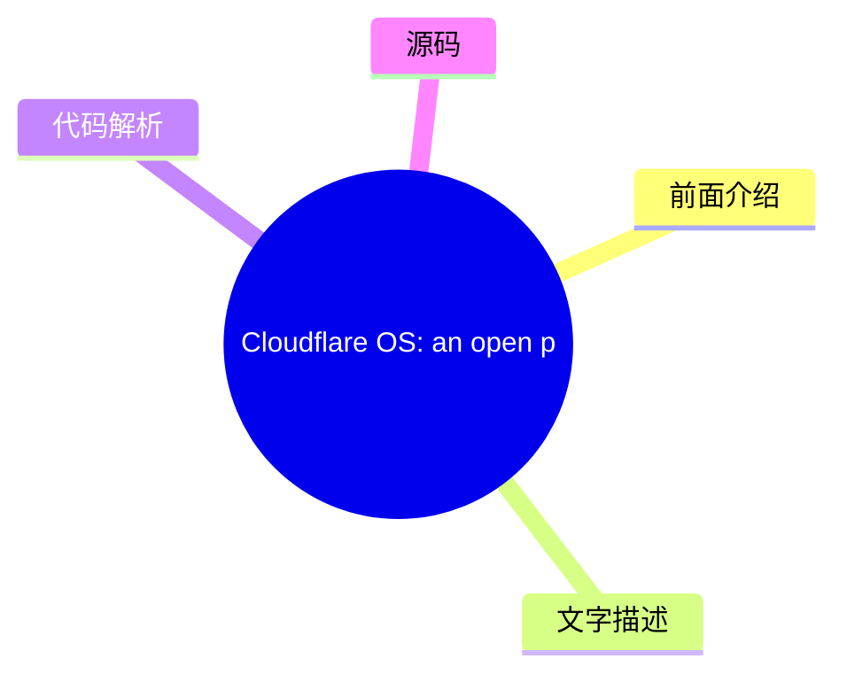
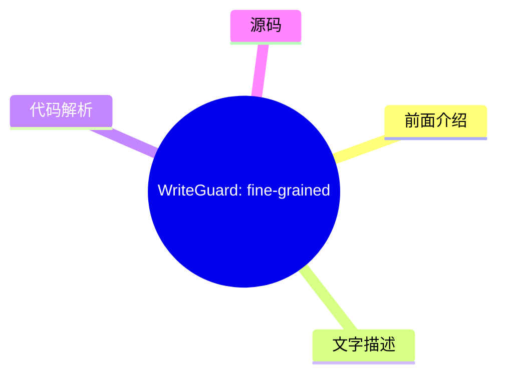
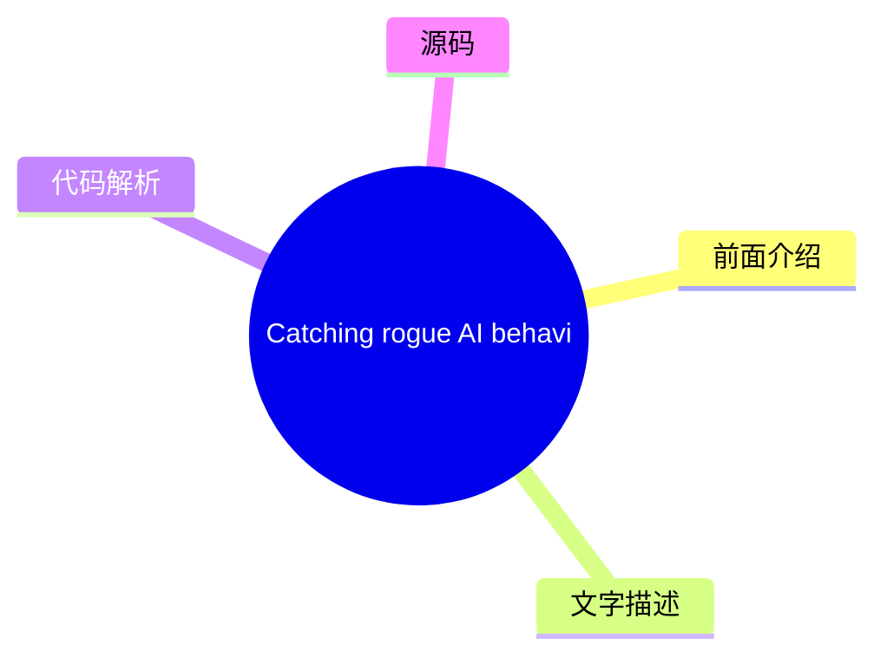
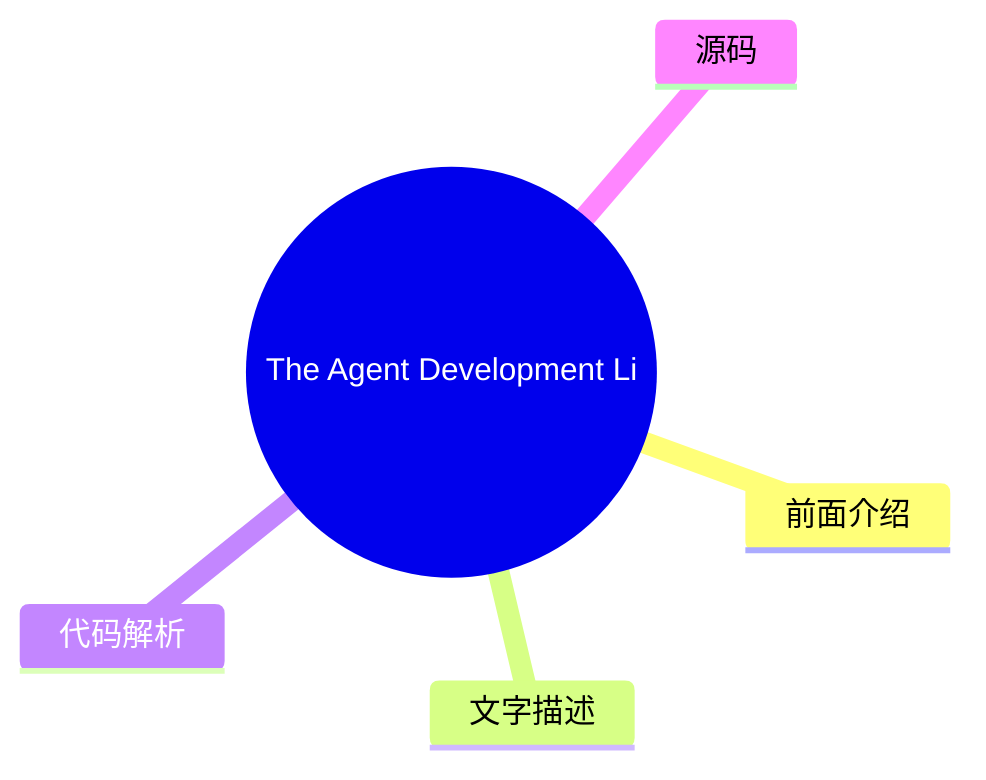
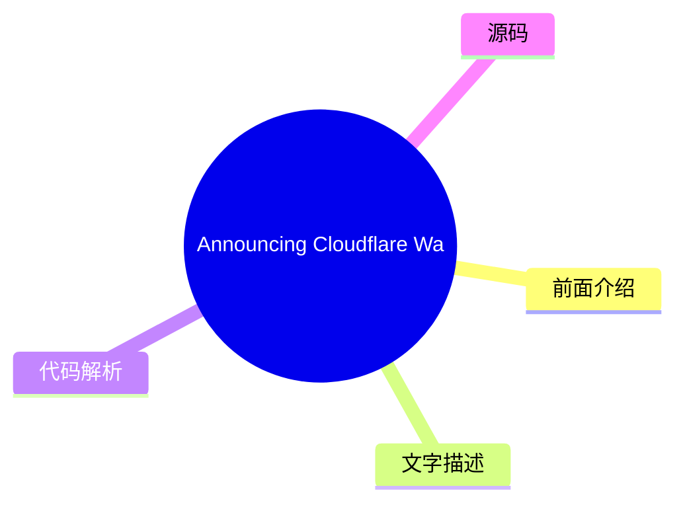

# ☁️ Cloudflare Blog Top 8 (2026-08-06)

## 前面介绍

- 数据源：Cloudflare Blog
- 抓取日期：2026-08-06
- 条目数：8
- 含完整正文：8
- 含代码片段：3
- 组织方式：前面介绍 / 树状图 / 文字描述 / 代码解析 / 源码

## 思维导图



## 详细整理（8 条，8 条含全文，3 条含代码）

### 1. Cloudflare is the only vendor named a Visionary in 2026 SASE and SSE reports
- **链接**: [https://blog.cloudflare.com/cloudflare-sase-sse-gartner-magic-quadrants-2026/](https://blog.cloudflare.com/cloudflare-sase-sse-gartner-magic-quadrants-2026/)
- **作者**: Michael Keane
- **发布**: Wed, 05 Aug 2026 23:24:51 GMT

#### 前面介绍

- We're honored to announce that Cloudflare is the only vendor that has been recognized as a Visionary in both the 2026 Gartner® Magic Quadrant™ for SASE Platforms and the 2026 Gartner® Magic Quadrant™ for Security Service Edge reports.
- 作者：Michael Keane
- 发布时间：Wed, 05 Aug 2026 23:24:51 GMT

#### 树状图



#### 文字描述

- We're honored to announce that Cloudflare is the only vendor that has been recognized as a Visionary in both the 2026 [ Gartner® Magic Quadrant⢠for SASE Platforms](https://www.cloudflare.com/lp/gartner-magic-quadrant-sase-platforms-2026/) and the 2026 [reports. To us, this validates our architectural choices and, more importantly, reflects the trust our customers place in us
- ## The market gap and where SASE is heading next Itâs no secret that most SASE vendors haven't adapted to the architectural realities of modern enterprises. In fact, when customers migrate to Cloudflare, we hear some of the exact same challenges time and time again: **Fragmented architectures:** When SASE platforms are stitched together through mergers and acquisitions, deployi
- ## Technological pressures reshaping SASE We believe the SASE platforms of tomorrow will need to be much more than bundled security and connectivity. Over the coming year, four major technological shifts will force SASE to evolve into a highly agile governance layer: **Securing the "vibe-coded" app explosion:** AI has made it easier than ever for employees to spin up internal t
- ## Why Cloudflare stands out If there is one thing that defines Cloudflareâs edge in the SASE market, itâs our architecture. Many legacy SASE solutions are patchworks of disparate technologies stitched together. Cloudflare took a different route and built a unified platform from the ground up. This clean, composable design gives our customers three massive advantages:

#### 代码解析

- 本文未检测到明确代码块，内容更偏新闻、观点或方法论。

#### 源码

#### 中文节选

We're honored to announce that Cloudflare is the only vendor that has been recognized as a Visionary in both the 2026 [ Gartner® Magic Quadrant⢠for SASE Platforms](https://www.cloudflare.com/lp/gartner-magic-quadrant-sase-platforms-2026/) and the 2026 

[reports. To us, this validates our architectural choices and, more importantly, reflects the trust our customers place in us to navigate an increasingly complex security landscape.](https://www.cloudflare.com/lp/gartner-magic-quadrant-sse-2026/)

__Gartner® Magic Quadrant⢠for Security Service Edge__To every customer who shared feedback with Gartner, discussed your roadmap challenges with our team, and pushed us to build better solutions: thank you. This recognition belongs to you as much as it does to us.

The [ SASE](https://www.cloudflare.com/learning/access-management/what-is-sase/) (Secure Access Service Edge) and SSE (Security Service Edge) markets are at an inflection point. Many organizations started with the SSE as the âsecurity halfâ of SASE to tackle their remote work challenges during the pandemic. More recently, SASE has grown more prominent given the rise in return-to-office work mandates. Now, as AI agents, post-quantum threats, and the sprawl of shadow apps reshape enterprise security, organizations need platforms that can adapt at the speed of change, not vendors locked into yesterday's architecture. Thatâs exactly where Cloudflare One, our agile SASE platform, comes in.

## The market gap and where SASE is heading next

Itâs no secret that most SASE vendors haven't adapted to the architectural realities of modern enterprises. In fact, when customers migrate to Cloudflare, we hear some of the exact same challenges time and time again:

**Fragmented architectures:** When SASE platforms are stitched together through mergers and acquisitions, deploying use cases across multiple products becomes a massive headache. Cloudflare mitigates these implementation nightmares and security gaps with a [ connectivity cloud](https://www.cloudflare.com/learning/cloud/what-is-a-connectivity-cloud/) approach: one global network that connects and protects your workforce, AI agents, and infrastructure.


**Unmanaged AI agents:** The market rushed to secure human GenAI prompts, leaving AI agents largely ungoverned. Cloudflare was the first SASE platform to [ rein in MCP server sprawl](https://blog.cloudflare.com/zero-trust-mcp-server-portals/), natively governing AI agents and human users together for total visibility. The interaction between our SASE and AI Gateway also lets admins cap AI inference costs per user, team, or application to prevent runaway bills. This is especially important when employees can rack up thousands of dollars in queries without realizing it. 

**Theoretical post-quantum security:** While other vendors discuss post-quantum cryptography in theory, we built it into our fabric. We were the first SASE platform to [ deploy post-quantum encryption across all major on- and off

#### 完整正文（中文）

我们很荣幸地宣布，Cloudflare 是唯一一家在 2026 年 [ Gartner® Magic Quadrant™ for SASE Platforms](https://www.cloudflare.com/lp/gartner-magic-quadrant-sase-platforms-2026/) 和 2026 年 [报告](https://www.cloudflare.com/lp/gartner-magic-quadrant-sse-2026/) 中均被评为“远见者”的供应商。对我们而言，这验证了我们的架构选择，更重要的是，它反映了我们的客户对我们驾驭日益复杂的安全环境的信任。

__Gartner® Magic Quadrant™ for Security Service Edge__ 致每一位向 Gartner 提供反馈、与我们的团队讨论路线图挑战并推动我们构建更好解决方案的客户：谢谢你们。这份荣誉属于你们，也属于我们。

[ SASE](https://www.cloudflare.com/learning/access-management/what-is-sase/)（安全访问服务边缘）和 SSE（安全服务边缘）市场正处于一个转折点。许多组织在疫情期间从 SSE 开始，将其作为 SASE 的“安全半边”，以应对远程工作的挑战。最近，随着重返办公室工作指令的增加，SASE 变得更加突出。如今，随着 AI 代理、后量子威胁和影子应用的激增重塑企业安全，组织需要能够以变化的速度适应的平台，而不是被锁定在昨日架构中的供应商。这正是我们的敏捷 SASE 平台 Cloudflare One 发挥作用的地方。

## 市场空白与 SASE 的下一步走向

大多数 SASE 供应商尚未适应现代企业的架构现实，这已不是什么秘密。事实上，当客户迁移到 Cloudflare 时，我们反复听到一些完全相同的问题：

**碎片化的架构：** 当 SASE 平台通过并购拼凑在一起时，在多个产品上部署用例会变成一个巨大的头疼问题。Cloudflare 通过 [连接云](https://www.cloudflare.com/learning/cloud/what-is-a-connectivity-cloud/) 方法缓解了这些实施噩梦和安全漏洞：一个连接并保护您的工作人员、AI 代理和基础设施的全球网络。

**Unmanaged AI agents:** The market rushed to secure human GenAI prompts, leaving AI agents largely ungoverned. Cloudflare was the first SASE platform to [ rein in MCP server sprawl](https://blog.cloudflare.com/zero-trust-mcp-server-portals/), natively governing AI agents and human users together for total visibility. The interaction between our SASE and AI Gateway also lets admins cap AI inference costs per user, team, or application to prevent runaway bills. This is especially important when employees can rack up thousands of dollars in queries without realizing it. 

**Theoretical post-quantum security:** While other vendors discuss post-quantum cryptography in theory, we built it into our fabric. We were the first SASE platform to [ deploy post-quantum encryption across all major on- and off-ramps](https://blog.cloudflare.com/post-quantum-sase/), and weâre neutralizing "harvest-now, decrypt-later" threats for regulated industries right now.

**Nickel-and-dime pricing:** Legacy vendors have a bad habit of turning advanced capabilities into expensive add-ons, or double-charging for remote and office work. Cloudflare delivers predictable, value-driven [ SASE bundles](https://www.cloudflare.com/plans/enterprise/interna/) designed for holistic adoption, with no hidden fees.

## Technological pressures reshaping SASE

We believe the SASE platforms of tomorrow will need to be much more than bundled security and connectivity. Over the coming year, four major technological shifts will force SASE to evolve into a highly agile governance layer:

**Securing the "vibe-coded" app explosion:** AI has made it easier than ever for employees to spin up internal tools with zero IT oversight. This shadow IT sprawl requires a secure-by-default posture. SASE platforms must automatically wrap these citizen-developed apps in zero trust access, WAF, API protection, and data loss prevention (DLP), safeguarding sensitive AI prompts without slowing builders down.


**Reining in AI agents:** Traditional SASE tracks human behavior, but the future is autonomous. As we shift to agentic operations, SASE must issue strict, highly scoped credentials for specific bot tasks rather than inheriting broad human permissions. Adaptive access also has to get smarter, analyzing agent intent and baselining tool-call volumes to catch anomalies instantly.

**Delivering post-quantum agility today:** Quantum computing is accelerating, meaning organizations must protect against "harvest-now, decrypt-later" attacks right now. The market demands native post-quantum encryption that can adapt as NIST standards finalize. By 2028, Cloudflare targets delivering the first fully quantum-secure SASE platform, [ including post-quantum authentication](https://blog.cloudflare.com/post-quantum-roadmap/#cloudflares-roadmap-to-full-post-quantum-security), years ahead of the 2030 National Institute of Standards and Technology (NIST) mandate, with no impact on user experience.

**Deeper architectural consolidation:** Deployment fatigue is real, and CIOs are tired of hollow "platformization" pitches. Genuine consolidation only happens on a single codebase with truly unified control, data, and infrastructure planes. To move at the speed of AI, composability and programmability have to be an architectural reality, not a marketing slogan.

These aren't just predictions for the future. They're the realities our customers are facing today, and the exact roadmap we are building together.

## Why Cloudflare stands out

If there is one thing that defines Cloudflareâs edge in the SASE market, itâs our architecture. Many legacy SASE solutions are patchworks of disparate technologies stitched together. Cloudflare took a different route and built a unified platform from the ground up. This clean, composable design gives our customers three massive advantages:

### The fast path to safe AI adoption


The rest of the market has largely treated AI security as just another bolted-on feature. But because Cloudflare shares a single architecture across our entire global network, we can rapidly roll out new security tools within our SASE platform without waiting for product integration cycles or vendor roadmaps to align.

Thanks to our composable design, your administrators can easily extend coverage using familiar SASE policies, while also keeping costs under control. Securing human GenAI prompts or governing an AI agent's connections to an MCP server happens in the same policy language they use every day. Itâs not an add-on module with its own learning curve; itâs built right in.

Whenever your developers build a new AI assistant, or your finance team starts using an AI-powered forecasting tool, Cloudflare's zero trust policies are already there. You never have to retrofit security. You just apply the framework you already rely on.

### SASE thatâs actually easy to use

First-generation SASE platforms have a bad habit of routing traffic through multiple disjointed inspection points. The result? Complicated deployments, blown timelines, and delayed success. "Single-vendor SASE" has historically been a great pitch on a slide deck, while in reality, customers are stuck managing stitched-together engines under the hood.

Cloudflareâs composability fixes this by delivering an exceptionally intuitive SASE experience. Our architecture is unified by design; every service runs on every server across our entire network. That means no traffic tromboning between specialized appliances, no more capacity planning across siloed products, and no hidden complexity.

By operating like a modern SaaS platform, we are designed for teams to intuitively deploy new use cases in days and weeks, rather than months and years. Need to extend zero trust access to a new app, add DLP to your Gateway traffic, or bring a new office location online? Cloudflare responds at the speed of configuration.

### Truly programmable SASE


Too often, the industry waters down the word "programmable" to mean simple automation, like GUI workflows or basic APIs on top of rigid logic. The result is that most SASE platforms feel like black boxes that force you to work around your vendor's limitations.

We built a truly composable, programmable SASE platform that runs natively with our edge developer platform, empowering you to weave custom code directly into our SASE fabric. Want to enrich access decisions using real-time signals from niche, internal tools? Building a custom workflow to route traffic based on a unique application context?

By integrating Cloudflare Workers into our SASE stack, customers can solve sophisticated, highly specific edge cases, without requiring custom feature development that would add bloat and reduce usability for everyone else. It's a level of flexibility legacy architectures just can't offer, and thanks to AI code generation, it's never been easier to implement.

## Looking ahead

This recognition from Gartner is a fantastic milestone for us, but we're already focused on the road ahead. Our promise to you hasn't changed: we will keep listening to your feedback, building the primitives that help you adapt, and delivering a platform that gets easier to use even as your challenges grow more complex. To us, agile SASE means enabling our customers to confidently respond to whatever tomorrow brings.

Whether you're actively evaluating SASE platforms or just trying to navigate the shifts we've discussed, we'd love to connect. Download the full Gartner reports (for [ SASE](https://www.cloudflare.com/lp/gartner-magic-quadrant-sase-platforms-2026/) or 

[, or both), take a closer look at](https://www.cloudflare.com/lp/gartner-magic-quadrant-sse-2026/)

__SSE__[, or](https://developers.cloudflare.com/cloudflare-one/)

__Cloudflare One__[to our team directly.](https://www.cloudflare.com/contact/sase/)

__reach out__*Gartner, Magic Quadrant for SASE Platforms, Analyst(s): Jonathan Forest, Andrew Lerner, John Watts, July 28, 2026*

*Gartner, Magic Quadrant for Security Service Edge, Analyst(s): John Watts, Thomas Lintemuth, Theo de Feligonde, Jonathan Forest, July 29, 2026*


*Gartner and Magic Quadrant are trademarks of Gartner, Inc. and/or its affiliates.*

*Gartner does not endorse any company, vendor, product or service depicted in its publications, and does not advise technology users to select only those vendors with the highest ratings or other designation. Gartner publications consist of the opinions of Gartnerâs business and technology insights organization and should not be construed as statements of fact. Gartner disclaims all warranties, expressed or implied, with respect to this publication, including any warranties of merchantability or fitness for a particular purpose.*


### 2. The Agent Access Model
- **链接**: [https://blog.cloudflare.com/the-agent-access-model/](https://blog.cloudflare.com/the-agent-access-model/)
- **作者**: Matt Silverlock
- **发布**: Wed, 05 Aug 2026 13:00:41 GMT

#### 前面介绍

- The Agent Access Model proposes a new architecture to secure task-scoped agents using strict identity brokering, continuous mediation, and stateful trust.
- 作者：Matt Silverlock
- 发布时间：Wed, 05 Aug 2026 13:00:41 GMT

#### 树状图



#### 文字描述

- For the last twelve years, enterprise security has moved away from trusting the network. BeyondCorp made the case that a request's origin, inside the corporate perimeter or on the open Internet, should not decide whether it is allowed. Identity and device health should. That model won: it now underpins much of Zero Trust. Googleâs BeyondCorp assumed a specific principal: a huma
- ## The shift A decade ago, the hard question in enterprise security was *where is this request coming from, and do I trust that place?* BeyondCorp's answer was that you should not trust the place at all. You authenticate the user, interrogate the device, and make an access decision for that specific request. Location became one signal among many, not a verdict. That reframing w
- ## Why the human model does not transfer Agents look like service accounts or very fast users. Four properties make both sets of controls a poor fit. **Agents are ephemeral. Credentials are durable.** Service accounts were designed for long-lived software: a payroll system, a nightly batch job. They often come with long-lived keys, broad scopes, and rare rotation. Applied to sh
- ## The Agent Access Model The Agent Access Model starts with one rule: **Do not trust the run. Authorize every action against the task and its accumulated state.** BeyondCorp removed implicit trust from the *network*. AAM removes implicit trust from the *task execution graph*. Authorization for one action does not carry over to the next. Every action is evaluated against three 

#### 代码解析

- 本文未检测到明确代码块，内容更偏新闻、观点或方法论。

#### 源码

#### 中文节选

For the last twelve years, enterprise security has moved away from trusting the network. BeyondCorp made the case that a request's origin, inside the corporate perimeter or on the open Internet, should not decide whether it is allowed. Identity and device health should. That model won: it now underpins much of Zero Trust.

Googleâs BeyondCorp assumed a specific principal: a human at a device, acting at human speed. Organizations are now deploying *agents*, software principals that reason, act, and reach into systems on our behalf. A task-scoped agent run is ephemeral. It ends when its work is done. A long-lived agent service may handle many such tasks and move data far faster than a person.

The controls we built for humans do not fail loudly when we point them at agents. They fail quietly, by granting too much, seeing too little, and trusting for too long.

This paper proposes an access model for agents: the **Agent Access Model (AAM)**. We describe the model and show how its components can be built. We then walk through a concrete example and separate the single-principal controls available today from the harder problem of **multiplayer access control**.

Much of the current work tries to make each access decision smarter. AAM takes a different approach: make the agent's capability smaller, so there is less to judge in the first place.

## The shift

A decade ago, the hard question in enterprise security was *where is this request coming from, and do I trust that place?* BeyondCorp's answer was that you should not trust the place at all. You authenticate the user, interrogate the device, and make an access decision for that specific request. Location became one signal among many, not a verdict.

That reframing worked because the principal was legible. A human logs in each morning, carries a device or two, works at human speed, and generates a trickle of access decisions a system can reason about. We built an entire industry around that shape of principal: single sign-on, device posture, conditional access, session risk scoring.

Agents do not have that shape.


一个代理服务可能运行许多任务。在本论文中，代理是指一个任务范围的运行。我们使用 **任务执行图** 来处理属于该运行的所有工作，并受相同的能力上限和信任级别约束。同一个工具解决不同的任务、消耗不同的事件，或在明天的计划上运行，都会创建一个新的图。一条单一的人类指令（*合并这两个账本*、*处理过夜的警报*、*打开一个修复此错误的拉取请求*）可以调度一个或多个此类任务。每个任务可能需要访问数据库、源代码控制、日志、票务系统、知识库、文档或电子表格。该任务可能需要广泛的访问权限。它需要立即获得权限，仅针对此任务，并且理想情况下不应多一秒钟。

代理必须拥有足够的权限来完成其任务，且不能更多。最小权限原则与访问控制一样古老。变化的是强制执行的快速和频繁程度。

#### 完整正文（中文）

For the last twelve years, enterprise security has moved away from trusting the network. BeyondCorp made the case that a request's origin, inside the corporate perimeter or on the open Internet, should not decide whether it is allowed. Identity and device health should. That model won: it now underpins much of Zero Trust.

Googleâs BeyondCorp assumed a specific principal: a human at a device, acting at human speed. Organizations are now deploying *agents*, software principals that reason, act, and reach into systems on our behalf. A task-scoped agent run is ephemeral. It ends when its work is done. A long-lived agent service may handle many such tasks and move data far faster than a person.

The controls we built for humans do not fail loudly when we point them at agents. They fail quietly, by granting too much, seeing too little, and trusting for too long.

This paper proposes an access model for agents: the **Agent Access Model (AAM)**. We describe the model and show how its components can be built. We then walk through a concrete example and separate the single-principal controls available today from the harder problem of **multiplayer access control**.

Much of the current work tries to make each access decision smarter. AAM takes a different approach: make the agent's capability smaller, so there is less to judge in the first place.

## The shift

A decade ago, the hard question in enterprise security was *where is this request coming from, and do I trust that place?* BeyondCorp's answer was that you should not trust the place at all. You authenticate the user, interrogate the device, and make an access decision for that specific request. Location became one signal among many, not a verdict.

That reframing worked because the principal was legible. A human logs in each morning, carries a device or two, works at human speed, and generates a trickle of access decisions a system can reason about. We built an entire industry around that shape of principal: single sign-on, device posture, conditional access, session risk scoring.

Agents do not have that shape.


An agent service may run many tasks. In this paper, an agent is one task-scoped run. We use **task execution graph** for all work belonging to that run and governed by the same capability ceiling and trust level. The same harness solving a different task, consuming a different event, or running on tomorrow's schedule creates a new graph. A single human instruction (*reconcile these two ledgers*, *triage the overnight alerts*, *open a pull request that fixes this bug*) can dispatch one or more such tasks. Each may need to reach databases, source control, logs, ticketing systems, knowledge bases, documents, or spreadsheets. The task may need broad access. It needs it now, for this task, and ideally not one second longer.

An agent must have enough authority to complete its task and no more. Least privilege is as old as access control. What changes is how quickly and often it must be enforced. For a workforce of humans, least privilege is often a policy reviewed every quarter. For large populations of short-lived agents, it is a system that runs in real time and leaves an audit trail.

## Why the human model does not transfer

Agents look like service accounts or very fast users. Four properties make both sets of controls a poor fit.

**Agents are ephemeral. Credentials are durable.** Service accounts were designed for long-lived software: a payroll system, a nightly batch job. They often come with long-lived keys, broad scopes, and rare rotation. Applied to short-lived agents, those credentials outlive the work they were issued for and remain in memory, logs, or environment variables where they can be replayed. The lifetime of the credential should match the lifetime of the task. For an agent, that is often minutes.

**Agents act at machine speed.** Anomaly detection, rate limits, and data-loss controls tuned for human activity may react too slowly. An agent with a database connection and an outbound network path can read a table and POST it to an external endpoint before a human-tuned control has finished sampling. Preventive controls therefore have to run inline, at the point of action.


**提示词不是边界。** 团队通常会告诉代理“不要访问生产环境”或“永远不要向第三方发送数据”。这些指令有助于塑造行为，但它们无法强制执行访问权限。模型可能会被注入到其读取的数据中的内容所操纵，或者自行产生不安全的操作。推断出的意图可以用于辅助风险决策，但攻击者可以通过相同的文本来操纵该信号。强制执行机制应属于中介工具调用的框架以及中介数据包的网络层。你可以通过言语绕过的边界，并非真正的边界。

**代理跨越多个跳点组合权限。** 代理可以调用一个工具，该工具再调用另一个代理，后者代表原始人类调用 API。在这个链路的某处，关于“这是给谁用的，以及他们被允许做什么”的答案可能会消失。现有的原语在处理单次委托跳点时，比处理多次跳点或涉及多个人类的情况要更好。

## 代理访问模型

代理访问模型始于一条规则：**不要信任运行过程。针对任务及其累积状态来授权每一个操作。**

BeyondCorp 从*网络*中移除了隐式信任。AAM 从*任务执行图*中移除了隐式信任。对一个操作的授权不会延续到下一个操作。每一个操作都根据三件事进行评估：代理是谁、它被授权执行什么任务，以及图已经接触了哪些与策略相关的资源。该累积状态只能减少图剩余的能力。

Google 的 *Beyond Zero* 采取了同样的开局策略：将信任边界从应用程序缩小到单个操作，并以机器速度做出决策。Beyond Zero 在每个授权决策背后放置了一个推理引擎。AAM 限定了该引擎必须判断的能力集。这两种方法可以结合使用。对于跨越声明的中介边界的操作，AAM 会记录每个授权决策背后的代理、主体和任务。

AAM 有五项原则。

1. **Credentials are short-lived and bound.** An agent receives a credential minted for the task and expiring with it. Tokens are sender-constrained, so a stolen token alone cannot be replayed without the harness-held proof key.

2. **Enforcement lives in the harness and the network, not the prompt.** Policy is applied where tool calls and network requests actually happen. The prompt is where you express intent. It is never where you enforce a boundary.

3. **Human oversight is exceptional.** Approvals are reserved for decisions that warrant them.  A person to approve every step creates fatigue and reflexive clicking.

4. **Grants are reviewed from evidence.** Directly captured activity can show where a task template is too broad or too narrow. The system proposes a change for review, and an approved change applies to future tasks. It never widens the active task.

5. **Capability state moves in one direction.** When a declared protected event occurs, the Trust Ratchet removes capabilities across the task execution graph according to policy. Authority removed by the Trust Ratchet returns only in a newly authorized task.

## A reference architecture

The architecture has four active controls and two supporting systems. The active controls govern the task. The Agent Activity Log and Grant Review Loop operate on the evidence it leaves behind. AAM defines how these pieces fit together and what each one must guarantee. This is a reference architecture, not a wire-level specification.

### 4.1 The Agent Identity Broker

At dispatch, the **Agent Identity Broker** issues a short-lived, verifiable credential scoped to the task. That credential expires no later than the task ends.

The credential is *task-scoped*: it encodes "this is agent X, acting for principal H, to do task T." It is also *sender-constrained*, bound to a proof key held by the harness. A leaked token alone cannot be replayed without that key, and the model never receives it.


Existing standards provide both primitives. **OAuth 2.0 Token Exchange (RFC 8693)** defines an exchange through a Security Token Service and can produce a token narrowed by audience, resource, or scope. The authorization server's policy determines what it issues. The token's `act` claim identifies the current actor, while nested `act` claims can retain prior actors for attribution. **DPoP (RFC 9449)** binds an OAuth token to a client key and requires proof on each protected request. That proof covers the HTTP method and target URI, but not the request body, query parameters, or tool arguments. The harness must therefore authorize an immutable request representation and execute that same request.

Neither standard defines AAM's task template, Trust Ratchet state, or cross-layer enforcement. AAuth draft 09 addresses agent-to-resource identity and authorization, including per-instance identity, optional missions, tool permissions, audit, and asynchronous authorization. It could realize part of this model and remains a work in progress. AAM depends on four properties of the credential: it is short-lived, task-scoped, sender-constrained, and attributable. It does not depend on one protocol winning.

### 4.2 The Task-Scoped Access Engine

The credential establishes who the agent is and which task it is performing. The **Task-Scoped Access Engine** decides, per request, whether *this* identity may perform *this* action against *this* resource. It extends BeyondCorp's Access Control Engine by making the task itself a first-class input to the decision.

Its job is to make least privilege both the default and the ceiling. A task grant might read: "agent X, for task T, may read tables A, B, and C for the next ten minutes." That is the envelope. Undeclared actions are denied.


Where does the envelope come from? A task's scope is declared when the agent is dispatched, not negotiated by the agent at runtime. In the common case, a human or a system acting on a human's standing authority defines a task template once: "Reconciliation may read these three tables and post to this channel." Each dispatch instantiates it. Templates are the unit of configuration, so the number of policies tracks the number of distinct tasks rather than the number of runs. At dispatch, the Access Engine intersects the approved template with the authority of the initiating principal and agent service, then applies resource-owner and tenant policy. That intersection is the task's capability ceiling. The agent can ask for less, and the Trust Ratchet can remove capabilities. Broader authority requires a newly authorized task.

For each action, the adapter constructs and freezes the complete request representation, including the operation, resource, arguments that affect scope, tenant, and recipient. The Access Engine authorizes that representation against the current capability ceiling, and the adapter executes the same representation. Credential renewal revalidates the original ceiling and current Trust Ratchet state. It cannot restore a removed capability or extend the maximum task lifetime.

### 4.3 The Mediation Layer (harness and network)

The **Mediation Layer** governs two boundaries: the tool paths exposed by the harness and outbound traffic forced through the deployment's network boundary.

The first is the harness, the runtime that brokers the agent's tool calls. It intercepts calls through declared tool paths, checks them against task policy, and emits enforcement events, subject to the collection gaps described in Section 4.6. The harness can distinguish a read from an update and constrain the arguments that affect scope. MCP standardizes requests over defined transports and supplies an OAuth resource-server boundary for HTTP transports. Its aut

...（截断，原文 33810+ 字符）


### 3. How we’re rethinking work at Cloudflare with Cloudflare OS
- **链接**: [https://blog.cloudflare.com/how-we-use-ai-with-cloudflare-os/](https://blog.cloudflare.com/how-we-use-ai-with-cloudflare-os/)
- **作者**: Sam Rhea
- **发布**: Wed, 05 Aug 2026 13:00:01 GMT

#### 前面介绍

- We built Cloudflare OS to equip our teams to safely rethink how they get work done with AI. The platform brings together the best of our technologies, from our Compute primitives to our Zero Trust suite. This post walks through our journey to give ou
- 作者：Sam Rhea
- 发布时间：Wed, 05 Aug 2026 13:00:01 GMT

#### 树状图



#### 文字描述

- *Sam Rhea is Cloudflareâs Chief Information Officer.* I knew we had a problem about six months ago when a member of our sales organization reached out to me asking for API keys. Keys plural. They used AI to build what they described as a SuperApp that would transform our go-to-market teams. All they needed was production access to about a dozen systems of record at Cloudflare a
- ## Set the ground rules We started by defining a set of principles around how this should work. Cloudflareâs CTO and I sat down in our office in Austin, Texas, and began to sketch out what needed to be true in how we adopted AI. We invited leaders from across the organization to give us feedback on the draft. The result became the guidelines below. **1) We use AI to spend more 
- ## Meet your users where they are With those rules in place, we got to work. We ran two parallel programs: the first for our engineering teams, and the second for every other type of work.
- ### Provide your engineers with guardrails AI tools took the work our engineers already did and made it faster â faster than our review process could keep up with. Anyone at Cloudflare could now write bad code, faster, thanks to AI. We needed better guardrails. So we built a context layer for engineering. We call it the Cloudflare Engineering Codex. A Codex is an authoritative 

#### 代码解析

- 本文未检测到明确代码块，内容更偏新闻、观点或方法论。

#### 源码

#### 中文节选

*Sam Rhea 是 Cloudflare 的首席信息官。*

大约六个月前，当我们的销售组织的一名成员联系我索要 API 密钥时，我就知道我们遇到了问题。密钥，复数形式。他们使用 AI 构建了一个他们所谓的 SuperApp，旨在改变我们的市场推广团队。他们只需要生产环境对 Cloudflare 大约十几个记录系统的访问权限，以及部署管道的管理员权限即可实现。

在 2025 年，我们对在 Cloudflare 推出 AI 采取了一种相当谨慎的方法。我们部署了信息聊天应用程序，并尝试使用 AI 来帮助编写一些样板代码，但我们认为该技术尚未准备好改变我们的工作方式。

然而，在去年年底的几天里，更好的模型和更强大的工具改变了这一算式。AI 代理能够**做**事情，而且能做得很好。Cloudflare 的数百名团队成员，无论在技术还是非技术岗位，都在新年前后那段相对安静的时期，尝试使用让构建变得前所未有的简单的全新工具。

那个构建 SuperApp 的销售团队成员，只是众多举手要求使用这些工具来改变工作方式的人中的第一个。我们有责任为他们配备并赋能，让他们能够这样做。但同时，我们也有责任确保我们的系统、内部数据和客户数据的安全。

过去几个月，我们一直在 Cloudflare 内部构建一个平台来实现这一目标。我们称之为 Cloudflare OS。我们首先将来自我们的开发者平台和零信任平台的现成组件拼接在一起，例如 Cloudflare [ Workers](https://www.cloudflare.com/products/workers/) 和 

[. 随着我们对这一挑战了解的深入，我们还创建了针对这种新工作方式量身定制的自定义服务。](https://www.cloudflare.com/sase/products/access/)

__Access__As with many of Cloudflareâs products, we set out to solve a problem we had internally. As it turns out, many of you had the same problem. Thatâs why today we are excited to share Cloudflare OS, the sum of what we have launched internally to give our own team members the ability to safely and productively use AI and deploy agents. You can read more about what is available right now in [ Phillipâs post here](http://blog.cloudflare.com/cloudflare-os).

In this post, I want to walk through our own internal journey that led to this release, both what has gone well and where we have fumbled. There are five sections: the principles we put in place to begin; how we piloted to figure out what the jobs were to be done; what we built for engineers, and for non-engineers; and how we created champions across the organization to help drive change.

During the last few months, I have felt like the luckiest CIO in the world as the team I support had access to these emerging technologies. Todayâs goal is to share that platform and its lessons with every team.

## Set the ground rules

We started by defining

#### 完整正文（中文）

*Sam Rhea 是 Cloudflare 的首席信息官。*

大约六个月前，当我们的销售组织的一名成员联系我索要 API 密钥时，我就知道我们遇到了问题。密钥，复数形式。他们使用 AI 构建了一个他们所谓的 SuperApp，旨在改变我们的市场推广团队。他们只需要生产环境对 Cloudflare 大约十几个记录系统的访问权限，以及部署管道的管理员权限即可实现。

在 2025 年，我们对在 Cloudflare 推出 AI 采取了一种相当谨慎的方法。我们部署了信息聊天应用程序，并尝试使用 AI 来帮助编写一些样板代码，但我们认为该技术尚未准备好改变我们的工作方式。

然而，在去年年底的几天里，更好的模型和更强大的工具改变了这一算式。AI 代理能够**做**事情，而且能做得很好。Cloudflare 的数百名团队成员，无论在技术还是非技术岗位，都在新年前后那段相对安静的时期，尝试使用让构建变得前所未有的简单的全新工具。

那个构建 SuperApp 的销售团队成员，只是众多举手要求使用这些工具来改变工作方式的人中的第一个。我们有责任为他们配备并赋能，让他们能够这样做。但同时，我们也有责任确保我们的系统、内部数据和客户数据的安全。

过去几个月，我们一直在 Cloudflare 内部构建一个平台来实现这一目标。我们称之为 Cloudflare OS。我们首先将来自我们的开发者平台和零信任平台的现成组件拼接在一起，例如 Cloudflare [ Workers](https://www.cloudflare.com/products/workers/) 和 

[. 随着我们对这一挑战了解的深入，我们还创建了针对这种新工作方式量身定制的自定义服务。](https://www.cloudflare.com/sase/products/access/)

__Access__As with many of Cloudflareâs products, we set out to solve a problem we had internally. As it turns out, many of you had the same problem. Thatâs why today we are excited to share Cloudflare OS, the sum of what we have launched internally to give our own team members the ability to safely and productively use AI and deploy agents. You can read more about what is available right now in [ Phillipâs post here](http://blog.cloudflare.com/cloudflare-os).

In this post, I want to walk through our own internal journey that led to this release, both what has gone well and where we have fumbled. There are five sections: the principles we put in place to begin; how we piloted to figure out what the jobs were to be done; what we built for engineers, and for non-engineers; and how we created champions across the organization to help drive change.

During the last few months, I have felt like the luckiest CIO in the world as the team I support had access to these emerging technologies. Todayâs goal is to share that platform and its lessons with every team.

## Set the ground rules

We started by defining a set of principles around how this should work. Cloudflareâs CTO and I sat down in our office in Austin, Texas, and began to sketch out what needed to be true in how we adopted AI. We invited leaders from across the organization to give us feedback on the draft. The result became the guidelines below.

**1) We use AI to spend more time with our customers and build technology to solve more of their problems.**

We do not want to use AI just for the sake of using AI. We push teams to start by defining their âjobs to be doneâ first, the pain points, bottlenecks, or missed opportunities that can improve how we serve our customers. Then we find the right tool.

**2) Everyone deserves superpowers.**

AI is very, very good at writing code. By extension, the first wave of AI tools that could take actions consisted of interfaces that developers already used: command lines, code editors, terminals, Git repositories.


These formats could leave behind large parts of our team. While we have a very technical and curious workforce, not every member of our team spends their day in developer tools. And we do not think they need to! We want our employees to bring their subject matter expertise and we would provide them with an intuitive platform they could use to rethink how we do work.

**3) The human owns the output.**

We view AI as a tool and toolmaker, not a team member. We expect humans to take responsibility for defining the quality, testing, and workflows that rely on AI output.

The rule extends to deploying agents, as well. The users and teams that ship agents are responsible for the output of those agents. Someone leaves? Their manager inherits the responsibility of their agents in the same way they inherit their other workflows.

**4) The context from the organization matters more than the model.**

The workflows and agents that we deploy at Cloudflare need to know about Cloudflare. The time we spent on the technology had to be paired with time invested in a curated, canonical context layer.

**5) You should never have more permission with systems of record when using AI.**

Everyone at Cloudflare has a scoped view into the underlying data at Cloudflare for good reason. We use our own products to segment data access by factors ranging from device to role to region. We also configure and monitor the controls inside our third party applications.

Those controls need to apply when I manage an AI agent that interacts with the same data. I should never have âmoreâ access to data when using an AI tool and my AI agents should only have access to exactly what they need, nothing more. And if I deploy an agent and share it with someone, the access the agent provides to them should reflect their permissions, not mine.

## Meet your users where they are

With those rules in place, we got to work. We ran two parallel programs: the first for our engineering teams, and the second for every other type of work.

### Provide your engineers with guardrails


AI tools took the work our engineers already did and made it faster â faster than our review process could keep up with. Anyone at Cloudflare could now write bad code, faster, thanks to AI. We needed better guardrails.

So we built a context layer for engineering. We call it the Cloudflare Engineering Codex. A Codex is an authoritative guide. Ours sets out the principles and practices we work by. Policies tell you what you can't do, whereas a Codex tells you what you should do. It is opinionated by design. Every part of our codebase has a domain owner accountable for what good looks like there.

We surfaced that context layer across the software development lifecycle. Agents use the Codex to help engineers plan work. One agent reviews every Merge Request against Codex requirements. Another reviews technical designs before implementation starts. A third reviews incident reports. In the past four months, those agents have flagged nearly a quarter of a million potential problems and blocked 16,000 merges. They have caught architectural issues in close to 600 designs before a line of code was written.

You can read in much greater detail about how we built this code review workflow in [ Timo's blog post on AI Code Review](http://blog.cloudflare.com/engineering-standards-enforcement). We are now shifting focus to giving engineers the tools to define the loops that evaluate the work their agents produce.

### Offer everyone a magic email alias

An early mistake we made was giving everyone outside of engineering the same tools with slightly friendlier user interfaces. Engineers could clone a code repository to their laptop, add a context file like [AGENTS.md](http://AGENTS.md), and point their harness at the work. However, the harnesses in the market map poorly to other types of knowledge work where users create one-off outputs and work on projects that involve dozens of systems of record.

If you give everyone a harness workspace that is great at writing code, youâll wind up with way more code than you need. The result became a flood of vibe coded apps looking for a problem to solve. So we worked backwards.


We told everyone at Cloudflare that they could send the work they did not want to do to a âmagic AI email botâ that would respond with the output they needed. Behind the scenes, a small team of people staffed this email alias using AI tools to do the work.

For some reason, people are less willing to send their vibe coding ideas to what they think is an automated system, but very willing to send the work they do not want to do. Over the course of hundreds and then thousands of sessions managing the email alias, we identified the mundane work that team members would like to automate.

We triaged these manually and over time we observed patterns. We created the skill and context files, mapped out the data connections, and defined the kinds of outputs users needed. With those in hand, we could automate some of the responses to this email alias.

We were very motivated to stop staffing this service. It was miserable. The long-term goal was to take these materials we had collated and create skills to address them, so that our users could solve their own problems. The manual work behind this email alias continued until we felt we had captured enough of the common âjobs to be doneâ at Cloudflare to give our teams a headstart on automation. Now we just needed to give them a platform where they could easily and safely run those workflows.

## Give team members a platform to solve problems

The first version of that platform, which we call Cloudflare OS, consisted of a simple harness running in a container on Cloudflareâs infrastructure. Users access it in a web browser and, once authenticated through [ Cloudflare Zero Trust](https://www.cloudflare.com/products/access/), they can run the skill files and workflows we started collecting during the magic email phase.

All of this happens inside of their browser, no local configuration required. Users could open their laptop and immediately be productive. We heard from new members of our sales team who, within days of starting, felt like they could automate work that would have taken them weeks to complete in their last workplace.


Users could also close their computer and get a coffee or use the bathroom while work happened. No more walking around the office with a laptop cracked open.

We think that cloud-based workspaces benefit more than just the user. An ephemeral cloud-based environment only has access to the data a user introduces into the session, rather than potentially everything on the laptop in front of you when you use a local harness. Our Security team has audit visibility and network control over the environment, including the ability to filter where on the Internet it can connect.

When a user needs to get work done, they begin by running skill files defined by common workflows we identified across departments. The companyâs accumulated context and skills we gathered during the magic email phase become executable with a single click.

A panel on the right-hand side would render the output of a given skill file, like a technical architecture document or a slide deck. Users could share the outputs with teammates.

We gave Cloudflare OS access to data by connecting systems of record through our [ Model Context Protocol (MCP) Portal](https://developers.cloudflare.com/cloudflare-one/access-controls/ai-controls/mcp-portals/). The MCP standard is a framework that defines how to connect your AI tools to systems of record in a way that tells the AI tool what data and operations are available. Following our rule around permissions, the access a user session has in Cloudflare OS is scoped to their existing permission set in a given system of record.

In most cases, we build and deploy our own implementation of an MCP server for each system of record, even when the system of record provides a native version. By building our own, we can add additional layers of 

...（截断，原文 18540+ 字符）


### 4. Cloudflare OS: an open platform for agents, apps, and work
- **链接**: [https://blog.cloudflare.com/cloudflare-os/](https://blog.cloudflare.com/cloudflare-os/)
- **作者**: Phillip Jones
- **发布**: Wed, 05 Aug 2026 13:00:00 GMT

#### 前面介绍

- Cloudflare OS is an open-source platform that lets everyone in your company build apps, automate work, and safely access internal systems, shaped around what your organization knows and how it operates
- 作者：Phillip Jones
- 发布时间：Wed, 05 Aug 2026 13:00:00 GMT

#### 树状图



#### 文字描述

- Every organization has a mission, a reason for being. Organizations pass that mission â along with their terminology, procedures, systems, standards, and ways of working â to their people. People, in turn, take this context together with their own experience and work towards the mission. Work can take many forms, from code, to documents and slides, to relationships, to outcomes
- ## What we learned from the first version The Cloudflare OS we are open sourcing today is based on what we learned from running the first version internally, a journey our CIO, Sam Rhea, covers in his [ blog post](https://blog.cloudflare.com/how-we-use-ai-with-cloudflare-os). The first version centered on individuals working with agents through private workspaces. Apps were sta
- ## Introducing Cloudflare OS Cloudflare OS starts with a conversation in your browser, like many other AI tools. What makes it different is that each conversation is grounded in the context and skills your organization has curated. Give your workspace a goal, and it can draw on that knowledge and work with the tools and data your organization already uses to achieve it. Cloudfl
- ## An agent workspace for everyone in your company Agent workspaces were designed for everyone in your organization to use. You interact with them in your browser, so you donât have to be a developer or know how to use a terminal. A workspace combines agent sessions, persistent state, outputs and files, resource access, and an isolated runtime where the agent can write and run

#### 代码解析

- `text`: 代码片段可作为实现参考，建议结合上下文确认输入输出和边界条件。

#### 源码

#### 源码片段 1（text）

```text
const issues = await env.PROJECT.listIssues({
  teamId: "ENG",
  state: "open",
});
```

#### 完整正文（中文）

Every organization has a mission, a reason for being. Organizations pass that mission â along with their terminology, procedures, systems, standards, and ways of working â to their people. People, in turn, take this context together with their own experience and work towards the mission.

Work can take many forms, from code, to documents and slides, to relationships, to outcomes in the physical world.

Some of these are straightforward: code either runs or it doesnât. Agents have been using this feedback loop to produce code that âworksâ for developers over the last couple of years. But what about the rest of us?

Bringing the same leverage to the rest of the organization is a harder problem. Agents need to understand the context of the company and be able to reach the systems people use to do their jobs. They need to turn that context and access into work that moves the organization towards its mission.

Thatâs why we created Cloudflare OS. It gives every person an agent and workspace built around their company: how it works, what it knows, and the systems it relies on.

In May of this year, we gave every person at Cloudflare access to the first version of Cloudflare OS. Thousands of people across every function, many of them outside of engineering, use it every day to create documents and slides, automate repeatable tasks, and build small apps to visualize data and help them do their work.

Cloudflare OS also gave everyone a shared library of context and skills built by teams at Cloudflare. It captures our terminology, procedures, and best-known ways of doing recurring work as instructions an agent can follow. When one person figures out a better way to do something, everyone else can use it.

**Today, we are open sourcing a new version of ** Any organization can deploy it, connect it to internal systems, and make it their own.

__Cloudflare OS__.

## What we learned from the first version

The Cloudflare OS we are open sourcing today is based on what we learned from running the first version internally, a journey our CIO, Sam Rhea, covers in his [ blog post](https://blog.cloudflare.com/how-we-use-ai-with-cloudflare-os).


The first version centered on individuals working with agents through private workspaces. Apps were static rather than live software connected to internal systems, and mostly deterministic jobs still required running an agent skill again and consuming more model tokens.

Collaboration exposed a more fundamental challenge. Access to an [ MCP server](https://www.cloudflare.com/learning/ai/what-is-model-context-protocol-mcp/) told us which tools an agent could call, but not which underlying resources the agent had observed. Once people began sharing workspaces, apps, and outputs, we needed to ensure that collaboration could not expose information someone was not permitted to see.

We rebuilt Cloudflare OS on a new foundation to solve these problems. Security had to be part of the platform, not something every person building an app or using an agent has to implement correctly.

The result is a platform designed to belong to the company running it. You can customize the interfaces, connect your tools, and add the skills and context that capture how your organization works.

## Introducing Cloudflare OS

Cloudflare OS starts with a conversation in your browser, like many other AI tools. What makes it different is that each conversation is grounded in the context and skills your organization has curated. Give your workspace a goal, and it can draw on that knowledge and work with the tools and data your organization already uses to achieve it.

Cloudflare OS combines three parts:

- **An agent workspace**grounded in context and skills your company curates, with an isolated runtime where agents can write and run code.
- **A new security and governance framework**for safe access to internal data and services.
- **A platform for personal, modifiable apps**that people can build, share, and continue changing.

What begins as a conversation can become a doc, an app, or a workflow that continues doing the work.

## An agent workspace for everyone in your company

Agent workspaces were designed for everyone in your organization to use. You interact with them in your browser, so you donât have to be a developer or know how to use a terminal.Â


工作区结合了代理会话、持久化状态、输出和文件、资源访问以及一个隔离的运行时环境，代理可以在其中编写和运行代码。

它们预装了您的团队或公司收集的精选上下文和技能。对于每项任务，不再需要重新发明轮子——如果团队中的某个人找到了完成某项任务的最佳方法，每个人都能从中受益。人们不再需要在每次开始任务时，向模型解释相同的过程、术语和最佳实践。

您可以执行以下操作：

### 研究和提问

让工作区使用公司上下文和您提供给它的资源来研究某个主题。代理可以编写代码来搜索、过滤、连接和分析信息，而不是将整个数据集拉取到模型的上下文窗口中。

### 创建文档、幻灯片和电子表格

工作区可以将研究内容转换为文档、演示文稿或电子表格，您可以继续对其进行编辑。这些输出不必是静态文件。它们可以保持与实时数据的连接，在源数据发生变化时进行更新，并仍然可以导出为熟悉的格式或服务，例如 Google Drive。

### 为您的团队创建协作、连接的应用

当文档或电子表格不够用时，代理可以构建一个具有自己的界面、逻辑和状态的应用程序。该应用可以使用连接的公司资源，并支持多人协作。

### 运行确定性工作流

并非每项工作都需要完整的代理会话。许多工作是由已知的一系列步骤组成的，其中只有一两个地方需要判断力。工作区可以将这些工作转换为主要是确定性工作流，对可预测的步骤使用代码，仅在能增加价值的地方使用模型。工作流可以按需运行、按计划运行，或在连接的系统发生事件时运行。

Cloudflare OS 通过 Gatekeepers（更多内容请参见下方的安全部分）赋予代理和应用程序对记录系统的受管访问权限。它还支持您组织已使用的现有 [模型上下文协议 (MCP)](https://modelcontextprotocol.io/docs/2026-07-28/getting-started/intro) 服务器，通过

[.](https://developers.cloudflare.com/cloudflare-one/access-controls/ai-controls/mcp-portals/)

__MCP Server Portals__## A new security and governance framework for safe access to internal data and services

As people begin experimenting with AI at work, one of their first requests is often for API keys to company systems. This makes sense: AI isnât much use at work if it doesnât have access to the systems people use to do their jobs.

But handing over API keys to people and agents is dangerous and does not scale. Keys often provide broad, long-lived access that is difficult to constrain, share safely, and audit.

MCP gives agents a better way to use these systems. An MCP server can hold the credential and expose a defined set of tools instead of handing the key directly to the agent. But controlling which tools an agent can call is only the first step. MCP alone does not tell us which underlying resources an agent has observed. The agent can combine information across systems, send it somewhere less restricted, or expose it through apps and outputs to people who may not be allowed to see the original resources. Authorization has to account for where the data can go next.

### Agents start with no access

[ Cloudflare Access](https://developers.cloudflare.com/cloudflare-one/access-controls/) controls who can enter Cloudflare OS. Inside, every agent and app starts with access to nothing. An agent can ask for access to a specific resource, which you can grant or deny. Generated code receives that resource as a typed binding:

```
const issues = await env.PROJECT.listIssues({
  teamId: "ENG",
  state: "open",
});
```
`env.PROJECT` is a capability representing permission to use a specific resource under a specific policy. The credential remains completely isolated from the agent and any generated code.

Server code runs in a Dynamic Worker with global outbound networking disabled. Client code runs in a sandboxed frame in the browser. Neither can reach the Internet except through capabilities you explicitly provide.

### Gatekeepers govern resources and actions


A Gatekeeper is a service-specific [ Worker](https://developers.cloudflare.com/workers/?_gl=1*1pzndf6*_gcl_au*MzM2MDkxNTQzLjE3ODQ4NDczOTM.*_ga*MWVkZWU3OTctMzJjNC00YWE1LWI2ZDUtZTJkNTY1NzYxYWQ0*_ga_SQCRB0TXZW*czE3ODUyMTk3NjMkbzckZzAkdDE3ODUyMTk3NjMkajYwJGwwJGgwJGRQeHAyTUEtdzgtVUFETUEzOGwtVFVhajVDd2laRWYxSC1R) that sits between Cloudflare OS and an external service. It understands the serviceâs API, its resources, and the operations that can be performed on them.

Giving an agent access to your entire GitHub account is likely too broad. A Gatekeeper can give it access to a single repository, allow it to read issues but not source code, mask particular fields, apply rate limits, and require approval before merging a pull request.

The agent and its apps see a small TypeScript API. The Gatekeeper handles [ OAuth](https://www.cloudflare.com/learning/access-management/what-is-oauth/), holds the credential, enforces policy, records what was read, and mediates anything with an externally visible side effect.

### Policy follows what the agent has seen

Controlling the initial read is not enough. Take, for example, the case where an agent reads a sensitive table in a data warehouse and uses it to produce a live dashboard. Sharing the dashboard must not become a way to share the table with people who could not access it directly.

Cloudflare OS records every resource agents observe. These observations remain attached to the agent and its work. When another person tries to open the workspace, interact with the agent, or view what it produced, Gatekeepers verify that person's access to the observed resources.

The same observation log is used to inform policies that determine when agents can make external requests. A read of sensitive data can prevent the agent from writing data to certain sources, inviting new collaborators, handing work to another agent, or making an outbound request.

People using agents or building apps do not have to worry about making these mistakes. The platform can now be used to handle this.

## A platform for building and sharing personal, modifiable apps


Most productivity suites give you a fixed set of applications: documents, spreadsheets, and presentations. In Cloudflare OS, each âfileâ can be its own application, written by an agent for one person, one project, or one team.

These are not prototypes that you have to export and deploy somewhere else. Each one is a full-stack application with client code, server code, an API, and durable state. Apps are private by default, but can be shared like documents.

### Every app is a Worker

When you ask your workspace to build an app, the agent writes two parts:

- Client code that renders the appâs UI in the browser
- Server code that stores state and implements the appâs behavior

The server is loaded on demand as a [ Dynamic Worker](https://developers.cloudflare.com/dynamic-workers/) and instantiated as a 

[(both are features we built for this project). The facet gives the app its own SQLite database, separate from the Cloudflare OS runtime managing it. Dynamic Workers use lightweight V8 isolates, so every app can have its own isolated runtime without needing a dedicated server or container sitting around.](https://developers.cloudflare.com/dynamic-workers/usage/durable-object-facets/)

__Durable Object Facet__The browser client talks to the server using [ Capân Web](https://github.com/cloudflare/capnweb), Cloudflare

...（截断，原文 16367+ 字符）


### 5. WriteGuard: fine-grained controls for MCP Servers
- **链接**: [https://blog.cloudflare.com/mcp-portal-writeguard-private-beta/](https://blog.cloudflare.com/mcp-portal-writeguard-private-beta/)
- **作者**: Scott Roe-Meschke
- **发布**: Wed, 05 Aug 2026 13:00:00 GMT

#### 前面介绍

- At Cloudflare, we knew we could not depend on every employee to configure every agent perfectly or watch every tool call. Before expanding write access across our own internal MCP servers, we built WriteGuard. We are now bringing those controls to Cl
- 作者：Scott Roe-Meschke
- 发布时间：Wed, 05 Aug 2026 13:00:00 GMT

#### 树状图



#### 文字描述

- Letâs imagine the Case of the Endlessly Closing Tickets. The bug tickets start closing at noon. Nobody thinks much of it. Joe moved a few tickets to Done, and Joe is having a productive afternoon. Then the pace picks up. By 4 p.m., thousands of tickets have been closed, all by Joe. Joe is a good engineer. Joe is not a thousand-tickets-an-hour engineer. We learn that he has sev
- ## MCP Fundamentals Before explaining WriteGuard, letâs review what an MCP server is and how it works with AI agents. MCP stands for [ Model Context Protocol](https://modelcontextprotocol.io/), a popular standard for connecting AI applications to external tools and data sources. MCP servers provide tools that connected clients can use. Each tool has a name, a description, an in
- ## MCPs at Cloudflare MCP is a critical piece of the infrastructure powering Cloudflare's internal agents. Those agents use MCP through local clients such as[ OpenCode](https://opencode.ai/) and [, as well as through long-running agentic services. We run the servers behind](http://blog.cloudflare.com/cloudflare-os) __Cloudflare OS__[and connect to them through a single internal
- ## Introducing WriteGuard WriteGuard is a shared policy, attribution, and auditing layer. It uses each toolâs configuration and the request context to determine what happens. WriteGuard can pass a call through unchanged, enrich supported writes with agent attribution and produce a scrubbed audit event, or block an action before its handler runs. The diagram below shows where Wr

#### 代码解析

- `text`: 代码片段可作为实现参考，建议结合上下文确认输入输出和边界条件。

#### 源码

#### 源码片段 1（text）

```text
const sendEmailTool = {
  tool: EmailMCP.sendEmailTool,
  writeGuard: {
    riskLevel: RiskLevel.CONTAINED_WRITE,
    enabled: true,
    labeling: {
      field: "body",
      supportedFormats: [
        LabelFormat.PLAIN_TEXT,
        LabelFormat.HTML,
      ],
    },
  },
};
```

#### 完整正文（中文）

Letâs imagine the Case of the Endlessly Closing Tickets.Â

The bug tickets start closing at noon. Nobody thinks much of it. Joe moved a few tickets to Done, and Joe is having a productive afternoon. Then the pace picks up. By 4 p.m., thousands of tickets have been closed, all by Joe.

Joe is a good engineer. Joe is not a thousand-tickets-an-hour engineer.

We learn that he has several background agents running across three concurrent sessions. It takes half an hour to find the one at fault: a cleanup task with a prompt that was a little too broad.

Once weâve stopped the agent, we need to repair the state of the ticketing system. Joe has also been legitimately closing tickets by hand that afternoon. The system records all those changes under Joe regardless of whether it was him or his agent, and the network logs do not distinguish one agent session from another. From the outside, the actions look identical.

The example above is relatively low-stakes, but we can all imagine, or [ read about](https://www.theguardian.com/technology/2026/apr/29/claude-ai-deletes-firm-database), much more destructive cases. An agent with access to contract software could amend an agreement. An agent wreaking havoc in a support queue could send hundreds of replies to customers. An agent with database access could drop entire tables.

At Cloudflare, we knew we could not depend on every employee to configure every agent perfectly or watch every tool call. So before expanding write access across our own internal MCP servers, we built WriteGuard. We are now bringing those controls to [ Cloudflare MCP server portals](https://developers.cloudflare.com/cloudflare-one/access-controls/ai-controls/mcp-portals/) through a private beta.

## MCP Fundamentals

Before explaining WriteGuard, letâs review what an MCP server is and how it works with AI agents.

MCP stands for [ Model Context Protocol](https://modelcontextprotocol.io/), a popular standard for connecting AI applications to external tools and data sources. MCP servers provide tools that connected clients can use. Each tool has a name, a description, an input schema, and a handler that performs the work.


When an agent selects a tool, the MCP client sends the tool call to the server, which then interacts with the downstream application.Â

## MCPs at Cloudflare

MCP is a critical piece of the infrastructure powering Cloudflare's internal agents. Those agents use MCP through local clients such as[  OpenCode](https://opencode.ai/) and 

[, as well as through long-running agentic services. We run the servers behind](http://blog.cloudflare.com/cloudflare-os)

__Cloudflare OS__[and connect to them through a single internal](https://developers.cloudflare.com/cloudflare-one/access-controls/)

__Cloudflare Access__[.](https://developers.cloudflare.com/cloudflare-one/access-controls/ai-controls/mcp-portals/)

__MCP server portal__When we described[  our internal AI engineering stack](https://blog.cloudflare.com/internal-ai-engineering-stack/) in April, our portal connected 13 MCP servers. Today, it connects 27, with teams shipping more servers every month. They all began as read-only servers, allowing teams to search Jira, GitLab, our wiki, and operational systems without changing them.

Read-only was a good starting point. As models improved and teams gained experience with AI, people across engineering, product, design, sales, and customer success began asking for tools that could take action.

To avoid our own case of the endlessly closing tickets, we wanted centralized control over the write actions agents could perform, agent labels to appear in downstream applications, and an audit trail that made agent activity easy to investigate. We could not count on client-side controls such as skills or elicitation prompts. Their behavior varies by harness, and users can disable them.

So we built WriteGuard.

## Introducing WriteGuard

WriteGuard is a shared policy, attribution, and auditing layer.

It uses each toolâs configuration and the request context to determine what happens. WriteGuard can pass a call through unchanged, enrich supported writes with agent attribution and produce a scrubbed audit event, or block an action before its handler runs.

The diagram below shows where WriteGuard sits in our current internal MCP architecture.


WriteGuard combines tool policy with human and agent identity, downstream attribution, and centralized auditing. It gives us one place to control agent actions and preserve the context needed to understand them.

## Beyond callable tools to governable actions

WriteGuard lets us define policy alongside each tool without changing the underlying MCP server. Every tool gets a risk tier, an enabled or disabled state, and a labeling configuration. Risk tiers determine whether the action is logged and whether the tool call is permitted, and the tiers allow for querying the audit log by risk. We support labeling so that we can insert agent attribution labeling and use the best text format for the downstream application, without any code changes needed in the MCP server itself.

| Risk Tier | Examples | 
|---|---|
| Read Only | Search issues; read a Merge Request (MR); view pipeline status | 
| Minimal Impact | Add a reaction; mark a notification as read; subscribe to an issue | 
| Contained Write | Add a comment; create an MR; update an issue field | 
| Critical | Merge an MR; trigger a production deployment; bulk-delete records | 

```
const sendEmailTool = {
  tool: EmailMCP.sendEmailTool,
  writeGuard: {
    riskLevel: RiskLevel.CONTAINED_WRITE,
    enabled: true,
    labeling: {
      field: "body",
      supportedFormats: [
        LabelFormat.PLAIN_TEXT,
        LabelFormat.HTML,
      ],
    },
  },
};
```
Today, we define this configuration in TypeScript in our internal MCP monorepo. As private beta access rolls out in the coming months, server owners will be able to configure the same policies through Cloudflare MCP server portals. Every MCP server will have a baseline Access policy along with WriteGuard controls for individual tools.

## Keep the person, add the agent

Our internal MCP servers use [ Cloudflare Access and OAuth](https://blog.cloudflare.com/managed-oauth-for-access/) to identify the user. Agents using those servers therefore operate with that employeeâs permissions. If Joe cannot close a particular issue, Joeâs agent cannot close it either.


我们保留了该模型，而不是引入独立的代理账户。代理账户将创建第二套权限来管理，并使与代理负责人的关联变得不那么清晰。然而，这一决定的权衡在于，下游应用程序会看到 Joe 的凭据，但看不到任何能识别该代理背后的操作者的信息。

WriteGuard 将 MCP 客户端和会话上下文添加到人类身份中，将每次写入识别为代表特定人员执行的代理会话。值得注意的是，即使一切正常，这种归属也极其有用。它有助于人类和其他代理解释变更并决定如何响应。

## 使机器速度的活动可查询

可见的标签解释了单个操作并提供下游应用程序中的有用上下文，但它们不提供整个机队的视图。由于代理执行操作的频率远高于人类，我们还需要在所有 MCP 服务器上进行集中审计。

WriteGuard 将每次调用分类为成功、失败或被阻止，然后异步向内部审计 Worker 发送一个经过清洗的事件。该事件省略了被视为机密或敏感的键的值。它包括服务器、工具、风险等级、结果、用户、客户端和持续时间。

这使得我们的所有 MCP 启用系统中的代理活动都可以被查询。

该仪表盘补充了 [MCP 服务器门户](https://developers.cloudflare.com/cloudflare-one/access-controls/ai-controls/mcp-portals/) 提供的请求日志。门户日志显示工具调用，而 WriteGuard 添加了语义工具分类、代理上下文以及来自后端服务器的结果。

我们将审计日志设为异步，因此它不会给代理正在等待的响应增加延迟。

## WriteGuard 实战：GitLab

在本文的前面部分，我们提到了 GitLab MCP 服务器的三个工具：get_merge_request、create_mr_note 和 merge_mr。让我们通过 WriteGuard 跟踪每一个工具。

### 读取合并请求

Suppose an engineer asks an agent to summarize a proposed code change and the agent calls the get_merge_request tool. WriteGuard classifies the tool as READ_ONLY and WriteGuard allows the call to pass through unchanged.

### Adding a note to a merge request

Now the engineer asks the agent to leave comments on a merge request (MR), and the agent calls the `create_mr_note` tool.

The tool is classified as CONTAINED_WRITE. WriteGuard adds agent attribution to the configured note field using a format GitLab supports, then invokes the tool handler. It also asynchronously records a scrubbed audit event containing the user, tool, outcome, and agent identity context.

### Merging the code

Suppose an engineer asks an agent to help review a merge request. Trying to be helpful, the agent goes beyond the request and calls the merge_mr tool without being asked.

Because merges at Cloudflare typically trigger deployment pipelines, we require a human in the loop. We therefore classify the merge_mr tool as CRITICAL risk tier and configure the tool disabled in WriteGuard.

If called, WriteGuard will block the request before its handler runs and record the attempt.

## Beyond the single server example

These tools use the same server, identity flow, and downstream API, but WriteGuard handles each one differently before its code runs.

For GitLab alone, we could have built these controls directly into the server. But we needed the same capabilities for Jira, our internal wiki, Google Workspace, and every new MCP server we added. Reimplementing them in each server would take more work and produce inconsistent behavior.

Instead, we built WriteGuard as a shared layer that needs only per-tool configuration and works across every MCP server connected through the portal.

## From internal rollout to private beta


We built WriteGuard for Cloudflare's own MCP servers because we needed to move beyond read-only tools without losing control of the writes that followed. The [ private beta](https://www.cloudflare.com/resource/writeguard-beta-landing-page/) brings that architecture to MCP server portals, providing a way to classify write tools, block tools before execution, add agent attribution, and inspect write activity across connected servers.

The beta will start small and expand over time, leading up to general availability. We want to validate how the risk model maps to customer tools, which downstream applications need attribution formats, and what audit delivery guarantees customers require before making WriteGuard broadly available.

If your organization is adding write tools to MCP servers and wants to test these controls with us, [ sign up for the WriteGuard private beta](https://www.cloudflare.com/resource/writeguard-beta-landing-page/).


### 6. Catching rogue AI behavior with identity-aware analytics
- **链接**: [https://blog.cloudflare.com/identity-aware-ai-gateway/](https://blog.cloudflare.com/identity-aware-ai-gateway/)
- **作者**: Ming Lu
- **发布**: Wed, 05 Aug 2026 13:00:00 GMT

#### 前面介绍

- Identity-aware AI Gateway is now in open beta. User Insights turns that traffic into a behavioral baseline for every person and agent, and flags insider risk the moment it appears.
- 作者：Ming Lu
- 发布时间：Wed, 05 Aug 2026 13:00:00 GMT

#### 树状图



#### 文字描述

- When you look at your AI bill, it can be hard to tell if anything is amiss. You first need a baseline so you can see what has changed, whether itâs an agent thatâs gone wild or an employee whose usage has spiked 10x. Being able to spot those shifts lets you start investigating, and so far, itâs been hard to see them. Knowing who is doing what with AI is one of the key challenge
- ## What is AI Gateway? [ AI Gateway](https://developers.cloudflare.com/ai-gateway/) is the central control plane for all of your AI usage. Instead of every app and team calling models on OpenAI, Anthropic, Google, or Workers AI directly, requests route through AI Gateway first, giving you one place to observe, secure, and govern all your AI usage. It works with the applications
- ## Identity-aware AI Gateway With the AI Gateway and [ Cloudflare Access](https://developers.cloudflare.com/ai-gateway/configuration/cloudflare-access) integration, you can put a [in front of your gateway and protect it with Access, just like any other application. That means you can:](https://developers.cloudflare.com/ai-gateway/configuration/custom-domains/) __custom domain__
- ## The new User Insights tab Within AI Gateway, you will now see a tab called User Insights. User Insights reads the traffic passing through your gateway and turns it into a behavioral picture of every account. It learns how each account normally acts, identifies the ones that break from that pattern, and gives you the context to tell a rogue agent from a busy engineer. It work

#### 代码解析

- 本文未检测到明确代码块，内容更偏新闻、观点或方法论。

#### 源码

#### 中文节选

When you look at your AI bill, it can be hard to tell if anything is amiss. You first need a baseline so you can see what has changed, whether itâs an agent thatâs gone wild or an employee whose usage has spiked 10x. Being able to spot those shifts lets you start investigating, and so far, itâs been hard to see them.

Knowing who is doing what with AI is one of the key challenges organizations are confronting right now. [ One report](https://hai.stanford.edu/assets/files/ai_index_report_2026.pdf) from Stanford University found that 59% of organizations said knowledge gaps were their biggest obstacle to responsible AI governance. 

This is a security problem as much as a financial one. Solving these issues takes two things: a verified identity on every request (so a spike has a name behind it), and a picture of what normal looks like for that identity. Today we're announcing both.

Identity-aware AI Gateway with Cloudflare Access is now in open beta, and User Insights is generally available to every AI Gateway customer at no additional cost. Together they turn the traffic already flowing through AI Gateway into a behavioral baseline for every person and agent using it, and identify the ones that break from it.

## What is AI Gateway?

[ AI Gateway](https://developers.cloudflare.com/ai-gateway/) is the central control plane for all of your AI usage. Instead of every app and team calling models on OpenAI, Anthropic, Google, or Workers AI directly, requests route through AI Gateway first, giving you one place to observe, secure, and govern all your AI usage.

It works with the applications you build, and with the coding tools your developers already live in. Route [ agent harnesses](https://developers.cloudflare.com/ai-gateway/integrations/coding-agents/) like Claude Code, Codex, and GitHub Copilot through AI Gateway, and they fall under the same visibility and controls as everything else.

## Identity-aware AI Gateway

With the AI Gateway and [ Cloudflare Access](https://developers.cloudflare.com/ai-gateway/configuration/cloudflare-access) integration, you can put a 


[in front of your gateway and protect it with Access, just like any other application. That means you can:](https://developers.cloudflare.com/ai-gateway/configuration/custom-domains/)

__custom domain__- Authenticate with any SAML-supported identity provider, like Okta or Entra, removing the need to generate and pass around Cloudflare API keys.
- Set policies on exactly who can access your gateway.
- Send requests to a clean hostname like `ai.example.com`, with no account ID or gateway ID in the URL.

Every authenticated request now carries the user's identity from Access. AI Gateway adds the verified Access user ID to request metadata as `cf.user_id`, so you can filter logs, analytics, and spend by the person who actually made the request.

Coupled with [ spend limits](https://developers.cloudflare.com/ai-gateway/features/spend-limits/), that identity becomes a budgeting tool. Becaus

#### 完整正文（中文）

当你查看 AI 账单时，很难判断是否有任何异常。首先你需要一个基线，以便查看发生了什么变化，无论是某个代理失控了，还是某个员工的用量激增了 10 倍。能够发现这些变化能让你开始调查，而到目前为止，很难看到这些变化。

了解谁在用 AI 做什么，是组织目前面临的关键挑战之一。斯坦福大学的一份报告发现，59% 的组织表示，知识差距是负责任的人工智能治理面临的最大障碍。

这既是安全问题，也是财务问题。解决这些问题需要两样东西：每个请求都有一个经过验证的身份（这样激增背后就有个名字），以及该身份的“正常”状态图景。今天，我们宣布这两者都已就绪。

集成了 Cloudflare Access 的身份感知 AI Gateway 现已进入开放测试阶段，而 User Insights 则对所有 AI Gateway 客户免费提供。两者结合，将已经通过 AI Gateway 流动的流量转化为每个人和每个代理的行为基线，并识别出那些偏离基线的流量。

## 什么是 AI Gateway？

[ AI Gateway](https://developers.cloudflare.com/ai-gateway/) 是你所有 AI 使用的中央控制平面。与其让每个应用程序和团队直接调用 OpenAI、Anthropic、Google 或 Workers AI 上的模型，不如让请求先通过 AI Gateway，这样你就可以有一个地方来观察、保护和治理所有的 AI 使用情况。

它与你构建的应用程序配合使用，也与开发人员日常使用的编码工具配合使用。路由 [ agent harnesses](https://developers.cloudflare.com/ai-gateway/integrations/coding-agents/)（如 Claude Code、Codex 和 GitHub Copilot）通过 AI Gateway，它们与其他所有内容一样，受到相同的可见性和控制。

## 身份感知 AI Gateway

通过 AI Gateway 与 [ Cloudflare Access](https://developers.cloudflare.com/ai-gateway/configuration/cloudflare-access) 的集成，你可以将一个

[在您的网关前面并像对待任何其他应用程序一样使用 Access 进行保护。这意味着您可以：](https://developers.cloudflare.com/ai-gateway/configuration/custom-domains/)

__自定义域名__- 使用任何支持 SAML 的身份提供商进行身份验证，例如 Okta 或 Entra，从而无需生成和传递 Cloudflare API 密钥。
- 为确切哪些人可以访问您的网关设置策略。
- 将请求发送到像 `ai.example.com` 这样的干净主机名，URL 中不包含账户 ID 或网关 ID。

现在，每个经过身份验证的请求都会携带来自 Access 的用户身份。AI Gateway 将经过验证的 Access 用户 ID 添加到请求元数据中作为 `cf.user_id`，因此您可以根据实际发起请求的人员来过滤日志、分析和支出。

结合 [支出限制](https://developers.cloudflare.com/ai-gateway/features/spend-limits/)，该身份就变成了一个预算工具。由于每个请求现在都携带了真实的用户，您可以设置按用户的支出限制：为每个用户分配自己的预算桶，然后在他们用完时阻止进一步的请求或回退到更便宜的模型。不再有令人惊讶的账单，也没有隐藏谁花费了什么的共享 API 密钥。

我们的一位早期采用者 Flexport 正好遇到了这个问题。

“共享 API 密钥几乎不可能让我们知道谁在使用 AI 服务，也无法应用我们针对员工已有的访问规则，”Flexport 的资深安全工程师 Max Baumgarten 说，“在 AI Gateway 前面部署 Cloudflare Access 为每个请求提供了一个经过身份验证的身份，并让我们能够在网关处使用现有的身份策略。我们的团队可以在不为客户创建单独的身份验证系统的情况下采用 AI 工具。”

在不久的将来，您将能够使用用户的身份提供商组来设置支出限制或控制某个组可以访问哪些模型。例如，为您的机器学习团队提供对前沿模型的访问权限，限制支持团队的支出，或将预算范围限定在参与特定项目的每个人身上，所有这些都映射到您在身份提供商中管理的组。

## 新的用户洞察选项卡

Within AI Gateway, you will now see a tab called User Insights. User Insights reads the traffic passing through your gateway and turns it into a behavioral picture of every account. It learns how each account normally acts, identifies the ones that break from that pattern, and gives you the context to tell a rogue agent from a busy engineer. It works on the traffic already going through your gateway, so there's nothing to set up.

User Insights tracks cost, including where it's being wasted, such as low cache-hit rates and oversized context windows. Plenty of tools already do that. What they don't do is tell you whether an account is behaving normally. That's what we chose to focus on, alongside cost controls.Â

### Baselining every account: people and agents

Every account leaves a behavioral fingerprint over time, whether it's a person or agent. An agent summarizing tickets every three hours is tight and consistent. A person is messier, with varied prompts, irregular timing, and long sessions on hard problems. Both are legitimate, so the same deviation can be noise for one and a real signal for the other.

In User Insights, we start by scoring sessions, not single requests. Absolute thresholds fail here: a $500 jump from a heavy user might be normal, while a $50 session from an agent that always spends $5 is a 10x change that could otherwise slip by. So we compare each session against the account's own history, using its 95th percentile (p95) session cost over the last 30 days. That gives us a read on how the account normally operates, and anything above 2x of its p95 is a strong candidate for anomalous behavior.

The following analysis outlines how we arrived at these numbers.

__Figure 1: Session Cost Anomaly Detection__

**How to read the chart above **

The chart plots real sessions from our own internal traffic. Each point represents an individual session (plotted on log scales):

- **X-axis (Session Cost):**Total cost in dollars.
- **Y-axis (x User p95):**How many times the session exceeded the user's personal baseline.

The two dashed threshold lines divide the sessions into four categories:


- **Top-Right (â Stars):**Exceeds both the 2x user p95 baseline and the account-level p99 ceiling. These are high relative spikes that represent meaningful abnormal spend and will trigger an alert.Â
- **Top-Left:**High relative spike (2x user p95), but below the account p99 floor. We ignore this to avoid alerting on small-dollar shifts.
- **Bottom-Right:**High absolute spend, but consistent with this user's typical high usage. This is also ignored as routine behavior.
- **Bottom-Left:**Normal activity well within both baselines.

__Figure 2: Account-level Session Cost Distribution__

This histogram (Figure 2) maps every session cost across the organization to establish an account-wide ceiling:

- Typical Usage: The vast majority of sessions cost well under $10, with the 95th percentile sitting at $20.
- Account p99 ($200): Only 1% of all sessions across the entire company reach or exceed $200.

So why did we pick p99? Setting our absolute dollar ceiling at the account p99 creates a meaningful bar. It guarantees that an anomaly isn't just a sudden shift for one specific user, but also ranks among the most expensive 1% of sessions across the entire organization.

__Figure 3: Single User Session History__

Baselines aren't static. As an account's habits change, its rolling p95 (green line) and 2x threshold (orange line) move with it, so an alert always reflects recent behavior rather than a number set once. We also apply a dollar floor so that a spike has to be both statistically unusual and worth an adminâs time to investigate. That dollar floor is what keeps a micro-user's 500x blip over a few cents from ever firing an alert.

### The right lens for detecting rogue behaviorÂ

After all the analysis above, what admins see is a view of the accounts that broke their own pattern with everything normal filtered out. That filtered view is a rogue behavior feed.


This behavior is hard to catch because the signal is never a new tool or a blocked action. It's a trusted account doing more of what it's already allowed to do. It might be a service account that suddenly starts running more expensive sessions, or a person whose usage jumps well past their own norm and stays there for days.

None of these trip a policy, but all of them break a behavioral baseline. A sudden departure from an account's own usage is often the first observable sign of a compromised credential or an agent going off the rails.

User Insights does not decide intent, and it does not block anyone; instead, it puts the handful of accounts that started behaving strangely in front of an admin so someone can ask the next question. Sometimes that leads to a real investigation. Sometimes it just means that someone needs coaching (like the developer who dumps a whole codebase into every prompt when a snippet would do).Â

## What's nextÂ

### Weâll help you move from cost control to cost optimization

Once youâve set a budget, the natural next question is: how can you get the equivalent output quality at lower cost? Not every request needs a frontier model. A summarization task or a simple code completion can run on a cheaper model without meaningful quality loss.

We're building task-based smart routing, where AI Gateway analyzes the incoming request and routes it to the model that gives you the best result at the lowest cost. At the organizational level, youâll be able to see where you can capture the most savings by routing to more efficient models.Task-based smart routing is in active development. We'll share more as it matures.

### Weâll help you understand *how* AI is being used

Anomaly detection tells you an account broke its pattern, but not why. An admin still has to dig into the logs and piece together what happened. Closing that gap is what we're focused on next, and it starts with classifying what the traffic actually is.


We're building prompt classification that sorts requests into categories like coding, writing, and others. These categories are the context missing from almost every other signal. A spend spike in âcodingâ from an engineer might be acceptable, but the same spike in a category that account has never touched is not. Classification can show an organization not just how much AI it uses, but what it uses AI for.Â

It also answers the question underneath most of these conversations: is AI being used for the work it was intended? Once business traffic is separated from everything else, personal use becomes visible. From the outside, someone running a side hustle on company time and someone quietly moving data out through a model look the same. Telling them apart is central to catching insider risk.Â

Once your AI traffic is running through AI Gateway, each new category of risk or efficiency signal is one more thing an admin gets with no extra setup.

## Get started

User Insights is generally available today to every AI Gateway customer at no additional cost. It's already in the dashboard for anyone sending traffic through the gateway, so if you're already routing through AI Gateway, this view is available to you.Â

If you haven't already, [ create a gateway](https://developers.cloudflare.com/ai-gateway/get-started/) and start making requests to any model in our 

[.Â](https://developers.cloudflare.com/ai/models/)

__catalog__We recommend that you put AI Gateway behind [ Cloudflare Access](https://developers.cloudflare.com/cloudflare-one/policies/access/) which is now in open beta. The spend and anomaly views work without it, but attaching an identity is what turns an anonymous account ID into a name you can actually act on. Start in monitoring mode to learn your baselines be

...（截断，原文 12177+ 字符）


### 7. The Agent Development Lifecycle has arrived on Cloudflare
- **链接**: [https://blog.cloudflare.com/agent-development-lifecycle/](https://blog.cloudflare.com/agent-development-lifecycle/)
- **作者**: Brendan Irvine-Broque
- **发布**: Tue, 04 Aug 2026 13:00:00 GMT

#### 前面介绍

- Agents can write code faster than teams can review, deploy, and maintain it. Today we’re introducing the Agent Development Lifecycle and the Cloudflare primitives that underpin it
- 作者：Brendan Irvine-Broque
- 发布时间：Tue, 04 Aug 2026 13:00:00 GMT

#### 树状图



#### 文字描述

- Engineering managers spent the past few decades figuring out ways for many programmers to work together on a shared codebase. This work dates all the way back to the âSystems Development Lifecycleâ ([ RAND, 1975](https://www.rand.org/pubs/reports/R1855.html)) -Â today commonly referred to as the âSoftware Development Lifecycleâ (SDLC), which defines the following phases: - Plan
- ## The SDLC is for software teams. The ADLC is for software factories. Right now, __everyone____is____talking____about__[ building](https://x.com/gokulr/status/2032271386161684665) âsoftware factoriesâ â agent-driven systems that take input and autonomously build, improve, deploy and manage software. Take an input, whether itâs a production error, a bug report from a customer,
- ## To give agents the keys to drive the SDLC, you canât give them a car designed for humans An autonomous vehicle is loaded with sensors and technology that a regular car doesnât have. Lidar sensors, cameras, powerful compute to run inference, and connectivity to a central command system that can take over remotely if needed. For an autonomous vehicle to be 80% as good as a hum
- ## A CI/CD pipeline is just a Workflow. But a Workflow can be so much more than a CI/CD pipeline. [ Cloudflare Workflows](https://developers.cloudflare.com/workflows/) let you chain together multiple steps, automatically retry failed tasks, and persist state for minutes, hours, or even weeks. They are designed to encode complex and dynamic business processes in a logical and we

#### 代码解析

- `text`: 这段更像查询逻辑，重点看过滤条件、聚合方式和性能影响。
- `text`: 包含函数或类定义，适合直接抽成可复用实现。

#### 源码

#### 源码片段 1（text）

```text
import { CIWorkflow } from `@cloudflare/ci`
const deps: CiRunnerResult = await ci.runner({
      name: 'install',
      command: 'bun install --frozen-lockfile',
      cache: { inputs: ['package.json', 'bun.lock'] },
    });
    await Promise.all([
      deps.runner({ name: 'lint', command: 'bun run lint' }),
      deps.runner({ name: 'test', command: 'bun run test' }),
      deps.runner({ name: 'typecheck', command: 'bun run typecheck' }),
      deps.runner({ name: 'build', command: 'bun run build' }),
    ]);
    await deps.runner({
      name: 'deploy',
      command: 'bun wrangler deploy',
      cloudflareCredentials: {
        accountId: this.env.CLOUDFLARE_DEPLOY_ACCOUNT_ID,
      },
    });
```

#### 源码片段 2（text）

```text
import { WorkflowEntrypoint, type WorkflowEvent, type WorkflowStep } from 'cloudflare:workers';
import { init } from '@flue/runtime';
import { Reviewer } from './agents/reviewer.ts';
import { collectFindings } from './shared/nightly.ts';
type Params = { date: string };
export class NightlyReview extends WorkflowEntrypoint {
  async run(event: WorkflowEvent<Params>, step: WorkflowStep) {
    const findings = await step.do('collect findings', () => collectFindings(event.payload.date));
    const agent = init(Reviewer, { id: `nightly-${event.payload.date}` });
    const receipt = await step.do('dispatch review', () =>
      agent.dispatch(`Review these findings:\n${findings}`),
    );
    const review = await step.do('read review', async () => {
      const reply = await agent.read(receipt);
      return { text: reply.text, data: reply.data };
    });
    // ...
  }
}
```

#### 完整正文（中文）

Engineering managers spent the past few decades figuring out ways for many programmers to work together on a shared codebase. This work dates all the way back to the âSystems Development Lifecycleâ ([ RAND, 1975](https://www.rand.org/pubs/reports/R1855.html)) - today commonly referred to as the âSoftware Development Lifecycleâ (SDLC), which defines the following phases:

- Plan
- Design
- Implement
- Test
- Deploy
- Maintain
- Retire

AI has made the step that was previously the slowest and most expensive â implementation â the fastest and cheapest. That, in turn, has had an impact downstream: overwhelming the people responsible for all the other steps in the SDLC. This ranges from open-source maintainers bombarded with thousands of pull requests and issues, to production engineers trying to save production from falling over as the rate of software delivery increases orders of magnitude.

We are all trying to save our systems, our customers, and ourselves from slop.

The answer â paradoxically â is to empower agents to do more. Itâs only fair! Youâd never let an engineer on your team write code, expect someone else to validate it, merge it, deploy it, hold the pager in production, and triage incoming bugs. But thatâs what most companies are doing right now with agents. Models have improved remarkably, and agents are running over longer time horizons, able to take on much larger tasks. But they are not yet used evenly across the SDLC.

Cloudflare treats agents as our customers. They can [ buy domains](https://blog.cloudflare.com/agents-stripe-projects/), create 

[and](https://blog.cloudflare.com/temporary-accounts/)

__temporary accounts__[. We know that agents need APIs and tools to be able to manage the full SDLC on behalf of our customers â not just the start of it.](https://blog.cloudflare.com/code-mode-mcp/)

__use the entire Cloudflare API__And so today weâre introducing the start of a new set of tools that let agents step beyond just generating code and take on more of the SDLC. Weâre sharing what weâve built and learned trying to solve this for ourselves:

- __@cloudflare/ci__
- __OpenTelemetry traces in local dev__

- __Introducing: Cloudflare Agents and Agent Traces__
- __How Cloudflare enforces engineering standards using AI__
- __How we built a software factory to drive Astroâs GitHub issue count to zero__

Thereâs something bigger here though. When we look at the SDLC, even with the best automation, its assumptions do not scale for the volume of code agents can write and the pace at which software engineering teams must move to compete. We think itâs time to replace the SDLC with the ADLC â the Agent Development Lifecycle.

## The SDLC is for software teams. The ADLC is for software factories.

Right now, __everyone____is____talking____about__[ building](https://x.com/gokulr/status/2032271386161684665) âsoftware factoriesâ â agent-driven systems that take input and autonomously build, improve, deploy and manage software. Take an input, whether itâs a production error, a bug report from a customer, or an idea for a new feature, and delegate it entirely to an agent.

Even with agents, most software projects are constrained by human-in-the-loop steps. Humans prompting agents, telling them to keep going, instructing agents to apply feedback from a code review, constantly babysitting many agents and giving them instruction. On most software teams, the human still manages each step in the SDLC model â the only change is that they delegate tasks within each step to an agent.

And so the dream behind software factories is: what if you reimagined this approach and built a factory for the entire process of building software? How can we shift more human time towards the things that truly require human inspiration, taste, and judgement? It would leave us more time to design, to talk to customers, and to dream bigger.

A software factory has to manage the same steps in the SDLC, but it demands much more from the platform it is built on. Because when you hand over the keys and let the agent drive, every manual step that previously relied on a human must be adapted to be:

- **Programmatic**â âClickOpsâ was bad practice for humans, but itâs a non-starter for agents. Every last operation needs APIs that agents can call, debug, and rely on.

- **Horizontally scalable**â preview deployments were a nice-to-have when humans stared at the screen while building or manually took over a staging server to catch issues before production. For agents to drive, every agent must have its own preview that matches production.
- **Reproducible**â what happens if thereâs a bug that you can only reproduce when simulating 4G on an iPhone 15? Or from an IP in a certain country? Typical unit testing and integration testing tools arenât going to help here.
- **Real-time, push based**â relying on humans to look at the right dashboard has always been a bad way to know if things are working, but it completely breaks down with agents. You need an event that triggers an agent to do work.
- **Atomic**â every change needs to be independently testable, releasable, observable, and reversible without affecting unrelated behavior.
- **Permissioned**â you know you probably shouldnât, but today you give a few trusted engineers the keys to SSH into prod in case things really go haywire. Thereâs no way you let an agent do that â but without the ability to escalate and get more permissions, how can it do its job?
- **Self-improving**â people learn from experience. The first week ship or the first on-call rotation, humans are slow and need to shadow someone else, but then get better and faster. Agents, too, need ways to learn from experience.

We need something new if we are going to make software factories safe to use for real production software. Software factories face the same challenge that other autonomous systems like self-driving cars do â the challenge of going from working successfully 80% of the time, to some number of nines past 99%.

## To give agents the keys to drive the SDLC, you canât give them a car designed for humans

An autonomous vehicle is loaded with sensors and technology that a regular car doesnât have. Lidar sensors, cameras, powerful compute to run inference, and connectivity to a central command system that can take over remotely if needed.


For an autonomous vehicle to be 80% as good as a human at driving, we probably donât need all of this. Self-driving got to around 80% as good as humans 10 years ago. But thatâs not the bar to clear â the bar is to be much better and safer than a human driver. Thatâs what we expect when we hand over the keys to a machine, in order to feel safe taking a nap driving down the 101 at 60 mph. And thatâs why autonomous vehicles have technology that is purpose-built for self-driving â itâs what builds trust and handles the edge cases that cannot be designed for upfront.

The same is true of self-driving software. Ask yourself â why *havenât* you yet just let your agent auto-approve and merge its own PRs to your production services? The higher the stakes of what you build, the longer your list of reasons almost surely is.

When you start to unpack not only all the things that can go catastrophically wrong in this process, but also that are necessary to building the right thing for customers, it is remarkably complex. It doesnât fit into a linear set of steps in a GitHub Actions YAML file, and it goes way beyond running traditional automated tests. Even a small change to a dashboard can span roles, specializations and org structures, and subjective changes are the hardest to test and to delegate. Most of these things are probably not part of your CI/CD pipeline at all today. But they will need to be, if you want them to still happen, while giving full control to the agents running the software factory.

To let agents drive the whole process, we need a better way to orchestrate these dynamic series of steps. We think that is a [ Workflow](https://blog.cloudflare.com/ci-workflows), with the capability to spawn containers, agents and browsers. A Workflow that can set feature flags and enable them for a test user, investigate logs and traces, observe production metrics as a change gradually rolls out, and do everything else that is needed in order to ship safely.

## A CI/CD pipeline is just a Workflow. But a Workflow can be so much more than a CI/CD pipeline.


[ Cloudflare Workflows](https://developers.cloudflare.com/workflows/) let you chain together multiple steps, automatically retry failed tasks, and persist state for minutes, hours, or even weeks. They are designed to encode complex and dynamic business processes in a logical and well-understood program. 

[breaks down why Workflows, in tandem with](https://blog.cloudflare.com/ci-workflows)

__This blog post__[, make defining and triggering CI/CD pipelines fundamentally simpler. For example:](https://blog.cloudflare.com/artifacts-git-for-agents-beta/)

__Artifacts__```
import { CIWorkflow } from `@cloudflare/ci`
const deps: CiRunnerResult = await ci.runner({
      name: 'install',
      command: 'bun install --frozen-lockfile',
      cache: { inputs: ['package.json', 'bun.lock'] },
    });
    await Promise.all([
      deps.runner({ name: 'lint', command: 'bun run lint' }),
      deps.runner({ name: 'test', command: 'bun run test' }),
      deps.runner({ name: 'typecheck', command: 'bun run typecheck' }),
      deps.runner({ name: 'build', command: 'bun run build' }),
    ]);
    await deps.runner({
      name: 'deploy',
      command: 'bun wrangler deploy',
      cloudflareCredentials: {
        accountId: this.env.CLOUDFLARE_DEPLOY_ACCOUNT_ID,
      },
    });
```
Workflows go beyond a series of linear steps though. They can be [ defined dynamically](https://blog.cloudflare.com/dynamic-workflows/), and they can spawn agents or other Workflows. 

[shows a Workflow that reviews new data from the past day. The Workflow has full control over when and how the agent is prompted, and can pass along context between steps:Â](https://flueframework.com/docs/guide/workflows/#example-cloudflare-workflows)

__This example__```
import { WorkflowEntrypoint, type WorkflowEvent, type WorkflowStep } from 'cloudflare:workers';
import { init } from '@flue/runtime';
import { Reviewer } from './agents/reviewer.ts';
import { collectFindings } from './shared/nightly.ts';
type Params = { date: string };
export class NightlyReview extends WorkflowEntrypoint {
  async run(event: WorkflowEvent<Params>, step: WorkflowStep) {

    const findings = await step.do('collect findings', () => collectFindings(event.payload.date));
    const agent = init(Reviewer, { id: `nightly-${event.payload.date}` });
    const receipt = await step.do('dispatch review', () =>
      agent.dispatch(`Review these findings:\n${findings}`),
    );
    const review = await step.do('read review', async () => {
      const reply = await agent.read(receipt);
      return { text: reply.text, data: reply.data };
    });
    // ...
  }
}
```
Once you see this pattern, and are âWorkflow-pilledâ as Cloudflare is, you start to ask: what else could I have a Workflow handle for me? What other human-bottlenecked steps could I delegate to this combination of Workflow + [ Flue agents](https://flueframework.com/)?

## The full ADLC, on the Cloudflare stack

With [ Workflows](https://developers.cloudflare.com/workflows/) able to orchestrate complex steps, and 

[as the storage layer for code, when you look at the SDLC stages, everything an agent needs to own the whole process of building, shipping, and maintaining software is on Cloudflare:](https://developers.cloudflare.com/artifacts/)

__Artifacts__| SDLC stage | Cloudflare | 
|---|---|
| Plan Design Implement | [Vite](https://developers.cloudflare.com/workers/vite-plugin/),[Rolldown](https://rolldown.rs/), and[Oxc](https://oxc.rs/)â the fastest toolchain for your agent[Local dev for everything](https://developers.cloudfl

...（截断，原文 14961+ 字符）


### 8. Announcing Cloudflare Wallets: the programmable wallet for the agentic Internet
- **链接**: [https://blog.cloudflare.com/wallets/](https://blog.cloudflare.com/wallets/)
- **作者**: Will Papper
- **发布**: Tue, 04 Aug 2026 13:00:00 GMT

#### 前面介绍

- Cloudflare Wallets will provide AI agents with native payments and verifiable identity on the web. Using the x402 protocol, agents can autonomously purchase APIs and content within clear safety guardrails.
- 作者：Will Papper
- 发布时间：Tue, 04 Aug 2026 13:00:00 GMT

#### 树状图



#### 文字描述

- Today, it is difficult for AI agents to try out new APIs. They often have to navigate through a login page designed for humans and not agents, contact a human to add a payment method, generate an API key, and then figure out how to call the API. This flow is very difficult for agents for two reasons: Agents do not have a stable identifier to sign up for an API, and they do not 
- ## Building the two-sided agentic market Cloudflareâs [ Monetization Gateway](https://blog.cloudflare.com/monetization-gateway/) will allow eligible Cloudflare customers to sell their resources (such as content or APIs) headlessly to agentic buyers. But for that market to truly develop, agents need more tools to buy from merchants in a machine-native way. Wallets will add anoth
- ## The freedom to explore Virtual Wallets are exciting because they will allow agents to do what theyâre best at: explore dozens or hundreds of services and find the best one for a particular use case. Stablecoin micropayments via x402 will make it simple to try an API without an account, allowing agents to test new options with little friction. The spending caps on Virtual Wal
- ## Beyond payments alone Allowing humans to delegate authority to agents to easily buy and sell services is a helpful starting point. But this delegation is not always obvious to the merchants as they interact with agents. Today, if an agent comes to your website, you may know little about them as a user, despite the fact that the agent is acting on behalf of an individual or a

#### 代码解析

- 本文未检测到明确代码块，内容更偏新闻、观点或方法论。

#### 源码

#### 中文节选

Today, it is difficult for AI agents to try out new APIs. They often have to navigate through a login page designed for humans and not agents, contact a human to add a payment method, generate an API key, and then figure out how to call the API.

This flow is very difficult for agents for two reasons: Agents do not have a stable identifier to sign up for an API, and they do not have a native way to pay for APIs. Because they lack these things, they often struggle to onboard onto software, which limits the growth of agentic commerce. AI agents often give up on these tasks entirely, kicking registration, payment methods, and API key generation back to humans. This makes it very difficult for agents to try out and compare many APIs.

To solve this, weâve created Cloudflare Wallets. Starting today, you can [ claim a Cloudflare Wallet handle](https://cloudflare.pay) for your account, which will provide a unique username to help you better connect with merchants. Soon, you will be able to set up and use your Cloudflare Wallet to pay for APIs and content.

Earlier this month, we announced the [ Monetization Gateway](https://blog.cloudflare.com/monetization-gateway/) to help Cloudflare customers get paid for their websites and applications. Monetization Gateway will support micropayments using the 

[, which allows for payments to be attached to HTTP requests. These micropayments will be able to pay for uses ranging from AI inference to data to content. If you want to pay or get paid for services behind Monetization Gateway and other](https://www.x402.org/)

__x402 protocol__[, youâll need a wallet.Â](https://developers.cloudflare.com/agents/tools/payments/x402/)


__x402-compatible endpoints__Cloudflare 钱包将允许你在整个网络中存储稳定币、购买服务并接收资金。每个拥有钱包的账户还可以为其代理创建虚拟钱包，以便它们购买 API、MCP 工具、内容等。你可以为虚拟钱包定义护栏（例如预算、白名单和最大交易额），以帮助你的代理安全地从你的账户中消费。这将允许代理以低摩擦和可控风险的方式试用许多 API。钱包用户将可以选择共享他们的 Cloudflare 钱包标识符，这将在与商家交互时为他们提供稳定的身份。

## 构建双边的代理市场

Cloudflare 的 [变现网关](https://blog.cloudflare.com/monetization-gateway/) 将允许符合条件的 Cloudflare 客户以无头方式向代理买家出售其资源（如内容或 API）。但要让该市场真正发展，代理需要更多工具以机器原生的方式从商家处购买。钱包将为 Cloudflare 的代理 SDK 添加另一个工具，使 AI 代理能够轻松使用微支付购买必要的 API 和内容。

Cloudflare 钱包将分为两种类型：账户钱包和虚拟钱包。

**账户钱包** a

#### 完整正文（中文）

Today, it is difficult for AI agents to try out new APIs. They often have to navigate through a login page designed for humans and not agents, contact a human to add a payment method, generate an API key, and then figure out how to call the API.

This flow is very difficult for agents for two reasons: Agents do not have a stable identifier to sign up for an API, and they do not have a native way to pay for APIs. Because they lack these things, they often struggle to onboard onto software, which limits the growth of agentic commerce. AI agents often give up on these tasks entirely, kicking registration, payment methods, and API key generation back to humans. This makes it very difficult for agents to try out and compare many APIs.

To solve this, weâve created Cloudflare Wallets. Starting today, you can [ claim a Cloudflare Wallet handle](https://cloudflare.pay) for your account, which will provide a unique username to help you better connect with merchants. Soon, you will be able to set up and use your Cloudflare Wallet to pay for APIs and content.

Earlier this month, we announced the [ Monetization Gateway](https://blog.cloudflare.com/monetization-gateway/) to help Cloudflare customers get paid for their websites and applications. Monetization Gateway will support micropayments using the 

[, which allows for payments to be attached to HTTP requests. These micropayments will be able to pay for uses ranging from AI inference to data to content. If you want to pay or get paid for services behind Monetization Gateway and other](https://www.x402.org/)

__x402 protocol__[, youâll need a wallet.Â](https://developers.cloudflare.com/agents/tools/payments/x402/)


__x402兼容端点__Cloudflare 钱包将允许你在整个网络中存储稳定币、购买服务并接收资金。拥有钱包的每个账户还可以为其代理创建虚拟钱包，使其能够购买 API、MCP 工具、内容等。你可以为虚拟钱包定义护栏（例如预算、白名单和最大交易金额），以帮助你的代理安全地从你的账户中消费。这将允许代理以低摩擦和可控的风险尝试许多 API。钱包用户将可以选择分享他们的 Cloudflare 钱包标识符，这将在与商户交互时为他们提供稳定的身份。

## 构建双边的代理市场

Cloudflare 的 [变现网关](https://blog.cloudflare.com/monetization-gateway/) 将允许符合条件的 Cloudflare 客户以无头方式向代理买家出售其资源（如内容或 API）。但为了使该市场真正发展，代理需要更多工具以机器原生的方式从商户处购买。钱包将为 Cloudflare 的代理 SDK 添加另一个工具，使 AI 代理能够使用微支付轻松购买必要的 API 和内容。

Cloudflare 钱包将分为两种类型：账户钱包和虚拟钱包。

**账户钱包**专为 Cloudflare 账户的所有者和用户设计。它们将能够添加资金、将支出委托给由代理管理的虚拟钱包，并根据需要提取资金。

**虚拟钱包**则相反，专为代理设计，并通过 API 密钥运行。在虚拟钱包内，代理将能够根据其权限支出资金。其最大支出将受到账户钱包所有者设定的限制的约束。该框架赋予代理代表用户自由行动的能力，同时限制了代理过度支出的能力。

## 探索的自由

Virtual Wallets are exciting because they will allow agents to do what theyâre best at: explore dozens or hundreds of services and find the best one for a particular use case. Stablecoin micropayments via x402 will make it simple to try an API without an account, allowing agents to test new options with little friction. The spending caps on Virtual Wallets are designed so that humans can let agents explore autonomously within safe spending limits. These limits may seem like constraints, but counterintuitively they give agents more freedom. If an agent is responsible for $10, you can worry less about its spending than if it is responsible for $1,000. If an API only costs a few cents to try, then $10 is more than sufficient to pursue and evaluate many options.

Once you or your agent has picked an API to use, policies set by you in your Account Wallet will act as cost controls for Virtual Wallets. Want to give every employee a $100 per week budget for AI inference? Simply provision an Account Wallet with the right balance and create Virtual Wallets for each employee with that rule. Anyone who exceeds the limits on their Virtual Wallet will be able to request a manual override from a human who is authorized to make changes to the Account Wallet.

We want to make it easy for Account Wallets to set flexible yet firm spending policies that do not require daily, active monitoring. When something anomalous happens, such as unexpectedly fast spending, a human will be able to review and confirm whether everything is operating as intended. If the spend was intentional, then the administrator of the Account Wallet will be able to raise the limit or approve a one-time injection of funds. If the spend was unintentional, then the spending policies for adding funds to virtual wallets did their job by imposing caps.


We are working to make it as easy as possible to fund and use these wallets. We will start with simple ways to onramp and offramp funds within supported geographies, with self-funding via stablecoins available as an alternative for eligible users. The Internet will not shift completely overnight, but with [ a majority of traffic on the web](https://radar.cloudflare.com/) now being driven by bots, we are excited to give agents and merchants first-class tools for agentic commerce.

## Beyond payments alone

Allowing humans to delegate authority to agents to easily buy and sell services is a helpful starting point. But this delegation is not always obvious to the merchants as they interact with agents. Today, if an agent comes to your website, you may know little about them as a user, despite the fact that the agent is acting on behalf of an individual or an organization. This lack of attribution challenges many traditional web business models. Itâs easy to give a one-week free trial or sign-up credits to a human or an organization. Itâs hard to give these same perks to an agent that lacks a stable identity and when one human can spin up dozens of agents under their control.

We solve this problem by linking wallets to a Cloudflare account via [cloudflare.pay](https://cloudflare.pay/). [cloudflare.pay](https://cloudflare.pay/) will allow agents to optionally identify themselves, since their identity is a delegate of the account. A research agent could live at [ research.example.cloudflare.pay](http://research.example.cloudflare.pay), allowing merchants to know that it is an agent from a particular organization. This approach will permit agents to maintain consistent and persistent identities, making the experience better for all parties. It will be completely optional for agents to choose to declare their identity or not, and it will be up to businesses to decide whether they want to prioritize transacting with known agents.

## Agent identifiers should be human-readable


我们相信，处理代理的方式将类似于处理 VPN 的方式：如果某人身份不明，他们本身并不一定不可信，但他们需要证明自己。这就是为什么我们推出了 [ Turnstile](https://www.cloudflare.com/products/turnstile/) 以及其他在 [ . 内部检测机器人的举措。我们的身份原语将建立在这项前期工作之上。例如，](https://www.cloudflare.com/products/bot-management/)

__Bot Management__[已经允许代理通过密钥对注册其身份。附加到 Cloudflare 钱包上的 ID 允许该密钥对变得可读。](https://developers.cloudflare.com/bots/reference/bot-verification/web-bot-auth/)

__Web Bot Auth__我们知道代理身份标准正在快速变化，这就是为什么我们希望保持我们的方法简单。我们提议为不太可读的密钥对提供一个可读的标识符，类似于 [ DNS](https://www.cloudflare.com/learning/dns/what-is-dns/) 中使用的 URL 和 IP 地址配对。我们并不试图定义特定的模式或其他验证系统。我们只想让身份易于记忆且易于声明。随着 [ initiatives, we will seek to adopt them and intend to encourage others to do the same.](https://blog.cloudflare.com/x402/)

__x402 Foundationâs__## 代理商业的未来

在 Cloudflare，我们希望为代理商业的成功提供所有构建模块。变现网关将为卖家提供一种无需建立传统支付基础设施即可收款的方式。钱包将为买家提供一种通过代理无头支付的方式。身份将允许商家与自我标识的买家进行沟通或强制执行身份要求。

所有这些构建模块将创建一个无头互联网市场。如果您对此感到兴奋并希望参与其中，[ 您现在可以声明您的用户名](https://cloudflare.pay/)。我们很期待看到您构建和变现的内容。

