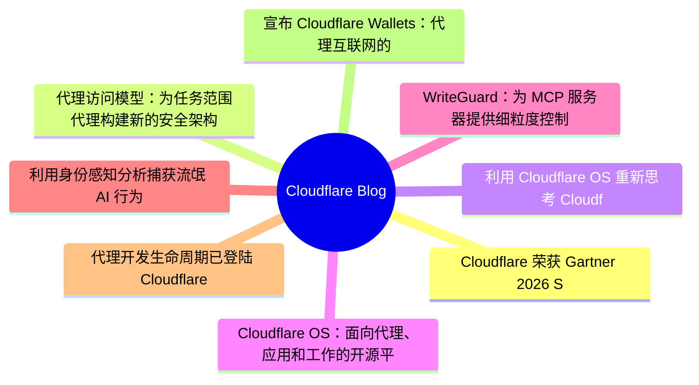
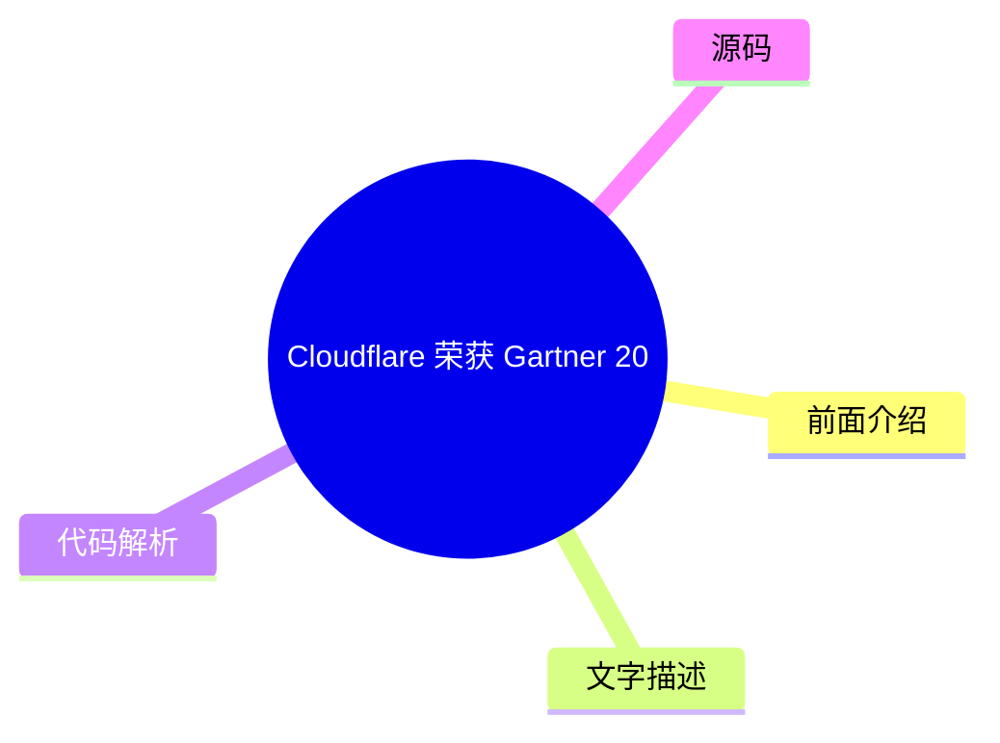
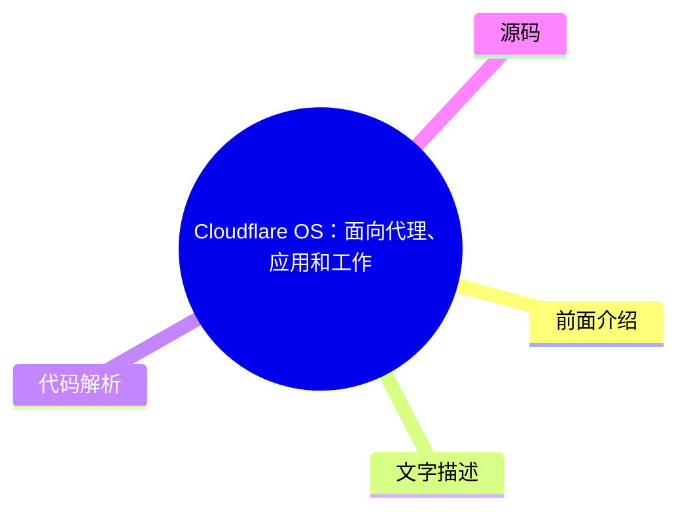
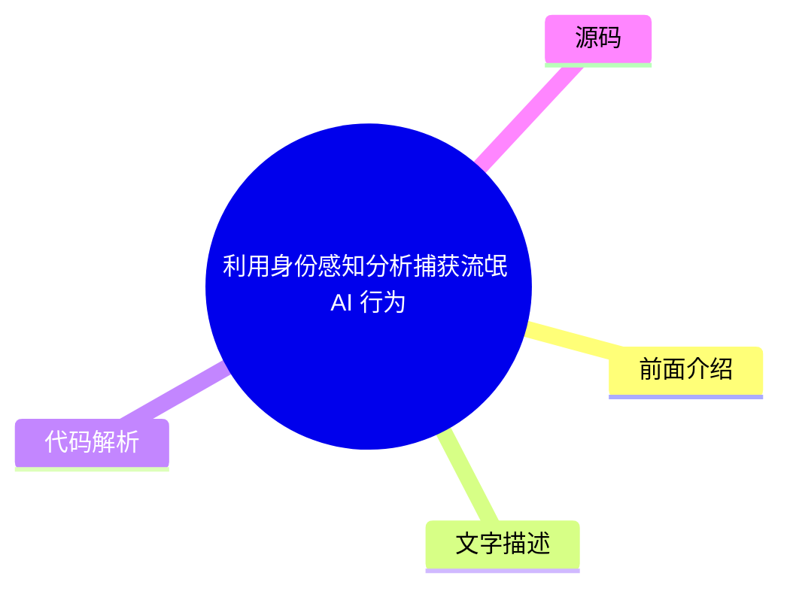
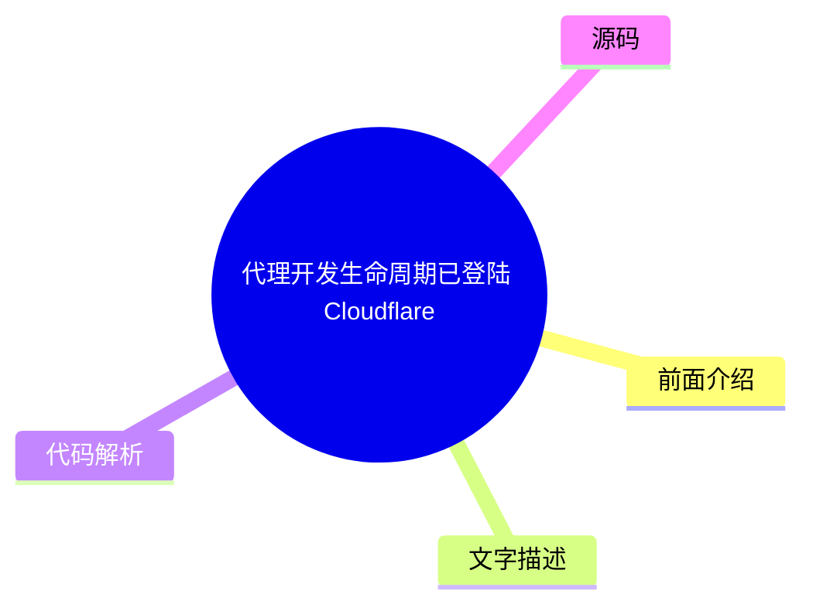

# ☁️ Cloudflare Blog Top 8 (2026-08-07)

## 前面介绍

- 数据源：Cloudflare Blog
- 抓取日期：2026-08-07
- 条目数：8
- 含完整正文：8
- 含代码片段：3
- 组织方式：前面介绍 / 树状图 / 文字描述 / 代码解析 / 源码

## 思维导图



## 详细整理（8 条，8 条含全文，3 条含代码）

### 1. Cloudflare 荣获 Gartner 2026 SASE 与 SSE 魔力象限“远见者”称号
- **链接**: [https://blog.cloudflare.com/cloudflare-sase-sse-gartner-magic-quadrants-2026/](https://blog.cloudflare.com/cloudflare-sase-sse-gartner-magic-quadrants-2026/)
- **作者**: Michael Keane
- **发布**: Wed, 05 Aug 2026 23:24:51 GMT

#### 前面介绍

- Cloudflare 是唯一一家同时被 Gartner 评为 SASE 平台和 SSE 报告“远见者”的供应商。
- 文章强调了 SASE 市场正从单纯的远程办公安全向适应 AI 代理、后量子威胁等复杂环境的演进。
- Cloudflare One 平台通过连接云架构、治理 AI 代理、部署后量子加密和提供可预测定价来应对市场挑战。

#### 树状图



#### 文字描述

- Cloudflare 在 2026 年的 Gartner 魔力象限中同时被评为 SASE 平台和 SSE 报告的“远见者”，这是对其架构选择和客户信任的认可。
- 文章指出大多数 SASE 供应商未能适应现代企业的架构现实，导致碎片化架构、未管理的 AI 代理、理论上的后量子安全以及“零敲碎打”的定价模式。
- Cloudflare 提出了四大技术压力重塑 SASE：保护“氛围编码”应用爆炸、重新控制 AI 代理、提供后量子敏捷性以及通过 AI Gateway 限制推理成本。
- SASE 平台需要从捆绑的安全和连接演变为高度敏捷的治理层，以应对 AI 代理和后量子威胁的挑战。
- Cloudflare 计划到 2028 年交付首个完全量子安全的 SASE 平台，包括后量子身份验证。

#### 代码解析

- 本文未提供源码，以下为实现思路或结构解析
- Cloudflare One 平台采用连接云架构，通过单一全球网络连接和保护员工、AI 代理和基础设施。
- 利用 AI Gateway 对 AI 代理进行统一治理，并按用户、团队或应用限制 AI 推理成本。
- 在所有主要出入站流量上部署后量子加密，以防御“先存储后解密”的威胁。

#### 源码

#### 中文节选

We're honored to announce that Cloudflare is the only vendor that has been recognized as a Visionary in both the 2026 [ Gartner® Magic Quadrant⢠for SASE Platforms](https://www.cloudflare.com/lp/gartner-magic-quadrant-sase-platforms-2026/) and the 2026 

[reports. To us, this validates our architectural choices and, more importantly, reflects the trust our customers place in us to navigate an increasingly complex security landscape.](https://www.cloudflare.com/lp/gartner-magic-quadrant-sse-2026/)

__Gartner® Magic Quadrant⢠for Security Service Edge__To every customer who shared feedback with Gartner, discussed your roadmap challenges with our team, and pushed us to build better solutions: thank you. This recognition belongs to you as much as it does to us.

The [ SASE](https://www.cloudflare.com/learning/access-management/what-is-sase/) (Secure Access Service Edge) and SSE (Security Service Edge) markets are at an inflection point. Many organizations started with the SSE as the âsecurity halfâ of SASE to tackle their remote work challenges during the pandemic. More recently, SASE has grown more prominent given the rise in return-to-office work mandates. Now, as AI agents, post-quantum threats, and the sprawl of shadow apps reshape enterprise security, organizations need platforms that can adapt at the speed of change, not vendors locked into yesterday's architecture. Thatâs exactly where Cloudflare One, our agile SASE platform, comes in.

## The market gap and where SASE is heading next

Itâs no secret that most SASE vendors haven't adapted to the architectural realities of modern enterprises. In fact, when customers migrate to Cloudflare, we hear some of the exact same challenges time and time again:

**Fragmented architectures:** When SASE platforms are stitched together through mergers and acquisitions, deploying use cases across multiple products becomes a massive headache. Cloudflare mitigates these implementation nightmares and security gaps with a [ connectivity cloud](https://www.cloudflare.com/learning/cloud/what-is-a-connectivity-cloud/) approach: one global network that connects and protects your workforce, AI agents, and infrastructure.


**无管理的 AI 代理：** 市场匆忙地抢夺人类 GenAI 提示词，导致 AI 代理在很大程度上处于无监管状态。Cloudflare 是首个 [遏制 MCP 服务器蔓延](https://blog.cloudflare.com/zero-trust-mcp-server-portals/) 的 SASE 平台，它原生地统一管理 AI 代理和人类用户，以实现完全的可见性。我们的 SASE 和 AI 网关之间的交互还允许管理员按用户、团队或应用限制 AI 推理成本，以防止账单失控。当员工可以在不知不觉中累积数千美元的查询费用时，这一点尤为重要。

**理论上的后量子安全：** 虽然其他供应商在理论上讨论后量子密码学，但我们将其构建到了我们的基础架构中。我们是首个在所有主要的[在线和离线](https://blog.cloudflare.com/zero-trust-mcp-server-portals/)环境中部署后量子加密的 SASE 平台。

#### 完整正文（中文）

We're honored to announce that Cloudflare is the only vendor that has been recognized as a Visionary in both the 2026 [ Gartner® Magic Quadrant⢠for SASE Platforms](https://www.cloudflare.com/lp/gartner-magic-quadrant-sase-platforms-2026/) and the 2026 

[reports. To us, this validates our architectural choices and, more importantly, reflects the trust our customers place in us to navigate an increasingly complex security landscape.](https://www.cloudflare.com/lp/gartner-magic-quadrant-sse-2026/)

__Gartner® Magic Quadrant⢠for Security Service Edge__To every customer who shared feedback with Gartner, discussed your roadmap challenges with our team, and pushed us to build better solutions: thank you. This recognition belongs to you as much as it does to us.

The [ SASE](https://www.cloudflare.com/learning/access-management/what-is-sase/) (Secure Access Service Edge) and SSE (Security Service Edge) markets are at an inflection point. Many organizations started with the SSE as the âsecurity halfâ of SASE to tackle their remote work challenges during the pandemic. More recently, SASE has grown more prominent given the rise in return-to-office work mandates. Now, as AI agents, post-quantum threats, and the sprawl of shadow apps reshape enterprise security, organizations need platforms that can adapt at the speed of change, not vendors locked into yesterday's architecture. Thatâs exactly where Cloudflare One, our agile SASE platform, comes in.

## The market gap and where SASE is heading next

Itâs no secret that most SASE vendors haven't adapted to the architectural realities of modern enterprises. In fact, when customers migrate to Cloudflare, we hear some of the exact same challenges time and time again:

**Fragmented architectures:** When SASE platforms are stitched together through mergers and acquisitions, deploying use cases across multiple products becomes a massive headache. Cloudflare mitigates these implementation nightmares and security gaps with a [ connectivity cloud](https://www.cloudflare.com/learning/cloud/what-is-a-connectivity-cloud/) approach: one global network that connects and protects your workforce, AI agents, and infrastructure.


**Unmanaged AI agents:** The market rushed to secure human GenAI prompts, leaving AI agents largely ungoverned. Cloudflare was the first SASE platform to [ rein in MCP server sprawl](https://blog.cloudflare.com/zero-trust-mcp-server-portals/), natively governing AI agents and human users together for total visibility. The interaction between our SASE and AI Gateway also lets admins cap AI inference costs per user, team, or application to prevent runaway bills. This is especially important when employees can rack up thousands of dollars in queries without realizing it. 

**Theoretical post-quantum security:** While other vendors discuss post-quantum cryptography in theory, we built it into our fabric. We were the first SASE platform to [ deploy post-quantum encryption across all major on- and off-ramps](https://blog.cloudflare.com/post-quantum-sase/), and weâre neutralizing "harvest-now, decrypt-later" threats for regulated industries right now.

**Nickel-and-dime pricing:** Legacy vendors have a bad habit of turning advanced capabilities into expensive add-ons, or double-charging for remote and office work. Cloudflare delivers predictable, value-driven [ SASE bundles](https://www.cloudflare.com/plans/enterprise/interna/) designed for holistic adoption, with no hidden fees.

## Technological pressures reshaping SASE

We believe the SASE platforms of tomorrow will need to be much more than bundled security and connectivity. Over the coming year, four major technological shifts will force SASE to evolve into a highly agile governance layer:

**Securing the "vibe-coded" app explosion:** AI has made it easier than ever for employees to spin up internal tools with zero IT oversight. This shadow IT sprawl requires a secure-by-default posture. SASE platforms must automatically wrap these citizen-developed apps in zero trust access, WAF, API protection, and data loss prevention (DLP), safeguarding sensitive AI prompts without slowing builders down.


**驾驭 AI 代理：** 传统 SASE 追踪人类行为，但未来是自主的。随着我们转向代理式运营，SASE 必须为特定的机器人任务颁发严格、范围高度受限的凭据，而不是继承广泛的人类权限。自适应访问也必须更加智能，分析代理意图并建立工具调用量的基线，以即时检测异常。

**今日交付后量子敏捷性：** 量子计算正在加速，这意味着组织必须立即防范“现在收集，稍后解密”的攻击。市场需要能够随着 NIST 标准的最终确定而适应的原生后量子加密。到 2028 年，Cloudflare 目标是交付首个完全量子安全的 SASE 平台，[包括后量子身份验证](https://blog.cloudflare.com/post-quantum-roadmap/#cloudflares-roadmap-to-full-post-quantum-security)，比 2030 年国家标准与技术研究院（NIST）的强制要求提前数年，且不影响用户体验。

**更深层次的架构整合：** 部署疲劳是真实存在的，CIO 们厌倦了空洞的“平台化”推销。真正的整合只发生在拥有真正统一控制、数据和基础设施层的单一代码库上。为了以 AI 的速度前进，组合性和可编程性必须成为架构的现实，而不是营销口号。

这些不仅仅是未来的预测。它们是我们客户今天面临的现实，也是我们共同构建的精确路线图。

## Cloudflare 的优势所在

如果说有一件事定义了 Cloudflare 在 SASE 市场中的领先地位，那就是我们的架构。许多传统的 SASE 解决方案是由各种不相容的技术拼凑而成的。Cloudflare 走了一条不同的道路，从零开始构建了一个统一的平台。这种清晰、可组合的设计为我们的客户带来了三大巨大优势：

### 安全采用 AI 的快速路径

The rest of the market has largely treated AI security as just another bolted-on feature. But because Cloudflare shares a single architecture across our entire global network, we can rapidly roll out new security tools within our SASE platform without waiting for product integration cycles or vendor roadmaps to align.

Thanks to our composable design, your administrators can easily extend coverage using familiar SASE policies, while also keeping costs under control. Securing human GenAI prompts or governing an AI agent's connections to an MCP server happens in the same policy language they use every day. Itâs not an add-on module with its own learning curve; itâs built right in.

Whenever your developers build a new AI assistant, or your finance team starts using an AI-powered forecasting tool, Cloudflare's zero trust policies are already there. You never have to retrofit security. You just apply the framework you already rely on.

### SASE thatâs actually easy to use

First-generation SASE platforms have a bad habit of routing traffic through multiple disjointed inspection points. The result? Complicated deployments, blown timelines, and delayed success. "Single-vendor SASE" has historically been a great pitch on a slide deck, while in reality, customers are stuck managing stitched-together engines under the hood.

Cloudflareâs composability fixes this by delivering an exceptionally intuitive SASE experience. Our architecture is unified by design; every service runs on every server across our entire network. That means no traffic tromboning between specialized appliances, no more capacity planning across siloed products, and no hidden complexity.

By operating like a modern SaaS platform, we are designed for teams to intuitively deploy new use cases in days and weeks, rather than months and years. Need to extend zero trust access to a new app, add DLP to your Gateway traffic, or bring a new office location online? Cloudflare responds at the speed of configuration.

### Truly programmable SASE


“可编程”这个词在行业中往往被稀释，仅指简单的自动化，比如 GUI 工作流或基于僵化逻辑的简单 API。结果是，大多数 SASE 平台都像黑盒一样，迫使你不得不绕过供应商的限制来开展工作。

我们构建了一个真正可组合、可编程的 SASE 平台，它与我们原生的边缘开发者平台协同运行，赋予你直接将自定义代码编织进我们的 SASE 架构的能力。想要利用来自小众内部工具的实时信号来丰富访问决策？想要构建自定义工作流，根据独特的应用上下文来路由流量？

通过将 Cloudflare Workers 整合到我们的 SASE 技术栈中，客户可以解决复杂且高度特定的边缘场景，而无需进行会导致臃肿并降低其他人可用性的自定义功能开发。这是传统架构无法提供的灵活性水平，而且得益于 AI 代码生成，实现起来从未如此简单。

## 展望未来

来自 Gartner 的这一认可对我们来说是一个了不起的里程碑，但我们已经专注于前方的道路。我们对您的承诺没有改变：我们将继续倾听您的反馈，构建帮助您进行适配的基础组件，并确保平台随着您面临的挑战日益复杂，变得更加易于使用。对我们而言，敏捷 SASE 意味着让我们的客户能够自信地应对明天带来的任何挑战。

无论您正在积极评估 SASE 平台，还是仅仅试图应对我们讨论过的变革，我们都希望能与您建立联系。下载完整的 Gartner 报告（针对 [ SASE](https://www.cloudflare.com/lp/gartner-magic-quadrant-sase-platforms-2026/) 或 

[, 或两者），仔细查看](https://www.cloudflare.com/lp/gartner-magic-quadrant-sse-2026/)

__SSE__[, 或](https://developers.cloudflare.com/cloudflare-one/)

__Cloudflare One__[直接联系我们的团队。](https://www.cloudflare.com/contact/sase/)

__reach out__*Gartner, Magic Quadrant for SASE Platforms, Analyst(s): Jonathan Forest, Andrew Lerner, John Watts, July 28, 2026*

*Gartner, Magic Quadrant for Security Service Edge, Analyst(s): John Watts, Thomas Lintemuth, Theo de Feligonde, Jonathan Forest, July 29, 2026*

*Gartner and Magic Quadrant are trademarks of Gartner, Inc. and/or its affiliates.*

*Gartner does not endorse any company, vendor, product or service depicted in its publications, and does not advise technology users to select only those vendors with the highest ratings or other designation. Gartner publications consist of the opinions of Gartnerâs business and technology insights organization and should not be construed as statements of fact. Gartner disclaims all warranties, expressed or implied, with respect to this publication, including any warranties of merchantability or fitness for a particular purpose.*


### 2. 代理访问模型：为任务范围代理构建新的安全架构
- **链接**: [https://blog.cloudflare.com/the-agent-access-model/](https://blog.cloudflare.com/the-agent-access-model/)
- **作者**: Matt Silverlock
- **发布**: Wed, 05 Aug 2026 13:00:41 GMT

#### 前面介绍

- 代理访问模型（AAM）提出了一种新的架构，利用严格的身份代理、持续调解和有状态信任来保护任务范围的代理。
- 传统的基于人类的安全控制无法有效应对代理的短暂性、机器速度和跨跳权限组合。
- 该模型主张将代理的能力限制在完成任务所需的范围内，并实时强制执行最小权限原则。
- 文章详细阐述了为什么人类模型无法直接迁移到代理环境，以及如何构建支持多玩家访问控制的系统。

#### 树状图


#### 文字描述

- 代理访问模型（AAM）旨在解决 BeyondCorp 等传统零信任模型在处理代理时的局限性，代理是任务范围的运行，具有短暂性和机器速度。
- 代理与人类不同，它们是任务执行图，可能需要广泛的访问权限来完成特定任务，且权限应在任务结束时立即撤销。
- 文章指出四个导致人类模型不适配代理的原因：凭证持久性与任务短暂性不匹配、代理以机器速度行动、提示词不是边界、代理跨跳组合权限。
- AAM 通过缩小代理的能力范围来简化访问决策，并强调预防性控制必须在行动点内联运行。
- 文章探讨了单主体控制和更难的多玩家访问控制之间的区别，以及如何构建支持多代理协作的访问模型。

#### 代码解析

- 本文未提供源码，以下为实现思路或结构解析
- 实现 AAM 需要构建一个任务执行图，每个任务运行由相同的权限上限和信任级别管理。
- 系统必须实时运行权限检查，并记录审计日志，确保代理的凭证生命周期与任务生命周期一致。
- 访问控制逻辑应嵌入到中介工具调用和网络层的中间件中，而非仅依赖提示词或内容过滤。

#### 源码

#### 中文节选

For the last twelve years, enterprise security has moved away from trusting the network. BeyondCorp made the case that a request's origin, inside the corporate perimeter or on the open Internet, should not decide whether it is allowed. Identity and device health should. That model won: it now underpins much of Zero Trust.

Googleâs BeyondCorp assumed a specific principal: a human at a device, acting at human speed. Organizations are now deploying *agents*, software principals that reason, act, and reach into systems on our behalf. A task-scoped agent run is ephemeral. It ends when its work is done. A long-lived agent service may handle many such tasks and move data far faster than a person.

The controls we built for humans do not fail loudly when we point them at agents. They fail quietly, by granting too much, seeing too little, and trusting for too long.

This paper proposes an access model for agents: the **Agent Access Model (AAM)**. We describe the model and show how its components can be built. We then walk through a concrete example and separate the single-principal controls available today from the harder problem of **multiplayer access control**.

Much of the current work tries to make each access decision smarter. AAM takes a different approach: make the agent's capability smaller, so there is less to judge in the first place.

## The shift

A decade ago, the hard question in enterprise security was *where is this request coming from, and do I trust that place?* BeyondCorp's answer was that you should not trust the place at all. You authenticate the user, interrogate the device, and make an access decision for that specific request. Location became one signal among many, not a verdict.

That reframing worked because the principal was legible. A human logs in each morning, carries a device or two, works at human speed, and generates a trickle of access decisions a system can reason about. We built an entire industry around that shape of principal: single sign-on, device posture, conditional access, session risk scoring.

Agents do not have that shape.


An agent service may run many tasks. In this paper, an agent is one task-scoped run. We use **task execution graph** for all work belonging to that run and governed by the same capability ceiling and trust level. The same harness solving a different task, consuming a different event, or running on tomorrow's schedule creates a new graph. A single human instruction (*reconcile these two ledgers*, *triage the overnight alerts*, *open a pull request that fixes this bug*) can dispatch one or more such tasks. Each may need to reach databases, source control, logs, ticketing systems, knowledge bases, documents, or spreadsheets. The task may need broad access. It needs it now, for this task, and ideally not one second longer.

An agent must have enough authority to complete its task and no more. Least privilege is as old as access control. What changes is how quickly and often it must be enforce

#### 完整正文（中文）

For the last twelve years, enterprise security has moved away from trusting the network. BeyondCorp made the case that a request's origin, inside the corporate perimeter or on the open Internet, should not decide whether it is allowed. Identity and device health should. That model won: it now underpins much of Zero Trust.

Googleâs BeyondCorp assumed a specific principal: a human at a device, acting at human speed. Organizations are now deploying *agents*, software principals that reason, act, and reach into systems on our behalf. A task-scoped agent run is ephemeral. It ends when its work is done. A long-lived agent service may handle many such tasks and move data far faster than a person.

The controls we built for humans do not fail loudly when we point them at agents. They fail quietly, by granting too much, seeing too little, and trusting for too long.

This paper proposes an access model for agents: the **Agent Access Model (AAM)**. We describe the model and show how its components can be built. We then walk through a concrete example and separate the single-principal controls available today from the harder problem of **multiplayer access control**.

Much of the current work tries to make each access decision smarter. AAM takes a different approach: make the agent's capability smaller, so there is less to judge in the first place.

## The shift

A decade ago, the hard question in enterprise security was *where is this request coming from, and do I trust that place?* BeyondCorp's answer was that you should not trust the place at all. You authenticate the user, interrogate the device, and make an access decision for that specific request. Location became one signal among many, not a verdict.

That reframing worked because the principal was legible. A human logs in each morning, carries a device or two, works at human speed, and generates a trickle of access decisions a system can reason about. We built an entire industry around that shape of principal: single sign-on, device posture, conditional access, session risk scoring.

Agents do not have that shape.


代理服务可以运行许多任务。在本论文中，代理是指一个任务范围的运行。我们使用 **任务执行图** 来处理属于该运行的所有工作，并受相同的权限上限和信任级别约束。同一个工具解决不同的任务、消耗不同的事件，或在明天的计划上运行，都会创建一个新的图。一条单一的人类指令（*合并这两个账本*、*处理过夜的警报*、*打开一个修复此错误的拉取请求*）可以调度一个或多个此类任务。每个任务可能需要访问数据库、源代码控制、日志、票务系统、知识库、文档或电子表格。该任务可能需要广泛的访问权限。它需要现在就拥有这些权限，仅针对此任务，并且理想情况下不应多持续一秒钟。

代理必须拥有足够的权限来完成其任务，且不能更多。最小权限原则与访问控制一样古老。变化的是强制执行的频率和速度。对于人类劳动力，最小权限通常是一个每季度审查一次的策略。对于大量短期代理，它是一个实时运行的系统，并留下审计踪迹。

## 为什么人类模型不适用

代理看起来像服务账户或非常快的用户。四个属性使得这两套控制都不太适用。

**代理是短暂的。凭证是持久的。** 服务账户是为长期运行的软件设计的：如薪资系统、夜间批处理作业。它们通常带有长期密钥、广泛的范围和很少的轮换。应用于短期代理时，这些凭证会超过其被颁发的任务的生命周期，并保留在内存、日志或环境变量中，从而可以被重放。凭证的生命周期应与任务的生命周期相匹配。对于代理而言，这通常是几分钟。

**代理以机器速度行动。** 为人类活动调整的异常检测、速率限制和数据丢失控制可能会反应太慢。拥有数据库连接和出站网络路径的代理可以在人类调整的控制完成采样之前，读取一个表并将其发布到外部端点。因此，预防性控制必须在操作点内联运行。

**The prompt is not a perimeter.** Teams commonly tell an agent *do not access production* or *never send data to third parties*. Those instructions help shape behavior, but they do not enforce access. A model can be manipulated by content injected into the data it reads or can produce an unsafe action on its own. Inferred intent can inform a risk decision, but an attacker can shape that signal through the same text. Enforcement belongs in the harness that mediates tool calls and at the network layer that mediates packets. A boundary you can talk your way past is not a boundary.

**Agents compose authority across hops.** An agent can invoke a tool that invokes another agent, which calls an API on behalf of the original human. Somewhere in that chain, the answer to *who is this for, and what are they allowed to do* can disappear. Existing primitives handle a single hop of delegation better than they handle many hops or several humans.

## The Agent Access Model

The Agent Access Model starts with one rule: **Do not trust the run. Authorize every action against the task and its accumulated state.**

BeyondCorp removed implicit trust from the *network*. AAM removes implicit trust from the *task execution graph*. Authorization for one action does not carry over to the next. Every action is evaluated against three things: who the agent is, what task it was authorized to perform, and which policy-relevant resources the graph has already touched. That accumulated state can only reduce the graph's remaining capabilities.

Google's *Beyond Zero* makes the same opening move: shrink the trust boundary from the application to the individual action and make the decision at machine speed. Beyond Zero puts a reasoning engine behind each authorization decision. AAM bounds the capability set that engine must judge. The two approaches fit together. For actions that cross a declared mediation boundary, AAM records the agent, principal, and task behind each authorization decision.

AAM has five principles.


1. **Credentials are short-lived and bound.** An agent receives a credential minted for the task and expiring with it. Tokens are sender-constrained, so a stolen token alone cannot be replayed without the harness-held proof key.

2. **Enforcement lives in the harness and the network, not the prompt.** Policy is applied where tool calls and network requests actually happen. The prompt is where you express intent. It is never where you enforce a boundary.

3. **Human oversight is exceptional.** Approvals are reserved for decisions that warrant them.  A person to approve every step creates fatigue and reflexive clicking.

4. **Grants are reviewed from evidence.** Directly captured activity can show where a task template is too broad or too narrow. The system proposes a change for review, and an approved change applies to future tasks. It never widens the active task.

5. **Capability state moves in one direction.** When a declared protected event occurs, the Trust Ratchet removes capabilities across the task execution graph according to policy. Authority removed by the Trust Ratchet returns only in a newly authorized task.

## A reference architecture

The architecture has four active controls and two supporting systems. The active controls govern the task. The Agent Activity Log and Grant Review Loop operate on the evidence it leaves behind. AAM defines how these pieces fit together and what each one must guarantee. This is a reference architecture, not a wire-level specification.

### 4.1 The Agent Identity Broker

At dispatch, the **Agent Identity Broker** issues a short-lived, verifiable credential scoped to the task. That credential expires no later than the task ends.

The credential is *task-scoped*: it encodes "this is agent X, acting for principal H, to do task T." It is also *sender-constrained*, bound to a proof key held by the harness. A leaked token alone cannot be replayed without that key, and the model never receives it.


Existing standards provide both primitives. **OAuth 2.0 Token Exchange (RFC 8693)** defines an exchange through a Security Token Service and can produce a token narrowed by audience, resource, or scope. The authorization server's policy determines what it issues. The token's `act` claim identifies the current actor, while nested `act` claims can retain prior actors for attribution. **DPoP (RFC 9449)** binds an OAuth token to a client key and requires proof on each protected request. That proof covers the HTTP method and target URI, but not the request body, query parameters, or tool arguments. The harness must therefore authorize an immutable request representation and execute that same request.

Neither standard defines AAM's task template, Trust Ratchet state, or cross-layer enforcement. AAuth draft 09 addresses agent-to-resource identity and authorization, including per-instance identity, optional missions, tool permissions, audit, and asynchronous authorization. It could realize part of this model and remains a work in progress. AAM depends on four properties of the credential: it is short-lived, task-scoped, sender-constrained, and attributable. It does not depend on one protocol winning.

### 4.2 The Task-Scoped Access Engine

The credential establishes who the agent is and which task it is performing. The **Task-Scoped Access Engine** decides, per request, whether *this* identity may perform *this* action against *this* resource. It extends BeyondCorp's Access Control Engine by making the task itself a first-class input to the decision.

Its job is to make least privilege both the default and the ceiling. A task grant might read: "agent X, for task T, may read tables A, B, and C for the next ten minutes." That is the envelope. Undeclared actions are denied.


Where does the envelope come from? A task's scope is declared when the agent is dispatched, not negotiated by the agent at runtime. In the common case, a human or a system acting on a human's standing authority defines a task template once: "Reconciliation may read these three tables and post to this channel." Each dispatch instantiates it. Templates are the unit of configuration, so the number of policies tracks the number of distinct tasks rather than the number of runs. At dispatch, the Access Engine intersects the approved template with the authority of the initiating principal and agent service, then applies resource-owner and tenant policy. That intersection is the task's capability ceiling. The agent can ask for less, and the Trust Ratchet can remove capabilities. Broader authority requires a newly authorized task.

For each action, the adapter constructs and freezes the complete request representation, including the operation, resource, arguments that affect scope, tenant, and recipient. The Access Engine authorizes that representation against the current capability ceiling, and the adapter executes the same representation. Credential renewal revalidates the original ceiling and current Trust Ratchet state. It cannot restore a removed capability or extend the maximum task lifetime.

### 4.3 The Mediation Layer (harness and network)

The **Mediation Layer** governs two boundaries: the tool paths exposed by the harness and outbound traffic forced through the deployment's network boundary.

The first is the harness, the runtime that brokers the agent's tool calls. It intercepts calls through declared tool paths, checks them against task policy, and emits enforcement events, subject to the collection gaps described in Section 4.6. The harness can distinguish a read from an update and constrain the arguments that affect scope. MCP standardizes requests over defined transports and supplies an OAuth resource-server boundary for HTTP transports. Its aut

...（截断，原文 33810+ 字符）


### 3. 利用 Cloudflare OS 重新思考 Cloudflare 的工作方式
- **链接**: [https://blog.cloudflare.com/how-we-use-ai-with-cloudflare-os/](https://blog.cloudflare.com/how-we-use-ai-with-cloudflare-os/)
- **作者**: Sam Rhea
- **发布**: Wed, 05 Aug 2026 13:00:01 GMT

#### 前面介绍

- Cloudflare OS 是一个旨在让团队能够安全地利用 AI 重新思考工作方式的平台。
- 平台结合了计算原语和零信任套件，旨在为非技术人员提供“超能力”，同时确保人类对输出负责。
- 文章分享了 Cloudflare 在内部构建和试点 Cloudflare OS 的经验，包括定义原则、创建冠军和构建自定义服务。
- 该平台旨在让每个人都能构建应用、自动化工作并安全访问内部系统，同时保持组织上下文的完整性。

#### 树状图


#### 文字描述

- Cloudflare CIO Sam Rhea 描述了公司内部 AI 工具的爆发式增长，以及构建 Cloudflare OS 以平衡创新与安全的需求。
- 文章列出了 Cloudflare 采用 AI 的四大原则：以客户为中心、赋予每个人超能力、人类拥有输出、组织上下文比模型更重要。
- 平台旨在让非技术人员也能通过浏览器界面与代理工作区交互，而无需编写代码，从而专注于其领域专业知识。
- Cloudflare OS 提供了共享的上下文和技能库，捕获组织的术语、流程和最佳实践，以便所有员工共享知识。
- 文章强调了在推广新工作方式时，创建组织内部的“冠军”来推动变革的重要性。

#### 代码解析

- 本文未提供源码，以下为实现思路或结构解析
- Cloudflare OS 结合了代理工作区、安全治理框架和个人可修改应用平台。
- 平台通过隔离运行时允许代理编写和运行代码，同时确保安全治理框架嵌入在平台核心而非外围。
- 系统通过共享的上下文和技能库，使代理能够理解组织的特定术语和操作流程。

#### 源码

#### 中文节选

*Sam Rhea 是 Cloudflare 的首席信息官。*

大约六个月前，当我们的销售组织的一名成员联系我索要 API 密钥时，我就知道我们遇到了问题。是密钥，复数形式。他们利用 AI 构建了一个他们所谓的 SuperApp，旨在改变我们的市场推广团队。他们只需要生产环境对 Cloudflare 大约十二个核心系统的访问权限，以及部署管道的管理员权限即可实现这一目标。

在 2025 年，我们在推出 AI 时采取了一种相当谨慎的方法。我们部署了信息聊天应用程序，并尝试使用 AI 来帮助编写一些样板代码，但我们认为这项技术尚未准备好改变我们的工作方式。

然而，在去年年底的几天里，更好的模型和更强大的工具改变了这一局面。AI 代理能够**做**事情，而且做得很好。Cloudflare 的数百名团队成员，无论从事技术还是非技术工作，都在新年前后那段相对安静的时期，尝试使用新工具，发现构建工作比以往任何时候都更容易。

那个构建 SuperApp 的销售团队成员只是第一个举手示意使用这些工具来改变工作方式的人潮中的一员。我们有责任为他们配备工具并赋能他们去这样做。但同时，我们也有责任确保我们的系统、内部数据和客户数据的安全。

过去几个月，我们一直在 Cloudflare 内部构建一个平台来实现这一目标。我们称之为 Cloudflare OS。我们首先将来自我们的开发者平台和零信任平台（如 Cloudflare [Workers](https://www.cloudflare.com/products/workers/)）的现成组件拼接在一起，并创建了专门针对这种新工作方式定制的自定义服务。

__Access__As with many of Cloudflareâs products, we set out to solve a problem we had internally. As it turns out, many of you had the same problem. Thatâs why today we are excited to share Cloudflare OS, the sum of what we have launched internally to give our own team members the ability to safely and productively use AI and deploy agents. You can read more about what is available right now in [ Phillipâs post here](http://blog.cloudflare.com/cloudflare-os).

In this post, I want to walk through our own internal journey that led to this release, both what has gone well and where we have fumbled. There are five sections: the principles we put in place to begin; how we piloted to figure out what the jobs were to be done; what we built for engineers, and for non-engineers; and how we created champions across the organization to help drive change.

During the last few months, I have felt like the luckiest CIO in the world as the team I support had access to these emerging technologies. Todayâs goal is to share that platform and its lessons with every team.

## Set the ground rules

We started by defining

#### 完整正文（中文）

*Sam Rhea 是 Cloudflare 的首席信息官。*

大约六个月前，当我们的销售组织的一名成员联系我索要 API 密钥时，我就知道我们遇到了问题。是密钥，复数形式。他们利用 AI 构建了一个他们所谓的 SuperApp，旨在改变我们的市场推广团队。他们只需要生产环境对 Cloudflare 大约十二个核心系统的访问权限，以及部署管道的管理员权限即可实现这一目标。

在 2025 年，我们在推出 AI 时采取了一种相当谨慎的方法。我们部署了信息聊天应用程序，并尝试使用 AI 来帮助编写一些样板代码，但我们认为这项技术尚未准备好改变我们的工作方式。

然而，在去年年底的几天里，更好的模型和更强大的工具改变了这一局面。AI 代理能够**做**事情，而且做得很好。Cloudflare 的数百名团队成员，无论从事技术还是非技术工作，都在新年前后那段相对安静的时期，尝试使用新工具，发现构建工作比以往任何时候都更容易。

那个构建 SuperApp 的销售团队成员只是第一个举手示意使用这些工具来改变工作方式的人潮中的一员。我们有责任为他们配备工具并赋能他们去这样做。但同时，我们也有责任确保我们的系统、内部数据和客户数据的安全。

过去几个月，我们一直在 Cloudflare 内部构建一个平台来实现这一目标。我们称之为 Cloudflare OS。我们首先将来自我们的开发者平台和零信任平台（如 Cloudflare [Workers](https://www.cloudflare.com/products/workers/)）的现成组件拼接在一起，并创建了专门针对这种新工作方式定制的自定义服务。

__访问__与 Cloudflare 的许多产品一样，我们着手解决内部遇到的一个问题。事实证明，你们许多人也遇到了同样的问题。这就是为什么今天我们很高兴分享 Cloudflare OS，这是我们内部推出的所有内容的总和，旨在赋予我们自己的团队成员安全、高效地使用 AI 和部署代理的能力。您可以在 [ Phillip 的这篇博文](http://blog.cloudflare.com/cloudflare-os) 中阅读更多关于目前可用内容的信息。

在这篇文章中，我想回顾一下导致此次发布的内部历程，包括哪些方面做得好，哪些方面出了差错。文章分为五个部分：我们为开始实施而制定的原则；我们如何进行试点以确定需要完成的任务；我们为工程师和非工程师构建了什么；以及我们如何在整个组织中培养倡导者以帮助推动变革。

在过去的几个月里，作为我所支持团队的 CIO，我感到自己是世界上最幸运的人，因为我的团队可以接触到这些新兴技术。今天的目标就是与每个团队分享这个平台及其经验教训。

## 设定规则

我们首先围绕如何开展工作定义了一套原则。Cloudflare 的 CTO 和我在德克萨斯州奥斯汀的办公室坐下来，开始勾勒出我们在采用 AI 时需要满足的条件。我们邀请了组织中的各级领导对草案提供反馈。结果形成了以下指南。

**1) 我们使用 AI 来花更多时间与客户在一起，并构建技术来解决他们更多的问题。**

我们不想仅仅为了使用 AI 而使用 AI。我们推动团队首先定义他们的“待办任务”，即可以改善我们服务客户方式的痛点、瓶颈或错失的机会。然后我们找到合适的工具。

**2) 每个人都值得拥有超能力。**

AI 在编写代码方面非常、非常好。由此延伸，第一批能够执行操作的 AI 工具由开发者已经使用的界面组成：命令行、代码编辑器、终端、Git 仓库。

These formats could leave behind large parts of our team. While we have a very technical and curious workforce, not every member of our team spends their day in developer tools. And we do not think they need to! We want our employees to bring their subject matter expertise and we would provide them with an intuitive platform they could use to rethink how we do work.

**3) The human owns the output.**

We view AI as a tool and toolmaker, not a team member. We expect humans to take responsibility for defining the quality, testing, and workflows that rely on AI output.

The rule extends to deploying agents, as well. The users and teams that ship agents are responsible for the output of those agents. Someone leaves? Their manager inherits the responsibility of their agents in the same way they inherit their other workflows.

**4) The context from the organization matters more than the model.**

The workflows and agents that we deploy at Cloudflare need to know about Cloudflare. The time we spent on the technology had to be paired with time invested in a curated, canonical context layer.

**5) You should never have more permission with systems of record when using AI.**

Everyone at Cloudflare has a scoped view into the underlying data at Cloudflare for good reason. We use our own products to segment data access by factors ranging from device to role to region. We also configure and monitor the controls inside our third party applications.

Those controls need to apply when I manage an AI agent that interacts with the same data. I should never have âmoreâ access to data when using an AI tool and my AI agents should only have access to exactly what they need, nothing more. And if I deploy an agent and share it with someone, the access the agent provides to them should reflect their permissions, not mine.

## Meet your users where they are

With those rules in place, we got to work. We ran two parallel programs: the first for our engineering teams, and the second for every other type of work.

### Provide your engineers with guardrails


AI 工具接管了我们工程师已经完成的工作，并使其速度更快——比我们的审查流程跟得上的速度还要快。由于 AI 的存在，Cloudflare 的任何人现在都能更快地编写出糟糕的代码。我们需要更好的护栏。

因此，我们为工程构建了一个上下文层。我们称之为 Cloudflare Engineering Codex。Codex 是一本权威指南。它列出了我们遵循的原则和实践。政策告诉你不能做什么，而 Codex 告诉你应该做什么。它天生具有倾向性。我们代码库的每个部分都有一个领域所有者，对那里的“良好状态”负责。

我们在软件开发生命周期中暴露了这个上下文层。代理使用 Codex 来帮助工程师规划工作。一个代理根据 Codex 要求审查每个合并请求。另一个代理在实施开始前审查技术设计。第三个代理审查事故报告。在过去的四个月里，这些代理标记了近 25 万个潜在问题，并阻止了 16,000 次合并。它们在编写一行代码之前，就在近 600 个设计中发现了架构问题。

你可以在 [ Timo 关于 AI 代码审查的博客文章](http://blog.cloudflare.com/engineering-standards-enforcement) 中阅读更多关于我们如何构建此代码审查工作流程的详细信息。我们现在正将重点转移到为工程师提供工具，以定义评估其代理生成的工作的循环。

### 为每个人提供魔法电子邮件别名

我们犯的一个早期错误是给工程部门以外的人提供相同的工具，只是界面稍微友好一些。工程师可以将代码仓库克隆到他们的笔记本电脑上，添加一个上下文文件，如 [AGENTS.md](http://AGENTS.md)，并将他们的工具指向工作。然而，市场上的工具与其他类型的知识工作映射得不好，在这些工作中，用户创建一次性输出，并处理涉及数十个记录系统的工作。

如果你给每个人一个擅长编写代码的工具工作区，你最终得到的代码将比你需要的多得多。结果变成了寻找问题解决的泛滥的“氛围编码”应用。所以我们倒推着来做。

We told everyone at Cloudflare that they could send the work they did not want to do to a âmagic AI email botâ that would respond with the output they needed. Behind the scenes, a small team of people staffed this email alias using AI tools to do the work.

For some reason, people are less willing to send their vibe coding ideas to what they think is an automated system, but very willing to send the work they do not want to do. Over the course of hundreds and then thousands of sessions managing the email alias, we identified the mundane work that team members would like to automate.

We triaged these manually and over time we observed patterns. We created the skill and context files, mapped out the data connections, and defined the kinds of outputs users needed. With those in hand, we could automate some of the responses to this email alias.

We were very motivated to stop staffing this service. It was miserable. The long-term goal was to take these materials we had collated and create skills to address them, so that our users could solve their own problems. The manual work behind this email alias continued until we felt we had captured enough of the common âjobs to be doneâ at Cloudflare to give our teams a headstart on automation. Now we just needed to give them a platform where they could easily and safely run those workflows.

## Give team members a platform to solve problems

The first version of that platform, which we call Cloudflare OS, consisted of a simple harness running in a container on Cloudflareâs infrastructure. Users access it in a web browser and, once authenticated through [ Cloudflare Zero Trust](https://www.cloudflare.com/products/access/), they can run the skill files and workflows we started collecting during the magic email phase.

All of this happens inside of their browser, no local configuration required. Users could open their laptop and immediately be productive. We heard from new members of our sales team who, within days of starting, felt like they could automate work that would have taken them weeks to complete in their last workplace.


用户也可以关闭电脑去喝杯咖啡或使用洗手间，同时工作继续进行。再也不用抱着笔记本电脑在办公室里走来走去了。

我们认为基于云的工作空间带来的好处不仅仅局限于用户。一个短暂的基于云的环境只能访问用户在会话中引入的数据，而不是像使用本地工具时那样可能访问你面前笔记本电脑上的所有内容。我们的安全团队对环境拥有审计可见性和网络控制权，包括过滤其可以在互联网上连接的位置的能力。

当用户需要完成工作时，他们会先运行由我们在各部门识别出的常见工作流定义的技能文件。公司在邮件魔法阶段收集的上下文和技能，现在可以通过单击即可执行。

右侧的面板将渲染特定技能文件的输出，例如技术架构文档或演示文稿。用户可以将这些输出与队友分享。

通过通过我们的 [模型上下文协议 (MCP) 门户](https://developers.cloudflare.com/cloudflare-one/access-controls/ai-controls/mcp-portals/) 将记录系统连接起来，我们赋予了 Cloudflare OS 访问数据的权限。MCP 标准是一个框架，用于定义如何将 AI 工具连接到记录系统，从而告知 AI 工具有哪些数据和操作可用。遵循我们的权限规则，用户会话在 Cloudflare OS 中的访问范围限定在特定记录系统中其现有权限集内。

在大多数情况下，即使记录系统提供了原生版本，我们也会为每个记录系统构建和部署我们自己的 MCP 服务器实现。通过构建自己的实现，我们可以添加额外的层

...（截断，原文 18540+ 字符）


### 4. Cloudflare OS：面向代理、应用和工作的开源平台
- **链接**: [https://blog.cloudflare.com/cloudflare-os/](https://blog.cloudflare.com/cloudflare-os/)
- **作者**: Phillip Jones
- **发布**: Wed, 05 Aug 2026 13:00:00 GMT

#### 前面介绍

- Cloudflare OS 是一个开源平台，旨在让公司中的每个人都能构建应用、自动化工作并安全访问内部系统。
- 平台围绕组织的知识、运作方式和上下文进行构建，提供代理工作区、安全治理框架和应用平台。
- 文章介绍了 Cloudflare OS 的三个核心组成部分及其功能，包括研究、文档生成和自动化任务。
- 平台通过共享上下文和技能库，解决了协作中的安全挑战，并确保信息隔离。

#### 树状图



#### 文字描述

- Cloudflare OS 是基于内部试点经验开源的，旨在让任何组织都能部署并连接到内部系统。
- 平台包含三个主要部分：基于组织上下文的代理工作区、安全治理框架以及用于构建和共享应用的平台。
- 代理工作区提供持久状态、资源访问和隔离运行时，并加载了团队或公司收集的上下文和技能。
- 用户可以通过浏览器与工作区交互，执行研究、生成文档、自动化任务或构建小型应用。
- 平台通过共享上下文和技能库，避免了每个人重复解释流程和术语，提高了工作效率。

#### 代码解析

- 本文未提供源码，以下为实现思路或结构解析
- Cloudflare OS 的架构设计旨在将安全治理框架作为平台的一部分，而不是让每个构建者自行实现。
- 平台支持通过 MCP（模型上下文协议）连接工具，并通过共享库捕获组织的最佳实践。
- 工作区提供隔离的运行环境，允许代理安全地编写和执行代码，同时保持上下文的连续性。

#### 源码

#### 源码片段 1（text）

```text
const issues = await env.PROJECT.listIssues({
  teamId: "ENG",
  state: "open",
});
```

#### 完整正文（中文）

Every organization has a mission, a reason for being. Organizations pass that mission â along with their terminology, procedures, systems, standards, and ways of working â to their people. People, in turn, take this context together with their own experience and work towards the mission.

Work can take many forms, from code, to documents and slides, to relationships, to outcomes in the physical world.

Some of these are straightforward: code either runs or it doesnât. Agents have been using this feedback loop to produce code that âworksâ for developers over the last couple of years. But what about the rest of us?

Bringing the same leverage to the rest of the organization is a harder problem. Agents need to understand the context of the company and be able to reach the systems people use to do their jobs. They need to turn that context and access into work that moves the organization towards its mission.

Thatâs why we created Cloudflare OS. It gives every person an agent and workspace built around their company: how it works, what it knows, and the systems it relies on.

In May of this year, we gave every person at Cloudflare access to the first version of Cloudflare OS. Thousands of people across every function, many of them outside of engineering, use it every day to create documents and slides, automate repeatable tasks, and build small apps to visualize data and help them do their work.

Cloudflare OS also gave everyone a shared library of context and skills built by teams at Cloudflare. It captures our terminology, procedures, and best-known ways of doing recurring work as instructions an agent can follow. When one person figures out a better way to do something, everyone else can use it.

**Today, we are open sourcing a new version of ** Any organization can deploy it, connect it to internal systems, and make it their own.

__Cloudflare OS__.

## What we learned from the first version

The Cloudflare OS we are open sourcing today is based on what we learned from running the first version internally, a journey our CIO, Sam Rhea, covers in his [ blog post](https://blog.cloudflare.com/how-we-use-ai-with-cloudflare-os).


The first version centered on individuals working with agents through private workspaces. Apps were static rather than live software connected to internal systems, and mostly deterministic jobs still required running an agent skill again and consuming more model tokens.

Collaboration exposed a more fundamental challenge. Access to an [ MCP server](https://www.cloudflare.com/learning/ai/what-is-model-context-protocol-mcp/) told us which tools an agent could call, but not which underlying resources the agent had observed. Once people began sharing workspaces, apps, and outputs, we needed to ensure that collaboration could not expose information someone was not permitted to see.

We rebuilt Cloudflare OS on a new foundation to solve these problems. Security had to be part of the platform, not something every person building an app or using an agent has to implement correctly.

The result is a platform designed to belong to the company running it. You can customize the interfaces, connect your tools, and add the skills and context that capture how your organization works.

## Introducing Cloudflare OS

Cloudflare OS starts with a conversation in your browser, like many other AI tools. What makes it different is that each conversation is grounded in the context and skills your organization has curated. Give your workspace a goal, and it can draw on that knowledge and work with the tools and data your organization already uses to achieve it.

Cloudflare OS combines three parts:

- **An agent workspace**grounded in context and skills your company curates, with an isolated runtime where agents can write and run code.
- **A new security and governance framework**for safe access to internal data and services.
- **A platform for personal, modifiable apps**that people can build, share, and continue changing.

What begins as a conversation can become a doc, an app, or a workflow that continues doing the work.

## An agent workspace for everyone in your company

Agent workspaces were designed for everyone in your organization to use. You interact with them in your browser, so you donât have to be a developer or know how to use a terminal.Â


A workspace combines agent sessions, persistent state, outputs and files, resource access, and an isolated runtime where the agent can write and run code.

They come loaded with the curated context and skills your team or company has collected. No more reinventing the wheel for every task â if someone on your team has figured out the best way to do something, everyone benefits. People no longer have to explain the same process, terminology, and best practices to a model every time they start a task.

A few things you can do:

### Research and ask questions

Ask a workspace to research a topic using company context and the resources you make available to it. The agent can write code to search, filter, join, and analyze information instead of pulling an entire dataset into the modelâs context window.

### Create docs, slides, and spreadsheets

A workspace can turn its research into a document, presentation, or spreadsheet that you can continue editing. These outputs do not have to be static files. They can remain connected to live data, be updated as their sources change, and still be exported to familiar formats or services such as Google Drive.

### Create collaborative, connected apps for your team

When a document or spreadsheet is not enough, the agent can build an app with its own interface, logic, and state. The app can use connected company resources and support multiple people working together.

### Run deterministic workflowsÂ

Not every job needs a full agent session. Many are a known sequence of steps with one or two places where judgment is useful. A workspace can turn those jobs into mostly deterministic workflows, using code for the predictable steps and a model only where it adds value. Workflows can run on demand, on a schedule, or when an event occurs in a connected system.

Cloudflare OS gives agents and apps governed access to systems of record through Gatekeepers (more on this in the security section below). It also supports existing [ Model Context Protocol (MCP)](https://modelcontextprotocol.io/docs/2026-07-28/getting-started/intro) servers your organization already uses via 


[.](https://developers.cloudflare.com/cloudflare-one/access-controls/ai-controls/mcp-portals/)

__MCP Server Portals__## A new security and governance framework for safe access to internal data and services

As people begin experimenting with AI at work, one of their first requests is often for API keys to company systems. This makes sense: AI isnât much use at work if it doesnât have access to the systems people use to do their jobs.

But handing over API keys to people and agents is dangerous and does not scale. Keys often provide broad, long-lived access that is difficult to constrain, share safely, and audit.

MCP gives agents a better way to use these systems. An MCP server can hold the credential and expose a defined set of tools instead of handing the key directly to the agent. But controlling which tools an agent can call is only the first step. MCP alone does not tell us which underlying resources an agent has observed. The agent can combine information across systems, send it somewhere less restricted, or expose it through apps and outputs to people who may not be allowed to see the original resources. Authorization has to account for where the data can go next.

### Agents start with no access

[ Cloudflare Access](https://developers.cloudflare.com/cloudflare-one/access-controls/) controls who can enter Cloudflare OS. Inside, every agent and app starts with access to nothing. An agent can ask for access to a specific resource, which you can grant or deny. Generated code receives that resource as a typed binding:

```
const issues = await env.PROJECT.listIssues({
  teamId: "ENG",
  state: "open",
});
```
`env.PROJECT` is a capability representing permission to use a specific resource under a specific policy. The credential remains completely isolated from the agent and any generated code.

Server code runs in a Dynamic Worker with global outbound networking disabled. Client code runs in a sandboxed frame in the browser. Neither can reach the Internet except through capabilities you explicitly provide.

### Gatekeepers govern resources and actions


A Gatekeeper is a service-specific [ Worker](https://developers.cloudflare.com/workers/?_gl=1*1pzndf6*_gcl_au*MzM2MDkxNTQzLjE3ODQ4NDczOTM.*_ga*MWVkZWU3OTctMzJjNC00YWE1LWI2ZDUtZTJkNTY1NzYxYWQ0*_ga_SQCRB0TXZW*czE3ODUyMTk3NjMkbzckZzAkdDE3ODUyMTk3NjMkajYwJGwwJGgwJGRQeHAyTUEtdzgtVUFETUEzOGwtVFVhajVDd2laRWYxSC1R) that sits between Cloudflare OS and an external service. It understands the serviceâs API, its resources, and the operations that can be performed on them.

Giving an agent access to your entire GitHub account is likely too broad. A Gatekeeper can give it access to a single repository, allow it to read issues but not source code, mask particular fields, apply rate limits, and require approval before merging a pull request.

The agent and its apps see a small TypeScript API. The Gatekeeper handles [ OAuth](https://www.cloudflare.com/learning/access-management/what-is-oauth/), holds the credential, enforces policy, records what was read, and mediates anything with an externally visible side effect.

### Policy follows what the agent has seen

Controlling the initial read is not enough. Take, for example, the case where an agent reads a sensitive table in a data warehouse and uses it to produce a live dashboard. Sharing the dashboard must not become a way to share the table with people who could not access it directly.

Cloudflare OS records every resource agents observe. These observations remain attached to the agent and its work. When another person tries to open the workspace, interact with the agent, or view what it produced, Gatekeepers verify that person's access to the observed resources.

The same observation log is used to inform policies that determine when agents can make external requests. A read of sensitive data can prevent the agent from writing data to certain sources, inviting new collaborators, handing work to another agent, or making an outbound request.

People using agents or building apps do not have to worry about making these mistakes. The platform can now be used to handle this.

## A platform for building and sharing personal, modifiable apps


Most productivity suites give you a fixed set of applications: documents, spreadsheets, and presentations. In Cloudflare OS, each âfileâ can be its own application, written by an agent for one person, one project, or one team.

These are not prototypes that you have to export and deploy somewhere else. Each one is a full-stack application with client code, server code, an API, and durable state. Apps are private by default, but can be shared like documents.

### Every app is a Worker

When you ask your workspace to build an app, the agent writes two parts:

- Client code that renders the appâs UI in the browser
- Server code that stores state and implements the appâs behavior

The server is loaded on demand as a [ Dynamic Worker](https://developers.cloudflare.com/dynamic-workers/) and instantiated as a 

[(both are features we built for this project). The facet gives the app its own SQLite database, separate from the Cloudflare OS runtime managing it. Dynamic Workers use lightweight V8 isolates, so every app can have its own isolated runtime without needing a dedicated server or container sitting around.](https://developers.cloudflare.com/dynamic-workers/usage/durable-object-facets/)

__Durable Object Facet__The browser client talks to the server using [ Capân Web](https://github.com/cloudflare/capnweb), Cloudflare

...（截断，原文 16367+ 字符）


### 5. WriteGuard：为 MCP 服务器提供细粒度控制
- **链接**: [https://blog.cloudflare.com/mcp-portal-writeguard-private-beta/](https://blog.cloudflare.com/mcp-portal-writeguard-private-beta/)
- **作者**: Scott Roe-Meschke
- **发布**: Wed, 05 Aug 2026 13:00:00 GMT

#### 前面介绍

- WriteGuard 是一个共享策略、归因和审计层，用于控制 AI 代理对 MCP 服务器的写入操作。
- 该工具旨在防止代理因提示词过于宽泛而执行意外或破坏性的操作，如关闭大量工单或删除数据库表。
- WriteGuard 结合工具策略、人类和代理身份、下游归因以及集中式审计，提供统一的控制点。
- 文章详细介绍了 MCP 协议的基础知识以及 Cloudflare 如何利用 WriteGuard 管理内部 MCP 服务器。

#### 树状图


#### 文字描述

- 文章通过“无休止关闭工单”的案例说明了代理权限失控的潜在风险，强调了集中化控制写入操作的必要性。
- MCP（模型上下文协议）是连接 AI 应用与外部工具的标准，Cloudflare 内部运行了多个 MCP 服务器。
- WriteGuard 根据工具配置和请求上下文决定操作是放行、增强归因还是阻止，并生成审计事件。
- 工具策略包括风险等级、启用/禁用状态和标签配置，风险等级决定了操作是否被记录和允许。
- 该工具解决了代理行为难以追踪的问题，确保所有写入操作都有明确的归因和审计记录。

#### 代码解析

- 本文未提供源码，以下为实现思路或结构解析
- WriteGuard 作为中间件层，拦截 MCP 服务器的工具调用请求，在执行处理器之前进行策略检查。
- 系统通过风险等级机制动态控制工具的可用性，并支持按风险等级查询审计日志。
- 归因标签机制将代理身份注入到下游应用中，确保操作的可追溯性和可审计性。

#### 源码

#### 源码片段 1（text）

```text
const sendEmailTool = {
  tool: EmailMCP.sendEmailTool,
  writeGuard: {
    riskLevel: RiskLevel.CONTAINED_WRITE,
    enabled: true,
    labeling: {
      field: "body",
      supportedFormats: [
        LabelFormat.PLAIN_TEXT,
        LabelFormat.HTML,
      ],
    },
  },
};
```

#### 完整正文（中文）

让我们想象一下“无限关闭工单”的案例。

工单开始在中午关闭。没人太在意。Joe 把几个工单移到了“已完成”，Joe 有着一个富有成效的下午。然后速度加快了。到下午 4 点，数千个工单已被关闭，全部是 Joe 关闭的。

Joe 是一名优秀的工程师。Joe 不是一名每小时能关闭一千个工单的工程师。

我们了解到他运行着几个跨三个并发会话的后台代理。找出有问题的那个花了半个小时：一个清理任务，其提示词有点过于宽泛。

一旦我们停止了该代理，就需要修复工单系统的状态。Joe 那天下午也通过手动合法地关闭了一些工单。系统无论是由他本人还是他的代理执行的，都会将这些更改记录在 Joe 名下，而且网络日志无法区分不同的代理会话。从外部看，这些操作看起来一模一样。

上面的例子风险相对较低，但我们可以想象，或者 [阅读相关报道](https://www.theguardian.com/technology/2026/apr/29/claude-ai-deletes-firm-database)，更具有破坏性的情况。拥有合同软件访问权限的代理可以修改协议。在支持队列中制造混乱的代理可以向客户发送数百条回复。拥有数据库访问权限的代理可以删除整个表。

在 Cloudflare，我们知道不能依赖每一位员工都完美配置每一个代理或监视每一次工具调用。因此，在我们自己的内部 MCP 服务器上扩展写入权限之前，我们构建了 WriteGuard。我们现在通过私有测试版将这些控制措施带到了 [ Cloudflare MCP 服务器门户](https://developers.cloudflare.com/cloudflare-one/access-controls/ai-controls/mcp-portals/)。

## MCP 基础

在解释 WriteGuard 之前，让我们回顾一下什么是 MCP 服务器，以及它如何与 AI 代理协同工作。

MCP 代表 [模型上下文协议](https://modelcontextprotocol.io/)，这是一个用于将 AI 应用程序连接到外部工具和数据源的流行标准。MCP 服务器提供连接的客户端可以使用的工具。每个工具都有一个名称、描述、输入架构以及执行工作的处理程序。

当代理选择一个工具时，MCP 客户端会将工具调用发送到服务器，然后服务器与下游应用程序进行交互。

## Cloudflare 上的 MCP

MCP 是支撑 Cloudflare 内部代理的基础设施的关键组成部分。这些代理通过本地客户端（如 [OpenCode](https://opencode.ai/)）以及长期运行的代理服务使用 MCP。我们在 [Cloudflare OS](http://blog.cloudflare.com/cloudflare-os) 后面运行服务器，并通过单一的内部 [Cloudflare Access](https://developers.cloudflare.com/cloudflare-one/access-controls/) 连接到它们。

__MCP 服务器门户__

当我们今年四月描述 [内部 AI 工程栈](https://blog.cloudflare.com/internal-ai-engineering-stack/) 时，我们的门户连接了 13 个 MCP 服务器。今天，它连接了 27 个，并且团队每个月都在增加更多的服务器。它们最初都是只读服务器，允许团队在不更改系统的情况下搜索 Jira、GitLab、我们的 wiki 和运营系统。

只读是一个很好的起点。随着模型的改进和团队对 AI 的熟悉，工程、产品、设计、销售和客户成功等各个部门的人员开始要求能够采取行动的工具。

为了避免我们自己的工单无限关闭的问题，我们希望对代理可以执行的写入操作拥有集中控制权，让代理标签出现在下游应用程序中，并拥有一个易于调查代理活动的审计跟踪。我们不能依赖客户端控制，如技能或提示词。它们的行为因工具而异，并且用户可以禁用它们。

因此，我们构建了 WriteGuard。

## 介绍 WriteGuard

WriteGuard 是一个共享的策略、归属和审计层。

它使用每个工具的配置和请求上下文来确定发生什么。WriteGuard 可以原样传递调用，为支持的写入操作添加代理归属信息，并生成清理后的审计事件，或者在处理程序运行之前阻止某个操作。

下图显示了 WriteGuard 在我们当前内部 MCP 架构中的位置。

WriteGuard combines tool policy with human and agent identity, downstream attribution, and centralized auditing. It gives us one place to control agent actions and preserve the context needed to understand them.

## Beyond callable tools to governable actions

WriteGuard lets us define policy alongside each tool without changing the underlying MCP server. Every tool gets a risk tier, an enabled or disabled state, and a labeling configuration. Risk tiers determine whether the action is logged and whether the tool call is permitted, and the tiers allow for querying the audit log by risk. We support labeling so that we can insert agent attribution labeling and use the best text format for the downstream application, without any code changes needed in the MCP server itself.

| Risk Tier | Examples | 
|---|---|
| Read Only | Search issues; read a Merge Request (MR); view pipeline status | 
| Minimal Impact | Add a reaction; mark a notification as read; subscribe to an issue | 
| Contained Write | Add a comment; create an MR; update an issue field | 
| Critical | Merge an MR; trigger a production deployment; bulk-delete records | 

```
const sendEmailTool = {
  tool: EmailMCP.sendEmailTool,
  writeGuard: {
    riskLevel: RiskLevel.CONTAINED_WRITE,
    enabled: true,
    labeling: {
      field: "body",
      supportedFormats: [
        LabelFormat.PLAIN_TEXT,
        LabelFormat.HTML,
      ],
    },
  },
};
```
Today, we define this configuration in TypeScript in our internal MCP monorepo. As private beta access rolls out in the coming months, server owners will be able to configure the same policies through Cloudflare MCP server portals. Every MCP server will have a baseline Access policy along with WriteGuard controls for individual tools.

## Keep the person, add the agent

Our internal MCP servers use [ Cloudflare Access and OAuth](https://blog.cloudflare.com/managed-oauth-for-access/) to identify the user. Agents using those servers therefore operate with that employeeâs permissions. If Joe cannot close a particular issue, Joeâs agent cannot close it either.


We kept that model instead of introducing standalone agent accounts. Agent accounts would create a second set of permissions to manage and make the connection to the person responsible for the agent less clear. The tradeoff with that decision, however, is that downstream applications see Joeâs credentials but nothing identifying the agent behind the action.

WriteGuard adds MCP client and session context to the human identity, identifying each write as an agent session acting on behalf of a particular person. Notably, that attribution is extremely useful even when nothing goes wrong. It helps humans and other agents interpret changes and decide how to respond.

## Make machine-speed activity queryable

Visible labels explain individual actions and provide helpful context in the downstream application, but they donât provide a fleet-wide view. Because an agent can repeat an action much faster than a person, we also needed central auditing across every MCP server.

WriteGuard classifies each invocation as successful, failed, or blocked, then asynchronously sends a scrubbed event to an internal audit Worker. The event omits values for keys considered secret or sensitive. It includes the server, tool, risk tier, outcome, user, client, and duration.

This makes agentic activity queryable across all of our MCP-enabled systems.

The dashboard complements the request logs provided by [ MCP server portals](https://developers.cloudflare.com/cloudflare-one/access-controls/ai-controls/mcp-portals/). Portal logs show tool invocations, while WriteGuard adds semantic tool classifications, agent context, and outcomes from the backing servers.

We made audit logging asynchronous, so it adds no latency to the response the agent is waiting for.

## WriteGuard in Action: GitLab

Earlier in this post, we mentioned three tools from our GitLab MCP server: get_merge_request, create_mr_note, and merge_mr. Letâs follow each one through WriteGuard.

### Reading a merge request


Suppose an engineer asks an agent to summarize a proposed code change and the agent calls the `get_merge_request` tool. WriteGuard classifies the tool as `READ_ONLY` and WriteGuard allows the call to pass through unchanged.

### Adding a note to a merge request

Now the engineer asks the agent to leave comments on a merge request (MR), and the agent calls the `create_mr_note` tool.

The tool is classified as CONTAINED_WRITE. WriteGuard adds agent attribution to the configured note field using a format GitLab supports, then invokes the tool handler. It also asynchronously records a scrubbed audit event containing the user, tool, outcome, and agent identity context.

### Merging the code

Suppose an engineer asks an agent to help review a merge request. Trying to be helpful, the agent goes beyond the request and calls the merge_mr tool without being asked.

Because merges at Cloudflare typically trigger deployment pipelines, we require a human in the loop. We therefore classify the merge_mr tool as CRITICAL risk tier and configure the tool disabled in WriteGuard.

If called, WriteGuard will block the request before its handler runs and record the attempt.

## Beyond the single server example

These tools use the same server, identity flow, and downstream API, but WriteGuard handles each one differently before its code runs.

For GitLab alone, we could have built these controls directly into the server. But we needed the same capabilities for Jira, our internal wiki, Google Workspace, and every new MCP server we added. Reimplementing them in each server would take more work and produce inconsistent behavior.

Instead, we built WriteGuard as a shared layer that needs only per-tool configuration and works across every MCP server connected through the portal.

## From internal rollout to private beta


We built WriteGuard for Cloudflare's own MCP servers because we needed to move beyond read-only tools without losing control of the writes that followed. The [ private beta](https://www.cloudflare.com/resource/writeguard-beta-landing-page/) brings that architecture to MCP server portals, providing a way to classify write tools, block tools before execution, add agent attribution, and inspect write activity across connected servers.

The beta will start small and expand over time, leading up to general availability. We want to validate how the risk model maps to customer tools, which downstream applications need attribution formats, and what audit delivery guarantees customers require before making WriteGuard broadly available.

If your organization is adding write tools to MCP servers and wants to test these controls with us, [ sign up for the WriteGuard private beta](https://www.cloudflare.com/resource/writeguard-beta-landing-page/).


### 6. 利用身份感知分析捕获流氓 AI 行为
- **链接**: [https://blog.cloudflare.com/identity-aware-ai-gateway/](https://blog.cloudflare.com/identity-aware-ai-gateway/)
- **作者**: Ming Lu
- **发布**: Wed, 05 Aug 2026 13:00:00 GMT

#### 前面介绍

- Identity-aware AI Gateway 现已开放测试，结合 Cloudflare Access 实现了用户和代理的统一身份验证。
- User Insights 功能将流量转化为行为基线，能够识别偏离正常模式的用户或代理，从而发现内部风险。
- 该功能解决了 AI 使用中的知识缺口问题，并提供了基于身份的预算控制和成本分析。
- 文章介绍了 AI Gateway 的作用以及如何通过身份感知分析区分流氓代理和忙碌的工程师。

#### 树状图



#### 文字描述

- AI Gateway 是所有 AI 使用的中央控制平面，通过统一路由请求来观察、安全和治理 AI 使用。
- 集成 Cloudflare Access 后，每个请求都携带经过验证的用户身份，使得按个人过滤日志和分析成为可能。
- User Insights 功能通过分析流量，为每个账户建立行为基线，并识别那些偏离正常模式的账户。
- 该功能不仅跟踪成本，还关注账户行为是否正常，从而区分流氓代理和人类用户。
- 文章引用了 Flexport 的案例，说明了如何利用现有身份策略来控制 AI 工具的访问和支出。

#### 代码解析

- 本文未提供源码，以下为实现思路或结构解析
- Identity-aware AI Gateway 在请求元数据中添加 `cf.user_id`，将流量与用户身份绑定。
- User Insights 通过分析流量模式，为每个账户建立行为基线，并实时标记异常行为。
- 系统支持按用户或用户组设置支出限制，并利用身份提供者组来控制模型访问权限。

#### 源码

#### 中文节选

When you look at your AI bill, it can be hard to tell if anything is amiss. You first need a baseline so you can see what has changed, whether itâs an agent thatâs gone wild or an employee whose usage has spiked 10x. Being able to spot those shifts lets you start investigating, and so far, itâs been hard to see them.

Knowing who is doing what with AI is one of the key challenges organizations are confronting right now. [ One report](https://hai.stanford.edu/assets/files/ai_index_report_2026.pdf) from Stanford University found that 59% of organizations said knowledge gaps were their biggest obstacle to responsible AI governance. 

This is a security problem as much as a financial one. Solving these issues takes two things: a verified identity on every request (so a spike has a name behind it), and a picture of what normal looks like for that identity. Today we're announcing both.

Identity-aware AI Gateway with Cloudflare Access is now in open beta, and User Insights is generally available to every AI Gateway customer at no additional cost. Together they turn the traffic already flowing through AI Gateway into a behavioral baseline for every person and agent using it, and identify the ones that break from it.

## What is AI Gateway?

[ AI Gateway](https://developers.cloudflare.com/ai-gateway/) is the central control plane for all of your AI usage. Instead of every app and team calling models on OpenAI, Anthropic, Google, or Workers AI directly, requests route through AI Gateway first, giving you one place to observe, secure, and govern all your AI usage.

It works with the applications you build, and with the coding tools your developers already live in. Route [ agent harnesses](https://developers.cloudflare.com/ai-gateway/integrations/coding-agents/) like Claude Code, Codex, and GitHub Copilot through AI Gateway, and they fall under the same visibility and controls as everything else.

## Identity-aware AI Gateway

With the AI Gateway and [ Cloudflare Access](https://developers.cloudflare.com/ai-gateway/configuration/cloudflare-access) integration, you can put a 


[在你的网关前并像对待任何其他应用一样使用 Access 进行保护。这意味着你可以：](https://developers.cloudflare.com/ai-gateway/configuration/custom-domains/)

__自定义域名__ - 使用任何支持 SAML 的身份提供商进行身份验证，例如 Okta 或 Entra，从而无需生成和传递 Cloudflare API 密钥。
- 为确切谁能访问你的网关设置策略。
- 将请求发送到干净的域名，例如 `ai.example.com`，且 URL 中不包含账户 ID 或网关 ID。

现在，每个经过身份验证的请求都会携带来自 Access 的用户身份。AI Gateway 将经过验证的 Access 用户 ID 添加到请求元数据中作为 `cf.user_id`，因此你可以按实际发起请求的人员来过滤日志、分析和费用。

结合 [费用限制](https://developers.cloudflare.com/ai-gateway/features/spend-limits/)，该身份就变成了一个预算工具。因为

#### 完整正文（中文）

When you look at your AI bill, it can be hard to tell if anything is amiss. You first need a baseline so you can see what has changed, whether itâs an agent thatâs gone wild or an employee whose usage has spiked 10x. Being able to spot those shifts lets you start investigating, and so far, itâs been hard to see them.

Knowing who is doing what with AI is one of the key challenges organizations are confronting right now. [ One report](https://hai.stanford.edu/assets/files/ai_index_report_2026.pdf) from Stanford University found that 59% of organizations said knowledge gaps were their biggest obstacle to responsible AI governance. 

This is a security problem as much as a financial one. Solving these issues takes two things: a verified identity on every request (so a spike has a name behind it), and a picture of what normal looks like for that identity. Today we're announcing both.

Identity-aware AI Gateway with Cloudflare Access is now in open beta, and User Insights is generally available to every AI Gateway customer at no additional cost. Together they turn the traffic already flowing through AI Gateway into a behavioral baseline for every person and agent using it, and identify the ones that break from it.

## What is AI Gateway?

[ AI Gateway](https://developers.cloudflare.com/ai-gateway/) is the central control plane for all of your AI usage. Instead of every app and team calling models on OpenAI, Anthropic, Google, or Workers AI directly, requests route through AI Gateway first, giving you one place to observe, secure, and govern all your AI usage.

It works with the applications you build, and with the coding tools your developers already live in. Route [ agent harnesses](https://developers.cloudflare.com/ai-gateway/integrations/coding-agents/) like Claude Code, Codex, and GitHub Copilot through AI Gateway, and they fall under the same visibility and controls as everything else.

## Identity-aware AI Gateway

With the AI Gateway and [ Cloudflare Access](https://developers.cloudflare.com/ai-gateway/configuration/cloudflare-access) integration, you can put a 


[in front of your gateway and protect it with Access, just like any other application. That means you can:](https://developers.cloudflare.com/ai-gateway/configuration/custom-domains/)

__custom domain__- Authenticate with any SAML-supported identity provider, like Okta or Entra, removing the need to generate and pass around Cloudflare API keys.
- Set policies on exactly who can access your gateway.
- Send requests to a clean hostname like `ai.example.com`, with no account ID or gateway ID in the URL.

Every authenticated request now carries the user's identity from Access. AI Gateway adds the verified Access user ID to request metadata as `cf.user_id`, so you can filter logs, analytics, and spend by the person who actually made the request.

Coupled with [ spend limits](https://developers.cloudflare.com/ai-gateway/features/spend-limits/), that identity becomes a budgeting tool. Because each request now carries a real user, you can set per-user spend limits: give every user their own budget bucket, then block further requests or fall back to a cheaper model when they hit it. No more surprise invoices, and no shared API key hiding who spent what.

One of our early adopters, Flexport, ran into exactly this problem.

"Shared API keys make it almost impossible to tell who is using an AI service or apply the access rules we already have for employees,â says Max Baumgarten, Staff Security Engineer at Flexport. âPutting Cloudflare Access in front of AI Gateway gives each request an authenticated identity and lets us use our existing identity policies at the gateway. Our teams can adopt AI tools without creating a separate authentication system for every client."

In the near future, you'll be able to use your users' identity provider groups to set spend limits or control which models a group can access. For example, give your machine learning team access to frontier models, cap the spend of your support team, or scope a budget to everyone working on a specific project, all mapped to the groups you already manage in your identity provider.

## The new User Insights tab


Within AI Gateway, you will now see a tab called User Insights. User Insights reads the traffic passing through your gateway and turns it into a behavioral picture of every account. It learns how each account normally acts, identifies the ones that break from that pattern, and gives you the context to tell a rogue agent from a busy engineer. It works on the traffic already going through your gateway, so there's nothing to set up.

User Insights tracks cost, including where it's being wasted, such as low cache-hit rates and oversized context windows. Plenty of tools already do that. What they don't do is tell you whether an account is behaving normally. That's what we chose to focus on, alongside cost controls.Â

### Baselining every account: people and agents

Every account leaves a behavioral fingerprint over time, whether it's a person or agent. An agent summarizing tickets every three hours is tight and consistent. A person is messier, with varied prompts, irregular timing, and long sessions on hard problems. Both are legitimate, so the same deviation can be noise for one and a real signal for the other.

In User Insights, we start by scoring sessions, not single requests. Absolute thresholds fail here: a $500 jump from a heavy user might be normal, while a $50 session from an agent that always spends $5 is a 10x change that could otherwise slip by. So we compare each session against the account's own history, using its 95th percentile (p95) session cost over the last 30 days. That gives us a read on how the account normally operates, and anything above 2x of its p95 is a strong candidate for anomalous behavior.

The following analysis outlines how we arrived at these numbers.

__Figure 1: Session Cost Anomaly Detection__

**How to read the chart above **

The chart plots real sessions from our own internal traffic. Each point represents an individual session (plotted on log scales):

- **X-axis (Session Cost):**Total cost in dollars.
- **Y-axis (x User p95):**How many times the session exceeded the user's personal baseline.

The two dashed threshold lines divide the sessions into four categories:


- **Top-Right (â Stars):** 超过了 2x 用户 p95 基线和账户级 p99 上限。这些是高相对峰值，代表有意义的异常支出，将触发警报。Â
- **Top-Left:** 高相对峰值（2x 用户 p95），但低于账户 p99 下限。我们忽略这一点，以避免对小额变动发出警报。
- **Bottom-Right:** 高绝对支出，但符合该用户的典型高使用情况。这也被忽略，视为常规行为。
- **Bottom-Left:** 正常活动，完全处于两个基线范围内。

__Figure 2: 账户级会话成本分布__

此直方图（图 2）将组织内的每次会话成本映射出来，以建立全账户上限：

- 典型使用情况：绝大多数会话成本远低于 10 美元，第 95 百分位数为 20 美元。
- 账户 p99 ($200)：整个公司所有会话中，只有 1% 达到或超过 200 美元。

那么为什么我们选择 p99？将绝对美元上限设定为账户 p99 创建了一个有意义的基准。它保证异常不仅仅是某个特定用户的突然变动，而且也是整个组织中成本最高的 1% 会话之一。

__Figure 3: 单用户会话历史__

基线不是静态的。随着账户习惯的变化，其滚动 p95（绿线）和 2x 阈值（橙线）也会随之移动，因此警报始终反映最近的行为，而不是一个设定一次的数字。我们还应用了美元下限，使得峰值必须既在统计上不寻常，又值得管理员花费时间调查。正是这个美元下限防止了微用户在几美分上的 500x 波动触发警报。

### 检测异常行为的正确视角

经过上述所有分析，管理员看到的是那些打破自身模式的账户视图，其中过滤掉了所有正常情况。该过滤后的视图是一个异常行为源。

This behavior is hard to catch because the signal is never a new tool or a blocked action. It's a trusted account doing more of what it's already allowed to do. It might be a service account that suddenly starts running more expensive sessions, or a person whose usage jumps well past their own norm and stays there for days.

None of these trip a policy, but all of them break a behavioral baseline. A sudden departure from an account's own usage is often the first observable sign of a compromised credential or an agent going off the rails.

User Insights does not decide intent, and it does not block anyone; instead, it puts the handful of accounts that started behaving strangely in front of an admin so someone can ask the next question. Sometimes that leads to a real investigation. Sometimes it just means that someone needs coaching (like the developer who dumps a whole codebase into every prompt when a snippet would do).Â

## What's nextÂ

### Weâll help you move from cost control to cost optimization

Once youâve set a budget, the natural next question is: how can you get the equivalent output quality at lower cost? Not every request needs a frontier model. A summarization task or a simple code completion can run on a cheaper model without meaningful quality loss.

We're building task-based smart routing, where AI Gateway analyzes the incoming request and routes it to the model that gives you the best result at the lowest cost. At the organizational level, youâll be able to see where you can capture the most savings by routing to more efficient models.Task-based smart routing is in active development. We'll share more as it matures.

### Weâll help you understand *how* AI is being used

Anomaly detection tells you an account broke its pattern, but not why. An admin still has to dig into the logs and piece together what happened. Closing that gap is what we're focused on next, and it starts with classifying what the traffic actually is.


We're building prompt classification that sorts requests into categories like coding, writing, and others. These categories are the context missing from almost every other signal. A spend spike in âcodingâ from an engineer might be acceptable, but the same spike in a category that account has never touched is not. Classification can show an organization not just how much AI it uses, but what it uses AI for.Â

It also answers the question underneath most of these conversations: is AI being used for the work it was intended? Once business traffic is separated from everything else, personal use becomes visible. From the outside, someone running a side hustle on company time and someone quietly moving data out through a model look the same. Telling them apart is central to catching insider risk.Â

Once your AI traffic is running through AI Gateway, each new category of risk or efficiency signal is one more thing an admin gets with no extra setup.

## Get started

User Insights is generally available today to every AI Gateway customer at no additional cost. It's already in the dashboard for anyone sending traffic through the gateway, so if you're already routing through AI Gateway, this view is available to you.Â

If you haven't already, [ create a gateway](https://developers.cloudflare.com/ai-gateway/get-started/) and start making requests to any model in our 

[.Â](https://developers.cloudflare.com/ai/models/)

__catalog__We recommend that you put AI Gateway behind [ Cloudflare Access](https://developers.cloudflare.com/cloudflare-one/policies/access/) which is now in open beta. The spend and anomaly views work without it, but attaching an identity is what turns an anonymous account ID into a name you can actually act on. Start in monitoring mode to learn your baselines be

...（截断，原文 12177+ 字符）


### 7. 代理开发生命周期已登陆 Cloudflare
- **链接**: [https://blog.cloudflare.com/agent-development-lifecycle/](https://blog.cloudflare.com/agent-development-lifecycle/)
- **作者**: Brendan Irvine-Broque
- **发布**: Tue, 04 Aug 2026 13:00:00 GMT

#### 前面介绍

- Cloudflare 引入了代理开发生命周期（ADLC）和底层原语，旨在解决代理编写代码速度远超人类审查速度的问题。
- 文章提出用 ADLC 替代传统的软件开发生命周期（SDLC），以适应代理驱动的软件工厂。
- Cloudflare 为代理提供了完整的 API 访问权限，使其能够执行从计划、设计到部署和维护的整个生命周期。
- 平台支持程序化操作、水平扩展、可重现性和基于推送的实时反馈，以支持代理自主工作。

#### 树状图



#### 文字描述

- 传统的 SDLC 在实施阶段由人类主导，而代理使得实施变得最快且最廉价，导致其他环节（测试、部署）不堪重负。
- Cloudflare 将代理视为客户，允许它们购买域名、创建临时账户和使用完整的 Cloudflare API。
- 文章提出了“软件工厂”的概念，即完全由代理驱动的系统，旨在将人类时间从重复性任务中解放出来。
- 软件工厂要求平台支持程序化操作（API 而非点击）、水平扩展（每个代理都有预览环境）、可重现性和基于推送的实时反馈。
- Cloudflare 正在引入 `@cloudflare/ci`、OpenTelemetry 追踪和代理追踪等工具，以支持 ADLC 的各个阶段。

#### 代码解析

- 本文未提供源码，以下为实现思路或结构解析
- ADLC 要求所有操作都通过 API 实现，以便代理可以调用、调试和依赖这些操作。
- 平台需要为每个代理提供独立的预览环境，以确保部署的可重现性和一致性。
- 系统应支持基于推送的实时反馈机制，以便代理能够即时了解部署状态和错误信息。

#### 源码

#### 源码片段 1（text）

```text
import { CIWorkflow } from `@cloudflare/ci`
const deps: CiRunnerResult = await ci.runner({
      name: 'install',
      command: 'bun install --frozen-lockfile',
      cache: { inputs: ['package.json', 'bun.lock'] },
    });
    await Promise.all([
      deps.runner({ name: 'lint', command: 'bun run lint' }),
      deps.runner({ name: 'test', command: 'bun run test' }),
      deps.runner({ name: 'typecheck', command: 'bun run typecheck' }),
      deps.runner({ name: 'build', command: 'bun run build' }),
    ]);
    await deps.runner({
      name: 'deploy',
      command: 'bun wrangler deploy',
      cloudflareCredentials: {
        accountId: this.env.CLOUDFLARE_DEPLOY_ACCOUNT_ID,
      },
    });
```

#### 源码片段 2（text）

```text
import { WorkflowEntrypoint, type WorkflowEvent, type WorkflowStep } from 'cloudflare:workers';
import { init } from '@flue/runtime';
import { Reviewer } from './agents/reviewer.ts';
import { collectFindings } from './shared/nightly.ts';
type Params = { date: string };
export class NightlyReview extends WorkflowEntrypoint {
  async run(event: WorkflowEvent<Params>, step: WorkflowStep) {
    const findings = await step.do('collect findings', () => collectFindings(event.payload.date));
    const agent = init(Reviewer, { id: `nightly-${event.payload.date}` });
    const receipt = await step.do('dispatch review', () =>
      agent.dispatch(`Review these findings:\n${findings}`),
    );
    const review = await step.do('read review', async () => {
      const reply = await agent.read(receipt);
      return { text: reply.text, data: reply.data };
    });
    // ...
  }
}
```

#### 完整正文（中文）

工程经理在过去几十年里一直在探索如何让许多程序员在共享代码库上协同工作的方法。这项工作可以追溯到“系统开发生命周期”（[ RAND, 1975](https://www.rand.org/pubs/reports/R1855.html)）——今天通常被称为“软件开发生命周期”（SDLC），它定义了以下阶段：

- 计划
- 设计
- 实现
- 测试
- 部署
- 维护
- 退役

AI 已经让之前最慢、最昂贵的步骤——实现——变得最快、最便宜。这反过来对下游产生了影响：让负责 SDLC 其他所有步骤的人员不堪重负。这从收到数千个拉取请求和问题的开源维护者，到试图在软件交付速度提高几个数量级时挽救生产环境的工程工程师，范围很广。

我们都在试图让我们的系统、客户和我们自己免受“垃圾内容”的侵害。

答案—— paradoxically（悖论式地）——是赋能代理去完成更多工作。这很公平！你绝不会让你团队里的工程师编写代码，却指望别人去验证、合并、部署它，在生产环境中拿着寻呼机，并处理收到的错误报告。但大多数公司现在正是这样对待代理的。模型有了显著改进，代理能够运行更长的周期，承担更大的任务。但它们在 SDLC 中的使用还不均衡。

Cloudflare 将代理视为我们的客户。他们可以 [购买域名](https://blog.cloudflare.com/agents-stripe-projects/)，创建 [并](https://blog.cloudflare.com/temporary-accounts/) __临时账户__。我们知道代理需要 API 和工具，以便代表我们的客户管理完整的 SDLC —— 而不仅仅是开始阶段。[.](https://blog.cloudflare.com/code-mode-mcp/)

__使用整个 Cloudflare API__因此，今天我们推出了新工具集的开端，让代理不仅能生成代码，还能承担更多 SDLC 的工作。我们分享了在尝试为自己解决这个问题时所构建和学到的东西：

- __@cloudflare/ci__
- __本地开发中的 OpenTelemetry 追踪__

- __介绍：Cloudflare Agents 和 Agent Traces__
- __Cloudflare 如何使用 AI 强制执行工程标准__
- __我们如何构建软件工厂，将 Astro 的 GitHub 问题数量降至零__

不过，这里还有更大的格局。当我们审视 SDLC 时，即使拥有最先进的自动化，其假设也无法扩展到代理可以编写的代码量以及软件工程团队为竞争而必须保持的节奏。我们认为，是时候用 ADLC —— 代理开发生命周期 —— 来取代 SDLC 了。

## SDLC 是为软件团队设计的。ADLC 是为软件工厂设计的。

目前，__每个人____都在____谈论____[构建](https://x.com/gokulr/status/2032271386161684665) “软件工厂” —— 代理驱动的系统，它们接收输入并自主构建、改进、部署和管理软件。接收输入，无论是生产错误、客户反馈的错误报告，还是新功能的想法，然后将其完全委托给代理。

即使有代理，大多数软件项目仍受限于“人在回路”的步骤。人类提示代理，告诉它们继续，指示代理应用代码审查的反馈，不断照看许多代理并给它们下达指令。在大多数软件团队中，人类仍然管理 SDLC 模型中的每个步骤 —— 唯一的变化是他们将每个步骤内的任务委托给代理。

因此，软件工厂背后的梦想是：如果你重新构想这种方法并为构建软件的整个流程建立一个工厂会怎样？我们如何将更多的人类时间转移到真正需要人类灵感、品味和判断的事情上？这将为我们留出更多时间进行设计、与客户交谈，并梦想更大的蓝图。

软件工厂必须管理 SDLC 中的相同步骤，但它对构建它的平台提出了更高的要求。因为当你移交控制权并让代理驱动时，以前依赖人类的每一个手动步骤都必须调整为：

- **程序化** —— “点击操作”对人类来说是不良实践，但对代理来说则行不通。每一个操作都需要代理可以调用、调试和依赖的 API。

- **Horizontally scalable**â preview deployments were a nice-to-have when humans stared at the screen while building or manually took over a staging server to catch issues before production. For agents to drive, every agent must have its own preview that matches production.
- **Reproducible**â what happens if thereâs a bug that you can only reproduce when simulating 4G on an iPhone 15? Or from an IP in a certain country? Typical unit testing and integration testing tools arenât going to help here.
- **Real-time, push based**â relying on humans to look at the right dashboard has always been a bad way to know if things are working, but it completely breaks down with agents. You need an event that triggers an agent to do work.
- **Atomic**â every change needs to be independently testable, releasable, observable, and reversible without affecting unrelated behavior.
- **Permissioned**â you know you probably shouldnât, but today you give a few trusted engineers the keys to SSH into prod in case things really go haywire. Thereâs no way you let an agent do that â but without the ability to escalate and get more permissions, how can it do its job?
- **Self-improving**â people learn from experience. The first week ship or the first on-call rotation, humans are slow and need to shadow someone else, but then get better and faster. Agents, too, need ways to learn from experience.

We need something new if we are going to make software factories safe to use for real production software. Software factories face the same challenge that other autonomous systems like self-driving cars do â the challenge of going from working successfully 80% of the time, to some number of nines past 99%.

## To give agents the keys to drive the SDLC, you canât give them a car designed for humans

An autonomous vehicle is loaded with sensors and technology that a regular car doesnât have. Lidar sensors, cameras, powerful compute to run inference, and connectivity to a central command system that can take over remotely if needed.


要让一辆自动驾驶汽车达到人类驾驶水平 80% 的能力，我们可能并不需要所有这些技术。十年前，自动驾驶就已经达到了人类驾驶水平 80% 的程度。但这并不是需要跨越的门槛——门槛是要比人类驾驶员好得多、更安全。这就是当我们把钥匙交给机器时，期望看到的东西，这样我们才敢在以 60 英里/小时的速度沿 101 号公路行驶时，放心地打个盹。这就是为什么自动驾驶汽车拥有专门为自动驾驶构建的技术——它是建立信任和处理无法预先设计的边缘情况的关键。

自动驾驶软件也是如此。问问你自己，为什么你还没有让你的代理自动批准并合并它自己的 PR 到生产服务？你构建的东西风险越高，你的理由列表几乎肯定就越长。

当你开始拆解这个过程不仅可能发生的灾难性错误，还包括为客户构建正确事物所必需的要素时，你会发现它极其复杂。它无法塞进 GitHub Actions YAML 文件中的一系列线性步骤中，也远远超出了运行传统自动化测试的范围。即使是对仪表盘的微小更改，也可能跨越角色、专业领域和组织结构，而主观更改是最难测试和委托的。其中大多数事情今天可能根本就不在你的 CI/CD 流水线中。但如果你希望它们继续发生，同时让运行软件工厂的代理拥有完全的控制权，那么它们就需要成为流水线的一部分。

要让代理驱动整个流程，我们需要一种更好的方法来编排这些动态的步骤序列。我们认为这需要一种[工作流](https://blog.cloudflare.com/ci-workflows)，它具备生成容器、代理和浏览器的能力。一种能够设置功能开关并将其提供给测试用户、调查日志和追踪、观察生产指标随变更逐步推出，以及为了安全发布所需做的一切其他事情的工作流。

## CI/CD 流水线只是工作流。但工作流可以远不止是一个 CI/CD 流水线。

[ Cloudflare Workflows](https://developers.cloudflare.com/workflows/) let you chain together multiple steps, automatically retry failed tasks, and persist state for minutes, hours, or even weeks. They are designed to encode complex and dynamic business processes in a logical and well-understood program. 

[breaks down why Workflows, in tandem with](https://blog.cloudflare.com/ci-workflows)

__This blog post__[, make defining and triggering CI/CD pipelines fundamentally simpler. For example:](https://blog.cloudflare.com/artifacts-git-for-agents-beta/)

__Artifacts__```
import { CIWorkflow } from `@cloudflare/ci`
const deps: CiRunnerResult = await ci.runner({
      name: 'install',
      command: 'bun install --frozen-lockfile',
      cache: { inputs: ['package.json', 'bun.lock'] },
    });
    await Promise.all([
      deps.runner({ name: 'lint', command: 'bun run lint' }),
      deps.runner({ name: 'test', command: 'bun run test' }),
      deps.runner({ name: 'typecheck', command: 'bun run typecheck' }),
      deps.runner({ name: 'build', command: 'bun run build' }),
    ]);
    await deps.runner({
      name: 'deploy',
      command: 'bun wrangler deploy',
      cloudflareCredentials: {
        accountId: this.env.CLOUDFLARE_DEPLOY_ACCOUNT_ID,
      },
    });
```
Workflows go beyond a series of linear steps though. They can be [ defined dynamically](https://blog.cloudflare.com/dynamic-workflows/), and they can spawn agents or other Workflows. 

[shows a Workflow that reviews new data from the past day. The Workflow has full control over when and how the agent is prompted, and can pass along context between steps:Â](https://flueframework.com/docs/guide/workflows/#example-cloudflare-workflows)

__This example__```
import { WorkflowEntrypoint, type WorkflowEvent, type WorkflowStep } from 'cloudflare:workers';
import { init } from '@flue/runtime';
import { Reviewer } from './agents/reviewer.ts';
import { collectFindings } from './shared/nightly.ts';
type Params = { date: string };
export class NightlyReview extends WorkflowEntrypoint {
  async run(event: WorkflowEvent<Params>, step: WorkflowStep) {

    const findings = await step.do('collect findings', () => collectFindings(event.payload.date));
    const agent = init(Reviewer, { id: `nightly-${event.payload.date}` });
    const receipt = await step.do('dispatch review', () =>
      agent.dispatch(`Review these findings:\n${findings}`),
    );
    const review = await step.do('read review', async () => {
      const reply = await agent.read(receipt);
      return { text: reply.text, data: reply.data };
    });
    // ...
  }
}
```
Once you see this pattern, and are âWorkflow-pilledâ as Cloudflare is, you start to ask: what else could I have a Workflow handle for me? What other human-bottlenecked steps could I delegate to this combination of Workflow + [ Flue agents](https://flueframework.com/)?

## The full ADLC, on the Cloudflare stack

With [ Workflows](https://developers.cloudflare.com/workflows/) able to orchestrate complex steps, and 

[as the storage layer for code, when you look at the SDLC stages, everything an agent needs to own the whole process of building, shipping, and maintaining software is on Cloudflare:](https://developers.cloudflare.com/artifacts/)

__Artifacts__| SDLC stage | Cloudflare | 
|---|---|
| Plan Design Implement | [Vite](https://developers.cloudflare.com/workers/vite-plugin/),[Rolldown](https://rolldown.rs/), and[Oxc](https://oxc.rs/)â the fastest toolchain for your agent[Local dev for everything](https://developers.cloudfl

...（截断，原文 14961+ 字符）


### 8. 宣布 Cloudflare Wallets：代理互联网的可编程钱包
- **链接**: [https://blog.cloudflare.com/wallets/](https://blog.cloudflare.com/wallets/)
- **作者**: Will Papper
- **发布**: Tue, 04 Aug 2026 13:00:00 GMT

#### 前面介绍

- Cloudflare Wallets 将为 AI 代理提供原生支付和可验证身份，基于 x402 协议实现安全的自主购买。
- 该钱包分为账户钱包和虚拟钱包，虚拟钱包允许代理在安全限制内自主探索和购买 API。
- 文章介绍了 x402 协议和微支付如何支持代理在无摩擦的情况下试用和比较各种服务。
- 通过设置支出上限和允许列表，人类可以为代理提供探索的自由，同时控制财务风险。

#### 树状图


#### 文字描述

- Cloudflare Wallets 解决了代理在注册、支付和 API 密钥生成方面的困难，使其能够以机器原生的方式与商户交互。
- 账户钱包由人类拥有，可以添加资金并委托支出给由代理管理的虚拟钱包。
- 虚拟钱包通过 API 密钥操作，其最大支出由账户钱包的所有者设置的限制决定。
- x402 协议允许将微支付附加到 HTTP 请求上，支持从 AI 推理到数据传输的各种服务支付。
- 文章强调了虚拟钱包的支出上限如何实际上赋予了代理更多的探索自由，同时降低了人类的风险感知。

#### 代码解析

- 本文未提供源码，以下为实现思路或结构解析
- Cloudflare Wallets 利用 x402 协议在 HTTP 请求中嵌入支付信息，实现无摩擦的微支付。
- 虚拟钱包通过 API 密钥进行操作，并严格遵循账户钱包设置的支出上限和允许列表。
- 系统支持为每个代理或用户组设置灵活的预算策略，并允许在超出限制时请求人工干预。

#### 源码

#### 中文节选

Today, it is difficult for AI agents to try out new APIs. They often have to navigate through a login page designed for humans and not agents, contact a human to add a payment method, generate an API key, and then figure out how to call the API.

This flow is very difficult for agents for two reasons: Agents do not have a stable identifier to sign up for an API, and they do not have a native way to pay for APIs. Because they lack these things, they often struggle to onboard onto software, which limits the growth of agentic commerce. AI agents often give up on these tasks entirely, kicking registration, payment methods, and API key generation back to humans. This makes it very difficult for agents to try out and compare many APIs.

To solve this, weâve created Cloudflare Wallets. Starting today, you can [ claim a Cloudflare Wallet handle](https://cloudflare.pay) for your account, which will provide a unique username to help you better connect with merchants. Soon, you will be able to set up and use your Cloudflare Wallet to pay for APIs and content.

Earlier this month, we announced the [ Monetization Gateway](https://blog.cloudflare.com/monetization-gateway/) to help Cloudflare customers get paid for their websites and applications. Monetization Gateway will support micropayments using the 

[, which allows for payments to be attached to HTTP requests. These micropayments will be able to pay for uses ranging from AI inference to data to content. If you want to pay or get paid for services behind Monetization Gateway and other](https://www.x402.org/)

__x402 protocol__[, youâll need a wallet.Â](https://developers.cloudflare.com/agents/tools/payments/x402/)


__x402-compatible endpoints__Cloudflare Wallets will allow you to store stablecoins, purchase services, and receive funds across the web. Each account with a wallet will also be able to create Virtual Wallets for its agents to enable them to buy APIs, MCP Tools, content, and more. You will be able to define guardrails for your Virtual Wallets (such as an allowance, an allow list, and a maximum transaction size) to help your agent spend money safely from your account. This will allow your agent to try out many APIs with low friction and managed risk. Wallet users will have the option to share their Cloudflare Wallet handles, which will give them a stable identity when interacting with merchants.

## Building the two-sided agentic market

Cloudflareâs [ Monetization Gateway](https://blog.cloudflare.com/monetization-gateway/) will allow eligible Cloudflare customers to sell their resources (such as content or APIs) headlessly to agentic buyers. But for that market to truly develop, agents need more tools to buy from merchants in a machine-native way. Wallets will add another tool to Cloudflareâs Agents SDK, enabling AI agents to easily purchase necessary APIs and content using micropayments.

There will be two types of Cloudflare Wallets: Account Wallets and Virtual Wallets.

**Account Wallets** a

#### 完整正文（中文）

Today, it is difficult for AI agents to try out new APIs. They often have to navigate through a login page designed for humans and not agents, contact a human to add a payment method, generate an API key, and then figure out how to call the API.

This flow is very difficult for agents for two reasons: Agents do not have a stable identifier to sign up for an API, and they do not have a native way to pay for APIs. Because they lack these things, they often struggle to onboard onto software, which limits the growth of agentic commerce. AI agents often give up on these tasks entirely, kicking registration, payment methods, and API key generation back to humans. This makes it very difficult for agents to try out and compare many APIs.

To solve this, weâve created Cloudflare Wallets. Starting today, you can [ claim a Cloudflare Wallet handle](https://cloudflare.pay) for your account, which will provide a unique username to help you better connect with merchants. Soon, you will be able to set up and use your Cloudflare Wallet to pay for APIs and content.

Earlier this month, we announced the [ Monetization Gateway](https://blog.cloudflare.com/monetization-gateway/) to help Cloudflare customers get paid for their websites and applications. Monetization Gateway will support micropayments using the 

[, which allows for payments to be attached to HTTP requests. These micropayments will be able to pay for uses ranging from AI inference to data to content. If you want to pay or get paid for services behind Monetization Gateway and other](https://www.x402.org/)

__x402 protocol__[, youâll need a wallet.Â](https://developers.cloudflare.com/agents/tools/payments/x402/)


__x402-compatible endpoints__Cloudflare Wallets will allow you to store stablecoins, purchase services, and receive funds across the web. Each account with a wallet will also be able to create Virtual Wallets for its agents to enable them to buy APIs, MCP Tools, content, and more. You will be able to define guardrails for your Virtual Wallets (such as an allowance, an allow list, and a maximum transaction size) to help your agent spend money safely from your account. This will allow your agent to try out many APIs with low friction and managed risk. Wallet users will have the option to share their Cloudflare Wallet handles, which will give them a stable identity when interacting with merchants.

## Building the two-sided agentic market

Cloudflareâs [ Monetization Gateway](https://blog.cloudflare.com/monetization-gateway/) will allow eligible Cloudflare customers to sell their resources (such as content or APIs) headlessly to agentic buyers. But for that market to truly develop, agents need more tools to buy from merchants in a machine-native way. Wallets will add another tool to Cloudflareâs Agents SDK, enabling AI agents to easily purchase necessary APIs and content using micropayments.

There will be two types of Cloudflare Wallets: Account Wallets and Virtual Wallets.

**Account Wallets** are designed for humans who are owners and users of Cloudflare accounts. They will be able to add funds, delegate spend to virtual wallets managed by agents, and remove funds as needed. 

**Virtual Wallets**, by contrast, are designed for agents and operate via API keys. Within a Virtual Wallet, an agent will be able to spend funds according to its permissions. Its maximum spend will be capped by the limit set by the owner of the Account Wallet. This framework gives agents freedom to act on behalf of users without constant manual approval while limiting an agentâs ability to overspend.

## The freedom to explore


Virtual Wallets are exciting because they will allow agents to do what theyâre best at: explore dozens or hundreds of services and find the best one for a particular use case. Stablecoin micropayments via x402 will make it simple to try an API without an account, allowing agents to test new options with little friction. The spending caps on Virtual Wallets are designed so that humans can let agents explore autonomously within safe spending limits. These limits may seem like constraints, but counterintuitively they give agents more freedom. If an agent is responsible for $10, you can worry less about its spending than if it is responsible for $1,000. If an API only costs a few cents to try, then $10 is more than sufficient to pursue and evaluate many options.

Once you or your agent has picked an API to use, policies set by you in your Account Wallet will act as cost controls for Virtual Wallets. Want to give every employee a $100 per week budget for AI inference? Simply provision an Account Wallet with the right balance and create Virtual Wallets for each employee with that rule. Anyone who exceeds the limits on their Virtual Wallet will be able to request a manual override from a human who is authorized to make changes to the Account Wallet.

We want to make it easy for Account Wallets to set flexible yet firm spending policies that do not require daily, active monitoring. When something anomalous happens, such as unexpectedly fast spending, a human will be able to review and confirm whether everything is operating as intended. If the spend was intentional, then the administrator of the Account Wallet will be able to raise the limit or approve a one-time injection of funds. If the spend was unintentional, then the spending policies for adding funds to virtual wallets did their job by imposing caps.


We are working to make it as easy as possible to fund and use these wallets. We will start with simple ways to onramp and offramp funds within supported geographies, with self-funding via stablecoins available as an alternative for eligible users. The Internet will not shift completely overnight, but with [ a majority of traffic on the web](https://radar.cloudflare.com/) now being driven by bots, we are excited to give agents and merchants first-class tools for agentic commerce.

## Beyond payments alone

Allowing humans to delegate authority to agents to easily buy and sell services is a helpful starting point. But this delegation is not always obvious to the merchants as they interact with agents. Today, if an agent comes to your website, you may know little about them as a user, despite the fact that the agent is acting on behalf of an individual or an organization. This lack of attribution challenges many traditional web business models. Itâs easy to give a one-week free trial or sign-up credits to a human or an organization. Itâs hard to give these same perks to an agent that lacks a stable identity and when one human can spin up dozens of agents under their control.

We solve this problem by linking wallets to a Cloudflare account via [cloudflare.pay](https://cloudflare.pay/). [cloudflare.pay](https://cloudflare.pay/) will allow agents to optionally identify themselves, since their identity is a delegate of the account. A research agent could live at [ research.example.cloudflare.pay](http://research.example.cloudflare.pay), allowing merchants to know that it is an agent from a particular organization. This approach will permit agents to maintain consistent and persistent identities, making the experience better for all parties. It will be completely optional for agents to choose to declare their identity or not, and it will be up to businesses to decide whether they want to prioritize transacting with known agents.

## Agent identifiers should be human-readable


We believe that the approach to dealing with agents will look like the approach to dealing with VPNs: If someone is unidentified, they are not inherently untrustworthy, but they need to prove themselves more. This is why we have [ Turnstile](https://www.cloudflare.com/products/turnstile/) and other initiatives to detect bots within 

[. Our identity primitive will build on top of this prior work. For example,](https://www.cloudflare.com/products/bot-management/)

__Bot Management__[already allows agents to register their identity via a keypair. IDs attached to Cloudflare Wallets allow this keypair to become human-readable.](https://developers.cloudflare.com/bots/reference/bot-verification/web-bot-auth/)

__Web Bot Auth__We know that agentic identity standards are changing quickly, which is why we wanted to keep our approach simple. We are proposing a human-readable identifier for a not-very-readable keypair, similar to the URL and IP-address pairings used in [ DNS](https://www.cloudflare.com/learning/dns/what-is-dns/). We are not trying to define a particular schema or other verification system. We only want to make identity simple to remember and easy to declare. As schemas to enrich agentic identity develop through the 

[initiatives, we will seek to adopt them and intend to encourage others to do the same.](https://blog.cloudflare.com/x402/)

__x402 Foundationâs__## The future of agentic commerce

At Cloudflare, we want to offer all the building blocks for agentic commerce to succeed. Monetization Gateway will offer a way for sellers to get paid without setting up traditional payment infrastructure. Wallets will offer a way for buyers to pay headlessly via agents. Identity will allow merchants to communicate with buyers who identify themselves or enforce identification requirements.

All of these building blocks will create a headless marketplace for the Internet. If you are excited about this and want to participate, [ you can claim your handle now](https://cloudflare.pay/). Weâre excited to see what you build and monetize.

