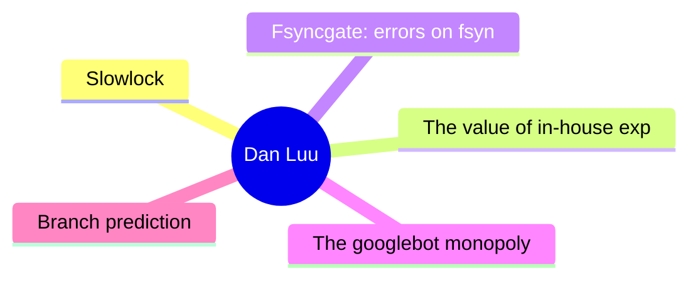

# 🔍 Dan Luu Top 5 (2026-06-16)

## 思维导图

## 列表（5 条）

### 1. Slowlock
- **链接**: [https://danluu.com/limplock/](https://danluu.com/limplock/)
- **发布**: Wed, 30 Sep 2015 00:00:00 +0000
- **简介**: Every once in awhile, you hear a story like “there was a case of a 1-Gbps NIC card on a machine that suddenly was transmitting only at 1 Kbps, which then caused a chain reaction upstream in such a way that the performanc

### 2. The value of in-house expertise
- **链接**: [https://danluu.com/in-house/](https://danluu.com/in-house/)
- **发布**: Wed, 29 Sep 2021 00:00:00 +0000
- **简介**: An alternate title for this post might be, &quot;Twitter has a kernel team!?&quot;. At this point, I've heard that surprised exclamation enough that I've lost count of the number times that's been said to me (I'd guess t

### 3. Fsyncgate: errors on fsync are unrecovarable
- **链接**: [https://danluu.com/fsyncgate/](https://danluu.com/fsyncgate/)
- **发布**: Wed, 28 Mar 2018 00:00:00 +0000
- **简介**: This is an archive of the original &quot;fsyncgate&quot; email thread. This is posted here because I wanted to have a link that would fit on a slide for a talk on file safety with a mobile-friendly non-bloated format.

F

### 4. The googlebot monopoly
- **链接**: [https://danluu.com/googlebot-monopoly/](https://danluu.com/googlebot-monopoly/)
- **发布**: Wed, 27 May 2015 00:00:00 +0000
- **简介**: TIL that Bell Labs and a whole lot of other websites block archive.org, not to mention most search engines. Turns out I have a broken website link in a GitHub repo, caused by the deletion of an old webpage. When I tried 

### 5. Branch prediction
- **链接**: [https://danluu.com/branch-prediction/](https://danluu.com/branch-prediction/)
- **发布**: Wed, 23 Aug 2017 00:00:00 +0000
- **简介**: This is a pseudo-transcript for a talk on branch prediction given at Two Sigma on 8/22/2017 to kick off &quot;localhost&quot;, a talk series organized by RC.

How many of you use branches in your code? Could you please r
