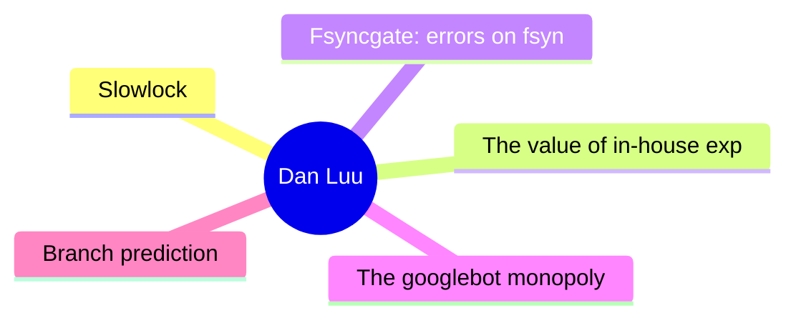

# 🔍 Dan Luu Top 5 (2026-07-05)

## 思维导图

## 列表（5 条，2 条含全文）

### 1. Slowlock
- **链接**: [https://danluu.com/limplock/](https://danluu.com/limplock/)
- **发布**: Wed, 30 Sep 2015 00:00:00 +0000
- **简介**: Every once in awhile, you hear a story like “there was a case of a 1-Gbps NIC card on a machine that suddenly was transmitting only at 1 Kbps, which then caused a chain reaction upstream in such a way that the performanc

📄 全文（4022 字符，点击展开）

Every once in awhile, you hear a story like “there was a case of a 1-Gbps NIC card on a machine that suddenly was transmitting only at 1 Kbps, which then caused a chain reaction upstream in such a way that the performance of the entire workload of a 100-node cluster was crawling at a snail's pace, effectively making the system unavailable for all practical purposes”. The stories are interesting and the postmortems are fun to read, but it's not really clear how vulnerable systems are to this kind of failure or how prevalent these failures are.

 The situation reminds me of distributed systems failures before [Jepsen](https://aphyr.com/tags/jepsen). There are lots of anecdotal horror stories, but a common response to those is “works for me”, even when talking about systems that are now known to be fantastically broken. A handful of companies that are really serious about correctness have good tests and metrics, but they mostly don't talk about them publicly, and the general public has no easy way of figuring out if the systems they're running are sound.

  Thanh Do et al. have tried to look at this systematically -- [what's the effect of hardware that's been crippled but not killed](http://ucare.cs.uchicago.edu/pdf/socc13-limplock.pdf), and [how often does this happen in practice](http://ucare.cs.uchicago.edu/pdf/socc14-cbs.pdf)? It turns out that a lot of commonly used systems aren't robust against against “limping” hardware, but that the incidence of these types of failures are rare (at least until you have unreasonably large scale).

 The effect of a single slow node can be [quite dramatic](http://pages.cs.wisc.edu/~thanhdo/pdf/talk-socc-limplock.pdf):

 The job completion rate slowed down from 172 jobs per hour to 1 job per hour, effectively killing the entire cluster. Facebook has mechanisms to deal with dead machines, but they apparently didn't have any way to deal with slow machines at the time.

 When Do et al. looked at widely used open source software (HDFS, Hadoop, ZooKeeper, Cassandra, and HBase), they found similar problems.

 Each subgraph is a different failure condition. F is HDFS, H is Hadoop, Z is Zookeeper, C is Cassandra, and B is HBase. The leftmost (white) bar is the baseline no-failure case. Going to the right, the next is a crash, and the subsequent bars are results for a single degraded but not crashed hardware (further right means slower). In most (but not all) cases, having degraded hardware affected performance a lot more than having failed hardware. Note that these graphs are all log scale; going up one increment is a 10x difference in performance!

 Curiously, a failed disk can cause some operations to speed up. That's because there are operations that have less replication overhead if a replica fails. It seems a bit weird to me that there isn't more overhead, because the system has to both find a replacement replica and replicate data, but what do I know?

 Anyway, why is a slow node so much worse than a dead node? The authors define three failure modes and explain what causes each one. There's operation limplock, when an operation is slow because some subpart of the operation is slow (e.g., a disk read is slow because the disk is degraded), node limplock, when a node is slow even for seemingly unrelated operations (e.g, a read from RAM is slow because a disk is degraded), and cluster limplock, where the entire cluster is slow (e.g., a single degraded disk makes an entire 1000 machine cluster slow).

 How do these happen?

 #### Operation Limplock

 This one is the simplest. If you try to read from disk, and your disk is slow, your disk read will be slow. In the real world, we'll see this when operations have a single point of failure, and when monitoring is designed to handle total failure and not degraded performance. For example, an HBase access to a region goes through the server responsible for that region. The data is replicated on HDFS, but this doesn't help you if the node that owns the dat

...（截断，原文 12046+ 字符）

### 2. The value of in-house expertise
- **链接**: [https://danluu.com/in-house/](https://danluu.com/in-house/)
- **发布**: Wed, 29 Sep 2021 00:00:00 +0000
- **简介**: An alternate title for this post might be, &quot;Twitter has a kernel team!?&quot;. At this point, I've heard that surprised exclamation enough that I've lost count of the number times that's been said to me (I'd guess t

📄 全文（4022 字符，点击展开）

An alternate title for this post might be, "Twitter has a kernel team!?". At this point, I've heard that surprised exclamation enough that I've lost count of the number times that's been said to me (I'd guess that it's more than ten but less than a hundred). If we look at trendy companies that are within a couple factors of two in size of Twitter (in terms of either market cap or number of engineers), they mostly don't have similar expertise, often as a result of path dependence — because they "grew up" in the cloud, they didn't need kernel expertise to keep the lights on the way an on prem company does. While that makes it socially understandable that people who've spent their career at younger, trendier, companies, are surprised by Twitter having a kernel team, I don't think there's a technical reason for the surprise.

 Whether or not it has kernel expertise, a company Twitter's size is going to regularly run into kernel issues, from major production incidents to papercuts. Without a kernel team or the equivalent expertise, the company will muddle through the issues, running into unnecessary problems as well as taking an unnecessarily long time to mitigate incidents. As an example of a critical production incident, just because it's already been written up publicly, I'll cite [this post](https://blog.twitter.com/engineering/en_us/topics/open-source/2020/hunting-a-linux-kernel-bug), which dryly notes:

  Earlier last year, we identified a firewall misconfiguration which accidentally dropped most network traffic. We expected resetting the firewall configuration to fix the issue, but resetting the firewall configuration exposed a kernel bug

 

 What this implies but doesn't explicitly say is that this firewall misconfiguration was the most severe incident that's occured during my time at Twitter and I believe it's actually the most severe outage that Twitter has had since 2013 or so. As a company, we would've still been able to mitigate the issue without a kernel team or another team with deep Linux expertise, but it would've taken longer to understand why the initial fix didn't work, which is the last thing you want when you're debugging a serious outage. Folks on the kernel team were already familiar with the various diagnostic tools and debugging techniques necessary to quickly understand why the initial fix didn't work, which is not common knowledge at some peer companies (I polled folks at a number of similar-scale peer companies to see if they thought they had at least one person with the knowledge necessary to quickly debug the bug and the answer was no at many companies).

 Another reason to have in-house expertise in various areas is that they easily pay for themselves, which is a special case of [the generic argument that large companies should be larger than most people expect because tiny percentage gains are worth a large amount in absolute dollars](/sounds-easy/). If, in the lifetime of the specialist team like the kernel team, a single person found something that persistently reduced [TCO](https://en.wikipedia.org/wiki/Total_cost_of_ownership) by 0.5%, that would pay for the team in perpetuity, and Twitter’s kernel team has found many such changes. In addition to [kernel patches](https://patchwork.ozlabs.org/project/netdev/list/?submitter=211&state=*&archive=both¶m=4&page=1) that sometimes have that kind of impact, people will also find configuration issues, etc., that have that kind of impact.

 So far, I've only talked about the kernel team because that's the one that most frequently elicits surprise from folks for merely existing, but I get similar reactions when people find out that Twitter has a bunch of ex-Sun JVM folks who worked on HotSpot, like Ramki Ramakrishna, Tony Printezis, and John Coomes. People wonder why a social media company would need such deep JVM expertise. As with the kernel team, companies our size that use the JVM run into weird issues and JVM bugs and it's helpful to have people with 

...（截断，原文 11036+ 字符）

### 3. Fsyncgate: errors on fsync are unrecovarable
- **链接**: [https://danluu.com/fsyncgate/](https://danluu.com/fsyncgate/)
- **发布**: Wed, 28 Mar 2018 00:00:00 +0000
- **简介**: This is an archive of the original &quot;fsyncgate&quot; email thread. This is posted here because I wanted to have a link that would fit on a slide for a talk on file safety with a mobile-friendly non-bloated format.

F

### 4. The googlebot monopoly
- **链接**: [https://danluu.com/googlebot-monopoly/](https://danluu.com/googlebot-monopoly/)
- **发布**: Wed, 27 May 2015 00:00:00 +0000
- **简介**: TIL that Bell Labs and a whole lot of other websites block archive.org, not to mention most search engines. Turns out I have a broken website link in a GitHub repo, caused by the deletion of an old webpage. When I tried 

### 5. Branch prediction
- **链接**: [https://danluu.com/branch-prediction/](https://danluu.com/branch-prediction/)
- **发布**: Wed, 23 Aug 2017 00:00:00 +0000
- **简介**: This is a pseudo-transcript for a talk on branch prediction given at Two Sigma on 8/22/2017 to kick off &quot;localhost&quot;, a talk series organized by RC.

How many of you use branches in your code? Could you please r
