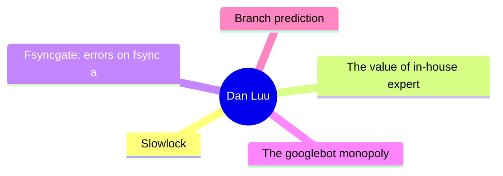
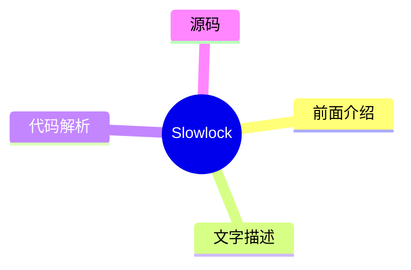
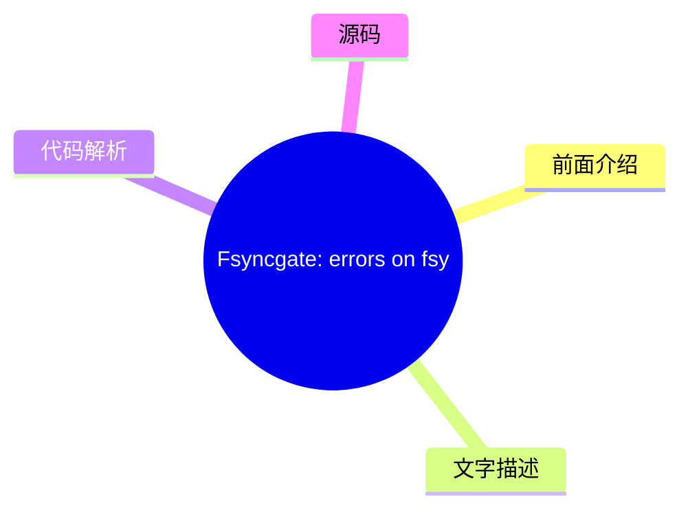
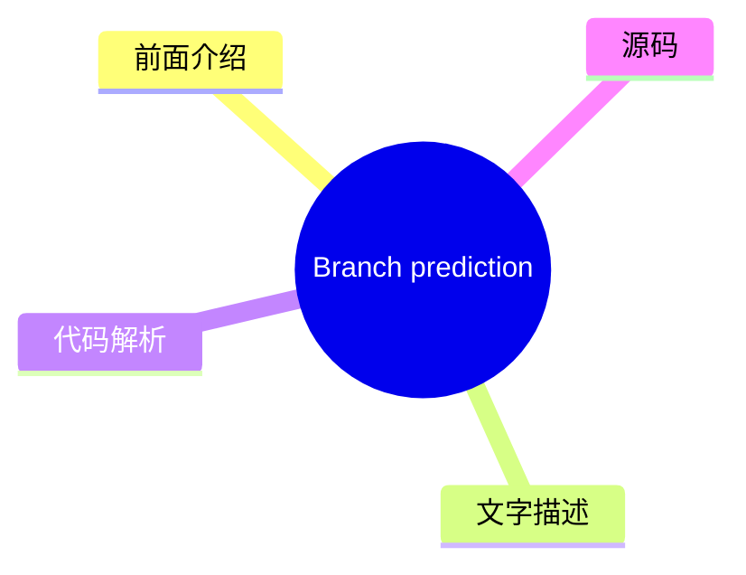

# 🔍 Dan Luu Top 5 (2026-07-18)

## 前面介绍

- 数据源：Dan Luu
- 抓取日期：2026-07-18
- 条目数：5
- 含完整正文：5
- 含代码片段：3
- 组织方式：前面介绍 / 树状图 / 文字描述 / 代码解析 / 源码

## 思维导图



## 详细整理（5 条，5 条含全文，3 条含代码）

### 1. Slowlock
- **链接**: [https://danluu.com/limplock/](https://danluu.com/limplock/)
- **发布**: Wed, 30 Sep 2015 00:00:00 +0000

#### 前面介绍

- Every once in awhile, you hear a story like “there was a case of a 1-Gbps NIC card on a machine that suddenly was transmitting only at 1 Kbps, which then caused a chain reaction upstream in such a way that the performance of the entire workload of a
- 发布时间：Wed, 30 Sep 2015 00:00:00 +0000

#### 树状图



#### 文字描述

- Every once in awhile, you hear a story like “there was a case of a 1-Gbps NIC card on a machine that suddenly was transmitting only at 1 Kbps, which then caused a chain reaction upstream in such a way that the performance of the entire workload of a 100-node cluster was crawling at a snail's pace, effectively making the system unavailable for all practical purposes”. The storie

#### 代码解析

- 本文未检测到明确代码块，内容更偏新闻、观点或方法论。

#### 源码

#### 中文节选

每隔一段时间，你都会听到这样的故事：“有一台机器上的 1-Gbps 网卡突然只能以 1 Kbps 的速度传输，这随后引发了一连串的连锁反应，导致一个 100 节点集群的整个工作负载性能变得像蜗牛一样慢，实际上使该系统在所有实际用途上都变得不可用”。这些故事很有趣，事后分析也很有趣读，但并不清楚系统对这种故障的脆弱性有多大，或者这类故障的发生频率有多高。

这种情况让我想起了 [Jepsen](https://aphyr.com/tags/jepsen) 之前分布式系统的故障。有很多轶事性的恐怖故事，但针对这些故事的一个常见回应是“对我有效”，即使是在谈论那些现在已知是极其糟糕的系统时也是如此。少数几家真正重视正确性的公司拥有良好的测试和指标，但它们大多不会公开谈论这些，公众也没有简单的方法来判断他们运行的系统是否可靠。

Thanh Do 等人尝试系统地研究了这个问题——[受损但未完全损坏的硬件有什么影响](http://ucare.cs.uchicago.edu/pdf/socc13-limplock.pdf)，以及[这种情况在实践中发生的频率如何](http://ucare.cs.uchicago.edu/pdf/socc14-cbs.pdf)？事实证明，许多常用的系统都无法抵御“跛行”硬件，但这类故障的发生率很低（至少在你拥有不合理的大规模之前）。

单个慢节点的效应可以[非常显著](http://pages.cs.wisc.edu/~thanhdo/pdf/talk-socc-limplock.pdf)：

作业完成率从每小时 172 个作业降至每小时 1 个作业，有效地杀死了整个集群。Facebook 有处理死机的机制，但他们显然当时没有任何办法来处理慢速机器。

当 Do 等人查看广泛使用的开源软件（HDFS、Hadoop、ZooKeeper、Cassandra 和 HBase）时，他们发现了类似的问题。

每个子图代表一种不同的故障条件。F 代表 HDFS，H 代表 Hadoop，Z 代表 Zookeeper，C 代表 Cassandra，B 代表 HBase。最左侧（白色）的条形图是基准无故障情况。向右移动，下一个是崩溃，随后的条形图是单个降级但未崩溃硬件的结果（越靠右意味着越慢）。在大多数（但并非全部）情况下，降级硬件对性能的影响远大于故障硬件。请注意，这些图表都是对数刻度；向上移动一个刻度意味着性能相差 10 倍！

 奇怪的是，故障磁盘可能会导致某些操作加速。这是因为如果副本失效，某些操作的复制开销会更小。对我来说这有点奇怪，因为系统既要找到替换副本又要复制数据，却似乎没有更多的开销，但我又知道些什么呢？

 无论如何，为什么慢节点比死节点糟糕得多？

#### 完整正文（中文）

每隔一段时间，你都会听到这样的故事：“有一台机器上的 1-Gbps 网卡突然只能以 1 Kbps 的速度传输，这随后引发了一连串的连锁反应，导致一个 100 节点集群的整个工作负载性能变得像蜗牛一样慢，实际上使该系统在所有实际用途上都变得不可用”。这些故事很有趣，事后分析也很有趣读，但并不清楚系统对这种故障的脆弱性有多大，或者这类故障的发生频率有多高。

这种情况让我想起了 [Jepsen](https://aphyr.com/tags/jepsen) 之前分布式系统的故障。有很多轶事性的恐怖故事，但针对这些故事的一个常见回应是“对我有效”，即使是在谈论那些现在已知是极其糟糕的系统时也是如此。少数几家真正重视正确性的公司拥有良好的测试和指标，但它们大多不会公开谈论这些，公众也没有简单的方法来判断他们运行的系统是否可靠。

Thanh Do 等人尝试系统地研究了这个问题——[受损但未完全损坏的硬件有什么影响](http://ucare.cs.uchicago.edu/pdf/socc13-limplock.pdf)，以及[这种情况在实践中发生的频率如何](http://ucare.cs.uchicago.edu/pdf/socc14-cbs.pdf)？事实证明，许多常用的系统都无法抵御“跛行”硬件，但这类故障的发生率很低（至少在你拥有不合理的大规模之前）。

单个慢节点的效应可以[非常显著](http://pages.cs.wisc.edu/~thanhdo/pdf/talk-socc-limplock.pdf)：

作业完成率从每小时 172 个作业降至每小时 1 个作业，有效地杀死了整个集群。Facebook 有处理死机的机制，但他们显然当时没有任何办法来处理慢速机器。

当 Do 等人查看广泛使用的开源软件（HDFS、Hadoop、ZooKeeper、Cassandra 和 HBase）时，他们发现了类似的问题。

每个子图代表不同的故障条件。F 代表 HDFS，H 代表 Hadoop，Z 代表 Zookeeper，C 代表 Cassandra，B 代表 HBase。最左侧（白色）的条形图是基线无故障情况。向右移动，下一个是崩溃，随后的条形图是单个降级但未崩溃硬件的结果（越靠右意味着越慢）。在大多数（但并非全部）情况下，降级硬件对性能的影响远大于故障硬件。请注意，这些图表都是对数刻度；向上增加一个刻度意味着性能相差 10 倍！

 奇怪的是，失败的磁盘可能会导致某些操作加速。这是因为如果副本失效，某些操作的复制开销会更小。对我来说，这似乎有点奇怪，因为系统既必须找到替换副本又要复制数据，但谁知道呢？

 无论如何，为什么慢节点比死节点糟糕得多？作者定义了三种故障模式并解释了每种模式的原因。有操作迟缓锁，即某个操作因为操作的一部分缓慢而变慢（例如，由于磁盘降级导致磁盘读取缓慢），节点迟缓锁，即节点即使对于看似无关的操作也很慢（例如，由于磁盘降级导致从 RAM 读取缓慢），以及集群迟缓锁，即整个集群都很慢（例如，单个降级磁盘导致整个 1000 台机器的集群变慢）。

 这些是如何发生的？

 #### 操作迟缓锁

 这是最简单的一种。如果你尝试从磁盘读取，而你的磁盘很慢，那么你的磁盘读取就会很慢。在现实世界中，当操作存在单点故障，以及监控设计用于处理完全故障而不是降级性能时，我们会看到这种情况。例如，HBase 访问区域会经过负责该区域的服务器。数据在 HDFS 上复制，但如果拥有数据的节点正在“跛行”，这对你没有帮助。说到 HDFS，它的超时时间是 60 秒，读取是以 64K 块进行的，这意味着在 HDFS 切换到健康节点之前，你的读取速度可能会慢到接近 1K/s。

 #### 节点迟缓锁

为什么慢速磁盘会导致内存读取变慢？再看一下 HDFS，它使用了一个线程池。如果每个线程都正非常缓慢地完成磁盘读取，内存读取就会阻塞，直到有线程空闲出来。

这不仅仅是在使用有限线程池或其他有界抽象时才会出现的问题——现实是机器资源是有限的，如果未经过精心设计以避免这种情况，无界抽象最终会触及机器的限制。例如，Zookeeper 会维护一个操作队列，而慢速的 follower 会导致 leader 的队列耗尽物理内存。

#### 集群僵死

如果整个集群依赖单个主节点，而该主节点又处于“跛行”状态，整个集群很容易变得不健康。级联故障也会导致这种情况——第一个图表中，集群从每小时完成 172 个作业变为每小时 1 个作业，实际上就是 Facebook 在 Hadoop 上的工作负载。这里让我感到惊讶的是，Hadoop 本应具有尾部容错能力——单个慢速任务不应该对整个作业的完成产生重大影响。那么发生了什么？不健康的节点会感染健康的节点，最终锁死整个集群。

Hadoop 的尾部容错能力来自于当结果返回缓慢时启动推测计算。特别是，当拖后腿的任务与其他结果相比异常缓慢时。这在 reduce 节点“跛行”（子图 H2）时效果很好，但当 [map 节点](http://static.googleusercontent.com/media/research.google.com/en//archive/mapreduce-osdi04.pdf) “跛行”（子图 H1）时，它可能会减慢同一作业中所有 reducer 的速度，从而破坏了 Hadoop 的尾部容错机制。

要了解原因，我们必须查看 [Hadoop 的推测算法](https://www.usenix.org/legacy/event/osdi08/tech/full_papers/zaharia/zaharia_html/index.html)。每个作业都有一个进度分数，这是一个介于 0 和 1（含）之间的数字。对于 Map 任务，分数是已读取的输入数据的比例。对于 Reduce 任务，三个阶段（从 Map 任务复制数据、排序和归约）各获得 1/3 的分数。如果一个任务已经运行了至少一分钟，并且其进度分数低于其类别的平均值减去 0.2，那么该作业将被推测执行。

在 H2 的情况下，网络接口卡（NIC）运行缓慢，因此 Map 阶段正常完成，因为结果最终被写入本地磁盘。但是，当 Reduce 节点尝试从运行缓慢的 Map 节点获取数据时，它们都会停滞不前，这拉低了该类别的平均分数，从而阻止了推测作业的运行。从大局来看，每个 Hadoop 节点都有有限数量的 Map 和 Reduce 任务。如果这些任务被运行缓慢的任务填满，整个节点就会锁定。由于 Hadoop 并非设计用来避免级联故障，这最终会导致整个集群锁定。

我发现一件有趣的事情是，这种确切的故障原因在 2004 年发表的原始 MapReduce 论文中 [已有描述](http://research.google.com/archive/mapreduce.html)。他们甚至明确指出了慢速磁盘和网络是拖后腿任务（Stragglers）的原因，这促使他们设计了推测执行算法。然而，他们并没有提供该算法的细节。MapReduce 的开源克隆版本 Hadoop 试图避免同样的问题。Hadoop 最初于 2008 年发布。五年后，当我们阅读的这篇论文发表时，其内置的拖后腿任务检测机制不仅未能防止多种类型的拖后腿任务，还未能防止拖后腿任务有效地死锁整个集群。

### 结论

我不会详细说明每个系统在测试中的表现。论文对此有很好的详细描述，如果您感兴趣，我推荐阅读该论文。总结来说，Cassandra 表现相当不错，而 HDFS、Hadoop 和 HBase 则不然。

Cassandra 在这两个方面表现良好。首先，[来自 2009 年的这个补丁](https://issues.apache.org/jira/browse/CASSANDRA-488) 防止了队列溢出感染健康的节点，这避免了其他系统中导致集群范围故障的主要故障模式。其次，所使用的架构 ([SEDA](http://www.eecs.harvard.edu/~mdw/proj/seda/)) 解耦了不同类型的操作，这使得即使某些操作出现故障，良好的操作仍能继续执行。

阅读这篇论文后，我的主要疑问是，这类故障发生的频率如何，原因是什么，而且合理的指标/报告不应该能捕获这类事情吗？

对于第一个问题的答案，许多同一作者还发表了一篇论文，他们在其中研究了 [Cassandra、Flume、HDFS 和 ZooKeeper 中的 3000 次故障](http://ucare.cs.uchicago.edu/pdf/socc14-cbs.pdf)，并确定了哪些故障与硬件有关，以及是什么硬件故障。

性能降级的情况有 14 起，与其他 410 起硬件故障相比。在其样本中，这占故障总数的 3%；虽然罕见，但并非罕见到我们可以忽略这个问题。

如果我们不能忽略这类错误，那么如何在它们进入生产环境之前捕获它们？该论文使用了 [Emulab 测试平台](http://www.emulab.net/)，这真的很酷。不幸的是，Emulab 页面写道“Emulab 是一个公共设施，向全球大多数研究人员免费开放。如果您不确定自己是否有资格使用，请参阅我们的政策文档或联系我们。如果您认为自己有资格，可以申请启动一个新项目”。这是可以理解的，但这意味着它可能不是我们大多数人的绝佳解决方案。

绝大多数运行缓慢的硬件问题都是由网络或磁盘速度慢引起的。为什么不能修改 Jepsen 或类似工具的版本，来模拟磁盘或网络速度慢呢？一个简单的实现虽然无法达到 Emulab 的精度，但既然我们讨论的是数量级的减速，10%（甚至 2 倍）的偏差对于测试系统在硬件降级情况下的鲁棒性来说应该足够了。你可以想象出多种实现方式。例如，要在 Linux 上模拟慢速网络，可以尝试通过 [qdisc](http://linux-ip.net/articles/Traffic-Control-HOWTO/) 进行限速，通过 [ptrace 挂钩系统调用](https://github.com/majek/fluxcapacitor)，等等。对于慢速 CPU，可以通过 cgroups 和 cpu.shares 进行速率限制，或者直接将进程映射到 UC 内存（或者如果太慢的话，也许是 WT 或 WC），以此类推，适用于磁盘和其他故障模式。

这就剩下了我的最后一个问题，系统不应该已经捕获了这些类型的故障，即使它们并不特别关注它们吗？如上所示，硬件严重缓慢的系统很少，我们可以直接将其视为死机，而不会显著影响我们的总计算资源。而且，硬件受损的系统可以相当直接地检测到。此外，多租户系统无论如何都必须对自己的性能进行[持续监控，以获得良好的利用率](//danluu.com/new-cpu-features/#partitioning)。

那么，为什么我们要关心设计能够抵御“跛行硬件”的系统呢？答案的一部分是纵深防御。当然，我们应该有监控，但也应该有在监控失效时依然稳健的系统，因为监控必然会失效。答案的另一部分是，通过使系统对跛行硬件更具容忍度，我们也会使它们在多租户环境中对来自其他工作负载的干扰更具容忍度。最后一点有点像推测性的实证问题——有可能，设计对来自同一机器上竞争工作负载的干扰不那么稳健的系统会更高效，同时使用[更好的分区](//danluu.com/intel-cat/)来避免干扰。

 

 

 感谢 Leah Hanson、Hari Angepat、Laura Lindzey、Julia Ev


### 2. The value of in-house expertise
- **链接**: [https://danluu.com/in-house/](https://danluu.com/in-house/)
- **发布**: Wed, 29 Sep 2021 00:00:00 +0000

#### 前面介绍

- An alternate title for this post might be, &quot;Twitter has a kernel team!?&quot;. At this point, I've heard that surprised exclamation enough that I've lost count of the number times that's been said to me (I'd guess that it's more than ten but les
- 发布时间：Wed, 29 Sep 2021 00:00:00 +0000

#### 树状图


#### 文字描述

- An alternate title for this post might be, "Twitter has a kernel team!?". At this point, I've heard that surprised exclamation enough that I've lost count of the number times that's been said to me (I'd guess that it's more than ten but less than a hundred). If we look at trendy companies that are within a couple factors of two in size of Twitter (in terms of either market cap 

#### 代码解析

- 本文未检测到明确代码块，内容更偏新闻、观点或方法论。

#### 源码

#### 中文节选

这篇帖子的备选标题可能是，“Twitter 有内核团队！？” 到了这个时候，我已经听过这种惊讶的感叹太多次了，以至于我都数不清有多少次了（我猜是十次到一百次之间）。如果我们看看那些规模与 Twitter 相差不超过两倍（无论是市值还是工程师数量）的热门公司，它们大多不具备类似的专长，这通常是由于路径依赖的结果——因为它们“成长”在云端，所以不需要像本地部署公司那样具备内核专长来维持运营。虽然这让人可以理解，为什么那些在更年轻、更热门的公司度过职业生涯的人会对 Twitter 拥有内核团队感到惊讶，但我认为这种惊讶并没有技术上的原因。

无论是否具备内核专长，像 Twitter 这样规模的公司都会经常遇到内核问题，从重大的生产事故到微小的麻烦。如果没有内核团队或同等专长，公司将只能勉强应对这些问题，不仅会遇到不必要的问题，还会花费不必要的时间来缓解事故。作为一个重大生产事故的例子，因为已经公开写过，我将引用[这篇博文](https://blog.twitter.com/engineering/en_us/topics/open-source/2020/hunting-a-linux-kernel-bug)，其中冷静地指出：

 去年早些时候，我们识别出一个防火墙配置错误，意外导致大部分网络流量丢失。我们预期重置防火墙配置可以修复问题，但重置防火墙配置暴露了一个内核错误

这意味着虽然并未明说，但这次防火墙配置错误是我任职期间发生的最严重事件，我相信这实际上也是自2013年左右以来推特遭遇的最严重中断。作为一家公司，即使没有内核团队或其他拥有深厚 Linux 专业知识的团队，我们本仍能缓解该问题，但理解为何最初的修复无效将需要更长时间，而在调试严重中断时，这是你最不希望发生的事情。内核团队的成员已经熟悉各种诊断工具和调试技术，能够快速理解为何最初的修复无效，而这是某些同行公司不具备的常识（我调查了多家规模相当的同行公司，询问他们是否认为至少有一人具备快速调试该错误所需的知识，答案是在许多公司都是否定的）。

在各个领域拥有内部专业知识的另一个原因是，它们很容易通过自身价值来证明其合理性，这是[大型公司应该比大多数人预期的更大的通用论点的一个特例，因为微小的百分比收益在绝对金额上也是一笔巨款](/sounds-easy/))。如果，在像内核团队这样的专业团队的整个生命周期内，一个 s

#### 完整正文（中文）

这篇帖子的备选标题可能是，“Twitter 有内核团队！？” 到了这个时候，我已经听过这种惊讶的感叹太多次了，以至于我都数不清有多少次了（我猜是十次到一百次之间）。如果我们看看那些规模与 Twitter 相差不超过两倍（无论是市值还是工程师数量）的热门公司，它们大多不具备类似的专长，这通常是由于路径依赖的结果——因为它们“成长”在云端，所以不需要像本地部署公司那样具备内核专长来维持运营。虽然这让人可以理解，为什么那些在更年轻、更热门的公司度过职业生涯的人会对 Twitter 拥有内核团队感到惊讶，但我认为这种惊讶并没有技术上的原因。

无论是否具备内核专长，像 Twitter 这样规模的公司都会经常遇到内核问题，从重大的生产事故到微小的麻烦。如果没有内核团队或同等专长，公司将只能勉强应对这些问题，不仅会遇到不必要的问题，还会花费不必要的时间来缓解事故。作为一个重大生产事故的例子，因为已经公开写过，我将引用[这篇博文](https://blog.twitter.com/engineering/en_us/topics/open-source/2020/hunting-a-linux-kernel-bug)，其中冷静地指出：

 去年早些时候，我们识别出一个防火墙配置错误，意外导致大部分网络流量丢失。我们预期重置防火墙配置可以修复问题，但重置防火墙配置暴露了一个内核错误

这意味着但并未明确说明的是，这次防火墙配置错误是我任职期间发生的最严重事件，我认为这实际上自2013年左右以来，Twitter遭遇的最严重的中断。作为一家公司，即使没有内核团队或其他拥有深厚 Linux 专业知识的团队，我们本仍能缓解该问题，但理解为何初始修复无效所需的时间会更长，而在调试严重中断时，这是你最不希望发生的事情。内核团队的成员已经熟悉各种诊断工具和调试技术，能够快速理解为何初始修复无效，这在一些同等规模的公司中并非常识（我调查了多家类似规模的公司，询问他们是否认为至少有一人具备快速调试该错误所需的知识，许多公司的回答是否定的）。

在各个领域拥有内部专业知识的另一个原因是，它们很容易收回成本，这是[大型公司应该比大多数人预期的更大的通用论点的一个特例，因为微小的百分比收益在绝对金额上也是巨大的](/sounds-easy/))。如果在一个像内核团队这样的专业团队的生命周期内，有一个人发现了一些能持续降低[TCO](https://en.wikipedia.org/wiki/Total_cost_of_ownership) 0.5% 的东西，那么这笔收益将足以永久支付该团队的费用，而 Twitter 的内核团队已经发现了许多此类变更。除了有时具有这种影响的[内核补丁](https://patchwork.ozlabs.org/project/netdev/list/?submitter=211&state=*&archive=both¶m=4&page=1)外，人们还会发现具有这种影响的配置问题等。

到目前为止，我只谈到了内核团队，因为那是唯一一个仅仅因为存在就会让大多数人感到惊讶的团队，但当我告诉人们 Twitter 有很多前 Sun JVM 团队成员，比如 Ramki Ramakrishna、Tony Printezis 和 John Coomes，他们曾参与过 HotSpot 的工作时，我也得到了类似的反应。人们会问，一家社交媒体公司为什么需要如此深厚的 JVM 专业知识。就像内核团队一样，我们这样规模的公司在使用 JVM 时会遇到各种奇怪的问题和 JVM 的 Bug，拥有具备深厚专业知识的人员来调试这些问题会很有帮助。而且，就像内核团队一样，对 JVM 的单独优化可以永久性地为团队创造价值。一个具体的例子是 [Flavio Brasil 的这个补丁，它虚拟化了比较和交换调用](https://github.com/oracle/graal/pull/636)。

背景是 Twitter 使用了大量的 Scala。尽管有各种说法，但 Scala 比起 Java 使用了更多的内存，而且明显更慢，如果你大规模使用 Scala，这会产生显著的代价，足以证明进行优化工作以减少惯用 Scala 和惯用 Java 之间的性能差距是合理的。

在补丁之前，如果你对我们的 Scala 代码进行性能分析，你会看到在 Future/Promise 上花费了不合理的大量时间，包括在那些你可能天真地认为编译器会优化掉的工作中。其中一个原因是 Future 使用了 [比较和交换](https://en.wikipedia.org/wiki/Compare-and-swap) (CAS) 操作，这对 JVM 优化来说是不可见的。上面链接的补丁在 Future 没有逃逸方法作用域时避免了 CAS 操作。[这个配套补丁](https://github.com/twitter/util/commit/3245a8e1a98bd5eb308f366678528879d7140f5e) 移除了某些不太适合编译器优化的地方的 CAS 操作。这两个补丁结合在一起，将典型的主要 Twitter 服务使用惯用 Scala 的成本降低了 5% 到 15%，永久性地多次为 JVM 团队创造了价值，而这甚至还不是 Flavio 那年发现的最大收益。

我不会对那些能多次收回成本的团队进行逐一拆解，因为这样的团队实在太多了，即使我将范围限定在“人们惊讶于 Twitter 拥有这些团队”的范围内也是如此。

一个相关的话题是人们如何讨论“购买 vs. 构建”的讨论。我见过很多讨论，有人主张“购买”，因为这样可以消除在该领域具备专业知识的必要性。这可能是真的，但我看到这种情况被论证的频率远高于其真实发生的频率。我认为这种情况往往不适用于分布式追踪。[我们之前看过一些 Twitter 从追踪中获得价值的方式](/tracing-analytics/)，这是 Rebecca Isaacs 设定的愿景。另一方面，当我与规模相当的同行公司的员工交谈时，大多数人尚未（或尚未？）成功从分布式追踪中获得显著价值。这种情况非常普遍，以至于我每年都会看到关于分布式追踪毫无用处的病毒式传播的 Twitter 线程。尽管我们选择了更昂贵的“构建”选项，但仅凭记忆，我就能想到追踪的多种用途，其回报率是构建追踪成本的 10 倍到 100 倍，而那些选择更便宜的“购买”选项的许多公司的员工，却经常抱怨追踪不值得。

巧合的是，我刚刚正好和 Pam Wolf 谈论了这个确切的话题。Pam Wolf 是一位土木工程教授，在多个大洲都有土木工程行业的经验，她对此也有相关的看法。对于大规模系统（项目），对于你不在自己公司处理的每个领域，都需要一个内部专家（业主方工程师）。虽然从技术上讲，你可以雇佣另一家公司作为专家，但这比开发或雇佣内部专业知识更昂贵，而且从长远来看，风险也更大。这非常类似于我作为电气工程师的工作经验，那些将职能外包给其他公司但不保留内部专家的组织，付出的代价非常高昂，而且不仅仅是金钱上的。他们经常在成本高昂的同时，还伴随着长期的设计缺陷和延误。“购买”可以并且通常会减少所需专业知识的需求，但通常并不能消除对专业知识的需求。

这与另一个常见的抽象论点有关，该论点认为公司应该专注于“它们的比较优势领域”或“最重要的问题”或“核心业务需求”，并将其他所有事情外包。我们已经看到了几个例子，证明这种说法并不成立，因为在一个足够大的规模下，拥有内部专业知识比没有更有利可图，无论某件事是否是业务的核心（人们可以争辩说，所有移至内部的事情都是业务的核心，但这会让“核心性”这一概念变得毫无意义）。这种抽象建议过于简单的另一个原因是，企业可以在某种程度上任意选择它们的比较优势是什么。一个典型的例子是苹果将 CPU 设计移至内部。自以 2.78 亿美元收购 PA Semi（前身为 SiByte 团队，再之前是 DEC 的团队）以来，苹果一直在以相当大的优势生产[手机和笔记本电脑功耗范围内的最佳芯片](https://twitter.com/danluu/status/1433297089866383364)。但在收购之前，苹果没有任何东西使得这次收购成为必然，使得 CPU 设计成为苹果固有的比较优势。但如果一家公司可以选择一个领域并将其变成比较优势领域，那么说这家公司应该专注于其比较优势，并不是很有用的建议。

 2.78 亿美元从绝对意义上讲是一笔巨款，但作为苹果资源的一部分，这微乎其微，而且较小的公司也可以通过将一小部分资源投入到其中来开展尖端工作，例如，Twitter 以任何 1 亿美元公司都能负担得起的价格，[创造了新颖的缓存算法和数据结构](https://twitter.com/danluu/status/1381687511362138113)，并正在开展其他前沿的缓存工作。拥有优秀的[缓存基础设施](/cache-incidents/)对 Twitter 业务的核心程度，并不比为苹果创造优秀的 CPU 更核心，但它是一个杠杆，Twitter 可以利用它比其他情况下赚更多的钱。

对于小公司来说，为公司涉及的方方面面都配备内部专家是不合逻辑的，但公司不需要变得非常庞大，开始拥有操作系统、语言运行时以及其他通常被认为相当专业的组件的内部专业知识就已经说得通了。回顾 Twitter 的历史，Yao Yue 指出，在她早期在 Twitter 工作（当时我们有约 100 名工程师）时，她经常去内核团队寻求帮助来调试生产事故，而在某些情况下，如果没有内核团队的帮助，调试可能很容易花费 10 倍的时间。社交媒体公司通常在每用户和每美元的基础上具有相对较高的规模，因此当一家公司拥有 100 名工程师时，并非每家公司都需要同等程度的专业知识，但会有其他一些领域，这些领域并非显然是核心业务需求，但对于一家拥有 100 名工程师的初创公司来说，专业知识也会带来回报。

 感谢 Ben Kuhn、Yao Yue、Pam Wolf、John Hergenroeder、Julien Kirch、Tom Brearley 和 Kevin Burke 提供评论/更正/讨论。


### 3. Fsyncgate: errors on fsync are unrecovarable
- **链接**: [https://danluu.com/fsyncgate/](https://danluu.com/fsyncgate/)
- **发布**: Wed, 28 Mar 2018 00:00:00 +0000

#### 前面介绍

- This is an archive of the original &quot;fsyncgate&quot; email thread. This is posted here because I wanted to have a link that would fit on a slide for a talk on file safety with a mobile-friendly non-bloated format.

From:Craig Ringer &lt;craig(at)
- 发布时间：Wed, 28 Mar 2018 00:00:00 +0000

#### 树状图



#### 文字描述

- *This is an archive of the original "fsyncgate" email thread. This is posted here because I wanted to have a link that would fit on a slide for *[a talk on file safety](//danluu.com/deconstruct-files/) with [a mobile-friendly non-bloated format](//danluu.com/web-bloat/). ``` From:Craig Ringer <craig(at)2ndquadrant(dot)com> Subject:Re: PostgreSQL's handling of fsync() errors is 

#### 代码解析

- `text`: 这段更像查询逻辑，重点看过滤条件、聚合方式和性能影响。
- `text`: 这段更像查询逻辑，重点看过滤条件、聚合方式和性能影响。
- `text`: 这段更像查询逻辑，重点看过滤条件、聚合方式和性能影响。

#### 源码

#### 源码片段 1（text）

```text
From:Craig Ringer <craig(at)2ndquadrant(dot)com>
Subject:Re: PostgreSQL's handling of fsync() errors is unsafe and risks data loss at least on XFS
Date:2018-03-28 02:23:46
```

#### 源码片段 2（text）

```text
From:Tom Lane <tgl(at)sss(dot)pgh(dot)pa(dot)us>
Date:2018-03-28 03:53:08
```

#### 源码片段 3（text）

```text
From:Michael Paquier <michael(at)paquier(dot)xyz>
Date:2018-03-29 02:30:59
```

#### 完整正文（中文）

*这是原始“fsyncgate”邮件线程的存档。我把它发布在这里，是因为我想有一个适合幻灯片的链接，用于 *[关于文件安全的演讲](//danluu.com/deconstruct-files/)，以及 *[一个移动端友好且无臃肿的格式](//danluu.com/web-bloat/)。

 ```
From:Craig Ringer <craig(at)2ndquadrant(dot)com>
Subject:Re: PostgreSQL's handling of fsync() errors is unsafe and risks data loss at least on XFS
Date:2018-03-28 02:23:46
```

 Hi all

 Some time ago I ran into an issue where a user encountered data corruption after a storage error. PostgreSQL played a part in that corruption by allowing checkpoint what should've been a fatal error.

 TL;DR: Pg should PANIC on fsync() EIO return. Retrying fsync() is not OK at least on Linux. When fsync() returns success it means "all writes since the last fsync have hit disk" but we assume it means "all writes since the last SUCCESSFUL fsync have hit disk".

 Pg wrote some blocks, which went to OS dirty buffers for writeback. Writeback failed due to an underlying storage error. The block I/O layer and XFS marked the writeback page as failed (AS_EIO), but had no way to tell the app about the failure. When Pg called fsync() on the FD during the next checkpoint, fsync() returned EIO because of the flagged page, to tell Pg that a previous async write failed. Pg treated the checkpoint as failed and didn't advance the redo start position in the control file.

 All good so far.

 But then we retried the checkpoint, which retried the fsync(). The retry succeeded, because the prior fsync() *cleared the AS_EIO bad page flag*.

 The write never made it to disk, but we completed the checkpoint, and merrily carried on our way. Whoops, data loss.

 The clear-error-and-continue behaviour of fsync is not documented as far as I can tell. Nor is fsync() returning EIO unless you have a very new linux man-pages with the patch I wrote to add it. But from what I can see in the POSIX standard we are not given any guarantees about what happens on fsync() failure at all, so we're probably wrong to assume that retrying fsync( ) is safe.

如果服务器当时使用的是带有 errors=remount-ro 选项的 ext3 或 ext4，这个问题就不会发生，因为第一次 I/O 错误就会重新挂载文件系统并停止 Pg 继续运行。但 XFS 没有这个选项。可能还有其他涉及 LVM 和/或多路径的情况也会发生这种情况，但我还没有彻底挖掘出细节。

事实证明，可以通过伪造一个在第一次错误成功检查点之前的备份标签来恢复系统，强制 redo 重复并写入丢失的块。但是……真是一团糟。

我之前在这里发帖讨论了底层的 fsync 问题：

 [https://stackoverflow.com/q/42434872/398670](https://stackoverflow.com/q/42434872/398670)

 但还没有机会跟进关于 Pg 具体细节的内容。

我断断续续地研究这个问题，还没有找到好的解决方案。我认为我们应该直接 PANIC，让 redo 通过重复自上次检查点以来的工作来处理，在重复失败写入时进行重试。

异步缓冲写入和 fsync 提供的 API 让我们无法知道哪个页面失败了，所以我们不能只是有选择地重做那个写入。我想我们确实知道与失败的 fsync 的 fd 关联的 relfilenode，但仅此而已。所以替代方案似乎是一种潜在复杂的在线 redo 方案，即我们只重放发生 fsync() 错误的关系的 WAL，而在其他情况下正常处理查询。这很可能极其容易出错且难以测试，而且它试图解决在其他文件系统上整个数据库反正都会停止运行的情况。

我调查了是否可以使用 AIO API 来解决它，但那里的情况更糟——据我所知，你甚至无法在所有 Linux 内核版本上可靠地保证 fsync。

对于 WAL 段，我们在 fsync() 失败时已经 PANIC 了。我们只需要对数据 fork 至少在 EIO 的情况下做同样的事情。这并不像看起来那么糟糕，因为据我所知，fsync 只在我们应该停止世界的情况下返回 EIO，而许多文件系统会为我们这样做。

有很多 pg_fsync() 的调用者。虽然我们可以针对每一个单独处理这种情况，但我很倾向于直接让 pg_fsync() 本身拦截 EIO 并 PANIC。有什么想法吗？

```
From:Tom Lane <tgl(at)sss(dot)pgh(dot)pa(dot)us>
Date:2018-03-28 03:53:08
```

 Craig Ringer 写道：

  TL;DR: Pg 应该在 fsync() 返回 EIO 时 PANIC。

 

 你肯定是在开玩笑。

  在 Linux 上重试 fsync() 至少是不行的。当 fsync() 返回成功时，它的意思是“自上次 fsync 以来所有的写入都已到达磁盘”，但我们假设它的意思是“自上次成功的 fsync 以来所有的写入都已到达磁盘”。

 

 如果真的是这样，我们需要抵制这种内核的脑损伤，因为正如你所描述的那样，fsync 将完全毫无用处。

 此外，POSIX 非常明确地指出，成功的 fsync 意味着该文件的所有前置写入都已完成，到此为止，无论它们何时发出。

 
```
From:Michael Paquier <michael(at)paquier(dot)xyz>
Date:2018-03-29 02:30:59
```

 在 2018-03-27 23:53:08 -0400，Tom Lane 写道：

  Craig Ringer 写道：

  TL;DR: Pg 应该在 fsync() 返回 EIO 时 PANIC。

 

 你肯定是在开玩笑。

 

 后端代码中 pg_fsync 的任何调用者都足够小心地检查返回的状态，有时会像在 mdsync 中那样进行重试，所以这里提议的内容将是一个倒退。

 
```
From:Thomas Munro <thomas(dot)munro(at)enterprisedb(dot)com>
Date:2018-03-29 02:48:27
```

 在 2018-03-29 15:30，Michael Paquier 写道：

  在 2018-03-27 23:53:08 -0400，Tom Lane 写道：

  Craig Ringer 写道：

  TL;DR: Pg 应该在 fsync() 返回 EIO 时 PANIC。

 

 你肯定是在开玩笑。

 

 后端代码中 pg_fsync 的任何调用者都足够小心地检查返回的状态，有时会像在 mdsync 中那样进行重试，所以这里提议的内容将是一个倒退。

 

 Craig，你描述的现象和这篇文章中讨论的第二个问题“Reporting writeback errors”是一样的吗？

 [https://lwn.net/Articles/724307/](https://lwn.net/Articles/724307/)

 “当前的内核可能会在 fsync() 调用上报告回写错误，但这种情况有多种方式可能无法发生。”

 那个……我无语了。

```
From:Justin Pryzby <pryzby(at)telsasoft(dot)com>
Date:2018-03-29 05:00:31
```

 On Thu, Mar 29, 2018 at 11:30:59AM +0900, Michael Paquier wrote:

  On Tue, Mar 27, 2018 at 11:53:08PM -0400, Tom Lane wrote:

  Craig Ringer  writes:

  TL;DR: Pg 应该在 fsync() 返回 EIO 时 PANIC。

 

 你一定是在开玩笑。

 

 后端代码中调用 pg_fsync 的任何调用者都足够小心地检查返回状态，有时会像在 mdsync 中那样进行重试，所以这里提议的内容将是一个倒退。

 

 重试是问题的根源；第一次 fsync() 可能会返回 EIO，并且还会*清除错误*，导致第二次 fsync（相同数据）返回成功。
 （注意，我可以看到 PANIC on EIO 但重试 ENOSPC 可能是有用的）。

 On Thu, Mar 29, 2018 at 03:48:27PM +1300, Thomas Munro wrote:

  Craig，你描述的现象与本文讨论的第二个问题“Reporting writeback errors”（报告回写错误）相同吗？[https://lwn.net/Articles/724307/](https://lwn.net/Articles/724307/)

 

 更糟糕的是，该文章承认了这种行为，但似乎没有建议改变它：

 “将该值存储在文件结构中有一个重要好处：它使得有可能向每个调用 FSYNC() 的进程报告一次回写错误……在当前内核中，只有在错误发生后第一次调用者才有机会看到该错误信息。”

 我相信我使用 dmsetup “error” 目标重现了该问题行为，见附件。

 strace 看起来是这样的：

 kernel 是 Linux 4.10.0-28-generic #32~16.04.2-Ubuntu SMP Thu Jul 20 10:19:48 UTC 2017 x86_64 x86_64 x86_64 GNU/Linux

 ```
1open("/dev/mapper/eio", O_RDWR|O_CREAT, 0600) = 3
2write(3, "\0\0\0\0\0\0\0\0\0\0\0\0\0\0\0\0\0\0\0\0\0\0\0\0\0\0\0\0\0\0\0\0"..., 8192) = 8192
3write(3, "\0\0\0\0\0\0\0\0\0\0\0\0\0\0\0\0\0\0\0\0\0\0\0\0\0\0\0\0\0\0\0\0"..., 8192) = 8192
4write(3, "\0\0\0\0\0\0\0\0\0\0\0\0\0\0\0\0\0\0\0\0\0\0\0\0\0\0\0\0\0\0\0\0"..., 8192) = 8192
5write(3, "\0\0\0\0\0\0\0\0\0\0\0\0\0\0\0\0\0\0\0\0\0\0\0\0\0\0\0\0\0\0\0\0"..., 8192) = 8192
6write(3, "\0\0\0\0\0\0\0\0\0\0\0\0\0\0\0\0\0\0\0\0\0\0\0\0\0\0\0\0\0\0\0\0"..., 8192) = 8192

7write(3, "\0\0\0\0\0\0\0\0\0\0\0\0\0\0\0\0\0\0\0\0\0\0\0\0\0\0\0\0\0\0\0\0"..., 8192) = 8192
8write(3, "\0\0\0\0\0\0\0\0\0\0\0\0\0\0\0\0\0\0\0\0\0\0\0\0\0\0\0\0\0\0\0\0"..., 8192) = 2560
9write(3, "\0\0\0\0\0\0\0\0\0\0\0\0\0\0\0\0\0\0\0\0\0\0\0\0\0\0\0\0\0\0\0\0"..., 8192) = -1 ENOSPC (No space left on device)
10dup(2)                                  = 4
11fcntl(4, F_GETFL)                       = 0x8402 (flags O_RDWR|O_APPEND|O_LARGEFILE)
12brk(NULL)                               = 0x1299000
13brk(0x12ba000)                          = 0x12ba000
14fstat(4, {st_mode=S_IFCHR|0620, st_rdev=makedev(136, 2), ...}) = 0
15write(4, "write(1): No space left on devic"..., 34write(1): No space left on device
16) = 34
17close(4)                                = 0
18fsync(3)                                = -1 EIO (Input/output error)
19dup(2)                                  = 4
20fcntl(4, F_GETFL)                       = 0x8402 (flags O_RDWR|O_APPEND|O_LARGEFILE)
21fstat(4, {st_mode=S_IFCHR|0620, st_rdev=makedev(136, 2), ...}) = 0
22write(4, "fsync(1): Input/output error\n", 29fsync(1): Input/output error
23) = 29
24close(4)                                = 0
25close(3)                                = 0
26open("/dev/mapper/eio", O_RDWR|O_CREAT, 0600) = 3
27fsync(3)                                = 0
28write(3, "\0", 1)                       = 1
29fsync(3)                                = 0
30exit_group(0)                           = ?

 2: EIO isn't seen initially due to writeback page cache;

 9: ENOSPC due to small device

 18: original IO error reported by fsync, good

 25: the original FD is closed

 26: ..and file reopened

 27: fsync on file with still-dirty data+EIO returns success BAD

 10, 19: I'm not sure why there's dup(2), I guess glibc thinks that perror should write to a separate FD (?)

 Also note, close() ALSO returned success..which you might think exonerates the 2nd fsync(), but I think may itself be problematic, no? In any case, the 2nd byte certainly never got written to DM error, and the failure status was lost following fsync().

 I get the exact same behavior if I break after one write() loop, such as to avoid ENOSPC.

 

 ```

From:Thomas Munro <thomas(dot)munro(at)enterprisedb(dot)com>
Date:2018-03-29 05:06:22
```

 On Thu, Mar 29, 2018 at 6:00 PM, Justin Pryzby  wrote:

  The retries are the source of the problem ; the first fsync() can return EIO, and also *clears the error* causing a 2nd fsync (of the same data) to return success.

 

 What I'm failing to grok here is how that error flag even matters, whether it's a single bit or a counter as described in that patch. If write back failed, *the page is still dirty*. So all future calls to fsync() need to try to try to flush it again, and (presumably) fail again (unless it happens to succeed this time around).

 

 ```
From:Craig Ringer <craig(at)2ndquadrant(dot)com>
Date:2018-03-29 05:25:51
```

 On 29 March 2018 at 13:06, Thomas Munro  wrote:

  On Thu, Mar 29, 2018 at 6:00 PM, Justin Pryzby  wrote:

  The retries are the source of the problem ; the first fsync() can return EIO, and also *clears the error* causing a 2nd fsync (of the same data) to return success.

 

 What I'm failing to grok here is how that error flag even matters, whether it's a single bit or a counter as described in that patch. If write back failed, *the page is still dirty*. So all future calls to fsync() need to try to try to flush it again, and (pre

...（截断，原文 516759+ 字符）


### 4. The googlebot monopoly
- **链接**: [https://danluu.com/googlebot-monopoly/](https://danluu.com/googlebot-monopoly/)
- **发布**: Wed, 27 May 2015 00:00:00 +0000

#### 前面介绍

- TIL that Bell Labs and a whole lot of other websites block archive.org, not to mention most search engines. Turns out I have a broken website link in a GitHub repo, caused by the deletion of an old webpage. When I tried to pull the original from arch
- 发布时间：Wed, 27 May 2015 00:00:00 +0000

#### 树状图


#### 文字描述

- TIL that Bell Labs and a whole lot of other websites block archive.org, not to mention most search engines. Turns out I have [a broken website link](https://github.com/danluu/debugging-stories/issues/3) in a GitHub repo, caused by the deletion of an old webpage. When I tried to pull the original from archive.org, I found that it's not available because Bell Labs blocks the arch

#### 代码解析

- `text`: 更偏接口调用示例，适合作为接入或联调样例。

#### 源码

#### 源码片段 1（text）

```text
User-agent: Googlebot
User-agent: msnbot
User-agent: LSgsa-crawler
Disallow: /RealAudio/
Disallow: /bl-traces/
Disallow: /fast-os/
Disallow: /hidden/
Disallow: /historic/
Disallow: /incoming/
Disallow: /inferno/
Disallow: /magic/
Disallow: /netlib.depend/
Disallow: /netlib/
Disallow: /p9trace/
Disallow: /plan9/sources/
Disallow: /sources/
Disallow: /tmp/
Disallow: /tripwire/
Visit-time: 0700-1200
Request-rate: 1/5
Crawl-delay: 5
User-agent: *
Disallow: /
```

#### 完整正文（中文）

我才知道贝尔实验室和许多其他网站都屏蔽了 archive.org，更不用说大多数搜索引擎了。结果我在一个 GitHub 仓库中发现了一个[损坏的网站链接](https://github.com/danluu/debugging-stories/issues/3)，这是由一个旧网页被删除引起的。当我尝试从 archive.org 拉取原始内容时，发现它不可用，因为贝尔实验室在他们的 robots.txt 中屏蔽了 archive.org 的爬虫：

  ```
User-agent: Googlebot
User-agent: msnbot
User-agent: LSgsa-crawler
Disallow: /RealAudio/
Disallow: /bl-traces/
Disallow: /fast-os/
Disallow: /hidden/
Disallow: /historic/
Disallow: /incoming/
Disallow: /inferno/
Disallow: /magic/
Disallow: /netlib.depend/
Disallow: /netlib/
Disallow: /p9trace/
Disallow: /plan9/sources/
Disallow: /sources/
Disallow: /tmp/
Disallow: /tripwire/
Visit-time: 0700-1200
Request-rate: 1/5
Crawl-delay: 5
User-agent: *
Disallow: /
```

事实上，贝尔实验室不仅屏蔽了 Internet Archiver 爬虫，它还屏蔽了除 Googlebot、msnbot 和它们自己的企业爬虫以外的所有爬虫。而且 msnbot 在[五年前](http://en.wikipedia.org/wiki/Msnbot)就已经被 bingbot 取代了！

使用一个仅在贝尔实验室能找到的术语（例如“This is a start at making available some of the material from the Tenth Edition Research Unix manual.”）进行快速搜索，发现 bing 索引了该页面；要么是 bingbot 遵循了某些 msnbot 的规则，要么是 msnbot 仍然独立运行并索引像贝尔实验室这样的网站，这些网站屏蔽了 bingbot 但没有屏蔽 msnbot。幸运的是，在这种情况下，许多搜索引擎（如 Yahoo 和 DDG）都使用 Bing 的结果，所以贝尔实验室并没有从非 Google 的互联网中消失，但如果你是使用 Yandex 的那 55% 的俄罗斯人之一，那你可就倒大霉了[http://en.wikipedia.org/wiki/Yandex#cite_note-13]。

而且，这还算是比较理想的情况，毕竟允许一个非 Google 的爬虫运行。我们经常能看到 robots.txt 文件禁止一切，只允许 Googlebot。运行[一个竞争对手搜索引擎](http://blog.nullspace.io/building-search-engines.html)并防止 Google 垄断已经够难了，如果网站还禁止非 Google 的机器人，那就更难了。我们不需要让情况变得更糟，也不需要意外禁止 Internet Archive 的机器人。

P.S. 当你检查 robots.txt 是否禁止了除 Google 以外的所有人时，考虑检查一下你的 CPUID 检查，确保你使用的是功能标志，而不是禁止除 Intel 和 AMD 以外的所有人[而不是禁止除 Intel 和 AMD 以外的所有人](https://twitter.com/danluu/status/1203450367515615233)。

顺便提一下，我确实认为有正当理由阻止爬虫，包括 archive.org，但我认为许多网络开发人员常见的默认做法——禁止除 googlebot 以外的所有人——并不是真的旨在阻止竞争对手搜索引擎以及 archive.org。

2021 年更新：自从这篇文章首次发布以来，archive.org 开始忽略 robots.txt 中的禁止指令，并归档那些在 robots.txt 中被禁止的帖子。我听说一些竞争对手搜索引擎也做了同样的事情，因此这种滥用 robots.txt 的行为（即网站禁止除 googlebot 以外的所有人）正在使 robots.txt 逐渐变得实际上毫无用处，就像浏览器在用户代理字符串中识别为所有浏览器一样，以绕过那些错误地禁止它们认为不兼容的浏览器的网站。

相关的一点是，网站有时会因为一时恼火而禁止竞争对手搜索引擎，比如 Bing，但他们不会对 Google 这样做，因为 Google 提供了太多的流量，让他们无法这样做，例如，[Discourse 因为 Bing 以 0.46 QPS 的速度爬取 Discourse 而感到恼火，所以禁止了 Bing](https://twitter.com/danluu/status/981992814824378369)。


### 5. Branch prediction
- **链接**: [https://danluu.com/branch-prediction/](https://danluu.com/branch-prediction/)
- **发布**: Wed, 23 Aug 2017 00:00:00 +0000

#### 前面介绍

- This is a pseudo-transcript for a talk on branch prediction given at Two Sigma on 8/22/2017 to kick off &quot;localhost&quot;, a talk series organized by RC.

How many of you use branches in your code? Could you please raise your hand if you use if
- 发布时间：Wed, 23 Aug 2017 00:00:00 +0000

#### 树状图



#### 文字描述

- *This is a pseudo-transcript for a talk on branch prediction given at Two Sigma on 8/22/2017 to kick off "localhost", a talk series organized by *[RC](https://www.recurse.com/scout/click?t=b504af89e87b77920c9b60b2a1f6d5e8). How many of you use branches in your code? Could you please raise your hand if you use if statements or pattern matching? `Most of the audience raises their
- ### One-bit So far, we’ve look at schemes that don’t store any state, i.e., schemes where the prediction ignores the program’s execution history. These are called *static* branch prediction schemes in the literature. These schemes have the advantage of being simple but they have the disadvantage of being bad at predicting branches whose behavior change over time. If you want an

#### 代码解析

- `text`: 代码片段可作为实现参考，建议结合上下文确认输入输出和边界条件。
- `text`: 代码片段可作为实现参考，建议结合上下文确认输入输出和边界条件。
- `text`: 代码片段可作为实现参考，建议结合上下文确认输入输出和边界条件。

#### 源码

#### 源码片段 1（text）

```text
if (x == 0) {
  // Do stuff
} else {
  // Do other stuff (things)
}
  // Whatever happens later
```

#### 源码片段 2（text）

```text
branch_if_not_equal x, 0, else_label
// Do stuff
goto end_label
else_label:
// Do things
end_label:
// whatever happens later
```

#### 源码片段 3（text）

```text
branch_if_not_equal x, 0, else_label
???
```

#### 完整正文（中文）

*这是关于分支预测的讲座的伪转录，于 2017 年 8 月 22 日在 Two Sigma 举行，旨在启动由 *[RC](https://www.recurse.com/scout/click?t=b504af89e87b77920c9b60b2a1f6d5e8) 组织的“localhost”讲座系列。

 你们中有多少人在代码中使用分支？如果你们使用 if 语句或模式匹配，请举手。

 `大多数观众举起了手`

 对于下一部分，我不会要求你们举手，但我猜测，如果我问有多少人觉得自己对 CPU 执行分支时做了什么以及性能影响有很好的理解，又有多少人觉得自己能够理解一篇关于分支预测的现代论文，举手的人会更少。

 这次讲座的目的是解释 CPU 是如何以及为什么进行“分支预测”的，然后解释足够多的经典分支预测算法，以便你们能够阅读一篇关于分支预测的现代论文，并基本上了解其中的情况。

 在我们讨论分支预测之前，让我们谈谈为什么 CPU 要进行分支预测。为此，我们需要了解一些关于 CPU 是如何工作的。

 为了本次讲座的目的，你可以把你的电脑想象成一个 CPU 加上一些内存。指令存在于内存中，CPU 从内存中执行一系列指令，指令包括“将两个数相加”、“将一块数据从内存移动到处理器”等。通常情况下，在执行一条指令后，CPU 将执行位于下一条顺序地址处的指令。然而，有一些称为“分支”的指令，可以让您改变下一条指令的来源地址。

 这里是 CPU 执行一些指令的抽象图。x 轴是时间，y 轴区分不同的指令。

 在这里，我们执行指令 `A`，然后是指令 `B`，然后是指令 `C`，然后是指令 `D`。

你可以通过让 CPU 完成一条指令的所有工作，然后继续下一条指令，以此类推的方式来设计 CPU。这样做没有问题；许多旧 CPU 都是这么做的，一些现代的低成本 CPU 仍然采用这种方式。但如果你想制造更快的 CPU，你可以设计一个像流水线一样的 CPU。也就是说，将 CPU 分成两部分，这样 CPU 的一半可以处理指令的“前半部分”工作，而 CPU 的另一半则处理指令的“后半部分”工作，就像流水线一样。这通常被称为流水线 CPU。

如果你这样做，执行过程可能看起来像上面那样。在指令 A 的前半部分完成后，CPU 可以处理指令 A 的后半部分，同时处理指令 B 的前半部分。当 A 的后半部分完成时，CPU 可以同时开始处理 B 的后半部分和 C 的前半部分。在这个图中，你可以看到流水线 CPU 每单位时间执行的指令数量是上面非流水线 CPU 的两倍。

CPU 不一定只能分成两部分。我们可以将 CPU 分成三部分，从而获得 3 倍的加速，或者分成四部分，获得 4 倍的加速。这并不完全准确，通常情况下，三阶段流水线的加速比小于 3 倍，四阶段流水线的加速比小于 4 倍，因为将 CPU 分成更多部分并建立更深的流水线会产生开销。

开销的一个来源是如何处理分支。CPU 处理指令时首先要做的就是获取指令；为此，它必须知道指令在哪里。例如，考虑以下代码：

```
if (x == 0) {
  // Do stuff
} else {
  // Do other stuff (things)
}
  // Whatever happens later
```

这可能会变成如下汇编代码：

```
branch_if_not_equal x, 0, else_label
// Do stuff
goto end_label
else_label:
// Do things
end_label:
// whatever happens later
```

在这个例子中，我们将 `x` 与 0 进行比较。`if_not_equal`，然后我们跳转到 `else_label` 并执行 else 块中的代码。如果该比较失败（即如果 `x` 是 0），我们将顺延，执行 `if` 块中的代码，然后跳转到 `end_label` 以避免执行 `else` 块中的代码。

 对流水线来说有问题的特定指令序列是

 ```
branch_if_not_equal x, 0, else_label
???
```

 CPU 不知道这将是

 ```
branch_if_not_equal x, 0, else_label
// Do stuff
```

 还是

 ```
branch_if_not_equal x, 0, else_label
// Do things
```

 直到分支已经完成（或几乎完成）执行。由于 CPU 需要做的第一件事之一是指令是从内存中获取指令，而且我们不知道 `???` 将是哪条指令，所以我们甚至无法开始执行 `???`，直到前一条指令几乎完成。

 之前，当我们说对于 3 级流水线我们会获得 3 倍加速，对于 20 级流水线我们会获得 20 倍加速时，我们假设你可以在每个周期开始一条新指令，但在这种情况下，这两条指令几乎是串行执行的。

 解决这个问题的一种方法是使用分支预测。当出现分支时，CPU 将猜测分支是否被采用。

 在这种情况下，CPU 预测分支不会被采用，并在执行分支的第二部分时开始执行 `stuff` 的第一部分。如果预测是正确的，CPU 将执行 `stuff` 的第二部分，并且可以在执行 `stuff` 的第二部分时开始执行另一条指令，就像我们在第一个流水线图中看到的那样。

 如果预测是错误的，当分支完成执行时，CPU 将丢弃 `stuff.1` 的结果，并开始执行正确的指令而不是错误的指令。由于如果没有分支预测，我们将使处理器停顿并且不执行任何指令，所以我们不会比没有做出预测的情况更糟（至少在我们正在查看的细节层面上）。

如果我们预测每条分支都会被采用，准确率可能会达到 70%，这意味着我们将为 30% 的分支支付错误预测成本，使得平均指令的成本为 `(0.8 + 0.7 * 0.2) * 1 + 0.3 * 0.2 * 20 = 0.94 + 1.2 = 2.14`。如果我们比较“总是预测采用”与“无预测”和“完美预测”，尽管这是一个非常简单的算法，“总是预测采用”也能获得完美预测的大部分收益。

### Backwards taken forwards not taken (BTFNT)

基于分支是否被取出来预测分支，对于循环效果很好，但对所有分支来说效果并不理想。如果我们根据分支是向前（跳过代码）还是向后（回到之前的代码）来判断分支是否被取出来，我们会发现向后分支被取出的频率高于向前分支，因此我们可以尝试一种预测器，预测向后分支会被取出而向前分支不会被取出（BTFNT）。如果我们在硬件中实现这种方案，编译器编写者将与我们合谋，安排代码，使得编译器认为会被取出的分支是向后分支，而编译器认为不会被取出的分支是向前分支。

如果我们这样做，我们可能会得到大约 80% 的预测准确率，使我们的代价函数为 `(0.8 + 0.8 * 0.2) * 1 + 0.2 * 0.2 * 20 = 0.96 + 0.8 = 1.76` 个周期每条指令。

#### 使用情况

- PPC 601(1993)：也使用编译器生成的分支提示
- PPC 603

### 一比特

到目前为止，我们看过的方案都不存储任何状态，即预测忽略程序执行历史的方案。这些在文献中被称为*静态*分支预测方案。这些方案的优势在于简单，但劣势在于难以预测行为随时间变化的分支。如果你想要一个行为随时间变化的分支的例子，你可以想象一些像这样的代码

 ```
if (flag) {
  // things
  }
```

 在程序的运行过程中，我们可能会有一段程序时期标志位被设置且分支被取出，以及另一段程序时期标志位未被设置且分支未被取出。静态方案无法对这样的分支做出好的预测，因此让我们考虑*动态*分支预测方案，即预测可以根据程序历史而改变。

 我们可能做的最简单的事情之一是根据分支的最后一次结果做出预测，即如果分支上次被取出，我们就预测它会被取出；如果分支上次未被取出，我们就预测它不会被取出。

由于为每一个可能的分支存储一位比特数太多，无法实际存储，我们将保留一个包含我们见过的若干分支及其最后结果的表。对于本次讨论，我们将 `not taken`（未取）存储为 `0`，将 `taken`（取）存储为 `1`。

在这种情况下，为了使内容能放入图表中，我们有一个 64 项的表，这意味着我们可以用 6 位来索引该表，因此我们使用分支地址的低 6 位来索引该表。在执行分支指令后，我们更新预测表中的条目（在下方高亮显示），而下一次再次执行该分支时，我们将索引到同一个条目并使用更新后的值进行预测。

我们可能会观察到别名现象，即两个位于不同位置的分支会映射到同一个位置。这并不理想，但在表的速度与成本与大小之间存在权衡，这实际上限制了表的大小。

如果我们使用一位方案，准确率可能达到 85%，每个指令的成本为 `(0.8 + 0.85 * 0.2) * 1 + 0.15 * 0.2 * 20 = 0.97 + 0.6 = 1.57` 个周期。

#### Used by

- DEC EV4 (1992)
- MIPS R8000 (1994)

一位方案对于像 `TTTTTTTT…` 或 `NNNNNNN…` 这样的模式效果很好，但对于主要取但有一个分支未取的分支流 `...TTTNTTT...` 则会产生错误预测。这可以通过为每个地址添加第二位并实现饱和计数器来解决。让我们任意规定，当分支未取时我们递减计数，当分支取时我们递增计数。如果我们查看二进制值，我们将得到：

 ```
00: 预测 Not
01: 预测 Not
10: 预测 Taken
11: 预测 Taken
```

饱和计数器中的“饱和”部分意味着，如果我们从 `00` 递减，不会发生下溢，而是保持在 `00`，从 `11` 递增时也是如此。该方案与一位方案相同

...（截断，原文 31719+ 字符）

