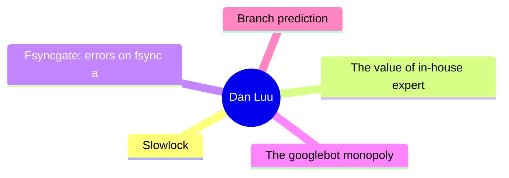
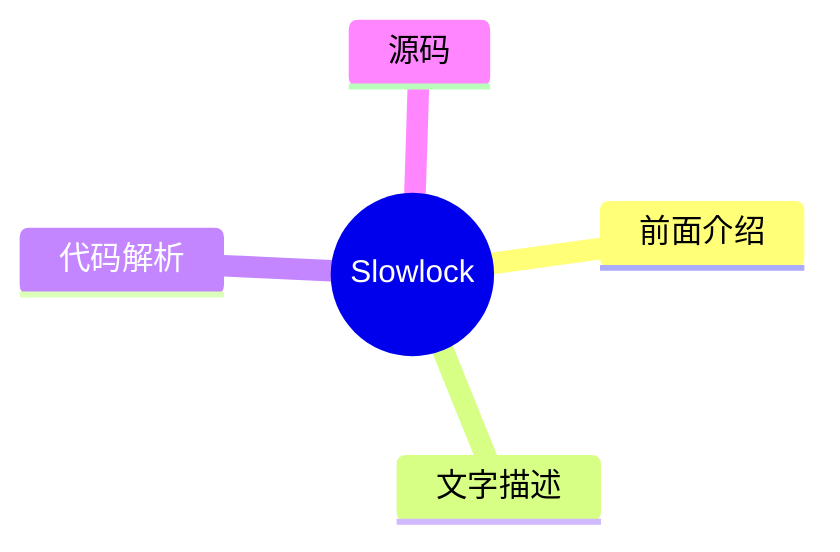
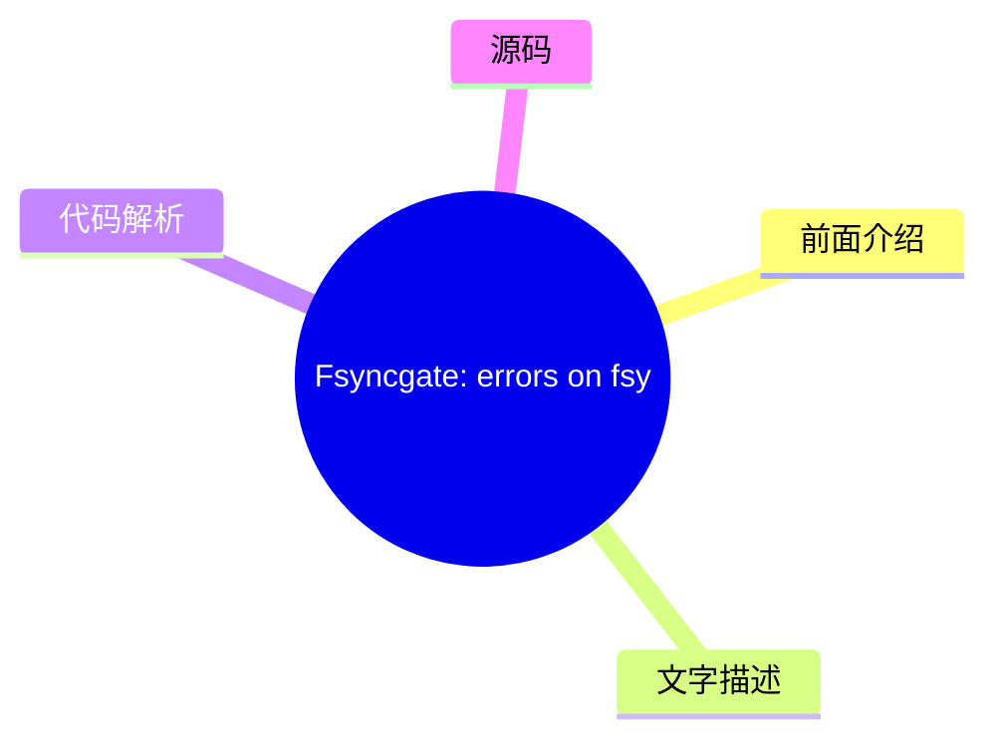
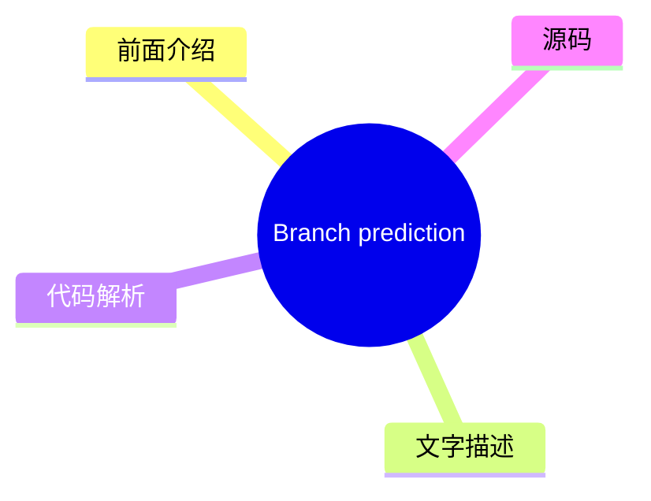

# 🔍 Dan Luu Top 5 (2026-07-27)

## 前面介绍

- 数据源：Dan Luu
- 抓取日期：2026-07-27
- 条目数：5
- 含完整正文：5
- 含代码片段：3
- 组织方式：前面介绍 / 树状图 / 文字描述 / 代码解析 / 源码

## 思维导图



## 详细整理（5 条，5 条含全文，3 条含代码）

### 1. Slowlock
- **链接**: [https://danluu.com/limplock/](https://danluu.com/limplock/)
- **发布**: Wed, 30 Sep 2015 00:00:00 +0000

#### 前面介绍

- Every once in awhile, you hear a story like “there was a case of a 1-Gbps NIC card on a machine that suddenly was transmitting only at 1 Kbps, which then caused a chain reaction upstream in such a way that the performance of the entire workload of a
- 发布时间：Wed, 30 Sep 2015 00:00:00 +0000

#### 树状图



#### 文字描述

- Every once in awhile, you hear a story like “there was a case of a 1-Gbps NIC card on a machine that suddenly was transmitting only at 1 Kbps, which then caused a chain reaction upstream in such a way that the performance of the entire workload of a 100-node cluster was crawling at a snail's pace, effectively making the system unavailable for all practical purposes”. The storie

#### 代码解析

- 本文未检测到明确代码块，内容更偏新闻、观点或方法论。

#### 源码

#### 中文节选

每隔一段时间，你就会听到这样的故事：“有一台机器上插着一张 1-Gbps 的网卡，突然只能以 1 Kbps 的速度传输，这随后在上游引发了一连串反应，导致一个 100 节点集群的整个工作负载性能像蜗牛一样缓慢，实际上使该系统在所有实际用途上都变得不可用”。这些故事很有趣，事后分析也很有趣读，但并不清楚系统对这种故障的脆弱性有多大，或者这类故障有多普遍。

这种情况让我想起了 [Jepsen](https://aphyr.com/tags/jepsen) 之前的分布式系统故障。有很多轶事性的恐怖故事，但对此的一个常见回应是“在我这能用”，即使谈论的是现在已知已经极其糟糕的系统。少数几家真正重视正确性的公司拥有良好的测试和指标，但他们大多不会公开谈论这些，公众也没有简单的方法来判断他们运行的系统是否可靠。

Thanh Do 等人尝试系统地研究了这个问题——[被削弱但未完全损坏的硬件有什么影响](http://ucare.cs.uchicago.edu/pdf/socc13-limplock.pdf)，以及[这种情况在实践中发生的频率有多高](http://ucare.cs.uchicago.edu/pdf/socc14-cbs.pdf)？事实证明，许多常用的系统都无法抵御“跛行”硬件，但这类故障的发生率很低（至少在你拥有不合理的大规模之前）。

单个慢节点的效果可能[相当显著](http://pages.cs.wisc.edu/~thanhdo/pdf/talk-socc-limplock.pdf)：

作业完成率从每小时 172 个作业降到了每小时 1 个作业，有效地杀死了整个集群。Facebook 有处理死机机器的机制，但显然当时他们没有任何办法来处理慢速机器。

当 Do 等人查看广泛使用的开源软件（HDFS、Hadoop、ZooKeeper、Cassandra 和 HBase）时，他们发现了类似的问题。

 Each subgraph is a different failure condition. F is HDFS, H is Hadoop, Z is Zookeeper, C is Cassandra, and B is HBase. The leftmost (white) bar is the baseline no-failure case. Going to the right, the next is a crash, and the subsequent bars are results for a single degraded but not crashed hardware (further right means slower). In most (but not all) cases, having degraded hardware affected performance a lot more than having failed hardware. Note that these graphs are all log scale; going up one increment is a 10x difference in performance!

 Curiously, a failed disk can cause some operations to speed up. That's because there are operations that have less replication overhead if a replica fails. It seems a bit weird to me that there isn't more overhead, because the system has to both find a replacement replica and replicate data, but what do I know?

 Anyway, why is a slow node so much worse than a dead node? Th

#### 完整正文（中文）

每隔一段时间，你就会听到这样的故事：“有一台机器上插着一张 1-Gbps 的网卡，突然只能以 1 Kbps 的速度传输，这随后在上游引发了一连串反应，导致一个 100 节点集群的整个工作负载性能像蜗牛一样缓慢，实际上使该系统在所有实际用途上都变得不可用”。这些故事很有趣，事后分析也很有趣读，但并不清楚系统对这种故障的脆弱性有多大，或者这类故障有多普遍。

这种情况让我想起了 [Jepsen](https://aphyr.com/tags/jepsen) 之前的分布式系统故障。有很多轶事性的恐怖故事，但对此的一个常见回应是“在我这能用”，即使谈论的是现在已知已经极其糟糕的系统。少数几家真正重视正确性的公司拥有良好的测试和指标，但他们大多不会公开谈论这些，公众也没有简单的方法来判断他们运行的系统是否可靠。

Thanh Do 等人尝试系统地研究了这个问题——[被削弱但未完全损坏的硬件有什么影响](http://ucare.cs.uchicago.edu/pdf/socc13-limplock.pdf)，以及[这种情况在实践中发生的频率有多高](http://ucare.cs.uchicago.edu/pdf/socc14-cbs.pdf)？事实证明，许多常用的系统都无法抵御“跛行”硬件，但这类故障的发生率很低（至少在你拥有不合理的大规模之前）。

单个慢节点的效果可能[相当显著](http://pages.cs.wisc.edu/~thanhdo/pdf/talk-socc-limplock.pdf)：

作业完成率从每小时 172 个作业降到了每小时 1 个作业，有效地杀死了整个集群。Facebook 有处理死机机器的机制，但显然当时他们没有任何办法来处理慢速机器。

当 Do 等人查看广泛使用的开源软件（HDFS、Hadoop、ZooKeeper、Cassandra 和 HBase）时，他们发现了类似的问题。

每个子图代表不同的故障条件。F 是 HDFS，H 是 Hadoop，Z 是 Zookeeper，C 是 Cassandra，B 是 HBase。最左侧（白色）的条形是基线无故障情况。向右移动，下一个是崩溃，随后的条形是单个降级但未崩溃硬件的结果（越靠右意味着越慢）。在大多数（但不是全部）情况下，降级硬件对性能的影响远大于故障硬件。请注意，这些图表都是对数刻度；向上移动一个刻度意味着性能相差 10 倍！

 奇怪的是，故障的磁盘可能会导致某些操作加速。这是因为有些操作如果副本失败，其复制开销会更小。对我来说，这似乎有点奇怪，因为系统不仅要找到替换副本并复制数据，而且没有更多的开销，但我又知道些什么呢？

 无论如何，为什么慢节点比死节点糟糕得多？作者定义了三种故障模式并解释了每种故障模式的原因。有操作迟滞锁，当操作变慢是因为操作的某个子部分变慢（例如，磁盘读取变慢是因为磁盘降级），节点迟滞锁，当节点即使对于看似无关的操作也变慢（例如，从 RAM 读取变慢是因为磁盘降级），以及集群迟滞锁，其中整个集群都变慢（例如，单个降级磁盘使整个 1000 台机器的集群变慢）。

 这些是如何发生的？

 #### 操作迟滞锁

 这是最简单的一种。如果你尝试从磁盘读取，而你的磁盘很慢，那么你的磁盘读取就会很慢。在现实世界中，当操作存在单点故障，以及监控设计用于处理完全故障而不是降级性能时，我们会看到这种情况。例如，HBase 访问一个区域会经过负责该区域的服务器。数据在 HDFS 上复制，但如果拥有数据的节点正在迟滞，这对你没有帮助。说到 HDFS，它的超时时间是 60 秒，读取是以 64K 块进行的，这意味着在 HDFS 切换到健康节点之前，你的读取速度可能会慢到接近 1K/s。

 #### 节点迟滞锁

 How can it be the case that (for example) a slow disk causes memory reads to be slow? Looking at HDFS again, it uses a thread pool. If every thread is busy very slowly completing a disk read, memory reads will block until a thread gets free.

 This isn't only an issue when using limited thread pools or other bounded abstractions -- the reality is that machines have finite resources, and unbounded abstractions will run into machine limits if they aren't carefully designed to avoid the possibility. For example, Zookeeper keeps queue of operations, and a slow follower can cause the leader's queue to exhaust physical memory.

 #### Cluster Limplock

 An entire cluster can easily become unhealthy if it relies on a single primary and the primary is limping. Cascading failures can also cause this -- the first graph, where a cluster goes from completing 172 jobs an hour to 1 job an hour is actually a Facebook workload on Hadoop. The thing that's surprising to me here is that Hadoop is supposed to be tail tolerant -- individual slow tasks aren't supposed to have a large impact on the completion of the entire job. So what happened? Unhealthy nodes infect healthy nodes and eventually lock up the whole cluster.

 Hadoop's tail tolerance comes from kicking off speculative computation when results are coming in slowly. In particular, when stragglers come in unusually slowly compared to other results. This works fine when a reduce node is limping (subgraph H2), but when a [map node](http://static.googleusercontent.com/media/research.google.com/en//archive/mapreduce-osdi04.pdf) limps (subgraph H1), it can slow down all reducers in the same job, which defeats Hadoop's tail-tolerance mechanisms.


 To see why, we have to look at [Hadoop's speculation algorithm](https://www.usenix.org/legacy/event/osdi08/tech/full_papers/zaharia/zaharia_html/index.html). Each job has a progress score which is a number between 0 and 1 (inclusive). For a map, the score is the fraction of input data read. For a reduce, each of three phases (copying data from mappers, sorting, and reducing) gets 1/3 of the score. A speculative job will get run if a task has run for at least one minute and has a progress score that's less than the average for its category minus 0.2.

 In case H2, the NIC is limping, so the map phase completes normally since results end up written to local disk. But when reduce nodes try to fetch data from the limping map node, they all stall, pulling down the average score for the category, which prevents speculative jobs from being run. Looking at the big picture, each Hadoop node has a limited number of map and reduce tasks. If those fill up with limping tasks, the entire node will lock up. Since Hadoop isn't designed to avoid cascading failures, this eventually causes the entire cluster to lock up.

 One thing I find interesting is that this exact cause of failures was [described in the original MapReduce paper](http://research.google.com/archive/mapreduce.html), published in 2004. They even explicitly called out slow disk and network as causes of stragglers, which motivated their speculative execution algorithm. However, they didn't provide the details of the algorithm. The open source clone of MapReduce, Hadoop, attempted to avoid the same problem. Hadoop was initially released in 2008. Five years later, when the paper we're reading was published, its built-in mechanism for straggler detection not only failed to prevent multiple types of stragglers, it also failed to prevent stragglers from effectively deadlocking the entire cluster.

 ### Conclusion

 I'm not going to go into details of how each system fared under testing. That's detailed quite nicely in the paper, which I recommend reading the paper if you're curious. To summarize, Cassandra does quite well, whereas HDFS, Hadoop, and HBase don't.


 Cassandra seems to do well for two reasons. First, [this patch from 2009](https://issues.apache.org/jira/browse/CASSANDRA-488) prevents queue overflows from infecting healthy nodes, which prevents a major failure mode that causes cluster-wide failures in other systems. Second, the architecture used ([SEDA](http://www.eecs.harvard.edu/~mdw/proj/seda/)) decouples different types of operations, which lets good operations continue to execute even when some operations are limping.

 My big questions after reading this paper are, how often do these kinds of failures happen, how, and shouldn't reasonable metrics/reporting catch this sort of thing anyway?

 For the answer to the first question, many of the same authors also have a paper where they looked at [3000 failures in Cassandra, Flume, HDFS, and ZooKeeper](http://ucare.cs.uchicago.edu/pdf/socc14-cbs.pdf) and determined which failures were hardware related and what the hardware failure was.

 14 cases of degraded performance vs. 410 other hardware failures. In their sample, that's 3% of failures; rare, but not so rare that we can ignore the issue.

 If we can't ignore these kinds of errors, how can we catch them before they go into production? The paper uses the [Emulab testbed](http://www.emulab.net/), which is really cool. Unfortunately, the Emulab page reads “Emulab is a public facility, available without charge to most researchers worldwide. If you are unsure if you qualify for use, please see our policies document, or ask us. If you think you qualify, you can apply to start a new project.”. That's understandable, but that means it's probably not a great solution for most of us.


绝大多数运行缓慢的硬件问题都是由网络或磁盘速度慢造成的。为什么不能修改 Jepsen 或类似工具，来模拟磁盘或网络速度慢呢？一个简单的实现虽然无法达到 Emulab 的精度，但既然我们讨论的是数量级的减速，10%（甚至 2 倍）的偏差对于测试系统在硬件降级情况下的鲁棒性来说应该足够了。你可以想象出多种实现方式。例如，要在 Linux 上模拟慢速网络，可以尝试通过 [qdisc](http://linux-ip.net/articles/Traffic-Control-HOWTO/) 进行限速，[通过 ptrace 挂钩系统调用](https://github.com/majek/fluxcapacitor)，等等。对于慢速 CPU，可以通过 cgroups 和 cpu.shares 进行速率限制，或者直接将进程映射到 UC 内存（或者如果那有点太慢的话，也许是 WT 或 WC），磁盘和其他故障模式以此类推。

这就剩下了我的最后一个问题，系统不应该已经捕获了这些类型的故障，即使它们并不特别关注它们吗？正如我们在上面看到的，硬件严重缓慢的系统很少，我们可以直接将其视为死机，而不会显著影响我们总体的计算资源。而且，硬件受损的系统可以相当直接地检测到。此外，多租户系统无论如何都必须对自己的性能进行[持续监控，以获得良好的利用率](//danluu.com/new-cpu-features/#partitioning)。

 So why should we care about designing systems that are robust against limping hardware? One part of the answer is defense in depth. Of course we should have monitoring, but we should also have systems that are robust when our monitoring fails, as it inevitably will. Another part of the answer is that by making systems more tolerant to limping hardware, we'll also make them more tolerant to interference from other workloads in a multi-tenant environment. That last bit is a somewhat speculative empirical question -- it's possible that it's more efficient to design systems that aren't particularly robust against interference from competing work on the same machine, while using [better partitioning](//danluu.com/intel-cat/) to avoid interference.

 

 

  Thanks to Leah Hanson, Hari Angepat, Laura Lindzey, Julia Ev

...（截断，原文 12046+ 字符）


### 2. The value of in-house expertise
- **链接**: [https://danluu.com/in-house/](https://danluu.com/in-house/)
- **发布**: Wed, 29 Sep 2021 00:00:00 +0000

#### 前面介绍

- An alternate title for this post might be, &quot;Twitter has a kernel team!?&quot;. At this point, I've heard that surprised exclamation enough that I've lost count of the number times that's been said to me (I'd guess that it's more than ten but les
- 发布时间：Wed, 29 Sep 2021 00:00:00 +0000

#### 树状图


#### 文字描述

- An alternate title for this post might be, "Twitter has a kernel team!?". At this point, I've heard that surprised exclamation enough that I've lost count of the number times that's been said to me (I'd guess that it's more than ten but less than a hundred). If we look at trendy companies that are within a couple factors of two in size of Twitter (in terms of either market cap 

#### 代码解析

- 本文未检测到明确代码块，内容更偏新闻、观点或方法论。

#### 源码

#### 中文节选

An alternate title for this post might be, "Twitter has a kernel team!?". At this point, I've heard that surprised exclamation enough that I've lost count of the number times that's been said to me (I'd guess that it's more than ten but less than a hundred). If we look at trendy companies that are within a couple factors of two in size of Twitter (in terms of either market cap or number of engineers), they mostly don't have similar expertise, often as a result of path dependence — because they "grew up" in the cloud, they didn't need kernel expertise to keep the lights on the way an on prem company does. While that makes it socially understandable that people who've spent their career at younger, trendier, companies, are surprised by Twitter having a kernel team, I don't think there's a technical reason for the surprise.

 Whether or not it has kernel expertise, a company Twitter's size is going to regularly run into kernel issues, from major production incidents to papercuts. Without a kernel team or the equivalent expertise, the company will muddle through the issues, running into unnecessary problems as well as taking an unnecessarily long time to mitigate incidents. As an example of a critical production incident, just because it's already been written up publicly, I'll cite [this post](https://blog.twitter.com/engineering/en_us/topics/open-source/2020/hunting-a-linux-kernel-bug), which dryly notes:

  Earlier last year, we identified a firewall misconfiguration which accidentally dropped most network traffic. We expected resetting the firewall configuration to fix the issue, but resetting the firewall configuration exposed a kernel bug

 


 What this implies but doesn't explicitly say is that this firewall misconfiguration was the most severe incident that's occured during my time at Twitter and I believe it's actually the most severe outage that Twitter has had since 2013 or so. As a company, we would've still been able to mitigate the issue without a kernel team or another team with deep Linux expertise, but it would've taken longer to understand why the initial fix didn't work, which is the last thing you want when you're debugging a serious outage. Folks on the kernel team were already familiar with the various diagnostic tools and debugging techniques necessary to quickly understand why the initial fix didn't work, which is not common knowledge at some peer companies (I polled folks at a number of similar-scale peer companies to see if they thought they had at least one person with the knowledge necessary to quickly debug the bug and the answer was no at many companies).

 Another reason to have in-house expertise in various areas is that they easily pay for themselves, which is a special case of [the generic argument that large companies should be larger than most people expect because tiny percentage gains are worth a large amount in absolute dollars](/sounds-easy/). If, in the lifetime of the specialist team like the kernel team, a s

#### 完整正文（中文）

An alternate title for this post might be, "Twitter has a kernel team!?". At this point, I've heard that surprised exclamation enough that I've lost count of the number times that's been said to me (I'd guess that it's more than ten but less than a hundred). If we look at trendy companies that are within a couple factors of two in size of Twitter (in terms of either market cap or number of engineers), they mostly don't have similar expertise, often as a result of path dependence — because they "grew up" in the cloud, they didn't need kernel expertise to keep the lights on the way an on prem company does. While that makes it socially understandable that people who've spent their career at younger, trendier, companies, are surprised by Twitter having a kernel team, I don't think there's a technical reason for the surprise.

 Whether or not it has kernel expertise, a company Twitter's size is going to regularly run into kernel issues, from major production incidents to papercuts. Without a kernel team or the equivalent expertise, the company will muddle through the issues, running into unnecessary problems as well as taking an unnecessarily long time to mitigate incidents. As an example of a critical production incident, just because it's already been written up publicly, I'll cite [this post](https://blog.twitter.com/engineering/en_us/topics/open-source/2020/hunting-a-linux-kernel-bug), which dryly notes:

  Earlier last year, we identified a firewall misconfiguration which accidentally dropped most network traffic. We expected resetting the firewall configuration to fix the issue, but resetting the firewall configuration exposed a kernel bug

 


 What this implies but doesn't explicitly say is that this firewall misconfiguration was the most severe incident that's occured during my time at Twitter and I believe it's actually the most severe outage that Twitter has had since 2013 or so. As a company, we would've still been able to mitigate the issue without a kernel team or another team with deep Linux expertise, but it would've taken longer to understand why the initial fix didn't work, which is the last thing you want when you're debugging a serious outage. Folks on the kernel team were already familiar with the various diagnostic tools and debugging techniques necessary to quickly understand why the initial fix didn't work, which is not common knowledge at some peer companies (I polled folks at a number of similar-scale peer companies to see if they thought they had at least one person with the knowledge necessary to quickly debug the bug and the answer was no at many companies).

 Another reason to have in-house expertise in various areas is that they easily pay for themselves, which is a special case of [the generic argument that large companies should be larger than most people expect because tiny percentage gains are worth a large amount in absolute dollars](/sounds-easy/). If, in the lifetime of the specialist team like the kernel team, a single person found something that persistently reduced [TCO](https://en.wikipedia.org/wiki/Total_cost_of_ownership) by 0.5%, that would pay for the team in perpetuity, and Twitter’s kernel team has found many such changes. In addition to [kernel patches](https://patchwork.ozlabs.org/project/netdev/list/?submitter=211&state=*&archive=both¶m=4&page=1) that sometimes have that kind of impact, people will also find configuration issues, etc., that have that kind of impact.


 So far, I've only talked about the kernel team because that's the one that most frequently elicits surprise from folks for merely existing, but I get similar reactions when people find out that Twitter has a bunch of ex-Sun JVM folks who worked on HotSpot, like Ramki Ramakrishna, Tony Printezis, and John Coomes. People wonder why a social media company would need such deep JVM expertise. As with the kernel team, companies our size that use the JVM run into weird issues and JVM bugs and it's helpful to have people with deep expertise to debug those kinds of issues. And, as with the kernel team, individual optimizations to the JVM can pay for the team in perpetuity. A concrete example is [this patch by Flavio Brasil, which virtualizes compare and swap calls](https://github.com/oracle/graal/pull/636).

 The context for this is that Twitter uses a lot of Scala. Despite a lot of claims otherwise, Scala uses more memory and is significantly slower than Java, which has a significant cost if you use Scala at scale, enough that it makes sense to do optimization work to reduce the performance gap between idiomatic Scala and idiomatic Java.

 Before the patch, if you profiled our Scala code, you would've seen an unreasonably large amount of time spent in Future/Promise, including in cases where you might naively expect that the compiler would optimize the work away. One reason for this is that Futures use a [compare-and-swap](https://en.wikipedia.org/wiki/Compare-and-swap) (CAS) operation that's opaque to JVM optimization. The patch linked above avoids CAS operations when the Future doesn't escape the scope of the method. [This companion patch](https://github.com/twitter/util/commit/3245a8e1a98bd5eb308f366678528879d7140f5e) removes CAS operations in some places that are less amenable to compiler optimization. The two patches combined reduced the cost of typical major Twitter services using idiomatic Scala by 5% to 15%, paying for the JVM team in perpetuity many times over and that wasn't even the biggest win Flavio found that year.


我不会对那些盈利数倍的团队进行逐个拆解，因为这样的团队实在太多了，即使我将范围限定在“人们惊讶于 Twitter 拥有这些团队”的范围内也是如此。

一个相关的话题是人们如何讨论“购买 vs. 构建”。我见过很多讨论，有人主张“购买”，因为这样可以省去在该领域具备专业知识的必要性。这可能是真的，但我看到这种主张被提出的频率远高于其成为事实的频率。我认为分布式追踪在这方面 tends to be untrue（往往是不成立的）。[我们之前看过 Twitter 从追踪中获得价值的一些方式](/tracing-analytics/)，这是 Rebecca Isaacs 设定的愿景。另一方面，当我与规模相当的同行公司的相关人员交谈时，大多数人都尚未（或者还没？）成功从分布式追踪中获得显著价值。这种情况非常普遍，以至于我每年都会看到不止一次关于分布式追踪毫无用处的病毒式推文。尽管我们选择了更昂贵的“构建”选项，但仅凭记忆，我就能想到追踪的多种用途，其回报率在构建追踪成本的 10 倍到 100 倍之间，而许多选择更便宜的“购买”选项的公司人员却经常抱怨追踪并不值得。

 Coincidentally, I was just talking about this exact topic to Pam Wolf, a civil engineering professor with experience in (civil engineering) industry on multiple continents, who had a related opinion. For large scale systems (projects), you need an in-house expert (owner's-side engineer) for each area that you don't handle in your own firm. While it's technically possible to hire yet another firm to be the expert, that's more expensive than developing or hiring in-house expertise and, in the long run, also more risky. That's pretty analogous to my experience working as an electrical engineer as well, where orgs that outsource functions to other companies without retaining an in-house expert pay a very high cost, and not just monetarily. They often ship sub-par designs with long delays on top of having high costs. "Buying" can and often does reduce the amount of expertise necessary, but it often doesn't remove the need for expertise.


 This related to another common abstract argument that's commonly made, that companies should concentrate on "their area of comparative advantage" or "most important problems" or "core business need" and outsource everything else. We've already seen a couple of examples where this isn't true because, at a large enough scale, it's more profitable to have in-house expertise than not regardless of whether or not something is core to the business (one could argue that all of the things that are moved in-house are core to the business, but that would make the concept of coreness useless). Another reason this abstract advice is too simplistic is that businesses can somewhat arbitrarily choose what their comparative advantage is. A large example of this would be Apple bringing CPU design in-house. Since acquiring PA Semi (formerly the team from SiByte and, before that, a team from DEC) for $278M, Apple has been producing [the best chips in the phone and laptop power envelope by a pretty large margin](https://twitter.com/danluu/status/1433297089866383364). But, before the purchase, there was nothing about Apple that made the purchase inevitable, that made CPU design an inherent comparative advantage of Apple. But if a firm can pick an area and make it an area of comparative advantage, saying that the firm should choose to concentrate on its comparative advantage(s) isn't very helpful advice.

 $278M is a lot of money in absolute terms, but as a fraction of Apple's resources, that was tiny and much smaller companies also have the capability to do cutting edge work by devoting a small fraction of their resources to it, e.g., Twitter, for a cost that any $100M company could afford, [created novel cache algorithms and data structures](https://twitter.com/danluu/status/1381687511362138113) and is doing other cutting edge cache work. Having great [cache infra](/cache-incidents/) isn't any more core to Twitter's business than creating a great CPU is to Apple's, but it is a lever that Twitter can use to make more money than it could otherwise.


 For small companies, it doesn't make sense to have in-house experts for everything the company touches, but companies don't have to get all that large before it starts making sense to have in-house expertise in their operating system, language runtime, and other components that people often think of as being fairly specialized. Looking back at Twitter's history, Yao Yue has noted that when she was working on cache in Twitter's early days (when we had ~100 engineers), she would regularly go to the kernel team for help debugging production incidents and that, in some cases, debugging could've easily taken 10x longer without help from the kernel team. Social media companies tend to have relatively high scale on a per-user and per-dollar basis, so not every company is going to need the same kind of expertise when they have 100 engineers, but there are going to be other areas that aren't obviously core business needs where expertise will pay off even for a startup that has 100 engineers.

 Thanks to Ben Kuhn, Yao Yue, Pam Wolf, John Hergenroeder, Julien Kirch, Tom Brearley, and Kevin Burke for comments/corrections/discussion.


### 3. Fsyncgate: errors on fsync are unrecovarable
- **链接**: [https://danluu.com/fsyncgate/](https://danluu.com/fsyncgate/)
- **发布**: Wed, 28 Mar 2018 00:00:00 +0000

#### 前面介绍

- This is an archive of the original &quot;fsyncgate&quot; email thread. This is posted here because I wanted to have a link that would fit on a slide for a talk on file safety with a mobile-friendly non-bloated format.

From:Craig Ringer &lt;craig(at)
- 发布时间：Wed, 28 Mar 2018 00:00:00 +0000

#### 树状图



#### 文字描述

- *This is an archive of the original "fsyncgate" email thread. This is posted here because I wanted to have a link that would fit on a slide for *[a talk on file safety](//danluu.com/deconstruct-files/) with [a mobile-friendly non-bloated format](//danluu.com/web-bloat/). ``` From:Craig Ringer <craig(at)2ndquadrant(dot)com> Subject:Re: PostgreSQL's handling of fsync() errors is 

#### 代码解析

- `text`: 这段更像查询逻辑，重点看过滤条件、聚合方式和性能影响。
- `text`: 这段更像查询逻辑，重点看过滤条件、聚合方式和性能影响。
- `text`: 这段更像查询逻辑，重点看过滤条件、聚合方式和性能影响。

#### 源码

#### 源码片段 1（text）

```text
From:Craig Ringer <craig(at)2ndquadrant(dot)com>
Subject:Re: PostgreSQL's handling of fsync() errors is unsafe and risks data loss at least on XFS
Date:2018-03-28 02:23:46
```

#### 源码片段 2（text）

```text
From:Tom Lane <tgl(at)sss(dot)pgh(dot)pa(dot)us>
Date:2018-03-28 03:53:08
```

#### 源码片段 3（text）

```text
From:Michael Paquier <michael(at)paquier(dot)xyz>
Date:2018-03-29 02:30:59
```

#### 完整正文（中文）

*This is an archive of the original "fsyncgate" email thread. This is posted here because I wanted to have a link that would fit on a slide for *[a talk on file safety](//danluu.com/deconstruct-files/) with [a mobile-friendly non-bloated format](//danluu.com/web-bloat/).

 ```
From:Craig Ringer <craig(at)2ndquadrant(dot)com>
Subject:Re: PostgreSQL's handling of fsync() errors is unsafe and risks data loss at least on XFS
Date:2018-03-28 02:23:46
```

 Hi all

 Some time ago I ran into an issue where a user encountered data corruption after a storage error. PostgreSQL played a part in that corruption by allowing checkpoint what should've been a fatal error.

 TL;DR: Pg should PANIC on fsync() EIO return. Retrying fsync() is not OK at least on Linux. When fsync() returns success it means "all writes since the last fsync have hit disk" but we assume it means "all writes since the last SUCCESSFUL fsync have hit disk".

 Pg wrote some blocks, which went to OS dirty buffers for writeback. Writeback failed due to an underlying storage error. The block I/O layer and XFS marked the writeback page as failed (AS_EIO), but had no way to tell the app about the failure. When Pg called fsync() on the FD during the next checkpoint, fsync() returned EIO because of the flagged page, to tell Pg that a previous async write failed. Pg treated the checkpoint as failed and didn't advance the redo start position in the control file.

 All good so far.

 But then we retried the checkpoint, which retried the fsync(). The retry succeeded, because the prior fsync() *cleared the AS_EIO bad page flag*.

 The write never made it to disk, but we completed the checkpoint, and merrily carried on our way. Whoops, data loss.

 The clear-error-and-continue behaviour of fsync is not documented as far as I can tell. Nor is fsync() returning EIO unless you have a very new linux man-pages with the patch I wrote to add it. But from what I can see in the POSIX standard we are not given any guarantees about what happens on fsync() failure at all, so we're probably wrong to assume that retrying fsync( ) is safe.


如果服务器当时使用的是带有 errors=remount-ro 选项的 ext3 或 ext4，这个问题就不会发生，因为第一次 I/O 错误就会重新挂载文件系统并停止 Pg 继续运行。但 XFS 没有这个选项。可能还有其他涉及 LVM 和/或多路径的情况也会发生这种情况，但我还没有彻底挖掘出细节。

事实证明，可以通过伪造第一个错误成功检查点之前的备份标签，强制 redo 重复执行并写入丢失的块来恢复系统。但是……真是一团糟。

我之前在这里发帖讨论了底层的 fsync 问题：

[https://stackoverflow.com/q/42434872/398670](https://stackoverflow.com/q/42434872/398670)

但还没有机会跟进关于 Pg 具体细节的内容。

我断断续续地研究这个问题，还没有找到好的解决方案。我认为我们应该直接 PANIC，让 redo 在重复自上次检查点以来的工作时，通过重复失败的写入来处理。

异步缓冲写入和 fsync 提供的 API 让我们无法知道哪个页面失败了，所以我们不能只是有选择地重做那个写入。我想我们确实知道与失败 fsync 的 fd 关联的 relfilenode，但仅此而已。所以替代方案似乎是一种潜在的复杂在线 redo 方案，即我们只重放发生 fsync() 错误的关系的 WAL，而在其他情况下正常处理查询。这很可能极其容易出错且难以测试，而且它试图解决在其他文件系统上整个数据库无论如何都会停止运行的情况。

我调查了是否可以使用 AIO API 来解决它，但那里的情况更糟——据我所知，你甚至无法在所有 Linux 内核版本上可靠地保证 fsync。

对于 WAL 段，我们在 fsync() 失败时已经 PANIC 了。我们只需要对数据 fork 至少在 EIO 的情况下做同样的事情。这并不像看起来那么糟糕，因为据我所知，fsync 只在我们应该停止世界的情况下返回 EIO，而且许多文件系统会为我们这样做。

 There are rather a lot of pg_fsync() callers. While we could handle this case-by-case for each one, I'm tempted to just make pg_fsync() itself intercept EIO and PANIC. Thoughts?

 

 ```
From:Tom Lane <tgl(at)sss(dot)pgh(dot)pa(dot)us>
Date:2018-03-28 03:53:08
```

 Craig Ringer  writes:

  TL;DR: Pg should PANIC on fsync() EIO return.

 

 Surely you jest.

  Retrying fsync() is not OK at least on Linux. When fsync() returns success it means "all writes since the last fsync have hit disk" but we assume it means "all writes since the last SUCCESSFUL fsync have hit disk".

 

 If that's actually the case, we need to push back on this kernel brain damage, because as you're describing it fsync would be completely useless.

 Moreover, POSIX is entirely clear that successful fsync means all preceding writes for the file have been completed, full stop, doesn't matter when they were issued.

 

 ```
From:Michael Paquier <michael(at)paquier(dot)xyz>
Date:2018-03-29 02:30:59
```

 On Tue, Mar 27, 2018 at 11:53:08PM -0400, Tom Lane wrote:

  Craig Ringer  writes:

  TL;DR: Pg should PANIC on fsync() EIO return.

 

 Surely you jest.

 

 Any callers of pg_fsync in the backend code are careful enough to check the returned status, sometimes doing retries like in mdsync, so what is proposed here would be a regression.

 

 ```
From:Thomas Munro <thomas(dot)munro(at)enterprisedb(dot)com>
Date:2018-03-29 02:48:27
```

 On Thu, Mar 29, 2018 at 3:30 PM, Michael Paquier  wrote:

  On Tue, Mar 27, 2018 at 11:53:08PM -0400, Tom Lane wrote:

  Craig Ringer  writes:

  TL;DR: Pg should PANIC on fsync() EIO return.

 

 Surely you jest.

 

 Any callers of pg_fsync in the backend code are careful enough to check the returned status, sometimes doing retries like in mdsync, so what is proposed here would be a regression.

 

 Craig, is the phenomenon you described the same as the second issue "Reporting writeback errors" discussed in this article?

 [https://lwn.net/Articles/724307/](https://lwn.net/Articles/724307/)

 "Current kernels might report a writeback error on an fsync() call, but there are a number of ways in which that can fail to happen."

 That's... I'm speechless.

 


```
发件人:Justin Pryzby <pryzby(at)telsasoft(dot)com>
日期:2018-03-29 05:00:31
```

 On Thu, Mar 29, 2018 at 11:30:59AM +0900, Michael Paquier wrote:

  On Tue, Mar 27, 2018 at 11:53:08PM -0400, Tom Lane wrote:

  Craig Ringer  writes:

  TL;DR: Pg 应该在 fsync() 返回 EIO 时 PANIC。

 

 肯定是在开玩笑。

 

 后端代码中任何调用 pg_fsync 的函数都足够小心地检查返回状态，有时会像 mdsync 那样进行重试，所以这里提议的内容将是一个倒退。

 

 重试是问题的根源；第一次 fsync() 可能会返回 EIO，并且还会*清除错误*，导致第二次 fsync（针对相同数据）返回成功。

 （注意，我可以看到在 EIO 上 PANIC 可能是有用的，但对 ENOSPC 进行重试）。

 On Thu, Mar 29, 2018 at 03:48:27PM +1300, Thomas Munro wrote:

  Craig，你描述的现象与本文讨论的第二个问题“Reporting writeback errors”相同吗？[https://lwn.net/Articles/724307/](https://lwn.net/Articles/724307/)

 

 更糟糕的是，这篇文章承认了这种行为，而没有建议更改它：

 "将值存储在文件结构中有一个重要好处：它使得有可能向调用 FSYNC() 的每个进程报告一次写入回退错误 .... 在当前内核中，只有在错误发生后第一次调用者才有机会看到该错误信息。"

 我相信我使用 dmsetup "error" 目标重现了问题行为，见附件。

 strace 看起来像这样：

 kernel 是 Linux 4.10.0-28-generic #32~16.04.2-Ubuntu SMP Thu Jul 20 10:19:48 UTC 2017 x86_64 x86_64 x86_64 GNU/Linux

 ```
1open("/dev/mapper/eio", O_RDWR|O_CREAT, 0600) = 3
2write(3, "\0\0\0\0\0\0\0\0\0\0\0\0\0\0\0\0\0\0\0\0\0\0\0\0\0\0\0\0\0\0\0\0"..., 8192) = 8192
3write(3, "\0\0\0\0\0\0\0\0\0\0\0\0\0\0\0\0\0\0\0\0\0\0\0\0\0\0\0\0\0\0\0\0"..., 8192) = 8192
4write(3, "\0\0\0\0\0\0\0\0\0\0\0\0\0\0\0\0\0\0\0\0\0\0\0\0\0\0\0\0\0\0\0\0"..., 8192) = 8192
5write(3, "\0\0\0\0\0\0\0\0\0\0\0\0\0\0\0\0\0\0\0\0\0\0\0\0\0\0\0\0\0\0\0\0"..., 8192) = 8192
6write(3, "\0\0\0\0\0\0\0\0\0\0\0\0\0\0\0\0\0\0\0\0\0\0\0\0\0\0\0\0\0\0\0\0"..., 8192) = 8192
```

7write(3, "\0\0\0\0\0\0\0\0\0\0\0\0\0\0\0\0\0\0\0\0\0\0\0\0\0\0\0\0\0\0\0\0"..., 8192) = 8192
8write(3, "\0\0\0\0\0\0\0\0\0\0\0\0\0\0\0\0\0\0\0\0\0\0\0\0\0\0\0\0\0\0\0\0"..., 8192) = 2560
9write(3, "\0\0\0\0\0\0\0\0\0\0\0\0\0\0\0\0\0\0\0\0\0\0\0\0\0\0\0\0\0\0\0\0"..., 8192) = -1 ENOSPC (No space left on device)
10dup(2)                                  = 4
11fcntl(4, F_GETFL)                       = 0x8402 (flags O_RDWR|O_APPEND|O_LARGEFILE)
12brk(NULL)                               = 0x1299000
13brk(0x12ba000)                          = 0x12ba000
14fstat(4, {st_mode=S_IFCHR|0620, st_rdev=makedev(136, 2), ...}) = 0
15write(4, "write(1): No space left on devic"..., 34write(1): No space left on device
16) = 34
17close(4)                                = 0
18fsync(3)                                = -1 EIO (Input/output error)
19dup(2)                                  = 4
20fcntl(4, F_GETFL)                       = 0x8402 (flags O_RDWR|O_APPEND|O_LARGEFILE)
21fstat(4, {st_mode=S_IFCHR|0620, st_rdev=makedev(136, 2), ...}) = 0
22write(4, "fsync(1): Input/output error\n", 29fsync(1): Input/output error
23) = 29
24close(4)                                = 0
25close(3)                                = 0
26open("/dev/mapper/eio", O_RDWR|O_CREAT, 0600) = 3
27fsync(3)                                = 0
28write(3, "\0", 1)                       = 1
29fsync(3)                                = 0
30exit_group(0)                           = ?
```

 2: EIO isn't seen initially due to writeback page cache;

 9: ENOSPC due to small device

 18: original IO error reported by fsync, good

 25: the original FD is closed

 26: ..and file reopened

 27: fsync on file with still-dirty data+EIO returns success BAD

 10, 19: I'm not sure why there's dup(2), I guess glibc thinks that perror should write to a separate FD (?)

 Also note, close() ALSO returned success..which you might think exonerates the 2nd fsync(), but I think may itself be problematic, no? In any case, the 2nd byte certainly never got written to DM error, and the failure status was lost following fsync().

 I get the exact same behavior if I break after one write() loop, such as to avoid ENOSPC.

 

 ```

From:Thomas Munro <thomas(dot)munro(at)enterprisedb(dot)com>
Date:2018-03-29 05:06:22
```

 On Thu, Mar 29, 2018 at 6:00 PM, Justin Pryzby  wrote:

  The retries are the source of the problem ; the first fsync() can return EIO, and also *clears the error* causing a 2nd fsync (of the same data) to return success.

 

 What I'm failing to grok here is how that error flag even matters, whether it's a single bit or a counter as described in that patch. If write back failed, *the page is still dirty*. So all future calls to fsync() need to try to try to flush it again, and (presumably) fail again (unless it happens to succeed this time around).

 

 ```
From:Craig Ringer <craig(at)2ndquadrant(dot)com>
Date:2018-03-29 05:25:51
```

 On 29 March 2018 at 13:06, Thomas Munro  wrote:

  On Thu, Mar 29, 2018 at 6:00 PM, Justin Pryzby  wrote:

  The retries are the source of the problem ; the first fsync() can return EIO, and also *clears the error* causing a 2nd fsync (of the same data) to return success.

 

 What I'm failing to grok here is how that error flag even matters, whether it's a single bit or a counter as described in that patch. If write back failed, *the page is still dirty*. So all future calls to fsync() need to try to try to flush it again, and (pre

...（截断，原文 516759+ 字符）


### 4. The googlebot monopoly
- **链接**: [https://danluu.com/googlebot-monopoly/](https://danluu.com/googlebot-monopoly/)
- **发布**: Wed, 27 May 2015 00:00:00 +0000

#### 前面介绍

- TIL that Bell Labs and a whole lot of other websites block archive.org, not to mention most search engines. Turns out I have a broken website link in a GitHub repo, caused by the deletion of an old webpage. When I tried to pull the original from arch
- 发布时间：Wed, 27 May 2015 00:00:00 +0000

#### 树状图


#### 文字描述

- TIL that Bell Labs and a whole lot of other websites block archive.org, not to mention most search engines. Turns out I have [a broken website link](https://github.com/danluu/debugging-stories/issues/3) in a GitHub repo, caused by the deletion of an old webpage. When I tried to pull the original from archive.org, I found that it's not available because Bell Labs blocks the arch

#### 代码解析

- `text`: 更偏接口调用示例，适合作为接入或联调样例。

#### 源码

#### 源码片段 1（text）

```text
User-agent: Googlebot
User-agent: msnbot
User-agent: LSgsa-crawler
Disallow: /RealAudio/
Disallow: /bl-traces/
Disallow: /fast-os/
Disallow: /hidden/
Disallow: /historic/
Disallow: /incoming/
Disallow: /inferno/
Disallow: /magic/
Disallow: /netlib.depend/
Disallow: /netlib/
Disallow: /p9trace/
Disallow: /plan9/sources/
Disallow: /sources/
Disallow: /tmp/
Disallow: /tripwire/
Visit-time: 0700-1200
Request-rate: 1/5
Crawl-delay: 5
User-agent: *
Disallow: /
```

#### 完整正文（中文）

TIL that Bell Labs and a whole lot of other websites block archive.org, not to mention most search engines. Turns out I have [a broken website link](https://github.com/danluu/debugging-stories/issues/3) in a GitHub repo, caused by the deletion of an old webpage. When I tried to pull the original from archive.org, I found that it's not available because Bell Labs blocks the archive.org crawler in their robots.txt:

  ```
User-agent: Googlebot
User-agent: msnbot
User-agent: LSgsa-crawler
Disallow: /RealAudio/
Disallow: /bl-traces/
Disallow: /fast-os/
Disallow: /hidden/
Disallow: /historic/
Disallow: /incoming/
Disallow: /inferno/
Disallow: /magic/
Disallow: /netlib.depend/
Disallow: /netlib/
Disallow: /p9trace/
Disallow: /plan9/sources/
Disallow: /sources/
Disallow: /tmp/
Disallow: /tripwire/
Visit-time: 0700-1200
Request-rate: 1/5
Crawl-delay: 5
User-agent: *
Disallow: /
```

 In fact, Bell Labs not only blocks the Internet Archiver bot, it blocks all bots except for Googlebot, msnbot, and their own corporate bot. And msnbot was superseded by bingbot [five years ago](http://en.wikipedia.org/wiki/Msnbot)!

 A quick search using a term that's only found at Bell Labs, e.g., “This is a start at making available some of the material from the Tenth Edition Research Unix manual.”, reveals that bing indexes the page; either bingbot follows some msnbot rules, or that msnbot still runs independently and indexes sites like Bell Labs, which ban bingbot but not msnbot. Luckily, in this case, a lot of search engines (like Yahoo and DDG) use Bing results, so Bell Labs hasn't disappeared from the non-Google internet, but you're out of luck [if you're one of the 55% of Russians who use yandex](http://en.wikipedia.org/wiki/Yandex#cite_note-13).


而且这还只是一个相对较好的情况，即允许一个非 Google 爬虫运行。看到 robots.txt 文件禁止除 Googlebot 以外的所有内容并不罕见。运行[一个竞争对手搜索引擎](http://blog.nullspace.io/building-search-engines.html)并阻止 Google 的垄断已经够难了，更不用说还要面对网站禁止非 Google 爬虫的情况。我们不需要让情况变得更难，也不需要意外禁止 Internet Archive 爬虫。

P.S. 当你检查 robots.txt 是否禁止了除 Google 以外的所有人时，考虑检查一下你的 CPUID 检查，以确保你使用的是功能标志[而不是禁止除 Intel 和 AMD 以外的所有人](https://twitter.com/danluu/status/1203450367515615233)。

顺便说一句，我确实认为有正当理由阻止爬虫，包括 archive.org，但我认为许多 Web 开发者常见的默认做法——即禁止除 googlebot 以外的所有内容——并不是真的旨在阻止竞争对手搜索引擎以及 archive.org。

2021 年更新：自从这篇文章首次发布以来，archive.org 开始忽略 robots.txt 中的禁止指令，并归档那些在 robots.txt 中被禁止的帖子。我听说一些竞争对手搜索引擎也在做同样的事情，因此这种滥用 robots.txt 的行为（即网站禁止除 googlebot 以外的所有内容）正在逐渐使 robots.txt 事实上变得毫无用处，就像浏览器在用户代理字符串中识别为每一种浏览器一样，以绕过那些错误地禁止它们认为不兼容的浏览器的网站。

相关的一点是，网站有时会因为一时恼火而禁止竞争对手搜索引擎，比如 Bing，但他们不会对 Google 这样做，因为 Google 为他们提供了太多的流量，以至于他们无法逃脱这种做法，例如，[Discourse 因为 Bing 以 0.46 QPS 的速度抓取 Discourse 而感到恼火，从而禁止了 Bing](https://twitter.com/danluu/status/981992814824378369)。


### 5. Branch prediction
- **链接**: [https://danluu.com/branch-prediction/](https://danluu.com/branch-prediction/)
- **发布**: Wed, 23 Aug 2017 00:00:00 +0000

#### 前面介绍

- This is a pseudo-transcript for a talk on branch prediction given at Two Sigma on 8/22/2017 to kick off &quot;localhost&quot;, a talk series organized by RC.

How many of you use branches in your code? Could you please raise your hand if you use if
- 发布时间：Wed, 23 Aug 2017 00:00:00 +0000

#### 树状图



#### 文字描述

- *This is a pseudo-transcript for a talk on branch prediction given at Two Sigma on 8/22/2017 to kick off "localhost", a talk series organized by *[RC](https://www.recurse.com/scout/click?t=b504af89e87b77920c9b60b2a1f6d5e8). How many of you use branches in your code? Could you please raise your hand if you use if statements or pattern matching? `Most of the audience raises their
- ### One-bit So far, we’ve look at schemes that don’t store any state, i.e., schemes where the prediction ignores the program’s execution history. These are called *static* branch prediction schemes in the literature. These schemes have the advantage of being simple but they have the disadvantage of being bad at predicting branches whose behavior change over time. If you want an

#### 代码解析

- `text`: 代码片段可作为实现参考，建议结合上下文确认输入输出和边界条件。
- `text`: 代码片段可作为实现参考，建议结合上下文确认输入输出和边界条件。
- `text`: 代码片段可作为实现参考，建议结合上下文确认输入输出和边界条件。

#### 源码

#### 源码片段 1（text）

```text
if (x == 0) {
  // Do stuff
} else {
  // Do other stuff (things)
}
  // Whatever happens later
```

#### 源码片段 2（text）

```text
branch_if_not_equal x, 0, else_label
// Do stuff
goto end_label
else_label:
// Do things
end_label:
// whatever happens later
```

#### 源码片段 3（text）

```text
branch_if_not_equal x, 0, else_label
???
```

#### 完整正文（中文）

*This is a pseudo-transcript for a talk on branch prediction given at Two Sigma on 8/22/2017 to kick off "localhost", a talk series organized by *[RC](https://www.recurse.com/scout/click?t=b504af89e87b77920c9b60b2a1f6d5e8).

 How many of you use branches in your code? Could you please raise your hand if you use if statements or pattern matching?

 `Most of the audience raises their hands`

 I won’t ask you to raise your hands for this next part, but my guess is that if I asked, how many of you feel like you have a good understanding of what your CPU does when it executes a branch and what the performance implications are, and how many of you feel like you could understand a modern paper on branch prediction, fewer people would raise their hands.

 The purpose of this talk is to explain how and why CPUs do “branch prediction” and then explain enough about classic branch prediction algorithms that you could read a modern paper on branch prediction and basically know what’s going on.

 Before we talk about branch prediction, let’s talk about why CPUs do branch prediction. To do that, we’ll need to know a bit about how CPUs work.

 For the purposes of this talk, you can think of your computer as a CPU plus some memory. The instructions live in memory and the CPU executes a sequence of instructions from memory, where instructions are things like “add two numbers”, “move a chunk of data from memory to the processor”. Normally, after executing one instruction, the CPU will execute the instruction that’s at the next sequential address. However, there are instructions called “branches” that let you change the address next instruction comes from.

 Here’s an abstract diagram of a CPU executing some instructions. The x-axis is time and the y-axis distinguishes different instructions.

 Here, we execute instruction `A`, followed by instruction `B`, followed by instruction `C`, followed by instruction `D`.


你可以通过让 CPU 完成一条指令的所有工作，然后继续下一条指令，以此类推，来设计 CPU。这没有问题；许多旧 CPU 都是这样做的，一些现代非常廉价的 CPU 仍然这样做。但是，如果你想制造更快的 CPU，你可以设计一个像流水线一样的 CPU。也就是说，将 CPU 分成两部分，这样 CPU 的一半可以完成指令的“前半部分”工作，而 CPU 的另一半则处理指令的“后半部分”工作，就像流水线一样。这通常被称为流水线 CPU。

如果你这样做，执行过程可能看起来像上面那样。在指令 A 的前半部分完成后，CPU 可以处理指令 A 的后半部分，同时第一半指令 B 开始运行。当 A 的后半部分完成时，CPU 可以同时开始处理 B 的后半部分和 C 的前半部分。在这个图中，你可以看到流水线 CPU 每单位时间执行的指令数量是上面非流水线 CPU 的两倍。

没有理由说 CPU 只能分成两部分。我们可以将 CPU 分成三部分，从而获得 3 倍加速，或者分成四部分，从而获得 4 倍加速。这并不完全准确，而且对于三阶段流水线，我们通常获得的加速比小于 3 倍，对于四阶段流水线，获得的加速比小于 4 倍，因为将 CPU 分成更多部分并拥有更深的流水线会产生开销。

开销的一个来源是如何处理分支。CPU 必须对指令执行的第一件事之一是获取指令；为此，它必须知道指令在哪里。例如，考虑以下代码：

```
if (x == 0) {
  // Do stuff
} else {
  // Do other stuff (things)
}
  // Whatever happens later
```

这可能会变成如下所示的汇编代码：

```
branch_if_not_equal x, 0, else_label
// Do stuff
goto end_label
else_label:
// Do things
end_label:
// whatever happens later
```

在这个例子中，我们将 `x` 与 0 进行比较。`if_not_equal`，然后我们跳转到 `else_label` 并执行 else 块中的代码。如果该比较失败（即 `x` 为 0），我们将继续执行，执行 `if` 块中的代码，然后跳转到 `end_label` 以避免执行 `else` 块中的代码。

 对流水线来说有问题的特定指令序列是

 ```
branch_if_not_equal x, 0, else_label
???
```

 CPU 不知道这是否会是

 ```
branch_if_not_equal x, 0, else_label
// Do stuff
```

 还是

 ```
branch_if_not_equal x, 0, else_label
// Do things
```

 直到分支已经完成（或几乎完成）执行。由于 CPU 需要做的第一件事之一是指令是从内存中获取指令，而且我们不知道 `???` 将是哪条指令，所以我们甚至无法开始处理 `???`，直到前一条指令几乎完成。

 之前，当我们说对于 3 级流水线我们会获得 3 倍加速，对于 20 级流水线我们会获得 20 倍加速时，那是假设你可以在每个周期开始一条新指令，但在这种情况下，这两条指令几乎是串行执行的。

 解决这个问题的一种方法是使用分支预测。当出现分支时，CPU 将猜测分支是否被采用。

 在这种情况下，CPU 预测分支不会被采用，并在执行分支的第二部分时开始执行 `stuff` 的第一部分。如果预测是正确的，CPU 将执行 `stuff` 的第二部分，并且可以在执行 `stuff` 的第二部分时开始执行另一条指令，就像我们在第一个流水线图中看到的那样。

 如果预测是错误的，当分支执行完成时，CPU 将丢弃 `stuff.1` 的结果，并开始执行正确的指令而不是错误的指令。由于如果没有分支预测，我们将使处理器停滞且不执行任何指令，所以我们不会比没有做出预测的情况更糟（至少在我们正在查看的细节层面上）。

做这件事的性能影响是什么？为了进行估算，我们需要一个性能模型和一个工作负载。为了本次演讲的目的，我们将把 CPU 的卡通模型设定为一个流水线 CPU，其中非分支指令平均每个时钟周期执行一条指令，未预测或预测错误的分支需要 20 个周期，而正确预测的分支需要 1 个周期。

如果我们查看“工作站”整数工作负载中最常用的基准测试 SPECint，其构成大约是 20% 的分支指令和 80% 的其他操作。如果没有分支预测，我们预期“平均”指令将花费 `branch_pct * 1 + non_branch_pct * 20 = 0.2 * 20 + 0.8 * 1 = 4 + 0.8 = 4.8` 个周期。如果有完美、100% 准确的分支预测，我们预期平均指令将花费 0.8 * 1 + 0.2 * 1 = 1 个周期，即 4.8 倍的加速！另一种看待方式是，如果我们有一个分支预测错误的惩罚为 20 个周期的流水线，仅从分支来看，我们就几乎获得了理想流水线加速比的 5 倍开销。

让我们看看我们能对此做些什么。我们将从人们可能做的最简单的事情开始，逐步改进到更好的方案。

### 预测为跳转

与其随机预测，我们可以查看所有程序执行中的所有分支。如果我们这样做，我们会发现跳转和不跳转的分支并不完全平衡——跳转分支比不跳转分支多得多。其中一个原因是循环分支通常是跳转的。

如果我们预测每个分支都会跳转，我们可能会得到 70% 的准确率，这意味着我们将为 30% 的分支支付预测错误的成本，使得平均指令的成本为 `(0.8 + 0.7 * 0.2) * 1 + 0.3 * 0.2 * 20 = 0.94 + 1.2 = 2.14`。如果我们比较总是预测跳转与不预测和完美预测，尽管这是一个非常简单的算法，总是预测跳转也能获得完美预测的大部分好处。

### 向后跳转向前不跳转 (BTFNT)

基于是否向前（跳过代码）或向后（回到之前的代码）来预测分支是否被采用，我们可以看到向后分支被采用的情况比向前分支更频繁，因此我们可以尝试一种预测器，它预测向后分支被采用而向前分支不被采用（BTFNT）。如果我们在硬件中实现这种方案，编译器编写者将与我们合谋，安排代码，使得编译器认为会被采用的分支是向后分支，而编译器认为不会被采用的分支是向前分支。

如果我们这样做，我们可能会获得大约 80% 的预测准确率，使我们的代价函数为 `(0.8 + 0.8 * 0.2) * 1 + 0.2 * 0.2 * 20 = 0.96 + 0.8 = 1.76` 每条指令的周期数。

#### 使用情况

- PPC 601(1993)：也使用编译器生成的分支提示
- PPC 603

### 一位

到目前为止，我们看过的方案都不存储任何状态，即预测忽略程序执行历史的方案。这些在文献中被称为*静态*分支预测方案。这些方案的优势在于简单，但劣势在于难以预测行为随时间变化的分支。如果你想要一个行为随时间变化的分支的例子，你可以想象一些像这样的代码

 ```
if (flag) {
  // things
  }
```

在程序运行过程中，我们可能会有一段程序时期标志位被设置，分支被采用，以及另一段程序时期标志位未被设置，分支不被采用。静态方案无法对这样的分支做出好的预测，因此让我们考虑*动态*分支预测方案，即预测可以根据程序历史而改变。

我们可以做的最简单的事情之一是基于分支的最后一次结果进行预测，即如果分支上次被采用，我们就预测被采用；如果分支上次未被采用，我们就预测不被采用。

由于为每一个可能的分支存储一位比特数太多，无法实际存储，我们将保留一个包含我们见过的若干分支及其最后结果的表。在本演讲中，我们将 `not taken`（未取）存储为 `0`，将 `taken`（取）存储为 `1`。

在这种情况下，为了使内容能放入图表中，我们有一个 64 项的表，这意味着我们可以用 6 位来索引该表，所以我们使用分支地址的低 6 位来索引该表。在执行分支后，我们更新预测表中的条目（如下高亮所示），而下一次再次执行该分支时，我们将索引到同一个条目并使用更新后的值进行预测。

我们可能会观察到别名现象，即两个位于不同位置的分支映射到同一个位置。这并不理想，但在表的速度/成本与大小之间存在权衡，这实际上限制了表的大小。

如果我们使用一位方案，准确率可能达到 85%，每个指令的代价为 `(0.8 + 0.85 * 0.2) * 1 + 0.15 * 0.2 * 20 = 0.97 + 0.6 = 1.57` 个周期。

#### Used by

- DEC EV4 (1992)
- MIPS R8000 (1994)

一位方案对于像 `TTTTTTTT…` 或 `NNNNNNN…` 这样的模式效果很好，但对于主要是取但有一个分支未取的分支流 `...TTTNTTT...` 则会发生误预测。这可以通过为每个地址添加第二位并实现饱和计数器来解决。让我们任意规定当分支未取时递减，当分支取时递增。如果我们查看二进制值，我们将得到：

 ```
00: 预测 Not
01: 预测 Not
10: 预测 Taken
11: 预测 Taken
```

饱和计数器中的“饱和”部分意味着如果我们从 `00` 递减，不会发生下溢，而是保持在 `00`，从 `11` 递增时也是如此。该方案与一位方案相同

...（截断，原文 31719+ 字符）

