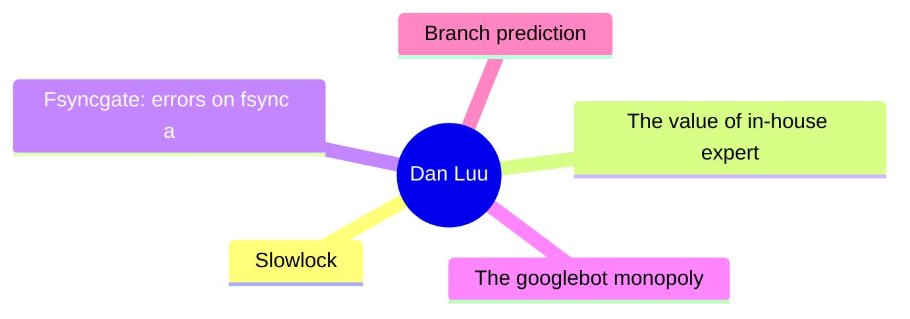
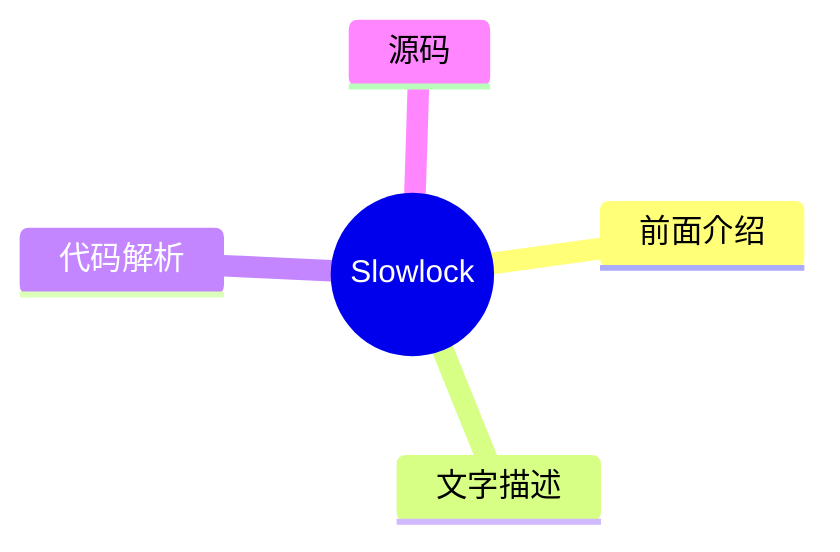
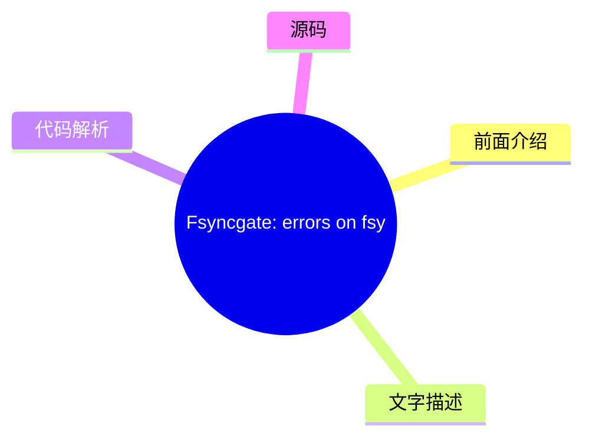
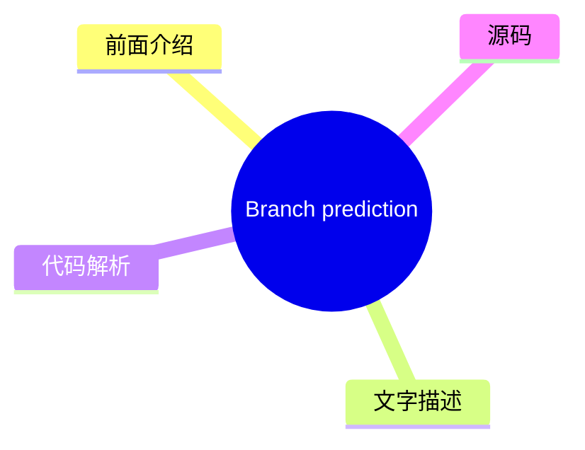

# 🔍 Dan Luu Top 5 (2026-07-28)

## 前面介绍

- 数据源：Dan Luu
- 抓取日期：2026-07-28
- 条目数：5
- 含完整正文：5
- 含代码片段：3
- 组织方式：前面介绍 / 树状图 / 文字描述 / 代码解析 / 源码

## 思维导图



## 详细整理（5 条，5 条含全文，3 条含代码）

### 1. Slowlock
- **链接**: [https://danluu.com/limplock/](https://danluu.com/limplock/)
- **发布**: Wed, 30 Sep 2015 00:00:00 +0000

#### 前面介绍

- Every once in awhile, you hear a story like “there was a case of a 1-Gbps NIC card on a machine that suddenly was transmitting only at 1 Kbps, which then caused a chain reaction upstream in such a way that the performance of the entire workload of a
- 发布时间：Wed, 30 Sep 2015 00:00:00 +0000

#### 树状图



#### 文字描述

- Every once in awhile, you hear a story like “there was a case of a 1-Gbps NIC card on a machine that suddenly was transmitting only at 1 Kbps, which then caused a chain reaction upstream in such a way that the performance of the entire workload of a 100-node cluster was crawling at a snail's pace, effectively making the system unavailable for all practical purposes”. The storie

#### 代码解析

- 本文未检测到明确代码块，内容更偏新闻、观点或方法论。

#### 源码

#### 中文节选

Every once in awhile, you hear a story like “there was a case of a 1-Gbps NIC card on a machine that suddenly was transmitting only at 1 Kbps, which then caused a chain reaction upstream in such a way that the performance of the entire workload of a 100-node cluster was crawling at a snail's pace, effectively making the system unavailable for all practical purposes”. The stories are interesting and the postmortems are fun to read, but it's not really clear how vulnerable systems are to this kind of failure or how prevalent these failures are.

 The situation reminds me of distributed systems failures before [Jepsen](https://aphyr.com/tags/jepsen). There are lots of anecdotal horror stories, but a common response to those is “works for me”, even when talking about systems that are now known to be fantastically broken. A handful of companies that are really serious about correctness have good tests and metrics, but they mostly don't talk about them publicly, and the general public has no easy way of figuring out if the systems they're running are sound.

  Thanh Do et al. have tried to look at this systematically -- [what's the effect of hardware that's been crippled but not killed](http://ucare.cs.uchicago.edu/pdf/socc13-limplock.pdf), and [how often does this happen in practice](http://ucare.cs.uchicago.edu/pdf/socc14-cbs.pdf)? It turns out that a lot of commonly used systems aren't robust against against “limping” hardware, but that the incidence of these types of failures are rare (at least until you have unreasonably large scale).

 The effect of a single slow node can be [quite dramatic](http://pages.cs.wisc.edu/~thanhdo/pdf/talk-socc-limplock.pdf):

 The job completion rate slowed down from 172 jobs per hour to 1 job per hour, effectively killing the entire cluster. Facebook has mechanisms to deal with dead machines, but they apparently didn't have any way to deal with slow machines at the time.

 When Do et al. looked at widely used open source software (HDFS, Hadoop, ZooKeeper, Cassandra, and HBase), they found similar problems.


每个子图代表不同的故障条件。F 是 HDFS，H 是 Hadoop，Z 是 Zookeeper，C 是 Cassandra，B 是 HBase。最左侧（白色）的条形图是基线无故障情况。向右移动，下一个是崩溃，随后的条形图是单个降级但未崩溃硬件的结果（越靠右意味着越慢）。在大多数（但不是全部）情况下，拥有降级硬件对性能的影响比拥有故障硬件要大得多。请注意，这些图表都是对数刻度；向上增加一个刻度意味着性能有 10 倍的差异。

 奇怪的是，故障磁盘可能会导致某些操作加速。这是因为如果副本失效，某些操作的复制开销会更小。对我来说这有点奇怪，因为系统必须同时找到替换副本并复制数据，但谁知道呢？

 无论如何，为什么慢节点比死节点糟糕得多？Th

#### 完整正文（中文）

每隔一段时间，你就会听到这样一个故事：“有一台机器上的 1-Gbps 网卡突然只能以 1 Kbps 的速度传输，这随后在上游引发了一连串反应，导致一个 100 节点集群的整个工作负载性能像蜗牛一样缓慢，实际上使系统在所有实际用途上都变得不可用”。这些故事很有趣，事后分析也很有趣读，但并不清楚系统对这种故障的脆弱性有多大，也不清楚这些故障发生的频率有多高。

这种情况让我想起了 [Jepsen](https://aphyr.com/tags/jepsen) 之前分布式系统的故障。有很多轶事性的恐怖故事，但针对这些故事的一个常见回应是“对我来说是好的”，即使是在谈论那些现在已知是极其糟糕的系统时。少数几家真正重视正确性的公司拥有良好的测试和指标，但他们大多不会公开谈论它们，公众也没有简单的方法来判断他们运行的系统是否可靠。

Thanh Do 等人试图系统地研究这个问题——[被削弱但未损坏的硬件有什么影响](http://ucare.cs.uchicago.edu/pdf/socc13-limplock.pdf)，以及[这种情况在实践中发生的频率有多高](http://ucare.cs.uchicago.edu/pdf/socc14-cbs.pdf)？事实证明，许多常用的系统对“跛行”硬件并不稳健，但这些类型的故障发生率很低（至少在你拥有不合理的大规模之前）。

单个慢节点的效果可能[非常显著](http://pages.cs.wisc.edu/~thanhdo/pdf/talk-socc-limplock.pdf)：

作业完成率从每小时 172 个作业降到了每小时 1 个作业，有效地杀死了整个集群。Facebook 有处理死机机器的机制，但他们显然当时没有任何方法来处理慢速机器。

当 Do 等人查看广泛使用的开源软件（HDFS、Hadoop、ZooKeeper、Cassandra 和 HBase）时，他们发现了类似的问题。

 Each subgraph is a different failure condition. F is HDFS, H is Hadoop, Z is Zookeeper, C is Cassandra, and B is HBase. The leftmost (white) bar is the baseline no-failure case. Going to the right, the next is a crash, and the subsequent bars are results for a single degraded but not crashed hardware (further right means slower). In most (but not all) cases, having degraded hardware affected performance a lot more than having failed hardware. Note that these graphs are all log scale; going up one increment is a 10x difference in performance!

 Curiously, a failed disk can cause some operations to speed up. That's because there are operations that have less replication overhead if a replica fails. It seems a bit weird to me that there isn't more overhead, because the system has to both find a replacement replica and replicate data, but what do I know?

 Anyway, why is a slow node so much worse than a dead node? The authors define three failure modes and explain what causes each one. There's operation limplock, when an operation is slow because some subpart of the operation is slow (e.g., a disk read is slow because the disk is degraded), node limplock, when a node is slow even for seemingly unrelated operations (e.g, a read from RAM is slow because a disk is degraded), and cluster limplock, where the entire cluster is slow (e.g., a single degraded disk makes an entire 1000 machine cluster slow).

 How do these happen?

 #### Operation Limplock

 This one is the simplest. If you try to read from disk, and your disk is slow, your disk read will be slow. In the real world, we'll see this when operations have a single point of failure, and when monitoring is designed to handle total failure and not degraded performance. For example, an HBase access to a region goes through the server responsible for that region. The data is replicated on HDFS, but this doesn't help you if the node that owns the data is limping. Speaking of HDFS, it has a timeout is 60s and reads are in 64K chunks, which means your reads can slow down to almost 1K/s before HDFS will fail over to a healthy node.

 #### Node Limplock


 How can it be the case that (for example) a slow disk causes memory reads to be slow? Looking at HDFS again, it uses a thread pool. If every thread is busy very slowly completing a disk read, memory reads will block until a thread gets free.

 This isn't only an issue when using limited thread pools or other bounded abstractions -- the reality is that machines have finite resources, and unbounded abstractions will run into machine limits if they aren't carefully designed to avoid the possibility. For example, Zookeeper keeps queue of operations, and a slow follower can cause the leader's queue to exhaust physical memory.

 #### Cluster Limplock

 An entire cluster can easily become unhealthy if it relies on a single primary and the primary is limping. Cascading failures can also cause this -- the first graph, where a cluster goes from completing 172 jobs an hour to 1 job an hour is actually a Facebook workload on Hadoop. The thing that's surprising to me here is that Hadoop is supposed to be tail tolerant -- individual slow tasks aren't supposed to have a large impact on the completion of the entire job. So what happened? Unhealthy nodes infect healthy nodes and eventually lock up the whole cluster.

 Hadoop's tail tolerance comes from kicking off speculative computation when results are coming in slowly. In particular, when stragglers come in unusually slowly compared to other results. This works fine when a reduce node is limping (subgraph H2), but when a [map node](http://static.googleusercontent.com/media/research.google.com/en//archive/mapreduce-osdi04.pdf) limps (subgraph H1), it can slow down all reducers in the same job, which defeats Hadoop's tail-tolerance mechanisms.


 To see why, we have to look at [Hadoop's speculation algorithm](https://www.usenix.org/legacy/event/osdi08/tech/full_papers/zaharia/zaharia_html/index.html). Each job has a progress score which is a number between 0 and 1 (inclusive). For a map, the score is the fraction of input data read. For a reduce, each of three phases (copying data from mappers, sorting, and reducing) gets 1/3 of the score. A speculative job will get run if a task has run for at least one minute and has a progress score that's less than the average for its category minus 0.2.

 In case H2, the NIC is limping, so the map phase completes normally since results end up written to local disk. But when reduce nodes try to fetch data from the limping map node, they all stall, pulling down the average score for the category, which prevents speculative jobs from being run. Looking at the big picture, each Hadoop node has a limited number of map and reduce tasks. If those fill up with limping tasks, the entire node will lock up. Since Hadoop isn't designed to avoid cascading failures, this eventually causes the entire cluster to lock up.

 One thing I find interesting is that this exact cause of failures was [described in the original MapReduce paper](http://research.google.com/archive/mapreduce.html), published in 2004. They even explicitly called out slow disk and network as causes of stragglers, which motivated their speculative execution algorithm. However, they didn't provide the details of the algorithm. The open source clone of MapReduce, Hadoop, attempted to avoid the same problem. Hadoop was initially released in 2008. Five years later, when the paper we're reading was published, its built-in mechanism for straggler detection not only failed to prevent multiple types of stragglers, it also failed to prevent stragglers from effectively deadlocking the entire cluster.

 ### Conclusion

 I'm not going to go into details of how each system fared under testing. That's detailed quite nicely in the paper, which I recommend reading the paper if you're curious. To summarize, Cassandra does quite well, whereas HDFS, Hadoop, and HBase don't.


Cassandra 在这两方面似乎表现良好。首先，[来自 2009 年的这个补丁](https://issues.apache.org/jira/browse/CASSANDRA-488) 防止了队列溢出感染健康节点，这避免了其他系统中导致集群级故障的主要故障模式。其次，所使用的架构 ([SEDA](http://www.eecs.harvard.edu/~mdw/proj/seda/)) 解耦了不同类型的操作，这使得即使某些操作处于“跛行”状态，良好的操作仍能继续执行。

阅读这篇论文后，我的主要问题是，这类故障发生的频率如何，是如何发生的，而且合理的指标/报告不应该能捕获这类情况吗？

对于第一个问题的答案，许多同一作者还发表了一篇论文，他们在其中研究了 [Cassandra、Flume、HDFS 和 ZooKeeper 中的 3000 次故障](http://ucare.cs.uchicago.edu/pdf/socc14-cbs.pdf)，并确定了哪些故障与硬件相关以及硬件故障的性质。

14 起性能降级案例 vs. 410 起其他硬件故障。在他们样本中，这占故障的 3%；虽然罕见，但并非罕见到我们可以忽略这个问题。

如果我们不能忽略这类错误，如何在它们进入生产环境之前捕获它们？该论文使用了 [Emulab 测试平台](http://www.emulab.net/)，这真的很酷。不幸的是，Emulab 页面写道“Emulab 是一个公共设施，向全球大多数研究人员免费开放。如果您不确定自己是否有资格使用，请参阅我们的政策文档或向我们咨询。如果您认为自己有资格，可以申请启动一个新项目”。这是可以理解的，但这意味着它对我们大多数人来说可能不是一个很好的解决方案。

 The vast majority of limping hardware is due to network or disk slowness. Why couldn't a modified version of Jepsen, or something like it, simulate disk or network slowness? A naive implementation wouldn't get anywhere near the precision of Emulab, but since we're talking about order of magnitude slowdowns, having 10% (or even 2x) variance should be ok for testing the robustness of systems against degraded hardware. There are a number of ways you could imagine that working. For example, to simulate a slow network on linux, you could try throttling [via qdisc](http://linux-ip.net/articles/Traffic-Control-HOWTO/), [hooking syscalls via ptrace](https://github.com/majek/fluxcapacitor), etc. For a slow CPU, you can rate-limit via cgroups and cpu.shares, or just map the process to UC memory (or maybe WT or WC if that's a bit too slow), and so on and so forth for disk and other failure modes.

 That leaves my last question, shouldn't systems already catch these sorts of failures even if they're not concerned about them in particular? As we saw above, systems with cripplingly slow hardware are rare enough that we can just treat them as dead without significantly impacting our total compute resources. And systems with crippled hardware can be detected pretty straightforwardly. Moreover, multi-tenant systems have to do [continuous monitoring of their own performance to get good utilization](//danluu.com/new-cpu-features/#partitioning) anyway.


那么，为什么我们要关心设计对“跛行硬件”具有鲁棒性的系统呢？答案的一部分是纵深防御。当然，我们应该有监控，但也应该有在监控失效时依然稳健的系统，因为监控必然会失效。答案的另一部分是，通过使系统对跛行硬件更具容忍度，我们也会使它们对多租户环境中其他工作负载的干扰更具容忍度。最后一点多少有些推测性的实证问题——有可能，设计对同一机器上竞争工作负载的干扰不特别稳健的系统会更高效，同时使用[更好的分区](//danluu.com/intel-cat/)来避免干扰。

 

 

 感谢 Leah Hanson, Hari Angepat, Laura Lindzey, Julia Ev


### 2. The value of in-house expertise
- **链接**: [https://danluu.com/in-house/](https://danluu.com/in-house/)
- **发布**: Wed, 29 Sep 2021 00:00:00 +0000

#### 前面介绍

- An alternate title for this post might be, &quot;Twitter has a kernel team!?&quot;. At this point, I've heard that surprised exclamation enough that I've lost count of the number times that's been said to me (I'd guess that it's more than ten but les
- 发布时间：Wed, 29 Sep 2021 00:00:00 +0000

#### 树状图


#### 文字描述

- An alternate title for this post might be, "Twitter has a kernel team!?". At this point, I've heard that surprised exclamation enough that I've lost count of the number times that's been said to me (I'd guess that it's more than ten but less than a hundred). If we look at trendy companies that are within a couple factors of two in size of Twitter (in terms of either market cap 

#### 代码解析

- 本文未检测到明确代码块，内容更偏新闻、观点或方法论。

#### 源码

#### 中文节选

这篇帖子或许可以有一个副标题：“Twitter 也有内核团队！？” 到目前为止，我已经听过这种惊讶的感叹太多次了，以至于我都数不清有多少次了（我猜是十次到一百次之间）。如果我们看看那些规模与 Twitter 相当（无论是市值还是工程师人数，相差不超过两倍）的热门公司，它们大多不具备类似的专长，这通常是由于路径依赖造成的——因为它们是在云端“长大”的，所以不需要像本地部署公司那样具备内核专长来维持运营。虽然这让人可以理解，为什么那些在更年轻、更热门的公司度过职业生涯的人会对 Twitter 拥有内核团队感到惊讶，但我认为这种惊讶并没有技术上的原因。

无论是否拥有内核专长，像 Twitter 这样规模的公司都会经常遇到内核问题，从重大的生产事故到微小的麻烦。如果没有内核团队或相应的专长，公司将只能勉强应对这些问题，不仅会遇到不必要的问题，而且解决事故所需的时间也会不必要地延长。作为一个关键生产事故的例子，由于它已经公开发表过，我将引用[这篇帖子](https://blog.twitter.com/engineering/en_us/topics/open-source/2020/hunting-a-linux-kernel-bug)，其中冷静地指出：

 去年早些时候，我们识别出一个防火墙配置错误，意外导致大部分网络流量丢失。我们预期重置防火墙配置可以修复该问题，但重置防火墙配置却暴露了一个内核 bug

这意味着虽然未明确说明，但这次防火墙配置错误是我任职期间发生的最严重事故，我相信这实际上也是自2013年左右以来Twitter遭遇的最严重中断。作为一家公司，即使没有内核团队或另一个拥有深厚Linux专业知识的团队，我们本仍能缓解该问题，但理解为何初步修复无效所需的时间会更长，而在调试严重中断时，这是你最不希望发生的情况。内核团队的成员已经熟悉各种诊断工具和调试技术，能够快速理解为何初步修复无效，而在某些同行公司中，这些并非常识（我调查了多家规模相当的同行公司，询问他们是否认为至少有一人具备快速调试该错误的知识，许多公司的回答是否定的）。

在各个领域拥有内部专业知识的另一个原因是，它们很容易通过自身价值得到回报，这是[大型公司应该比大多数人预期的更大的通用论点的一个特例，因为微小的百分比增益在绝对金额上也是一笔巨款](/sounds-easy/)。如果，在像内核团队这样的专业团队的整个生命周期内，一个

#### 完整正文（中文）

这篇帖子或许可以有一个副标题：“Twitter 也有内核团队！？” 到目前为止，我已经听过这种惊讶的感叹太多次了，以至于我都数不清有多少次了（我猜是十次到一百次之间）。如果我们看看那些规模与 Twitter 相当（无论是市值还是工程师人数，相差不超过两倍）的热门公司，它们大多不具备类似的专长，这通常是由于路径依赖造成的——因为它们是在云端“长大”的，所以不需要像本地部署公司那样具备内核专长来维持运营。虽然这让人可以理解，为什么那些在更年轻、更热门的公司度过职业生涯的人会对 Twitter 拥有内核团队感到惊讶，但我认为这种惊讶并没有技术上的原因。

无论是否拥有内核专长，像 Twitter 这样规模的公司都会经常遇到内核问题，从重大的生产事故到微小的麻烦。如果没有内核团队或相应的专长，公司将只能勉强应对这些问题，不仅会遇到不必要的问题，而且解决事故所需的时间也会不必要地延长。作为一个关键生产事故的例子，由于它已经公开发表过，我将引用[这篇帖子](https://blog.twitter.com/engineering/en_us/topics/open-source/2020/hunting-a-linux-kernel-bug)，其中冷静地指出：

 去年早些时候，我们识别出一个防火墙配置错误，意外导致大部分网络流量丢失。我们预期重置防火墙配置可以修复该问题，但重置防火墙配置却暴露了一个内核 bug

这意味着虽然文中没有明确说明，但这次防火墙配置错误是我任职期间发生的最严重事件，我认为这实际上自2013年左右以来，Twitter遭遇的最严重中断。作为一家公司，即使没有内核团队或另一个拥有深厚 Linux 专业知识的团队，我们本仍能缓解该问题，但理解为何最初修复无效所需的时间会更长，而当你正在调试严重的中断时，这是你最不希望发生的事情。内核团队的成员已经熟悉各种诊断工具和调试技术，能够快速理解为何最初修复无效，而在一些同行公司中，这并非常识（我调查了多家规模相当的同行公司，询问他们是否认为至少有一人具备快速调试该错误所需的知识，许多公司的回答是否定的）。

在各个领域拥有内部专业知识的另一个原因是，它们很容易自我盈利，这是[大型公司应该比大多数人预期的更大的通用论点的一个特例，因为微小的百分比收益在绝对金额上也是巨大的](/sounds-easy/))。如果在一个像内核团队这样的专业团队的存续期间，有一个人发现某种持续降低 [TCO](https://en.wikipedia.org/wiki/Total_cost_of_ownership) 0.5% 的东西，这将永久性地支付该团队的费用，而 Twitter 的内核团队已经发现了许多此类变更。除了有时具有这种影响的[内核补丁](https://patchwork.ozlabs.org/project/netdev/list/?submitter=211&state=*&archive=both¶m=4&page=1)外，人们还会发现具有这种影响的配置问题等。

 So far, I've only talked about the kernel team because that's the one that most frequently elicits surprise from folks for merely existing, but I get similar reactions when people find out that Twitter has a bunch of ex-Sun JVM folks who worked on HotSpot, like Ramki Ramakrishna, Tony Printezis, and John Coomes. People wonder why a social media company would need such deep JVM expertise. As with the kernel team, companies our size that use the JVM run into weird issues and JVM bugs and it's helpful to have people with deep expertise to debug those kinds of issues. And, as with the kernel team, individual optimizations to the JVM can pay for the team in perpetuity. A concrete example is [this patch by Flavio Brasil, which virtualizes compare and swap calls](https://github.com/oracle/graal/pull/636).

 The context for this is that Twitter uses a lot of Scala. Despite a lot of claims otherwise, Scala uses more memory and is significantly slower than Java, which has a significant cost if you use Scala at scale, enough that it makes sense to do optimization work to reduce the performance gap between idiomatic Scala and idiomatic Java.

 Before the patch, if you profiled our Scala code, you would've seen an unreasonably large amount of time spent in Future/Promise, including in cases where you might naively expect that the compiler would optimize the work away. One reason for this is that Futures use a [compare-and-swap](https://en.wikipedia.org/wiki/Compare-and-swap) (CAS) operation that's opaque to JVM optimization. The patch linked above avoids CAS operations when the Future doesn't escape the scope of the method. [This companion patch](https://github.com/twitter/util/commit/3245a8e1a98bd5eb308f366678528879d7140f5e) removes CAS operations in some places that are less amenable to compiler optimization. The two patches combined reduced the cost of typical major Twitter services using idiomatic Scala by 5% to 15%, paying for the JVM team in perpetuity many times over and that wasn't even the biggest win Flavio found that year.


 I'm not going to do a team-by-team breakdown of teams that pay for themselves many times over because there are so many of them, even if I limit the scope to "teams that people are surprised that Twitter has".

 A related topic is how people talk about "buy vs. build" discussions. I've seen a number of discussions where someone has argued for "buy" because that would obviate the need for expertise in the area. This can be true, but I've seen this argued for much more often than it is true. An example where I think this tends to be untrue is with distributed tracing. [We've previously looked at some ways Twitter gets value out of tracing](/tracing-analytics/), which came out of the vision Rebecca Isaacs put into place. On the flip side, when I talk to people at peer companies with similar scale, most of them have not (yet?) succeeded at getting significant value from distributed tracing. This is so common that I see a viral Twitter thread about how useless distributed tracing is more than once a year. Even though we went with the more expensive "build" option, just off the top of my head, I can think of multiple uses of tracing that have returned between 10x and 100x the cost of building out tracing, whereas people at a number of companies that have chosen the cheaper "buy" option commonly complain that tracing isn't worth it.


 Coincidentally, I was just talking about this exact topic to Pam Wolf, a civil engineering professor with experience in (civil engineering) industry on multiple continents, who had a related opinion. For large scale systems (projects), you need an in-house expert (owner's-side engineer) for each area that you don't handle in your own firm. While it's technically possible to hire yet another firm to be the expert, that's more expensive than developing or hiring in-house expertise and, in the long run, also more risky. That's pretty analogous to my experience working as an electrical engineer as well, where orgs that outsource functions to other companies without retaining an in-house expert pay a very high cost, and not just monetarily. They often ship sub-par designs with long delays on top of having high costs. "Buying" can and often does reduce the amount of expertise necessary, but it often doesn't remove the need for expertise.


这与另一个常见的抽象论点有关，即公司应该专注于“其比较优势领域”或“最重要的问题”或“核心业务需求”，并将其他一切外包。我们已经看到几个例子表明情况并非如此，因为，在足够大的规模下，拥有内部专业知识比没有更有利可图，无论某事是否属于公司的核心业务（有人可能会争辩说，所有移至内部的事物都是公司的核心业务，但这会使“核心性”这一概念变得毫无意义）。这种抽象建议过于简单的另一个原因是，企业可以在某种程度上任意选择其比较优势是什么。一个典型的例子是苹果将 CPU 设计纳入内部。自以 2.78 亿美元收购 PA Semi（原 SiByte 团队，再之前是来自 DEC 的团队）以来，苹果一直在以相当大的优势生产[手机和笔记本电脑功耗范围内的最佳芯片](https://twitter.com/danluu/status/1433297089866383364)。但在收购之前，苹果没有任何东西使得收购成为必然，使得 CPU 设计成为苹果固有的比较优势。但如果一家公司可以选择一个领域并将其变成比较优势领域，那么说该公司应该专注于其比较优势，并不是什么有用的建议。

 2.78 亿美元从绝对意义上讲是一笔巨款，但作为苹果资源的一部分，这微不足道，而且较小的公司也可以通过投入一小部分资源来开展尖端工作，例如，Twitter 以任何一家 1 亿美元的公司都能负担得起的价格，[创造了新颖的缓存算法和数据结构](https://twitter.com/danluu/status/1381687511362138113)，并正在开展其他前沿缓存工作。拥有优秀的[缓存基础设施](/cache-incidents/)对 Twitter 业务来说并不比为苹果创造优秀的 CPU 更核心，但它是一个杠杆，Twitter 可以利用它比其他情况下赚更多的钱。

 For small companies, it doesn't make sense to have in-house experts for everything the company touches, but companies don't have to get all that large before it starts making sense to have in-house expertise in their operating system, language runtime, and other components that people often think of as being fairly specialized. Looking back at Twitter's history, Yao Yue has noted that when she was working on cache in Twitter's early days (when we had ~100 engineers), she would regularly go to the kernel team for help debugging production incidents and that, in some cases, debugging could've easily taken 10x longer without help from the kernel team. Social media companies tend to have relatively high scale on a per-user and per-dollar basis, so not every company is going to need the same kind of expertise when they have 100 engineers, but there are going to be other areas that aren't obviously core business needs where expertise will pay off even for a startup that has 100 engineers.

 Thanks to Ben Kuhn, Yao Yue, Pam Wolf, John Hergenroeder, Julien Kirch, Tom Brearley, and Kevin Burke for comments/corrections/discussion.


### 3. Fsyncgate: errors on fsync are unrecovarable
- **链接**: [https://danluu.com/fsyncgate/](https://danluu.com/fsyncgate/)
- **发布**: Wed, 28 Mar 2018 00:00:00 +0000

#### 前面介绍

- This is an archive of the original &quot;fsyncgate&quot; email thread. This is posted here because I wanted to have a link that would fit on a slide for a talk on file safety with a mobile-friendly non-bloated format.

From:Craig Ringer &lt;craig(at)
- 发布时间：Wed, 28 Mar 2018 00:00:00 +0000

#### 树状图



#### 文字描述

- *This is an archive of the original "fsyncgate" email thread. This is posted here because I wanted to have a link that would fit on a slide for *[a talk on file safety](//danluu.com/deconstruct-files/) with [a mobile-friendly non-bloated format](//danluu.com/web-bloat/). ``` From:Craig Ringer <craig(at)2ndquadrant(dot)com> Subject:Re: PostgreSQL's handling of fsync() errors is 

#### 代码解析

- `text`: 这段更像查询逻辑，重点看过滤条件、聚合方式和性能影响。
- `text`: 这段更像查询逻辑，重点看过滤条件、聚合方式和性能影响。
- `text`: 这段更像查询逻辑，重点看过滤条件、聚合方式和性能影响。

#### 源码

#### 源码片段 1（text）

```text
From:Craig Ringer <craig(at)2ndquadrant(dot)com>
Subject:Re: PostgreSQL's handling of fsync() errors is unsafe and risks data loss at least on XFS
Date:2018-03-28 02:23:46
```

#### 源码片段 2（text）

```text
From:Tom Lane <tgl(at)sss(dot)pgh(dot)pa(dot)us>
Date:2018-03-28 03:53:08
```

#### 源码片段 3（text）

```text
From:Michael Paquier <michael(at)paquier(dot)xyz>
Date:2018-03-29 02:30:59
```

#### 完整正文（中文）

*这是原始“fsyncgate”邮件线程的存档。发布在这里是因为我想要一个适合幻灯片的链接，用于 *[关于文件安全的演讲](//danluu.com/deconstruct-files/)* 以及 *[移动端友好且无臃肿的格式](//danluu.com/web-bloat/)*。

 ```
From:Craig Ringer <craig(at)2ndquadrant(dot)com>
Subject:Re: PostgreSQL's handling of fsync() errors is unsafe and risks data loss at least on XFS
Date:2018-03-28 02:23:46
```

 Hi all

 Some time ago I ran into an issue where a user encountered data corruption after a storage error. PostgreSQL played a part in that corruption by allowing checkpoint what should've been a fatal error.

 TL;DR: Pg should PANIC on fsync() EIO return. Retrying fsync() is not OK at least on Linux. When fsync() returns success it means "all writes since the last fsync have hit disk" but we assume it means "all writes since the last SUCCESSFUL fsync have hit disk".

 Pg wrote some blocks, which went to OS dirty buffers for writeback. Writeback failed due to an underlying storage error. The block I/O layer and XFS marked the writeback page as failed (AS_EIO), but had no way to tell the app about the failure. When Pg called fsync() on the FD during the next checkpoint, fsync() returned EIO because of the flagged page, to tell Pg that a previous async write failed. Pg treated the checkpoint as failed and didn't advance the redo start position in the control file.

 All good so far.

 But then we retried the checkpoint, which retried the fsync(). The retry succeeded, because the prior fsync() *cleared the AS_EIO bad page flag*.

 The write never made it to disk, but we completed the checkpoint, and merrily carried on our way. Whoops, data loss.

 The clear-error-and-continue behaviour of fsync is not documented as far as I can tell. Nor is fsync() returning EIO unless you have a very new linux man-pages with the patch I wrote to add it. But from what I can see in the POSIX standard we are not given any guarantees about what happens on fsync() failure at all, so we're probably wrong to assume that retrying fsync( ) is safe.

 If the server had been using ext3 or ext4 with errors=remount-ro, the problem wouldn't have occurred because the first I/O error would've remounted the FS and stopped Pg from continuing. But XFS doesn't have that option. There may be other situations where this can occur too, involving LVM and/or multipath, but I haven't comprehensively dug out the details yet.

 It proved possible to recover the system by faking up a backup label from before the first incorrectly-successful checkpoint, forcing redo to repeat and write the lost blocks. But ... what a mess.

 I posted about the underlying fsync issue here some time ago:

 [https://stackoverflow.com/q/42434872/398670](https://stackoverflow.com/q/42434872/398670)

 but haven't had a chance to follow up about the Pg specifics.

 I've been looking at the problem on and off and haven't come up with a good answer. I think we should just PANIC and let redo sort it out by repeating the failed write when it repeats work since the last checkpoint.

 The API offered by async buffered writes and fsync offers us no way to find out which page failed, so we can't just selectively redo that write. I think we do know the relfilenode associated with the fd that failed to fsync, but not much more. So the alternative seems to be some sort of potentially complex online-redo scheme where we replay WAL only the relation on which we had the fsync() error, while otherwise servicing queries normally. That's likely to be extremely error-prone and hard to test, and it's trying to solve a case where on other filesystems the whole DB would grind to a halt anyway.

 I looked into whether we can solve it with use of the AIO API instead, but the mess is even worse there - from what I can tell you can't even reliably guarantee fsync at all on all Linux kernel versions.

 We already PANIC on fsync() failure for WAL segments. We just need to do the same for data forks at least for EIO. This isn't as bad as it seems because AFAICS fsync only returns EIO in cases where we should be stopping the world anyway, and many FSes will do that for us.


 There are rather a lot of pg_fsync() callers. While we could handle this case-by-case for each one, I'm tempted to just make pg_fsync() itself intercept EIO and PANIC. Thoughts?

 

 ```
From:Tom Lane <tgl(at)sss(dot)pgh(dot)pa(dot)us>
Date:2018-03-28 03:53:08
```

 Craig Ringer  writes:

  TL;DR: Pg should PANIC on fsync() EIO return.

 

 Surely you jest.

  Retrying fsync() is not OK at least on Linux. When fsync() returns success it means "all writes since the last fsync have hit disk" but we assume it means "all writes since the last SUCCESSFUL fsync have hit disk".

 

 If that's actually the case, we need to push back on this kernel brain damage, because as you're describing it fsync would be completely useless.

 Moreover, POSIX is entirely clear that successful fsync means all preceding writes for the file have been completed, full stop, doesn't matter when they were issued.

 

 ```
From:Michael Paquier <michael(at)paquier(dot)xyz>
Date:2018-03-29 02:30:59
```

 On Tue, Mar 27, 2018 at 11:53:08PM -0400, Tom Lane wrote:

  Craig Ringer  writes:

  TL;DR: Pg should PANIC on fsync() EIO return.

 

 Surely you jest.

 

 Any callers of pg_fsync in the backend code are careful enough to check the returned status, sometimes doing retries like in mdsync, so what is proposed here would be a regression.

 

 ```
From:Thomas Munro <thomas(dot)munro(at)enterprisedb(dot)com>
Date:2018-03-29 02:48:27
```

 On Thu, Mar 29, 2018 at 3:30 PM, Michael Paquier  wrote:

  On Tue, Mar 27, 2018 at 11:53:08PM -0400, Tom Lane wrote:

  Craig Ringer  writes:

  TL;DR: Pg should PANIC on fsync() EIO return.

 

 Surely you jest.

 

 Any callers of pg_fsync in the backend code are careful enough to check the returned status, sometimes doing retries like in mdsync, so what is proposed here would be a regression.

 

 Craig, is the phenomenon you described the same as the second issue "Reporting writeback errors" discussed in this article?

 [https://lwn.net/Articles/724307/](https://lwn.net/Articles/724307/)

 "Current kernels might report a writeback error on an fsync() call, but there are a number of ways in which that can fail to happen."

 That's... I'm speechless.

 


 ```
From:Justin Pryzby <pryzby(at)telsasoft(dot)com>
Date:2018-03-29 05:00:31
```

 On Thu, Mar 29, 2018 at 11:30:59AM +0900, Michael Paquier wrote:

  On Tue, Mar 27, 2018 at 11:53:08PM -0400, Tom Lane wrote:

  Craig Ringer  writes:

  TL;DR: Pg should PANIC on fsync() EIO return.

 

 Surely you jest.

 

 Any callers of pg_fsync in the backend code are careful enough to check the returned status, sometimes doing retries like in mdsync, so what is proposed here would be a regression.

 

 The retries are the source of the problem ; the first fsync() can return EIO, and also *clears the error* causing a 2nd fsync (of the same data) to return success.

 (Note, I can see that it might be useful to PANIC on EIO but retry for ENOSPC).

 On Thu, Mar 29, 2018 at 03:48:27PM +1300, Thomas Munro wrote:

  Craig, is the phenomenon you described the same as the second issue "Reporting writeback errors" discussed in this article? [https://lwn.net/Articles/724307/](https://lwn.net/Articles/724307/)

 

 Worse, the article acknowledges the behavior without apparently suggesting to change it:

 "Storing that value in the file structure has an important benefit: it makes it possible to report a writeback error EXACTLY ONCE TO EVERY PROCESS THAT CALLS FSYNC() .... In current kernels, ONLY THE FIRST CALLER AFTER AN ERROR OCCURS HAS A CHANCE OF SEEING THAT ERROR INFORMATION."

 I believe I reproduced the problem behavior using dmsetup "error" target, see attached.

 strace looks like this:

 kernel is Linux 4.10.0-28-generic #32~16.04.2-Ubuntu SMP Thu Jul 20 10:19:48 UTC 2017 x86_64 x86_64 x86_64 GNU/Linux

 ```
1open("/dev/mapper/eio", O_RDWR|O_CREAT, 0600) = 3
2write(3, "\0\0\0\0\0\0\0\0\0\0\0\0\0\0\0\0\0\0\0\0\0\0\0\0\0\0\0\0\0\0\0\0"..., 8192) = 8192
3write(3, "\0\0\0\0\0\0\0\0\0\0\0\0\0\0\0\0\0\0\0\0\0\0\0\0\0\0\0\0\0\0\0\0"..., 8192) = 8192
4write(3, "\0\0\0\0\0\0\0\0\0\0\0\0\0\0\0\0\0\0\0\0\0\0\0\0\0\0\0\0\0\0\0\0"..., 8192) = 8192
5write(3, "\0\0\0\0\0\0\0\0\0\0\0\0\0\0\0\0\0\0\0\0\0\0\0\0\0\0\0\0\0\0\0\0"..., 8192) = 8192
6write(3, "\0\0\0\0\0\0\0\0\0\0\0\0\0\0\0\0\0\0\0\0\0\0\0\0\0\0\0\0\0\0\0\0"..., 8192) = 8192

7write(3, "\0\0\0\0\0\0\0\0\0\0\0\0\0\0\0\0\0\0\0\0\0\0\0\0\0\0\0\0\0\0\0\0"..., 8192) = 8192
8write(3, "\0\0\0\0\0\0\0\0\0\0\0\0\0\0\0\0\0\0\0\0\0\0\0\0\0\0\0\0\0\0\0\0"..., 8192) = 2560
9write(3, "\0\0\0\0\0\0\0\0\0\0\0\0\0\0\0\0\0\0\0\0\0\0\0\0\0\0\0\0\0\0\0\0"..., 8192) = -1 ENOSPC (No space left on device)
10dup(2)                                  = 4
11fcntl(4, F_GETFL)                       = 0x8402 (flags O_RDWR|O_APPEND|O_LARGEFILE)
12brk(NULL)                               = 0x1299000
13brk(0x12ba000)                          = 0x12ba000
14fstat(4, {st_mode=S_IFCHR|0620, st_rdev=makedev(136, 2), ...}) = 0
15write(4, "write(1): No space left on devic"..., 34write(1): No space left on device
16) = 34
17close(4)                                = 0
18fsync(3)                                = -1 EIO (Input/output error)
19dup(2)                                  = 4
20fcntl(4, F_GETFL)                       = 0x8402 (flags O_RDWR|O_APPEND|O_LARGEFILE)
21fstat(4, {st_mode=S_IFCHR|0620, st_rdev=makedev(136, 2), ...}) = 0
22write(4, "fsync(1): Input/output error\n", 29fsync(1): Input/output error
23) = 29
24close(4)                                = 0
25close(3)                                = 0
26open("/dev/mapper/eio", O_RDWR|O_CREAT, 0600) = 3
27fsync(3)                                = 0
28write(3, "\0", 1)                       = 1
29fsync(3)                                = 0
30exit_group(0)                           = ?
```

 2: EIO isn't seen initially due to writeback page cache;

 9: ENOSPC due to small device

 18: original IO error reported by fsync, good

 25: the original FD is closed

 26: ..and file reopened

 27: fsync on file with still-dirty data+EIO returns success BAD

 10, 19: I'm not sure why there's dup(2), I guess glibc thinks that perror should write to a separate FD (?)

 Also note, close() ALSO returned success..which you might think exonerates the 2nd fsync(), but I think may itself be problematic, no? In any case, the 2nd byte certainly never got written to DM error, and the failure status was lost following fsync().

 I get the exact same behavior if I break after one write() loop, such as to avoid ENOSPC.

 

 ```

From:Thomas Munro <thomas(dot)munro(at)enterprisedb(dot)com>
Date:2018-03-29 05:06:22
```

 On Thu, Mar 29, 2018 at 6:00 PM, Justin Pryzby  wrote:

  The retries are the source of the problem ; the first fsync() can return EIO, and also *clears the error* causing a 2nd fsync (of the same data) to return success.

 

 What I'm failing to grok here is how that error flag even matters, whether it's a single bit or a counter as described in that patch. If write back failed, *the page is still dirty*. So all future calls to fsync() need to try to try to flush it again, and (presumably) fail again (unless it happens to succeed this time around).

 

 ```
From:Craig Ringer <craig(at)2ndquadrant(dot)com>
Date:2018-03-29 05:25:51
```

 On 29 March 2018 at 13:06, Thomas Munro  wrote:

  On Thu, Mar 29, 2018 at 6:00 PM, Justin Pryzby  wrote:

  The retries are the source of the problem ; the first fsync() can return EIO, and also *clears the error* causing a 2nd fsync (of the same data) to return success.

 

 What I'm failing to grok here is how that error flag even matters, whether it's a single bit or a counter as described in that patch. If write back failed, *the page is still dirty*. So all future calls to fsync() need to try to try to flush it again, and (pre

...（截断，原文 516759+ 字符）


### 4. The googlebot monopoly
- **链接**: [https://danluu.com/googlebot-monopoly/](https://danluu.com/googlebot-monopoly/)
- **发布**: Wed, 27 May 2015 00:00:00 +0000

#### 前面介绍

- TIL that Bell Labs and a whole lot of other websites block archive.org, not to mention most search engines. Turns out I have a broken website link in a GitHub repo, caused by the deletion of an old webpage. When I tried to pull the original from arch
- 发布时间：Wed, 27 May 2015 00:00:00 +0000

#### 树状图


#### 文字描述

- TIL that Bell Labs and a whole lot of other websites block archive.org, not to mention most search engines. Turns out I have [a broken website link](https://github.com/danluu/debugging-stories/issues/3) in a GitHub repo, caused by the deletion of an old webpage. When I tried to pull the original from archive.org, I found that it's not available because Bell Labs blocks the arch

#### 代码解析

- `text`: 更偏接口调用示例，适合作为接入或联调样例。

#### 源码

#### 源码片段 1（text）

```text
User-agent: Googlebot
User-agent: msnbot
User-agent: LSgsa-crawler
Disallow: /RealAudio/
Disallow: /bl-traces/
Disallow: /fast-os/
Disallow: /hidden/
Disallow: /historic/
Disallow: /incoming/
Disallow: /inferno/
Disallow: /magic/
Disallow: /netlib.depend/
Disallow: /netlib/
Disallow: /p9trace/
Disallow: /plan9/sources/
Disallow: /sources/
Disallow: /tmp/
Disallow: /tripwire/
Visit-time: 0700-1200
Request-rate: 1/5
Crawl-delay: 5
User-agent: *
Disallow: /
```

#### 完整正文（中文）

TIL that Bell Labs and a whole lot of other websites block archive.org, not to mention most search engines. Turns out I have [a broken website link](https://github.com/danluu/debugging-stories/issues/3) in a GitHub repo, caused by the deletion of an old webpage. When I tried to pull the original from archive.org, I found that it's not available because Bell Labs blocks the archive.org crawler in their robots.txt:

  ```
User-agent: Googlebot
User-agent: msnbot
User-agent: LSgsa-crawler
Disallow: /RealAudio/
Disallow: /bl-traces/
Disallow: /fast-os/
Disallow: /hidden/
Disallow: /historic/
Disallow: /incoming/
Disallow: /inferno/
Disallow: /magic/
Disallow: /netlib.depend/
Disallow: /netlib/
Disallow: /p9trace/
Disallow: /plan9/sources/
Disallow: /sources/
Disallow: /tmp/
Disallow: /tripwire/
Visit-time: 0700-1200
Request-rate: 1/5
Crawl-delay: 5
User-agent: *
Disallow: /
```

 In fact, Bell Labs not only blocks the Internet Archiver bot, it blocks all bots except for Googlebot, msnbot, and their own corporate bot. And msnbot was superseded by bingbot [five years ago](http://en.wikipedia.org/wiki/Msnbot)!

 A quick search using a term that's only found at Bell Labs, e.g., “This is a start at making available some of the material from the Tenth Edition Research Unix manual.”, reveals that bing indexes the page; either bingbot follows some msnbot rules, or that msnbot still runs independently and indexes sites like Bell Labs, which ban bingbot but not msnbot. Luckily, in this case, a lot of search engines (like Yahoo and DDG) use Bing results, so Bell Labs hasn't disappeared from the non-Google internet, but you're out of luck [if you're one of the 55% of Russians who use yandex](http://en.wikipedia.org/wiki/Yandex#cite_note-13).


 And all that is a relatively good case, where one non-Google crawler is allowed to operate. It's not uncommon to see robots.txt files that ban everything but Googlebot. Running [a competing search engine](http://blog.nullspace.io/building-search-engines.html) and preventing a Google monopoly is hard enough without having sites ban non-Google bots. We don't need to make it even harder, nor do we need to accidentally ban the Internet Archive bot.

  P.S. While you're checking that your robots.txt doesn't ban everyone but Google, consider looking at your CPUID checks to make sure that you're using feature flags [instead of banning everyone but Intel and AMD](https://twitter.com/danluu/status/1203450367515615233).

 BTW, I do think there can be legitimate reasons to block crawlers, including archive.org, but I don't think that the common default many web devs have, of blocking everything but googlebot, is really intended to block competing search engines as well as archive.org. 

 2021 Update: since this post was first published, archive.org started ignoring being blocked in robots.txt and archives posts where they are blocked in robots.txt. I've heard that some competing search engines do the same thing, so this mis-use of robots.txt, where sites ban everything but googlebot, is slowly making robots.txt effectively useless, much like browsers identify themselves as every browser in user-agent strings to work around sites that incorrectly block browsers they don't think are compatible.

 A related thing is that sites will sometimes ban competing search engines, like Bing, in a fit of pique, which they wouldn't do to Google since Google provides too much traffic for them to be able get away with that, e.g., [Discourse banned Bing because they were upset that Bing was crawling discourse at 0.46 QPS](https://twitter.com/danluu/status/981992814824378369).


### 5. Branch prediction
- **链接**: [https://danluu.com/branch-prediction/](https://danluu.com/branch-prediction/)
- **发布**: Wed, 23 Aug 2017 00:00:00 +0000

#### 前面介绍

- This is a pseudo-transcript for a talk on branch prediction given at Two Sigma on 8/22/2017 to kick off &quot;localhost&quot;, a talk series organized by RC.

How many of you use branches in your code? Could you please raise your hand if you use if
- 发布时间：Wed, 23 Aug 2017 00:00:00 +0000

#### 树状图



#### 文字描述

- *This is a pseudo-transcript for a talk on branch prediction given at Two Sigma on 8/22/2017 to kick off "localhost", a talk series organized by *[RC](https://www.recurse.com/scout/click?t=b504af89e87b77920c9b60b2a1f6d5e8). How many of you use branches in your code? Could you please raise your hand if you use if statements or pattern matching? `Most of the audience raises their
- ### One-bit So far, we’ve look at schemes that don’t store any state, i.e., schemes where the prediction ignores the program’s execution history. These are called *static* branch prediction schemes in the literature. These schemes have the advantage of being simple but they have the disadvantage of being bad at predicting branches whose behavior change over time. If you want an

#### 代码解析

- `text`: 代码片段可作为实现参考，建议结合上下文确认输入输出和边界条件。
- `text`: 代码片段可作为实现参考，建议结合上下文确认输入输出和边界条件。
- `text`: 代码片段可作为实现参考，建议结合上下文确认输入输出和边界条件。

#### 源码

#### 源码片段 1（text）

```text
if (x == 0) {
  // Do stuff
} else {
  // Do other stuff (things)
}
  // Whatever happens later
```

#### 源码片段 2（text）

```text
branch_if_not_equal x, 0, else_label
// Do stuff
goto end_label
else_label:
// Do things
end_label:
// whatever happens later
```

#### 源码片段 3（text）

```text
branch_if_not_equal x, 0, else_label
???
```

#### 完整正文（中文）

*这是关于分支预测的讲座的伪转录，于2017年8月22日在 Two Sigma 举行，旨在开启由 *[RC](https://www.recurse.com/scout/click?t=b504af89e87b77920c9b60b2a1f6d5e8) 组织的“localhost”讲座系列。

 你们中有多少人在代码中使用分支？如果你们使用 if 语句或模式匹配，请举手。

 `大多数观众举起了手`

 对于下一部分，我不会要求你们举手，但我猜测，如果我问有多少人觉得自己对 CPU 在执行分支时做了什么以及性能影响有很好的理解，又有多少人觉得自己能够理解一篇关于分支预测的现代论文，举手的人会更少。

 这次讲座的目的是解释 CPU 是如何以及为什么进行“分支预测”的，然后解释足够多的经典分支预测算法，以便你们能够阅读一篇关于分支预测的现代论文，并基本上知道正在发生什么。

 在我们讨论分支预测之前，让我们先谈谈为什么 CPU 要进行分支预测。为此，我们需要了解一些关于 CPU 是如何工作的。

 为了本次讲座的目的，你可以把你的电脑看作是一个 CPU 加上一些内存。指令存在于内存中，CPU 从内存中执行一系列指令，指令包括“将两个数相加”、“将一块数据从内存移动到处理器”等。通常情况下，在执行一条指令后，CPU 将执行位于下一个顺序地址的指令。然而，有一些称为“分支”的指令，可以让您改变下一条指令的来源地址。

 这是一个 CPU 执行一些指令的抽象图。x 轴是时间，y 轴区分不同的指令。

 在这里，我们执行指令 `A`，然后是指令 `B`，然后是指令 `C`，然后是指令 `D`。

你可以通过让 CPU 完成一条指令的所有工作，然后继续下一条指令，以此类推的方式来设计 CPU。这样做没有问题；许多较老的 CPU 就是这么做的，一些现代的廉价 CPU 仍然采用这种方式。但是，如果你想制造更快的 CPU，你可以设计一个像流水线一样的 CPU。也就是说，将 CPU 分成两部分，使得 CPU 的一半可以执行指令的“前半部分”工作，而 CPU 的另一半则处理指令的“后半部分”工作，就像流水线一样。这通常被称为流水线 CPU。

如果你这样做，执行过程可能看起来像上面那样。在指令 A 的前半部分完成后，CPU 可以处理指令 A 的后半部分，同时第一部分处理指令 B 的前半部分。当 A 的后半部分完成时，CPU 可以同时开始处理 B 的后半部分和 C 的前半部分。在这个图中，你可以看到流水线 CPU 每单位时间执行的指令数量是上面非流水线 CPU 的两倍。

没有理由说 CPU 只能分成两部分。我们可以将 CPU 分成三部分，从而获得 3 倍的加速比，或者分成四部分，获得 4 倍的加速比。这并不完全准确，而且对于三阶段流水线，我们通常获得的加速比小于 3 倍，对于四阶段流水线，获得的加速比小于 4 倍，因为将 CPU 分成更多部分并建立更深的流水线会产生开销。

开销的一个来源是如何处理分支。CPU 对指令要做的第一件事之一是获取指令；为此，它必须知道指令在哪里。例如，考虑以下代码：

```
if (x == 0) {
  // Do stuff
} else {
  // Do other stuff (things)
}
  // Whatever happens later
```

这可能会变成如下汇编代码：

```
branch_if_not_equal x, 0, else_label
// Do stuff
goto end_label
else_label:
// Do things
end_label:
// whatever happens later
```

 In this example, we compare `x` to 0. `if_not_equal`, then we branch to `else_label` and execute the code in the else block. If that comparison fails (i.e., if `x` is 0), we fall through, execute the code in the `if` block, and then jump to `end_label` in order to avoid executing the code in `else` block.

 The particular sequence of instructions that’s problematic for pipelining is

 ```
branch_if_not_equal x, 0, else_label
???
```

 The CPU doesn’t know if this is going to be

 ```
branch_if_not_equal x, 0, else_label
// Do stuff
```

 or

 ```
branch_if_not_equal x, 0, else_label
// Do things
```

 until the branch has finished (or nearly finished) executing. Since one of the first things the CPU needs to do for an instruction is to get the instruction from memory, and we don’t know which instruction `???` is going to be, we can’t even start on `???` until the previous instruction is nearly finished.

 Earlier, when we said that we’d get a 3x speedup for a 3-stage pipeline or a 20x speedup for a 20-stage pipeline, that assumed that you could start a new instruction every cycle, but in this case the two instructions are nearly serialized.

 One way around this problem is to use branch prediction. When a branch shows up, the CPU will guess if the branch was taken or not taken.

 In this case, the CPU predicts that the branch won’t be taken and starts executing the first half of `stuff` while it’s executing the second half of the branch. If the prediction is correct, the CPU will execute the second half of `stuff` and can start another instruction while it’s executing the second half of `stuff`, like we saw in the first pipeline diagram.

 If the prediction is wrong, when the branch finishes executing, the CPU will throw away the result from `stuff.1` and start executing the correct instructions instead of the wrong instructions. Since we would’ve stalled the processor and not executed any instructions if we didn’t have branch prediction, we’re no worse off than we would’ve been had we not made a prediction (at least at the level of detail we’re looking at).


如果我们预测每条分支都会发生跳转，准确率可能达到 70%，这意味着我们将为 30% 的分支支付错误预测的成本，使得平均指令的代价为 `(0.8 + 0.7 * 0.2) * 1 + 0.3 * 0.2 * 20 = 0.94 + 1.2 = 2.14`。如果我们比较“总是预测跳转”与“无预测”和“完美预测”，尽管这是一个非常简单的算法，但“总是预测跳转”仍然能获得完美预测的大部分收益。

### 向后跳转向前不跳转 (BTFNT)

 Predicting branches as taken works well for loops, but not so great for all branches. If we look at whether or not branches are taken based on whether or not the branch is forward (skips over code) or backwards (goes back to previous code), we can see that backwards branches are taken more often than forward branches, so we could try a predictor which predicts that backward branches are taken and forward branches aren’t taken (BTFNT). If we implement this scheme in hardware, compiler writers will conspire with us to arrange code such that branches the compiler thinks will be taken will be backwards branches and branches the compiler thinks won’t be taken will be forward branches.

 If we do this, we might get something like 80% prediction accuracy, making our cost function `(0.8 + 0.8 * 0.2) * 1 + 0.2 * 0.2 * 20 = 0.96 + 0.8 = 1.76` cycles per instruction.

 #### Used by

 - PPC 601(1993): also uses compiler generated branch hints
- PPC 603

### One-bit

 So far, we’ve look at schemes that don’t store any state, i.e., schemes where the prediction ignores the program’s execution history. These are called *static* branch prediction schemes in the literature. These schemes have the advantage of being simple but they have the disadvantage of being bad at predicting branches whose behavior change over time. If you want an example of a branch whose behavior changes over time, you might imagine some code like

 ```
if (flag) {
  // things
  }
```

 Over the course of the program, we might have one phase of the program where the flag is set and the branch is taken and another phase of the program where flag isn’t set and the branch isn’t taken. There’s no way for a static scheme to make good predictions for a branch like that, so let’s consider *dynamic* branch prediction schemes, where the prediction can change based on the program history.

 One of the simplest things we might do is to make a prediction based on the last result of the branch, i.e., we predict taken if the branch was taken last time and we predict not taken if the branch wasn’t taken last time.


由于为每一个可能的分支存储一位比特数太多，无法实际存储，我们将保留一个包含我们见过的若干分支及其最后结果的表。对于本次讨论，我们将 `not taken`（未取）存储为 `0`，将 `taken`（取）存储为 `1`。

在这种情况下，为了使内容能适应图表，我们有一个 64 项的表，这意味着我们可以用 6 位来索引该表，因此我们使用分支地址的低 6 位来索引该表。在执行分支后，我们会更新预测表中的条目（如下高亮所示），而下一次再次执行该分支时，我们将索引到同一个条目并使用更新后的值进行预测。

我们可能会观察到别名现象，即两个位于不同位置的分支会映射到同一个位置。这并不理想，但在表的速度与成本与大小之间存在权衡，这实际上限制了表的大小。

如果我们使用一位方案，准确率可能达到 85%，每个指令的代价为 `(0.8 + 0.85 * 0.2) * 1 + 0.15 * 0.2 * 20 = 0.97 + 0.6 = 1.57` 个周期。

#### Used by

- DEC EV4 (1992)
- MIPS R8000 (1994)

一位方案对于像 `TTTTTTTT…` 或 `NNNNNNN…` 这样的模式效果很好，但对于主要取但有一个分支未取的分支流，如 `...TTTNTTT...`，则会发生误预测。这可以通过为每个地址添加第二位并实现饱和计数器来解决。我们可以任意规定，当分支未取时递减计数，当分支取时递增计数。如果我们查看二进制值，我们将得到：

 ```
00: 预测 Not
01: 预测 Not
10: 预测 Taken
11: 预测 Taken
```

饱和计数器中的“饱和”部分意味着，如果我们从 `00` 递减，不会发生下溢，而是保持在 `00`，从 `11` 递增也是如此。该方案与一位方案相同

...（截断，原文 31719+ 字符）

