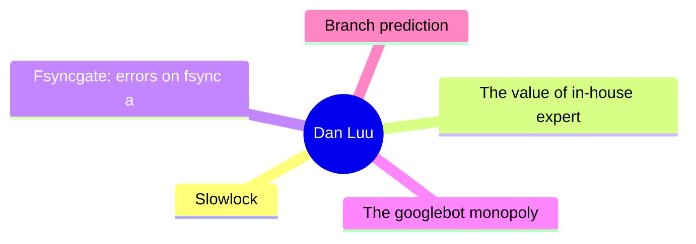
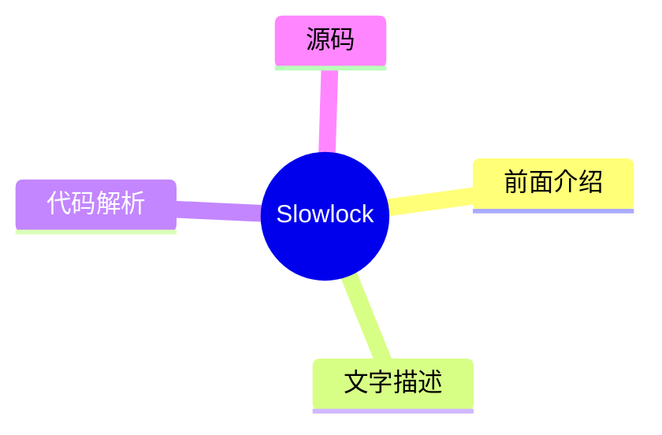
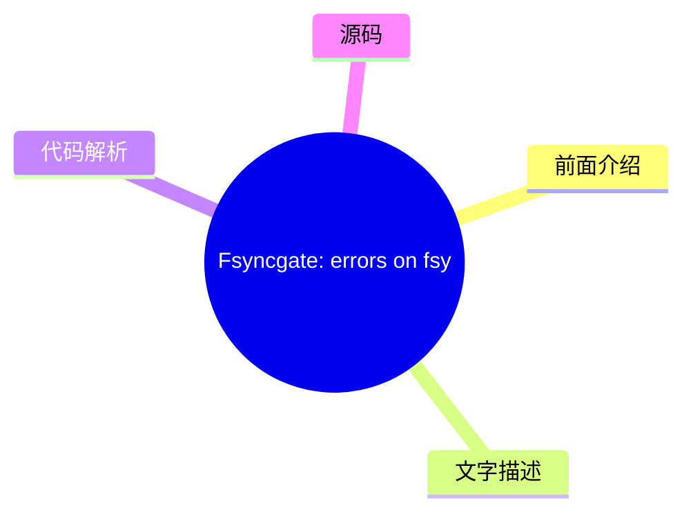
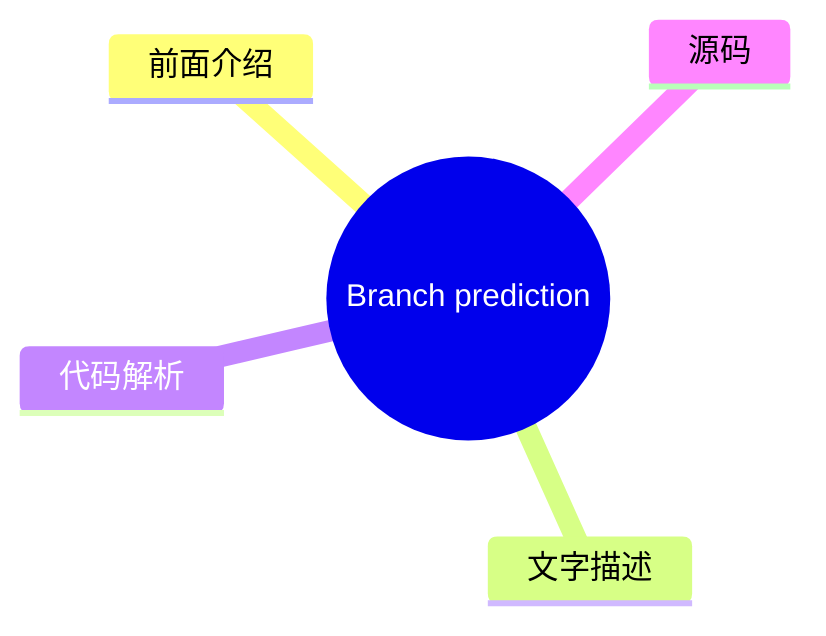

# 🔍 Dan Luu Top 5 (2026-07-30)

## 前面介绍

- 数据源：Dan Luu
- 抓取日期：2026-07-30
- 条目数：5
- 含完整正文：5
- 含代码片段：3
- 组织方式：前面介绍 / 树状图 / 文字描述 / 代码解析 / 源码

## 思维导图



## 详细整理（5 条，5 条含全文，3 条含代码）

### 1. Slowlock
- **链接**: [https://danluu.com/limplock/](https://danluu.com/limplock/)
- **发布**: Wed, 30 Sep 2015 00:00:00 +0000

#### 前面介绍

- Every once in awhile, you hear a story like “there was a case of a 1-Gbps NIC card on a machine that suddenly was transmitting only at 1 Kbps, which then caused a chain reaction upstream in such a way that the performance of the entire workload of a
- 发布时间：Wed, 30 Sep 2015 00:00:00 +0000

#### 树状图



#### 文字描述

- Every once in awhile, you hear a story like “there was a case of a 1-Gbps NIC card on a machine that suddenly was transmitting only at 1 Kbps, which then caused a chain reaction upstream in such a way that the performance of the entire workload of a 100-node cluster was crawling at a snail's pace, effectively making the system unavailable for all practical purposes”. The storie

#### 代码解析

- 本文未检测到明确代码块，内容更偏新闻、观点或方法论。

#### 源码

#### 中文节选

Every once in awhile, you hear a story like “there was a case of a 1-Gbps NIC card on a machine that suddenly was transmitting only at 1 Kbps, which then caused a chain reaction upstream in such a way that the performance of the entire workload of a 100-node cluster was crawling at a snail's pace, effectively making the system unavailable for all practical purposes”. The stories are interesting and the postmortems are fun to read, but it's not really clear how vulnerable systems are to this kind of failure or how prevalent these failures are.

 The situation reminds me of distributed systems failures before [Jepsen](https://aphyr.com/tags/jepsen). There are lots of anecdotal horror stories, but a common response to those is “works for me”, even when talking about systems that are now known to be fantastically broken. A handful of companies that are really serious about correctness have good tests and metrics, but they mostly don't talk about them publicly, and the general public has no easy way of figuring out if the systems they're running are sound.

  Thanh Do et al. have tried to look at this systematically -- [what's the effect of hardware that's been crippled but not killed](http://ucare.cs.uchicago.edu/pdf/socc13-limplock.pdf), and [how often does this happen in practice](http://ucare.cs.uchicago.edu/pdf/socc14-cbs.pdf)? It turns out that a lot of commonly used systems aren't robust against against “limping” hardware, but that the incidence of these types of failures are rare (at least until you have unreasonably large scale).

 The effect of a single slow node can be [quite dramatic](http://pages.cs.wisc.edu/~thanhdo/pdf/talk-socc-limplock.pdf):

 The job completion rate slowed down from 172 jobs per hour to 1 job per hour, effectively killing the entire cluster. Facebook has mechanisms to deal with dead machines, but they apparently didn't have any way to deal with slow machines at the time.

 When Do et al. looked at widely used open source software (HDFS, Hadoop, ZooKeeper, Cassandra, and HBase), they found similar problems.


每个子图代表不同的故障条件。F 代表 HDFS，H 代表 Hadoop，Z 代表 Zookeeper，C 代表 Cassandra，B 代表 HBase。最左侧（白色）的条形是基线无故障情况。向右移动，下一个是崩溃，随后的条形是单个降级但未崩溃硬件的结果（越靠右意味着越慢）。在大多数（但并非全部）情况下，降级硬件对性能的影响远大于故障硬件。请注意，这些图表都是对数刻度；向上增加一个刻度意味着性能相差 10 倍！

 奇怪的是，故障的磁盘可能会导致某些操作加速。这是因为有些操作如果副本失效，其复制开销会更小。对我来说这有点奇怪，因为系统既必须找到替换副本又要复制数据，却似乎没有更多的开销，但我又知道些什么呢？

 无论如何，为什么慢节点比死节点要糟糕得多？

#### 完整正文（中文）

Every once in awhile, you hear a story like “there was a case of a 1-Gbps NIC card on a machine that suddenly was transmitting only at 1 Kbps, which then caused a chain reaction upstream in such a way that the performance of the entire workload of a 100-node cluster was crawling at a snail's pace, effectively making the system unavailable for all practical purposes”. The stories are interesting and the postmortems are fun to read, but it's not really clear how vulnerable systems are to this kind of failure or how prevalent these failures are.

 The situation reminds me of distributed systems failures before [Jepsen](https://aphyr.com/tags/jepsen). There are lots of anecdotal horror stories, but a common response to those is “works for me”, even when talking about systems that are now known to be fantastically broken. A handful of companies that are really serious about correctness have good tests and metrics, but they mostly don't talk about them publicly, and the general public has no easy way of figuring out if the systems they're running are sound.

  Thanh Do et al. have tried to look at this systematically -- [what's the effect of hardware that's been crippled but not killed](http://ucare.cs.uchicago.edu/pdf/socc13-limplock.pdf), and [how often does this happen in practice](http://ucare.cs.uchicago.edu/pdf/socc14-cbs.pdf)? It turns out that a lot of commonly used systems aren't robust against against “limping” hardware, but that the incidence of these types of failures are rare (at least until you have unreasonably large scale).

 The effect of a single slow node can be [quite dramatic](http://pages.cs.wisc.edu/~thanhdo/pdf/talk-socc-limplock.pdf):

 The job completion rate slowed down from 172 jobs per hour to 1 job per hour, effectively killing the entire cluster. Facebook has mechanisms to deal with dead machines, but they apparently didn't have any way to deal with slow machines at the time.

 When Do et al. looked at widely used open source software (HDFS, Hadoop, ZooKeeper, Cassandra, and HBase), they found similar problems.


 Each subgraph is a different failure condition. F is HDFS, H is Hadoop, Z is Zookeeper, C is Cassandra, and B is HBase. The leftmost (white) bar is the baseline no-failure case. Going to the right, the next is a crash, and the subsequent bars are results for a single degraded but not crashed hardware (further right means slower). In most (but not all) cases, having degraded hardware affected performance a lot more than having failed hardware. Note that these graphs are all log scale; going up one increment is a 10x difference in performance!

 Curiously, a failed disk can cause some operations to speed up. That's because there are operations that have less replication overhead if a replica fails. It seems a bit weird to me that there isn't more overhead, because the system has to both find a replacement replica and replicate data, but what do I know?

 Anyway, why is a slow node so much worse than a dead node? The authors define three failure modes and explain what causes each one. There's operation limplock, when an operation is slow because some subpart of the operation is slow (e.g., a disk read is slow because the disk is degraded), node limplock, when a node is slow even for seemingly unrelated operations (e.g, a read from RAM is slow because a disk is degraded), and cluster limplock, where the entire cluster is slow (e.g., a single degraded disk makes an entire 1000 machine cluster slow).

 How do these happen?

 #### Operation Limplock

 This one is the simplest. If you try to read from disk, and your disk is slow, your disk read will be slow. In the real world, we'll see this when operations have a single point of failure, and when monitoring is designed to handle total failure and not degraded performance. For example, an HBase access to a region goes through the server responsible for that region. The data is replicated on HDFS, but this doesn't help you if the node that owns the data is limping. Speaking of HDFS, it has a timeout is 60s and reads are in 64K chunks, which means your reads can slow down to almost 1K/s before HDFS will fail over to a healthy node.

 #### Node Limplock


 How can it be the case that (for example) a slow disk causes memory reads to be slow? Looking at HDFS again, it uses a thread pool. If every thread is busy very slowly completing a disk read, memory reads will block until a thread gets free.

 This isn't only an issue when using limited thread pools or other bounded abstractions -- the reality is that machines have finite resources, and unbounded abstractions will run into machine limits if they aren't carefully designed to avoid the possibility. For example, Zookeeper keeps queue of operations, and a slow follower can cause the leader's queue to exhaust physical memory.

 #### Cluster Limplock

 An entire cluster can easily become unhealthy if it relies on a single primary and the primary is limping. Cascading failures can also cause this -- the first graph, where a cluster goes from completing 172 jobs an hour to 1 job an hour is actually a Facebook workload on Hadoop. The thing that's surprising to me here is that Hadoop is supposed to be tail tolerant -- individual slow tasks aren't supposed to have a large impact on the completion of the entire job. So what happened? Unhealthy nodes infect healthy nodes and eventually lock up the whole cluster.

 Hadoop's tail tolerance comes from kicking off speculative computation when results are coming in slowly. In particular, when stragglers come in unusually slowly compared to other results. This works fine when a reduce node is limping (subgraph H2), but when a [map node](http://static.googleusercontent.com/media/research.google.com/en//archive/mapreduce-osdi04.pdf) limps (subgraph H1), it can slow down all reducers in the same job, which defeats Hadoop's tail-tolerance mechanisms.


为了理解原因，我们必须查看 [Hadoop 的推测算法](https://www.usenix.org/legacy/event/osdi08/tech/full_papers/zaharia/zaharia_html/index.html)。每个作业都有一个进度分数，这是一个介于 0 和 1（含）之间的数字。对于 Map 任务，分数是已读取的输入数据的比例。对于 Reduce 任务，三个阶段（从 Map 任务复制数据、排序和归约）各获得 1/3 的分数。如果一个任务已经运行了至少一分钟，且其进度分数低于其类别的平均值减去 0.2，那么该作业的推测任务将被执行。

在 H2 的情况下，网络接口卡（NIC）运行缓慢，因此 Map 阶段正常完成，因为结果最终被写入本地磁盘。但是，当 Reduce 节点尝试从运行缓慢的 Map 节点获取数据时，它们都会停滞不前，这拉低了该类别的平均分数，从而阻止了推测任务的运行。从大局来看，每个 Hadoop 节点都有有限数量的 Map 和 Reduce 任务。如果这些任务被运行缓慢的任务填满，整个节点就会锁死。由于 Hadoop 并未设计为避免级联故障，这最终会导致整个集群锁死。

我发现一件有趣的事情是，这种确切的故障原因在 2004 年发表的原始 MapReduce 论文中 [已有描述](http://research.google.com/archive/mapreduce.html)。他们甚至明确指出了慢速磁盘和网络是拖后腿任务（stragglers）的原因，这促使他们提出了推测执行算法。然而，他们并未提供该算法的细节。MapReduce 的开源克隆版 Hadoop 试图避免同样的问题。Hadoop 最初于 2008 年发布。五年后，当我们阅读的这篇论文发表时，其内置的拖后腿任务检测机制不仅未能防止多种类型的拖后腿任务，还未能防止拖后腿任务有效地死锁整个集群。

### 结论

我不会详细说明每个系统在测试中的表现。论文对此有很好的详细描述，如果您感兴趣，我推荐阅读该论文。总结来说，Cassandra 表现相当不错，而 HDFS、Hadoop 和 HBase 则表现不佳。

 Cassandra seems to do well for two reasons. First, [this patch from 2009](https://issues.apache.org/jira/browse/CASSANDRA-488) prevents queue overflows from infecting healthy nodes, which prevents a major failure mode that causes cluster-wide failures in other systems. Second, the architecture used ([SEDA](http://www.eecs.harvard.edu/~mdw/proj/seda/)) decouples different types of operations, which lets good operations continue to execute even when some operations are limping.

 My big questions after reading this paper are, how often do these kinds of failures happen, how, and shouldn't reasonable metrics/reporting catch this sort of thing anyway?

 For the answer to the first question, many of the same authors also have a paper where they looked at [3000 failures in Cassandra, Flume, HDFS, and ZooKeeper](http://ucare.cs.uchicago.edu/pdf/socc14-cbs.pdf) and determined which failures were hardware related and what the hardware failure was.

 14 cases of degraded performance vs. 410 other hardware failures. In their sample, that's 3% of failures; rare, but not so rare that we can ignore the issue.

 If we can't ignore these kinds of errors, how can we catch them before they go into production? The paper uses the [Emulab testbed](http://www.emulab.net/), which is really cool. Unfortunately, the Emulab page reads “Emulab is a public facility, available without charge to most researchers worldwide. If you are unsure if you qualify for use, please see our policies document, or ask us. If you think you qualify, you can apply to start a new project.”. That's understandable, but that means it's probably not a great solution for most of us.


绝大多数硬件故障都是由于网络或磁盘缓慢造成的。为什么不能修改 Jepsen，或者类似的东西，来模拟磁盘或网络缓慢呢？一个简单的实现无法达到 Emulab 的精度，但既然我们讨论的是数量级的减速，对于测试系统在硬件降级情况下的鲁棒性来说，10%（甚至 2 倍）的偏差应该是可以的。你可以想象出多种实现方式。例如，要在 Linux 上模拟慢速网络，可以尝试通过 [qdisc 进行限速](http://linux-ip.net/articles/Traffic-Control-HOWTO/)，[通过 ptrace 挂钩系统调用](https://github.com/majek/fluxcapacitor) 等。对于慢速 CPU，可以通过 cgroups 和 cpu.shares 进行速率限制，或者直接将进程映射到 UC 内存（或者如果有点太慢的话，也许是 WT 或 WC），磁盘和其他故障模式以此类推。

这就剩下了我的最后一个问题，系统不应该已经能够捕获这些类型的故障了吗，即使它们并不特别关注它们？正如我们在上面看到的，硬件严重缓慢的系统很少，我们可以直接将其视为死机，而不会显著影响我们的总计算资源。而且，硬件受损的系统可以相当直接地检测到。此外，多租户系统无论如何都必须对自己的性能进行[持续监控以获得良好的利用率](//danluu.com/new-cpu-features/#partitioning)。

 So why should we care about designing systems that are robust against limping hardware? One part of the answer is defense in depth. Of course we should have monitoring, but we should also have systems that are robust when our monitoring fails, as it inevitably will. Another part of the answer is that by making systems more tolerant to limping hardware, we'll also make them more tolerant to interference from other workloads in a multi-tenant environment. That last bit is a somewhat speculative empirical question -- it's possible that it's more efficient to design systems that aren't particularly robust against interference from competing work on the same machine, while using [better partitioning](//danluu.com/intel-cat/) to avoid interference.

 

 

  Thanks to Leah Hanson, Hari Angepat, Laura Lindzey, Julia Ev

...（截断，原文 12046+ 字符）


### 2. The value of in-house expertise
- **链接**: [https://danluu.com/in-house/](https://danluu.com/in-house/)
- **发布**: Wed, 29 Sep 2021 00:00:00 +0000

#### 前面介绍

- An alternate title for this post might be, &quot;Twitter has a kernel team!?&quot;. At this point, I've heard that surprised exclamation enough that I've lost count of the number times that's been said to me (I'd guess that it's more than ten but les
- 发布时间：Wed, 29 Sep 2021 00:00:00 +0000

#### 树状图


#### 文字描述

- An alternate title for this post might be, "Twitter has a kernel team!?". At this point, I've heard that surprised exclamation enough that I've lost count of the number times that's been said to me (I'd guess that it's more than ten but less than a hundred). If we look at trendy companies that are within a couple factors of two in size of Twitter (in terms of either market cap 

#### 代码解析

- 本文未检测到明确代码块，内容更偏新闻、观点或方法论。

#### 源码

#### 中文节选

这篇文章的另一个标题可能是，“Twitter 也有内核团队！？” 到目前为止，我已经听过这种惊讶的感叹太多次了，以至于我都数不清有多少次了（我猜是十次到一百次之间）。如果我们看看那些规模与 Twitter 相当（无论是市值还是工程师数量）的流行公司，它们大多不具备类似的专长，这通常是由于路径依赖的结果——因为它们是在云端“长大”的，所以不需要像本地部署公司那样具备内核专长来维持运营。虽然这让人可以理解，为什么那些在更年轻、更流行的公司度过职业生涯的人会对 Twitter 拥有内核团队感到惊讶，但我认为这种惊讶并没有技术上的原因。

无论是否拥有内核专长，像 Twitter 这样规模的公司都会经常遇到内核问题，从重大的生产事故到微小的麻烦。如果没有内核团队或同等的专业知识，公司将勉强应对这些问题，不仅会遇到不必要的问题，还会花费不必要的时间来缓解事故。作为一个关键生产事故的例子，因为已经公开写过，我将引用[这篇文章](https://blog.twitter.com/engineering/en_us/topics/open-source/2020/hunting-a-linux-kernel-bug)，其中冷静地指出：

 去年早些时候，我们识别出一个防火墙配置错误，意外地丢弃了大部分网络流量。我们预期重置防火墙配置可以修复问题，但重置防火墙配置暴露了一个内核漏洞

这意味着尽管没有明说，但这次防火墙配置错误是我任职期间发生的最严重事故，我相信这实际上也是自2013年左右以来推特遭遇的最严重故障。作为一家公司，即使没有内核团队或另一个拥有深厚 Linux 专业知识的团队，我们本仍能缓解该问题，但理解为何最初的修复方案无效所需的时间会更长，而当你正在调试严重故障时，这是你最不希望发生的事情。内核团队的成员已经熟悉各种诊断工具和调试技术，能够快速理解为何最初的修复方案无效，而在一些同行公司中，这些并非常识（我调查了多家规模相当的同行公司，询问他们是否认为至少有一人具备快速调试该错误的知识，许多公司的回答是否定的）。

在各个领域拥有内部专业知识的另一个原因是，它们很容易自我回本，这是[大型公司应该比大多数人预期的更大的通用论点的一个特例，因为微小的百分比增益在绝对金额上也是一笔巨款](/sounds-easy/)。如果，在像内核团队这样的专业团队的整个生命周期内，一个 s

#### 完整正文（中文）

这篇文章的另一个标题可能是，“Twitter 也有内核团队！？” 到目前为止，我已经听过这种惊讶的感叹太多次了，以至于我都数不清有多少次了（我猜是十次到一百次之间）。如果我们看看那些规模与 Twitter 相当（无论是市值还是工程师数量）的流行公司，它们大多不具备类似的专长，这通常是由于路径依赖的结果——因为它们是在云端“长大”的，所以不需要像本地部署公司那样具备内核专长来维持运营。虽然这让人可以理解，为什么那些在更年轻、更流行的公司度过职业生涯的人会对 Twitter 拥有内核团队感到惊讶，但我认为这种惊讶并没有技术上的原因。

无论是否拥有内核专长，像 Twitter 这样规模的公司都会经常遇到内核问题，从重大的生产事故到微小的麻烦。如果没有内核团队或同等的专业知识，公司将勉强应对这些问题，不仅会遇到不必要的问题，还会花费不必要的时间来缓解事故。作为一个关键生产事故的例子，因为已经公开写过，我将引用[这篇文章](https://blog.twitter.com/engineering/en_us/topics/open-source/2020/hunting-a-linux-kernel-bug)，其中冷静地指出：

 去年早些时候，我们识别出一个防火墙配置错误，意外地丢弃了大部分网络流量。我们预期重置防火墙配置可以修复问题，但重置防火墙配置暴露了一个内核漏洞

这意味着但并未明确说明的是，这次防火墙配置错误是我任职期间发生的最严重事故，我相信这实际上也是自2013年左右以来Twitter遭遇的最严重中断。作为一家公司，即使没有内核团队或另一个拥有深厚Linux专业知识的团队，我们本仍能缓解该问题，但理解为何初始修复无效所需的时间会更长，而在调试严重中断时，这是你最不希望发生的事情。内核团队的成员已经熟悉各种诊断工具和调试技术，能够快速理解为何初始修复无效，而在一些同行公司中，这些并非常识（我调查了多家规模相似的同行公司，询问他们是否认为至少有一人具备快速调试该错误所需的知识，许多公司的回答是否定的）。

在各个领域拥有内部专业知识的另一个原因是，它们很容易自我证明，这是[大型公司应该比大多数人预期的更大的通用论点的一个特例，因为微小的百分比增益在绝对金额上也是一笔巨款](/sounds-easy/))。如果在一个像内核团队这样的专业团队的存续期内，有一个人发现了某种能持续降低[TCO](https://en.wikipedia.org/wiki/Total_cost_of_ownership) 0.5% 的东西，那么这笔节省将足以永久支付该团队的费用，而Twitter的内核团队已经发现了许多此类变更。除了有时具有这种影响的[内核补丁](https://patchwork.ozlabs.org/project/netdev/list/?submitter=211&state=*&archive=both¶m=4&page=1)之外，人们还会发现具有这种影响的配置问题等。

 So far, I've only talked about the kernel team because that's the one that most frequently elicits surprise from folks for merely existing, but I get similar reactions when people find out that Twitter has a bunch of ex-Sun JVM folks who worked on HotSpot, like Ramki Ramakrishna, Tony Printezis, and John Coomes. People wonder why a social media company would need such deep JVM expertise. As with the kernel team, companies our size that use the JVM run into weird issues and JVM bugs and it's helpful to have people with deep expertise to debug those kinds of issues. And, as with the kernel team, individual optimizations to the JVM can pay for the team in perpetuity. A concrete example is [this patch by Flavio Brasil, which virtualizes compare and swap calls](https://github.com/oracle/graal/pull/636).

 The context for this is that Twitter uses a lot of Scala. Despite a lot of claims otherwise, Scala uses more memory and is significantly slower than Java, which has a significant cost if you use Scala at scale, enough that it makes sense to do optimization work to reduce the performance gap between idiomatic Scala and idiomatic Java.

 Before the patch, if you profiled our Scala code, you would've seen an unreasonably large amount of time spent in Future/Promise, including in cases where you might naively expect that the compiler would optimize the work away. One reason for this is that Futures use a [compare-and-swap](https://en.wikipedia.org/wiki/Compare-and-swap) (CAS) operation that's opaque to JVM optimization. The patch linked above avoids CAS operations when the Future doesn't escape the scope of the method. [This companion patch](https://github.com/twitter/util/commit/3245a8e1a98bd5eb308f366678528879d7140f5e) removes CAS operations in some places that are less amenable to compiler optimization. The two patches combined reduced the cost of typical major Twitter services using idiomatic Scala by 5% to 15%, paying for the JVM team in perpetuity many times over and that wasn't even the biggest win Flavio found that year.


 I'm not going to do a team-by-team breakdown of teams that pay for themselves many times over because there are so many of them, even if I limit the scope to "teams that people are surprised that Twitter has".

 A related topic is how people talk about "buy vs. build" discussions. I've seen a number of discussions where someone has argued for "buy" because that would obviate the need for expertise in the area. This can be true, but I've seen this argued for much more often than it is true. An example where I think this tends to be untrue is with distributed tracing. [We've previously looked at some ways Twitter gets value out of tracing](/tracing-analytics/), which came out of the vision Rebecca Isaacs put into place. On the flip side, when I talk to people at peer companies with similar scale, most of them have not (yet?) succeeded at getting significant value from distributed tracing. This is so common that I see a viral Twitter thread about how useless distributed tracing is more than once a year. Even though we went with the more expensive "build" option, just off the top of my head, I can think of multiple uses of tracing that have returned between 10x and 100x the cost of building out tracing, whereas people at a number of companies that have chosen the cheaper "buy" option commonly complain that tracing isn't worth it.


 Coincidentally, I was just talking about this exact topic to Pam Wolf, a civil engineering professor with experience in (civil engineering) industry on multiple continents, who had a related opinion. For large scale systems (projects), you need an in-house expert (owner's-side engineer) for each area that you don't handle in your own firm. While it's technically possible to hire yet another firm to be the expert, that's more expensive than developing or hiring in-house expertise and, in the long run, also more risky. That's pretty analogous to my experience working as an electrical engineer as well, where orgs that outsource functions to other companies without retaining an in-house expert pay a very high cost, and not just monetarily. They often ship sub-par designs with long delays on top of having high costs. "Buying" can and often does reduce the amount of expertise necessary, but it often doesn't remove the need for expertise.


 This related to another common abstract argument that's commonly made, that companies should concentrate on "their area of comparative advantage" or "most important problems" or "core business need" and outsource everything else. We've already seen a couple of examples where this isn't true because, at a large enough scale, it's more profitable to have in-house expertise than not regardless of whether or not something is core to the business (one could argue that all of the things that are moved in-house are core to the business, but that would make the concept of coreness useless). Another reason this abstract advice is too simplistic is that businesses can somewhat arbitrarily choose what their comparative advantage is. A large example of this would be Apple bringing CPU design in-house. Since acquiring PA Semi (formerly the team from SiByte and, before that, a team from DEC) for $278M, Apple has been producing [the best chips in the phone and laptop power envelope by a pretty large margin](https://twitter.com/danluu/status/1433297089866383364). But, before the purchase, there was nothing about Apple that made the purchase inevitable, that made CPU design an inherent comparative advantage of Apple. But if a firm can pick an area and make it an area of comparative advantage, saying that the firm should choose to concentrate on its comparative advantage(s) isn't very helpful advice.

 $278M is a lot of money in absolute terms, but as a fraction of Apple's resources, that was tiny and much smaller companies also have the capability to do cutting edge work by devoting a small fraction of their resources to it, e.g., Twitter, for a cost that any $100M company could afford, [created novel cache algorithms and data structures](https://twitter.com/danluu/status/1381687511362138113) and is doing other cutting edge cache work. Having great [cache infra](/cache-incidents/) isn't any more core to Twitter's business than creating a great CPU is to Apple's, but it is a lever that Twitter can use to make more money than it could otherwise.


对于小公司来说，为公司涉及的方方面面都配备内部专家是不合逻辑的，但公司不需要变得非常大，就开始有必要在操作系统、语言运行时以及其他通常被认为相当专业的组件方面拥有内部专业知识。回顾 Twitter 的历史，Yao Yue 指出，在她早期在 Twitter 工作（当时我们有约 100 名工程师）时，她经常去内核团队寻求帮助以调试生产事故，而在某些情况下，如果没有内核团队的帮助，调试可能很容易花费 10 倍的时间。社交媒体公司通常在每用户和每美元的基础上具有相对较高的规模，因此并非每家公司都需要在拥有 100 名工程师时具备同等程度的专业知识，但也会有一些其他领域并非明显是核心业务需求，但对于拥有 100 名工程师的初创公司来说，在这些领域拥有专业知识也会带来回报。

 感谢 Ben Kuhn、Yao Yue、Pam Wolf、John Hergenroeder、Julien Kirch、Tom Brearley 和 Kevin Burke 提供评论/更正/讨论。


### 3. Fsyncgate: errors on fsync are unrecovarable
- **链接**: [https://danluu.com/fsyncgate/](https://danluu.com/fsyncgate/)
- **发布**: Wed, 28 Mar 2018 00:00:00 +0000

#### 前面介绍

- This is an archive of the original &quot;fsyncgate&quot; email thread. This is posted here because I wanted to have a link that would fit on a slide for a talk on file safety with a mobile-friendly non-bloated format.

From:Craig Ringer &lt;craig(at)
- 发布时间：Wed, 28 Mar 2018 00:00:00 +0000

#### 树状图



#### 文字描述

- *This is an archive of the original "fsyncgate" email thread. This is posted here because I wanted to have a link that would fit on a slide for *[a talk on file safety](//danluu.com/deconstruct-files/) with [a mobile-friendly non-bloated format](//danluu.com/web-bloat/). ``` From:Craig Ringer <craig(at)2ndquadrant(dot)com> Subject:Re: PostgreSQL's handling of fsync() errors is 

#### 代码解析

- `text`: 这段更像查询逻辑，重点看过滤条件、聚合方式和性能影响。
- `text`: 这段更像查询逻辑，重点看过滤条件、聚合方式和性能影响。
- `text`: 这段更像查询逻辑，重点看过滤条件、聚合方式和性能影响。

#### 源码

#### 源码片段 1（text）

```text
From:Craig Ringer <craig(at)2ndquadrant(dot)com>
Subject:Re: PostgreSQL's handling of fsync() errors is unsafe and risks data loss at least on XFS
Date:2018-03-28 02:23:46
```

#### 源码片段 2（text）

```text
From:Tom Lane <tgl(at)sss(dot)pgh(dot)pa(dot)us>
Date:2018-03-28 03:53:08
```

#### 源码片段 3（text）

```text
From:Michael Paquier <michael(at)paquier(dot)xyz>
Date:2018-03-29 02:30:59
```

#### 完整正文（中文）

*这是原始“fsyncgate”邮件线程的存档。我将其发布在这里，是因为我想有一个适合幻灯片的链接，用于 *[关于文件安全的演讲](//danluu.com/deconstruct-files/)* 以及 *[移动端友好且无臃肿的格式](//danluu.com/web-bloat/)*。

 ```
From:Craig Ringer <craig(at)2ndquadrant(dot)com>
Subject:Re: PostgreSQL's handling of fsync() errors is unsafe and risks data loss at least on XFS
Date:2018-03-28 02:23:46
```

 Hi all

 Some time ago I ran into an issue where a user encountered data corruption after a storage error. PostgreSQL played a part in that corruption by allowing checkpoint what should've been a fatal error.

 TL;DR: Pg should PANIC on fsync() EIO return. Retrying fsync() is not OK at least on Linux. When fsync() returns success it means "all writes since the last fsync have hit disk" but we assume it means "all writes since the last SUCCESSFUL fsync have hit disk".

 Pg wrote some blocks, which went to OS dirty buffers for writeback. Writeback failed due to an underlying storage error. The block I/O layer and XFS marked the writeback page as failed (AS_EIO), but had no way to tell the app about the failure. When Pg called fsync() on the FD during the next checkpoint, fsync() returned EIO because of the flagged page, to tell Pg that a previous async write failed. Pg treated the checkpoint as failed and didn't advance the redo start position in the control file.

 All good so far.

 But then we retried the checkpoint, which retried the fsync(). The retry succeeded, because the prior fsync() *cleared the AS_EIO bad page flag*.

 The write never made it to disk, but we completed the checkpoint, and merrily carried on our way. Whoops, data loss.

 The clear-error-and-continue behaviour of fsync is not documented as far as I can tell. Nor is fsync() returning EIO unless you have a very new linux man-pages with the patch I wrote to add it. But from what I can see in the POSIX standard we are not given any guarantees about what happens on fsync() failure at all, so we're probably wrong to assume that retrying fsync( ) is safe.

 If the server had been using ext3 or ext4 with errors=remount-ro, the problem wouldn't have occurred because the first I/O error would've remounted the FS and stopped Pg from continuing. But XFS doesn't have that option. There may be other situations where this can occur too, involving LVM and/or multipath, but I haven't comprehensively dug out the details yet.

 It proved possible to recover the system by faking up a backup label from before the first incorrectly-successful checkpoint, forcing redo to repeat and write the lost blocks. But ... what a mess.

 I posted about the underlying fsync issue here some time ago:

 [https://stackoverflow.com/q/42434872/398670](https://stackoverflow.com/q/42434872/398670)

 but haven't had a chance to follow up about the Pg specifics.

 I've been looking at the problem on and off and haven't come up with a good answer. I think we should just PANIC and let redo sort it out by repeating the failed write when it repeats work since the last checkpoint.

 The API offered by async buffered writes and fsync offers us no way to find out which page failed, so we can't just selectively redo that write. I think we do know the relfilenode associated with the fd that failed to fsync, but not much more. So the alternative seems to be some sort of potentially complex online-redo scheme where we replay WAL only the relation on which we had the fsync() error, while otherwise servicing queries normally. That's likely to be extremely error-prone and hard to test, and it's trying to solve a case where on other filesystems the whole DB would grind to a halt anyway.

 I looked into whether we can solve it with use of the AIO API instead, but the mess is even worse there - from what I can tell you can't even reliably guarantee fsync at all on all Linux kernel versions.

 We already PANIC on fsync() failure for WAL segments. We just need to do the same for data forks at least for EIO. This isn't as bad as it seems because AFAICS fsync only returns EIO in cases where we should be stopping the world anyway, and many FSes will do that for us.


有很多 pg_fsync() 的调用者。虽然我们可以针对每一个单独处理这种情况，但我很倾向于直接让 pg_fsync() 本身拦截 EIO 并 PANIC。有什么想法吗？

```
From:Tom Lane <tgl(at)sss(dot)pgh(dot)pa(dot)us>
Date:2018-03-28 03:53:08
```

 Craig Ringer 写道：

  TL;DR：Pg 应该在 fsync() 返回 EIO 时 PANIC。

  你一定是在开玩笑。

  在 Linux 上重试 fsync() 至少是不行的。当 fsync() 返回成功时，它的意思是“自上次 fsync 以来所有的写入都已到达磁盘”，但我们假设它的意思是“自上次成功的 fsync 以来所有的写入都已到达磁盘”。

  如果真的是这种情况，我们需要抵制这种内核的脑损伤，因为正如你所描述的那样，fsync 将完全毫无用处。

  此外，POSIX 明确指出，成功的 fsync 意味着该文件的所有先前写入都已完成，到此为止，与它们何时发出无关。

```
From:Michael Paquier <michael(at)paquier(dot)xyz>
Date:2018-03-29 02:30:59
```

 在 2018 年 3 月 27 日 23:53:08 -0400，Tom Lane 写道：

  Craig Ringer 写道：

  TL;DR：Pg 应该在 fsync() 返回 EIO 时 PANIC。

  你一定是在开玩笑。

  后端代码中任何 pg_fsync 的调用者都足够小心地检查返回的状态，有时会像在 mdsync 中那样进行重试，所以这里提出的建议将是一种倒退。

```
From:Thomas Munro <thomas(dot)munro(at)enterprisedb(dot)com>
Date:2018-03-29 02:48:27
```

 在 2018 年 3 月 29 日下午 3:30，Michael Paquier 写道：

  在 2018 年 3 月 27 日 23:53:08 -0400，Tom Lane 写道：

  Craig Ringer 写道：

  TL;DR：Pg 应该在 fsync() 返回 EIO 时 PANIC。

  你一定是在开玩笑。

  后端代码中任何 pg_fsync 的调用者都足够小心地检查返回的状态，有时会像在 mdsync 中那样进行重试，所以这里提出的建议将是一种倒退。

  Craig，你描述的现象与本文讨论的第二个问题“Reporting writeback errors”（报告回写错误）是同一个吗？

 [https://lwn.net/Articles/724307/](https://lwn.net/Articles/724307/)

 “当前的内核可能会在 fsync() 调用上报告回写错误，但在许多情况下，这种情况可能不会发生。”

 这……我无语了。

 ```
From:Justin Pryzby <pryzby(at)telsasoft(dot)com>
Date:2018-03-29 05:00:31
```

 On Thu, Mar 29, 2018 at 11:30:59AM +0900, Michael Paquier wrote:

  On Tue, Mar 27, 2018 at 11:53:08PM -0400, Tom Lane wrote:

  Craig Ringer  writes:

  TL;DR: Pg should PANIC on fsync() EIO return.

 

 Surely you jest.

 

 Any callers of pg_fsync in the backend code are careful enough to check the returned status, sometimes doing retries like in mdsync, so what is proposed here would be a regression.

 

 The retries are the source of the problem ; the first fsync() can return EIO, and also *clears the error* causing a 2nd fsync (of the same data) to return success.

 (Note, I can see that it might be useful to PANIC on EIO but retry for ENOSPC).

 On Thu, Mar 29, 2018 at 03:48:27PM +1300, Thomas Munro wrote:

  Craig, is the phenomenon you described the same as the second issue "Reporting writeback errors" discussed in this article? [https://lwn.net/Articles/724307/](https://lwn.net/Articles/724307/)

 

 Worse, the article acknowledges the behavior without apparently suggesting to change it:

 "Storing that value in the file structure has an important benefit: it makes it possible to report a writeback error EXACTLY ONCE TO EVERY PROCESS THAT CALLS FSYNC() .... In current kernels, ONLY THE FIRST CALLER AFTER AN ERROR OCCURS HAS A CHANCE OF SEEING THAT ERROR INFORMATION."

 I believe I reproduced the problem behavior using dmsetup "error" target, see attached.

 strace looks like this:

 kernel is Linux 4.10.0-28-generic #32~16.04.2-Ubuntu SMP Thu Jul 20 10:19:48 UTC 2017 x86_64 x86_64 x86_64 GNU/Linux

 ```
1open("/dev/mapper/eio", O_RDWR|O_CREAT, 0600) = 3
2write(3, "\0\0\0\0\0\0\0\0\0\0\0\0\0\0\0\0\0\0\0\0\0\0\0\0\0\0\0\0\0\0\0\0"..., 8192) = 8192
3write(3, "\0\0\0\0\0\0\0\0\0\0\0\0\0\0\0\0\0\0\0\0\0\0\0\0\0\0\0\0\0\0\0\0"..., 8192) = 8192
4write(3, "\0\0\0\0\0\0\0\0\0\0\0\0\0\0\0\0\0\0\0\0\0\0\0\0\0\0\0\0\0\0\0\0"..., 8192) = 8192
5write(3, "\0\0\0\0\0\0\0\0\0\0\0\0\0\0\0\0\0\0\0\0\0\0\0\0\0\0\0\0\0\0\0\0"..., 8192) = 8192
6write(3, "\0\0\0\0\0\0\0\0\0\0\0\0\0\0\0\0\0\0\0\0\0\0\0\0\0\0\0\0\0\0\0\0"..., 8192) = 8192

7write(3, "\0\0\0\0\0\0\0\0\0\0\0\0\0\0\0\0\0\0\0\0\0\0\0\0\0\0\0\0\0\0\0\0"..., 8192) = 8192
8write(3, "\0\0\0\0\0\0\0\0\0\0\0\0\0\0\0\0\0\0\0\0\0\0\0\0\0\0\0\0\0\0\0\0"..., 8192) = 2560
9write(3, "\0\0\0\0\0\0\0\0\0\0\0\0\0\0\0\0\0\0\0\0\0\0\0\0\0\0\0\0\0\0\0\0"..., 8192) = -1 ENOSPC (No space left on device)
10dup(2)                                  = 4
11fcntl(4, F_GETFL)                       = 0x8402 (flags O_RDWR|O_APPEND|O_LARGEFILE)
12brk(NULL)                               = 0x1299000
13brk(0x12ba000)                          = 0x12ba000
14fstat(4, {st_mode=S_IFCHR|0620, st_rdev=makedev(136, 2), ...}) = 0
15write(4, "write(1): No space left on devic"..., 34write(1): No space left on device
16) = 34
17close(4)                                = 0
18fsync(3)                                = -1 EIO (Input/output error)
19dup(2)                                  = 4
20fcntl(4, F_GETFL)                       = 0x8402 (flags O_RDWR|O_APPEND|O_LARGEFILE)
21fstat(4, {st_mode=S_IFCHR|0620, st_rdev=makedev(136, 2), ...}) = 0
22write(4, "fsync(1): Input/output error\n", 29fsync(1): Input/output error
23) = 29
24close(4)                                = 0
25close(3)                                = 0
26open("/dev/mapper/eio", O_RDWR|O_CREAT, 0600) = 3
27fsync(3)                                = 0
28write(3, "\0", 1)                       = 1
29fsync(3)                                = 0
30exit_group(0)                           = ?
```

 2: EIO isn't seen initially due to writeback page cache;

 9: ENOSPC due to small device

 18: original IO error reported by fsync, good

 25: the original FD is closed

 26: ..and file reopened

 27: fsync on file with still-dirty data+EIO returns success BAD

 10, 19: I'm not sure why there's dup(2), I guess glibc thinks that perror should write to a separate FD (?)

 Also note, close() ALSO returned success..which you might think exonerates the 2nd fsync(), but I think may itself be problematic, no? In any case, the 2nd byte certainly never got written to DM error, and the failure status was lost following fsync().

 I get the exact same behavior if I break after one write() loop, such as to avoid ENOSPC.

 

 ```

From:Thomas Munro <thomas(dot)munro(at)enterprisedb(dot)com>
Date:2018-03-29 05:06:22
```

 On Thu, Mar 29, 2018 at 6:00 PM, Justin Pryzby  wrote:

  The retries are the source of the problem ; the first fsync() can return EIO, and also *clears the error* causing a 2nd fsync (of the same data) to return success.

 

 What I'm failing to grok here is how that error flag even matters, whether it's a single bit or a counter as described in that patch. If write back failed, *the page is still dirty*. So all future calls to fsync() need to try to try to flush it again, and (presumably) fail again (unless it happens to succeed this time around).

 

 ```
From:Craig Ringer <craig(at)2ndquadrant(dot)com>
Date:2018-03-29 05:25:51
```

 On 29 March 2018 at 13:06, Thomas Munro  wrote:

  On Thu, Mar 29, 2018 at 6:00 PM, Justin Pryzby  wrote:

  The retries are the source of the problem ; the first fsync() can return EIO, and also *clears the error* causing a 2nd fsync (of the same data) to return success.

 

 What I'm failing to grok here is how that error flag even matters, whether it's a single bit or a counter as described in that patch. If write back failed, *the page is still dirty*. So all future calls to fsync() need to try to try to flush it again, and (pre

...（截断，原文 516759+ 字符）


### 4. The googlebot monopoly
- **链接**: [https://danluu.com/googlebot-monopoly/](https://danluu.com/googlebot-monopoly/)
- **发布**: Wed, 27 May 2015 00:00:00 +0000

#### 前面介绍

- TIL that Bell Labs and a whole lot of other websites block archive.org, not to mention most search engines. Turns out I have a broken website link in a GitHub repo, caused by the deletion of an old webpage. When I tried to pull the original from arch
- 发布时间：Wed, 27 May 2015 00:00:00 +0000

#### 树状图


#### 文字描述

- TIL that Bell Labs and a whole lot of other websites block archive.org, not to mention most search engines. Turns out I have [a broken website link](https://github.com/danluu/debugging-stories/issues/3) in a GitHub repo, caused by the deletion of an old webpage. When I tried to pull the original from archive.org, I found that it's not available because Bell Labs blocks the arch

#### 代码解析

- `text`: 更偏接口调用示例，适合作为接入或联调样例。

#### 源码

#### 源码片段 1（text）

```text
User-agent: Googlebot
User-agent: msnbot
User-agent: LSgsa-crawler
Disallow: /RealAudio/
Disallow: /bl-traces/
Disallow: /fast-os/
Disallow: /hidden/
Disallow: /historic/
Disallow: /incoming/
Disallow: /inferno/
Disallow: /magic/
Disallow: /netlib.depend/
Disallow: /netlib/
Disallow: /p9trace/
Disallow: /plan9/sources/
Disallow: /sources/
Disallow: /tmp/
Disallow: /tripwire/
Visit-time: 0700-1200
Request-rate: 1/5
Crawl-delay: 5
User-agent: *
Disallow: /
```

#### 完整正文（中文）

TIL that Bell Labs and a whole lot of other websites block archive.org, not to mention most search engines. Turns out I have [a broken website link](https://github.com/danluu/debugging-stories/issues/3) in a GitHub repo, caused by the deletion of an old webpage. When I tried to pull the original from archive.org, I found that it's not available because Bell Labs blocks the archive.org crawler in their robots.txt:

  ```
User-agent: Googlebot
User-agent: msnbot
User-agent: LSgsa-crawler
Disallow: /RealAudio/
Disallow: /bl-traces/
Disallow: /fast-os/
Disallow: /hidden/
Disallow: /historic/
Disallow: /incoming/
Disallow: /inferno/
Disallow: /magic/
Disallow: /netlib.depend/
Disallow: /netlib/
Disallow: /p9trace/
Disallow: /plan9/sources/
Disallow: /sources/
Disallow: /tmp/
Disallow: /tripwire/
Visit-time: 0700-1200
Request-rate: 1/5
Crawl-delay: 5
User-agent: *
Disallow: /
```

 In fact, Bell Labs not only blocks the Internet Archiver bot, it blocks all bots except for Googlebot, msnbot, and their own corporate bot. And msnbot was superseded by bingbot [five years ago](http://en.wikipedia.org/wiki/Msnbot)!

 A quick search using a term that's only found at Bell Labs, e.g., “This is a start at making available some of the material from the Tenth Edition Research Unix manual.”, reveals that bing indexes the page; either bingbot follows some msnbot rules, or that msnbot still runs independently and indexes sites like Bell Labs, which ban bingbot but not msnbot. Luckily, in this case, a lot of search engines (like Yahoo and DDG) use Bing results, so Bell Labs hasn't disappeared from the non-Google internet, but you're out of luck [if you're one of the 55% of Russians who use yandex](http://en.wikipedia.org/wiki/Yandex#cite_note-13).


 And all that is a relatively good case, where one non-Google crawler is allowed to operate. It's not uncommon to see robots.txt files that ban everything but Googlebot. Running [a competing search engine](http://blog.nullspace.io/building-search-engines.html) and preventing a Google monopoly is hard enough without having sites ban non-Google bots. We don't need to make it even harder, nor do we need to accidentally ban the Internet Archive bot.

  P.S. While you're checking that your robots.txt doesn't ban everyone but Google, consider looking at your CPUID checks to make sure that you're using feature flags [instead of banning everyone but Intel and AMD](https://twitter.com/danluu/status/1203450367515615233).

 BTW, I do think there can be legitimate reasons to block crawlers, including archive.org, but I don't think that the common default many web devs have, of blocking everything but googlebot, is really intended to block competing search engines as well as archive.org. 

 2021 Update: since this post was first published, archive.org started ignoring being blocked in robots.txt and archives posts where they are blocked in robots.txt. I've heard that some competing search engines do the same thing, so this mis-use of robots.txt, where sites ban everything but googlebot, is slowly making robots.txt effectively useless, much like browsers identify themselves as every browser in user-agent strings to work around sites that incorrectly block browsers they don't think are compatible.

 A related thing is that sites will sometimes ban competing search engines, like Bing, in a fit of pique, which they wouldn't do to Google since Google provides too much traffic for them to be able get away with that, e.g., [Discourse banned Bing because they were upset that Bing was crawling discourse at 0.46 QPS](https://twitter.com/danluu/status/981992814824378369).


### 5. Branch prediction
- **链接**: [https://danluu.com/branch-prediction/](https://danluu.com/branch-prediction/)
- **发布**: Wed, 23 Aug 2017 00:00:00 +0000

#### 前面介绍

- This is a pseudo-transcript for a talk on branch prediction given at Two Sigma on 8/22/2017 to kick off &quot;localhost&quot;, a talk series organized by RC.

How many of you use branches in your code? Could you please raise your hand if you use if
- 发布时间：Wed, 23 Aug 2017 00:00:00 +0000

#### 树状图



#### 文字描述

- *This is a pseudo-transcript for a talk on branch prediction given at Two Sigma on 8/22/2017 to kick off "localhost", a talk series organized by *[RC](https://www.recurse.com/scout/click?t=b504af89e87b77920c9b60b2a1f6d5e8). How many of you use branches in your code? Could you please raise your hand if you use if statements or pattern matching? `Most of the audience raises their
- ### One-bit So far, we’ve look at schemes that don’t store any state, i.e., schemes where the prediction ignores the program’s execution history. These are called *static* branch prediction schemes in the literature. These schemes have the advantage of being simple but they have the disadvantage of being bad at predicting branches whose behavior change over time. If you want an

#### 代码解析

- `text`: 代码片段可作为实现参考，建议结合上下文确认输入输出和边界条件。
- `text`: 代码片段可作为实现参考，建议结合上下文确认输入输出和边界条件。
- `text`: 代码片段可作为实现参考，建议结合上下文确认输入输出和边界条件。

#### 源码

#### 源码片段 1（text）

```text
if (x == 0) {
  // Do stuff
} else {
  // Do other stuff (things)
}
  // Whatever happens later
```

#### 源码片段 2（text）

```text
branch_if_not_equal x, 0, else_label
// Do stuff
goto end_label
else_label:
// Do things
end_label:
// whatever happens later
```

#### 源码片段 3（text）

```text
branch_if_not_equal x, 0, else_label
???
```

#### 完整正文（中文）

*这是关于分支预测的讲座的伪转录，于 2017 年 8 月 22 日在 Two Sigma 举行，旨在开启由 *[RC](https://www.recurse.com/scout/click?t=b504af89e87b77920c9b60b2a1f6d5e8) 组织的“localhost”讲座系列。

 你们中有多少人在代码中使用分支？如果你们使用 if 语句或模式匹配，请举手。

 `大多数观众举起了手`

 对于下一部分我不会要求你们举手，但我猜测，如果我问你们有多少人觉得对 CPU 在执行分支时做了什么以及性能影响有很好的理解，又有多少人觉得你们能够理解一篇关于分支预测的现代论文，举手的人会更少。

 本次讲座的目的是解释 CPU 是如何以及为什么进行“分支预测”的，然后解释足够多的经典分支预测算法，以便你们能够阅读一篇关于分支预测的现代论文，并基本上了解其中的内容。

 在谈论分支预测之前，让我们先谈谈为什么 CPU 要进行分支预测。为此，我们需要了解一些关于 CPU 是如何工作的。

 在本次讲座的背景下，你可以把你的电脑看作是一个 CPU 加上一些内存。指令存在于内存中，CPU 从内存中执行一系列指令，指令包括“将两个数相加”、“将一块数据从内存移动到处理器”等。通常情况下，在执行一条指令后，CPU 将执行位于下一条顺序地址处的指令。然而，有一些称为“分支”的指令，可以让下一条指令的来源地址发生改变。

 这是一个 CPU 执行某些指令的抽象图。x 轴是时间，y 轴区分不同的指令。

 在这里，我们执行指令 `A`，然后是指令 `B`，然后是指令 `C`，然后是指令 `D`。

 One way you might design a CPU is to have the CPU do all of the work for one instruction, then move on to the next instruction, do all of the work for the next instruction, and so on. There’s nothing wrong with this; a lot of older CPUs did this, and some modern very low-cost CPUs still do this. But if you want to make a faster CPU, you might make a CPU that works like an assembly line. That is, you break the CPU up into two parts, so that half the CPU can do the “front half” of the work for an instruction while half the CPU works on the “back half” of the work for an instruction, like an assembly line. This is typically called a pipelined CPU.

 If you do this, the execution might look something like the above. After the first half of instruction A is complete, the CPU can work on the second half of instruction A while the first half of instruction B runs. And when the second half of A finishes, the CPU can start on both the second half of B and the first half of C. In this diagram, you can see that the pipelined CPU can execute twice as many instructions per unit time as the unpipelined CPU above.

 There’s no reason that a CPU can only be broken up into two parts. We could break the CPU into three parts, and get a 3x speedup, or four parts and get a 4x speedup. This isn’t strictly true, and we generally get less than a 3x speedup for a three-stage pipeline or 4x speedup for a 4-stage pipeline because there’s overhead in breaking the CPU up into more parts and having a deeper pipeline.

 One source of overhead is how branches are handled. One of the first things the CPU has to do for an instruction is to get the instruction; to do that, it has to know where the instruction is. For example, consider the following code:

 ```
if (x == 0) {
  // Do stuff
} else {
  // Do other stuff (things)
}
  // Whatever happens later
```

 This might turn into assembly that looks something like

 ```
branch_if_not_equal x, 0, else_label
// Do stuff
goto end_label
else_label:
// Do things
end_label:
// whatever happens later
```


在这个例子中，我们将 `x` 与 0 进行比较。`if_not_equal`，然后我们跳转到 `else_label` 并执行 else 块中的代码。如果该比较失败（即如果 `x` 是 0），我们将顺延，执行 `if` 块中的代码，然后跳转到 `end_label` 以避免执行 `else` 块中的代码。

 对流水线来说有问题的特定指令序列是

 ```
branch_if_not_equal x, 0, else_label
???
```

 CPU 不知道这将是

 ```
branch_if_not_equal x, 0, else_label
// Do stuff
```

 还是

 ```
branch_if_not_equal x, 0, else_label
// Do things
```

 直到分支已经完成（或几乎完成）执行。由于 CPU 需要做的指令的第一件事之一是从内存中获取指令，而且我们不知道 `???` 将是哪条指令，所以我们甚至无法开始执行 `???`，直到前一条指令几乎完成。

 早些时候，当我们说对于 3 级流水线我们会获得 3 倍加速，对于 20 级流水线我们会获得 20 倍加速时，那假设你可以每个周期开始一条新指令，但在这种情况下，这两条指令几乎是串行的。

 解决这个问题的一种方法是使用分支预测。当出现分支时，CPU 将猜测分支是否被采用。

 在这种情况下，CPU 预测分支不会被采用，并在执行分支的第二部分时开始执行 `stuff` 的第一部分。如果预测是正确的，CPU 将执行 `stuff` 的第二部分，并且可以在执行 `stuff` 的第二部分时开始执行另一条指令，就像我们在第一个流水线图中看到的那样。

 如果预测是错误的，当分支执行完成时，CPU 将丢弃 `stuff.1` 的结果，并开始执行正确的指令而不是错误的指令。由于如果没有分支预测，我们会使处理器停顿且不执行任何指令，所以我们不会比没有做出预测的情况更糟（至少在我们正在查看的细节层面上）。

 What’s the performance impact of doing this? To make an estimate, we’ll need a performance model and a workload. For the purposes of this talk, our cartoon model of a CPU will be a pipelined CPU where non-branches take an average of one instruction per clock, unpredicted or mispredicted branches take 20 cycles, and correctly predicted branches take one cycle.

 If we look at the most commonly used benchmark of “workstation” integer workloads, SPECint, the composition is maybe 20% branches, and 80% other operations. Without branch prediction, we then expect the “average” instruction to take `branch_pct * 1 + non_branch_pct * 20 = 0.2 * 20 + 0.8 * 1 = 4 + 0.8 = 4.8 cycles`. With perfect, 100% accurate, branch prediction, we’d expect the average instruction to take 0.8 * 1 + 0.2 * 1 = 1 cycle, a 4.8x speedup! Another way to look at it is that if we have a pipeline with a 20-cycle branch misprediction penalty, we have nearly a 5x overhead from our ideal pipelining speedup just from branches alone.

 Let’s see what we can do about this. We’ll start with the most naive things someone might do and work our way up to something better.

 ### Predict taken

 Instead of predicting randomly, we could look at all branches in the execution of all programs. If we do this, we’ll see that taken and not not-taken branches aren’t exactly balanced -- there are substantially more taken branches than not-taken branches. One reason for this is that loop branches are often taken.

 If we predict that every branch is taken, we might get 70% accuracy, which means we’ll pay the the misprediction cost for 30% of branches, making the cost of of an average instruction `(0.8 + 0.7 * 0.2) * 1 + 0.3 * 0.2 * 20 = 0.94 + 1.2. = 2.14`. If we compare always predicting taken to no prediction and perfect prediction, always predicting taken gets a large fraction of the benefit of perfect prediction despite being a very simple algorithm.

 ### Backwards taken forwards not taken (BTFNT)


 Predicting branches as taken works well for loops, but not so great for all branches. If we look at whether or not branches are taken based on whether or not the branch is forward (skips over code) or backwards (goes back to previous code), we can see that backwards branches are taken more often than forward branches, so we could try a predictor which predicts that backward branches are taken and forward branches aren’t taken (BTFNT). If we implement this scheme in hardware, compiler writers will conspire with us to arrange code such that branches the compiler thinks will be taken will be backwards branches and branches the compiler thinks won’t be taken will be forward branches.

 If we do this, we might get something like 80% prediction accuracy, making our cost function `(0.8 + 0.8 * 0.2) * 1 + 0.2 * 0.2 * 20 = 0.96 + 0.8 = 1.76` cycles per instruction.

 #### Used by

 - PPC 601(1993): also uses compiler generated branch hints
- PPC 603

### One-bit

 So far, we’ve look at schemes that don’t store any state, i.e., schemes where the prediction ignores the program’s execution history. These are called *static* branch prediction schemes in the literature. These schemes have the advantage of being simple but they have the disadvantage of being bad at predicting branches whose behavior change over time. If you want an example of a branch whose behavior changes over time, you might imagine some code like

 ```
if (flag) {
  // things
  }
```

 Over the course of the program, we might have one phase of the program where the flag is set and the branch is taken and another phase of the program where flag isn’t set and the branch isn’t taken. There’s no way for a static scheme to make good predictions for a branch like that, so let’s consider *dynamic* branch prediction schemes, where the prediction can change based on the program history.

 One of the simplest things we might do is to make a prediction based on the last result of the branch, i.e., we predict taken if the branch was taken last time and we predict not taken if the branch wasn’t taken last time.


 Since having one bit for every possible branch is too many bits to feasibly store, we’ll keep a table of some number of branches we’ve seen and their last results. For this talk, let’s store `not taken` as `0` and `taken` as `1`.

 In this case, just to make things fit on a diagram, we have a 64-entry table, which mean that we can index into the table with 6 bits, so we index into the table with the low 6 bits of the branch address. After we execute a branch, we update the entry in the prediction table (highlighted below) and the next time the branch is executed again, we index into the same entry and use the updated value for the prediction.

 It’s possible that we’ll observe aliasing and two branches in two different locations will map to the same location. This isn’t ideal, but there’s a tradeoff between table speed & cost vs. size that effectively limits the size of the table.

 If we use a one-bit scheme, we might get 85% accuracy, a cost of `(0.8 + 0.85 * 0.2) * 1 + 0.15 * 0.2 * 20 = 0.97 + 0.6 = 1.57` cycles per instruction.

 #### Used by

 - DEC EV4 (1992)
- MIPS R8000 (1994)

A one-bit scheme works fine for patterns like `TTTTTTTT…` or `NNNNNNN…` but will have a misprediction for a stream of branches that’s mostly taken but has one branch that’s not taken, `...TTTNTTT...` This can be fixed by adding second bit for each address and implementing a saturating counter. Let’s arbitrarily say that we count down when a branch is not taken and count up when it’s taken. If we look at the binary values, we’ll then end up with:

 ```
00: predict Not
01: predict Not
10: predict Taken
11: predict Taken
```

 The “saturating” part of saturating counter means that if we count down from `00`, instead of underflowing, we stay at `00`, and similar for counting up from `11` staying at `11`. This scheme is identical to the on

...（截断，原文 31719+ 字符）

