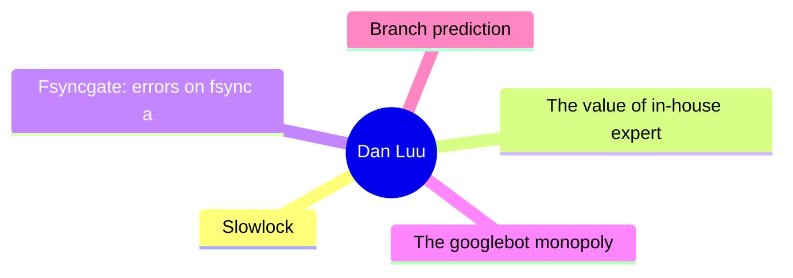
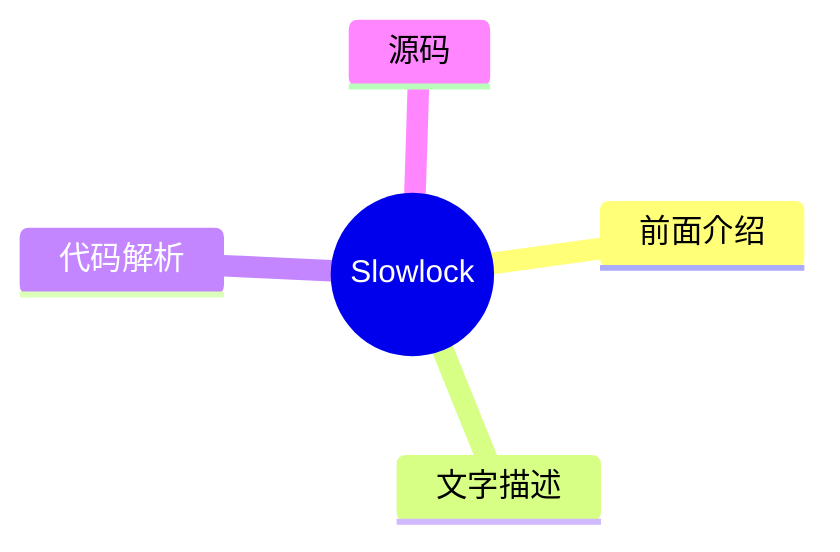
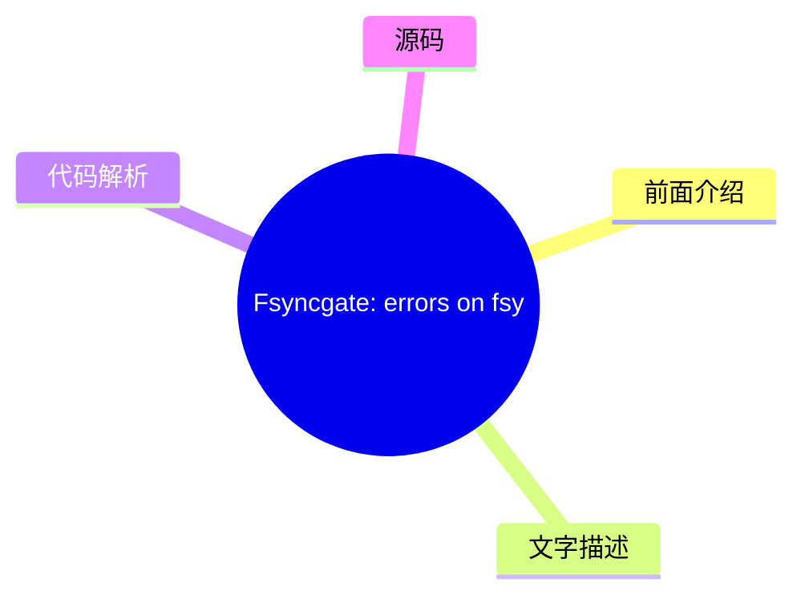
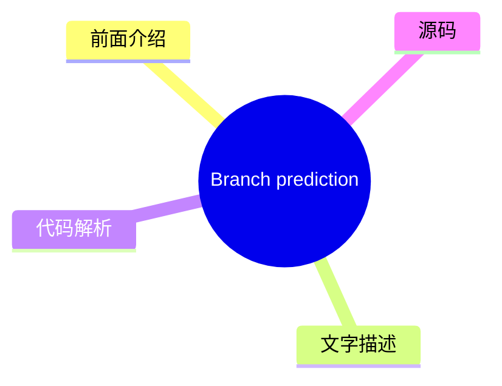

# 🔍 Dan Luu Top 5 (2026-08-01)

## 前面介绍

- 数据源：Dan Luu
- 抓取日期：2026-08-01
- 条目数：5
- 含完整正文：5
- 含代码片段：3
- 组织方式：前面介绍 / 树状图 / 文字描述 / 代码解析 / 源码

## 思维导图



## 详细整理（5 条，5 条含全文，3 条含代码）

### 1. Slowlock
- **链接**: [https://danluu.com/limplock/](https://danluu.com/limplock/)
- **发布**: Wed, 30 Sep 2015 00:00:00 +0000

#### 前面介绍

- Every once in awhile, you hear a story like “there was a case of a 1-Gbps NIC card on a machine that suddenly was transmitting only at 1 Kbps, which then caused a chain reaction upstream in such a way that the performance of the entire workload of a
- 发布时间：Wed, 30 Sep 2015 00:00:00 +0000

#### 树状图



#### 文字描述

- Every once in awhile, you hear a story like “there was a case of a 1-Gbps NIC card on a machine that suddenly was transmitting only at 1 Kbps, which then caused a chain reaction upstream in such a way that the performance of the entire workload of a 100-node cluster was crawling at a snail's pace, effectively making the system unavailable for all practical purposes”. The storie

#### 代码解析

- 本文未检测到明确代码块，内容更偏新闻、观点或方法论。

#### 源码

#### 中文节选

每隔一段时间，你就会听到这样一个故事：“有一台机器上的 1-Gbps 网卡突然只能以 1 Kbps 的速度传输，这随后引发了一系列连锁反应，导致一个包含 100 个节点的集群的整体工作负载性能变得像蜗牛一样慢，实际上使该系统在所有实际用途上都变得不可用”。这些故事很有趣，事后分析也很有趣读，但并不清楚系统对这种故障的脆弱性有多大，也不清楚这种故障的发生频率有多高。

这种情况让我想起了 [Jepsen](https://aphyr.com/tags/jepsen) 出现之前的分布式系统故障。有很多轶事性的恐怖故事，但针对这些故事的一个常见回应是“对我有效”，即使谈论的是现在已知已经严重损坏的系统。少数几家真正重视正确性的公司拥有良好的测试和指标，但它们大多不会公开谈论这些，公众也没有简单的方法来判断他们运行的系统是否可靠。

Thanh Do 等人试图系统地研究这个问题——[被削弱但未完全损坏的硬件有什么影响](http://ucare.cs.uchicago.edu/pdf/socc13-limplock.pdf)，以及这种情况在实践中发生的频率有多高（[http://ucare.cs.uchicago.edu/pdf/socc14-cbs.pdf](http://ucare.cs.uchicago.edu/pdf/socc14-cbs.pdf)）？事实证明，许多常用的系统对“跛行”硬件并不健壮，但这些类型的故障发生率很低（至少在你拥有不合理的大规模之前）。

单个慢节点的效应可以[非常显著](http://pages.cs.wisc.edu/~thanhdo/pdf/talk-socc-limplock.pdf)：

作业完成率从每小时 172 个作业降至每小时 1 个作业，有效地杀死了整个集群。Facebook 有处理死机机器的机制，但显然当时没有任何方法来处理慢速机器。

当 Do 等人查看广泛使用的开源软件（HDFS、Hadoop、ZooKeeper、Cassandra 和 HBase）时，他们发现了类似的问题。

每个子图代表不同的故障条件。F 是 HDFS，H 是 Hadoop，Z 是 Zookeeper，C 是 Cassandra，B 是 HBase。最左侧（白色）的条形是基准无故障情况。向右移动，下一个是崩溃，随后的条形是单个降级但未崩溃硬件的结果（越靠右意味着越慢）。在大多数（但不是全部）情况下，降级硬件对性能的影响比故障硬件大得多。请注意，这些图表都是对数刻度；向上移动一个刻度意味着性能相差 10 倍！

 奇怪的是，故障磁盘可能会导致某些操作加速。这是因为有些操作如果副本失效，其复制开销会更小。对我来说，这似乎有点奇怪，因为系统既要找到替换副本又要复制数据，理应会有更多开销，但我又知道些什么呢？

 无论如何，为什么慢节点比死节点糟糕得多？

#### 完整正文（中文）

每隔一段时间，你就会听到这样一个故事：“有一台机器上的 1-Gbps 网卡突然只能以 1 Kbps 的速度传输，这随后引发了一系列连锁反应，导致一个包含 100 个节点的集群的整体工作负载性能变得像蜗牛一样慢，实际上使该系统在所有实际用途上都变得不可用”。这些故事很有趣，事后分析也很有趣读，但并不清楚系统对这种故障的脆弱性有多大，也不清楚这种故障的发生频率有多高。

这种情况让我想起了 [Jepsen](https://aphyr.com/tags/jepsen) 出现之前的分布式系统故障。有很多轶事性的恐怖故事，但针对这些故事的一个常见回应是“对我有效”，即使谈论的是现在已知已经严重损坏的系统。少数几家真正重视正确性的公司拥有良好的测试和指标，但它们大多不会公开谈论这些，公众也没有简单的方法来判断他们运行的系统是否可靠。

Thanh Do 等人试图系统地研究这个问题——[被削弱但未完全损坏的硬件有什么影响](http://ucare.cs.uchicago.edu/pdf/socc13-limplock.pdf)，以及这种情况在实践中发生的频率有多高（[http://ucare.cs.uchicago.edu/pdf/socc14-cbs.pdf](http://ucare.cs.uchicago.edu/pdf/socc14-cbs.pdf)）？事实证明，许多常用的系统对“跛行”硬件并不健壮，但这些类型的故障发生率很低（至少在你拥有不合理的大规模之前）。

单个慢节点的效应可以[非常显著](http://pages.cs.wisc.edu/~thanhdo/pdf/talk-socc-limplock.pdf)：

作业完成率从每小时 172 个作业降至每小时 1 个作业，有效地杀死了整个集群。Facebook 有处理死机机器的机制，但显然当时没有任何方法来处理慢速机器。

当 Do 等人查看广泛使用的开源软件（HDFS、Hadoop、ZooKeeper、Cassandra 和 HBase）时，他们发现了类似的问题。

每个子图代表不同的故障条件。F 是 HDFS，H 是 Hadoop，Z 是 Zookeeper，C 是 Cassandra，B 是 HBase。最左侧（白色）的条形是基线无故障情况。向右移动，下一个是崩溃，随后的条形是单个降级但未崩溃硬件的结果（越靠右意味着越慢）。在大多数（但并非全部）情况下，拥有降级硬件对性能的影响比拥有故障硬件要大得多。请注意，这些图表都是对数刻度；向上移动一个增量意味着性能有 10 倍的差异！

 奇怪的是，故障的磁盘可能会导致某些操作加速。这是因为有些操作如果副本失败，其复制开销会更少。对我来说，这似乎有点奇怪，因为系统必须同时找到替换副本并复制数据，但我又知道些什么呢？

 无论如何，为什么慢节点比死节点糟糕得多？作者定义了三种故障模式并解释了每种模式的成因。有操作迟缓锁定（operation limplock），即某个操作因为操作的一部分缓慢而变慢（例如，磁盘读取缓慢是因为磁盘降级），节点迟缓锁定（node limplock），即节点即使对于看似无关的操作也很慢（例如，从 RAM 读取缓慢是因为磁盘降级），以及集群迟缓锁定（cluster limplock），即整个集群都很慢（例如，单个降级磁盘导致整个 1000 台机器的集群变慢）。

 这些是如何发生的？

 #### 操作迟缓锁定

 这是最简单的一种。如果你尝试从磁盘读取，而你的磁盘很慢，那么你的磁盘读取就会很慢。在现实世界中，当操作存在单点故障，以及监控设计用于处理完全故障而不是降级性能时，我们会看到这种情况。例如，HBase 访问一个区域会经过负责该区域的服务器。数据在 HDFS 上进行了复制，但如果拥有该数据的节点正在迟缓，这对您没有帮助。说到 HDFS，它的超时时间是 60 秒，读取是以 64K 块进行的，这意味着在 HDFS 将故障转移到健康节点之前，你的读取速度可能会慢到接近 1K/s。

 #### 节点迟缓锁定

为什么慢磁盘会导致内存读取变慢？（例如）这种情况怎么会发生？再看一下 HDFS，它使用了一个线程池。如果每个线程都在非常缓慢地完成磁盘读取，内存读取就会阻塞，直到有线程空闲出来。

这不仅仅是在使用有限线程池或其他有界抽象时才会出现的问题——现实是机器资源是有限的，如果未经过精心设计以避免这种情况，无界抽象最终会触及机器限制。例如，Zookeeper 会维护一个操作队列，而一个慢速的 follower 会导致 leader 的队列耗尽物理内存。

#### 集群僵死

如果集群依赖单个主节点，而该主节点又处于“跛行”状态，整个集群很容易变得不健康。级联故障也会导致这种情况——第一个图表中，集群从每小时完成 172 个作业变为每小时 1 个作业，实际上就是 Facebook 在 Hadoop 上的工作负载。这里让我感到惊讶的是，Hadoop 本应具有尾部容错能力——单个慢速任务不应该对整个作业的完成产生巨大影响。那么发生了什么？不健康的节点会感染健康的节点，最终锁死整个集群。

Hadoop 的尾部容错能力来自于当结果返回缓慢时启动推测计算。特别是，当拖后腿的任务与其他结果相比异常缓慢时。这在 reduce 节点“跛行”（子图 H2）时效果很好，但当 [map 节点](http://static.googleusercontent.com/media/research.google.com/en//archive/mapreduce-osdi04.pdf) “跛行”（子图 H1）时，它可能会减慢同一作业中所有 reducer 的速度，从而破坏了 Hadoop 的尾部容错机制。

为了理解原因，我们必须查看 [Hadoop 的推测算法](https://www.usenix.org/legacy/event/osdi08/tech/full_papers/zaharia/zaharia_html/index.html)。每个作业都有一个进度分数，这是一个介于 0 和 1（含）之间的数字。对于 Map 任务，分数是已读取的输入数据的比例。对于 Reduce 任务，三个阶段（从 Map 任务复制数据、排序和归约）各获得 1/3 的分数。如果一个任务已经运行了至少一分钟，并且其进度分数低于其类别的平均值减去 0.2，那么该作业将被推测执行。

在 H2 的情况下，网络接口卡（NIC）运行缓慢，因此 Map 阶段正常完成，因为结果最终被写入本地磁盘。但是，当 Reduce 节点尝试从运行缓慢的 Map 节点获取数据时，它们都会停滞不前，拉低了该类别的平均分数，从而阻止了推测作业的运行。从大局来看，每个 Hadoop 节点都有有限数量的 Map 和 Reduce 任务。如果这些任务被运行缓慢的任务填满，整个节点就会锁死。由于 Hadoop 并非设计用来避免级联故障，这最终会导致整个集群锁死。

我发现有趣的一点是，这种确切的故障原因在 2004 年发表的原始 MapReduce 论文中 [已有描述](http://research.google.com/archive/mapreduce.html)。他们甚至明确指出了慢速磁盘和网络是拖后腿任务（stragglers）的原因，这促使他们设计了推测执行算法。然而，他们并没有提供该算法的细节。MapReduce 的开源克隆版 Hadoop 试图避免同样的问题。Hadoop 最初于 2008 年发布。五年后，当我们阅读的这篇论文发表时，其内置的拖后腿任务检测机制不仅未能防止多种类型的拖后腿任务，还未能防止拖后腿任务有效地死锁整个集群。

### 结论

我不会详细说明每个系统在测试中的表现。论文对此有很好的详细描述，如果你感兴趣，我推荐阅读这篇论文。总结来说，Cassandra 表现相当不错，而 HDFS、Hadoop 和 HBase 则表现不佳。

Cassandra 在这两方面表现良好。首先，[2009年的这个补丁](https://issues.apache.org/jira/browse/CASSANDRA-488)防止了队列溢出感染健康节点，这避免了其他系统中导致集群范围故障的主要故障模式。其次，所使用的架构（[SEDA](http://www.eecs.harvard.edu/~mdw/proj/seda/））解耦了不同类型的操作，这使得即使某些操作处于“跛行”状态，良好的操作仍能继续执行。

阅读这篇论文后，我的主要疑问是，这类故障发生的频率如何，是如何发生的，而且合理的指标/报告不应该能捕获这种情况吗？

对于第一个问题的答案，许多同一作者也有一篇论文，他们在其中研究了 [Cassandra、Flume、HDFS 和 ZooKeeper 中的 3000 次故障](http://ucare.cs.uchicago.edu/pdf/socc14-cbs.pdf)，并确定了哪些故障与硬件相关以及硬件故障是什么。

14起性能降级与 410 起其他硬件故障。在其样本中，这占故障总数的 3%；虽然罕见，但并非罕见到我们可以忽略这个问题。

如果我们不能忽略这类错误，如何在它们进入生产环境之前捕获它们？该论文使用了 [Emulab 测试平台](http://www.emulab.net/)，这真的很酷。不幸的是，Emulab 页面写道“Emulab 是一个公共设施，向全球大多数研究人员免费开放。如果您不确定自己是否有资格使用，请参阅我们的政策文档或联系我们。如果您认为自己有资格，可以申请启动一个新项目”。这是可以理解的，但这意味着它可能不是我们大多数人的最佳解决方案。

绝大多数运行缓慢的硬件问题都归因于网络或磁盘速度慢。为什么不能修改一个 Jepsen 版本，或者类似的东西，来模拟磁盘或网络速度慢呢？一个简单的实现无法达到 Emulab 的精度，但既然我们讨论的是数量级的减速，10%（甚至 2 倍）的偏差对于测试系统在硬件降级情况下的鲁棒性来说应该没问题。你可以想象出很多种实现方式。例如，要在 Linux 上模拟慢速网络，可以尝试通过 [qdisc](http://linux-ip.net/articles/Traffic-Control-HOWTO/) 进行限速，[通过 ptrace 挂钩系统调用](https://github.com/majek/fluxcapacitor)，等等。对于慢速 CPU，可以通过 cgroups 和 cpu.shares 进行速率限制，或者直接将进程映射到 UC 内存（或者如果那有点太慢的话，也许是 WT 或 WC），依此类推，还有磁盘和其他故障模式。

这就剩下了我的最后一个问题，系统不应该已经捕获了这些类型的故障，即使它们并不特别关注它们吗？正如我们在上面看到的，硬件严重缓慢的系统很少，我们可以直接将它们视为死机，而不会对我们的总计算资源产生重大影响。而且，硬件受损的系统可以相当直接地检测到。此外，多租户系统无论如何都必须对自己的性能进行[持续监控，以获得良好的利用率](//danluu.com/new-cpu-features/#partitioning)。

那么，为什么我们要关心设计对“跛行硬件”具有鲁棒性的系统呢？答案的一部分是纵深防御。当然，我们应该有监控，但也应该有在监控失效时依然稳健的系统，因为监控迟早会失效。答案的另一部分是，通过使系统对跛行硬件更具容忍度，我们也会使它们对多租户环境中来自其他工作负载的干扰更具容忍度。最后一点多少有些推测性的实证问题——有可能，设计对同一机器上竞争工作负载的干扰不特别稳健的系统会更高效，同时使用[更好的分区](//danluu.com/intel-cat/)来避免干扰。

 

 

 感谢 Leah Hanson, Hari Angepat, Laura Lindzey, Julia Ev
...（截断，原文 12046+ 字符）


### 2. The value of in-house expertise
- **链接**: [https://danluu.com/in-house/](https://danluu.com/in-house/)
- **发布**: Wed, 29 Sep 2021 00:00:00 +0000

#### 前面介绍

- An alternate title for this post might be, &quot;Twitter has a kernel team!?&quot;. At this point, I've heard that surprised exclamation enough that I've lost count of the number times that's been said to me (I'd guess that it's more than ten but les
- 发布时间：Wed, 29 Sep 2021 00:00:00 +0000

#### 树状图


#### 文字描述

- An alternate title for this post might be, "Twitter has a kernel team!?". At this point, I've heard that surprised exclamation enough that I've lost count of the number times that's been said to me (I'd guess that it's more than ten but less than a hundred). If we look at trendy companies that are within a couple factors of two in size of Twitter (in terms of either market cap 

#### 代码解析

- 本文未检测到明确代码块，内容更偏新闻、观点或方法论。

#### 源码

#### 中文节选

An alternate title for this post might be, "Twitter has a kernel team!?". At this point, I've heard that surprised exclamation enough that I've lost count of the number times that's been said to me (I'd guess that it's more than ten but less than a hundred). If we look at trendy companies that are within a couple factors of two in size of Twitter (in terms of either market cap or number of engineers), they mostly don't have similar expertise, often as a result of path dependence — because they "grew up" in the cloud, they didn't need kernel expertise to keep the lights on the way an on prem company does. While that makes it socially understandable that people who've spent their career at younger, trendier, companies, are surprised by Twitter having a kernel team, I don't think there's a technical reason for the surprise.

 Whether or not it has kernel expertise, a company Twitter's size is going to regularly run into kernel issues, from major production incidents to papercuts. Without a kernel team or the equivalent expertise, the company will muddle through the issues, running into unnecessary problems as well as taking an unnecessarily long time to mitigate incidents. As an example of a critical production incident, just because it's already been written up publicly, I'll cite [this post](https://blog.twitter.com/engineering/en_us/topics/open-source/2020/hunting-a-linux-kernel-bug), which dryly notes:

  Earlier last year, we identified a firewall misconfiguration which accidentally dropped most network traffic. We expected resetting the firewall configuration to fix the issue, but resetting the firewall configuration exposed a kernel bug

 


 What this implies but doesn't explicitly say is that this firewall misconfiguration was the most severe incident that's occured during my time at Twitter and I believe it's actually the most severe outage that Twitter has had since 2013 or so. As a company, we would've still been able to mitigate the issue without a kernel team or another team with deep Linux expertise, but it would've taken longer to understand why the initial fix didn't work, which is the last thing you want when you're debugging a serious outage. Folks on the kernel team were already familiar with the various diagnostic tools and debugging techniques necessary to quickly understand why the initial fix didn't work, which is not common knowledge at some peer companies (I polled folks at a number of similar-scale peer companies to see if they thought they had at least one person with the knowledge necessary to quickly debug the bug and the answer was no at many companies).

 Another reason to have in-house expertise in various areas is that they easily pay for themselves, which is a special case of [the generic argument that large companies should be larger than most people expect because tiny percentage gains are worth a large amount in absolute dollars](/sounds-easy/). If, in the lifetime of the specialist team like the kernel team, a s

#### 完整正文（中文）

这篇帖子的备选标题可能是，“Twitter 也有内核团队！？” 到目前为止，我已经听过这种惊讶的感叹很多次了，以至于我都数不清有多少次了（我猜是十次到一百次之间）。如果我们看看那些规模与 Twitter 相差不超过两倍（无论是市值还是工程师数量）的热门公司，它们大多不具备类似的专长，这通常是由于路径依赖的结果——因为它们是在云端“长大”的，所以不需要像本地部署公司那样具备内核专长来维持运营。虽然这让人可以理解，为什么那些在更年轻、更热门的公司度过职业生涯的人会对 Twitter 拥有内核团队感到惊讶，但我认为这种惊讶并没有技术上的原因。

无论是否具备内核专长，像 Twitter 这样规模的公司都会经常遇到内核问题，从重大的生产事故到微小的纸面问题。如果没有内核团队或相应的专长，公司将勉强应对这些问题，不仅会遇到不必要的问题，还会花费不必要的时间来缓解事故。作为一个重大生产事故的例子，因为已经公开写过，我会引用[这篇博文](https://blog.twitter.com/engineering/en_us/topics/open-source/2020/hunting-a-linux-kernel-bug)，其中冷静地指出：

 去年早些时候，我们识别出一个防火墙配置错误，意外地丢弃了大部分网络流量。我们预期重置防火墙配置可以修复该问题，但重置防火墙配置暴露了一个内核 bug

这意味着虽然文中没有明确说明，但这次防火墙配置错误是我任职期间发生的最严重事故，我相信这实际上也是自2013年左右以来Twitter遭遇的最严重中断。作为一家公司，即使没有内核团队或其他拥有深厚Linux专业知识的团队，我们本仍能缓解该问题，但理解为何初始修复无效所需的时间会更长，而当你正在调试严重的中断时，这是你最不希望发生的事情。内核团队的成员已经熟悉各种诊断工具和调试技术，能够快速理解为何初始修复无效，这在一些同行公司中并非常识（我调查了多家规模相当的同行公司，看他们是否认为至少有一人拥有快速调试该错误所需的知识，而在许多公司得到的回答是否定的）。

在各个领域拥有内部专业知识的另一个原因是，它们很容易就能收回成本，这是[大型公司应该比大多数人预期的更大的通用论点的一个特例，因为微小的百分比增益在绝对金额上也是一笔巨款](/sounds-easy/))。如果在一个像内核团队这样的专业团队的存续期内，单个人发现了一些能持续降低[TCO](https://en.wikipedia.org/wiki/Total_cost_of_ownership) 0.5% 的东西，那么这笔节省将足以永久支付该团队的费用，而Twitter的内核团队已经发现了许多此类改进。除了有时具有这种影响的[内核补丁](https://patchwork.ozlabs.org/project/netdev/list/?submitter=211&state=*&archive=both¶m=4&page=1)之外，人们还会发现具有这种影响的配置问题等。

 So far, I've only talked about the kernel team because that's the one that most frequently elicits surprise from folks for merely existing, but I get similar reactions when people find out that Twitter has a bunch of ex-Sun JVM folks who worked on HotSpot, like Ramki Ramakrishna, Tony Printezis, and John Coomes. People wonder why a social media company would need such deep JVM expertise. As with the kernel team, companies our size that use the JVM run into weird issues and JVM bugs and it's helpful to have people with deep expertise to debug those kinds of issues. And, as with the kernel team, individual optimizations to the JVM can pay for the team in perpetuity. A concrete example is [this patch by Flavio Brasil, which virtualizes compare and swap calls](https://github.com/oracle/graal/pull/636).

 The context for this is that Twitter uses a lot of Scala. Despite a lot of claims otherwise, Scala uses more memory and is significantly slower than Java, which has a significant cost if you use Scala at scale, enough that it makes sense to do optimization work to reduce the performance gap between idiomatic Scala and idiomatic Java.

 Before the patch, if you profiled our Scala code, you would've seen an unreasonably large amount of time spent in Future/Promise, including in cases where you might naively expect that the compiler would optimize the work away. One reason for this is that Futures use a [compare-and-swap](https://en.wikipedia.org/wiki/Compare-and-swap) (CAS) operation that's opaque to JVM optimization. The patch linked above avoids CAS operations when the Future doesn't escape the scope of the method. [This companion patch](https://github.com/twitter/util/commit/3245a8e1a98bd5eb308f366678528879d7140f5e) removes CAS operations in some places that are less amenable to compiler optimization. The two patches combined reduced the cost of typical major Twitter services using idiomatic Scala by 5% to 15%, paying for the JVM team in perpetuity many times over and that wasn't even the biggest win Flavio found that year.


 I'm not going to do a team-by-team breakdown of teams that pay for themselves many times over because there are so many of them, even if I limit the scope to "teams that people are surprised that Twitter has".

 A related topic is how people talk about "buy vs. build" discussions. I've seen a number of discussions where someone has argued for "buy" because that would obviate the need for expertise in the area. This can be true, but I've seen this argued for much more often than it is true. An example where I think this tends to be untrue is with distributed tracing. [We've previously looked at some ways Twitter gets value out of tracing](/tracing-analytics/), which came out of the vision Rebecca Isaacs put into place. On the flip side, when I talk to people at peer companies with similar scale, most of them have not (yet?) succeeded at getting significant value from distributed tracing. This is so common that I see a viral Twitter thread about how useless distributed tracing is more than once a year. Even though we went with the more expensive "build" option, just off the top of my head, I can think of multiple uses of tracing that have returned between 10x and 100x the cost of building out tracing, whereas people at a number of companies that have chosen the cheaper "buy" option commonly complain that tracing isn't worth it.


巧合的是，我刚才正好和 Pam Wolf 谈论了这个确切的话题。Pam Wolf 是一位土木工程教授，拥有在多个大洲的土木工程行业经验，她对此也有相关的看法。对于大规模系统（项目），对于你不在自己公司处理的每个领域，都需要一名内部专家（业主方工程师）。虽然在技术上可以聘请另一家公司作为专家，但这比开发或聘请内部专家更昂贵，而且从长远来看，风险也更大。这非常类似于我作为电气工程师的工作经验，那些将职能外包给其他公司但不保留内部专家的组织，付出的代价非常高昂，而且不仅仅是金钱上的。他们通常不仅成本高昂，还伴随着长期的延误，交付次优的设计。虽然“购买”可以并且经常能减少对专业知识的需求，但它通常并不能消除对专业知识的需求。

 This related to another common abstract argument that's commonly made, that companies should concentrate on "their area of comparative advantage" or "most important problems" or "core business need" and outsource everything else. We've already seen a couple of examples where this isn't true because, at a large enough scale, it's more profitable to have in-house expertise than not regardless of whether or not something is core to the business (one could argue that all of the things that are moved in-house are core to the business, but that would make the concept of coreness useless). Another reason this abstract advice is too simplistic is that businesses can somewhat arbitrarily choose what their comparative advantage is. A large example of this would be Apple bringing CPU design in-house. Since acquiring PA Semi (formerly the team from SiByte and, before that, a team from DEC) for $278M, Apple has been producing [the best chips in the phone and laptop power envelope by a pretty large margin](https://twitter.com/danluu/status/1433297089866383364). But, before the purchase, there was nothing about Apple that made the purchase inevitable, that made CPU design an inherent comparative advantage of Apple. But if a firm can pick an area and make it an area of comparative advantage, saying that the firm should choose to concentrate on its comparative advantage(s) isn't very helpful advice.

 $278M is a lot of money in absolute terms, but as a fraction of Apple's resources, that was tiny and much smaller companies also have the capability to do cutting edge work by devoting a small fraction of their resources to it, e.g., Twitter, for a cost that any $100M company could afford, [created novel cache algorithms and data structures](https://twitter.com/danluu/status/1381687511362138113) and is doing other cutting edge cache work. Having great [cache infra](/cache-incidents/) isn't any more core to Twitter's business than creating a great CPU is to Apple's, but it is a lever that Twitter can use to make more money than it could otherwise.


对于小公司来说，为公司涉及的方方面面都配备内部专家是没有意义的，但在公司规模达到一定程度之前，在操作系统、语言运行时以及其他通常被认为相当专业的组件方面拥有内部专业知识，开始变得合理。回顾 Twitter 的历史，Yao Yue 指出，在她早期在 Twitter 工作（当时我们有约 100 名工程师）时，她经常去内核团队寻求帮助来调试生产事故，而在某些情况下，如果没有内核团队的帮助，调试时间可能会轻易延长 10 倍。社交媒体公司通常在每用户和每美元的基础上具有相对较高的规模，因此并非每家公司都需要在拥有 100 名工程师时具备同等程度的专业知识，但总会有其他领域，对于一家拥有 100 名工程师的初创公司来说，在这些领域拥有专业知识也能带来回报。

 感谢 Ben Kuhn、Yao Yue、Pam Wolf、John Hergenroeder、Julien Kirch、Tom Brearley 和 Kevin Burke 提供评论/更正/讨论。


### 3. Fsyncgate: errors on fsync are unrecovarable
- **链接**: [https://danluu.com/fsyncgate/](https://danluu.com/fsyncgate/)
- **发布**: Wed, 28 Mar 2018 00:00:00 +0000

#### 前面介绍

- This is an archive of the original &quot;fsyncgate&quot; email thread. This is posted here because I wanted to have a link that would fit on a slide for a talk on file safety with a mobile-friendly non-bloated format.

From:Craig Ringer &lt;craig(at)
- 发布时间：Wed, 28 Mar 2018 00:00:00 +0000

#### 树状图



#### 文字描述

- *This is an archive of the original "fsyncgate" email thread. This is posted here because I wanted to have a link that would fit on a slide for *[a talk on file safety](//danluu.com/deconstruct-files/) with [a mobile-friendly non-bloated format](//danluu.com/web-bloat/). ``` From:Craig Ringer <craig(at)2ndquadrant(dot)com> Subject:Re: PostgreSQL's handling of fsync() errors is 

#### 代码解析

- `text`: 这段更像查询逻辑，重点看过滤条件、聚合方式和性能影响。
- `text`: 这段更像查询逻辑，重点看过滤条件、聚合方式和性能影响。
- `text`: 这段更像查询逻辑，重点看过滤条件、聚合方式和性能影响。

#### 源码

#### 源码片段 1（text）

```text
From:Craig Ringer <craig(at)2ndquadrant(dot)com>
Subject:Re: PostgreSQL's handling of fsync() errors is unsafe and risks data loss at least on XFS
Date:2018-03-28 02:23:46
```

#### 源码片段 2（text）

```text
From:Tom Lane <tgl(at)sss(dot)pgh(dot)pa(dot)us>
Date:2018-03-28 03:53:08
```

#### 源码片段 3（text）

```text
From:Michael Paquier <michael(at)paquier(dot)xyz>
Date:2018-03-29 02:30:59
```

#### 完整正文（中文）

*这是原始“fsyncgate”邮件线程的存档。我把它发布在这里，是因为我想要一个适合幻灯片的链接，用于 *[关于文件安全的演讲](//danluu.com/deconstruct-files/)* 以及 *[一个移动端友好且非臃肿的格式](//danluu.com/web-bloat/)*。

 ```
From:Craig Ringer <craig(at)2ndquadrant(dot)com>
Subject:Re: PostgreSQL's handling of fsync() errors is unsafe and risks data loss at least on XFS
Date:2018-03-28 02:23:46
```

 Hi all

 Some time ago I ran into an issue where a user encountered data corruption after a storage error. PostgreSQL played a part in that corruption by allowing checkpoint what should've been a fatal error.

 TL;DR: Pg should PANIC on fsync() EIO return. Retrying fsync() is not OK at least on Linux. When fsync() returns success it means "all writes since the last fsync have hit disk" but we assume it means "all writes since the last SUCCESSFUL fsync have hit disk".

 Pg wrote some blocks, which went to OS dirty buffers for writeback. Writeback failed due to an underlying storage error. The block I/O layer and XFS marked the writeback page as failed (AS_EIO), but had no way to tell the app about the failure. When Pg called fsync() on the FD during the next checkpoint, fsync() returned EIO because of the flagged page, to tell Pg that a previous async write failed. Pg treated the checkpoint as failed and didn't advance the redo start position in the control file.

 All good so far.

 But then we retried the checkpoint, which retried the fsync(). The retry succeeded, because the prior fsync() *cleared the AS_EIO bad page flag*.

 The write never made it to disk, but we completed the checkpoint, and merrily carried on our way. Whoops, data loss.

 The clear-error-and-continue behaviour of fsync is not documented as far as I can tell. Nor is fsync() returning EIO unless you have a very new linux man-pages with the patch I wrote to add it. But from what I can see in the POSIX standard we are not given any guarantees about what happens on fsync() failure at all, so we're probably wrong to assume that retrying fsync( ) is safe.

如果服务器当时使用的是带有 errors=remount-ro 选项的 ext3 或 ext4，这个问题就不会发生，因为第一次 I/O 错误就会重新挂载文件系统并停止 Pg 继续运行。但 XFS 没有这个选项。可能还有其他涉及 LVM 和/或多路径的情况也会发生这种情况，但我还没有彻底挖掘出细节。

事实证明，可以通过伪造第一次错误成功检查点之前的备份标签，强制 redo 重复执行并写入丢失的块来恢复系统。但是……真是一团糟。

我之前在这里发帖讨论了底层的 fsync 问题：

[https://stackoverflow.com/q/42434872/398670](https://stackoverflow.com/q/42434872/398670)

但还没有机会跟进关于 Pg 具体细节的内容。

我断断续续地研究这个问题，还没有找到好的解决方案。我认为我们应该直接 PANIC，让 redo 在重复自上次检查点以来的工作时，通过重试失败的写入来处理。

异步缓冲写入和 fsync 提供的 API 让我们无法获知哪个页面失败了，所以我们不能只是有选择地重做那个写入。我想我们确实知道与失败 fsync 的 fd 关联的 relfilenode，但仅此而已。所以替代方案似乎是一种潜在的复杂在线 redo 方案，即我们只重放发生 fsync() 错误的关系，而在其他情况下正常处理查询。这很可能极其容易出错且难以测试，而且它试图解决一个在其他文件系统上整个数据库无论如何都会停止运行的情况。

我调查了是否可以使用 AIO API 来解决它，但那里的情况更糟——据我所知，你甚至无法在所有 Linux 内核版本上可靠地保证 fsync。

对于 WAL 段，我们在 fsync() 失败时已经 PANIC 了。我们只需要对数据分支至少在 EIO 的情况下做同样的事情。这并不像看起来那么糟糕，因为据我所知，fsync 只在我们应该停止世界的情况下返回 EIO，而许多文件系统会为我们这样做。

有很多 pg_fsync() 的调用者。虽然我们可以针对每一个单独处理这种情况，但我很想把 pg_fsync() 本身拦截 EIO 并 PANIC。大家怎么看？

```
From:Tom Lane <tgl(at)sss(dot)pgh(dot)pa(dot)us>
Date:2018-03-28 03:53:08
```

 Craig Ringer  写道：

  TL;DR: Pg 应该在 fsync() 返回 EIO 时 PANIC。

 

 你一定是在开玩笑。

  在 Linux 上重试 fsync() 至少是不行的。当 fsync() 返回成功时，它的意思是“自上次 fsync 以来所有的写入都已到达磁盘”，但我们假设它的意思是“自上次成功的 fsync 以来所有的写入都已到达磁盘”。

 

 如果真的是这样，我们需要抵制这种内核的脑损伤，因为按照你的描述，fsync 将完全毫无用处。

 此外，POSIX 非常明确地指出，成功的 fsync 意味着该文件的所有前置写入都已完成，到此为止，不管它们是在什么时候发出的。

 
```
From:Michael Paquier <michael(at)paquier(dot)xyz>
Date:2018-03-29 02:30:59
```

 On Tue, Mar 27, 2018 at 11:53:08PM -0400, Tom Lane 写道：

  Craig Ringer  写道：

  TL;DR: Pg 应该在 fsync() 返回 EIO 时 PANIC。

 

 你一定是在开玩笑。

 

 后端代码中 pg_fsync 的任何调用者都足够小心地检查返回的状态，有时会像 mdsync 那样进行重试，所以这里提出的建议将是一种倒退。

 
```
From:Thomas Munro <thomas(dot)munro(at)enterprisedb(dot)com>
Date:2018-03-29 02:48:27
```

 On Thu, Mar 29, 2018 at 3:30 PM, Michael Paquier  写道：

  On Tue, Mar 27, 2018 at 11:53:08PM -0400, Tom Lane 写道：

  Craig Ringer  写道：

  TL;DR: Pg 应该在 fsync() 返回 EIO 时 PANIC。

 

 你一定是在开玩笑。

 

 后端代码中 pg_fsync 的任何调用者都足够小心地检查返回的状态，有时会像 mdsync 那样进行重试，所以这里提出的建议将是一种倒退。

 

 Craig，你描述的现象和这篇文章中讨论的第二个问题“Reporting writeback errors”是一样的吗？

 [https://lwn.net/Articles/724307/](https://lwn.net/Articles/724307/)

 “当前的内核可能会在 fsync() 调用上报告回写错误，但这种情况有多种失败方式。”

 那个……我无语了。

 ```
From:Justin Pryzby <pryzby(at)telsasoft(dot)com>
Date:2018-03-29 05:00:31
```

 On Thu, Mar 29, 2018 at 11:30:59AM +0900, Michael Paquier wrote:

  On Tue, Mar 27, 2018 at 11:53:08PM -0400, Tom Lane wrote:

  Craig Ringer  writes:

  TL;DR: Pg should PANIC on fsync() EIO return.

 

 Surely you jest.

 

 Any callers of pg_fsync in the backend code are careful enough to check the returned status, sometimes doing retries like in mdsync, so what is proposed here would be a regression.

 

 The retries are the source of the problem ; the first fsync() can return EIO, and also *clears the error* causing a 2nd fsync (of the same data) to return success.

 (Note, I can see that it might be useful to PANIC on EIO but retry for ENOSPC).

 On Thu, Mar 29, 2018 at 03:48:27PM +1300, Thomas Munro wrote:

  Craig, is the phenomenon you described the same as the second issue "Reporting writeback errors" discussed in this article? [https://lwn.net/Articles/724307/](https://lwn.net/Articles/724307/)

 

 Worse, the article acknowledges the behavior without apparently suggesting to change it:

 "Storing that value in the file structure has an important benefit: it makes it possible to report a writeback error EXACTLY ONCE TO EVERY PROCESS THAT CALLS FSYNC() .... In current kernels, ONLY THE FIRST CALLER AFTER AN ERROR OCCURS HAS A CHANCE OF SEEING THAT ERROR INFORMATION."

 I believe I reproduced the problem behavior using dmsetup "error" target, see attached.

 strace looks like this:

 kernel is Linux 4.10.0-28-generic #32~16.04.2-Ubuntu SMP Thu Jul 20 10:19:48 UTC 2017 x86_64 x86_64 x86_64 GNU/Linux

 ```
1open("/dev/mapper/eio", O_RDWR|O_CREAT, 0600) = 3
2write(3, "\0\0\0\0\0\0\0\0\0\0\0\0\0\0\0\0\0\0\0\0\0\0\0\0\0\0\0\0\0\0\0\0"..., 8192) = 8192
3write(3, "\0\0\0\0\0\0\0\0\0\0\0\0\0\0\0\0\0\0\0\0\0\0\0\0\0\0\0\0\0\0\0\0"..., 8192) = 8192
4write(3, "\0\0\0\0\0\0\0\0\0\0\0\0\0\0\0\0\0\0\0\0\0\0\0\0\0\0\0\0\0\0\0\0"..., 8192) = 8192
5write(3, "\0\0\0\0\0\0\0\0\0\0\0\0\0\0\0\0\0\0\0\0\0\0\0\0\0\0\0\0\0\0\0\0"..., 8192) = 8192
6write(3, "\0\0\0\0\0\0\0\0\0\0\0\0\0\0\0\0\0\0\0\0\0\0\0\0\0\0\0\0\0\0\0\0"..., 8192) = 8192

7write(3, "\0\0\0\0\0\0\0\0\0\0\0\0\0\0\0\0\0\0\0\0\0\0\0\0\0\0\0\0\0\0\0\0"..., 8192) = 8192
8write(3, "\0\0\0\0\0\0\0\0\0\0\0\0\0\0\0\0\0\0\0\0\0\0\0\0\0\0\0\0\0\0\0\0"..., 8192) = 2560
9write(3, "\0\0\0\0\0\0\0\0\0\0\0\0\0\0\0\0\0\0\0\0\0\0\0\0\0\0\0\0\0\0\0\0"..., 8192) = -1 ENOSPC (No space left on device)
10dup(2)                                  = 4
11fcntl(4, F_GETFL)                       = 0x8402 (flags O_RDWR|O_APPEND|O_LARGEFILE)
12brk(NULL)                               = 0x1299000
13brk(0x12ba000)                          = 0x12ba000
14fstat(4, {st_mode=S_IFCHR|0620, st_rdev=makedev(136, 2), ...}) = 0
15write(4, "write(1): No space left on devic"..., 34write(1): No space left on device
16) = 34
17close(4)                                = 0
18fsync(3)                                = -1 EIO (Input/output error)
19dup(2)                                  = 4
20fcntl(4, F_GETFL)                       = 0x8402 (flags O_RDWR|O_APPEND|O_LARGEFILE)
21fstat(4, {st_mode=S_IFCHR|0620, st_rdev=makedev(136, 2), ...}) = 0
22write(4, "fsync(1): Input/output error\n", 29fsync(1): Input/output error
23) = 29
24close(4)                                = 0
25close(3)                                = 0
26open("/dev/mapper/eio", O_RDWR|O_CREAT, 0600) = 3
27fsync(3)                                = 0
28write(3, "\0", 1)                       = 1
29fsync(3)                                = 0
30exit_group(0)                           = ?
```

 2: EIO isn't seen initially due to writeback page cache;

 9: ENOSPC due to small device

 18: original IO error reported by fsync, good

 25: the original FD is closed

 26: ..and file reopened

 27: fsync on file with still-dirty data+EIO returns success BAD

 10, 19: I'm not sure why there's dup(2), I guess glibc thinks that perror should write to a separate FD (?)

 Also note, close() ALSO returned success..which you might think exonerates the 2nd fsync(), but I think may itself be problematic, no? In any case, the 2nd byte certainly never got written to DM error, and the failure status was lost following fsync().

 I get the exact same behavior if I break after one write() loop, such as to avoid ENOSPC.

 

 ```

From:Thomas Munro <thomas(dot)munro(at)enterprisedb(dot)com>
Date:2018-03-29 05:06:22
```

 On Thu, Mar 29, 2018 at 6:00 PM, Justin Pryzby  wrote:

  The retries are the source of the problem ; the first fsync() can return EIO, and also *clears the error* causing a 2nd fsync (of the same data) to return success.

 

 What I'm failing to grok here is how that error flag even matters, whether it's a single bit or a counter as described in that patch. If write back failed, *the page is still dirty*. So all future calls to fsync() need to try to try to flush it again, and (presumably) fail again (unless it happens to succeed this time around).

 

 ```
From:Craig Ringer <craig(at)2ndquadrant(dot)com>
Date:2018-03-29 05:25:51
```

 On 29 March 2018 at 13:06, Thomas Munro  wrote:

  On Thu, Mar 29, 2018 at 6:00 PM, Justin Pryzby  wrote:

  The retries are the source of the problem ; the first fsync() can return EIO, and also *clears the error* causing a 2nd fsync (of the same data) to return success.

 

 What I'm failing to grok here is how that error flag even matters, whether it's a single bit or a counter as described in that patch. If write back failed, *the page is still dirty*. So all future calls to fsync() need to try to try to flush it again, and (pre

...（截断，原文 516759+ 字符）


### 4. The googlebot monopoly
- **链接**: [https://danluu.com/googlebot-monopoly/](https://danluu.com/googlebot-monopoly/)
- **发布**: Wed, 27 May 2015 00:00:00 +0000

#### 前面介绍

- TIL that Bell Labs and a whole lot of other websites block archive.org, not to mention most search engines. Turns out I have a broken website link in a GitHub repo, caused by the deletion of an old webpage. When I tried to pull the original from arch
- 发布时间：Wed, 27 May 2015 00:00:00 +0000

#### 树状图


#### 文字描述

- TIL that Bell Labs and a whole lot of other websites block archive.org, not to mention most search engines. Turns out I have [a broken website link](https://github.com/danluu/debugging-stories/issues/3) in a GitHub repo, caused by the deletion of an old webpage. When I tried to pull the original from archive.org, I found that it's not available because Bell Labs blocks the arch

#### 代码解析

- `text`: 更偏接口调用示例，适合作为接入或联调样例。

#### 源码

#### 源码片段 1（text）

```text
User-agent: Googlebot
User-agent: msnbot
User-agent: LSgsa-crawler
Disallow: /RealAudio/
Disallow: /bl-traces/
Disallow: /fast-os/
Disallow: /hidden/
Disallow: /historic/
Disallow: /incoming/
Disallow: /inferno/
Disallow: /magic/
Disallow: /netlib.depend/
Disallow: /netlib/
Disallow: /p9trace/
Disallow: /plan9/sources/
Disallow: /sources/
Disallow: /tmp/
Disallow: /tripwire/
Visit-time: 0700-1200
Request-rate: 1/5
Crawl-delay: 5
User-agent: *
Disallow: /
```

#### 完整正文（中文）

我才知道贝尔实验室和很多其他网站都屏蔽了 archive.org，更不用说大多数搜索引擎了。结果我在一个 GitHub 仓库里发现了一个[损坏的网站链接](https://github.com/danluu/debugging-stories/issues/3)，这是由一个旧网页被删除造成的。当我尝试从 archive.org 拉取原始内容时，发现它不可用，因为贝尔实验室在他们的 robots.txt 中屏蔽了 archive.org 的爬虫：

  ```
User-agent: Googlebot
User-agent: msnbot
User-agent: LSgsa-crawler
Disallow: /RealAudio/
Disallow: /bl-traces/
Disallow: /fast-os/
Disallow: /hidden/
Disallow: /historic/
Disallow: /incoming/
Disallow: /inferno/
Disallow: /magic/
Disallow: /netlib.depend/
Disallow: /netlib/
Disallow: /p9trace/
Disallow: /plan9/sources/
Disallow: /sources/
Disallow: /tmp/
Disallow: /tripwire/
Visit-time: 0700-1200
Request-rate: 1/5
Crawl-delay: 5
User-agent: *
Disallow: /
```

事实上，贝尔实验室不仅屏蔽了 Internet Archive 的机器人，它还屏蔽了除 Googlebot、msnbot 和它们自己的企业机器人以外的所有机器人。而且 msnbot 在[五年前](http://en.wikipedia.org/wiki/Msnbot)就已经被 bingbot 取代了！

使用一个只在贝尔实验室能找到的术语进行快速搜索，例如“This is a start at making available some of the material from the Tenth Edition Research Unix manual.”，结果发现 bing 索引了该页面；要么是 bingbot 遵循了某些 msnbot 的规则，要么是 msnbot 仍然独立运行并索引像贝尔实验室这样的网站，这些网站屏蔽了 bingbot 但没有屏蔽 msnbot。幸运的是，在这种情况下，很多搜索引擎（如 Yahoo 和 DDG）都使用 Bing 的结果，所以贝尔实验室并没有从非 Google 的互联网中消失，但如果你是使用 Yandex 的那 55% 的俄罗斯人之一，那你可就倒大霉了[http://en.wikipedia.org/wiki/Yandex#cite_note-13]。

 And all that is a relatively good case, where one non-Google crawler is allowed to operate. It's not uncommon to see robots.txt files that ban everything but Googlebot. Running [a competing search engine](http://blog.nullspace.io/building-search-engines.html) and preventing a Google monopoly is hard enough without having sites ban non-Google bots. We don't need to make it even harder, nor do we need to accidentally ban the Internet Archive bot.

  P.S. While you're checking that your robots.txt doesn't ban everyone but Google, consider looking at your CPUID checks to make sure that you're using feature flags [instead of banning everyone but Intel and AMD](https://twitter.com/danluu/status/1203450367515615233).

 BTW, I do think there can be legitimate reasons to block crawlers, including archive.org, but I don't think that the common default many web devs have, of blocking everything but googlebot, is really intended to block competing search engines as well as archive.org. 

 2021 Update: since this post was first published, archive.org started ignoring being blocked in robots.txt and archives posts where they are blocked in robots.txt. I've heard that some competing search engines do the same thing, so this mis-use of robots.txt, where sites ban everything but googlebot, is slowly making robots.txt effectively useless, much like browsers identify themselves as every browser in user-agent strings to work around sites that incorrectly block browsers they don't think are compatible.

 A related thing is that sites will sometimes ban competing search engines, like Bing, in a fit of pique, which they wouldn't do to Google since Google provides too much traffic for them to be able get away with that, e.g., [Discourse banned Bing because they were upset that Bing was crawling discourse at 0.46 QPS](https://twitter.com/danluu/status/981992814824378369).


### 5. Branch prediction
- **链接**: [https://danluu.com/branch-prediction/](https://danluu.com/branch-prediction/)
- **发布**: Wed, 23 Aug 2017 00:00:00 +0000

#### 前面介绍

- This is a pseudo-transcript for a talk on branch prediction given at Two Sigma on 8/22/2017 to kick off &quot;localhost&quot;, a talk series organized by RC.

How many of you use branches in your code? Could you please raise your hand if you use if
- 发布时间：Wed, 23 Aug 2017 00:00:00 +0000

#### 树状图



#### 文字描述

- *This is a pseudo-transcript for a talk on branch prediction given at Two Sigma on 8/22/2017 to kick off "localhost", a talk series organized by *[RC](https://www.recurse.com/scout/click?t=b504af89e87b77920c9b60b2a1f6d5e8). How many of you use branches in your code? Could you please raise your hand if you use if statements or pattern matching? `Most of the audience raises their
- ### One-bit So far, we’ve look at schemes that don’t store any state, i.e., schemes where the prediction ignores the program’s execution history. These are called *static* branch prediction schemes in the literature. These schemes have the advantage of being simple but they have the disadvantage of being bad at predicting branches whose behavior change over time. If you want an

#### 代码解析

- `text`: 代码片段可作为实现参考，建议结合上下文确认输入输出和边界条件。
- `text`: 代码片段可作为实现参考，建议结合上下文确认输入输出和边界条件。
- `text`: 代码片段可作为实现参考，建议结合上下文确认输入输出和边界条件。

#### 源码

#### 源码片段 1（text）

```text
if (x == 0) {
  // Do stuff
} else {
  // Do other stuff (things)
}
  // Whatever happens later
```

#### 源码片段 2（text）

```text
branch_if_not_equal x, 0, else_label
// Do stuff
goto end_label
else_label:
// Do things
end_label:
// whatever happens later
```

#### 源码片段 3（text）

```text
branch_if_not_equal x, 0, else_label
???
```

#### 完整正文（中文）

*This is a pseudo-transcript for a talk on branch prediction given at Two Sigma on 8/22/2017 to kick off "localhost", a talk series organized by *[RC](https://www.recurse.com/scout/click?t=b504af89e87b77920c9b60b2a1f6d5e8).

 How many of you use branches in your code? Could you please raise your hand if you use if statements or pattern matching?

 `Most of the audience raises their hands`

 I won’t ask you to raise your hands for this next part, but my guess is that if I asked, how many of you feel like you have a good understanding of what your CPU does when it executes a branch and what the performance implications are, and how many of you feel like you could understand a modern paper on branch prediction, fewer people would raise their hands.

 The purpose of this talk is to explain how and why CPUs do “branch prediction” and then explain enough about classic branch prediction algorithms that you could read a modern paper on branch prediction and basically know what’s going on.

 Before we talk about branch prediction, let’s talk about why CPUs do branch prediction. To do that, we’ll need to know a bit about how CPUs work.

 For the purposes of this talk, you can think of your computer as a CPU plus some memory. The instructions live in memory and the CPU executes a sequence of instructions from memory, where instructions are things like “add two numbers”, “move a chunk of data from memory to the processor”. Normally, after executing one instruction, the CPU will execute the instruction that’s at the next sequential address. However, there are instructions called “branches” that let you change the address next instruction comes from.

 Here’s an abstract diagram of a CPU executing some instructions. The x-axis is time and the y-axis distinguishes different instructions.

 Here, we execute instruction `A`, followed by instruction `B`, followed by instruction `C`, followed by instruction `D`.


 One way you might design a CPU is to have the CPU do all of the work for one instruction, then move on to the next instruction, do all of the work for the next instruction, and so on. There’s nothing wrong with this; a lot of older CPUs did this, and some modern very low-cost CPUs still do this. But if you want to make a faster CPU, you might make a CPU that works like an assembly line. That is, you break the CPU up into two parts, so that half the CPU can do the “front half” of the work for an instruction while half the CPU works on the “back half” of the work for an instruction, like an assembly line. This is typically called a pipelined CPU.

 If you do this, the execution might look something like the above. After the first half of instruction A is complete, the CPU can work on the second half of instruction A while the first half of instruction B runs. And when the second half of A finishes, the CPU can start on both the second half of B and the first half of C. In this diagram, you can see that the pipelined CPU can execute twice as many instructions per unit time as the unpipelined CPU above.

 There’s no reason that a CPU can only be broken up into two parts. We could break the CPU into three parts, and get a 3x speedup, or four parts and get a 4x speedup. This isn’t strictly true, and we generally get less than a 3x speedup for a three-stage pipeline or 4x speedup for a 4-stage pipeline because there’s overhead in breaking the CPU up into more parts and having a deeper pipeline.

 One source of overhead is how branches are handled. One of the first things the CPU has to do for an instruction is to get the instruction; to do that, it has to know where the instruction is. For example, consider the following code:

 ```
if (x == 0) {
  // Do stuff
} else {
  // Do other stuff (things)
}
  // Whatever happens later
```

 This might turn into assembly that looks something like

 ```
branch_if_not_equal x, 0, else_label
// Do stuff
goto end_label
else_label:
// Do things
end_label:
// whatever happens later
```


在这个例子中，我们将 `x` 与 0 进行比较。`if_not_equal`，然后我们跳转到 `else_label` 并执行 else 块中的代码。如果该比较失败（即如果 `x` 是 0），我们将顺延，执行 `if` 块中的代码，然后跳转到 `end_label` 以避免执行 `else` 块中的代码。

对流水线来说有问题的特定指令序列是

```
branch_if_not_equal x, 0, else_label
???
```

CPU 不知道这将是

 ```
branch_if_not_equal x, 0, else_label
// Do stuff
```

还是

 ```
branch_if_not_equal x, 0, else_label
// Do things
```

直到分支已经完成（或几乎完成）执行。由于 CPU 需要做的指令的第一件事之一是从内存获取指令，而且我们不知道 `???` 将是哪条指令，所以我们甚至无法开始执行 `???`，直到前一条指令几乎完成。

早些时候，当我们说对于 3 级流水线我们会获得 3 倍加速，对于 20 级流水线我们会获得 20 倍加速时，我们假设你可以在每个周期开始一条新指令，但在这种情况下，这两条指令几乎是串行执行的。

解决这个问题的方法之一是使用分支预测。当出现分支时，CPU 将猜测分支是否被采用。

在这种情况下，CPU 预测分支不会被采用，并在执行分支的第二部分时开始执行 `stuff` 的第一部分。如果预测是正确的，CPU 将执行 `stuff` 的第二部分，并且可以在执行 `stuff` 的第二部分时开始执行另一条指令，就像我们在第一个流水线图中看到的那样。

如果预测是错误的，当分支执行完成时，CPU 将丢弃 `stuff.1` 的结果，并开始执行正确的指令而不是错误的指令。由于如果我们没有分支预测，我们会使处理器停顿且不执行任何指令，所以我们不会比没有做出预测的情况更糟（至少在我们正在查看的细节层面上）。

这种做法的性能影响是什么？为了进行估算，我们需要一个性能模型和一个工作负载。为了本次演讲的目的，我们将 CPU 的卡通模型设定为一个流水线 CPU，其中非分支指令平均每个时钟周期执行一条指令，未预测或预测错误的分支需要 20 个周期，而正确预测的分支需要 1 个周期。

如果我们看看“工作站”整数工作负载中最常用的基准测试 SPECint，其构成大约是 20% 的分支指令和 80% 的其他操作。如果没有分支预测，我们预计“平均”指令将花费 `branch_pct * 1 + non_branch_pct * 20 = 0.2 * 20 + 0.8 * 1 = 4 + 0.8 = 4.8` 个周期。如果有完美的、100% 准确的分支预测，我们预计平均指令将花费 0.8 * 1 + 0.2 * 1 = 1 个周期，即 4.8 倍的加速！另一种看待方式是，如果我们有一个分支预测错误的惩罚为 20 个周期的流水线，仅从分支指令来看，我们就已经从理想流水线加速中获得了近 5 倍的开销。

让我们看看我们能做些什么。我们将从人们可能做的最简单的事情开始，逐步改进到更好的方案。

### 预测为跳转

与其随机预测，我们可以查看所有程序执行过程中所有的分支指令。如果我们这样做，我们会发现跳转和不跳转的分支并不完全平衡——跳转分支比不跳转分支多得多。其中一个原因是循环分支通常是跳转的。

如果我们预测每个分支都会跳转，我们可能会得到 70% 的准确率，这意味着我们将为 30% 的分支支付预测错误的成本，这使得平均指令的成本为 `(0.8 + 0.7 * 0.2) * 1 + 0.3 * 0.2 * 20 = 0.94 + 1.2 = 2.14`。如果我们比较“总是预测跳转”与“无预测”和“完美预测”，尽管这是一个非常简单的算法，“总是预测跳转”仍然能获得完美预测的大部分好处。

### 向后跳转向前不跳转 (BTFNT)

 Predicting branches as taken works well for loops, but not so great for all branches. If we look at whether or not branches are taken based on whether or not the branch is forward (skips over code) or backwards (goes back to previous code), we can see that backwards branches are taken more often than forward branches, so we could try a predictor which predicts that backward branches are taken and forward branches aren’t taken (BTFNT). If we implement this scheme in hardware, compiler writers will conspire with us to arrange code such that branches the compiler thinks will be taken will be backwards branches and branches the compiler thinks won’t be taken will be forward branches.

 If we do this, we might get something like 80% prediction accuracy, making our cost function `(0.8 + 0.8 * 0.2) * 1 + 0.2 * 0.2 * 20 = 0.96 + 0.8 = 1.76` cycles per instruction.

 #### Used by

 - PPC 601(1993): also uses compiler generated branch hints
- PPC 603

### One-bit

 So far, we’ve look at schemes that don’t store any state, i.e., schemes where the prediction ignores the program’s execution history. These are called *static* branch prediction schemes in the literature. These schemes have the advantage of being simple but they have the disadvantage of being bad at predicting branches whose behavior change over time. If you want an example of a branch whose behavior changes over time, you might imagine some code like

 ```
if (flag) {
  // things
  }
```

 Over the course of the program, we might have one phase of the program where the flag is set and the branch is taken and another phase of the program where flag isn’t set and the branch isn’t taken. There’s no way for a static scheme to make good predictions for a branch like that, so let’s consider *dynamic* branch prediction schemes, where the prediction can change based on the program history.

 One of the simplest things we might do is to make a prediction based on the last result of the branch, i.e., we predict taken if the branch was taken last time and we predict not taken if the branch wasn’t taken last time.


由于为每一个可能的分支存储一位比特数太多，无法实际存储，我们将保留一个包含我们已见到的若干分支及其最后结果的表。在本演讲中，我们将 `not taken`（未取）存储为 `0`，将 `taken`（取）存储为 `1`。

在这种情况下，为了使内容能适应图表，我们有一个 64 项的表，这意味着我们可以用 6 位来索引该表，因此我们使用分支地址的低 6 位来索引该表。在执行分支后，我们会更新预测表中的条目（在下方高亮显示），而下一次再次执行该分支时，我们将索引到同一个条目并使用更新后的值进行预测。

我们可能会观察到别名现象，即两个位于不同位置的分支会映射到同一个位置。这并不理想，但在表的速度与成本与大小之间存在权衡，这实际上限制了表的大小。

如果我们使用一位方案，准确率可能达到 85%，每个指令的成本为 `(0.8 + 0.85 * 0.2) * 1 + 0.15 * 0.2 * 20 = 0.97 + 0.6 = 1.57` 个周期。

#### Used by

- DEC EV4 (1992)
- MIPS R8000 (1994)

一位方案对于像 `TTTTTTTT…` 或 `NNNNNNN…` 这样的模式效果很好，但对于主要是取分支但有一个分支未取的分支流 `...TTTNTTT...` 则会预测错误。这可以通过为每个地址添加第二位并实现饱和计数器来解决。让我们任意设定当分支未取时递减计数，当分支取时递增计数。如果我们查看二进制值，我们将得到：

 ```
00: predict Not
01: predict Not
10: predict Taken
11: predict Taken
```

饱和计数器中的“饱和”部分意味着如果我们从 `00` 递减，不会发生下溢，而是保持在 `00`，从 `11` 递增时同理，保持在 `11`。该方案与一位方案相同

...（截断，原文 31719+ 字符）

