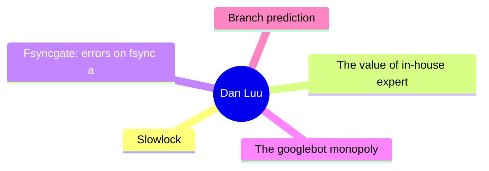
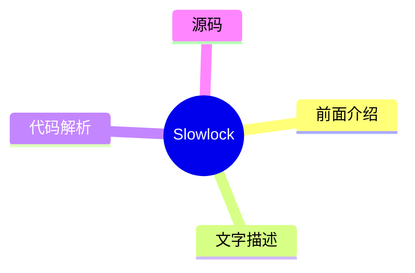
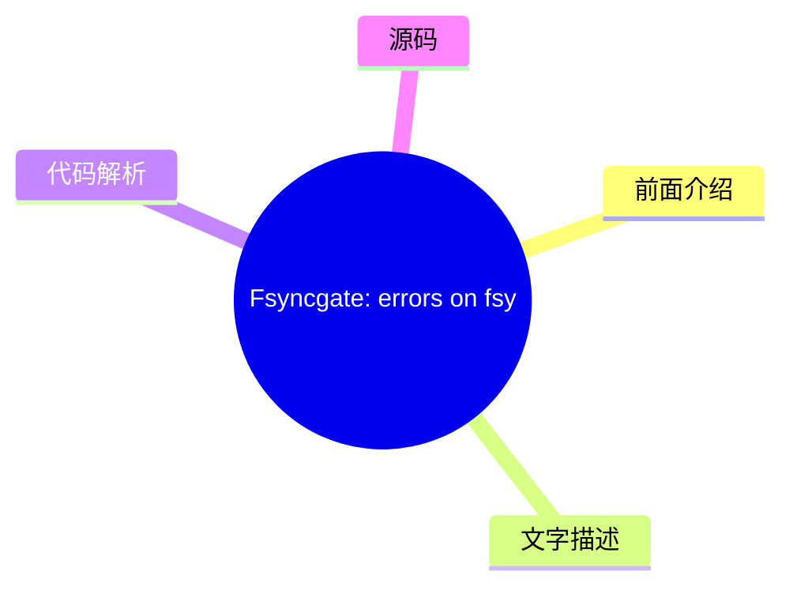
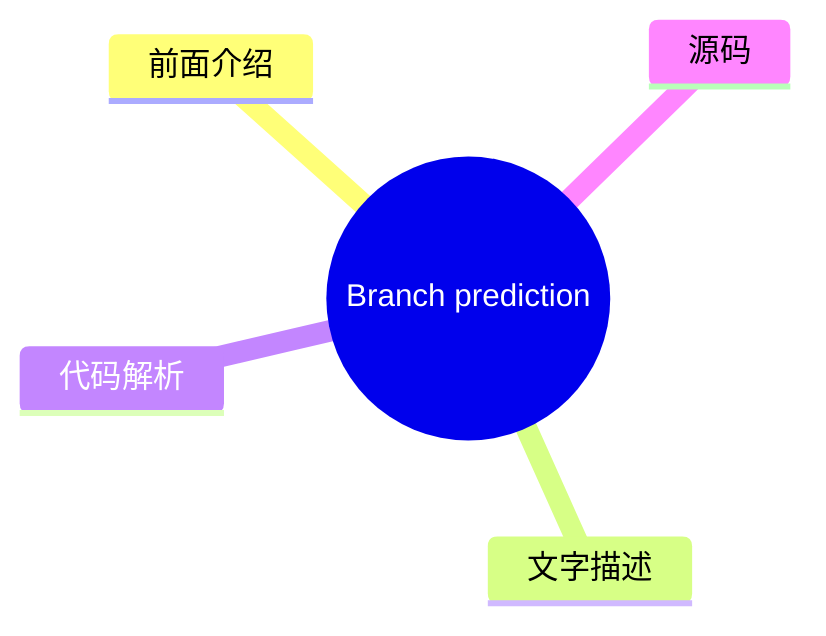

# 🔍 Dan Luu Top 5 (2026-08-02)

## 前面介绍

- 数据源：Dan Luu
- 抓取日期：2026-08-02
- 条目数：5
- 含完整正文：5
- 含代码片段：3
- 组织方式：前面介绍 / 树状图 / 文字描述 / 代码解析 / 源码

## 思维导图



## 详细整理（5 条，5 条含全文，3 条含代码）

### 1. Slowlock
- **链接**: [https://danluu.com/limplock/](https://danluu.com/limplock/)
- **发布**: Wed, 30 Sep 2015 00:00:00 +0000

#### 前面介绍

- Every once in awhile, you hear a story like “there was a case of a 1-Gbps NIC card on a machine that suddenly was transmitting only at 1 Kbps, which then caused a chain reaction upstream in such a way that the performance of the entire workload of a
- 发布时间：Wed, 30 Sep 2015 00:00:00 +0000

#### 树状图



#### 文字描述

- Every once in awhile, you hear a story like “there was a case of a 1-Gbps NIC card on a machine that suddenly was transmitting only at 1 Kbps, which then caused a chain reaction upstream in such a way that the performance of the entire workload of a 100-node cluster was crawling at a snail's pace, effectively making the system unavailable for all practical purposes”. The storie

#### 代码解析

- 本文未检测到明确代码块，内容更偏新闻、观点或方法论。

#### 源码

#### 中文节选

Every once in awhile, you hear a story like “there was a case of a 1-Gbps NIC card on a machine that suddenly was transmitting only at 1 Kbps, which then caused a chain reaction upstream in such a way that the performance of the entire workload of a 100-node cluster was crawling at a snail's pace, effectively making the system unavailable for all practical purposes”. The stories are interesting and the postmortems are fun to read, but it's not really clear how vulnerable systems are to this kind of failure or how prevalent these failures are.

 The situation reminds me of distributed systems failures before [Jepsen](https://aphyr.com/tags/jepsen). There are lots of anecdotal horror stories, but a common response to those is “works for me”, even when talking about systems that are now known to be fantastically broken. A handful of companies that are really serious about correctness have good tests and metrics, but they mostly don't talk about them publicly, and the general public has no easy way of figuring out if the systems they're running are sound.

  Thanh Do et al. have tried to look at this systematically -- [what's the effect of hardware that's been crippled but not killed](http://ucare.cs.uchicago.edu/pdf/socc13-limplock.pdf), and [how often does this happen in practice](http://ucare.cs.uchicago.edu/pdf/socc14-cbs.pdf)? It turns out that a lot of commonly used systems aren't robust against against “limping” hardware, but that the incidence of these types of failures are rare (at least until you have unreasonably large scale).

 The effect of a single slow node can be [quite dramatic](http://pages.cs.wisc.edu/~thanhdo/pdf/talk-socc-limplock.pdf):

 The job completion rate slowed down from 172 jobs per hour to 1 job per hour, effectively killing the entire cluster. Facebook has mechanisms to deal with dead machines, but they apparently didn't have any way to deal with slow machines at the time.

 When Do et al. looked at widely used open source software (HDFS, Hadoop, ZooKeeper, Cassandra, and HBase), they found similar problems.


 Each subgraph is a different failure condition. F is HDFS, H is Hadoop, Z is Zookeeper, C is Cassandra, and B is HBase. The leftmost (white) bar is the baseline no-failure case. Going to the right, the next is a crash, and the subsequent bars are results for a single degraded but not crashed hardware (further right means slower). In most (but not all) cases, having degraded hardware affected performance a lot more than having failed hardware. Note that these graphs are all log scale; going up one increment is a 10x difference in performance!

 Curiously, a failed disk can cause some operations to speed up. That's because there are operations that have less replication overhead if a replica fails. It seems a bit weird to me that there isn't more overhead, because the system has to both find a replacement replica and replicate data, but what do I know?

 Anyway, why is a slow node so much worse than a dead node? Th

#### 完整正文（中文）

每隔一段时间，你就会听到这样一个故事：“有一台机器上的 1-Gbps 网卡突然只能以 1 Kbps 的速度传输，这随后引发了一系列连锁反应，导致一个包含 100 个节点的集群的整体工作负载性能像蜗牛一样缓慢，实际上使该系统在所有实际用途上都变得不可用”。这些故事很有趣，事后分析也很有趣读，但并不清楚系统对这种故障的脆弱性有多大，或者这类故障的发生频率有多高。

这种情况让我想起了 [Jepsen](https://aphyr.com/tags/jepsen) 出现之前的分布式系统故障。有很多轶事性的恐怖故事，但针对这些故事的一个常见回应是“对我来说是好的”，即使谈论的是现在已经众所周知极其糟糕的系统。少数几家真正重视正确性的公司拥有良好的测试和指标，但他们大多不会公开谈论，公众也没有简单的方法来判断他们运行的系统是否可靠。

Thanh Do 等人尝试系统地研究了这个问题——[被削弱但未损坏的硬件有什么影响](http://ucare.cs.uchicago.edu/pdf/socc13-limplock.pdf)，以及[这种情况在实践中发生的频率有多高](http://ucare.cs.uchicago.edu/pdf/socc14-cbs.pdf)？事实证明，许多常用的系统对“跛行”硬件并不稳健，但这些类型的故障发生率很低（至少在你拥有不合理的大规模之前）。

单个慢节点的效果可能[非常显著](http://pages.cs.wisc.edu/~thanhdo/pdf/talk-socc-limplock.pdf)：

作业完成率从每小时 172 个作业降到了每小时 1 个作业，有效地杀死了整个集群。Facebook 有处理死机机器的机制，但他们显然当时没有任何办法来处理慢速机器。

当 Do 等人查看广泛使用的开源软件（HDFS、Hadoop、ZooKeeper、Cassandra 和 HBase）时，他们发现了类似的问题。

每个子图代表不同的故障条件。F 代表 HDFS，H 代表 Hadoop，Z 代表 Zookeeper，C 代表 Cassandra，B 代表 HBase。最左侧（白色）的条形是基准无故障情况。向右移动，下一个是崩溃，随后的条形是单个降级但未崩溃硬件的结果（越靠右意味着越慢）。在大多数（但不是全部）情况下，降级硬件对性能的影响比故障硬件大得多。请注意，这些图表都是对数刻度；向上移动一个增量意味着性能相差 10 倍！

 奇怪的是，失败的磁盘可能会导致某些操作加速。这是因为有些操作如果副本失败，其复制开销会更小。对我来说，这似乎有点奇怪，因为系统不仅要找到替换副本并复制数据，但我知道什么呢？

 无论如何，为什么慢节点比死节点糟糕得多？作者定义了三种故障模式并解释了每种故障的成因。有操作迟缓锁定，当操作变慢是因为操作的一部分变慢（例如，磁盘读取变慢是因为磁盘降级），节点迟缓锁定，当节点即使对于看似无关的操作也变慢（例如，从 RAM 读取变慢是因为磁盘降级），以及集群迟缓锁定，即整个集群变慢（例如，单个降级磁盘使整个 1000 台机器的集群变慢）。

 这些是如何发生的？

 #### 操作迟缓锁定

 这是最简单的一种。如果你尝试从磁盘读取，而你的磁盘很慢，那么你的磁盘读取就会很慢。在现实世界中，当操作存在单点故障，以及监控设计用于处理完全故障而不是降级性能时，我们会看到这种情况。例如，HBase 访问区域会经过负责该区域的服务器。数据在 HDFS 上复制，但如果拥有数据的节点在“跛行”，这对你没有帮助。说到 HDFS，它的超时是 60 秒，读取是以 64K 块进行的，这意味着在 HDFS 切换到健康节点之前，你的读取速度可能会降至接近 1K/s。

 #### 节点迟缓锁定

为什么慢速磁盘会导致内存读取变慢？再看一下 HDFS，它使用了一个线程池。如果每个线程都在非常缓慢地完成磁盘读取，那么内存读取就会阻塞，直到有线程空闲出来。

这不仅仅是在使用有限线程池或其他有界抽象时才会出现的问题——现实是机器资源是有限的，如果未经过精心设计以避免这种情况，无界抽象最终会触及机器的限制。例如，Zookeeper 会维护一个操作队列，而一个慢速的 follower 会导致 leader 的队列耗尽物理内存。

#### 集群僵死

如果集群依赖单一的 primary，而 primary 又处于“跛行”状态，整个集群很容易变得不健康。级联故障也会导致这种情况——第一个图表中，集群从每小时完成 172 个作业变为每小时 1 个作业，实际上就是 Facebook 在 Hadoop 上的工作负载。这里让我感到惊讶的是，Hadoop 本应具备尾部容错能力——单个慢速任务不应该对整个作业的完成产生重大影响。那么发生了什么？不健康的节点会感染健康的节点，最终锁死整个集群。

Hadoop 的尾部容错能力来自于当结果返回缓慢时启动推测性计算。特别是当拖后腿的任务与其他结果相比明显变慢时。这在 reduce 节点“跛行”（子图 H2）时效果很好，但当 [map 节点](http://static.googleusercontent.com/media/research.google.com/en//archive/mapreduce-osdi04.pdf) “跛行”（子图 H1）时，它可能会减慢同一作业中所有 reducer 的速度，这违背了 Hadoop 的尾部容错机制。

要了解原因，我们必须查看 [Hadoop 的推测算法](https://www.usenix.org/legacy/event/osdi08/tech/full_papers/zaharia/zaharia_html/index.html)。每个作业都有一个进度分数，这是一个介于 0 和 1（含）之间的数字。对于 map 任务，分数是已读取的输入数据的比例。对于 reduce 任务，三个阶段（从 map 节点复制数据、排序和 reduce）各获得 1/3 的分数。如果一个任务已经运行了至少一分钟，且其进度分数低于其类别的平均值减去 0.2，那么推测作业将被运行。

在 H2 的情况下，网络接口（NIC）运行缓慢，因此 map 阶段正常完成，因为结果最终被写入本地磁盘。但是，当 reduce 节点尝试从运行缓慢的 map 节点获取数据时，它们都会停滞不前，这拉低了该类别的平均分数，从而阻止了推测作业的运行。从大局来看，每个 Hadoop 节点都有有限数量的 map 和 reduce 任务。如果这些任务被运行缓慢的任务填满，整个节点就会锁死。由于 Hadoop 并未设计为避免级联故障，这最终会导致整个集群锁死。

我发现有趣的一点是，这种确切的故障原因在 2004 年发表的原始 MapReduce 论文中 [已有描述](http://research.google.com/archive/mapreduce.html)。他们甚至明确指出了慢速磁盘和网络是拖后腿任务（stragglers）的原因，这也促使了他们的推测执行算法的产生。然而，他们并没有提供该算法的细节。MapReduce 的开源克隆版 Hadoop 试图避免同样的问题。Hadoop 最初于 2008 年发布。五年后，当我们阅读的这篇论文发表时，其内置的拖后腿任务检测机制不仅未能防止多种类型的拖后腿任务，还未能防止拖后腿任务有效地死锁整个集群。

### 结论

我不会详细说明每个系统在测试中的表现。论文对此有很好的详细描述，如果你感兴趣，我推荐阅读该论文。总结来说，Cassandra 表现相当不错，而 HDFS、Hadoop 和 HBase 则表现不佳。

Cassandra 在这两方面表现良好。首先，[来自 2009 年的这个补丁](https://issues.apache.org/jira/browse/CASSANDRA-488) 防止了队列溢出感染健康节点，这避免了其他系统中导致集群范围故障的主要故障模式。其次，所使用的架构 ([SEDA](http://www.eecs.harvard.edu/~mdw/proj/seda/)) 将不同类型的操作解耦，这使得即使某些操作处于“跛行”状态，良好的操作仍能继续执行。

阅读这篇论文后，我的主要疑问是，这类故障发生的频率如何、原因是什么，以及合理的指标/报告机制不应该能捕获这类情况吗？

关于第一个问题的答案，许多同一作者还发表了一篇论文，他们在其中研究了 [Cassandra、Flume、HDFS 和 ZooKeeper 中的 3000 次故障](http://ucare.cs.uchicago.edu/pdf/socc14-cbs.pdf)，并确定了哪些故障与硬件相关以及硬件故障的具体情况。

性能降级的情况有 14 起，与其他 410 起硬件故障相比。在其样本中，这占故障总数的 3%；虽然罕见，但并非罕见到我们可以忽略这个问题。

如果我们不能忽略这类错误，那么如何在它们进入生产环境之前捕获它们？该论文使用了 [Emulab 测试平台](http://www.emulab.net/)，这真的很酷。不幸的是，Emulab 页面写道“Emulab 是一个公共设施，向全球大多数研究人员免费开放。如果您不确定自己是否有资格使用，请参阅我们的政策文档或向我们咨询。如果您认为自己有资格，可以申请启动一个新项目。”。这可以理解，但这意味着它可能不是我们大多数人的最佳解决方案。

绝大多数运行缓慢的硬件问题都是由网络或磁盘速度慢引起的。为什么不能修改 Jepsen，或者类似的东西，来模拟磁盘或网络速度慢呢？一个简单的实现无法达到 Emulab 的精度，但既然我们讨论的是数量级的减速，10%（甚至 2 倍）的偏差对于测试系统在硬件降级情况下的鲁棒性来说应该没问题。你可以想象出许多实现方式。例如，要在 Linux 上模拟慢速网络，可以尝试通过 [qdisc](http://linux-ip.net/articles/Traffic-Control-HOWTO/) 进行限速，[通过 ptrace 挂钩系统调用](https://github.com/majek/fluxcapacitor)，等等。对于慢速 CPU，可以通过 cgroups 和 cpu.shares 进行速率限制，或者直接将进程映射到 UC 内存（或者如果有点太慢的话，也许是 WT 或 WC），依此类推，还有磁盘和其他故障模式。

这就剩下了我的最后一个问题，系统不应该已经能够捕获这些类型的故障，即使它们并不特别关注它们吗？正如我们在上面看到的，硬件严重缓慢的系统很少，我们可以直接将它们视为死机，而不会显著影响我们总体的计算资源。而且，硬件受损的系统可以相当直接地检测到。此外，多租户系统无论如何都必须对自己的性能进行[持续监控，以获得良好的利用率](//danluu.com/new-cpu-features/#partitioning)。

那么，为什么我们要关心设计对“跛行硬件”具有鲁棒性的系统呢？答案的一部分是纵深防御。当然，我们应该有监控，但也应该有在监控失效时依然稳健的系统，因为监控必然会失效。答案的另一部分是，通过使系统对跛行硬件更具容忍度，我们也会使它们在多租户环境中对来自其他工作负载的干扰更具容忍度。最后一点多少有些推测性的实证问题——有可能，设计对同一机器上竞争工作负载的干扰不特别稳健的系统会更高效，同时使用[更好的分区](//danluu.com/intel-cat/)来避免干扰。

 

 

 感谢 Leah Hanson, Hari Angepat, Laura Lindzey, Julia Ev


### 2. The value of in-house expertise
- **链接**: [https://danluu.com/in-house/](https://danluu.com/in-house/)
- **发布**: Wed, 29 Sep 2021 00:00:00 +0000

#### 前面介绍

- An alternate title for this post might be, &quot;Twitter has a kernel team!?&quot;. At this point, I've heard that surprised exclamation enough that I've lost count of the number times that's been said to me (I'd guess that it's more than ten but les
- 发布时间：Wed, 29 Sep 2021 00:00:00 +0000

#### 树状图


#### 文字描述

- An alternate title for this post might be, "Twitter has a kernel team!?". At this point, I've heard that surprised exclamation enough that I've lost count of the number times that's been said to me (I'd guess that it's more than ten but less than a hundred). If we look at trendy companies that are within a couple factors of two in size of Twitter (in terms of either market cap 

#### 代码解析

- 本文未检测到明确代码块，内容更偏新闻、观点或方法论。

#### 源码

#### 中文节选

这篇帖子可能有一个备选标题：“Twitter 也有内核团队！？” 到目前为止，我已经听过这种惊讶的感叹无数次，以至于数不清有多少次人们对我这么说（我猜是在十次到一百次之间）。如果我们看看那些规模与 Twitter 相当（无论是市值还是工程师人数）的流行公司，它们大多不具备类似的专长，这通常是由于路径依赖的结果——因为它们“成长”在云端，所以不需要像本地部署公司那样具备内核专长来维持运营。虽然这让人可以理解，为什么那些在规模更小、更流行的公司度过职业生涯的人会对 Twitter 拥有内核团队感到惊讶，但我认为这种惊讶并没有技术上的原因。

无论公司是否具备内核专长，像 Twitter 这样规模的公司都会经常遇到内核问题，从重大的生产事故到微小的麻烦。如果没有内核团队或相应的专长，公司将勉强应对这些问题，不仅会遇到不必要的问题，还会花费不必要的时间来缓解事故。作为一个重大生产事故的例子，尽管已经公开报道过，我还是引用[这篇帖子](https://blog.twitter.com/engineering/en_us/topics/open-source/2020/hunting-a-linux-kernel-bug)，其中冷静地指出：

 去年早些时候，我们识别出一个防火墙配置错误，意外地丢弃了大部分网络流量。我们预期重置防火墙配置可以修复问题，但重置防火墙配置暴露了一个内核错误

这意味着但并未明确说明的是，这次防火墙配置错误是我任职期间发生的最严重的事故，我相信这实际上也是自2013年左右以来推特遭遇的最严重的中断。作为一家公司，即使没有内核团队或另一个拥有深厚 Linux 专业知识的团队，我们本仍能缓解该问题，但理解为何最初的修复无效将需要更长的时间，而当你正在调试严重的中断时，这是你最不希望发生的事情。内核团队的成员已经熟悉各种诊断工具和调试技术，能够快速理解为何最初的修复无效，而在一些同级别的同行公司中，这并不是常识（我调查了多家类似规模的同行公司，询问他们是否认为至少有一人具备快速调试该错误所需的知识，答案是在许多公司中是否定的）。

在各个领域拥有内部专业知识的另一个原因是，它们很容易通过自身价值来抵消成本，这是[大型公司应该比大多数人预期的更大的通用论点的一个特例，因为微小的百分比增益在绝对金额上价值巨大](/sounds-easy/))。如果，在像内核团队这样的专业团队的整个生命周期内，一个 s

#### 完整正文（中文）

这篇帖子可能有一个备选标题：“Twitter 也有内核团队！？” 到目前为止，我已经听过这种惊讶的感叹无数次，以至于数不清有多少次人们对我这么说（我猜是在十次到一百次之间）。如果我们看看那些规模与 Twitter 相当（无论是市值还是工程师人数）的流行公司，它们大多不具备类似的专长，这通常是由于路径依赖的结果——因为它们“成长”在云端，所以不需要像本地部署公司那样具备内核专长来维持运营。虽然这让人可以理解，为什么那些在规模更小、更流行的公司度过职业生涯的人会对 Twitter 拥有内核团队感到惊讶，但我认为这种惊讶并没有技术上的原因。

无论公司是否具备内核专长，像 Twitter 这样规模的公司都会经常遇到内核问题，从重大的生产事故到微小的麻烦。如果没有内核团队或相应的专长，公司将勉强应对这些问题，不仅会遇到不必要的问题，还会花费不必要的时间来缓解事故。作为一个重大生产事故的例子，尽管已经公开报道过，我还是引用[这篇帖子](https://blog.twitter.com/engineering/en_us/topics/open-source/2020/hunting-a-linux-kernel-bug)，其中冷静地指出：

 去年早些时候，我们识别出一个防火墙配置错误，意外地丢弃了大部分网络流量。我们预期重置防火墙配置可以修复问题，但重置防火墙配置暴露了一个内核错误

这意味着但并未明确说明的是，这次防火墙配置错误是我任职期间发生的最严重事件，我相信这实际上也是自2013年左右以来Twitter遭遇的最严重中断。作为一家公司，即使没有内核团队或其他拥有深厚Linux专业知识的团队，我们本仍能缓解该问题，但理解为何初始修复无效所需的时间会更长，而在调试严重中断时，这是你最不希望发生的事情。内核团队的成员已经熟悉各种诊断工具和调试技术，能够快速理解为何初始修复无效，这在一些同行公司中并非常识（我调查了多家规模相当的同行公司，询问他们是否认为至少有一人具备快速调试该错误所需的知识，答案在很多公司是否定的）。

在各个领域拥有内部专业知识的另一个原因是，它们很容易就能收回成本，这是[大型公司应该比大多数人预期的更大的通用论据的一个特例，因为微小的百分比收益在绝对金额上也是一笔巨款](/sounds-easy/))。如果在一个像内核团队这样的专业团队的生命周期内，有一个人发现了一些能持续降低[TCO](https://en.wikipedia.org/wiki/Total_cost_of_ownership) 0.5% 的东西，那么这笔收益将足以永久支付该团队的费用，而Twitter的内核团队已经发现了许多此类变更。除了有时能产生这种影响的[内核补丁](https://patchwork.ozlabs.org/project/netdev/list/?submitter=211&state=*&archive=both¶m=4&page=1)外，人们还会发现具有这种影响的配置问题等。

到目前为止，我只谈到了内核团队，因为那是唯一一个仅仅因为存在就会让大多数人感到惊讶的团队，但当我告诉人们 Twitter 有很多前 Sun JVM 团队成员，比如 Ramki Ramakrishna、Tony Printezis 和 John Coomes，他们曾参与过 HotSpot 的开发时，我也得到了类似的反应。人们会纳闷，一家社交媒体公司为什么需要如此深厚的 JVM 专业知识。就像内核团队一样，我们这种规模使用 JVM 的公司会遇到各种奇怪的问题和 JVM Bug，拥有具备深厚专业知识的人员来调试这些问题会很有帮助。而且，就像内核团队一样，对 JVM 的单独优化可以永久地为团队创造价值。一个具体的例子是 [Flavio Brasil 的这个补丁，它虚拟化了比较交换调用](https://github.com/oracle/graal/pull/636)。

背景是 Twitter 使用了大量的 Scala。尽管有很多说法与此相反，但 Scala 比起 Java 消耗更多的内存，而且明显更慢，如果你大规模使用 Scala，这会产生显著的代价，足以证明进行优化工作以减少惯用 Scala 和惯用 Java 之间性能差距的合理性是值得的。

在这个补丁之前，如果你对我们的 Scala 代码进行性能分析，你会看到在 Future/Promise 上花费了不合理的大量时间，即使在某些情况下，你可能天真地认为编译器会优化掉这些工作。其中一个原因是 Future 使用了 [比较交换](https://en.wikipedia.org/wiki/Compare-and-swap) (CAS) 操作，这对 JVM 优化来说是不可见的。上面链接的补丁在 Future 不逃逸方法作用域时避免了 CAS 操作。[这个配套补丁](https://github.com/twitter/util/commit/3245a8e1a98bd5eb308f366678528879d7140f5e) 移除了某些不太容易进行编译器优化的地方的 CAS 操作。这两个补丁结合在一起，将典型的主要 Twitter 服务使用惯用 Scala 的成本降低了 5% 到 15%，永久地多次为 JVM 团队创造了价值，而这甚至不是 Flavio 那一年找到的最大收益。

我不会对那些能带来数倍收益的团队进行逐一拆解，因为这样的团队实在太多了，即使我将范围限定在“人们惊讶于 Twitter 拥有这些团队”的范围内也是如此。

一个相关的话题是人们如何讨论“购买 vs. 构建”。我见过很多讨论，有人主张“购买”，因为这样可以省去在该领域具备专业知识的必要。这可能是真的，但我看到这种情况被论证的频率远高于其真实发生的频率。我认为这种情况往往不成立的一个例子是分布式追踪。[我们之前探讨过 Twitter 从追踪中获得价值的一些方式](/tracing-analytics/)，这是 Rebecca Isaacs 设定的愿景所带来的成果。另一方面，当我与规模相当的同行公司的员工交谈时，大多数人（目前？）尚未从分布式追踪中获得显著价值。这种情况非常普遍，以至于我每年都会看到关于分布式追踪毫无用处的病毒式传播的 Twitter 线程。尽管我们选择了成本更高的“构建”选项，但仅凭记忆，我就能想到追踪的多种用途，其回报率是构建追踪成本的 10 倍到 100 倍，而那些选择更便宜的“购买”选项的许多公司的员工，却经常抱怨追踪并不值得。

 Coincidentally, I was just talking about this exact topic to Pam Wolf, a civil engineering professor with experience in (civil engineering) industry on multiple continents, who had a related opinion. For large scale systems (projects), you need an in-house expert (owner's-side engineer) for each area that you don't handle in your own firm. While it's technically possible to hire yet another firm to be the expert, that's more expensive than developing or hiring in-house expertise and, in the long run, also more risky. That's pretty analogous to my experience working as an electrical engineer as well, where orgs that outsource functions to other companies without retaining an in-house expert pay a very high cost, and not just monetarily. They often ship sub-par designs with long delays on top of having high costs. "Buying" can and often does reduce the amount of expertise necessary, but it often doesn't remove the need for expertise.


这与另一个常见的抽象论点有关，该论点通常认为公司应该专注于“其比较优势领域”或“最重要的问题”或“核心业务需求”，并将其他一切外包。我们已经看到了几个例子，证明这种观点并不成立，因为在足够大的规模下，拥有内部专业知识比没有更有利可图，无论某项业务是否属于公司的核心业务（有人可能会争辩说，所有移入内部的事物都是公司的核心业务，但这会让“核心性”这一概念变得毫无意义）。这种抽象建议过于简单的另一个原因是，企业可以在某种程度上任意选择其比较优势是什么。一个典型的例子是苹果公司将 CPU 设计纳入内部。自以 2.78 亿美元收购 PA Semi（前身为 SiByte 团队，再之前是 DEC 的团队）以来，苹果公司生产的芯片在手机和笔记本电脑功耗范围内的表现一直相当出色。但在收购之前，苹果公司没有任何迹象表明收购是必然的，也没有迹象表明 CPU 设计是苹果公司的固有比较优势。但如果一家公司可以选择一个领域并将其打造为比较优势领域，那么建议该公司应专注于其比较优势，并不是很有用的建议。

2.78 亿美元从绝对金额来看是一笔巨款，但作为苹果公司资源的一部分，这微不足道，而且较小的公司也可以通过投入一小部分资源来开展尖端工作，例如，Twitter 以任何一家 1 亿美元的公司都能负担得起的价格，[创造了新颖的缓存算法和数据结构](https://twitter.com/danluu/status/1381687511362138113)，并正在开展其他前沿的缓存工作。拥有优秀的 [缓存基础设施](/cache-incidents/) 对 Twitter 业务的核心程度，并不比为苹果公司创造优秀的 CPU 更核心，但它是一个杠杆，Twitter 可以利用它比其他情况下赚取更多的钱。

对于小公司来说，为公司涉及的方方面面都配备内部专家是不合逻辑的，但公司不需要变得多么庞大，开始为操作系统、语言运行时以及其他通常被认为相当专业的组件配备内部专业知识就变得合乎逻辑了。回顾 Twitter 的历史，Yao Yue 指出，在她早期在 Twitter 工作（当时我们有约 100 名工程师）时，她会定期去内核团队寻求帮助调试生产事故，而在某些情况下，如果没有内核团队的帮助，调试可能很容易花费 10 倍的时间。社交媒体公司往往在每用户和每美元的基础上具有相对较高的规模，因此并非每家公司都需要在拥有 100 名工程师时具备同等程度的专业知识，但总会有其他领域并非核心业务需求，但对于拥有 100 名工程师的初创公司来说，在这些领域具备专业知识也会带来回报。

 感谢 Ben Kuhn、Yao Yue、Pam Wolf、John Hergenroeder、Julien Kirch、Tom Brearley 和 Kevin Burke 提供评论/更正/讨论。


### 3. Fsyncgate: errors on fsync are unrecovarable
- **链接**: [https://danluu.com/fsyncgate/](https://danluu.com/fsyncgate/)
- **发布**: Wed, 28 Mar 2018 00:00:00 +0000

#### 前面介绍

- This is an archive of the original &quot;fsyncgate&quot; email thread. This is posted here because I wanted to have a link that would fit on a slide for a talk on file safety with a mobile-friendly non-bloated format.

From:Craig Ringer &lt;craig(at)
- 发布时间：Wed, 28 Mar 2018 00:00:00 +0000

#### 树状图



#### 文字描述

- *This is an archive of the original "fsyncgate" email thread. This is posted here because I wanted to have a link that would fit on a slide for *[a talk on file safety](//danluu.com/deconstruct-files/) with [a mobile-friendly non-bloated format](//danluu.com/web-bloat/). ``` From:Craig Ringer <craig(at)2ndquadrant(dot)com> Subject:Re: PostgreSQL's handling of fsync() errors is 

#### 代码解析

- `text`: 这段更像查询逻辑，重点看过滤条件、聚合方式和性能影响。
- `text`: 这段更像查询逻辑，重点看过滤条件、聚合方式和性能影响。
- `text`: 这段更像查询逻辑，重点看过滤条件、聚合方式和性能影响。

#### 源码

#### 源码片段 1（text）

```text
From:Craig Ringer <craig(at)2ndquadrant(dot)com>
Subject:Re: PostgreSQL's handling of fsync() errors is unsafe and risks data loss at least on XFS
Date:2018-03-28 02:23:46
```

#### 源码片段 2（text）

```text
From:Tom Lane <tgl(at)sss(dot)pgh(dot)pa(dot)us>
Date:2018-03-28 03:53:08
```

#### 源码片段 3（text）

```text
From:Michael Paquier <michael(at)paquier(dot)xyz>
Date:2018-03-29 02:30:59
```

#### 完整正文（中文）

*这是原始“fsyncgate”邮件线程的存档。我把它发布在这里，是因为我想有一个链接，可以放在 *[关于文件安全的演讲](//danluu.com/deconstruct-files/) 的幻灯片上，并且具有 *[移动端友好且无臃肿的格式](//danluu.com/web-bloat/)*。

 ```
From:Craig Ringer <craig(at)2ndquadrant(dot)com>
Subject:Re: PostgreSQL's handling of fsync() errors is unsafe and risks data loss at least on XFS
Date:2018-03-28 02:23:46
```

 Hi all

 Some time ago I ran into an issue where a user encountered data corruption after a storage error. PostgreSQL played a part in that corruption by allowing checkpoint what should've been a fatal error.

 TL;DR: Pg should PANIC on fsync() EIO return. Retrying fsync() is not OK at least on Linux. When fsync() returns success it means "all writes since the last fsync have hit disk" but we assume it means "all writes since the last SUCCESSFUL fsync have hit disk".

 Pg wrote some blocks, which went to OS dirty buffers for writeback. Writeback failed due to an underlying storage error. The block I/O layer and XFS marked the writeback page as failed (AS_EIO), but had no way to tell the app about the failure. When Pg called fsync() on the FD during the next checkpoint, fsync() returned EIO because of the flagged page, to tell Pg that a previous async write failed. Pg treated the checkpoint as failed and didn't advance the redo start position in the control file.

 All good so far.

 But then we retried the checkpoint, which retried the fsync(). The retry succeeded, because the prior fsync() *cleared the AS_EIO bad page flag*.

 The write never made it to disk, but we completed the checkpoint, and merrily carried on our way. Whoops, data loss.

 The clear-error-and-continue behaviour of fsync is not documented as far as I can tell. Nor is fsync() returning EIO unless you have a very new linux man-pages with the patch I wrote to add it. But from what I can see in the POSIX standard we are not given any guarantees about what happens on fsync() failure at all, so we're probably wrong to assume that retrying fsync( ) is safe.

如果服务器当时使用的是带有 errors=remount-ro 选项的 ext3 或 ext4，这个问题就不会发生，因为第一次 I/O 错误就会重新挂载文件系统并停止 Pg 继续运行。但 XFS 没有这个选项。可能还有其他涉及 LVM 和/或多路径的情况也会发生这种情况，但我还没有彻底挖掘出细节。

事实证明，可以通过伪造第一次错误成功检查点之前的备份标签来恢复系统，强制 redo 重复并写入丢失的块。但是……真是一团糟。

我之前在这里发帖讨论了底层的 fsync 问题：

[https://stackoverflow.com/q/42434872/398670](https://stackoverflow.com/q/42434872/398670)

但还没有机会跟进关于 Pg 具体细节的内容。

我断断续续地研究这个问题，还没有找到好的解决方案。我认为我们应该直接 PANIC，让 redo 在重复自上次检查点以来的工作时，通过重试失败的写入来解决问题。

异步缓冲写入和 fsync 提供的 API 让我们无法知道哪个页面失败了，所以我们不能只是有选择地重做那次写入。我想我们确实知道与失败 fsync 的 fd 关联的 relfilenode，但仅此而已。所以替代方案似乎是一种潜在的复杂在线 redo 方案，即我们只重放发生 fsync() 错误的关系的 WAL，而在其他情况下正常处理查询。这很可能极其容易出错且难以测试，而且它试图解决在其他文件系统上整个数据库无论如何都会停止运行的情况。

我调查了是否可以使用 AIO API 来解决它，但那里的情况更糟——据我所知，你甚至无法在所有 Linux 内核版本上可靠地保证 fsync。

对于 WAL 段，我们在 fsync() 失败时已经 PANIC 了。我们只需要对数据 fork 至少在 EIO 的情况下做同样的事情。这并不像看起来那么糟糕，因为据我所知，fsync 只在我们应该停止整个世界的情况下返回 EIO，而许多文件系统会为我们这样做。

有很多调用 pg_fsync() 的地方。虽然我们可以针对每一个单独处理这种情况，但我很倾向于直接让 pg_fsync() 本身拦截 EIO 并 PANIC。大家怎么看？

```
From:Tom Lane <tgl(at)sss(dot)pgh(dot)pa(dot)us>
Date:2018-03-28 03:53:08
```

 Craig Ringer  写道：

  TL;DR: Pg 应该在 fsync() 返回 EIO 时 PANIC。

 

 你一定是在开玩笑。

  在 Linux 上重试 fsync() 至少是不行的。当 fsync() 返回成功时，它的意思是“自上次 fsync 以来所有的写入都已到达磁盘”，但我们假设它的意思是“自上次成功的 fsync 以来所有的写入都已到达磁盘”。

 

 如果真的是这样，我们需要抵制这种内核的脑损伤，因为正如你所描述的那样，fsync 将完全毫无用处。

 此外，POSIX 明确指出，成功的 fsync 意味着该文件的所有前置写入都已完成，到此为止，无论它们何时发出。

 
```
From:Michael Paquier <michael(at)paquier(dot)xyz>
Date:2018-03-29 02:30:59
```

 在 2018 年 3 月 27 日 23:53:08 -0400，Tom Lane 写道：

  Craig Ringer  写道：

  TL;DR: Pg 应该在 fsync() 返回 EIO 时 PANIC。

 

 你一定是在开玩笑。

 

 后端代码中任何 pg_fsync 的调用者都足够小心地检查返回的状态，有时会像在 mdsync 中那样进行重试，所以这里提议的做法将是一种倒退。

 
```
From:Thomas Munro <thomas(dot)munro(at)enterprisedb(dot)com>
Date:2018-03-29 02:48:27
```

 在 2018 年 3 月 29 日下午 3:30，Michael Paquier  写道：

  在 2018 年 3 月 27 日 23:53:08 -0400，Tom Lane 写道：

  Craig Ringer  写道：

  TL;DR: Pg 应该在 fsync() 返回 EIO 时 PANIC。

 

 你一定是在开玩笑。

 

 后端代码中任何 pg_fsync 的调用者都足够小心地检查返回的状态，有时会像在 mdsync 中那样进行重试，所以这里提议的做法将是一种倒退。

 

 Craig，你描述的现象是否与本文讨论的第二个问题“Reporting writeback errors”（报告回写错误）相同？

 [https://lwn.net/Articles/724307/](https://lwn.net/Articles/724307/)

 “当前的内核可能会在 fsync() 调用上报告回写错误，但这种情况有多种方式可能不会发生。”

 这……我无语了。

```
From:Justin Pryzby <pryzby(at)telsasoft(dot)com>
Date:2018-03-29 05:00:31
```

 On Thu, Mar 29, 2018 at 11:30:59AM +0900, Michael Paquier wrote:

  On Tue, Mar 27, 2018 at 11:53:08PM -0400, Tom Lane wrote:

  Craig Ringer  writes:

  TL;DR: Pg 应该在 fsync() 返回 EIO 时 PANIC。

 

 肯定是在开玩笑。

 

 后端代码中调用 pg_fsync 的任何调用者都足够小心地检查返回状态，有时像 mdsync 那样进行重试，所以这里提议的内容将是一个倒退。

 

 重试是问题的根源；第一次 fsync() 可以返回 EIO，并且还会*清除错误*，导致第二次 fsync（相同数据）返回成功。
 （注意，我可以看到在 EIO 上 PANIC 但对 ENOSPC 重试可能是有用的）。

 On Thu, Mar 29, 2018 at 03:48:27PM +1300, Thomas Munro wrote:

  Craig，你描述的现象与本文讨论的第二个问题“Reporting writeback errors”（报告回写错误）相同吗？[https://lwn.net/Articles/724307/](https://lwn.net/Articles/724307/)

 

 更糟糕的是，该文章承认了这种行为，而没有建议更改它：

 “将该值存储在文件结构中有一个重要好处：它使得有可能向每个调用 FSYNC() 的进程报告一次回写错误 .... 在当前内核中，只有在错误发生后第一次调用者才有机会看到该错误信息。”

 我相信我使用 dmsetup "error" 目标重现了问题行为，见附件。

 strace 看起来是这样的：

 kernel 是 Linux 4.10.0-28-generic #32~16.04.2-Ubuntu SMP Thu Jul 20 10:19:48 UTC 2017 x86_64 x86_64 x86_64 GNU/Linux

 ```
1open("/dev/mapper/eio", O_RDWR|O_CREAT, 0600) = 3
2write(3, "\0\0\0\0\0\0\0\0\0\0\0\0\0\0\0\0\0\0\0\0\0\0\0\0\0\0\0\0\0\0\0\0"..., 8192) = 8192
3write(3, "\0\0\0\0\0\0\0\0\0\0\0\0\0\0\0\0\0\0\0\0\0\0\0\0\0\0\0\0\0\0\0\0"..., 8192) = 8192
4write(3, "\0\0\0\0\0\0\0\0\0\0\0\0\0\0\0\0\0\0\0\0\0\0\0\0\0\0\0\0\0\0\0\0"..., 8192) = 8192
5write(3, "\0\0\0\0\0\0\0\0\0\0\0\0\0\0\0\0\0\0\0\0\0\0\0\0\0\0\0\0\0\0\0\0"..., 8192) = 8192
6write(3, "\0\0\0\0\0\0\0\0\0\0\0\0\0\0\0\0\0\0\0\0\0\0\0\0\0\0\0\0\0\0\0\0"..., 8192) = 8192

7write(3, "\0\0\0\0\0\0\0\0\0\0\0\0\0\0\0\0\0\0\0\0\0\0\0\0\0\0\0\0\0\0\0\0"..., 8192) = 8192
8write(3, "\0\0\0\0\0\0\0\0\0\0\0\0\0\0\0\0\0\0\0\0\0\0\0\0\0\0\0\0\0\0\0\0"..., 8192) = 2560
9write(3, "\0\0\0\0\0\0\0\0\0\0\0\0\0\0\0\0\0\0\0\0\0\0\0\0\0\0\0\0\0\0\0\0"..., 8192) = -1 ENOSPC (No space left on device)
10dup(2)                                  = 4
11fcntl(4, F_GETFL)                       = 0x8402 (flags O_RDWR|O_APPEND|O_LARGEFILE)
12brk(NULL)                               = 0x1299000
13brk(0x12ba000)                          = 0x12ba000
14fstat(4, {st_mode=S_IFCHR|0620, st_rdev=makedev(136, 2), ...}) = 0
15write(4, "write(1): No space left on devic"..., 34write(1): No space left on device
16) = 34
17close(4)                                = 0
18fsync(3)                                = -1 EIO (Input/output error)
19dup(2)                                  = 4
20fcntl(4, F_GETFL)                       = 0x8402 (flags O_RDWR|O_APPEND|O_LARGEFILE)
21fstat(4, {st_mode=S_IFCHR|0620, st_rdev=makedev(136, 2), ...}) = 0
22write(4, "fsync(1): Input/output error\n", 29fsync(1): Input/output error
23) = 29
24close(4)                                = 0
25close(3)                                = 0
26open("/dev/mapper/eio", O_RDWR|O_CREAT, 0600) = 3
27fsync(3)                                = 0
28write(3, "\0", 1)                       = 1
29fsync(3)                                = 0
30exit_group(0)                           = ?
```

 2: EIO isn't seen initially due to writeback page cache;

 9: ENOSPC due to small device

 18: original IO error reported by fsync, good

 25: the original FD is closed

 26: ..and file reopened

 27: fsync on file with still-dirty data+EIO returns success BAD

 10, 19: I'm not sure why there's dup(2), I guess glibc thinks that perror should write to a separate FD (?)

 Also note, close() ALSO returned success..which you might think exonerates the 2nd fsync(), but I think may itself be problematic, no? In any case, the 2nd byte certainly never got written to DM error, and the failure status was lost following fsync().

 I get the exact same behavior if I break after one write() loop, such as to avoid ENOSPC.

 

 ```

From:Thomas Munro <thomas(dot)munro(at)enterprisedb(dot)com>
Date:2018-03-29 05:06:22
```

 On Thu, Mar 29, 2018 at 6:00 PM, Justin Pryzby  wrote:

  The retries are the source of the problem ; the first fsync() can return EIO, and also *clears the error* causing a 2nd fsync (of the same data) to return success.

 

 What I'm failing to grok here is how that error flag even matters, whether it's a single bit or a counter as described in that patch. If write back failed, *the page is still dirty*. So all future calls to fsync() need to try to try to flush it again, and (presumably) fail again (unless it happens to succeed this time around).

 

 ```
From:Craig Ringer <craig(at)2ndquadrant(dot)com>
Date:2018-03-29 05:25:51
```

 On 29 March 2018 at 13:06, Thomas Munro  wrote:

  On Thu, Mar 29, 2018 at 6:00 PM, Justin Pryzby  wrote:

  The retries are the source of the problem ; the first fsync() can return EIO, and also *clears the error* causing a 2nd fsync (of the same data) to return success.

 

 What I'm failing to grok here is how that error flag even matters, whether it's a single bit or a counter as described in that patch. If write back failed, *the page is still dirty*. So all future calls to fsync() need to try to try to flush it again, and (pre

...（截断，原文 516759+ 字符）


### 4. The googlebot monopoly
- **链接**: [https://danluu.com/googlebot-monopoly/](https://danluu.com/googlebot-monopoly/)
- **发布**: Wed, 27 May 2015 00:00:00 +0000

#### 前面介绍

- TIL that Bell Labs and a whole lot of other websites block archive.org, not to mention most search engines. Turns out I have a broken website link in a GitHub repo, caused by the deletion of an old webpage. When I tried to pull the original from arch
- 发布时间：Wed, 27 May 2015 00:00:00 +0000

#### 树状图


#### 文字描述

- TIL that Bell Labs and a whole lot of other websites block archive.org, not to mention most search engines. Turns out I have [a broken website link](https://github.com/danluu/debugging-stories/issues/3) in a GitHub repo, caused by the deletion of an old webpage. When I tried to pull the original from archive.org, I found that it's not available because Bell Labs blocks the arch

#### 代码解析

- `text`: 更偏接口调用示例，适合作为接入或联调样例。

#### 源码

#### 源码片段 1（text）

```text
User-agent: Googlebot
User-agent: msnbot
User-agent: LSgsa-crawler
Disallow: /RealAudio/
Disallow: /bl-traces/
Disallow: /fast-os/
Disallow: /hidden/
Disallow: /historic/
Disallow: /incoming/
Disallow: /inferno/
Disallow: /magic/
Disallow: /netlib.depend/
Disallow: /netlib/
Disallow: /p9trace/
Disallow: /plan9/sources/
Disallow: /sources/
Disallow: /tmp/
Disallow: /tripwire/
Visit-time: 0700-1200
Request-rate: 1/5
Crawl-delay: 5
User-agent: *
Disallow: /
```

#### 完整正文（中文）

我才知道贝尔实验室和许多其他网站都屏蔽了 archive.org，更不用说大多数搜索引擎了。结果我在一个 GitHub 仓库中发现了一个[损坏的网站链接](https://github.com/danluu/debugging-stories/issues/3)，这是由一个旧网页被删除引起的。当我尝试从 archive.org 拉取原始内容时，我发现它不可用，因为贝尔实验室在他们的 robots.txt 中屏蔽了 archive.org 的爬虫：

  ```
User-agent: Googlebot
User-agent: msnbot
User-agent: LSgsa-crawler
Disallow: /RealAudio/
Disallow: /bl-traces/
Disallow: /fast-os/
Disallow: /hidden/
Disallow: /historic/
Disallow: /incoming/
Disallow: /inferno/
Disallow: /magic/
Disallow: /netlib.depend/
Disallow: /netlib/
Disallow: /p9trace/
Disallow: /plan9/sources/
Disallow: /sources/
Disallow: /tmp/
Disallow: /tripwire/
Visit-time: 0700-1200
Request-rate: 1/5
Crawl-delay: 5
User-agent: *
Disallow: /
```

实际上，贝尔实验室不仅屏蔽了 Internet Archiver 爬虫，它还屏蔽了除 Googlebot、msnbot 和它们自己的企业爬虫以外的所有爬虫。而且 msnbot 在[五年前](http://en.wikipedia.org/wiki/Msnbot)就已经被 bingbot 取代了！

使用一个仅在贝尔实验室才能找到的术语（例如“This is a start at making available some of the material from the Tenth Edition Research Unix manual.”）进行快速搜索，发现 bing 索引了该页面；要么是 bingbot 遵循了某些 msnbot 的规则，要么是 msnbot 仍然独立运行并索引像贝尔实验室这样的网站，这些网站屏蔽了 bingbot 但没有屏蔽 msnbot。幸运的是，在这种情况下，许多搜索引擎（如 Yahoo 和 DDG）都使用 Bing 的结果，所以贝尔实验室并没有从非 Google 的互联网中消失，但如果你是使用 Yandex 的 55% 的俄罗斯人之一，那你可就倒大霉了[http://en.wikipedia.org/wiki/Yandex#cite_note-13]。

 And all that is a relatively good case, where one non-Google crawler is allowed to operate. It's not uncommon to see robots.txt files that ban everything but Googlebot. Running [a competing search engine](http://blog.nullspace.io/building-search-engines.html) and preventing a Google monopoly is hard enough without having sites ban non-Google bots. We don't need to make it even harder, nor do we need to accidentally ban the Internet Archive bot.

  P.S. While you're checking that your robots.txt doesn't ban everyone but Google, consider looking at your CPUID checks to make sure that you're using feature flags [instead of banning everyone but Intel and AMD](https://twitter.com/danluu/status/1203450367515615233).

 BTW, I do think there can be legitimate reasons to block crawlers, including archive.org, but I don't think that the common default many web devs have, of blocking everything but googlebot, is really intended to block competing search engines as well as archive.org. 

 2021 Update: since this post was first published, archive.org started ignoring being blocked in robots.txt and archives posts where they are blocked in robots.txt. I've heard that some competing search engines do the same thing, so this mis-use of robots.txt, where sites ban everything but googlebot, is slowly making robots.txt effectively useless, much like browsers identify themselves as every browser in user-agent strings to work around sites that incorrectly block browsers they don't think are compatible.

 A related thing is that sites will sometimes ban competing search engines, like Bing, in a fit of pique, which they wouldn't do to Google since Google provides too much traffic for them to be able get away with that, e.g., [Discourse banned Bing because they were upset that Bing was crawling discourse at 0.46 QPS](https://twitter.com/danluu/status/981992814824378369).


### 5. Branch prediction
- **链接**: [https://danluu.com/branch-prediction/](https://danluu.com/branch-prediction/)
- **发布**: Wed, 23 Aug 2017 00:00:00 +0000

#### 前面介绍

- This is a pseudo-transcript for a talk on branch prediction given at Two Sigma on 8/22/2017 to kick off &quot;localhost&quot;, a talk series organized by RC.

How many of you use branches in your code? Could you please raise your hand if you use if
- 发布时间：Wed, 23 Aug 2017 00:00:00 +0000

#### 树状图



#### 文字描述

- *This is a pseudo-transcript for a talk on branch prediction given at Two Sigma on 8/22/2017 to kick off "localhost", a talk series organized by *[RC](https://www.recurse.com/scout/click?t=b504af89e87b77920c9b60b2a1f6d5e8). How many of you use branches in your code? Could you please raise your hand if you use if statements or pattern matching? `Most of the audience raises their
- ### One-bit So far, we’ve look at schemes that don’t store any state, i.e., schemes where the prediction ignores the program’s execution history. These are called *static* branch prediction schemes in the literature. These schemes have the advantage of being simple but they have the disadvantage of being bad at predicting branches whose behavior change over time. If you want an

#### 代码解析

- `text`: 代码片段可作为实现参考，建议结合上下文确认输入输出和边界条件。
- `text`: 代码片段可作为实现参考，建议结合上下文确认输入输出和边界条件。
- `text`: 代码片段可作为实现参考，建议结合上下文确认输入输出和边界条件。

#### 源码

#### 源码片段 1（text）

```text
if (x == 0) {
  // Do stuff
} else {
  // Do other stuff (things)
}
  // Whatever happens later
```

#### 源码片段 2（text）

```text
branch_if_not_equal x, 0, else_label
// Do stuff
goto end_label
else_label:
// Do things
end_label:
// whatever happens later
```

#### 源码片段 3（text）

```text
branch_if_not_equal x, 0, else_label
???
```

#### 完整正文（中文）

*This is a pseudo-transcript for a talk on branch prediction given at Two Sigma on 8/22/2017 to kick off "localhost", a talk series organized by *[RC](https://www.recurse.com/scout/click?t=b504af89e87b77920c9b60b2a1f6d5e8).

 How many of you use branches in your code? Could you please raise your hand if you use if statements or pattern matching?

 `Most of the audience raises their hands`

 I won’t ask you to raise your hands for this next part, but my guess is that if I asked, how many of you feel like you have a good understanding of what your CPU does when it executes a branch and what the performance implications are, and how many of you feel like you could understand a modern paper on branch prediction, fewer people would raise their hands.

 The purpose of this talk is to explain how and why CPUs do “branch prediction” and then explain enough about classic branch prediction algorithms that you could read a modern paper on branch prediction and basically know what’s going on.

 Before we talk about branch prediction, let’s talk about why CPUs do branch prediction. To do that, we’ll need to know a bit about how CPUs work.

 For the purposes of this talk, you can think of your computer as a CPU plus some memory. The instructions live in memory and the CPU executes a sequence of instructions from memory, where instructions are things like “add two numbers”, “move a chunk of data from memory to the processor”. Normally, after executing one instruction, the CPU will execute the instruction that’s at the next sequential address. However, there are instructions called “branches” that let you change the address next instruction comes from.

 Here’s an abstract diagram of a CPU executing some instructions. The x-axis is time and the y-axis distinguishes different instructions.

 Here, we execute instruction `A`, followed by instruction `B`, followed by instruction `C`, followed by instruction `D`.


你可以通过让 CPU 完成一条指令的所有工作，然后继续下一条指令，以此类推，来设计 CPU。这样做没有问题；许多旧 CPU 都是这样做的，一些现代的低成本 CPU 仍然采用这种方式。但是，如果你想要制造更快的 CPU，你可以设计一个像装配线一样工作的 CPU。也就是说，将 CPU 分成两部分，这样 CPU 的一半可以完成指令的“前半部分”工作，而 CPU 的另一半则处理指令的“后半部分”工作，就像装配线一样。这通常被称为流水线 CPU。

如果你这样做，执行过程可能看起来像上面那样。在指令 A 的前半部分完成后，CPU 可以处理指令 A 的后半部分，同时第一半部分指令 B 正在运行。当 A 的后半部分完成时，CPU 可以同时开始处理 B 的后半部分和 C 的前半部分。在这个图中，你可以看到流水线 CPU 每单位时间执行的指令数量是上面非流水线 CPU 的两倍。

CPU 不一定只能分成两部分。我们可以将 CPU 分成三部分，从而获得 3 倍的加速，或者分成四部分，获得 4 倍的加速。这并不完全准确，而且通常情况下，对于三阶段流水线，我们获得的加速比小于 3 倍，对于四阶段流水线，获得的加速比小于 4 倍，因为将 CPU 分成更多部分并建立更深的流水线会产生开销。

开销的一个来源是如何处理分支。CPU 必须为指令执行的第一件事是获取指令；为此，它必须知道指令在哪里。例如，考虑以下代码：

```
if (x == 0) {
  // Do stuff
} else {
  // Do other stuff (things)
}
  // Whatever happens later
```

这可能会变成如下汇编代码：

```
branch_if_not_equal x, 0, else_label
// Do stuff
goto end_label
else_label:
// Do things
end_label:
// whatever happens later
```

在这个例子中，我们将 `x` 与 0 进行比较。`if_not_equal`，然后我们跳转到 `else_label` 并执行 else 块中的代码。如果该比较失败（即 `x` 为 0），我们将继续执行，执行 `if` 块中的代码，然后跳转到 `end_label` 以避免执行 `else` 块中的代码。

 对流水线来说有问题的特定指令序列是

 ```
branch_if_not_equal x, 0, else_label
???
```

 CPU 不知道这是

 ```
branch_if_not_equal x, 0, else_label
// Do stuff
```

 还是

 ```
branch_if_not_equal x, 0, else_label
// Do things
```

 直到分支完成（或几乎完成）执行。由于 CPU 需要做的第一件事之一是指令从内存中获取，而且我们不知道 `???` 将是哪条指令，所以我们甚至无法开始执行 `???`，直到前一条指令几乎完成。

 早些时候，当我们说对于 3 级流水线我们会获得 3 倍加速，对于 20 级流水线我们会获得 20 倍加速时，我们假设你可以在每个周期开始一条新指令，但在这种情况下，这两条指令几乎是串行执行的。

 解决这个问题的一种方法是使用分支预测。当出现分支时，CPU 会猜测分支是否被采用。

 在这种情况下，CPU 预测分支不会被采用，并在执行分支的第二部分时开始执行 `stuff` 的第一部分。如果预测是正确的，CPU 将执行 `stuff` 的第二部分，并且可以在执行 `stuff` 的第二部分时开始执行另一条指令，就像我们在第一个流水线图中看到的那样。

 如果预测是错误的，当分支完成执行时，CPU 将丢弃 `stuff.1` 的结果，并开始执行正确的指令而不是错误的指令。由于如果没有分支预测，我们会使处理器停顿且不执行任何指令，所以我们的处境并不比没有做出预测时更糟（至少在我们正在查看的细节层面上）。

如果我们预测每个分支都会被采用，准确率可能会达到 70%，这意味着我们将为 30% 的分支支付误预测代价，使得平均指令的成本为 `(0.8 + 0.7 * 0.2) * 1 + 0.3 * 0.2 * 20 = 0.94 + 1.2 = 2.14`。如果我们比较“总是预测采用”与“无预测”和“完美预测”，尽管这是一个非常简单的算法，“总是预测采用”也能获得完美预测的大部分好处。

### 向后采用向前不采用 (BTFNT)

 Predicting branches as taken works well for loops, but not so great for all branches. If we look at whether or not branches are taken based on whether or not the branch is forward (skips over code) or backwards (goes back to previous code), we can see that backwards branches are taken more often than forward branches, so we could try a predictor which predicts that backward branches are taken and forward branches aren’t taken (BTFNT). If we implement this scheme in hardware, compiler writers will conspire with us to arrange code such that branches the compiler thinks will be taken will be backwards branches and branches the compiler thinks won’t be taken will be forward branches.

 If we do this, we might get something like 80% prediction accuracy, making our cost function `(0.8 + 0.8 * 0.2) * 1 + 0.2 * 0.2 * 20 = 0.96 + 0.8 = 1.76` cycles per instruction.

 #### Used by

 - PPC 601(1993): also uses compiler generated branch hints
- PPC 603

### One-bit

 So far, we’ve look at schemes that don’t store any state, i.e., schemes where the prediction ignores the program’s execution history. These are called *static* branch prediction schemes in the literature. These schemes have the advantage of being simple but they have the disadvantage of being bad at predicting branches whose behavior change over time. If you want an example of a branch whose behavior changes over time, you might imagine some code like

 ```
if (flag) {
  // things
  }
```

 Over the course of the program, we might have one phase of the program where the flag is set and the branch is taken and another phase of the program where flag isn’t set and the branch isn’t taken. There’s no way for a static scheme to make good predictions for a branch like that, so let’s consider *dynamic* branch prediction schemes, where the prediction can change based on the program history.

 One of the simplest things we might do is to make a prediction based on the last result of the branch, i.e., we predict taken if the branch was taken last time and we predict not taken if the branch wasn’t taken last time.


由于为每个可能的分支存储一位比特在存储上过于庞大，我们将维护一个包含一定数量已见分支及其最后结果的表。在本讨论中，我们将 `not taken` 存储为 `0`，将 `taken` 存储为 `1`。

在这种情况下，为了使内容能容纳在图表中，我们有一个 64 项的表，这意味着我们可以用 6 位来索引该表，因此我们使用分支地址的低 6 位来索引该表。在执行分支后，我们会更新预测表中的条目（如下高亮所示），而下一次再次执行该分支时，我们将索引到同一个条目并使用更新后的值进行预测。

我们可能会观察到别名现象，即两个位于不同位置的分支会映射到同一个位置。这并不理想，但在表的速度/成本与大小之间存在权衡，这实际上限制了表的大小。

如果我们使用一位方案，准确率可能达到 85%，每个指令的代价为 `(0.8 + 0.85 * 0.2) * 1 + 0.15 * 0.2 * 20 = 0.97 + 0.6 = 1.57` 个周期。

#### Used by

- DEC EV4 (1992)
- MIPS R8000 (1994)

一位方案对于像 `TTTTTTTT…` 或 `NNNNNNN…` 这样的模式效果很好，但对于主要由 taken 组成但包含一个 not taken 分支的分支流 `...TTTNTTT...`，则会发生误预测。这可以通过为每个地址添加第二位并实现饱和计数器来解决。让我们任意规定当分支 not taken 时递减，当 taken 时递增。如果我们查看二进制值，我们将得到：

 ```
00: predict Not
01: predict Not
10: predict Taken
11: predict Taken
```

饱和计数器中的“饱和”部分意味着如果我们从 `00` 递减，不会发生下溢，而是保持在 `00`，从 `11` 递增时也是如此。该方案与一位方案相同

...（截断，原文 31719+ 字符）

