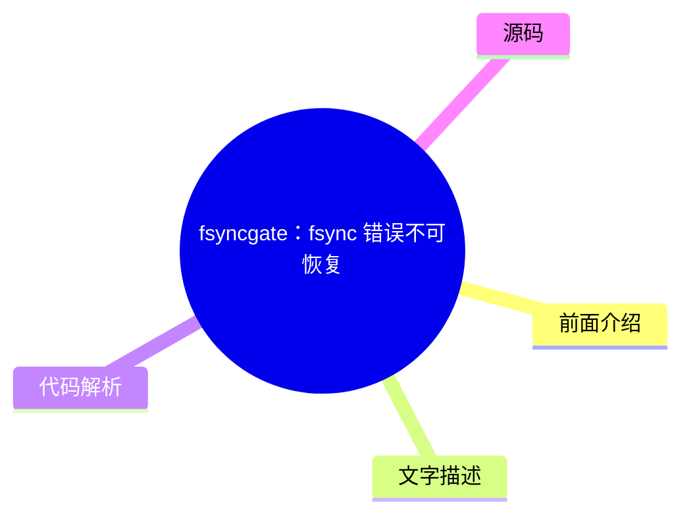

# 🔍 Dan Luu Top 5 (2026-08-03)

## 前面介绍

- 数据源：Dan Luu
- 抓取日期：2026-08-03
- 条目数：5
- 含完整正文：5
- 含代码片段：3
- 组织方式：前面介绍 / 树状图 / 文字描述 / 代码解析 / 源码

## 思维导图


## 详细整理（5 条，5 条含全文，3 条含代码）

### 1. 慢锁：硬件降级引发的连锁故障
- **链接**: [https://danluu.com/limplock/](https://danluu.com/limplock/)
- **发布**: Wed, 30 Sep 2015 00:00:00 +0000

#### 前面介绍

- 硬件性能突然下降（如从1Gbps降至1Kbps）会导致整个集群性能急剧恶化。
- 常见的开源系统（HDFS、Cassandra等）对硬件降级缺乏鲁棒性。
- 故障模式分为操作慢锁、节点慢锁和集群慢锁三种。

#### 树状图


#### 文字描述

- 单台慢节点可能导致集群吞吐量从每小时172个作业降至1个，使系统实际上不可用。
- Facebook曾因缺乏处理慢节点的机制而遭受严重性能影响。
- 硬件降级对性能的影响往往比硬件故障更严重，且故障发生率随规模扩大而增加。
- 操作慢锁源于单点故障或监控设计不当，例如HDFS超时设置过长导致切换不及时。
- 节点慢锁涉及线程池阻塞，慢磁盘读取会阻塞内存读取，类似Zookeeper队列耗尽内存。
- 集群慢锁可能由单一降级磁盘导致，依赖单一主节点的系统极易发生级联故障。

#### 代码解析

- 本文未提供源码，以下为实现思路或结构解析：
- HDFS读取失败切换机制存在缺陷，超时设置导致在切换前性能严重下降。
- 线程池设计需考虑资源限制，避免因单一慢操作阻塞所有线程。
- 系统架构应避免单点依赖，防止降级硬件拖垮整个集群。

#### 源码

#### 中文节选

Every once in awhile, you hear a story like “there was a case of a 1-Gbps NIC card on a machine that suddenly was transmitting only at 1 Kbps, which then caused a chain reaction upstream in such a way that the performance of the entire workload of a 100-node cluster was crawling at a snail's pace, effectively making the system unavailable for all practical purposes”. The stories are interesting and the postmortems are fun to read, but it's not really clear how vulnerable systems are to this kind of failure or how prevalent these failures are.

 The situation reminds me of distributed systems failures before [Jepsen](https://aphyr.com/tags/jepsen). There are lots of anecdotal horror stories, but a common response to those is “works for me”, even when talking about systems that are now known to be fantastically broken. A handful of companies that are really serious about correctness have good tests and metrics, but they mostly don't talk about them publicly, and the general public has no easy way of figuring out if the systems they're running are sound.

  Thanh Do et al. have tried to look at this systematically -- [what's the effect of hardware that's been crippled but not killed](http://ucare.cs.uchicago.edu/pdf/socc13-limplock.pdf), and [how often does this happen in practice](http://ucare.cs.uchicago.edu/pdf/socc14-cbs.pdf)? It turns out that a lot of commonly used systems aren't robust against against “limping” hardware, but that the incidence of these types of failures are rare (at least until you have unreasonably large scale).

 The effect of a single slow node can be [quite dramatic](http://pages.cs.wisc.edu/~thanhdo/pdf/talk-socc-limplock.pdf):

 The job completion rate slowed down from 172 jobs per hour to 1 job per hour, effectively killing the entire cluster. Facebook has mechanisms to deal with dead machines, but they apparently didn't have any way to deal with slow machines at the time.

 When Do et al. looked at widely used open source software (HDFS, Hadoop, ZooKeeper, Cassandra, and HBase), they found similar problems.


 Each subgraph is a different failure condition. F is HDFS, H is Hadoop, Z is Zookeeper, C is Cassandra, and B is HBase. The leftmost (white) bar is the baseline no-failure case. Going to the right, the next is a crash, and the subsequent bars are results for a single degraded but not crashed hardware (further right means slower). In most (but not all) cases, having degraded hardware affected performance a lot more than having failed hardware. Note that these graphs are all log scale; going up one increment is a 10x difference in performance!

 Curiously, a failed disk can cause some operations to speed up. That's because there are operations that have less replication overhead if a replica fails. It seems a bit weird to me that there isn't more overhead, because the system has to both find a replacement replica and replicate data, but what do I know?

 Anyway, why is a slow node so much worse than a dead node? Th

#### 完整正文（中文）

每隔一段时间，你就会听到这样的故事：“有一台机器上的 1-Gbps 网卡突然只能以 1 Kbps 的速度传输，这随后在上游引发了一连串反应，导致一个 100 节点集群的整个工作负载性能如同蜗牛爬行，实际上使该系统在所有实际用途上都变得不可用”。这些故事很有趣，事后分析也很有趣读，但并不清楚系统对这种故障的脆弱性有多大，或者这类故障有多普遍。

这种情况让我想起了 [Jepsen](https://aphyr.com/tags/jepsen) 之前的分布式系统故障。有很多轶事性的恐怖故事，但针对这些故事的一个常见回应是“对我来说是好的”，即使是在谈论那些现在已知是极其糟糕的系统时。少数几家真正重视正确性的公司拥有良好的测试和指标，但它们大多不会公开谈论，公众也没有简单的方法来判断他们运行的系统是否可靠。

Thanh Do 等人尝试系统地研究了这个问题——[被削弱但未损坏的硬件有什么影响](http://ucare.cs.uchicago.edu/pdf/socc13-limplock.pdf)，以及[这种情况在实践中发生的频率](http://ucare.cs.uchicago.edu/pdf/socc14-cbs.pdf)？事实证明，许多常用的系统对“跛行”硬件并不健壮，但这些类型的故障发生率很低（至少在规模不合理地扩大之前）。

单个慢节点的效果可以[非常显著](http://pages.cs.wisc.edu/~thanhdo/pdf/talk-socc-limplock.pdf)：

作业完成率从每小时 172 个作业降至每小时 1 个作业，有效地杀死了整个集群。Facebook 有处理死机的机制，但他们显然当时没有任何办法来处理慢速机器。

当 Do 等人查看广泛使用的开源软件（HDFS、Hadoop、ZooKeeper、Cassandra 和 HBase）时，他们发现了类似的问题。

每个子图代表一种不同的故障条件。F 是 HDFS，H 是 Hadoop，Z 是 Zookeeper，C 是 Cassandra，B 是 HBase。最左侧（白色）的条形图是基准无故障情况。向右移动，下一个是崩溃，随后的条形图是单个降级但未崩溃硬件的结果（越靠右意味着越慢）。在大多数（但不是全部）情况下，降级硬件对性能的影响比故障硬件大得多。请注意，这些图表都是对数刻度；向上增加一个刻度意味着性能相差 10 倍！

 奇怪的是，故障的磁盘可能会导致某些操作加速。这是因为有些操作如果副本失效，其复制开销会更少。对我来说这有点奇怪，因为系统必须同时找到替换副本并复制数据，却似乎没有更多的开销，但我又知道些什么呢？

 无论如何，为什么慢节点比死节点糟糕得多？作者定义了三种故障模式并解释了每种模式的原因。有操作迟滞锁，即操作变慢是因为操作的一部分变慢（例如，磁盘读取变慢是因为磁盘降级），节点迟滞锁，即节点即使对于看似无关的操作也很慢（例如，从 RAM 读取变慢是因为磁盘降级），以及集群迟滞锁，即整个集群都很慢（例如，单个降级磁盘使整个 1000 台机器的集群变慢）。

 这些是如何发生的？

 #### 操作迟滞锁

 这是最简单的。如果你尝试从磁盘读取，而你的磁盘很慢，你的磁盘读取就会很慢。在现实世界中，当操作存在单点故障，以及监控设计用于处理完全故障而不是降级性能时，我们会看到这种情况。例如，HBase 访问一个区域会经过负责该区域的服务器。数据在 HDFS 上复制，但如果拥有数据的节点正在跛行，这对你没有帮助。说到 HDFS，它的超时时间是 60 秒，读取是以 64K 块进行的，这意味着在 HDFS 切换到健康节点之前，你的读取速度可能会慢到接近 1K/s。

 #### 节点迟滞锁

为什么慢速磁盘会导致内存读取变慢？再看一下 HDFS，它使用了一个线程池。如果每个线程都在非常缓慢地完成磁盘读取，那么内存读取就会阻塞，直到有线程空闲出来。

这不仅在使用有限线程池或其他有界抽象时是个问题——现实是机器资源是有限的，如果未经过精心设计以避免这种情况，无界抽象最终会触及机器的限制。例如，Zookeeper 会维护一个操作队列，而一个慢速的 follower 会导致 leader 的队列耗尽物理内存。

#### 集群僵死

如果集群依赖单一主节点，而该主节点又“跛行”，整个集群很容易变得不健康。级联故障也会导致这种情况——第一个图表中，集群从每小时完成 172 个作业变为每小时 1 个作业，实际上是 Facebook 在 Hadoop 上的工作负载。这里让我感到惊讶的是，Hadoop 本应具备尾部容错能力——单个慢速任务不应该对整个作业的完成产生巨大影响。那么发生了什么？不健康的节点会感染健康的节点，最终锁死整个集群。

Hadoop 的尾部容错能力来自于当结果返回缓慢时启动推测式计算。特别是当拖后腿的任务与其他结果相比异常缓慢时。当 reduce 节点“跛行”（子图 H2）时，这能正常工作，但当 [map 节点](http://static.googleusercontent.com/media/research.google.com/en//archive/mapreduce-osdi04.pdf) “跛行”（子图 H1）时，它可能会减慢同一作业中所有 reducer 的速度，从而破坏了 Hadoop 的尾部容错机制。

 To see why, we have to look at [Hadoop's speculation algorithm](https://www.usenix.org/legacy/event/osdi08/tech/full_papers/zaharia/zaharia_html/index.html). Each job has a progress score which is a number between 0 and 1 (inclusive). For a map, the score is the fraction of input data read. For a reduce, each of three phases (copying data from mappers, sorting, and reducing) gets 1/3 of the score. A speculative job will get run if a task has run for at least one minute and has a progress score that's less than the average for its category minus 0.2.

 In case H2, the NIC is limping, so the map phase completes normally since results end up written to local disk. But when reduce nodes try to fetch data from the limping map node, they all stall, pulling down the average score for the category, which prevents speculative jobs from being run. Looking at the big picture, each Hadoop node has a limited number of map and reduce tasks. If those fill up with limping tasks, the entire node will lock up. Since Hadoop isn't designed to avoid cascading failures, this eventually causes the entire cluster to lock up.

 One thing I find interesting is that this exact cause of failures was [described in the original MapReduce paper](http://research.google.com/archive/mapreduce.html), published in 2004. They even explicitly called out slow disk and network as causes of stragglers, which motivated their speculative execution algorithm. However, they didn't provide the details of the algorithm. The open source clone of MapReduce, Hadoop, attempted to avoid the same problem. Hadoop was initially released in 2008. Five years later, when the paper we're reading was published, its built-in mechanism for straggler detection not only failed to prevent multiple types of stragglers, it also failed to prevent stragglers from effectively deadlocking the entire cluster.

 ### Conclusion

 I'm not going to go into details of how each system fared under testing. That's detailed quite nicely in the paper, which I recommend reading the paper if you're curious. To summarize, Cassandra does quite well, whereas HDFS, Hadoop, and HBase don't.


Cassandra 在这两方面似乎表现良好。首先，[2009 年的这个补丁](https://issues.apache.org/jira/browse/CASSANDRA-488)防止了队列溢出感染健康节点，这避免了其他系统中导致集群范围故障的主要故障模式。其次，所使用的架构（[SEDA](http://www.eecs.harvard.edu/~mdw/proj/seda/））解耦了不同类型的操作，这使得即使某些操作处于“跛行”状态，良好的操作仍能继续执行。

阅读这篇论文后，我的主要疑问是，这类故障发生的频率如何、原因是什么，以及合理的指标/报告难道不应该捕获这类情况吗？

对于第一个问题的答案，许多同一作者还发表了一篇论文，他们在其中研究了 [Cassandra、Flume、HDFS 和 ZooKeeper 中的 3000 次故障](http://ucare.cs.uchicago.edu/pdf/socc14-cbs.pdf)，并确定了哪些故障与硬件有关以及硬件故障的性质。

性能降级的情况有 14 起，与其他 410 起硬件故障相比。在其样本中，这占故障总数的 3%；虽然罕见，但并非罕见到我们可以忽略这个问题。

如果我们不能忽略这类错误，那么如何在它们进入生产环境之前捕获它们？该论文使用了 [Emulab 测试平台](http://www.emulab.net/)，这真的很酷。不幸的是，Emulab 页面写道“Emulab 是一个公共设施，向全球大多数研究人员免费开放。如果您不确定自己是否有资格使用，请参阅我们的政策文档或向我们咨询。如果您认为自己有资格，可以申请启动一个新项目。”。这可以理解，但这意味着它可能不是我们大多数人的绝佳解决方案。

绝大多数运行缓慢的硬件问题都是由网络或磁盘速度慢造成的。为什么不能修改 Jepsen，或者类似的东西，来模拟磁盘或网络速度慢呢？一个简单的实现无法达到 Emulab 的精度，但既然我们讨论的是数量级的减速，10%（甚至 2 倍）的偏差对于测试系统在硬件降级情况下的鲁棒性来说应该足够了。你可以想象出多种实现方式。例如，要在 Linux 上模拟慢速网络，可以尝试通过 [qdisc](http://linux-ip.net/articles/Traffic-Control-HOWTO/) 进行限速，通过 [ptrace 挂钩系统调用](https://github.com/majek/fluxcapacitor)，等等。对于慢速 CPU，可以通过 cgroups 和 cpu.shares 进行速率限制，或者直接将进程映射到 UC 内存（或者如果那有点太慢的话，也许是 WT 或 WC），依此类推，适用于磁盘和其他故障模式。

这就剩下了我的最后一个问题，系统不应该已经捕获了这些类型的故障，即使它们并不特别关注它们吗？如上所见，硬件严重缓慢的系统很少，我们可以直接将其视为死机，而不会显著影响我们总体的计算资源。而且，硬件受损的系统可以相当直接地检测到。此外，多租户系统无论如何都必须对自己的性能进行[持续监控，以获得良好的利用率](//danluu.com/new-cpu-features/#partitioning)。

那么，为什么我们要关心设计对跛行硬件具有鲁棒性的系统？答案的一部分是纵深防御。当然，我们应该有监控，但也应该有在监控失效时依然稳健的系统，因为监控必然会失效。答案的另一部分是，通过使系统对跛行硬件更具容忍度，我们也会使它们在多租户环境中对来自其他工作负载的干扰更具容忍度。最后一点有点推测性的实证问题——有可能设计对同一机器上竞争工作负载的干扰不特别稳健的系统会更高效，同时使用[更好的分区](//danluu.com/intel-cat/)来避免干扰。

 

 

 感谢 Leah Hanson, Hari Angepat, Laura Lindzey, Julia Ev


### 2. 内部专家团队的价值
- **链接**: [https://danluu.com/in-house/](https://danluu.com/in-house/)
- **发布**: Wed, 29 Sep 2021 00:00:00 +0000

#### 前面介绍

- 大型公司需要内部专家团队来处理内核和JVM层面的复杂问题。
- 内部专家能显著减少故障排查时间并降低总体拥有成本（TCO）。
- 专家团队的存在并非为了炫技，而是为了在关键时刻快速解决问题。

#### 树状图


#### 文字描述

- Twitter拥有内核团队和JVM专家，这并非为了炫耀，而是为了处理大规模生产环境中的复杂问题。
- 缺乏内核或JVM深度的公司往往需要更长时间来缓解故障，且容易陷入不必要的麻烦。
- Twitter曾因防火墙配置错误暴露内核bug，专家团队迅速定位并修复了问题。
- 内部专家团队可以通过微小的性能优化（如0.5%的TCO降低）实现自我造血。
- Twitter的Scala代码优化（如虚拟化CAS调用）证明了专家团队对性能的巨大贡献。
- 云原生公司往往缺乏内核经验，但这并不意味着它们不会遇到内核问题。

#### 代码解析

- 本文未提供源码，以下为实现思路或结构解析：
- JVM专家团队通过优化HotSpot和JIT编译器，解决了Scala在Future/Promise操作中的性能瓶颈。
- 通过虚拟化CAS调用，减少了不必要的内存开销，提升了并发性能。
- 内部专家团队的价值在于能够深入理解底层机制，从而进行针对性的性能调优。

#### 源码

#### 中文节选

这篇帖子或许可以有另一个标题：“Twitter 也有内核团队！？” 到目前为止，我已经听过这种惊讶的感叹太多次了，以至于我都数不清有多少次了（我猜是十次到一百次之间）。如果我们看看那些规模与 Twitter 相当（无论是市值还是工程师人数）的潮流公司，它们大多不具备类似的专长，这通常是由于路径依赖的结果——因为它们“成长”在云端，所以不需要像本地部署公司那样具备内核专长来维持运营。虽然这让人可以理解，为什么那些在更年轻、更潮流的公司度过职业生涯的人会对 Twitter 拥有内核团队感到惊讶，但我认为这种惊讶并没有技术上的原因。

无论是否拥有内核专长，像 Twitter 这样规模的公司都会经常遇到内核问题，从重大的生产事故到微小的麻烦。如果没有内核团队或相应的专长，公司将只能勉强应对这些问题，不仅会遇到不必要的问题，还会花费不必要的时间来缓解事故。作为一个重大生产事故的例子，仅仅因为它已经公开报道过，我将引用[这篇文章](https://blog.twitter.com/engineering/en_us/topics/open-source/2020/hunting-a-linux-kernel-bug)，其中冷静地指出：

 去年早些时候，我们识别出一个防火墙配置错误，意外导致大部分网络流量丢失。我们预期重置防火墙配置可以修复问题，但重置防火墙配置暴露了一个内核 Bug

 What this implies but doesn't explicitly say is that this firewall misconfiguration was the most severe incident that's occured during my time at Twitter and I believe it's actually the most severe outage that Twitter has had since 2013 or so. As a company, we would've still been able to mitigate the issue without a kernel team or another team with deep Linux expertise, but it would've taken longer to understand why the initial fix didn't work, which is the last thing you want when you're debugging a serious outage. Folks on the kernel team were already familiar with the various diagnostic tools and debugging techniques necessary to quickly understand why the initial fix didn't work, which is not common knowledge at some peer companies (I polled folks at a number of similar-scale peer companies to see if they thought they had at least one person with the knowledge necessary to quickly debug the bug and the answer was no at many companies).

 Another reason to have in-house expertise in various areas is that they easily pay for themselves, which is a special case of [the generic argument that large companies should be larger than most people expect because tiny percentage gains are worth a large amount in absolute dollars](/sounds-easy/). If, in the lifetime of the specialist team like the kernel team, a s

#### 完整正文（中文）

这篇帖子或许可以有另一个标题：“Twitter 也有内核团队！？” 到目前为止，我已经听过这种惊讶的感叹太多次了，以至于我都数不清有多少次了（我猜是十次到一百次之间）。如果我们看看那些规模与 Twitter 相当（无论是市值还是工程师人数）的潮流公司，它们大多不具备类似的专长，这通常是由于路径依赖的结果——因为它们“成长”在云端，所以不需要像本地部署公司那样具备内核专长来维持运营。虽然这让人可以理解，为什么那些在更年轻、更潮流的公司度过职业生涯的人会对 Twitter 拥有内核团队感到惊讶，但我认为这种惊讶并没有技术上的原因。

无论是否拥有内核专长，像 Twitter 这样规模的公司都会经常遇到内核问题，从重大的生产事故到微小的麻烦。如果没有内核团队或相应的专长，公司将只能勉强应对这些问题，不仅会遇到不必要的问题，还会花费不必要的时间来缓解事故。作为一个重大生产事故的例子，仅仅因为它已经公开报道过，我将引用[这篇文章](https://blog.twitter.com/engineering/en_us/topics/open-source/2020/hunting-a-linux-kernel-bug)，其中冷静地指出：

 去年早些时候，我们识别出一个防火墙配置错误，意外导致大部分网络流量丢失。我们预期重置防火墙配置可以修复问题，但重置防火墙配置暴露了一个内核 Bug

 What this implies but doesn't explicitly say is that this firewall misconfiguration was the most severe incident that's occured during my time at Twitter and I believe it's actually the most severe outage that Twitter has had since 2013 or so. As a company, we would've still been able to mitigate the issue without a kernel team or another team with deep Linux expertise, but it would've taken longer to understand why the initial fix didn't work, which is the last thing you want when you're debugging a serious outage. Folks on the kernel team were already familiar with the various diagnostic tools and debugging techniques necessary to quickly understand why the initial fix didn't work, which is not common knowledge at some peer companies (I polled folks at a number of similar-scale peer companies to see if they thought they had at least one person with the knowledge necessary to quickly debug the bug and the answer was no at many companies).

 Another reason to have in-house expertise in various areas is that they easily pay for themselves, which is a special case of [the generic argument that large companies should be larger than most people expect because tiny percentage gains are worth a large amount in absolute dollars](/sounds-easy/). If, in the lifetime of the specialist team like the kernel team, a single person found something that persistently reduced [TCO](https://en.wikipedia.org/wiki/Total_cost_of_ownership) by 0.5%, that would pay for the team in perpetuity, and Twitter’s kernel team has found many such changes. In addition to [kernel patches](https://patchwork.ozlabs.org/project/netdev/list/?submitter=211&state=*&archive=both¶m=4&page=1) that sometimes have that kind of impact, people will also find configuration issues, etc., that have that kind of impact.


 So far, I've only talked about the kernel team because that's the one that most frequently elicits surprise from folks for merely existing, but I get similar reactions when people find out that Twitter has a bunch of ex-Sun JVM folks who worked on HotSpot, like Ramki Ramakrishna, Tony Printezis, and John Coomes. People wonder why a social media company would need such deep JVM expertise. As with the kernel team, companies our size that use the JVM run into weird issues and JVM bugs and it's helpful to have people with deep expertise to debug those kinds of issues. And, as with the kernel team, individual optimizations to the JVM can pay for the team in perpetuity. A concrete example is [this patch by Flavio Brasil, which virtualizes compare and swap calls](https://github.com/oracle/graal/pull/636).

 The context for this is that Twitter uses a lot of Scala. Despite a lot of claims otherwise, Scala uses more memory and is significantly slower than Java, which has a significant cost if you use Scala at scale, enough that it makes sense to do optimization work to reduce the performance gap between idiomatic Scala and idiomatic Java.

 Before the patch, if you profiled our Scala code, you would've seen an unreasonably large amount of time spent in Future/Promise, including in cases where you might naively expect that the compiler would optimize the work away. One reason for this is that Futures use a [compare-and-swap](https://en.wikipedia.org/wiki/Compare-and-swap) (CAS) operation that's opaque to JVM optimization. The patch linked above avoids CAS operations when the Future doesn't escape the scope of the method. [This companion patch](https://github.com/twitter/util/commit/3245a8e1a98bd5eb308f366678528879d7140f5e) removes CAS operations in some places that are less amenable to compiler optimization. The two patches combined reduced the cost of typical major Twitter services using idiomatic Scala by 5% to 15%, paying for the JVM team in perpetuity many times over and that wasn't even the biggest win Flavio found that year.


我不会对那些能多次收回成本的团队进行逐一拆解，因为这样的团队实在太多了，即使我将范围限定在“人们惊讶于 Twitter 拥有这些团队”的范围内也是如此。

一个相关的话题是人们如何讨论“购买 vs. 构建”。我见过许多讨论，其中有人主张“购买”，因为这样可以消除在该领域具备专业知识的必要性。这可能是真的，但我看到这种论调被提出的频率远高于其成为事实的频率。我认为分布式追踪在这方面 tends to be untrue（往往是不成立的）。[我们之前看过 Twitter 从追踪中获得价值的一些方式](/tracing-analytics/)，这是 Rebecca Isaacs 设定的愿景。另一方面，当我与规模相当的同行公司的技术人员交谈时，大多数人还没有（或者尚未？）成功从分布式追踪中获得显著价值。这种情况非常普遍，以至于我每年都会看到关于分布式追踪毫无用处的病毒式传播的 Twitter 线程。尽管我们选择了更昂贵的“构建”选项，但仅凭记忆，我就能想到追踪的多种用途，其回报率在构建追踪成本的 10 倍到 100 倍之间，而许多选择更便宜的“购买”选项的公司人员通常抱怨追踪并不值得。

 Coincidentally, I was just talking about this exact topic to Pam Wolf, a civil engineering professor with experience in (civil engineering) industry on multiple continents, who had a related opinion. For large scale systems (projects), you need an in-house expert (owner's-side engineer) for each area that you don't handle in your own firm. While it's technically possible to hire yet another firm to be the expert, that's more expensive than developing or hiring in-house expertise and, in the long run, also more risky. That's pretty analogous to my experience working as an electrical engineer as well, where orgs that outsource functions to other companies without retaining an in-house expert pay a very high cost, and not just monetarily. They often ship sub-par designs with long delays on top of having high costs. "Buying" can and often does reduce the amount of expertise necessary, but it often doesn't remove the need for expertise.


这与另一个常见的抽象论点有关，该论点通常认为公司应该专注于“它们的比较优势领域”或“最重要的问题”或“核心业务需求”，并将其他一切外包。我们已经看到了几个例子，证明这种观点并不成立，因为在大规模下，拥有内部专业知识比没有更有利可图，无论某事是否属于公司的核心业务（有人可能会争辩说，所有移至内部的事物都是公司的核心业务，但这会使“核心性”这一概念变得毫无意义）。这种抽象建议过于简单的另一个原因是，企业可以在某种程度上任意选择它们的比较优势是什么。一个典型的例子是苹果将 CPU 设计内部化。自以 2.78 亿美元收购 PA Semi（前身为 SiByte 团队，再之前是 DEC 的团队）以来，苹果在手机和笔记本电脑功耗范围内生产出了[性能领先相当大一部分的芯片](https://twitter.com/danluu/status/1433297089866383364)。但在收购之前，苹果没有任何东西使得收购成为必然，使得 CPU 设计成为苹果固有的比较优势。但如果一家公司可以选择一个领域并将其变成比较优势领域，那么说这家公司应该专注于其比较优势，并不是很有用的建议。

 2.78 亿美元从绝对意义上讲是一笔巨款，但作为苹果资源的一部分，这微乎其微，而且较小的公司也可以通过投入一小部分资源来做到前沿工作，例如，Twitter 以任何一家 1 亿美元的公司都能负担得起的价格，[创造了新颖的缓存算法和数据结构](https://twitter.com/danluu/status/1381687511362138113)，并正在做其他前沿的缓存工作。拥有优秀的[缓存基础设施](/cache-incidents/)对于 Twitter 的业务来说并不比为苹果创造优秀的 CPU 更核心，但它是一个杠杆，Twitter 可以利用它比其他情况下赚更多的钱。

 For small companies, it doesn't make sense to have in-house experts for everything the company touches, but companies don't have to get all that large before it starts making sense to have in-house expertise in their operating system, language runtime, and other components that people often think of as being fairly specialized. Looking back at Twitter's history, Yao Yue has noted that when she was working on cache in Twitter's early days (when we had ~100 engineers), she would regularly go to the kernel team for help debugging production incidents and that, in some cases, debugging could've easily taken 10x longer without help from the kernel team. Social media companies tend to have relatively high scale on a per-user and per-dollar basis, so not every company is going to need the same kind of expertise when they have 100 engineers, but there are going to be other areas that aren't obviously core business needs where expertise will pay off even for a startup that has 100 engineers.

 Thanks to Ben Kuhn, Yao Yue, Pam Wolf, John Hergenroeder, Julien Kirch, Tom Brearley, and Kevin Burke for comments/corrections/discussion.


### 3. fsyncgate：fsync 错误不可恢复
- **链接**: [https://danluu.com/fsyncgate/](https://danluu.com/fsyncgate/)
- **发布**: Wed, 28 Mar 2018 00:00:00 +0000

#### 前面介绍

- PostgreSQL 在 fsync 返回 EIO 时应立即 PANIC，而非重试。
- POSIX 标准未明确保证 fsync 失败后的行为，重试可能导致数据丢失。
- XFS 文件系统在 I/O 错误时不会自动挂载为只读，加剧了风险。

#### 树状图



#### 文字描述

- Craig Ringer 发现 PostgreSQL 在存储错误后允许继续运行，导致数据损坏。
- 当 fsync 返回 EIO 时，内核清除错误标志，重试操作看似成功，但数据未写入磁盘。
- ext3/ext4 文件系统通过 errors=remount-ro 选项在首次错误时阻止系统继续运行。
- XFS 缺乏此选项，且 AIO API 在不同内核版本下无法可靠保证 fsync。
- 作者建议在 pg_fsync 中拦截 EIO 并触发 PANIC，类似于对 WAL 的处理方式。
- 重试 fsync 的行为在 POSIX 标准中未定义，且 Linux 内核行为可能令人困惑。

#### 代码解析

- 本文未提供源码，以下为实现思路或结构解析：
- PostgreSQL 应在 fsync 返回 EIO 时立即停止服务，利用 WAL 重放机制恢复数据。
- 避免依赖内核清除错误标志的行为，确保 fsync 失败时系统状态一致。
- 文件系统配置应启用错误自动恢复机制，防止系统在错误状态下继续运行。

#### 源码

#### 源码片段 1（text）

```text
From:Craig Ringer <craig(at)2ndquadrant(dot)com>
Subject:Re: PostgreSQL's handling of fsync() errors is unsafe and risks data loss at least on XFS
Date:2018-03-28 02:23:46
```

#### 源码片段 2（text）

```text
From:Tom Lane <tgl(at)sss(dot)pgh(dot)pa(dot)us>
Date:2018-03-28 03:53:08
```

#### 源码片段 3（text）

```text
From:Michael Paquier <michael(at)paquier(dot)xyz>
Date:2018-03-29 02:30:59
```

#### 完整正文（中文）

*这是原始“fsyncgate”邮件线程的存档。发布在这里是因为我想要一个适合幻灯片的链接，用于 *[关于文件安全的演讲](//danluu.com/deconstruct-files/)，以及 *[一个移动端友好且无臃肿的格式](//danluu.com/web-bloat/)。

 ```
From:Craig Ringer <craig(at)2ndquadrant(dot)com>
Subject:Re: PostgreSQL's handling of fsync() errors is unsafe and risks data loss at least on XFS
Date:2018-03-28 02:23:46
```

 Hi all

 Some time ago I ran into an issue where a user encountered data corruption after a storage error. PostgreSQL played a part in that corruption by allowing checkpoint what should've been a fatal error.

 TL;DR: Pg should PANIC on fsync() EIO return. Retrying fsync() is not OK at least on Linux. When fsync() returns success it means "all writes since the last fsync have hit disk" but we assume it means "all writes since the last SUCCESSFUL fsync have hit disk".

 Pg wrote some blocks, which went to OS dirty buffers for writeback. Writeback failed due to an underlying storage error. The block I/O layer and XFS marked the writeback page as failed (AS_EIO), but had no way to tell the app about the failure. When Pg called fsync() on the FD during the next checkpoint, fsync() returned EIO because of the flagged page, to tell Pg that a previous async write failed. Pg treated the checkpoint as failed and didn't advance the redo start position in the control file.

 All good so far.

 But then we retried the checkpoint, which retried the fsync(). The retry succeeded, because the prior fsync() *cleared the AS_EIO bad page flag*.

 The write never made it to disk, but we completed the checkpoint, and merrily carried on our way. Whoops, data loss.

 The clear-error-and-continue behaviour of fsync is not documented as far as I can tell. Nor is fsync() returning EIO unless you have a very new linux man-pages with the patch I wrote to add it. But from what I can see in the POSIX standard we are not given any guarantees about what happens on fsync() failure at all, so we're probably wrong to assume that retrying fsync( ) is safe.

如果服务器当时使用的是带有 errors=remount-ro 选项的 ext3 或 ext4，这个问题就不会发生，因为第一次 I/O 错误就会重新挂载文件系统并停止 Pg 继续运行。但 XFS 没有这个选项。可能还有其他涉及 LVM 和/或 multipath 的情况也会发生这种情况，但我还没有彻底挖掘出细节。

事实证明，可以通过伪造第一个错误成功检查点之前的备份标签来恢复系统，强制 redo 重复执行并写入丢失的块。但是……真是一团糟。

我之前在这里发帖讨论了底层的 fsync 问题：

 [https://stackoverflow.com/q/42434872/398670](https://stackoverflow.com/q/42434872/398670)

 但还没有机会跟进关于 Pg 具体细节的内容。

我断断续续地研究这个问题，还没有找到好的解决方案。我认为我们应该直接 PANIC，让 redo 在重复自上次检查点以来的工作时，通过重复失败的写入来解决问题。

异步缓冲写入和 fsync 提供的 API 让我们无法获知哪个页面失败了，所以我们不能只是有选择地重做该写入。我想我们确实知道与失败的 fsync fd 关联的 relfilenode，但仅此而已。所以替代方案似乎是一种潜在的复杂在线 redo 方案，即我们只重放发生 fsync() 错误的关系的 WAL，而在其他情况下正常处理查询。这很可能极其容易出错且难以测试，而且它试图解决在其他文件系统上整个数据库反正都会停机的情况。

我调查了是否可以使用 AIO API 来解决它，但那里的情况更糟——据我所知，你甚至无法在所有 Linux 内核版本上可靠地保证 fsync。

对于 WAL 段，我们在 fsync() 失败时已经 PANIC 了。我们只需要对数据 fork 至少在 EIO 的情况下做同样的事情。这并不像看起来那么糟糕，因为据我所知，fsync 只在我们应该停止世界的情况下返回 EIO，而许多文件系统会为我们这样做。

 There are rather a lot of pg_fsync() callers. While we could handle this case-by-case for each one, I'm tempted to just make pg_fsync() itself intercept EIO and PANIC. Thoughts?

 

 ```
From:Tom Lane <tgl(at)sss(dot)pgh(dot)pa(dot)us>
Date:2018-03-28 03:53:08
```

 Craig Ringer  writes:

  TL;DR: Pg should PANIC on fsync() EIO return.

 

 Surely you jest.

  Retrying fsync() is not OK at least on Linux. When fsync() returns success it means "all writes since the last fsync have hit disk" but we assume it means "all writes since the last SUCCESSFUL fsync have hit disk".

 

 If that's actually the case, we need to push back on this kernel brain damage, because as you're describing it fsync would be completely useless.

 Moreover, POSIX is entirely clear that successful fsync means all preceding writes for the file have been completed, full stop, doesn't matter when they were issued.

 

 ```
From:Michael Paquier <michael(at)paquier(dot)xyz>
Date:2018-03-29 02:30:59
```

 On Tue, Mar 27, 2018 at 11:53:08PM -0400, Tom Lane wrote:

  Craig Ringer  writes:

  TL;DR: Pg should PANIC on fsync() EIO return.

 

 Surely you jest.

 

 Any callers of pg_fsync in the backend code are careful enough to check the returned status, sometimes doing retries like in mdsync, so what is proposed here would be a regression.

 

 ```
From:Thomas Munro <thomas(dot)munro(at)enterprisedb(dot)com>
Date:2018-03-29 02:48:27
```

 On Thu, Mar 29, 2018 at 3:30 PM, Michael Paquier  wrote:

  On Tue, Mar 27, 2018 at 11:53:08PM -0400, Tom Lane wrote:

  Craig Ringer  writes:

  TL;DR: Pg should PANIC on fsync() EIO return.

 

 Surely you jest.

 

 Any callers of pg_fsync in the backend code are careful enough to check the returned status, sometimes doing retries like in mdsync, so what is proposed here would be a regression.

 

 Craig, is the phenomenon you described the same as the second issue "Reporting writeback errors" discussed in this article?

 [https://lwn.net/Articles/724307/](https://lwn.net/Articles/724307/)

 "Current kernels might report a writeback error on an fsync() call, but there are a number of ways in which that can fail to happen."

 That's... I'm speechless.

 


 ```
From:Justin Pryzby <pryzby(at)telsasoft(dot)com>
Date:2018-03-29 05:00:31
```

 On Thu, Mar 29, 2018 at 11:30:59AM +0900, Michael Paquier wrote:

  On Tue, Mar 27, 2018 at 11:53:08PM -0400, Tom Lane wrote:

  Craig Ringer  writes:

  TL;DR: Pg should PANIC on fsync() EIO return.

 

 Surely you jest.

 

 Any callers of pg_fsync in the backend code are careful enough to check the returned status, sometimes doing retries like in mdsync, so what is proposed here would be a regression.

 

 The retries are the source of the problem ; the first fsync() can return EIO, and also *clears the error* causing a 2nd fsync (of the same data) to return success.

 (Note, I can see that it might be useful to PANIC on EIO but retry for ENOSPC).

 On Thu, Mar 29, 2018 at 03:48:27PM +1300, Thomas Munro wrote:

  Craig, is the phenomenon you described the same as the second issue "Reporting writeback errors" discussed in this article? [https://lwn.net/Articles/724307/](https://lwn.net/Articles/724307/)

 

 Worse, the article acknowledges the behavior without apparently suggesting to change it:

 "Storing that value in the file structure has an important benefit: it makes it possible to report a writeback error EXACTLY ONCE TO EVERY PROCESS THAT CALLS FSYNC() .... In current kernels, ONLY THE FIRST CALLER AFTER AN ERROR OCCURS HAS A CHANCE OF SEEING THAT ERROR INFORMATION."

 I believe I reproduced the problem behavior using dmsetup "error" target, see attached.

 strace looks like this:

 kernel is Linux 4.10.0-28-generic #32~16.04.2-Ubuntu SMP Thu Jul 20 10:19:48 UTC 2017 x86_64 x86_64 x86_64 GNU/Linux

 ```
1open("/dev/mapper/eio", O_RDWR|O_CREAT, 0600) = 3
2write(3, "\0\0\0\0\0\0\0\0\0\0\0\0\0\0\0\0\0\0\0\0\0\0\0\0\0\0\0\0\0\0\0\0"..., 8192) = 8192
3write(3, "\0\0\0\0\0\0\0\0\0\0\0\0\0\0\0\0\0\0\0\0\0\0\0\0\0\0\0\0\0\0\0\0"..., 8192) = 8192
4write(3, "\0\0\0\0\0\0\0\0\0\0\0\0\0\0\0\0\0\0\0\0\0\0\0\0\0\0\0\0\0\0\0\0"..., 8192) = 8192
5write(3, "\0\0\0\0\0\0\0\0\0\0\0\0\0\0\0\0\0\0\0\0\0\0\0\0\0\0\0\0\0\0\0\0"..., 8192) = 8192
6write(3, "\0\0\0\0\0\0\0\0\0\0\0\0\0\0\0\0\0\0\0\0\0\0\0\0\0\0\0\0\0\0\0\0"..., 8192) = 8192

7write(3, "\0\0\0\0\0\0\0\0\0\0\0\0\0\0\0\0\0\0\0\0\0\0\0\0\0\0\0\0\0\0\0\0"..., 8192) = 8192
8write(3, "\0\0\0\0\0\0\0\0\0\0\0\0\0\0\0\0\0\0\0\0\0\0\0\0\0\0\0\0\0\0\0\0"..., 8192) = 2560
9write(3, "\0\0\0\0\0\0\0\0\0\0\0\0\0\0\0\0\0\0\0\0\0\0\0\0\0\0\0\0\0\0\0\0"..., 8192) = -1 ENOSPC (No space left on device)
10dup(2)                                  = 4
11fcntl(4, F_GETFL)                       = 0x8402 (flags O_RDWR|O_APPEND|O_LARGEFILE)
12brk(NULL)                               = 0x1299000
13brk(0x12ba000)                          = 0x12ba000
14fstat(4, {st_mode=S_IFCHR|0620, st_rdev=makedev(136, 2), ...}) = 0
15write(4, "write(1): No space left on devic"..., 34write(1): No space left on device
16) = 34
17close(4)                                = 0
18fsync(3)                                = -1 EIO (Input/output error)
19dup(2)                                  = 4
20fcntl(4, F_GETFL)                       = 0x8402 (flags O_RDWR|O_APPEND|O_LARGEFILE)
21fstat(4, {st_mode=S_IFCHR|0620, st_rdev=makedev(136, 2), ...}) = 0
22write(4, "fsync(1): Input/output error\n", 29fsync(1): Input/output error
23) = 29
24close(4)                                = 0
25close(3)                                = 0
26open("/dev/mapper/eio", O_RDWR|O_CREAT, 0600) = 3
27fsync(3)                                = 0
28write(3, "\0", 1)                       = 1
29fsync(3)                                = 0
30exit_group(0)                           = ?
```

 2: EIO isn't seen initially due to writeback page cache;

 9: ENOSPC due to small device

 18: original IO error reported by fsync, good

 25: the original FD is closed

 26: ..and file reopened

 27: fsync on file with still-dirty data+EIO returns success BAD

 10, 19: I'm not sure why there's dup(2), I guess glibc thinks that perror should write to a separate FD (?)

 Also note, close() ALSO returned success..which you might think exonerates the 2nd fsync(), but I think may itself be problematic, no? In any case, the 2nd byte certainly never got written to DM error, and the failure status was lost following fsync().

 I get the exact same behavior if I break after one write() loop, such as to avoid ENOSPC.

 

 ```

From:Thomas Munro <thomas(dot)munro(at)enterprisedb(dot)com>
Date:2018-03-29 05:06:22
```

 On Thu, Mar 29, 2018 at 6:00 PM, Justin Pryzby  wrote:

  The retries are the source of the problem ; the first fsync() can return EIO, and also *clears the error* causing a 2nd fsync (of the same data) to return success.

 

 What I'm failing to grok here is how that error flag even matters, whether it's a single bit or a counter as described in that patch. If write back failed, *the page is still dirty*. So all future calls to fsync() need to try to try to flush it again, and (presumably) fail again (unless it happens to succeed this time around).

 

 ```
From:Craig Ringer <craig(at)2ndquadrant(dot)com>
Date:2018-03-29 05:25:51
```

 On 29 March 2018 at 13:06, Thomas Munro  wrote:

  On Thu, Mar 29, 2018 at 6:00 PM, Justin Pryzby  wrote:

  The retries are the source of the problem ; the first fsync() can return EIO, and also *clears the error* causing a 2nd fsync (of the same data) to return success.

 

 What I'm failing to grok here is how that error flag even matters, whether it's a single bit or a counter as described in that patch. If write back failed, *the page is still dirty*. So all future calls to fsync() need to try to try to flush it again, and (pre

...（截断，原文 516759+ 字符）


### 4. Googlebot 垄断与 robots.txt 的滥用
- **链接**: [https://danluu.com/googlebot-monopoly/](https://danluu.com/googlebot-monopoly/)
- **发布**: Wed, 27 May 2015 00:00:00 +0000

#### 前面介绍

- 许多网站（如贝尔实验室）在 robots.txt 中仅允许 Googlebot 访问。
- 这种做法实际上阻碍了互联网档案馆和其他搜索引擎的抓取。
- robots.txt 被误用作屏蔽竞争对手的工具，而非仅用于防止爬虫滥用。

#### 树状图


#### 文字描述

- 贝尔实验室不仅屏蔽了互联网档案馆，还禁止了除 Googlebot 和 msnbot 以外的所有爬虫。
- MSNbot 已被 Bingbot 取代，但贝尔实验室的规则仍允许其运行，导致 Bing 无法抓取。
- 大多数现代搜索引擎使用 Bing 的结果，因此贝尔实验室并未完全消失在非 Google 互联网中。
- 俄罗斯 55% 的用户使用 Yandex，而 Yandex 无法抓取贝尔实验室的内容。
- Discord 曾因 Bing 抓取速度过快而屏蔽其爬虫，这反映了网站对流量来源的敏感。
- 互联网档案馆已开始忽略 robots.txt 中的屏蔽指令，这削弱了屏蔽非 Google 爬虫的有效性。

#### 代码解析

- 本文未提供源码，以下为实现思路或结构解析：
- robots.txt 配置应避免仅允许单一搜索引擎，应明确指定允许的爬虫类型。
- 网站应定期审查 robots.txt 规则，防止因配置错误导致自身内容无法被索引。
- 搜索引擎应优先尊重 robots.txt 规则，同时提供替代抓取机制以避免信息孤岛。

#### 源码

#### 源码片段 1（text）

```text
User-agent: Googlebot
User-agent: msnbot
User-agent: LSgsa-crawler
Disallow: /RealAudio/
Disallow: /bl-traces/
Disallow: /fast-os/
Disallow: /hidden/
Disallow: /historic/
Disallow: /incoming/
Disallow: /inferno/
Disallow: /magic/
Disallow: /netlib.depend/
Disallow: /netlib/
Disallow: /p9trace/
Disallow: /plan9/sources/
Disallow: /sources/
Disallow: /tmp/
Disallow: /tripwire/
Visit-time: 0700-1200
Request-rate: 1/5
Crawl-delay: 5
User-agent: *
Disallow: /
```

#### 完整正文（中文）

TIL that Bell Labs and a whole lot of other websites block archive.org, not to mention most search engines. Turns out I have [a broken website link](https://github.com/danluu/debugging-stories/issues/3) in a GitHub repo, caused by the deletion of an old webpage. When I tried to pull the original from archive.org, I found that it's not available because Bell Labs blocks the archive.org crawler in their robots.txt:

  ```
User-agent: Googlebot
User-agent: msnbot
User-agent: LSgsa-crawler
Disallow: /RealAudio/
Disallow: /bl-traces/
Disallow: /fast-os/
Disallow: /hidden/
Disallow: /historic/
Disallow: /incoming/
Disallow: /inferno/
Disallow: /magic/
Disallow: /netlib.depend/
Disallow: /netlib/
Disallow: /p9trace/
Disallow: /plan9/sources/
Disallow: /sources/
Disallow: /tmp/
Disallow: /tripwire/
Visit-time: 0700-1200
Request-rate: 1/5
Crawl-delay: 5
User-agent: *
Disallow: /
```

 In fact, Bell Labs not only blocks the Internet Archiver bot, it blocks all bots except for Googlebot, msnbot, and their own corporate bot. And msnbot was superseded by bingbot [five years ago](http://en.wikipedia.org/wiki/Msnbot)!

 A quick search using a term that's only found at Bell Labs, e.g., “This is a start at making available some of the material from the Tenth Edition Research Unix manual.”, reveals that bing indexes the page; either bingbot follows some msnbot rules, or that msnbot still runs independently and indexes sites like Bell Labs, which ban bingbot but not msnbot. Luckily, in this case, a lot of search engines (like Yahoo and DDG) use Bing results, so Bell Labs hasn't disappeared from the non-Google internet, but you're out of luck [if you're one of the 55% of Russians who use yandex](http://en.wikipedia.org/wiki/Yandex#cite_note-13).


 And all that is a relatively good case, where one non-Google crawler is allowed to operate. It's not uncommon to see robots.txt files that ban everything but Googlebot. Running [a competing search engine](http://blog.nullspace.io/building-search-engines.html) and preventing a Google monopoly is hard enough without having sites ban non-Google bots. We don't need to make it even harder, nor do we need to accidentally ban the Internet Archive bot.

  P.S. While you're checking that your robots.txt doesn't ban everyone but Google, consider looking at your CPUID checks to make sure that you're using feature flags [instead of banning everyone but Intel and AMD](https://twitter.com/danluu/status/1203450367515615233).

 BTW, I do think there can be legitimate reasons to block crawlers, including archive.org, but I don't think that the common default many web devs have, of blocking everything but googlebot, is really intended to block competing search engines as well as archive.org. 

 2021 Update: since this post was first published, archive.org started ignoring being blocked in robots.txt and archives posts where they are blocked in robots.txt. I've heard that some competing search engines do the same thing, so this mis-use of robots.txt, where sites ban everything but googlebot, is slowly making robots.txt effectively useless, much like browsers identify themselves as every browser in user-agent strings to work around sites that incorrectly block browsers they don't think are compatible.

 A related thing is that sites will sometimes ban competing search engines, like Bing, in a fit of pique, which they wouldn't do to Google since Google provides too much traffic for them to be able get away with that, e.g., [Discourse banned Bing because they were upset that Bing was crawling discourse at 0.46 QPS](https://twitter.com/danluu/status/981992814824378369).


### 5. 分支预测
- **链接**: [https://danluu.com/branch-prediction/](https://danluu.com/branch-prediction/)
- **发布**: Wed, 23 Aug 2017 00:00:00 +0000

#### 前面介绍

- CPU 通过流水线技术提高执行效率，但分支指令会破坏流水线。
- 分支预测是 CPU 在分支指令执行前猜测其方向的技术。
- 错误的预测会导致流水线浪费，降低 CPU 性能。

#### 树状图


#### 文字描述

- 流水线 CPU 可以并行执行多条指令，但分支指令会打断指令流的连续性。
- CPU 必须等待分支指令执行完毕才能确定下一条指令的地址，这会降低流水线效率。
- 分支预测算法通过历史记录和模式识别来猜测分支的走向。
- 现代 CPU 使用复杂的预测器（如 Gshare、TAGE）来提高预测准确率。
- 错误的预测会导致流水线中填充错误的指令，浪费计算资源。
- 减少分支预测失败的方法包括消除不必要的分支、使用条件传送指令等。

#### 代码解析

- 本文未提供源码，以下为实现思路或结构解析：
- 流水线 CPU 在遇到分支指令时，会根据预测结果预取指令，若预测错误则清空流水线。
- 分支预测器的性能直接影响 CPU 的 IPC（每周期指令数），是现代处理器优化的关键。
- 程序员可以通过编写无分支代码或使用分支预测提示指令来优化性能。

#### 源码

#### 源码片段 1（text）

```text
if (x == 0) {
  // Do stuff
} else {
  // Do other stuff (things)
}
  // Whatever happens later
```

#### 源码片段 2（text）

```text
branch_if_not_equal x, 0, else_label
// Do stuff
goto end_label
else_label:
// Do things
end_label:
// whatever happens later
```

#### 源码片段 3（text）

```text
branch_if_not_equal x, 0, else_label
???
```

#### 完整正文（中文）

*This is a pseudo-transcript for a talk on branch prediction given at Two Sigma on 8/22/2017 to kick off "localhost", a talk series organized by *[RC](https://www.recurse.com/scout/click?t=b504af89e87b77920c9b60b2a1f6d5e8).

 How many of you use branches in your code? Could you please raise your hand if you use if statements or pattern matching?

 `Most of the audience raises their hands`

 I won’t ask you to raise your hands for this next part, but my guess is that if I asked, how many of you feel like you have a good understanding of what your CPU does when it executes a branch and what the performance implications are, and how many of you feel like you could understand a modern paper on branch prediction, fewer people would raise their hands.

 The purpose of this talk is to explain how and why CPUs do “branch prediction” and then explain enough about classic branch prediction algorithms that you could read a modern paper on branch prediction and basically know what’s going on.

 Before we talk about branch prediction, let’s talk about why CPUs do branch prediction. To do that, we’ll need to know a bit about how CPUs work.

 For the purposes of this talk, you can think of your computer as a CPU plus some memory. The instructions live in memory and the CPU executes a sequence of instructions from memory, where instructions are things like “add two numbers”, “move a chunk of data from memory to the processor”. Normally, after executing one instruction, the CPU will execute the instruction that’s at the next sequential address. However, there are instructions called “branches” that let you change the address next instruction comes from.

 Here’s an abstract diagram of a CPU executing some instructions. The x-axis is time and the y-axis distinguishes different instructions.

 Here, we execute instruction `A`, followed by instruction `B`, followed by instruction `C`, followed by instruction `D`.


 One way you might design a CPU is to have the CPU do all of the work for one instruction, then move on to the next instruction, do all of the work for the next instruction, and so on. There’s nothing wrong with this; a lot of older CPUs did this, and some modern very low-cost CPUs still do this. But if you want to make a faster CPU, you might make a CPU that works like an assembly line. That is, you break the CPU up into two parts, so that half the CPU can do the “front half” of the work for an instruction while half the CPU works on the “back half” of the work for an instruction, like an assembly line. This is typically called a pipelined CPU.

 If you do this, the execution might look something like the above. After the first half of instruction A is complete, the CPU can work on the second half of instruction A while the first half of instruction B runs. And when the second half of A finishes, the CPU can start on both the second half of B and the first half of C. In this diagram, you can see that the pipelined CPU can execute twice as many instructions per unit time as the unpipelined CPU above.

 There’s no reason that a CPU can only be broken up into two parts. We could break the CPU into three parts, and get a 3x speedup, or four parts and get a 4x speedup. This isn’t strictly true, and we generally get less than a 3x speedup for a three-stage pipeline or 4x speedup for a 4-stage pipeline because there’s overhead in breaking the CPU up into more parts and having a deeper pipeline.

 One source of overhead is how branches are handled. One of the first things the CPU has to do for an instruction is to get the instruction; to do that, it has to know where the instruction is. For example, consider the following code:

 ```
if (x == 0) {
  // Do stuff
} else {
  // Do other stuff (things)
}
  // Whatever happens later
```

 This might turn into assembly that looks something like

 ```
branch_if_not_equal x, 0, else_label
// Do stuff
goto end_label
else_label:
// Do things
end_label:
// whatever happens later
```


在这个例子中，我们将 `x` 与 0 进行比较。如果 `if_not_equal`，我们跳转到 `else_label` 并执行 else 块中的代码。如果该比较失败（即 `x` 为 0），我们将顺序执行，执行 `if` 块中的代码，然后跳转到 `end_label` 以避免执行 `else` 块中的代码。

 对流水线来说有问题的具体指令序列是

 ```
branch_if_not_equal x, 0, else_label
???
```

 CPU 不知道这是

 ```
branch_if_not_equal x, 0, else_label
// Do stuff
```

 还是

 ```
branch_if_not_equal x, 0, else_label
// Do things
```

 直到分支已经完成（或几乎完成）执行。由于 CPU 需要做的第一件事之一是获取指令，而且我们不知道 `???` 将是哪条指令，所以在前一条指令几乎完成之前，我们甚至无法开始处理 `???`。

 之前，当我们说 3 级流水线可以获得 3 倍加速，20 级流水线可以获得 20 倍加速时，我们假设你可以每个周期启动一条新指令，但在这种情况下，这两条指令几乎是串行执行的。

 解决这个问题的一种方法是使用分支预测。当出现分支时，CPU 将猜测分支是否被采用。

 在这种情况下，CPU 预测分支不会被采用，并在执行分支的第二部分时开始执行 `stuff` 的第一部分。如果预测是正确的，CPU 将执行 `stuff` 的第二部分，并且可以在执行 `stuff` 的第二部分时启动另一条指令，就像我们在第一个流水线图中看到的那样。

 如果预测是错误的，当分支执行完成时，CPU 将丢弃 `stuff.1` 的结果，并开始执行正确的指令而不是错误的指令。由于如果没有分支预测，我们将使处理器停顿且不执行任何指令，所以我们的情况并不比没有做出预测的情况更糟（至少在我们正在查看的细节层面上）。

在这样做时，性能影响如何？为了进行估算，我们需要一个性能模型和一个工作负载。为了本次演讲的目的，我们将把 CPU 的卡通模型设定为一个流水线 CPU，其中非分支指令平均每个时钟周期执行一条指令，未预测或预测错误的分支需要 20 个周期，而正确预测的分支需要 1 个周期。

如果我们查看“工作站”整数工作负载中最常用的基准测试 SPECint，其构成大约是 20% 的分支指令和 80% 的其他操作。如果没有分支预测，我们预计“平均”指令将花费 `branch_pct * 1 + non_branch_pct * 20 = 0.2 * 20 + 0.8 * 1 = 4 + 0.8 = 4.8` 个周期。如果有完美、100% 准确的分支预测，我们预计平均指令将花费 0.8 * 1 + 0.2 * 1 = 1 个周期，即 4.8 倍的加速！另一种看待方式是，如果我们有一个分支误预测惩罚为 20 个周期的流水线，仅从分支来看，我们就几乎获得了理想流水线加速比的 5 倍开销。

让我们看看我们能做些什么。我们将从人们可能做的最简单的事情开始，逐步改进到更好的方案。

### 预测为跳转

与其随机预测，我们可以查看所有程序执行过程中所有的分支。如果我们这样做，我们会发现跳转和不跳转的分支并不完全平衡——跳转分支比不跳转分支多得多。其中一个原因是循环分支通常是跳转的。

如果我们预测每个分支都会跳转，我们可能会得到 70% 的准确率，这意味着我们将为 30% 的分支支付误预测成本，这使得平均指令的成本为 `(0.8 + 0.7 * 0.2) * 1 + 0.3 * 0.2 * 20 = 0.94 + 1.2 = 2.14`。如果我们比较总是预测跳转与不预测和完美预测，尽管这是一个非常简单的算法，但总是预测跳转仍然获得了完美预测的大部分好处。

### 后跳转前不跳转 (BTFNT)

 Predicting branches as taken works well for loops, but not so great for all branches. If we look at whether or not branches are taken based on whether or not the branch is forward (skips over code) or backwards (goes back to previous code), we can see that backwards branches are taken more often than forward branches, so we could try a predictor which predicts that backward branches are taken and forward branches aren’t taken (BTFNT). If we implement this scheme in hardware, compiler writers will conspire with us to arrange code such that branches the compiler thinks will be taken will be backwards branches and branches the compiler thinks won’t be taken will be forward branches.

 If we do this, we might get something like 80% prediction accuracy, making our cost function `(0.8 + 0.8 * 0.2) * 1 + 0.2 * 0.2 * 20 = 0.96 + 0.8 = 1.76` cycles per instruction.

 #### Used by

 - PPC 601(1993): also uses compiler generated branch hints
- PPC 603

### One-bit

 So far, we’ve look at schemes that don’t store any state, i.e., schemes where the prediction ignores the program’s execution history. These are called *static* branch prediction schemes in the literature. These schemes have the advantage of being simple but they have the disadvantage of being bad at predicting branches whose behavior change over time. If you want an example of a branch whose behavior changes over time, you might imagine some code like

 ```
if (flag) {
  // things
  }
```

 Over the course of the program, we might have one phase of the program where the flag is set and the branch is taken and another phase of the program where flag isn’t set and the branch isn’t taken. There’s no way for a static scheme to make good predictions for a branch like that, so let’s consider *dynamic* branch prediction schemes, where the prediction can change based on the program history.

 One of the simplest things we might do is to make a prediction based on the last result of the branch, i.e., we predict taken if the branch was taken last time and we predict not taken if the branch wasn’t taken last time.


由于为每一个可能的分支存储一位比特数太多而无法实际存储，我们将保留一个包含我们已经见过的一些分支及其最后结果的表。对于本次讨论，我们将 `not taken`（未取）存储为 `0`，将 `taken`（取）存储为 `1`。

在这种情况下，为了使图表更简洁，我们有一个 64 项的表，这意味着我们可以用 6 位来索引该表，因此我们使用分支地址的低 6 位来索引该表。在执行分支后，我们会更新预测表中的条目（如下高亮所示），而下一次再次执行该分支时，我们将索引到同一个条目并使用更新后的值进行预测。

我们可能会观察到别名现象，即两个位于不同位置的分支映射到同一个位置。这并不理想，但在表的速度与成本与大小之间存在权衡，这实际上限制了表的大小。

如果我们使用一位方案，准确率可能达到 85%，每个指令的代价为 `(0.8 + 0.85 * 0.2) * 1 + 0.15 * 0.2 * 20 = 0.97 + 0.6 = 1.57` 个周期。

#### Used by

- DEC EV4 (1992)
- MIPS R8000 (1994)

一位方案对于像 `TTTTTTTT…` 或 `NNNNNNN…` 这样的模式效果很好，但对于主要是取但有一个分支未取的分支流 `...TTTNTTT...`，将会发生误预测。这可以通过为每个地址添加第二位并实现饱和计数器来解决。让我们任意设定当分支未取时递减计数，当分支取时递增计数。如果我们查看二进制值，我们将得到：

 ```
00: 预测 Not
01: 预测 Not
10: 预测 Taken
11: 预测 Taken
```

饱和计数器中的“饱和”部分意味着，如果我们从 `00` 递减，不会发生下溢，而是保持在 `00`，从 `11` 递增时也是如此。该方案与一位方案相同

...（截断，原文 31719+ 字符）

