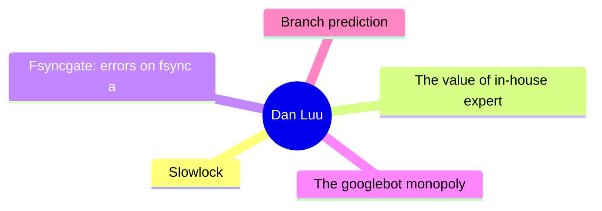
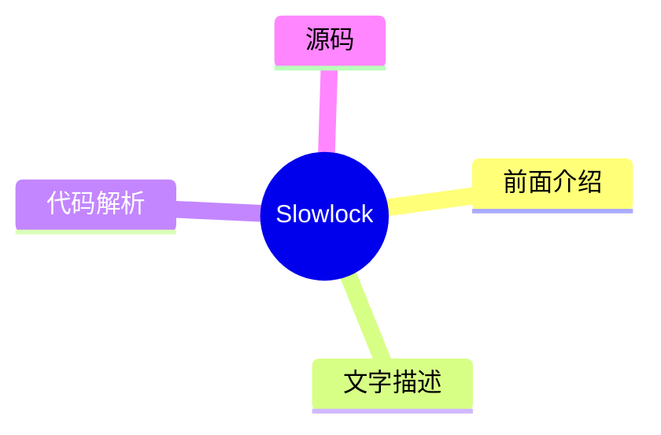
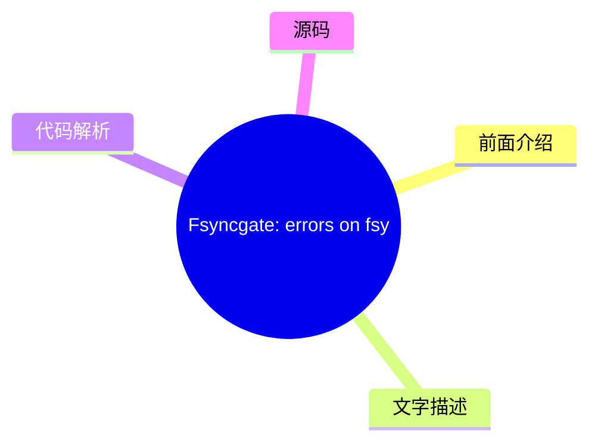
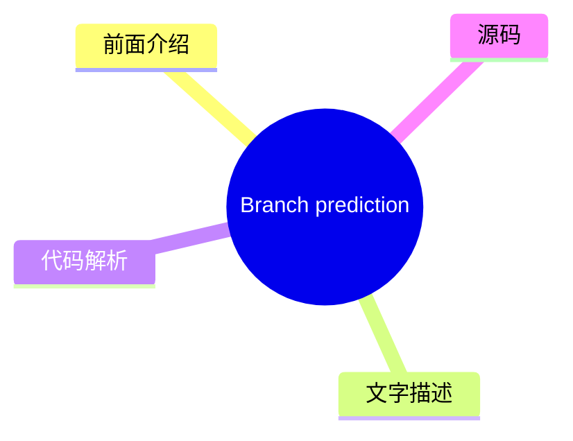

# 🔍 Dan Luu Top 5 (2026-08-06)

## 前面介绍

- 数据源：Dan Luu
- 抓取日期：2026-08-06
- 条目数：5
- 含完整正文：5
- 含代码片段：3
- 组织方式：前面介绍 / 树状图 / 文字描述 / 代码解析 / 源码

## 思维导图



## 详细整理（5 条，5 条含全文，3 条含代码）

### 1. Slowlock
- **链接**: [https://danluu.com/limplock/](https://danluu.com/limplock/)
- **发布**: Wed, 30 Sep 2015 00:00:00 +0000

#### 前面介绍

- Every once in awhile, you hear a story like “there was a case of a 1-Gbps NIC card on a machine that suddenly was transmitting only at 1 Kbps, which then caused a chain reaction upstream in such a way that the performance of the entire workload of a
- 发布时间：Wed, 30 Sep 2015 00:00:00 +0000

#### 树状图



#### 文字描述

- Every once in awhile, you hear a story like “there was a case of a 1-Gbps NIC card on a machine that suddenly was transmitting only at 1 Kbps, which then caused a chain reaction upstream in such a way that the performance of the entire workload of a 100-node cluster was crawling at a snail's pace, effectively making the system unavailable for all practical purposes”. The storie

#### 代码解析

- 本文未检测到明确代码块，内容更偏新闻、观点或方法论。

#### 源码

#### 中文节选

Every once in awhile, you hear a story like “there was a case of a 1-Gbps NIC card on a machine that suddenly was transmitting only at 1 Kbps, which then caused a chain reaction upstream in such a way that the performance of the entire workload of a 100-node cluster was crawling at a snail's pace, effectively making the system unavailable for all practical purposes”. The stories are interesting and the postmortems are fun to read, but it's not really clear how vulnerable systems are to this kind of failure or how prevalent these failures are.

 The situation reminds me of distributed systems failures before [Jepsen](https://aphyr.com/tags/jepsen). There are lots of anecdotal horror stories, but a common response to those is “works for me”, even when talking about systems that are now known to be fantastically broken. A handful of companies that are really serious about correctness have good tests and metrics, but they mostly don't talk about them publicly, and the general public has no easy way of figuring out if the systems they're running are sound.

  Thanh Do et al. have tried to look at this systematically -- [what's the effect of hardware that's been crippled but not killed](http://ucare.cs.uchicago.edu/pdf/socc13-limplock.pdf), and [how often does this happen in practice](http://ucare.cs.uchicago.edu/pdf/socc14-cbs.pdf)? It turns out that a lot of commonly used systems aren't robust against against “limping” hardware, but that the incidence of these types of failures are rare (at least until you have unreasonably large scale).

 The effect of a single slow node can be [quite dramatic](http://pages.cs.wisc.edu/~thanhdo/pdf/talk-socc-limplock.pdf):

 The job completion rate slowed down from 172 jobs per hour to 1 job per hour, effectively killing the entire cluster. Facebook has mechanisms to deal with dead machines, but they apparently didn't have any way to deal with slow machines at the time.

 When Do et al. looked at widely used open source software (HDFS, Hadoop, ZooKeeper, Cassandra, and HBase), they found similar problems.


每个子图代表不同的故障条件。F 代表 HDFS，H 代表 Hadoop，Z 代表 Zookeeper，C 代表 Cassandra，B 代表 HBase。最左侧（白色）的条形是基准无故障情况。向右移动，下一个是崩溃，随后的条形是单个降级但未崩溃硬件的结果（越靠右意味着越慢）。在大多数（但并非全部）情况下，降级硬件对性能的影响远大于故障硬件。请注意，这些图表都是对数刻度；向上增加一个刻度意味着性能相差 10 倍！

 奇怪的是，故障磁盘可能会导致某些操作加速。这是因为如果副本失效，某些操作的复制开销会更小。对我来说这有点奇怪，因为系统既需要找到替换副本又要复制数据，却似乎没有更多的开销，但我又知道些什么呢？

 无论如何，为什么慢节点比死节点糟糕得多？

#### 完整正文（中文）

Every once in awhile, you hear a story like “there was a case of a 1-Gbps NIC card on a machine that suddenly was transmitting only at 1 Kbps, which then caused a chain reaction upstream in such a way that the performance of the entire workload of a 100-node cluster was crawling at a snail's pace, effectively making the system unavailable for all practical purposes”. The stories are interesting and the postmortems are fun to read, but it's not really clear how vulnerable systems are to this kind of failure or how prevalent these failures are.

 The situation reminds me of distributed systems failures before [Jepsen](https://aphyr.com/tags/jepsen). There are lots of anecdotal horror stories, but a common response to those is “works for me”, even when talking about systems that are now known to be fantastically broken. A handful of companies that are really serious about correctness have good tests and metrics, but they mostly don't talk about them publicly, and the general public has no easy way of figuring out if the systems they're running are sound.

  Thanh Do et al. have tried to look at this systematically -- [what's the effect of hardware that's been crippled but not killed](http://ucare.cs.uchicago.edu/pdf/socc13-limplock.pdf), and [how often does this happen in practice](http://ucare.cs.uchicago.edu/pdf/socc14-cbs.pdf)? It turns out that a lot of commonly used systems aren't robust against against “limping” hardware, but that the incidence of these types of failures are rare (at least until you have unreasonably large scale).

 The effect of a single slow node can be [quite dramatic](http://pages.cs.wisc.edu/~thanhdo/pdf/talk-socc-limplock.pdf):

 The job completion rate slowed down from 172 jobs per hour to 1 job per hour, effectively killing the entire cluster. Facebook has mechanisms to deal with dead machines, but they apparently didn't have any way to deal with slow machines at the time.

 When Do et al. looked at widely used open source software (HDFS, Hadoop, ZooKeeper, Cassandra, and HBase), they found similar problems.


每个子图代表一种不同的故障条件。F 是 HDFS，H 是 Hadoop，Z 是 Zookeeper，C 是 Cassandra，B 是 HBase。最左侧（白色）的条形图是基准的无故障情况。向右移动，下一个是崩溃，随后的条形图是单个降级但未崩溃硬件的结果（越靠右意味着越慢）。在大多数（但并非全部）情况下，降级硬件对性能的影响远大于故障硬件。请注意，这些图表都是对数刻度；向上增加一个刻度意味着性能相差 10 倍！

 奇怪的是，故障的磁盘可能会导致某些操作加速。这是因为有些操作如果副本失败，其复制开销会更小。对我来说这似乎有点奇怪，因为系统既必须找到替换副本又要复制数据，却似乎没有更多的开销，但我又知道些什么呢？

 无论如何，为什么慢节点比死节点糟糕得多？作者定义了三种故障模式并解释了每种模式的原因。有操作迟滞锁，当操作变慢是因为操作的某个子部分变慢（例如，磁盘读取变慢是因为磁盘降级），节点迟滞锁，当节点即使对于看似无关的操作也变慢（例如，从 RAM 读取变慢是因为磁盘降级），以及集群迟滞锁，即整个集群变慢（例如，单个降级磁盘导致整个 1000 台机器的集群变慢）。

 这些是如何发生的？

 #### 操作迟滞锁

 这是最简单的一种。如果你尝试从磁盘读取，而你的磁盘很慢，那么你的磁盘读取就会很慢。在现实世界中，当操作存在单点故障，以及监控设计用于处理完全故障而不是降级性能时，我们会看到这种情况。例如，HBase 访问一个区域会通过负责该区域的服务器进行。数据在 HDFS 上复制，但如果拥有数据的节点正在迟滞，这对您没有帮助。说到 HDFS，它的超时时间是 60 秒，读取是以 64K 块进行的，这意味着在 HDFS 切换到健康节点之前，你的读取速度可能会慢到接近 1K/s。

 #### 节点迟滞锁

 How can it be the case that (for example) a slow disk causes memory reads to be slow? Looking at HDFS again, it uses a thread pool. If every thread is busy very slowly completing a disk read, memory reads will block until a thread gets free.

 This isn't only an issue when using limited thread pools or other bounded abstractions -- the reality is that machines have finite resources, and unbounded abstractions will run into machine limits if they aren't carefully designed to avoid the possibility. For example, Zookeeper keeps queue of operations, and a slow follower can cause the leader's queue to exhaust physical memory.

 #### Cluster Limplock

 An entire cluster can easily become unhealthy if it relies on a single primary and the primary is limping. Cascading failures can also cause this -- the first graph, where a cluster goes from completing 172 jobs an hour to 1 job an hour is actually a Facebook workload on Hadoop. The thing that's surprising to me here is that Hadoop is supposed to be tail tolerant -- individual slow tasks aren't supposed to have a large impact on the completion of the entire job. So what happened? Unhealthy nodes infect healthy nodes and eventually lock up the whole cluster.

 Hadoop's tail tolerance comes from kicking off speculative computation when results are coming in slowly. In particular, when stragglers come in unusually slowly compared to other results. This works fine when a reduce node is limping (subgraph H2), but when a [map node](http://static.googleusercontent.com/media/research.google.com/en//archive/mapreduce-osdi04.pdf) limps (subgraph H1), it can slow down all reducers in the same job, which defeats Hadoop's tail-tolerance mechanisms.


要了解原因，我们必须查看 [Hadoop 的推测算法](https://www.usenix.org/legacy/event/osdi08/tech/full_papers/zaharia/zaharia_html/index.html)。每个作业都有一个进度分数，这是一个介于 0 和 1（含）之间的数字。对于 Map 任务，分数是已读取的输入数据的比例。对于 Reduce 任务，三个阶段（从 Map 节点复制数据、排序和归约）各获得 1/3 的分数。如果一个任务已经运行了至少一分钟，且其进度分数低于其类别的平均值减去 0.2，则该作业将被推测执行。

在 H2 的情况下，网络接口卡（NIC）运行缓慢，因此 Map 阶段正常完成，因为结果最终被写入本地磁盘。但是，当 Reduce 节点尝试从运行缓慢的 Map 节点获取数据时，它们都会停滞不前，这拉低了该类别的平均分数，从而阻止了推测作业的运行。从大局来看，每个 Hadoop 节点都有有限数量的 Map 和 Reduce 任务。如果这些任务被运行缓慢的任务填满，整个节点就会锁死。由于 Hadoop 并未设计为避免级联故障，这最终会导致整个集群锁死。

我发现一件有趣的事情是，这种确切的故障原因在 2004 年发表的原始 MapReduce 论文中 [已有描述](http://research.google.com/archive/mapreduce.html)。他们甚至明确指出了慢速磁盘和网络是拖后腿者的原因，这促使了他们的推测执行算法的产生。然而，他们并没有提供该算法的细节。MapReduce 的开源克隆版本 Hadoop 试图避免同样的问题。Hadoop 最初于 2008 年发布。五年后，当我们阅读的这篇论文发表时，其内置的拖后腿者检测机制不仅未能防止多种类型的拖后腿者，还未能防止拖后腿者有效地使整个集群死锁。

### 结论

我不会详细说明每个系统在测试中的表现。论文对此有很好的详细描述，如果你感兴趣，我推荐阅读这篇论文。总结来说，Cassandra 表现相当不错，而 HDFS、Hadoop 和 HBase 则表现不佳。

Cassandra 在这两方面表现良好。首先，[2009 年的这个补丁](https://issues.apache.org/jira/browse/CASSANDRA-488) 防止了队列溢出感染健康节点，这避免了其他系统中导致集群级故障的主要故障模式。其次，所使用的架构 ([SEDA](http://www.eecs.harvard.edu/~mdw/proj/seda/)) 将不同类型的操作解耦，这使得即使某些操作出现故障，良好的操作仍能继续执行。

阅读这篇论文后，我的主要疑问是，这类故障发生的频率如何，是如何发生的，而且合理的指标/报告不应该能捕获这类事情吗？

关于第一个问题的答案，许多同一作者还发表了一篇论文，他们在其中研究了 [Cassandra、Flume、HDFS 和 ZooKeeper 中的 3000 次故障](http://ucare.cs.uchicago.edu/pdf/socc14-cbs.pdf)，并确定了哪些故障与硬件相关以及硬件故障的性质。

性能降级的情况有 14 起，与其他 410 起硬件故障相比。在其样本中，这占故障总数的 3%；虽然罕见，但并非罕见到我们可以忽视这个问题。

如果我们不能忽视这类错误，如何在它们进入生产环境之前捕获它们？该论文使用了 [Emulab 测试平台](http://www.emulab.net/)，这真的很酷。不幸的是，Emulab 页面写道“Emulab 是一个公共设施，向全球大多数研究人员免费开放。如果您不确定自己是否有资格使用，请参阅我们的政策文档或向我们咨询。如果您认为自己符合资格，可以申请启动一个新项目”。这是可以理解的，但这意味着它可能不是我们大多数人的绝佳解决方案。

 The vast majority of limping hardware is due to network or disk slowness. Why couldn't a modified version of Jepsen, or something like it, simulate disk or network slowness? A naive implementation wouldn't get anywhere near the precision of Emulab, but since we're talking about order of magnitude slowdowns, having 10% (or even 2x) variance should be ok for testing the robustness of systems against degraded hardware. There are a number of ways you could imagine that working. For example, to simulate a slow network on linux, you could try throttling [via qdisc](http://linux-ip.net/articles/Traffic-Control-HOWTO/), [hooking syscalls via ptrace](https://github.com/majek/fluxcapacitor), etc. For a slow CPU, you can rate-limit via cgroups and cpu.shares, or just map the process to UC memory (or maybe WT or WC if that's a bit too slow), and so on and so forth for disk and other failure modes.

 That leaves my last question, shouldn't systems already catch these sorts of failures even if they're not concerned about them in particular? As we saw above, systems with cripplingly slow hardware are rare enough that we can just treat them as dead without significantly impacting our total compute resources. And systems with crippled hardware can be detected pretty straightforwardly. Moreover, multi-tenant systems have to do [continuous monitoring of their own performance to get good utilization](//danluu.com/new-cpu-features/#partitioning) anyway.


那么，为什么我们要关心设计对“跛行硬件”具有鲁棒性的系统呢？答案的一部分是纵深防御。当然，我们应该有监控，但也应该有在监控失效时依然稳健的系统，因为监控必然会失效。答案的另一部分在于，通过使系统对跛行硬件更具容忍度，我们也会使它们对多租户环境中来自其他工作负载的干扰更具容忍度。最后一点多少有些推测性的实证问题——有可能，设计对同一机器上竞争工作负载的干扰不特别稳健的系统反而更高效，同时使用[更好的分区](//danluu.com/intel-cat/)来避免干扰。

 

 

 感谢 Leah Hanson、Hari Angepat、Laura Lindzey、Julia Ev


### 2. The value of in-house expertise
- **链接**: [https://danluu.com/in-house/](https://danluu.com/in-house/)
- **发布**: Wed, 29 Sep 2021 00:00:00 +0000

#### 前面介绍

- An alternate title for this post might be, &quot;Twitter has a kernel team!?&quot;. At this point, I've heard that surprised exclamation enough that I've lost count of the number times that's been said to me (I'd guess that it's more than ten but les
- 发布时间：Wed, 29 Sep 2021 00:00:00 +0000

#### 树状图


#### 文字描述

- An alternate title for this post might be, "Twitter has a kernel team!?". At this point, I've heard that surprised exclamation enough that I've lost count of the number times that's been said to me (I'd guess that it's more than ten but less than a hundred). If we look at trendy companies that are within a couple factors of two in size of Twitter (in terms of either market cap 

#### 代码解析

- 本文未检测到明确代码块，内容更偏新闻、观点或方法论。

#### 源码

#### 中文节选

An alternate title for this post might be, "Twitter has a kernel team!?". At this point, I've heard that surprised exclamation enough that I've lost count of the number times that's been said to me (I'd guess that it's more than ten but less than a hundred). If we look at trendy companies that are within a couple factors of two in size of Twitter (in terms of either market cap or number of engineers), they mostly don't have similar expertise, often as a result of path dependence — because they "grew up" in the cloud, they didn't need kernel expertise to keep the lights on the way an on prem company does. While that makes it socially understandable that people who've spent their career at younger, trendier, companies, are surprised by Twitter having a kernel team, I don't think there's a technical reason for the surprise.

 Whether or not it has kernel expertise, a company Twitter's size is going to regularly run into kernel issues, from major production incidents to papercuts. Without a kernel team or the equivalent expertise, the company will muddle through the issues, running into unnecessary problems as well as taking an unnecessarily long time to mitigate incidents. As an example of a critical production incident, just because it's already been written up publicly, I'll cite [this post](https://blog.twitter.com/engineering/en_us/topics/open-source/2020/hunting-a-linux-kernel-bug), which dryly notes:

  Earlier last year, we identified a firewall misconfiguration which accidentally dropped most network traffic. We expected resetting the firewall configuration to fix the issue, but resetting the firewall configuration exposed a kernel bug

 


 What this implies but doesn't explicitly say is that this firewall misconfiguration was the most severe incident that's occured during my time at Twitter and I believe it's actually the most severe outage that Twitter has had since 2013 or so. As a company, we would've still been able to mitigate the issue without a kernel team or another team with deep Linux expertise, but it would've taken longer to understand why the initial fix didn't work, which is the last thing you want when you're debugging a serious outage. Folks on the kernel team were already familiar with the various diagnostic tools and debugging techniques necessary to quickly understand why the initial fix didn't work, which is not common knowledge at some peer companies (I polled folks at a number of similar-scale peer companies to see if they thought they had at least one person with the knowledge necessary to quickly debug the bug and the answer was no at many companies).

 Another reason to have in-house expertise in various areas is that they easily pay for themselves, which is a special case of [the generic argument that large companies should be larger than most people expect because tiny percentage gains are worth a large amount in absolute dollars](/sounds-easy/). If, in the lifetime of the specialist team like the kernel team, a s

#### 完整正文（中文）

An alternate title for this post might be, "Twitter has a kernel team!?". At this point, I've heard that surprised exclamation enough that I've lost count of the number times that's been said to me (I'd guess that it's more than ten but less than a hundred). If we look at trendy companies that are within a couple factors of two in size of Twitter (in terms of either market cap or number of engineers), they mostly don't have similar expertise, often as a result of path dependence — because they "grew up" in the cloud, they didn't need kernel expertise to keep the lights on the way an on prem company does. While that makes it socially understandable that people who've spent their career at younger, trendier, companies, are surprised by Twitter having a kernel team, I don't think there's a technical reason for the surprise.

 Whether or not it has kernel expertise, a company Twitter's size is going to regularly run into kernel issues, from major production incidents to papercuts. Without a kernel team or the equivalent expertise, the company will muddle through the issues, running into unnecessary problems as well as taking an unnecessarily long time to mitigate incidents. As an example of a critical production incident, just because it's already been written up publicly, I'll cite [this post](https://blog.twitter.com/engineering/en_us/topics/open-source/2020/hunting-a-linux-kernel-bug), which dryly notes:

  Earlier last year, we identified a firewall misconfiguration which accidentally dropped most network traffic. We expected resetting the firewall configuration to fix the issue, but resetting the firewall configuration exposed a kernel bug

 


 What this implies but doesn't explicitly say is that this firewall misconfiguration was the most severe incident that's occured during my time at Twitter and I believe it's actually the most severe outage that Twitter has had since 2013 or so. As a company, we would've still been able to mitigate the issue without a kernel team or another team with deep Linux expertise, but it would've taken longer to understand why the initial fix didn't work, which is the last thing you want when you're debugging a serious outage. Folks on the kernel team were already familiar with the various diagnostic tools and debugging techniques necessary to quickly understand why the initial fix didn't work, which is not common knowledge at some peer companies (I polled folks at a number of similar-scale peer companies to see if they thought they had at least one person with the knowledge necessary to quickly debug the bug and the answer was no at many companies).

 Another reason to have in-house expertise in various areas is that they easily pay for themselves, which is a special case of [the generic argument that large companies should be larger than most people expect because tiny percentage gains are worth a large amount in absolute dollars](/sounds-easy/). If, in the lifetime of the specialist team like the kernel team, a single person found something that persistently reduced [TCO](https://en.wikipedia.org/wiki/Total_cost_of_ownership) by 0.5%, that would pay for the team in perpetuity, and Twitter’s kernel team has found many such changes. In addition to [kernel patches](https://patchwork.ozlabs.org/project/netdev/list/?submitter=211&state=*&archive=both¶m=4&page=1) that sometimes have that kind of impact, people will also find configuration issues, etc., that have that kind of impact.


到目前为止，我只谈到了内核团队，因为那是唯一一个仅仅因为存在就会让很多人感到惊讶的团队，但当我告诉人们 Twitter 拥有一大批曾在 HotSpot 工作的 Sun JVM 专家时，比如 Ramki Ramakrishna、Tony Printezis 和 John Coomes，我也得到了类似的反应。人们会纳闷，一家社交媒体公司为什么需要如此深厚的 JVM 专业知识。就像内核团队一样，我们这样规模的公司在使用 JVM 时会遇到各种奇怪的问题和 JVM Bug，拥有具备深厚专业知识的人员来调试这些问题会很有帮助。而且，就像内核团队一样，对 JVM 的单独优化可以永久地为团队创造价值。一个具体的例子是 [Flavio Brasil 的这个补丁，它虚拟化了比较交换调用](https://github.com/oracle/graal/pull/636)。

这种情况的背景是 Twitter 使用了大量 Scala。尽管有各种说法与此相反，但 Scala 比起 Java 消耗更多的内存，并且明显更慢，如果你大规模使用 Scala，这会产生显著的代价，足以证明进行优化工作以减少惯用 Scala 和惯用 Java 之间的性能差距是合理的。

在应用该补丁之前，如果你对我们的 Scala 代码进行性能分析，你会发现 Future/Promise 占用了不成比例的大量时间，即使在你可能天真地认为编译器会优化掉这些工作的情况下也是如此。其中一个原因是 Future 使用了 [比较交换](https://en.wikipedia.org/wiki/Compare-and-swap) (CAS) 操作，这对 JVM 优化来说是不可见的。上面链接的补丁在 Future 没有逃逸方法作用域时避免了 CAS 操作。[这个配套补丁](https://github.com/twitter/util/commit/3245a8e1a98bd5eb308f366678528879d7140f5e) 移除了某些不太适合编译器优化的地方的 CAS 操作。这两个补丁结合在一起，将典型的主要 Twitter 服务使用惯用 Scala 的成本降低了 5% 到 15%，永久地多次为 JVM 团队创造了价值，而这甚至还不是 Flavio 那一年发现的最大收益。

 I'm not going to do a team-by-team breakdown of teams that pay for themselves many times over because there are so many of them, even if I limit the scope to "teams that people are surprised that Twitter has".

 A related topic is how people talk about "buy vs. build" discussions. I've seen a number of discussions where someone has argued for "buy" because that would obviate the need for expertise in the area. This can be true, but I've seen this argued for much more often than it is true. An example where I think this tends to be untrue is with distributed tracing. [We've previously looked at some ways Twitter gets value out of tracing](/tracing-analytics/), which came out of the vision Rebecca Isaacs put into place. On the flip side, when I talk to people at peer companies with similar scale, most of them have not (yet?) succeeded at getting significant value from distributed tracing. This is so common that I see a viral Twitter thread about how useless distributed tracing is more than once a year. Even though we went with the more expensive "build" option, just off the top of my head, I can think of multiple uses of tracing that have returned between 10x and 100x the cost of building out tracing, whereas people at a number of companies that have chosen the cheaper "buy" option commonly complain that tracing isn't worth it.


 Coincidentally, I was just talking about this exact topic to Pam Wolf, a civil engineering professor with experience in (civil engineering) industry on multiple continents, who had a related opinion. For large scale systems (projects), you need an in-house expert (owner's-side engineer) for each area that you don't handle in your own firm. While it's technically possible to hire yet another firm to be the expert, that's more expensive than developing or hiring in-house expertise and, in the long run, also more risky. That's pretty analogous to my experience working as an electrical engineer as well, where orgs that outsource functions to other companies without retaining an in-house expert pay a very high cost, and not just monetarily. They often ship sub-par designs with long delays on top of having high costs. "Buying" can and often does reduce the amount of expertise necessary, but it often doesn't remove the need for expertise.


这与另一个常见的抽象论点有关，该论点认为公司应该专注于“它们的比较优势”或“最重要的问题”或“核心业务需求”，并将其他一切外包。我们已经看到了几个例子，证明这种观点并不成立，因为在足够大的规模下，拥有内部专业知识比没有更赚钱，无论某事是否是业务的核心（有人可能会争辩说，所有移入内部的事情都是业务的核心，但这会让“核心性”这一概念变得毫无意义）。这种抽象建议过于简单的另一个原因是，企业可以在某种程度上任意选择它们的优势领域。一个典型的例子是苹果将 CPU 设计纳入内部。自以 2.78 亿美元收购 PA Semi（前身为 SiByte 团队，再之前是来自 DEC 的团队）以来，苹果一直在以相当大的优势生产[手机和笔记本电脑功耗范围内的最佳芯片](https://twitter.com/danluu/status/1433297089866383364)。但在收购之前，苹果没有任何东西使得收购成为必然，使得 CPU 设计成为苹果固有的比较优势。但如果一家公司可以选择一个领域并将其变成比较优势领域，那么说这家公司应该专注于其比较优势并不是很有用的建议。

 2.78 亿美元从绝对意义上讲是一笔巨款，但作为苹果资源的一部分，这微不足道，而且较小的公司也可以通过投入一小部分资源来开展尖端工作，例如，Twitter 以任何一家 1 亿美元的公司都能负担得起的价格，[创造了新颖的缓存算法和数据结构](https://twitter.com/danluu/status/1381687511362138113)，并正在开展其他前沿的缓存工作。拥有优秀的[缓存基础设施](/cache-incidents/)对于 Twitter 的业务来说，并不比为苹果创造优秀的 CPU 更核心，但它是一个杠杆，Twitter 可以利用它比其他情况下赚更多的钱。

对于小公司来说，为公司涉及的方方面面都配备内部专家是没有意义的，但在公司规模达到一定程度之前，在操作系统、语言运行时以及其他通常被认为相当专业的组件方面拥有内部专业知识就开始变得合理了。回顾 Twitter 的历史，Yao Yue 指出，在她早期在 Twitter 工作时（当时我们有约 100 名工程师），她会经常去内核团队寻求帮助以调试生产事故，而在某些情况下，如果没有内核团队的帮助，调试工作可能会轻松耗时 10 倍以上。社交媒体公司通常在每用户和每美元的基础上具有相对较高的规模，因此并非每家公司都需要在拥有 100 名工程师时具备同等程度的专业知识，但总会有其他领域并非显而易见的核心业务需求，在这些领域，专业知识即使对于拥有 100 名工程师的初创公司来说也是值得投入的。

 感谢 Ben Kuhn、Yao Yue、Pam Wolf、John Hergenroeder、Julien Kirch、Tom Brearley 和 Kevin Burke 提供评论/更正/讨论。


### 3. Fsyncgate: errors on fsync are unrecovarable
- **链接**: [https://danluu.com/fsyncgate/](https://danluu.com/fsyncgate/)
- **发布**: Wed, 28 Mar 2018 00:00:00 +0000

#### 前面介绍

- This is an archive of the original &quot;fsyncgate&quot; email thread. This is posted here because I wanted to have a link that would fit on a slide for a talk on file safety with a mobile-friendly non-bloated format.

From:Craig Ringer &lt;craig(at)
- 发布时间：Wed, 28 Mar 2018 00:00:00 +0000

#### 树状图



#### 文字描述

- *This is an archive of the original "fsyncgate" email thread. This is posted here because I wanted to have a link that would fit on a slide for *[a talk on file safety](//danluu.com/deconstruct-files/) with [a mobile-friendly non-bloated format](//danluu.com/web-bloat/). ``` From:Craig Ringer <craig(at)2ndquadrant(dot)com> Subject:Re: PostgreSQL's handling of fsync() errors is 

#### 代码解析

- `text`: 这段更像查询逻辑，重点看过滤条件、聚合方式和性能影响。
- `text`: 这段更像查询逻辑，重点看过滤条件、聚合方式和性能影响。
- `text`: 这段更像查询逻辑，重点看过滤条件、聚合方式和性能影响。

#### 源码

#### 源码片段 1（text）

```text
From:Craig Ringer <craig(at)2ndquadrant(dot)com>
Subject:Re: PostgreSQL's handling of fsync() errors is unsafe and risks data loss at least on XFS
Date:2018-03-28 02:23:46
```

#### 源码片段 2（text）

```text
From:Tom Lane <tgl(at)sss(dot)pgh(dot)pa(dot)us>
Date:2018-03-28 03:53:08
```

#### 源码片段 3（text）

```text
From:Michael Paquier <michael(at)paquier(dot)xyz>
Date:2018-03-29 02:30:59
```

#### 完整正文（中文）

*这是原始“fsyncgate”邮件线程的存档。我将其发布在这里，是因为我想要一个适合幻灯片的链接，用于 *[关于文件安全的演讲](//danluu.com/deconstruct-files/)* 以及 *[一个移动端友好且无臃肿的格式](//danluu.com/web-bloat/)*。

 ```
From:Craig Ringer <craig(at)2ndquadrant(dot)com>
Subject:Re: PostgreSQL's handling of fsync() errors is unsafe and risks data loss at least on XFS
Date:2018-03-28 02:23:46
```

 Hi all

 Some time ago I ran into an issue where a user encountered data corruption after a storage error. PostgreSQL played a part in that corruption by allowing checkpoint what should've been a fatal error.

 TL;DR: Pg should PANIC on fsync() EIO return. Retrying fsync() is not OK at least on Linux. When fsync() returns success it means "all writes since the last fsync have hit disk" but we assume it means "all writes since the last SUCCESSFUL fsync have hit disk".

 Pg wrote some blocks, which went to OS dirty buffers for writeback. Writeback failed due to an underlying storage error. The block I/O layer and XFS marked the writeback page as failed (AS_EIO), but had no way to tell the app about the failure. When Pg called fsync() on the FD during the next checkpoint, fsync() returned EIO because of the flagged page, to tell Pg that a previous async write failed. Pg treated the checkpoint as failed and didn't advance the redo start position in the control file.

 All good so far.

 But then we retried the checkpoint, which retried the fsync(). The retry succeeded, because the prior fsync() *cleared the AS_EIO bad page flag*.

 The write never made it to disk, but we completed the checkpoint, and merrily carried on our way. Whoops, data loss.

 The clear-error-and-continue behaviour of fsync is not documented as far as I can tell. Nor is fsync() returning EIO unless you have a very new linux man-pages with the patch I wrote to add it. But from what I can see in the POSIX standard we are not given any guarantees about what happens on fsync() failure at all, so we're probably wrong to assume that retrying fsync( ) is safe.

 If the server had been using ext3 or ext4 with errors=remount-ro, the problem wouldn't have occurred because the first I/O error would've remounted the FS and stopped Pg from continuing. But XFS doesn't have that option. There may be other situations where this can occur too, involving LVM and/or multipath, but I haven't comprehensively dug out the details yet.

 It proved possible to recover the system by faking up a backup label from before the first incorrectly-successful checkpoint, forcing redo to repeat and write the lost blocks. But ... what a mess.

 I posted about the underlying fsync issue here some time ago:

 [https://stackoverflow.com/q/42434872/398670](https://stackoverflow.com/q/42434872/398670)

 but haven't had a chance to follow up about the Pg specifics.

 I've been looking at the problem on and off and haven't come up with a good answer. I think we should just PANIC and let redo sort it out by repeating the failed write when it repeats work since the last checkpoint.

 The API offered by async buffered writes and fsync offers us no way to find out which page failed, so we can't just selectively redo that write. I think we do know the relfilenode associated with the fd that failed to fsync, but not much more. So the alternative seems to be some sort of potentially complex online-redo scheme where we replay WAL only the relation on which we had the fsync() error, while otherwise servicing queries normally. That's likely to be extremely error-prone and hard to test, and it's trying to solve a case where on other filesystems the whole DB would grind to a halt anyway.

 I looked into whether we can solve it with use of the AIO API instead, but the mess is even worse there - from what I can tell you can't even reliably guarantee fsync at all on all Linux kernel versions.

 We already PANIC on fsync() failure for WAL segments. We just need to do the same for data forks at least for EIO. This isn't as bad as it seems because AFAICS fsync only returns EIO in cases where we should be stopping the world anyway, and many FSes will do that for us.


有很多 pg_fsync() 调用者。虽然我们可以针对每一个单独处理这种情况，但我很倾向于直接让 pg_fsync() 本身拦截 EIO 并 PANIC。有什么想法吗？

```
From:Tom Lane <tgl(at)sss(dot)pgh(dot)pa(dot)us>
Date:2018-03-28 03:53:08
```

 Craig Ringer 写道：

  TL;DR：Pg 应该在 fsync() 返回 EIO 时 PANIC。

 

 你一定是在开玩笑。

  在 Linux 上重试 fsync() 是不可接受的。当 fsync() 返回成功时，它的意思是“自上次 fsync 以来所有的写入都已到达磁盘”，但我们假设它的意思是“自上次成功的 fsync 以来所有的写入都已到达磁盘”。

 

 如果真的是这样，我们需要抵制这种内核的脑损伤，因为正如你所描述的那样，fsync 将完全毫无用处。

 此外，POSIX 明确指出，成功的 fsync 意味着该文件的所有先前写入都已完成，到此为止，无论它们是在何时发出的。

 
```
From:Michael Paquier <michael(at)paquier(dot)xyz>
Date:2018-03-29 02:30:59
```

 在 2018 年 3 月 27 日 23:53:08 -0400，Tom Lane 写道：

  Craig Ringer 写道：

  TL;DR：Pg 应该在 fsync() 返回 EIO 时 PANIC。

 

 你一定是在开玩笑。

 

 后端代码中 pg_fsync 的任何调用者都足够小心地检查返回的状态，有时会像在 mdsync 中那样进行重试，所以这里提议的做法将是一种倒退。

 
```
From:Thomas Munro <thomas(dot)munro(at)enterprisedb(dot)com>
Date:2018-03-29 02:48:27
```

 在 2018 年 3 月 29 日下午 3:30，Michael Paquier 写道：

  在 2018 年 3 月 27 日 23:53:08 -0400，Tom Lane 写道：

  Craig Ringer 写道：

  TL;DR：Pg 应该在 fsync() 返回 EIO 时 PANIC。

 

 你一定是在开玩笑。

 

 后端代码中 pg_fsync 的任何调用者都足够小心地检查返回的状态，有时会像在 mdsync 中那样进行重试，所以这里提议的做法将是一种倒退。

 

 Craig，你描述的现象与本文讨论的第二个问题“Reporting writeback errors”（报告回写错误）是同一个吗？

 [https://lwn.net/Articles/724307/](https://lwn.net/Articles/724307/)

 “当前的内核可能会在 fsync() 调用上报告回写错误，但这种情况有多种失败方式。”

 那个……我无语了。

```
From:Justin Pryzby <pryzby(at)telsasoft(dot)com>
Date:2018-03-29 05:00:31
```

 On Thu, Mar 29, 2018 at 11:30:59AM +0900, Michael Paquier wrote:

  On Tue, Mar 27, 2018 at 11:53:08PM -0400, Tom Lane wrote:

  Craig Ringer  writes:

  TL;DR: Pg 应该在 fsync() 返回 EIO 时 PANIC。

 

 肯定是在开玩笑。

 

 后端代码中调用 pg_fsync 的任何调用者都足够小心地检查返回状态，有时像 mdsync 那样进行重试，所以这里提议的内容将是一个倒退。

 

 重试是问题的根源；第一次 fsync() 可能会返回 EIO，并且还会*清除错误*，导致第二次 fsync（针对相同数据）返回成功。

 （注意，我可以看到 PANIC on EIO 但对 ENOSPC 重试可能是有用的）。

 On Thu, Mar 29, 2018 at 03:48:27PM +1300, Thomas Munro wrote:

  Craig，你描述的现象是否与本文讨论的第二个问题“Reporting writeback errors”（报告回写错误）相同？[https://lwn.net/Articles/724307/](https://lwn.net/Articles/724307/)

 

 更糟糕的是，该文章承认了这种行为，但似乎没有建议更改它：

 “将该值存储在文件结构中有一个重要好处：它使得有可能向调用 FSYNC() 的每个进程报告一次回写错误 .... 在当前内核中，只有在错误发生后第一次调用者才有机会看到该错误信息。”

 我相信我使用 dmsetup "error" 目标重现了问题行为，见附件。

 strace 看起来是这样的：

 kernel is Linux 4.10.0-28-generic #32~16.04.2-Ubuntu SMP Thu Jul 20 10:19:48 UTC 2017 x86_64 x86_64 x86_64 GNU/Linux

 ```
1open("/dev/mapper/eio", O_RDWR|O_CREAT, 0600) = 3
2write(3, "\0\0\0\0\0\0\0\0\0\0\0\0\0\0\0\0\0\0\0\0\0\0\0\0\0\0\0\0\0\0\0\0"..., 8192) = 8192
3write(3, "\0\0\0\0\0\0\0\0\0\0\0\0\0\0\0\0\0\0\0\0\0\0\0\0\0\0\0\0\0\0\0\0"..., 8192) = 8192
4write(3, "\0\0\0\0\0\0\0\0\0\0\0\0\0\0\0\0\0\0\0\0\0\0\0\0\0\0\0\0\0\0\0\0"..., 8192) = 8192
5write(3, "\0\0\0\0\0\0\0\0\0\0\0\0\0\0\0\0\0\0\0\0\0\0\0\0\0\0\0\0\0\0\0\0"..., 8192) = 8192
6write(3, "\0\0\0\0\0\0\0\0\0\0\0\0\0\0\0\0\0\0\0\0\0\0\0\0\0\0\0\0\0\0\0\0"..., 8192) = 8192

7write(3, "\0\0\0\0\0\0\0\0\0\0\0\0\0\0\0\0\0\0\0\0\0\0\0\0\0\0\0\0\0\0\0\0"..., 8192) = 8192
8write(3, "\0\0\0\0\0\0\0\0\0\0\0\0\0\0\0\0\0\0\0\0\0\0\0\0\0\0\0\0\0\0\0\0"..., 8192) = 2560
9write(3, "\0\0\0\0\0\0\0\0\0\0\0\0\0\0\0\0\0\0\0\0\0\0\0\0\0\0\0\0\0\0\0\0"..., 8192) = -1 ENOSPC (No space left on device)
10dup(2)                                  = 4
11fcntl(4, F_GETFL)                       = 0x8402 (flags O_RDWR|O_APPEND|O_LARGEFILE)
12brk(NULL)                               = 0x1299000
13brk(0x12ba000)                          = 0x12ba000
14fstat(4, {st_mode=S_IFCHR|0620, st_rdev=makedev(136, 2), ...}) = 0
15write(4, "write(1): No space left on devic"..., 34write(1): No space left on device
16) = 34
17close(4)                                = 0
18fsync(3)                                = -1 EIO (Input/output error)
19dup(2)                                  = 4
20fcntl(4, F_GETFL)                       = 0x8402 (flags O_RDWR|O_APPEND|O_LARGEFILE)
21fstat(4, {st_mode=S_IFCHR|0620, st_rdev=makedev(136, 2), ...}) = 0
22write(4, "fsync(1): Input/output error\n", 29fsync(1): Input/output error
23) = 29
24close(4)                                = 0
25close(3)                                = 0
26open("/dev/mapper/eio", O_RDWR|O_CREAT, 0600) = 3
27fsync(3)                                = 0
28write(3, "\0", 1)                       = 1
29fsync(3)                                = 0
30exit_group(0)                           = ?

 2: EIO isn't seen initially due to writeback page cache;

 9: ENOSPC due to small device

 18: original IO error reported by fsync, good

 25: the original FD is closed

 26: ..and file reopened

 27: fsync on file with still-dirty data+EIO returns success BAD

 10, 19: I'm not sure why there's dup(2), I guess glibc thinks that perror should write to a separate FD (?)

 Also note, close() ALSO returned success..which you might think exonerates the 2nd fsync(), but I think may itself be problematic, no? In any case, the 2nd byte certainly never got written to DM error, and the failure status was lost following fsync().

 I get the exact same behavior if I break after one write() loop, such as to avoid ENOSPC.

 

 ```

From:Thomas Munro <thomas(dot)munro(at)enterprisedb(dot)com>
Date:2018-03-29 05:06:22
```

 On Thu, Mar 29, 2018 at 6:00 PM, Justin Pryzby  wrote:

  The retries are the source of the problem ; the first fsync() can return EIO, and also *clears the error* causing a 2nd fsync (of the same data) to return success.

 

 What I'm failing to grok here is how that error flag even matters, whether it's a single bit or a counter as described in that patch. If write back failed, *the page is still dirty*. So all future calls to fsync() need to try to try to flush it again, and (presumably) fail again (unless it happens to succeed this time around).

 

 ```
From:Craig Ringer <craig(at)2ndquadrant(dot)com>
Date:2018-03-29 05:25:51
```

 On 29 March 2018 at 13:06, Thomas Munro  wrote:

  On Thu, Mar 29, 2018 at 6:00 PM, Justin Pryzby  wrote:

  The retries are the source of the problem ; the first fsync() can return EIO, and also *clears the error* causing a 2nd fsync (of the same data) to return success.

 

 What I'm failing to grok here is how that error flag even matters, whether it's a single bit or a counter as described in that patch. If write back failed, *the page is still dirty*. So all future calls to fsync() need to try to try to flush it again, and (pre

...（截断，原文 516759+ 字符）


### 4. The googlebot monopoly
- **链接**: [https://danluu.com/googlebot-monopoly/](https://danluu.com/googlebot-monopoly/)
- **发布**: Wed, 27 May 2015 00:00:00 +0000

#### 前面介绍

- TIL that Bell Labs and a whole lot of other websites block archive.org, not to mention most search engines. Turns out I have a broken website link in a GitHub repo, caused by the deletion of an old webpage. When I tried to pull the original from arch
- 发布时间：Wed, 27 May 2015 00:00:00 +0000

#### 树状图


#### 文字描述

- TIL that Bell Labs and a whole lot of other websites block archive.org, not to mention most search engines. Turns out I have [a broken website link](https://github.com/danluu/debugging-stories/issues/3) in a GitHub repo, caused by the deletion of an old webpage. When I tried to pull the original from archive.org, I found that it's not available because Bell Labs blocks the arch

#### 代码解析

- `text`: 更偏接口调用示例，适合作为接入或联调样例。

#### 源码

#### 源码片段 1（text）

```text
User-agent: Googlebot
User-agent: msnbot
User-agent: LSgsa-crawler
Disallow: /RealAudio/
Disallow: /bl-traces/
Disallow: /fast-os/
Disallow: /hidden/
Disallow: /historic/
Disallow: /incoming/
Disallow: /inferno/
Disallow: /magic/
Disallow: /netlib.depend/
Disallow: /netlib/
Disallow: /p9trace/
Disallow: /plan9/sources/
Disallow: /sources/
Disallow: /tmp/
Disallow: /tripwire/
Visit-time: 0700-1200
Request-rate: 1/5
Crawl-delay: 5
User-agent: *
Disallow: /
```

#### 完整正文（中文）

我才知道贝尔实验室和很多其他网站都屏蔽了 archive.org，更不用说大多数搜索引擎了。结果我在一个 GitHub 仓库里发现了一个[损坏的网站链接](https://github.com/danluu/debugging-stories/issues/3)，这是由一个旧网页被删除引起的。当我尝试从 archive.org 拉取原始内容时，发现它不可用，因为贝尔实验室在他们的 robots.txt 中屏蔽了 archive.org 的爬虫：

  ```
User-agent: Googlebot
User-agent: msnbot
User-agent: LSgsa-crawler
Disallow: /RealAudio/
Disallow: /bl-traces/
Disallow: /fast-os/
Disallow: /hidden/
Disallow: /historic/
Disallow: /incoming/
Disallow: /inferno/
Disallow: /magic/
Disallow: /netlib.depend/
Disallow: /netlib/
Disallow: /p9trace/
Disallow: /plan9/sources/
Disallow: /sources/
Disallow: /tmp/
Disallow: /tripwire/
Visit-time: 0700-1200
Request-rate: 1/5
Crawl-delay: 5
User-agent: *
Disallow: /
```

事实上，贝尔实验室不仅屏蔽了 Internet Archiver 爬虫，它还屏蔽了除 Googlebot、msnbot 和它们自己的企业爬虫之外的所有爬虫。而且 msnbot 在[五年前](http://en.wikipedia.org/wiki/Msnbot)就已经被 bingbot 取代了！

使用一个只在贝尔实验室能找到的术语（例如“This is a start at making available some of the material from the Tenth Edition Research Unix manual.”）进行快速搜索，发现 bing 索引了该页面；要么是 bingbot 遵循了某些 msnbot 的规则，要么是 msnbot 仍然独立运行并索引像贝尔实验室这样的网站，这些网站屏蔽了 bingbot 但没有屏蔽 msnbot。幸运的是，在这种情况下，很多搜索引擎（如 Yahoo 和 DDG）都使用 Bing 的结果，所以贝尔实验室并没有从非 Google 的互联网中消失，但如果你是[使用 Yandex 的 55% 的俄罗斯人之一](http://en.wikipedia.org/wiki/Yandex#cite_note-13)，那你可就倒大霉了。

而且这还只是相对较好的情况，即允许一个非 Google 的爬虫运行。看到只允许 Googlebot 的 robots.txt 文件并不罕见。运行[一个竞争对手搜索引擎](http://blog.nullspace.io/building-search-engines.html)并阻止 Google 的垄断已经够难了，更不用说还要面对网站屏蔽非 Google 爬虫的情况。我们不需要让情况变得更糟，也不需要意外屏蔽 Internet Archive 爬虫。

P.S. 当你检查 robots.txt 是否屏蔽了除 Google 以外的所有人时，也考虑检查一下你的 CPUID 检查，确保你使用的是功能标志，而不是屏蔽除 Intel 和 AMD 以外的所有人[而不是屏蔽除 Intel 和 AMD 以外的所有人](https://twitter.com/danluu/status/1203450367515615233)。

顺便说一句，我确实认为有正当理由屏蔽爬虫，包括 archive.org，但我认为许多 Web 开发者的常见默认做法——即屏蔽除 googlebot 以外的所有人——并不是真的打算屏蔽竞争对手搜索引擎以及 archive.org。

2021 年更新：自从这篇文章首次发布以来，archive.org 开始忽略 robots.txt 中的屏蔽指令，并归档那些在 robots.txt 中被屏蔽的帖子。我听说一些竞争对手搜索引擎也在做同样的事情，因此这种对 robots.txt 的误用——即网站屏蔽除 googlebot 以外的所有人——正在慢慢让 robots.txt 逐渐变得毫无用处，就像浏览器在用户代理字符串中识别为所有浏览器一样，以绕过那些错误屏蔽它们认为不兼容的浏览器的网站。

相关的一点是，网站有时会因为一时生气而屏蔽竞争对手搜索引擎，比如 Bing，但他们不会对 Google 这样做，因为 Google 为他们提供了太多的流量，以至于他们无法逃脱这种后果，例如，[Discourse 因为 Bing 以 0.46 QPS 的速度抓取 Discourse 而感到恼火，于是屏蔽了 Bing](https://twitter.com/danluu/status/981992814824378369)。


### 5. Branch prediction
- **链接**: [https://danluu.com/branch-prediction/](https://danluu.com/branch-prediction/)
- **发布**: Wed, 23 Aug 2017 00:00:00 +0000

#### 前面介绍

- This is a pseudo-transcript for a talk on branch prediction given at Two Sigma on 8/22/2017 to kick off &quot;localhost&quot;, a talk series organized by RC.

How many of you use branches in your code? Could you please raise your hand if you use if
- 发布时间：Wed, 23 Aug 2017 00:00:00 +0000

#### 树状图



#### 文字描述

- *This is a pseudo-transcript for a talk on branch prediction given at Two Sigma on 8/22/2017 to kick off "localhost", a talk series organized by *[RC](https://www.recurse.com/scout/click?t=b504af89e87b77920c9b60b2a1f6d5e8). How many of you use branches in your code? Could you please raise your hand if you use if statements or pattern matching? `Most of the audience raises their
- ### One-bit So far, we’ve look at schemes that don’t store any state, i.e., schemes where the prediction ignores the program’s execution history. These are called *static* branch prediction schemes in the literature. These schemes have the advantage of being simple but they have the disadvantage of being bad at predicting branches whose behavior change over time. If you want an

#### 代码解析

- `text`: 代码片段可作为实现参考，建议结合上下文确认输入输出和边界条件。
- `text`: 代码片段可作为实现参考，建议结合上下文确认输入输出和边界条件。
- `text`: 代码片段可作为实现参考，建议结合上下文确认输入输出和边界条件。

#### 源码

#### 源码片段 1（text）

```text
if (x == 0) {
  // Do stuff
} else {
  // Do other stuff (things)
}
  // Whatever happens later
```

#### 源码片段 2（text）

```text
branch_if_not_equal x, 0, else_label
// Do stuff
goto end_label
else_label:
// Do things
end_label:
// whatever happens later
```

#### 源码片段 3（text）

```text
branch_if_not_equal x, 0, else_label
???
```

#### 完整正文（中文）

*This is a pseudo-transcript for a talk on branch prediction given at Two Sigma on 8/22/2017 to kick off "localhost", a talk series organized by *[RC](https://www.recurse.com/scout/click?t=b504af89e87b77920c9b60b2a1f6d5e8).

 How many of you use branches in your code? Could you please raise your hand if you use if statements or pattern matching?

 `Most of the audience raises their hands`

 I won’t ask you to raise your hands for this next part, but my guess is that if I asked, how many of you feel like you have a good understanding of what your CPU does when it executes a branch and what the performance implications are, and how many of you feel like you could understand a modern paper on branch prediction, fewer people would raise their hands.

 The purpose of this talk is to explain how and why CPUs do “branch prediction” and then explain enough about classic branch prediction algorithms that you could read a modern paper on branch prediction and basically know what’s going on.

 Before we talk about branch prediction, let’s talk about why CPUs do branch prediction. To do that, we’ll need to know a bit about how CPUs work.

 For the purposes of this talk, you can think of your computer as a CPU plus some memory. The instructions live in memory and the CPU executes a sequence of instructions from memory, where instructions are things like “add two numbers”, “move a chunk of data from memory to the processor”. Normally, after executing one instruction, the CPU will execute the instruction that’s at the next sequential address. However, there are instructions called “branches” that let you change the address next instruction comes from.

 Here’s an abstract diagram of a CPU executing some instructions. The x-axis is time and the y-axis distinguishes different instructions.

 Here, we execute instruction `A`, followed by instruction `B`, followed by instruction `C`, followed by instruction `D`.


 One way you might design a CPU is to have the CPU do all of the work for one instruction, then move on to the next instruction, do all of the work for the next instruction, and so on. There’s nothing wrong with this; a lot of older CPUs did this, and some modern very low-cost CPUs still do this. But if you want to make a faster CPU, you might make a CPU that works like an assembly line. That is, you break the CPU up into two parts, so that half the CPU can do the “front half” of the work for an instruction while half the CPU works on the “back half” of the work for an instruction, like an assembly line. This is typically called a pipelined CPU.

 If you do this, the execution might look something like the above. After the first half of instruction A is complete, the CPU can work on the second half of instruction A while the first half of instruction B runs. And when the second half of A finishes, the CPU can start on both the second half of B and the first half of C. In this diagram, you can see that the pipelined CPU can execute twice as many instructions per unit time as the unpipelined CPU above.

 There’s no reason that a CPU can only be broken up into two parts. We could break the CPU into three parts, and get a 3x speedup, or four parts and get a 4x speedup. This isn’t strictly true, and we generally get less than a 3x speedup for a three-stage pipeline or 4x speedup for a 4-stage pipeline because there’s overhead in breaking the CPU up into more parts and having a deeper pipeline.

 One source of overhead is how branches are handled. One of the first things the CPU has to do for an instruction is to get the instruction; to do that, it has to know where the instruction is. For example, consider the following code:

 ```
if (x == 0) {
  // Do stuff
} else {
  // Do other stuff (things)
}
  // Whatever happens later
```

 This might turn into assembly that looks something like

 ```
branch_if_not_equal x, 0, else_label
// Do stuff
goto end_label
else_label:
// Do things
end_label:
// whatever happens later
```


在这个例子中，我们将 `x` 与 0 进行比较。`if_not_equal`，然后我们跳转到 `else_label` 并执行 else 块中的代码。如果该比较失败（即如果 `x` 为 0），我们将继续执行，执行 `if` 块中的代码，然后跳转到 `end_label` 以避免执行 `else` 块中的代码。

 对流水线来说有问题的特定指令序列是

 ```
branch_if_not_equal x, 0, else_label
???
```

 CPU 不知道这是

 ```
branch_if_not_equal x, 0, else_label
// Do stuff
```

 还是

 ```
branch_if_not_equal x, 0, else_label
// Do things
```

 直到分支已经完成（或几乎完成）执行。由于 CPU 需要做的第一件事之一是指令从内存中获取指令，而且我们不知道 `???` 将是哪条指令，所以我们甚至无法开始执行 `???`，直到前一条指令几乎完成。

 之前，当我们说对于 3 级流水线我们会获得 3 倍加速，对于 20 级流水线我们会获得 20 倍加速时，那是假设你可以在每个周期开始一条新指令，但在这种情况下，这两条指令几乎是串行执行的。

 解决这个问题的一种方法是使用分支预测。当出现分支时，CPU 将猜测分支是否被采用。

 在这种情况下，CPU 预测分支不会被采用，并在执行分支的第二部分时开始执行 `stuff` 的第一部分。如果预测是正确的，CPU 将执行 `stuff` 的第二部分，并且可以在执行 `stuff` 的第二部分时开始执行另一条指令，就像我们在第一个流水线图中看到的那样。

 如果预测是错误的，当分支完成执行时，CPU 将丢弃 `stuff.1` 的结果，并开始执行正确的指令而不是错误的指令。由于如果我们没有分支预测，我们将使处理器停顿且不执行任何指令，所以我们不会比没有做出预测的情况更糟（至少在我们正在查看的细节层面上）。

如果我们预测每条分支都会被采用，准确率可能会达到 70%，这意味着我们将为 30% 的分支支付误预测代价，这使得平均指令的代价为 `(0.8 + 0.7 * 0.2) * 1 + 0.3 * 0.2 * 20 = 0.94 + 1.2 = 2.14`。如果我们比较“总是预测采用”与“无预测”和“完美预测”相比，尽管这是一个非常简单的算法，但“总是预测采用”仍然能获得完美预测的大部分收益。

### 向后采用向前不采用 (BTFNT)

 Predicting branches as taken works well for loops, but not so great for all branches. If we look at whether or not branches are taken based on whether or not the branch is forward (skips over code) or backwards (goes back to previous code), we can see that backwards branches are taken more often than forward branches, so we could try a predictor which predicts that backward branches are taken and forward branches aren’t taken (BTFNT). If we implement this scheme in hardware, compiler writers will conspire with us to arrange code such that branches the compiler thinks will be taken will be backwards branches and branches the compiler thinks won’t be taken will be forward branches.

 If we do this, we might get something like 80% prediction accuracy, making our cost function `(0.8 + 0.8 * 0.2) * 1 + 0.2 * 0.2 * 20 = 0.96 + 0.8 = 1.76` cycles per instruction.

 #### Used by

 - PPC 601(1993): also uses compiler generated branch hints
- PPC 603

### One-bit

 So far, we’ve look at schemes that don’t store any state, i.e., schemes where the prediction ignores the program’s execution history. These are called *static* branch prediction schemes in the literature. These schemes have the advantage of being simple but they have the disadvantage of being bad at predicting branches whose behavior change over time. If you want an example of a branch whose behavior changes over time, you might imagine some code like

 ```
if (flag) {
  // things
  }
```

 Over the course of the program, we might have one phase of the program where the flag is set and the branch is taken and another phase of the program where flag isn’t set and the branch isn’t taken. There’s no way for a static scheme to make good predictions for a branch like that, so let’s consider *dynamic* branch prediction schemes, where the prediction can change based on the program history.

 One of the simplest things we might do is to make a prediction based on the last result of the branch, i.e., we predict taken if the branch was taken last time and we predict not taken if the branch wasn’t taken last time.


由于为每一个可能的分支存储一位比特数太多，无法实际存储，我们将保留一个包含我们见过的若干分支及其最后结果的表。对于本次讨论，我们将 `not taken`（未跳转）存储为 `0`，将 `taken`（跳转）存储为 `1`。

在这种情况下，为了使内容能放入图表中，我们有一个 64 项的表，这意味着我们可以用 6 位来索引该表，因此我们使用分支地址的低 6 位来索引该表。在执行分支指令后，我们更新预测表中的条目（如下高亮所示），而下一次再次执行该分支时，我们将索引到同一个条目并使用更新后的值进行预测。

我们可能会观察到别名现象，即两个位于不同位置的分支会映射到同一个位置。这并不理想，但在表的速度与成本与大小之间存在权衡，这实际上限制了表的大小。

如果我们使用一位方案，准确率可能达到 85%，每个指令的代价为 `(0.8 + 0.85 * 0.2) * 1 + 0.15 * 0.2 * 20 = 0.97 + 0.6 = 1.57` 个周期。

#### Used by

- DEC EV4 (1992)
- MIPS R8000 (1994)

一位方案对于像 `TTTTTTTT…` 或 `NNNNNNN…` 这样的模式效果很好，但对于主要是跳转但有一个分支未跳转的分支流 `...TTTNTTT...`，将会发生误预测。这可以通过为每个地址添加第二位并实现饱和计数器来解决。让我们任意规定，当分支未跳转时我们递减计数，当分支跳转时我们递增计数。如果我们查看二进制值，我们将得到：

 ```
00: predict Not
01: predict Not
10: predict Taken
11: predict Taken
```

饱和计数器中的“饱和”部分意味着，如果我们从 `00` 递减，不会发生下溢，而是保持在 `00`，从 `11` 递增时同理，保持在 `11`。该方案与一位方案相同

...（截断，原文 31719+ 字符）

