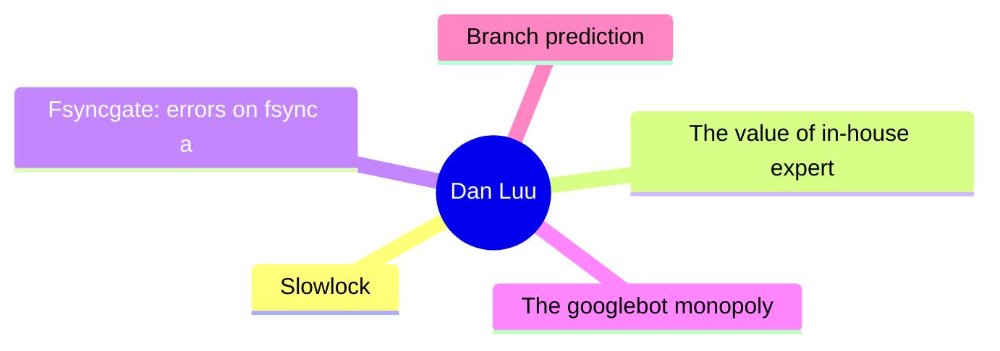
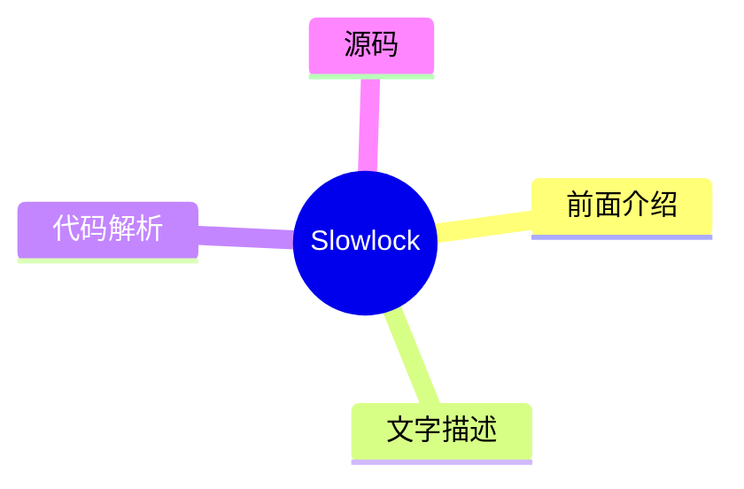
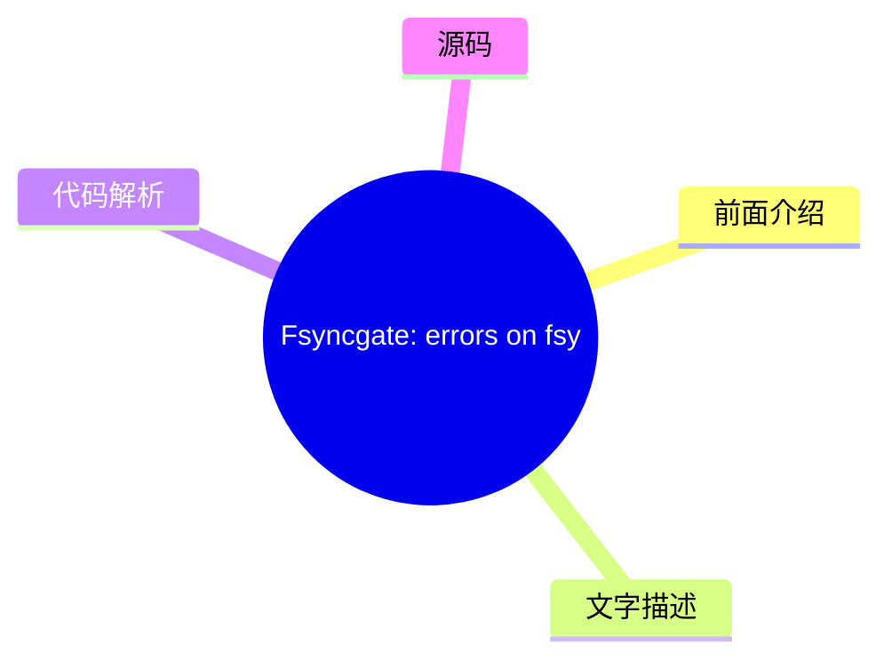
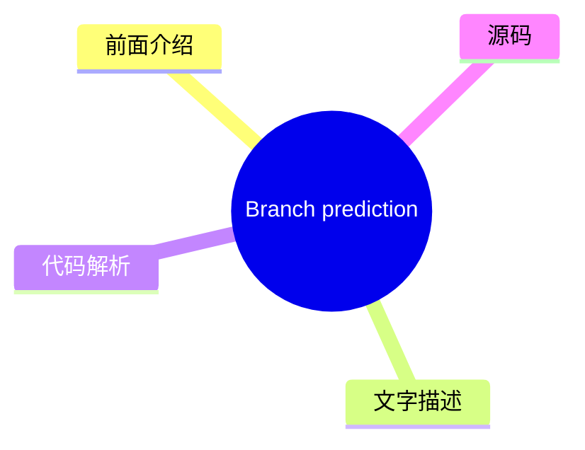

# 🔍 Dan Luu Top 5 (2026-08-07)

## 前面介绍

- 数据源：Dan Luu
- 抓取日期：2026-08-07
- 条目数：5
- 含完整正文：5
- 含代码片段：3
- 组织方式：前面介绍 / 树状图 / 文字描述 / 代码解析 / 源码

## 思维导图



## 详细整理（5 条，5 条含全文，3 条含代码）

### 1. Slowlock
- **链接**: [https://danluu.com/limplock/](https://danluu.com/limplock/)
- **发布**: Wed, 30 Sep 2015 00:00:00 +0000

#### 前面介绍

- Every once in awhile, you hear a story like “there was a case of a 1-Gbps NIC card on a machine that suddenly was transmitting only at 1 Kbps, which then caused a chain reaction upstream in such a way that the performance of the entire workload of a
- 发布时间：Wed, 30 Sep 2015 00:00:00 +0000

#### 树状图



#### 文字描述

- Every once in awhile, you hear a story like “there was a case of a 1-Gbps NIC card on a machine that suddenly was transmitting only at 1 Kbps, which then caused a chain reaction upstream in such a way that the performance of the entire workload of a 100-node cluster was crawling at a snail's pace, effectively making the system unavailable for all practical purposes”. The storie

#### 代码解析

- 本文未检测到明确代码块，内容更偏新闻、观点或方法论。

#### 源码

#### 中文节选

Every once in awhile, you hear a story like “there was a case of a 1-Gbps NIC card on a machine that suddenly was transmitting only at 1 Kbps, which then caused a chain reaction upstream in such a way that the performance of the entire workload of a 100-node cluster was crawling at a snail's pace, effectively making the system unavailable for all practical purposes”. The stories are interesting and the postmortems are fun to read, but it's not really clear how vulnerable systems are to this kind of failure or how prevalent these failures are.

 The situation reminds me of distributed systems failures before [Jepsen](https://aphyr.com/tags/jepsen). There are lots of anecdotal horror stories, but a common response to those is “works for me”, even when talking about systems that are now known to be fantastically broken. A handful of companies that are really serious about correctness have good tests and metrics, but they mostly don't talk about them publicly, and the general public has no easy way of figuring out if the systems they're running are sound.

  Thanh Do et al. have tried to look at this systematically -- [what's the effect of hardware that's been crippled but not killed](http://ucare.cs.uchicago.edu/pdf/socc13-limplock.pdf), and [how often does this happen in practice](http://ucare.cs.uchicago.edu/pdf/socc14-cbs.pdf)? It turns out that a lot of commonly used systems aren't robust against against “limping” hardware, but that the incidence of these types of failures are rare (at least until you have unreasonably large scale).

 The effect of a single slow node can be [quite dramatic](http://pages.cs.wisc.edu/~thanhdo/pdf/talk-socc-limplock.pdf):

 The job completion rate slowed down from 172 jobs per hour to 1 job per hour, effectively killing the entire cluster. Facebook has mechanisms to deal with dead machines, but they apparently didn't have any way to deal with slow machines at the time.

 When Do et al. looked at widely used open source software (HDFS, Hadoop, ZooKeeper, Cassandra, and HBase), they found similar problems.


每个子图代表一种不同的故障条件。F 是 HDFS，H 是 Hadoop，Z 是 Zookeeper，C 是 Cassandra，B 是 HBase。最左侧（白色）的条形图是基准无故障情况。向右移动，下一个是崩溃，随后的条形图是单个降级但未崩溃硬件的结果（越靠右意味着越慢）。在大多数（但并非全部）情况下，降级硬件对性能的影响远大于故障硬件。请注意，这些图表都是对数刻度；向上移动一个增量意味着性能相差 10 倍！

 奇怪的是，故障磁盘可能会导致某些操作加速。这是因为如果副本失效，某些操作的复制开销会更小。对我来说，这似乎有点奇怪，因为系统不仅要找到替换副本并复制数据，而且没有更多的开销，但我又知道些什么呢？

 无论如何，为什么慢节点比死节点糟糕得多？Th

#### 完整正文（中文）

每隔一段时间，你都会听到这样的故事：“有一台机器上的 1-Gbps 网卡突然只能以 1 Kbps 的速度传输，这随后引发了一系列连锁反应，导致一个 100 节点集群的整个工作负载性能变得像蜗牛一样慢，实际上使系统在所有实际用途上都变得不可用”。这些故事很有趣，事后分析也很有趣读，但并不清楚系统对这种故障的脆弱性有多大，或者这类故障有多普遍。

这种情况让我想起了 [Jepsen](https://aphyr.com/tags/jepsen) 之前的分布式系统故障。有很多轶事性的恐怖故事，但针对这些故事的一个常见回应是“对我来说是好的”，即使谈论的是现在已知是极其糟糕的系统。少数几家真正重视正确性的公司拥有良好的测试和指标，但它们大多不会公开谈论这些，公众也没有简单的方法来判断他们运行的系统是否可靠。

Thanh Do 等人试图系统地研究这个问题——[被削弱但未损坏的硬件有什么影响](http://ucare.cs.uchicago.edu/pdf/socc13-limplock.pdf)，以及[这种情况在实践中发生的频率有多高](http://ucare.cs.uchicago.edu/pdf/socc14-cbs.pdf)？事实证明，许多常用的系统都无法抵御“跛行”硬件，但这些类型的故障发生率很低（至少在规模不合理地扩大之前）。

单个慢节点的效果可能[非常显著](http://pages.cs.wisc.edu/~thanhdo/pdf/talk-socc-limplock.pdf)：

作业完成率从每小时 172 个作业下降到每小时 1 个作业，有效地杀死了整个集群。Facebook 有处理死机机器的机制，但他们显然当时没有任何办法来处理慢速机器。

当 Do 等人查看广泛使用的开源软件（HDFS、Hadoop、ZooKeeper、Cassandra 和 HBase）时，他们发现了类似的问题。

 Each subgraph is a different failure condition. F is HDFS, H is Hadoop, Z is Zookeeper, C is Cassandra, and B is HBase. The leftmost (white) bar is the baseline no-failure case. Going to the right, the next is a crash, and the subsequent bars are results for a single degraded but not crashed hardware (further right means slower). In most (but not all) cases, having degraded hardware affected performance a lot more than having failed hardware. Note that these graphs are all log scale; going up one increment is a 10x difference in performance!

 Curiously, a failed disk can cause some operations to speed up. That's because there are operations that have less replication overhead if a replica fails. It seems a bit weird to me that there isn't more overhead, because the system has to both find a replacement replica and replicate data, but what do I know?

 Anyway, why is a slow node so much worse than a dead node? The authors define three failure modes and explain what causes each one. There's operation limplock, when an operation is slow because some subpart of the operation is slow (e.g., a disk read is slow because the disk is degraded), node limplock, when a node is slow even for seemingly unrelated operations (e.g, a read from RAM is slow because a disk is degraded), and cluster limplock, where the entire cluster is slow (e.g., a single degraded disk makes an entire 1000 machine cluster slow).

 How do these happen?

 #### Operation Limplock

 This one is the simplest. If you try to read from disk, and your disk is slow, your disk read will be slow. In the real world, we'll see this when operations have a single point of failure, and when monitoring is designed to handle total failure and not degraded performance. For example, an HBase access to a region goes through the server responsible for that region. The data is replicated on HDFS, but this doesn't help you if the node that owns the data is limping. Speaking of HDFS, it has a timeout is 60s and reads are in 64K chunks, which means your reads can slow down to almost 1K/s before HDFS will fail over to a healthy node.

 #### Node Limplock


为什么慢速磁盘会导致内存读取变慢？再看一下 HDFS，它使用了一个线程池。如果每个线程都在非常缓慢地完成磁盘读取，那么内存读取就会阻塞，直到有线程空闲出来。

这不仅仅是在使用有限线程池或其他有界抽象时才会出现的问题——现实是机器资源是有限的，如果未经过精心设计以避免这种情况，无界抽象最终会触及机器的限制。例如，Zookeeper 保存了一个操作队列，而一个慢速的 follower 会导致 leader 的队列耗尽物理内存。

#### 集群僵死

如果集群依赖单一主节点，而该主节点又处于“跛行”状态，整个集群很容易变得不健康。级联故障也会导致这种情况——第一个图表中，集群从每小时完成 172 个作业变为每小时 1 个作业，实际上就是 Hadoop 上的一个 Facebook 工作负载。这里让我感到惊讶的是，Hadoop 本应具备尾部容错能力——单个慢速任务不应该对整个作业的完成产生重大影响。那么发生了什么？不健康的节点会感染健康的节点，最终锁死整个集群。

Hadoop 的尾部容错能力来自于当结果返回缓慢时启动推测计算。特别是当拖后腿的任务与其他结果相比明显变慢时。这在 reduce 节点“跛行”（子图 H2）时效果很好，但当 [map 节点](http://static.googleusercontent.com/media/research.google.com/en//archive/mapreduce-osdi04.pdf) “跛行”（子图 H1）时，它可能会减慢同一作业中所有 reducer 的速度，从而破坏了 Hadoop 的尾部容错机制。

 To see why, we have to look at [Hadoop's speculation algorithm](https://www.usenix.org/legacy/event/osdi08/tech/full_papers/zaharia/zaharia_html/index.html). Each job has a progress score which is a number between 0 and 1 (inclusive). For a map, the score is the fraction of input data read. For a reduce, each of three phases (copying data from mappers, sorting, and reducing) gets 1/3 of the score. A speculative job will get run if a task has run for at least one minute and has a progress score that's less than the average for its category minus 0.2.

 In case H2, the NIC is limping, so the map phase completes normally since results end up written to local disk. But when reduce nodes try to fetch data from the limping map node, they all stall, pulling down the average score for the category, which prevents speculative jobs from being run. Looking at the big picture, each Hadoop node has a limited number of map and reduce tasks. If those fill up with limping tasks, the entire node will lock up. Since Hadoop isn't designed to avoid cascading failures, this eventually causes the entire cluster to lock up.

 One thing I find interesting is that this exact cause of failures was [described in the original MapReduce paper](http://research.google.com/archive/mapreduce.html), published in 2004. They even explicitly called out slow disk and network as causes of stragglers, which motivated their speculative execution algorithm. However, they didn't provide the details of the algorithm. The open source clone of MapReduce, Hadoop, attempted to avoid the same problem. Hadoop was initially released in 2008. Five years later, when the paper we're reading was published, its built-in mechanism for straggler detection not only failed to prevent multiple types of stragglers, it also failed to prevent stragglers from effectively deadlocking the entire cluster.

 ### Conclusion

 I'm not going to go into details of how each system fared under testing. That's detailed quite nicely in the paper, which I recommend reading the paper if you're curious. To summarize, Cassandra does quite well, whereas HDFS, Hadoop, and HBase don't.


Cassandra 似乎在这两方面表现良好。首先，[来自 2009 年的这个补丁](https://issues.apache.org/jira/browse/CASSANDRA-488) 防止了队列溢出感染健康的节点，这避免了其他系统中导致集群范围故障的主要故障模式。其次，所使用的架构 ([SEDA](http://www.eecs.harvard.edu/~mdw/proj/seda/)) 解耦了不同类型的操作，这使得即使某些操作处于“跛行”状态，良好的操作仍能继续执行。

阅读这篇论文后，我的主要疑问是，这类故障发生的频率如何，是如何发生的，而且合理的指标/报告不应该能捕获这类情况吗？

对于第一个问题的答案，许多同一作者还有一篇论文，他们在其中研究了 [Cassandra、Flume、HDFS 和 ZooKeeper 中的 3000 次故障](http://ucare.cs.uchicago.edu/pdf/socc14-cbs.pdf)，并确定了哪些故障与硬件相关以及硬件故障的具体情况。

性能降级的情况有 14 起，与其他 410 起硬件故障相比。在其样本中，这占故障总数的 3%；虽然罕见，但并非罕见到我们可以忽略这个问题。

如果我们不能忽略这类错误，如何在它们进入生产环境之前捕获它们？该论文使用了 [Emulab 测试床](http://www.emulab.net/)，这真的很酷。不幸的是，Emulab 页面写道“Emulab 是一个公共设施，向全球大多数研究人员免费开放。如果您不确定自己是否有资格使用，请参阅我们的政策文档或向我们咨询。如果您认为自己有资格，可以申请启动一个新项目”。这是可以理解的，但这意味着它可能不是我们大多数人的绝佳解决方案。

绝大多数运行缓慢的硬件问题都是由网络或磁盘速度慢引起的。为什么不能修改 Jepsen 或类似工具的版本，来模拟磁盘或网络速度慢呢？一个简单的实现虽然无法达到 Emulab 的精度，但既然我们讨论的是数量级的减速，那么 10%（甚至 2 倍）的偏差对于测试系统在硬件降级情况下的鲁棒性来说应该就足够了。你可以想象出很多实现方式。例如，要在 Linux 上模拟慢速网络，你可以尝试通过 [qdisc](http://linux-ip.net/articles/Traffic-Control-HOWTO/) 进行限速，通过 [ptrace 挂钩系统调用](https://github.com/majek/fluxcapacitor)，等等。对于慢速 CPU，你可以通过 cgroups 和 cpu.shares 进行速率限制，或者直接将进程映射到 UC 内存（或者如果那有点太慢的话，也许是 WT 或 WC），依此类推，适用于磁盘和其他故障模式。

这就剩下了我的最后一个问题，系统不应该已经捕获了这些类型的故障，即使它们并不特别关注它们吗？如上所述，硬件严重缓慢的系统很少，我们可以直接将其视为死机，而不会显著影响我们总体的计算资源。而且，硬件受损的系统可以相当直接地检测到。此外，多租户系统无论如何都必须对自己的性能进行[持续监控，以获得良好的利用率](//danluu.com/new-cpu-features/#partitioning)。

 So why should we care about designing systems that are robust against limping hardware? One part of the answer is defense in depth. Of course we should have monitoring, but we should also have systems that are robust when our monitoring fails, as it inevitably will. Another part of the answer is that by making systems more tolerant to limping hardware, we'll also make them more tolerant to interference from other workloads in a multi-tenant environment. That last bit is a somewhat speculative empirical question -- it's possible that it's more efficient to design systems that aren't particularly robust against interference from competing work on the same machine, while using [better partitioning](//danluu.com/intel-cat/) to avoid interference.

 

 

  Thanks to Leah Hanson, Hari Angepat, Laura Lindzey, Julia Ev

...（截断，原文 12046+ 字符）


### 2. The value of in-house expertise
- **链接**: [https://danluu.com/in-house/](https://danluu.com/in-house/)
- **发布**: Wed, 29 Sep 2021 00:00:00 +0000

#### 前面介绍

- An alternate title for this post might be, &quot;Twitter has a kernel team!?&quot;. At this point, I've heard that surprised exclamation enough that I've lost count of the number times that's been said to me (I'd guess that it's more than ten but les
- 发布时间：Wed, 29 Sep 2021 00:00:00 +0000

#### 树状图


#### 文字描述

- An alternate title for this post might be, "Twitter has a kernel team!?". At this point, I've heard that surprised exclamation enough that I've lost count of the number times that's been said to me (I'd guess that it's more than ten but less than a hundred). If we look at trendy companies that are within a couple factors of two in size of Twitter (in terms of either market cap 

#### 代码解析

- 本文未检测到明确代码块，内容更偏新闻、观点或方法论。

#### 源码

#### 中文节选

这篇帖子或许可以有一个副标题：“Twitter 也有内核团队！？” 到目前为止，我已经听过这种惊讶的感叹无数次，以至于我都数不清有多少次了（我猜是十次以上但不到一百次）。如果我们看看那些规模与 Twitter 相差不超过两倍（无论是市值还是工程师人数）的热门公司，它们大多不具备类似的专长，这通常是由于路径依赖造成的——因为它们是在云端“长大”的，所以不需要像本地部署公司那样具备内核专长来维持运营。虽然这让人可以理解，为什么那些在更年轻、更热门的公司度过职业生涯的人会对 Twitter 拥有内核团队感到惊讶，但我认为这种惊讶并没有技术上的原因。

无论是否拥有内核专长，像 Twitter 这样规模的公司都会经常遇到内核问题，从重大的生产事故到微小的麻烦。如果没有内核团队或同等的专业知识，公司将只能勉强应对这些问题，不仅会遇到不必要的问题，还会花费不必要的时间来缓解事故。作为一个重大生产事故的例子，因为已经公开报道过了，我将引用[这篇博文](https://blog.twitter.com/engineering/en_us/topics/open-source/2020/hunting-a-linux-kernel-bug)，其中冷静地指出：

 去年早些时候，我们发现防火墙配置错误，意外导致大部分网络流量丢失。我们预期重置防火墙配置可以修复问题，但重置防火墙配置却暴露了一个内核漏洞。

 What this implies but doesn't explicitly say is that this firewall misconfiguration was the most severe incident that's occured during my time at Twitter and I believe it's actually the most severe outage that Twitter has had since 2013 or so. As a company, we would've still been able to mitigate the issue without a kernel team or another team with deep Linux expertise, but it would've taken longer to understand why the initial fix didn't work, which is the last thing you want when you're debugging a serious outage. Folks on the kernel team were already familiar with the various diagnostic tools and debugging techniques necessary to quickly understand why the initial fix didn't work, which is not common knowledge at some peer companies (I polled folks at a number of similar-scale peer companies to see if they thought they had at least one person with the knowledge necessary to quickly debug the bug and the answer was no at many companies).

 Another reason to have in-house expertise in various areas is that they easily pay for themselves, which is a special case of [the generic argument that large companies should be larger than most people expect because tiny percentage gains are worth a large amount in absolute dollars](/sounds-easy/). If, in the lifetime of the specialist team like the kernel team, a s

#### 完整正文（中文）

这篇帖子或许可以有一个副标题：“Twitter 也有内核团队！？” 到目前为止，我已经听过这种惊讶的感叹无数次，以至于我都数不清有多少次了（我猜是十次以上但不到一百次）。如果我们看看那些规模与 Twitter 相差不超过两倍（无论是市值还是工程师人数）的热门公司，它们大多不具备类似的专长，这通常是由于路径依赖造成的——因为它们是在云端“长大”的，所以不需要像本地部署公司那样具备内核专长来维持运营。虽然这让人可以理解，为什么那些在更年轻、更热门的公司度过职业生涯的人会对 Twitter 拥有内核团队感到惊讶，但我认为这种惊讶并没有技术上的原因。

无论是否拥有内核专长，像 Twitter 这样规模的公司都会经常遇到内核问题，从重大的生产事故到微小的麻烦。如果没有内核团队或同等的专业知识，公司将只能勉强应对这些问题，不仅会遇到不必要的问题，还会花费不必要的时间来缓解事故。作为一个重大生产事故的例子，因为已经公开报道过了，我将引用[这篇博文](https://blog.twitter.com/engineering/en_us/topics/open-source/2020/hunting-a-linux-kernel-bug)，其中冷静地指出：

 去年早些时候，我们发现防火墙配置错误，意外导致大部分网络流量丢失。我们预期重置防火墙配置可以修复问题，但重置防火墙配置却暴露了一个内核漏洞。

 What this implies but doesn't explicitly say is that this firewall misconfiguration was the most severe incident that's occured during my time at Twitter and I believe it's actually the most severe outage that Twitter has had since 2013 or so. As a company, we would've still been able to mitigate the issue without a kernel team or another team with deep Linux expertise, but it would've taken longer to understand why the initial fix didn't work, which is the last thing you want when you're debugging a serious outage. Folks on the kernel team were already familiar with the various diagnostic tools and debugging techniques necessary to quickly understand why the initial fix didn't work, which is not common knowledge at some peer companies (I polled folks at a number of similar-scale peer companies to see if they thought they had at least one person with the knowledge necessary to quickly debug the bug and the answer was no at many companies).

 Another reason to have in-house expertise in various areas is that they easily pay for themselves, which is a special case of [the generic argument that large companies should be larger than most people expect because tiny percentage gains are worth a large amount in absolute dollars](/sounds-easy/). If, in the lifetime of the specialist team like the kernel team, a single person found something that persistently reduced [TCO](https://en.wikipedia.org/wiki/Total_cost_of_ownership) by 0.5%, that would pay for the team in perpetuity, and Twitter’s kernel team has found many such changes. In addition to [kernel patches](https://patchwork.ozlabs.org/project/netdev/list/?submitter=211&state=*&archive=both¶m=4&page=1) that sometimes have that kind of impact, people will also find configuration issues, etc., that have that kind of impact.


到目前为止，我只谈到了内核团队，因为那是唯一一个仅仅因为存在就会让大多数人感到惊讶的团队，但当我告诉人们 Twitter 有很多来自 Sun JVM 团队、曾在 HotSpot 工作过的人员时，比如 Ramki Ramakrishna、Tony Printezis 和 John Coomes，我也得到了类似的反应。人们会纳闷，一家社交媒体公司为什么需要如此深厚的 JVM 专业知识。就像内核团队一样，我们这种规模、使用 JVM 的公司会遇到各种奇怪的问题和 JVM Bug，拥有具备深厚专业知识的人员来调试这些问题会很有帮助。而且，就像内核团队一样，对 JVM 的单独优化可以永久性地为团队创造收益。一个具体的例子是 [Flavio Brasil 的这个补丁，它虚拟化了比较交换调用](https://github.com/oracle/graal/pull/636)。

这种情况的背景是 Twitter 使用了大量的 Scala。尽管有很多说法与此相反，但 Scala 比较占用内存，而且明显比 Java 慢，如果你大规模使用 Scala，这会产生显著的代价，多到值得进行优化工作，以减少惯用 Scala 和惯用 Java 之间的性能差距。

在这个补丁之前，如果你对我们的 Scala 代码进行性能分析，你会看到在 Future/Promise 上花费了不合理的大量时间，包括在那些你可能天真地认为编译器会优化掉的工作中。原因之一是 Future 使用了一种对 JVM 优化来说是不透明的 [比较交换](https://en.wikipedia.org/wiki/Compare-and-swap) (CAS) 操作。上面链接的补丁在 Future 没有逃逸方法作用域时避免了 CAS 操作。[这个配套补丁](https://github.com/twitter/util/commit/3245a8e1a98bd5eb308f366678528879d7140f5e) 移除了某些不太容易进行编译器优化的地方的 CAS 操作。这两个补丁结合后，将典型的主要 Twitter 服务使用惯用 Scala 的成本降低了 5% 到 15%，永久性地多次为 JVM 团队创造了收益，而这甚至还不是 Flavio 那年发现的最大收益。

 I'm not going to do a team-by-team breakdown of teams that pay for themselves many times over because there are so many of them, even if I limit the scope to "teams that people are surprised that Twitter has".

 A related topic is how people talk about "buy vs. build" discussions. I've seen a number of discussions where someone has argued for "buy" because that would obviate the need for expertise in the area. This can be true, but I've seen this argued for much more often than it is true. An example where I think this tends to be untrue is with distributed tracing. [We've previously looked at some ways Twitter gets value out of tracing](/tracing-analytics/), which came out of the vision Rebecca Isaacs put into place. On the flip side, when I talk to people at peer companies with similar scale, most of them have not (yet?) succeeded at getting significant value from distributed tracing. This is so common that I see a viral Twitter thread about how useless distributed tracing is more than once a year. Even though we went with the more expensive "build" option, just off the top of my head, I can think of multiple uses of tracing that have returned between 10x and 100x the cost of building out tracing, whereas people at a number of companies that have chosen the cheaper "buy" option commonly complain that tracing isn't worth it.


 Coincidentally, I was just talking about this exact topic to Pam Wolf, a civil engineering professor with experience in (civil engineering) industry on multiple continents, who had a related opinion. For large scale systems (projects), you need an in-house expert (owner's-side engineer) for each area that you don't handle in your own firm. While it's technically possible to hire yet another firm to be the expert, that's more expensive than developing or hiring in-house expertise and, in the long run, also more risky. That's pretty analogous to my experience working as an electrical engineer as well, where orgs that outsource functions to other companies without retaining an in-house expert pay a very high cost, and not just monetarily. They often ship sub-par designs with long delays on top of having high costs. "Buying" can and often does reduce the amount of expertise necessary, but it often doesn't remove the need for expertise.


 This related to another common abstract argument that's commonly made, that companies should concentrate on "their area of comparative advantage" or "most important problems" or "core business need" and outsource everything else. We've already seen a couple of examples where this isn't true because, at a large enough scale, it's more profitable to have in-house expertise than not regardless of whether or not something is core to the business (one could argue that all of the things that are moved in-house are core to the business, but that would make the concept of coreness useless). Another reason this abstract advice is too simplistic is that businesses can somewhat arbitrarily choose what their comparative advantage is. A large example of this would be Apple bringing CPU design in-house. Since acquiring PA Semi (formerly the team from SiByte and, before that, a team from DEC) for $278M, Apple has been producing [the best chips in the phone and laptop power envelope by a pretty large margin](https://twitter.com/danluu/status/1433297089866383364). But, before the purchase, there was nothing about Apple that made the purchase inevitable, that made CPU design an inherent comparative advantage of Apple. But if a firm can pick an area and make it an area of comparative advantage, saying that the firm should choose to concentrate on its comparative advantage(s) isn't very helpful advice.

 $278M is a lot of money in absolute terms, but as a fraction of Apple's resources, that was tiny and much smaller companies also have the capability to do cutting edge work by devoting a small fraction of their resources to it, e.g., Twitter, for a cost that any $100M company could afford, [created novel cache algorithms and data structures](https://twitter.com/danluu/status/1381687511362138113) and is doing other cutting edge cache work. Having great [cache infra](/cache-incidents/) isn't any more core to Twitter's business than creating a great CPU is to Apple's, but it is a lever that Twitter can use to make more money than it could otherwise.


对于小公司来说，为公司涉及的方方面面都配备内部专家是不合逻辑的，但公司也不必规模大到一定程度，才开始在操作系统、语言运行时以及其他通常被认为相当专业的组件上配备内部专业知识。回顾 Twitter 的历史，Yao Yue 指出，在她早期在 Twitter 工作（当时我们有约 100 名工程师）时，她经常去内核团队寻求帮助以调试生产事故，而在某些情况下，如果没有内核团队的帮助，调试可能容易耗时 10 倍以上。社交媒体公司通常在每用户和每美元的基础上具有相对较高的规模，因此并非每家公司都需要在拥有 100 名工程师时具备同等程度的 expertise，但也会有一些其他领域并非核心业务需求的明显领域，对于拥有 100 名工程师的初创公司来说，在这些领域具备专业知识也会带来回报。

 感谢 Ben Kuhn、Yao Yue、Pam Wolf、John Hergenroeder、Julien Kirch、Tom Brearley 和 Kevin Burke 提供评论/更正/讨论。


### 3. Fsyncgate: errors on fsync are unrecovarable
- **链接**: [https://danluu.com/fsyncgate/](https://danluu.com/fsyncgate/)
- **发布**: Wed, 28 Mar 2018 00:00:00 +0000

#### 前面介绍

- This is an archive of the original &quot;fsyncgate&quot; email thread. This is posted here because I wanted to have a link that would fit on a slide for a talk on file safety with a mobile-friendly non-bloated format.

From:Craig Ringer &lt;craig(at)
- 发布时间：Wed, 28 Mar 2018 00:00:00 +0000

#### 树状图



#### 文字描述

- *This is an archive of the original "fsyncgate" email thread. This is posted here because I wanted to have a link that would fit on a slide for *[a talk on file safety](//danluu.com/deconstruct-files/) with [a mobile-friendly non-bloated format](//danluu.com/web-bloat/). ``` From:Craig Ringer <craig(at)2ndquadrant(dot)com> Subject:Re: PostgreSQL's handling of fsync() errors is 

#### 代码解析

- `text`: 这段更像查询逻辑，重点看过滤条件、聚合方式和性能影响。
- `text`: 这段更像查询逻辑，重点看过滤条件、聚合方式和性能影响。
- `text`: 这段更像查询逻辑，重点看过滤条件、聚合方式和性能影响。

#### 源码

#### 源码片段 1（text）

```text
From:Craig Ringer <craig(at)2ndquadrant(dot)com>
Subject:Re: PostgreSQL's handling of fsync() errors is unsafe and risks data loss at least on XFS
Date:2018-03-28 02:23:46
```

#### 源码片段 2（text）

```text
From:Tom Lane <tgl(at)sss(dot)pgh(dot)pa(dot)us>
Date:2018-03-28 03:53:08
```

#### 源码片段 3（text）

```text
From:Michael Paquier <michael(at)paquier(dot)xyz>
Date:2018-03-29 02:30:59
```

#### 完整正文（中文）

*This is an archive of the original "fsyncgate" email thread. This is posted here because I wanted to have a link that would fit on a slide for *[a talk on file safety](//danluu.com/deconstruct-files/) with [a mobile-friendly non-bloated format](//danluu.com/web-bloat/).

 ```
From:Craig Ringer <craig(at)2ndquadrant(dot)com>
Subject:Re: PostgreSQL's handling of fsync() errors is unsafe and risks data loss at least on XFS
Date:2018-03-28 02:23:46
```

 Hi all

 Some time ago I ran into an issue where a user encountered data corruption after a storage error. PostgreSQL played a part in that corruption by allowing checkpoint what should've been a fatal error.

 TL;DR: Pg should PANIC on fsync() EIO return. Retrying fsync() is not OK at least on Linux. When fsync() returns success it means "all writes since the last fsync have hit disk" but we assume it means "all writes since the last SUCCESSFUL fsync have hit disk".

 Pg wrote some blocks, which went to OS dirty buffers for writeback. Writeback failed due to an underlying storage error. The block I/O layer and XFS marked the writeback page as failed (AS_EIO), but had no way to tell the app about the failure. When Pg called fsync() on the FD during the next checkpoint, fsync() returned EIO because of the flagged page, to tell Pg that a previous async write failed. Pg treated the checkpoint as failed and didn't advance the redo start position in the control file.

 All good so far.

 But then we retried the checkpoint, which retried the fsync(). The retry succeeded, because the prior fsync() *cleared the AS_EIO bad page flag*.

 The write never made it to disk, but we completed the checkpoint, and merrily carried on our way. Whoops, data loss.

 The clear-error-and-continue behaviour of fsync is not documented as far as I can tell. Nor is fsync() returning EIO unless you have a very new linux man-pages with the patch I wrote to add it. But from what I can see in the POSIX standard we are not given any guarantees about what happens on fsync() failure at all, so we're probably wrong to assume that retrying fsync( ) is safe.


 If the server had been using ext3 or ext4 with errors=remount-ro, the problem wouldn't have occurred because the first I/O error would've remounted the FS and stopped Pg from continuing. But XFS doesn't have that option. There may be other situations where this can occur too, involving LVM and/or multipath, but I haven't comprehensively dug out the details yet.

 It proved possible to recover the system by faking up a backup label from before the first incorrectly-successful checkpoint, forcing redo to repeat and write the lost blocks. But ... what a mess.

 I posted about the underlying fsync issue here some time ago:

 [https://stackoverflow.com/q/42434872/398670](https://stackoverflow.com/q/42434872/398670)

 but haven't had a chance to follow up about the Pg specifics.

 I've been looking at the problem on and off and haven't come up with a good answer. I think we should just PANIC and let redo sort it out by repeating the failed write when it repeats work since the last checkpoint.

 The API offered by async buffered writes and fsync offers us no way to find out which page failed, so we can't just selectively redo that write. I think we do know the relfilenode associated with the fd that failed to fsync, but not much more. So the alternative seems to be some sort of potentially complex online-redo scheme where we replay WAL only the relation on which we had the fsync() error, while otherwise servicing queries normally. That's likely to be extremely error-prone and hard to test, and it's trying to solve a case where on other filesystems the whole DB would grind to a halt anyway.

 I looked into whether we can solve it with use of the AIO API instead, but the mess is even worse there - from what I can tell you can't even reliably guarantee fsync at all on all Linux kernel versions.

 We already PANIC on fsync() failure for WAL segments. We just need to do the same for data forks at least for EIO. This isn't as bad as it seems because AFAICS fsync only returns EIO in cases where we should be stopping the world anyway, and many FSes will do that for us.


 There are rather a lot of pg_fsync() callers. While we could handle this case-by-case for each one, I'm tempted to just make pg_fsync() itself intercept EIO and PANIC. Thoughts?

 

 ```
From:Tom Lane <tgl(at)sss(dot)pgh(dot)pa(dot)us>
Date:2018-03-28 03:53:08
```

 Craig Ringer  writes:

  TL;DR: Pg should PANIC on fsync() EIO return.

 

 Surely you jest.

  Retrying fsync() is not OK at least on Linux. When fsync() returns success it means "all writes since the last fsync have hit disk" but we assume it means "all writes since the last SUCCESSFUL fsync have hit disk".

 

 If that's actually the case, we need to push back on this kernel brain damage, because as you're describing it fsync would be completely useless.

 Moreover, POSIX is entirely clear that successful fsync means all preceding writes for the file have been completed, full stop, doesn't matter when they were issued.

 

 ```
From:Michael Paquier <michael(at)paquier(dot)xyz>
Date:2018-03-29 02:30:59
```

 On Tue, Mar 27, 2018 at 11:53:08PM -0400, Tom Lane wrote:

  Craig Ringer  writes:

  TL;DR: Pg should PANIC on fsync() EIO return.

 

 Surely you jest.

 

 Any callers of pg_fsync in the backend code are careful enough to check the returned status, sometimes doing retries like in mdsync, so what is proposed here would be a regression.

 

 ```
From:Thomas Munro <thomas(dot)munro(at)enterprisedb(dot)com>
Date:2018-03-29 02:48:27
```

 On Thu, Mar 29, 2018 at 3:30 PM, Michael Paquier  wrote:

  On Tue, Mar 27, 2018 at 11:53:08PM -0400, Tom Lane wrote:

  Craig Ringer  writes:

  TL;DR: Pg should PANIC on fsync() EIO return.

 

 Surely you jest.

 

 Any callers of pg_fsync in the backend code are careful enough to check the returned status, sometimes doing retries like in mdsync, so what is proposed here would be a regression.

 

 Craig, is the phenomenon you described the same as the second issue "Reporting writeback errors" discussed in this article?

 [https://lwn.net/Articles/724307/](https://lwn.net/Articles/724307/)

 "Current kernels might report a writeback error on an fsync() call, but there are a number of ways in which that can fail to happen."

 That's... I'm speechless.

 


 ```
From:Justin Pryzby <pryzby(at)telsasoft(dot)com>
Date:2018-03-29 05:00:31
```

 On Thu, Mar 29, 2018 at 11:30:59AM +0900, Michael Paquier wrote:

  On Tue, Mar 27, 2018 at 11:53:08PM -0400, Tom Lane wrote:

  Craig Ringer  writes:

  TL;DR: Pg should PANIC on fsync() EIO return.

 

 Surely you jest.

 

 Any callers of pg_fsync in the backend code are careful enough to check the returned status, sometimes doing retries like in mdsync, so what is proposed here would be a regression.

 

 The retries are the source of the problem ; the first fsync() can return EIO, and also *clears the error* causing a 2nd fsync (of the same data) to return success.

 (Note, I can see that it might be useful to PANIC on EIO but retry for ENOSPC).

 On Thu, Mar 29, 2018 at 03:48:27PM +1300, Thomas Munro wrote:

  Craig, is the phenomenon you described the same as the second issue "Reporting writeback errors" discussed in this article? [https://lwn.net/Articles/724307/](https://lwn.net/Articles/724307/)

 

 Worse, the article acknowledges the behavior without apparently suggesting to change it:

 "Storing that value in the file structure has an important benefit: it makes it possible to report a writeback error EXACTLY ONCE TO EVERY PROCESS THAT CALLS FSYNC() .... In current kernels, ONLY THE FIRST CALLER AFTER AN ERROR OCCURS HAS A CHANCE OF SEEING THAT ERROR INFORMATION."

 I believe I reproduced the problem behavior using dmsetup "error" target, see attached.

 strace looks like this:

 kernel is Linux 4.10.0-28-generic #32~16.04.2-Ubuntu SMP Thu Jul 20 10:19:48 UTC 2017 x86_64 x86_64 x86_64 GNU/Linux

 ```
1open("/dev/mapper/eio", O_RDWR|O_CREAT, 0600) = 3
2write(3, "\0\0\0\0\0\0\0\0\0\0\0\0\0\0\0\0\0\0\0\0\0\0\0\0\0\0\0\0\0\0\0\0"..., 8192) = 8192
3write(3, "\0\0\0\0\0\0\0\0\0\0\0\0\0\0\0\0\0\0\0\0\0\0\0\0\0\0\0\0\0\0\0\0"..., 8192) = 8192
4write(3, "\0\0\0\0\0\0\0\0\0\0\0\0\0\0\0\0\0\0\0\0\0\0\0\0\0\0\0\0\0\0\0\0"..., 8192) = 8192
5write(3, "\0\0\0\0\0\0\0\0\0\0\0\0\0\0\0\0\0\0\0\0\0\0\0\0\0\0\0\0\0\0\0\0"..., 8192) = 8192
6write(3, "\0\0\0\0\0\0\0\0\0\0\0\0\0\0\0\0\0\0\0\0\0\0\0\0\0\0\0\0\0\0\0\0"..., 8192) = 8192

7write(3, "\0\0\0\0\0\0\0\0\0\0\0\0\0\0\0\0\0\0\0\0\0\0\0\0\0\0\0\0\0\0\0\0"..., 8192) = 8192
8write(3, "\0\0\0\0\0\0\0\0\0\0\0\0\0\0\0\0\0\0\0\0\0\0\0\0\0\0\0\0\0\0\0\0"..., 8192) = 2560
9write(3, "\0\0\0\0\0\0\0\0\0\0\0\0\0\0\0\0\0\0\0\0\0\0\0\0\0\0\0\0\0\0\0\0"..., 8192) = -1 ENOSPC (No space left on device)
10dup(2)                                  = 4
11fcntl(4, F_GETFL)                       = 0x8402 (flags O_RDWR|O_APPEND|O_LARGEFILE)
12brk(NULL)                               = 0x1299000
13brk(0x12ba000)                          = 0x12ba000
14fstat(4, {st_mode=S_IFCHR|0620, st_rdev=makedev(136, 2), ...}) = 0
15write(4, "write(1): No space left on devic"..., 34write(1): No space left on device
16) = 34
17close(4)                                = 0
18fsync(3)                                = -1 EIO (Input/output error)
19dup(2)                                  = 4
20fcntl(4, F_GETFL)                       = 0x8402 (flags O_RDWR|O_APPEND|O_LARGEFILE)
21fstat(4, {st_mode=S_IFCHR|0620, st_rdev=makedev(136, 2), ...}) = 0
22write(4, "fsync(1): Input/output error\n", 29fsync(1): Input/output error
23) = 29
24close(4)                                = 0
25close(3)                                = 0
26open("/dev/mapper/eio", O_RDWR|O_CREAT, 0600) = 3
27fsync(3)                                = 0
28write(3, "\0", 1)                       = 1
29fsync(3)                                = 0
30exit_group(0)                           = ?

 2: EIO isn't seen initially due to writeback page cache;

 9: ENOSPC due to small device

 18: original IO error reported by fsync, good

 25: the original FD is closed

 26: ..and file reopened

 27: fsync on file with still-dirty data+EIO returns success BAD

 10, 19: I'm not sure why there's dup(2), I guess glibc thinks that perror should write to a separate FD (?)

 Also note, close() ALSO returned success..which you might think exonerates the 2nd fsync(), but I think may itself be problematic, no? In any case, the 2nd byte certainly never got written to DM error, and the failure status was lost following fsync().

 I get the exact same behavior if I break after one write() loop, such as to avoid ENOSPC.

 

 ```

From:Thomas Munro <thomas(dot)munro(at)enterprisedb(dot)com>
Date:2018-03-29 05:06:22
```

 On Thu, Mar 29, 2018 at 6:00 PM, Justin Pryzby  wrote:

  The retries are the source of the problem ; the first fsync() can return EIO, and also *clears the error* causing a 2nd fsync (of the same data) to return success.

 

 What I'm failing to grok here is how that error flag even matters, whether it's a single bit or a counter as described in that patch. If write back failed, *the page is still dirty*. So all future calls to fsync() need to try to try to flush it again, and (presumably) fail again (unless it happens to succeed this time around).

 

 ```
From:Craig Ringer <craig(at)2ndquadrant(dot)com>
Date:2018-03-29 05:25:51
```

 On 29 March 2018 at 13:06, Thomas Munro  wrote:

  On Thu, Mar 29, 2018 at 6:00 PM, Justin Pryzby  wrote:

  The retries are the source of the problem ; the first fsync() can return EIO, and also *clears the error* causing a 2nd fsync (of the same data) to return success.

 

 What I'm failing to grok here is how that error flag even matters, whether it's a single bit or a counter as described in that patch. If write back failed, *the page is still dirty*. So all future calls to fsync() need to try to try to flush it again, and (pre

...（截断，原文 516759+ 字符）


### 4. The googlebot monopoly
- **链接**: [https://danluu.com/googlebot-monopoly/](https://danluu.com/googlebot-monopoly/)
- **发布**: Wed, 27 May 2015 00:00:00 +0000

#### 前面介绍

- TIL that Bell Labs and a whole lot of other websites block archive.org, not to mention most search engines. Turns out I have a broken website link in a GitHub repo, caused by the deletion of an old webpage. When I tried to pull the original from arch
- 发布时间：Wed, 27 May 2015 00:00:00 +0000

#### 树状图


#### 文字描述

- TIL that Bell Labs and a whole lot of other websites block archive.org, not to mention most search engines. Turns out I have [a broken website link](https://github.com/danluu/debugging-stories/issues/3) in a GitHub repo, caused by the deletion of an old webpage. When I tried to pull the original from archive.org, I found that it's not available because Bell Labs blocks the arch

#### 代码解析

- `text`: 更偏接口调用示例，适合作为接入或联调样例。

#### 源码

#### 源码片段 1（text）

```text
User-agent: Googlebot
User-agent: msnbot
User-agent: LSgsa-crawler
Disallow: /RealAudio/
Disallow: /bl-traces/
Disallow: /fast-os/
Disallow: /hidden/
Disallow: /historic/
Disallow: /incoming/
Disallow: /inferno/
Disallow: /magic/
Disallow: /netlib.depend/
Disallow: /netlib/
Disallow: /p9trace/
Disallow: /plan9/sources/
Disallow: /sources/
Disallow: /tmp/
Disallow: /tripwire/
Visit-time: 0700-1200
Request-rate: 1/5
Crawl-delay: 5
User-agent: *
Disallow: /
```

#### 完整正文（中文）

我发现贝尔实验室和许多其他网站都屏蔽了 archive.org，更不用说大多数搜索引擎了。结果我在一个 GitHub 仓库中发现了一个[损坏的网站链接](https://github.com/danluu/debugging-stories/issues/3)，这是由于一个旧网页被删除造成的。当我尝试从 archive.org 拉取原始内容时，发现它不可用，因为贝尔实验室在他们的 robots.txt 中屏蔽了 archive.org 的爬虫：

  ```
User-agent: Googlebot
User-agent: msnbot
User-agent: LSgsa-crawler
Disallow: /RealAudio/
Disallow: /bl-traces/
Disallow: /fast-os/
Disallow: /hidden/
Disallow: /historic/
Disallow: /incoming/
Disallow: /inferno/
Disallow: /magic/
Disallow: /netlib.depend/
Disallow: /netlib/
Disallow: /p9trace/
Disallow: /plan9/sources/
Disallow: /sources/
Disallow: /tmp/
Disallow: /tripwire/
Visit-time: 0700-1200
Request-rate: 1/5
Crawl-delay: 5
User-agent: *
Disallow: /
```

事实上，贝尔实验室不仅屏蔽了 Internet Archiver 爬虫，它还屏蔽了除 Googlebot、msnbot 和它们自己的企业爬虫以外的所有爬虫。而且 msnbot 在[五年前](http://en.wikipedia.org/wiki/Msnbot)就已经被 bingbot 取代了！

使用一个仅在贝尔实验室找到的术语进行快速搜索，例如“This is a start at making available some of the material from the Tenth Edition Research Unix manual.”，结果发现必应索引了该页面；要么是 bingbot 遵循了某些 msnbot 的规则，要么是 msnbot 仍在独立运行并索引像贝尔实验室这样的网站，这些网站屏蔽了 bingbot 但没有屏蔽 msnbot。幸运的是，在这种情况下，许多搜索引擎（如 Yahoo 和 DDG）都使用必应的结果，所以贝尔实验室并没有从非谷歌互联网中消失，但如果你是使用 Yandex 的 55% 的俄罗斯人之一，那你可就倒大霉了[http://en.wikipedia.org/wiki/Yandex#cite_note-13]。

 And all that is a relatively good case, where one non-Google crawler is allowed to operate. It's not uncommon to see robots.txt files that ban everything but Googlebot. Running [a competing search engine](http://blog.nullspace.io/building-search-engines.html) and preventing a Google monopoly is hard enough without having sites ban non-Google bots. We don't need to make it even harder, nor do we need to accidentally ban the Internet Archive bot.

  P.S. While you're checking that your robots.txt doesn't ban everyone but Google, consider looking at your CPUID checks to make sure that you're using feature flags [instead of banning everyone but Intel and AMD](https://twitter.com/danluu/status/1203450367515615233).

 BTW, I do think there can be legitimate reasons to block crawlers, including archive.org, but I don't think that the common default many web devs have, of blocking everything but googlebot, is really intended to block competing search engines as well as archive.org. 

 2021 Update: since this post was first published, archive.org started ignoring being blocked in robots.txt and archives posts where they are blocked in robots.txt. I've heard that some competing search engines do the same thing, so this mis-use of robots.txt, where sites ban everything but googlebot, is slowly making robots.txt effectively useless, much like browsers identify themselves as every browser in user-agent strings to work around sites that incorrectly block browsers they don't think are compatible.

 A related thing is that sites will sometimes ban competing search engines, like Bing, in a fit of pique, which they wouldn't do to Google since Google provides too much traffic for them to be able get away with that, e.g., [Discourse banned Bing because they were upset that Bing was crawling discourse at 0.46 QPS](https://twitter.com/danluu/status/981992814824378369).


### 5. Branch prediction
- **链接**: [https://danluu.com/branch-prediction/](https://danluu.com/branch-prediction/)
- **发布**: Wed, 23 Aug 2017 00:00:00 +0000

#### 前面介绍

- This is a pseudo-transcript for a talk on branch prediction given at Two Sigma on 8/22/2017 to kick off &quot;localhost&quot;, a talk series organized by RC.

How many of you use branches in your code? Could you please raise your hand if you use if
- 发布时间：Wed, 23 Aug 2017 00:00:00 +0000

#### 树状图



#### 文字描述

- *This is a pseudo-transcript for a talk on branch prediction given at Two Sigma on 8/22/2017 to kick off "localhost", a talk series organized by *[RC](https://www.recurse.com/scout/click?t=b504af89e87b77920c9b60b2a1f6d5e8). How many of you use branches in your code? Could you please raise your hand if you use if statements or pattern matching? `Most of the audience raises their
- ### One-bit So far, we’ve look at schemes that don’t store any state, i.e., schemes where the prediction ignores the program’s execution history. These are called *static* branch prediction schemes in the literature. These schemes have the advantage of being simple but they have the disadvantage of being bad at predicting branches whose behavior change over time. If you want an

#### 代码解析

- `text`: 代码片段可作为实现参考，建议结合上下文确认输入输出和边界条件。
- `text`: 代码片段可作为实现参考，建议结合上下文确认输入输出和边界条件。
- `text`: 代码片段可作为实现参考，建议结合上下文确认输入输出和边界条件。

#### 源码

#### 源码片段 1（text）

```text
if (x == 0) {
  // Do stuff
} else {
  // Do other stuff (things)
}
  // Whatever happens later
```

#### 源码片段 2（text）

```text
branch_if_not_equal x, 0, else_label
// Do stuff
goto end_label
else_label:
// Do things
end_label:
// whatever happens later
```

#### 源码片段 3（text）

```text
branch_if_not_equal x, 0, else_label
???
```

#### 完整正文（中文）

*这是 8/22/2017 在 Two Sigma 举行的一场关于分支预测的讲座的伪转录，旨在开启由 *[RC](https://www.recurse.com/scout/click?t=b504af89e87b77920c9b60b2a1f6d5e8) 组织的“localhost”讲座系列。

 有多少人会在代码中使用分支？如果你们使用 if 语句或模式匹配，请举手。

 `大多数观众举起了手`

 对于下一部分，我不会要求你们举手，但我猜测，如果我问有多少人觉得自己对 CPU 在执行分支时做了什么以及性能影响有很好的理解，又有多少人觉得自己能看懂一篇关于分支预测的现代论文，举手的人会更少。

 本讲座的目的是解释 CPU 是如何以及为什么进行“分支预测”的，然后解释足够多的经典分支预测算法，以便你们能够阅读一篇关于分支预测的现代论文，并基本上知道发生了什么。

 在讨论分支预测之前，让我们先谈谈为什么 CPU 要进行分支预测。为此，我们需要了解一些关于 CPU 是如何工作的。

 在本次讲座的背景下，你可以把你的电脑想象成一个 CPU 加上一些内存。指令存在于内存中，CPU 从内存中执行一系列指令，指令包括“将两个数相加”、“将一块数据从内存移动到处理器”等。通常情况下，在执行一条指令后，CPU 会执行位于下一个顺序地址的指令。然而，有一些称为“分支”的指令，可以让下一条指令的来源地址发生改变。

 这是一个 CPU 执行某些指令的抽象图。x 轴是时间，y 轴区分不同的指令。

 在这里，我们执行指令 `A`，然后是指令 `B`，然后是指令 `C`，然后是指令 `D`。

你可以通过让 CPU 完成一条指令的所有工作，然后继续下一条指令，以此类推的方式来设计 CPU。这样做没有问题；许多旧式 CPU 都是这么做的，一些现代的低成本 CPU 仍然如此。但如果你想要制造更快的 CPU，你可以设计一个像流水线一样的 CPU。也就是说，将 CPU 分成两部分，这样 CPU 的一半可以处理指令的“前半部分”工作，而另一半则处理指令的“后半部分”工作，就像流水线一样。这通常被称为流水线 CPU。

如果你这样做，执行过程可能看起来像上面那样。在指令 A 的前半部分完成后，CPU 可以处理指令 A 的后半部分，同时前半部分的指令 B 正在运行。当 A 的后半部分完成时，CPU 可以同时开始处理 B 的后半部分和 C 的前半部分。在这个图中，你可以看到流水线 CPU 每单位时间执行的指令数量是上面非流水线 CPU 的两倍。

没有理由说 CPU 只能分成两部分。我们可以将 CPU 分成三部分，获得 3 倍的加速，或者分成四部分，获得 4 倍的加速。这并不完全准确，而且通常情况下，三段流水线获得的加速比小于 3 倍，四段流水线获得的加速比小于 4 倍，因为将 CPU 分成更多部分并拥有更深的流水线会产生开销。

开销的一个来源是如何处理分支。CPU 对指令要做的第一件事之一是获取指令；为此，它必须知道指令在哪里。例如，考虑以下代码：

```
if (x == 0) {
  // Do stuff
} else {
  // Do other stuff (things)
}
  // Whatever happens later
```

这可能会变成如下汇编代码：

```
branch_if_not_equal x, 0, else_label
// Do stuff
goto end_label
else_label:
// Do things
end_label:
// whatever happens later
```

 In this example, we compare `x` to 0. `if_not_equal`, then we branch to `else_label` and execute the code in the else block. If that comparison fails (i.e., if `x` is 0), we fall through, execute the code in the `if` block, and then jump to `end_label` in order to avoid executing the code in `else` block.

 The particular sequence of instructions that’s problematic for pipelining is

 ```
branch_if_not_equal x, 0, else_label
???
```

 The CPU doesn’t know if this is going to be

 ```
branch_if_not_equal x, 0, else_label
// Do stuff
```

 or

 ```
branch_if_not_equal x, 0, else_label
// Do things
```

 until the branch has finished (or nearly finished) executing. Since one of the first things the CPU needs to do for an instruction is to get the instruction from memory, and we don’t know which instruction `???` is going to be, we can’t even start on `???` until the previous instruction is nearly finished.

 Earlier, when we said that we’d get a 3x speedup for a 3-stage pipeline or a 20x speedup for a 20-stage pipeline, that assumed that you could start a new instruction every cycle, but in this case the two instructions are nearly serialized.

 One way around this problem is to use branch prediction. When a branch shows up, the CPU will guess if the branch was taken or not taken.

 In this case, the CPU predicts that the branch won’t be taken and starts executing the first half of `stuff` while it’s executing the second half of the branch. If the prediction is correct, the CPU will execute the second half of `stuff` and can start another instruction while it’s executing the second half of `stuff`, like we saw in the first pipeline diagram.

 If the prediction is wrong, when the branch finishes executing, the CPU will throw away the result from `stuff.1` and start executing the correct instructions instead of the wrong instructions. Since we would’ve stalled the processor and not executed any instructions if we didn’t have branch prediction, we’re no worse off than we would’ve been had we not made a prediction (at least at the level of detail we’re looking at).


 What’s the performance impact of doing this? To make an estimate, we’ll need a performance model and a workload. For the purposes of this talk, our cartoon model of a CPU will be a pipelined CPU where non-branches take an average of one instruction per clock, unpredicted or mispredicted branches take 20 cycles, and correctly predicted branches take one cycle.

 If we look at the most commonly used benchmark of “workstation” integer workloads, SPECint, the composition is maybe 20% branches, and 80% other operations. Without branch prediction, we then expect the “average” instruction to take `branch_pct * 1 + non_branch_pct * 20 = 0.2 * 20 + 0.8 * 1 = 4 + 0.8 = 4.8 cycles`. With perfect, 100% accurate, branch prediction, we’d expect the average instruction to take 0.8 * 1 + 0.2 * 1 = 1 cycle, a 4.8x speedup! Another way to look at it is that if we have a pipeline with a 20-cycle branch misprediction penalty, we have nearly a 5x overhead from our ideal pipelining speedup just from branches alone.

 Let’s see what we can do about this. We’ll start with the most naive things someone might do and work our way up to something better.

 ### Predict taken

 Instead of predicting randomly, we could look at all branches in the execution of all programs. If we do this, we’ll see that taken and not not-taken branches aren’t exactly balanced -- there are substantially more taken branches than not-taken branches. One reason for this is that loop branches are often taken.

 If we predict that every branch is taken, we might get 70% accuracy, which means we’ll pay the the misprediction cost for 30% of branches, making the cost of of an average instruction `(0.8 + 0.7 * 0.2) * 1 + 0.3 * 0.2 * 20 = 0.94 + 1.2. = 2.14`. If we compare always predicting taken to no prediction and perfect prediction, always predicting taken gets a large fraction of the benefit of perfect prediction despite being a very simple algorithm.

 ### Backwards taken forwards not taken (BTFNT)


 Predicting branches as taken works well for loops, but not so great for all branches. If we look at whether or not branches are taken based on whether or not the branch is forward (skips over code) or backwards (goes back to previous code), we can see that backwards branches are taken more often than forward branches, so we could try a predictor which predicts that backward branches are taken and forward branches aren’t taken (BTFNT). If we implement this scheme in hardware, compiler writers will conspire with us to arrange code such that branches the compiler thinks will be taken will be backwards branches and branches the compiler thinks won’t be taken will be forward branches.

 If we do this, we might get something like 80% prediction accuracy, making our cost function `(0.8 + 0.8 * 0.2) * 1 + 0.2 * 0.2 * 20 = 0.96 + 0.8 = 1.76` cycles per instruction.

 #### Used by

 - PPC 601(1993): also uses compiler generated branch hints
- PPC 603

### One-bit

 So far, we’ve look at schemes that don’t store any state, i.e., schemes where the prediction ignores the program’s execution history. These are called *static* branch prediction schemes in the literature. These schemes have the advantage of being simple but they have the disadvantage of being bad at predicting branches whose behavior change over time. If you want an example of a branch whose behavior changes over time, you might imagine some code like

 ```
if (flag) {
  // things
  }
```

 Over the course of the program, we might have one phase of the program where the flag is set and the branch is taken and another phase of the program where flag isn’t set and the branch isn’t taken. There’s no way for a static scheme to make good predictions for a branch like that, so let’s consider *dynamic* branch prediction schemes, where the prediction can change based on the program history.

 One of the simplest things we might do is to make a prediction based on the last result of the branch, i.e., we predict taken if the branch was taken last time and we predict not taken if the branch wasn’t taken last time.


 Since having one bit for every possible branch is too many bits to feasibly store, we’ll keep a table of some number of branches we’ve seen and their last results. For this talk, let’s store `not taken` as `0` and `taken` as `1`.

 In this case, just to make things fit on a diagram, we have a 64-entry table, which mean that we can index into the table with 6 bits, so we index into the table with the low 6 bits of the branch address. After we execute a branch, we update the entry in the prediction table (highlighted below) and the next time the branch is executed again, we index into the same entry and use the updated value for the prediction.

 It’s possible that we’ll observe aliasing and two branches in two different locations will map to the same location. This isn’t ideal, but there’s a tradeoff between table speed & cost vs. size that effectively limits the size of the table.

 If we use a one-bit scheme, we might get 85% accuracy, a cost of `(0.8 + 0.85 * 0.2) * 1 + 0.15 * 0.2 * 20 = 0.97 + 0.6 = 1.57` cycles per instruction.

 #### Used by

 - DEC EV4 (1992)
- MIPS R8000 (1994)

A one-bit scheme works fine for patterns like `TTTTTTTT…` or `NNNNNNN…` but will have a misprediction for a stream of branches that’s mostly taken but has one branch that’s not taken, `...TTTNTTT...` This can be fixed by adding second bit for each address and implementing a saturating counter. Let’s arbitrarily say that we count down when a branch is not taken and count up when it’s taken. If we look at the binary values, we’ll then end up with:

 ```
00: predict Not
01: predict Not
10: predict Taken
11: predict Taken
```

 The “saturating” part of saturating counter means that if we count down from `00`, instead of underflowing, we stay at `00`, and similar for counting up from `11` staying at `11`. This scheme is identical to the on

...（截断，原文 31719+ 字符）

