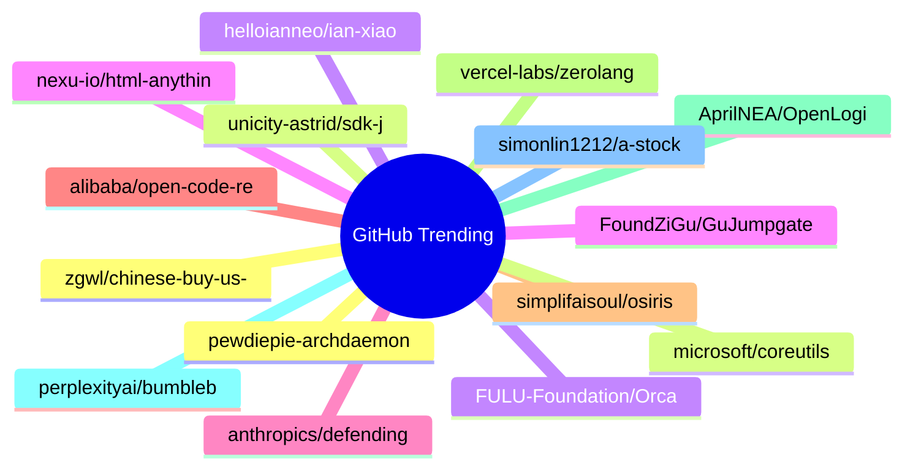

# GitHub Trending 每日 Top 15 (2026-06-09)

## 思维导图

## 列表（15 条）

### 1. pewdiepie-archdaemon/odysseus
- **仓库**: [pewdiepie-archdaemon/odysseus](https://github.com/pewdiepie-archdaemon/odysseus)
- **描述**: Self-hosted AI workspace. 
- **语言**: Python
- **Star**: 63857 | **Fork**: 7808
- **更新**: 2026-06-09

### 2. unicity-astrid/sdk-js
- **仓库**: [unicity-astrid/sdk-js](https://github.com/unicity-astrid/sdk-js)
- **描述**: JavaScript / TypeScript SDK for building Astrid OS capsules. Companion to unicity-astrid/sdk-rust.
- **语言**: TypeScript
- **Star**: 8114 | **Fork**: 36
- **更新**: 2026-06-09

### 3. FULU-Foundation/OrcaSlicer-bambulab
- **仓库**: [FULU-Foundation/OrcaSlicer-bambulab](https://github.com/FULU-Foundation/OrcaSlicer-bambulab)
- **语言**: C++
- **Star**: 6831 | **Fork**: 5159
- **更新**: 2026-06-09

### 4. nexu-io/html-anything
- **仓库**: [nexu-io/html-anything](https://github.com/nexu-io/html-anything)
- **描述**: ✨ The agentic HTML editor — your local AI agent writes the HTML, you ship it. 🚀 75 Skills × 9 Surfaces (magazine · deck · poster · XHS / tweet · prototype · data report · Hyperframes) 🛡️ Sandboxed preview · 📤 1-click to WeChat / X / Zhihu / HTML / PNG 🔑 Zero API key — Claude Code / Cursor / Codex / Gemini / Copilot / OpenCode / Qwen / Aider.
- **语言**: HTML
- **Star**: 6398 | **Fork**: 626
- **更新**: 2026-06-09
- **Topic**: `agent-skills`, `agentic`, `ai-agents`, `ai-design`, `ai-editor`, `byok`

### 5. anthropics/defending-code-reference-harness
- **仓库**: [anthropics/defending-code-reference-harness](https://github.com/anthropics/defending-code-reference-harness)
- **描述**: Skills for threat modeling, scanning, triage, patching, plus an autonomous scanning harness you can /customize
- **语言**: Python
- **Star**: 5354 | **Fork**: 360
- **更新**: 2026-06-09
- **Topic**: `security`

### 6. alibaba/open-code-review
- **仓库**: [alibaba/open-code-review](https://github.com/alibaba/open-code-review)
- **描述**: Open-source & free — Battle-tested at Alibaba's scale. Hybrid architecture code review tool: deterministic pipelines + LLM Agent, precise line-level comments, built-in fine-tuned ruleset (NPE, thread-safety, XSS, SQL injection), OpenAI & Anthropic compatible.
- **语言**: Go
- **Star**: 5353 | **Fork**: 266
- **更新**: 2026-06-09
- **Topic**: `agent`, `code-review`, `code-review-assistant`, `harness`, `repository-level-context`

### 7. simplifaisoul/osiris
- **仓库**: [simplifaisoul/osiris](https://github.com/simplifaisoul/osiris)
- **描述**: Open Source Global Intelligence Platform - Real-Time OSINT Dashboard - A Palantir Alternative
- **语言**: TypeScript
- **Star**: 5009 | **Fork**: 1021
- **更新**: 2026-06-09

### 8. vercel-labs/zerolang
- **仓库**: [vercel-labs/zerolang](https://github.com/vercel-labs/zerolang)
- **描述**: The Programming Language for Agents
- **语言**: C++
- **Star**: 4917 | **Fork**: 320
- **更新**: 2026-06-09

### 9. AprilNEA/OpenLogi
- **仓库**: [AprilNEA/OpenLogi](https://github.com/AprilNEA/OpenLogi)
- **描述**: ⚡️A native, local-first alternative to Logitech Options+, written in Rust 🦀 — remap buttons, DPI, and SmartShift over HID++. No account, no telemetry.
- **语言**: Rust
- **Star**: 4406 | **Fork**: 84
- **更新**: 2026-06-09
- **Topic**: `dpi`, `gpui`, `hid`, `hidpp`, `local-first`, `logitech`

### 10. perplexityai/bumblebee
- **仓库**: [perplexityai/bumblebee](https://github.com/perplexityai/bumblebee)
- **描述**: Read-only developer endpoint scanner for on-disk package, extension, and developer-tool metadata, built to check exposure to known software supply-chain compromises.
- **语言**: Go
- **Star**: 4349 | **Fork**: 392
- **更新**: 2026-06-08
- **Topic**: `golang`, `package-inventory`, `supply-chain-security`

### 11. simonlin1212/a-stock-data
- **仓库**: [simonlin1212/a-stock-data](https://github.com/simonlin1212/a-stock-data)
- **描述**: A股全栈数据工具包 — 7层架构 · 27端点 · 13数据源 · 零第三方依赖 | Full-stack China A-Share data toolkit for AI coding assistants
- **Star**: 3661 | **Fork**: 755
- **更新**: 2026-06-09

### 12. zgwl/chinese-buy-us-stock-guide
- **仓库**: [zgwl/chinese-buy-us-stock-guide](https://github.com/zgwl/chinese-buy-us-stock-guide)
- **描述**: 美股指南
- **Star**: 3661 | **Fork**: 571
- **更新**: 2026-06-09

### 13. microsoft/coreutils
- **仓库**: [microsoft/coreutils](https://github.com/microsoft/coreutils)
- **描述**: Coreutils for Windows: Installer & Packaging
- **语言**: Rust
- **Star**: 3644 | **Fork**: 55
- **更新**: 2026-06-09
- **Topic**: `command-line-tool`, `coreutils`, `gnu-coreutils`

### 14. helloianneo/ian-xiaohei-illustrations
- **仓库**: [helloianneo/ian-xiaohei-illustrations](https://github.com/helloianneo/ian-xiaohei-illustrations)
- **描述**: 中文小黑怪诞正文配图生成 Skill | 16:9 白底手绘 | 少量红橙蓝批注 | Codex Skill
- **Star**: 3531 | **Fork**: 309
- **更新**: 2026-06-09
- **Topic**: `ai-agent`, `chinese`, `codex-skill`, `handdrawn`, `illustration`, `image-generation`

### 15. FoundZiGu/GuJumpgate
- **仓库**: [FoundZiGu/GuJumpgate](https://github.com/FoundZiGu/GuJumpgate)
- **语言**: JavaScript
- **Star**: 3489 | **Fork**: 897
- **更新**: 2026-06-09
