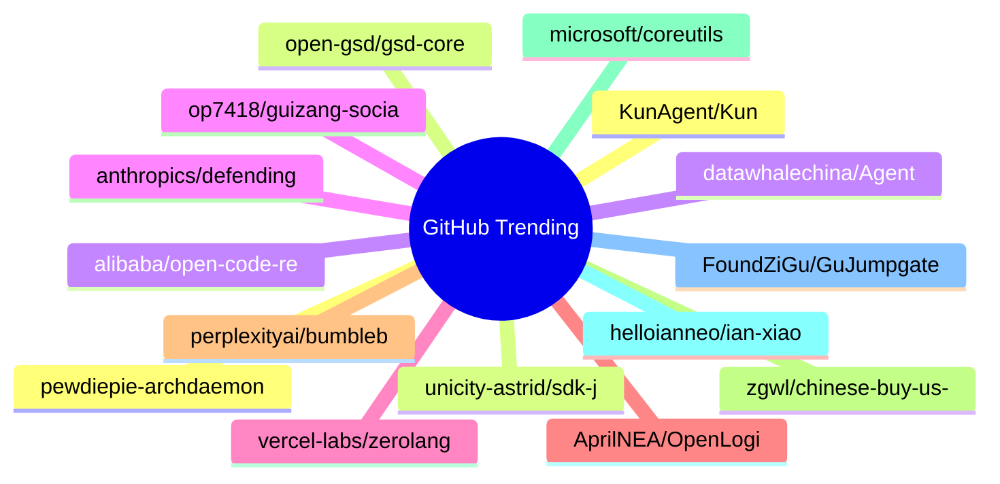

# GitHub Trending 每日 Top 15 (2026-06-11)

## 思维导图

## 列表（15 条）

### 1. pewdiepie-archdaemon/odysseus
- **仓库**: [pewdiepie-archdaemon/odysseus](https://github.com/pewdiepie-archdaemon/odysseus)
- **描述**: Self-hosted AI workspace. 
- **语言**: Python
- **Star**: 67256 | **Fork**: 8389
- **更新**: 2026-06-11

### 2. unicity-astrid/sdk-js
- **仓库**: [unicity-astrid/sdk-js](https://github.com/unicity-astrid/sdk-js)
- **描述**: JavaScript / TypeScript SDK for building Astrid OS capsules. Companion to unicity-astrid/sdk-rust.
- **语言**: TypeScript
- **Star**: 8254 | **Fork**: 36
- **更新**: 2026-06-10

### 3. alibaba/open-code-review
- **仓库**: [alibaba/open-code-review](https://github.com/alibaba/open-code-review)
- **描述**: Open-source & free — Battle-tested at Alibaba's scale. Hybrid architecture code review tool: deterministic pipelines + LLM Agent, precise line-level comments, built-in fine-tuned ruleset (NPE, thread-safety, XSS, SQL injection), OpenAI & Anthropic compatible.
- **语言**: Go
- **Star**: 6099 | **Fork**: 325
- **更新**: 2026-06-11
- **Topic**: `agent`, `code-review`, `code-review-assistant`, `harness`, `repository-level-context`

### 4. anthropics/defending-code-reference-harness
- **仓库**: [anthropics/defending-code-reference-harness](https://github.com/anthropics/defending-code-reference-harness)
- **描述**: Skills for threat modeling, scanning, triage, patching, plus an autonomous scanning harness you can /customize
- **语言**: Python
- **Star**: 5688 | **Fork**: 407
- **更新**: 2026-06-11
- **Topic**: `security`

### 5. vercel-labs/zerolang
- **仓库**: [vercel-labs/zerolang](https://github.com/vercel-labs/zerolang)
- **描述**: The Programming Language for Agents
- **语言**: C++
- **Star**: 4972 | **Fork**: 325
- **更新**: 2026-06-11

### 6. AprilNEA/OpenLogi
- **仓库**: [AprilNEA/OpenLogi](https://github.com/AprilNEA/OpenLogi)
- **描述**: ⚡️A native, local-first alternative to Logitech Options+, written in Rust 🦀 — remap buttons, DPI, and SmartShift over HID++. No account, no telemetry.
- **语言**: Rust
- **Star**: 4615 | **Fork**: 86
- **更新**: 2026-06-11
- **Topic**: `dpi`, `gpui`, `hid`, `hidpp`, `local-first`, `logitech`

### 7. perplexityai/bumblebee
- **仓库**: [perplexityai/bumblebee](https://github.com/perplexityai/bumblebee)
- **描述**: Read-only developer endpoint scanner for on-disk package, extension, and developer-tool metadata, built to check exposure to known software supply-chain compromises.
- **语言**: Go
- **Star**: 4384 | **Fork**: 394
- **更新**: 2026-06-10
- **Topic**: `golang`, `package-inventory`, `supply-chain-security`

### 8. zgwl/chinese-buy-us-stock-guide
- **仓库**: [zgwl/chinese-buy-us-stock-guide](https://github.com/zgwl/chinese-buy-us-stock-guide)
- **描述**: 美股指南
- **Star**: 4091 | **Fork**: 635
- **更新**: 2026-06-11

### 9. microsoft/coreutils
- **仓库**: [microsoft/coreutils](https://github.com/microsoft/coreutils)
- **描述**: Coreutils for Windows: Installer & Packaging
- **语言**: Rust
- **Star**: 3860 | **Fork**: 63
- **更新**: 2026-06-11
- **Topic**: `command-line-tool`, `coreutils`, `gnu-coreutils`

### 10. helloianneo/ian-xiaohei-illustrations
- **仓库**: [helloianneo/ian-xiaohei-illustrations](https://github.com/helloianneo/ian-xiaohei-illustrations)
- **描述**: 中文小黑怪诞正文配图生成 Skill | 16:9 白底手绘 | 少量红橙蓝批注 | Codex Skill
- **Star**: 3830 | **Fork**: 339
- **更新**: 2026-06-11
- **Topic**: `ai-agent`, `chinese`, `codex-skill`, `handdrawn`, `illustration`, `image-generation`

### 11. FoundZiGu/GuJumpgate
- **仓库**: [FoundZiGu/GuJumpgate](https://github.com/FoundZiGu/GuJumpgate)
- **语言**: JavaScript
- **Star**: 3780 | **Fork**: 982
- **更新**: 2026-06-11

### 12. KunAgent/Kun
- **仓库**: [KunAgent/Kun](https://github.com/KunAgent/Kun)
- **描述**: AI agent workspace for DeepSeek models, with Code and Claw modes built into your application.
- **语言**: TypeScript
- **Star**: 3683 | **Fork**: 325
- **更新**: 2026-06-11

### 13. open-gsd/gsd-core
- **仓库**: [open-gsd/gsd-core](https://github.com/open-gsd/gsd-core)
- **描述**: Git. Ship. Done - Core
- **语言**: JavaScript
- **Star**: 3537 | **Fork**: 225
- **更新**: 2026-06-11
- **Topic**: `claude-code`, `context-engineering`, `meta-prompting`, `spec-driven-development`

### 14. datawhalechina/Agent-Learning-Hub
- **仓库**: [datawhalechina/Agent-Learning-Hub](https://github.com/datawhalechina/Agent-Learning-Hub)
- **描述**: AI Agent 学习路线与资料库收集
- **语言**: HTML
- **Star**: 3432 | **Fork**: 347
- **更新**: 2026-06-11

### 15. op7418/guizang-social-card-skill
- **仓库**: [op7418/guizang-social-card-skill](https://github.com/op7418/guizang-social-card-skill)
- **描述**: 🪧 Claude Code / Codex skill — generate Xiaohongshu carousels & WeChat 21:9+1:1 cover pairs. Editorial × Swiss visual systems, 28 layouts, 10 themes, single-file HTML → PNG. 小红书图文 + 公众号封面对
- **语言**: HTML
- **Star**: 3301 | **Fork**: 303
- **更新**: 2026-06-11
- **Topic**: `agent-skill`, `ai-agent`, `anthropic`, `claude-code`, `claude-skill`, `codex`
