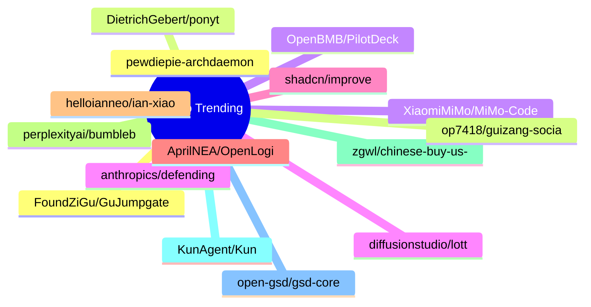

# GitHub Trending 每日 Top 15 (2026-06-17)

## 思维导图

## 列表（15 条）

### 1. pewdiepie-archdaemon/odysseus
- **仓库**: [pewdiepie-archdaemon/odysseus](https://github.com/pewdiepie-archdaemon/odysseus)
- **描述**: Self-hosted AI workspace. 
- **语言**: Python
- **Star**: 72559 | **Fork**: 9287
- **更新**: 2026-06-17

### 2. DietrichGebert/ponytail
- **仓库**: [DietrichGebert/ponytail](https://github.com/DietrichGebert/ponytail)
- **描述**: Makes your AI agent think like the laziest senior dev in the room. The best code is the code you never wrote.
- **语言**: JavaScript
- **Star**: 26288 | **Fork**: 1163
- **更新**: 2026-06-17
- **Topic**: `agent-skills`, `ai-agents`, `claude`, `claude-code`, `claude-code-plugin`, `cursor-rules`

### 3. XiaomiMiMo/MiMo-Code
- **仓库**: [XiaomiMiMo/MiMo-Code](https://github.com/XiaomiMiMo/MiMo-Code)
- **语言**: TypeScript
- **Star**: 9402 | **Fork**: 838
- **更新**: 2026-06-17

### 4. anthropics/defending-code-reference-harness
- **仓库**: [anthropics/defending-code-reference-harness](https://github.com/anthropics/defending-code-reference-harness)
- **描述**: Skills for threat modeling, scanning, triage, patching, plus an autonomous scanning harness you can /customize
- **语言**: Python
- **Star**: 6041 | **Fork**: 442
- **更新**: 2026-06-17
- **Topic**: `security`

### 5. shadcn/improve
- **仓库**: [shadcn/improve](https://github.com/shadcn/improve)
- **描述**: Use your most capable model to audit your codebase and write plans for cheaper models to execute.
- **Star**: 5028 | **Fork**: 178
- **更新**: 2026-06-17

### 6. AprilNEA/OpenLogi
- **仓库**: [AprilNEA/OpenLogi](https://github.com/AprilNEA/OpenLogi)
- **描述**: ⚡️A native, local-first alternative to Logitech Options+, written in Rust 🦀 — remap buttons, DPI, and SmartShift over HID++. No account, no telemetry.
- **语言**: Rust
- **Star**: 4970 | **Fork**: 94
- **更新**: 2026-06-17
- **Topic**: `dpi`, `gpui`, `hid`, `hidpp`, `local-first`, `logitech`

### 7. helloianneo/ian-xiaohei-illustrations
- **仓库**: [helloianneo/ian-xiaohei-illustrations](https://github.com/helloianneo/ian-xiaohei-illustrations)
- **描述**: 中文小黑怪诞正文配图生成 Skill | 16:9 白底手绘 | 少量红橙蓝批注 | Codex Skill
- **Star**: 4906 | **Fork**: 557
- **更新**: 2026-06-17
- **Topic**: `ai-agent`, `chinese`, `codex-skill`, `handdrawn`, `illustration`, `image-generation`

### 8. perplexityai/bumblebee
- **仓库**: [perplexityai/bumblebee](https://github.com/perplexityai/bumblebee)
- **描述**: Read-only developer endpoint scanner for on-disk package, extension, and developer-tool metadata, built to check exposure to known software supply-chain compromises.
- **语言**: Go
- **Star**: 4483 | **Fork**: 406
- **更新**: 2026-06-17
- **Topic**: `golang`, `package-inventory`, `supply-chain-security`

### 9. zgwl/chinese-buy-us-stock-guide
- **仓库**: [zgwl/chinese-buy-us-stock-guide](https://github.com/zgwl/chinese-buy-us-stock-guide)
- **描述**: 美股指南
- **Star**: 4442 | **Fork**: 684
- **更新**: 2026-06-17

### 10. KunAgent/Kun
- **仓库**: [KunAgent/Kun](https://github.com/KunAgent/Kun)
- **描述**: AI agent workspace with Code and Write modes built into your application.
- **语言**: TypeScript
- **Star**: 4350 | **Fork**: 376
- **更新**: 2026-06-17

### 11. open-gsd/gsd-core
- **仓库**: [open-gsd/gsd-core](https://github.com/open-gsd/gsd-core)
- **描述**: Git. Ship. Done - Core
- **语言**: JavaScript
- **Star**: 4221 | **Fork**: 270
- **更新**: 2026-06-17
- **Topic**: `claude-code`, `context-engineering`, `meta-prompting`, `spec-driven-development`

### 12. FoundZiGu/GuJumpgate
- **仓库**: [FoundZiGu/GuJumpgate](https://github.com/FoundZiGu/GuJumpgate)
- **语言**: JavaScript
- **Star**: 3894 | **Fork**: 1000
- **更新**: 2026-06-17

### 13. op7418/guizang-social-card-skill
- **仓库**: [op7418/guizang-social-card-skill](https://github.com/op7418/guizang-social-card-skill)
- **描述**: 🪧 Claude Code / Codex skill — generate Xiaohongshu carousels & WeChat 21:9+1:1 cover pairs. Editorial × Swiss visual systems, 28 layouts, 10 themes, single-file HTML → PNG. 小红书图文 + 公众号封面对
- **语言**: HTML
- **Star**: 3662 | **Fork**: 322
- **更新**: 2026-06-17
- **Topic**: `agent-skill`, `ai-agent`, `anthropic`, `claude-code`, `claude-skill`, `codex`

### 14. OpenBMB/PilotDeck
- **仓库**: [OpenBMB/PilotDeck](https://github.com/OpenBMB/PilotDeck)
- **描述**: Task-oriented AI Agent productivity platform
- **语言**: TypeScript
- **Star**: 3436 | **Fork**: 356
- **更新**: 2026-06-17

### 15. diffusionstudio/lottie
- **仓库**: [diffusionstudio/lottie](https://github.com/diffusionstudio/lottie)
- **描述**: Generate production-ready Lottie animations with Claude Code or Codex
- **语言**: TypeScript
- **Star**: 3298 | **Fork**: 173
- **更新**: 2026-06-17
