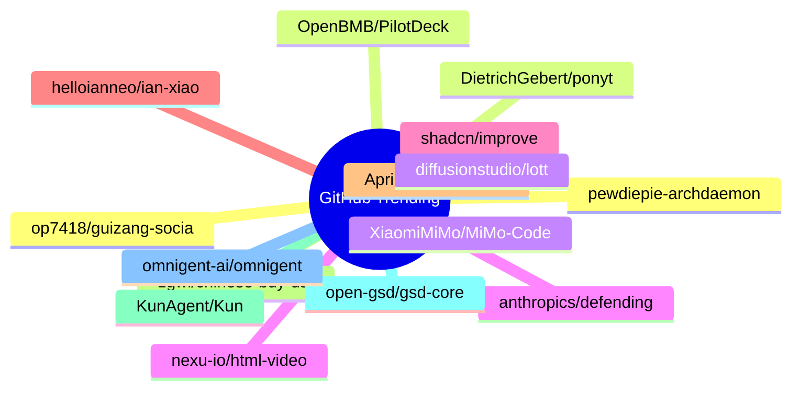

# GitHub Trending 每日 Top 15 (2026-06-19)

## 思维导图

## 列表（15 条）

### 1. pewdiepie-archdaemon/odysseus
- **仓库**: [pewdiepie-archdaemon/odysseus](https://github.com/pewdiepie-archdaemon/odysseus)
- **描述**: Self-hosted AI workspace. 
- **语言**: Python
- **Star**: 73727 | **Fork**: 9476
- **更新**: 2026-06-19

### 2. DietrichGebert/ponytail
- **仓库**: [DietrichGebert/ponytail](https://github.com/DietrichGebert/ponytail)
- **描述**: Makes your AI agent think like the laziest senior dev in the room. The best code is the code you never wrote.
- **语言**: JavaScript
- **Star**: 37329 | **Fork**: 1749
- **更新**: 2026-06-19
- **Topic**: `agent-skills`, `ai-agents`, `claude`, `claude-code`, `claude-code-plugin`, `cursor-rules`

### 3. XiaomiMiMo/MiMo-Code
- **仓库**: [XiaomiMiMo/MiMo-Code](https://github.com/XiaomiMiMo/MiMo-Code)
- **描述**: MiMo Code: Where Models and Agents Co-Evolve
- **语言**: TypeScript
- **Star**: 9817 | **Fork**: 899
- **更新**: 2026-06-19
- **Topic**: `ai`, `ai-agents`, `cli`, `mimo`, `mimo-code`

### 4. anthropics/defending-code-reference-harness
- **仓库**: [anthropics/defending-code-reference-harness](https://github.com/anthropics/defending-code-reference-harness)
- **描述**: Skills for threat modeling, scanning, triage, patching, plus an autonomous scanning harness you can /customize
- **语言**: Python
- **Star**: 6089 | **Fork**: 453
- **更新**: 2026-06-19
- **Topic**: `security`

### 5. shadcn/improve
- **仓库**: [shadcn/improve](https://github.com/shadcn/improve)
- **描述**: Use your most capable model to audit your codebase and write plans for cheaper models to execute.
- **Star**: 5492 | **Fork**: 212
- **更新**: 2026-06-19

### 6. helloianneo/ian-xiaohei-illustrations
- **仓库**: [helloianneo/ian-xiaohei-illustrations](https://github.com/helloianneo/ian-xiaohei-illustrations)
- **描述**: 中文小黑怪诞正文配图生成 Skill | 16:9 白底手绘 | 少量红橙蓝批注 | Codex Skill
- **Star**: 5226 | **Fork**: 595
- **更新**: 2026-06-19
- **Topic**: `ai-agent`, `chinese`, `codex-skill`, `handdrawn`, `illustration`, `image-generation`

### 7. AprilNEA/OpenLogi
- **仓库**: [AprilNEA/OpenLogi](https://github.com/AprilNEA/OpenLogi)
- **描述**: ⚡️A native, local-first alternative to Logitech Options+, written in Rust 🦀 — remap buttons, DPI, and SmartShift over HID++. No account, no telemetry.
- **语言**: Rust
- **Star**: 5123 | **Fork**: 98
- **更新**: 2026-06-19
- **Topic**: `dpi`, `gpui`, `hid`, `hidpp`, `local-first`, `logitech`

### 8. zgwl/chinese-buy-us-stock-guide
- **仓库**: [zgwl/chinese-buy-us-stock-guide](https://github.com/zgwl/chinese-buy-us-stock-guide)
- **描述**: 美股指南
- **Star**: 4696 | **Fork**: 720
- **更新**: 2026-06-19

### 9. KunAgent/Kun
- **仓库**: [KunAgent/Kun](https://github.com/KunAgent/Kun)
- **描述**: AI agent workspace with Code and Write modes built into your application.
- **语言**: TypeScript
- **Star**: 4477 | **Fork**: 395
- **更新**: 2026-06-19

### 10. open-gsd/gsd-core
- **仓库**: [open-gsd/gsd-core](https://github.com/open-gsd/gsd-core)
- **描述**: Git. Ship. Done - Core
- **语言**: JavaScript
- **Star**: 4467 | **Fork**: 275
- **更新**: 2026-06-19
- **Topic**: `claude-code`, `context-engineering`, `meta-prompting`, `spec-driven-development`

### 11. omnigent-ai/omnigent
- **仓库**: [omnigent-ai/omnigent](https://github.com/omnigent-ai/omnigent)
- **描述**: Omnigent is an open-source AI agent framework and meta-harness: orchestrate Claude Code, Codex, Cursor, Pi, and custom agents — swap harnesses without rewriting, enforce policies and sandboxing, and collaborate in real time from any device.
- **语言**: Python
- **Star**: 3823 | **Fork**: 426
- **更新**: 2026-06-19
- **Topic**: `agent-framework`, `agent-governance`, `agent-orchestration`, `agents`, `ai`, `ai-agent`

### 12. op7418/guizang-social-card-skill
- **仓库**: [op7418/guizang-social-card-skill](https://github.com/op7418/guizang-social-card-skill)
- **描述**: 🪧 Claude Code / Codex skill — generate Xiaohongshu carousels & WeChat 21:9+1:1 cover pairs. Editorial × Swiss visual systems, 28 layouts, 10 themes, single-file HTML → PNG. 小红书图文 + 公众号封面对
- **语言**: HTML
- **Star**: 3765 | **Fork**: 332
- **更新**: 2026-06-19
- **Topic**: `agent-skill`, `ai-agent`, `anthropic`, `claude-code`, `claude-skill`, `codex`

### 13. OpenBMB/PilotDeck
- **仓库**: [OpenBMB/PilotDeck](https://github.com/OpenBMB/PilotDeck)
- **描述**: Task-oriented AI Agent productivity platform
- **语言**: TypeScript
- **Star**: 3547 | **Fork**: 362
- **更新**: 2026-06-19

### 14. diffusionstudio/lottie
- **仓库**: [diffusionstudio/lottie](https://github.com/diffusionstudio/lottie)
- **描述**: Generate production-ready Lottie animations with Claude Code or Codex
- **语言**: TypeScript
- **Star**: 3463 | **Fork**: 184
- **更新**: 2026-06-19

### 15. nexu-io/html-video
- **仓库**: [nexu-io/html-video](https://github.com/nexu-io/html-video)
- **描述**: Programmatic video for coding agents — HTML to video on your laptop. Turn HTML, CSS & data into real MP4s with pluggable render engines, 21 templates, AI soundtrack. Apache-2.0, no per-render fees. An official project by the Open Design team.
- **语言**: HTML
- **Star**: 3300 | **Fork**: 401
- **更新**: 2026-06-19
- **Topic**: `ai-agent`, `apache-2`, `coding-agent`, `css`, `ffmpeg`, `html`
