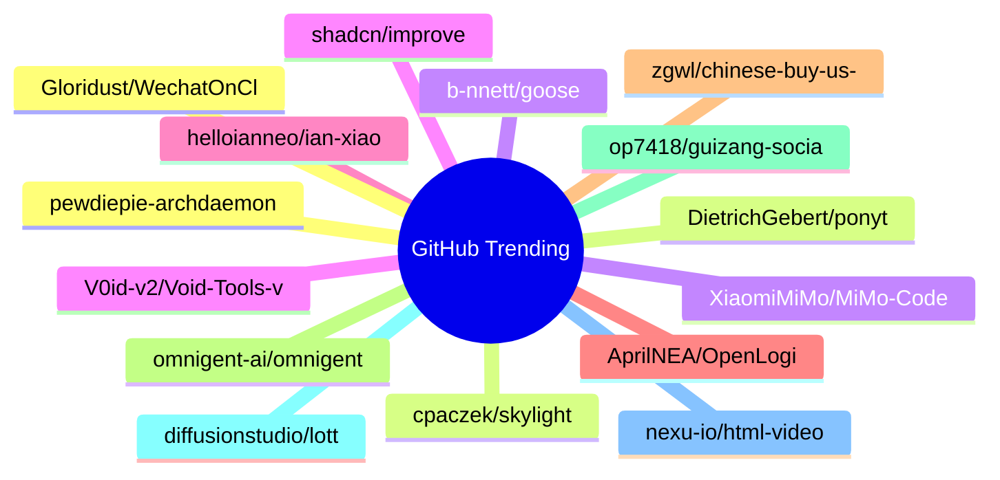

# GitHub Trending 每日 Top 15 (2026-06-21)

## 思维导图

## 列表（15 条）

### 1. pewdiepie-archdaemon/odysseus
- **仓库**: [pewdiepie-archdaemon/odysseus](https://github.com/pewdiepie-archdaemon/odysseus)
- **描述**: Self-hosted AI workspace. 
- **语言**: Python
- **Star**: 75154 | **Fork**: 9749
- **更新**: 2026-06-21

### 2. DietrichGebert/ponytail
- **仓库**: [DietrichGebert/ponytail](https://github.com/DietrichGebert/ponytail)
- **描述**: Makes your AI agent think like the laziest senior dev in the room. The best code is the code you never wrote.
- **语言**: JavaScript
- **Star**: 43749 | **Fork**: 2134
- **更新**: 2026-06-21
- **Topic**: `agent-skills`, `ai-agents`, `claude`, `claude-code`, `claude-code-plugin`, `cursor-rules`

### 3. XiaomiMiMo/MiMo-Code
- **仓库**: [XiaomiMiMo/MiMo-Code](https://github.com/XiaomiMiMo/MiMo-Code)
- **描述**: MiMo Code: Where Models and Agents Co-Evolve
- **语言**: TypeScript
- **Star**: 10098 | **Fork**: 933
- **更新**: 2026-06-21
- **Topic**: `ai`, `ai-agents`, `cli`, `mimo`, `mimo-code`

### 4. shadcn/improve
- **仓库**: [shadcn/improve](https://github.com/shadcn/improve)
- **描述**: Use your most capable model to audit your codebase and write plans for cheaper models to execute.
- **Star**: 5788 | **Fork**: 227
- **更新**: 2026-06-21

### 5. helloianneo/ian-xiaohei-illustrations
- **仓库**: [helloianneo/ian-xiaohei-illustrations](https://github.com/helloianneo/ian-xiaohei-illustrations)
- **描述**: 中文小黑怪诞正文配图生成 Skill | 16:9 白底手绘 | 少量红橙蓝批注 | Codex Skill
- **Star**: 5449 | **Fork**: 634
- **更新**: 2026-06-21
- **Topic**: `ai-agent`, `chinese`, `codex-skill`, `handdrawn`, `illustration`, `image-generation`

### 6. AprilNEA/OpenLogi
- **仓库**: [AprilNEA/OpenLogi](https://github.com/AprilNEA/OpenLogi)
- **描述**: ⚡️A native, local-first alternative to Logitech Options+, written in Rust 🦀 — remap buttons, DPI, and SmartShift over HID++. No account, no telemetry.
- **语言**: Rust
- **Star**: 5188 | **Fork**: 98
- **更新**: 2026-06-21
- **Topic**: `dpi`, `gpui`, `hid`, `hidpp`, `local-first`, `logitech`

### 7. zgwl/chinese-buy-us-stock-guide
- **仓库**: [zgwl/chinese-buy-us-stock-guide](https://github.com/zgwl/chinese-buy-us-stock-guide)
- **描述**: 美股指南
- **Star**: 4762 | **Fork**: 733
- **更新**: 2026-06-21

### 8. omnigent-ai/omnigent
- **仓库**: [omnigent-ai/omnigent](https://github.com/omnigent-ai/omnigent)
- **描述**: Omnigent is an open-source AI agent framework and meta-harness: orchestrate Claude Code, Codex, Cursor, Pi, and custom agents — swap harnesses without rewriting, enforce policies and sandboxing, and collaborate in real time from any device.
- **语言**: Python
- **Star**: 4213 | **Fork**: 475
- **更新**: 2026-06-21
- **Topic**: `agent-framework`, `agent-governance`, `agent-orchestration`, `agents`, `ai`, `ai-agent`

### 9. op7418/guizang-social-card-skill
- **仓库**: [op7418/guizang-social-card-skill](https://github.com/op7418/guizang-social-card-skill)
- **描述**: 🪧 Claude Code / Codex skill — generate Xiaohongshu carousels & WeChat 21:9+1:1 cover pairs. Editorial × Swiss visual systems, 28 layouts, 10 themes, single-file HTML → PNG. 小红书图文 + 公众号封面对
- **语言**: HTML
- **Star**: 3819 | **Fork**: 334
- **更新**: 2026-06-21
- **Topic**: `agent-skill`, `ai-agent`, `anthropic`, `claude-code`, `claude-skill`, `codex`

### 10. diffusionstudio/lottie
- **仓库**: [diffusionstudio/lottie](https://github.com/diffusionstudio/lottie)
- **描述**: Generate production-ready Lottie animations with Claude Code or Codex
- **语言**: TypeScript
- **Star**: 3518 | **Fork**: 188
- **更新**: 2026-06-21

### 11. nexu-io/html-video
- **仓库**: [nexu-io/html-video](https://github.com/nexu-io/html-video)
- **描述**: Programmatic video for coding agents — HTML to video on your laptop. Turn HTML, CSS & data into real MP4s with pluggable render engines, 21 templates, AI soundtrack. Apache-2.0, no per-render fees. An official project by the Open Design team.
- **语言**: HTML
- **Star**: 3372 | **Fork**: 410
- **更新**: 2026-06-21
- **Topic**: `ai-agent`, `apache-2`, `coding-agent`, `css`, `ffmpeg`, `html`

### 12. Gloridust/WechatOnCloud
- **仓库**: [Gloridust/WechatOnCloud](https://github.com/Gloridust/WechatOnCloud)
- **描述**: 云微WOC，云微信，自由连接
- **语言**: TypeScript
- **Star**: 3018 | **Fork**: 718
- **更新**: 2026-06-21

### 13. cpaczek/skylight
- **仓库**: [cpaczek/skylight](https://github.com/cpaczek/skylight)
- **描述**: Project the aircraft passing overhead onto your ceiling in real time, from an RTL-SDR — with a live sky layer (sun, moon, stars, ISS) and where each plane is headed.
- **语言**: TypeScript
- **Star**: 2818 | **Fork**: 320
- **更新**: 2026-06-21
- **Topic**: `ads-b`, `aircraft`, `art-installation`, `flight-tracker`, `projector`, `raspberry-pi`

### 14. b-nnett/goose
- **仓库**: [b-nnett/goose](https://github.com/b-nnett/goose)
- **描述**: Goose Swift proof-of-concept README
- **语言**: Rust
- **Star**: 2584 | **Fork**: 639
- **更新**: 2026-06-20

### 15. V0id-v2/Void-Tools-v2.0
- **仓库**: [V0id-v2/Void-Tools-v2.0](https://github.com/V0id-v2/Void-Tools-v2.0)
- **描述**: Python terminal multitool — OSINT, Discord, web & network utilities. Rich TUI, 13 themes, remote updates. Educational use only.
- **语言**: Python
- **Star**: 2482 | **Fork**: 31
- **更新**: 2026-06-21
- **Topic**: `discord-joiner`, `discord-multi-tool`, `discord-multitool`, `discord-multitools`, `discord-nuke-bot`, `discord-nuker`
