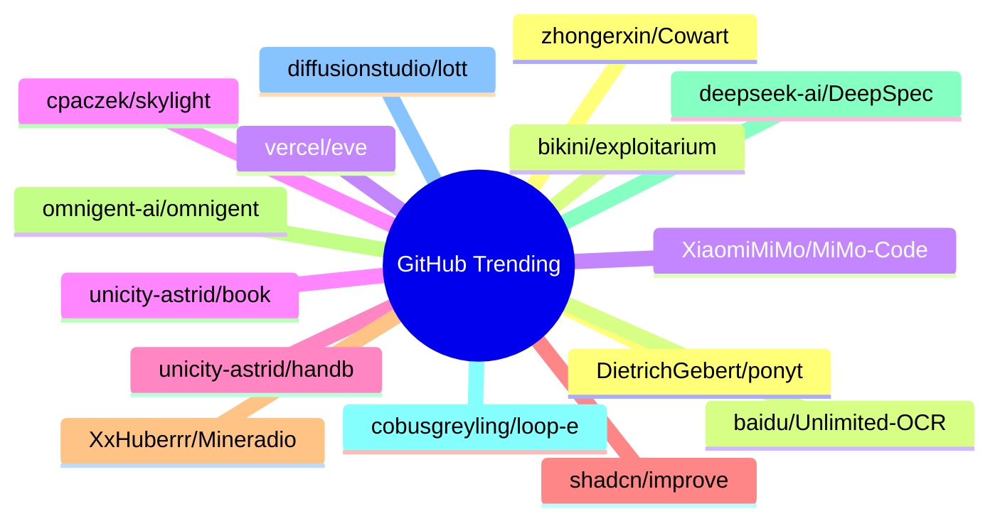

# GitHub Trending 每日 Top 15 (2026-07-01)

## 思维导图

## 列表（15 条）

### 1. DietrichGebert/ponytail
- **仓库**: [DietrichGebert/ponytail](https://github.com/DietrichGebert/ponytail)
- **描述**: Makes your AI agent think like the laziest senior dev in the room. The best code is the code you never wrote.
- **语言**: JavaScript
- **Star**: 69342 | **Fork**: 3576
- **更新**: 2026-07-01
- **Topic**: `agent-skills`, `ai-agents`, `claude`, `claude-code`, `claude-code-plugin`, `cursor-rules`

### 2. baidu/Unlimited-OCR
- **仓库**: [baidu/Unlimited-OCR](https://github.com/baidu/Unlimited-OCR)
- **描述**: Unlimited OCR Works: Welcome the Era of One-shot Long-horizon Parsing.
- **语言**: Python
- **Star**: 12561 | **Fork**: 988
- **更新**: 2026-07-01

### 3. XiaomiMiMo/MiMo-Code
- **仓库**: [XiaomiMiMo/MiMo-Code](https://github.com/XiaomiMiMo/MiMo-Code)
- **描述**: MiMo Code: Where Models and Agents Co-Evolve
- **语言**: TypeScript
- **Star**: 11148 | **Fork**: 1085
- **更新**: 2026-07-01
- **Topic**: `ai`, `ai-agents`, `cli`, `mimo`, `mimo-code`

### 4. unicity-astrid/book
- **仓库**: [unicity-astrid/book](https://github.com/unicity-astrid/book)
- **描述**: The canonical reference for Astrid OS: kernel, capsules, host ABI, the bus, and the security model.
- **语言**: Perl
- **Star**: 7536 | **Fork**: 31
- **更新**: 2026-06-30

### 5. unicity-astrid/handbook
- **仓库**: [unicity-astrid/handbook](https://github.com/unicity-astrid/handbook)
- **描述**: How to work on Astrid: the polyrepo, the kernel-is-dumb law, the RFC trigger, contribution tiers, and the release process.
- **Star**: 7484 | **Fork**: 42
- **更新**: 2026-06-30

### 6. shadcn/improve
- **仓库**: [shadcn/improve](https://github.com/shadcn/improve)
- **描述**: Use your most capable model to audit your codebase and write plans for cheaper models to execute.
- **Star**: 6465 | **Fork**: 269
- **更新**: 2026-07-01

### 7. XxHuberrr/Mineradio
- **仓库**: [XxHuberrr/Mineradio](https://github.com/XxHuberrr/Mineradio)
- **描述**: 一款以电影镜头、粒子视觉和歌词舞台为核心的沉浸式音乐播放器。
- **语言**: HTML
- **Star**: 6000 | **Fork**: 454
- **更新**: 2026-07-01

### 8. omnigent-ai/omnigent
- **仓库**: [omnigent-ai/omnigent](https://github.com/omnigent-ai/omnigent)
- **描述**: Omnigent is an open-source AI agent framework and meta-harness: orchestrate Claude Code, Codex, Cursor, Pi, and custom agents — swap harnesses without rewriting, enforce policies and sandboxing, and collaborate in real time from any device.
- **语言**: Python
- **Star**: 5802 | **Fork**: 734
- **更新**: 2026-07-01
- **Topic**: `agent-framework`, `agent-governance`, `agent-orchestration`, `agents`, `ai`, `ai-agent`

### 9. deepseek-ai/DeepSpec
- **仓库**: [deepseek-ai/DeepSpec](https://github.com/deepseek-ai/DeepSpec)
- **描述**: DeepSpec: a full-stack codebase for training and evaluating speculative decoding algorithms
- **语言**: Python
- **Star**: 5400 | **Fork**: 430
- **更新**: 2026-07-01

### 10. cobusgreyling/loop-engineering
- **仓库**: [cobusgreyling/loop-engineering](https://github.com/cobusgreyling/loop-engineering)
- **描述**: Practical patterns, starters & CLI tools for loop engineering with AI coding agents. Design systems that prompt and orchestrate agents (inspired by Addy Osmani and Boris Cherny). Includes loop-audit, loop-init, loop-cost.
- **语言**: JavaScript
- **Star**: 4493 | **Fork**: 572
- **更新**: 2026-07-01
- **Topic**: `agentic-ai`, `ai-agents`, `ai-coding`, `anthropic`, `automation`, `claude`

### 11. diffusionstudio/lottie
- **仓库**: [diffusionstudio/lottie](https://github.com/diffusionstudio/lottie)
- **描述**: Generate production-ready Lottie animations with Claude Code or Codex
- **语言**: TypeScript
- **Star**: 4184 | **Fork**: 225
- **更新**: 2026-07-01

### 12. zhongerxin/Cowart
- **仓库**: [zhongerxin/Cowart](https://github.com/zhongerxin/Cowart)
- **语言**: JavaScript
- **Star**: 3533 | **Fork**: 278
- **更新**: 2026-07-01

### 13. bikini/exploitarium
- **仓库**: [bikini/exploitarium](https://github.com/bikini/exploitarium)
- **描述**: A single archive of public exploit PoCs and vulnerability research writeups. At the time I post these, none have been reported. Feel free to report them yourself and take credit for the CVE if handed out lulz. Please do not abuse these. I do this so to allure people into the field, and I've always found this is the most efficient way.
- **语言**: Python
- **Star**: 3029 | **Fork**: 897
- **更新**: 2026-07-01

### 14. vercel/eve
- **仓库**: [vercel/eve](https://github.com/vercel/eve)
- **描述**: The Framework for Building Agents
- **语言**: TypeScript
- **Star**: 2994 | **Fork**: 230
- **更新**: 2026-07-01
- **Topic**: `agent`, `framework`, `harness`, `javascript`, `markdown`, `sandbox`

### 15. cpaczek/skylight
- **仓库**: [cpaczek/skylight](https://github.com/cpaczek/skylight)
- **描述**: Project the aircraft passing overhead onto your ceiling in real time, from an RTL-SDR — with a live sky layer (sun, moon, stars, ISS) and where each plane is headed.
- **语言**: TypeScript
- **Star**: 2970 | **Fork**: 355
- **更新**: 2026-07-01
- **Topic**: `ads-b`, `aircraft`, `art-installation`, `flight-tracker`, `projector`, `raspberry-pi`
