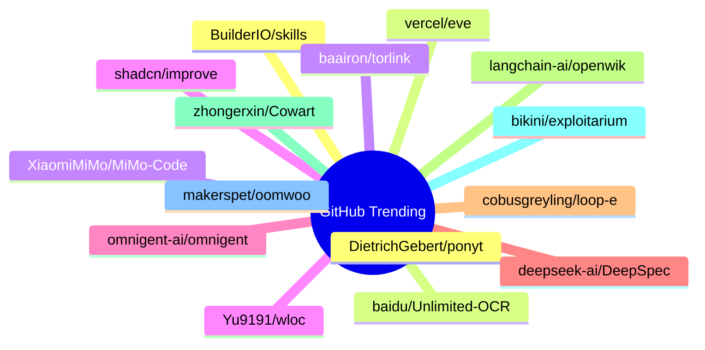

# GitHub Trending 每日 Top 15 (2026-07-06)

## 思维导图

## 列表（15 条）

### 1. DietrichGebert/ponytail
- **仓库**: [DietrichGebert/ponytail](https://github.com/DietrichGebert/ponytail)
- **描述**: Makes your AI agent think like the laziest senior dev in the room. The best code is the code you never wrote.
- **语言**: JavaScript
- **Star**: 75061 | **Fork**: 3967
- **更新**: 2026-07-06
- **Topic**: `agent-skills`, `ai-agents`, `claude`, `claude-code`, `claude-code-plugin`, `cursor-rules`

### 2. baidu/Unlimited-OCR
- **仓库**: [baidu/Unlimited-OCR](https://github.com/baidu/Unlimited-OCR)
- **描述**: Unlimited OCR Works: Welcome the Era of One-shot Long-horizon Parsing.
- **语言**: Python
- **Star**: 13389 | **Fork**: 1083
- **更新**: 2026-07-06

### 3. XiaomiMiMo/MiMo-Code
- **仓库**: [XiaomiMiMo/MiMo-Code](https://github.com/XiaomiMiMo/MiMo-Code)
- **描述**: MiMo Code: Where Models and Agents Co-Evolve
- **语言**: TypeScript
- **Star**: 11489 | **Fork**: 1123
- **更新**: 2026-07-06
- **Topic**: `ai`, `ai-agents`, `cli`, `mimo`, `mimo-code`

### 4. shadcn/improve
- **仓库**: [shadcn/improve](https://github.com/shadcn/improve)
- **描述**: Use your most capable model to audit your codebase and write plans for cheaper models to execute.
- **Star**: 6953 | **Fork**: 284
- **更新**: 2026-07-06

### 5. omnigent-ai/omnigent
- **仓库**: [omnigent-ai/omnigent](https://github.com/omnigent-ai/omnigent)
- **描述**: Omnigent is an open-source AI agent framework and meta-harness: orchestrate Claude Code, Codex, Cursor, Pi, and custom agents — swap harnesses without rewriting, enforce policies and sandboxing, and collaborate in real time from any device.
- **语言**: Python
- **Star**: 6330 | **Fork**: 829
- **更新**: 2026-07-06
- **Topic**: `agent-framework`, `agent-governance`, `agent-orchestration`, `agents`, `ai`, `ai-agent`

### 6. deepseek-ai/DeepSpec
- **仓库**: [deepseek-ai/DeepSpec](https://github.com/deepseek-ai/DeepSpec)
- **描述**: DeepSpec: a full-stack codebase for training and evaluating speculative decoding algorithms
- **语言**: Python
- **Star**: 6258 | **Fork**: 534
- **更新**: 2026-07-06

### 7. cobusgreyling/loop-engineering
- **仓库**: [cobusgreyling/loop-engineering](https://github.com/cobusgreyling/loop-engineering)
- **描述**: Practical patterns, starters & CLI tools for loop engineering with AI coding agents. Design systems that prompt and orchestrate agents (inspired by Addy Osmani and Boris Cherny). Includes loop-audit, loop-init, loop-cost.
- **语言**: JavaScript
- **Star**: 6007 | **Fork**: 781
- **更新**: 2026-07-06
- **Topic**: `agentic-ai`, `ai-agents`, `ai-coding`, `anthropic`, `automation`, `claude`

### 8. langchain-ai/openwiki
- **仓库**: [langchain-ai/openwiki](https://github.com/langchain-ai/openwiki)
- **描述**: OpenWiki is a CLI that writes and maintains agent documentation for your codebase.
- **语言**: TypeScript
- **Star**: 5566 | **Fork**: 390
- **更新**: 2026-07-06

### 9. zhongerxin/Cowart
- **仓库**: [zhongerxin/Cowart](https://github.com/zhongerxin/Cowart)
- **语言**: JavaScript
- **Star**: 3906 | **Fork**: 306
- **更新**: 2026-07-06

### 10. bikini/exploitarium
- **仓库**: [bikini/exploitarium](https://github.com/bikini/exploitarium)
- **描述**: A single archive of public exploit PoCs and vulnerability research writeups. At the time I post these, none have been reported. Feel free to report them yourself and take credit for the CVE if handed out lulz. Please do not abuse these. I do this so to allure people into the field, and I've always found this is the most efficient way.
- **语言**: Python
- **Star**: 3698 | **Fork**: 1072
- **更新**: 2026-07-06

### 11. makerspet/oomwoo
- **仓库**: [makerspet/oomwoo](https://github.com/makerspet/oomwoo)
- **描述**: Open-source vacuum robot cleaner
- **语言**: Python
- **Star**: 3647 | **Fork**: 157
- **更新**: 2026-07-06
- **Topic**: `3d-printing`, `arduino`, `diy-electronics`, `diy-project`, `esp32`, `esp32-arduino`

### 12. BuilderIO/skills
- **仓库**: [BuilderIO/skills](https://github.com/BuilderIO/skills)
- **描述**: Skills for coding agents
- **语言**: JavaScript
- **Star**: 3456 | **Fork**: 170
- **更新**: 2026-07-06
- **Topic**: `skills`

### 13. vercel/eve
- **仓库**: [vercel/eve](https://github.com/vercel/eve)
- **描述**: The Framework for Building Agents
- **语言**: TypeScript
- **Star**: 3234 | **Fork**: 260
- **更新**: 2026-07-06
- **Topic**: `agent`, `framework`, `harness`, `javascript`, `markdown`, `sandbox`

### 14. baairon/torlink
- **仓库**: [baairon/torlink](https://github.com/baairon/torlink)
- **描述**: A sleek, zero-setup torrent finder and downloader that lives right in your terminal.
- **语言**: TypeScript
- **Star**: 3103 | **Fork**: 211
- **更新**: 2026-07-06
- **Topic**: `downloader`, `magnet-links`, `p2p`, `torrent`, `torrent-client`, `zero-configuration`

### 15. Yu9191/wloc
- **仓库**: [Yu9191/wloc](https://github.com/Yu9191/wloc)
- **描述**: 修改 Apple 网络定位（gs-loc）返回坐标 · 支持 Surge / Quantumult X / Loon / Stash · 快捷指令一键设置/恢复定位
- **语言**: JavaScript
- **Star**: 3084 | **Fork**: 421
- **更新**: 2026-07-06
