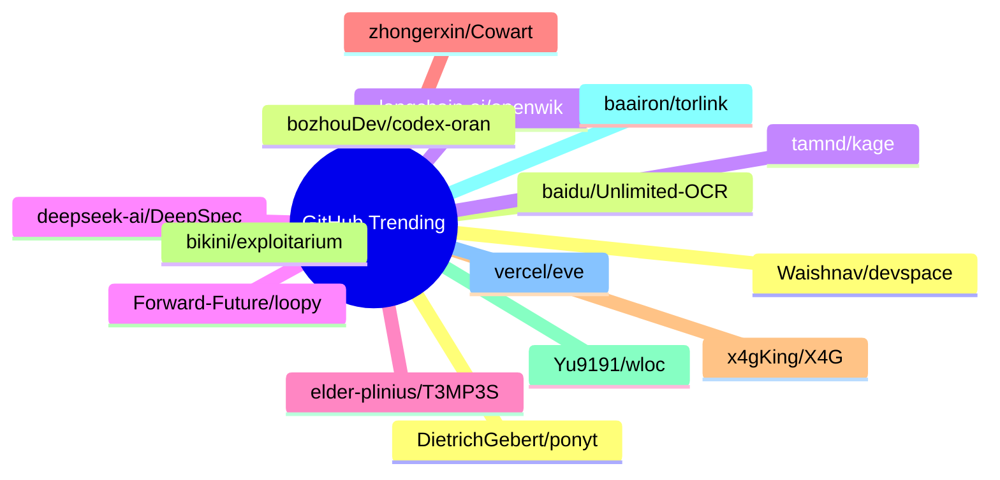

# GitHub Trending 每日 Top 15 (2026-07-11)

## 思维导图

## 列表（15 条）

### 1. DietrichGebert/ponytail
- **仓库**: [DietrichGebert/ponytail](https://github.com/DietrichGebert/ponytail)
- **描述**: Makes your AI agent think like the laziest senior dev in the room. The best code is the code you never wrote.
- **语言**: JavaScript
- **Star**: 80242 | **Fork**: 4322
- **更新**: 2026-07-11
- **Topic**: `agent-skills`, `ai-agents`, `claude`, `claude-code`, `claude-code-plugin`, `cursor-rules`

### 2. baidu/Unlimited-OCR
- **仓库**: [baidu/Unlimited-OCR](https://github.com/baidu/Unlimited-OCR)
- **描述**: Unlimited OCR Works: Welcome the Era of One-shot Long-horizon Parsing.
- **语言**: Python
- **Star**: 13945 | **Fork**: 1164
- **更新**: 2026-07-11

### 3. langchain-ai/openwiki
- **仓库**: [langchain-ai/openwiki](https://github.com/langchain-ai/openwiki)
- **描述**: OpenWiki is a CLI that writes and maintains agent documentation for your codebase.
- **语言**: TypeScript
- **Star**: 10380 | **Fork**: 693
- **更新**: 2026-07-11

### 4. deepseek-ai/DeepSpec
- **仓库**: [deepseek-ai/DeepSpec](https://github.com/deepseek-ai/DeepSpec)
- **描述**: DeepSpec: a full-stack codebase for training and evaluating speculative decoding algorithms
- **语言**: Python
- **Star**: 6529 | **Fork**: 584
- **更新**: 2026-07-11

### 5. elder-plinius/T3MP3ST
- **仓库**: [elder-plinius/T3MP3ST](https://github.com/elder-plinius/T3MP3ST)
- **描述**: autonomous red teaming platform; multi-agent offensive-security meta-harness
- **语言**: TypeScript
- **Star**: 4343 | **Fork**: 928
- **更新**: 2026-07-11
- **Topic**: `agents`, `ai`, `multi-agent`, `offensive-security`, `redteam`

### 6. zhongerxin/Cowart
- **仓库**: [zhongerxin/Cowart](https://github.com/zhongerxin/Cowart)
- **语言**: JavaScript
- **Star**: 4334 | **Fork**: 332
- **更新**: 2026-07-11

### 7. x4gKing/X4G
- **仓库**: [x4gKing/X4G](https://github.com/x4gKing/X4G)
- **语言**: Python
- **Star**: 4064 | **Fork**: 7706
- **更新**: 2026-07-11

### 8. bikini/exploitarium
- **仓库**: [bikini/exploitarium](https://github.com/bikini/exploitarium)
- **描述**: A single archive of public exploit PoCs and vulnerability research writeups. At the time I post these, none have been reported. Feel free to report them yourself and take credit for the CVE if handed out lulz. Please do not abuse these. I do this so to allure people into the field, and I've always found this is the most efficient way.
- **语言**: Python
- **Star**: 3862 | **Fork**: 1107
- **更新**: 2026-07-11

### 9. Yu9191/wloc
- **仓库**: [Yu9191/wloc](https://github.com/Yu9191/wloc)
- **描述**: 修改 Apple 网络定位（gs-loc）返回坐标 · 支持 Surge / Quantumult X / Loon / Stash · 快捷指令一键设置/恢复定位
- **语言**: JavaScript
- **Star**: 3806 | **Fork**: 668
- **更新**: 2026-07-11

### 10. baairon/torlink
- **仓库**: [baairon/torlink](https://github.com/baairon/torlink)
- **描述**: A sleek, zero-setup torrent finder and downloader that lives right in your terminal.
- **语言**: TypeScript
- **Star**: 3435 | **Fork**: 228
- **更新**: 2026-07-11
- **Topic**: `crossplatform`, `downloader`, `magnet-links`, `p2p`, `torrent`, `torrent-client`

### 11. vercel/eve
- **仓库**: [vercel/eve](https://github.com/vercel/eve)
- **描述**: The Framework for Building Agents
- **语言**: TypeScript
- **Star**: 3411 | **Fork**: 285
- **更新**: 2026-07-11
- **Topic**: `agent`, `framework`, `harness`, `javascript`, `markdown`, `sandbox`

### 12. Waishnav/devspace
- **仓库**: [Waishnav/devspace](https://github.com/Waishnav/devspace)
- **描述**: Turn ChatGPT into Codex! OR Turn Claude Web into Claude Code!
- **语言**: TypeScript
- **Star**: 3147 | **Fork**: 330
- **更新**: 2026-07-11

### 13. bozhouDev/codex-orange-book
- **仓库**: [bozhouDev/codex-orange-book](https://github.com/bozhouDev/codex-orange-book)
- **描述**: Codex 橙皮书：从安装到实战案例的全链路 Codex 使用指南（非官方开源，含可下载 PDF）
- **语言**: HTML
- **Star**: 2772 | **Fork**: 273
- **更新**: 2026-07-11

### 14. tamnd/kage
- **仓库**: [tamnd/kage](https://github.com/tamnd/kage)
- **描述**: Shadow any website for offline viewing, with the JavaScript stripped out
- **语言**: Go
- **Star**: 2729 | **Fork**: 103
- **更新**: 2026-07-11

### 15. Forward-Future/loopy
- **仓库**: [Forward-Future/loopy](https://github.com/Forward-Future/loopy)
- **描述**: A library of practical AI-agent loops and an installable skill for finding, adapting, and designing repeatable agent workflows.
- **语言**: JavaScript
- **Star**: 2636 | **Fork**: 224
- **更新**: 2026-07-11
- **Topic**: `agent-skills`, `agentic-workflows`, `ai-agents`, `automation`, `codex`, `prompt-engineering`
