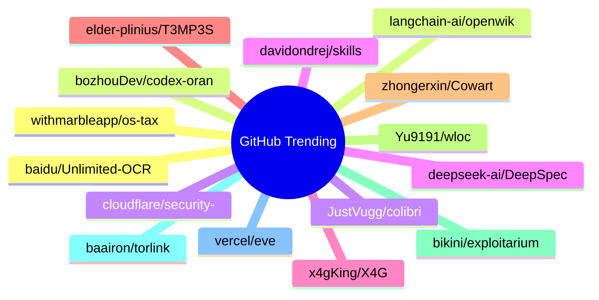

# GitHub Trending 每日 Top 15 (2026-07-14)

## 思维导图

## 列表（15 条）

### 1. baidu/Unlimited-OCR
- **仓库**: [baidu/Unlimited-OCR](https://github.com/baidu/Unlimited-OCR)
- **描述**: Unlimited OCR Works: Welcome the Era of One-shot Long-horizon Parsing.
- **语言**: Python
- **Star**: 14199 | **Fork**: 1194
- **更新**: 2026-07-14

### 2. langchain-ai/openwiki
- **仓库**: [langchain-ai/openwiki](https://github.com/langchain-ai/openwiki)
- **描述**: OpenWiki is a CLI that writes and maintains agent documentation for your codebase.
- **语言**: TypeScript
- **Star**: 10949 | **Fork**: 747
- **更新**: 2026-07-14

### 3. JustVugg/colibri
- **仓库**: [JustVugg/colibri](https://github.com/JustVugg/colibri)
- **描述**: Run GLM-5.2 (744B MoE) on a 25GB-RAM consumer machine — pure C, zero deps, experts streamed from disk. Tiny engine, immense model. 🐦
- **语言**: C
- **Star**: 10187 | **Fork**: 803
- **更新**: 2026-07-14

### 4. deepseek-ai/DeepSpec
- **仓库**: [deepseek-ai/DeepSpec](https://github.com/deepseek-ai/DeepSpec)
- **描述**: DeepSpec: a full-stack codebase for training and evaluating speculative decoding algorithms
- **语言**: Python
- **Star**: 6621 | **Fork**: 593
- **更新**: 2026-07-14

### 5. x4gKing/X4G
- **仓库**: [x4gKing/X4G](https://github.com/x4gKing/X4G)
- **语言**: Python
- **Star**: 5059 | **Fork**: 9426
- **更新**: 2026-07-14

### 6. elder-plinius/T3MP3ST
- **仓库**: [elder-plinius/T3MP3ST](https://github.com/elder-plinius/T3MP3ST)
- **描述**: autonomous red teaming platform; multi-agent offensive-security meta-harness
- **语言**: TypeScript
- **Star**: 4648 | **Fork**: 982
- **更新**: 2026-07-14
- **Topic**: `agents`, `ai`, `multi-agent`, `offensive-security`, `redteam`

### 7. zhongerxin/Cowart
- **仓库**: [zhongerxin/Cowart](https://github.com/zhongerxin/Cowart)
- **语言**: JavaScript
- **Star**: 4523 | **Fork**: 344
- **更新**: 2026-07-14

### 8. Yu9191/wloc
- **仓库**: [Yu9191/wloc](https://github.com/Yu9191/wloc)
- **描述**: 修改 Apple 网络定位（gs-loc）返回坐标 · 支持 Surge / Quantumult X / Loon / Stash · 快捷指令一键设置/恢复定位
- **语言**: JavaScript
- **Star**: 4482 | **Fork**: 837
- **更新**: 2026-07-14

### 9. bikini/exploitarium
- **仓库**: [bikini/exploitarium](https://github.com/bikini/exploitarium)
- **描述**: A single archive of public exploit PoCs and vulnerability research writeups. At the time I post these, none have been reported. Feel free to report them yourself and take credit for the CVE if handed out lulz. Please do not abuse these. I do this so to allure people into the field, and I've always found this is the most efficient way.
- **语言**: Python
- **Star**: 3905 | **Fork**: 1122
- **更新**: 2026-07-14

### 10. baairon/torlink
- **仓库**: [baairon/torlink](https://github.com/baairon/torlink)
- **描述**: A sleek, zero-setup torrent finder and downloader that lives right in your terminal.
- **语言**: TypeScript
- **Star**: 3553 | **Fork**: 234
- **更新**: 2026-07-14
- **Topic**: `crossplatform`, `downloader`, `magnet-links`, `p2p`, `torrent`, `torrent-client`

### 11. vercel/eve
- **仓库**: [vercel/eve](https://github.com/vercel/eve)
- **描述**: The Framework for Building Agents
- **语言**: TypeScript
- **Star**: 3484 | **Fork**: 302
- **更新**: 2026-07-14
- **Topic**: `agent`, `framework`, `harness`, `javascript`, `markdown`, `sandbox`

### 12. withmarbleapp/os-taxonomy
- **仓库**: [withmarbleapp/os-taxonomy](https://github.com/withmarbleapp/os-taxonomy)
- **语言**: JavaScript
- **Star**: 2949 | **Fork**: 524
- **更新**: 2026-07-14

### 13. bozhouDev/codex-orange-book
- **仓库**: [bozhouDev/codex-orange-book](https://github.com/bozhouDev/codex-orange-book)
- **描述**: Codex 橙皮书：从安装到实战案例的全链路 Codex 使用指南（非官方开源，含可下载 PDF）
- **语言**: HTML
- **Star**: 2813 | **Fork**: 277
- **更新**: 2026-07-14

### 14. cloudflare/security-audit-skill
- **仓库**: [cloudflare/security-audit-skill](https://github.com/cloudflare/security-audit-skill)
- **描述**: A coding-agent skill for multi-phase security audits with independently verified, machine-readable findings
- **语言**: JavaScript
- **Star**: 2480 | **Fork**: 182
- **更新**: 2026-07-14

### 15. davidondrej/skills
- **仓库**: [davidondrej/skills](https://github.com/davidondrej/skills)
- **描述**: access to david ondrej's personal agent skills
- **语言**: Shell
- **Star**: 2477 | **Fork**: 298
- **更新**: 2026-07-14
