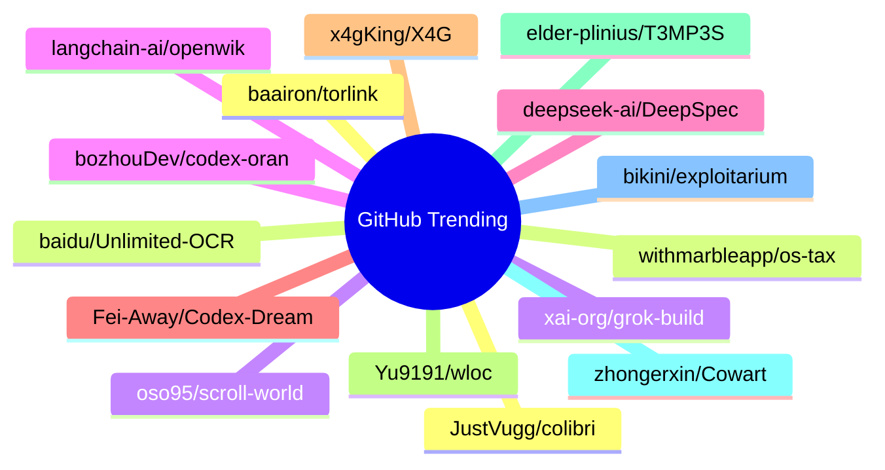

# GitHub Trending 每日 Top 15 (2026-07-17)

## 思维导图

## 列表（15 条）

### 1. JustVugg/colibri
- **仓库**: [JustVugg/colibri](https://github.com/JustVugg/colibri)
- **描述**: Run GLM-5.2 (744B MoE) on a 25GB-RAM consumer machine — pure C, zero deps, experts streamed from disk. Tiny engine, immense model. 🐦
- **语言**: C
- **Star**: 15085 | **Fork**: 1324
- **更新**: 2026-07-17

### 2. baidu/Unlimited-OCR
- **仓库**: [baidu/Unlimited-OCR](https://github.com/baidu/Unlimited-OCR)
- **描述**: Unlimited OCR Works: Welcome the Era of One-shot Long-horizon Parsing.
- **语言**: Python
- **Star**: 14358 | **Fork**: 1212
- **更新**: 2026-07-17

### 3. xai-org/grok-build
- **仓库**: [xai-org/grok-build](https://github.com/xai-org/grok-build)
- **描述**: SpaceXAI's coding agent harness and TUI. Fullscreen, mouse interactive, extensible.
- **语言**: Rust
- **Star**: 13087 | **Fork**: 2351
- **更新**: 2026-07-17

### 4. langchain-ai/openwiki
- **仓库**: [langchain-ai/openwiki](https://github.com/langchain-ai/openwiki)
- **描述**: OpenWiki is a CLI that writes and maintains agent documentation for your codebase.
- **语言**: TypeScript
- **Star**: 11940 | **Fork**: 822
- **更新**: 2026-07-17

### 5. deepseek-ai/DeepSpec
- **仓库**: [deepseek-ai/DeepSpec](https://github.com/deepseek-ai/DeepSpec)
- **描述**: DeepSpec: a full-stack codebase for training and evaluating speculative decoding algorithms
- **语言**: Python
- **Star**: 6679 | **Fork**: 607
- **更新**: 2026-07-17

### 6. Fei-Away/Codex-Dream-Skin
- **仓库**: [Fei-Away/Codex-Dream-Skin](https://github.com/Fei-Away/Codex-Dream-Skin)
- **描述**: Codex Dream Skin
- **语言**: JavaScript
- **Star**: 6465 | **Fork**: 737
- **更新**: 2026-07-17

### 7. x4gKing/X4G
- **仓库**: [x4gKing/X4G](https://github.com/x4gKing/X4G)
- **语言**: Python
- **Star**: 5677 | **Fork**: 10476
- **更新**: 2026-07-17

### 8. Yu9191/wloc
- **仓库**: [Yu9191/wloc](https://github.com/Yu9191/wloc)
- **描述**: 修改 Apple 网络定位（gs-loc）返回坐标 · 支持 Surge / Quantumult X / Loon / Stash · 快捷指令一键设置/恢复定位
- **语言**: JavaScript
- **Star**: 5269 | **Fork**: 992
- **更新**: 2026-07-17

### 9. elder-plinius/T3MP3ST
- **仓库**: [elder-plinius/T3MP3ST](https://github.com/elder-plinius/T3MP3ST)
- **描述**: autonomous red teaming platform; multi-agent offensive-security meta-harness
- **语言**: TypeScript
- **Star**: 4849 | **Fork**: 1017
- **更新**: 2026-07-17
- **Topic**: `agents`, `ai`, `multi-agent`, `offensive-security`, `redteam`

### 10. zhongerxin/Cowart
- **仓库**: [zhongerxin/Cowart](https://github.com/zhongerxin/Cowart)
- **语言**: JavaScript
- **Star**: 4721 | **Fork**: 358
- **更新**: 2026-07-17

### 11. bikini/exploitarium
- **仓库**: [bikini/exploitarium](https://github.com/bikini/exploitarium)
- **描述**: A single archive of public exploit PoCs and vulnerability research writeups. At the time I post these, none have been reported. Feel free to report them yourself and take credit for the CVE if handed out lulz. Please do not abuse these. I do this so to allure people into the field, and I've always found this is the most efficient way.
- **语言**: Python
- **Star**: 3944 | **Fork**: 1138
- **更新**: 2026-07-17

### 12. baairon/torlink
- **仓库**: [baairon/torlink](https://github.com/baairon/torlink)
- **描述**: A sleek, zero-setup torrent finder and downloader that lives right in your terminal.
- **语言**: TypeScript
- **Star**: 3639 | **Fork**: 239
- **更新**: 2026-07-17
- **Topic**: `crossplatform`, `downloader`, `magnet-links`, `p2p`, `torrent`, `torrent-client`

### 13. withmarbleapp/os-taxonomy
- **仓库**: [withmarbleapp/os-taxonomy](https://github.com/withmarbleapp/os-taxonomy)
- **语言**: JavaScript
- **Star**: 3215 | **Fork**: 550
- **更新**: 2026-07-17

### 14. oso95/scroll-world
- **仓库**: [oso95/scroll-world](https://github.com/oso95/scroll-world)
- **描述**: A skill that turn any brand into a scrollable 3D world
- **语言**: JavaScript
- **Star**: 2984 | **Fork**: 371
- **更新**: 2026-07-17

### 15. bozhouDev/codex-orange-book
- **仓库**: [bozhouDev/codex-orange-book](https://github.com/bozhouDev/codex-orange-book)
- **描述**: Codex 橙皮书：从安装到实战案例的全链路 Codex 使用指南（非官方开源，含可下载 PDF）
- **语言**: HTML
- **Star**: 2883 | **Fork**: 281
- **更新**: 2026-07-17
