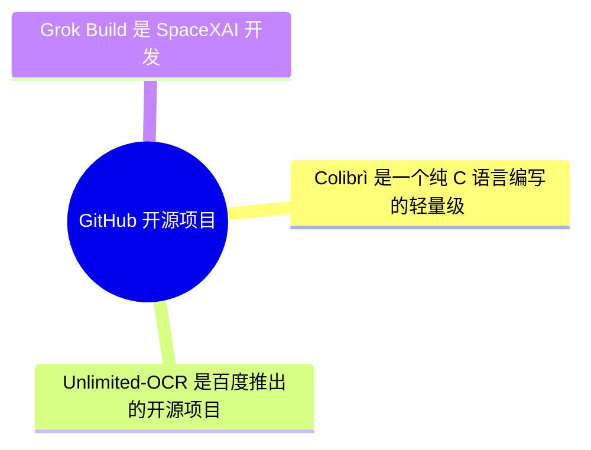
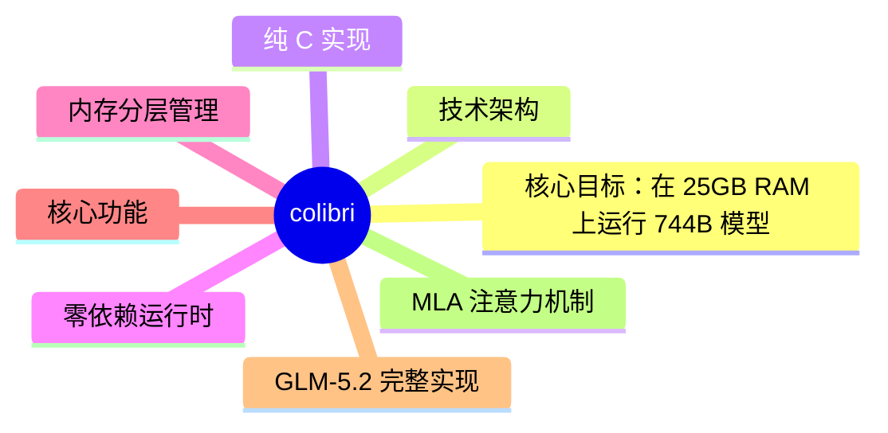
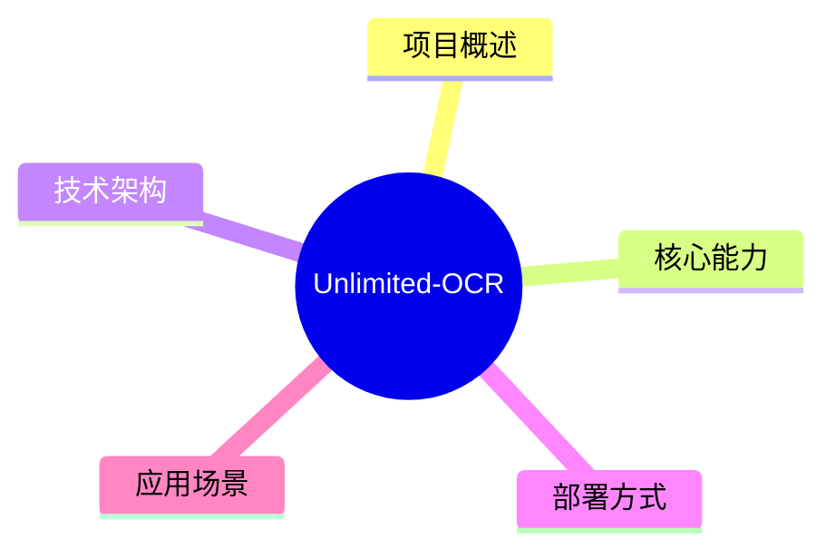
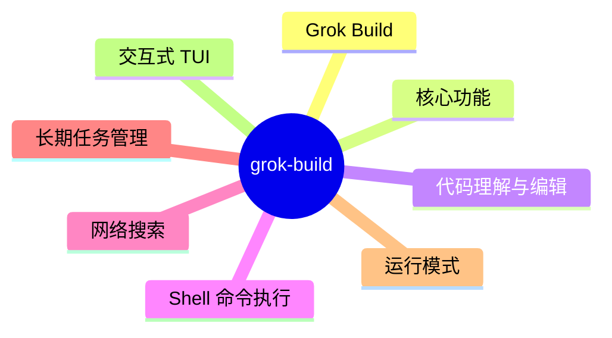

# GitHub 开源项目深度解析 (2026-07-17)

## 前面介绍

- 抓取来源：GitHub Trending / Search API
- 项目数量：3
- 深度解析数量：3
- 目标：自动筛出值得研究的开源项目，并给出结构、技术栈、运行方式和源码线索。

## 树状图



## 深度解析

### 1. colibri
- **仓库**: [JustVugg/colibri](https://github.com/JustVugg/colibri)
- **语言**: C | **Star**: 15257 | **Fork**: 1343
- **更新**: 2026-07-17 | **License**: Apache-2.0

#### 前面介绍

- Colibrì 是一个纯 C 语言编写的轻量级 MoE（混合专家）推理引擎，旨在让用户在仅有约 25GB RAM 的消费级机器上运行 GLM-5.2（744B 参数 MoE）模型。它通过将模型分为常驻内存的密集部分和存储在磁盘上的稀疏专家部分，实现了“小引擎，大模型”的目标。引擎完全零依赖，不依赖 BLAS 或 Python 运行时，支持 CPU 推理，并可选 CUDA 加速。项目还包含一个强大的 Web 仪表盘，用于实时监控模型状态和专家路由。

#### 树状图



#### 文字描述

- 核心引擎 (c/glm.c)
- 纯 C 语言实现，无第三方库
- 内存层级管理：VRAM/RAM/磁盘统一管理
- 密集部分 (17B 参数) 常驻内存 (int4, ~9.9GB)
- 稀疏专家 (19,456 个) 存储在磁盘 (~370GB)
- 按需流式加载，支持 LRU 缓存
- 推理路径
- 支持 CPU 推理 (默认)

#### 运行方式

- 环境要求：C 编译器 (GCC/Clang/MSVC)
- 依赖：无运行时依赖
- 下载模型：从官方仓库下载 GLM-5.2 int4 模型文件
- 编译引擎：进入 c 目录，运行 Makefile
- 运行推理：执行 ./coli chat 启动交互式对话
- 启动 Web 仪表盘：执行 ./coli web 查看实时指标

#### 项目亮点

- 极致轻量化：单文件 C 引擎，无 BLAS，无 Python 运行时
- 内存优化：将 744B 模型拆分为 9.9GB 常驻内存 + 磁盘流式加载
- 高保真实现：通过 Transformer Oracle 验证，确保与官方模型输出一致
- 推测解码：原生支持 MTP 推测解码，提升生成速度
- 专家图谱：可视化 19,456 个专家的激活热度和主题亲和力
- 语法强制：支持基于 GBNF 语法的强制输出

#### 代码解析

- 核心文件 c/glm.c：包含所有推理逻辑，处理内存管理、前向传播和专家加载
- c/tier.h：定义了专家的存储层级策略，决定专家是常驻内存、磁盘还是 GPU
- c/olmoe.c：处理 MoE (Mixture of Experts) 特有的路由和专家聚合逻辑
- c/decode_batch.h：支持批量解码，提高吞吐量
- c/grammar.h：处理语法约束和强制输出
- c/backend_cuda.cu：可选的 CUDA 后端实现，用于加速专家加载或推理
- c/openai_server.py：提供 OpenAI 兼容的 API 服务接口
- c/tools/expert_atlas：用于分析每个专家的主题专长度的工具集

#### 源码

##### README.md

```md
<p align="center">
  
</p>

**Tiny engine, immense model.** Run **GLM-5.2 (744B-parameter MoE)** on a consumer machine with ~25 GB of RAM — in pure C, with zero dependencies, by streaming experts from disk.

Colibrì is a lightweight, quality-preserving MoE runtime that treats VRAM,
RAM, and storage as one managed memory hierarchy. Insufficient fast memory may
reduce speed, but the default policy never silently changes model precision or
router semantics.

```
$ ./coli chat
  🐦 colibrì v1.0 — GLM-5.2 · 744B MoE · int4 · streaming CPU
  ✓ ready in 32s · resident 9.9 GB
  › ciao!
  ◆ Ciao! 😊 Come posso aiutarti oggi?
```


## See it running

<p align="center">
  
</p>
<p align="center"><em>The web dashboard (<code>./coli web</code>): a 744B model answering at 4+ tok/s end-to-end on 6× RTX 5090 —
with live token metrics, the hardware panel, and the VRAM/RAM/disk expert tiers.</em></p>

<p align="center">
  
</p>
<p align="center"><em>The <strong>Brain</strong> page: all 19,456 experts as a living cortex — colour is the storage tier,
brightness is routing heat, and every expert routed in a turn flashes white. Hovering shows the expert's
<a href="https://github.com/JustVugg/colibri/issues/175">measured topic affinity</a>.</em></p>

## Contents

- [The idea](#the-idea)
- [See it running](#see-it-running)
- [What's implemented](#whats-implemented)
- [Honest numbers](#honest-numbers-wsl2-12-cores-25-gb-ram-nvme-via-vhdx)
- [Download the model](#download-the-model)
- [Web dashboard](#web-dashboard)
- [Got a better machine?](#got-a-better-machine-try-it--heres-what-to-expect)

## The idea

A 744B Mixture-of-Experts model activates only ~40B parameters per token — and only ~11 GB of those change from token to token (the routed experts). So:

- the **dense part** (attention, shared experts, embeddings — ~17B params) stays **resident in RAM at int4** (~9.9 GB);
- the **19,456 routed experts** (75 MoE layers × 256 experts + the MTP head, ~19 MB each at int4) live **on disk** (~370 GB) and are **streamed on demand**, with a per-layer LRU cache, an optional pinned hot-store, and the OS page cache as a free L2.

The engine is a single C file (`c/glm.c`) plus small headers. No BLAS, no Python at runtime, no GPU required (an opt-in CUDA tier for pinned experts exists — see below).

## What's implemented

- **Faithful GLM-5.2 (`glm_moe_dsa`) forward** — validated token-exact against a `transformers` oracle (teacher-forcing 32/32, greedy 20/20 on a tiny-random model with the real architecture).
- **MLA attention** (q/kv-LoRA, interleaved partial RoPE) with **compressed KV-cache**: 576 floats/token instead of 32,768 (57× smaller — GLM-5.2 has 64 heads and no GQA).
- **DeepSeek-V3-style sigmoid router** (noaux_tc, routed_scaling_factor), shared expert, first-3-dense layers.
- **Native MTP speculative decoding** — GLM-5.2's own multi-token-prediction head (layer 78) drafts tokens that the main model verifies in one batched forward. **The head must be int8** (the converter does this by default): at int4 draft acceptance collapses to 0–4% and speculation never engages; at int8 it's 39–59% acceptance, **2.2–2.8 tokens/forward** (community-measured, 
```

##### c/tools/README.md

```md
# Tools

These scripts support model preparation and offline engineering work. They are
not runtime dependencies of the C engine.

- `convert_fp8_to_int4.py`, `download_glm52.py`: model preparation
- `make_glm_oracle.py`, `make_glm_bench_model.py`: deterministic fixtures
- `benchmark_cuda_fixture.py`, `eval_glm.py`, `fetch_benchmarks.py`: benchmarks
- `gen_unicode.py`: tokenizer table generation

Run them from `c/`, for example:

```sh
python3 tools/convert_fp8_to_int4.py --selftest
python3 tools/make_glm_bench_model.py --output /tmp/colibri-bench
```

```

##### c/tools/expert_atlas/README.md

```md
# Expert Atlas — what does each of the 19,456 experts actually do?

Probe harness for #175. Runs a set of topic-tagged prompts, dumps each run's expert-routing
histogram, and turns them into a per-expert topic-affinity vector.

```bash
cd c
export COLI_MODEL=/path/to/glm52_i4
./tools/expert_atlas/sweep.sh                             # 30 probes (10 topics x 3 prompts)
python3 tools/expert_atlas/analyze.py  --stats atlas_out/stats --out atlas_out/experts.json \
        --web web/dist/experts.json                       # optional: feed the web dashboard Atlas
python3 tools/expert_atlas/validate.py atlas_out/stats 200 # leave-one-prompt-out check
```

`--web` writes the same atlas in the shape the web dashboard consumes (the Atlas galaxy and the
Brain hover tooltips): keyed `"layer:expert"` with `affinity`/`entropy`/`top`/`label`. It replaces
the retired `tools/expert_atlas.py`, whose API-driven probing ran through a live server and was
exposed to exactly the traps above (server-side `--topp`, speculative drafts, shared `.coli_usage`).

## Read this before you trust any atlas

Four things silently corrupt this measurement. The sweep script controls all of them; if you
roll your own, don't skip them.

| trap | effect | control |
|---|---|---|
| **`--topp`** | prunes experts by cumulative probability — measured: it hides **38% of the distinct experts** (7,587 → 4,687). It is also the *recommended speed setting*. | `TOPP=0` |
| **speculative drafts** | `eusage` is incremented inside `moe()`, *before* verification, so **rejected** drafts count. Those are experts routed for text the model never emitted. | `MTP=0 DRAFT=0` |
| **`.coli_usage`** | is loaded at startup and accumulates, so a naive `STATS` dump contains **all prior history**, not this run. | remove per run (script backs it up and restores) |
| **autocorrelation** | routing inside one run is highly correlated — the same context routes to the same experts token after token. An expert firing 38 times during one prompt is **one** observation, not 38. Chi-square/entropy on raw selections will certify single-prompt flukes as perfect specialists. | `analyze.py` requires the affinity to **replicate across a category's independent prompts** |

The CUDA expert tier is also not run-to-run deterministic, so the sweep uses `--gpu none`. Tier
config only decides *where weights live*, not what the router picks, so this costs nothing.

## Method

`analyze.py`:

1. `n[e][c]` — selections of expert *e* while running category *c*
2. `f[e][c] = n[e][c] / N[c]` — normalise by **category size** (prefill routes the prompt too, so a
   verbose category would otherwise look busier)
3. `p(c|e)` — renormalise into a topic distribution per expert, i.e. base-rate corrected. Ranking
   by raw count instead just rediscovers which experts are popular in general.
4. `spec(e) = 1 − H(p(c|e)) / log C` — 0 = generalist, 1 = fires for exactly one topic
5. **replication gate** — an expert is only a candidate specialist for *c* if it fires in ≥2 of *c*'s
   independent prompts

`validate.py` — leave-one-prompt-out. Build each category's top-K specialist set from its *other*
prompts, then check which set the held-out prompt's routing actually lands in. If specialisation
were an artifact of prompt wording, the held-out prompt would not prefer its own category.

## Result on GLM-5.2 744B int4 (Zen5, CPU routing path)

- **Leave-one-prompt-out: 29/30 = 96.7%** (chance 10%). Specialisation is a property of the topic,
  not of 
```

##### desktop/README.md

```md
# colibrì desktop

Tauri v2 shell for the shared React interface in `../web`.

This directory intentionally contains no second frontend. During development,
Tauri starts the Vite server from `web/`; release builds package `web/dist`.

## Development

The shared web UI landed in PR #23 and is already part of `main`. From the
repository root, install its dependencies and start the desktop shell:

```sh
cd web
npm ci
cd ../desktop
cargo install tauri-cli --version "^2.0.0" --locked
cargo tauri dev
```

The application connects to an OpenAI-compatible server configured in the UI.
Bundling the inference engine or managing its process is intentionally deferred:
the model is hundreds of gigabytes and must remain an external, user-selected
resource rather than an opaque application sidecar.

This first desktop increment only packages the existing UI in a native window.
It does not change the web application, start the inference engine, download
models, or add native filesystem and process permissions.

## Validation

```sh
cargo fmt --manifest-path src-tauri/Cargo.toml --check
cargo check --manifest-path src-tauri/Cargo.toml
```

```

### 2. Unlimited-OCR
- **仓库**: [baidu/Unlimited-OCR](https://github.com/baidu/Unlimited-OCR)
- **语言**: Python | **Star**: 14375 | **Fork**: 1216
- **更新**: 2026-07-17 | **License**: MIT

#### 前面介绍

- Unlimited-OCR 是百度推出的开源项目，旨在实现“一次扫描，无限解析”的长文档处理能力。该项目基于 DeepSeek-OCR 进行改进，通过引入长上下文窗口和特定的解码策略，能够一次性处理超长文档（如长卷轴、长表格、多页 PDF），无需复杂的分块处理。它支持单图和长文档模式，并提供了基于 Transformers、vLLM 和 SGLang 的多种推理部署方案。

#### 树状图



#### 文字描述

- 基于 DeepSeek-OCR 模型基座进行改进
- 引入长上下文窗口机制以支持超长输入
- 采用特定的解码策略（如 no_repeat_ngram_size 和 ngram_window）防止长文本生成重复
- 支持单图（Gundam 模式）和多页文档（Base 模式）两种推理配置
- 通过 PyMuPDF 实现将 PDF 转换为图像序列进行解析

#### 运行方式

- 环境要求：Python 3.12.3, CUDA 12.9 或更高版本
- 依赖库：torch 2.10.0, transformers 4.57.1, pymupdf 1.27.2.2, einops, Pillow 等
- 模型加载：使用 Hugging Face 的 AutoModel 和 AutoTokenizer，需设置 trust_remote_code=True
- 单图推理：配置 base_size=1024, image_size=640, crop_mode=True
- 多页/长文档推理：配置 image_size=1024，不启用 crop_mode
- PDF 处理：使用 PyMuPDF 将 PDF 每页转换为高分辨率图像，然后调用多页推理接口

#### 项目亮点

- 长文档处理：突破传统 OCR 的长度限制，支持一次性解析长卷轴或长表格
- 多模态理解：结合视觉编码器与语言模型，实现文档结构的精准解析
- 灵活部署：提供 Transformers 原生接口、vLLM 高性能推理和 SGLang 部署支持
- 开源生态：在 Hugging Face、ModelScope 和 Baidu Cloud 均有模型托管
- 演示支持：提供 Hugging Face Spaces 在线演示，方便快速体验

#### 代码解析

- infer.py：核心推理脚本，封装了单图推理（infer）和多页推理（infer_multi）方法
- AutoModel.from_pretrained：用于加载模型权重，支持 bfloat16 精度以节省显存
- model.infer()：处理单张图片，支持裁剪模式以适应不同尺寸的输入
- model.infer_multi()：处理多张图片或图像列表，适用于长文档或 PDF 转换后的页面
- ngram_window 参数：控制解码时的上下文窗口大小，防止长文本生成重复内容
- pdf_to_images 函数：利用 PyMuPDF 将 PDF 文档渲染为图像，作为多页推理的输入源

#### 源码

##### README.md

```md
<p align="center">
  
</p>

<hr>

<h1 align="center">Unlimited OCR Works</h1>

<div align="center">
  <a href="https://github.com/baidu/Unlimited-OCR">
    
  </a>
  <a href="https://huggingface.co/baidu/Unlimited-OCR">
    
  </a>
</div>

<div align="center">
    <a href="https://arxiv.org/abs/2606.23050">
    
  </a>
  <a href="https://x.com/Baidu_Inc" target="_blank">
    
  </a>
</div>

<h3 align="center">Welcome the Era of One-shot Long-horizon Parsing.</h3>

<p align="center">
    
</p>


## Release
- [2026/07/03] 🤝 Thanks to the Baidu Cloud team for their support. Our model is now available on [Baidu Cloud](https://cloud.baidu.com/doc/OCR/s/fmr1p39gb).
- [2026/06/28] 🤝 Thanks to the [vLLM community](https://github.com/vllm-project/vllm) and [Tianyu Guo](https://github.com/gty111) for their support, our model now supports vLLM inference.
- [2026/06/24] 🤝 Thanks to [AK](https://x.com/_akhaliq) for creating a demo for us. It is now available at [Hugging Face Spaces](https://huggingface.co/spaces/baidu/Unlimited-OCR).
- [2026/06/23] 📄 Our paper is now available on [arXiv](https://arxiv.org/abs/2606.23050).
- [2026/06/23] 🤝 Thanks to the [ModelScope community](https://github.com/modelscope) for their support. Our model is now available at [ModelScope](https://modelscope.cn/models/PaddlePaddle/Unlimited-OCR).
- [2026/06/22] 🚀 We present [Unlimited-OCR](https://github.com/baidu/Unlimited-OCR), aiming to push [Deepseek-OCR](https://github.com/deepseek-ai/DeepSeek-OCR) one step further.

## Inference

### Transformers
Inference using Huggingface transformers on NVIDIA GPUs. Requirements tested on python 3.12.3 + CUDA12.9：

```
torch==2.10.0
torchvision==0.25.0
transformers==4.57.1
Pillow==12.1.1
matplotlib==3.10.8
einops==0.8.2
addict==2.4.0
easydict==1.13
pymupdf==1.27.2.2
psutil==7.2.2
```

```python
import os
import torch
from transformers import AutoModel, AutoTokenizer

model_name = 'baidu/Unlimited-OCR'

tokenizer = AutoTokenizer.from_pretrained(model_name, trust_remote_code=True)
model = AutoModel.from_pretrained(
    model_name,
    trust_remote_code=True,
    use_safetensors=True,
    torch_dtype=torch.bfloat16,
)
model = model.eval().cuda()

# ── Single image supports two configs: gundam or base ──
# gundam: base_size=1024, image_size=640, crop_mode=True
# base: base_size=1024, image_size=1024, crop_mode=False
model.infer(
    tokenizer,
    prompt='<image>document parsing.',
    image_file='your_image.jpg',
    output_path='your/output/dir',
    base_size=1024, image_size=640, crop_mode=True,
    max_length=32768,
    no_repeat_ngram_size=35, ngram_window=128,
    save_results=True,
)

# ── Multi page / PDF only uses base (image_size=1024) ──
model.infer_multi(
    tokenizer,
    prompt='<image>Multi page parsing.',
    image_files=['page1.png', 'page2.png', 'page3.png'],
    output_path='your/output/dir',
    image_size=1024,
    max_lengt
```

### 3. grok-build
- **仓库**: [xai-org/grok-build](https://github.com/xai-org/grok-build)
- **语言**: Rust | **Star**: 14351 | **Fork**: 2664
- **更新**: 2026-07-17 | **License**: Apache-2.0

#### 前面介绍

- Grok Build 是 SpaceXAI 开发的基于终端的 AI 编码代理工具。它作为一个全屏 TUI（文本用户界面）运行，能够理解代码库、编辑文件、执行 Shell 命令、搜索网络并管理长期任务。它支持交互式操作、无头模式（用于脚本/CI）以及通过 Agent Client Protocol (ACP) 嵌入到编辑器中。该项目使用 Rust 编写，旨在提供高性能和可扩展的 AI 辅助编程体验。

#### 树状图



#### 文字描述

- 项目采用 Rust Workspace 多 crate 架构，分为代码生成、代理运行时、工具实现和工作空间管理等核心模块。
- 代码生成模块负责构建 TUI、Shell 运行时和工具实现，包含 ptyctl（伪终端控制）和 ACP 协议库。
- 代理生命周期模块管理会话和轮次的状态转换，确保 AI 代理的交互流程有序。
- 工具实现模块提供终端操作、文件编辑、搜索等具体功能的实现。
- 工作空间模块负责文件系统、版本控制（VCS）和执行环境的管理。
- 构建系统依赖 DotSlash 来管理 hermetic 工具链，并使用 protobuf 进行代码生成。
- 项目支持通过 ACP 协议与外部编辑器集成，实现嵌入式的 AI 编码体验。

#### 运行方式

- 安装方式：可通过官方脚本安装预编译的二进制文件，或从源码构建。
- 源码构建要求：需要安装 Rust 工具链和 DotSlash 工具。
- 构建命令：使用 `cargo run -p xai-grok-pager-bin` 构建并启动 TUI，或使用 `--release` 优化构建。
- 首次启动：程序会自动打开浏览器进行身份验证。
- 配置与文档：用户指南包含在 `crates/codegen/xai-grok-pager/docs/user-guide/` 目录下，配置文件位于 `crates/codegen/xai-grok-config`。
- 环境变量：构建和运行可能需要设置 `PROTOC` 环境变量以指定 protobuf 编译器路径。

#### 项目亮点

- 全屏交互式 TUI：提供流畅的终端用户体验，支持滚动、模态框和主题定制。
- Agent Client Protocol (ACP)：定义了代理与客户端（如编辑器）之间的通信协议，支持嵌入模式。
- 多模式运行：支持交互式 TUI、无头脚本模式和编辑器集成模式，适应不同场景。
- 强大的工具链：内置终端控制、文件编辑、搜索和沙箱执行能力。
- 模块化设计：代码结构清晰，分为代码生成、生命周期、工具和工作空间等独立 crate。
- Hermetic 构建：通过 DotSlash 确保构建环境的隔离性和一致性。

#### 代码解析

- 项目根目录的 `Cargo.toml` 是自动生成的 workspace 配置，实际开发应修改各子 crate 的配置文件。
- `crates/codegen/ptyctl-cli` 是一个独立的二进制工具，用于控制伪终端，提供运行命令、发送按键、截图和等待文本匹配等功能。
- `crates/codegen/ptyctl` 模块实现了 PTY（伪终端）的核心逻辑，包括会话管理、终端控制、样式渲染和键盘处理。
- `crates/codegen/xai-acp-lib` 实现了 Agent Client Protocol 的核心功能，包括消息定义、通道管理和标准化处理。
- `crates/codegen/xai-agent-lifecycle` 模块负责管理代理的会话生命周期和轮次输入输出，确保状态转换的可靠性。
- `crates/codegen/xai-grok-tools` 模块提供了具体的工具实现，如终端工具、文件编辑工具和搜索工具。
- `crates/codegen/xai-grok-workspace` 模块处理文件系统操作、版本控制状态和执行环境。
- 构建系统 `xai-proto-build` 负责处理 protobuf 的代码生成，依赖项包括 prost-build 和 tonic-prost-build。

#### 源码

##### Cargo.toml

```toml
# Auto-generated workspace root. Prefer editing per-crate Cargo.toml files.

[workspace]
resolver = "2"
members = [
    "crates/build/xai-proto-build",
    "crates/codegen/ptyctl",
    "crates/codegen/ptyctl-cli",
    "crates/codegen/xai-acp-lib",
    "crates/codegen/xai-agent-lifecycle",
    "crates/codegen/xai-chat-state",
    "crates/codegen/xai-codebase-graph",
    "crates/codegen/xai-crash-handler",
    "crates/codegen/xai-fast-worktree",
    "crates/codegen/xai-file-utils",
    "crates/codegen/xai-fsnotify",
    "crates/codegen/xai-gix-status",
    "crates/codegen/xai-grok-agent",
    "crates/codegen/xai-grok-announcements",
    "crates/codegen/xai-grok-auth",
    "crates/codegen/xai-grok-config",
    "crates/codegen/xai-grok-config-types",
    "crates/codegen/xai-grok-env",
    "crates/codegen/xai-grok-hooks",
    "crates/codegen/xai-grok-http",
    "crates/codegen/xai-grok-markdown",
    "crates/codegen/xai-grok-markdown-core",
    "crates/codegen/xai-grok-mcp",
    "crates/codegen/xai-grok-memory",
    "crates/codegen/xai-grok-mermaid",
    "crates/codegen/xai-grok-models",
    "crates/codegen/xai-grok-pager",
    "crates/codegen/xai-grok-pager-bin",
    "crates/codegen/xai-grok-pager-minimal",
    "crates/codegen/xai-grok-pager-pty-harness",
    "crates/codegen/xai-grok-pager-render",
    "crates/codegen/xai-grok-paths",
    "crates/codegen/xai-grok-plugin-marketplace",
    "crates/codegen/xai-grok-sampler",
    "crates/codegen/xai-grok-sampling-types",
    "crates/codegen/xai-grok-sandbox",
    "crates/codegen/xai-grok-secrets",
    "crates/codegen/xai-grok-shared",
    "crates/codegen/xai-grok-shell",
    "crates/codegen/xai-grok-shell-base",
    "crates/codegen/xai-grok-shell-session-support",
    "crates/codegen/xai-grok-subagent-resolution",
    "crates/codegen/xai-grok-telemetry",
    "crates/codegen/xai-grok-test-support",
    "crates/codegen/xai-grok-tools",
    "crates/codegen/xai-grok-tools-api",
    "crates/codegen/xai-grok-update",
    "crates/codegen/xai-grok-version",
    "crates/codegen/xai-grok-voice",
    "crates/codegen/xai-grok-workspace",
    "crates/codegen/xai-grok-workspace-client",
    "crates/codegen/xai-grok-workspace-types",
    "crates/codegen/xai-hooks-plugins-types",
    "crates/codegen/xai-hunk-tracker",
    "crates/codegen/xai-mixpanel",
    "crates/codegen/xai-prompt-queue",
    "crates/codegen/xai-ratatui-inline",
    "crates/codegen/xai-ratatui-textarea",
    "crates/codegen/xai-sqlite-journal",
    "crates/codegen/xai-system-power",
    "crates/codegen/xai-token-estimation",
    "crates/codegen/xai-tracing-macros",
    "crates/codegen/xai-tty-utils",
    "crates/common/xai-circuit-breaker",
    "crates/common/xai-computer-hub-core",
    "crates/common/xai-computer-hub-mcp-adapter",
    "crates/common/xai-computer-hub-sdk",
    "crates/common/xai-grok-compaction",
    "crates/common/xai-interjection-core",
    "crates/common/xai-test-utils",
    "crates/common/xai-tool-protocol",
    "crates/common/xai-tool-runtime",
    "crates/common/xai-tool-types",
    "crates/common/xai-tracing",
    "prod/mc/cli-chat-proxy-types",
    "third_party/dagre_rust",
    "third_party/graphlib_rust",
    "third_party/mermaid-to-svg",
    "third_party/ordered_hashmap",
]

[workspace.package]
edition = "2024"
license = "Apache-2.0"

[workspace.dependencies]
agent-client-protocol = { version = "0.10.4", features = ["unstable"] }
alacritty_terminal = "0.26.0"
ansi-to-tui = "7.0.0"
ansi-width = "0.1"
anstyle = "1.0"
```

##### crates/build/xai-proto-build/Cargo.toml

```toml
[package]
license = "Apache-2.0"
description = "Build protobuf"
edition.workspace = true
name = "xai-proto-build"
version = "0.0.0"

[lints]
workspace = true

[dependencies]
anyhow = { workspace = true }
pbjson-build = { workspace = true }
prost-build = { workspace = true }
tempfile = { workspace = true }
tonic-prost-build = { workspace = true }

```

##### crates/codegen/ptyctl-cli/Cargo.toml

```toml
[package]
license = "Apache-2.0"
name = "ptyctl-cli"
version = "0.1.0"
edition.workspace = true
description = "CLI for ptyctl headless PTY controller"
publish = false

[[bin]]
name = "ptyctl"
path = "src/main.rs"

[dependencies]
ptyctl = { path = "../ptyctl" }
axum = { workspace = true }
clap = { workspace = true, features = ["derive"] }
reqwest = { workspace = true, features = ["json"] }
tokio = { workspace = true, features = ["full"] }
serde = { workspace = true, features = ["derive"] }
serde_json = { workspace = true }
anyhow = { workspace = true }
env_logger = { workspace = true }
chrono = { workspace = true, features = ["serde"] }
dirs = { workspace = true }

```

##### crates/codegen/ptyctl-cli/src/main.rs

```rs
//! ptyctl CLI — headless PTY controller.

use clap::Parser;

mod cli;
mod commands;
mod registry;

use cli::{Cli, Commands};

#[tokio::main]
async fn main() -> anyhow::Result<()> {
    env_logger::init();

    let cli = Cli::parse();

    match cli.command {
        Commands::Run {
            command,
            width,
            height,
            cwd,
            env,
            port,
            name,
            force,
            timeout,
            linger,
            quiet,
        } => {
            commands::run::run(
                command, width, height, cwd, env, port, name, force, timeout, linger, quiet,
            )
            .await?;
        }
        Commands::Send {
            target,
            keys,
            enter,
        } => {
            let url = target.to_url()?;
            commands::client::send(&url, &keys, enter).await?;
        }
        Commands::Screen {
            target,
            rows,
            cols,
            json: _,
            cursor,
            ansi: _,
            styled,
            html,
            full,
            line_numbers,
        } => {
            let url = target.to_url()?;
            let format = if styled {
                "styled"
            } else if html {
                "html"
            } else {
                "text"
            };
            commands::client::screen(
                &url,
                rows.as_deref(),
                cols.as_deref(),
                cursor,
                format,
                full,
                line_numbers,
            )
            .await?;
        }
        Commands::Status { target } => {
            let url = target.to_url()?;
            commands::client::status(&url).await?;
        }
        Commands::Stop { target } => {
            let url = target.to_url()?;
            commands::client::stop(&url).await?;
        }
        Commands::Resize { target, size } => {
            let url = target.to_url()?;
            commands::client::resize(&url, &size).await?;
        }
        Commands::Cursor { target } => {
            let url = target.to_url()?;
            commands::client::cursor(&url).await?;
        }
        Commands::Wait {
            target,
            text,
            regex,
            gone,
            stable_ms,
            timeout,
        } => {
            // Exit code contract: 0 matched, 1 timeout, 2 usage/connection errors.
            let exit = |code: i32| -> ! { std::process::exit(code) };
            let url = match target.to_url() {
                Ok(url) => url,
                Err(e) => {
                    eprintln!("Error: {e:#}");
                    exit(2);
                }
            };
            match commands::client::wait(
                &url,
                text.as_deref(),
                regex.as_deref(),
                gone.as_deref(),
                stable_ms,
                timeout,
            )
            .await
            {
                Ok(true) => {}
                Ok(false) => exit(1),
                Err(e) => {
                    eprintln!("Error: {e:#}");
                    exit(2);
                }
            }
        }
        Commands::List { json } => {
            let sessions = registry::list_sessions()?;
            if json {
                let mut items = Vec::new();
                for (name, info) in &sessions {
                    items.push(serde_json::json!({
                        "name": name,
        
```

## 其余项目速览

### 1. JustVugg/colibri
- **仓库**: [JustVugg/colibri](https://github.com/JustVugg/colibri)
- **描述**: Run GLM-5.2 (744B MoE) on a 25GB-RAM consumer machine — pure C, zero deps, experts streamed from disk. Tiny engine, immense model. 🐦
- **语言**: C
- **Star**: 15257 | **Fork**: 1343 | **更新**: 2026-07-17

### 2. baidu/Unlimited-OCR
- **仓库**: [baidu/Unlimited-OCR](https://github.com/baidu/Unlimited-OCR)
- **描述**: Unlimited OCR Works: Welcome the Era of One-shot Long-horizon Parsing.
- **语言**: Python
- **Star**: 14375 | **Fork**: 1216 | **更新**: 2026-07-17

### 3. xai-org/grok-build
- **仓库**: [xai-org/grok-build](https://github.com/xai-org/grok-build)
- **描述**: SpaceXAI's coding agent harness and TUI. Fullscreen, mouse interactive, extensible.
- **语言**: Rust
- **Star**: 14348 | **Fork**: 2664 | **更新**: 2026-07-17
