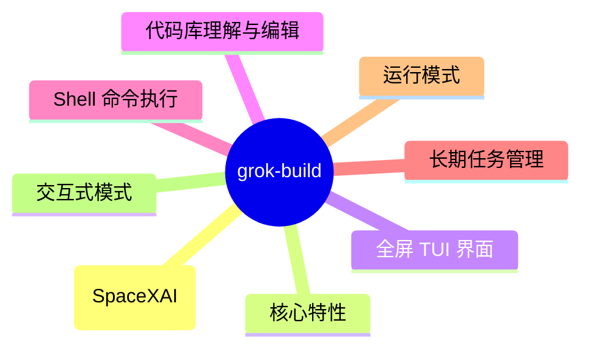
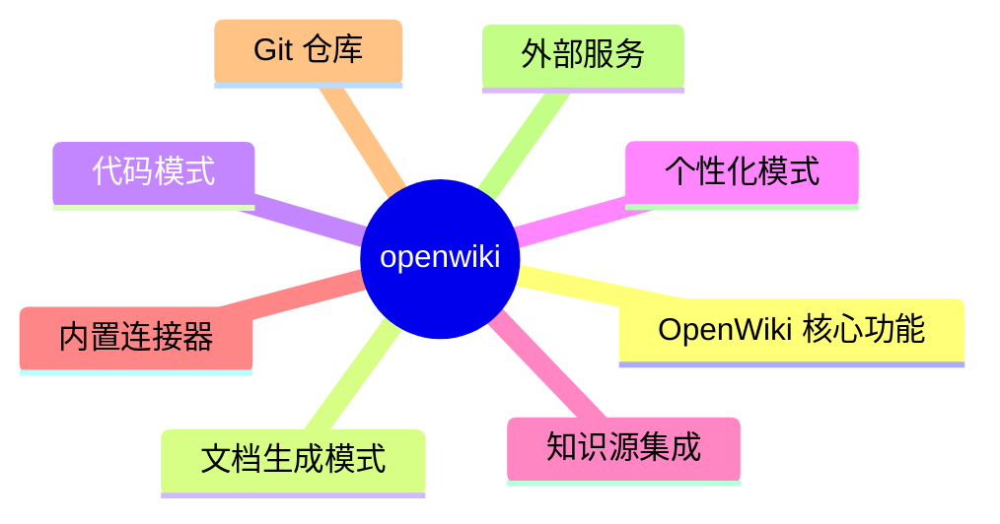
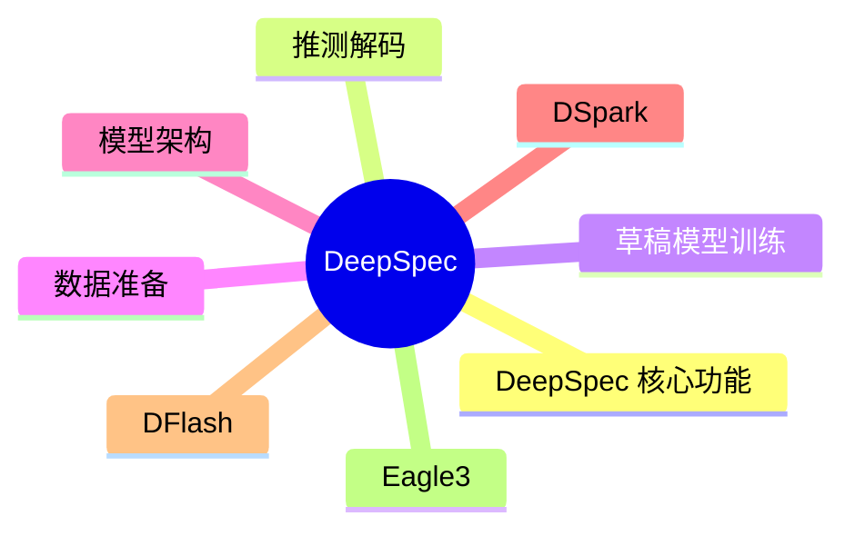
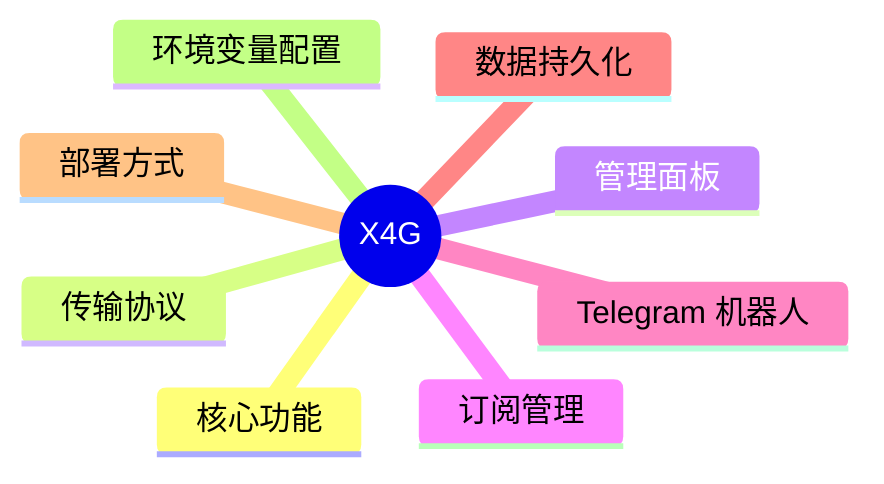
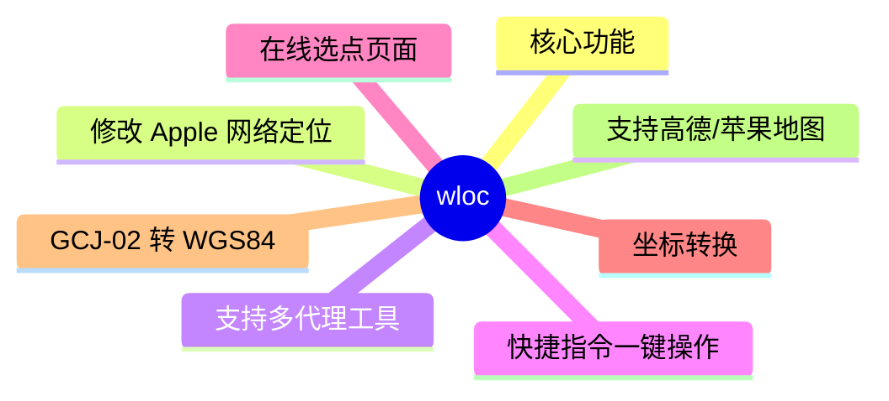

# GitHub 开源项目深度解析 (2026-07-18)

## 前面介绍

- 抓取来源：GitHub Trending / Search API
- 项目数量：15
- 深度解析数量：7
- 目标：自动筛出值得研究的开源项目，并给出结构、技术栈、运行方式和源码线索。

## 树状图

```mermaid
mindmap
  root((GitHub 开源项目))
    Grok Build (grok) 是 Spac
    JustVugg/colibri
    OpenWiki 是一个专为 AI 代理设计的命
    Codex Dream Skin 是一个非官方的
    DeepSpec 是一个用于训练和评估推测解码算
    X4G 是一个基于 Python 的现代化 VL
    wloc 是一个用于修改 Apple 网络定位服
```

## 深度解析

### 1. grok-build
- **仓库**: [xai-org/grok-build](https://github.com/xai-org/grok-build)
- **语言**: Rust | **Star**: 16721 | **Fork**: 3074
- **更新**: 2026-07-18 | **License**: Apache-2.0

#### 前面介绍

- Grok Build (grok) 是 SpaceXAI 开发的基于终端的 AI 编码代理工具。它以全屏 TUI（文本用户界面）形式运行，具备理解代码库、编辑文件、执行 Shell 命令、搜索网络和管理长期任务的能力。它支持交互式、无头（用于脚本/CI）以及通过 Agent Client Protocol (ACP) 嵌入编辑器等多种运行模式。

#### 树状图



#### 文字描述

- 项目采用 Rust Workspace 架构，包含多个功能模块的 crate。
- 核心组件包括：xai-grok-pager-bin（二进制入口）、xai-grok-pager（TUI 渲染）、xai-grok-shell（代理运行时）、xai-grok-tools（工具实现）和 xai-grok-workspace（工作区管理）。
- 底层依赖 Agent Client Protocol (ACP) 进行通信，支持代理与客户端之间的标准化交互。
- 构建系统使用 xai-proto-build 处理 Protobuf 代码生成。
- 终端控制功能由 ptyctl 模块提供，支持伪终端的创建和管理。
- 项目包含大量第三方库，如 Mermaid 图表栈、Graphlib 等，位于 third_party 目录。
- 根目录 Cargo.toml 为自动生成，建议直接编辑各个 crate 的配置文件。

#### 运行方式

- 安装依赖：确保安装了 Rust 工具链（通过 rustup）和 DotSlash（用于管理 hermetic 工具）。
- 安装 Protobuf 编译器：可通过 DotSlash 或系统 PATH 环境变量获取。
- 构建项目：运行 cargo run -p xai-grok-pager-bin 启动 TUI，或使用 --release 选项构建发布版本。
- 首次运行：启动后需在浏览器中完成身份验证。
- 安装二进制：官方提供了 macOS、Linux 和 Windows 的预编译安装脚本。
- 开发模式：使用 cargo check -p <crate> 进行快速验证，避免全工作区构建。

#### 项目亮点

- 高度可扩展的架构：支持通过 MCP 服务器、技能、插件和钩子进行功能扩展。
- 多模式运行：无缝切换交互式 TUI、无头脚本模式和编辑器集成模式。
- 强大的终端集成：内置终端模拟器，支持文件编辑、搜索和命令执行。
- 沙箱与安全：包含沙箱机制以隔离执行环境。
- 丰富的文档：内置详细用户指南，涵盖快捷键、配置、主题和高级功能。
- 代码生成自动化：使用 Rust 构建系统自动管理依赖和代码生成流程。

#### 代码解析

- 项目入口点位于 crates/codegen/ptyctl-cli/src/main.rs，负责解析命令行参数并分发到不同的子命令（如 Run、Send、Screen、Wait 等）。
- ptyctl 模块（crates/codegen/ptyctl）实现了伪终端的核心逻辑，包括会话管理、键盘输入和屏幕渲染。
- ACP 协议库（xai-acp-lib）定义了代理与客户端之间的消息格式和通信通道。
- 代理生命周期管理（xai-agent-lifecycle）负责处理会话和回合的初始化、输入处理和状态流转。
- 工作区模块（xai-grok-workspace）封装了对主机文件系统、版本控制系统（VCS）和执行环境的访问。
- 工具模块（xai-grok-tools）提供了具体的工具实现，如终端操作、文件编辑和搜索功能。
- TUI 渲染模块（xai-grok-pager）负责构建全屏用户界面，包括滚动回放、提示符和模态框。
- 构建系统（xai-proto-build）专门用于处理 Protobuf 文件的编译和代码生成。

#### 源码

##### Cargo.toml

```toml
# Auto-generated workspace root. Prefer editing per-crate Cargo.toml files.

[workspace]
resolver = "2"
members = [
    "crates/build/xai-proto-build",
    "crates/codegen/ptyctl",
    "crates/codegen/ptyctl-cli",
    "crates/codegen/xai-acp-lib",
    "crates/codegen/xai-agent-lifecycle",
    "crates/codegen/xai-chat-state",
    "crates/codegen/xai-codebase-graph",
    "crates/codegen/xai-crash-handler",
    "crates/codegen/xai-fast-worktree",
    "crates/codegen/xai-file-utils",
    "crates/codegen/xai-fsnotify",
    "crates/codegen/xai-gix-status",
    "crates/codegen/xai-grok-agent",
    "crates/codegen/xai-grok-announcements",
    "crates/codegen/xai-grok-auth",
    "crates/codegen/xai-grok-config",
    "crates/codegen/xai-grok-config-types",
    "crates/codegen/xai-grok-env",
    "crates/codegen/xai-grok-hooks",
    "crates/codegen/xai-grok-http",
    "crates/codegen/xai-grok-markdown",
    "crates/codegen/xai-grok-markdown-core",
    "crates/codegen/xai-grok-mcp",
    "crates/codegen/xai-grok-memory",
    "crates/codegen/xai-grok-mermaid",
    "crates/codegen/xai-grok-models",
    "crates/codegen/xai-grok-pager",
    "crates/codegen/xai-grok-pager-bin",
    "crates/codegen/xai-grok-pager-minimal",
    "crates/codegen/xai-grok-pager-pty-harness",
    "crates/codegen/xai-grok-pager-render",
    "crates/codegen/xai-grok-paths",
    "crates/codegen/xai-grok-plugin-marketplace",
    "crates/codegen/xai-grok-sampler",
    "crates/codegen/xai-grok-sampling-types",
    "crates/codegen/xai-grok-sandbox",
    "crates/codegen/xai-grok-secrets",
    "crates/codegen/xai-grok-shared",
    "crates/codegen/xai-grok-shell",
    "crates/codegen/xai-grok-shell-base",
    "crates/codegen/xai-grok-shell-session-support",
    "crates/codegen/xai-grok-subagent-resolution",
    "crates/codegen/xai-grok-telemetry",
    "crates/codegen/xai-grok-test-support",
    "crates/codegen/xai-grok-tools",
    "crates/codegen/xai-grok-tools-api",
    "crates/codegen/xai-grok-update",
    "crates/codegen/xai-grok-version",
    "crates/codegen/xai-grok-voice",
    "crates/codegen/xai-grok-workspace",
    "crates/codegen/xai-grok-workspace-client",
    "crates/codegen/xai-grok-workspace-types",
    "crates/codegen/xai-hooks-plugins-types",
    "crates/codegen/xai-hunk-tracker",
    "crates/codegen/xai-mixpanel",
    "crates/codegen/xai-prompt-queue",
    "crates/codegen/xai-ratatui-inline",
    "crates/codegen/xai-ratatui-textarea",
    "crates/codegen/xai-sqlite-journal",
    "crates/codegen/xai-system-power",
    "crates/codegen/xai-token-estimation",
    "crates/codegen/xai-tracing-macros",
    "crates/codegen/xai-tty-utils",
    "crates/common/xai-circuit-breaker",
    "crates/common/xai-computer-hub-core",
    "crates/common/xai-computer-hub-mcp-adapter",
    "crates/common/xai-computer-hub-sdk",
    "crates/common/xai-grok-compaction",
    "crates/common/xai-interjection-core",
    "crates/common/xai-test-utils",
    "crates/common/xai-tool-protocol",
    "crates/common/xai-tool-runtime",
    "crates/common/xai-tool-types",
    "crates/common/xai-tracing",
    "prod/mc/cli-chat-proxy-types",
    "third_party/dagre_rust",
    "third_party/graphlib_rust",
    "third_party/mermaid-to-svg",
    "third_party/ordered_hashmap",
]

[workspace.package]
edition = "2024"
license = "Apache-2.0"

[workspace.dependencies]
agent-client-protocol = { version = "0.10.4", features = ["unstable"] }
alacritty_terminal = "0.26.0"
ansi-to-tui = "7.0.0"
ansi-width = "0.1"
anstyle = "1.0"
```

##### README.md

```md
<div align="center">

<h1>
  <picture>
    <source media="(prefers-color-scheme: dark)" srcset="https://media.x.ai/v1/website/spacexai-symbol-white-transparent-0c31957f.png">
    <source media="(prefers-color-scheme: light)" srcset="https://media.x.ai/v1/website/spacexai-symbol-black-transparent-6435cf42.png">
    
  </picture>
  <br>
  Grok Build (<code>grok</code>)
</h1>

**Grok Build** is SpaceXAI's terminal-based AI coding agent. It runs as a
full-screen TUI that understands your codebase, edits files, executes shell
commands, searches the web, and manages long-running tasks — interactively,
headlessly for scripting/CI, or embedded in editors via the Agent Client
Protocol (ACP).

[Installing the released binary](#installing-the-released-binary) ·
[Building from source](#building-from-source) ·
[Documentation](#documentation) ·
[Repository layout](#repository-layout) ·
[Development](#development) ·
[Contributing](#contributing) ·
[License](#license)


**Learn more about Grok Build at [x.ai/cli](https://x.ai/cli)**

This repository contains the Rust source for the `grok` CLI/TUI and its agent
runtime. It is synced periodically from the SpaceXAI monorepo.

A small `SOURCE_REV` file at the root records the full monorepo commit SHA
for the version of the code present in this tree.

</div>

---

## Installing the released binary

Prebuilt binaries are published for macOS, Linux, and Windows:

```sh
curl -fsSL https://x.ai/cli/install.sh | bash   # macOS / Linux / Git Bash
irm https://x.ai/cli/install.ps1 | iex          # Windows PowerShell
grok --version
```

See the [changelog](https://x.ai/build/changelog) for the latest fixes,
features, and improvements in each release.

## Building from source

Requirements:

- **Rust** — the toolchain is pinned by [`rust-toolchain.toml`](rust-toolchain.toml);
  `rustup` installs it automatically on first build.
- **[DotSlash](https://dotslash-cli.com)** — required so hermetic tools under
  [`bin/`](bin/) (notably [`bin/protoc`](bin/protoc)) can download and run.
  Install it and ensure `dotslash` is on your `PATH` **before** building:

  ```sh
  cargo install dotslash
  # or: prebuilt packages — https://dotslash-cli.com/docs/installation/
  /usr/bin/env dotslash --help   # sanity check
  ```

- **protoc** — proto codegen resolves [`bin/protoc`](bin/protoc) via DotSlash,
  or falls back to a `protoc` on `PATH` / `$PROTOC`.
- macOS and Linux are supported build hosts; Windows builds are best-effort
  and not currently tested from this tree.

```sh
cargo run -p xai-grok-pager-bin              # build + launch the TUI
cargo build -p xai-grok-pager-bin --release  # release binary: target/release/xai-grok-pager
cargo check -p xai-grok-pager-bin            # fast validation
```

The binary artifact is named `xai-grok-pager`; official installs ship it as
`grok`. On first launch it opens your browser to authenticate — see the
[authentication guide](crates/codegen/xai-grok-pager/docs/user-guide/02-authentication.md).

## Documentation

Full online documentation is available at
[docs.x.ai/build/overview](https://docs.x.ai/build/overview).

The user guide ships with the pager crate:
[`crates/codegen/xai-grok-pager/docs/user-guide/`](crates/codegen/xai-grok-pager/docs/user-guide/)
— getting started, keyboard sho
```

##### crates/build/xai-proto-build/Cargo.toml

```toml
[package]
license = "Apache-2.0"
description = "Build protobuf"
edition.workspace = true
name = "xai-proto-build"
version = "0.0.0"

[lints]
workspace = true

[dependencies]
anyhow = { workspace = true }
pbjson-build = { workspace = true }
prost-build = { workspace = true }
tempfile = { workspace = true }
tonic-prost-build = { workspace = true }

```

##### crates/codegen/ptyctl-cli/Cargo.toml

```toml
[package]
license = "Apache-2.0"
name = "ptyctl-cli"
version = "0.1.0"
edition.workspace = true
description = "CLI for ptyctl headless PTY controller"
publish = false

[[bin]]
name = "ptyctl"
path = "src/main.rs"

[dependencies]
ptyctl = { path = "../ptyctl" }
axum = { workspace = true }
clap = { workspace = true, features = ["derive"] }
reqwest = { workspace = true, features = ["json"] }
tokio = { workspace = true, features = ["full"] }
serde = { workspace = true, features = ["derive"] }
serde_json = { workspace = true }
anyhow = { workspace = true }
env_logger = { workspace = true }
chrono = { workspace = true, features = ["serde"] }
dirs = { workspace = true }

```

### 2. colibri
- **仓库**: [JustVugg/colibri](https://github.com/JustVugg/colibri)
- **语言**: C | **Star**: 15699 | **Fork**: 1408
- **更新**: 2026-07-18 | **License**: Apache-2.0

#### 源码

##### README.md

```md
<p align="center">
  
</p>

**Tiny engine, immense model.** Run **GLM-5.2 (744B-parameter MoE)** on a consumer machine with ~25 GB of RAM — in pure C, with zero dependencies, by streaming experts from disk.

Colibrì is a lightweight, quality-preserving MoE runtime that treats VRAM,
RAM, and storage as one managed memory hierarchy. Insufficient fast memory may
reduce speed, but the default policy never silently changes model precision or
router semantics.

```
$ ./coli chat
  🐦 colibrì v1.0 — GLM-5.2 · 744B MoE · int4 · streaming CPU
  ✓ ready in 32s · resident 9.9 GB
  › ciao!
  ◆ Ciao! 😊 Come posso aiutarti oggi?
```


## See it running

<p align="center">
  
</p>
<p align="center"><em>The web dashboard (<code>./coli web</code>): a 744B model answering at 4+ tok/s end-to-end on 6× RTX 5090 —
with live token metrics, the hardware panel, and the VRAM/RAM/disk expert tiers.</em></p>

<p align="center">
  
</p>
<p align="center"><em>The <strong>Brain</strong> page: all 19,456 experts as a living cortex — colour is the storage tier,
brightness is routing heat, and every expert routed in a turn flashes white. Hovering shows the expert's
<a href="https://github.com/JustVugg/colibri/issues/175">measured topic affinity</a>.</em></p>

## Contents

- [The idea](#the-idea)
- [See it running](#see-it-running)
- [What's implemented](#whats-implemented)
- [Honest numbers](#honest-numbers-wsl2-12-cores-25-gb-ram-nvme-via-vhdx)
- [Download the model](#download-the-model)
- [Web dashboard](#web-dashboard)
- [Got a better machine?](#got-a-better-machine-try-it--heres-what-to-expect)

## The idea

A 744B Mixture-of-Experts model activates only ~40B parameters per token — and only ~11 GB of those change from token to token (the routed experts). So:

- the **dense part** (attention, shared experts, embeddings — ~17B params) stays **resident in RAM at int4** (~9.9 GB);
- the **19,456 routed experts** (75 MoE layers × 256 experts + the MTP head, ~19 MB each at int4) live **on disk** (~370 GB) and are **streamed on demand**, with a per-layer LRU cache, an optional pinned hot-store, and the OS page cache as a free L2.

The engine is a single C file (`c/glm.c`) plus small headers. No BLAS, no Python at runtime, no GPU required (an opt-in CUDA tier for pinned experts exists — see below).

## What's implemented

- **Faithful GLM-5.2 (`glm_moe_dsa`) forward** — validated token-exact against a `transformers` oracle (teacher-forcing 32/32, greedy 20/20 on a tiny-random model with the real architecture).
- **MLA attention** (q/kv-LoRA, interleaved partial RoPE) with **compressed KV-cache**: 576 floats/token instead of 32,768 (57× smaller — GLM-5.2 has 64 heads and no GQA).
- **DeepSeek-V3-style sigmoid router** (noaux_tc, routed_scaling_factor), shared expert, first-3-dense layers.
- **Native MTP speculative decoding** — GLM-5.2's own multi-token-prediction head (layer 78) drafts tokens that the main model verifies in one batched forward. **The head must be int8** (the converter does this by default): at int4 draft acceptance collapses to 0–4% and speculation never engages; at int8 it's 39–59% acceptance, **2.2–2.8 tokens/forward** (community-measured, 
```

##### c/tools/README.md

```md
# Tools

These scripts support model preparation and offline engineering work. They are
not runtime dependencies of the C engine.

- `convert_fp8_to_int4.py`, `download_glm52.py`: model preparation
- `make_glm_oracle.py`, `make_glm_bench_model.py`: deterministic fixtures
- `benchmark_cuda_fixture.py`, `eval_glm.py`, `fetch_benchmarks.py`: benchmarks
- `gen_unicode.py`: tokenizer table generation

Run them from `c/`, for example:

```sh
python3 tools/convert_fp8_to_int4.py --selftest
python3 tools/make_glm_bench_model.py --output /tmp/colibri-bench
```

```

##### c/tools/expert_atlas/README.md

```md
# Expert Atlas — what does each of the 19,456 experts actually do?

Probe harness for #175. Runs a set of topic-tagged prompts, dumps each run's expert-routing
histogram, and turns them into a per-expert topic-affinity vector.

```bash
cd c
export COLI_MODEL=/path/to/glm52_i4
./tools/expert_atlas/sweep.sh                             # 30 probes (10 topics x 3 prompts)
python3 tools/expert_atlas/analyze.py  --stats atlas_out/stats --out atlas_out/experts.json \
        --web web/dist/experts.json                       # optional: feed the web dashboard Atlas
python3 tools/expert_atlas/validate.py atlas_out/stats 200 # leave-one-prompt-out check
```

`--web` writes the same atlas in the shape the web dashboard consumes (the Atlas galaxy and the
Brain hover tooltips): keyed `"layer:expert"` with `affinity`/`entropy`/`top`/`label`. It replaces
the retired `tools/expert_atlas.py`, whose API-driven probing ran through a live server and was
exposed to exactly the traps above (server-side `--topp`, speculative drafts, shared `.coli_usage`).

## Read this before you trust any atlas

Four things silently corrupt this measurement. The sweep script controls all of them; if you
roll your own, don't skip them.

| trap | effect | control |
|---|---|---|
| **`--topp`** | prunes experts by cumulative probability — measured: it hides **38% of the distinct experts** (7,587 → 4,687). It is also the *recommended speed setting*. | `TOPP=0` |
| **speculative drafts** | `eusage` is incremented inside `moe()`, *before* verification, so **rejected** drafts count. Those are experts routed for text the model never emitted. | `MTP=0 DRAFT=0` |
| **`.coli_usage`** | is loaded at startup and accumulates, so a naive `STATS` dump contains **all prior history**, not this run. | remove per run (script backs it up and restores) |
| **autocorrelation** | routing inside one run is highly correlated — the same context routes to the same experts token after token. An expert firing 38 times during one prompt is **one** observation, not 38. Chi-square/entropy on raw selections will certify single-prompt flukes as perfect specialists. | `analyze.py` requires the affinity to **replicate across a category's independent prompts** |

The CUDA expert tier is also not run-to-run deterministic, so the sweep uses `--gpu none`. Tier
config only decides *where weights live*, not what the router picks, so this costs nothing.

## Method

`analyze.py`:

1. `n[e][c]` — selections of expert *e* while running category *c*
2. `f[e][c] = n[e][c] / N[c]` — normalise by **category size** (prefill routes the prompt too, so a
   verbose category would otherwise look busier)
3. `p(c|e)` — renormalise into a topic distribution per expert, i.e. base-rate corrected. Ranking
   by raw count instead just rediscovers which experts are popular in general.
4. `spec(e) = 1 − H(p(c|e)) / log C` — 0 = generalist, 1 = fires for exactly one topic
5. **replication gate** — an expert is only a candidate specialist for *c* if it fires in ≥2 of *c*'s
   independent prompts

`validate.py` — leave-one-prompt-out. Build each category's top-K specialist set from its *other*
prompts, then check which set the held-out prompt's routing actually lands in. If specialisation
were an artifact of prompt wording, the held-out prompt would not prefer its own category.

## Result on GLM-5.2 744B int4 (Zen5, CPU routing path)

- **Leave-one-prompt-out: 29/30 = 96.7%** (chance 10%). Specialisation is a property of the topic,
  not of 
```

##### desktop/README.md

```md
# colibrì desktop

Tauri v2 shell for the shared React interface in `../web`.

This directory intentionally contains no second frontend. During development,
Tauri starts the Vite server from `web/`; release builds package `web/dist`.

## Development

The shared web UI landed in PR #23 and is already part of `main`. From the
repository root, install its dependencies and start the desktop shell:

```sh
cd web
npm ci
cd ../desktop
cargo install tauri-cli --version "^2.0.0" --locked
cargo tauri dev
```

The application connects to an OpenAI-compatible server configured in the UI.
Bundling the inference engine or managing its process is intentionally deferred:
the model is hundreds of gigabytes and must remain an external, user-selected
resource rather than an opaque application sidecar.

This first desktop increment only packages the existing UI in a native window.
It does not change the web application, start the inference engine, download
models, or add native filesystem and process permissions.

## Validation

```sh
cargo fmt --manifest-path src-tauri/Cargo.toml --check
cargo check --manifest-path src-tauri/Cargo.toml
```

```

### 3. openwiki
- **仓库**: [langchain-ai/openwiki](https://github.com/langchain-ai/openwiki)
- **语言**: TypeScript | **Star**: 12169 | **Fork**: 837
- **更新**: 2026-07-18 | **License**: MIT

#### 前面介绍

- OpenWiki 是一个专为 AI 代理设计的命令行工具，旨在自动生成和维护代码库或特定目的的本地知识库文档。它通过内置连接器或 Git 仓库摄取本地知识源，并利用大语言模型将其综合成结构化的本地 Wiki。该项目由 LangChain 团队维护，支持代码模式和个性化模式，并能生成符合 Google Open Knowledge Format (OKF) v0.1 标准的文档。

#### 树状图



#### 文字描述

- 核心架构基于 LangChain 和 DeepAgents 框架构建
- Agent 模块负责文档生成逻辑，支持多种 LLM 提供商（OpenAI, Anthropic, Bedrock, Vertex AI 等）
- 使用 SQLite 作为状态持久化和检查点存储
- CLI 模块提供交互式命令行界面，支持初始化、更新和认证操作
- Connectors 模块负责从不同数据源（如 Git, Gmail, Notion）摄取数据
- 支持 Google Open Knowledge Format (OKF) v0.1 输出
- 包含 Telemetry 模块用于收集匿名运行数据以提升可靠性

#### 运行方式

- 确保 Node.js 版本 >= 22
- 使用 npm 或 pnpm 全局安装：npm install -g openwiki
- 在项目根目录运行初始化命令：openwiki --init
- 配置模型提供商和 API 密钥（支持环境变量或交互式输入）
- 在 CI/CD 流程中配置自动更新工作流（如 GitHub Actions）
- 支持通过 /api-key 和 /langsmith-key 命令在 CLI 中动态更新凭证

#### 项目亮点

- 专为 Agent 设计的文档生成工具，能够理解代码上下文
- 支持代码模式（生成代码库文档）和个性化模式（构建个人知识库）
- 内置多种数据源连接器，可从本地仓库和外部服务获取知识
- 自动检测代码变更，仅在必要时更新文档
- 完全兼容 Google Open Knowledge Format (OKF) 标准
- 提供详细的 CI/CD 集成示例，便于自动化维护

#### 代码解析

- src/agent/index.ts 是核心入口，负责协调 Agent 运行、环境加载和错误处理
- 使用 CompositeBackend 和 FilesystemBackend 进行文档后端管理
- 通过 syncBundledSkills() 同步内置技能包
- 支持多种 LLM 提供商的适配器，如 ChatAnthropic, ChatOpenAI, ChatBedrockConverse 等
- Telemetry 模块通过 recordRunSafe 和 classifyError 确保数据收集的安全性
- Connectors 模块通过 registry 和 MCP 客户端实现可扩展的数据摄取
- 使用 zod 进行输入验证，确保配置和命令的合法性

#### 源码

##### README.md

```md
# OpenWiki

OpenWiki is a CLI that writes and maintains agent wikis for codebases or purpose memory. It's built specifically for agents, can ingest local knowledge sources through built-in connectors or git repositories and synthesize them into a local wiki.

<div align="center">
  <a href="https://trendshift.io/repositories/70339?utm_source=trendshift-badge&amp;utm_medium=badge&amp;utm_campaign=badge-trendshift-70339" target="_blank" rel="noopener noreferrer"></a>
</div>


## Install

```sh
npm install -g openwiki
```

On Windows, prefer installing OpenWiki with Node.js package managers such as
`npm` or `pnpm`:

```sh
npm install -g openwiki
# or
pnpm add -g openwiki
```

`bun install -g openwiki` can fall back to compiling OpenWiki's `better-sqlite3`
checkpointing dependency. Before using that path, install Visual Studio Build
Tools with the Desktop development with C++ workload. Bun does not run lifecycle
scripts from installed packages by default, so it cannot display a package-level
warning before that native dependency build starts.

## Quick Start

Initialize OpenWiki in code mode, configure your model and API key, then generate documentation:

```sh
openwiki --init
```

OpenWiki has two modes:

- **Personal mode** builds a local personal brain wiki in `~/.openwiki/wiki` from
  configured sources like local repositories, Gmail, Notion, Web Search, Hacker
  News, and X/Twitter.
- **Code mode** builds repository documentation in `openwiki/` for the current
  codebase.

Bare `openwiki --init` and `openwiki --update` run in code mode. Use
`openwiki personal --init` or `openwiki personal --update` for the local
personal brain wiki.

Then to ensure your documentation stays up-to-date, add the CI workflow for your Git provider to automatically open a PR or merge request with documentation updates:

- GitHub Actions: copy [openwiki-update.yml](./examples/openwiki-update.yml) into `.github/workflows/openwiki-update.yml`.
- GitLab CI: copy [openwiki-update.gitlab-ci.yml](./examples/openwiki-update.gitlab-ci.yml) into `.gitlab-ci.yml` or include it from your existing GitLab pipeline.
- Bitbucket Pipelines: copy [openwiki-update.bitbucket-pipelines.yml](./examples/openwiki-update.bitbucket-pipelines.yml) into `bitbucket-pipelines.yml`, then schedule the `openwiki-update` custom pipeline from Repository settings > Pipelines > Schedules.

For repository documentation in GitHub Actions, use
`openwiki code --update --print`. You do not need to run `--init` in CI:
`--update` will create the initial `openwiki/` docs if they do not exist yet, as
long as the workflow provides the required provider and model environment
variables.

Scheduled/CI runs send anonymous reliability telemetry. See [Telemetry](#telemetry)
for what is collected and how to turn it off (uncomment `OPENWIKI_TELEMETRY_DISABLED`
in the example workflow).

## Open Knowledge Format compatibility

OpenWiki emits [Google Open Knowledge Format (OKF) v0.1](https://github.com/GoogleCloudPlatform/knowledge-catalog/blob/main/okf/SPEC.md) bundles in both code and personal modes.

- Every non-reserved Markdown concept has YAML front matter with a non-empty
  `type`; all other standard fields are optional.
- Valid `timestamp` values and producer-defined ex
```

##### package.json

```json
{
  "name": "openwiki",
  "version": "0.2.0",
  "description": "A CLI that uses a DeepAgents documentation agent to generate and maintain an OpenWiki for a codebase.",
  "license": "MIT",
  "type": "module",
  "engines": {
    "node": ">=22"
  },
  "bin": {
    "openwiki": "./dist/cli.js"
  },
  "files": [
    "dist",
    "skills",
    "README.md",
    "LICENSE"
  ],
  "keywords": [
    "ai",
    "agents",
    "documentation",
    "wiki",
    "deepagents",
    "langchain",
    "cli"
  ],
  "scripts": {
    "openwiki": "node dist/cli.js",
    "build": "tsc -p tsconfig.json",
    "clean": "node -e \"require('fs').rmSync('dist', { recursive: true, force: true })\"",
    "coverage": "vitest run --coverage",
    "dev": "tsx src/cli.tsx",
    "format": "prettier --write .",
    "format:check": "prettier --check .",
    "lint": "eslint . --fix",
    "lint:check": "eslint .",
    "prebuild": "pnpm run clean",
    "prepack": "pnpm run build",
    "start": "node dist/cli.js",
    "test": "vitest run",
    "typecheck": "tsc --noEmit -p tsconfig.json"
  },
  "dependencies": {
    "@anthropic-ai/vertex-sdk": "^0.19.0",
    "@aws-sdk/client-bedrock-runtime": "^3.1080.0",
    "@langchain/anthropic": "^1.5.1",
    "@langchain/aws": "^1.4.2",
    "@langchain/core": "^1.2.1",
    "@langchain/google": "^0.2.1",
    "@langchain/langgraph-checkpoint-sqlite": "^1.0.3",
    "@langchain/openai": "^1.5.5",
    "@langchain/openrouter": "^0.4.3",
    "@langchain/protocol": "^0.0.18",
    "@langchain/tavily": "1.2.0",
    "ci-info": "^4.4.0",
    "cron-parser": "5.6.1",
    "cronstrue": "3.24.0",
    "deepagents": "^1.11.1",
    "google-auth-library": "^10.9.0",
    "ink": "^5.1.0",
    "langchain": "^1.5.3",
    "marked": "^18.0.5",
    "posthog-node": "^5.39.4",
    "react": "^18.3.1",
    "yaml": "^2.9.0",
    "zod": "^4.4.3"
  },
  "devDependencies": {
    "@eslint/js": "^10.0.1",
    "@types/node": "^22.10.2",
    "@types/react": "^18.3.17",
    "@vitest/coverage-v8": "^4.1.10",
    "eslint": "^10.5.0",
    "prettier": "^3.8.4",
    "tsx": "^4.19.2",
    "typescript": "^5.7.2",
    "typescript-eslint": "^8.62.0",
    "vitest": "^4.1.10"
  },
  "pnpm": {
    "onlyBuiltDependencies": [
      "better-sqlite3",
      "esbuild"
    ]
  },
  "packageManager": "pnpm@10.33.2+sha512.a90faf6feeab71ad6c6e57f94e0fe1a12f5dcc22cd754db40ae9593eb6a3e0b6b12e3540218bb37ae083404b1f2ce6db2a4121e979829b4aff94b99f49da1cf8"
}

```

##### src/agent/index.ts

```ts
import { createHash } from "node:crypto";
import { chmod, mkdir } from "node:fs/promises";
import path from "node:path";
import { AnthropicVertex } from "@anthropic-ai/vertex-sdk";
import { ChatAnthropic } from "@langchain/anthropic";
import { ChatBedrockConverse } from "@langchain/aws";
import { ChatGoogle } from "@langchain/google/node";
import { SqliteSaver } from "@langchain/langgraph-checkpoint-sqlite";
import { ChatOpenAI } from "@langchain/openai";
import { ChatOpenRouter } from "@langchain/openrouter";
import type { Event as ProtocolEvent } from "@langchain/protocol";
import {
  CompositeBackend,
  createDeepAgent,
  FilesystemBackend,
} from "deepagents";
import { createOpenWikiConnectorTools } from "../connectors/tools.js";
import {
  DEBUG_ENV_KEYS,
  loadOpenWikiEnv,
  openWikiEnvDir,
  saveOpenWikiEnv,
} from "../env.js";
import { isFileNotFoundError } from "../fs-errors.js";
import { SECRET_KEY_PATTERN_SOURCE } from "../diagnostics.js";
import { openWikiLocalWikiDir, openWikiSkillsDir } from "../openwiki-home.js";
import { OpenWikiLocalShellBackend } from "./docs-only-backend.js";
import { createOpenWikiIndexMiddleware } from "./index-middleware.js";
import {
  CODEX_ORIGINATOR,
  CODEX_RESPONSES_BASE_URL,
  codexTokensToEnv,
  createCodexFetch,
  isChatGptTokenExpired,
  readCodexTokensFromEnv,
  refreshChatGptTokens,
} from "./openai-chatgpt-oauth.js";
import { createSystemPrompt, createUserPrompt } from "./prompt.js";
import { syncBundledSkills } from "./skills.js";
import {
  createVertexAuthFetch,
  resolveVertexSurface,
  stripPublisherPath,
  toVertexPublisherModel,
  vertexOpenAIBaseUrl,
  withAnthropicAuthEnvNeutralized,
} from "./vertex-surface.js";
import type {
  OpenWikiCommand,
  OpenWikiOutputMode,
  OpenWikiRunEvent,
  OpenWikiRunOptions,
  OpenWikiRunResult,
} from "./types.js";
import {
  ANTHROPIC_BASE_URL_ENV_KEY,
  BEDROCK_AWS_REGION_ENV_KEY,
  getDefaultModelId,
  getMissingProviderEnvKey,
  getProviderApiKeyEnvKey,
  getProviderBaseUrlEnvKey,
  getProviderCredentialHint,
  getProviderLabel,
  getProviderModelOptions,
  getProviderRegionEnvKey,
  getProviderSecretKeyEnvKey,
  DEFAULT_VERTEX_LOCATION,
  GOOGLE_CLOUD_PROJECT_ENV_KEY,
  isValidModelId,
  normalizeModelId,
  OPENAI_COMPATIBLE_BASE_URL_ENV_KEY,
  OPENROUTER_API_KEY_ENV_KEY,
  OPENROUTER_BASE_URL,
  OPENWIKI_MODEL_ID_ENV_KEY,
  OPENWIKI_PROVIDER_ENV_KEY,
  OPENWIKI_PROVIDER_RETRY_ATTEMPTS_ENV_KEY,
  providerRequiresBaseUrl,
  providerRequiresRegion,
  providerRequiresSecretKey,
  resolveConfiguredProvider,
  resolveProviderBaseUrl,
  resolveProviderLocation,
  resolveProviderRegion,
  resolveProviderRetryAttempts,
  type OpenWikiProvider,
} from "../constants.js";
import {
  createOpenWikiContentSnapshot,
  getUpdateNoopStatus,
  createRunContext,
  persistRunMetadataIfChanged,
  shouldCheckUpdateNoop,
} from "./utils.js";
import { classifyError, recordRunSafe } from "../telemetry/index.js";

export async function runOpenWikiAgent(
  command: OpenWikiCommand,
  cwd = openWikiLocalWikiDir,
  options: OpenWikiRunOptions = {},
): Promise<OpenWikiRunResult> {
  const runtimeCwd = options.outputMode ? cwd : openWikiLocalWikiDir;

  emitDebug(options, `command=${command}`);
  emitDebug(options, `cwd=${runtimeCwd}`);
  emitDebug(
    options,
    `userMessage=${options.userMessage ? "provided" : "not-provided"}`,
  );
  emitDebug(options, `userMessage.followup=${options.isFollowup === true}`);
  emitDebug(options, `env.beforeLoad ${formatEnvironme
```

##### src/telemetry/index.ts

```ts
export { buildRunEvent, recordRun } from "./senders.js";
export type { RunEventContext } from "./senders.js";
export { recordRunSafe } from "./record-run-safe.js";
export { firstRunNoticePending } from "./install-id.js";
export {
  FIRST_RUN_NOTICE_BODY,
  FIRST_RUN_NOTICE_OPT_OUT,
  FIRST_RUN_NOTICE_VERIFY,
} from "./config.js";
export { classifyError } from "./errors.js";
export { isCiEnvironment, isTelemetryDisabled } from "./gates.js";
export type {
  RunTelemetry,
  TelemetryErrorClass,
  TelemetryMode,
} from "./types.js";

```

### 4. Codex-Dream-Skin
- **仓库**: [Fei-Away/Codex-Dream-Skin](https://github.com/Fei-Away/Codex-Dream-Skin)
- **语言**: JavaScript | **Star**: 8804 | **Fork**: 933
- **更新**: 2026-07-18 | **License**: 未知

#### 前面介绍

- Codex Dream Skin 是一个非官方的桌面端主题工具，旨在为 OpenAI Codex 桌面应用提供外部换肤功能。该项目通过本地回环 CDP（Chrome DevTools Protocol）注入技术，在不修改官方安装包、签名或二进制文件的前提下，为 Codex 添加自定义背景、调整配色并保持原生控件的完全可交互性。项目支持 macOS 和 Windows 平台，提供预设主题库、自定义背景导入以及一键还原功能。

#### 树状图


#### 文字描述

- CDP 注入引擎：通过本地回环地址（127.0.0.1）与 Codex 建立调试连接，动态注入 CSS 和 DOM 元素。
- 安全边界机制：严格验证 Codex 进程签名、Team ID 和路径，仅允许注入预期的渲染目标。
- 主题配置系统：使用 JSON 格式管理配色方案（accent, secondary 等）和背景图路径。
- 状态管理：在 macOS 上通过 launchd 管理，在 Windows 上通过系统托盘和 PowerShell 脚本管理。
- 资源限制：强制执行 16MB 文件大小、16384px 边长和 50MP 像素限制，确保性能稳定。

#### 运行方式

- macOS 安装：双击 'Install Codex Dream Skin.command' 或运行安装脚本，脚本会自动验证 Codex 并初始化注入引擎。
- Windows 安装：在 PowerShell 中运行 'scripts/install-dream-skin.ps1'，需确保 Codex 已退出且 Node.js 版本 >= 22。
- 启动方式：安装完成后，通过桌面快捷方式 'Codex Dream Skin' 启动应用，或使用菜单栏/托盘中的控制项。
- 主题切换：使用提供的脚本或系统托盘，选择预设主题（如 'preset-arina-hashimoto'）或导入自定义背景。
- 验证与还原：运行验证脚本检查注入效果，或使用 'Restore' 功能一键恢复官方外观。

#### 项目亮点

- 真·可交互：侧栏、输入框、项目选择等均为 Codex 原生控件，非静态截图，支持完整操作。
- 真背景层：纯壁纸连续铺满窗口，首页突出氛围，任务页自动降低干扰，支持浅色/暗色模式。
- 相对安全：完全基于本地回环注入，不修改 .app、app.asar 或 WindowsApps 目录，不触碰 API 配置。
- 预设丰富：内置 'Gothic Void Crusade' 和 '桥本有菜' 等实测主题，支持一键切换。
- 自定义灵活：支持导入用户自制的纯背景图，系统会自动适配安全区和配色。

#### 代码解析

- macos/renderer-inject.js：核心注入脚本，负责在 CDP 连接建立后，向渲染进程注入 CSS 样式和背景元素。
- macos/assets/dream-skin.css：定义主题的视觉规则，包括背景图定位、透明度控制、控件遮罩等。
- macos/assets/theme.json：主题配置文件，定义颜色变量（如 accent, secondary）和背景图路径。
- macos/scripts/switch-theme-macos.sh：Shell 脚本，用于在预设主题库中查找并应用指定 ID 的主题。
- windows/scripts/install-dream-skin.ps1：PowerShell 安装脚本，负责环境校验、引擎部署和快捷方式创建。
- macos/scripts/injector.mjs：Node.js 模块，提供 CDP 连接管理、注入逻辑和主题合法性校验功能。

#### 源码

##### README.md

```md
# Codex Dream Skin

<p align="center">
  <strong>中文</strong> · <a href="./README.en.md">English</a>
</p>

<p align="center">
  <strong>给 Codex 桌面端换一张会呼吸的脸。</strong><br>
  外部主题 / 换肤工具 · 本机 CDP 注入 · 不改官方安装包
</p>

<p align="center">
  一张图，一种心情 · 写代码，也要有氛围感
</p>

<p align="center">
  非 OpenAI 官方产品。不修改 <code>.app</code> / <code>app.asar</code> / WindowsApps。
</p>

## 赞助商

<p align="center">
  <a href="https://passion8.cc/register?aff=TuPe">
    
  </a>
</p>

<p align="center">
  <strong>更智能的连接 · 更热爱的创造</strong><br>
  <sub>热爱驱动 · 无限可能 · Connect AI · Power Creation</sub>
</p>

<p align="center">
  感谢 <a href="https://passion8.cc/register?aff=TuPe"><strong>passion8.cc</strong></a> 赞助本项目。<br>
  满血 AI 中转：官方模型直连，无降智、无套壳；一行配置接入 Codex / Claude Code / Grok。
</p>

<p align="center">
  <sub>
    换肤与 API 配置互相独立，本项目不会自动改写你的模型供应商设置。
  </sub>
</p>

## 实测精选预设

### Gothic Void Crusade / 哥特虚空远征

**特别感谢 [@seansong-ideogram](https://github.com/seansong-ideogram) 为社区设计并贡献这套精美、极具氛围感的原创哥特科幻作品。** 它是当前实测精选的第一套预设，也是 macOS 全新安装时默认启用的主题。

<p align="center">
  <br>
  <sub>真实 Codex 首页注入效果（仅预览）</sub>
</p>

macOS 安装后可从「已保存主题」直接切换，也可以运行：

```bash
~/.codex/codex-dream-skin-studio/scripts/switch-theme-macos.sh \
  --id preset-gothic-void-crusade
```

### 桥本有菜 / Arina Hashimoto

下面这套「桥本有菜 / Arina Hashimoto」已经在真实 Codex 首页分别验证浅色和暗色外观。用户提供的源 PNG 为 `1672 × 941`，主题包在保持源图近 16:9 构图的前提下派生导出 `2560 × 1440` JPEG，并不代表增加了源图细节。截图中的侧栏、卡片、项目选择和输入框都是 Codex 原生控件。

<p align="center">
  <br>
  <sub>浅色 · 真实注入截图（未发送输入已在截图时遮蔽，仅预览）</sub>
</p>

<p align="center">
  <br>
  <sub>暗色 · 真实注入截图（未发送输入已在截图时遮蔽，仅预览）</sub>
</p>

从仓库安装并一键切换（macOS）：

```bash
cd macos
./scripts/install-dream-skin-macos.sh --no-launch
~/.codex/codex-dream-skin-studio/scripts/switch-theme-macos.sh \
  --id preset-arina-hashimoto
```

Windows 使用本地主题仓库与系统托盘，并会预置同一套「桥本有菜」。首次从仓库使用：

```powershell
powershell -ExecutionPolicy Bypass -File .\windows\scripts\install-dream-skin.ps1
powershell -ExecutionPolicy Bypass -File .\windows\scripts\start-dream-skin.ps1
```

启动后可直接从「已保存主题 → 桥本有菜」切换；不需要跨目录手动导入。托盘里的「更换背景图」仍可导入你自己的纯背景，保存后继续一键切换。

> 可下载的用户源图是 [`docs/images/presets/arina-hashimoto-source.png`](./docs/images/presets/arina-hashimoto-source.png)（`1672 × 941`）；macOS 一键预设使用 [`macos/presets/preset-arina-hashimoto/background.jpg`](./macos/presets/preset-arina-hashimoto/background.jpg)（规范化派生 `2560 × 1440`）。上面两个效果图包含真实 UI，**只作预览，绝不能当背景导入**。背景为用户提供的 AI 生成示例，不代表 OpenAI/Codex 官方视觉或背书；公开再分发前请确认人物与素材权利。

## 概念效果图（不可直接导入）

下面八张图用于表达可实现的视觉方向，但它们是带界面的概念效果图，不是可直接使用的主题背景。需要同类效果时，先按[参考生图提示词](./docs/reference-background-prompt-guide.md)生成无 UI 的 `2560 × 1440` 素材；八种风格的详细拆解见[概念图提示词](./docs/background-generation-prompts.md)。

<p align="center">
  <br>
  <sub>粉系定制</sub>
</p>

<p align="center">
  <br>
  <sub>财神打工版</sub>
</p>

<p align="center">
  <br>
  <sub>红白科幻</sub>
</p>

<p align="center">
  <br>
  <sub>清透定制</sub>
</p>

<p align="center">
   Not affiliated with OpenAI. Codex is a trademark of its respective owners.

## Requirements

- macOS
- Official Codex Desktop installed and launched at least once (`~/.codex/config.toml` exists)
- No global Node.js install required (uses Codex’s signed bundled Node after validation)

## Quick start (from this repo)

```bash
# 1) Optional checks (needs the installed Codex/ChatGPT.app bundled Node)
./tests/run-tests.sh

# 2) Install to the stable path and create Desktop launchers
./scripts/install-dream-skin-macos.sh --no-launch

# 3) Switch to the tested featured preset, or import your own pure background
~/.codex/codex-dream-skin-studio/scripts/switch-theme-macos.sh --id preset-arina-hashimoto
# ~/.codex/codex-dream-skin-studio/scripts/customize-theme-macos.sh

# 4) Start/re-apply, verify, or restore via Desktop:
#    Codex Dream Skin.command
#    Codex Dream Skin - Customize.command
#    Codex Dream Skin - Verify.command
#    Codex Dream Skin - Restore.command

# 5) Optional: menu bar (SwiftBar) — apply, pause, import, and switch
./Install\ Menu\ Bar.command
# Look for 🎨 Skin in the top-right menu bar
```

Install location after step 2:

| Item | Path |
| --- | --- |
| Engine | `~/.codex/codex-dream-skin-studio` |
| State / logs / user images | `~/Library/Application Support/CodexDreamSkinStudio` |
| Theme backup | under Application Support (`theme-backup.json`) |

## Customer ZIP (optional packaging)

To build the “double-click install” folder layout for non-git users:

```bash
./scripts/build-client-release.sh "$HOME/Desktop/Codex 主题编辑器.zip"
```

That ZIP contains a visible installer plus a hidden `.codex-dream-skin-studio` engine. Do not ship only CSS/images.

## How it works (security boundary)

1. Discover `com.openai.codex` and validate signature / Team ID / arch / bundled Node.
2. Start Codex via user `launchd` with CDP bound to `127.0.0.1` only.
3. Accept the debug port only when it belongs to Codex (or a legitimate child).
4. Inject only into expected `app://` renderer targets.
5. Resolve the selected theme and image to real paths, then enforce 16 MB,
   `16384px`-per-side, and 50-megapixel limits before injection.
6. Keep a small injector alive across reloads and route changes.
7. Pause/Restore stops the injector only when PID, executable, script path, and
   start time match the recorded job; a stop failure preserves state and aborts.
8. Config backup/restore requires Codex to be closed, strict UTF-8, an operation
   lock, same-directory atomic replacement, and an unchanged-byte check.

CDP is powerful and unauthenticated on loopback. Prefer Restore when you are done theming.

## Bundled presets

A fresh install seeds two tested presets into your theme library:
**Gothic Void Crusade** and **桥本有菜 / Arina Hashimoto**. Gothic Void Crusade
is the default when no active theme exists. Switch to Arina Hashimoto with:

```bash
~/.codex/codex-dream-skin-studio/scripts/switch-theme-macos.sh --id preset-arina-hashimoto
```

The user-provided sourc
```

##### macos/package.json

```json
{
  "name": "codex-dream-skin-studio",
  "version": "1.2.0",
  "private": true,
  "type": "module",
  "scripts": {
    "test": "./tests/run-tests.sh",
    "doctor": "./scripts/doctor-macos.sh"
  },
  "engines": {
    "node": ">=20"
  }
}

```

##### macos/presets/README.md

```md
# 预设主题 · Preset packs

这个目录放 **Codex Dream Skin 的内置预设主题**。安装时 `install-dream-skin-macos.sh` 会把每个 `preset-*/` 幂等地播种到用户主题库 `~/Library/Application Support/CodexDreamSkinStudio/themes/`，装完即可在**菜单栏「已保存的主题」**或 `switch-theme-macos.sh --id <id>` 里直接切换。

> This folder holds the bundled preset themes. Install seeds each `preset-*/` into the user theme library, so a fresh install ships with ready-to-use skins.

## 内置实测预设

当前内置 `preset-gothic-void-crusade/`（Gothic Void Crusade）与
`preset-arina-hashimoto/`（桥本有菜 / Arina Hashimoto）两套实机验证主题。
前者是社区作者提供的原创哥特科幻背景；后者使用一张
`2560 × 1440`（16:9）纯背景：左侧低信息留白承载 Codex 原生标题，人物和花卉主视觉集中在右侧。浅色与暗色截图均来自真实 Codex 注入，不是 AI 绘制的整窗 UI。

来源尺寸必须如实区分：归档的用户源图（不随 preset 播种）是 `1672 × 941` PNG；preset 内的 `background.jpg` 保持其近 16:9 构图，标准化导出为 `2560 × 1440` JPEG，并不代表补回或新增了源图细节。派生文件使用 `sips -z 1440 2560 -s format jpeg -s formatOptions 90` 生成。

- 可导入/可播种的主题素材只有 [`background.jpg`](./preset-arina-hashimoto/background.jpg) 与 [`theme.json`](./preset-arina-hashimoto/theme.json)。
- 用户提供的 byte-identical 源 PNG 单独归档在 [`docs/images/presets/arina-hashimoto-source.png`](../../docs/images/presets/arina-hashimoto-source.png)，不放进 preset pack，因此不会被安装脚本播种为多余文件。
- 当前浅色、暗色实测文档截图均为 `2308 × 1572` Retina JPEG（CSS viewport `1154 × 786`），来自同一真实 Codex 首页；为保护未发送草稿，截图时仅用临时本地样式隐藏输入文字并收起编辑区，没有修改草稿内容或伪造皮肤效果。它们包含真实侧栏、项目工具栏和输入框，**只作预览，绝不能当背景导入**。
- 背景是用户提供的 AI 生成示例，不代表 OpenAI/Codex 官方视觉或背书；公开分发前仍需确认人物、模型输出与素材使用权。
- 该维护者提供的精选预设是单独记录的发行例外，不纳入 MIT 软件许可；文件清单和限制见 [`../NOTICE.md`](../NOTICE.md)。这不表示以后可以提交其他可识别真人素材。

安装后可直接切换：

```bash
~/.codex/codex-dream-skin-studio/scripts/switch-theme-macos.sh \
  --id preset-arina-hashimoto
```

## 一套预设的结构

```
preset-<slug>/
├── theme.json        # schemaVersion 1，与 assets/theme.json 同一格式
└── background.jpg    # 背景图（横向，JPEG）
```

- 目录名与 `theme.json` 的 `id` **必须**都是 `preset-<slug>` 形式（`slug` 用小写英文 + 连字符）。播种只管理 `preset-*`，绝不会碰用户自己「换一张图」保存的 `custom-*` 主题。
- `image` 字段只能是**本目录内**的文件名（不能是路径），格式 `png` / `jpg` / `jpeg` / `webp`，≤ 16 MB（建议 < 1 MB）。
- 人物/场景背景优先提交 `2560 × 1440`（16:9）母版；主视觉放在右侧约 58%～88%，左侧约 50%～58% 保持低信息、低对比。禁止把效果截图、窗口 mockup 或任何带 UI 的图片命名为 `background.*`。

## 素材红线（务必阅读）

内置预设会随仓库分发，**不是**「个人本地示意」。为避免把维护者和使用者拖进法律风险，只接受：

- ✅ **原创**或你**拥有授权**的图像；
- ✅ 明确 **CC0 / 公有领域 / 允许再分发**的素材；
- ✅ 纯程序化生成的抽象 / 渐变 / 几何背景。
- ✅ 原创虚构的成年人物形象，且能说明生成/授权来源、没有模仿可识别真人。

除非维护者事先完成独立权利审核并在 `NOTICE.md` 逐项记录，否则**不接受**（PR 会被拒绝）：

- ❌ 真人肖像（明星、网红、AV 演员等）——涉肖像权，且本仓库带 MIT 与商业赞助；
- ❌ 受版权保护的动漫 / 游戏 / 影视角色与截图；
- ❌ 任何你无权再分发的第三方素材。

提交预设即视为你声明：对该素材拥有分发与再授权的权利。

## 贡献方式

没有 mac 或想用自制原图，也可以直接放 `preset-<slug>/background.jpg` + 手写 `theme.json`（照抄任一现有预设改配色即可）。

生成纯背景前建议直接使用 [`docs/reference-background-prompt-guide.md`](../../docs/reference-background-prompt-guide.md) 的 16:9 通用模板、浅/暗兼容约束和负面词；八种概念图的逐张拆解另见 [`docs/background-generation-prompts.md`](../../docs/background-generation-prompts.md)。

## 提交前自检

```bash
# 单独校验一套预设是否是合法可注入的主题包
node macos/scripts/injector.mjs --check-payload --theme-dir macos/presets/preset-<slug>/

# 跑完整测试（含预设合法性 + 播种幂等）
cd macos && npm test
```

`theme.json` 字段含义见 `../assets/theme.json` 与 `scripts/write-theme.mjs`；`colors` 十个键请与背景图协调（`accent` / `secondary` / `highlight` 会体现在原生控件的强调色上）。

```

### 5. DeepSpec
- **仓库**: [deepseek-ai/DeepSpec](https://github.com/deepseek-ai/DeepSpec)
- **语言**: Python | **Star**: 6687 | **Fork**: 613
- **更新**: 2026-07-17 | **License**: MIT

#### 前面介绍

- DeepSpec 是一个用于训练和评估推测解码算法的完整代码库。该项目旨在通过训练轻量级的草稿模型来加速大型目标模型的推理过程。DeepSpec 包含数据准备工具、草稿模型实现、训练代码以及评估脚本，支持三种主流的推测解码算法：DSpark、DFlash 和 Eagle3。

#### 树状图



#### 文字描述

- 数据准备流水线
- 下载并分割数据集
- 使用目标模型（如 Qwen3-4B）重新生成回答
- 预计算目标缓存（存储隐藏状态）
- 训练模块
- 支持 DSpark、DFlash、Eagle3 三种算法
- 基于预计算缓存进行训练
- 评估模块

#### 运行方式

- 安装 Python 依赖：运行 pip install -r requirements.txt
- 准备数据：需安装推理引擎（如 SGLang）以服务目标模型
- 数据准备流程：下载数据 -> 重新生成回答 -> 构建目标缓存
- 训练流程：运行 bash scripts/train/train.sh
- 评估流程：运行 bash scripts/eval/eval.sh
- 硬件要求：默认配置假设单节点 8 GPU 环境

#### 项目亮点

- 全栈代码库：从数据生成到模型训练再到评估的完整闭环
- 三种算法支持：集成了 DSpark、DFlash 和 Eagle3 三种推测解码算法
- 预计算缓存：通过预计算目标模型的隐藏状态来加速训练
- 开源模型支持：针对 Qwen3 和 Gemma4 等主流开源模型进行了适配
- 丰富的基准测试：支持 GSM8K、Math500、HumanEval 等多种评估数据集
- 预训练模型权重：提供 Hugging Face 上可直接下载的检查点权重

#### 代码解析

- 核心目录结构：deepspec/ 下包含 data、eval、modeling、trainer 和 utils 模块
- 数据层：deepspec/data/ 提供了数据加载、解析和目标缓存构建功能
- 评估层：deepspec/eval/ 包含针对不同算法的评估器实现
- 模型层：deepspec/modeling/ 实现了具体的模型架构和损失函数
- 训练器：deepspec/trainer/ 实现了基于 PyTorch 的分布式训练逻辑
- 配置文件：config/ 目录下按算法和目标模型分类存放了配置文件
- 依赖管理：requirements.txt 定义了精确的版本依赖，包括 torch、transformers 等

#### 源码

##### README.md

```md
# DeepSpec

DeepSpec is a full-stack codebase for training and evaluating draft models for speculative decoding. It contains data preparation utilities, draft model implementations, training code, and evaluation scripts.

## Environment

Install the Python dependencies:

```bash
python -m pip install -r requirements.txt
```

Data preparation additionally requires an inference engine to serve the target model when regenerating answers; see [scripts/data/README.md](./scripts/data/README.md) for details.

## Workflow

Run the stages in order — each stage's output feeds the next:

1. **Data Preparation** — download prompts, regenerate target answers, and build the target cache.
2. **Training** — train a draft model against the cached target outputs.
3. **Evaluation** — measure speculative-decoding acceptance on benchmark tasks.

## Data Preparation

See [scripts/data/README.md](./scripts/data/README.md) for the step-by-step data pipeline:

1. download and split training data,
2. regenerate answers,
3. prepare the target cache (storage warning: this can be very large — roughly 38 TB for the default `Qwen/Qwen3-4B` setting).

## Training

```bash
bash scripts/train/train.sh
```

`train.sh` launches `train.py`, which spawns one worker per visible GPU. Select the algorithm and target model by pointing `config_path` at one of the configs under [config/](./config/) (e.g. `config/dspark/dspark_qwen3_4b.py`); see the script header for the full list of configs, how to override `config_path` / `target_cache_dir`, and how to use `--opts` to override individual config fields. Checkpoints are written to `~/checkpoints/<project_name>/<exp_name>/step_*`.

Hardware: the default configs and scripts assume a single node with 8 GPUs. For fewer GPUs, reduce `CUDA_VISIBLE_DEVICES`.


## Evaluation

```bash
bash scripts/eval/eval.sh
```

`eval.sh` runs `eval.py` against a trained draft checkpoint over the speculative-decoding benchmarks in [eval_datasets/](./eval_datasets/) (gsm8k, math500, aime25, humaneval, mbpp, livecodebench, mt-bench, alpaca, arena-hard-v2). Set:

- `target_name_or_path` — the target model the draft was trained against (e.g. `Qwen/Qwen3-4B`),
- `draft_name_or_path` — the draft checkpoint, e.g. `~/checkpoints/deepspec/dspark_block7_qwen3_4b/step_latest`, or one of the Hugging Face repo IDs listed in [Released Checkpoints](#released-checkpoints).

### Released Checkpoints

The checkpoints below are the ones used for Table 1 in the [paper](https://arxiv.org/abs/2607.05147). Each checkpoint was trained on [open-perfectblend](https://huggingface.co/datasets/mlabonne/open-perfectblend) data generated by its corresponding target model in non-thinking mode, and is the direct output of the corresponding training configuration under [config/](./config/).


| Algorithm | `Qwen/Qwen3-4B` | `Qwen/Qwen3-8B` | `Qwen/Qwen3-14B` | `google/gemma-4-12B-it` |
| --- | --- | --- | --- | --- |
| Eagle3 | [deepseek-ai/eagle3_qwen3_4b_ttt7](https://huggingface.co/deepseek-ai/eagle3_qwen3_4b_ttt7) | [deepseek-ai/eagle3_qwen3_8b_ttt7](https://huggingface.co/deepseek-ai/eagle3_qwen3_8b_ttt7) | [deepseek-ai/eagle3_qwen3_14b_ttt7](https://huggingface.co/deepseek-ai/eagle3_qwen3_14b_ttt7) | [deepseek-ai/eagle3_gemma4_12b_ttt7](https://huggingface.co/deepseek-ai/eagle3_gemma4_12b_ttt7) |
| DFlash | [deepseek-ai/dflash_qwen3_4b_block7](https://huggingface.co/deepseek-ai/dflash_qwen3_4b_block7) | [deepseek-ai/dflash_qwen3_8b_block7](https://huggingface.co/deepseek-ai/dflash
```

##### requirements.txt

```txt
# Install the CUDA build of torch that matches your machine if the default wheel
# is not appropriate for your environment.
torch==2.9.1
transformers==5.10.2
numpy==2.4.4
PyYAML==6.0.3
tqdm==4.67.3
tensorboard==2.20.0
matplotlib==3.10.9
triton==3.5.1
typing_extensions==4.15.0
sentencepiece==0.2.1
safetensors==0.7.0
prettytable==3.17.0

# Data preparation dependencies.
datasets==4.8.5
openai==2.6.1

```

##### scripts/data/README.md

```md
# Data Preparation

This directory contains an example data preparation pipeline using `Qwen/Qwen3-4B` as the target model.

DeepSpec trains draft models against a target model. The data pipeline does three things:

1. download and split prompt data,
2. regenerate assistant answers with the target model,
3. precompute the target cache used by training.

The example below targets `Qwen/Qwen3-4B`, but the same pipeline applies to other models (e.g. Gemma). To switch targets, change the model name (`--model` / `model_path`) and adjust the sampling parameters (`--temperature`, `--top-p`, `--top-k` and `--min-p`) to match the recommended generation settings for that model. Output paths in the examples reference `qwen3_4b`; rename them as needed.

The wrapper script [prepare_data.sh](./prepare_data.sh) records the default settings. The individual Python scripts are also documented below for users who want to run each stage manually.

## Outputs

Default outputs:

```text
train_datasets/perfectblend_train.jsonl
train_datasets/qwen3_4b/perfectblend_train_regen.jsonl
~/.cache/deepspec/qwen3_4b_target_cache
```

The example scripts assume a single machine with eight visible GPUs by default. For fewer GPUs, edit `num_workers` and `CUDA_VISIBLE_DEVICES` in the shell scripts.

## Step 1: Download And Split Data

The source dataset is `mlabonne/open-perfectblend`. The train split is written as JSONL, and the held-out user turns are written under `eval_datasets/`.

```bash
python scripts/data/download_and_split.py \
    --dataset-name mlabonne/open-perfectblend \
    --test-size 0.05 \
    --train-output-path train_datasets/perfectblend_train.jsonl \
    --test-output-dir eval_datasets \
    --skip-existing
```

This produces:

```text
train_datasets/perfectblend_train.jsonl
eval_datasets/perfectblend.jsonl
```

## Step 2: Regenerate Answers With Qwen3-4B

This step serves the target model and regenerates assistant answers against it. Any OpenAI-compatible inference engine works (SGLang, vLLM, TGI, etc.) — the example below uses [SGLang](https://github.com/sgl-project/sglang), but you can swap in whatever engine you prefer as long as it exposes an OpenAI-compatible `/v1` endpoint. SGLang is not in `requirements.txt`; install it separately, e.g. `pip install "sglang[all]"`.

Start local sglang servers in one terminal:

```bash
bash scripts/data/launch_sglang_server.sh
```

By default this starts eight `Qwen/Qwen3-4B` workers on ports `30000` to `30007` and writes logs to:

```text
logs/sglang_qwen3_4b/
```

In another terminal, regenerate the assistant answers:

```bash
python scripts/data/generate_train_data.py \
    --model Qwen/Qwen3-4B \
    --server-address \
        127.0.0.1:30000 \
        127.0.0.1:30001 \
        127.0.0.1:30002 \
        127.0.0.1:30003 \
        127.0.0.1:30004 \
        127.0.0.1:30005 \
        127.0.0.1:30006 \
        127.0.0.1:30007 \
    --concurrency 32 \
    --temperature 0.7 \
    --top-p 0.8 \
    --top-k 20 \
    --min-p 0 \
    --max-tokens 4096 \
    --disable-thinking \
    --resume \
    --input-file-path train_datasets/perfectblend_train.jsonl \
    --output-file-path train_datasets/qwen3_4b/perfectblend_train_regen.jsonl
```

This produces:

```text
train_datasets/qwen3_4b/perfectblend_train_regen.jsonl
```

If any samples fail, the script writes them to:

```text
train_datasets/qwen3_4b/perfectblend_train_regen_error.jsonl
```

Stop the sglang servers before the next step if they are using the same GPUs.


```

### 6. X4G
- **仓库**: [x4gKing/X4G](https://github.com/x4gKing/X4G)
- **语言**: Python | **Star**: 5839 | **Fork**: 10793
- **更新**: 2026-07-18 | **License**: 未知

#### 前面介绍

- X4G 是一个基于 Python 的现代化 VLESS 代理网关服务，支持 WebSocket 和 XHTTP 多种传输协议。它集成了功能完备的 Web 管理面板、Telegram 管理机器人以及专业的订阅页面生成功能。项目支持对每个节点进行精细化的流量、速度、IP 数量及有效期限制，并具备持久化存储能力，非常适合用于搭建个人或小型的代理服务。

#### 树状图



#### 文字描述

- 后端框架：使用 FastAPI 构建高性能异步 Web 服务
- 核心逻辑：main.py 负责状态管理、路由处理和业务逻辑
- 协议实现：relay_vless.py 处理 VLESS 代理转发
- XHTTP 支持：xhttp_siz10.py 实现 XHTTP 协议支持
- 限速机制：speed_limit.py 实现带宽节流功能
- 前端页面：pages.py 提供管理面板和订阅页面
- 异步通信：使用 asyncio 和 aiofiles 处理并发 I/O
- 数据存储：基于 JSON 文件的本地状态持久化

#### 运行方式

- 前置条件：需要安装 Python 3.x 环境
- 依赖安装：执行 pip install -r requirements.txt 安装所需库
- 配置环境变量：设置 DATA_DIR、ADMIN_PASSWORD、SECRET_KEY 等参数
- 启动服务：运行 python main.py 启动服务，默认监听 8000 端口
- 部署 Railway：将代码推送到 GitHub，通过 Railway 部署并配置 Volume
- 配置域名：确保 RAILWAY_PUBLIC_DOMAIN 环境变量正确设置

#### 项目亮点

- 多协议支持：同时支持 VLESS-WebSocket 和 XHTTP (packet-up/stream-up) 协议
- 精细控制：支持对每个节点单独设置流量、速度、并发 IP 和有效期限制
- 持久化存储：状态数据保存到磁盘，配合 Docker Volume 可实现数据不丢失
- Telegram 集成：可选的机器人功能，支持通过 Telegram 管理所有节点和订阅组
- 专业订阅页：支持创建带密码保护的精美订阅页面，展示节点状态和二维码
- 实时监控：Web 面板提供实时流量图表、连接数和日志监控

#### 代码解析

- main.py：核心应用入口，负责状态加载与保存、路由定义、WebSocket 连接管理及全局配置初始化
- relay_vless.py：实现 VLESS 协议的代理转发逻辑，处理客户端连接与流量转发
- xhttp_siz10.py：专门处理 XHTTP 协议的请求与响应，实现特殊的传输层功能
- speed_limit.py：实现带宽限速算法，根据配置的 Mbps 限制数据传输速率
- pages.py：生成 HTML 页面，包括管理后台界面和订阅展示页面
- telegram_bot.py：封装 Telegram Bot API，提供命令行交互式节点管理功能
- requirements.txt：定义项目依赖，包括 FastAPI、Uvicorn、Httpx 等核心库

#### 源码

##### README.md

```md
کانال یوتوب : [https://www.youtube.com/@X4GHUB](https://www.youtube.com/@X4GHUB)

# 🚀 X4G

دروازه (Gateway) سریع و مدرن برای تونل‌زنی VLESS روی WebSocket و XHTTP + HTTP Proxy، با داشبورد مدیریتی زیبا، **ربات مدیریت تلگرام**، صفحات ساب حرفه‌ای و قابلیت ساخت لینک‌های اختصاصی با محدودیت ترافیک، سرعت و آی‌پی.

## ✨ ویژگی‌ها

* 🔌 تونل VLESS روی چند ترابرد قابل‌انتخاب: **WebSocket**، **XHTTP (packet-up)** و **XHTTP (stream-up)**
* 🌐 HTTP Proxy داخلی
* 📊 داشبورد مدیریتی کامل (آمار، نمودار ترافیک ساعتی، اتصالات زنده، لاگ فعالیت‌ها و خطاها)
* 🔗 مدیریت لینک‌های نامحدود با محدودیت ترافیک اختصاصی (KB/MB/GB)
* 🚦 محدودیت سرعت (Bandwidth Throttling) اختصاصی برای هر کانفیگ، بر حسب Mbps
* ✅ فعال/غیرفعال‌سازی هر لینک به‌صورت لحظه‌ای، و انقضای خودکار بر اساس روز
* 📱 خروجی QR Code برای هر لینک و هر ساب
* 🛡️ Fingerprint (uTLS) و ALPN قابل تنظیم دستی برای هر کانفیگ
* 🔢 پورت اتصال قابل تنظیم دستی برای هر کانفیگ (نه فقط 443)
* 👥 محدودیت تعداد آی‌پی/کاربر هم‌زمان به‌ازای هر کانفیگ
* 🗂 **گروه‌های ساب**: چند کانفیگ رو داخل یک گروه بذار و یک لینک ساب حرفه‌ای و زیبا (صفحه‌ی عمومی، قابل رمزدار کردن) برای همه‌شون بگیر
* 💾 ذخیره‌سازی وضعیت روی دیسک (نه فقط حافظه) تا با ری‌استارت سرویس از بین نره — به شرطی که یک Volume دائمی روی مسیر دیتا وصل باشه
* 🤖 **ربات مدیریت تلگرام** (اختیاری) برای مدیریت کامل کانفیگ‌ها و گروه‌های ساب، بدون نیاز به باز کردن پنل وب

## 1️⃣ Fork روی گیت‌هاب

ابتدا روی دکمه Fork کلیک کنید تا این ریپازیتوری را به حساب خود منتقل کنید.

## 2️⃣ Deploy روی Railway

1. وارد سایت [Railway.app](https://railway.app/) شوید.
2. روی New Project → Deploy from GitHub repo کلیک کنید.
3. ریپازیتوری Fork شده را انتخاب کنید.
4. Railway به‌صورت خودکار پروژه را Deploy می‌کند.

💡 پس از دیپلوی، یک دامنه عمومی (Public Domain) برای سرویس خود از تنظیمات Railway فعال کنید تا متغیر `RAILWAY_PUBLIC_DOMAIN` به‌درستی مقداردهی شود.

### 💾 ذخیره‌سازی دائمی (Volume)

وضعیت سرویس (کانفیگ‌ها، آمار مصرف، گروه‌های ساب، رمز ادمین) روی فایل `x4g_state.json` داخل مسیر `DATA_DIR` (پیش‌فرض `/data`) ذخیره می‌شود. برای این‌که این اطلاعات با هر ری‌استارت یا دیپلوی جدید روی Railway از بین نرود، حتماً یک **Volume** بسازید و آن را روی همان مسیر (`/data`) به سرویس متصل کنید (از تنظیمات سرویس → بخش Volumes). بدون این کار، اطلاعات فقط روی همان کانتینر فعلی می‌مانند و با تعویض کانتینر پاک می‌شوند.

## 3️⃣ اتصال به کانفیگ‌ها

پس از دیپلوی موفق:

1. به آدرس `https://your-app.up.railway.app/dashboard` بروید.
2. در صفحه داشبورد کلی، لینک VLESS پیش‌فرض (بدون محدودیت) را مشاهده و کپی کنید.
3. این لینک را در کلاینت دلخواه (v2rayNG، NekoBox، Streisand و...) وارد کنید.
4. برای ساخت لینک‌های جداگانه با محدودیت ترافیک، سرعت، آی‌پی و... به بخش مدیریت لینک‌ها بروید.

## 🔧 تنظیمات دستی هر کانفیگ

هنگام ساخت یا ویرایش هر کانفیگ می‌توانید این موارد را جداگانه تنظیم کنید:

* **پروتکل/ترابرد**: `vless-ws` (VLESS روی WebSocket) یا یکی از حالت‌های XHTTP (`xhttp-packet-up` / `xhttp-stream-up`)
* **Fingerprint (uTLS)**: مقادیر chrome / firefox / safari / ios / android / edge / 360 / qq / random / randomized
* **ALPN**: پیش‌فرض پروتکل، یا مقدار دستی مثل `h2,http/1.1` یا `http/1.1`
* **پورت اتصال**: هر پورتی بین 1 تا 65535 (نه فقط 443) — دقت کنید که این پورت باید واقعاً روی دامنه/سرویس شما باز و در دسترس باشد
* **محدودیت حجم**: بر حسب KB/MB/GB (0 = نامحدود)
* **محدودیت سرعت**: بر حسب Mbps، به‌صورت مستقل برای هر کانفیگ (0 = نامحدود)
* **محدودیت آی‌پی هم‌زمان**: تعداد آی‌پی/کاربری که مجاز است هم‌زمان از همان کانفیگ استفاده کند (0 = نامحدود)
* **انقضا**: تعداد روزهای اعتبار کانفیگ (بدون مقدار = بدون انقضا)

## 🗂 گروه‌های ساب 
```

##### main.py

```py
import asyncio
import json
import os
import hashlib
import secrets
import time
import aiofiles
from datetime import datetime, timedelta
from zoneinfo import ZoneInfo
from urllib.parse import quote
from collections import deque, defaultdict
from pathlib import Path

from fastapi import FastAPI, Request, HTTPException, WebSocket, WebSocketDisconnect, Depends
from fastapi.responses import Response, HTMLResponse, JSONResponse, RedirectResponse
from fastapi.middleware.cors import CORSMiddleware
import uvicorn
import httpx
import logging

logging.basicConfig(level=logging.INFO, format="%(asctime)s [%(levelname)s] %(message)s")
logger = logging.getLogger("X4G")

IRAN_TZ = ZoneInfo("Asia/Tehran")

app = FastAPI(title="X4G", docs_url=None, redoc_url=None)

# ── Persistence ───────────────────────────────────────────────────────────────
DATA_DIR = Path(os.environ.get("DATA_DIR", "/data"))
DATA_FILE = DATA_DIR / "x4g_state.json"
SECRET_FILE = DATA_DIR / "x4g_secret.key"
SAVE_LOCK = asyncio.Lock()

def _load_or_create_secret() -> str:
    """SECRET_KEY را روی دیسک ذخیره و ثابت نگه می‌دارد.
    قبلاً وقتی متغیر محیطی SECRET_KEY تنظیم نشده بود، با هر ری‌استارت سرویس
    (که روی Railway هر چند ساعت یک‌بار اتفاق می‌افتد) یک مقدار تصادفی جدید
    ساخته می‌شد. چون هش پسورد بر پایه‌ی همین secret ساخته می‌شود، تغییر آن
    باعث می‌شد پسورد درست هم دیگر قبول نشود. حالا secret یک‌بار ساخته و در
    فایل ذخیره می‌شود و در ری‌استارت‌های بعدی همان مقدار خوانده می‌شود."""
    env_secret = os.environ.get("SECRET_KEY")
    if env_secret:
        return env_secret
    try:
        DATA_DIR.mkdir(parents=True, exist_ok=True)
        if SECRET_FILE.exists():
            existing = SECRET_FILE.read_text(encoding="utf-8").strip()
            if existing:
                return existing
        new_secret = secrets.token_urlsafe(32)
        SECRET_FILE.write_text(new_secret, encoding="utf-8")
        return new_secret
    except Exception as e:
        logger.warning(f"Could not persist SECRET_KEY, sessions/password may reset on restart: {e}")
        return secrets.token_urlsafe(32)

CONFIG = {
    "port": int(os.environ.get("PORT", 8000)),
    "secret": _load_or_create_secret(),
    "host": os.environ.get("RAILWAY_PUBLIC_DOMAIN", "localhost"),
}

app.add_middleware(
    CORSMiddleware,
    allow_origins=["*"],
    allow_credentials=True,
    allow_methods=["*"],
    allow_headers=["*"],
)

async def load_state():
    global LINKS, AUTH, SUBS
    try:
        DATA_DIR.mkdir(parents=True, exist_ok=True)
        if DATA_FILE.exists():
            async with aiofiles.open(DATA_FILE, "r", encoding="utf-8") as f:
                raw = await f.read()
            data = json.loads(raw)
            LINKS.update(data.get("links", {}))
            SUBS.update(data.get("subs", {}))
            if "password_hash" in data:
                AUTH["password_hash"] = data["password_hash"]
            logger.info(f"State loaded: {len(LINKS)} links, {len(SUBS)} subs")
    except Exception as e:
        logger.warning(f"Could not load state: {e}")

async def save_state():
    async with SAVE_LOCK:
        try:
            DATA_DIR.mkdir(parents=True, exist_ok=True)
            data = {
                "links": dict(LINKS),
                "subs": dict(SUBS),
                "password_hash": AUTH["password_hash"],
                "saved_at": datetime.now().isoformat(),
            }
            tmp = DATA_FILE.with_suffix(".tmp")
            async with aiofiles.open(tmp, "w", encoding="utf-
```

##### requirements.txt

```txt
fastapi==0.104.1
uvicorn[standard]==0.24.0
httpx==0.25.1
websockets==12.0
aiofiles>=23.2.1
httpx[http2]

```

### 7. wloc
- **仓库**: [Yu9191/wloc](https://github.com/Yu9191/wloc)
- **语言**: JavaScript | **Star**: 5408 | **Fork**: 1026
- **更新**: 2026-07-18 | **License**: 未知

#### 前面介绍

- wloc 是一个用于修改 Apple 网络定位服务（WLOC）返回坐标的 iOS 脚本项目。它通过代理工具（如 Surge、Quantumult X 等）拦截 Apple 的定位请求，将返回的坐标替换为用户指定的虚拟坐标，从而实现 iOS 网络定位的虚拟定位功能。项目支持通过在线选点页面或快捷指令一键设置/恢复定位，并内置了 GCJ-02 到 WGS84 的坐标转换逻辑。

#### 树状图



#### 文字描述

- 代理拦截层
- 拦截 Apple WLOC 请求
- 解析 Protobuf 响应
- 替换坐标数据
- 持久化存储层
- 写入 $persistentStore
- 读取持久化坐标
- 透传模式支持

#### 运行方式

- 安装代理模块
- 在 Surge/Quantumult X 等工具中订阅模块
- 启用 MITM 证书
- 信任 gs-loc.apple.com
- 配置快捷指令
- 添加 wloc 设置地理位置快捷指令

#### 项目亮点

- 快捷指令集成
- 无需打开选点页面
- 直接在地图 App 分享菜单操作
- 支持高德短链自动解析
- 自动 GCJ-02 转 WGS84
- iOS 26+ 缓存解决方案

#### 代码解析

- 代理模块核心逻辑
- 拦截 /clls/wloc 响应
- 解析 Protobuf 结构
- 替换经纬度字段
- 拦截 /wloc-settings/save 请求
- 写入持久化存储
- Worker 服务架构
- 使用 Hono 框架

#### 源码

##### README.md

```md
<p align="center">
  
</p>

# Apple WLOC 定位修改

修改 Apple 网络定位服务 (WiFi/基站) 返回的坐标，实现 iOS 网络定位虚拟定位。打开在线选点页面选位置即可生效，无需手动填经纬度。

---

## 订阅地址

**Surge:**
https://raw.githubusercontent.com/Yu9191/wloc/refs/heads/main/modules/wloc.sgmodule

**Quantumult X:**
https://raw.githubusercontent.com/Yu9191/wloc/refs/heads/main/modules/wloc.conf

**Loon:**
https://raw.githubusercontent.com/Yu9191/wloc/refs/heads/main/modules/wloc.lpx

**Stash:**
https://raw.githubusercontent.com/Yu9191/wloc/refs/heads/main/modules/wloc.stoverride

**Shadowrocket(小火箭):**
https://raw.githubusercontent.com/Yu9191/wloc/refs/heads/main/modules/wloc.module

> Egern 可直接使用 Surge 模块
> Stash 请直接订阅上面的 `.stoverride`，无需用 Script Hub 转换

---

## 快捷指令（推荐，最方便）

直接用快捷指令切换 / 清除定位，无需打开选点页面：

- **wloc 设置地理位置**：https://www.icloud.com/shortcuts/a82717d8fdad4e6280866fcf911173f7
- **wloc 清理恢复位置**：https://www.icloud.com/shortcuts/f42632d406504f24a2cd163af4fe012f

**用法**

- **设置位置：** 在地图 App 里选好位置（长按地图选点）→ 共享 → 选「wloc 设置地理位置」即可切换。
  - 苹果地图：选点 → 共享 → 「wloc 设置地理位置」
  - 高德地图：选点 → 分享 → **更多** → 「wloc 设置地理位置」
- **清理位置：** 点「wloc 清理恢复位置」即可恢复真实定位。

支持苹果地图、高德（含短链，自动跟跳转 + GCJ-02→WGS84 坐标换算）。

> 前提：代理已开 + 模块已启用 + 信任 `gs-loc.apple.com`。选点页面（Worker / Pages）方案仍保留，见下方。

---

### 关于地图链接解析（worker）

为了让苹果地图和高德走同一条流程，链接统一发给 `wloc-spoofer.wloc.workers.dev/api/parse` 解析：

- **高德**：分享出来是短链，真实坐标只藏在 302 跳转的 `Location` 头里，且是 GCJ-02 偏移坐标。快捷指令既读不到跳转头、也难做坐标换算，所以由 worker 跟跳转 → 抠坐标 → GCJ-02→WGS84 → 返回经纬度。
- **苹果地图**：链接里直接带 `coordinate=纬度,经度`，但在**中国大陆同样是 GCJ-02 偏移坐标**，所以和高德一样由 worker 做 GCJ-02→WGS84 换算后返回；境外坐标会自动跳过换算（`out_of_china` 判断）原样返回。除了统一坐标系，走同一接口也方便统一处理短链、文本夹链接、名称解码等。

**隐私：** `/api/parse` 是纯转发解析——收到链接 → 跟跳转 → 解析坐标 → 返回 JSON，全程不写任何存储、不记日志、不缓存，处理完即丢。

**不放心可自行部署：** worker 源码完全开源，可自己部署一份替换上面的地址：

- 解析逻辑：[`worker/src/parse.js`](worker/src/parse.js)，路由：[`worker/src/index.js`](worker/src/index.js)
- 部署后把快捷指令里的 `wloc-spoofer.wloc.workers.dev` 换成你自己的 worker 域名即可。

---

<details>
<summary><b>使用方法</b></summary>

1. 订阅模块并启用 MITM
2. 打开在线选点页面（公共 Worker，建议添加到主屏幕）
3. 地图选位置 / 搜索地名 / 粘贴地图链接
4. 点击「储存到设备」
5. 下次 Apple 定位触发时自动生效

支持 Apple Maps / Google Maps / 高德 / 百度 / 坐标文本 链接解析。

> **iOS 26/27 及更高版本注意：** Apple 从 iOS 26 开始大幅强化了 `locationd` 的定位缓存机制，系统会将之前获取的真实定位结果缓存在内存中并长时间复用。这意味着安装模块或切换目标坐标后，即使脚本已成功修改了 WLOC 响应（日志显示"已修改"），系统仍可能继续使用缓存中的旧坐标，导致定位看起来没有变化。
>
> **解决方法：重启设备。** 重启会清空 `locationd` 的内存缓存，系统重新发起 WLOC 请求时会拿到修改后的坐标。飞行模式开关、关闭定位服务等方式在 iOS 26+ 上**无法**清除此缓存，必须重启。iOS 15~18 通常不需要重启即可生效。

**高版本系统推荐操作流程（成功率最高）：**

方法一：
1. 先在选点页面选好需要修改的定位并储存到设备
2. 开飞行模式 → 关闭定位服务 → 重启设备
3. 关闭飞行模式（WiFi 也要关）→ 连接代理工具（确认 VPN 图标出现）→ 打开定位服务
4. 打开地图验证

方法二：
1. 关闭定位服务
2. 在选点页面选好位置并储存到设备
3. 打开定位服务 → 弹出「允许访问位置信息」时选择**「下次询问或在我共享时」**
4. 打开地图验证

</details>

<details>
<summary><b>工作原理</b></summary>

```
选点页面 → fetch gs-loc.apple.com/wloc-settings/save?lon=x&lat=y
         → 代理模块拦截 → wloc-settings.js 写入 $persistentStore
         → 下次 WLOC 触发 → wloc.js 读取坐标 → patch protobuf 响应
```

模块包含两条规则：
- `wloc.js` — 拦截 `/clls/wloc` 响应，解析 protobuf 并替换坐标
- `wloc-settings.js` — 拦截 `/wloc-settings/save` 请求，写入持久化存储

</details>

<details>
<summary><b>参数配置</b></summary>

| 参数 | 说明 | 默认值 |
|------|------|--------|
| longitude | 目标经度(在线选点优先) | null (透传) |
| latitude | 目标纬度(在线选点优先) | null (透传) |
| accuracy | 精度(米) | 25 |
| logLevel | 日志级别 | info |

优先级: 在线选点储存 > 模块参数 > 默认值

</details>

<details>
<summary><b>取消虚拟定位 / 恢复真实定位</b></summary>

**方法一：关闭或删除模块**（推荐）

关闭模块后脚本不再拦截 WLOC 请求，系统自动恢复真实定位。iOS 26+ 需要重启设备清除定位缓存。

**方法二：清除持久化数据（透传模式）**

清除已保存的坐标后，脚本进入**透传模式**——不修改 WLOC 响应
```

##### worker/package.json

```json
{
  "type": "module",
  "scripts": {
    "dev": "npx wrangler dev",
    "deploy": "npx wrangler deploy --minify",
    "pages:dev": "npx wrangler pages dev --port 8787 -c wrangler.pages.jsonc",
    "pages:deploy": "npx wrangler pages deploy -c wrangler.pages.jsonc"
  },
  "dependencies": {
    "hono": "^4.10.6"
  }
}

```

## 其余项目速览

### 1. xai-org/grok-build
- **仓库**: [xai-org/grok-build](https://github.com/xai-org/grok-build)
- **描述**: SpaceXAI's coding agent harness and TUI. Fullscreen, mouse interactive, extensible.
- **语言**: Rust
- **Star**: 16721 | **Fork**: 3074 | **更新**: 2026-07-18

### 2. JustVugg/colibri
- **仓库**: [JustVugg/colibri](https://github.com/JustVugg/colibri)
- **描述**: Run GLM-5.2 (744B MoE) on a 25GB-RAM consumer machine — pure C, zero deps, experts streamed from disk. Tiny engine, immense model. 🐦
- **语言**: C
- **Star**: 15699 | **Fork**: 1408 | **更新**: 2026-07-18

### 3. langchain-ai/openwiki
- **仓库**: [langchain-ai/openwiki](https://github.com/langchain-ai/openwiki)
- **描述**: OpenWiki is a CLI that writes and maintains agent documentation for your codebase.
- **语言**: TypeScript
- **Star**: 12169 | **Fork**: 837 | **更新**: 2026-07-18

### 4. Fei-Away/Codex-Dream-Skin
- **仓库**: [Fei-Away/Codex-Dream-Skin](https://github.com/Fei-Away/Codex-Dream-Skin)
- **描述**: Codex Dream Skin
- **语言**: JavaScript
- **Star**: 8801 | **Fork**: 932 | **更新**: 2026-07-18

### 5. deepseek-ai/DeepSpec
- **仓库**: [deepseek-ai/DeepSpec](https://github.com/deepseek-ai/DeepSpec)
- **描述**: DeepSpec: a full-stack codebase for training and evaluating speculative decoding algorithms
- **语言**: Python
- **Star**: 6687 | **Fork**: 613 | **更新**: 2026-07-17

### 6. x4gKing/X4G
- **仓库**: [x4gKing/X4G](https://github.com/x4gKing/X4G)
- **语言**: Python
- **Star**: 5838 | **Fork**: 10791 | **更新**: 2026-07-18

### 7. Yu9191/wloc
- **仓库**: [Yu9191/wloc](https://github.com/Yu9191/wloc)
- **描述**: 修改 Apple 网络定位（gs-loc）返回坐标 · 支持 Surge / Quantumult X / Loon / Stash · 快捷指令一键设置/恢复定位
- **语言**: JavaScript
- **Star**: 5408 | **Fork**: 1026 | **更新**: 2026-07-18

### 8. elder-plinius/T3MP3ST
- **仓库**: [elder-plinius/T3MP3ST](https://github.com/elder-plinius/T3MP3ST)
- **描述**: autonomous red teaming platform; multi-agent offensive-security meta-harness
- **语言**: TypeScript
- **Star**: 4903 | **Fork**: 1024 | **更新**: 2026-07-18

### 9. bikini/exploitarium
- **仓库**: [bikini/exploitarium](https://github.com/bikini/exploitarium)
- **描述**: A single archive of public exploit PoCs and vulnerability research writeups. At the time I post these, none have been reported. Feel free to report them yourself and take credit for the CVE if handed out lulz. Please do not abuse these. I do this so to allure people into the field, and I've always found this is the most efficient way.
- **语言**: Python
- **Star**: 3959 | **Fork**: 1140 | **更新**: 2026-07-18

### 10. baairon/torlink
- **仓库**: [baairon/torlink](https://github.com/baairon/torlink)
- **描述**: A sleek, zero-setup torrent finder and downloader that lives right in your terminal.
- **语言**: TypeScript
- **Star**: 3661 | **Fork**: 240 | **更新**: 2026-07-18

### 11. oso95/scroll-world
- **仓库**: [oso95/scroll-world](https://github.com/oso95/scroll-world)
- **描述**: A skill that turn any brand into a scrollable 3D world
- **语言**: JavaScript
- **Star**: 3253 | **Fork**: 417 | **更新**: 2026-07-18

### 12. withmarbleapp/os-taxonomy
- **仓库**: [withmarbleapp/os-taxonomy](https://github.com/withmarbleapp/os-taxonomy)
- **语言**: JavaScript
- **Star**: 3242 | **Fork**: 562 | **更新**: 2026-07-18

### 13. bozhouDev/codex-orange-book
- **仓库**: [bozhouDev/codex-orange-book](https://github.com/bozhouDev/codex-orange-book)
- **描述**: Codex 橙皮书：从安装到实战案例的全链路 Codex 使用指南（非官方开源，含可下载 PDF）
- **语言**: HTML
- **Star**: 2889 | **Fork**: 281 | **更新**: 2026-07-18

### 14. oomol-lab/open-connector
- **仓库**: [oomol-lab/open-connector](https://github.com/oomol-lab/open-connector)
- **描述**: Open-source auth gateway connecting 1000+ SaaS providers to AI agents through SDK, CLI, MCP, HTTP, and OpenAPI.
- **语言**: TypeScript
- **Star**: 2865 | **Fork**: 209 | **更新**: 2026-07-18

### 15. davidondrej/skills
- **仓库**: [davidondrej/skills](https://github.com/davidondrej/skills)
- **描述**: access to david ondrej's personal agent skills
- **语言**: Shell
- **Star**: 2580 | **Fork**: 316 | **更新**: 2026-07-18
